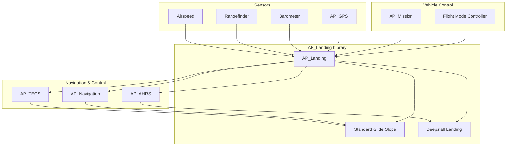
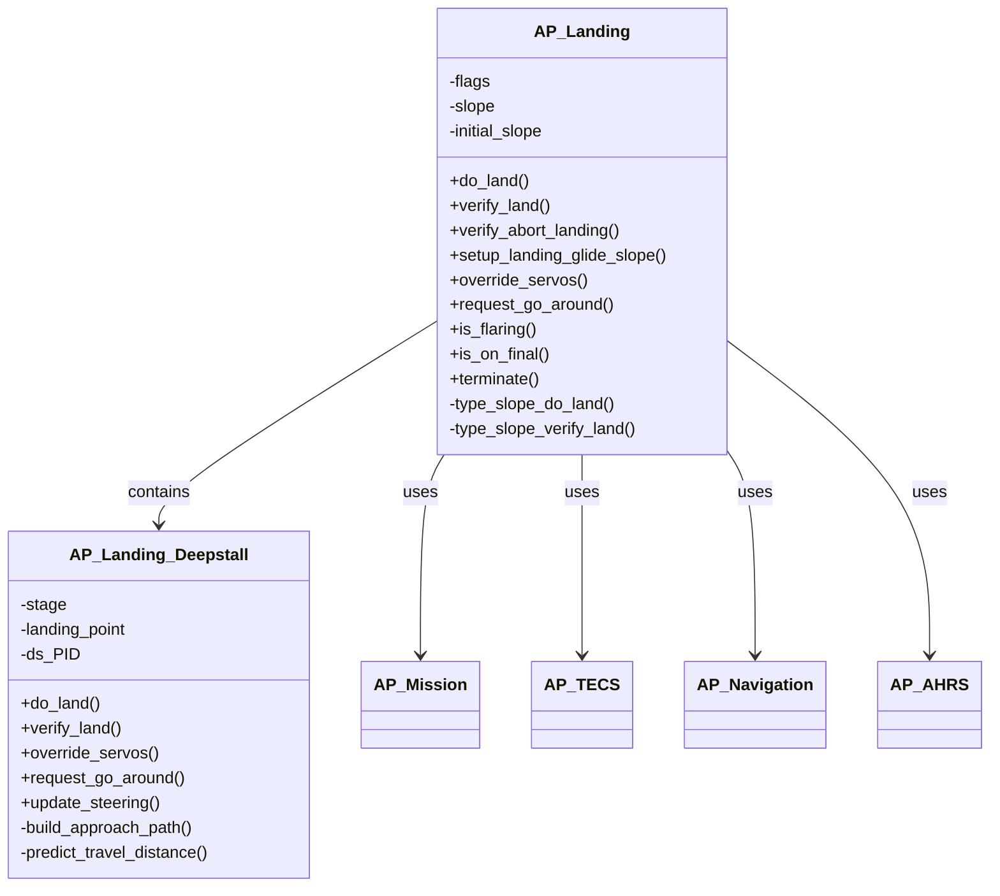
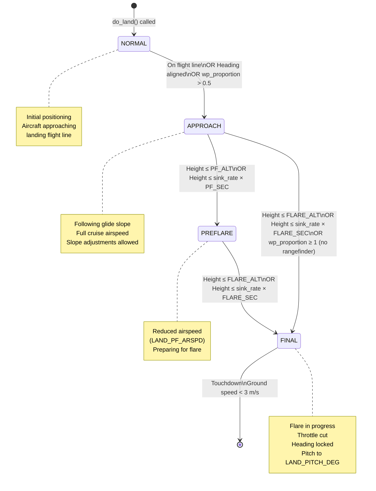
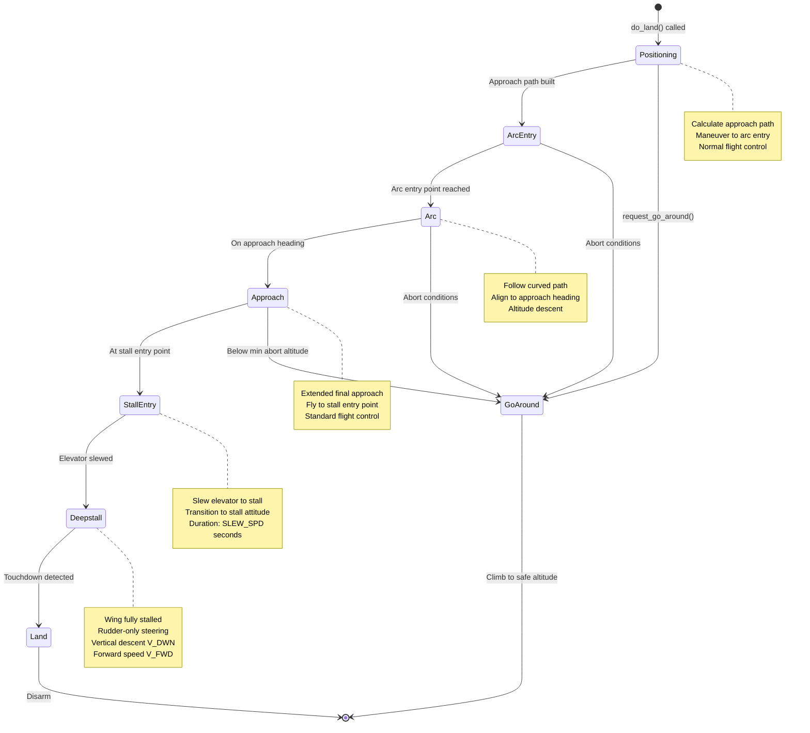
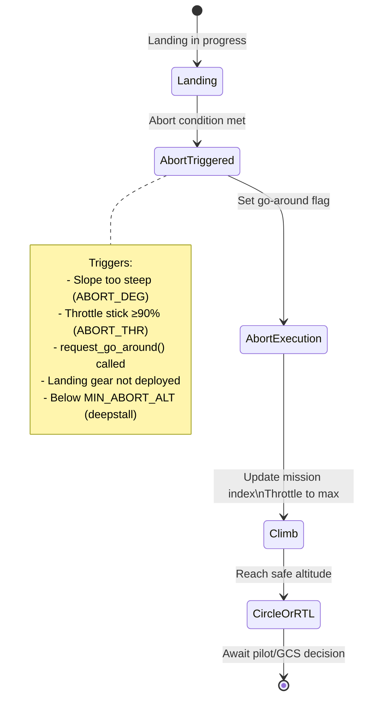

# AP_Landing Library


## Table of Contents
- [Overview](#overview)
- [Architecture](#architecture)
- [Landing Types](#landing-types)
  - [Standard Glide Slope Landing](#standard-glide-slope-landing)
  - [Deepstall Landing](#deepstall-landing)
- [Landing Sequence State Machine](#landing-sequence-state-machine)
- [Approach Patterns](#approach-patterns)
- [Flare Logic](#flare-logic)
- [Touchdown Detection](#touchdown-detection)
- [Abort Procedures](#abort-procedures)
- [Precision Landing Integration](#precision-landing-integration)
- [Configuration Parameters](#configuration-parameters)
- [API Reference](#api-reference)
- [Integration Examples](#integration-examples)
- [Safety Considerations](#safety-considerations)
- [Testing](#testing)

## Overview

The AP_Landing library provides comprehensive autonomous landing capabilities for fixed-wing aircraft in ArduPlane. It manages the complete landing sequence from approach through touchdown, implementing multiple landing algorithms optimized for different aircraft configurations and operational requirements.

**Source Files**: `/libraries/AP_Landing/`
- `AP_Landing.h` - Main landing class interface
- `AP_Landing.cpp` - Core landing logic and parameter definitions
- `AP_Landing_Slope.cpp` - Standard glide slope landing implementation
- `AP_Landing_Deepstall.h` - Deepstall landing interface
- `AP_Landing_Deepstall.cpp` - Deepstall landing implementation

### Key Features

- **Multiple Landing Types**: Standard glide slope and deepstall landing algorithms
- **Adaptive Slope Management**: Dynamic approach slope adjustment based on rangefinder data
- **Flare Control**: Altitude and time-based flare triggering with configurable parameters
- **Pre-flare Stage**: Airspeed reduction phase before final flare
- **Touchdown Detection**: Ground contact detection with automatic disarm
- **Abort Capability**: Go-around procedures with configurable triggers
- **Rangefinder Integration**: Terrain-following approach with barometric drift compensation
- **Wind Compensation**: Headwind adjustment for landing airspeed
- **Precision Landing**: Integration with precision landing systems for accurate touchdown
- **Ground Steering**: Post-touchdown directional control until full stop

### Safety-Critical Functions

> **Warning**: This library implements safety-critical landing functions. All modifications must be thoroughly tested in SITL before hardware validation.

The AP_Landing library handles several safety-critical operations:
- Final approach guidance and altitude management
- Flare initiation and execution
- Touchdown detection and motor shutdown
- Landing abort decision-making
- Slope recalculation for terrain avoidance

## Architecture

The AP_Landing library is designed as a high-level landing controller that coordinates with multiple subsystems to execute autonomous landings safely and accurately.

### System Architecture



**Source**: `/libraries/AP_Landing/AP_Landing.h:28-217`

### Class Hierarchy



**Source**: `/libraries/AP_Landing/AP_Landing.h:28-217`, `/libraries/AP_Landing/AP_Landing_Deepstall.h:30-112`

### Data Flow

The landing sequence follows this data flow pattern:

1. **Mission Command Reception**: `do_land()` receives MAV_CMD_NAV_LAND from mission
2. **State Initialization**: Landing type selected, initial slope calculated
3. **Continuous Verification**: `verify_land()` called at main loop rate
4. **Sensor Integration**: Height from rangefinder/barometer, position from GPS
5. **Stage Transitions**: NORMAL → APPROACH → PREFLARE → FINAL
6. **Control Updates**: Commands sent to TECS for throttle/pitch, Navigation for heading
7. **Touchdown Detection**: Ground contact detected, motors disarmed
8. **Completion**: Landing statistics logged, servos neutralized

### Integration Points

The AP_Landing library integrates with the vehicle through function callbacks:

**Source**: `/libraries/AP_Landing/AP_Landing.h:32-37`

```cpp
// Function callbacks for vehicle integration
FUNCTOR_TYPEDEF(set_target_altitude_proportion_fn_t, void, const Location&, float);
FUNCTOR_TYPEDEF(constrain_target_altitude_location_fn_t, void, const Location&, const Location&);
FUNCTOR_TYPEDEF(adjusted_altitude_cm_fn_t, int32_t);
FUNCTOR_TYPEDEF(adjusted_relative_altitude_cm_fn_t, int32_t);
FUNCTOR_TYPEDEF(disarm_if_autoland_complete_fn_t, void);
FUNCTOR_TYPEDEF(update_flight_stage_fn_t, void);
```

These callbacks allow the landing library to:
- Set altitude targets proportionally along the landing path
- Constrain altitude calculations for terrain following
- Query adjusted altitude measurements accounting for home altitude
- Trigger automatic disarm after landing completion
- Update flight stage flags for mode-specific behavior

## Landing Types

The AP_Landing library supports two distinct landing algorithms, selectable via the `LAND_TYPE` parameter.

**Source**: `/libraries/AP_Landing/AP_Landing.h:52-59`

```cpp
enum Landing_Type {
    TYPE_STANDARD_GLIDE_SLOPE = 0,
#if HAL_LANDING_DEEPSTALL_ENABLED
    TYPE_DEEPSTALL = 1,
#endif
};
```

### Standard Glide Slope Landing

The standard glide slope landing (TYPE_STANDARD_GLIDE_SLOPE) is the default and most widely used landing algorithm. It provides a controlled descent along a calculated glide slope from the approach waypoint to the landing point.

#### Glide Slope Calculation

The approach slope is calculated based on waypoint geometry and configured parameters:

**Source**: `/libraries/AP_Landing/AP_Landing.h:138-139`

```cpp
// Calculated approach slope: 
// slope = ((prev_WP_loc.alt - next_WP_loc.alt)*0.01f - flare_sec * sink_rate) / prev_WP_loc.get_distance(next_WP_loc)
```

**Slope Components**:
- **Altitude Change**: Difference between approach waypoint and landing point
- **Flare Compensation**: Reduces slope to account for altitude lost during flare (`flare_sec * sink_rate`)
- **Horizontal Distance**: Ground distance between waypoints

#### Slope Stages

**Source**: `/libraries/AP_Landing/AP_Landing.h:181-186`

The standard glide slope landing progresses through four distinct stages:

```cpp
enum class SlopeStage {
    NORMAL = 0,      // Initial stage, approaching the landing flight line
    APPROACH = 1,    // On approach, following glide slope
    PREFLARE = 2,    // Pre-flare stage with reduced airspeed
    FINAL = 3        // Final flare to touchdown
};
```

**Stage Transition Logic** (`/libraries/AP_Landing/AP_Landing_Slope.cpp:64-73`):

1. **NORMAL → APPROACH**: Triggered when:
   - Previous command was MAV_CMD_NAV_LOITER_TO_ALT, OR
   - Heading aligned (<10° error) AND on flight line (<5m crosstrack) AND wp_proportion ≥ 0, OR
   - Heading aligned AND below previous waypoint altitude AND wp_proportion > 0.15, OR
   - wp_proportion > 0.5 (past halfway point)

2. **APPROACH → PREFLARE**: Triggered when (`/libraries/AP_Landing/AP_Landing_Slope.cpp:139-144`):
   - `LAND_PF_ARSPD` > 0 (pre-flare enabled), AND
   - Height ≤ `LAND_PF_ALT`, OR
   - Height ≤ sink_rate × `LAND_PF_SEC`

3. **APPROACH/PREFLARE → FINAL**: Triggered when (`/libraries/AP_Landing/AP_Landing_Slope.cpp:101-104`):
   - On approach stage AND height ≤ `LAND_FLARE_ALT`, OR
   - On approach stage AND height ≤ sink_rate × `LAND_FLARE_SEC` AND wp_proportion > 0.5, OR
   - No valid rangefinder AND wp_proportion ≥ 1 (passed landing point), OR
   - Crash detected (sink_rate < 0.2 m/s AND not flying)

#### Rangefinder-Based Slope Adjustment

When rangefinder landing is enabled (`RNGFND_LANDING=1`), the landing library can dynamically adjust the approach slope to compensate for barometric drift and terrain variations.

**Shallow Threshold** (`LAND_SLOPE_RCALC`): When rangefinder indicates aircraft is lower than intended slope by more than this threshold, slope is recalculated to be shallower, providing smoother terrain following.

**Steep Threshold** (`LAND_ABORT_DEG`): When slope recalculation results in a slope steeper than the original by this many degrees, triggers automatic go-around to prevent dangerous steep approach. Only triggers once per landing attempt.

**Source**: `/libraries/AP_Landing/AP_Landing.cpp:29-45`

### Deepstall Landing

Deepstall landing (TYPE_DEEPSTALL) is an advanced landing technique for aircraft capable of controlled deep stall flight. In a deepstall, the aircraft maintains high angle of attack with the wing fully stalled, descending vertically at a controlled rate while maintaining forward motion.

**Availability**: Deepstall landing is only available when `HAL_LANDING_DEEPSTALL_ENABLED` is defined at compile time.

**Source**: `/libraries/AP_Landing/AP_Landing_Deepstall.h:30-112`

#### Deepstall Physics Model

The deepstall landing uses a physics-based model to predict aircraft behavior in stalled flight:

**Travel Distance Prediction**:
```
predicted_distance = slope_a × wind_component + slope_b
```

Where:
- `slope_a` (`LAND_DS_SLOPE_A`): Wind sensitivity coefficient
- `slope_b` (`LAND_DS_SLOPE_B`): Base travel distance
- `wind_component`: Headwind/tailwind speed affecting horizontal drift

**Vertical Descent**:
- `LAND_DS_V_DWN`: Configured vertical descent rate in stall (m/s)
- Typical range: 2-5 m/s depending on aircraft characteristics

**Forward Speed**:
- `LAND_DS_V_FWD`: Forward groundspeed during deepstall (m/s)
- Typically 1-3 m/s for most aircraft configurations

#### Deepstall Stages

**Source**: `/libraries/AP_Landing/AP_Landing_Deepstall.h:64`

```cpp
DEEPSTALL_STAGE stage;
```

The deepstall landing progresses through multiple stages (defined in AP_Landing_config.h):
1. **Positioning**: Aircraft maneuvers to approach path
2. **Arc Entry**: Begins final approach arc
3. **Arc**: Follows curved path to landing heading
4. **Approach**: Flies extended approach line
5. **Stall Entry**: Initiates deep stall by deflecting elevator
6. **Deepstall**: Maintains stall attitude, rudder-only steering
7. **Land**: Touchdown and ground handling

#### Deepstall Control

**Elevator Control** (`/libraries/AP_Landing/AP_Landing_Deepstall.cpp:80-86`):
- `LAND_DS_ELEV_PWM`: Full deflection elevator PWM (typically 1200-1400 µs for up-elevator)
- `LAND_DS_SLEW_SPD`: Rate of elevator slew to stall position (seconds)
- Gradual elevator deflection prevents abrupt pitch changes

**Steering Control**:
- **L1 Navigation**: Custom L1 controller for approach guidance
  - `LAND_DS_L1`: L1 period for lateral navigation (seconds)
  - `LAND_DS_L1_I`: Integrator gain for crosstrack correction
  - `LAND_DS_L1_TCON`: Time constant for L1 response
- **Deepstall PID**: Rudder-based yaw rate control during stalled flight
  - `LAND_DS_P`, `LAND_DS_I`, `LAND_DS_D`: PID gains
  - `LAND_DS_IMAX`: Integrator limit
- **Yaw Rate Limiting**: `LAND_DS_YAW_LIM` limits commanded yaw rate (deg/s)

**Airspeed Handoff** (`/libraries/AP_Landing/AP_Landing_Deepstall.cpp:88-102`):
- `LAND_DS_ARSP_MAX`: Maximum airspeed for deepstall steering control (m/s)
- `LAND_DS_ARSP_MIN`: Minimum airspeed for full control authority (m/s)
- Control authority scales linearly between these speeds to ensure smooth transition

#### Approach Path Generation

The deepstall algorithm automatically generates an approach path based on:

**Source**: `/libraries/AP_Landing/AP_Landing_Deepstall.h:106`

```cpp
void build_approach_path(bool use_current_heading);
```

1. **Landing Point**: Target touchdown location from mission
2. **Extended Approach**: Straight-in approach leg extended from landing point
   - Length: `LAND_DS_APP_EXT` (typically 50-200m)
3. **Arc Path**: Curved transition from current position to approach leg
4. **Breakout Point**: Position where aircraft must commit to landing

The approach path is calculated considering:
- Current wind conditions
- Predicted stall travel distance
- Required altitude at stall entry
- Geometric constraints for safe maneuvering

## Landing Sequence State Machine

The landing sequence is managed through a state machine that coordinates the transition from cruise flight through touchdown.

### Standard Glide Slope State Machine



**Source**: `/libraries/AP_Landing/AP_Landing_Slope.cpp:56-145`

### State-Specific Behaviors

#### NORMAL Stage
- **Objective**: Maneuver to landing approach flight line
- **Navigation**: L1 navigation to next waypoint
- **Altitude**: Following TECS altitude target
- **Throttle**: Normal throttle control
- **Exit Conditions**: See transition logic above

#### APPROACH Stage  
- **Objective**: Descend along calculated glide slope to landing point
- **Navigation**: L1 navigation with 200m lookahead beyond landing point
- **Altitude**: Constrained to glide slope with TECS
- **Throttle**: Reduced progressively as altitude decreases
- **Slope Updates**: Dynamic slope recalculation if rangefinder enabled
- **Monitoring**: Continuous check for flare triggers

**Source**: `/libraries/AP_Landing/AP_Landing_Slope.cpp:147-153`

```cpp
// Keep L1 navigation waypoint 200m ahead during landing
// This prevents sudden turns if we overshoot the landing point
```

#### PREFLARE Stage
- **Objective**: Reduce airspeed before final flare
- **Navigation**: Same as APPROACH
- **Altitude**: Continue on glide slope
- **Airspeed**: Reduced to `LAND_PF_ARSPD`
- **Purpose**: Minimizes touchdown speed and improves flare effectiveness
- **Duration**: Typically 3-6 seconds based on `LAND_PF_SEC`

#### FINAL Stage (Flare)
- **Objective**: Execute flare maneuver and achieve soft touchdown
- **Navigation**: Heading locked (no more lateral navigation)
- **Altitude**: Pitch up to arrest descent rate
- **Throttle**: Cut to zero (or `THR_MIN` if `LAND_OPTIONS` bit 0 set)
- **Pitch**: Commanded to `LAND_PITCH_DEG` minimum
- **Sink Rate**: TECS attempts to achieve `TECS_LAND_SINK` rate
- **Roll**: Constrained to prevent wingtip strikes
- **Ground Steering**: Enabled when airspeed drops below threshold

**Source**: `/libraries/AP_Landing/AP_Landing_Slope.cpp:101-128`

### Deepstall State Machine



**Source**: `/libraries/AP_Landing/AP_Landing_Deepstall.cpp`

### Abort State Machine

Both landing types support abort (go-around) procedures:



**Source**: `/libraries/AP_Landing/AP_Landing.cpp:287-310`, `/libraries/AP_Landing/AP_Landing_Slope.cpp:44-50`

## Approach Patterns

### Standard Glide Slope Geometry

The standard glide slope approach follows a straight-line descent from the previous waypoint (approach point) to the landing waypoint.

#### Geometric Relationships

```
Altitude Difference (m) = (prev_WP.alt - landing_WP.alt) / 100
Horizontal Distance (m) = prev_WP.get_distance(landing_WP)
Flare Compensation (m) = LAND_FLARE_SEC × sink_rate

Effective Altitude Change = Altitude Difference - Flare Compensation
Glide Slope Angle = atan(Effective Altitude Change / Horizontal Distance)
```

**Example Calculation**:
```
Previous WP: 100m AGL
Landing WP: 0m AGL  
Distance: 1000m
LAND_FLARE_SEC: 2s
Sink Rate: 2 m/s

Effective Altitude = 100m - (2s × 2 m/s) = 96m
Glide Slope = atan(96/1000) = 5.49°
```

**Source**: `/libraries/AP_Landing/AP_Landing.h:138-139`

#### Waypoint Proportion

The landing library tracks progress along the landing path using `wp_proportion`:

```
wp_proportion = distance_from_prev_WP / total_distance
```

- **wp_proportion = 0.0**: At previous waypoint (approach point)
- **wp_proportion = 0.5**: Halfway along approach
- **wp_proportion = 1.0**: At landing waypoint
- **wp_proportion > 1.0**: Past landing point (overshoot)

The waypoint proportion is used for:
- Stage transition logic
- Flare trigger conditions (requires wp_proportion > 0.5)
- Abort detection if no rangefinder available

#### Altitude Target Calculation

The landing library continuously updates altitude targets to maintain the glide slope:

```cpp
// Altitude at current position along slope
target_altitude = prev_WP.alt - (slope × horizontal_distance_from_prev_WP)

// Apply terrain adjustments if rangefinder available
target_altitude += target_altitude_offset_cm / 100.0f
```

### Approach Line Acquisition

The landing sequence provides flexible approach line acquisition:

**Source**: `/libraries/AP_Landing/AP_Landing_Slope.cpp:64-73`

1. **From Loiter**: After MAV_CMD_NAV_LOITER_TO_ALT, immediately enters APPROACH stage
2. **Direct Entry**: When lined up with heading and on flight line
3. **Below Approach Altitude**: If below previous WP and heading aligned
4. **Distance-Based**: Automatic entry when wp_proportion > 0.5

This flexibility allows various approach patterns:
- Standard rectangular pattern with base and final legs
- Straight-in approach from cruise
- Loiter-to-altitude then straight-in
- Teardrop approach pattern

### Deepstall Approach Path

The deepstall approach path is automatically calculated based on predicted aircraft behavior in stalled flight.

**Source**: `/libraries/AP_Landing/AP_Landing_Deepstall.h:106-107`

#### Path Components

1. **Landing Point**: Target touchdown location (from MAV_CMD_NAV_LAND)

2. **Extended Approach Line**: 
   - Extends from landing point in reverse of landing direction
   - Length: `LAND_DS_APP_EXT` (default 50m)
   - Aircraft flies this line at normal airspeed before initiating stall

3. **Predicted Touchdown Point**:
   - Calculated from stall entry position
   - Accounts for forward and vertical velocities during stall
   - Wind compensation applied

4. **Arc Entry and Exit**:
   - Curved path segment to align with approach line
   - Radius based on aircraft turn performance
   - Ensures smooth transition to final heading

#### Wind Compensation

**Source**: `/libraries/AP_Landing/AP_Landing_Deepstall.h:107`

```cpp
float predict_travel_distance(const Vector3f wind, const float height, const bool print);
```

The deepstall algorithm predicts horizontal travel during descent:

```
travel_distance = slope_a × wind_component + slope_b
stall_duration = height / V_DWN
horizontal_drift = travel_distance + (wind_ground_component × stall_duration)
```

Where:
- `wind_component`: Headwind (negative) or tailwind (positive) affecting forward speed
- `V_DWN`: Configured vertical descent rate
- `wind_ground_component`: Crosswind and along-track wind effect

The approach path is positioned such that predicted touchdown matches the landing point.

## Flare Logic

The flare maneuver is critical for achieving a soft touchdown with minimal vertical speed. The AP_Landing library provides multiple flare trigger mechanisms that work together to ensure reliable flare initiation.

**Source**: `/libraries/AP_Landing/AP_Landing_Slope.cpp:76-104`

### Flare Trigger Conditions

The flare is triggered when ANY of the following conditions are met:

#### 1. Altitude-Based Trigger

```
height_above_landing_point ≤ LAND_FLARE_ALT
```

- **Parameter**: `LAND_FLARE_ALT` (meters)
- **Default**: 3.0m
- **Source**: Rangefinder (if available and healthy), else barometric altitude
- **Use Case**: Backup trigger, especially for short approaches
- **Limitation**: Requires approach stage active to prevent premature flare during maneuvering

**Source**: `/libraries/AP_Landing/AP_Landing.cpp:56-63`

#### 2. Time-Based Trigger (Primary)

```
height_above_landing_point ≤ (sink_rate × LAND_FLARE_SEC)
```

- **Parameter**: `LAND_FLARE_SEC` (seconds)
- **Default**: 2.0 seconds
- **Calculation**: Vertical time to ground based on current descent rate
- **Advantage**: Adapts to actual descent rate, providing consistent flare timing
- **Requirement**: Only triggers after wp_proportion > 0.5 to prevent premature flare
- **Note**: Set to 0 to disable time-based trigger and use altitude-only

**Source**: `/libraries/AP_Landing/AP_Landing.cpp:65-72`

**Example**:
```
Sink rate: 2.5 m/s
LAND_FLARE_SEC: 2.0s
Flare trigger height: 2.5 × 2.0 = 5.0m
```

#### 3. Overshoot Protection

```
(wp_proportion ≥ 1.0) AND (rangefinder invalid or unhealthy)
```

- **Purpose**: Prevents motor continuing after landing if barometric drift occurs
- **Trigger**: Automatically flares when passing landing point without rangefinder data
- **Safety**: Ensures motor cutoff even if altitude estimate is incorrect

#### 4. Crash Detection

```
(crash_detection_enabled) AND (sink_rate < 0.2 m/s) AND (not flying)
```

- **Purpose**: Emergency flare trigger if unexpected ground contact detected
- **Criteria**: Very low sink rate combined with flight detection loss
- **Safety**: Ensures motor shutdown in crash scenarios

**Source**: `/libraries/AP_Landing/AP_Landing_Slope.cpp:95-104`

### Flare Execution

Once flare is triggered, the following control changes are implemented:

**Source**: `/libraries/AP_Landing/AP_Landing_Slope.cpp:106-128`

#### Heading Lock

```cpp
// Navigation stops updating, heading is locked
nav_controller->update_heading_hold(current_heading);
```

Lateral navigation ceases; aircraft maintains current heading through touchdown. This prevents sudden roll commands that could cause wingtip strikes.

#### Throttle Control

Default behavior (bit 0 of LAND_OPTIONS = 0):
```cpp
throttle = 0.0f; // Motor stopped
```

Optional behavior (bit 0 of LAND_OPTIONS = 1):
```cpp
throttle = THR_MIN; // Honor minimum throttle setting
```

**Source**: `/libraries/AP_Landing/AP_Landing.h:62-65`, `/libraries/AP_Landing/AP_Landing.cpp:142-147`

Use `LAND_OPTIONS` bit 0 for aircraft requiring minimum throttle for alternator/avionics power.

#### Pitch Control

The pitch controller transitions from altitude-hold to pitch-hold:

```cpp
target_pitch = max(LAND_PITCH_DEG, pitch_from_TECS);
```

- Minimum pitch set by `LAND_PITCH_DEG` (typically 0-10° for tricycle gear)
- TECS attempts to achieve `TECS_LAND_SINK` descent rate
- Actual pitch may exceed minimum if higher pitch needed for sink rate control
- Flare effectiveness scaled by `LAND_FLARE_AIM` (0-100%)

**Source**: `/libraries/AP_Landing/AP_Landing.cpp:48-54`

#### Roll Limiting

During flare, roll is progressively limited to prevent wingtip strikes:

**Source**: `/libraries/AP_Landing/AP_Landing.h:90`

```cpp
int32_t constrain_roll(const int32_t desired_roll_cd, const int32_t level_roll_limit_cd);
```

Roll limits are tightened based on height and speed to ensure wings-level touchdown.

### Pre-Flare Stage

The pre-flare stage provides an intermediate phase for airspeed reduction before the final flare:

**Source**: `/libraries/AP_Landing/AP_Landing.cpp:74-99`

#### Pre-Flare Triggers

Activated when `LAND_PF_ARSPD` > 0 and either:

1. **Altitude trigger**: `height ≤ LAND_PF_ALT`
2. **Time trigger**: `height ≤ (sink_rate × LAND_PF_SEC)`

#### Pre-Flare Behavior

- **Airspeed**: Reduced to `LAND_PF_ARSPD`
- **Throttle**: Adjusted by TECS to achieve target airspeed
- **Navigation**: Continues along approach path (not locked)
- **Pitch**: Controlled by TECS for glide slope maintenance
- **Duration**: Typically 3-6 seconds

**Benefits**:
- Reduces touchdown speed for safer landing
- Improves flare effectiveness at lower airspeeds
- Provides smoother transition to final flare
- Reduces landing rollout distance

## Touchdown Detection

Touchdown detection determines when the aircraft has made ground contact and it is safe to disarm.

**Source**: `/libraries/AP_Landing/AP_Landing_Slope.cpp:130-138`

### Detection Criteria

Ground contact is confirmed when:

```cpp
ground_speed < 3.0 m/s
```

At this speed threshold:
- Aerodynamic control surfaces have minimal authority
- Ground friction dominates motion
- Safe to reload flight parameters
- Preparation for automatic disarm

### Post-Touchdown Actions

#### 1. Parameter Reload

**Source**: `/libraries/AP_Landing/AP_Landing_Slope.cpp:132-137`

```cpp
// Reload parameters that may have been modified for landing
aparm.airspeed_cruise.load();
aparm.min_groundspeed.load();
aparm.throttle_cruise.load();
```

This allows separate landing-specific parameters to be used (e.g., lower cruise speed for approach) without affecting post-landing flight if a go-around is needed.

#### 2. Automatic Disarm

**Source**: `/libraries/AP_Landing/AP_Landing.cpp:110-117`

After touchdown, automatic disarm occurs based on `LAND_DISARMDELAY`:

```
time_on_ground > LAND_DISARMDELAY seconds
```

- **Parameter**: `LAND_DISARMDELAY` (seconds)
- **Default**: 20 seconds
- **Range**: 0-127 seconds
- **Disable**: Set to 0 to prevent automatic disarm

#### 3. Servo Neutral

**Source**: `/libraries/AP_Landing/AP_Landing.cpp:119-124`

After automatic disarm, servos can be neutralized based on `LAND_THEN_NEUTRL`:

- **Value 0**: Disabled (servos hold last position)
- **Value 1**: Servos to neutral PWM (typically 1500µs)
- **Value 2**: Servos to zero PWM (minimum signal)

**Purpose**: Prevents servo strain if aircraft lands inverted or at extreme angle.

### Ground Steering

Between touchdown and disarm, ground steering is automatically enabled:

**Source**: `/libraries/AP_Landing/AP_Landing.h:84`

```cpp
bool is_ground_steering_allowed(void) const;
```

Ground steering provides:
- Nose/tail wheel steering for directional control
- Differential braking (if configured)
- Rudder coordination for runway tracking

Ground steering remains active until disarm or manual mode change.

## Abort Procedures

The AP_Landing library provides multiple mechanisms for aborting a landing and executing a go-around.

**Source**: `/libraries/AP_Landing/AP_Landing.h:80,114`

```cpp
bool request_go_around(void);
bool is_commanded_go_around(void) const;
```

### Abort Triggers

#### 1. Steep Slope Abort (Automatic)

**Source**: `/libraries/AP_Landing/AP_Landing.cpp:38-45`

When rangefinder-based slope adjustment is active:

```
recalculated_slope_angle - original_slope_angle > LAND_ABORT_DEG
```

- **Parameter**: `LAND_ABORT_DEG` (degrees)
- **Default**: 0 (disabled)
- **Range**: 0-90 degrees
- **Behavior**: 
  - Automatically triggers go-around if slope becomes too steep
  - Only triggers once per landing attempt
  - Requires `LAND_SLOPE_RCALC` > 0
- **Safety**: Prevents dangerously steep approaches that could cause overspeed or control loss

**Example**:
```
Original mission slope: 5°
LAND_ABORT_DEG: 5°
Abort triggers if recalculated slope: >10°
```

#### 2. Throttle Stick Abort (Manual)

**Source**: `/libraries/AP_Landing/AP_Landing.cpp:126-131`

Pilot can abort landing with throttle stick input:

```
throttle_input ≥ 90% AND LAND_ABORT_THR = 1
```

- **Parameter**: `LAND_ABORT_THR` (0=Disabled, 1=Enabled)
- **Default**: 0 (disabled)
- **Compatibility**: Works with or without stick mixing enabled
- **Response**: Immediate abort, mission index incremented

#### 3. Landing Gear Check

**Source**: `/libraries/AP_Landing/AP_Landing_Slope.cpp:119-127`

If landing gear is configured:

```cpp
#if AP_LANDINGGEAR_ENABLED
if (entering_FINAL_stage AND landing_gear_not_deployed) {
    request_go_around();
    // Critical warning sent to GCS
}
#endif
```

Automatically aborts if landing gear not down and locked before flare.

#### 4. Deepstall Minimum Altitude

**Source**: Deepstall configuration

For deepstall landings, abort is prevented below minimum safe altitude:

```
current_altitude < LAND_DS_MIN_ABORT_ALT
```

Once below this altitude, aircraft is committed to landing as recovery from deepstall requires altitude and time.

#### 5. External Request

Any external system can request landing abort:

```cpp
if (landing.request_go_around()) {
    // Go-around initiated
}
```

### Abort Execution

When abort is triggered:

**Source**: `/libraries/AP_Landing/AP_Landing.cpp:287-310`

1. **Flag Set**: `flags.commanded_go_around = true`
2. **Stage Reset**: Landing stages reset to initial state
3. **Throttle Restore**: Throttle control returned to normal
4. **Mission Advance**: Mission index typically advances to next waypoint or RTL
5. **Altitude Target**: Climb to safe altitude
6. **Navigation**: Heading hold toward abort waypoint

**Standard Glide Slope Abort** (`/libraries/AP_Landing/AP_Landing_Slope.cpp:44-50`):
```cpp
void type_slope_verify_abort_landing(const Location &prev_WP_loc, Location &next_WP_loc, 
                                     bool &throttle_suppressed) {
    throttle_suppressed = false;  // Restore throttle
    nav_controller->update_heading_hold(prev_WP_loc.get_bearing_to(next_WP_loc));
}
```

### Go-Around Prevention (One-Shot)

**Source**: `/libraries/AP_Landing/AP_Landing.h:192`

```cpp
bool has_aborted_due_to_slope_recalc:1;
```

The automatic steep-slope abort only triggers once per landing attempt. After one abort:
- Flag `has_aborted_due_to_slope_recalc` is set
- Subsequent steep slope conditions will NOT trigger another abort
- Prevents abort oscillation
- Aircraft will continue landing on subsequent attempt even if slope steep

To re-enable automatic abort, landing must be fully reset (e.g., return to previous waypoint or RTL).

## Precision Landing Integration

The AP_Landing library is designed to integrate with precision landing systems for accurate touchdown at designated points.

### Precision Landing Support

While the core AP_Landing library provides the landing state machine and control logic, precision landing integration occurs through:

1. **Position Updates**: Precision landing system provides refined position estimates
2. **Target Adjustment**: Landing point can be dynamically adjusted based on precision sensors
3. **Altitude Reference**: Precision altitude used for flare triggers when available
4. **Compatibility**: Works with both standard glide slope and deepstall landing types

### Integration Points

The landing library accesses precision landing data through:

- **AP_GPS**: GPS-based precision landing (RTK)
- **Rangefinder**: Accurate height-above-ground for flare
- **Beacon Systems**: IR-LOCK and other beacon-based systems (integration through vehicle code)

### Rangefinder Landing Mode

**Parameter**: `RNGFND_LANDING` (set in AP_RangeFinder configuration)

When enabled:
- Rangefinder provides primary altitude reference below `RNGFND_LANDING_ALT`
- Barometric altitude used above this threshold
- Enables automatic slope recalculation for terrain following
- Provides accurate flare trigger even with barometric drift

**Benefits**:
- Compensates for barometric pressure changes
- Adapts to terrain variations
- Smoother approach over obstacles
- More consistent flare altitude

## Configuration Parameters

The AP_Landing library provides extensive configuration through parameters. All parameters use the `LAND_` prefix.

**Source**: `/libraries/AP_Landing/AP_Landing.cpp:27-183`

### Core Landing Parameters

#### LAND_TYPE
- **Description**: Auto-landing type selection
- **Values**: 
  - 0 = Standard Glide Slope (default)
  - 1 = Deepstall (requires HAL_LANDING_DEEPSTALL_ENABLED)
- **Default**: 0
- **User Level**: Standard

**Source**: `/libraries/AP_Landing/AP_Landing.cpp:167-172`

### Glide Slope Parameters

#### LAND_SLOPE_RCALC
- **Description**: Landing slope re-calculation threshold
- **Units**: meters
- **Range**: 0-5m
- **Increment**: 0.5m
- **Default**: 2.0m
- **User Level**: Advanced
- **Function**: When rangefinder indicates altitude is lower than intended slope by more than this threshold, triggers slope recalculation to make approach shallower. Set to 0 to disable recalculation.
- **Usage**: Recommended value 2m for terrain following
- **Note**: Requires `RNGFND_LANDING=1`

**Source**: `/libraries/AP_Landing/AP_Landing.cpp:29-36`

#### LAND_ABORT_DEG
- **Description**: Landing auto-abort slope threshold
- **Units**: degrees
- **Range**: 0-90°
- **Increment**: 0.1°
- **Default**: 0 (disabled)
- **User Level**: Advanced
- **Function**: If slope recalculation results in a slope steeper than original by this many degrees, automatically triggers go-around. Only activates once per landing attempt.
- **Safety**: Prevents dangerous steep approaches
- **Requirement**: Requires `LAND_SLOPE_RCALC` > 0

**Source**: `/libraries/AP_Landing/AP_Landing.cpp:38-45`

### Flare Parameters

#### LAND_PITCH_DEG
- **Description**: Landing pitch angle during flare
- **Units**: degrees
- **Range**: -20° to 20°
- **Increment**: 10°
- **Default**: 0°
- **User Level**: Advanced
- **Function**: Minimum pitch during final flare stage. Actual pitch may be higher if needed for sink rate control. Adjust based on landing gear type:
  - Tricycle gear: 0-5°
  - Tail dragger: 5-15°
  - Belly landing: -5° to 0°

**Source**: `/libraries/AP_Landing/AP_Landing.cpp:47-54`

#### LAND_FLARE_ALT
- **Description**: Landing flare altitude trigger
- **Units**: meters
- **Range**: 0-30m
- **Increment**: 0.1m
- **Default**: 3.0m
- **User Level**: Advanced
- **Function**: Altitude above landing point at which to initiate flare. Secondary to `LAND_FLARE_SEC` time-based trigger.
- **Note**: Requires approach stage active to prevent premature flare

**Source**: `/libraries/AP_Landing/AP_Landing.cpp:56-63`

#### LAND_FLARE_SEC
- **Description**: Landing flare time trigger
- **Units**: seconds
- **Range**: 0-10s
- **Increment**: 0.1s
- **Default**: 2.0s
- **User Level**: Advanced
- **Function**: Vertical time before ground at which to initiate flare, calculated from current height and sink rate. This is the preferred flare trigger method. Set to 0 to use altitude-only triggering.
- **Calculation**: Flare triggers when `height ≤ sink_rate × LAND_FLARE_SEC`

**Source**: `/libraries/AP_Landing/AP_Landing.cpp:65-72`

#### LAND_FLARE_AIM
- **Description**: Flare aim point adjustment percentage
- **Units**: percent
- **Range**: 0-100%
- **Increment**: 1%
- **Default**: 50%
- **User Level**: Advanced
- **Function**: Controls how much the aim point is moved to compensate for altitude lost during flare. 100% assumes instant achievement of `TECS_LAND_SINK` rate. Tune based on observed touchdown point:
  - Landing short: Decrease value
  - Landing long: Increase value

**Source**: `/libraries/AP_Landing/AP_Landing.cpp:149-156`

### Pre-Flare Parameters

#### LAND_PF_ALT
- **Description**: Landing pre-flare altitude trigger
- **Units**: meters
- **Range**: 0-30m
- **Increment**: 0.1m
- **Default**: 10.0m
- **User Level**: Advanced
- **Function**: Altitude to trigger pre-flare stage where `LAND_PF_ARSPD` controls airspeed. Works like `LAND_FLARE_ALT` but higher. Disabled when `LAND_PF_ARSPD` is 0.

**Source**: `/libraries/AP_Landing/AP_Landing.cpp:74-81`

#### LAND_PF_SEC
- **Description**: Landing pre-flare time trigger
- **Units**: seconds
- **Range**: 0-10s
- **Increment**: 0.1s
- **Default**: 6.0s
- **User Level**: Advanced
- **Function**: Vertical time to ground to trigger pre-flare stage. Works like `LAND_FLARE_SEC` but earlier. Disabled when `LAND_PF_ARSPD` is 0.

**Source**: `/libraries/AP_Landing/AP_Landing.cpp:83-90`

#### LAND_PF_ARSPD
- **Description**: Landing pre-flare airspeed target
- **Units**: m/s
- **Range**: 0-30 m/s
- **Increment**: 0.1 m/s
- **Default**: 0 (disabled)
- **User Level**: Advanced
- **Function**: Desired airspeed during pre-flare stage. Reduces airspeed before final flare for safer touchdown. Set to 0 to disable pre-flare stage.

**Source**: `/libraries/AP_Landing/AP_Landing.cpp:92-99`

### Throttle and Flap Parameters

#### LAND_THR_SLEW
- **Description**: Landing throttle slew rate
- **Units**: percent per second
- **Range**: 0-127 %/s
- **Increment**: 1 %/s
- **Default**: 0 (use THR_SLEWRATE)
- **User Level**: Standard
- **Function**: Throttle slew rate during auto landing. When zero, uses global `THR_SLEWRATE`. Values below 50 not recommended as they may cause stalls.
- **Safety**: Prevents rapid throttle changes that could destabilize approach

**Source**: `/libraries/AP_Landing/AP_Landing.cpp:101-108`

#### LAND_FLAP_PERCNT
- **Description**: Landing flap percentage
- **Units**: percent
- **Range**: 0-100%
- **Increment**: 1%
- **Default**: 0%
- **User Level**: Advanced
- **Function**: Flap deployment percentage during landing approach and flare. Set according to aircraft flap capabilities.

**Source**: `/libraries/AP_Landing/AP_Landing.cpp:133-140`

### Post-Landing Parameters

#### LAND_DISARMDELAY
- **Description**: Landing disarm delay
- **Units**: seconds
- **Range**: 0-127s
- **Increment**: 1s
- **Default**: 20s
- **User Level**: Advanced
- **Function**: Time after landing before automatic disarm. Set to 0 to disable automatic disarm.

**Source**: `/libraries/AP_Landing/AP_Landing.cpp:110-117`

#### LAND_THEN_NEUTRL
- **Description**: Set servos to neutral after landing
- **Values**:
  - 0 = Disabled (servos hold position)
  - 1 = Servos to Neutral (typically 1500µs)
  - 2 = Servos to Zero PWM
- **Default**: 0
- **User Level**: Advanced
- **Function**: After autoland and auto-disarm, neutralizes servos to prevent strain if aircraft lands at extreme angle or inverted.

**Source**: `/libraries/AP_Landing/AP_Landing.cpp:119-124`

### Abort Parameters

#### LAND_ABORT_THR
- **Description**: Landing abort using throttle
- **Values**:
  - 0 = Disabled
  - 1 = Enabled
- **Default**: 0
- **User Level**: Advanced
- **Function**: Allow pilot to abort landing by moving throttle stick to ≥90%. Works with or without stick mixing.
- **Safety**: Provides pilot override capability

**Source**: `/libraries/AP_Landing/AP_Landing.cpp:126-131`

### Advanced Options

#### LAND_OPTIONS
- **Description**: Landing options bitmask
- **Type**: Bitmask
- **Bits**:
  - Bit 0: Honor minimum throttle during flare (use THR_MIN instead of 0)
  - Bit 1: Increase target landing airspeed constraint from trim to AIRSPEED_MAX
- **Default**: 0 (all bits disabled)
- **User Level**: Advanced

**Source**: `/libraries/AP_Landing/AP_Landing.cpp:142-147`, `/libraries/AP_Landing/AP_Landing.h:62-65`

**Bit 0 (Minimum Throttle)**:
- When set: Uses `THR_MIN` during flare instead of zero throttle
- Use case: Aircraft requiring minimum throttle for alternator/avionics power
- Default behavior: Throttle cut to zero on flare

**Bit 1 (Maximum Airspeed)**:
- When set: Allows landing throttle constraint up to `AIRSPEED_MAX`
- Default behavior: Landing airspeed limited to trim airspeed
- Use case: High-performance aircraft requiring faster approach speeds

#### LAND_WIND_COMP
- **Description**: Headwind compensation when landing
- **Units**: percent
- **Range**: 0-100%
- **Increment**: 1%
- **Default**: 50%
- **User Level**: Advanced
- **Function**: Percentage of headwind speed to add to `TECS_LAND_ARSPD` target. Final airspeed still limited to `AIRSPEED_MAX`.
- **Calculation**: `target_airspeed = TECS_LAND_ARSPD + (headwind × LAND_WIND_COMP / 100)`
- **Purpose**: Maintains ground approach speed in headwinds

**Source**: `/libraries/AP_Landing/AP_Landing.cpp:158-165`

### Deepstall Parameters

Deepstall parameters use the `LAND_DS_` prefix and are only available when `HAL_LANDING_DEEPSTALL_ENABLED` is defined.

**Source**: `/libraries/AP_Landing/AP_Landing_Deepstall.cpp:34-178`

#### LAND_DS_V_FWD
- **Description**: Deepstall forward velocity
- **Units**: m/s
- **Range**: 0-20 m/s
- **Default**: 1 m/s
- **User Level**: Advanced
- **Function**: Expected forward groundspeed while in deepstall

#### LAND_DS_V_DWN
- **Description**: Deepstall downward velocity
- **Units**: m/s
- **Range**: 0-20 m/s
- **Default**: 2 m/s
- **User Level**: Advanced
- **Function**: Expected vertical descent rate during deepstall

#### LAND_DS_SLOPE_A & LAND_DS_SLOPE_B
- **Description**: Deepstall distance prediction coefficients
- **Units**: dimensionless
- **Default**: 1.0 (both)
- **User Level**: Advanced
- **Function**: Wind compensation model: `distance = SLOPE_A × wind + SLOPE_B`
- **Tuning**: Requires flight testing to match aircraft behavior

#### LAND_DS_APP_EXT
- **Description**: Deepstall approach extension
- **Units**: meters
- **Range**: 10-200m
- **Default**: 50m
- **User Level**: Advanced
- **Function**: Length of straight approach leg before stall entry

#### LAND_DS_SLEW_SPD
- **Description**: Deepstall elevator slew speed
- **Units**: seconds
- **Range**: 0-2s
- **Default**: 0.5s
- **User Level**: Advanced
- **Function**: Time to slew elevator from current position to `LAND_DS_ELEV_PWM`

#### LAND_DS_ELEV_PWM
- **Description**: Deepstall elevator PWM
- **Units**: microseconds (PWM)
- **Range**: 900-2100µs
- **Default**: 1500µs
- **User Level**: Advanced
- **Function**: Elevator servo PWM at full deepstall deflection (typically 1200-1400µs for up-elevator)

#### LAND_DS_ARSP_MAX & LAND_DS_ARSP_MIN
- **Description**: Deepstall airspeed handoff thresholds
- **Units**: m/s
- **Range**: 5-20 m/s
- **Default**: MAX=15.0, MIN=10.0 m/s
- **User Level**: Advanced
- **Function**: Airspeed range for transitioning control to deepstall steering
- **Behavior**: Control authority scales linearly between MIN and MAX

#### LAND_DS_L1
- **Description**: Deepstall L1 navigation period
- **Units**: seconds
- **Range**: 5-50s
- **Default**: 30.0s
- **User Level**: Advanced
- **Function**: L1 controller period for lateral navigation during approach

#### LAND_DS_L1_I
- **Description**: Deepstall L1 integrator gain
- **Range**: 0-1
- **Default**: 0
- **User Level**: Advanced
- **Function**: Integral gain for crosstrack error correction

#### LAND_DS_L1_TCON
- **Description**: Deepstall L1 time constant
- **Units**: seconds
- **Range**: 0-1s
- **Default**: 0.4s
- **User Level**: Advanced
- **Function**: Time constant for L1 response dynamics

#### LAND_DS_YAW_LIM
- **Description**: Deepstall yaw rate limit
- **Units**: deg/s
- **Range**: 0-90 deg/s
- **Default**: 10 deg/s
- **User Level**: Advanced
- **Function**: Maximum yaw rate command during deepstall steering

#### LAND_DS_P, LAND_DS_I, LAND_DS_D, LAND_DS_IMAX
- **Description**: Deepstall PID gains
- **User Level**: Standard
- **Function**: PID controller for rudder-based yaw rate control during deepstall
- **Tuning**: Start with low gains and increase gradually

## API Reference

### Public Interface

The AP_Landing class provides the following public interface for vehicle integration:

**Source**: `/libraries/AP_Landing/AP_Landing.h:67-119`

#### Initialization and Reset

```cpp
AP_Landing(AP_Mission &_mission, AP_AHRS &_ahrs, AP_TECS *_tecs_Controller, 
           AP_Navigation *_nav_controller, AP_FixedWing &_aparm,
           set_target_altitude_proportion_fn_t _set_target_altitude_proportion_fn,
           constrain_target_altitude_location_fn_t _constrain_target_altitude_location_fn,
           adjusted_altitude_cm_fn_t _adjusted_altitude_cm_fn,
           adjusted_relative_altitude_cm_fn_t _adjusted_relative_altitude_cm_fn,
           disarm_if_autoland_complete_fn_t _disarm_if_autoland_complete_fn,
           update_flight_stage_fn_t _update_flight_stage_fn);
```
**Description**: Constructor that initializes landing library with required subsystem references and callback functions.

**Parameters**:
- `_mission`: Reference to mission management object
- `_ahrs`: Reference to attitude/heading reference system
- `_tecs_Controller`: Pointer to TECS energy controller
- `_nav_controller`: Pointer to lateral navigation controller
- `_aparm`: Reference to fixed-wing parameters
- Callback functions for vehicle-specific operations

---

```cpp
void reset(void);
```
**Description**: Resets landing state machine to initial conditions. Call when aborting landing or changing flight modes.

**Thread Safety**: Must be called from main thread.

#### Landing Execution

```cpp
void do_land(const AP_Mission::Mission_Command& cmd, const float relative_altitude);
```
**Description**: Initiates landing sequence from a mission command.

**Parameters**:
- `cmd`: Mission command structure containing landing waypoint
- `relative_altitude`: Current altitude relative to home (meters)

**Effects**:
- Initializes landing type-specific state
- Calculates initial approach slope
- Logs landing start event
- Resets go-around flag

**Source**: `/libraries/AP_Landing/AP_Landing.cpp:233-254`

---

```cpp
bool verify_land(const Location &prev_WP_loc, Location &next_WP_loc, 
                const Location &current_loc, const float height, 
                const float sink_rate, const float wp_proportion, 
                const uint32_t last_flying_ms, const bool is_armed, 
                const bool is_flying, const bool rangefinder_state_in_range);
```
**Description**: Main landing update function, called each control loop iteration.

**Parameters**:
- `prev_WP_loc`: Approach waypoint location
- `next_WP_loc`: Landing waypoint location (may be modified)
- `current_loc`: Current aircraft position
- `height`: Height above landing point (meters)
- `sink_rate`: Current descent rate (m/s, positive down)
- `wp_proportion`: Progress along path (0.0-1.0+)
- `last_flying_ms`: Timestamp of last flight detection (milliseconds)
- `is_armed`: Vehicle armed state
- `is_flying`: Flight detection state
- `rangefinder_state_in_range`: Rangefinder validity

**Returns**: `true` when landing sequence is complete (used by mission state machine)

**Thread Safety**: Called at main loop rate (typically 50-400 Hz depending on vehicle)

**Source**: `/libraries/AP_Landing/AP_Landing.cpp:260-285`

---

```cpp
bool verify_abort_landing(const Location &prev_WP_loc, Location &next_WP_loc, 
                          const Location &current_loc, 
                          const int32_t auto_state_takeoff_altitude_rel_cm, 
                          bool &throttle_suppressed);
```
**Description**: Handles landing abort/go-around execution.

**Parameters**:
- `prev_WP_loc`: Previous waypoint for navigation
- `next_WP_loc`: Next waypoint to navigate toward
- `current_loc`: Current position
- `auto_state_takeoff_altitude_rel_cm`: Takeoff altitude reference
- `throttle_suppressed`: [out] Set to false to restore throttle

**Returns**: Always returns `true` to prevent mission advancement during abort

**Source**: `/libraries/AP_Landing/AP_Landing.cpp:287-310`

#### Slope and Altitude Management

```cpp
void setup_landing_glide_slope(const Location &prev_WP_loc, 
                               const Location &next_WP_loc, 
                               const Location &current_loc, 
                               int32_t &target_altitude_offset_cm);
```
**Description**: Calculates landing glide slope and altitude targets.

**Parameters**:
- `prev_WP_loc`: Approach waypoint
- `next_WP_loc`: Landing waypoint
- `current_loc`: Current position
- `target_altitude_offset_cm`: [out] Altitude adjustment (centimeters)

**Source**: `/libraries/AP_Landing/AP_Landing.h:77`

---

```cpp
void adjust_landing_slope_for_rangefinder_bump(
    AP_FixedWing::Rangefinder_State &rangefinder_state, 
    Location &prev_WP_loc, Location &next_WP_loc, 
    const Location &current_loc, const float wp_distance, 
    int32_t &target_altitude_offset_cm);
```
**Description**: Dynamically adjusts approach slope based on rangefinder data.

**Parameters**:
- `rangefinder_state`: Rangefinder state and measurements
- `prev_WP_loc`: Approach waypoint (may be adjusted)
- `next_WP_loc`: Landing waypoint
- `current_loc`: Current position
- `wp_distance`: Distance to landing waypoint
- `target_altitude_offset_cm`: [in/out] Altitude adjustment

**Function**: Implements terrain-following and barometric drift compensation

**Source**: `/libraries/AP_Landing/AP_Landing.h:76`

#### State Queries

```cpp
bool is_flaring(void) const;
```
**Description**: Returns `true` if aircraft is in final flare stage.
**Use**: Modify control laws during flare (e.g., roll limits, ground steering)

---

```cpp
bool is_on_final(void) const;
```
**Description**: Returns `true` if in FINAL stage (flaring).
**Use**: Trigger final approach mode behaviors

---

```cpp
bool is_on_approach(void) const;
```
**Description**: Returns `true` if in APPROACH or PREFLARE stage.
**Use**: Determine if on approach slope vs initial positioning

---

```cpp
bool is_ground_steering_allowed(void) const;
```
**Description**: Returns `true` if ground steering should be active.
**Use**: Enable nose wheel steering and differential braking

---

```cpp
bool is_throttle_suppressed(void) const;
```
**Description**: Returns `true` if throttle is cut (during flare).
**Use**: Coordinate with motor safety logic

---

```cpp
bool is_flying_forward(void) const;
```
**Description**: Returns `true` if forward flight control is active.
**Use**: Distinguish from deepstall phase or ground operations

---

```cpp
bool is_complete(void) const;
```
**Description**: Returns `true` if landing sequence is complete.
**Use**: Trigger post-landing actions

---

```cpp
bool is_expecting_impact(void) const;
```
**Description**: Returns `true` if touchdown is imminent.
**Use**: Crash detection logic, gear deployment confirmation

---

```cpp
bool is_commanded_go_around(void) const;
```
**Description**: Returns `true` if go-around has been commanded.
**Use**: Check abort status

**Source**: `/libraries/AP_Landing/AP_Landing.h:81-118`

#### Control and Safety

```cpp
bool override_servos(void);
```
**Description**: Allows landing library to override servo outputs (deepstall).

**Returns**: `true` if servos overridden, `false` if normal control should continue

**Source**: `/libraries/AP_Landing/AP_Landing.h:78`

---

```cpp
void check_if_need_to_abort(const AP_FixedWing::Rangefinder_State &rangefinder_state);
```
**Description**: Checks abort conditions and triggers go-around if necessary.

**Parameters**:
- `rangefinder_state`: Current rangefinder measurements

**Source**: `/libraries/AP_Landing/AP_Landing.h:79`

---

```cpp
bool request_go_around(void);
```
**Description**: Requests landing abort/go-around.

**Returns**: `true` if abort accepted, `false` if below minimum abort altitude

**Source**: `/libraries/AP_Landing/AP_Landing.h:80`

---

```cpp
int32_t constrain_roll(const int32_t desired_roll_cd, 
                       const int32_t level_roll_limit_cd);
```
**Description**: Constrains roll angle during landing to prevent wingtip strikes.

**Parameters**:
- `desired_roll_cd`: Desired roll angle (centidegrees)
- `level_roll_limit_cd`: Maximum roll limit (centidegrees)

**Returns**: Constrained roll angle (centidegrees)

**Source**: `/libraries/AP_Landing/AP_Landing.h:90`

---

```cpp
bool terminate(void);
```
**Description**: Immediately terminates flight with emergency landing.

**Returns**: `false` if unable to be used for termination

**Safety**: Emergency function for critical failures

**Source**: `/libraries/AP_Landing/AP_Landing.h:95`

#### Helper Functions

```cpp
bool restart_landing_sequence(void);
```
**Description**: Restarts landing from beginning (reset stages, recalculate slope).

**Returns**: `true` if restart successful

---

```cpp
int32_t get_target_airspeed_cm(void);
```
**Description**: Returns target airspeed for current landing stage.

**Returns**: Airspeed in cm/s

---

```cpp
bool get_target_altitude_location(Location &location);
```
**Description**: Gets target altitude along landing path.

**Parameters**:
- `location`: [out] Location with target altitude

**Returns**: `true` if valid target available

---

```cpp
bool send_landing_message(mavlink_channel_t chan);
```
**Description**: Sends landing telemetry message to GCS.

**Parameters**:
- `chan`: MAVLink channel for transmission

**Returns**: `true` if message sent

**Source**: `/libraries/AP_Landing/AP_Landing.h:92-99`

#### Accessors

```cpp
Landing_Type get_type() const;
int16_t get_pitch_cd(void) const;
float get_flare_sec(void) const;
int8_t get_disarm_delay(void) const;
int8_t get_then_servos_neutral(void) const;
int8_t get_abort_throttle_enable(void) const;
int8_t get_flap_percent(void) const;
int8_t get_throttle_slewrate(void) const;
bool use_thr_min_during_flare(void) const;
bool allow_max_airspeed_on_land(void) const;
```

**Description**: Accessor functions for landing parameters and configuration.

**Source**: `/libraries/AP_Landing/AP_Landing.h:105-113`

#### Logging and Diagnostics

```cpp
void Log(void) const;
```
**Description**: Logs landing state to dataflash/SD card.

**Function**: Creates LAND log message with current state information

---

```cpp
const class AP_PIDInfo * get_pid_info(void) const;
```
**Description**: Returns PID controller state for deepstall steering (if applicable).

**Returns**: Pointer to PID info structure, or `nullptr` if not applicable

**Source**: `/libraries/AP_Landing/AP_Landing.h:118-119`

## Integration Examples

### Example 1: Basic Landing Integration in ArduPlane

**Source**: Example based on `/ArduPlane/mode_auto.cpp` integration patterns

```cpp
// In Plane class (vehicle code)
#include <AP_Landing/AP_Landing.h>

// Initialization
void Plane::init_landing()
{
    // Construct AP_Landing with required references and callbacks
    landing_lib = new AP_Landing(
        mission,                              // Mission management
        ahrs,                                 // AHRS reference
        &tecs_controller,                     // TECS controller
        &nav_controller,                      // Navigation controller
        aparm,                                // Fixed-wing parameters
        FUNCTOR_BIND_MEMBER(&Plane::set_target_altitude_proportion, void, const Location&, float),
        FUNCTOR_BIND_MEMBER(&Plane::constrain_target_altitude_location, void, const Location&, const Location&),
        FUNCTOR_BIND_MEMBER(&Plane::adjusted_altitude_cm, int32_t),
        FUNCTOR_BIND_MEMBER(&Plane::adjusted_relative_altitude_cm, int32_t),
        FUNCTOR_BIND_MEMBER(&Plane::disarm_if_autoland_complete, void),
        FUNCTOR_BIND_MEMBER(&Plane::update_flight_stage, void)
    );
}

// Starting a landing
void Plane::do_land(const AP_Mission::Mission_Command& cmd)
{
    // Get current altitude relative to home
    float relative_altitude = get_relative_altitude();
    
    // Initiate landing sequence
    landing_lib->do_land(cmd, relative_altitude);
    
    // Set flight stage
    set_flight_stage(AP_FixedWing::FlightStage::LAND);
}

// Main landing update (called from AUTO mode)
bool Plane::verify_land()
{
    // Gather required state information
    const Location prev_WP = mission.get_prev_nav_cmd_with_wp_index();
    Location next_WP = mission.get_current_nav_cmd().content.location;
    const Location current_loc = current_loc;
    const float height = height_above_ground();
    const float sink_rate = -inertial_nav.get_velocity_z() * 0.01f;
    const float wp_proportion = location_path_proportion(current_loc, prev_WP, next_WP);
    
    // Call landing library verify function
    return landing_lib->verify_land(
        prev_WP,
        next_WP,
        current_loc,
        height,
        sink_rate,
        wp_proportion,
        last_flying_ms,
        arming.is_armed(),
        is_flying(),
        rangefinder_state.in_range
    );
}

// Check if adjustments needed based on landing state
void Plane::update_flight_controls()
{
    // During landing, constrain roll to prevent wingtip strikes
    if (landing_lib->is_on_approach() || landing_lib->is_flaring()) {
        int32_t limited_roll = landing_lib->constrain_roll(
            nav_controller->nav_roll_cd(),
            roll_limit_cd
        );
        SRV_Channels::set_output_scaled(SRV_Channel::k_aileron, limited_roll);
    }
    
    // Enable ground steering after touchdown
    if (landing_lib->is_ground_steering_allowed()) {
        steering_control.ground_steering = true;
    }
    
    // Check for abort conditions
    landing_lib->check_if_need_to_abort(rangefinder_state);
}
```

### Example 2: Landing Abort Handler

```cpp
void Plane::handle_landing_abort()
{
    // Check if abort was commanded
    if (landing_lib->is_commanded_go_around()) {
        GCS_SEND_TEXT(MAV_SEVERITY_WARNING, "Landing aborted, executing go-around");
        
        // Set next mission item (typically RTL or loiter)
        mission.set_current_cmd(mission.get_current_nav_index() + 1);
        
        // Execute abort navigation
        Location prev_WP = prev_WP_loc;
        Location next_WP = next_WP_loc;
        Location current = current_loc;
        bool throttle_suppressed = true;
        
        landing_lib->verify_abort_landing(
            prev_WP,
            next_WP,
            current,
            auto_state.takeoff_altitude_rel_cm,
            throttle_suppressed
        );
        
        // Restore full throttle authority
        if (!throttle_suppressed) {
            throttle_suppressed = false;
        }
        
        // Reset landing for potential retry
        landing_lib->reset();
    }
}
```

### Example 3: Manual Go-Around Trigger

```cpp
void Plane::check_pilot_abort()
{
    // Allow pilot to abort landing with throttle stick
    if (landing_lib->get_abort_throttle_enable()) {
        if (get_throttle_input() >= 0.90f) {
            // Pilot commanding abort
            if (landing_lib->request_go_around()) {
                GCS_SEND_TEXT(MAV_SEVERITY_INFO, "Pilot abort - going around");
            } else {
                // Below minimum abort altitude for deepstall
                GCS_SEND_TEXT(MAV_SEVERITY_WARNING, "Abort denied - below minimum altitude");
            }
        }
    }
}
```

## Safety Considerations

The AP_Landing library implements safety-critical flight control logic. Proper configuration and testing is essential for safe autonomous operations.

### Critical Safety Parameters

**Flare Altitude and Timing**:
- `LAND_FLARE_ALT` and `LAND_FLARE_SEC` must be tuned for specific aircraft
- Too high: Early flare causes excessive float and long rollout
- Too low: Hard landing, potential structural damage
- **Recommendation**: Start conservative (higher values) and reduce based on testing

**Pitch Limits**:
- `LAND_PITCH_DEG` must match landing gear configuration
- Tail dragging aircraft require positive pitch for tail protection
- Tricycle gear typically 0-5° to prevent propeller strikes
- **Warning**: Incorrect pitch can cause propeller, tail, or wingtip strikes

**Slope Abort Threshold**:
- `LAND_ABORT_DEG` prevents dangerously steep approaches
- Set based on aircraft capabilities and maximum safe descent angle
- **Recommendation**: 5-10° for most aircraft
- Consider structural limits, pilot visibility, controllability

**Deepstall Configuration**:
- Deepstall landings require extensive testing and validation
- Incorrect `LAND_DS_V_DWN` or `LAND_DS_V_FWD` can cause crash
- Always test deepstall in SITL before hardware
- **Warning**: Below `LAND_DS_MIN_ABORT_ALT`, recovery impossible

### Pre-Flight Checks

Before autonomous landing operations:

1. **Parameter Validation**:
   - Verify all LAND_* parameters loaded correctly
   - Confirm landing type matches aircraft configuration
   - Check flare parameters appropriate for conditions

2. **Sensor Health**:
   - GPS: 3D fix with HDOP < 2.0
   - Barometer: Stable altitude readings
   - Rangefinder: Operating and returning valid data (if used)
   - Airspeed: Calibrated and reading accurately

3. **Waypoint Configuration**:
   - Previous waypoint at appropriate approach altitude
   - Landing waypoint at correct field elevation
   - Adequate distance for slope calculation (minimum 100m recommended)

4. **Wind Conditions**:
   - Landing into wind when possible
   - Wind compensation parameters configured
   - Crosswind within aircraft limits

5. **Landing Area**:
   - Clear of obstacles
   - Adequate length for rollout
   - Surface suitable for landing gear type

### Abort Criteria

Always have abort criteria established before initiating landing:

- Maximum crosswind component
- Maximum groundspeed at threshold
- Minimum altitude for go-around initiation
- Sensor failure thresholds
- Position accuracy requirements

### Failsafe Considerations

**GPS Failure**:
- Landing requires valid GPS throughout approach
- GPS failure during landing should trigger immediate manual control or RTL
- Consider LAND_ABORT_THR=1 to allow pilot override

**Rangefinder Failure**:
- If RNGFND_LANDING enabled and rangefinder fails, may cause premature flare at wp_proportion ≥ 1.0
- Ensure barometric altitude is accurate as backup
- Monitor rangefinder health during approach

**Airspeed Sensor Failure**:
- Landing can proceed without airspeed but with reduced precision
- TECS will use groundspeed and throttle for energy management
- Expect less precise approach speed control

**Battery Failsafe**:
- Battery failsafe during landing should allow landing completion
- Configure battery failsafe action appropriately
- Ensure sufficient battery for go-around if needed

### Testing Procedures

**Initial Testing Protocol**:

1. **SITL Validation** (Required):
   - Test all landing scenarios in Software-in-the-Loop simulation
   - Verify flare triggers correctly
   - Confirm touchdown detection and disarm
   - Test abort procedures
   - Validate parameter ranges

2. **Hardware-in-the-Loop** (Recommended):
   - Test with actual autopilot hardware
   - Validate sensor integration
   - Confirm timing and performance
   - Test failure modes

3. **High-Altitude Testing**:
   - Initial hardware tests at safe altitude (>50m AGL)
   - Fly complete landing profile but recover before ground contact
   - Validate approach tracking and flare initiation
   - Multiple iterations with parameter adjustment

4. **Progressive Real Landing Tests**:
   - First landing: Conservative parameters (early flare, shallow slope)
   - Gradual parameter optimization based on touchdown performance
   - Document each landing (video, logs, notes)
   - Refine parameters incrementally

## Testing

### SITL Testing Procedures

Software-in-the-Loop testing provides comprehensive validation without hardware risk.

#### Basic SITL Landing Test

```bash
# Start SITL with Plane
sim_vehicle.py -v ArduPlane --console --map

# In MAVProxy console:
# Arm and takeoff
arm throttle
mode TAKEOFF
rc 3 1800

# Wait for altitude > 50m, then switch to AUTO
mode AUTO

# Set landing waypoint
wp set 2  # Sets current location as landing point
wp move 2  # Adjust position if needed

# Add approach waypoint
wp add <lat> <lon> <alt_m>  # Approach point
wp add <lat> <lon> 0        # Landing point

# Load and execute mission
wp list
mission set 1
mode AUTO
```

#### Testing Flare Parameters

```bash
# Test different flare altitudes
param set LAND_FLARE_ALT 5  # Try 3, 5, 7, 10m
param set LAND_FLARE_SEC 2  # Try 1.5, 2, 3s

# Observe flare initiation altitude and touchdown performance
# Check logs for actual flare height
```

#### Testing Rangefinder Landing

```bash
# Enable rangefinder in SITL
param set RNGFND1_TYPE 1       # Enable simulated rangefinder
param set RNGFND1_MAX_CM 3000  # 30m range
param set RNGFND_LANDING 1     # Enable rangefinder landing

# Test slope recalculation
param set LAND_SLOPE_RCALC 2   # 2m threshold
param set LAND_ABORT_DEG 5     # 5° abort threshold

# Fly landing and monitor slope adjustments in logs
```

#### Testing Deepstall Landing

```bash
# Enable deepstall (if compiled with HAL_LANDING_DEEPSTALL_ENABLED)
param set LAND_TYPE 1  # Deepstall mode

# Configure deepstall parameters
param set LAND_DS_V_FWD 1.5    # Forward speed
param set LAND_DS_V_DWN 3.0    # Descent rate
param set LAND_DS_APP_EXT 75   # Approach extension
param set LAND_DS_ELEV_PWM 1300  # Elevator stall position

# Execute landing and observe deepstall behavior
```

### Log Analysis

After each landing test, analyze dataflash logs:

**Key Log Messages**:
- `LAND`: Landing state machine state
- `CTUN`: Control tuning (altitude, airspeed tracking)
- `NTUN`: Navigation tuning (crosstrack, bearing errors)
- `AETR`: Actuator outputs
- `GPS`: Position and velocity
- `RFND`: Rangefinder measurements

**Critical Parameters to Check**:
1. Flare initiation altitude vs configured parameters
2. Touchdown sink rate (target: < 1 m/s)
3. Touchdown groundspeed
4. Crosstrack error during approach
5. Altitude tracking along glide slope
6. Throttle behavior during approach and flare

### Hardware Testing Protocol

**Test Site Requirements**:
- Large open area (minimum 200m × 50m)
- Flat terrain or known slope
- Clear of obstacles
- Suitable surface for aircraft landing gear

**Progressive Test Sequence**:

1. **High-Altitude Landing Simulation** (100m AGL):
   - Execute full landing sequence
   - Recover to level flight before ground contact
   - Validate flare trigger altitude
   - Check control behavior
   - Repeat 3-5 times with parameter adjustment

2. **Medium-Altitude Landing Test** (50m AGL):
   - Lower initiation altitude
   - Continue validation of flare and approach
   - Recover at 10-20m AGL
   - Assess aircraft energy management

3. **First Real Landing**:
   - Conservative parameters (early flare, shallow slope)
   - Pilot ready for manual override
   - Monitor approach carefully
   - Full abort readiness

4. **Parameter Optimization**:
   - Adjust flare parameters based on touchdown performance
   - Refine slope and airspeed settings
   - Test variations in wind and conditions
   - Document optimal settings for aircraft

### Automated Test Scripts

Use MAVProxy or DroneKit for automated testing:

```python
# Example DroneKit test script
from dronekit import connect, VehicleMode, LocationGlobalRelative
import time

# Connect to vehicle
vehicle = connect('127.0.0.1:14550', wait_ready=True)

# Set landing parameters
vehicle.parameters['LAND_FLARE_ALT'] = 5.0
vehicle.parameters['LAND_FLARE_SEC'] = 2.0

# Create landing mission
cmds = vehicle.commands
cmds.clear()

# Waypoint 1: Takeoff
wp = LocationGlobalRelative(-35.363, 149.165, 50)
cmds.add(Command(0, 0, 0, mavutil.mavlink.MAV_FRAME_GLOBAL_RELATIVE_ALT,
                mavutil.mavlink.MAV_CMD_NAV_TAKEOFF, 0, 0, 0, 0, 0, 0,
                wp.lat, wp.lon, wp.alt))

# Waypoint 2: Approach
wp_approach = LocationGlobalRelative(-35.363, 149.166, 30)
cmds.add(Command(0, 0, 0, mavutil.mavlink.MAV_FRAME_GLOBAL_RELATIVE_ALT,
                mavutil.mavlink.MAV_CMD_NAV_WAYPOINT, 0, 0, 0, 0, 0, 0,
                wp_approach.lat, wp_approach.lon, wp_approach.alt))

# Waypoint 3: Land
wp_land = LocationGlobalRelative(-35.363, 149.167, 0)
cmds.add(Command(0, 0, 0, mavutil.mavlink.MAV_FRAME_GLOBAL_RELATIVE_ALT,
                mavutil.mavlink.MAV_CMD_NAV_LAND, 0, 0, 0, 0, 0, 0,
                wp_land.lat, wp_land.lon, wp_land.alt))

cmds.upload()

# Execute mission
vehicle.mode = VehicleMode("AUTO")
vehicle.armed = True

# Monitor landing
while vehicle.armed:
    print(f"Alt: {vehicle.location.global_relative_frame.alt:.1f}m, "
          f"Mode: {vehicle.mode.name}, "
          f"Groundspeed: {vehicle.groundspeed:.1f}m/s")
    time.sleep(1)

print("Landing complete!")
vehicle.close()
```

### Common Issues and Solutions

**Issue**: Landing short of target
- **Solution**: Decrease `LAND_FLARE_AIM` or increase `LAND_FLARE_SEC`

**Issue**: Landing long (overshot target)
- **Solution**: Increase `LAND_FLARE_AIM` or decrease `LAND_FLARE_SEC`

**Issue**: Hard touchdown
- **Solution**: Increase `LAND_FLARE_ALT` or `LAND_FLARE_SEC`, verify `TECS_LAND_SINK`

**Issue**: Float during flare (slow to touch down)
- **Solution**: Decrease `LAND_FLARE_ALT` or `LAND_FLARE_SEC`

**Issue**: Approaches too steep
- **Solution**: Increase distance between approach and landing waypoints

**Issue**: Not tracking glide slope
- **Solution**: Tune TECS parameters, verify altitude source health

**Issue**: Excessive roll during approach
- **Solution**: Tune L1 navigation parameters, verify wind estimation

**Issue**: Automatic abort triggering unexpectedly
- **Solution**: Verify `LAND_ABORT_DEG` setting, check rangefinder data quality

---

## Contributing

Contributions to the AP_Landing library should follow ArduPilot development guidelines and undergo thorough review due to the safety-critical nature of landing operations.

**Development Guidelines**:
- All changes must pass SITL autotest suite
- New features require comprehensive documentation
- Safety-critical changes require flight test validation
- Maintain backward compatibility with parameters when possible

**Testing Requirements**:
- New features: SITL tests + hardware validation
- Bug fixes: Regression tests + affected scenario testing
- Parameter changes: Document impact and migration path

---

## References

- **ArduPlane Documentation**: https://ardupilot.org/plane/
- **Parameter Reference**: https://ardupilot.org/plane/docs/parameters.html#land-parameters
- **Mission Commands**: https://mavlink.io/en/messages/common.html#MAV_CMD_NAV_LAND
- **TECS Algorithm**: /libraries/AP_TECS/README.md
- **Source Code**: https://github.com/ArduPilot/ardupilot/tree/master/libraries/AP_Landing

---

**Document Version**: 1.0
**Last Updated**: 2024
**Maintainer**: ArduPilot Development Team
