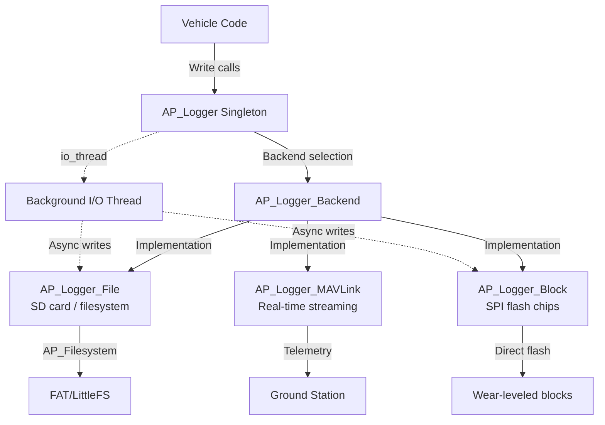

# AP_Logger - ArduPilot Binary Logging Subsystem

## Overview

AP_Logger is ArduPilot's comprehensive binary logging subsystem that records flight data to persistent storage for post-flight analysis, debugging, and algorithm development. The system uses a pluggable backend architecture supporting multiple storage targets (SD card filesystem, SPI flash chips, MAVLink streaming) with a unified front-end API. All log messages use a compact binary format with self-describing metadata for efficient storage and reliable decoding.

## Architecture

The AP_Logger system follows a singleton pattern with pluggable backends for different storage mechanisms:



**Architecture Components:**
- **AP_Logger (Front-End)**: Singleton providing Write() API for message logging, backend management, and format/unit/multiplier registration
- **AP_Logger_Backend (Abstraction)**: Base class defining storage interface with start/stop, write buffering, and log download support
- **io_thread Model**: Background thread handles disk I/O operations asynchronously to avoid blocking flight-critical code in the main loop
- **Backend Selection**: Runtime configuration via LOG_BACKEND_TYPE parameter enables File, Block, MAVLink, or combinations

## Key Components

**Main Classes:**
- **AP_Logger**: Front-end singleton class (AP_Logger.h) - Provides Write() family of methods, manages multiple backends, coordinates format metadata
- **AP_Logger_Backend**: Abstract backend interface (AP_Logger_Backend.h) - Defines common operations for all storage implementations
- **AP_Logger_File**: Filesystem backend (AP_Logger_File.cpp) - Uses AP_Filesystem to write .BIN files to SD cards or flash filesystems (FAT/LittleFS)
- **AP_Logger_Block**: Block device backend (AP_Logger_Block.cpp) - Direct SPI flash management with wear leveling, no filesystem overhead
- **AP_Logger_MAVLink**: Streaming backend (AP_Logger_MAVLink.cpp) - Real-time log data transmission over MAVLink telemetry links
- **LogStructure**: Message format registry (LogStructure.h) - Defines all log message types with format strings, field names, units, and multipliers

## Format Types

The format type specifies the amount of storage required for the entry
and how the content should be interpreted.

| Char | C Type |
|------|--------|
|a   | int16_t[32]|
|b   | int8_t|
|B   | uint8_t|
|h   | int16_t|
|H   | uint16_t|
|i   | int32_t|
|I   | uint32_t|
|f   | float|
|d   | double|
|n   | char[4]|
|N   | char[16]|
|Z   | char[64]|
|L   | int32_t latitude/longitude (so -35.1332423 becomes -351332423)|
|M   | uint8_t flight mode|
|q   | int64_t|
|Q   | uint64_t|
|g   | float16_t|

Legacy field types - do not use.  These have been replaced by using  the base C type and an appropriate multiplier column entry.

| Char | CType+Mult   |
|------|--------------|
|  c   | int16_t * 100|
|  C   | uint16_t * 100|
|  e   | int32_t * 100|
|  E   | uint32_t * 100|

## Units

All units here should be base units. 
This means battery capacity uses "amp \* second" not "milliAmp \* hours". 
Please keep the names consistent with Tools/autotest/param_metadata/param.py:33

| Char | Unit Abbrev. | Description | Notes |
|-----|---|---|---|
| '-' | "" | no units e.g. Pi or a string |
| '?' | "UNKNOWN" | Units which haven't been worked out yet....|
| 'A' | "A" | Ampere|
| 'd' | "deg" | of the angular variety | -180 to 180|
| 'b' | "B" | bytes|
| 'B' | "B/s" | bytes per second |
| 'k' | "deg/s" | degrees per second | Not an SI unit, but in some situations more user-friendly than radians per second|
| 'D' | "deglatitude" | degrees of latitude|
| 'e' | "deg/s/s" | degrees per second per second | Not an SI unit, but in some situations more user-friendly than radians per second^2|
| 'E' | "rad/s" | radians per second|
| 'G' | "Gauss" | Gauss | Not an SI unit, but 1 tesla = 10000 gauss so a simple replacement is not possible here|
| 'h' | "degheading" | 0.? to 359.?|
| 'i' | "A.s" | Ampere second|
| 'J' | "W.s" | Joule (Watt second)|
| 'l' | "l" | litres|
| 'L' | "rad/s/s" | radians per second per second|
| 'm' | "m" | metres|
| 'n' | "m/s" | metres per second|
| 'N' | "N" | Newton|
| 'o' | "m/s/s" | metres per second per second|
| 'O' | "degC" | degrees Celsius | Not an SI unit, but Kelvin is too cumbersome for most users|
| '%' | "%" | percent|
| 'S' | "satellites" | number of satellites|
| 's' | "s" | seconds|
| 'q' | "rpm" | revolutions per minute|  Not an SI unit, but sometimes more intuitive than Hertz|
| 'r' | "rad" | radians|
| 't' | "N.m" | Newton meters | torque |
| 'U' | "deglongitude" | degrees of longitude|
| 'u' | "ppm" | pulses per minute|
| 'v' | "V" | Volt|
| 'P' | "Pa" | Pascal|
| 'w' | "Ohm" | Ohm|
| 'W' | "W" | watt |
| 'X' | "W.h" | watt hour |
| 'Y' | "us" | pulse width modulation in microseconds|
| 'z' | "Hz" | Hertz|
| '#' | "instance" | (e.g.)Sensor instance number|

## Multipliers

This multiplier information applies to the raw value present in the
log. Any adjustment implied by the format field (e.g. the "centi"
in "centidegrees" is *IGNORED* for the purposes of scaling.
Essentially "format" simply tells you the C-type, and format-type h
(int16_t) is equivalent to format-type c (int16_t*100)
tl;dr a GCS shouldn't/mustn't infer any scaling from the unit name

| Char | Multiplier | Description |
|------|------------|---|
| '-' | 0 | no multiplier e.g. char[4] |
| '?' | 1 | multipliers which haven't been worked out yet |
| '2' | 1e2 ||
| '1' | 1e1 ||
| '0' | 1e0 | x1 |
| 'A' | 1e-1 ||
| 'B' | 1e-2 ||
| 'C' | 1e-3 ||
| 'D' | 1e-4 ||
| 'E' | 1e-5 ||
| 'F' | 1e-6 ||
| 'G' | 1e-7 ||
| 'I' | 1e-9 ||
| '!' | 3.6 | (milliampere \* hour => ampere \* second) and (km/h => m/s)|
| '/' | 3600 | (ampere \* hour => ampere \* second)|

## Binary Log Format Details

ArduPilot logs use a self-describing binary format optimized for storage efficiency and reliable parsing:

**Binary Structure:**
- **Packet Header**: Each log message starts with magic bytes `0xA3 0x95` for synchronization and corruption detection
- **Message ID**: Single byte identifying the message type (e.g., 0x80 for FMT, variable for data messages)
- **Message Payload**: Variable-length data matching the format specification for the message ID

**Metadata Messages** (written at log start):
- **FMT (Format)**: Defines message structure - message ID, type name, length, format string, field names
- **UNIT**: Maps format field positions to unit abbreviations (see Units table above)
- **MULT (Multiplier)**: Maps format field positions to multiplier characters (see Multipliers table above)
- **FMTU**: Combined format with units and multipliers in single message (newer format)

**Data Messages**: Follow FMT-defined structure with fields packed sequentially according to format string

**Parsing Flow**: Reader must process FMT/UNIT/MULT messages first to build format registry, then decode subsequent data messages by looking up message ID in registry

## Log Message Catalog

Common log message types captured during flight:

| Message Type | Description | Key Fields | Typical Rate |
|--------------|-------------|------------|--------------|
| FMT | Format definition metadata | Type, Length, Name, Format, Labels | Once per log |
| IMU | Inertial Measurement Unit data | GyrX/Y/Z, AccX/Y/Z (rad/s, m/s²) | 400 Hz (fast loop) |
| GPS | Global Positioning System | Lat, Lng, Alt, NSats, HDop, Spd, GCrs | 5-10 Hz |
| ATT | Attitude estimate | Roll, Pitch, Yaw (deg), Error (rad) | 10-50 Hz |
| BARO | Barometric pressure/altitude | Alt (m), Press (Pa), Temp (°C) | 20-50 Hz |
| MAG | Magnetometer (compass) | MagX/Y/Z (Gauss), OfsX/Y/Z, Health | 75 Hz |
| RCIN | RC receiver input channels | C1-C16 (PWM microseconds) | 50 Hz |
| RCOU | RC servo output channels | C1-C16 (PWM microseconds) | 50 Hz |
| MODE | Flight mode changes | Mode (number), ModeNum, Rsn (reason) | On event |
| BAT | Battery monitoring | Volt (V), Curr (A), CurrTot (A·s), Res (Ah) | 10 Hz |
| POWR | Power rail status | Vcc, VServo, Flags | 10 Hz |
| CMD | Mission command execution | CTot, CNum, CId, Prm1-4 | On event |
| EV | Events (arming, disarming, etc.) | Id | On event |
| ERR | Error messages | Subsys, ECode | On event |
| PM | Performance monitoring | NLon (loop time), NLoop, MaxT, Mem | 1 Hz |
| RATE | Rate controller outputs | RDes, R, ROut (roll), PDes, P, POut (pitch) | 400 Hz (copter) |
| NKF1-10 | EKF3 navigation filter state | Various EKF internal states | 10 Hz |
| XKF1-10 | EKF2 navigation filter state | Various EKF internal states | 10 Hz |
| TERR | Terrain data | Status, Lat, Lng, Spacing, TerrH | 1 Hz |

## LogStructure.h Reference

**Reading LogStructure Definitions:**

LogStructure entries in LogStructure.h define message formats with this structure:
```cpp
{ LOG_MESSAGE_NAME, sizeof(struct log_MessageName),
  "NAME", "Format", "Labels", "Units", "Multipliers" }
```

**Format String Characters** map to C types (see Format Types table above):
- Example: "QBfLLeeee" = uint64_t, uint8_t, float, int32_t latitude, int32_t longitude, 4× int32_t*100

**Field Naming Conventions:**
- TimeUS: Timestamp in microseconds since boot (uint64_t, standard first field)
- Instance: Sensor instance number for multi-sensor systems
- X/Y/Z suffixes: Coordinate axes (typically body frame: X forward, Y right, Z down)
- Des/Tar suffixes: Desired/target values for control loops
- Roll/Pitch/Yaw: Euler angles (degrees or radians depending on unit specification)

**Complete GPS Message Example:**
```cpp
// From LogStructure.h:
{ LOG_GPS_MSG, sizeof(log_GPS),
  "GPS",  "QBBHBHfffffffB", "TimeUS,I,Status,GMS,GWk,NSats,HDop,Lat,Lng,Alt,Spd,GCrs,VZ,U",
  "s#---SmDUmnhnh", "F--C--0GGBBB--0" }
```

**Breakdown:**
- **Name**: "GPS"
- **Format**: Q=uint64_t, B=uint8_t (×2), H=uint16_t (×2), f=float (×7), B=uint8_t
- **Labels**: TimeUS (timestamp), I (instance), Status, GMS (milliseconds), GWk (week), NSats (satellites), HDop, Lat, Lng, Alt, Spd, GCrs (ground course), VZ (vertical speed), U (used)
- **Units**: s=seconds, #=instance, -=none, S=satellites, m=meters, D=deg latitude, U=deg longitude, m=meters, n=m/s, h=deg heading, n=m/s, h=deg
- **Multipliers**: F=1e-6 (for TimeUS), 0=1e0 (×1), C=1e-3, G=1e-7 (for lat/lng), B=1e-2

## Storage Backend Selection

Choose the appropriate backend based on platform capabilities and requirements:

| Criteria | File Backend | Block Backend | MAVLink Backend |
|----------|--------------|---------------|-----------------|
| **Storage Medium** | SD card, flash filesystem | SPI flash chips (DataFlash) | No local storage (RAM buffer only) |
| **Capacity** | High (GB scale) | Medium (MB scale) | N/A (streaming only) |
| **Data Retrieval** | Download .BIN files via MAVLink FTP or USB | Download via MAVLink log protocol | Real-time viewing only |
| **Filesystem Required** | Yes (AP_Filesystem: FAT/LittleFS) | No (direct block management) | No |
| **Write Performance** | 1-5 MB/s sustained, depends on SD card | 100-500 KB/s, limited by SPI bus | Limited by telemetry bandwidth (5-50 kbit/s) |
| **Power Loss Safety** | Filesystem flush required, potential corruption | Wear-leveling with metadata, robust | N/A (data lost) |
| **Typical Use Case** | Primary logging on boards with SD slots | Boards without SD (e.g., compact flight controllers) | Real-time monitoring, backup stream |
| **Example Boards** | Pixhawk series, CubeOrange, most full-size controllers | Older APM boards, some compact controllers | All boards (complementary to primary storage) |

**Backend Configuration via LOG_BACKEND_TYPE Bitmask:**
- Bit 0 (value 1): Enable File backend
- Bit 1 (value 2): Enable Block backend  
- Bit 2 (value 4): Enable MAVLink backend
- Example: LOG_BACKEND_TYPE = 5 enables File (1) + MAVLink (4) simultaneously

## Backend Configuration

**Key Parameters:**

| Parameter | Description | Default | Valid Range | Backend |
|-----------|-------------|---------|-------------|---------|
| LOG_BACKEND_TYPE | Backend selection bitmask (1=File, 2=Block, 4=MAVLink) | 1 (File) | 0-7 | All |
| LOG_FILE_BUFSIZE | File backend write buffer size (KB) | 200 | 1-64 | File |
| LOG_FILE_TIMEOUT | Timeout for file operations (seconds, 0=infinite) | 5 | 0-60 | File |
| LOG_MIN_MB_FREE | Minimum free space before stopping logging (MB) | 500 | 0-10000 | File |
| LOG_FILE_RATEMAX | Maximum file logging rate (MB/s, 0=unlimited) | 0 | 0-10 | File |
| LOG_BLK_RATEMAX | Maximum block logging rate (MB/s, 0=unlimited) | 0 | 0-5 | Block |
| LOG_MAV_RATEMAX | Maximum MAVLink streaming rate (kB/s, 0=unlimited) | 0 | 0-200 | MAVLink |
| LOG_DARM_RATEMAX | Logging rate limit when disarmed (MB/s, 0=unlimited) | 0.2 | 0-10 | All |
| LOG_FILE_DSRMROT | File rotation when disarmed (1=enable) | 0 | 0-1 | File |
| LOG_DISARMED | Log while disarmed (1=enable) | 0 | 0-1 | All |
| LOG_REPLAY | Enable replay logging (1=enable) | 0 | 0-1 | All |

**Rate Limiting Strategy:**
- Use LOG_FILE_RATEMAX to prevent SD card saturation on high-rate sensors
- Use LOG_DARM_RATEMAX to conserve storage during ground operations
- MAVLink streaming automatically rate-limits based on telemetry bandwidth

## Logging Performance Optimization

**Buffer Sizing Guidance:**
- **LOG_FILE_BUFSIZE**: Larger buffers (64 KB+) reduce filesystem overhead but increase RAM usage
- **Typical allocation**: 16-64 KB on small boards, 200 KB on high-memory boards
- **Trade-off**: Larger buffers improve burst performance but delay data reaching storage

**Write Rate Tuning:**
- Monitor PM.MaxT (maximum loop time) - should remain <10ms for multirotors
- If MaxT increases with logging enabled, reduce log message rates or increase buffer size
- Use rate limiting parameters (LOG_FILE_RATEMAX) to cap worst-case write rates

**SD Card Selection Criteria:**
- **Minimum**: Class 10 (10 MB/s write speed)
- **Recommended**: UHS-I or better for reliable high-rate logging
- **Avoid**: No-name brands with inconsistent write performance
- **Size**: 8-32 GB sufficient for most applications (larger cards may have slower small-write performance)

**Filesystem Selection:**
- **FAT32**: Maximum compatibility, widely supported, good for large files
- **LittleFS**: Power-loss resilient, better wear leveling, recommended for flash storage
- Configure via AP_Filesystem backend selection in hwdef or runtime

**Typical Sustained Throughput:**
- **Low-rate logging** (GPS, baro only): 50-200 KB/s
- **Standard logging** (IMU, GPS, baro, attitude): 500 KB - 2 MB/s
- **Full-rate logging** (all sensors, EKF, control): 2-5 MB/s
- **Burst logging** (during mode changes, events): 10+ MB/s (short duration)

## Log Replay Workflows

The **Tools/Replay** system enables log replay through navigation algorithms for development without hardware.

**Purpose:**
- **Algorithm Development**: Test EKF/AHRS changes with real sensor data without flying
- **Parameter Tuning**: Evaluate filter parameters (EKF3_*, AHRS_*) against logged flights
- **Debugging**: Reproduce and diagnose EKF divergence, position errors, or sensor fusion issues
- **Validation**: Verify that code changes don't degrade performance on real flight data

**Setup:**
1. Build Replay tool: `./waf configure --board sitl && ./waf replay`
2. Prepare log file: Any .BIN log from actual flight with sensor data (IMU, GPS, baro, mag)

**Common Replay Commands:**
```bash
# Basic replay at original logging rate
./build/sitl/tools/Replay/Replay -l flight.BIN

# Replay at 10x speed
./build/sitl/tools/Replay/Replay -l flight.BIN -r 10

# Replay with specific parameters
./build/sitl/tools/Replay/Replay -l flight.BIN --param EKF3_ACC_BIAS_LIM:0.5

# Generate comparison output
./build/sitl/tools/Replay/Replay -l flight.BIN --generate-only

# Verbose output for debugging
./build/sitl/tools/Replay/Replay -l flight.BIN -v
```

**Replay Process:**
1. Replay tool reads original log sequentially
2. Feeds sensor messages (IMU, GPS, baro, mag) to AHRS/EKF
3. Generates new log with "_replay" suffix containing recalculated navigation solution
4. Compare original vs replay logs to evaluate algorithm changes

**Use Cases:**
- **EKF Tuning**: Adjust innovation gate sizes, process noise, measurement noise
- **Sensor Fusion Changes**: Test new sensor integration or fusion algorithms
- **Filter Comparison**: Run EKF2 vs EKF3 on same data
- **Regression Testing**: Verify that code changes maintain performance on historical logs

**Output Interpretation:**
- Compare NKF1 (EKF3) messages in original vs replay logs
- Check innovation consistency (NKF4.SIV, NKF4.SIH)
- Verify position/velocity agreement with GPS (NKF1.PN/PE vs GPS.Lat/Lng)

## Log Analysis Guide

**Common Analysis Tools:**

**1. MAVExplorer** (Python-based interactive analysis):
```bash
# Launch MAVExplorer
MAVExplorer.py flight.BIN

# Interactive Python expressions
graph IMU.GyrX IMU.GyrY IMU.GyrZ
graph GPS.Alt BARO.Alt
graph RATE.RDes RATE.R
```

**2. mavlogdump.py** (Text dump of messages):
```bash
# Dump all GPS messages
mavlogdump.py --type GPS flight.BIN

# Dump with filtering
mavlogdump.py --condition "GPS.NSats<6" flight.BIN

# Export to CSV
mavlogdump.py --format csv flight.BIN > flight.csv
```

**3. Mission Planner Log Review:**
- Graph tab: Multi-channel plotting with zoom and pan
- Data tab: Table view of all messages with filtering
- Event log: Mode changes, errors, arming events

**Common Debugging Patterns:**

**Identifying EKF Divergence:**
```
Symptoms:
- NKF1.NIS (innovation consistency) > 1.0 sustained
- Large position jumps in NKF1.PN/PE
- EKF variance high (NKF4.SV)

Analysis:
- Check GPS health: GPS.NSats < 6, GPS.HDop > 2.0
- Check IMU vibration: VIBE.Clip > 100
- Check compass interference: MAG.Health, MAG.Ofs changing
```

**Motor Saturation Detection:**
```
Symptoms:
- RATE.AOut (attitude output) at limits (±1.0)
- RCOU channels maxed (1100 or 1900 µs)
- Oscillation in ATT.Roll/Pitch

Analysis:
- Check desired vs actual rates: RATE.RDes vs RATE.R
- Check PID gains: insufficient tracking with room in outputs
- Check motor health: asymmetric RCOU values suggest motor/ESC issue
```

**Vibration Issues:**
```
Symptoms:
- VIBE.Clip > 100 (accelerometer clipping)
- IMU.AccX/Y/Z spikes or high-frequency noise
- EKF switching lanes (NKF1.Lane changes)

Analysis:
- Graph IMU.AccX with FFT to identify frequency
- Check airframe rigidity and vibration isolation
- Consider IMU filter settings (INS_ACCEL_FILTER)
```

**GPS Glitches:**
```
Symptoms:
- GPS.NSats drops suddenly
- GPS.HDop spikes
- Large GPS.Spd changes without corresponding IMU integration

Analysis:
- Graph GPS.NSats over time (check for pattern)
- Check for EMI sources (FPV transmitter, ESCs)
- Verify GPS antenna placement and orientation
```

## Streaming vs On-Board Logging

**Streaming Advantages (MAVLink Backend):**
- **Real-Time Visibility**: Instant error detection and monitoring during flight
- **No Post-Flight Download**: Data available immediately in ground station
- **Redundancy**: Backup log if vehicle is lost or storage fails
- **Remote Debugging**: Diagnose issues without physical access to vehicle

**Streaming Limitations:**
- **Bandwidth Constraints**: Typical telemetry links 5-50 kbit/s (vs MB/s on-board)
- **Packet Loss**: RF interference or range can cause data gaps
- **Reduced Message Rates**: Most messages downsampled 10-100× vs full logging
- **No Replay**: Cannot use streamed logs for Tools/Replay (insufficient data)

**On-Board Logging Advantages (File/Block Backend):**
- **Full Data Capture**: 100-400 Hz sensor data, complete control loop state
- **No Bandwidth Constraints**: Limited only by storage write speed
- **Reliable Storage**: Filesystem or wear-leveled flash with robustness features
- **Replay Support**: Complete data for algorithm development and tuning

**On-Board Limitations:**
- **Delayed Access**: Must retrieve vehicle and download logs
- **Storage Capacity**: Eventually fills SD card/flash (gigabytes, but finite)
- **Power Loss Risk**: Incomplete filesystem flush can cause last-flight corruption

**Hybrid Approach (Recommended):**
- **Primary**: File or Block backend with full-rate logging
- **Secondary**: MAVLink backend streaming critical messages (MODE, EV, ERR, GPS, ATT)
- **Configuration**: LOG_BACKEND_TYPE = 5 (File + MAVLink)
- **Benefit**: Real-time monitoring with full post-flight analysis capability

## Log Message Definition Examples

**Defining Custom Log Messages:**

```cpp
// Define structure in vehicle code (e.g., ArduCopter/Log.cpp)
struct PACKED log_Custom {
    LOG_PACKET_HEADER;
    uint64_t time_us;
    float    value1;
    float    value2;
    int16_t  value3;
};

// Add to LogStructure array
{ LOG_CUSTOM_MSG, sizeof(log_Custom),
  "CSTM", "QffH", "TimeUS,Val1,Val2,Val3", "s---", "F000" },

// Log message in flight code
void Copter::Log_Write_Custom(float val1, float val2, int16_t val3)
{
    struct log_Custom pkt = {
        LOG_PACKET_HEADER_INIT(LOG_CUSTOM_MSG),
        time_us : AP_HAL::micros64(),
        value1  : val1,
        value2  : val2,
        value3  : val3
    };
    logger.WriteBlock(&pkt, sizeof(pkt));
}
```

**Using Write() with Dynamic Format:**

```cpp
// Simple write for debugging (less efficient, flexible)
logger.Write("TEST", "TimeUS,Value", "sF", "FF", 
             AP_HAL::micros64(), measured_value);
```

**Using WriteV() for Variable Arguments:**

```cpp
// Variable argument convenience method
logger.WriteV("DBUG", "TimeUS,Val1,Val2,Val3", "sfff", "F000",
              AP_HAL::micros64(), val1, val2, val3);
```

**Comprehensive Message Type Example:**

See `libraries/AP_Logger/examples/AP_Logger_AllTypes/AP_Logger_AllTypes.cpp` for complete examples of:
- All format type characters (int8/16/32/64, float, double, char arrays)
- Unit and multiplier specifications
- Multi-instance logging (sensors with multiple instances)
- Efficient struct-based logging vs dynamic Write() methods

## Thread Safety and Performance

**io_thread Architecture:**
- **Separation of Concerns**: Main flight loop calls Write() methods, background io_thread handles disk I/O
- **Non-Blocking Writes**: Write() copies data to ring buffer and returns immediately (microseconds)
- **Async Flush**: io_thread wakes periodically (10-50 Hz) to flush buffer to storage backend
- **Latency Tolerance**: Buffering allows handling of SD card write delays (10-100ms) without blocking flight control

**Semaphore Usage:**
- **WITH_SEMAPHORE(sem)**: Used internally to protect shared buffer access between main thread and io_thread
- **Lock Duration**: Minimal (copy to buffer only), typically <100µs
- **Contention**: Rare under normal operation, only during high-rate logging bursts

**Blocking Characteristics:**
- **Write() Methods**: Non-blocking (buffer copy only)
- **Flush Operations**: Blocking in io_thread, not main loop
- **Buffer Full Condition**: If buffer fills (sustained write rate > backend capacity), oldest data dropped with warning

**Typical Write Latencies:**
- **Buffer Copy** (main thread): 1-10 µs per message
- **Disk Write** (io_thread): 1-50 ms per flush cycle, depending on backend
- **Total Delay** (message written to disk): 20-100 ms typical

## Testing and Validation

**Comprehensive Test Coverage:**

**examples/AP_Logger_AllTypes:**
- **Location**: `libraries/AP_Logger/examples/AP_Logger_AllTypes/AP_Logger_AllTypes.cpp`
- **Purpose**: Validate all format types, units, multipliers, and backend functionality
- **Usage**: Build and run to generate test log with all message types
- **Validation**: Verify log can be decoded with mavlogdump.py and parsed correctly

**SITL Testing Procedures:**

```bash
# Start SITL with logging enabled
sim_vehicle.py -v Copter --console --map

# Verify logging started
STABILIZE> param show LOG_BACKEND_TYPE
STABILIZE> param show LOG_DISARMED

# Generate flight data
STABILIZE> arm throttle
STABILIZE> mode GUIDED
STABILIZE> takeoff 10

# Check log file created
STABILIZE> !ls -lh logs/
```

**Download and Analysis:**
```bash
# Download log via MAVProxy
STABILIZE> log list
STABILIZE> log download latest

# Analyze with mavlogdump
mavlogdump.py --type IMU,GPS,ATT logs/SITL.BIN | head -100

# Check for errors
mavlogdump.py --type ERR logs/SITL.BIN
```

**Validation Checklist:**
- [ ] Log file created successfully (.BIN extension)
- [ ] FMT messages present at start of log
- [ ] All expected message types present (IMU, GPS, ATT, BARO, MODE)
- [ ] Timestamps monotonically increasing (TimeUS field)
- [ ] No excessive ERR messages indicating logging failures
- [ ] Log downloadable via MAVLink (mavftp) without corruption
- [ ] Log parseable with mavlogdump.py and MAVExplorer.py

## References

**Source Files:**
- `libraries/AP_Logger/AP_Logger.h` - Front-end API and singleton definition
- `libraries/AP_Logger/AP_Logger.cpp` - Core logging implementation
- `libraries/AP_Logger/AP_Logger_Backend.h` - Abstract backend interface
- `libraries/AP_Logger/AP_Logger_File.{h,cpp}` - Filesystem backend implementation
- `libraries/AP_Logger/AP_Logger_Block.{h,cpp}` - Block device backend implementation
- `libraries/AP_Logger/AP_Logger_MAVLink.{h,cpp}` - Streaming backend implementation
- `libraries/AP_Logger/LogStructure.h` - Message format definitions (all vehicles and libraries)
- `libraries/AP_Logger/LogFile.cpp` - Log file management and download support

**Tools and Utilities:**
- `Tools/Replay/` - Log replay tool for algorithm development and debugging
- `libraries/AP_Logger/examples/AP_Logger_AllTypes/` - Comprehensive format type test example
- `Tools/scripts/build_log_message_documentation.sh` - Auto-generate log message documentation

**External Resources:**
- MAVLink Log Download Protocol: https://mavlink.io/en/services/log_download.html
- Parameter Metadata: `Tools/autotest/param_metadata/param.py`
- ArduPilot Log Analysis Wiki: https://ardupilot.org/copter/docs/common-logs.html
