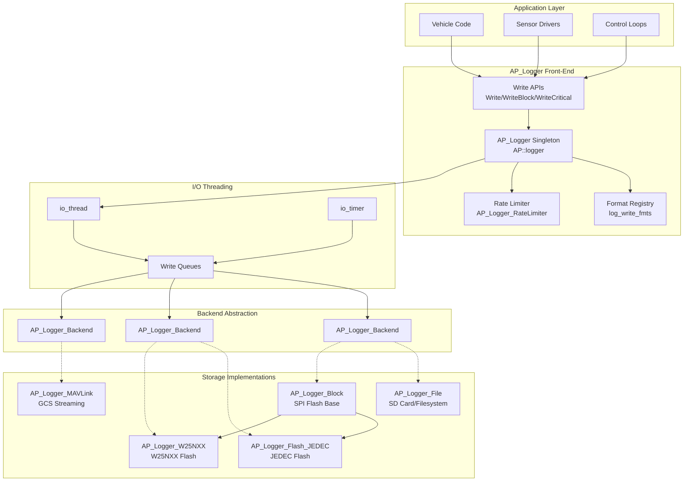

# AP_Logger - ArduPilot Logging System

## Table of Contents
- [Overview](#overview)
- [Architecture](#architecture)
- [Binary Log Format Specification](#binary-log-format-specification)
- [Log Message Types and Structures](#log-message-types-and-structures)
- [Streaming and Block Write Patterns](#streaming-and-block-write-patterns)
- [Backend Implementations](#backend-implementations)
- [Log Analysis Tools](#log-analysis-tools)
- [Performance Considerations](#performance-considerations)
- [Memory Management](#memory-management)
- [Integration Examples](#integration-examples)
- [Format Reference](#format-reference)

---

## Overview

The AP_Logger library provides ArduPilot's comprehensive binary logging subsystem, enabling high-rate data capture from sensors, controllers, and vehicle state for post-flight analysis, debugging, and safety auditing. The system is designed for real-time embedded environments with strict timing constraints, supporting multiple storage backends from filesystem-based SD cards to SPI flash chips and MAVLink streaming to ground stations.

**Key Features:**
- **High-throughput logging**: Handles 400Hz+ sensor data with minimal CPU overhead
- **Multiple backends**: Filesystem (SD card), Block flash (JEDEC/W25NXX), MAVLink streaming
- **Flexible message formats**: Dynamic registration system with type-safe binary serialization
- **Rate limiting**: Per-message rate control for armed and disarmed states
- **Thread-safe I/O**: Asynchronous write thread prevents blocking main control loops
- **Safety-critical design**: Critical message priority, DMA-safe buffers, power-loss resilience

**Source Files**: `/libraries/AP_Logger/`

---

## Architecture

The AP_Logger system uses a front-end/backend architecture with singleton access, enabling compile-time and runtime backend selection while maintaining a consistent API.

### System Architecture Diagram



### Front-End Logger (AP_Logger)

The front-end singleton `AP_Logger` (accessed via `AP::logger()`) provides the primary API for vehicle code and libraries. Key responsibilities:

- **Initialization**: Backend probing and selection based on compile flags and runtime detection
- **Format registration**: Dynamic message type allocation using `log_write_fmts` list
- **Write multiplexing**: Routes write calls to all active backends via `FOR_EACH_BACKEND` macro
- **I/O threading**: Manages asynchronous write thread created via `hal.scheduler->thread_create()`
- **Concurrency control**: Uses `HAL_Semaphore` instances for thread-safe format registration

**Source**: `/libraries/AP_Logger/AP_Logger.h`, `/libraries/AP_Logger/AP_Logger.cpp`

### Singleton Pattern

```cpp
// Access logger from anywhere in the codebase
AP_Logger *logger = AP::logger();
if (logger) {
    logger->Write("IMU", "TimeUS,GyrX,GyrY,GyrZ", "Qfff",
                  AP_HAL::micros64(), gyro.x, gyro.y, gyro.z);
}
```

**Source**: `/libraries/AP_Logger/AP_Logger.h:203-205`

### Backend Abstraction

All storage implementations inherit from `AP_Logger_Backend`, which defines the contract:

**Pure Virtual Interface**:
- `CardInserted()`: Media availability check
- `EraseAll()`: Full log erasure
- `find_last_log()`: Log enumeration
- `get_log_boundaries()`, `get_log_info()`, `get_log_data()`: Log retrieval for download
- `Init()`: Backend initialization
- `bufferspace_available()`: Flow control query
- `stop_logging()`: Shutdown handling
- `_WritePrioritisedBlock()`: Core write primitive (protected pure virtual)

**Source**: `/libraries/AP_Logger/AP_Logger_Backend.h`

### I/O Threading Model

To prevent blocking the main control loops (typically running at 400Hz), AP_Logger uses a dedicated I/O thread:

1. **Thread Creation**: `start_io_thread()` spawns dedicated thread via HAL scheduler
2. **Write Queuing**: Main thread calls Write APIs which enqueue data without blocking
3. **Asynchronous Flush**: I/O thread periodically flushes queued data to backends
4. **Timer-Driven**: `io_timer()` provides periodic maintenance (buffer management, file rotation)

**Timing Constraints**:
- Main thread writes must complete in <100μs
- I/O thread handles blocking operations (filesystem writes, flash page programs)
- Heartbeat monitoring detects I/O thread stalls

**Source**: `/libraries/AP_Logger/AP_Logger.cpp` (io_thread, io_timer, start_io_thread)

### Rate Limiting

The `AP_Logger_RateLimiter` class provides per-message rate control:

```cpp
// Rate limiter configuration via AP_Param
_FILE_RATEMAX   // Maximum rate for file logging (Hz)
_MAV_RATEMAX    // Maximum rate for MAVLink streaming (Hz)
_DARM_RATEMAX   // Maximum rate when disarmed (Hz)
```

**Mechanism**:
- Tracks last send time per message ID (256-element array)
- Scheduler counter caching for multi-instance messages
- Bitmap cache for non-streaming message types
- Armed/disarmed mode switching

**Source**: `/libraries/AP_Logger/AP_Logger_Backend.h:17-45`, `/libraries/AP_Logger/AP_Logger_Backend.cpp`

---

## Binary Log Format Specification

ArduPilot binary logs use a custom binary format optimized for embedded systems, providing compact storage with random-access capability for efficient log analysis and download.

### Log File Structure

```
+------------------+
| File Header      | (Optional, Block backends only)
+------------------+
| Packet Stream    |
|  +--------------+|
|  | Packet 1     ||  LOG_PACKET_HEADER + payload
|  +--------------+|
|  | Packet 2     ||  LOG_PACKET_HEADER + payload
|  +--------------+|
|  | ...          ||
|  +--------------+|
+------------------+
```

### Packet Structure

Every log message consists of a header followed by a typed payload:

```cpp
// From LogStructure.h
struct PACKED log_Header {
    uint8_t head1;     // 0xA3 (LOG_PACKET_HEADER_INIT)
    uint8_t head2;     // 0x95 (LOG_PACKET_HEADER_INIT2)
    uint8_t msg_type;  // Message ID (0-255)
};

#define LOG_PACKET_HEADER uint8_t head1, head2, msg_type;
```

**Header Fields**:
- `head1`, `head2`: Magic bytes (0xA3, 0x95) for packet synchronization during recovery
- `msg_type`: Message type ID used to look up format in FMT messages

**Payload**: Variable-length binary data following the format string specification

### Format Definition Messages (FMT)

Log files begin with self-describing FMT messages that define the structure of subsequent messages:

```cpp
// FMT message structure
struct log_Format {
    LOG_PACKET_HEADER;
    uint8_t type;           // Message type ID
    uint8_t length;         // Total message length in bytes
    char name[4];           // Short name (e.g., "IMU", "GPS")
    char format[16];        // Format string (e.g., "QfffIHH")
    char labels[64];        // Comma-separated column names
};
```

**Example FMT Message**:
```
Type: 128
Length: 45
Name: "IMU"
Format: "QffffffIHH"
Labels: "TimeUS,GyrX,GyrY,GyrZ,AccX,AccY,AccZ,ErrG,ErrA,Temp"
```

This defines message ID 128 as an IMU sample with:
- `Q`: uint64_t timestamp (microseconds)
- Six `f`: float values for gyro and accelerometer (x,y,z)
- `I`: uint32_t error flags for gyro
- Two `H`: uint16_t for accel error and temperature

### Unit and Multiplier Messages

Additional metadata messages provide units and scaling information:

**UNIT Messages**: Define unit IDs and their abbreviations
```cpp
struct log_Unit {
    LOG_PACKET_HEADER;
    uint64_t time_us;
    char unit_id;         // Character identifier (e.g., 'm', 's', 'A')
    char unit_label[64];  // Human-readable unit (e.g., "metres", "seconds")
};
```

**MULT Messages**: Define multiplier IDs and scaling factors
```cpp
struct log_Format_Multiplier {
    LOG_PACKET_HEADER;
    uint64_t time_us;
    char mult_id;         // Character identifier (e.g., 'B' = 1e-2)
    double multiplier;    // Scaling factor
};
```

**FMTU Messages**: Link format types to units and multipliers
```cpp
struct log_Format_Units {
    LOG_PACKET_HEADER;
    uint64_t time_us;
    uint8_t fmt_type;     // Message type this applies to
    char unit_ids[16];    // Unit ID for each column
    char mult_ids[16];    // Multiplier ID for each column
};
```

**Example**:
```
FMTU for IMU (type 128):
unit_ids: "s------####"   // s=seconds for TimeUS, #=instance/dimensionless for rest
mult_ids: "F000000----"   // F=1e-6 (microseconds), 0=1e0 (no scaling)
```

### Page-Based Organization (Block Backends)

Block backends (JEDEC, W25NXX) organize logs into fixed-size pages:

```cpp
// Page header (from AP_Logger_Block.cpp)
struct PageHeader {
    uint16_t FileNumber;  // Log file number
    uint16_t FilePage;    // Page number within log file
};

// File header (first page of each log)
struct FileHeader {
    uint16_t FileNumber;
    uint16_t FileYear;
    uint8_t FileMonth;
    uint8_t FileDay;
    uint8_t FileHour;
    uint8_t FileMinute;
    uint8_t FileSecond;
};
```

**Page Management**:
- Page size: 256-2048 bytes (device-specific)
- Ring buffer: Logs wrap when flash fills
- Page headers enable log boundary detection
- StartWrite/FinishWrite atomicity

**Source**: `/libraries/AP_Logger/AP_Logger_Block.h`, `/libraries/AP_Logger/AP_Logger_Block.cpp`

### Filesystem Organization (File Backend)

File backends store logs as individual files on FAT/LittleFS:

```
/APM/
├── LASTLOG.TXT        # Contains number of last log
├── 00000001.BIN       # Log file 1
├── 00000002.BIN       # Log file 2
└── 00000NNN.BIN       # Log file N
```

**Naming Convention**: `%08u.BIN` (8-digit zero-padded decimal)

**LASTLOG.TXT**: ASCII file containing last log number for fast enumeration

**Source**: `/libraries/AP_Logger/AP_Logger_File.cpp`

---

## Log Message Types and Structures

### Standard Message Types

ArduPilot defines numerous standard message types in `LogStructure.h`. Common categories:

**Sensor Messages**:
- `IMU`: Inertial measurement unit (gyro, accel, temperature)
- `GPS`: Position, velocity, accuracy, satellite count
- `BARO`: Barometric altitude and temperature
- `MAG`: Magnetometer (compass) readings
- `RFND`: Rangefinder distance measurements

**State Estimation**:
- `AHR2`: AHRS attitude (roll, pitch, yaw)
- `POS`: Estimated position (North, East, Down)
- `XKF1-XKF5`: Extended Kalman Filter (EKF) state and diagnostics

**Control**:
- `RATE`: Attitude rate targets and actuals
- `PIDA`: PID loop state (desired, P, I, D, FF terms)
- `CTRL`: Control mixer outputs

**Vehicle State**:
- `MODE`: Flight mode changes
- `ARM`: Arming events
- `EV`: Event log (geofence, failsafe, etc.)
- `ERR`: Error conditions

**Actuators**:
- `RCOU`: RC servo/motor outputs
- `RCIN`: RC receiver inputs
- `POWR`: Battery voltage, current, consumption

### Format Registration

Applications register custom message formats using `LogStructure` arrays:

```cpp
// From examples/AP_Logger_AllTypes/AP_Logger_AllTypes.cpp:52
static const struct LogStructure log_structure[] = {
    { LOG_TYP1_MSG,                   // Enum message ID
      sizeof(log_TYP1),               // Total size in bytes
      "TYP1",                         // 4-character name
      "QabBhHiIfdnNZ",               // Format string
      "TimeUS,a,b,B,h,H,i,I,f,d,n,N,Z", // Column labels
      "s------------",                // Unit IDs (s=seconds)
      "F------------"                 // Multiplier IDs (F=1e-6)
    },
    // ... more entries
};

logger.init(log_bitmask, log_structure, ARRAY_SIZE(log_structure));
```

**Source**: `/libraries/AP_Logger/examples/AP_Logger_AllTypes/AP_Logger_AllTypes.cpp:52-90`

### Dynamic Message Allocation

The front-end maintains a dynamic registry to support vehicle-specific and runtime-generated messages:

**Key Methods** (from `AP_Logger.cpp`):
- `find_free_msg_type()`: Allocates next available message ID (1-255, avoiding LOG_FORMAT_MSG)
- `msg_type_in_use()`: Checks if message ID is registered
- `msg_fmt_for_name()`: Looks up format by name
- `Write_calc_msg_len()`: Calculates payload size from format string

**Thread Safety**: Format registration protected by `log_write_fmts_sem` semaphore

### Defining Custom Message Structures

**Step 1**: Define packed structure with LOG_PACKET_HEADER:

```cpp
struct PACKED log_MyMessage {
    LOG_PACKET_HEADER;          // head1, head2, msg_type
    uint64_t time_us;           // Standard: timestamp in microseconds
    float value1;
    float value2;
    int32_t count;
    char label[16];
};
```

**Step 2**: Add to enum and LogStructure table:

```cpp
enum MyMessages {
    LOG_MYMSG = 200,  // Pick unused ID
};

const LogStructure my_formats[] = {
    { LOG_MYMSG, sizeof(log_MyMessage),
      "MYMG", "Qffi N", "TimeUS,Val1,Val2,Count,Label",
      "s---", "F---" },
};
```

**Step 3**: Write messages:

```cpp
struct log_MyMessage pkt = {
    LOG_PACKET_HEADER_INIT(LOG_MYMSG),
    time_us : AP_HAL::micros64(),
    value1  : 1.23f,
    value2  : 4.56f,
    count   : 42,
};
strncpy(pkt.label, "test", sizeof(pkt.label));
logger->WriteBlock(&pkt, sizeof(pkt));
```

**Important**: Use `static_assert` to enforce size limits (typically <256 bytes for single-packet messages)

**Source**: `/libraries/AP_Logger/examples/AP_Logger_AllTypes/AP_Logger_AllTypes.cpp:14-44`

---

## Streaming and Block Write Patterns

AP_Logger provides multiple write APIs optimized for different use cases:

### Write API Variants

**1. Variadic Write (Type-Safe)**:

```cpp
// Automatically formats values according to format string
logger->Write("IMU", "TimeUS,GyrX,GyrY,GyrZ", "Qfff",
              AP_HAL::micros64(), gyro.x, gyro.y, gyro.z);
```

- **Pros**: Type-checked at compile time, concise syntax
- **Cons**: Slight overhead from formatting code
- **Use case**: Occasional messages, prototyping

**2. WriteBlock (Binary)**:

```cpp
struct log_IMU pkt = { /* ... populate fields ... */ };
logger->WriteBlock(&pkt, sizeof(pkt));
```

- **Pros**: Zero formatting overhead, guaranteed binary layout
- **Cons**: Manual structure management
- **Use case**: High-rate sensor data (400Hz+ IMU logs)
- **Source**: `/libraries/AP_Logger/AP_Logger.cpp`, `/libraries/AP_Logger/examples/AP_Logger_test/AP_Logger_test.cpp:72`

**3. WriteCriticalBlock**:

```cpp
logger->WriteCriticalBlock(&safety_event_pkt, sizeof(safety_event_pkt));
```

- **Priority**: Bypasses rate limiting, higher queue priority
- **Use case**: Arming events, failsafe triggers, mode changes
- **Guarantee**: Best-effort delivery even under buffer pressure

**4. WriteStreaming**:

```cpp
logger->WriteStreaming("ATT", "TimeUS,Roll,Pitch,Yaw", "Qfff",
                       AP_HAL::micros64(), roll, pitch, yaw);
```

- **Optimization**: Tagged as high-rate streaming data
- **Backend behavior**: MAVLink backend may apply additional decimation
- **Use case**: Attitude, position logs at 50-400Hz

**5. WritePrioritisedBlock**:

```cpp
bool success = backend->WritePrioritisedBlock(buffer, size, is_critical);
```

- **Backend API**: Core write primitive called by all variants
- **Parameters**: 
  - `is_critical`: Priority flag
  - `writev_streaming`: Streaming hint for rate limiter
- **Returns**: Success/failure for flow control

**Source**: `/libraries/AP_Logger/AP_Logger_Backend.h:64-72`, `/libraries/AP_Logger/AP_Logger_Backend.cpp`

### Write Flow Control

The system provides backpressure mechanisms to prevent memory exhaustion:

**1. Buffer Space Queries**:

```cpp
uint32_t space = logger->bufferspace_available();
if (space > required_bytes) {
    logger->WriteBlock(&large_message, sizeof(large_message));
}
```

**2. WritesOK**:

```cpp
if (backend->WritesOK()) {
    // Backend is healthy and accepting writes
}
```

**3. Log Pause**:

```cpp
logger->log_pause(true);  // Temporarily suspend logging (e.g., aux switch)
```

### Rate Limiting Behavior

The rate limiter modifies write behavior based on message history:

**Algorithm** (from `AP_Logger_Backend.cpp:should_log`):
1. Check if message type is rate-limited (non-streaming)
2. Compute minimum interval from rate parameters
3. Compare elapsed time since last write
4. For multi-instance messages, use scheduler counter to allow burst writes
5. Cache decision to apply consistently within scheduler tick

**Parameters**:
- `_FILE_RATEMAX`: Overall file write rate (Hz)
- `_DARM_RATEMAX`: Reduced rate when disarmed (Hz)
- Per-backend rate limits (MAVLink, Block flash)

**Source**: `/libraries/AP_Logger/AP_Logger_Backend.cpp` (should_log, should_log_streaming)

### Write Performance

**Typical Timings**:
- `Write` (variadic): 5-20μs depending on format complexity
- `WriteBlock`: <2μs (primarily memcpy and queue insertion)
- `WriteCriticalBlock`: <5μs (priority queue management)
- Rate limiter check: <1μs (bitmap and timestamp comparison)

**Optimization Notes**:
- WriteBlock is preferred for high-rate loops (>100Hz)
- Variadic Write acceptable for infrequent messages (<10Hz)
- Rate limiting adds negligible overhead (~0.5μs) when properly configured

**Source**: `/libraries/AP_Logger/examples/AP_Logger_test/AP_Logger_test.cpp` (performance measurement loop)

---

## Backend Implementations

### AP_Logger_File (SD Card / Filesystem)

**Storage**: FAT or LittleFS on SD card or eMMC  
**Compile Flag**: `HAL_LOGGING_FILESYSTEM_ENABLED`

**Architecture**:
- **Write Buffer**: `ByteBuffer` sized by `HAL_LOGGER_WRITE_CHUNK_SIZE` (2-4KB)
- **Async I/O**: `io_timer()` periodically flushes buffer to filesystem
- **File Management**: LASTLOG.TXT tracking, automatic log rotation
- **Free Space**: `Prep_MinSpace()` enforces `_FILE_MB_FREE` reserved space

**Initialization** (from `AP_Logger_File.cpp`):
1. Check filesystem availability via `AP_Filesystem`
2. Read `LASTLOG.TXT` to determine next log number
3. Create `/APM/LOGS/` directory if missing
4. Pre-allocate write buffer from HAL memory pool

**Write Path**:
```
WriteBlock → WritePrioritisedBlock → _WritePrioritisedBlock
         → ByteBuffer::write()
         → [io_timer] → ByteBuffer::read() → AP::FS().write()
```

**Configuration Parameters**:
- `_BACKEND_TYPE`: 1 = File
- `_FILE_BUFSIZE`: Write buffer size override (bytes)
- `_FILE_TIMEOUT`: Timeout for filesystem operations (ms)
- `_FILE_MB_FREE`: Minimum free space before logging stops (MB)
- `_FILE_RATEMAX`: Maximum message rate for file backend (Hz)

**Platform Behavior**:
- **SITL/Linux**: Synchronous flush on demand, POSIX file I/O
- **ChibiOS**: Buffered writes, async flush via io_thread
- **Filesystem**: Adaptive chunk size (LittleFS uses 2KB, FAT uses 4KB)

**Source**: `/libraries/AP_Logger/AP_Logger_File.h`, `/libraries/AP_Logger/AP_Logger_File.cpp`

---

### AP_Logger_Block (SPI Flash Base Class)

**Storage**: Raw SPI NOR/NAND flash chips  
**Compile Flag**: `HAL_LOGGING_DATAFLASH_DRIVER`

**Architecture**:
- **Page-Oriented**: Fixed-size pages (256-2048 bytes) with headers
- **Ring Buffer**: Circular overwrite when flash fills
- **DMA-Safe Buffers**: Page buffers allocated from DMA-capable memory regions
- **Erase Sequencing**: Asynchronous sector/block erase state machine

**Page Layout**:
```
struct PageHeader {
    uint16_t FileNumber;   // Which log file this page belongs to
    uint16_t FilePage;     // Page number within that log
};

// Data follows header
```

**Write Mechanics**:
- `StartWrite(page)`: Marks page for writing, erases if necessary
- `WriteBlockCheckStartupMessages()`: Ensures FMT/UNIT/MULT sent first
- `FinishWrite()`: Completes page write transaction
- `BlockRead(page, offset, len)`: Random-access read for log retrieval

**Log Boundary Detection**:
- Scans page headers to find log start/end
- FileNumber changes indicate log boundaries
- Validates log structure integrity with checksums

**Erase Handling**:
- **Sector Erase**: 4KB minimum erase unit
- **InErase()**: Polls erase status (asynchronous operation)
- **EraseAll()**: Full chip erase via state machine in io_thread

**Source**: `/libraries/AP_Logger/AP_Logger_Block.h`, `/libraries/AP_Logger/AP_Logger_Block.cpp`

---

### AP_Logger_Flash_JEDEC (JEDEC SPI Flash)

**Devices**: JEDEC-compliant SPI NOR flash (e.g., Winbond W25Q, Micron N25Q)  
**Boards**: Most Pixhawk-series autopilots with onboard dataflash

**Specifics**:
- **Probing**: Uses JEDEC ID (0x9F command) for device detection
- **Page Size**: Typically 256 bytes
- **Sector Size**: 4KB (4096 bytes)
- **Addressing**: 24-bit address for chips ≤16MB, extended addressing for larger
- **Commands**: 
  - 0x06: Write Enable (WREN)
  - 0x02: Page Program
  - 0x20: 4KB Sector Erase
  - 0xD8: 64KB Block Erase
  - 0x05: Read Status Register

**Implementation Highlights** (from `AP_Logger_Flash_JEDEC.cpp`):
- `WaitReady()`: Polls status register until write-in-progress clears
- `PageToBuffer()`: DMA transfer from flash page to buffer
- `BufferToPage()`: DMA transfer from buffer to flash page
- `SectorErase()`: Erases 4KB sector containing page
- Timeout handling for stuck erase/program operations

**Performance**:
- Page program: ~0.7ms
- 4KB sector erase: ~30ms
- 64KB block erase: ~200ms
- Read throughput: 10-40 MB/s (SPI clock dependent)

**Source**: `/libraries/AP_Logger/AP_Logger_Flash_JEDEC.h`, `/libraries/AP_Logger/AP_Logger_Flash_JEDEC.cpp`

---

### AP_Logger_W25NXX (W25N NAND Flash)

**Devices**: Winbond W25N series SPI NAND flash  
**Key Difference**: NAND flash with built-in ECC, larger pages

**Specifics**:
- **Page Size**: 2048 bytes (vs 256 bytes for NOR)
- **Block Size**: 64 pages per block (128KB)
- **ECC**: On-chip error correction (1-bit correction, 2-bit detection)
- **Bad Block Management**: Factory-marked bad blocks must be skipped

**Unique Features**:
- **Buffer Read**: Pages must be loaded to internal buffer before reading
- **ECC Status**: Reads ECC status register after page read to detect uncorrectable errors
- **Block Erase**: Erase operates on 128KB blocks (vs 4KB sectors for NOR)

**Implementation** (from `AP_Logger_W25NXX.cpp`):
- `PageToBuffer()`: Load Page to Cache (0x13 command) + Read Data (0x03 command)
- `BufferToPage()`: Program Data Load (0x02 command) + Program Execute (0x10 command)
- ECC checking after each read operation
- Bad block table management

**Performance**:
- Page program: ~0.6ms
- Block erase: ~2-10ms (faster than NOR!)
- Read throughput: 20-50 MB/s
- Endurance: 100K erase cycles per block (vs 100K for NOR sectors)

**Source**: `/libraries/AP_Logger/AP_Logger_W25NXX.h`, `/libraries/AP_Logger/AP_Logger_W25NXX.cpp`

---

### AP_Logger_MAVLink (GCS Streaming)

**Transport**: MAVLink REMOTE_LOG_DATA_BLOCK messages over telemetry link  
**Compile Flag**: Always available when HAL_GCS_ENABLED

**Architecture**:
- **Block Pool**: Fixed-size buffers matching `MAVLINK_MSG_REMOTE_LOG_DATA_BLOCK_FIELD_DATA_LEN` (200 bytes)
- **Queue Management**: Separate queues for pending, sent-awaiting-ACK, free blocks
- **Sequence Numbers**: Per-packet sequence for ACK/NACK protocol
- **Retry Logic**: Automatic retransmission on NACK or timeout

**Write Path**:
```
WritePrioritisedBlock → Allocate dm_block from pool
                     → Add to pending queue
                     → [periodic_10Hz] → Send via REMOTE_LOG_DATA_BLOCK
                     → Move to sent queue
                     → [handle ACK/NACK] → Retire or retry
```

**Log Retrieval** (from `AP_Logger_MAVLinkLogTransfer.cpp`):
- **LOG_REQUEST_LIST**: Sends list of available logs to GCS
- **LOG_REQUEST_DATA**: Streams log data using backend get_log_data()
- **LOG_ERASE**: Triggers EraseAll() on backends
- **LOG_REQUEST_END**: Cleanly terminates transfer

**State Machine**:
```
IDLE → [LOG_REQUEST_LIST] → LISTING → [list complete] → IDLE
     → [LOG_REQUEST_DATA] → SENDING → [data complete] → IDLE
```

**Flow Control**:
- Limits in-flight blocks to prevent overwhelming telemetry link
- Adjusts rate based on ACK latency and NACK rate
- Pauses during critical vehicle operations (takeoff, landing)

**Configuration**:
- `_MAV_BUFSIZE`: MAVLink block pool size (number of blocks)
- `_MAV_RATEMAX`: Maximum streaming rate (Hz)
- `_BACKEND_TYPE`: Include bit 2 to enable MAVLink backend

**Source**: `/libraries/AP_Logger/AP_Logger_MAVLink.h`, `/libraries/AP_Logger/AP_Logger_MAVLink.cpp`, `/libraries/AP_Logger/AP_Logger_MAVLinkLogTransfer.cpp`

---

## Log Analysis Tools

ArduPilot logs can be analyzed using multiple tools from the ecosystem:

### Mission Planner (Windows/Mono)

**Features**:
- Graphical log viewer with multi-axis plotting
- Flight path 3D visualization
- Automated log analysis with warnings/errors
- Parameter comparison between logs
- KML export for Google Earth

**Usage**: Dataflash Logs → Review a Log → Select .BIN file

### MAVExplorer (Python)

**Installation**:
```bash
pip install MAVProxy pymavlink matplotlib
```

**Features**:
- Interactive command-line log exploration
- Custom graph generation with expression syntax
- FFT analysis for vibration/noise diagnosis
- Message filtering and export

**Example**:
```bash
mavexplorer.py logfile.BIN
> graph IMU.GyrX IMU.GyrY IMU.GyrZ
> graph GPS.Alt BARO.Alt
```

**Source**: MAVProxy package, part of pymavlink tools

### pymavlink (Python Library)

**Installation**:
```bash
pip install pymavlink
```

**Programmatic Access**:
```python
from pymavlink import mavutil

# Open log file
mlog = mavutil.mavlink_connection('logfile.BIN')

# Iterate messages
while True:
    msg = mlog.recv_match(type='IMU')
    if msg is None:
        break
    print(f"Gyro: {msg.GyrX}, {msg.GyrY}, {msg.GyrZ}")
```

**Features**:
- Full Python API for log parsing
- Format auto-detection (FMT messages)
- Unit/multiplier application
- Timestamp alignment across message types

**Source**: https://github.com/ArduPilot/pymavlink

### AP_Logger Log Analysis Scripts

**Location**: `/Tools/autotest/logger_metadata/`

**Scripts**:
- `parse.py`: Extract specific message types to CSV
- `check_log_structure.py`: Validate LogStructure consistency
- `extract_params.py`: Dump all parameter values from log

**Usage**:
```bash
cd /Tools/autotest/logger_metadata
python parse.py --format IMU /path/to/log.BIN > imu_data.csv
```

### Web-Based Tools

**UAV Log Viewer**: https://plot.ardupilot.org
- Upload .BIN file for online analysis
- No software installation required
- Share analysis results via URL

**Features**:
- Multi-plot synchronized timelines
- Message filtering and search
- Export to CSV/JSON

---

## Performance Considerations

### Timing Constraints

AP_Logger operates within strict real-time requirements:

**Main Thread Budget**:
- Write APIs must complete in <100μs on typical autopilot (STM32F7/H7 @216-480MHz)
- WriteBlock typically completes in <2μs (DMA-assisted memcpy)
- Format lookup adds ~5μs (one-time per unique message sequence)

**I/O Thread Budget**:
- Runs at 10-50Hz depending on backend
- Must complete flush cycle within scheduling period (20-100ms)
- Filesystem writes may block for 1-50ms (SD card write latency)
- Flash programming: 0.6-1ms per page

**Scheduler Integration**:
```cpp
// From Copter.cpp scheduler_tasks example
{FUNCTOR_BIND_MEMBER(&Copter::update_logging, void), 10,  200,  4},
//                                                  ^ 10Hz  ^200us ^priority
```

Logging tasks typically run at 10-50Hz with 100-300μs budget.

### Buffer Management

Effective buffering prevents data loss during high-rate logging:

**Write Buffers**:
- **File Backend**: 2-4KB ring buffer (ByteBuffer)
- **Block Backend**: Page-sized buffers (256-2048 bytes) per chip
- **MAVLink Backend**: N × 200-byte blocks (configurable pool)

**Buffer Sizing**:
```cpp
// Worst-case calculation for IMU logging at 400Hz
uint32_t imu_rate = 400;  // Hz
uint32_t imu_size = 45;   // bytes per sample
uint32_t flush_interval = 100;  // ms between flushes

uint32_t required_buffer = (imu_rate * imu_size * flush_interval) / 1000;
// = 1800 bytes minimum
```

**Overflow Handling**:
- WriteBlock returns false when buffer full (rarely checked in practice)
- Critical messages bypass buffer via priority queue
- Rate limiting prevents sustained overflow

### DMA Operations

Block backends leverage DMA for efficient flash access:

**DMA-Safe Memory Requirements**:
- Buffers must be in DTCM/SRAM (not CCM on STM32)
- Alignment: 4-byte minimum, 32-byte optimal for cache coherency
- Cache management: `SCB_CleanDCache()` before DMA write, `SCB_InvalidateDCache()` after DMA read

**Implementation**:
```cpp
// From AP_Logger_Block.cpp
uint8_t *buffer = (uint8_t *)hal.util->malloc_type(page_size, 
                                                    AP_HAL::Util::MEM_DMA_SAFE);
```

**Performance Impact**:
- DMA transfer: ~10 CPU cycles per byte (vs ~4 cycles for memcpy without DMA)
- Net win for transfers >256 bytes due to CPU freed for other tasks

### CPU Usage

**Typical CPU Load**:
- Logging at 50Hz (mixed sensors): 1-2% CPU on STM32H7
- High-rate logging (400Hz IMU + 50Hz others): 3-5% CPU
- I/O thread: 0.5-2% CPU (mostly blocked on I/O)

**Optimization Techniques**:
- Inline critical path functions (WriteBlock, rate limiter check)
- Minimize format string parsing with WriteBlock for hot paths
- Lazy initialization of backends (only probe detected hardware)

**Profiling**:
```cpp
// Measure write performance (from AP_Logger_test.cpp:72-85)
uint64_t start_time = AP_HAL::micros64();
for (uint16_t i=0; i<NUM_PACKETS; i++) {
    logger.WriteBlock(&pkt, sizeof(pkt));
}
uint64_t elapsed = AP_HAL::micros64() - start_time;
float us_per_byte = elapsed / (float)(NUM_PACKETS * sizeof(pkt));
```

**Source**: `/libraries/AP_Logger/examples/AP_Logger_test/AP_Logger_test.cpp:72-85`

### Rate Limiting Impact

Rate limiting adds minimal overhead when properly configured:

**Overhead**:
- ~0.5μs per write call (timestamp comparison, bitmap check)
- One-time format lookup: ~5μs (cached thereafter)
- No allocations or locking in fast path

**Configuration Guidelines**:
- Set `_FILE_RATEMAX` to 90% of sustainable backend write rate
- Use `_DARM_RATEMAX` = 5-10Hz to reduce ground power consumption
- Per-backend limits automatically applied by RateLimiter

**Bypass Mechanisms**:
- WriteCriticalBlock bypasses rate limiter
- Multi-instance messages (IMU[0], IMU[1], etc.) allowed to burst

---

## Memory Management

### Allocation Strategies

AP_Logger uses a mix of static and dynamic allocation:

**Static Allocation**:
- Format registry structures (AP_Logger::log_write_fmts)
- Backend instances (compile-time maximum 2-3)
- Rate limiter state arrays (256 × uint16_t = 512 bytes)

**Dynamic Allocation**:
- Write buffers sized by HAL_LOGGER_WRITE_CHUNK_SIZE
- Flash page buffers (DMA-safe memory region)
- MAVLink block pool (configurable via `_MAV_BUFSIZE`)

**Memory Types**:
```cpp
// DMA-safe allocation for flash buffers
buffer = hal.util->malloc_type(size, AP_HAL::Util::MEM_DMA_SAFE);

// Fast memory for rate limiter arrays
state = hal.util->malloc_type(size, AP_HAL::Util::MEM_FAST);
```

**Source**: `/libraries/AP_Logger/AP_Logger_Block.cpp`, `/libraries/AP_Logger/AP_Logger_MAVLink.cpp`

### Ring Buffers

**ByteBuffer (File Backend)**:
- **Implementation**: Simple ring buffer with head/tail pointers
- **Thread Safety**: Semaphore-protected (write_fd_semaphore)
- **Operations**: O(1) write (if space available), O(N) read (memcpy to destination)

```cpp
// Simplified ring buffer logic
bool ByteBuffer::write(const uint8_t *data, uint32_t len) {
    if (available_space() < len) return false;
    
    // Write up to end of buffer
    uint32_t chunk1 = min(len, size - head);
    memcpy(buffer + head, data, chunk1);
    head = (head + chunk1) % size;
    
    // Wrap-around write if necessary
    if (chunk1 < len) {
        memcpy(buffer, data + chunk1, len - chunk1);
        head = len - chunk1;
    }
    return true;
}
```

**Block Ring Buffer (Flash)**:
- **Implementation**: Page-based circular buffer
- **Wrapping**: Automatically overwrites oldest log when flash fills
- **Boundary Detection**: Page headers identify log start/end

### Page Management

**Page Buffer Lifecycle** (Block backends):

1. **Allocation**: DMA-safe buffer allocated during Init()
2. **StartWrite**: Select target page, erase if needed
3. **Fill**: Accumulate log messages in page buffer
4. **FinishWrite**: DMA transfer to flash, update page header
5. **Reuse**: Buffer retained for next page write

**Page Size Selection**:
- 256 bytes: Minimal overhead, frequent flush (JEDEC NOR)
- 2048 bytes: Higher throughput, less frequent flush (W25NXX NAND)
- Trade-off: Latency vs. throughput

**Erase Strategy**:
- Erase-on-demand: Page erased immediately before writing (adds latency)
- Background erase: Idle-time erase of predicted next pages (complex)
- Current implementation: Erase-on-demand with async state machine

### Memory Footprint

**Typical Memory Usage** (STM32H7 with file + dataflash backends):

| Component | RAM Usage | Notes |
|-----------|-----------|-------|
| AP_Logger front-end | ~2KB | Format registry, state variables |
| File backend | 4KB | Write buffer (HAL_LOGGER_WRITE_CHUNK_SIZE) |
| Block backend | 2KB | Page buffer (per flash chip) |
| MAVLink backend | 10KB | Block pool (50 × 200 bytes) |
| Rate limiter | 1KB | Per-message state (256 × 4 bytes) |
| **Total** | **~20KB** | Plus stack usage in I/O thread (~4KB) |

**Flash/Storage Usage**:
- File backend: Limited by SD card size (effectively unlimited)
- Block backend: 2-128MB depending on flash chip
- Typical log rate: 100KB-1MB per flight hour depending on vehicle type and logging rate

---

## Integration Examples

### Basic Initialization

```cpp
// From examples/AP_Logger_AllTypes/AP_Logger_AllTypes.cpp:113
#include <AP_Logger/AP_Logger.h>

AP_Logger logger;
AP_Int32 log_bitmask;

void setup() {
    // Define custom message formats
    static const struct LogStructure log_structure[] = {
        // FMT, UNIT, MULT messages (required)
        LOG_COMMON_STRUCTURES,
        
        // Custom message
        { LOG_MY_MSG, sizeof(log_MyMessage),
          "MYMG", "Qff", "TimeUS,Value1,Value2",
          "s--", "F--" },
    };
    
    // Initialize logger
    log_bitmask = -1;  // Enable all logging
    logger.init(log_bitmask, log_structure, ARRAY_SIZE(log_structure));
    
    // Prepare for arming (emits startup messages)
    logger.PrepForArming();
}
```

**Source**: `/libraries/AP_Logger/examples/AP_Logger_AllTypes/AP_Logger_AllTypes.cpp:113-127`

### High-Rate Sensor Logging

```cpp
// Example: Log IMU data at 400Hz
class IMU_Logger {
    struct log_IMU {
        LOG_PACKET_HEADER;
        uint64_t time_us;
        float gyro_x, gyro_y, gyro_z;
        float accel_x, accel_y, accel_z;
    };
    
    void log_imu_sample(const Vector3f &gyro, const Vector3f &accel) {
        struct log_IMU pkt = {
            LOG_PACKET_HEADER_INIT(LOG_IMU_MSG),
            time_us  : AP_HAL::micros64(),
            gyro_x   : gyro.x,
            gyro_y   : gyro.y,
            gyro_z   : gyro.z,
            accel_x  : accel.x,
            accel_y  : accel.y,
            accel_z  : accel.z
        };
        
        // WriteBlock is fastest for high-rate logging
        AP::logger()->WriteBlock(&pkt, sizeof(pkt));
    }
};
```

This pattern is used throughout sensor drivers (AP_InertialSensor, AP_GPS, AP_Baro).

### Event Logging

```cpp
// Log flight mode changes
void log_mode_change(uint8_t new_mode, ModeReason reason) {
    AP::logger()->Write_Mode(new_mode, reason);
    // Internally uses WriteCriticalBlock to ensure delivery
}

// Log custom events
AP::logger()->Write("EV", "TimeUS,Event", "QB",
                    AP_HAL::micros64(),
                    (uint8_t)MyEvent::CUSTOM_EVENT);
```

**Source**: Vehicle code (ArduCopter/mode.cpp, ArduPlane/mode.cpp)

### Conditional Logging

```cpp
// Only log if enabled in bitmask
if (AP::logger()->should_log(LOG_BITMASK_ATTITUDE)) {
    struct log_Attitude pkt = { /* ... */ };
    AP::logger()->WriteBlock(&pkt, sizeof(pkt));
}
```

### Startup Message Writing

```cpp
// Vehicle-specific startup messages
void write_startup_messages() {
    // Version information
    AP::logger()->Write_Message("ArduCopter V4.5.0");
    
    // Board type
    AP::logger()->Write_MessageF("Board: %s", BOARD_TYPE);
    
    // Initial parameters
    AP::logger()->Write_Parameter("PARAM_NAME", param_value);
}

// Register startup writer
logger.setVehicle_Startup_Writer(
    FUNCTOR_BIND_MEMBER(&Vehicle::write_startup_messages, void)
);
```

**Source**: `/libraries/AP_Logger/LoggerMessageWriter.cpp` (DFLogStart message writer)

### Log Retrieval (MAVLink Example)

```cpp
// GCS sends LOG_REQUEST_LIST
void handle_log_request_list(mavlink_message_t *msg) {
    uint16_t num_logs = AP::logger()->get_num_logs();
    
    for (uint16_t i = 0; i < num_logs; i++) {
        uint32_t size, time_utc;
        AP::logger()->get_log_info(i, size, time_utc);
        
        // Send LOG_ENTRY message to GCS
        mavlink_msg_log_entry_send(chan, i, num_logs, 0, time_utc, size);
    }
}

// GCS sends LOG_REQUEST_DATA
void handle_log_request_data(uint16_t log_num, uint32_t offset, uint32_t count) {
    uint8_t data[90];  // MAVLINK_MSG_LOG_DATA_FIELD_DATA_LEN
    
    int16_t ret = AP::logger()->get_log_data(log_num, 0, offset, count, data);
    if (ret > 0) {
        mavlink_msg_log_data_send(chan, log_num, offset, ret, data);
    }
}
```

**Source**: `/libraries/AP_Logger/AP_Logger_MAVLinkLogTransfer.cpp:130-250`

### Platform-Specific Flush

```cpp
// From examples/AP_Logger_AllTypes/AP_Logger_AllTypes.cpp:149
void flush_logger(AP_Logger &logger) {
#if CONFIG_HAL_BOARD == HAL_BOARD_SITL || CONFIG_HAL_BOARD == HAL_BOARD_LINUX
    // SITL/Linux can flush synchronously
    logger.flush();
#else
    // Embedded platforms use async I/O thread
    // Give it time to flush buffers
    hal.scheduler->delay(100);
#endif
}
```

**Source**: `/libraries/AP_Logger/examples/AP_Logger_AllTypes/AP_Logger_AllTypes.cpp:149-155`

---

## Format Reference

The following tables define the format characters, units, and multipliers used in ArduPilot binary log messages. These are essential references for log parsing tools and ground station software.

### Format Types

The format type specifies the amount of storage required for the entry
and how the content should be interpreted.

| Char | C Type |
|------|--------|
|a   | int16_t[32]|
|b   | int8_t|
|B   | uint8_t|
|h   | int16_t|
|H   | uint16_t|
|i   | int32_t|
|I   | uint32_t|
|f   | float|
|d   | double|
|n   | char[4]|
|N   | char[16]|
|Z   | char[64]|
|L   | int32_t latitude/longitude (so -35.1332423 becomes -351332423)|
|M   | uint8_t flight mode|
|q   | int64_t|
|Q   | uint64_t|
|g   | float16_t|

Legacy field types - do not use.  These have been replaced by using  the base C type and an appropriate multiplier column entry.

| Char | CType+Mult   |
|------|--------------|
|  c   | int16_t * 100|
|  C   | uint16_t * 100|
|  e   | int32_t * 100|
|  E   | uint32_t * 100|

### Units

All units here should be base units. 
This means battery capacity uses "amp \* second" not "milliAmp \* hours". 
Please keep the names consistent with Tools/autotest/param_metadata/param.py:33

| Char | Unit Abbrev. | Description | Notes |
|-----|---|---|---|
| '-' | "" | no units e.g. Pi or a string |
| '?' | "UNKNOWN" | Units which haven't been worked out yet....|
| 'A' | "A" | Ampere|
| 'd' | "deg" | of the angular variety | -180 to 180|
| 'b' | "B" | bytes|
| 'B' | "B/s" | bytes per second |
| 'k' | "deg/s" | degrees per second | Not an SI unit, but in some situations more user-friendly than radians per second|
| 'D' | "deglatitude" | degrees of latitude|
| 'e' | "deg/s/s" | degrees per second per second | Not an SI unit, but in some situations more user-friendly than radians per second^2|
| 'E' | "rad/s" | radians per second|
| 'G' | "Gauss" | Gauss | Not an SI unit, but 1 tesla = 10000 gauss so a simple replacement is not possible here|
| 'h' | "degheading" | 0.? to 359.?|
| 'i' | "A.s" | Ampere second|
| 'J' | "W.s" | Joule (Watt second)|
| 'l' | "l" | litres|
| 'L' | "rad/s/s" | radians per second per second|
| 'm' | "m" | metres|
| 'n' | "m/s" | metres per second|
| 'N' | "N" | Newton|
| 'o' | "m/s/s" | metres per second per second|
| 'O' | "degC" | degrees Celsius | Not an SI unit, but Kelvin is too cumbersome for most users|
| '%' | "%" | percent|
| 'S' | "satellites" | number of satellites|
| 's' | "s" | seconds|
| 'q' | "rpm" | revolutions per minute|  Not an SI unit, but sometimes more intuitive than Hertz|
| 'r' | "rad" | radians|
| 't' | "N.m" | Newton meters | torque |
| 'U' | "deglongitude" | degrees of longitude|
| 'u' | "ppm" | pulses per minute|
| 'v' | "V" | Volt|
| 'P' | "Pa" | Pascal|
| 'w' | "Ohm" | Ohm|
| 'W' | "W" | watt |
| 'X' | "W.h" | watt hour |
| 'Y' | "us" | pulse width modulation in microseconds|
| 'z' | "Hz" | Hertz|
| '#' | "instance" | (e.g.)Sensor instance number|

### Multipliers

This multiplier information applies to the raw value present in the
log. Any adjustment implied by the format field (e.g. the "centi"
in "centidegrees" is *IGNORED* for the purposes of scaling.
Essentially "format" simply tells you the C-type, and format-type h
(int16_t) is equivalent to format-type c (int16_t*100)
tl;dr a GCS shouldn't/mustn't infer any scaling from the unit name

| Char | Multiplier | Description |
|------|------------|---|
| '-' | 0 | no multiplier e.g. char[4] |
| '?' | 1 | multipliers which haven't been worked out yet |
| '2' | 1e2 ||
| '1' | 1e1 ||
| '0' | 1e0 | x1 |
| 'A' | 1e-1 ||
| 'B' | 1e-2 ||
| 'C' | 1e-3 ||
| 'D' | 1e-4 ||
| 'E' | 1e-5 ||
| 'F' | 1e-6 ||
| 'G' | 1e-7 ||
| 'I' | 1e-9 ||
| '!' | 3.6 | (milliampere \* hour => ampere \* second) and (km/h => m/s)|
| '/' | 3600 | (ampere \* hour => ampere \* second)|
