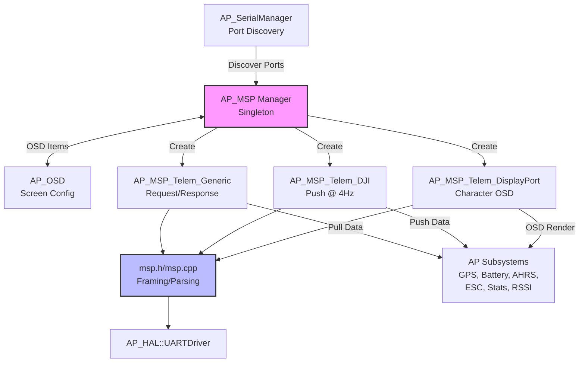
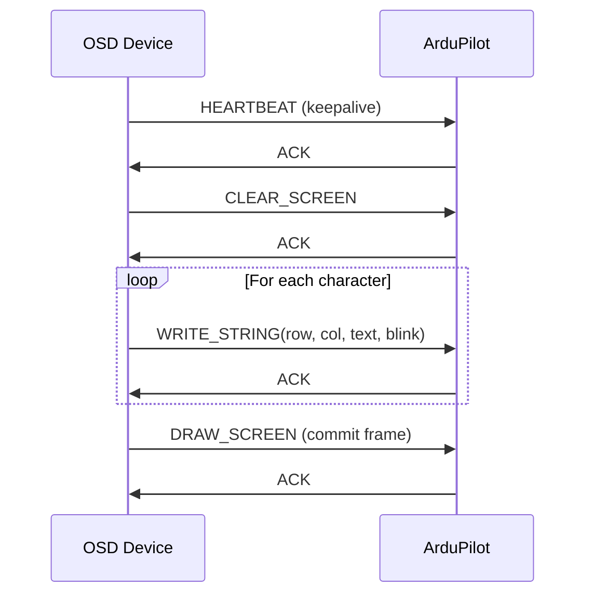

# AP_MSP - MultiWii Serial Protocol Library

## Overview

The AP_MSP library implements the MultiWii Serial Protocol (MSP) for ArduPilot, providing telemetry integration and on-screen display (OSD) support for Betaflight, INAV, and DJI-compatible devices. MSP enables communication between ArduPilot and external OSD hardware, ground control stations, and FPV equipment, supporting both legacy MSPv1 and modern MSPv2 protocols with bidirectional telemetry and sensor data exchange.

This library bridges ArduPilot's internal telemetry systems (AP_OSD, GPS, Battery, AHRS, etc.) to MSP-compatible devices, allowing real-time flight data display on FPV goggles, standalone OSD modules, and DJI Air Units.

## Architecture

The AP_MSP library follows a manager-backend architecture with protocol-specific implementations:



### Key Components

- **AP_MSP**: Central singleton manager that discovers MSP-capable serial ports, instantiates backends, maps OSD items to AP_OSD configuration, and runs the dedicated MSP loop thread at ~100Hz
- **AP_MSP_Telem_Backend**: Abstract base class providing WFQ (Weighted Fair Queue) telemetry scheduler, MSP command processing, telemetry helpers, and integration with AP subsystems
- **AP_MSP_Telem_Generic**: Minimal stateless backend for standard MSP protocol (SerialProtocol_MSP) operating in request/response mode
- **AP_MSP_Telem_DJI**: DJI Air Unit backend (SerialProtocol_DJI_FPV) with push telemetry at 4Hz, OSD stats fusion, and DJI-specific flight mode flags
- **AP_MSP_Telem_DisplayPort**: Character-mode OSD rendering backend (SerialProtocol_MSP_DisplayPort) using DisplayPort protocol commands
- **msp.h/msp.cpp**: Protocol core providing MSP framing, encoding (V1/V2), parsing state machine, and UART transmission with XOR (V1) or CRC8 (V2) checksums
- **msp_sbuf.h**: Safe buffer utilities for packet serialization/deserialization with bounds checking

## Protocol Versions

AP_MSP supports three MSP protocol variants for compatibility with different OSD devices and ground stations:

### MSP v1 (Original Protocol)

MSP v1 is the original MultiWii Serial Protocol with simple framing and XOR checksum:

**Frame Structure:**
```
['$']['M']['<'][size][cmd][payload...][checksum]
```

- **Header**: 3 bytes ('$', 'M', '<' for requests or '>' for responses)
- **Size**: 1 byte payload length (0-255 bytes, no jumbo frame support)
- **Command**: 1 byte command ID (0-255)
- **Payload**: Variable length data
- **Checksum**: 1 byte XOR checksum of size, cmd, and payload bytes

**Characteristics:**
- Limited to 255 command IDs
- Simple XOR checksum (lower error detection)
- Maximum payload: 255 bytes
- Widely supported by legacy devices

### MSP v2 over v1 (Hybrid Encapsulation)

MSP v2 messages encapsulated within v1 frames for backward compatibility:

**Frame Structure:**
```
['$']['M']['<'][jumbo_size][255][size_low][size_high][cmd_low][cmd_high][payload...][checksum]
```

- Command ID 255 signals v2 encapsulation
- 16-bit size field supports larger payloads
- 16-bit command ID extends command space
- XOR checksum calculated on entire frame
- Compatible with v1 parsers that skip unknown commands

### MSP v2 Native (Modern Protocol)

Native MSP v2 with enhanced features and CRC error detection:

**Frame Structure:**
```
['$']['X']['<'][flags][cmd_low][cmd_high][size_low][size_high][payload...][crc]
```

- **Header**: 3 bytes ('$', 'X', '<' for requests or '>' for responses)
- **Flags**: 1 byte control flags (function, reply direction)
- **Command**: 2 bytes (0-65535, supports 0x1F00-0x1FFF sensor message range)
- **Size**: 2 bytes payload length (0-65535)
- **Payload**: Variable length data
- **CRC**: 1 byte CRC8 DVB-S2 checksum for robust error detection

**Sensor Message Range (0x1F00-0x1FFF):**
MSP v2 reserves commands 0x1F00-0x1FFF for bidirectional sensor data:
- MSP_SENSOR_RANGEFINDER (0x1F01): Distance sensor data
- MSP_SENSOR_OPTICAL_FLOW (0x1F02): Optical flow motion vectors
- MSP_SENSOR_GPS (0x1F03): GPS fix and position data
- MSP_SENSOR_COMPASS (0x1F04): Magnetometer readings
- MSP_SENSOR_BAROMETER (0x1F05): Barometric pressure and temperature
- MSP_SENSOR_AIRSPEED (0x1F06): Differential pressure airspeed

**Protocol Selection:**
- Generic MSP backend: Auto-detects protocol version from received frames
- DJI backend: Uses v1 protocol for maximum compatibility
- DisplayPort backend: Uses protocol version requested by OSD device

## Backend Architecture

### AP_MSP_Telem_Backend (Abstract Base Class)

The base class inherits from AP_RCTelemetry and provides common infrastructure for all MSP backends:

**Key Responsibilities:**
- MSP packet framing and parsing via `msp_port_t` state machine
- Weighted Fair Queue (WFQ) telemetry scheduler with 12 packet slots
- Telemetry state management (battery, GPS, attitude, home position, airspeed, flight mode)
- MSP command dispatch and response generation
- Integration with AP subsystems (GPS, Battery Monitor, AHRS, ESC telemetry, Stats, RSSI)
- OSD item visibility control
- Thread-safe access to shared state via WITH_SEMAPHORE

**WFQ Scheduler Slots:**
```
Slot 0:  EMPTY (unused)
Slot 1:  MSP_NAME (FC name)
Slot 2:  MSP_STATUS (armed state, flight mode)
Slot 3:  MSP_OSD_CONFIG (OSD configuration)
Slot 4:  MSP_RAW_GPS (GPS position, altitude, speed)
Slot 5:  MSP_COMP_GPS (compass heading, home bearing/distance)
Slot 6:  MSP_ATTITUDE (roll, pitch, yaw)
Slot 7:  MSP_ALTITUDE (barometric and estimated altitude, vertical speed)
Slot 8:  MSP_ANALOG (battery voltage, current, RSSI)
Slot 9:  MSP_BATTERY_STATE (detailed battery state)
Slot 10: MSP_ESC_SENSOR_DATA (ESC telemetry) [if HAL_WITH_ESC_TELEM]
Slot 11: MSP_RTC (real-time clock)
```

**Virtual Methods for Backend Customization:**
- `is_scheduler_enabled()`: Enable/disable push telemetry scheduler
- `use_msp_thread()`: Handle backend in dedicated MSP thread or custom thread
- `get_serial_protocol()`: Return SerialProtocol enum for this backend
- `get_osd_flight_mode_bitmask()`: Generate vehicle-specific flight mode flags
- `hide_osd_items()`: Customize OSD item visibility
- `displaying_stats_screen()`: Check if post-flight statistics displayed

### AP_MSP_Telem_Generic (Standard MSP Backend)

**Protocol**: SerialProtocol_MSP  
**Mode**: Request/response (no push telemetry)  
**Use Case**: Standard MSP-compatible devices, configurators, ground stations

**Characteristics:**
- Minimal stateless implementation
- Disables WFQ scheduler (`is_scheduler_enabled()` returns false)
- Responds to queries only (no continuous telemetry push)
- Auto-detects MSP protocol version from incoming frames
- Compatible with Betaflight Configurator, INAV Configurator, Cleanflight

**Typical Devices:**
- Betaflight/INAV configurators via USB/UART
- Standard MSP OSD modules in request/response mode
- Ground control stations with MSP support

### AP_MSP_Telem_DJI (DJI FPV Backend)

**Protocol**: SerialProtocol_DJI_FPV  
**Mode**: Push telemetry at 4Hz  
**Use Case**: DJI FPV Air Unit, DJI goggles

**Characteristics:**
- Enables WFQ scheduler for continuous telemetry push
- DJI Air Unit polls 19 messages in ascending hexadecimal order at ~4Hz
- Custom RSSI handling via `AP::rssi()` singleton
- OSD stats fusion (peak/min battery voltage, max current, max altitude, etc.)
- DJI-specific flight mode flags mapping ArduPilot modes to DJI OSD logic

**DJI Flight Mode Flags:**
```cpp
DJI_FLAG_ARM:   Armed status
DJI_FLAG_STAB:  Stabilize mode active
DJI_FLAG_HOR:   Horizontal position hold active
DJI_FLAG_HEAD:  Heading hold active
DJI_FLAG_FS:    Failsafe triggered
DJI_FLAG_RESC:  Rescue mode active
```

**DJI Air Unit Polled Messages (19 total):**
- MSP_FC_VERSION, MSP_NAME, MSP_OSD_CONFIG
- MSP_STATUS, MSP_RAW_GPS, MSP_COMP_GPS
- MSP_ATTITUDE, MSP_ALTITUDE, MSP_ANALOG
- MSP_BATTERY_STATE, MSP_ESC_SENSOR_DATA
- Plus additional configuration and stats messages

### AP_MSP_Telem_DisplayPort (OSD Rendering Backend)

**Protocol**: SerialProtocol_MSP_DisplayPort  
**Mode**: Synchronous character-mode OSD  
**Use Case**: Character-based OSD devices, Betaflight OSD, MSP OSD modules

**Characteristics:**
- Disables WFQ scheduler and MSP thread (handled in OSD thread)
- Synchronizes with AP_OSD rendering at screen refresh rate
- Custom UART buffer allocation: `uart->begin(0, 256, 768)` for larger screen buffers
- Supports MAX7456 character set with Betaflight/INAV font mapping options
- Configurable FC identifier (BETAFLIGHT or ARDUPILOT) for device compatibility

**DisplayPort Command Flow:**


**Font Support:**
- Default: MAX7456 character set (standard OSD font)
- Option `DISPLAYPORT_BTFL_SYMBOLS`: Betaflight symbol indexes
- Option `DISPLAYPORT_INAV_SYMBOLS`: INAV symbol indexes (overrides BTFL)

## OSD Integration

The AP_MSP library integrates tightly with AP_OSD for on-screen display telemetry:

### OSD Item Enumeration

MSP supports 58 standardized OSD items compatible with Betaflight/INAV OSD layouts:

| Item ID | Name | Description |
|---------|------|-------------|
| 0 | OSD_RSSI_VALUE | RSSI percentage (0-100%) |
| 1 | OSD_MAIN_BATT_VOLTAGE | Main battery voltage |
| 2 | OSD_CROSSHAIRS | Center crosshairs |
| 3 | OSD_ARTIFICIAL_HORIZON | Artificial horizon indicator |
| 4 | OSD_HORIZON_SIDEBARS | Horizon sidebars |
| 7 | OSD_FLYMODE | Current flight mode text |
| 9 | OSD_THROTTLE_POS | Throttle position (0-100%) |
| 11 | OSD_GPS_SPEED | GPS ground speed |
| 12 | OSD_GPS_SATS | GPS satellite count |
| 13 | OSD_ALTITUDE | Barometric altitude |
| 26 | OSD_HOME_DIR | Arrow pointing to home |
| 27 | OSD_HOME_DIST | Distance to home |
| 35 | OSD_NUMERICAL_HEADING | Compass heading (degrees) |
| 36 | OSD_NUMERICAL_VARIO | Vertical speed indicator |
| 38 | OSD_CURRENT_DRAW | Battery current draw |
| 39 | OSD_MAH_DRAWN | Energy consumed (mAh) |
| 41 | OSD_BATTERY_REMAINING | Battery capacity remaining (%) |
| ... | ... | ... (58 items total) |

### OSD Position Encoding

OSD items use a linear position encoding scheme compatible with Betaflight:

```
position = 2048 + x + (y * 32)
```

- **Base offset**: 2048 (MSP_OSD_START constant)
- **X step**: 1 column (MSP_OSD_STEP_X)
- **Y step**: 32 rows (MSP_OSD_STEP_Y)
- **Screen dimensions**: Typically 30 columns × 16 rows for MAX7456 OSD

**Example Positions:**
- Top-left (0, 0): 2048
- Center (15, 8): 2048 + 15 + 8×32 = 2319
- Bottom-right (29, 15): 2048 + 29 + 15×32 = 2557

### DisplayPort Protocol Commands

Character-mode OSD rendering uses DisplayPort subcommands:

**MSP_DISPLAYPORT (0x182):**
- **HEARTBEAT (0)**: Keepalive - OSD device sends periodically (typically every 500ms) to maintain connection
- **RELEASE (1)**: Release OSD control - allows other systems to draw
- **CLEAR_SCREEN (2)**: Clear all screen characters
- **WRITE_STRING (3)**: Write text at position (row, col, string, attribute byte)
  - Attribute byte bits: [7]=version(0), [6]=blink, [5:0]=future use
- **DRAW_SCREEN (4)**: Commit all pending writes to display
- **SET_OPTIONS (5)**: Configure font index and screen resolution

### Font Translation

AP_MSP supports multiple font sets for OSD character rendering:

1. **Default MAX7456**: Standard OSD font used by analog video OSDs
2. **Betaflight Fonts** (`MSP_OPTIONS` bit 2): Betaflight-specific symbol indexes for icons
3. **INAV Fonts** (`MSP_OPTIONS` bit 3): INAV-specific symbol indexes (overrides Betaflight)

Font translation applies to special symbols (arrows, battery icons, GPS fix indicators, etc.) while preserving alphanumeric characters.

### DJI OSD Statistics Fusion

The DJI backend implements OSD statistics tracking for post-flight review:

**Tracked Statistics:**
- Maximum speed (ground and airspeed)
- Maximum altitude (barometric and GPS)
- Maximum distance from home
- Minimum battery voltage
- Maximum current draw
- Total energy consumed (mAh)
- Flight time duration
- Maximum vertical speed (climb and descent rates)

Statistics update in real-time and are transmitted in MSP_OSD_CONFIG responses for DJI goggle display.

## Telemetry Data Mapping

AP_MSP extracts telemetry from ArduPilot subsystems and formats for MSP protocol transmission:

### Battery State

**Source**: `AP::battery()` singleton  
**MSP Messages**: MSP_ANALOG, MSP_BATTERY_STATE  
**Update Rate**: Pulled on-demand or pushed at scheduler rate

```cpp
battery_state_t {
    float batt_voltage_v;        // Battery voltage in volts
    float batt_current_a;        // Current draw in amperes
    float batt_consumed_mah;     // Energy consumed in milliamp-hours
    int32_t batt_capacity_mah;   // Total battery capacity in mAh
    uint8_t batt_cellcount;      // LiPo cell count (auto-detected or manual override)
    battery_state_e batt_state;  // State: OK, WARNING, CRITICAL, NOT_PRESENT, INIT
}
```

**Cell Count Detection:**
- Auto mode (MSP_OSD_NCELLS=0): Estimates cells from voltage (CELLFULL = 4.35V per cell)
- Manual override (MSP_OSD_NCELLS=1-14): Uses configured cell count

### GPS State

**Source**: `AP::gps()` singleton  
**MSP Messages**: MSP_RAW_GPS, MSP_COMP_GPS  
**Update Rate**: GPS update rate (typically 5-10Hz)

```cpp
gps_state_t {
    uint8_t fix_type;           // 0=No Fix, 1=Dead Reckoning, 2=2D, 3=3D, 4=GPS+DR, 5=Time Only
    uint8_t num_sats;           // Number of satellites used in fix
    int32_t lat;                // Latitude in degrees × 10^7 (e.g., 472560963 = 47.2560963°)
    int32_t lon;                // Longitude in degrees × 10^7
    uint16_t alt_m;             // Altitude MSL in meters
    uint16_t speed_cms;         // Ground speed in centimeters per second
    uint16_t ground_course_dd;  // Course over ground in degrees × 100 (0-35999)
}
```

### Attitude (AHRS)

**Source**: `AP::ahrs()` singleton  
**MSP Message**: MSP_ATTITUDE  
**Update Rate**: AHRS rate (typically 50-400Hz, sampled at scheduler rate)

```cpp
Attitude {
    int16_t roll;   // Roll angle in decidegrees (-1800 to +1800 = -180° to +180°)
    int16_t pitch;  // Pitch angle in decidegrees
    int16_t yaw;    // Yaw heading in decidegrees (0-3599 = 0-359.9°)
}
```

**Coordinate System**: NED (North-East-Down) body frame relative to earth frame

### Home Position

**Source**: `AP::ahrs()` home position  
**MSP Message**: MSP_COMP_GPS  
**Update Rate**: Position estimate rate

```cpp
home_state_t {
    bool home_is_set;           // Home position recorded
    float home_bearing_cd;      // Bearing to home in centidegrees (0-35999)
    uint32_t home_distance_m;   // Distance to home in meters
    int32_t rel_altitude_cm;    // Relative altitude from home in centimeters
}
```

### Airspeed

**Source**: `AP::airspeed()` singleton (fixed-wing only)  
**MSP Message**: MSP_ANALOG (airspeed field)  
**Update Rate**: Airspeed sensor rate

```cpp
airspeed_state_t {
    float airspeed_estimate_ms;      // Airspeed in meters per second
    bool airspeed_have_estimate;     // Valid airspeed estimate available
}
```

### Flight Mode

**Source**: Vehicle control_mode and custom_mode  
**MSP Message**: MSP_STATUS (mode flags), OSD_FLYMODE (mode text)  
**Update Rate**: Mode change events + periodic refresh

**Flight Mode String Generation:**
- Converts ArduPilot mode enum to human-readable text (e.g., "STABILIZE", "LOITER", "AUTO")
- Truncated to MSP_TXT_VISIBLE_CHARS (11 characters)
- UTF-8 arrow characters for directional indicators
- DJI backend maps modes to DJI flag bitmask for goggle UI

### ESC Telemetry

**Source**: `AP::esc_telem()` singleton  
**MSP Message**: MSP_ESC_SENSOR_DATA  
**Availability**: Requires HAL_WITH_ESC_TELEM

Aggregates ESC data (RPM, voltage, current, temperature) across all motors for telemetry display.

## Command Handling

MSP command processing follows a request-response model with command handlers dispatching to backend implementations:

### Version and Identification Commands

**MSP_API_VERSION (1):**
- Returns: API version major/minor (emulates Betaflight 1.43)
- Purpose: Protocol version negotiation

**MSP_FC_VARIANT (2):**
- Returns: 4-character flight controller identifier
  - Generic/DJI: "ARDU"
  - DisplayPort: "BTFL" (Betaflight) or "ARDU" based on options
- Purpose: Device compatibility identification

**MSP_FC_VERSION (3):**
- Returns: FC version (major, minor, patch) - emulates Betaflight 4.2.0
- Purpose: Feature compatibility detection

**MSP_BOARD_INFO (4):**
- Returns: Board identifier and hardware version
- Purpose: Hardware-specific configuration

**MSP_BUILD_INFO (5):**
- Returns: Build date and time strings
- Purpose: Firmware version tracking

### Status and Telemetry Commands

**MSP_STATUS (101):**
- Returns: Cycle time, I2C errors, sensor status, armed flag, flight mode bitmask
- Update: Real-time on request or WFQ scheduled push

**MSP_RAW_IMU (102):**
- Returns: Accelerometer and gyroscope raw values
- Purpose: Debugging sensor data

**MSP_ANALOG (110):**
- Returns: Battery voltage (decidVolts), consumed mAh, RSSI, current (deciAmps)
- Update: Real-time battery state

**MSP_BATTERY_STATE (130):**
- Returns: Detailed battery state including cell count, capacity, voltage, current, state enum
- Update: Enhanced battery monitoring

**MSP_RAW_GPS (106):**
- Returns: GPS fix, satellites, position (lat/lon), altitude, speed, course
- Update: GPS update rate

**MSP_COMP_GPS (107):**
- Returns: Home distance, bearing to home, GPS update flag
- Update: Navigation data

**MSP_ATTITUDE (108):**
- Returns: Roll, pitch, yaw angles in decidegrees
- Update: AHRS rate

**MSP_ALTITUDE (109):**
- Returns: Estimated altitude (cm), vertical speed (cm/s)
- Update: Position estimate rate

**MSP_RTC (247):**
- Returns: Real-time clock (date, time) from GPS or system time
- Purpose: Time synchronization for log correlation

### OSD Configuration Commands

**MSP_OSD_CONFIG (84):**
- Returns: OSD item positions, enabled/disabled state, unit system, alarm thresholds
- Purpose: OSD layout configuration and statistics

### DisplayPort Commands

**MSP_DISPLAYPORT (182):**
- Subcommands: HEARTBEAT, RELEASE, CLEAR_SCREEN, WRITE_STRING, DRAW_SCREEN, SET_OPTIONS
- Purpose: Character-mode OSD rendering

### Sensor Commands (MSP v2, 0x1F00-0x1FFF)

**MSP_SENSOR_RANGEFINDER (0x1F01):**
- Bidirectional: External rangefinder → ArduPilot or ArduPilot → GCS
- Data: Distance (mm), quality (0-255)

**MSP_SENSOR_OPTICAL_FLOW (0x1F02):**
- Data: Motion vectors (x, y), quality

**MSP_SENSOR_GPS (0x1F03):**
- Data: Full GPS state (fix, satellites, position, velocity, accuracy)

**MSP_SENSOR_COMPASS (0x1F04):**
- Data: Magnetometer readings (mGauss, NED frame)

**MSP_SENSOR_BAROMETER (0x1F05):**
- Data: Pressure (Pa), temperature (centi-°C)

**MSP_SENSOR_AIRSPEED (0x1F06):**
- Data: Differential pressure, temperature

**Command Result Codes:**
```cpp
MSP_RESULT_ACK = 1        // Command processed successfully
MSP_RESULT_ERROR = -1     // Command failed or invalid
MSP_RESULT_NO_REPLY = 0   // Command received, no response needed
```

## UART Configuration

AP_MSP uses AP_SerialManager for serial port discovery and configuration:

### Serial Protocol Types

ArduPilot recognizes three MSP protocol types for serial port configuration:

| Protocol ID | Name | Backend | Use Case |
|-------------|------|---------|----------|
| SerialProtocol_MSP | MSP | Generic | Standard MSP devices, configurators |
| SerialProtocol_DJI_FPV | DJI_FPV | DJI | DJI Air Unit, DJI FPV goggles |
| SerialProtocol_MSP_DisplayPort | DisplayPort | DisplayPort | Character-mode OSD devices |

### Buffer Sizes

Default UART buffer allocation per backend:

**Generic and DJI Backends:**
```cpp
Input buffer:  192 bytes  (MSP_PORT_INBUF_SIZE)
Output buffer: 512 bytes  (MSP_PORT_OUTBUF_SIZE)
```

**DisplayPort Backend:**
```cpp
// Custom buffer allocation for screen updates
uart->begin(0, 256, 768);  // (baud, rx_size, tx_size)
Input buffer:  256 bytes
Output buffer: 768 bytes
```

DisplayPort requires larger buffers to accommodate full-screen character updates (30 columns × 16 rows maximum).

### Baud Rate Configuration

Typical baud rates by protocol:

- **MSP Generic**: 115200 baud (configurable, often 57600 or 115200)
- **DJI FPV**: 115200 baud (DJI Air Unit standard)
- **DisplayPort**: Varies by device (57600, 115200, or 230400)

### Parameter Configuration Example

Configure serial port for MSP protocols using SERIALx parameters:

**Example 1: Generic MSP on SERIAL2 (UART2/Telem2)**
```
SERIAL2_PROTOCOL = 33     # MSP protocol
SERIAL2_BAUD = 115        # 115200 baud
```

**Example 2: DJI FPV on SERIAL3**
```
SERIAL3_PROTOCOL = 34     # DJI_FPV protocol
SERIAL3_BAUD = 115        # 115200 baud
```

**Example 3: DisplayPort OSD on SERIAL4**
```
SERIAL4_PROTOCOL = 42     # MSP DisplayPort
SERIAL4_BAUD = 115        # 115200 baud
```

### Serial Port Discovery

AP_MSP initialization sequence:

1. **Port Discovery**: `AP::serialmanager()->find_serial(protocol, instance)` searches configured serial ports
2. **Backend Creation**: Creates appropriate backend (Generic, DJI, DisplayPort) based on protocol
3. **UART Initialization**: Calls `backend->init_uart()` to configure UART drivers
4. **Thread Startup**: Starts dedicated MSP loop thread if `backend->use_msp_thread()` returns true

### Multi-Instance Support

AP_MSP supports up to `MSP_MAX_INSTANCES` (3) concurrent backends:

```cpp
// Example: Run Generic MSP + DJI + DisplayPort simultaneously
SERIAL2_PROTOCOL = 33   # Generic MSP for configurator
SERIAL3_PROTOCOL = 34   # DJI for Air Unit telemetry
SERIAL4_PROTOCOL = 42   # DisplayPort for OSD
```

Each backend operates independently with separate UART buffers and state.

## MSP Thread and Scheduler

### Dedicated MSP Loop Thread

AP_MSP runs a dedicated thread for backends that require continuous processing:

**Thread Characteristics:**
- **Update Rate**: ~100Hz (10ms loop interval)
- **Priority**: Standard thread priority (not real-time)
- **Activation**: Started when at least one backend with `use_msp_thread() == true` exists
- **Backends Using Thread**: Generic MSP, DJI (DisplayPort uses OSD thread instead)

**Thread Responsibilities:**
- Call `backend->init_uart()` on first iteration
- Update OSD flashing state (fast @ 1.4Hz, slow @ 0.5Hz)
- Manage flight mode focus timer (2 second highlight period after mode change)
- Call `backend->hide_osd_items()` to update visibility
- Call `backend->process_incoming_data()` to parse received MSP packets
- Call `backend->process_outgoing_data()` to send queued telemetry

### Weighted Fair Queue (WFQ) Scheduler

The WFQ scheduler ensures fair bandwidth allocation across telemetry packet types:

**Scheduler Design:**
- **Slots**: 12 telemetry packet types mapped to MSP commands
- **Algorithm**: Weighted round-robin with priority-based slot allocation
- **Bandwidth**: Dynamically allocated based on packet update rates and priorities
- **Activation**: Enabled for DJI backend (`is_scheduler_enabled() == true`), disabled for Generic/DisplayPort

**Scheduler Operation:**
```cpp
// Simplified scheduler logic
for (slot = 0; slot < MSP_TIME_SLOT_MAX; slot++) {
    if (is_packet_ready(slot)) {
        send_packet(slot);
        break;  // One packet per scheduler cycle
    }
}
```

**Packet Priorities:**
High priority packets (sent more frequently):
- MSP_STATUS: Armed state, flight mode (critical for pilot awareness)
- MSP_ATTITUDE: Real-time attitude display
- MSP_RAW_GPS: Position updates

Medium priority packets:
- MSP_ANALOG: Battery voltage, current, RSSI
- MSP_ALTITUDE: Altitude and vertical speed

Low priority packets:
- MSP_NAME: FC name (sent once, then infrequent updates)
- MSP_OSD_CONFIG: Configuration data (infrequent)

### OSD Flashing Support

The MSP thread manages two independent flashing rates for blinking OSD items:

**Fast Flashing:**
- **Rate**: 1.4Hz (714ms period, toggles every 357ms)
- **Use Case**: Urgent warnings (low battery, failsafe active)
- **State**: `_msp_status.flashing_on`

**Slow Flashing:**
- **Rate**: 0.5Hz (2000ms period, toggles every 1000ms)
- **Use Case**: Non-critical indicators (GPS searching, arming disabled)
- **State**: `_msp_status.slow_flashing_on`

### Flight Mode Focus Timer

Highlights flight mode changes for pilot awareness:

**Mechanism:**
- Detects mode changes by comparing `current_mode` to `last_flight_mode`
- Sets `flight_mode_focus` flag for 2 seconds (OSD_FLIGHT_MODE_FOCUS_TIME = 2000ms)
- During focus period, flight mode text may be highlighted or enlarged on OSD
- Resets on next mode change or timeout

**Purpose**: Ensures pilot notices mode transitions (e.g., AUTO → LOITER, STABILIZE → RTL)

### OSD Item Update Synchronization

AP_MSP synchronizes OSD item configuration with AP_OSD:

**Update Triggers:**
- Screen change (pilot switches between OSD screens 0-3)
- Initial boot after AP_OSD initialization
- Parameter changes affecting OSD layout

**Update Process:**
1. `update_osd_item_settings()` retrieves OSD item positions from AP_OSD
2. Stores pointers to `AP_OSD_Setting` structures in `_osd_item_settings[]` array
3. Maps 58 MSP OSD items to corresponding AP_OSD panel configurations
4. Backends read item positions via `MSP_OSD_POS(x, y)` macro when generating OSD_CONFIG responses

## Configuration Parameters

AP_MSP exposes runtime configuration via AP_Param parameters:

### MSP_OSD_NCELLS

**Description**: LiPo battery cell count override for voltage-to-cell-count estimation

**Type**: AP_Int8 (8-bit signed integer)  
**Range**: 0-14  
**Default**: 0 (auto-detect)

**Values:**
- **0**: Auto-detect cell count from battery voltage (default)
  - Algorithm: `cell_count = floor(voltage / CELLFULL)` where CELLFULL = 4.35V
  - Works for 1S-14S LiPo batteries
- **1-14**: Manually specify cell count
  - Use when auto-detection fails or for non-standard battery chemistries
  - Ensures accurate per-cell voltage display on OSD

**Example Usage:**
```
MSP_OSD_NCELLS = 0   # Auto-detect (3S battery at 12.6V → 3 cells)
MSP_OSD_NCELLS = 4   # Force 4S for 4S2P pack or LiHV cells
```

### MSP_OPTIONS

**Description**: Bitmask of MSP feature options

**Type**: AP_Int32 (32-bit signed integer)  
**Default**: 0 (all options disabled)

**Option Bits:**

| Bit | Name | Value | Description |
|-----|------|-------|-------------|
| 0 | EnableTelemetryMode | 1 | Enable push telemetry when only RX connected (no TX polling) |
| 1 | DisableDJIWorkarounds | 2 | Disable DJI-specific compatibility workarounds |
| 2 | EnableBTFLFonts | 4 | Use Betaflight font symbol indexes for DisplayPort OSD |
| 3 | EnableINAVFonts | 8 | Use INAV font symbol indexes (overrides Betaflight if both set) |

**Bit 0: EnableTelemetryMode (TELEMETRY_MODE)**
- **Purpose**: Enable continuous push telemetry for Generic MSP backend
- **Use Case**: When MSP device only has RX connected (no TX polling capability)
- **Behavior**: Generic backend enables WFQ scheduler to push telemetry continuously
- **Default**: Disabled (request/response mode only)

**Bit 1: DisableDJIWorkarounds (TELEMETRY_DISABLE_DJI_WORKAROUNDS)**
- **Purpose**: Disable DJI Air Unit compatibility workarounds
- **Use Case**: Advanced debugging or non-standard DJI setups
- **Default**: Disabled (workarounds active)

**Bit 2: EnableBTFLFonts (DISPLAYPORT_BTFL_SYMBOLS)**
- **Purpose**: Use Betaflight symbol character indexes for OSD icons
- **Use Case**: Betaflight OSD devices expecting BTFL font layout
- **Fonts**: Maps ArduPilot symbols to Betaflight font positions
- **Default**: Disabled (MAX7456 default font)

**Bit 3: EnableINAVFonts (DISPLAYPORT_INAV_SYMBOLS)**
- **Purpose**: Use INAV symbol character indexes for OSD icons
- **Use Case**: INAV OSD devices expecting INAV font layout
- **Priority**: Overrides BTFL fonts if both bits set
- **Fonts**: Maps ArduPilot symbols to INAV font positions
- **Default**: Disabled (MAX7456 default font)

**Example Configurations:**
```
# Generic MSP with push telemetry enabled
MSP_OPTIONS = 1

# DisplayPort with Betaflight fonts
MSP_OPTIONS = 4

# DisplayPort with INAV fonts (overrides BTFL)
MSP_OPTIONS = 8

# Combined: Telemetry mode + BTFL fonts
MSP_OPTIONS = 5  # (bit 0 + bit 2)
```

**Checking Options in Code:**
```cpp
// AP_MSP uses is_option_enabled() helper
if (_options & (int32_t)Option::DISPLAYPORT_BTFL_SYMBOLS) {
    // Use Betaflight font mapping
}
```

## Testing

### SITL DisplayPort Simulation

Test MSP DisplayPort OSD integration in Software-In-The-Loop simulation:

**1. Start SITL with MSP Parameters:**
```bash
cd ArduPilot
sim_vehicle.py -v Copter --console --map

# In MAVProxy console, configure MSP DisplayPort
param set SERIAL5_PROTOCOL 42    # MSP DisplayPort
param set SERIAL5_BAUD 115       # 115200 baud
param set OSD_TYPE 1             # Enable OSD
param fetch
param write
```

**2. Connect Python OSD Viewer:**
```bash
cd libraries/AP_MSP/Tools
python3 msposd.py --port tcp:localhost:5763
```

The `msposd.py` tool provides a Pygame-based OSD viewer that connects via MSP DisplayPort and renders telemetry in real-time.

**3. Verify OSD Display:**
- Battery voltage and current should display
- GPS status (satellites, fix type) should update
- Attitude (artificial horizon) should track vehicle orientation
- Flight mode text should change with mode switches
- RSSI should display signal strength

**4. Test Mode Changes:**
```bash
# In MAVProxy console
mode LOITER
mode AUTO
mode RTL
```

Flight mode text should update on OSD with 2-second focus highlight.

### Hardware Testing

#### DJI Air Unit Testing

**Setup:**
1. Connect DJI Air Unit to flight controller UART (typically SERIAL3)
2. Configure parameters:
   ```
   SERIAL3_PROTOCOL = 34    # DJI_FPV
   SERIAL3_BAUD = 115       # 115200 baud
   SERIAL3_OPTIONS = 0      # Default (no inversion)
   ```
3. Power cycle flight controller
4. Connect DJI goggles to Air Unit

**Verification:**
- DJI goggles OSD should display ArduPilot telemetry
- Battery voltage, current, mAh consumed visible
- GPS status (satellites, home distance/direction)
- Altitude and vertical speed
- Flight mode (check mode name accuracy)
- RSSI bars
- Armed/disarmed status

**DJI-Specific Checks:**
- Verify DJI flag mapping: ARM, STAB, HOR, HEAD, FS, RESC flags
- Test failsafe trigger → FS flag should activate
- Check ESC telemetry aggregation (if ESCs support telemetry)

#### Betaflight OSD Testing

**Setup:**
1. Connect Betaflight OSD module to flight controller UART
2. Configure parameters:
   ```
   SERIAL4_PROTOCOL = 42    # MSP DisplayPort
   SERIAL4_BAUD = 115       # 115200 baud
   MSP_OPTIONS = 4          # Betaflight fonts
   OSD_TYPE = 1             # Enable OSD
   ```
3. Configure OSD item positions via Mission Planner or QGroundControl OSD tab

**Verification:**
- OSD items should appear at configured screen positions
- Font symbols (home arrow, GPS satellite icon) should render correctly
- Blinking items (warnings) should flash at 1.4Hz or 0.5Hz
- Screen switching (OSD screen 1-4) should change layout

#### INAV OSD Testing

**Setup:** Similar to Betaflight, but set:
```
MSP_OPTIONS = 8    # INAV fonts (bit 3)
```

### MAVProxy Testing Commands

Useful MAVProxy commands for MSP testing:

**Parameter Configuration:**
```bash
param set SERIAL2_PROTOCOL 33
param set MSP_OSD_NCELLS 4
param set MSP_OPTIONS 5
param fetch
param write
```

**Mode Testing:**
```bash
mode STABILIZE
mode LOITER
mode AUTO
mode RTL
mode LAND
```

**Battery Simulation (SITL):**
```bash
param set SIM_BATT_VOLTAGE 14.8    # Simulate 4S battery
param set SIM_BATT_CAP_AH 5.0      # 5000 mAh capacity
```

**GPS Simulation (SITL):**
```bash
param set SIM_GPS_TYPE 1           # Enable simulated GPS
param set SIM_GPS_NUMSATS 12       # Simulate 12 satellites
```

### Log Analysis

Enable MSP logging and analyze telemetry:

**1. Enable Logging:**
```bash
param set LOG_BACKEND_TYPE 1       # Block logging
param set LOG_BITMASK 131071       # Log everything
```

**2. Review Logs:**
- Look for MSP-related messages in dataflash logs
- Check UART buffer usage (UART message type)
- Verify telemetry data consistency (compare GPS log to MSP GPS messages)

**3. Common Log Messages:**
- `MSG`: Text messages including MSP initialization status
- `UART`: UART buffer statistics (overflow detection)
- `GPS`: GPS data for comparison with MSP_RAW_GPS
- `BAT`: Battery state for comparison with MSP_BATTERY_STATE

### Troubleshooting Common Issues

**Problem: No OSD Display**
- **Check**: SERIAL port configured correctly (protocol, baud rate)
- **Check**: Physical UART connection (TX → RX, RX → TX, GND common)
- **Check**: OSD_TYPE parameter enabled (OSD_TYPE = 1)
- **Check**: MSP backend initialization in boot messages
- **Solution**: Verify UART with logic analyzer or oscilloscope

**Problem: Garbled Characters**
- **Cause**: Baud rate mismatch or UART signal inversion
- **Check**: SERIAL baud matches OSD device expectation
- **Check**: SERIALx_OPTIONS bit 0 (invert RX) or bit 1 (invert TX) if needed
- **Solution**: Try common baud rates: 57600, 115200, 230400

**Problem: Missing Telemetry Data**
- **Cause**: Backend not receiving MSP queries or WFQ scheduler disabled
- **Check**: For Generic MSP, verify device is sending MSP queries
- **Check**: For DJI, verify 115200 baud and Air Unit firmware version
- **Check**: MSP_OPTIONS bit 0 for push telemetry if device has no TX
- **Solution**: Enable MSP telemetry mode or check device compatibility

**Problem: Incorrect Cell Count Display**
- **Cause**: Auto-detection failure with non-standard battery
- **Solution**: Set MSP_OSD_NCELLS manually to actual cell count
- **Example**: `param set MSP_OSD_NCELLS 6` for 6S battery

**Problem: Wrong Font Symbols**
- **Cause**: Font mismatch between ArduPilot and OSD device
- **Solution**: Set MSP_OPTIONS bit 2 (BTFL) or bit 3 (INAV) for font compatibility
- **Example**: `param set MSP_OPTIONS 4` for Betaflight OSD

## Code Examples

### Backend Initialization

AP_MSP manager creates backends during initialization:

```cpp
// Source: libraries/AP_MSP/AP_MSP.cpp

void AP_MSP::init()
{
    // Discover MSP-capable serial ports via AP_SerialManager
    AP_SerialManager &serial_manager = AP::serialmanager();
    
    // Search for each protocol type
    for (uint8_t protocol : {SerialProtocol_MSP, SerialProtocol_DJI_FPV, SerialProtocol_MSP_DisplayPort}) {
        uint8_t instance = 0;
        AP_HAL::UARTDriver *uart = serial_manager.find_serial(protocol, instance);
        
        while (uart != nullptr && _msp_status.backend_count < MSP_MAX_INSTANCES) {
            // Create appropriate backend
            init_backend(_msp_status.backend_count, uart, protocol);
            _msp_status.backend_count++;
            
            // Search for next instance
            instance++;
            uart = serial_manager.find_serial(protocol, instance);
        }
    }
    
    // Start MSP loop thread if any backend requires it
    if (_msp_status.backend_count > 0) {
        hal.scheduler->thread_create(FUNCTOR_BIND_MEMBER(&AP_MSP::loop, void),
                                      "MSP", 2048, AP_HAL::Scheduler::PRIORITY_IO, 1);
    }
}
```

### MSP Packet Framing and Parsing

Core MSP protocol functions encode and parse packets:

```cpp
// Source: libraries/AP_MSP/msp.cpp

// Encode MSP packet with version-specific framing
uint32_t msp_serial_encode(msp_port_t *msp, msp_packet_t *packet,
                           msp_version_e msp_version, bool is_request)
{
    // MSP v2 native uses CRC8 DVB-S2 checksum
    if (msp_version == MSP_V2_NATIVE) {
        msp_header_v2_t hdr;
        hdr.flags = (is_request ? 0 : 0x01);  // Response flag
        hdr.cmd = packet->cmd;
        hdr.payload_size = sbuf_bytes_remaining(&packet->buf);
        
        // Calculate CRC8 checksum over header + payload
        uint8_t crc = crc8_dvb_s2_update(0, (uint8_t*)&hdr, sizeof(hdr));
        crc = crc8_dvb_s2_update(crc, sbuf_ptr(&packet->buf), hdr.payload_size);
        
        // Send framed packet
        return msp_serial_send_frame(msp, (uint8_t*)&hdr, sizeof(hdr),
                                     sbuf_ptr(&packet->buf), hdr.payload_size,
                                     &crc, sizeof(crc));
    }
    
    // MSP v1 uses XOR checksum
    else if (msp_version == MSP_V1) {
        msp_header_v1_t hdr;
        hdr.dollar = '$';
        hdr.m = 'M';
        hdr.direction = (is_request ? '<' : '>');
        hdr.size = sbuf_bytes_remaining(&packet->buf);
        hdr.cmd = packet->cmd;
        
        // Calculate XOR checksum
        uint8_t checksum = hdr.size ^ hdr.cmd;
        uint8_t *payload = sbuf_ptr(&packet->buf);
        for (uint16_t i = 0; i < hdr.size; i++) {
            checksum ^= payload[i];
        }
        
        return msp_serial_send_frame(msp, (uint8_t*)&hdr, sizeof(hdr),
                                     payload, hdr.size,
                                     &checksum, sizeof(checksum));
    }
    
    return 0;
}

// Parse incoming byte stream into MSP packets (byte-at-a-time FSM)
bool msp_parse_received_data(msp_port_t *msp, uint8_t c)
{
    switch (msp->c_state) {
    case MSP_IDLE:
        if (c == '$') {
            msp->c_state = MSP_HEADER_DOLLAR;
        }
        break;
        
    case MSP_HEADER_DOLLAR:
        if (c == 'M' || c == 'X') {
            msp->c_state = MSP_HEADER_M;
        } else {
            msp->c_state = MSP_IDLE;
        }
        break;
        
    case MSP_HEADER_M:
        // Detect MSP v1, v2_over_v1, or v2_native based on direction byte
        if (c == '<' || c == '>') {
            msp->msp_version = MSP_V1;
            msp->c_state = MSP_HEADER_V1_SIZE;
        } else if (c == '!') {
            msp->msp_version = MSP_V2_OVER_V1;
            msp->c_state = MSP_HEADER_V2_NATIVE_FLAGS;
        }
        // ... continue state machine
        break;
        
    // ... additional states for size, cmd, payload, checksum validation
    
    case MSP_COMMAND_RECEIVED:
        // Complete packet received and validated
        return true;
    }
    
    return false;  // Packet not yet complete
}
```

### DisplayPort Command Sequence

DisplayPort backend sends character-based OSD updates:

```cpp
// Source: libraries/AP_MSP/AP_MSP_Telem_Backend.cpp (conceptual example)

// DisplayPort OSD update sequence
void AP_MSP_Telem_DisplayPort::update_osd_screen()
{
    // 1. Send HEARTBEAT to maintain connection
    msp_displayport_heartbeat();
    
    // 2. Clear screen at start of frame
    msp_displayport_clear_screen();
    
    // 3. Write OSD items as text strings
    // Example: Battery voltage at row 1, col 2
    char voltage_str[16];
    snprintf(voltage_str, sizeof(voltage_str), "%.1fV", battery_voltage);
    msp_displayport_write_string(1, 2, voltage_str, false);  // row, col, text, blink
    
    // Example: GPS status at row 1, col 20
    char gps_str[16];
    snprintf(gps_str, sizeof(gps_str), "SAT:%d", num_satellites);
    msp_displayport_write_string(1, 20, gps_str, !gps_has_fix);  // Blink if no fix
    
    // Example: Flight mode at row 2, col 12 (centered)
    msp_displayport_write_string(2, 12, "LOITER", false);
    
    // 4. Commit screen updates
    msp_displayport_draw_screen();
}

// DisplayPort WRITE_STRING implementation
void AP_MSP_Telem_Backend::msp_displayport_write_string(uint8_t row, uint8_t col,
                                                         const char *text, bool blink)
{
    // Build MSP_DISPLAYPORT subcommand packet
    uint8_t buf[64];
    sbuf_t sbuf = {buf, buf + sizeof(buf)};
    
    // Subcommand: WRITE_STRING
    sbuf_write_u8(&sbuf, DISPLAYPORT_SUBCMD_WRITE_STRING);
    
    // Position and attributes
    sbuf_write_u8(&sbuf, row);
    sbuf_write_u8(&sbuf, col);
    sbuf_write_u8(&sbuf, blink ? DISPLAYPORT_MSP_ATTR_BLINK : 0);
    
    // Text string (null-terminated)
    sbuf_write_data(&sbuf, (uint8_t*)text, strlen(text));
    sbuf_write_u8(&sbuf, 0);  // Null terminator
    
    // Send MSP_DISPLAYPORT command
    msp_packet_t packet;
    packet.cmd = MSP_DISPLAYPORT;
    packet.buf.ptr = buf;
    packet.buf.end = sbuf.ptr;
    
    msp_serial_encode(&msp_port, &packet, MSP_V1, false);
}
```

### Custom OSD Item Handling

Backend telemetry methods extract data from AP subsystems:

```cpp
// Source: libraries/AP_MSP/AP_MSP_Telem_Backend.cpp

// Update battery state from AP::battery()
void AP_MSP_Telem_Backend::update_battery_state()
{
    const AP_BattMonitor &battery = AP::battery();
    
    // Voltage in volts
    if (!battery.voltage(_battery_state.batt_voltage_v)) {
        _battery_state.batt_voltage_v = 0.0f;
    }
    
    // Current in amperes
    if (!battery.current_amps(_battery_state.batt_current_a)) {
        _battery_state.batt_current_a = 0.0f;
    }
    
    // Consumed mAh
    if (!battery.consumed_mah(_battery_state.batt_consumed_mah)) {
        _battery_state.batt_consumed_mah = 0.0f;
    }
    
    // Total capacity
    _battery_state.batt_capacity_mah = battery.pack_capacity_mah();
    
    // Cell count (auto-detect or manual override)
    _battery_state.batt_cellcount = calc_cell_count(_battery_state.batt_voltage_v);
    
    // Battery state enum
    if (!battery.healthy()) {
        _battery_state.batt_state = BATTERY_NOT_PRESENT;
    } else if (battery.get_type() == AP_BattMonitor::Type::NONE) {
        _battery_state.batt_state = BATTERY_NOT_PRESENT;
    } else {
        // Map ArduPilot battery warnings to MSP battery states
        switch (battery.get_highest_failsafe_priority()) {
        case AP_BattMonitor::BatteryFailsafe::None:
            _battery_state.batt_state = BATTERY_OK;
            break;
        case AP_BattMonitor::BatteryFailsafe::Low:
            _battery_state.batt_state = BATTERY_WARNING;
            break;
        case AP_BattMonitor::BatteryFailsafe::Critical:
            _battery_state.batt_state = BATTERY_CRITICAL;
            break;
        }
    }
}

// Cell count calculation from voltage
uint8_t AP_MSP_Telem_Backend::calc_cell_count(float voltage)
{
    // Check manual override parameter
    uint8_t ncells = AP::msp()->_cellcount;
    if (ncells > 0 && ncells <= 14) {
        return ncells;  // Use manual override
    }
    
    // Auto-detect: voltage / CELLFULL (4.35V per cell)
    if (voltage > 0.0f) {
        return (uint8_t)(voltage / CELLFULL);
    }
    
    return 0;  // Unknown
}
```

## Integration Points

AP_MSP integrates with numerous ArduPilot subsystems:

### AP_SerialManager

**Purpose**: Serial port discovery and UART driver access

**Integration:**
- **Discovery**: `AP::serialmanager()->find_serial(protocol, instance)` locates configured MSP ports
- **Protocols**: SerialProtocol_MSP (33), SerialProtocol_DJI_FPV (34), SerialProtocol_MSP_DisplayPort (42)
- **Configuration**: SERIALx_PROTOCOL and SERIALx_BAUD parameters

**Source**: `libraries/AP_SerialManager/`

### AP_OSD

**Purpose**: OSD item configuration and screen management

**Integration:**
- **Item Mapping**: AP_MSP maps 58 MSP OSD items to AP_OSD panel settings
- **Position Encoding**: `MSP_OSD_POS(x, y) = 2048 + x + y*32` converts AP_OSD coordinates to MSP format
- **Screen Switching**: Synchronizes with AP_OSD screen changes (screens 0-3)
- **DisplayPort Rendering**: DisplayPort backend reads AP_OSD configuration and renders via character commands

**Source**: `libraries/AP_OSD/`

### AP_RCTelemetry

**Purpose**: Base class for telemetry schedulers

**Integration:**
- **Inheritance**: `AP_MSP_Telem_Backend` inherits from `AP_RCTelemetry`
- **WFQ Scheduler**: Provides weighted fair queue scheduling for telemetry packets
- **Packet Slots**: 12 telemetry packet types with priority-based bandwidth allocation

**Source**: `libraries/AP_RCTelemetry/`

### AP::gps()

**Purpose**: GPS position, velocity, and satellite data

**Integration:**
- **State Extraction**: `update_gps_state()` pulls fix type, satellites, lat/lon, altitude, speed, course
- **MSP Messages**: MSP_RAW_GPS, MSP_COMP_GPS, MSP sensor messages (0x1F03)
- **Format Conversion**: Converts GPS coordinates to MSP format (degrees × 10^7)

**Source**: `libraries/AP_GPS/`

### AP::battery()

**Purpose**: Battery voltage, current, capacity, and state monitoring

**Integration:**
- **State Extraction**: `update_battery_state()` pulls voltage, current, consumed mAh, capacity
- **Cell Detection**: Auto-detects LiPo cell count or uses MSP_OSD_NCELLS override
- **MSP Messages**: MSP_ANALOG, MSP_BATTERY_STATE
- **Failsafe Mapping**: Maps ArduPilot battery failsafe levels to MSP battery states

**Source**: `libraries/AP_BattMonitor/`

### AP::ahrs()

**Purpose**: Attitude (roll, pitch, yaw) and navigation state estimation

**Integration:**
- **Attitude**: Provides roll/pitch/yaw angles in NED frame for MSP_ATTITUDE
- **Home Position**: Calculates bearing and distance to home for MSP_COMP_GPS
- **Position Estimate**: Altitude and relative altitude for MSP_ALTITUDE

**Source**: `libraries/AP_AHRS/`

### AP::rssi()

**Purpose**: Receiver signal strength indication

**Integration:**
- **RSSI Percentage**: `AP::rssi()->read_receiver_rssi_uint8()` returns 0-100% signal strength
- **MSP Message**: MSP_ANALOG (RSSI field)
- **DJI Backend**: Uses dedicated RSSI singleton for DJI Air Unit compatibility

**Source**: `libraries/AP_RSSI/`

### AP::esc_telem()

**Purpose**: Electronic speed controller telemetry (RPM, voltage, current, temperature)

**Integration:**
- **ESC Data Aggregation**: Collects telemetry from all ESCs
- **MSP Message**: MSP_ESC_SENSOR_DATA (DJI backend)
- **Availability**: Requires HAL_WITH_ESC_TELEM compile flag

**Source**: `libraries/AP_ESC_Telem/`

### AP::stats()

**Purpose**: Flight statistics (max speed, max distance, flight time)

**Integration:**
- **Post-Flight Stats**: OSD statistics display on DJI goggles
- **DJI Backend**: Fuses stats into OSD_CONFIG responses
- **Stats Items**: Max/min battery, max speed, max distance, max altitude, flight time

**Source**: `libraries/AP_Stats/`

### AP_HAL::UARTDriver

**Purpose**: Low-level UART hardware abstraction

**Integration:**
- **TX/RX Operations**: `uart->write()`, `uart->read()`, `uart->available()`
- **Buffer Management**: `uart->txspace()`, `uart->tx_pending()` prevent overflow
- **Initialization**: `uart->begin(baud, rx_size, tx_size)` configures UART

**Source**: `libraries/AP_HAL/`

### AP::notify()

**Purpose**: LED and buzzer notifications

**Integration:**
- **OSD Flashing State**: MSP thread provides flashing flags for blinking OSD items
- **Integration**: Could be extended for MSP-triggered notifications (future enhancement)

**Source**: `libraries/AP_Notify/`

## Safety Considerations

AP_MSP is a **display-only telemetry subsystem** with no direct control authority over vehicle flight systems. It does not affect flight stability, motor outputs, or safety-critical decision-making.

### Non-Critical Classification

**Safety Impact**: NONE

- **Read-Only Data Access**: AP_MSP only reads telemetry from other subsystems (GPS, Battery, AHRS)
- **No Command Authority**: MSP protocol does not support flight control commands in ArduPilot implementation
- **Display Failure Tolerance**: OSD display failure does not affect vehicle operation
- **Telemetry Only**: All MSP messages are informational; no actuation commands processed

**Rationale**: MSP provides pilot situational awareness through OSD display but does not participate in control loops, failsafe logic, or safety mechanisms.

### Thread Safety

AP_MSP uses proper synchronization for shared state access:

**WITH_SEMAPHORE Protection:**
```cpp
// DJI backend accesses shared OSD statistics
WITH_SEMAPHORE(AP::stats()->get_semaphore());
float max_speed = AP::stats()->get_max_speed();
```

**Semaphore Usage:**
- **AP_OSD Access**: `_osd_item_settings[]` array protected during screen changes
- **AP::stats() Access**: Statistics read with semaphore lock in DJI backend
- **Battery/GPS/AHRS**: Subsystems provide thread-safe accessors (no explicit locking needed)

**MSP Thread Priority**: Standard I/O priority (not real-time) ensures MSP processing doesn't interfere with flight control threads.

### UART Buffer Management

**Buffer Overflow Prevention:**
- **TX Space Check**: `uart->txspace()` verified before writing to prevent buffer overflow
- **TX Pending Check**: `uart->tx_pending()` ensures previous transmission complete
- **Buffer Sizes**: Conservative buffer allocation (192 RX, 512 TX) prevents overrun
- **Flow Control**: Backends limit transmission rate to UART bandwidth capacity

**Code Example:**
```cpp
// Safe UART transmission with overflow protection
uint32_t msp_serial_send_frame(msp_port_t *msp, ...)
{
    uint32_t total_size = hdr_len + data_len + crc_len;
    
    // Check available TX buffer space
    if (msp->uart->txspace() < total_size) {
        return 0;  // Abort if insufficient space
    }
    
    // Check previous transmission complete
    if (msp->uart->tx_pending()) {
        return 0;  // Wait for previous frame to complete
    }
    
    // Safe to write
    msp->uart->write(hdr, hdr_len);
    msp->uart->write(data, data_len);
    msp->uart->write(crc, crc_len);
    
    return total_size;
}
```

### Resource Constraints

**Memory Usage:**
- **Static Allocation**: Backends use fixed-size buffers (no dynamic allocation during operation)
- **Backend Count**: Limited to MSP_MAX_INSTANCES (3) to bound memory usage
- **Packet Buffers**: MSP_PORT_INBUF_SIZE (192) and MSP_PORT_OUTBUF_SIZE (512) per backend

**CPU Usage:**
- **Thread Rate**: ~100Hz MSP loop is low frequency relative to flight control (400Hz+)
- **Non-Blocking**: UART operations non-blocking; thread yields if no data available
- **Scheduler Overhead**: WFQ scheduler adds minimal CPU overhead (simple round-robin)

**Timing:**
- **No Hard Deadlines**: MSP telemetry has no real-time timing requirements
- **Best Effort**: Telemetry sent as bandwidth allows; no guaranteed delivery
- **Rate Limiting**: WFQ scheduler naturally rate-limits telemetry to prevent UART saturation

### Failure Modes and Handling

**MSP Backend Initialization Failure:**
- **Effect**: OSD display not available
- **Impact**: No flight impact; pilot loses situational awareness display
- **Recovery**: None required; vehicle operates normally without OSD

**UART Communication Failure:**
- **Detection**: Checksum validation detects corrupted packets
- **Effect**: Garbled OSD display or missing telemetry
- **Impact**: No flight impact
- **Recovery**: MSP parser resets to IDLE state on checksum failure; re-synchronizes on next valid packet

**DisplayPort Connection Loss:**
- **Detection**: No HEARTBEAT commands received from OSD device
- **Effect**: OSD device may time out and display "NO SIGNAL"
- **Impact**: No flight impact
- **Recovery**: Connection resumes when HEARTBEAT received

**Backend Crash or Exception:**
- **Protection**: Each backend operates independently; one backend failure doesn't affect others
- **Isolation**: MSP thread isolated from flight control threads
- **Recovery**: System continues with reduced OSD functionality

### Testing Recommendations

**Safe Testing Practices:**
- **Bench Testing**: Always test MSP configuration on bench before flight
- **SITL Validation**: Use SITL simulation to verify OSD display before hardware testing
- **Parameter Verification**: Confirm SERIAL port configuration correct before power-on
- **Non-Invasive**: MSP testing cannot cause unintended vehicle behavior (display only)

**Testing Safety:**
- No risk of uncommanded motor activation
- No risk of mode changes or failsafe triggers
- No risk of flight instability
- Only risk: Incorrect OSD display leading to pilot misinformation (mitigated by redundant GCS telemetry)

## References

### External Documentation

**Betaflight MSP Protocol Specification:**
- Betaflight GitHub Wiki: [MSP Protocol Documentation](https://github.com/betaflight/betaflight/wiki/MSP-V2)
- MSP V2 Specification: [Protocol Details](https://github.com/iNavFlight/inav/wiki/MSP-V2)
- Betaflight OSD: [OSD Configuration](https://betaflight.com/docs/wiki/guides/current/OSD-Custom-Elements)

**INAV MSP Extensions:**
- INAV Wiki: [MSP Protocol](https://github.com/iNavFlight/inav/wiki/MSP-V2)
- INAV OSD: [OSD Font Configuration](https://github.com/iNavFlight/inav/wiki/OSD)

**DJI Air Unit Documentation:**
- DJI Developer: [Air Unit SDK](https://developer.dji.com/)
- DJI FPV System: [Integration Guide](https://www.dji.com/fpv)
- Custom OSD: [Betaflight DJI Support](https://github.com/betaflight/betaflight/wiki/DJI-OSD-Overlay)

**MultiWii Serial Protocol (Original):**
- MultiWii Project: [MSP Documentation](http://www.multiwii.com/wiki/index.php?title=Multiwii_Serial_Protocol)

### ArduPilot Documentation

**Developer Wiki:**
- ArduPilot Dev Docs: [https://ardupilot.org/dev/](https://ardupilot.org/dev/)
- OSD Configuration: [https://ardupilot.org/copter/docs/common-osd.html](https://ardupilot.org/copter/docs/common-osd.html)
- Serial Port Setup: [https://ardupilot.org/copter/docs/common-serial-port-setup.html](https://ardupilot.org/copter/docs/common-serial-port-setup.html)

**Related Forum Discussions:**
- ArduPilot Forums - OSD Section: [https://discuss.ardupilot.org/c/copter/osd](https://discuss.ardupilot.org/c/copter/osd)

### Source Code Files

**Main Implementation:**
- `libraries/AP_MSP/AP_MSP.h` - Main MSP manager class definition
- `libraries/AP_MSP/AP_MSP.cpp` - Manager implementation, backend initialization, MSP thread loop
- `libraries/AP_MSP/AP_MSP_config.h` - Compile-time feature flags and configuration

**Telemetry Backends:**
- `libraries/AP_MSP/AP_MSP_Telem_Backend.h` - Abstract backend base class, WFQ scheduler, telemetry helpers
- `libraries/AP_MSP/AP_MSP_Telem_Backend.cpp` - Backend implementation, MSP command processing, AP subsystem integration
- `libraries/AP_MSP/AP_MSP_Telem_Generic.h` - Generic MSP backend (request/response mode)
- `libraries/AP_MSP/AP_MSP_Telem_Generic.cpp` - Generic backend implementation
- `libraries/AP_MSP/AP_MSP_Telem_DJI.h` - DJI Air Unit backend (push telemetry)
- `libraries/AP_MSP/AP_MSP_Telem_DJI.cpp` - DJI backend implementation, OSD stats fusion
- `libraries/AP_MSP/AP_MSP_Telem_DisplayPort.h` - DisplayPort OSD backend
- `libraries/AP_MSP/AP_MSP_Telem_DisplayPort.cpp` - DisplayPort implementation

**Protocol Core:**
- `libraries/AP_MSP/msp.h` - MSP protocol definitions, frame structures, state machine enums
- `libraries/AP_MSP/msp.cpp` - MSP framing, encoding, parsing state machine, UART transmission
- `libraries/AP_MSP/msp_sbuf.h` - Safe buffer utilities for packet serialization
- `libraries/AP_MSP/msp_sbuf.cpp` - Sbuf implementation with bounds checking

**Protocol Definitions:**
- `libraries/AP_MSP/msp_protocol.h` - MSP command IDs, capability flags, version constants
- `libraries/AP_MSP/msp_version.h` - FC version string length macros, Betaflight version emulation
- `libraries/AP_MSP/msp_osd.h` - OSD item enumerations (58 items), OSD configuration structure
- `libraries/AP_MSP/msp_sensors.h` - MSP v2 sensor message structures (rangefinder, GPS, compass, etc.)

**Tools and Utilities:**
- `libraries/AP_MSP/Tools/pymsp.py` - Python MSP client library for testing and development
- `libraries/AP_MSP/Tools/msposd.py` - Pygame-based OSD viewer for SITL simulation

### Related ArduPilot Modules

**Dependencies:**
- `libraries/AP_HAL/` - Hardware abstraction layer, UART driver interface
- `libraries/AP_SerialManager/` - Serial port discovery and configuration
- `libraries/AP_OSD/` - OSD item configuration and screen management
- `libraries/AP_RCTelemetry/` - Telemetry scheduler base class
- `libraries/AP_GPS/` - GPS position and satellite data
- `libraries/AP_BattMonitor/` - Battery voltage, current, capacity monitoring
- `libraries/AP_AHRS/` - Attitude and navigation state estimation
- `libraries/AP_RSSI/` - Receiver signal strength indication
- `libraries/AP_ESC_Telem/` - ESC telemetry aggregation
- `libraries/AP_Stats/` - Flight statistics tracking
- `libraries/AP_Param/` - Parameter storage system
- `libraries/AP_Notify/` - LED and buzzer notifications

**Integration Documentation:**
- `libraries/AP_HAL/README.md` - HAL architecture and UART interface
- `libraries/AP_OSD/README.md` - OSD subsystem documentation
- `libraries/AP_SerialManager/README.md` - Serial port configuration guide

### Version Compatibility

**ArduPilot Version**: 4.0.0+ (MSP support introduced in 4.0.0)

**Protocol Compatibility:**
- **MSP v1**: Full support (Betaflight, INAV, MultiWii compatible)
- **MSP v2 over v1**: Full support (encapsulated v2 messages)
- **MSP v2 native**: Full support (CRC8, 16-bit command IDs)
- **DisplayPort**: Betaflight and INAV DisplayPort compatible

**Emulated Versions:**
- **Betaflight API**: v1.43
- **Betaflight FC**: v4.2.0
- **Purpose**: Maximum compatibility with Betaflight configurators and OSD devices

### Community Resources

**Support Channels:**
- ArduPilot Discord: [https://ardupilot.org/discord](https://ardupilot.org/discord) - #osd channel
- ArduPilot Forums: [https://discuss.ardupilot.org](https://discuss.ardupilot.org) - OSD and MSP sections
- GitHub Issues: [https://github.com/ArduPilot/ardupilot/issues](https://github.com/ArduPilot/ardupilot/issues) - Bug reports and feature requests

**Contributing:**
- Contributing Guide: [https://ardupilot.org/dev/docs/contributing.html](https://ardupilot.org/dev/docs/contributing.html)
- Code Style: [https://ardupilot.org/dev/docs/coding-style.html](https://ardupilot.org/dev/docs/coding-style.html)
- Pull Request Process: Submit PRs to [https://github.com/ArduPilot/ardupilot](https://github.com/ArduPilot/ardupilot)

---

**Document Version**: 1.0  
**Last Updated**: 2025-01  
**Maintainer**: ArduPilot Development Team  
**License**: GPLv3

For questions, issues, or contributions related to AP_MSP, please use the official ArduPilot support channels listed above.
