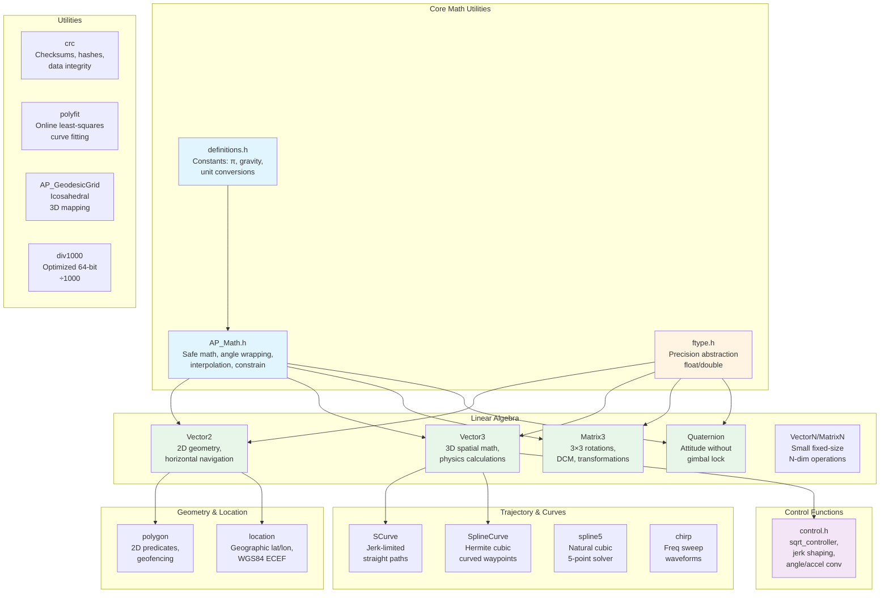

# AP_Math Library

## Overview

The AP_Math library is ArduPilot's central mathematical and geometric computation toolkit, providing embedded-friendly numeric utilities, linear algebra primitives (vectors, matrices, quaternions), trajectory generation, geometric algorithms, and control theory functions. Designed specifically for resource-constrained real-time autopilot systems, AP_Math emphasizes deterministic behavior, minimal heap allocation, and computational efficiency while maintaining numerical robustness across diverse flight control scenarios.

This library forms the mathematical foundation for sensor fusion (EKF), attitude estimation (AHRS), flight control (position/attitude controllers), trajectory planning (waypoint navigation), and geofencing operations throughout ArduPilot's vehicle codebases (Copter, Plane, Rover, Sub, Blimp, AntennaTracker).

**Primary Responsibilities**:
- **Linear Algebra**: 2D/3D vectors, 3×3 rotation matrices, quaternions, fixed-size N-dimensional vectors/matrices
- **Coordinate Transformations**: Body ↔ NED ↔ Earth frame conversions with explicit frame semantics
- **Trajectory Generation**: Jerk-limited S-curves, Hermite cubic splines, natural cubic splines, chirp waveforms
- **Geometric Computations**: Point-in-polygon tests, line/circle intersections, closest distance calculations
- **Control Theory Utilities**: Square-root controllers, angle wrapping, input shaping, lean angle/acceleration conversions
- **Mathematical Utilities**: Safe math functions (safe_asin, safe_sqrt), interpolation, constrain operations, CRC/hash functions
- **Precision Abstraction**: Compile-time float/double precision selection for EKF (HAL_WITH_EKF_DOUBLE) and position types (HAL_WITH_POSTYPE_DOUBLE)

## Architecture

The AP_Math library is organized into specialized modules handling different mathematical domains, with careful attention to embedded system constraints:



### Design Philosophy

**Embedded-First Architecture**:
- **Minimal Heap Allocation**: Fixed-size types avoid dynamic memory; uses stack allocation and static instantiation patterns
- **Deterministic Execution**: No unbounded loops; trajectory generation uses analytic 23-segment S-curve formulas
- **Explicit Template Instantiations**: Float/double variants instantiated in .cpp files to stabilize linkage across translation units
- **Platform Abstraction**: Integrates with AP_HAL for platform services (timing, error reporting) without direct hardware dependencies
- **Compile-Time Configuration**: Feature macros (MATH_CHECK_INDEXES, HAL_WITH_EKF_DOUBLE, ALLOW_DOUBLE_MATH_FUNCTIONS) control debug checks and precision

**Numerical Robustness**:
- **Safe Math Functions**: safe_asin() clamps inputs to [-1, 1]; safe_sqrt() returns 0 for negative values (prevents NaN propagation)
- **Epsilon-Based Comparisons**: is_equal() uses FLT_EPSILON tolerance for floating-point equality
- **Quaternion Normalization**: Periodic normalize() calls required to prevent drift in rotation representations
- **Matrix Orthonormalization**: Gram-Schmidt-like process in Matrix3::normalize() maintains DCM orthogonality

## Key Components

### Core Mathematical Utilities (AP_Math.h)

**Purpose**: Fundamental numeric operations used throughout ArduPilot for sensor processing, control loops, and parameter validation.

**Key Functions**:
```cpp
// Floating-point comparisons with epsilon tolerance
template <typename T> bool is_equal(T v1, T v2);  // |v1 - v2| < epsilon
template <typename T> bool is_zero(T val);         // |val| < FLT_EPSILON
template <typename T> bool is_positive/negative(T val);

// Safe math (prevents NaN/domain errors)
template <typename T> T safe_asin(T v);   // Clamps v to [-1, 1] before asin
template <typename T> T safe_sqrt(T v);   // Returns 0 for v < 0

// Angle wrapping (maintains angles in standard ranges)
float wrap_180(float angle);      // Wraps to [-180°, 180°]
float wrap_360(float angle);      // Wraps to [0°, 360°]
int32_t wrap_180_cd(int32_t angle_cd);  // Centidegrees [-18000, 18000]
float wrap_PI(float angle_rad);   // Wraps to [-π, π] radians
float wrap_2PI(float angle_rad);  // Wraps to [0, 2π] radians

// Value constraining
template <typename T> T constrain_value(T amt, T low, T high);
// Specialized: constrain_int16, constrain_uint32, constrain_float, etc.

// Interpolation and normalization
float linear_interpolate(float low, float high, float scalar);  // lerp
float norm(float value, float in_min, float in_max);  // Maps to [0, 1]
float inverse_lerp(float low, float high, float value);

// Geometric computations
template <typename T> T sq(T val);  // val²
float pythagorous2(float a, float b);  // sqrt(a² + b²)
float pythagorous3(float a, float b, float c);  // sqrt(a² + b² + c²)

// Low-pass filter coefficient calculation
float calc_lowpass_alpha_dt(float dt, float cutoff_freq);
```

**Thread Safety**: All functions are reentrant and stateless (safe for concurrent use across scheduler tasks).

**Units**: Angles in radians unless explicitly marked `_cd` (centidegrees) or using DEG constants. Source: `libraries/AP_Math/AP_Math.h:40-250`

### Mathematical Constants (definitions.h)

**Purpose**: Centralized physical constants and unit conversion macros ensuring consistency across all ArduPilot code.

**Key Constants**:
```cpp
// Fundamental constants
#define M_PI      3.141592653589793238462643383279502884  // Full precision π
#define M_PI_2    (M_PI / 2)                             // π/2
#define M_2PI     (M_PI * 2)                             // 2π
#define M_GOLDEN  1.6180339f                             // φ golden ratio

// Angle conversions
#define DEG_TO_RAD      (M_PI / 180.0f)       // degrees → radians
#define RAD_TO_DEG      (180.0f / M_PI)       // radians → degrees
#define CDEG_TO_RAD     (M_PI / 18000.0f)     // centidegrees → radians
#define RAD_TO_CDEG     (18000.0f / M_PI)     // radians → centidegrees

// Physical constants
#define GRAVITY_MSS     9.80665f              // Standard gravity (m/s²)
#define RADIUS_OF_EARTH 6378100               // WGS84 equatorial radius (m)

// WGS84 ellipsoid parameters
static const double WGS84_A = 6378137.0;      // Semi-major axis (m)
static const double WGS84_IF = 298.257223563; // Inverse flattening
static const double WGS84_F = (1.0 / WGS84_IF);  // Flattening
static const double WGS84_B = (WGS84_A * (1 - WGS84_F));  // Semi-minor axis

// Timing conversions
#define AP_USEC_PER_SEC  1000000ULL
#define AP_MSEC_PER_SEC  1000ULL
#define AP_NSEC_PER_USEC 1000ULL
```

**Conventions**:
- **Centidegrees**: ArduPilot uses int32 centidegrees (degrees × 100) for parameter storage of lat/lon to avoid float precision issues at scale
- **Right-Hand Rule**: Positive angles follow right-hand rule convention (counterclockwise when looking down positive axis)
- **NED Frame**: North-East-Down is standard earth frame orientation

Source: `libraries/AP_Math/definitions.h:1-126`

### Precision Abstraction (ftype.h)

**Purpose**: Allows EKF and position control subsystems to compile with either single (float) or double precision via build-time flags.

**Precision Types**:
```cpp
#if HAL_WITH_EKF_DOUBLE
typedef double ftype;      // EKF state vector precision
#else
typedef float ftype;       // Default: single precision
#endif

#if HAL_WITH_POSTYPE_DOUBLE
typedef double postype_t;  // Position control precision
#else
typedef float postype_t;   // Default: single precision
#endif

// Math function wrappers (resolve to sinf/sin, etc.)
#define sinF(x)   // Resolves to sinf or sin based on ftype
#define cosF(x), tanF(x), asinF(x), acosF(x), atan2F(x,y)
#define sqrtF(x), powF(x,y), logF(x), fabsF(x)
#define fmaxF(x,y), fminF(x,y), fmodF(x,y), ceilF(x)
```

**Configuration**:
- **HAL_WITH_EKF_DOUBLE=1**: Enables double precision for EKF2/EKF3 state estimation (improves GPS integration accuracy at cost of CPU)
- **HAL_WITH_POSTYPE_DOUBLE=1**: Enables double precision for position control (prevents accumulated error over long missions)
- **ALLOW_DOUBLE_MATH_FUNCTIONS**: Required for full double-precision math library support

**Usage**: EKF libraries (AP_NavEKF2, AP_NavEKF3) use `ftype` exclusively; position controllers (AC_PosControl) use `postype_t`. Source: `libraries/AP_Math/ftype.h:1-60`

### Vector Mathematics

#### Vector2 - 2D Planar Geometry

**Purpose**: Horizontal position/velocity calculations, 2D waypoint navigation, wind estimation, polygon operations.

**Key Operations**:
```cpp
template <typename T>
class Vector2 {
public:
    T x, y;  // Cartesian coordinates
    
    // Geometric operations
    T length() const;                // Magnitude: √(x² + y²)
    T length_squared() const;        // x² + y² (avoids sqrt for comparisons)
    void normalize();                // Converts to unit vector
    T angle() const;                 // Angle from +x axis: atan2(y, x) radians
    T angle(const Vector2& v) const; // Angle between vectors [-π, π]
    
    // 2D-specific operations
    Vector2 perpendicular() const;   // Rotates 90° counterclockwise
    void rotate(T rotation_rad);     // Rotates by angle (+ = CCW)
    T operator%(const Vector2& v);   // 2D cross product: x*v.y - y*v.x (z-component)
    
    // Geometric queries
    Vector2 closest_point(const Vector2& p1, const Vector2& p2) const;
    bool circle_segment_intersection(const Vector2& center, T radius,
                                     const Vector2& seg_start, const Vector2& seg_end,
                                     Vector2& result) const;
    bool segment_intersection(const Vector2& seg1_start, const Vector2& seg1_end,
                             const Vector2& seg2_start, const Vector2& seg2_end,
                             Vector2& intersection) const;
};

typedef Vector2<float> Vector2f;
typedef Vector2<double> Vector2d;
```

**Coordinate Frames**: Typically NE (North-East) plane in NED frame, or xy in body frame.

**Example Usage**:
```cpp
// Horizontal waypoint navigation
Vector2f vehicle_pos_ne(100.0f, 50.0f);  // 100m North, 50m East
Vector2f target_pos_ne(200.0f, 150.0f);
Vector2f direction = (target_pos_ne - vehicle_pos_ne).normalized();
float distance = (target_pos_ne - vehicle_pos_ne).length();
float bearing_rad = direction.angle();  // Heading to target

// Check if path intersects geofence
Vector2f fence_start(0, 0), fence_end(100, 0);
Vector2f path_start(50, -10), path_end(50, 10);
Vector2f intersection;
bool crosses = path_start.segment_intersection(path_end, fence_start, fence_end, intersection);
```

Source: `libraries/AP_Math/vector2.h:50-350`, `libraries/AP_Math/vector2.cpp`

#### Vector3 - 3D Spatial Mathematics

**Purpose**: Position, velocity, acceleration, angular rates, force vectors, coordinate frame transformations.

**Key Operations**:
```cpp
template <typename T>
class Vector3 {
public:
    T x, y, z;  // Cartesian coordinates
    
    // Vector algebra
    T length() const;                     // Magnitude: √(x² + y² + z²)
    void normalize();                     // Converts to unit vector (length = 1)
    T operator*(const Vector3& v) const;  // Dot product (scalar): x*v.x + y*v.y + z*v.z
    Vector3 operator%(const Vector3& v) const;  // Cross product: perpendicular vector
    
    // Projections and decomposition
    Vector3 projected(const Vector3& v) const;      // Component parallel to v
    Vector3 perpendicular(const Vector3& v) const;  // Component perpendicular to v
    Vector2<T> xy() const;                          // Extracts horizontal plane
    
    // Geometric queries
    T angle(const Vector3& v) const;  // Angle between vectors [0, π]
    Vector3 closest_point(const Vector3& seg_start, const Vector3& seg_end) const;
    T distance_to_segment(const Vector3& seg_start, const Vector3& seg_end) const;
    
    // Rotations (apply sensor orientation)
    void rotate(enum Rotation rotation);  // Applies predefined rotation (ROTATION_NONE, ROTATION_YAW_45, etc.)
};

typedef Vector3<float> Vector3f;
typedef Vector3<double> Vector3d;
```

**Coordinate Frames**:
- **Body Frame**: x = forward, y = right, z = down (relative to vehicle)
- **NED Frame**: x = North, y = East, z = Down (earth-fixed local tangent plane)
- **Earth Frame**: ECEF (Earth-Centered Earth-Fixed) for GPS calculations

**Vector Identities** (from header comments):
- Dot product properties: `a * b = 0` ⟹ a, b orthogonal; `a * b = |a||b|cos(θ)`
- Cross product properties: `a % b = -b % a`; `(a % b).length() = |a||b|sin(θ)` = area of parallelogram
- Triple products: `a * (b % c)` = volume of parallelepiped; `a % (b % c) = b(a·c) - c(a·b)`

**Example Usage**:
```cpp
// Attitude control: decompose pilot input into body-frame lean angles
Vector3f pilot_input_bf(0.1f, -0.05f, 0.0f);  // Forward lean, slight right lean
float lean_magnitude = pilot_input_bf.xy().length();  // Horizontal component

// Check if IMU orientation needs correction
Vector3f accel_measured(0.0f, 0.0f, -9.81f);  // Expected: gravity down in NED
Vector3f accel_body(0.0f, 0.0f, 9.81f);       // Measured in body frame (z-down convention)
float alignment_error = accel_measured.angle(accel_body);  // Should be ~0 when level

// Project velocity onto desired track direction
Vector3f velocity_ned(5.0f, 2.0f, -1.0f);  // m/s in NED
Vector3f track_direction(1.0f, 0.0f, 0.0f).normalized();  // Pure North
float along_track_speed = velocity_ned * track_direction;  // Dot product
Vector3f cross_track_vel = velocity_ned.perpendicular(track_direction);
```

Source: `libraries/AP_Math/vector3.h:48-450`, `libraries/AP_Math/vector3.cpp`

### Matrix and Quaternion Rotations

#### Matrix3 - 3×3 Rotation Matrices

**Purpose**: Direction Cosine Matrix (DCM) in AHRS, coordinate frame transformations, sensor calibration matrices.

**Key Operations**:
```cpp
template <typename T>
class Matrix3 {
public:
    Vector3<T> a, b, c;  // Three row vectors
    
    // Construction
    void identity();     // Sets to identity (1 on diagonal, 0 elsewhere)
    void from_euler(T roll, T pitch, T yaw);  // 3-2-1 Euler sequence (radians)
    void from_axis_angle(const Vector3<T>& axis, T theta);  // Axis-angle representation
    void from_rotation(enum Rotation r);  // Predefined rotations (sensor mounting)
    
    // Extraction
    void to_euler(T& roll, T& pitch, T& yaw) const;  // Extract Euler angles (radians)
    
    // Matrix operations
    Matrix3 transposed() const;           // Transpose (inverse for rotation matrices)
    void normalize();                     // Orthonormalize (Gram-Schmidt-like)
    void rotate_by_gyro(const Vector3<T>& gyro, T dt);  // Integrate gyro rates
    
    // Vector transformation
    Vector3<T> operator*(const Vector3<T>& v) const;  // Rotates vector
};

typedef Matrix3<float> Matrix3f;
typedef Matrix3<double> Matrix3d;
```

**Rotation Matrix Properties**:
- **Orthonormal**: Rows are unit vectors, mutually perpendicular
- **Inverse = Transpose**: For rotation matrices, M⁻¹ = Mᵀ (computational efficiency)
- **Normalization Required**: Accumulates numerical error; call normalize() periodically

**Euler Angle Conventions**:
- **Sequence**: 3-2-1 (yaw-pitch-roll) intrinsic rotations
- **Singularity**: Gimbal lock at pitch = ±90°
- **Range**: roll/yaw ∈ [-π, π], pitch ∈ [-π/2, π/2]

**Example Usage**:
```cpp
// Create body-to-NED rotation matrix from vehicle attitude
Matrix3f dcm_bn;  // Body to NED
dcm_bn.from_euler(roll_rad, pitch_rad, yaw_rad);

// Transform accelerometer reading from body to NED frame
Vector3f accel_body(ax, ay, az);
Vector3f accel_ned = dcm_bn * accel_body;

// Integrate gyroscope to update DCM
Vector3f gyro_rates(gx, gy, gz);  // rad/s in body frame
dcm_bn.rotate_by_gyro(gyro_rates, dt);
dcm_bn.normalize();  // Remove accumulated numerical error

// Apply sensor rotation (IMU mounted at ROTATION_YAW_90)
Matrix3f sensor_rotation;
sensor_rotation.from_rotation(ROTATION_YAW_90);
Vector3f accel_vehicle = sensor_rotation * accel_sensor;
```

Source: `libraries/AP_Math/matrix3.h:40-280`, `libraries/AP_Math/matrix3.cpp`

#### Quaternion - Gimbal-Lock-Free Rotations

**Purpose**: Attitude representation in EKF, smooth interpolation between orientations, avoiding gimbal lock at extreme pitch angles.

**Key Operations**:
```cpp
template <typename T>
class QuaternionT {
public:
    T q1, q2, q3, q4;  // q1 = scalar/real, q2/q3/q4 = vector/imaginary
    
    // Construction
    QuaternionT();  // Default: identity (no rotation)
    void from_euler(T roll, T pitch, T yaw);  // 3-2-1 Euler conversion
    void from_rotation_matrix(const Matrix3<T>& m);
    void from_axis_angle(const Vector3<T>& axis, T theta);
    
    // Extraction
    void rotation_matrix(Matrix3<T>& m) const;
    void to_axis_angle(Vector3<T>& v) const;  // Length = angle (rad)
    
    // Quaternion operations
    QuaternionT inverse() const;  // Conjugate for unit quaternions
    void normalize();             // Ensures unit length (|q| = 1)
    
    // Vector rotation (more efficient than matrix conversion)
    void earth_to_body(Vector3<T>& v) const;  // Rotates earth-frame to body-frame
};

typedef QuaternionT<float> Quaternion;
typedef QuaternionT<double> QuaternionD;
```

**Quaternion Convention**:
- **Form**: q = q1 + q2·i + q3·j + q4·k (Hamilton convention)
- **Unit Quaternion**: |q| = √(q1² + q2² + q3² + q4²) = 1 for pure rotations
- **Identity**: (1, 0, 0, 0) represents no rotation

**Advantages over Euler**:
- **No Gimbal Lock**: Well-defined at all attitudes including pitch = ±90°
- **Smooth Interpolation**: Spherical linear interpolation (slerp) for smooth transitions
- **Computational Efficiency**: Fewer trigonometric operations than DCM for vector rotations

**Example Usage**:
```cpp
// EKF attitude representation
Quaternion attitude;
attitude.from_euler(roll, pitch, yaw);

// Rotate velocity from NED to body frame (for airspeed calculation)
Vector3f vel_ned(vn, ve, vd);
Vector3f vel_body = vel_ned;
attitude.earth_to_body(vel_body);  // In-place transformation

// Update attitude from gyro integration (complementary filter)
Vector3f gyro_bf(gx, gy, gz);  // Body-frame rates
Quaternion delta_q;
delta_q.from_axis_angle(gyro_bf, dt * gyro_bf.length());
attitude = attitude * delta_q;  // Quaternion multiplication
attitude.normalize();  // Maintain unit length

// Convert to DCM for legacy code
Matrix3f dcm;
attitude.rotation_matrix(dcm);
```

Source: `libraries/AP_Math/quaternion.h:35-220`, `libraries/AP_Math/quaternion.cpp`

## Trajectory Generation

### SCurve - Jerk-Limited Straight-Line Paths

**Purpose**: Generates smooth position/velocity/acceleration profiles for straight-line waypoint navigation with constrained jerk (rate of change of acceleration).

**Algorithm**: 23-segment analytic trajectory with phases:
1. **Jerk-in**: Acceleration increases (snap-limited)
2. **Constant Accel**: Maximum acceleration applied
3. **Jerk-out**: Acceleration decreases to zero
4. **Constant Velocity**: Cruise at maximum speed
5. **Symmetric deceleration**: Mirror of acceleration phases

**Key Methods**:
```cpp
class SCurve {
public:
    // Initialize path between two 3D points
    void calculate_track(const Vector3f& origin, const Vector3f& destination,
                        float speed_xy, float speed_up, float speed_down,
                        float accel_xy, float accel_z_up, float accel_z_down,
                        float jerk_time, bool zero_velocity);
    
    // Update endpoint speed limits (recalculates path)
    float set_speed_max(float speed_xy, float speed_up, float speed_down);
    float set_origin_speed_max(float origin_speed);
    float set_destination_speed_max(float destination_speed);
    
    // Step forward in time (main loop integration)
    bool advance_target_along_track(float dt, Vector3f& target_pos,
                                     Vector3f& target_vel,
                                     Vector3f& target_accel);
    
    // Query path state
    bool finished() const;
    float get_time() const;
    float get_path_length() const;
};
```

**Typical Usage Workflow**:
```cpp
// 1. Initialize trajectory
SCurve path;
Vector3f start_pos(0, 0, 0);  // meters NED
Vector3f end_pos(100, 50, -20);  // 100m North, 50m East, 20m altitude gain
path.calculate_track(start_pos, end_pos,
                    10.0f,  // max horizontal speed m/s
                    5.0f,   // max climb speed m/s
                    3.0f,   // max descend speed m/s
                    2.5f,   // horizontal accel m/s²
                    2.0f,   // climb accel m/s²
                    1.5f,   // descend accel m/s²
                    0.5f,   // jerk time (s)
                    false); // zero_velocity at endpoints

// 2. Execute in main loop (e.g., 400 Hz)
Vector3f pos_target, vel_target, accel_target;
while (!path.finished()) {
    bool complete = path.advance_target_along_track(dt,
                                                     pos_target,
                                                     vel_target,
                                                     accel_target);
    // Feed pos_target to position controller
    position_controller.set_target(pos_target, vel_target, accel_target);
}
```

**Coordinate Frame**: Typically NED (North-East-Down) earth frame, but units must be consistent (meters with m/s, or cm with cm/s).

**Performance Notes**:
- **Computational Cost**: Path recalculation (calculate_track, set_speed_max) is expensive (~microseconds); avoid calling every loop
- **Deterministic**: Fixed 23-segment structure ensures bounded execution time

Source: `libraries/AP_Math/SCurve.h:10-150`, `libraries/AP_Math/SCurve.cpp`

### SplineCurve - Hermite Cubic Curved Waypoints

**Purpose**: Generates smooth curved paths between waypoints with velocity continuity (C1 continuity), using Hermite cubic spline interpolation.

**Algorithm**: Hermite spline defined by:
- Endpoints: position and velocity specified at origin and destination
- Interpolation: Cubic polynomial ensuring position and velocity match at boundaries
- Time Scaling: Parameterization adjusted to respect kinematic constraints (speed/accel limits)

**Key Methods**:
```cpp
class SplineCurve {
public:
    // Set kinematic limits
    void set_speed_accel(float speed_xy, float speed_up, float speed_down, float accel);
    
    // Define spline by endpoints and velocities
    void set_origin_and_destination(const Vector3f& origin,
                                    const Vector3f& destination,
                                    const Vector3f& origin_vel,
                                    const Vector3f& dest_vel,
                                    bool stop_at_destination);
    
    // Step forward in time
    void advance_target_along_track(float dt, Vector3f& target_pos, Vector3f& target_vel);
    
    // Query state
    bool reached_destination() const;
    Vector3f get_destination_vel() const;
    float get_origin_speed_max() const;
    void set_origin_speed_max(float speed);
};
```

**Typical Usage** (Mission waypoint with curved transition):
```cpp
SplineCurve spline;
spline.set_speed_accel(12.0f, 5.0f, 3.0f, 3.0f);  // speeds & accel in m/s, m/s²

// Waypoint A to B with velocity matching for smooth curve
Vector3f waypoint_a(0, 0, -50);  // NEU from EKF origin
Vector3f waypoint_b(100, 50, -50);
Vector3f vel_at_a(10, 0, 0);  // 10 m/s North approaching A
Vector3f vel_at_b(7, 7, 0);   // Exit velocity toward next waypoint

spline.set_origin_and_destination(waypoint_a, waypoint_b, vel_at_a, vel_at_b, false);

// Main loop execution
while (!spline.reached_destination()) {
    spline.advance_target_along_track(dt, pos_target, vel_target);
    pos_controller.set_target(pos_target, vel_target);
}
```

**Coordinate Frame**: NEU (North-East-Up) relative to EKF origin.

**Velocity Continuity**: Ensure origin_vel matches actual vehicle velocity at transition to avoid step changes in acceleration (vehicle jerk).

Source: `libraries/AP_Math/SplineCurve.h:15-90`, `libraries/AP_Math/SplineCurve.cpp`

### spline5 - Natural Cubic Spline for 5 Points

**Purpose**: Specialized natural cubic spline solver for exactly 5 data points (optimized for computational efficiency without dynamic allocation).

**Algorithm**: Solves tridiagonal system for second derivatives at knots using Thomas algorithm with natural boundary conditions (y'' = 0 at endpoints).

**Key Function**:
```cpp
// Calculates second derivatives y2[] for cubic spline interpolation
void spline5(int num,          // Must be exactly 5
             const float x[],  // Independent variable (5 points)
             const float y[],  // Dependent variable (5 points)
             float y2[]);      // Output: second derivatives (5 values)
```

**Usage Example** (Smooth interpolation through 5 waypoints):
```cpp
// 5 altitude samples along track distance
float distances[5] = {0, 100, 200, 300, 400};  // meters
float altitudes[5] = {50, 45, 40, 42, 50};     // meters
float second_derivs[5];

spline5(5, distances, altitudes, second_derivs);

// Interpolate altitude at arbitrary position (e.g., 150m)
// ... use standard cubic spline evaluation with y2[] ...
```

**Constraints**:
- **Fixed Size**: Must pass exactly 5 points (no bounds checking)
- **Natural Boundaries**: Zero curvature (y'' = 0) at first and last points

Source: `libraries/AP_Math/spline5.h`, `libraries/AP_Math/spline5.cpp`

## Geometric Algorithms

### polygon - 2D Polygon Operations for Geofencing

**Purpose**: Geometric predicates for inclusion/exclusion zone breach detection, fence boundary calculations.

**Key Functions**:
```cpp
// Point-in-polygon test using ray casting
bool Polygon_outside(const Vector2f& point, const Vector2f* polygon, uint16_t count);
bool Polygon_outside(const Location& location, const Location* polygon, uint16_t count);

// Boundary distance calculations
float Polygon_closest_distance_point(const Vector2f& point, const Vector2f* polygon, uint16_t count);
float Polygon_closest_distance_line(const Vector2f& point, const Vector2f& seg_start, const Vector2f& seg_end);

// Fence breach detection (considering vehicle movement)
uint8_t Polygon_complete(const Vector2l* polygon, uint16_t count);
Vector2l Polygon_boundary_point(const Vector2l& current, const Vector2l& previous,
                                const Vector2l* polygon, uint16_t count);
```

**Coordinate Systems**:
- **Float Variant**: Local Cartesian coordinates (meters)
- **Integer Variant**: Centidegrees latitude/longitude (int32_t stored in Vector2l)

**Algorithm**: Ray casting for point-in-polygon; perpendicular projection for closest distance to segments.

**Example Usage** (Geofence breach check):
```cpp
// Define polygon fence (lat/lon in centidegrees)
Vector2l fence_vertices[4] = {
    Vector2l(-35000000, 149000000),  // 35°S, 149°E
    Vector2l(-35000000, 149100000),
    Vector2l(-35100000, 149100000),
    Vector2l(-35100000, 149000000)
};

// Check if current position is outside fence
Location vehicle_loc;
vehicle_loc.lat = -35050000;  // Centidegrees
vehicle_loc.lng = 149050000;
bool breached = Polygon_outside(vehicle_loc, (Location*)fence_vertices, 4);

// Calculate distance to fence boundary
float distance_to_fence_m = Polygon_closest_distance_point(
    Vector2f(vehicle_loc.lat / 1e7f, vehicle_loc.lng / 1e7f),  // Convert to degrees
    (Vector2f*)fence_vertices, 4);
```

**Performance**: O(n) ray casting for n vertices; suitable for <100 vertex polygons at geofence check rates (~1 Hz).

Source: `libraries/AP_Math/polygon.h:10-80`, `libraries/AP_Math/polygon.cpp`

### location - Geographic Coordinate Operations

**Purpose**: Latitude/longitude distance/bearing calculations, WGS84 ECEF ↔ LLH transformations, great-circle navigation.

**Key Functions**:
```cpp
// Cartesian offsets between locations (meters)
Vector2f location_diff(const Location& base, const Location& loc);  // NE offset
Vector3f location_3d_diff_NED(const Location& base, const Location& loc);  // NED offset

// Add offset to location
Location location_offset(const Location& base, float ofs_north, float ofs_east);
Location location_update(const Location& loc, float bearing_deg, float distance_m);

// Distance calculations
float get_distance(const Location& loc1, const Location& loc2);  // Great-circle (m)
float get_distance_NE(const Location& loc1, const Location& loc2);  // Flat-earth approx
Vector2f get_distance_NE(const Location& loc1, const Location& loc2);  // Separate N/E

// Bearing calculations
float get_bearing(const Location& loc1, const Location& loc2);  // Centidegrees [0, 36000)
float get_bearing_cd(const Location& loc1, const Location& loc2);  // More precise

// Validation and utilities
float longitude_scale(const Location& loc);  // cos(lat) scaling factor
void wrap_longitude(int32_t& lon_cd);  // Normalizes to [-180, 180] degrees
```

**WGS84 ECEF/LLH Conversions** (double precision, requires ALLOW_DOUBLE_MATH_FUNCTIONS):
```cpp
// Earth-Centered Earth-Fixed ↔ Latitude-Longitude-Height
void wgsllh2ecef(const Vector3d& llh, Vector3d& ecef);  // llh: (lat°, lon°, alt m)
void wgsecef2llh(const Vector3d& ecef, Vector3d& llh);  // Fukushima algorithm

// Gravity vector at location
Vector3f gravity_vector(const Location& loc);  // Down direction & magnitude
```

**Example Usage** (Waypoint navigation):
```cpp
Location home, waypoint;
home.lat = -35000000;  // -35° (centidegrees)
home.lng = 149000000;  // 149°
waypoint.lat = -34995000;
waypoint.lng = 149005000;

// Calculate navigation vectors
float distance_m = get_distance(home, waypoint);  // Great-circle distance
float bearing_cd = get_bearing(home, waypoint);   // Initial bearing (centidegrees)
Vector2f offset_ne = location_diff(home, waypoint);  // Flat-earth NE offset

// Advance along bearing
Location intermediate = location_update(home, bearing_cd / 100.0f, distance_m / 2);
```

**Accuracy Considerations**:
- **Flat-Earth Approximation**: location_diff() uses local tangent plane (accurate <10 km from base)
- **Great-Circle**: get_distance() accounts for Earth curvature (accurate globally)
- **Longitude Scaling**: longitude_scale() = cos(latitude) corrects for meridian convergence

Source: `libraries/AP_Math/location.h:15-120`, `libraries/AP_Math/location.cpp`, `libraries/AP_Math/location_double.cpp`

## Control Theory Functions (control.h)

**Purpose**: Mathematical building blocks for position/velocity/attitude controllers with jerk-limited smooth transitions and square-root controllers.

### Square-Root Controller

Provides second-order limited response (smooth approach to setpoint without overshoot):

```cpp
// Calculate correction rate using sqrt controller
float sqrt_controller(float error,    // Position error
                     float p,          // Proportional gain (1/s)
                     float second_ord_lim,  // Max accel (m/s² or rad/s²)
                     float dt);        // Time step (seconds)
// Returns: velocity command (m/s or rad/s)

// Inverse: calculate error required to produce given output
float inv_sqrt_controller(float output, float p, float D_max);

// Stopping distance for sqrt controller
float stopping_distance(float velocity, float p, float accel_max);
```

**Algorithm**: Correction velocity = sqrt(2 × accel_max × |error|) × sign(error), limited by second_ord_lim.

**Usage** (Position controller): Source: `libraries/AC_PosControl/AC_PosControl.cpp:230-250`
```cpp
// Position error to velocity command
Vector3f pos_error = target_pos - current_pos;
float vel_correction_x = sqrt_controller(pos_error.x, kP, accel_max_xy, dt);
float vel_correction_y = sqrt_controller(pos_error.y, kP, accel_max_xy, dt);
```

### Jerk-Limited Shaping

Smooths acceleration commands to respect jerk constraints (prevents abrupt thrust changes):

```cpp
// Shape acceleration with jerk limit
void shape_accel(float accel_input,   // Desired accel (m/s²)
                float& accel,          // Current accel (updated in-place)
                float jerk_max,        // Max jerk (m/s³)
                float dt);             // Time step (s)

// 2D/3D variants
void shape_accel_xy(const Vector2f& accel_input, Vector2f& accel, float jerk_max, float dt);
void shape_accel_xy(const Vector3f& accel_input, Vector3f& accel, float jerk_max, float dt);

// Full velocity control with jerk shaping
void shape_vel_accel(float vel_input, float accel_input,
                    float vel, float& accel,
                    float accel_min, float accel_max,
                    float jerk_max, float dt, bool limit_total_accel);

// Full position control with jerk shaping
void shape_pos_vel_accel(postype_t pos_input, float vel_input, float accel_input,
                        postype_t pos, float vel, float& accel,
                        float vel_min, float vel_max,
                        float accel_min, float accel_max,
                        float jerk_max, float dt, bool limit_total_accel);
```

**Example** (Multicopter altitude hold with smooth transitions):
```cpp
// Pilot commands sudden altitude change
float altitude_target = current_alt + 10.0f;  // +10m
float vel_target = 5.0f;   // Climb at 5 m/s
float accel_target = 0.0f;  // No feedforward accel

// Shape with jerk limit (prevents vehicle "snap")
shape_pos_vel_accel(altitude_target, vel_target, accel_target,
                   current_alt, current_climb_rate, accel_z_cmd,
                   -3.0f, 5.0f,   // Vel limits: -3 m/s down, +5 m/s up
                   -10.0f, 5.0f,  // Accel limits
                   10.0f,         // Jerk limit: 10 m/s³
                   dt, true);
// accel_z_cmd smoothly ramps to achieve altitude change
```

### Kinematic Constraint Functions

```cpp
// Maximum acceleration magnitude in direction respecting axis constraints
float kinematic_limit(const Vector3f& direction,  // Desired direction (unit vector)
                     float max_xy,               // Max horizontal accel (m/s²)
                     float max_z_pos,            // Max up accel (m/s²)
                     float max_z_neg);           // Max down accel (m/s²)

// Lean angle ↔ horizontal acceleration conversions (multicopter)
float angle_to_accel(float angle_rad);   // Converts lean angle to horiz accel
float accel_to_angle(float accel_mss);   // Converts horiz accel to lean angle

// Exponential stick input shaping (RC controller)
float input_expo(float input,     // Normalized input [-1, 1]
                float expo);      // Exponential factor [0, 0.95]
// Returns: shaped input with reduced sensitivity near center

// Convert pilot stick to roll/pitch angles
void rc_input_to_roll_pitch_rad(float roll_in, float pitch_in,
                                float angle_max,
                                float& roll_out, float& pitch_out);
```

**Coordinate Frames**:
- Position/velocity: NED earth frame (meters, m/s)
- Angles: Body frame roll/pitch/yaw (radians)
- Accelerations: Earth-horizontal frame (m/s² projected to NE plane)

Source: `libraries/AP_Math/control.h:20-180`, `libraries/AP_Math/control.cpp`

## Utilities

### CRC and Hash Functions (crc.h)

**Purpose**: Data integrity verification for telemetry, bootloaders, storage, and protocol implementations.

**Supported Algorithms**:
```cpp
// CRC variants (different polynomials for different protocols)
uint16_t crc4(uint16_t* data);                    // 4-bit CRC (bootloader)
uint8_t crc8_dvb_s2(uint8_t crc, uint8_t a);      // DVB-S2 protocol
uint8_t crc8_maxim(const uint8_t* data, uint16_t len);  // 1-Wire Maxim
uint16_t crc16_ccitt(const uint8_t* buf, uint32_t len, uint16_t crc);  // XMODEM
uint16_t crc_xmodem(const uint8_t* data, uint16_t len);
uint32_t crc32_small(uint32_t crc, const void* buf, uint32_t size);  // Low-memory variant
uint64_t crc_crc64(const uint32_t* data, uint16_t num_words);  // 64-bit

// Checksums
void fletcher_checksum(const uint8_t* data, uint8_t len, uint8_t* ck_a, uint8_t* ck_b);

// Hash functions
void hash_fnv_1a(uint32_t len, const uint8_t* buf, uint32_t* hash);  // FNV-1a 64-bit

// Utility
uint8_t parity(uint16_t x);  // Count set bits mod 2
```

**Example Usage**:
```cpp
// Telemetry packet checksum (MAVLink uses fletcher)
uint8_t packet[64] = {/* message data */};
uint8_t ck_a, ck_b;
fletcher_checksum(packet, 64, &ck_a, &ck_b);
// Append ck_a, ck_b to packet

// Parameter storage CRC validation
uint32_t stored_crc = crc32_small(0, parameter_buffer, sizeof(parameters));
// Compare with stored CRC to detect corruption
```

Source: `libraries/AP_Math/crc.h:10-120`, `libraries/AP_Math/crc.cpp`

### Optimized Division (div1000.h)

**Purpose**: Fast 64-bit division by 1000 for timestamp conversions (microseconds → milliseconds) on ARM targets without hardware division.

**Implementation**:
```cpp
// Replaces num / 1000 with reciprocal multiply + shift
static inline uint64_t uint64_div1000(uint64_t num) {
    return (num * 0x418937) >> 32;  // Exact for all uint64_t
}
```

**Performance**: ~3× faster than hardware division on Cortex-M4/M7 (multiply + shift vs. multi-cycle UDIV instruction).

**Usage**:
```cpp
uint64_t timestamp_us = AP_HAL::micros64();
uint64_t timestamp_ms = uint64_div1000(timestamp_us);
```

Source: `libraries/AP_Math/div1000.h`

### Polynomial Fitting (polyfit.h)

**Purpose**: Online (incremental) least-squares polynomial regression for vector-valued outputs without storing historical data.

**Template**:
```cpp
template <uint8_t order, typename xtype, typename vtype>
class PolyFit {
public:
    void update(xtype x, const vtype& y);  // Add data point
    vtype get_polynomial(xtype x);          // Evaluate fitted polynomial at x
};
```

**Example** (Fit parabola to altitude vs. time for touchdown prediction):
```cpp
PolyFit<2, float, float> alt_fit;  // 2nd-order (parabola), float x, float y

// Accumulate data during descent
for (int i = 0; i < 10; i++) {
    float time = i * 0.1f;  // 0.1s intervals
    float altitude = get_rangefinder_alt();
    alt_fit.update(time, altitude);
}

// Predict touchdown time (when altitude = 0)
float future_time = 1.5f;
float predicted_alt = alt_fit.get_polynomial(future_time);
```

Source: `libraries/AP_Math/polyfit.h`, `libraries/AP_Math/polyfit.cpp`

## Mathematical Conventions

### Coordinate Frames

ArduPilot uses multiple coordinate frames with explicit transformations:

**1. Body Frame (BF)**:
- **Origin**: Vehicle center of mass
- **Axes**: x = forward (nose), y = right (starboard), z = down
- **Usage**: IMU measurements, control surface deflections, pilot stick inputs

**2. NED Frame (North-East-Down)**:
- **Origin**: Home position or EKF origin
- **Axes**: x = North, y = East, z = Down (local tangent plane to Earth)
- **Usage**: Waypoint navigation, position control, mission planning

**3. ENU Frame (East-North-Up)**:
- **Variant**: y = North, x = East, z = Up
- **Usage**: Some spline trajectory code, ROS integration

**4. Earth Frame (ECEF)**:
- **Origin**: Earth center
- **Axes**: x = equator/prime meridian, y = equator/90°E, z = North pole
- **Usage**: GPS position calculations, WGS84 conversions

**Transformations**:
- Body ↔ NED: Matrix3 DCM or Quaternion attitude representation
- NED ↔ Geographic: location.h functions (lat/lon/alt)
- NED ↔ ECEF: wgsllh2ecef() / wgsecef2llh() in location_double.cpp

### Unit Conventions

**Critical**: Always specify units explicitly in variable names, comments, and function parameters.

**Standard Units**:
- **Distance**: meters (m), centimeters (cm) for high-precision storage
- **Angles**: radians (rad) for calculations; degrees (deg) for parameters; centidegrees (cdeg) for lat/lon storage
- **Angular Rate**: radians/second (rad/s), degrees/second (deg/s)
- **Time**: seconds (s), milliseconds (ms), microseconds (us)
- **Velocity**: meters/second (m/s), centimeters/second (cm/s)
- **Acceleration**: meters/second² (m/s²)
- **Jerk**: meters/second³ (m/s³)

**Conversion Macros** (definitions.h):
```cpp
DEG_TO_RAD, RAD_TO_DEG          // degrees ↔ radians
CDEG_TO_RAD, RAD_TO_CDEG        // centidegrees ↔ radians
AP_USEC_PER_SEC, AP_MSEC_PER_SEC  // time conversions
```

**Angle Storage**:
- **Parameters**: Degrees or centidegrees (human-readable)
- **Internal Calculations**: Radians (avoids repeated conversions)
- **Lat/Lon Storage**: int32_t centidegrees (avoids float precision loss over 180° range)

### Right-Hand Rule

**Rotation Direction**: Positive angles follow right-hand rule:
- **Roll**: Right wing down (positive roll rotates body y-axis toward z-axis)
- **Pitch**: Nose up (positive pitch rotates body x-axis toward z-axis)
- **Yaw**: Nose right (positive yaw rotates body x-axis toward y-axis)

**Cross Product**: a % b produces vector perpendicular to both a and b following right-hand rule (fingers curl from a to b, thumb points in result direction).

### Numerical Tolerances

**Floating-Point Comparisons**:
```cpp
#define FLT_EPSILON 1.19209290E-07f  // Used by is_equal(), is_zero()
```

**Normalization Requirements**:
- **Quaternions**: Call normalize() after every ~10 updates (integration drift)
- **DCM**: Call normalize() every loop cycle or when determinant deviates from 1.0
- **Vectors**: normalize() before using as direction (avoid magnitude affecting dot/cross products)

## Configuration and Build Options

### Compile-Time Flags

**MATH_CHECK_INDEXES** (default: 0):
- Enables bounds checking in Vector/Matrix element access via operator[]
- Adds assert() calls that trap out-of-bounds access
- **Performance Impact**: ~5-10% overhead in tight loops
- **Usage**: Enable for development/debugging, disable for production

**HAL_WITH_EKF_DOUBLE** (default: 0):
- Switches EKF state estimation to double precision (ftype = double)
- Affects AP_NavEKF2, AP_NavEKF3, AP_AHRS
- **Accuracy**: Reduces GPS integration errors over long flights (>30 min)
- **Performance**: ~20% slower EKF updates (more FPU operations)

**HAL_WITH_POSTYPE_DOUBLE** (default: 0):
- Switches position control to double precision (postype_t = double)
- Affects AC_PosControl, AC_WPNav waypoint calculations
- **Accuracy**: Prevents accumulated error in long autonomous missions (>10 km)
- **Performance**: Minimal impact (position control rate is low ~50 Hz)

**ALLOW_DOUBLE_MATH_FUNCTIONS** (platform-dependent):
- Enables double-precision math library (sin, cos, sqrt, etc. for double)
- Required for WGS84 ECEF/LLH conversions (wgsllh2ecef)
- **Availability**: Depends on toolchain (not available on some embedded targets)

**CONFIG_HAL_BOARD** (SITL, ChibiOS, Linux):
- SITL (Software-In-The-Loop): Adds debug helpers like fill_nanf() to detect uninitialized variables

### Platform-Specific Optimizations

**ARM Cortex-M** (ChibiOS):
- Uses uint64_div1000() reciprocal multiply instead of hardware UDIV
- Leverages NEON SIMD on Cortex-A for vector operations (if available)
- FPU single-precision optimized (VFPv4-SP on STM32F4/F7)

**Linux**:
- Full double-precision math library available
- Can enable HAL_WITH_EKF_DOUBLE without performance concerns

**ESP32**:
- Single-precision FPU only (Xtensa LX6)
- MATH_CHECK_INDEXES disabled by default (performance-critical)

## Integration with ArduPilot

### Dependencies

**Required Libraries**:
- **AP_HAL**: Platform abstraction (timing, error reporting via AP_HAL::panic)
- **AP_Common**: Common utilities, macros (ARRAY_SIZE, MIN, MAX)
- **AP_Param**: Parameter system (AP_Vector3f parameter type registration)

**Optional** (depending on features used):
- **AP_InternalError**: Reports numerical errors (e.g., quaternion normalization failures)

### Major Consumers

**AP_AHRS** (Attitude and Heading Reference System):
- Uses Matrix3 for DCM, Quaternion for EKF attitude representation
- Coordinate transformations: body ↔ NED ↔ earth frames
- Source: `libraries/AP_AHRS/AP_AHRS.cpp`

**AP_NavEKF2 / AP_NavEKF3** (Extended Kalman Filter):
- ftype precision abstraction for state vectors
- Matrix operations for covariance propagation
- Vector3 for IMU/GPS/baro measurements
- Source: `libraries/AP_NavEKF3/AP_NavEKF3_core.h`

**AC_PosControl / AC_AttitudeControl** (Multicopter Controllers):
- control.h functions: sqrt_controller, shape_pos_vel_accel, jerk limiting
- Vector3 for position/velocity/acceleration commands
- Angle/acceleration conversions for lean angle limiting
- Source: `libraries/AC_PosControl/AC_PosControl.cpp:320-450`

**AC_WPNav** (Waypoint Navigation):
- SCurve for straight-line segments
- SplineCurve for curved waypoint transitions
- Vector3 NED position targets
- Source: `libraries/AC_WPNav/AC_WPNav.cpp`

**AC_Fence** (Geofencing):
- polygon.h for inclusion/exclusion zones
- location.h for geographic distance calculations
- Source: `libraries/AC_Fence/AC_PolyFence_loader.cpp`

**GCS_MAVLink** (Telemetry):
- crc.h for MAVLink packet checksums (fletcher_checksum)
- location.h for home position / waypoint encoding
- Source: `libraries/GCS_MAVLink/GCS_Common.cpp`

## Testing and Development

### Unit Tests

**Location**: `libraries/AP_Math/tests/`

**Framework**: GoogleTest (requires `libgtest-dev`)

**Test Coverage**:
- `test_vector2.cpp`: Vector2 arithmetic, rotations, geometric queries
- `test_vector3.cpp`: Vector3 operations, projections, cross products
- `test_matrix.cpp`: Matrix3 rotations, Euler conversions, normalization
- `test_quaternion.cpp`: Quaternion algebra, attitude representations, singularity handling
- `test_polygon.cpp`: Point-in-polygon, closest distance, fence breach detection
- `test_scurve.cpp`: S-curve trajectory generation, velocity profiles
- `test_rotations.cpp`: Rotation enum closure property, sensor orientations
- `test_math.cpp`: Core math functions (wrap angles, constrain, safe_asin)

**Running Tests**:
```bash
# Build and run all AP_Math tests
cd libraries/AP_Math/tests
./waf configure --board=sitl
./waf build --target=tests
./build/sitl/tests/test_math
```

### Examples

**Location**: `libraries/AP_Math/examples/`

**On-Target Examples** (run on hardware or SITL):
- `rotations/rotations.cpp`: Demonstrates rotation matrix composition and sensor orientation
- `location/location.cpp`: Geographic coordinate calculations (distance, bearing)
- `polygon/polygon.cpp`: Geofence polygon operations
- `matrix_alg/matrix_alg.cpp`: Matrix inversion and multiplication
- `vector3/vector3.cpp`: 3D vector operations

**Building Examples** (SITL):
```bash
./waf configure --board=sitl
./waf --target=examples/rotations
./build/sitl/examples/rotations
```

### Benchmarks

**Location**: `libraries/AP_Math/benchmarks/`

**Framework**: Google Benchmark (requires `libbenchmark-dev`)

**Benchmarked Operations**:
- `geodesic_grid_benchmark.cpp`: AP_GeodesicGrid section lookup performance
- Matrix multiply variants (mat_mul, inverse3x3, inverse4x4)

**Running Benchmarks**:
```bash
cd libraries/AP_Math/benchmarks
mkdir build && cd build
cmake ..
make
./geodesic_grid_benchmark
```

### Development Tools

**Location**: `libraries/AP_Math/tools/`

**geodesic_grid/**: Python scripts (requires `numpy`, optional `matplotlib`) to generate precomputed icosahedral subdivision tables embedded in `AP_GeodesicGrid.cpp`.

**Usage**:
```bash
cd libraries/AP_Math/tools/geodesic_grid
python3 generate_tables.py  # Regenerates lookup tables
```

## Common Usage Patterns

### Example 1: Attitude Transformation (Body ↔ NED)

```cpp
// Vehicle attitude from AHRS
Matrix3f dcm_bn;  // Body to NED
ahrs.get_rotation_body_to_ned(dcm_bn);

// Transform accelerometer reading (body frame) to NED
Vector3f accel_body = ins.get_accel();  // m/s² in body frame (z-down)
Vector3f accel_ned = dcm_bn * accel_body;

// Transform wind velocity (NED) to body frame for airspeed calculation
Vector3f wind_ned = ahrs.wind_estimate();
Vector3f wind_body = dcm_bn.transposed() * wind_ned;  // Transpose = inverse for rotation matrix
float headwind = wind_body.x;  // Component along nose (+ = headwind)
```

### Example 2: Waypoint Navigation with S-Curve

```cpp
// Initialize mission leg trajectory
SCurve path;
Location waypoint_a, waypoint_b;
mission.get_waypoint(current_wp_index, waypoint_a);
mission.get_waypoint(current_wp_index + 1, waypoint_b);

Vector3f origin_ned = location_diff_ned(ekf_origin, waypoint_a);
Vector3f dest_ned = location_diff_ned(ekf_origin, waypoint_b);

path.calculate_track(origin_ned, dest_ned,
                    g.wpnav_speed,      // Horizontal speed (m/s)
                    g.pilot_speed_up,    // Climb speed
                    g.pilot_speed_dn,    // Descend speed
                    g.wpnav_accel,       // Horizontal accel
                    g.pilot_accel_z,     // Vertical accel
                    g.pilot_accel_z,
                    0.5f,                // Jerk time
                    true);               // Stop at destination

// Execute in main loop (400 Hz)
Vector3f pos_target, vel_target, accel_target;
while (!path.finished()) {
    path.advance_target_along_track(scheduler.get_loop_period_s(),
                                     pos_target, vel_target, accel_target);
    pos_control.set_pos_target_z_from_climb_rate_cm(vel_target.z * 100.0f);
    pos_control.set_xy_target(pos_target.x, pos_target.y);
    pos_control.update_xy_controller();
}
```

### Example 3: Geofence Breach Detection

```cpp
// Check if vehicle crossed polygon fence boundary
Location prev_loc = last_logged_position;
Location curr_loc = current_position;
Vector2l fence_vertices[10];
load_fence_from_storage(fence_vertices, 10);

// Point-in-polygon test
bool was_inside = !Polygon_outside(prev_loc, (Location*)fence_vertices, 10);
bool is_inside = !Polygon_outside(curr_loc, (Location*)fence_vertices, 10);
bool breached = was_inside && !is_inside;

if (breached) {
    // Find breach point on boundary
    Vector2l breach_point = Polygon_boundary_point(
        Vector2l(curr_loc.lat, curr_loc.lng),
        Vector2l(prev_loc.lat, prev_loc.lng),
        fence_vertices, 10);
    
    // Calculate distance to fence for return path
    float distance_m = Polygon_closest_distance_point(
        Vector2f(curr_loc.lat / 1e7f, curr_loc.lng / 1e7f),
        (Vector2f*)fence_vertices, 10) * LATLON_TO_M;
    
    trigger_fence_breach_action();
}
```

### Example 4: Smooth Stick Input Response (Jerk Limiting)

```cpp
// Pilot altitude command with jerk-limited response
float pilot_climb_rate_cms = get_pilot_desired_climb_rate_cms();  // -500 to +500 cm/s
float accel_z_cms2 = pos_control.get_accel_z_cmss();  // Current vertical accel

// Shape acceleration to smoothly reach desired climb rate
shape_vel_accel(pilot_climb_rate_cms,  // Velocity target
               0.0f,                   // No feedforward accel
               pos_control.get_vel_z_cms(),  // Current climb rate
               accel_z_cms2,           // Updated in-place
               -g.pilot_accel_z * 100, // Max accel down (cm/s²)
               g.pilot_accel_z * 100,  // Max accel up
               g.pilot_jerk_z * 100,   // Jerk limit (cm/s³)
               dt, true);              // dt in seconds, limit total accel

// Send smooth acceleration command to motors
motors.set_throttle_avg_max(accel_to_throttle(accel_z_cms2 / 100.0f));
```

## Safety and Numerical Considerations

**Normalization Requirements**:
- **Quaternions**: Normalize after every 5-10 integration steps to prevent drift
- **DCM**: Normalize every loop iteration (400 Hz for copter) or when det(DCM) ≠ 1
- **Unit Vectors**: Always normalize before using as direction (dot products, cross products)

**Gimbal Lock Awareness**:
- Euler angles singular at pitch = ±90° (vertical flight)
- Use quaternions in EKF for unrestricted attitude estimation
- DCM safe but requires normalization to prevent drift

**Safe Math Functions**:
- Use safe_asin() / safe_sqrt() to prevent NaN propagation from sensor glitches
- Check is_zero() before division to avoid divide-by-zero
- Constrain inputs to physically valid ranges before trajectory generation

**Resource Constraints**:
- Avoid frequent path recalculations (SCurve::calculate_track is expensive ~500 µs)
- Use length_squared() instead of length() for distance comparisons (avoids sqrt)
- Prefer fixed-size types (Vector3, Matrix3) over dynamic allocation

**Coordinate Frame Verification**:
- Always document coordinate frames in comments
- Validate transformations with known test vectors (e.g., gravity down in NED = +9.81 in z)
- Use explicit names (accel_ned, accel_body) to prevent frame confusion errors

## References

- **Source Code**: `libraries/AP_Math/` (all files)
- **Related Libraries**:
  - `libraries/AP_AHRS/` - Attitude estimation using AP_Math rotation types
  - `libraries/AP_NavEKF3/` - EKF state estimation with ftype precision abstraction
  - `libraries/AC_AttitudeControl/` - Control loops using sqrt_controller and jerk limiting
  - `libraries/AC_WPNav/` - Waypoint navigation with SCurve trajectories
  - `libraries/AC_Fence/` - Geofencing with polygon.h predicates
- **External Documentation**:
  - ArduPilot Wiki: https://ardupilot.org/dev/docs/learning-ardupilot-the-example-sketches.html
  - EKF Algorithm: https://ardupilot.org/dev/docs/extended-kalman-filter.html
- **Academic References**:
  - Fukushima WGS84 Algorithm: "Fast transform from geocentric to geodesic coordinates" (1999)
  - Bill Perone Vector Classes: https://www.billperone.com/Code/vectorLib.html (original Vector3 derivation)

---

**Maintainers**: ArduPilot Development Team  
**Last Updated**: 2025  
**License**: GPLv3 (see LICENSE.txt)
