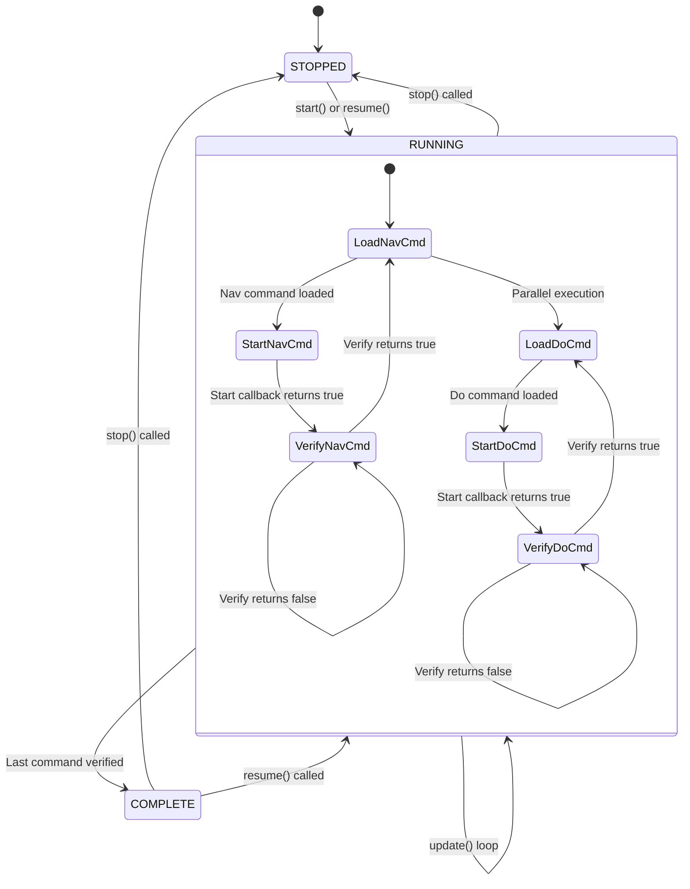
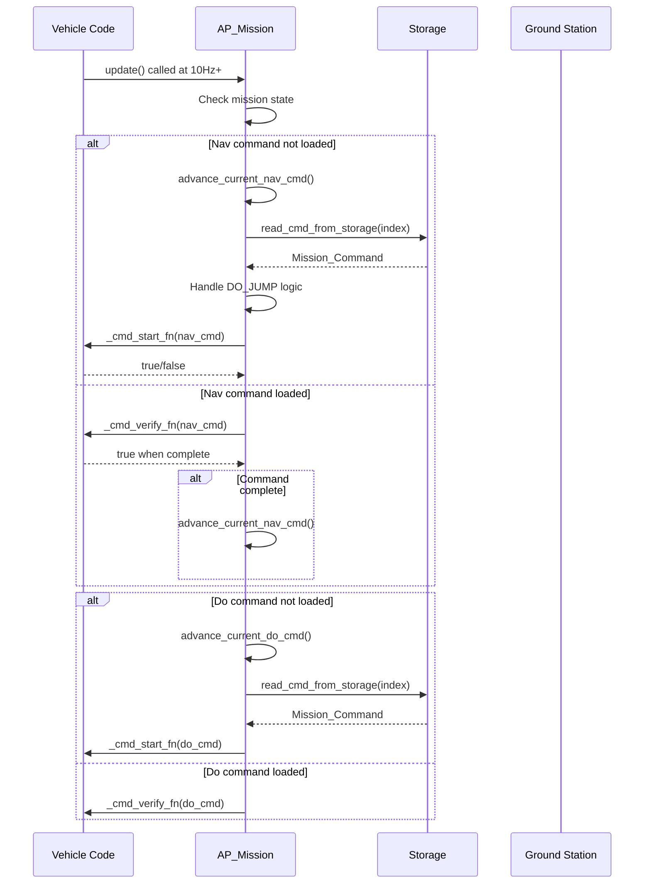
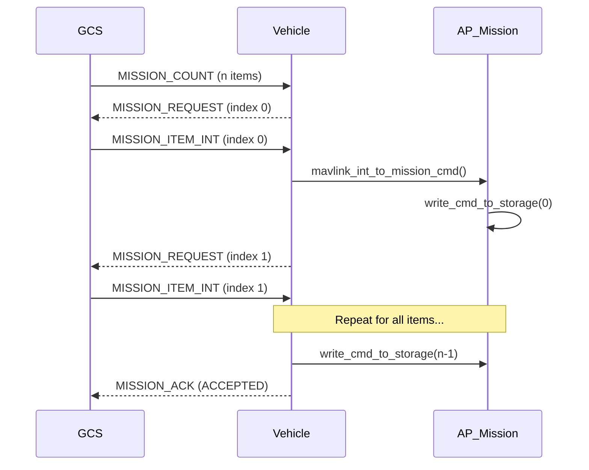
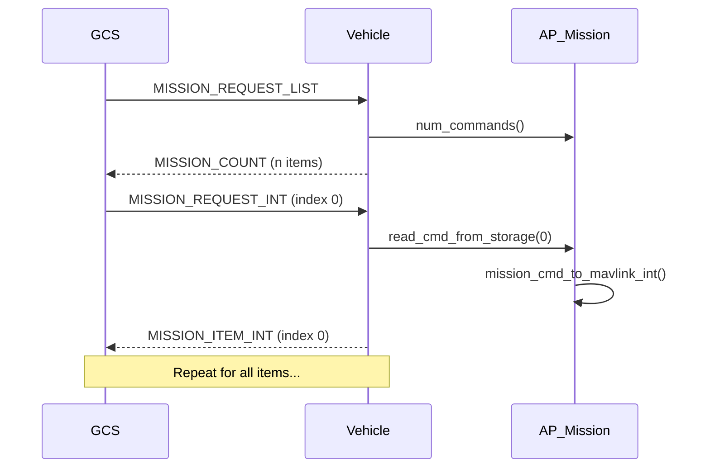

# AP_Mission

## Overview

The AP_Mission library is ArduPilot's mission management system responsible for storing, retrieving, and executing autonomous mission commands. It manages a sequence of navigation, action, and conditional commands that define autonomous flight paths, ground vehicle routes, or underwater missions. The library handles mission upload/download via MAVLink, provides persistent EEPROM storage, manages complex control flow with jumps and conditional logic, supports terrain-relative navigation, and interfaces with vehicle-specific command handlers for execution.

The mission system operates as a state machine that sequences through waypoints and commands, calling vehicle-specific start and verify functions to execute each command. It maintains history of previous waypoints for resume capability, tracks jump loop iterations to prevent infinite loops, and coordinates with other ArduPilot subsystems including the terrain database, geofencing, rally points, and scripting engine.

## Architecture

### Mission System Components

```mermaid
graph TB
    A[AP_Mission Library] --> B[Storage Manager]
    A --> C[Command Queue]
    A --> D[Jump Tracking]
    A --> E[MAVLink Interface]
    
    B --> B1[EEPROM Storage]
    B --> B2[SD Card Extension]
    B --> B3[AP_Param Integration]
    
    C --> C1[Navigation Commands]
    C --> C2[DO Commands]
    C --> C3[Conditional Commands]
    
    D --> D1[Jump Counter Array]
    D --> D2[Jump Tag System]
    D --> D3[Infinite Loop Protection]
    
    E --> E1[Mission Upload]
    E --> E2[Mission Download]
    E --> E3[Mission Item INT]
    
    A --> F[Vehicle Integration]
    F --> F1[Command Start Callback]
    F --> F2[Command Verify Callback]
    F --> F3[Mission Complete Callback]
    
    A --> G[Scripting Interface]
    G --> G1[get_item Method]
    G --> G2[set_item Method]
    G --> G3[Dynamic Mission Modification]
```



### Mission Execution State Machine



### Mission Command Execution Flow



## Key Components

### Mission_Command Structure

The `Mission_Command` structure represents a single mission item with the following key fields:

- **index**: Position in the mission command list (uint16_t)
- **id**: MAVLink command ID (MAV_CMD_*, uint16_t)
- **p1**: General purpose parameter 1 (uint16_t)
- **content**: Union containing command-specific data structures
- **type_specific_bits**: Additional storage bits for location-based commands (uint8_t)

The content union supports over 30 different command types including:
- Location-based navigation (waypoints, loiter, land, takeoff)
- Jump commands (DO_JUMP, JUMP_TAG, DO_JUMP_TAG)
- Conditional commands (delay, distance, yaw)
- Action commands (servo, relay, camera, gripper, mount control)
- Vehicle control (speed, guided limits, VTOL transition)
- Mission flow control (return path start, land start, resume repeat distance)

Source: `libraries/AP_Mission/AP_Mission.h:409-438`

### Storage Manager

The storage system uses `StorageAccess` with `StorageManager::StorageMission` to provide persistent EEPROM storage for mission commands. Key storage characteristics:

- **EEPROM Version**: 0x65AE stored in first 4 bytes, validated on init
- **Command Size**: 15 bytes per command (AP_MISSION_EEPROM_COMMAND_SIZE)
- **Maximum Commands**: Calculated as `(storage_size - 4) / 15`
- **SD Card Extension**: Optional extended storage via `AP_MISSION_SDCARD_FILENAME`
- **Format Conversion**: Automatic migration of storage formats for packing optimization

Storage layout:
- Bytes 0-3: Version number (0x65AE)
- Bytes 4-18: Command 0 (home position, special purpose)
- Bytes 19-33: Command 1 (first real mission command)
- Bytes 34+: Subsequent commands at 15-byte intervals

Source: `libraries/AP_Mission/AP_Mission.h:26-27`, `libraries/AP_Mission/AP_Mission.cpp:64-88`

### Jump Tracking System

The jump tracking system prevents infinite loops and manages jump command execution:

- **Jump Tracking Array**: Fixed-size array of `jump_tracking_struct` with index and run count
- **Maximum Jump Commands**: 15-100 depending on board memory class
- **Jump Repeat Forever**: Special value -1 means endless repeat
- **Maximum Jump Times**: 32767 iterations to prevent overflow
- **Jump Tag System**: Tags allow jumping to labeled waypoints with age tracking

Jump tag mechanism:
- When JUMP_TAG command executes, tag is remembered with age=1
- Age increments with each NAV command progression
- Enables advanced mission flow control and reusable mission segments

Source: `libraries/AP_Mission/AP_Mission.h:37-41, 67-70, 791-794, 914-917`

### Waypoint History

The mission system maintains a circular buffer of recently executed waypoint indices to support mission resume after failsafe or mode changes:

- **History Size**: AP_MISSION_MAX_WP_HISTORY (7 waypoints)
- **Purpose**: Enable rewinding to previous waypoint on mission resume
- **Resume Distance**: Configurable via DO_SET_RESUME_REPEAT_DIST command
- **Exit Position**: Stored location where mission was interrupted

Source: `libraries/AP_Mission/AP_Mission.h:49-50, 807, 911`

## Mission Command Types

### Navigation Commands (NAV)

Navigation commands define vehicle waypoints and movement patterns. The vehicle remains at or executes each NAV command until the verify function returns true. Key NAV commands include:

**Waypoint Navigation**:
- `MAV_CMD_NAV_WAYPOINT`: Fly to 3D location
- `MAV_CMD_NAV_SPLINE_WAYPOINT`: Fly smooth spline path through waypoint
- `MAV_CMD_NAV_WAYPOINT_USER_1` through `USER_5`: Custom vehicle-specific waypoints

**Loiter Commands**:
- `MAV_CMD_NAV_LOITER_UNLIM`: Loiter indefinitely at location
- `MAV_CMD_NAV_LOITER_TURNS`: Loiter for specified number of turns
- `MAV_CMD_NAV_LOITER_TIME`: Loiter for specified duration
- `MAV_CMD_NAV_LOITER_TO_ALT`: Loiter while climbing/descending to altitude

**Landing and Takeoff**:
- `MAV_CMD_NAV_TAKEOFF`: Takeoff to specified altitude
- `MAV_CMD_NAV_TAKEOFF_LOCAL`: Takeoff using local coordinates
- `MAV_CMD_NAV_VTOL_TAKEOFF`: VTOL-specific takeoff
- `MAV_CMD_NAV_LAND`: Land at location
- `MAV_CMD_NAV_VTOL_LAND`: VTOL-specific landing

**Guided and Follow**:
- `MAV_CMD_NAV_GUIDED_ENABLE`: Enable guided mode control
- `MAV_CMD_NAV_DELAY`: Wait for specified time or condition

**Specialized Navigation**:
- `MAV_CMD_NAV_PAYLOAD_PLACE`: Precision payload placement
- `MAV_CMD_NAV_ALTITUDE_WAIT`: Balloon altitude wait command
- `MAV_CMD_NAV_SCRIPT_TIME`: Scripting-controlled navigation with timeout
- `MAV_CMD_NAV_ATTITUDE_TIME`: Maintain attitude for duration

### DO Commands (Actions)

DO commands execute immediately without blocking mission progress. They trigger actions but don't require verification for mission advancement:

**Servo and Relay Control**:
- `MAV_CMD_DO_SET_SERVO`: Set servo to PWM value
- `MAV_CMD_DO_REPEAT_SERVO`: Pulse servo repeatedly
- `MAV_CMD_DO_SET_RELAY`: Set relay on/off
- `MAV_CMD_DO_REPEAT_RELAY`: Pulse relay repeatedly

**Camera and Gimbal**:
- `MAV_CMD_DO_DIGICAM_CONFIGURE`: Configure camera settings
- `MAV_CMD_DO_DIGICAM_CONTROL`: Trigger camera
- `MAV_CMD_DO_SET_CAM_TRIGG_DIST`: Set camera trigger distance
- `MAV_CMD_DO_GIMBAL_MANAGER_PITCHYAW`: Gimbal angle control
- `MAV_CMD_IMAGE_START_CAPTURE`: Start image sequence
- `MAV_CMD_IMAGE_STOP_CAPTURE`: Stop image sequence
- `MAV_CMD_VIDEO_START_CAPTURE`: Start video recording
- `MAV_CMD_VIDEO_STOP_CAPTURE`: Stop video recording
- `MAV_CMD_SET_CAMERA_ZOOM`: Set camera zoom
- `MAV_CMD_SET_CAMERA_FOCUS`: Set camera focus
- `MAV_CMD_SET_CAMERA_SOURCE`: Switch camera source

**Vehicle Control**:
- `MAV_CMD_DO_CHANGE_SPEED`: Change target speed
- `MAV_CMD_DO_SET_HOME`: Set home position
- `MAV_CMD_DO_SET_REVERSE`: Set reverse direction (Rover)
- `MAV_CMD_DO_ENGINE_CONTROL`: Start/stop engine
- `MAV_CMD_DO_VTOL_TRANSITION`: Transition VTOL mode

**Mission Flow Control**:
- `MAV_CMD_DO_JUMP`: Jump to specified waypoint with repeat count
- `MAV_CMD_DO_JUMP_TAG`: Jump to labeled waypoint (JUMP_TAG)
- `MAV_CMD_DO_LAND_START`: Mark landing sequence start
- `MAV_CMD_DO_RETURN_PATH_START`: Mark return path start
- `MAV_CMD_DO_SET_RESUME_REPEAT_DIST`: Set resume rewind distance

**Peripherals**:
- `MAV_CMD_DO_GRIPPER`: Open/close gripper
- `MAV_CMD_DO_PARACHUTE`: Deploy parachute
- `MAV_CMD_DO_SPRAYER`: Enable/disable sprayer
- `MAV_CMD_DO_WINCH`: Control winch operation
- `MAV_CMD_DO_FENCE_ENABLE`: Enable/disable geofence

**Advanced**:
- `MAV_CMD_DO_AUX_FUNCTION`: Trigger auxiliary function
- `MAV_CMD_DO_SEND_SCRIPT_MESSAGE`: Send message to scripting engine
- `MAV_CMD_JUMP_TAG`: Mark waypoint with tag for jumping

Source: `libraries/AP_Mission/AP_Mission.h:66-303`

### Conditional Commands

Conditional commands create execution dependencies based on conditions. They can delay progression to the next NAV command:

- `MAV_CMD_CONDITION_DELAY`: Delay for specified seconds
- `MAV_CMD_CONDITION_DISTANCE`: Wait until within distance of next waypoint
- `MAV_CMD_CONDITION_YAW`: Wait until vehicle reaches target yaw

Conditional commands are processed between NAV commands and must complete before the mission advances to the next NAV command.

Source: `libraries/AP_Mission/AP_Mission.h:73-88`

## Storage System

### EEPROM Persistence

The AP_Mission library uses ArduPilot's `StorageManager` system for persistent mission storage in EEPROM or flash memory:

**Storage Architecture**:
- Storage backend: `StorageManager::StorageMission`
- Version validation on initialization prevents incompatible mission formats
- Commands stored sequentially with fixed 15-byte records
- Command index 0 reserved for home position (special handling)
- First real mission command starts at index 1

**Storage Operations**:
```cpp
// Reading from storage
bool read_cmd_from_storage(uint16_t index, Mission_Command& cmd) const;

// Writing to storage
bool write_cmd_to_storage(uint16_t index, const Mission_Command& cmd);

// Writing home position
void write_home_to_storage();
```

**Version Management**:
- Current version: 0x65AE (AP_MISSION_EEPROM_VERSION)
- Stored in bytes 0-3 of mission storage
- Mismatch causes mission clear on initialization
- Prevents corruption from incompatible firmware versions

Source: `libraries/AP_Mission/AP_Mission.cpp:54-55, 861-871`

### SD Card Extension

Boards with SD card support can extend mission storage beyond EEPROM limits:

**Configuration**:
- Enabled via `BRD_SD_MISSION` parameter (size in KB)
- File location: `APM/mission.stg` (ChibiOS) or `mission.stg` (Linux)
- Automatically attached during initialization if configured

**Behavior**:
- Extends available mission storage significantly (thousands of commands)
- Falls back to EEPROM if SD card unavailable
- Mission cleared if SD card fails after being previously available
- Failure tracked in `_failed_sdcard_storage` flag

Source: `libraries/AP_Mission/AP_Mission.h:52-56`, `libraries/AP_Mission/AP_Mission.cpp:66-78`

### AP_Param Integration

Mission parameters are managed through ArduPilot's parameter system:

**Mission Parameters**:
- `MIS_TOTAL`: Total number of mission commands (read-only, internal use)
- `MIS_RESTART`: Controls mission starting behavior (0=Resume, 1=Restart)
- `MIS_OPTIONS`: Bitmask of mission options

Parameters are declared in `var_info` array and automatically saved/restored:

```cpp
static const struct AP_Param::GroupInfo var_info[];
```

The `_cmd_total` parameter is automatically updated when missions are uploaded or modified, providing persistent storage of mission count across reboots.

Source: `libraries/AP_Mission/AP_Mission.cpp:22-50`

### Storage Format and Packing

Mission commands are packed into 15-byte storage records using the `PackedContent` union. The storage format is optimized for space efficiency while maintaining backward compatibility:

**Format Conversion**:
- `format_conversion()` method handles migration between storage formats
- Enables addition of new command types without breaking existing missions
- Tag byte system identifies storage format version per command
- Allows incremental storage format improvements

**Thread Safety**:
- All storage operations protected by `_rsem` semaphore
- Prevents race conditions during mission upload/execution
- External code can lock semaphore via `get_semaphore()` for atomic multi-command operations

Source: `libraries/AP_Mission/AP_Mission.h:940, 959`

## Command Execution Flow

### Main Update Loop

The `update()` method is the heart of mission execution and should be called at 10Hz or higher:

**Update Sequence**:
1. Check if mission is running and commands exist
2. Update exit position for resume capability
3. Handle mission change events
4. Save current waypoint for watchdog restore
5. Process navigation command:
   - Load next NAV command if none active
   - Call start callback on newly loaded command
   - Call verify callback on active command
   - Advance when verify returns true
6. Process DO/conditional command in parallel:
   - Load next DO command if none active
   - Call start and verify callbacks

**State Transitions**:
- Commands marked "loaded" after successful start callback
- Commands marked complete when verify callback returns true
- Mission marked complete when no more navigation commands available
- Calling `complete()` invokes mission complete callback and stops execution

Source: `libraries/AP_Mission/AP_Mission.cpp:308-360`

### Command Start/Verify Pattern

Vehicle code integrates with AP_Mission through callback functions:

**Start Callback**:
```cpp
// Vehicle provides this function
bool vehicle_cmd_start_fn(const AP_Mission::Mission_Command& cmd) {
    switch (cmd.id) {
        case MAV_CMD_NAV_WAYPOINT:
            // Initialize waypoint navigation
            return true;
        case MAV_CMD_NAV_LOITER_TIME:
            // Start loiter timer
            return true;
        // ... handle other commands
    }
    return false;
}
```

**Verify Callback**:
```cpp
// Vehicle provides this function
bool vehicle_cmd_verify_fn(const AP_Mission::Mission_Command& cmd) {
    switch (cmd.id) {
        case MAV_CMD_NAV_WAYPOINT:
            // Check if waypoint reached
            return reached_waypoint();
        case MAV_CMD_NAV_LOITER_TIME:
            // Check if loiter time elapsed
            return loiter_time_complete();
        // ... verify other commands
    }
    return false;
}
```

**Complete Callback**:
```cpp
// Vehicle provides this function
void vehicle_mission_complete_fn() {
    // Mission finished, perform cleanup
    // Typically triggers RTL or loiter behavior
}
```

The AP_Mission library handles common DO commands internally (relay, servo, camera, gripper, parachute, fence) while delegating NAV commands and vehicle-specific DO commands to the vehicle code.

Source: `libraries/AP_Mission/AP_Mission.h:442-449`, `libraries/AP_Mission/AP_Mission.cpp:402-490`

### Scheduler Integration

Mission execution runs as part of the vehicle's main scheduler loop:

**Typical Integration**:
```cpp
// In vehicle scheduler task table
const AP_Scheduler::Task scheduler_tasks[] = {
    SCHED_TASK(update_mission, 50, 200),  // 50Hz, 200μs max
    // ... other tasks
};

// Task implementation
void Copter::update_mission() {
    mission.update();
}
```

**Timing Considerations**:
- Minimum update rate: 10Hz (recommended 50Hz)
- DO commands execute immediately in update() call
- NAV commands may take multiple update cycles to complete
- Mission state transitions happen synchronously
- Verify callbacks should execute quickly to avoid scheduler delays

Source: Vehicle-specific code (ArduCopter/Copter.cpp, ArduPlane/Plane.cpp, etc.)

## Conditional Commands and Flow Control

### DO_JUMP Command

The `MAV_CMD_DO_JUMP` command enables mission loops and repeated sequences:

**Parameters**:
- p1: Target waypoint index to jump to
- content.jump.target: Target waypoint (same as p1)
- content.jump.num_times: Repeat count (-1 for infinite, 0+ for limited)

**Jump Tracking**:
- System maintains array of up to 15-100 jump commands (board-dependent)
- Each jump's execution count tracked independently
- Jump repeats decrement counter on each execution
- Jump command ignored once counter reaches zero
- Infinite loops (repeat=-1) execute forever but respect AP_MISSION_JUMP_TIMES_MAX

**Example Mission with Loop**:
```
0: Home
1: Takeoff
2: Waypoint A
3: Waypoint B
4: Waypoint C
5: DO_JUMP to 2, repeat 3 times
6: Land
```

This executes: Takeoff → A → B → C → A → B → C → A → B → C → A → B → C → Land (path A-B-C repeated 4 times total)

**Infinite Loop Protection**:
- Maximum 32767 iterations per jump (AP_MISSION_JUMP_TIMES_MAX)
- Prevents firmware lockup from logic errors
- GCS receives notification if limit reached

Source: `libraries/AP_Mission/AP_Mission.h:37-41, 67-70`, `libraries/AP_Mission/AP_Mission.cpp:854-869`

### JUMP_TAG and DO_JUMP_TAG

The tag-based jump system provides labeled waypoints for more maintainable mission logic:

**JUMP_TAG Command** (`MAV_CMD_JUMP_TAG`):
- Marks a waypoint with a numeric tag (16-bit identifier)
- Does not block mission progression
- Tag remembered when executed, age tracking starts at 1
- Age increments with each subsequent NAV command

**DO_JUMP_TAG Command** (`MAV_CMD_DO_JUMP_TAG`):
- Searches mission for matching JUMP_TAG
- Jumps to first waypoint with specified tag
- Returns error if tag not found
- Subject to same repeat count tracking as DO_JUMP

**Tag Age System**:
- Age 0: No tag has been executed yet
- Age 1: Currently executing the tagged waypoint
- Age 2+: N-1 NAV commands have progressed since tag execution
- Enables scripting and advanced mission logic to detect mission progress

**API Methods**:
```cpp
// Get most recent jump tag and its age
bool get_last_jump_tag(uint16_t &tag, uint16_t &age) const;

// Jump to specific tag
bool jump_to_tag(const uint16_t tag);

// Find index of tag
uint16_t get_index_of_jump_tag(const uint16_t tag) const;
```

Source: `libraries/AP_Mission/AP_Mission.h:757-770, 791-794`

### Conditional Distance

`MAV_CMD_CONDITION_DISTANCE` delays mission progression until the vehicle is within specified distance of the next waypoint:

**Parameters**:
- content.distance.meters: Distance threshold in meters

**Behavior**:
- Placed between NAV commands
- Prevents next NAV command from starting until distance condition met
- Useful for triggering actions at specific distances before waypoint
- Vehicle-specific verify function checks distance to upcoming waypoint

**Example**:
```
1: Waypoint A
2: CONDITION_DISTANCE 50m
3: DO_SET_CAM_TRIGG_DIST 0 (stop camera triggering)
4: Waypoint B (landing zone)
```

This stops camera triggering when within 50m of the landing waypoint.

Source: `libraries/AP_Mission/AP_Mission.h:78-80`

### Conditional Delay

`MAV_CMD_CONDITION_DELAY` pauses mission progression for a specified duration:

**Parameters**:
- content.delay.seconds: Delay duration in seconds (float)

**Behavior**:
- Placed between NAV commands
- Starts timer when reached
- Blocks next NAV command until timer expires
- Useful for waiting at waypoints without loitering

Source: `libraries/AP_Mission/AP_Mission.h:73-75`

### Conditional Yaw

`MAV_CMD_CONDITION_YAW` delays mission until vehicle reaches target heading:

**Parameters**:
- content.yaw.angle_deg: Target yaw in degrees (0=North, 90=East)
- content.yaw.turn_rate_dps: Turn rate in deg/s (0=use default)
- content.yaw.direction: Turn direction (-1=CCW, +1=CW)
- content.yaw.relative_angle: 0=absolute, 1=relative to current heading

**Behavior**:
- Placed between NAV commands
- Rotates vehicle to target heading
- Next NAV command waits until yaw reached
- Copter-specific, may not apply to all vehicle types

Source: `libraries/AP_Mission/AP_Mission.h:83-88`

## Mission Resume Logic

### Resume After Failsafe

When a mission is interrupted by failsafe, mode change, or manual control, the resume system enables returning to the interrupted mission point:

**Resume Behavior** (MIS_RESTART=0):
- Mission remembers last executed NAV command
- On resume(), restarts from last NAV command
- DO commands between last and current NAV command are re-executed
- Preserves mission progress through interruptions

**Restart Behavior** (MIS_RESTART=1):
- Mission restarts from command index 1 (first real command after home)
- Jump counters reset to initial values
- All mission state cleared
- Useful for missions that should always start from beginning

**Force Resume**:
- `set_force_resume(true)` overrides MIS_RESTART parameter
- Allows programmatic control of resume behavior
- Useful for failsafe handling that requires mission continuation

Source: `libraries/AP_Mission/AP_Mission.h:513-525, 702-708`, `libraries/AP_Mission/AP_Mission.cpp:107-194`

### Waypoint History

The mission system maintains circular buffer of recently executed waypoint indices:

**History Tracking**:
- Array size: AP_MISSION_MAX_WP_HISTORY (7 waypoints)
- Stores NAV command indices for last 6 waypoints plus current
- Updated each time a new NAV command starts
- Used for resume position calculation

**History Reset**:
```cpp
void reset_wp_history();
```

Clears waypoint history, useful when starting new mission or preventing resume to stale waypoints.

Source: `libraries/AP_Mission/AP_Mission.h:49-50, 727, 807`

### Position Rewind

The resume system can rewind the vehicle to a previous mission position:

**DO_SET_RESUME_REPEAT_DIST Command**:
- Sets distance in meters to rewind on resume
- Stored in `_repeat_dist` member variable
- Creates virtual waypoint (_resume_cmd) along previous path
- Vehicle resumes from rewound position instead of last waypoint

**Resume Position Calculation**:
```cpp
bool calc_rewind_pos(Mission_Command& rewind_cmd);
```

Calculates virtual waypoint position based on:
- Last waypoint in history
- Resume repeat distance
- Path direction from waypoint history

**Exit Position Tracking**:
- `_exit_position` stores location where mission was exited
- Updated by `update_exit_position()` during mission execution
- Used to calculate resume path and rewind position

Source: `libraries/AP_Mission/AP_Mission.h:904, 911`, `libraries/AP_Mission/AP_Mission.cpp:879, 882`

### Landing Sequence Resume

The mission system provides specialized handling for landing sequences:

**DO_LAND_START Marker**:
- Marks beginning of landing sequence in mission
- Enables jump to nearest landing from any mission position
- Used by failsafe system to find safe landing sites

**Landing Sequence APIs**:
```cpp
// Find nearest landing sequence start
uint16_t get_landing_sequence_start(const Location &current_loc);

// Jump to nearest landing
bool jump_to_landing_sequence(const Location &current_loc);

// Jump to landing abort sequence
bool jump_to_abort_landing_sequence(const Location &current_loc);

// Scripting convenience methods (uses current location)
bool jump_to_landing_sequence();
bool jump_to_abort_landing_sequence();
```

**Landing Sequence Flags**:
- `_flags.in_landing_sequence`: True when executing landing-related commands
- Set when MAV_CMD_DO_LAND_START or landing commands execute
- Cleared on takeoff commands
- Used by vehicle code to enable landing-specific behaviors

Source: `libraries/AP_Mission/AP_Mission.h:660-693`, `libraries/AP_Mission/AP_Mission.cpp:414-425`

### Return Path Logic

The `MAV_CMD_DO_RETURN_PATH_START` command marks the beginning of a return path segment:

**Purpose**:
- Identifies mission segment used for returning home
- Enables failsafe to rejoin mission at optimal return path point
- Used in conjunction with `MIS_OPTIONS` bit 1 (FAILSAFE_TO_BEST_LANDING)

**Return Path APIs**:
```cpp
// Jump to closest point on return path
bool jump_to_closest_mission_leg(const Location &current_loc);

// Check if landing via DO_LAND_START or continuing mission is shorter
bool is_best_land_sequence(const Location &current_loc);
```

**Return Path Flag**:
- `_flags.in_return_path`: True when past DO_RETURN_PATH_START marker
- Enables intelligent failsafe routing
- Cleared on takeoff

Source: `libraries/AP_Mission/AP_Mission.h:680, 683, 697-699`, `libraries/AP_Mission/AP_Mission.cpp:417-419`

## Terrain-Relative Commands

### Altitude Frame Types

Mission commands that include location data support multiple altitude reference frames:

**Absolute Altitude** (Frame: MAV_FRAME_GLOBAL):
- Altitude relative to mean sea level (MSL)
- Uses barometric altitude with QNH correction
- Subject to barometric drift and weather changes
- Suitable for operations with known terrain elevation

**Relative Altitude** (Frame: MAV_FRAME_GLOBAL_RELATIVE_ALT):
- Altitude relative to home position
- Most common frame type for missions
- Independent of absolute elevation
- Maintains consistent height above launch point

**Terrain-Relative Altitude** (Frame: MAV_FRAME_GLOBAL_TERRAIN_ALT):
- Altitude relative to ground terrain
- Requires terrain database (AP_Terrain)
- Maintains consistent height above ground
- Essential for terrain following and obstacle avoidance

**Other Frames**:
- MAV_FRAME_GLOBAL_INT: Absolute altitude with integer lat/lon
- MAV_FRAME_GLOBAL_RELATIVE_ALT_INT: Relative altitude with integer lat/lon
- MAV_FRAME_GLOBAL_TERRAIN_ALT_INT: Terrain-relative with integer lat/lon

Source: `libraries/AP_Mission/AP_Mission.h:405`, Location class documentation

### Terrain Database Integration

Terrain-relative missions require integration with ArduPilot's terrain database system (AP_Terrain):

**Terrain Data Sources**:
- Onboard terrain database (stored on SD card)
- Real-time terrain data from GCS via MAVLink
- Fallback to barometric altitude if terrain data unavailable

**Command Support**:
- All location-based NAV commands support terrain frames
- DO_SET_HOME can use terrain-relative altitude
- Terrain frame stored in command's location.flags field

**Terrain Altitude Checking**:
```cpp
// Check if mission contains terrain-relative items
bool contains_terrain_alt_items();
```

This method scans mission for any terrain-relative commands, enabling vehicle code to:
- Verify terrain database availability before mission start
- Warn pilot if terrain data unavailable
- Cache terrain data along mission path
- Prevent mission start if critical terrain data missing

**Terrain Frame Verification**:
The mission system validates terrain-relative commands during upload:
- Checks if vehicle supports terrain database
- Validates terrain frame compatibility
- Returns MAV_MISSION_RESULT error codes for invalid configurations

Source: `libraries/AP_Mission/AP_Mission.h:721, 934-936`

### Terrain Following Behavior

When executing terrain-relative waypoints:

**Vehicle Behavior**:
- Continuously queries terrain database for ground elevation
- Adjusts altitude to maintain specified height above terrain
- Handles terrain database loading latency
- Falls back to barometric altitude if terrain data unavailable

**Safety Considerations**:
- Terrain database resolution: typically 30m to 100m spacing
- Terrain data may be outdated for areas with recent changes
- Man-made structures (buildings, towers) not in terrain database
- Minimum safe terrain clearance should account for database inaccuracies
- Test terrain-following missions in SITL before real flights

**Performance Impact**:
- Terrain database queries add CPU overhead
- SD card access may introduce latency
- Cache terrain data along flight path to minimize lookups
- Consider terrain database resolution when planning waypoint spacing

## MAVLink Protocol

### Mission Upload/Download Protocol

AP_Mission implements the MAVLink mission protocol for ground station interaction:

**Mission Upload Sequence**:


**Mission Download Sequence**:


Source: MAVLink protocol specification, GCS_MAVLink integration

### MISSION_ITEM_INT Format

ArduPilot uses `MISSION_ITEM_INT` messages for mission transfer, providing higher resolution than legacy MISSION_ITEM:

**Message Fields**:
- target_system, target_component: Recipient identification
- seq: Sequence number (command index) (uint16_t)
- frame: Coordinate frame (MAV_FRAME_*) (uint8_t)
- command: MAVLink command ID (MAV_CMD_*) (uint16_t)
- current: 0=not current, 1=current waypoint (uint8_t)
- autocontinue: Always 1 for ArduPilot (uint8_t)
- param1-4: Command-specific parameters (float)
- x: Latitude in degrees * 1E7 (int32_t)
- y: Longitude in degrees * 1E7 (int32_t)
- z: Altitude in meters (float)
- mission_type: Mission type (MAV_MISSION_TYPE_MISSION) (uint8_t)

**Conversion Methods**:
```cpp
// Convert MAVLink message to internal command structure
static MAV_MISSION_RESULT mavlink_int_to_mission_cmd(
    const mavlink_mission_item_int_t& packet, 
    AP_Mission::Mission_Command& cmd);

// Convert internal command to MAVLink message
static bool mission_cmd_to_mavlink_int(
    const AP_Mission::Mission_Command& cmd, 
    mavlink_mission_item_int_t& packet);

// Conversion between INT and non-INT formats
static MAV_MISSION_RESULT convert_MISSION_ITEM_to_MISSION_ITEM_INT(
    const mavlink_mission_item_t &mission_item,
    mavlink_mission_item_int_t &mission_item_int);

static MAV_MISSION_RESULT convert_MISSION_ITEM_INT_to_MISSION_ITEM(
    const mavlink_mission_item_int_t &mission_item_int,
    mavlink_mission_item_t &mission_item);
```

Source: `libraries/AP_Mission/AP_Mission.h:641-652`

### Command Validation

Mission items are validated during upload to prevent invalid commands from entering storage:

**Validation Checks**:
- Command ID supported by vehicle type
- Parameter ranges within valid limits
- Frame type compatible with command
- Coordinate values not NaN or infinite
- Required parameters present
- Command-specific parameter validation

**Validation Method**:
```cpp
static MAV_MISSION_RESULT sanity_check_params(
    const mavlink_mission_item_int_t& packet);
```

**MAV_MISSION_RESULT Codes**:
- MAV_MISSION_ACCEPTED: Command valid and accepted
- MAV_MISSION_INVALID: Generic invalid command
- MAV_MISSION_INVALID_PARAM1-7: Specific parameter invalid
- MAV_MISSION_INVALID_SEQUENCE: Sequence number out of range
- MAV_MISSION_UNSUPPORTED: Command not supported by vehicle
- MAV_MISSION_UNSUPPORTED_FRAME: Frame type not supported
- MAV_MISSION_ERROR: Storage or internal error

GCS receives appropriate error code if validation fails, allowing user to correct the mission.

Source: `libraries/AP_Mission/AP_Mission.h:641-648, 887`

### Mission Change Detection

The AP_Mission_ChangeDetector class helps vehicle code detect when missions are modified:

**Purpose**:
- Detect mission changes from GCS uploads
- Invalidate planned paths (splines, S-curves) that depend on waypoint sequence
- Trigger replanning when mission structure changes

**Change Detection API**:
```cpp
class AP_Mission_ChangeDetector {
    // Returns true if mission changed since last check
    bool check_for_mission_change();
};
```

**Monitored Changes**:
- Mission last change timestamp
- Current command index changes
- Next 3 navigation commands modified
- Mission command additions/deletions

Vehicle code (especially AC_WPNav) uses change detector to know when to recalculate spline paths and corner curves.

Source: `libraries/AP_Mission/AP_Mission_ChangeDetector.h`

## Scripting Interface

### Lua Bindings

The AP_Mission library provides Lua scripting bindings for dynamic mission manipulation:

**Mission Access Methods**:
```lua
-- Get mission item by index (returns mavlink_mission_item_int_t)
local item = mission:get_item(index)

-- Set mission item by index (takes mavlink_mission_item_int_t)
local success = mission:set_item(index, item)

-- Get total mission count
local count = mission:num_commands()

-- Get current navigation command index
local current = mission:get_current_nav_index()

-- Jump to specific waypoint
local success = mission:set_current_cmd(index)

-- Jump to tagged waypoint
local success = mission:jump_to_tag(tag)

-- Get mission state
local state = mission:state() -- STOPPED=0, RUNNING=1, COMPLETE=2

-- Control mission execution
mission:start()
mission:resume()
mission:stop()
mission:clear()
```

**Mission Item Structure in Lua**:
```lua
local item = mavlink_mission_item_int_t()
item:seq(5)  -- Command index
item:frame(3)  -- MAV_FRAME_GLOBAL_RELATIVE_ALT
item:command(16)  -- MAV_CMD_NAV_WAYPOINT
item:param1(0)  -- Hold time (seconds)
item:param2(10)  -- Acceptance radius (meters)
item:param3(0)  -- Pass through waypoint
item:param4(0)  -- Yaw angle (NaN to not change)
item:x(-353621474)  -- Latitude * 1E7
item:y(1491651746)  -- Longitude * 1E7
item:z(100)  -- Altitude (meters)

mission:set_item(5, item)
```

Source: `libraries/AP_Mission/AP_Mission.h:753-755`, AP_Scripting documentation

### Dynamic Mission Generation

Lua scripts can generate or modify missions at runtime:

**Example: Create Mission on Demand**:
```lua
function create_survey_mission()
    -- Clear existing mission
    mission:clear()
    
    -- Create home item (required at index 0)
    local home = mavlink_mission_item_int_t()
    home:command(MAV_CMD_NAV_WAYPOINT)
    home:frame(MAV_FRAME_GLOBAL)
    -- Set home position from current location
    
    -- Add takeoff
    local takeoff = mavlink_mission_item_int_t()
    takeoff:seq(1)
    takeoff:command(MAV_CMD_NAV_TAKEOFF)
    takeoff:z(50)  -- 50m altitude
    mission:set_item(1, takeoff)
    
    -- Generate survey grid waypoints
    for i = 1, grid_size do
        local wp = mavlink_mission_item_int_t()
        wp:seq(i + 1)
        wp:command(MAV_CMD_NAV_WAYPOINT)
        -- Calculate grid position...
        mission:set_item(i + 1, wp)
    end
    
    mission:start()
end
```

**Example: Modify Mission Based on Conditions**:
```lua
function update_mission()
    -- Check if specific condition met
    if rangefinder:distance() < 10 then
        -- Skip next two waypoints by jumping ahead
        local current = mission:get_current_nav_index()
        mission:set_current_cmd(current + 2)
    end
end
```

**Thread Safety**:
Scripts should use mission semaphore for atomic multi-command operations:
```lua
-- Not directly exposed to Lua, handled internally by bindings
```

The scripting interface enables advanced autonomous behaviors like dynamic path planning, conditional mission modifications, and mission generation based on sensor data.

Source: `libraries/AP_Mission/AP_Mission.h:753-755, 712-715`

### Scripting Command Support

The `MAV_CMD_NAV_SCRIPT_TIME` command enables scripting-controlled navigation:

**Command Parameters**:
- command: Script-specific command ID (uint8_t)
- timeout_s: Maximum execution time in seconds (uint8_t)
- arg1, arg2: Float16 arguments
- arg3, arg4: Integer arguments (int16_t)

**Behavior**:
- NAV command that blocks mission progression
- Script controls when command completes
- Timeout provides safety failsafe
- Vehicle code delegates to scripting engine for execution

**Example Application**:
```lua
-- In Lua script
function update()
    local cmd = mission:get_current_nav_cmd()
    if cmd:id() == MAV_CMD_NAV_SCRIPT_TIME then
        local command = cmd:content():nav_script_time():command()
        if command == 1 then  -- Custom orbit maneuver
            perform_custom_orbit()
            -- Signal completion to mission
            mission_complete = true
        end
    end
end
```

Source: `libraries/AP_Mission/AP_Mission.h:228-246`

## Configuration Parameters

### MIS_TOTAL

**Description**: Total number of mission commands loaded by ground station.

- **Type**: AP_Int16 (int16_t)
- **Range**: 0 to 32766
- **Default**: 0
- **Access**: Read-only from ground station (internal use only)
- **Persistence**: Automatically saved when mission uploaded

This parameter tracks the mission count persistently across reboots. Do not manually modify this parameter as it must match the actual number of commands in storage. The ground station automatically updates this value during mission upload.

Source: `libraries/AP_Mission/AP_Mission.cpp:24-31, 898`

### MIS_RESTART

**Description**: Controls mission starting point when entering Auto mode.

- **Type**: AP_Int8 (int8_t)
- **Range**: 0 (Resume) or 1 (Restart)
- **Default**: 0 (Resume)
- **Values**:
  - 0 = Resume Mission: Continue from last executed command
  - 1 = Restart Mission: Start from beginning (command index 1)

**Behavior**:
- Resume mode (0): Restarts from `_nav_cmd.index`, preserves jump counters
- Restart mode (1): Resets to first command, clears all mission state
- Can be overridden programmatically via `set_force_resume(true)`
- Affects `start_or_resume()` method behavior
- Does not affect manual `start()` or `resume()` calls

**Use Cases**:
- Resume (0): Delivery missions, inspection missions, missions with failsafe recovery
- Restart (1): Training flights, demonstration missions, missions requiring clean start

Source: `libraries/AP_Mission/AP_Mission.cpp:33-38, 900`

### MIS_OPTIONS

**Description**: Bitmask of mission behavior options.

- **Type**: AP_Int16 (int16_t)
- **Default**: 0 (all options disabled)
- **Bitmask Values**:

**Bit 0 (1): Clear Mission on Reboot**
- When set: Mission cleared from storage on vehicle boot
- When clear: Mission persists across reboots
- Use case: Prevent stale missions after firmware updates or configuration changes

**Bit 1 (2): Failsafe to Best Landing** (Plane only)
- When set: On battery failsafe, calculate fastest path to landing (mission vs DO_LAND_START)
- When clear: Standard failsafe behavior
- Requires DO_LAND_START and DO_RETURN_PATH_START markers in mission
- Use case: Optimize emergency landing path selection

**Bit 2 (4): Continue After Land**
- When set: Mission continues after landing if next command is takeoff
- When clear: Vehicle disarms after landing, mission stops
- Use case: Multi-leg missions with intermediate landings

**Bit 3 (8): Don't Zero Counter**
- When set: Jump loop counters not reset to zero on loop completion
- When clear: Jump counters reset when loop completes
- Use case: Prevent re-entering completed jump loops on mission restart

**Vehicle-Specific Support**:
- Copter: Bits 0, 2 supported
- Plane: Bits 0, 1, 2, 3 supported
- Rover/Sub: Bit 0 only

Source: `libraries/AP_Mission/AP_Mission.cpp:40-47, 899`, `libraries/AP_Mission/AP_Mission.h:735-743`

## Safety Considerations

### EEPROM Wear Limits

**Flash/EEPROM Endurance**:
- Typical EEPROM: 100,000 write cycles per cell
- Flash storage: 10,000-100,000 write cycles per block
- Mission storage uses same cells repeatedly

**Wear Mitigation**:
- Avoid frequent mission uploads during normal operations
- Plan missions on ground station before upload
- Test missions in SITL simulation before uploading to vehicle
- SD card extension reduces EEPROM wear for large missions
- Consider mission size limits based on storage type

**Best Practices**:
- Upload mission once before flight, not repeatedly
- Use scripting for dynamic path changes instead of mission re-uploads
- Monitor storage health on older vehicles
- Backup missions before firmware updates

Source: Storage system documentation

### Thread-Safety with Semaphores

**Mission Semaphore Protection**:
```cpp
// All storage operations protected by _rsem semaphore
HAL_Semaphore& get_semaphore();
```

**Thread-Safety Guarantees**:
- Mission storage reads/writes are atomic
- Concurrent access from vehicle code and GCS handled safely
- Semaphore prevents race conditions during mission execution
- External code can lock semaphore for atomic multi-command operations

**Usage Pattern**:
```cpp
// Vehicle code accessing mission commands
{
    WITH_SEMAPHORE(mission.get_semaphore());
    // Read multiple commands atomically
    mission.read_cmd_from_storage(i, cmd1);
    mission.read_cmd_from_storage(i+1, cmd2);
    // Commands guaranteed consistent
}
```

**Scheduler Implications**:
- Storage operations may block briefly on semaphore
- Keep semaphore-locked sections short
- Avoid blocking operations while holding semaphore
- GCS mission upload temporarily delays mission execution (< 1 update cycle)

Source: `libraries/AP_Mission/AP_Mission.h:712-715, 940`

### Parameter Compatibility

**Cross-Version Compatibility**:
- Mission storage format versioned (currently 0x65AE)
- Incompatible versions cause automatic mission clear
- Always backup missions before firmware updates
- Parameter changes may invalidate missions

**Parameter Interdependencies**:
- `MIS_TOTAL` must match actual command count in storage
- Modifying `MIS_TOTAL` manually causes mission corruption
- Mission parameters linked to other subsystems:
  - Fence parameters (AC_Fence)
  - Rally parameters (AP_Rally)
  - Terrain database settings (AP_Terrain)

**GCS Compatibility**:
- Mission Planner, QGroundControl, APM Planner 2.0 use same MAVLink protocol
- Some commands vehicle-specific (not all GCS expose all commands)
- Test mission uploads in SITL before attempting on vehicle
- Verify command support in vehicle firmware version

Source: `libraries/AP_Mission/AP_Mission.h:26`

### Mission State Constraints

**State Transition Restrictions**:
- Cannot clear mission while armed and running
- Mission start requires at least one command beyond home
- Jump commands cannot target index 0 (home)
- Jump commands cannot create reverse loops (must jump backward)

**State Consistency**:
- Mission state changes are synchronous
- Vehicle code must handle mission complete callback
- Unexpected mission clear leaves vehicle in failsafe state
- Always check mission validity before starting

**Error Handling**:
```cpp
// Check mission present before starting
if (mission.present()) {
    mission.start_or_resume();
} else {
    // Handle missing mission - typically trigger RTL
    set_mode(Mode::RTL);
}
```

Source: `libraries/AP_Mission/AP_Mission.cpp:276-296`

### Flight-Critical Warnings

**⚠️ Critical Safety Requirements**:

1. **Mission Validation**: Always validate missions in SITL before real flights
2. **Terrain Data**: Verify terrain database availability for terrain-relative missions
3. **Failsafe Planning**: Include DO_LAND_START markers for emergency landing options
4. **Jump Loops**: Test jump logic thoroughly - infinite loops can crash vehicle
5. **Altitude Frames**: Double-check altitude frame types - mixing frames causes altitude errors
6. **Home Position**: Ensure GPS lock before arming - home position critical for relative altitude
7. **Geofence Integration**: Mission waypoints should remain within geofence boundaries
8. **Battery Reserve**: Plan mission duration with 30%+ battery reserve
9. **Communication Loss**: Test mission behavior with GCS disconnected
10. **Abort Procedures**: Always have manual control takeover procedure ready

**Pre-Flight Checklist**:
- ✓ Mission uploaded and verified in ground station
- ✓ All waypoints plotted correctly on map
- ✓ Altitude frames checked (relative vs absolute vs terrain)
- ✓ Jump commands tested (loop count verified)
- ✓ Takeoff and landing sequences validated
- ✓ Failsafe actions configured
- ✓ Battery capacity sufficient for mission + reserve
- ✓ Weather conditions suitable for mission
- ✓ Airspace clearances obtained
- ✓ Emergency landing zones identified

## Testing

### SITL Mission Scenarios

Software-In-The-Loop (SITL) simulation provides safe mission testing environment:

**Basic Mission Test**:
```bash
# Start SITL with Copter
sim_vehicle.py -v ArduCopter --console --map

# In MAVProxy console:
wp load missions/test_mission.txt
mode AUTO
arm throttle
```

**Mission File Format** (test_mission.txt):
```
QGC WPL 110
0	1	0	16	0	0	0	0	-35.362938	149.165085	584.0	1
1	0	3	22	0.0	0.0	0.0	0.0	0.0	0.0	10.0	1
2	0	3	16	0.0	10.0	0.0	0.0	-35.363	149.165	100.0	1
3	0	3	16	0.0	10.0	0.0	0.0	-35.363	149.166	100.0	1
4	0	3	21	0.0	0.0	0.0	0.0	0.0	0.0	0.0	1
```

Column format: index, current, frame, command, p1, p2, p3, p4, lat, lon, alt, autocontinue

**Test Scenarios**:

1. **Basic Waypoint Navigation**:
```bash
# Test simple waypoint sequence
wp load missions/basic_waypoints.txt
mode AUTO
# Observe vehicle navigate through waypoints
```

2. **Jump Loop Testing**:
```bash
# Mission with DO_JUMP command
# Verify loop executes correct number of times
# Check jump counter tracking
```

3. **Terrain Following**:
```bash
# Enable terrain (requires SRTM data)
param set TERRAIN_ENABLE 1
# Load terrain-relative mission
wp load missions/terrain_mission.txt
# Verify altitude maintains AGL height
```

4. **Conditional Commands**:
```bash
# Test CONDITION_DELAY, CONDITION_DISTANCE
# Verify timing and distance triggers
```

5. **Mission Resume**:
```bash
# Start mission
mode AUTO
# Switch to manual control mid-mission
mode LOITER
# Resume mission
mode AUTO
# Verify resume from correct waypoint
```

Source: Tools/autotest directory

### Autotest Framework Integration

ArduPilot's autotest framework includes comprehensive mission testing:

**Autotest Mission Tests** (Tools/autotest/):

```python
# Example autotest mission test
def test_mission_jump(self):
    """Test DO_JUMP command with loop counting"""
    self.load_mission("mission_jump_loop.txt")
    self.change_mode("AUTO")
    self.wait_ready_to_arm()
    self.arm_vehicle()
    
    # Verify waypoint sequence with jumps
    self.wait_waypoint(1, 5)  # First pass
    self.wait_waypoint(2, 5)  # Loop back
    self.wait_waypoint(3, 5)  # Second pass
    
    self.wait_mission_complete()
    self.disarm_vehicle()
```

**Running Mission Tests**:
```bash
# Run specific mission test
./Tools/autotest/autotest.py build.ArduCopter test.AutoTest.test_mission_jump

# Run all mission tests
./Tools/autotest/autotest.py build.ArduCopter test.AutoTest.test_mission_*

# Run with vehicle visualization
./Tools/autotest/autotest.py build.ArduCopter test.AutoTest.test_mission_jump --show-test-messages
```

**Test Coverage**:
- Basic waypoint navigation (straight lines, curves, splines)
- Loiter commands (time, turns, altitude)
- Jump commands (limited loops, infinite loops, tags)
- Conditional commands (delay, distance, yaw)
- Terrain-relative missions
- Mission resume after failsafe
- Landing sequences and DO_LAND_START
- Return path logic with DO_RETURN_PATH_START
- Rally point integration
- Geofence interaction
- Mission change detection
- Scripting interface

Source: `Tools/autotest/arducopter.py`, `Tools/autotest/arduplane.py`, `Tools/autotest/rover.py`

### Mission Validation Procedures

**Pre-Upload Validation** (performed by GCS):
1. Check all command IDs supported by vehicle type
2. Validate parameter ranges
3. Verify coordinate validity (not NaN, within Earth bounds)
4. Check altitude frame consistency
5. Validate jump targets (no forward jumps, valid indices)
6. Ensure mission starts with takeoff (for flying vehicles)
7. Verify landing command present (for flying vehicles)

**Post-Upload Verification**:
```bash
# MAVProxy commands
wp list  # Display all waypoints
wp show N  # Show specific waypoint details
wp verify  # Check mission validity
```

**Common Mission Errors**:
- **Invalid jump target**: Jump to non-existent waypoint index
- **Infinite loop**: Jump with repeat=-1 and no exit condition
- **Missing takeoff**: First command not MAV_CMD_NAV_TAKEOFF
- **Wrong altitude frame**: Mixing absolute and relative altitudes
- **Invalid coordinates**: Lat/lon outside valid range or NaN
- **Terrain data missing**: Terrain-relative mission without terrain database

**Validation Checklist**:
- ✓ All waypoints within operational area
- ✓ Altitude values reasonable for vehicle type
- ✓ Jump commands reference valid indices
- ✓ Loiter commands have appropriate timing
- ✓ DO commands properly sequenced
- ✓ Landing sequence includes DO_LAND_START
- ✓ Conditional commands placed correctly between NAV commands
- ✓ Terrain-relative frames used consistently

## Usage Examples

### Creating and Starting a Mission

**Basic Mission Execution**:
```cpp
// In vehicle initialization
AP_Mission mission(
    FUNCTOR_BIND_MEMBER(&Copter::mission_start, bool, const AP_Mission::Mission_Command &),
    FUNCTOR_BIND_MEMBER(&Copter::mission_verify, bool, const AP_Mission::Mission_Command &),
    FUNCTOR_BIND_MEMBER(&Copter::mission_complete, void)
);

// Initialize mission system
void Copter::init() {
    mission.init();
}

// Start mission when entering AUTO mode
void Copter::set_auto_mode() {
    if (mission.present()) {
        mission.start_or_resume();
    } else {
        gcs().send_text(MAV_SEVERITY_WARNING, "No mission loaded");
        set_mode(Mode::LOITER);
    }
}

// Mission update in scheduler
void Copter::update_mission() {
    if (control_mode == Mode::AUTO) {
        mission.update();
    }
}
```

Source: ArduCopter/Copter.cpp integration example

### Reading Mission Commands

**Accessing Current and Next Commands**:
```cpp
// Get current navigation command
const AP_Mission::Mission_Command& nav_cmd = mission.get_current_nav_cmd();

switch (nav_cmd.id) {
    case MAV_CMD_NAV_WAYPOINT:
        Location target = nav_cmd.content.location;
        navigate_to_waypoint(target);
        break;
        
    case MAV_CMD_NAV_LOITER_TIME:
        float loiter_time = nav_cmd.p1;
        start_loiter_timer(loiter_time);
        break;
}

// Get next navigation command for path planning
AP_Mission::Mission_Command next_cmd;
uint16_t next_index = nav_cmd.index + 1;
if (mission.get_next_nav_cmd(next_index, next_cmd)) {
    // Plan path through corner to next waypoint
    plan_spline_path(nav_cmd.content.location, next_cmd.content.location);
}

// Get current DO command
const AP_Mission::Mission_Command& do_cmd = mission.get_current_do_cmd();
// Process active DO command if present
```

Source: `libraries/AP_Mission/AP_Mission.h:560-624`

### Implementing Command Handlers

**Vehicle-Specific Start Handler**:
```cpp
bool Copter::mission_start(const AP_Mission::Mission_Command& cmd) {
    // Log command start
    logger.Write_Event(DATA_MISSION_CMD_START);
    
    switch (cmd.id) {
        case MAV_CMD_NAV_WAYPOINT: {
            // Extract waypoint location
            Location target_loc = cmd.content.location;
            
            // Initialize waypoint navigation
            wp_nav->set_wp_destination(target_loc);
            
            // Set yaw behavior
            if (!is_zero(cmd.content.location.loiter_ccw)) {
                auto_yaw.set_mode(AUTO_YAW_ROI);
            } else {
                auto_yaw.set_mode(AUTO_YAW_HOLD);
            }
            
            return true;
        }
        
        case MAV_CMD_NAV_LOITER_TIME: {
            Location target_loc = cmd.content.location;
            
            // Initialize loiter
            wp_nav->init_loiter_target(target_loc);
            
            // Start timer
            loiter_time_max = cmd.p1 * 1000; // Convert to ms
            loiter_time = 0;
            
            return true;
        }
        
        case MAV_CMD_NAV_LAND:
            // Initialize landing sequence
            set_mode(Mode::LAND);
            return true;
            
        default:
            // Command not recognized
            return false;
    }
}
```

**Vehicle-Specific Verify Handler**:
```cpp
bool Copter::mission_verify(const AP_Mission::Mission_Command& cmd) {
    switch (cmd.id) {
        case MAV_CMD_NAV_WAYPOINT:
            // Check if waypoint reached
            return wp_nav->reached_wp_destination();
            
        case MAV_CMD_NAV_LOITER_TIME:
            // Check if loiter time elapsed
            loiter_time += (uint32_t)(1000.0f / scheduler.get_loop_rate_hz());
            return (loiter_time >= loiter_time_max);
            
        case MAV_CMD_NAV_LAND:
            // Check if landed
            return ap.land_complete;
            
        default:
            return false;
    }
}
```

**Mission Complete Handler**:
```cpp
void Copter::mission_complete() {
    // Log mission completion
    logger.Write_Event(DATA_MISSION_COMPLETE);
    
    // Send GCS notification
    gcs().send_text(MAV_SEVERITY_INFO, "Mission complete");
    
    // Transition to appropriate mode
    if (g.rtl_altitude_cm > 0) {
        set_mode(Mode::RTL);
    } else {
        set_mode(Mode::LOITER);
    }
}
```

Source: ArduCopter/mode_auto.cpp integration patterns

### Scripting Examples

**Lua Script: Dynamic Waypoint Insertion**:
```lua
-- Insert emergency landing waypoint based on battery level
function update()
    local battery = battery:voltage()
    
    if battery < 10.5 then  -- Low battery threshold
        -- Get current position
        local current_loc = ahrs:get_location()
        
        -- Create emergency landing waypoint
        local land_wp = mavlink_mission_item_int_t()
        land_wp:seq(mission:get_current_nav_index() + 1)
        land_wp:frame(MAV_FRAME_GLOBAL_RELATIVE_ALT)
        land_wp:command(MAV_CMD_NAV_LAND)
        land_wp:x(current_loc:lat())
        land_wp:y(current_loc:lng())
        land_wp:z(0)  -- Land altitude
        
        -- Insert into mission
        mission:set_item(land_wp:seq(), land_wp)
        
        gcs:send_text(0, "Emergency landing waypoint inserted")
    end
    
    return update, 1000  -- Run every 1 second
end

return update()
```

**Lua Script: Conditional Mission Branching**:
```lua
-- Jump to different mission segments based on sensor data
function check_conditions()
    local current_wp = mission:get_current_nav_index()
    local rangefinder_dist = rangefinder:distance()
    
    -- If obstacle detected, jump to avoidance path
    if rangefinder_dist < 5.0 then
        -- Jump to JUMP_TAG 100 (avoidance route)
        if mission:jump_to_tag(100) then
            gcs:send_text(0, "Obstacle detected, taking avoidance route")
        end
    end
    
    return check_conditions, 500  -- Check every 0.5 seconds
end

return check_conditions()
```

Source: AP_Scripting examples directory

## Integration Guide

### Vehicle Code Integration

**Initialization Sequence**:
```cpp
// 1. Define callbacks in vehicle class
class Copter {
    bool mission_start(const AP_Mission::Mission_Command& cmd);
    bool mission_verify(const AP_Mission::Mission_Command& cmd);
    void mission_complete();
};

// 2. Create AP_Mission instance with callbacks
AP_Mission mission {
    FUNCTOR_BIND_MEMBER(&Copter::mission_start, bool, const AP_Mission::Mission_Command &),
    FUNCTOR_BIND_MEMBER(&Copter::mission_verify, bool, const AP_Mission::Mission_Command &),
    FUNCTOR_BIND_MEMBER(&Copter::mission_complete, void)
};

// 3. Initialize in setup()
void Copter::setup() {
    // ... other initialization ...
    mission.init();
}

// 4. Add to scheduler tasks
const AP_Scheduler::Task Copter::scheduler_tasks[] = {
    SCHED_TASK(update_mission, 50, 200),  // 50Hz update
    // ... other tasks ...
};

void Copter::update_mission() {
    mission.update();
}
```

Source: ArduCopter/Copter.h, ArduCopter/Copter.cpp

### Mode Integration

**AUTO Mode Implementation**:
```cpp
// Mode switching
void Copter::set_mode(Mode mode) {
    if (mode == Mode::AUTO) {
        // Start or resume mission
        if (mission.present()) {
            if (mission.state() == AP_Mission::MISSION_STOPPED) {
                mission.start_or_resume();
            }
        } else {
            // No mission loaded
            gcs().send_text(MAV_SEVERITY_WARNING, "No mission");
            return;  // Don't enter AUTO mode
        }
    }
    
    // ... mode switching logic ...
}

// Mode exit handling
void Copter::exit_auto_mode() {
    // Stop mission but don't clear
    mission.stop();
    
    // Mission can be resumed when re-entering AUTO
}
```

**RTL Mode Integration**:
```cpp
// Return to Launch with mission integration
void Copter::rtl_init() {
    // Check for rally points or DO_LAND_START markers
    if (mission.get_in_landing_sequence_flag()) {
        // Already in landing sequence, continue mission
        return;
    }
    
    // Jump to nearest landing sequence if available
    if (mission.jump_to_landing_sequence()) {
        // Found landing sequence, use it
        set_mode(Mode::AUTO);
        return;
    }
    
    // No mission landing available, use standard RTL
    wp_nav->set_wp_destination(ahrs.get_home());
}
```

Source: ArduCopter/mode_auto.cpp, ArduCopter/mode.cpp

### Failsafe Handling

**Battery Failsafe with Mission**:
```cpp
void Copter::battery_failsafe_check() {
    if (battery.is_low()) {
        switch (control_mode) {
            case Mode::AUTO:
                // Check MIS_OPTIONS for best landing behavior
                if (mission.option_is_set(AP_Mission::Option::FAILSAFE_TO_BEST_LANDING)) {
                    Location current_loc = ahrs.get_location();
                    
                    // Compare mission path vs direct landing
                    if (mission.is_best_land_sequence(current_loc)) {
                        // Continue mission, it's fastest to landing
                        gcs().send_text(MAV_SEVERITY_WARNING, "Battery low, continuing mission to land");
                    } else {
                        // Jump to nearest landing sequence
                        if (mission.jump_to_landing_sequence(current_loc)) {
                            gcs().send_text(MAV_SEVERITY_WARNING, "Battery low, jumping to landing");
                        } else {
                            // No landing sequence, trigger RTL
                            set_mode(Mode::RTL);
                        }
                    }
                } else {
                    // Standard failsafe behavior
                    set_mode(Mode::RTL);
                }
                break;
                
            default:
                // Other modes use standard failsafe
                set_mode(Mode::RTL);
                break;
        }
    }
}
```

Source: ArduCopter/failsafe.cpp integration patterns

### GCS Integration

**Mission Upload Handling** (handled by GCS_MAVLink):
```cpp
// In GCS_MAVLINK message handler
void handle_mission_item_int(mavlink_message_t *msg) {
    mavlink_mission_item_int_t packet;
    mavlink_msg_mission_item_int_decode(msg, &packet);
    
    // Validate command
    AP_Mission::Mission_Command cmd;
    MAV_MISSION_RESULT result = AP_Mission::mavlink_int_to_mission_cmd(packet, cmd);
    
    if (result != MAV_MISSION_ACCEPTED) {
        send_mission_ack(result);
        return;
    }
    
    // Write to storage
    if (mission.replace_cmd(packet.seq, cmd)) {
        // Request next item or send ACK if complete
        if (packet.seq < mission_count - 1) {
            send_mission_request(packet.seq + 1);
        } else {
            send_mission_ack(MAV_MISSION_ACCEPTED);
        }
    } else {
        send_mission_ack(MAV_MISSION_ERROR);
    }
}
```

**Current Waypoint Reporting**:
```cpp
// Report current mission state to GCS
void send_mission_status() {
    if (mission.state() == AP_Mission::MISSION_RUNNING) {
        mavlink_msg_mission_current_send(
            chan,
            mission.get_current_nav_index()
        );
    }
}
```

Source: GCS_MAVLink mission protocol handling

## References

### Source Files

**Core Mission Library**:
- `libraries/AP_Mission/AP_Mission.h`: Main header with class definition and structures (971 lines)
- `libraries/AP_Mission/AP_Mission.cpp`: Core implementation, storage, execution flow (500+ lines)
- `libraries/AP_Mission/AP_Mission_Commands.cpp`: Command-specific handlers for common DO commands
- `libraries/AP_Mission/AP_Mission_ChangeDetector.h`: Mission change detection for path planning
- `libraries/AP_Mission/LogStructure.h`: Dataflash logging format for mission commands

**Configuration**:
- `libraries/AP_Mission/AP_Mission_config.h`: Feature configuration and conditional compilation

### Related Modules

**Storage and Parameters**:
- `libraries/AP_Param/`: Parameter system for MIS_* parameters
- `libraries/StorageManager/`: Underlying storage abstraction for EEPROM/flash
- `libraries/AP_Filesystem/`: SD card file system for extended mission storage

**Navigation and Control**:
- `libraries/AC_WPNav/`: Waypoint navigation for multirotors
- `libraries/AP_Navigation/`: Navigation helpers and coordinate transformations
- `libraries/AP_Terrain/`: Terrain database for terrain-relative missions
- `libraries/AC_Fence/`: Geofencing integration with mission bounds checking
- `libraries/AP_Rally/`: Rally points as alternative landing sites

**Communication**:
- `libraries/GCS_MAVLink/`: MAVLink protocol implementation for mission upload/download
- `libraries/AP_Scripting/`: Lua scripting interface to mission system

**Vehicle Integration**:
- `ArduCopter/mode_auto.cpp`: Copter AUTO mode mission execution
- `ArduPlane/mode_auto.cpp`: Plane AUTO mode mission execution
- `Rover/mode_auto.cpp`: Rover AUTO mode mission execution
- `ArduSub/mode_auto.cpp`: Sub AUTO mode mission execution

### External Documentation

**MAVLink Protocol**:
- MAVLink Mission Protocol: https://mavlink.io/en/services/mission.html
- MAVLink Command List: https://mavlink.io/en/messages/common.html#mav_commands

**ArduPilot Wiki**:
- Mission Planning: https://ardupilot.org/copter/docs/mission-planning-home.html
- Mission Commands: https://ardupilot.org/copter/docs/common-mavlink-mission-command-messages-mav_cmd.html
- AUTO Mode: https://ardupilot.org/copter/docs/auto-mode.html

**Development Resources**:
- ArduPilot Development Guide: https://ardupilot.org/dev/
- SITL Simulator: https://ardupilot.org/dev/docs/sitl-simulator-software-in-the-loop.html
- Mission Testing: https://ardupilot.org/dev/docs/using-sitl-for-ardupilot-testing.html

**Ground Station Software**:
- Mission Planner: https://ardupilot.org/planner/
- QGroundControl: http://qgroundcontrol.com/
- MAVProxy: https://ardupilot.org/mavproxy/

---

**Document Version**: 1.0  
**Last Updated**: 2025  
**Maintainer**: ArduPilot Development Team  
**License**: GPLv3
