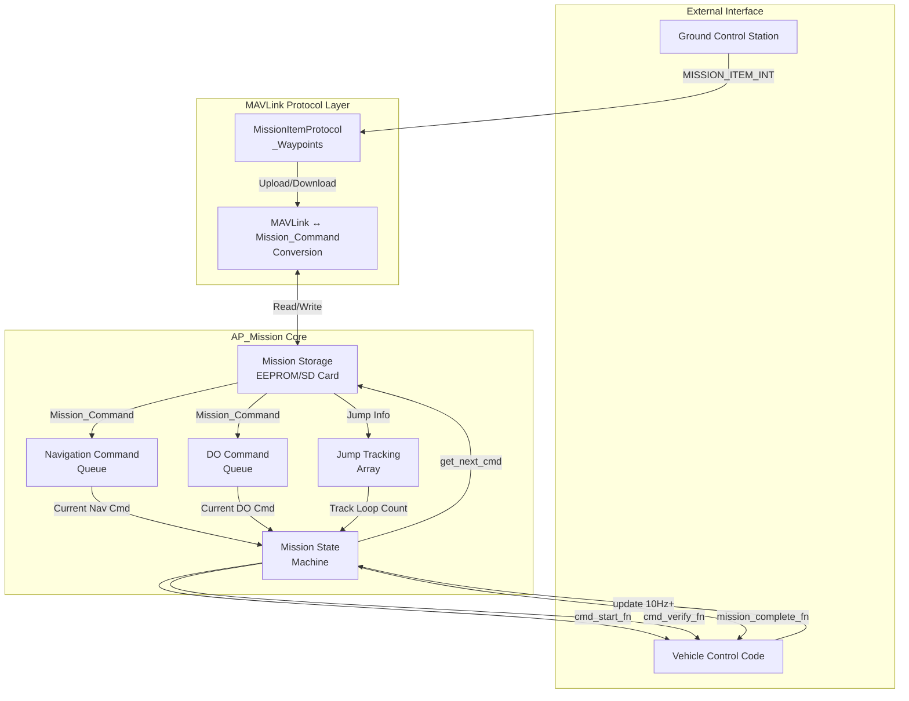
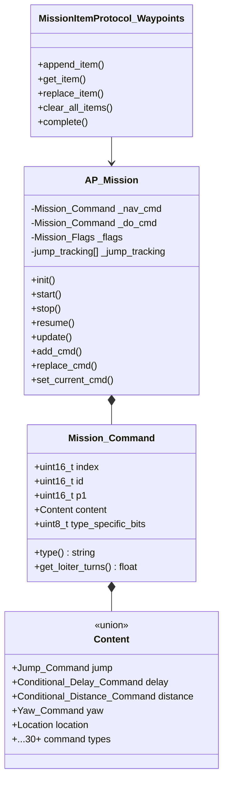
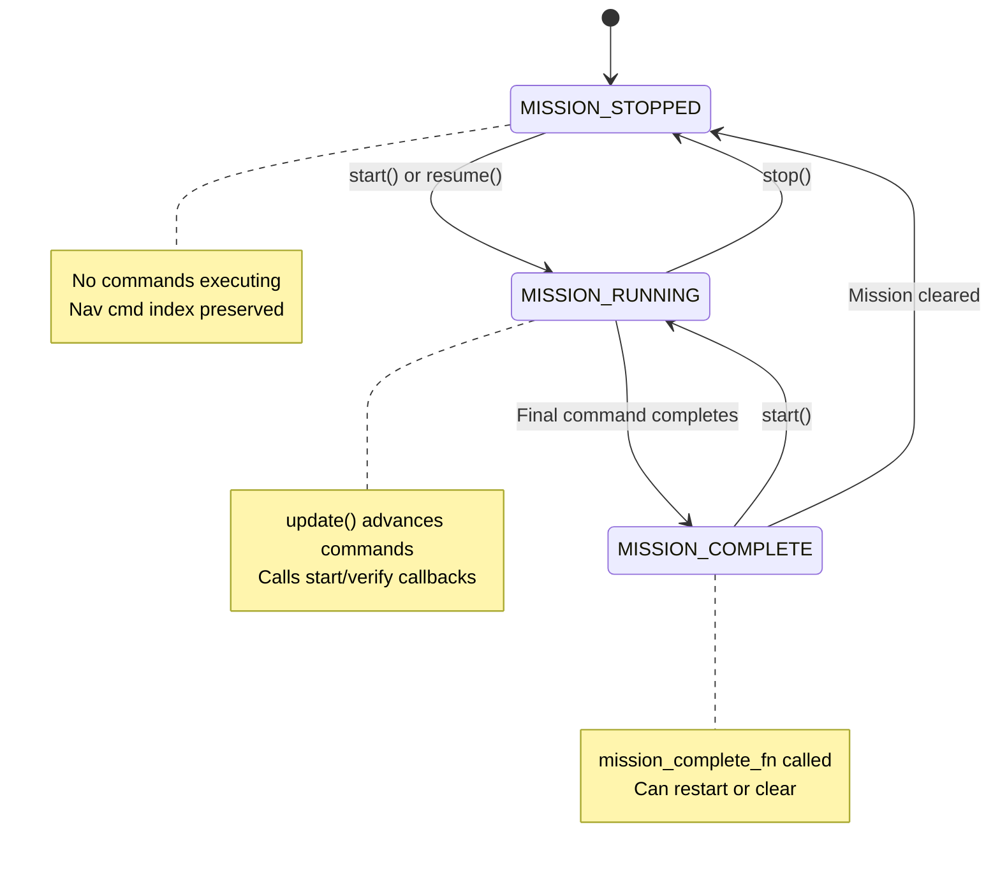
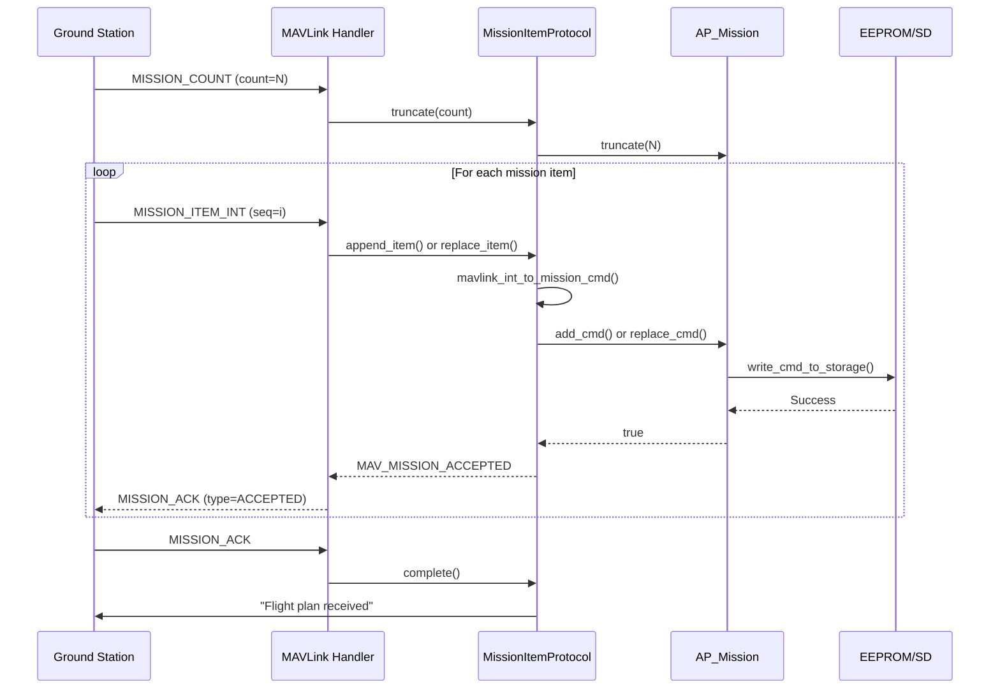
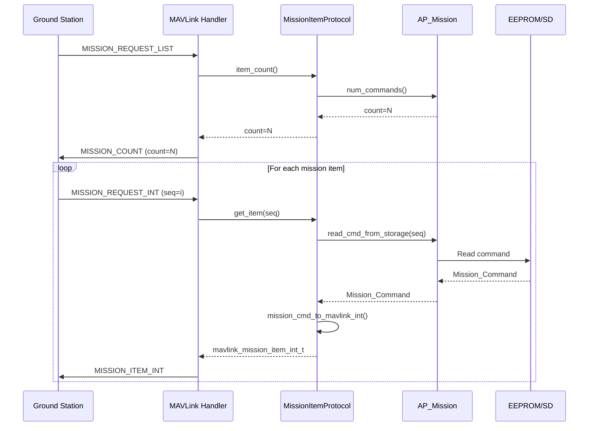
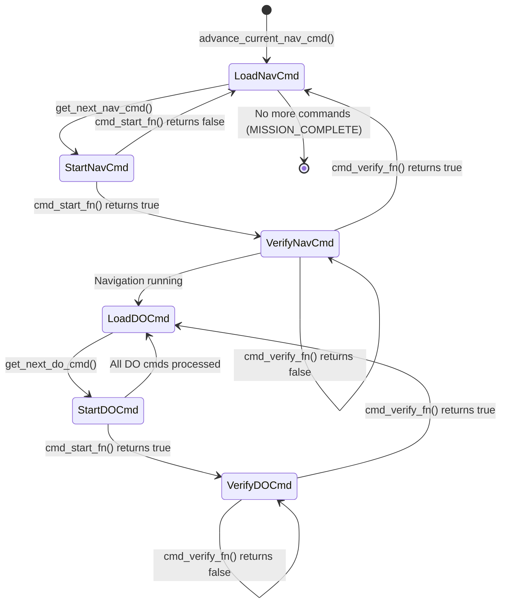
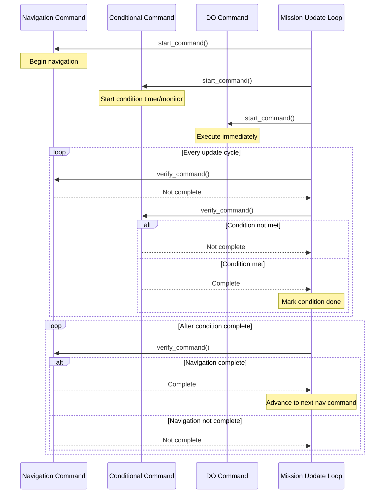
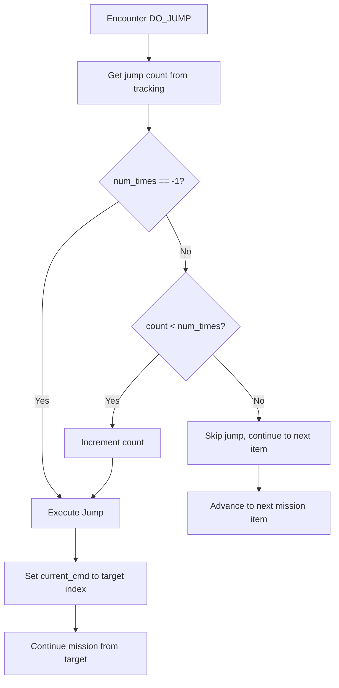
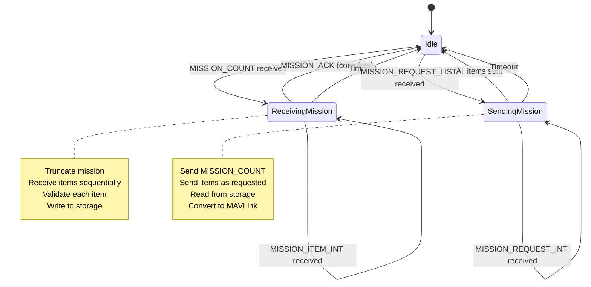

# AP_Mission Library


## Table of Contents
- [Overview](#overview)
- [Architecture](#architecture)
- [Mission Storage](#mission-storage)
- [Command Types](#command-types)
- [Mission Upload/Download Protocol](#mission-uploaddownload-protocol)
- [Command Execution Logic](#command-execution-logic)
- [Conditional Commands](#conditional-commands)
- [Jump Commands and Loop Tracking](#jump-commands-and-loop-tracking)
- [DO Commands](#do-commands)
- [MAVLink Protocol Integration](#mavlink-protocol-integration)
- [Configuration Parameters](#configuration-parameters)
- [API Reference](#api-reference)
- [Usage Examples](#usage-examples)
- [Testing](#testing)

## Overview

The AP_Mission library is a safety-critical component of the ArduPilot autopilot system responsible for managing autonomous mission execution. It provides comprehensive support for storing, retrieving, and executing complex mission sequences consisting of navigation, conditional, and action commands.

**Source Files**: `/libraries/AP_Mission/`
- `AP_Mission.h` - Main class definition and data structures
- `AP_Mission.cpp` - Core mission management logic
- `AP_Mission_Commands.cpp` - Command execution handlers

### Key Responsibilities

- **Mission Storage**: Persistent storage of mission commands in EEPROM or SD card
- **Command Management**: Adding, replacing, and retrieving mission commands
- **Execution Control**: Sequential execution of navigation, conditional, and DO commands
- **Jump Handling**: Support for loops and conditional branching with DO_JUMP and JUMP_TAG
- **MAVLink Integration**: Protocol conversion between MAVLink messages and internal command format
- **State Management**: Tracking current/previous commands and mission execution state

### Key Features

- Supports hundreds of MAVLink mission command types
- Persistent storage with automatic version management
- Jump command tracking with loop counting (up to 100 jumps on high-memory boards)
- Atomic command execution with start/verify pattern
- Landing sequence detection and management
- Mission resume capability after interruption
- Real-time mission upload/download via MAVLink
- Support for conditional execution based on delay, distance, or yaw

## Architecture

The AP_Mission library follows a command queue architecture with separate tracking for navigation and DO commands.

### System Architecture Diagram



### Class Structure



### Mission State Machine



### Command Execution Flow

The mission system uses a dual-queue approach:

1. **Navigation Command Queue** (`_nav_cmd`): Holds the current navigation command (waypoint, loiter, RTL, etc.). Only one navigation command is active at a time. Navigation commands define vehicle movement and position targets.

2. **DO Command Queue** (`_do_cmd`): Holds the current "do" or "conditional" command that executes in parallel with the navigation command. Multiple DO commands can execute sequentially while a single navigation command is active.

**Source**: `AP_Mission.cpp:310-385` - `update()` function

The `update()` function (called at 10Hz or higher) implements the core execution logic:
- Checks if navigation command is complete via `verify_command()`
- Advances to next navigation command with `advance_current_nav_cmd()`
- Processes all DO commands between navigation commands
- Handles jump commands and loop counting
- Triggers mission completion when no more commands remain

## Mission Storage

The AP_Mission library implements a robust persistent storage system supporting both EEPROM and SD card storage with automatic format versioning.

### Storage Architecture

**Source**: `AP_Mission.h:26-27`, `AP_Mission.cpp:55-89`

```
Storage Layout:
┌─────────────────────────────────────┐
│ Bytes 0-3: Version Header (0x65AE) │
├─────────────────────────────────────┤
│ Bytes 4-18: Command 0 (HOME)        │  15 bytes
├─────────────────────────────────────┤
│ Bytes 19-33: Command 1              │  15 bytes
├─────────────────────────────────────┤
│ Bytes 34-48: Command 2              │  15 bytes
├─────────────────────────────────────┤
│ ...                                 │
├─────────────────────────────────────┤
│ Last Command                        │  15 bytes
└─────────────────────────────────────┘

Constants:
- AP_MISSION_EEPROM_VERSION: 0x65AE (increment when format changes)
- AP_MISSION_EEPROM_COMMAND_SIZE: 15 bytes per command
- Maximum commands: (storage_size - 4) / 15
```

### Storage Backends

#### EEPROM Storage (Default)

Uses the `StorageManager` with `StorageMission` type for persistent storage in microcontroller EEPROM or emulated EEPROM.

**Initialization**: `AP_Mission.cpp:55`
```cpp
StorageAccess AP_Mission::_storage(StorageManager::StorageMission);
```

**Capacity Calculation**: `AP_Mission.cpp:82-84`
```cpp
if (_storage.size() >= AP_MISSION_EEPROM_COMMAND_SIZE+4) {
    _commands_max = (_storage.size()-4U) / AP_MISSION_EEPROM_COMMAND_SIZE;
}
```

#### SD Card Storage (Extended)

For boards with SD cards, missions can be extended beyond EEPROM capacity using file-based storage.

**Configuration**: `AP_Mission.cpp:66-78`
```cpp
#if AP_SDCARD_STORAGE_ENABLED
const auto size_kb = bc->get_sdcard_mission_kb();
if (size_kb > 0) {
    _failed_sdcard_storage = !_storage.attach_file(AP_MISSION_SDCARD_FILENAME, size_kb);
}
#endif
```

**File Location**:
- ChibiOS boards: `APM/mission.stg`
- Other platforms: `mission.stg`

**Source**: `AP_Mission.h:52-56`

### Storage Operations

#### Writing Commands

**Function**: `write_cmd_to_storage(uint16_t index, const Mission_Command& cmd)`

Writes a 15-byte packed command structure to storage at the calculated offset.

**Storage Format Conversion**: Commands are packed into a compact 15-byte format using the `PackedContent` union to optimize storage space. The `format_conversion()` function handles version-specific packing strategies.

**Source**: `AP_Mission.cpp:816` (write_cmd_to_storage implementation)

#### Reading Commands

**Function**: `read_cmd_from_storage(uint16_t index, Mission_Command& cmd)`

Reads and unpacks a command from storage, performing format conversion if necessary.

**Key Features**:
- Validates index bounds
- Unpacks compressed data structures
- Handles backward compatibility with older formats
- Returns false on read errors

**Source**: `AP_Mission.h:633-635`

#### Version Management

The storage version is checked on initialization to ensure compatibility:

**Source**: `AP_Mission.cpp:91-93`
```cpp
// check_eeprom_version - checks version of missions stored in eeprom
// command list will be cleared if they do not match
check_eeprom_version();
```

If the version doesn't match `AP_MISSION_EEPROM_VERSION`, the entire mission is cleared to prevent data corruption from format incompatibilities.

### Home Position (Command 0)

Command index 0 is reserved for the HOME position and has special handling:

**Source**: `AP_Mission.h:43`
```cpp
#define AP_MISSION_FIRST_REAL_COMMAND 1  // command #0 reserved to hold home position
```

**Writing Home**: `AP_Mission.h:637-639`
```cpp
/// write_home_to_storage - writes the special purpose cmd 0 (home) to storage
///     home is taken directly from ahrs
void write_home_to_storage();
```

The home position is automatically written from the AHRS system and cannot be overwritten via normal mission commands.

### Storage Capacity

Maximum mission capacity varies by platform:

- **Low memory boards**: ~15-50 commands (EEPROM only)
- **Medium memory boards**: ~100-200 commands (EEPROM only)
- **High memory boards with SD card**: ~500-5000+ commands (with extended storage)

**Source**: `AP_Mission.h:506-508`
```cpp
uint16_t num_commands_max() const {
    return _commands_max;
}

## Command Types

The AP_Mission library supports three categories of commands, each serving different purposes in mission execution.

### Command Categories

#### Navigation Commands

Navigation commands control vehicle movement and define waypoints. Only one navigation command is active at a time, and the vehicle must verify completion before advancing to the next navigation command.

**Identification**: `AP_Mission.h:557-558`
```cpp
/// is_nav_cmd - returns true if the command's id is a "navigation" command
static bool is_nav_cmd(const Mission_Command& cmd);
```

**Common Navigation Commands**:

| Command ID | Name | Description |
|------------|------|-------------|
| MAV_CMD_NAV_WAYPOINT | Waypoint | Navigate to 3D position |
| MAV_CMD_NAV_LOITER_UNLIM | Loiter Unlimited | Circle at location indefinitely |
| MAV_CMD_NAV_LOITER_TURNS | Loiter Turns | Circle specified number of times |
| MAV_CMD_NAV_LOITER_TIME | Loiter Time | Circle for specified duration |
| MAV_CMD_NAV_RETURN_TO_LAUNCH | RTL | Return to launch position |
| MAV_CMD_NAV_LAND | Land | Autonomous landing sequence |
| MAV_CMD_NAV_TAKEOFF | Takeoff | Autonomous takeoff |
| MAV_CMD_NAV_CONTINUE_AND_CHANGE_ALT | Continue and Change Alt | Proceed to next WP with alt change |
| MAV_CMD_NAV_LOITER_TO_ALT | Loiter to Alt | Loiter while climbing/descending |
| MAV_CMD_NAV_SPLINE_WAYPOINT | Spline Waypoint | Smooth spline path through point |
| MAV_CMD_NAV_VTOL_TAKEOFF | VTOL Takeoff | Vertical takeoff for VTOL aircraft |
| MAV_CMD_NAV_VTOL_LAND | VTOL Land | Vertical landing for VTOL aircraft |
| MAV_CMD_NAV_GUIDED_ENABLE | Guided Enable | Enable guided mode control |
| MAV_CMD_NAV_DELAY | Navigation Delay | Delay at current position |
| MAV_CMD_NAV_PAYLOAD_PLACE | Payload Place | Precision payload placement |
| MAV_CMD_NAV_SET_YAW_SPEED | Set Yaw Speed | Set heading and speed |
| MAV_CMD_NAV_ATTITUDE_TIME | Attitude Time | Hold attitude for duration |
| MAV_CMD_NAV_SCRIPT_TIME | Scripted Navigation | Lua script nav command |

#### DO Commands

DO commands are immediate-action commands that execute once and complete immediately. They run in parallel with navigation commands.

**Common DO Commands**:

| Command ID | Name | Description |
|------------|------|-------------|
| MAV_CMD_DO_CHANGE_SPEED | Change Speed | Modify vehicle speed |
| MAV_CMD_DO_SET_HOME | Set Home | Update home position |
| MAV_CMD_DO_SET_SERVO | Set Servo | Set servo PWM value |
| MAV_CMD_DO_SET_RELAY | Set Relay | Activate/deactivate relay |
| MAV_CMD_DO_REPEAT_SERVO | Repeat Servo | Cycle servo multiple times |
| MAV_CMD_DO_REPEAT_RELAY | Repeat Relay | Cycle relay multiple times |
| MAV_CMD_DO_SET_CAM_TRIGG_DIST | Camera Trigger Distance | Set distance-based camera trigger |
| MAV_CMD_DO_FENCE_ENABLE | Fence Enable | Enable/disable geofence |
| MAV_CMD_DO_PARACHUTE | Parachute | Deploy parachute |
| MAV_CMD_DO_MOTOR_TEST | Motor Test | Test individual motors |
| MAV_CMD_DO_INVERTED_FLIGHT | Inverted Flight | Enable/disable inverted flight |
| MAV_CMD_DO_GRIPPER | Gripper | Grab/release gripper |
| MAV_CMD_DO_AUTOTUNE_ENABLE | Autotune | Enable/disable autotune |
| MAV_CMD_DO_MOUNT_CONTROL | Mount Control | Control camera mount |
| MAV_CMD_DO_SET_ROI | Set ROI | Point camera at location |
| MAV_CMD_DO_DIGICAM_CONFIGURE | Camera Configure | Configure camera settings |
| MAV_CMD_DO_DIGICAM_CONTROL | Camera Control | Trigger camera action |
| MAV_CMD_DO_SET_RESUME_REPEAT_DIST | Set Resume Repeat Dist | Mission resume behavior |
| MAV_CMD_DO_SPRAYER | Sprayer | Control agricultural sprayer |
| MAV_CMD_DO_SEND_SCRIPT_MESSAGE | Script Message | Send message to Lua script |
| MAV_CMD_DO_AUX_FUNCTION | Aux Function | Trigger auxiliary function |
| MAV_CMD_DO_GIMBAL_MANAGER_PITCHYAW | Gimbal Manager | Control gimbal orientation |
| MAV_CMD_DO_WINCH | Winch | Control winch operation |
| MAV_CMD_DO_LAND_START | Land Start | Mark landing sequence start |
| MAV_CMD_DO_RETURN_PATH_START | Return Path Start | Mark return path start |
| MAV_CMD_DO_VTOL_TRANSITION | VTOL Transition | Transition fixed-wing/multicopter |
| MAV_CMD_DO_ENGINE_CONTROL | Engine Control | Start/stop combustion engine |

**Source**: `AP_Mission_Commands.cpp:19-260` - DO command handlers

#### Conditional Commands

Conditional commands define conditions that must be met before advancing past them. They execute in parallel with navigation commands.

**Common Conditional Commands**:

| Command ID | Name | Description |
|------------|------|-------------|
| MAV_CMD_CONDITION_DELAY | Condition Delay | Wait specified seconds |
| MAV_CMD_CONDITION_DISTANCE | Condition Distance | Wait until within distance of next WP |
| MAV_CMD_CONDITION_YAW | Condition Yaw | Wait until heading reached |
| MAV_CMD_CONDITION_GATE | Condition Gate | Wait for geofence condition |

**Source**: `AP_Mission.h:72-88` - Conditional command structures

### Mission_Command Structure

**Source**: `AP_Mission.h:409-438`

```cpp
struct Mission_Command {
    uint16_t index;             // Position in command list
    uint16_t id;                // MAVLink command ID
    uint16_t p1;                // General purpose parameter 1
    Content content;            // Union of all command types
    uint8_t type_specific_bits; // Additional storage bits
    
    const char *type() const;   // Human-readable type name
    bool operator ==(const Mission_Command &b) const;
    float get_loiter_turns(void) const;  // Special handling for loiter turns
};
```

### Content Union

The `Content` union provides type-specific storage for each command type:

**Source**: `AP_Mission.h:305-406`

```cpp
union Content {
    Jump_Command jump;                      // DO_JUMP
    Conditional_Delay_Command delay;        // CONDITION_DELAY
    Conditional_Distance_Command distance;  // CONDITION_DISTANCE
    Yaw_Command yaw;                        // CONDITION_YAW
    Change_Speed_Command speed;             // DO_CHANGE_SPEED
    Set_Relay_Command relay;                // DO_SET_RELAY
    Repeat_Relay_Command repeat_relay;      // DO_REPEAT_RELAY
    Set_Servo_Command servo;                // DO_SET_SERVO
    Repeat_Servo_Command repeat_servo;      // DO_REPEAT_SERVO
    Mount_Control mount_control;            // DO_MOUNT_CONTROL
    Digicam_Configure digicam_configure;    // DO_DIGICAM_CONFIGURE
    Digicam_Control digicam_control;        // DO_DIGICAM_CONTROL
    Cam_Trigg_Distance cam_trigg_dist;      // DO_SET_CAM_TRIGG_DIST
    Gripper_Command gripper;                // DO_GRIPPER
    AuxFunction auxfunction;                // DO_AUX_FUNCTION
    Guided_Limits_Command guided_limits;    // DO_GUIDED_LIMITS
    Altitude_Wait altitude_wait;            // High altitude balloon
    Do_VTOL_Transition do_vtol_transition;  // DO_VTOL_TRANSITION
    Do_Engine_Control do_engine_control;    // DO_ENGINE_CONTROL
    Navigation_Delay_Command nav_delay;     // NAV_DELAY
    Set_Yaw_Speed set_yaw_speed;            // NAV_SET_YAW_SPEED
    Winch_Command winch;                    // DO_WINCH
    scripting_Command scripting;            // DO_SEND_SCRIPT_MESSAGE
    nav_script_time_Command nav_script_time;// NAV_SCRIPT_TIME
    nav_attitude_time_Command nav_attitude_time; // NAV_ATTITUDE_TIME
    gimbal_manager_pitchyaw_Command gimbal_manager_pitchyaw; // DO_GIMBAL_MANAGER_PITCHYAW
    image_start_capture_Command image_start_capture; // IMAGE_START_CAPTURE
    set_camera_zoom_Command set_camera_zoom; // SET_CAMERA_ZOOM
    set_camera_focus_Command set_camera_focus; // SET_CAMERA_FOCUS
    set_camera_source_Command set_camera_source; // SET_CAMERA_SOURCE
    video_start_capture_Command video_start_capture; // VIDEO_START_CAPTURE
    video_stop_capture_Command video_stop_capture; // VIDEO_STOP_CAPTURE
    Location location;                      // Waypoint position (for NAV commands)
};
```

This union-based design allows efficient storage of diverse command types within the fixed 15-byte storage format.

## Mission Upload/Download Protocol

The AP_Mission library integrates with the MAVLink mission protocol for real-time mission transfer between ground control stations and the vehicle.

### Protocol Handler

**Source**: `MissionItemProtocol_Waypoints.cpp:24-134`

The `MissionItemProtocol_Waypoints` class implements the MAVLink waypoint protocol handler:

```cpp
class MissionItemProtocol_Waypoints {
    MAV_MISSION_RESULT append_item(const mavlink_mission_item_int_t &);
    MAV_MISSION_RESULT get_item(uint16_t seq, mavlink_mission_item_int_t &);
    MAV_MISSION_RESULT replace_item(const mavlink_mission_item_int_t &);
    bool clear_all_items();
    MAV_MISSION_RESULT complete(const GCS_MAVLINK &);
    void truncate(const mavlink_mission_count_t &);
};
```

### Upload Sequence



**Source**: `MissionItemProtocol_Waypoints.cpp:31-51` - append_item()

### Download Sequence



**Source**: `MissionItemProtocol_Waypoints.cpp:67-92` - get_item()

### Format Conversion Functions

#### MAVLink to Mission Command

**Function**: `mavlink_int_to_mission_cmd()`

**Source**: `AP_Mission.h:646-648`

```cpp
/// mavlink_int_to_mission_cmd - converts mavlink message to Mission_Command
/// returns MAV_MISSION_ACCEPTED on success, MAV_MISSION_RESULT error code on failure
static MAV_MISSION_RESULT mavlink_int_to_mission_cmd(
    const mavlink_mission_item_int_t& packet, 
    AP_Mission::Mission_Command& cmd
);
```

**Conversion Process**:
1. Validates command ID is supported
2. Checks parameter ranges using `sanity_check_params()`
3. Extracts command-specific parameters from `param1-7` and `x/y/z` fields
4. Populates appropriate `Content` union member based on command ID
5. Handles special cases for location-based commands
6. Returns `MAV_MISSION_ACCEPTED` or specific error code

**Source**: Implementation in `AP_Mission.cpp` (mavlink conversion section)

#### Mission Command to MAVLink

**Function**: `mission_cmd_to_mavlink_int()`

**Source**: `AP_Mission.h:650-652`

```cpp
/// mission_cmd_to_mavlink_int - converts Mission_Command to mavlink message
/// returns true on success, false on failure
static bool mission_cmd_to_mavlink_int(
    const AP_Mission::Mission_Command& cmd, 
    mavlink_mission_item_int_t& packet
);
```

**Conversion Process**:
1. Sets `packet.command` to `cmd.id`
2. Sets `packet.seq` to `cmd.index`
3. Extracts parameters from `Content` union to `param1-7`
4. For location commands, populates `x/y/z` with lat/lon/alt
5. Sets `frame`, `current`, and `autocontinue` fields appropriately
6. Handles special packing for commands with extended parameters

### Protocol Error Handling

**Result Codes**: 

| Code | Name | Meaning |
|------|------|---------|
| MAV_MISSION_ACCEPTED | Accepted | Command processed successfully |
| MAV_MISSION_ERROR | Generic Error | Unspecified error |
| MAV_MISSION_UNSUPPORTED | Unsupported | Command type not supported |
| MAV_MISSION_NO_SPACE | No Space | Storage full, cannot add command |
| MAV_MISSION_INVALID | Invalid | Parameter out of range |
| MAV_MISSION_INVALID_PARAM1 | Invalid Param1 | Parameter 1 invalid |
| MAV_MISSION_INVALID_PARAM2 | Invalid Param2 | Parameter 2 invalid |
| MAV_MISSION_INVALID_SEQUENCE | Invalid Sequence | Sequence number out of order |
| MAV_MISSION_DENIED | Denied | Mission change denied (armed) |

**Sanity Checking**: `AP_Mission.cpp:886-888`

```cpp
/// sanity checks that the masked fields are not NaN's or infinite
static MAV_MISSION_RESULT sanity_check_params(const mavlink_mission_item_int_t& packet);
```

### Mission Item INT Format

The `MISSION_ITEM_INT` message uses integer coordinates (1e7 scaling) for improved precision:

```
MISSION_ITEM_INT {
    uint16_t seq;           // Sequence number
    uint8_t frame;          // Coordinate frame (MAV_FRAME_*)
    uint16_t command;       // MAVLink command ID
    uint8_t current;        // 1 if current command, 0 otherwise
    uint8_t autocontinue;   // Autocontinue to next command
    float param1;           // Command-specific parameter 1
    float param2;           // Command-specific parameter 2
    float param3;           // Command-specific parameter 3
    float param4;           // Command-specific parameter 4
    int32_t x;              // Latitude * 1e7 or local X
    int32_t y;              // Longitude * 1e7 or local Y
    float z;                // Altitude or local Z
    uint8_t mission_type;   // Mission type (0=mission, 1=fence, 2=rally)
}
```

**Source**: MAVLink common message set

### Upload Timeout Handling

**Source**: `MissionItemProtocol_Waypoints.cpp:123-126`

```cpp
void MissionItemProtocol_Waypoints::timeout()
{
    link->send_text(MAV_SEVERITY_WARNING, "Mission upload timeout");
}
```

If the ground station fails to complete upload within the timeout period (default 30 seconds), the partially uploaded mission is discarded.

## Command Execution Logic

The mission execution system uses a callback-based architecture that separates mission management from vehicle-specific control logic.

### Callback Architecture

**Source**: `AP_Mission.h:441-449`

```cpp
// Function pointer typedefs
FUNCTOR_TYPEDEF(mission_cmd_fn_t, bool, const Mission_Command&);
FUNCTOR_TYPEDEF(mission_complete_fn_t, void);

// Constructor
AP_Mission(mission_cmd_fn_t cmd_start_fn, 
           mission_cmd_fn_t cmd_verify_fn, 
           mission_complete_fn_t mission_complete_fn)
```

The vehicle code (ArduCopter, ArduPlane, etc.) provides three callback functions:

1. **cmd_start_fn**: Called when a new command begins execution
2. **cmd_verify_fn**: Called repeatedly to check if command is complete
3. **mission_complete_fn**: Called when entire mission completes

### Execution State Machine



### Main Update Loop

**Source**: `AP_Mission.cpp:308-385`

The `update()` function is the core execution engine, called at 10Hz or higher:

```cpp
void AP_Mission::update()
{
    // Exit if not running
    if (_flags.state != MISSION_RUNNING || _cmd_total == 0) {
        return;
    }
    
    // Update exit position for resume functionality
    update_exit_position();
    
    // Save waypoint for watchdog restore
    hal.util->persistent_data.waypoint_num = _nav_cmd.index;
    
    // Process navigation command
    if (!_flags.nav_cmd_loaded || _nav_cmd.index == AP_MISSION_CMD_INDEX_NONE) {
        // Need to load next nav command
        if (!advance_current_nav_cmd()) {
            complete();  // Mission finished
            return;
        }
    } else {
        // Verify current nav command
        if (verify_command(_nav_cmd)) {
            _flags.nav_cmd_loaded = false;
            // Advance to next immediately
            if (!advance_current_nav_cmd()) {
                complete();
                return;
            }
        }
    }
    
    // Process DO command
    if (!_flags.do_cmd_loaded || _do_cmd.index == AP_MISSION_CMD_INDEX_NONE) {
        if (!_flags.do_cmd_all_done) {
            advance_current_do_cmd();
        }
    } else {
        if (verify_command(_do_cmd)) {
            _flags.do_cmd_loaded = false;
        }
    }
}
```

### Command Start/Verify Pattern

#### Starting Commands

**Source**: `AP_Mission.cpp:821-823`

```cpp
bool AP_Mission::start_command(const Mission_Command& cmd)
{
    return _cmd_start_fn(cmd);
}
```

The start function is responsible for:
- Initializing command-specific state
- Setting up target positions/attitudes
- Configuring hardware (servos, relays, camera, etc.)
- **Returns true** if command started successfully
- **Returns false** if command cannot be started (triggers skip to next command)

#### Verifying Commands

**Source**: `AP_Mission.cpp:817-819`

```cpp
bool AP_Mission::verify_command(const Mission_Command& cmd)
{
    return _cmd_verify_fn(cmd);
}
```

The verify function is responsible for:
- Checking if target reached (navigation commands)
- Checking if time/distance conditions met (conditional commands)
- Monitoring command completion status
- **Returns true** when command is complete
- **Returns false** while command is still executing

### Advancing Commands

#### Advancing Navigation Commands

**Source**: `AP_Mission.cpp:823-829`

```cpp
/// advance_current_nav_cmd - moves current nav command forward
///     starting_index used to set the index from which searching begins
///     do command will also be loaded
///     accounts for do-jump commands
///     returns true if command is advanced, false if failed (mission complete)
bool advance_current_nav_cmd(uint16_t starting_index = 0);
```

**Process**:
1. Store previous nav command info for reference
2. Search for next navigation command via `get_next_cmd()`
3. Handle DO_JUMP commands and update loop counters
4. Load all DO commands between current and next nav command
5. Call `start_command()` for new navigation command
6. Return false if no more navigation commands (mission complete)

**Source**: Implementation in `AP_Mission.cpp:advance_current_nav_cmd()`

#### Advancing DO Commands

**Source**: `AP_Mission.cpp:831-834`

```cpp
/// advance_current_do_cmd - moves current do command forward
///     accounts for do-jump commands
///     returns true if successfully advanced (can it ever be unsuccessful?)
void advance_current_do_cmd();
```

**Process**:
1. Search for next DO command via `get_next_do_cmd()`
2. Stop searching when hitting next navigation command
3. Call `start_command()` for new DO command
4. Set `_flags.do_cmd_all_done` when no more DO commands before next nav command

### Command Retrieval with Jump Handling

**Source**: `AP_Mission.cpp:836-840`

```cpp
/// get_next_cmd - gets next command found at or after start_index
///     accounts for do_jump commands
///     increment_jump_num_times_if_found should be true if advancing active nav command
bool get_next_cmd(uint16_t start_index, 
                  Mission_Command& cmd, 
                  bool increment_jump_num_times_if_found,
                  bool send_gcs_msg = true);
```

This function handles the complex logic of:
- Reading commands from storage
- Detecting DO_JUMP commands
- Checking loop counters
- Incrementing jump counts when appropriate
- Following jump targets
- Preventing infinite loops

### Mission Completion

**Source**: `AP_Mission.cpp:817-819`

```cpp
/// complete - mission is marked complete and clean-up performed
void complete();
```

When the mission completes:
1. Sets `_flags.state = MISSION_COMPLETE`
2. Calls `_mission_complete_fn()` callback to notify vehicle
3. Clears current command indices
4. Logs mission completion event

Vehicle code typically responds by:
- Switching to a safe flight mode (Loiter, RTL, etc.)
- Disarming (if on ground)
- Sending GCS notification

### Mission Control Functions

#### Start

**Source**: `AP_Mission.cpp:107-120`

```cpp
void AP_Mission::start()
{
    _flags.state = MISSION_RUNNING;
    reset();  // Reset to first command, clear jump tracking
    
    if (!advance_current_nav_cmd()) {
        complete();  // Empty mission
    }
}
```

Starts mission from the beginning, resetting all state.

#### Stop

**Source**: `AP_Mission.cpp:122-126`

```cpp
void AP_Mission::stop()
{
    _flags.state = MISSION_STOPPED;
}
```

Pauses mission execution. Current command index is preserved for resume.

#### Resume

**Source**: `AP_Mission.cpp:128-180`

```cpp
void AP_Mission::resume()
{
    // If complete, restart from beginning
    if (_flags.state == MISSION_COMPLETE) {
        start();
        return;
    }
    
    // If stopped, resume from current index
    if (_flags.state == MISSION_STOPPED) {
        _flags.state = MISSION_RUNNING;
        
        // Validate current command still exists
        if (!read_cmd_from_storage(_nav_cmd.index, _nav_cmd)) {
            start();  // Command deleted, restart
            return;
        }
        
        // Re-start current command
        start_command(_nav_cmd);
    }
}
```

Resumes mission from where it was stopped, re-initializing the current command.

#### Set Current Command

**Source**: `AP_Mission.cpp:626-695`

```cpp
/// set_current_cmd - jumps to command specified by index
bool set_current_cmd(uint16_t index);
```

Allows jumping to arbitrary mission command. Used for:
- Jump commands (DO_JUMP, JUMP_TAG)
- Landing sequence changes (DO_LAND_START)
- Mission restart/reset
- External mission modifications

**Key Features**:
- Validates index is within mission bounds
- Updates landing sequence and return path flags
- Resets jump tracking if jumping to start
- Can be called while mission is running or stopped

## Conditional Commands

Conditional commands provide time-based, distance-based, and heading-based synchronization within mission execution. They execute in parallel with navigation commands and must complete before the next navigation command can be verified as complete.

### Conditional Command Types

#### CONDITION_DELAY

Waits for a specified time period before allowing navigation command completion.

**Structure**: `AP_Mission.h:72-75`

```cpp
struct PACKED Conditional_Delay_Command {
    float seconds;  // Period of delay in seconds
};
```

**MAVLink Parameters**:
- `param1`: Delay time in seconds

**Usage Example**:
```
1. NAV_WAYPOINT (waypoint 1)
2. CONDITION_DELAY (15.0 seconds)
3. DO_SET_SERVO (trigger camera)
4. NAV_WAYPOINT (waypoint 2)
```

The vehicle will:
1. Navigate to waypoint 1
2. Start 15-second delay
3. Immediately execute DO_SET_SERVO
4. Wait for 15 seconds to elapse
5. Only then consider waypoint 1 complete and proceed to waypoint 2

**Implementation Notes**:
- Timer starts when condition command is loaded
- Navigation command remains active during delay
- Vehicle maintains position (for multicopters) or continues current behavior
- Delay timer continues even if mission is paused and resumed

#### CONDITION_DISTANCE

Waits until the vehicle is within a specified distance from the next waypoint.

**Structure**: `AP_Mission.h:77-80`

```cpp
struct PACKED Conditional_Distance_Command {
    float meters;  // Distance from next waypoint in meters
};
```

**MAVLink Parameters**:
- `param1`: Distance in meters

**Usage Example**:
```
1. NAV_WAYPOINT (waypoint 1)
2. CONDITION_DISTANCE (50.0 meters)
3. DO_CHANGE_SPEED (slow down)
4. NAV_WAYPOINT (waypoint 2)
```

The vehicle will:
1. Navigate toward waypoint 1
2. Monitor distance to waypoint 2
3. When within 50 meters of waypoint 2, execute DO_CHANGE_SPEED
4. Complete waypoint 1 and proceed to waypoint 2 at reduced speed

**Implementation Notes**:
- Distance is calculated in 3D space
- Useful for preparing actions before reaching a waypoint
- Distance is to the *next* waypoint, not current waypoint
- Particularly useful for approach preparation (landing gear, flaps, etc.)

#### CONDITION_YAW

Waits until the vehicle reaches a specified heading.

**Structure**: `AP_Mission.h:82-88`

```cpp
struct PACKED Yaw_Command {
    float angle_deg;        // Target angle in degrees (0=north, 90=east)
    float turn_rate_dps;    // Turn rate in degrees/second (0=use default)
    int8_t direction;       // -1 = counterclockwise, +1 = clockwise
    uint8_t relative_angle; // 0 = absolute angle, 1 = relative to current heading
};
```

**MAVLink Parameters**:
- `param1`: Target heading in degrees (0-360) or relative angle
- `param2`: Turn rate in degrees/second (0 = use default rate)
- `param3`: Direction: -1=CCW, 0=shortest, 1=CW
- `param4`: 0=absolute angle, 1=relative to current heading

**Usage Examples**:

**Absolute Heading**:
```
1. NAV_WAYPOINT (waypoint 1)
2. CONDITION_YAW (angle=90, rate=10, dir=1, relative=0)
3. DO_SET_SERVO (camera servo)
4. NAV_WAYPOINT (waypoint 2)
```
Vehicle rotates to face due east (90°) at 10°/s clockwise.

**Relative Heading**:
```
1. NAV_WAYPOINT (waypoint 1)
2. CONDITION_YAW (angle=45, rate=0, dir=0, relative=1)
3. NAV_WAYPOINT (waypoint 2)
```
Vehicle rotates 45° from current heading using shortest path at default rate.

**Implementation Notes**:
- Heading reference frame depends on EKF source (true north vs magnetic north)
- For multicopters: vehicle can yaw while holding position
- For fixed-wing: requires loiter or flight path compatible with yaw change
- Turn rate of 0 uses vehicle-specific default rate
- Direction parameter allows control over which way to rotate

### Conditional Execution Flow



### Conditional Command Interaction Rules

**Rule 1**: Conditional commands execute between navigation commands
- Placed after a navigation command
- Must complete before that navigation command is considered done
- Multiple conditional commands can be chained

**Rule 2**: DO commands execute immediately regardless of conditionals
```
NAV_WAYPOINT
CONDITION_DELAY (10 seconds)
DO_SET_SERVO (executes immediately)
DO_SET_RELAY (executes immediately)
NAV_WAYPOINT (won't proceed until 10 seconds pass)
```

**Rule 3**: Only one conditional command active per navigation command
- If multiple conditional commands are present, they execute sequentially
- Each must complete before the next begins

**Rule 4**: Conditional commands bind to the preceding navigation command
```
NAV_WAYPOINT (WP1)        ← Command A
CONDITION_DELAY (5)       ← Applies to Command A
NAV_WAYPOINT (WP2)        ← Command B (not affected by delay)
```

### Vehicle-Specific Behavior

#### Multicopter
- **CONDITION_DELAY**: Holds position at waypoint during delay
- **CONDITION_DISTANCE**: Continues toward next waypoint while monitoring
- **CONDITION_YAW**: Rotates in place at current position

#### Fixed-Wing
- **CONDITION_DELAY**: Loiters at waypoint during delay
- **CONDITION_DISTANCE**: Continues on flight path while monitoring
- **CONDITION_YAW**: Adjusts heading during straight flight or loiter

#### Rover
- **CONDITION_DELAY**: Stops at waypoint during delay
- **CONDITION_DISTANCE**: Continues toward next waypoint while monitoring
- **CONDITION_YAW**: Rotates in place at current position

### Debugging Conditional Commands

**GCS Feedback**:
- Mission item progress shown in GCS
- Current mission item number indicates active navigation command
- Conditional command completion not explicitly reported (navigation command remains current)

**Logging**:
- Mission events logged to dataflash/SD card
- Command start/complete events include timestamps
- Useful for verifying conditional timing

**Common Issues**:
1. **Condition never completes**: Check parameter units (seconds vs milliseconds, meters vs centimeters)
2. **Condition completes too early**: Verify distance is to correct waypoint
3. **Yaw condition ignored**: Check if vehicle type supports yaw control in current flight mode

## Jump Commands and Loop Tracking

Jump commands enable mission loops, allowing repeated execution of mission segments. The AP_Mission library implements sophisticated jump tracking to handle complex looping scenarios safely.

### Jump Command Types

#### DO_JUMP - Index-Based Jumps

**Structure**: `AP_Mission.h:66-70`

```cpp
struct PACKED Jump_Command {
    uint16_t target;        // Target command index to jump to
    int16_t num_times;      // Number of times to repeat (-1 = repeat forever)
};
```

**MAVLink Parameters**:
- `param1`: Target mission item index (1-based)
- `param2`: Repeat count (-1 = infinite, 0 = no jump, >0 = repeat N times)

**Usage Example**:
```
Mission items:
1. NAV_WAYPOINT (start)
2. NAV_WAYPOINT (survey point 1)
3. NAV_WAYPOINT (survey point 2)
4. NAV_WAYPOINT (survey point 3)
5. DO_JUMP (target=2, count=3)  ← Jump back to item 2
6. NAV_WAYPOINT (end)
```

Execution sequence: 1 → 2 → 3 → 4 → 5(jump) → 2 → 3 → 4 → 5(jump) → 2 → 3 → 4 → 5(jump) → 2 → 3 → 4 → 5(done) → 6

The loop executes **4 times total** (initial pass + 3 repeats).

#### JUMP_TAG - Tag-Based Jumps

**Tag Structure**: Tags provide named jump targets instead of using absolute indices.

**DO_JUMP_TAG Command**:
- `param1`: Tag number (1-65535)
- Searches for first JUMP_TAG with matching tag number

**JUMP_TAG Command**:
- `param1`: Tag number to mark this location
- Acts as a navigation command (vehicle passes through it)

**Source**: `AP_Mission.h:757-770`

```cpp
// Get most recent tag and its age (NAV commands since tag)
bool get_last_jump_tag(uint16_t &tag, uint16_t &age) const;

// Jump to first JUMP_TAG with specified tag number
bool jump_to_tag(const uint16_t tag);

// Find index of first JUMP_TAG with specified tag  
uint16_t get_index_of_jump_tag(const uint16_t tag) const;
```

**Usage Example**:
```
1. NAV_TAKEOFF
2. JUMP_TAG (tag=100)           ← Mark "survey_start"
3. NAV_WAYPOINT (survey 1)
4. NAV_WAYPOINT (survey 2)
5. NAV_WAYPOINT (survey 3)
6. DO_JUMP_TAG (tag=100, count=2)  ← Jump to tag 100
7. NAV_LAND
```

**Advantages over DO_JUMP**:
- Mission items can be inserted/deleted without breaking jumps
- More readable mission plans
- Easier to maintain complex missions
- Tags survive mission edits better than absolute indices

### Jump Tracking System

**Source**: `AP_Mission.h:29-35`, `AP_Mission.cpp:851-859`

```cpp
#define AP_MISSION_MAX_NUM_DO_JUMP_COMMANDS 100  // High-memory boards
#define AP_MISSION_MAX_NUM_DO_JUMP_COMMANDS 15   // Low-memory boards
#define AP_MISSION_JUMP_REPEAT_FOREVER -1
#define AP_MISSION_JUMP_TIMES_MAX 32767
```

**Jump Tracking Array**: `AP_Mission.h:913-917`

```cpp
struct jump_tracking_struct {
    uint16_t index;         // Index of DO_JUMP command
    int16_t num_times_run;  // Number of times this jump has executed
} _jump_tracking[AP_MISSION_MAX_NUM_DO_JUMP_COMMANDS];
```

### Jump Tracking Implementation

#### Initialization

**Source**: `AP_Mission.cpp:851-859`

```cpp
void AP_Mission::init_jump_tracking()
{
    for (uint8_t i=0; i<AP_MISSION_MAX_NUM_DO_JUMP_COMMANDS; i++) {
        _jump_tracking[i].index = AP_MISSION_CMD_INDEX_NONE;
        _jump_tracking[i].num_times_run = 0;
    }
}
```

Called when mission starts or resets.

#### Getting Jump Count

**Source**: `AP_Mission.cpp:854-856`

```cpp
/// get_jump_times_run - returns number of times jump has been executed
/// returns signed value to match num_times field (-1 for infinite)
int16_t get_jump_times_run(const Mission_Command& cmd);
```

Searches tracking array for matching command index and returns execution count.

#### Incrementing Jump Count

**Source**: `AP_Mission.cpp:858-859`

```cpp
/// increment_jump_times_run - increments recorded number of times jump executed
void increment_jump_times_run(Mission_Command& cmd, bool send_gcs_msg = true);
```

**Process**:
1. Search for existing tracking entry
2. If found, increment counter
3. If not found, allocate new tracking slot
4. If tracking array full, set count to `JUMP_TIMES_MAX` (prevents infinite loops)
5. Optionally send GCS message about jump execution

### Jump Execution Logic



**Source**: Implementation in `AP_Mission.cpp:get_next_cmd()`

### Jump Safety Mechanisms

#### 1. Maximum Jump Limit

If more than `AP_MISSION_MAX_NUM_DO_JUMP_COMMANDS` unique jumps are encountered, the tracking system sets the count to `JUMP_TIMES_MAX` to prevent infinite loops.

#### 2. Forward Jumps Allowed

Jumps can target commands ahead in the mission (skip forward):
```
1. NAV_WAYPOINT (A)
2. DO_JUMP (target=4, count=0)  ← Skip to item 4
3. NAV_WAYPOINT (B) ← Skipped
4. NAV_WAYPOINT (C)
```

#### 3. Jump to Index 0 Invalid

**Source**: `AP_Mission.h:39`
```cpp
#define AP_MISSION_CMD_ID_NONE 0  // Command id of zero means invalid
```

Jumps to index 0 (HOME) are rejected as invalid.

#### 4. Jump Target Validation

**Source**: `MissionItemProtocol_Waypoints.cpp:41-45`

```cpp
if (cmd.id == MAV_CMD_DO_JUMP) {
    if ((cmd.content.jump.target >= item_count() && 
         cmd.content.jump.target > request_last) || 
         cmd.content.jump.target == 0) {
        return MAV_MISSION_ERROR;
    }
}
```

Jump targets beyond mission bounds are rejected during upload.

### Nested Jumps

Nested jumps are supported with independent tracking:

```
1. NAV_WAYPOINT (Outer start)
2. NAV_WAYPOINT (Inner start)
3. NAV_WAYPOINT (Inner point)
4. DO_JUMP (target=2, count=2)  ← Inner loop
5. NAV_WAYPOINT (Outer point)
6. DO_JUMP (target=1, count=1)  ← Outer loop
7. NAV_WAYPOINT (End)
```

Execution: 1 → 2 → 3 → 4(jump) → 2 → 3 → 4(jump) → 2 → 3 → 4(done) → 5 → 6(jump) → 1 → ... (outer loop)

Each jump maintains its own counter independently.

### Jump Tag Tracking

**Source**: `AP_Mission.h:791-794`

```cpp
struct {
    uint16_t age;   // 0 = never seen tag; >0 = NAV commands since tag
    uint16_t tag;   // Most recent tag number
} _jump_tag;
```

**Age Tracking**:
- When a JUMP_TAG is passed, `age` is set to 1
- Each subsequent NAV command increments `age`
- Allows scripts/DO commands to know "how long ago was the last tag"
- Useful for scripted behaviors that depend on mission progress

**Use Case Example**:
A Lua script can query the last tag and age to determine mission phase:
```lua
local tag, age = mission:get_last_jump_tag()
if tag == 100 and age < 5 then
    -- We're in the survey phase, within 5 waypoints of the survey start tag
    enable_camera_trigger()
end
```

### Jump Command Best Practices

**1. Avoid Jumps Backward Over DO_LAND_START**:
Jumping backward over a landing sequence marker can confuse landing logic.

**2. Limit Jump Nesting Depth**:
While technically unlimited, deeply nested jumps are hard to debug. Keep nesting to 2-3 levels.

**3. Use JUMP_TAG for Maintainable Missions**:
Tags are resistant to mission edits:
```
// Good: Using tags
JUMP_TAG (tag=100)
[...10 mission items...]
DO_JUMP_TAG (tag=100, count=3)

// Risky: Using indices
[Item 15...]
DO_JUMP (target=5, count=3)  ← Breaks if items inserted before index 5
```

**4. Test Infinite Loops in Simulation**:
Use `num_times=-1` carefully. Ensure mission has external stop condition (failsafe, mode change, etc.).

**5. Consider Jump Impact on Mission Resume**:
If mission is stopped/resumed mid-loop, jump counters persist. Mission will resume from current position with existing loop counts.

### Jump Behavior with Mission Options

**MIS_OPTIONS bit 3 (DontZeroCounter)**: `AP_Mission.h:739`

When set, jump counters are NOT reset when loop completes:
```
Set DontZeroCounter=0 (default):
  Loop completes → counter reset to 0 → re-entering loop will execute again

Set DontZeroCounter=1:
  Loop completes → counter stays at limit → re-entering loop will skip jump
```

Useful for missions that may be re-entered multiple times (e.g., search patterns) where you want loops to execute only once per overall mission run.

## DO Commands

DO commands are immediate-action commands that execute once and complete immediately or very quickly. They control vehicle subsystems and peripherals during mission execution.

### DO Command Architecture

DO commands are processed by the mission library's command handlers and then dispatched to the appropriate vehicle subsystem.

**Source**: `AP_Mission_Commands.cpp:19-260`

### Hardware Control Commands

#### DO_SET_SERVO

Controls a servo channel output.

**Structure**: `AP_Mission.h:110-114`
```cpp
struct PACKED Set_Servo_Command {
    uint8_t channel;    // Servo channel (1-16)
    uint16_t pwm;       // PWM value (typically 1000-2000)
};
```

**Handler**: `AP_Mission_Commands.cpp:75-76`
```cpp
case MAV_CMD_DO_SET_SERVO:
    return sre->do_set_servo(cmd.content.servo.channel, cmd.content.servo.pwm);
```

**Usage**: Position landing gear, deploy probes, control doors, etc.

#### DO_REPEAT_SERVO

Cycles a servo between two positions repeatedly.

**Structure**: `AP_Mission.h:116-122`
```cpp
struct PACKED Repeat_Servo_Command {
    uint8_t channel;        // Servo channel
    uint16_t pwm;           // Target PWM value
    int16_t repeat_count;   // Number of cycles
    float cycle_time;       // Time between peaks (seconds)
};
```

**Handler**: `AP_Mission_Commands.cpp:83-87`

**Usage**: Dispense items, signal beacon, mechanical operations.

#### DO_SET_RELAY

Controls a relay (on/off digital output).

**Structure**: `AP_Mission.h:98-101`
```cpp
struct PACKED Set_Relay_Command {
    uint8_t num;      // Relay number (1-4)
    uint8_t state;    // 0=off, 1=on
};
```

**Handler**: `AP_Mission_Commands.cpp:79-80`

**Usage**: Control lights, power switches, triggers.

#### DO_REPEAT_RELAY

Cycles a relay on/off repeatedly.

**Structure**: `AP_Mission.h:103-108`
```cpp
struct PACKED Repeat_Relay_Command {
    uint8_t num;            // Relay number
    int16_t repeat_count;   // Number of cycles
    float cycle_time;       // Cycle period (seconds)
};
```

**Handler**: `AP_Mission_Commands.cpp:90-93`

**Usage**: Strobe light, pulsed trigger, attention signal.

### Camera Control Commands

#### DO_DIGICAM_CONFIGURE

Configures camera settings.

**Structure**: `AP_Mission.h:132-140`
```cpp
struct PACKED Digicam_Configure {
    uint8_t shooting_mode;  // 1=ProgramAuto, 2=AV, 3=TV, 4=Manual, 5=IntelligentAuto, 6=SuperiorAuto
    uint16_t shutter_speed; // Divisor for 1 second
    uint8_t aperture;       // F-stop * 10
    uint16_t ISO;           // ISO value (80, 100, 200, etc.)
    uint8_t exposure_type;
    uint8_t cmd_id;
    float engine_cutoff_time; // Seconds to cut engine before trigger
};
```

**Handler**: `AP_Mission_Commands.cpp:115-124`

**Usage**: Aerial photography with precise camera control.

#### DO_DIGICAM_CONTROL

Triggers camera actions.

**Structure**: `AP_Mission.h:142-150`
```cpp
struct PACKED Digicam_Control {
    uint8_t session;        // 1=on, 0=off
    uint8_t zoom_pos;       // Zoom position
    int8_t zoom_step;       // +1=zoom in, -1=zoom out
    uint8_t focus_lock;
    uint8_t shooting_cmd;   // Trigger capture
    uint8_t cmd_id;
};
```

**Handler**: `AP_Mission_Commands.cpp:126-134`

**Usage**: Take picture, control zoom, focus.

#### DO_SET_CAM_TRIGG_DIST

Enables distance-based camera triggering.

**Structure**: `AP_Mission.h:152-156`
```cpp
struct PACKED Cam_Trigg_Distance {
    float meters;       // Distance between triggers (0=disable)
    uint8_t trigger;    // 1=trigger one shot immediately
};
```

**Handler**: `AP_Mission_Commands.cpp:136-141`

**Usage**: Automatic survey photography with overlap.

**Example**:
```
NAV_WAYPOINT (survey start)
DO_SET_CAM_TRIGG_DIST (meters=25)  ← Trigger every 25m
NAV_WAYPOINT (survey point 2)
NAV_WAYPOINT (survey point 3)
DO_SET_CAM_TRIGG_DIST (meters=0)   ← Disable triggering
NAV_WAYPOINT (return)
```

#### IMAGE_START_CAPTURE

Advanced camera control with interval capture.

**Structure**: `AP_Mission.h:268-274`
```cpp
struct PACKED image_start_capture_Command {
    uint8_t instance;           // Camera instance (0=all)
    float interval_s;           // Interval between captures
    uint16_t total_num_images;  // Total images (0=unlimited)
    uint16_t start_seq_number;  // Starting sequence number
};
```

**Handler**: `AP_Mission_Commands.cpp:182-207`

**Modes**:
- Single shot: `total_num_images=1`
- Time-lapse: `total_num_images=0, interval_s>0` (infinite)
- Burst: `total_num_images=N, interval_s>0` (N images)

#### SET_CAMERA_ZOOM

Controls camera zoom.

**Structure**: `AP_Mission.h:277-280`
```cpp
struct PACKED set_camera_zoom_Command {
    uint8_t zoom_type;  // 0=step, 1=continuous rate, 2=range (percentage)
    float zoom_value;   // Type-specific value
};
```

**Handler**: `AP_Mission_Commands.cpp:143-150`

**Types**:
- `ZOOM_TYPE_CONTINUOUS`: Rate in zoom units/second
- `ZOOM_TYPE_RANGE`: Percentage (0-100%)

#### SET_CAMERA_FOCUS

Controls camera focus.

**Structure**: `AP_Mission.h:283-286`
```cpp
struct PACKED set_camera_focus_Command {
    uint8_t focus_type;   // 0=step, 1=continuous, 2=range, 3=infinite, 4=auto
    float focus_value;    // Type-specific value
};
```

**Handler**: `AP_Mission_Commands.cpp:152-167`

**Types**:
- `FOCUS_TYPE_AUTO`: Auto-focus
- `FOCUS_TYPE_CONTINUOUS`: Rate adjustment
- `FOCUS_TYPE_RANGE`: Percentage (0-100%)

#### VIDEO_START_CAPTURE / VIDEO_STOP_CAPTURE

Controls video recording.

**Structures**: `AP_Mission.h:296-303`
```cpp
struct PACKED video_start_capture_Command {
    uint8_t video_stream_id;
};
struct PACKED video_stop_capture_Command {
    uint8_t video_stream_id;
};
```

**Usage**: Start/stop video recording during mission.

### Gimbal/Mount Control Commands

#### DO_MOUNT_CONTROL

Controls camera mount/gimbal orientation.

**Structure**: `AP_Mission.h:124-129`
```cpp
struct PACKED Mount_Control {
    float pitch;    // Pitch angle (degrees)
    float roll;     // Roll angle (degrees)
    float yaw;      // Yaw angle relative to vehicle (degrees)
};
```

**Usage**: Point camera at specific attitude.

#### DO_GIMBAL_MANAGER_PITCHYAW

Advanced gimbal control with rates.

**Structure**: `AP_Mission.h:259-266`
```cpp
struct PACKED gimbal_manager_pitchyaw_Command {
    int8_t pitch_angle_deg;     // Target pitch
    int16_t yaw_angle_deg;      // Target yaw
    int8_t pitch_rate_degs;     // Pitch rate (deg/s)
    int8_t yaw_rate_degs;       // Yaw rate (deg/s)
    uint8_t flags;              // Control flags
    uint8_t gimbal_id;          // Gimbal instance
};
```

**Handler**: `AP_Mission_Commands.cpp` (gimbal manager handler)

**Flags** (MAVLink GIMBAL_MANAGER_FLAGS):
- Control retracted position
- Control neutral position  
- RC targeting
- Roll lock
- Pitch lock
- Yaw lock

### Gripper Commands

#### DO_GRIPPER

Controls gripper/payload release mechanism.

**Structure**: `AP_Mission.h:159-162`
```cpp
struct PACKED Gripper_Command {
    uint8_t num;        // Gripper number
    uint8_t action;     // 0=release, 1=grab
};
```

**Handler**: `AP_Mission_Commands.cpp:40-63`

**Actions**:
- `GRIPPER_ACTION_RELEASE`: Open gripper
- `GRIPPER_ACTION_GRAB`: Close gripper

**Usage**: Payload delivery, sample collection.

**Example Mission**:
```
1. NAV_TAKEOFF
2. NAV_WAYPOINT (pickup location)
3. DO_GRIPPER (action=GRAB)
4. NAV_WAYPOINT (delivery location)
5. DO_GRIPPER (action=RELEASE)
6. NAV_LAND
```

### Vehicle Behavior Commands

#### DO_CHANGE_SPEED

Modifies vehicle speed.

**Structure**: `AP_Mission.h:91-95`
```cpp
struct PACKED Change_Speed_Command {
    uint8_t speed_type;   // 0=airspeed, 1=ground speed
    float target_ms;      // Target speed (m/s), -1=no change
    float throttle_pct;   // Throttle % (0-100), 0=no change
};
```

**Usage**:
- Slow down for photography
- Speed up for transit
- Adjust for wind conditions

**Vehicle-Specific**:
- **ArduPlane**: Controls airspeed or groundspeed
- **ArduCopter**: Controls horizontal speed
- **Rover**: Controls ground speed

#### DO_VTOL_TRANSITION

Transitions VTOL aircraft between modes.

**Structure**: `AP_Mission.h:186-188`
```cpp
struct PACKED Do_VTOL_Transition {
    uint8_t target_state;  // 3=multicopter, 4=fixed-wing
};
```

**States** (MAV_VTOL_STATE):
- `3`: Multicopter mode (vertical flight)
- `4`: Fixed-wing mode (forward flight)

**Usage**: QuadPlane transition in ArduPlane.

#### DO_ENGINE_CONTROL

Controls combustion engine.

**Structure**: `AP_Mission.h:199-204`
```cpp
struct PACKED Do_Engine_Control {
    bool start_control;         // true=start, false=stop
    bool cold_start;            // Use cold start procedure
    uint16_t height_delay_cm;   // Height delay for start (cm)
    bool allow_disarmed_start;  // Allow start while disarmed
};
```

**Usage**: Gas engine management for long-endurance missions.

### Auxiliary Function Commands

#### DO_AUX_FUNCTION

Triggers an RC auxiliary function via mission.

**Structure**: `AP_Mission.h:165-168`
```cpp
struct PACKED AuxFunction {
    uint16_t function;   // RC_Channel::AUX_FUNC enum
    uint8_t switchpos;   // RC_Channel::AuxSwitchPos (LOW/MID/HIGH)
};
```

**Handler**: `AP_Mission_Commands.cpp:19-36`

**Available Functions**: 100+ auxiliary functions including:
- Flip mode
- Simple mode
- Acro trainer
- Precision loiter
- Throw mode
- Motor emergency stop
- And many more (see RC_Channel::AUX_FUNC enum)

**Usage**: Trigger any RC switch function from mission.

### Mission Behavior Commands

#### DO_JUMP

See [Jump Commands section](#jump-commands-and-loop-tracking) for complete details.

#### DO_LAND_START

Marks the start of a landing sequence.

**Purpose**:
- Allows mission to jump to landing from any point
- Used by battery failsafe with `MIS_OPTIONS` bit 1
- Vehicle can calculate distance to landing

**Source**: `AP_Mission.h:660-668`
```cpp
/// find nearest landing sequence (DO_LAND_START) and return its index
uint16_t get_landing_sequence_start(const Location &current_loc);

/// jump to nearest landing sequence, returns false if none available
bool jump_to_landing_sequence(const Location &current_loc);
```

**Usage**:
```
[...normal mission...]
25. DO_LAND_START          ← Landing sequence marker
26. NAV_WAYPOINT (approach)
27. NAV_LAND
```

On battery failsafe with option enabled, vehicle jumps to item 25.

#### DO_RETURN_PATH_START

Marks the start of a return path.

**Purpose**:
- Defines beginning of return-to-home path
- Used by `jump_to_closest_mission_leg()` function
- Allows optimized return path calculation

**Source**: `AP_Mission.h:680`

#### DO_SET_RESUME_REPEAT_DIST

Sets the distance to back up when resuming a mission.

**Handler**: `AP_Mission_Commands.cpp` (command_do_set_repeat_dist)

**Parameter**:
- `param1`: Distance in meters to repeat from

**Usage**: When mission is paused and resumed, vehicle backs up this distance to ensure continuous coverage (useful for surveying).

### Safety Commands

#### DO_FENCE_ENABLE

Enables or disables geofence.

**Handler**: `AP_Mission_Commands.cpp` (start_command_fence)

**Parameter**:
- `param1`: 0=disable, 1=enable, 2=disable floor only

**Usage**: Temporarily disable fence for specific mission segments.

#### DO_PARACHUTE

Deploys parachute.

**Handler**: `AP_Mission_Commands.cpp` (start_command_parachute)

**Parameter**:
- `param1`: 0=disable, 1=enable, 2=release

**Usage**: Emergency recovery, test deployments.

### Utility Commands

#### DO_WINCH

Controls winch operation.

**Structure**: `AP_Mission.h:214-219`
```cpp
struct PACKED Winch_Command {
    uint8_t num;                // Winch number
    uint8_t action;             // 0=relax, 1=length control, 2=rate control
    float release_length;       // Cable distance (meters, negative=wind in)
    float release_rate;         // Release rate (m/s)
};
```

**Usage**: Payload deployment, tethered operations, cargo delivery.

#### DO_SEND_SCRIPT_MESSAGE

Sends message to Lua scripts.

**Structure**: `AP_Mission.h:222-226`
```cpp
struct PACKED scripting_Command {
    float p1;  // Script-defined parameter 1
    float p2;  // Script-defined parameter 2
    float p3;  // Script-defined parameter 3
};
```

**Handler**: `AP_Mission_Commands.cpp` (start_command_do_scripting)

**Usage**: Trigger custom script behaviors during mission execution.

## MAVLink Protocol Integration

The AP_Mission library provides bidirectional conversion between internal `Mission_Command` format and MAVLink `MISSION_ITEM_INT` messages.

### Conversion Functions

#### Internal to MAVLink

**Function**: `AP_Mission.h:650-652`
```cpp
static bool mission_cmd_to_mavlink_int(
    const AP_Mission::Mission_Command& cmd,
    mavlink_mission_item_int_t& packet
);
```

**Conversion Mapping**:
```
Mission_Command                  MAVLink MISSION_ITEM_INT
-----------------------------------------------------------
cmd.index          →             packet.seq
cmd.id             →             packet.command
cmd.p1             →             packet.param1 (or type-specific)
cmd.content.X.*    →             packet.param2-7, x, y, z
cmd.type_specific_bits →         Special handling (e.g., LOITER_TURNS)
Location           →             packet.x (lat*1e7), y (lon*1e7), z (alt)
```

**Special Handling**:
- **Location-based commands**: Latitude/longitude scaled to 1e7 for integer precision
- **LOITER_TURNS**: Fractional turns encoded using type_specific_bits
- **Scripting commands**: Float16 compression for extended parameters
- **Frame**: Set to appropriate MAV_FRAME_* based on location type

#### MAVLink to Internal

**Function**: `AP_Mission.h:646-648`
```cpp
static MAV_MISSION_RESULT mavlink_int_to_mission_cmd(
    const mavlink_mission_item_int_t& packet,
    AP_Mission::Mission_Command& cmd
);
```

**Validation Steps**:
1. **Sanity Check**: `sanity_check_params()` - rejects NaN/Inf values
2. **Command ID**: Validates command is supported
3. **Parameter Ranges**: Checks values are within acceptable bounds
4. **Index Assignment**: Sets `cmd.index = packet.seq`
5. **Content Population**: Extracts params into appropriate `Content` union member

**Return Codes**:
- `MAV_MISSION_ACCEPTED`: Conversion successful
- `MAV_MISSION_UNSUPPORTED`: Command type not implemented
- `MAV_MISSION_INVALID_PARAM1-7`: Specific parameter out of range
- `MAV_MISSION_INVALID_SEQUENCE`: Invalid index

**Source**: Implementation in `AP_Mission.cpp` (mavlink conversion functions)

### MISSION_ITEM vs MISSION_ITEM_INT

The library uses `MISSION_ITEM_INT` exclusively for improved precision:

**MISSION_ITEM (deprecated)**:
- Uses `float` for lat/lon coordinates
- ~1m precision loss at equator due to float32 limits
- Conversion functions provided for backward compatibility

**MISSION_ITEM_INT (current)**:
- Uses `int32_t` for lat/lon (scaled by 1e7)
- Sub-centimeter precision globally
- Required for precision missions

**Conversion Helpers**: `AP_Mission.h:641-644`
```cpp
static MAV_MISSION_RESULT convert_MISSION_ITEM_to_MISSION_ITEM_INT(
    const mavlink_mission_item_t &mission_item,
    mavlink_mission_item_int_t &mission_item_int
);

static MAV_MISSION_RESULT convert_MISSION_ITEM_INT_to_MISSION_ITEM(
    const mavlink_mission_item_int_t &mission_item_int,
    mavlink_mission_item_t &mission_item
);
```

### Mission Protocol State Machine



### GCS Integration

The MAVLink integration is handled by the `GCS_MAVLink` subsystem with `MissionItemProtocol_Waypoints` acting as the bridge to `AP_Mission`.

**Message Flow**:

**Upload**:
```
GCS → MISSION_COUNT → GCS_MAVLink → MissionItemProtocol → AP_Mission::truncate()
GCS → MISSION_ITEM_INT → GCS_MAVLink → MissionItemProtocol → AP_Mission::add_cmd()
GCS → MISSION_ACK → GCS_MAVLink → MissionItemProtocol::complete()
```

**Download**:
```
GCS → MISSION_REQUEST_LIST → GCS_MAVLink → MissionItemProtocol → AP_Mission::num_commands()
GCS → MISSION_REQUEST_INT → GCS_MAVLink → MissionItemProtocol → AP_Mission::read_cmd_from_storage()
```

**Clear**:
```
GCS → MISSION_CLEAR_ALL → GCS_MAVLink → MissionItemProtocol → AP_Mission::clear()
```

**Set Current**:
```
GCS → MISSION_SET_CURRENT → GCS_MAVLink → AP_Mission::set_current_cmd()
```

## Configuration Parameters

The AP_Mission library exposes several configuration parameters to control mission behavior.

**Source**: `AP_Mission.cpp:22-50`

### MIS_TOTAL

**Description**: Total number of mission commands loaded
**Type**: AP_Int16
**Range**: 0-32766
**User Level**: Advanced
**Read Only**: Yes
**Internal Use**: Parameter maintained automatically by mission library

This parameter is updated whenever missions are uploaded or modified. It should not be manually changed.

### MIS_RESTART

**Description**: Controls mission starting point when entering Auto mode
**Type**: AP_Int8
**Values**:
- `0`: Resume from last command (default)
- `1`: Restart from beginning

**Source**: `AP_Mission.cpp:33-38`

**Behavior**:
- **Resume (0)**: Mission continues from the command that was running when Auto mode was last exited. Useful for interrupted missions.
- **Restart (1)**: Mission always starts from command 1 (first real command after HOME). Useful for repeatable missions.

**Override**: Can be overridden programmatically using `set_force_resume(true)`.

### MIS_OPTIONS

**Description**: Bitmask of mission behavior options
**Type**: AP_Int16
**Bitmask**:

| Bit | Value | Name | Description |
|-----|-------|------|-------------|
| 0 | 1 | ClearOnBoot | Clear mission on vehicle reboot |
| 1 | 2 | UseDistanceToLand | On battery failsafe, use distance calculation to find fastest landing |
| 2 | 4 | ContinueAfterLand | Continue mission after landing if next item is takeoff |
| 3 | 8 | DontZeroCounter | Don't reset jump counters on loop completion |

**Source**: `AP_Mission.cpp:40-47`

**Option Details**:

#### Bit 0: Clear Mission on Reboot

**Source**: `AP_Mission.cpp:98-102`
```cpp
if (option_is_set(Option::CLEAR_ON_BOOT)) {
    GCS_SEND_TEXT(MAV_SEVERITY_INFO, "Clearing Mission");
    clear();
}
```

Useful for test vehicles or situations where mission should not persist across reboots.

#### Bit 1: Use Distance to Land Calc on Battery Failsafe

**Source**: `AP_Mission.h:737`

When battery failsafe triggers, vehicle calculates distance to each `DO_LAND_START` location and jumps to the nearest one. Useful for multi-landing-site missions.

#### Bit 2: Continue After Land

**Source**: `AP_Mission.h:732-733`, `AP_Mission.cpp:237-246`

If the next mission item after a landing is a takeoff command, mission continues instead of disarming. Enables multi-leg missions with intermediate landings.

**Use Cases**:
- Battery swap missions
- Payload pickup/dropoff
- Multi-site survey with charging

#### Bit 3: Don't Zero Counter

**Source**: `AP_Mission.h:739`

Jump loop counters normally reset when loop completes. With this option, counters remain at their limit, preventing re-execution if loop is re-entered.

## API Reference

### Singleton Access

**Source**: `AP_Mission.h:469-473`, namespace at line 967-970
```cpp
// Get singleton instance
static AP_Mission *get_singleton();

// Namespace access
namespace AP {
    AP_Mission *mission();
}
```

**Usage**:
```cpp
AP_Mission *mission = AP::mission();
```

### Mission State Control

#### init()
```cpp
void init();
```
Initializes mission library. Call once during vehicle startup. Checks EEPROM version, calculates storage capacity, initializes jump tracking.

#### start()
```cpp
void start();
```
Starts mission from the beginning. Resets all jump counters and state. Advances to first navigation command.

#### stop()
```cpp
void stop();
```
Pauses mission execution. Preserves current command index for resume.

#### resume()
```cpp
void resume();
```
Resumes mission from last active command. Re-initializes current command.

#### start_or_resume()
```cpp
void start_or_resume();
```
Calls `start()` if `MIS_RESTART=1` or `_force_resume=false`, otherwise calls `resume()`.

#### update()
```cpp
void update();
```
**MUST BE CALLED REGULARLY** (10Hz minimum). Processes command execution, advances commands, handles jumps.

### Mission State Query

#### state()
```cpp
mission_state state() const;
```
Returns: `MISSION_STOPPED`, `MISSION_RUNNING`, or `MISSION_COMPLETE`

#### num_commands()
```cpp
uint16_t num_commands() const;
```
Returns total command count (including HOME at index 0).

#### num_commands_max()
```cpp
uint16_t num_commands_max() const;
```
Returns maximum storage capacity.

#### present()
```cpp
bool present() const;
```
Returns `true` if mission has commands beyond HOME.

### Command Access

#### get_current_nav_cmd()
```cpp
const Mission_Command& get_current_nav_cmd() const;
```
Returns reference to active navigation command.

#### get_current_nav_index()
```cpp
uint16_t get_current_nav_index() const;
```
Returns index of active navigation command (0 if none).

#### get_current_nav_id()
```cpp
uint16_t get_current_nav_id() const;
```
Returns MAVLink command ID of active navigation command.

#### get_current_do_cmd()
```cpp
const Mission_Command& get_current_do_cmd() const;
```
Returns reference to active DO command.

#### get_prev_nav_cmd_id()
```cpp
uint16_t get_prev_nav_cmd_id() const;
```
Returns command ID of previous navigation command (useful for state machines).

#### get_next_nav_cmd()
```cpp
bool get_next_nav_cmd(uint16_t start_index, Mission_Command& cmd);
```
Gets next navigation command from specified index. Accounts for jumps. Returns false if no more nav commands.

### Command Modification

#### add_cmd()
```cpp
bool add_cmd(Mission_Command& cmd);
```
Adds command to end of mission. Updates `cmd.index`. Writes to storage. Returns false if storage full.

#### replace_cmd()
```cpp
bool replace_cmd(uint16_t index, const Mission_Command& cmd);
```
Replaces command at specified index. Returns false on failure.

#### read_cmd_from_storage()
```cpp
bool read_cmd_from_storage(uint16_t index, Mission_Command& cmd) const;
```
Reads command from storage. Returns false if index invalid or read error.

#### set_current_cmd()
```cpp
bool set_current_cmd(uint16_t index);
```
Jumps to specified command index. Returns false if mission not running or index invalid.

#### clear()
```cpp
bool clear();
```
Erases entire mission. Returns false if mission running and vehicle is armed.

#### truncate()
```cpp
void truncate(uint16_t index);
```
Removes all commands beyond specified index.

### Special Functions

#### jump_to_landing_sequence()
```cpp
bool jump_to_landing_sequence(const Location &current_loc);
```
Finds nearest `DO_LAND_START` and jumps to it. Returns false if none found.

#### jump_to_closest_mission_leg()
```cpp
bool jump_to_closest_mission_leg(const Location &current_loc);
```
Finds closest point on mission after `DO_RETURN_PATH_START`. Used for efficient mission re-join.

#### contains_item()
```cpp
bool contains_item(MAV_CMD command) const;
```
Searches mission for specified command type. Returns true if found.

#### jump_to_tag()
```cpp
bool jump_to_tag(const uint16_t tag);
```
Jumps to first `JUMP_TAG` with matching tag number. Returns false if not found.

#### get_last_jump_tag()
```cpp
bool get_last_jump_tag(uint16_t &tag, uint16_t &age) const;
```
Returns most recent tag number and how many NAV commands have passed since it.

## Usage Examples

### Example 1: Basic Mission Execution

**Vehicle initialization code** (Copter.cpp style):

```cpp
// Constructor - provide callback functions
AP_Mission mission(
    FUNCTOR_BIND_MEMBER(&Copter::start_command, bool, const AP_Mission::Mission_Command &),
    FUNCTOR_BIND_MEMBER(&Copter::verify_command, bool, const AP_Mission::Mission_Command &),
    FUNCTOR_BIND_MEMBER(&Copter::exit_mission, void)
);

// Initialization
void Copter::init_ardupilot() {
    mission.init();
}

// Main loop (called at scheduler rate)
void Copter::update_mission() {
    mission.update();  // 10Hz minimum
}

// Start mission when entering Auto mode
void Copter::set_mode_auto() {
    mission.start_or_resume();
}

// Callback: Start a command
bool Copter::start_command(const AP_Mission::Mission_Command& cmd) {
    switch (cmd.id) {
        case MAV_CMD_NAV_WAYPOINT:
            return do_nav_wp(cmd);
        case MAV_CMD_NAV_LAND:
            return do_land(cmd);
        case MAV_CMD_DO_CHANGE_SPEED:
            return do_change_speed(cmd);
        // ... handle other commands
        default:
            return false;  // Unknown command
    }
}

// Callback: Verify command completion
bool Copter::verify_command(const AP_Mission::Mission_Command& cmd) {
    switch (cmd.id) {
        case MAV_CMD_NAV_WAYPOINT:
            return verify_nav_wp(cmd);
        case MAV_CMD_NAV_LAND:
            return verify_land(cmd);
        // DO commands verify immediately
        default:
            return true;
    }
}

// Callback: Mission complete
void Copter::exit_mission() {
    set_mode(Mode::Number::LOITER);  // Switch to safe mode
    GCS_SEND_TEXT(MAV_SEVERITY_INFO, "Mission complete");
}
```

### Example 2: Simple Survey Mission

```
Mission plan (uploaded via GCS):

1. (HOME - auto-populated)
2. NAV_TAKEOFF (alt=20m)
3. NAV_WAYPOINT (survey start, alt=50m)
4. DO_SET_CAM_TRIGG_DIST (25m)         ← Start camera
5. JUMP_TAG (tag=100)                  ← Mark survey loop start
6. NAV_WAYPOINT (survey line 1)
7. NAV_WAYPOINT (survey line 2)
8. NAV_WAYPOINT (survey line 3)
9. NAV_WAYPOINT (survey line 4)
10. DO_JUMP_TAG (tag=100, count=2)     ← Repeat survey 3 times total
11. DO_SET_CAM_TRIGG_DIST (0)          ← Stop camera
12. NAV_WAYPOINT (exit point)
13. NAV_LAND

Execution:
- Vehicle takes off to 20m
- Climbs to 50m while proceeding to survey start
- Begins taking photos every 25m
- Flies survey pattern 3 times (items 6-9, three passes)
- Stops camera
- Returns and lands
```

### Example 3: Programmatic Mission Creation

**Creating a mission in code**:

```cpp
void create_simple_mission() {
    AP_Mission *mission = AP::mission();
    
    // Clear existing mission
    if (!mission->clear()) {
        GCS_SEND_TEXT(MAV_SEVERITY_WARNING, "Cannot clear mission while running");
        return;
    }
    
    // Create takeoff command
    AP_Mission::Mission_Command cmd = {};
    cmd.id = MAV_CMD_NAV_TAKEOFF;
    cmd.content.location = Location(home_lat, home_lon, 20 * 100, Location::AltFrame::ABSOLUTE);
    cmd.p1 = 0;  // Pitch angle
    if (!mission->add_cmd(cmd)) {
        GCS_SEND_TEXT(MAV_SEVERITY_ERROR, "Failed to add takeoff");
        return;
    }
    
    // Create waypoint
    cmd = {};
    cmd.id = MAV_CMD_NAV_WAYPOINT;
    cmd.content.location = Location(wp_lat, wp_lon, 50 * 100, Location::AltFrame::ABSOLUTE);
    cmd.p1 = 0;  // Delay at waypoint (seconds)
    if (!mission->add_cmd(cmd)) {
        GCS_SEND_TEXT(MAV_SEVERITY_ERROR, "Failed to add waypoint");
        return;
    }
    
    // Create land command
    cmd = {};
    cmd.id = MAV_CMD_NAV_LAND;
    cmd.content.location = Location(home_lat, home_lon, 0, Location::AltFrame::ABSOLUTE);
    if (!mission->add_cmd(cmd)) {
        GCS_SEND_TEXT(MAV_SEVERITY_ERROR, "Failed to add land");
        return;
    }
    
    GCS_SEND_TEXT(MAV_SEVERITY_INFO, "Mission created: %u commands", mission->num_commands());
}
```

### Example 4: Lua Scripting Mission Control

**Lua script to modify mission during flight**:

```lua
-- Get mission singleton
local mission = assert(mission, "Mission not available")

-- Check if mission is running
if mission:state() == mission.MISSION_RUNNING then
    -- Get current command
    local current_id = mission:get_current_nav_id()
    local current_index = mission:get_current_nav_index()
    
    gcs:send_text(6, string.format("Current: %d (index %d)", current_id, current_index))
    
    -- Get last jump tag info
    local tag, age = mission:get_last_jump_tag()
    if tag ~= 0 then
        gcs:send_text(6, string.format("Last tag: %d, age: %d", tag, age))
        
        -- If we're in survey phase (tag 100) and it's been 3 waypoints
        if tag == 100 and age == 3 then
            -- Trigger some action
            gcs:send_text(5, "Mid-survey checkpoint reached")
        end
    end
end

-- Function called every second
function update()
    return update, 1000  -- Reschedule in 1000ms
end

return update()
```

## Testing

### SITL Testing

**Software-In-The-Loop (SITL)** provides comprehensive mission testing without hardware:

```bash
# Start SITL (from ArduPilot root directory)
./Tools/autotest/sim_vehicle.py -v ArduCopter --console --map

# In MAVProxy console:
module load mission

# Load test mission
mission load Tools/autotest/Generic_Missions/CMAC-circuit.txt

# Enter Auto mode to start mission
mode AUTO
arm throttle
```

**Test Mission Files**: `Tools/autotest/Generic_Missions/`
- Simple survey patterns
- DO command tests
- Jump command tests
- Landing sequence tests

### Autotest Framework

**Source**: `Tools/autotest/arducopter.py`, `arduplane.py`, etc.

The autotest framework includes comprehensive mission tests:

```python
def test_mission_jump(self):
    """Test DO_JUMP command loop counting"""
    self.load_mission("mission_jump_test.txt")
    self.change_mode("AUTO")
    self.arm_vehicle()
    self.wait_mission_complete()
    # Verify loop executed correct number of times
    self.assert_mission_count_on_entry(item=5, count=3)
```

**Run mission tests**:
```bash
./Tools/autotest/autotest.py --vehicle ArduCopter test.AutoTestCopter.Mission
```

### Unit Tests

**Source**: `libraries/AP_Mission/tests/`

Unit tests verify mission command parsing, storage, and conversion:

```bash
# Build and run tests
./waf configure --board=linux
./waf tests
./build/linux/tests/test_ap_mission
```

### Manual Test Procedures

#### Test 1: Basic Mission Upload/Download

1. Connect GCS (Mission Planner, QGroundControl, MAVProxy)
2. Create simple mission (takeoff, waypoint, land)
3. Upload to vehicle
4. Download mission and verify commands match
5. Check `MIS_TOTAL` parameter equals command count

#### Test 2: Jump Command Verification

1. Create mission with DO_JUMP or JUMP_TAG
2. Enable mission logging (LOG_BITMASK)
3. Execute mission in SITL or real vehicle
4. Review dataflash logs for CMD messages
5. Verify loop count matches expected repetitions

#### Test 3: Conditional Command Timing

1. Create mission with CONDITION_DELAY
2. Add DO commands after condition
3. Time execution with stopwatch or logs
4. Verify DO commands execute immediately
5. Verify NAV command doesn't advance until condition completes

#### Test 4: Camera Trigger Distance

1. Create linear mission with DO_SET_CAM_TRIGG_DIST
2. Set trigger distance (e.g., 25m)
3. Execute mission and review camera trigger log
4. Calculate distance between triggers from GPS log
5. Verify spacing matches commanded distance (±10%)

### Safety Testing

**Critical Tests for New Command Types**:

1. **Arming Prevention**: Commands that are unsafe while armed should be rejected
2. **Parameter Validation**: Out-of-range parameters should return MAV_MISSION_INVALID
3. **Storage Limits**: Mission exceeding storage should return MAV_MISSION_NO_SPACE
4. **Jump Loop Limits**: Verify infinite loop protection activates
5. **EKF Failure**: Mission should abort safely if EKF fails mid-mission

**Test Failsafe Interactions**:
```
Mission:
1. NAV_WAYPOINT (far away)
[Trigger battery failsafe during execution]

Expected: 
- With MIS_OPTIONS bit 1: Jump to nearest DO_LAND_START
- Without: Execute standard battery failsafe (RTL/Land)
```

### Debugging Tools

**Enable mission item logging**: `AP_Mission.h:780-782`
```cpp
void set_log_start_mission_item_bit(uint32_t bit);
```

Set `LOG_BITMASK` to include CMD messages (bit defined by vehicle type).

**GCS Messages**:
```cpp
GCS_SEND_TEXT(MAV_SEVERITY_INFO, "Mission: Item %u started", index);
```

**Semaphore Locking** for multi-step operations:
```cpp
HAL_Semaphore &sem = AP::mission()->get_semaphore();
WITH_SEMAPHORE(sem);
// ... safe multi-command operations ...
```

---

## Additional Resources

- **MAVLink Mission Protocol**: https://mavlink.io/en/services/mission.html
- **ArduPilot Mission Command List**: https://ardupilot.org/copter/docs/mission-command-list.html
- **Mission Planner Documentation**: https://ardupilot.org/planner/
- **Developer Wiki**: https://ardupilot.org/dev/

## Contributing

When adding new mission command types:

1. Add command structure to `Content` union in `AP_Mission.h`
2. Implement command handler in `AP_Mission_Commands.cpp`
3. Add MAVLink conversion logic for parameters
4. Add autotest case for command
5. Update this documentation
6. Submit pull request with test results

---

**Document Version**: 1.0  
**Last Updated**: 2024  
**ArduPilot Version**: Master branch  
**Author**: Blitzy Documentation System
```
