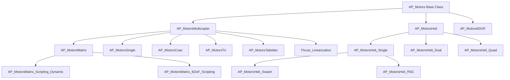
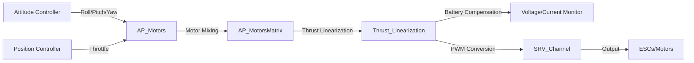
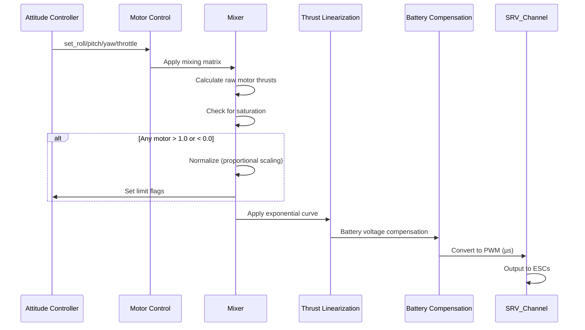
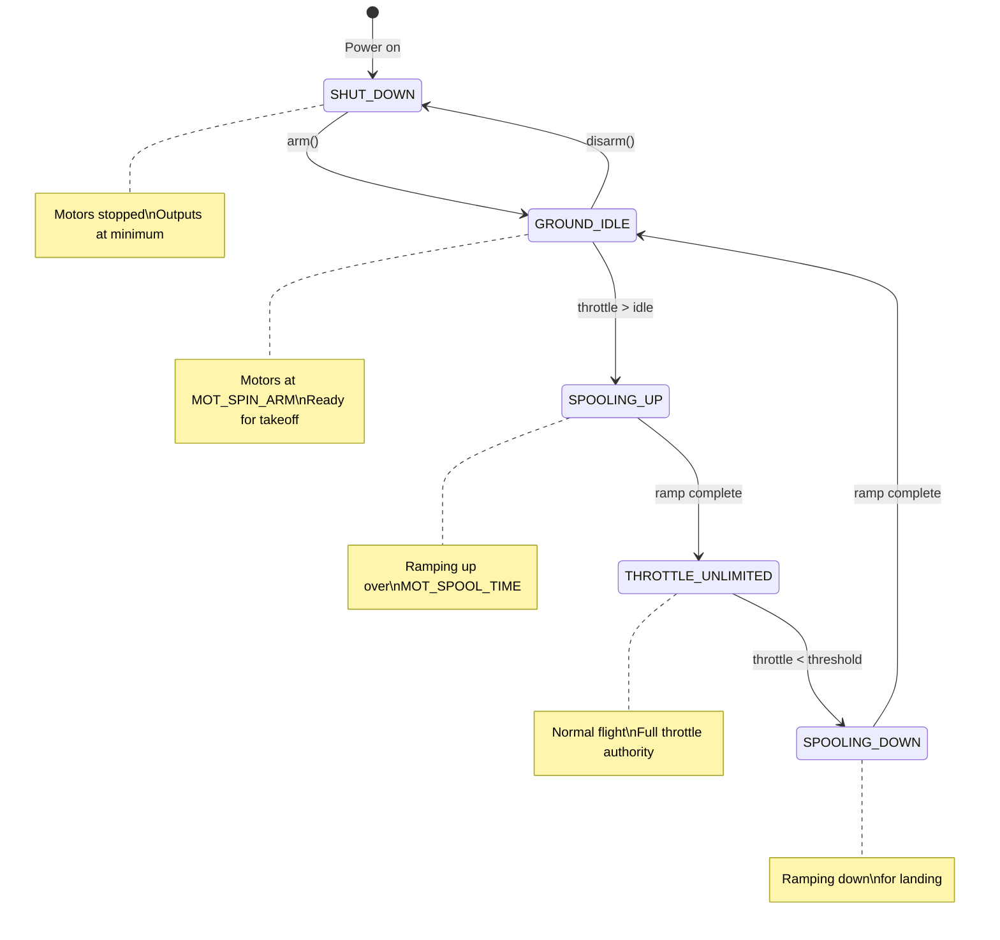

# AP_Motors - Motor Control Library

## Overview

The AP_Motors library provides comprehensive motor control and mixing functionality for ArduPilot vehicles. It converts high-level attitude, thrust, and translation commands from flight controllers into individual motor and servo outputs for multirotors, helicopters, and vectored-thrust vehicles. The library handles motor mixing algorithms, thrust curve linearization, battery voltage compensation, spool-up state management, and safety features critical for reliable flight operations.

**Purpose**: Transform flight controller commands (roll, pitch, yaw, throttle) into precise motor/ESC outputs  
**Responsibilities**: Motor mixing, thrust linearization, battery compensation, motor testing, ESC calibration, safety checks  
**Architecture**: Hierarchical class structure with specialized implementations for different vehicle frame types

## Architecture

### Class Hierarchy



### Component Data Flow



## Key Components

### AP_Motors_Class
- **Purpose**: Abstract base class defining the motor control interface for all vehicle types
- **Lifecycle**: Instantiated once at vehicle startup → configured → armed → output loop → disarmed
- **Thread Safety**: Methods called from main flight control thread; no internal locking required
- **Hardware Dependencies**: Platform-agnostic; actual hardware interaction through SRV_Channel

**Key Responsibilities**:
- Spool state machine management (SHUT_DOWN → GROUND_IDLE → SPOOLING_UP → THROTTLE_UNLIMITED)
- Roll/pitch/yaw/throttle input storage and filtering
- Motor arming/disarming logic
- Motor interlock control (emergency stop)
- Limit flag management (roll/pitch/yaw/throttle saturation indicators)
- Motor test sequencing for safe ground testing

Source: libraries/AP_Motors/AP_Motors_Class.h:51-407

### AP_MotorsMulticopter
- **Purpose**: Base class for all multicopter frames providing common functionality
- **Responsibilities**: Spool logic, throttle filtering, battery compensation, hover throttle learning
- **Key Features**:
  - Spool state machine with configurable ramp times
  - ESC calibration mode bypassing all limits
  - Hover throttle estimation and adaptive learning
  - Battery voltage/current limiting with time constants
  - Slew rate limiting for smooth thrust transitions

**Spool State Progression**:
1. **SHUT_DOWN**: Motors off, outputs at minimum PWM
2. **GROUND_IDLE**: Motors spinning at MOT_SPIN_ARM level (default 10%)
3. **SPOOLING_UP**: Ramping from ground idle to flight speed over MOT_SPOOL_TIME
4. **THROTTLE_UNLIMITED**: Normal flight operations, full throttle authority
5. **SPOOLING_DOWN**: Ramping down to ground idle during landing

Source: libraries/AP_Motors/AP_MotorsMulticopter.h:28-200

### AP_MotorsMatrix
- **Purpose**: Matrix-based motor mixing for standard multicopter configurations
- **Mixing Algorithm**: Each motor thrust = base_throttle + Σ(input × factor) for roll/pitch/yaw axes
- **Supported Frames**: Quad (X/+), Hexa, Octo, Y6, Deca, DodecaHexa with multiple motor orderings

**Motor Mixing Process**:
1. Collect roll/pitch/yaw inputs (-1 to +1) and throttle (0 to 1)
2. Apply mixing matrix: `thrust[i] = throttle + roll×roll_factor[i] + pitch×pitch_factor[i] + yaw×yaw_factor[i]`
3. Normalize if any motor exceeds limits (proportional scaling to fit within 0-1 range)
4. Apply thrust linearization curve and battery compensation
5. Convert to PWM range and output via SRV_Channels

**Motor Failure Handling**:
- Detects failed motors via thrust output monitoring with 1-second filtered comparison
- Returns failed motor index via `get_lost_motor()` for vehicle-level compensation
- Enables thrust boost mode to increase remaining motor outputs
- Adjusts mixing to maintain maximum control authority with reduced motor count

Source: libraries/AP_Motors/AP_MotorsMatrix.h:14-150

### Thrust_Linearization
- **Purpose**: Compensates for non-linear ESC/motor/propeller thrust response
- **Algorithm**: Applies exponential curve to linearize throttle-to-thrust relationship
- **Battery Compensation**: Scales thrust based on current battery voltage to maintain consistent performance

**Thrust Curve Equation**:
```
actuator_output = ((desired_thrust)^(1/expo) - spin_min) / (1 - spin_min)
```
Where:
- `expo` = MOT_THST_EXPO (typically 0.55-0.75, default 0.65)
- `spin_min` = MOT_SPIN_MIN (minimum stable throttle, default 0.15)
- Higher expo values = more responsive at low throttle, less sensitive at high throttle

**Battery Voltage Scaling**:
```
lift_max = (current_voltage - volt_min) / (volt_max - volt_min)
compensated_output = thrust_output / lift_max
```
Filtered with 5-second time constant to prevent oscillations from voltage transients.

Source: libraries/AP_Motors/AP_Motors_Thrust_Linearization.h:7-64

### AP_MotorsHeli
- **Purpose**: Traditional helicopter control with collective pitch and swashplate mixing
- **Control Method**: Blade pitch angle for thrust/attitude instead of motor speed variation
- **Components**: Main rotor collective, cyclic swashplate (CCPM), tail rotor, rotor speed governor

**Helicopter Control Architecture**:
- **Collective Pitch**: Primary vertical thrust control via main rotor blade angle
- **Cyclic Pitch**: Roll/pitch attitude control via swashplate tilt
- **Tail Rotor**: Yaw control compensating for main rotor torque
- **RSC (Rotor Speed Control)**: Maintains constant main rotor RPM independent of collective load

**CCPM Swashplate Types**:
- H3 (120°): Three servos spaced 120° apart
- H3_140: Three servos spaced 140° apart  
- H4_90: Four servos at 90° intervals
- H4_45: Four servos at 45° offset

**RSC Control Modes**:
1. **Passthrough**: Direct pilot throttle control
2. **Setpoint**: Fixed rotor speed percentage
3. **Throttle Curve**: 5-point collective-based throttle curve
4. **Governor**: Electronic RPM regulation with load compensation

Source: libraries/AP_Motors/AP_MotorsHeli.h:39-150

### AP_Motors6DOF
- **Purpose**: Full 6-axis control for underwater ROVs and vectored-thrust vehicles
- **Control Axes**: Translation (X/Y/Z forward/lateral/vertical) + Rotation (Roll/Pitch/Yaw)
- **Motor Contributions**: Each motor can contribute to all 6 axes with configurable factors

**6DOF Mixing Equation**:
```cpp
motor_output[i] = forward × forward_factor[i] +
                  lateral × lateral_factor[i] +
                  throttle × throttle_factor[i] +
                  roll × roll_factor[i] +
                  pitch × pitch_factor[i] +
                  yaw × yaw_factor[i]
```

**Key Features**:
- Bidirectional motor control (requires reversible ESCs)
- Vectored thrust orientations for arbitrary motor mounting angles
- Hydrodynamic coupling compensation for underwater operation
- Custom frame definitions via scripting or predefined ROV configurations

Source: libraries/AP_Motors/AP_Motors6DOF.h:12-79

## Frame Types and Motor Ordering

### Quadcopter X Configuration

Standard X-frame layout with front motors tilted forward and rear motors tilted back:

```
    Motor 3 (CCW)     Motor 1 (CW)
            \           /
             \   Front /
              \   ^   /
               \ | /
        Left <--- ---> Right
               / | \
              /   |   \
             /  Rear   \
            /           \
    Motor 2 (CW)      Motor 4 (CCW)
```

**Motor Definitions (MOTOR_FRAME_TYPE_X)**:
- **Motor 1**: Front-Right, CW rotation, yaw_factor = -1
  - Position: +45° from front, positive roll/pitch contribution
- **Motor 2**: Rear-Left, CW rotation, yaw_factor = -1
  - Position: -135° from front, negative roll/pitch contribution
- **Motor 3**: Front-Left, CCW rotation, yaw_factor = +1
  - Position: -45° from front, negative roll/positive pitch contribution
- **Motor 4**: Rear-Right, CCW rotation, yaw_factor = +1
  - Position: +135° from front, positive roll/negative pitch contribution

**Mixing Factors**:
| Motor | Roll Factor | Pitch Factor | Yaw Factor | Rotation |
|-------|-------------|--------------|------------|----------|
| 1     | +0.707      | +0.707       | -1         | CW       |
| 2     | -0.707      | -0.707       | -1         | CW       |
| 3     | -0.707      | +0.707       | +1         | CCW      |
| 4     | +0.707      | -0.707       | +1         | CCW      |

### Quadcopter Plus Configuration

Plus-frame with motors aligned with vehicle axes:

```
           Motor 1 (CW)
               |
               | Front
               |  ^
    Motor 4 ---+--- Motor 2
     (CCW)  Left|Right (CCW)
               |
               | Rear
               |
           Motor 3 (CW)
```

**Motor Definitions (MOTOR_FRAME_TYPE_PLUS)**:
- **Motor 1**: Front, CW rotation
- **Motor 2**: Right, CCW rotation
- **Motor 3**: Rear, CW rotation
- **Motor 4**: Left, CCW rotation

### Hexacopter X Configuration

Six motors in X arrangement for increased thrust and redundancy:

```
  Motor 5 (CCW)  Motor 1 (CW)  Motor 3 (CCW)
         \          |          /
          \      Front ^      /
           \       |         /
    Left <---  ---+---  ---> Right
           /       |         \
          /      Rear        \
         /          |          \
  Motor 6 (CW)  Motor 4 (CCW)  Motor 2 (CW)
```

**Benefits**: 50% more thrust capacity, continues flying with single motor failure

### Octocopter X Configuration

Eight motors providing maximum thrust and redundancy:

```
  Motor 7   Motor 1   Motor 3
   (CCW)      (CW)     (CCW)
      \        |        /
       \    Front     /
   M8---\    ^  |   /---M2
  (CW)   \   | |   /    (CW)
          \  | | /
   Left<----+--+----> Right
          / |  | \
         / |  |  \
   M6---/  | |   \---M5
  (CCW)   /  v  \    (CCW)
        /   Rear  \
       /     |     \
  Motor 4  Motor 8  Motor 6
   (CW)     (CW)     (CW)
```

**Benefits**: Highest thrust capacity, best motor-out capability, smooth control response

### Alternative Motor Orderings

ArduPilot supports multiple motor numbering conventions for compatibility with different flight controller firmware:

**BF_X (Betaflight X) - MOTOR_FRAME_TYPE_BF_X**:
- Motor numbering follows Betaflight convention
- Facilitates migration from Betaflight to ArduPilot
- Motor 1 starts at rear-right position

**DJI_X - MOTOR_FRAME_TYPE_DJI_X**:
- Follows DJI motor numbering convention
- Used for DJI-compatible frame configurations
- Motor 1 at front-right, clockwise sequence

**CW_X (Clockwise X) - MOTOR_FRAME_TYPE_CW_X**:
- Motors numbered clockwise starting from front-right
- Motor 1: Front-right → 2: Rear-right → 3: Rear-left → 4: Front-left

**Y6 Configurations**:
- **Y6B**: Y6 frame with bottom motors first in pairing
- **Y6F (FireFly Y6)**: Optimized Y6 layout for FireFly frame

**Special Configurations**:
- **NYT_PLUS/NYT_X**: No yaw torque frames (counter-rotating propeller pairs)
- **Y4**: Y-shaped quadcopter with rear motors on boom

## Motor Mixing Algorithm

### Mathematical Foundation

For matrix-based multirotors, each motor's thrust output is computed using a weighted sum of control inputs:

```
thrust[i] = throttle_base + 
            roll_input × roll_factor[i] + 
            pitch_input × pitch_factor[i] + 
            yaw_input × yaw_factor[i]
```

**Input Ranges**:
- `roll_input`, `pitch_input`, `yaw_input`: -1.0 to +1.0 (normalized control authority)
- `throttle_base`: 0.0 to 1.0 (normalized thrust demand)

**Mixing Factors Derivation**:

For a motor at angle θ from the front of the vehicle:
- `roll_factor[i] = sin(θ[i])` - positive for right-side motors
- `pitch_factor[i] = cos(θ[i])` - positive for front motors
- `yaw_factor[i] = ±1` based on motor rotation direction
  - Clockwise (CW) rotation: yaw_factor = -1 (opposes positive yaw)
  - Counter-clockwise (CCW) rotation: yaw_factor = +1 (produces positive yaw)

**Example - Quad X Motor 1 (Front-Right, 45° from front, CW)**:
```
roll_factor[1] = sin(45°) = +0.707   (right side, positive roll)
pitch_factor[1] = cos(45°) = +0.707  (front position, positive pitch)
yaw_factor[1] = -1                    (CW rotation opposes +yaw)
```

### Mixing Process Flow



### Detailed Mixing Steps

#### Step 1: Input Collection
```cpp
// Inputs from attitude controller (normalized -1 to +1)
float roll_in = get_roll();      // -1 (left) to +1 (right)
float pitch_in = get_pitch();    // -1 (back) to +1 (forward)
float yaw_in = get_yaw();        // -1 (left) to +1 (right)
float throttle = get_throttle(); // 0 (min) to 1 (max)
```

#### Step 2: Motor Thrust Calculation
```cpp
for (i = 0; i < num_motors; i++) {
    motor_thrust[i] = throttle + 
                      roll_in * roll_factor[i] +
                      pitch_in * pitch_factor[i] +
                      yaw_in * yaw_factor[i];
}
```

#### Step 3: Saturation Detection and Normalization

When any motor thrust exceeds the valid range [0, 1], all motors are scaled proportionally:

```cpp
// Find maximum thrust demand
float thrust_max = 0;
float thrust_min = 0;
for (i = 0; i < num_motors; i++) {
    thrust_max = max(thrust_max, motor_thrust[i]);
    thrust_min = min(thrust_min, motor_thrust[i]);
}

// Proportional scaling if limits exceeded
if (thrust_max > 1.0 || thrust_min < 0.0) {
    float thrust_range = thrust_max - thrust_min;
    float thrust_scale = 1.0 / thrust_range;
    
    for (i = 0; i < num_motors; i++) {
        motor_thrust[i] = (motor_thrust[i] - thrust_min) * thrust_scale;
    }
    
    // Set limit flags for attitude controller feedback
    limit.throttle_upper = (thrust_max > 1.0);
    limit.throttle_lower = (thrust_min < 0.0);
    limit.roll = limit.pitch = limit.yaw = true;
}
```

**Limit Flag Meanings**:
- `limit.roll` / `limit.pitch`: Attitude control authority limited by saturation
- `limit.yaw`: Yaw control authority limited
- `limit.throttle_upper`: Cannot increase throttle further (motors at maximum)
- `limit.throttle_lower`: Cannot decrease throttle further (motors at minimum)

These flags feed back to the attitude controller to prevent integrator wind-up and adjust control strategy.

#### Step 4: Yaw Headroom Reserve

To maintain yaw authority even at high throttle, a portion of the PWM range is reserved:

```cpp
// Default: MOT_YAW_HEADROOM = 200µs out of 1000µs range
float yaw_headroom_ratio = MOT_YAW_HEADROOM / (MOT_PWM_MAX - MOT_PWM_MIN);
float throttle_with_headroom = throttle * (1.0 - yaw_headroom_ratio);
```

This prevents yaw saturation during aggressive maneuvers at high throttle.

#### Step 5: Thrust Linearization

Apply exponential curve to compensate for non-linear ESC/motor response:

```cpp
float expo = MOT_THST_EXPO;  // typically 0.65
float spin_min = MOT_SPIN_MIN; // typically 0.15

for (i = 0; i < num_motors; i++) {
    // Convert desired thrust (0-1) to actuator output (spin_min to 1.0)
    float thrust_curve = pow(motor_thrust[i], 1.0 / expo);
    actuator[i] = thrust_curve * (1.0 - spin_min) + spin_min;
}
```

**Effect of Expo Parameter**:
- `expo = 0.5`: Square root curve, more linear
- `expo = 0.65`: Default, balanced response
- `expo = 0.8`: Quadratic curve, more sensitive at low throttle

#### Step 6: Battery Voltage Compensation

Scale motor outputs based on current battery voltage to maintain consistent thrust:

```cpp
float voltage = battery.voltage();
float volt_max = MOT_BAT_VOLT_MAX;
float volt_min = MOT_BAT_VOLT_MIN;

if (volt_max > 0) {
    // Calculate available lift ratio
    float lift_max = (voltage - volt_min) / (volt_max - volt_min);
    lift_max = constrain_float(lift_max, 0.0, 1.0);
    
    // Apply 5-second low-pass filter to prevent oscillations
    lift_max_filtered = lowpass_filter(lift_max, 5.0);
    
    // Compensate motor outputs
    for (i = 0; i < num_motors; i++) {
        actuator[i] = actuator[i] / lift_max_filtered;
    }
}
```

**Compensation Behavior**:
- Fresh battery (16.8V on 4S): lift_max ≈ 1.0, no compensation
- Depleted battery (14.0V on 4S): lift_max ≈ 0.7, outputs increased 43%
- Maintains consistent hover throttle throughout battery discharge

#### Step 7: Battery Current Limiting

Limit total thrust to respect battery current capability:

```cpp
float current = battery.current_amps();
float current_max = MOT_BAT_CURR_MAX;

if (current_max > 0 && current > current_max) {
    // Scale all motor outputs to reduce current
    float current_ratio = current_max / current;
    current_ratio_filtered = lowpass_filter(current_ratio, 5.0);
    
    for (i = 0; i < num_motors; i++) {
        actuator[i] = actuator[i] * current_ratio_filtered;
    }
    
    limit.throttle_upper = true;  // Indicate throttle limited by current
}
```

#### Step 8: PWM Conversion and Output

Convert normalized actuator outputs (0-1) to PWM microseconds:

```cpp
for (i = 0; i < num_motors; i++) {
    // Map to configured PWM range
    uint16_t pwm_us = MOT_PWM_MIN + 
                      actuator[i] * (MOT_PWM_MAX - MOT_PWM_MIN);
    
    // Output via servo channel
    SRV_Channels::set_output_pwm(motor_channel[i], pwm_us);
}
```

**Typical PWM Ranges**:
- Normal PWM: 1000-2000µs (ESC-dependent)
- OneShot: 125-250µs (scaled internally)
- DShot: Digital protocol, no PWM range (commands sent as digital packets)

## Thrust Curve Linearization

### The Non-Linearity Problem

ESC/motor/propeller systems exhibit non-linear thrust response to throttle input:

**Low Throttle Range (0-30%)**:
- Motors barely spinning or unstable
- Poor throttle resolution
- Less thrust than linear expectation
- Risk of motor desync or stalling

**Mid Throttle Range (30-70%)**:
- Most linear response region
- Good throttle resolution
- Predictable thrust changes

**High Throttle Range (70-100%)**:
- Diminishing returns from increased throttle
- Motor heating and efficiency losses
- Propeller tip speed approaching limit
- Battery voltage sag under load

### Exponential Curve Compensation

The thrust linearization applies an inverse exponential curve to linearize the control response:

```
actuator_output = ((desired_thrust)^(1/expo) - spin_min) / (1 - spin_min)
```

**Parameters**:

**MOT_THST_EXPO (0.0 to 1.0)** - Thrust curve exponent:
- **0.0**: Linear mapping (no compensation) - use only if ESC/motor already linear
- **0.5**: Square root curve - mild compensation
- **0.65**: Default - works well for most ESC/motor/prop combinations
- **0.75**: Stronger compensation - for highly non-linear systems
- **1.0**: Quadratic curve - extreme compensation (rarely needed)

**MOT_SPIN_MIN (0.0 to 0.5)** - Minimum stable throttle:
- Lowest throttle where motors spin reliably without cogging
- Below this value, motors may desync or stall
- Typical values: 0.10-0.20 depending on motor/ESC combination
- Too low: Motors stall during rapid maneuvers
- Too high: Wastes throttle range, reduces efficiency

**MOT_SPIN_MAX (0.5 to 1.0)** - Maximum throttle:
- Upper limit for motor output
- Default 0.95 provides headroom for control mixing
- Prevents ESC from entering "full throttle" protection modes
- Can be reduced to limit power consumption

### Tuning Thrust Expo

**Method 1: Hover Throttle Analysis**

1. Fly vehicle in stable hover at mid-stick throttle position
2. Examine log file, check `CTUN.ThO` (throttle output) value
3. Ideal hover throttle: 0.45-0.55 (center of range)
4. Adjust expo based on actual hover position:

| Hover Throttle | Action | Reasoning |
|----------------|--------|-----------|
| < 0.40 | Increase expo by 0.05-0.10 | Too much thrust at low throttle, need more sensitivity |
| 0.40-0.60 | Current expo good | Balanced thrust curve |
| > 0.60 | Decrease expo by 0.05-0.10 | Not enough thrust at low throttle, need less sensitivity |

5. Repeat test flights and iterate until hover at 0.45-0.55

**Method 2: Throttle Response Feel**

Observe vehicle response during manual flight:

**Symptoms of Expo Too Low**:
- "Touchy" at low throttle, hard to hover smoothly
- Aggressive initial altitude gain from small throttle inputs
- Smoother at high throttle

**Symptoms of Expo Too High**:
- "Mushy" at low throttle, slow altitude response
- Need significant throttle to initiate climb
- Aggressive response at high throttle

**Method 3: Autotune Recommendation**

After running autotune, check recommended expo value in logs.
Autotune analyzes thrust response and may suggest optimal expo.

### Mathematical Behavior

For `expo = 0.65`, `spin_min = 0.15`:

| Desired Thrust | Actuator Output | Effect |
|----------------|-----------------|--------|
| 0.0 | 0.15 | Minimum stable throttle |
| 0.25 | 0.42 | More output than linear (0.36) |
| 0.50 | 0.61 | Slightly more than linear (0.58) |
| 0.75 | 0.80 | Close to linear (0.79) |
| 1.0 | 1.0 | Full throttle |

The curve provides more actuator output at low desired thrust values, compensating for non-linear motor response.

## Battery Compensation

### Voltage Sag Problem

Battery voltage drops during flight due to:
- Internal resistance causes voltage drop under load current
- Battery state of charge (SOC) decreases over time
- Temperature effects on battery performance

**Impact on Flight**:
- At constant throttle, thrust decreases as voltage drops
- Hover throttle must increase throughout flight to maintain altitude
- Control response becomes weaker with depleted battery
- Vehicle feels "heavy" toward end of flight

### Dynamic Voltage Compensation

**Compensation Formula**:
```
lift_max = (current_voltage - volt_min) / (volt_max - volt_min)
compensated_output = motor_output / lift_max
```

**Parameters**:

**MOT_BAT_VOLT_MAX (Volts)** - Battery fully charged voltage:
- 4S LiPo: 16.8V (4.2V × 4 cells)
- 6S LiPo: 25.2V (4.2V × 6 cells)
- Set to actual maximum voltage of your battery
- Used as reference for 100% thrust availability

**MOT_BAT_VOLT_MIN (Volts)** - Battery minimum safe voltage:
- 4S LiPo: 13.2V-14.0V (3.3-3.5V per cell)
- 6S LiPo: 19.8V-21.0V (3.3-3.5V per cell)
- Below this voltage, no compensation applied (land immediately)
- Conservative value prevents over-discharging battery

**Example Compensation Calculation (4S LiPo)**:
```
MOT_BAT_VOLT_MAX = 16.8V
MOT_BAT_VOLT_MIN = 14.0V
Current voltage = 15.4V (mid-discharge)

lift_max = (15.4 - 14.0) / (16.8 - 14.0) = 1.4 / 2.8 = 0.5

If desired motor output = 0.6
Compensated output = 0.6 / 0.5 = 1.2 (clamped to 1.0)
```

In this example, at 15.4V the system estimates 50% thrust capacity remaining and doubles motor outputs to compensate.

### Filtering and Rate Limiting

**5-Second Time Constant Low-Pass Filter**:
- Prevents oscillations from voltage transients during rapid throttle changes
- Smooths compensation during current spikes
- Avoids rapid thrust changes that could destabilize vehicle

```cpp
float alpha = dt / (dt + 5.0);  // 5 second time constant
lift_max_filtered = lift_max_filtered * (1 - alpha) + lift_max * alpha;
```

**Safety Clamping**:
- Compensated outputs clamped to [0, 1] range
- If compensation demands > 1.0, limit flag set
- Prevents runaway compensation with very low battery

### Battery Current Limiting

**Purpose**: Prevent battery damage from excessive current draw

**MOT_BAT_CURR_MAX (Amperes)** - Maximum continuous current:
- Set to battery C-rating limit (e.g., 5000mAh 30C = 150A max)
- Should be less than ESC current limit
- Conservative value extends battery life

**Current Limiting Algorithm**:
```
If current > MOT_BAT_CURR_MAX:
    scale_factor = MOT_BAT_CURR_MAX / measured_current
    all_motor_outputs *= scale_factor
    limit.throttle_upper = true
```

**Effect**:
- Reduces overall thrust to stay within current limit
- Prevents battery damage, voltage collapse, or fire risk
- May limit climb rate or maximum vehicle acceleration
- Pilot perceives as "throttle limit" - vehicle won't climb faster

### Testing Battery Compensation

**Procedure**:
1. Configure `MOT_BAT_VOLT_MAX` and `MOT_BAT_VOLT_MIN` for your battery
2. Fully charge battery and fly, noting hover throttle
3. Fly until battery reaches safe minimum voltage
4. Check hover throttle - should be similar to fresh battery
5. Review log: `CTUN.ThO` should stay relatively constant
6. Check `BAT.Volt` and `MOTB.LiftMax` correlation in log

**Expected Results**:
- Hover throttle varies < 10% throughout flight with good compensation
- Without compensation: Hover throttle increases 30-50% by end of flight

## Spool State Machine

The spool state machine manages motor startup, shutdown, and transitions to ensure safe and smooth operations.

### State Diagram



### State Descriptions

**SHUT_DOWN**:
- **Condition**: Vehicle disarmed
- **Motor Behavior**: All motors off, outputs at minimum PWM
- **Transition To**: GROUND_IDLE when vehicle armed
- **Purpose**: Safe state preventing unexpected motor start

**GROUND_IDLE**:
- **Condition**: Vehicle armed, throttle at minimum
- **Motor Behavior**: Motors spin at `MOT_SPIN_ARM` level (default 10%)
- **Purpose**: 
  - Motors ready for immediate response
  - Gyroscopic stabilization from spinning props
  - Prevents "dead band" at takeoff
  - Audio/visual indication vehicle is armed
- **Throttle Output**: Fixed at `MOT_SPIN_ARM` regardless of input
- **Transition To**: SPOOLING_UP when throttle raised

**SPOOLING_UP**:
- **Condition**: Transitioning from ground idle to flight
- **Motor Behavior**: Linearly ramping from `MOT_SPIN_ARM` to commanded throttle
- **Duration**: `MOT_SPOOL_TIME` seconds (default 0.5s)
- **Purpose**:
  - Smooth motor acceleration prevents mechanical shock
  - Allows ESCs to synchronize
  - Prevents sudden thrust imbalance during takeoff
  - Gives gyros time to stabilize
- **Throttle Calculation**: 
  ```
  ramp_progress = time_in_state / MOT_SPOOL_TIME
  output = MOT_SPIN_ARM + (commanded_throttle - MOT_SPIN_ARM) * ramp_progress
  ```
- **Transition To**: THROTTLE_UNLIMITED when ramp completes

**THROTTLE_UNLIMITED**:
- **Condition**: Normal flight operations
- **Motor Behavior**: Direct response to pilot/controller commands
- **Throttle Range**: Full 0-1 authority with no artificial limits
- **Purpose**: Normal flight with complete control authority
- **Transition To**: SPOOLING_DOWN when throttle reduced near landing

**SPOOLING_DOWN**:
- **Condition**: Preparing for landing, throttle lowered
- **Motor Behavior**: Ramping from flight throttle to ground idle
- **Duration**: `MOT_SPOOL_TIME` seconds
- **Purpose**:
  - Smooth landing with gradual thrust reduction
  - Prevents sudden motor stop causing vehicle drop
  - Maintains attitude control during descent
- **Transition To**: GROUND_IDLE when ramp completes

### Configuration Parameters

**MOT_SPOOL_TIME (0.0 to 2.0 seconds)** - Spool ramp duration:
- Default: 0.5 seconds
- Increase for:
  - Large, heavy vehicles (slower acceleration)
  - High-inertia props
  - Mechanical components needing gradual start
- Decrease for:
  - Small, agile racers
  - Fast takeoff requirements
- Too fast: Mechanical shock, ESC desync, gyro saturation
- Too slow: Sluggish takeoff, prolonged vulnerable transition period

**MOT_SPIN_ARM (0.0 to 0.5)** - Ground idle throttle level:
- Default: 0.10 (10% of throttle range)
- Higher values:
  - Better motor response at takeoff
  - More gyroscopic stabilization
  - Higher motor temperature at idle
  - More noise
- Lower values:
  - Quieter operation on ground
  - Cooler motors
  - May have slower takeoff response
- Typical range: 0.05-0.15

### Spool State Monitoring

**In Telemetry**:
- Check current spool state via MAVLink `SPOOL_STATE` parameter
- Log message: `CTRL.Spool` field shows numeric state value

**State Values**:
- 0 = SHUT_DOWN
- 1 = GROUND_IDLE
- 2 = SPOOLING_UP
- 3 = THROTTLE_UNLIMITED
- 4 = SPOOLING_DOWN

**Common Issues**:

**Stuck in SPOOLING_UP**:
- Check throttle input reaching above idle threshold
- Verify `MOT_SPOOL_TIME` not excessively long
- Check for arming check failures

**Unexpected GROUND_IDLE**:
- Throttle may be below ground idle threshold
- Check throttle calibration and deadband settings
- Verify radio throttle trim position

## Safety Features

### Arming Checks

Before motors can be armed, comprehensive safety checks ensure vehicle configuration is safe:

**Parameter Consistency Checks**:
- PWM output range valid (`MOT_PWM_MIN` < `MOT_PWM_MAX`)
- Thrust expo in valid range (0.0 to 1.0)
- Spool time reasonable (not excessive)
- Frame class and type configured
- Battery voltage parameters logical (`VOLT_MIN` < `VOLT_MAX`)

**Hardware Validation**:
- Servo output channels configured for all motors
- ESC protocol supported by hardware
- No channel conflicts between motors and other outputs
- Board capable of configured update rate

**Sensor Health**:
- Battery monitor functional and reading voltage
- Current sensor functional if current limiting enabled

**Frame Configuration**:
- Frame class matches vehicle type (QUAD for quadcopter, HEXA for hexacopter, etc.)
- Motor count matches frame type
- All required motors have channel assignments

**Arming Check Failure Messages**:
Specific error messages guide troubleshooting:
- "Motors: Bad parameter" - Check parameter values
- "Motors: motor mask error" - Channel configuration issue
- "Motors: thrust curve invalid" - Check `MOT_THST_EXPO`

### Motor Test Mode

**CRITICAL SAFETY WARNING**: Remove propellers before motor testing!

Motor test allows safe verification of motor order, direction, and ESC configuration.

**Test Procedure**:
```
# Via MAVLink command
MAV_CMD_DO_MOTOR_TEST
  motor_number: 1-32 (motor sequence number)
  throttle_type: 1 (PWM), 2 (percent)
  throttle: PWM value (1000-2000) or percent (0-100)
  timeout: seconds
  motor_count: total motors on frame
```

**Test Sequence Methodology**:
1. Test motor 1 → should be front-right on quad X
2. Test motor 2 → should be rear-left on quad X
3. Test motor 3 → should be front-left on quad X
4. Test motor 4 → should be rear-right on quad X
5. Verify each motor spins in correct direction (CW vs CCW)

**Motor Direction Verification**:
- CW motors: Viewed from above, rotate clockwise
- CCW motors: Viewed from above, rotate counter-clockwise
- Incorrect direction → vehicle will yaw uncontrollably on takeoff
- Fix by: Swap any two motor wires or configure ESC reversing

**Safety Features in Motor Test**:
- Enforces safety checks before allowing test
- Timeout prevents runaway motor from forgotten command
- Cannot be activated while flying (altitude check)
- Requires intentional command, not accidental trigger

### ESC Calibration

ESCs must be calibrated to ensure all motors respond to same PWM range.

**When Calibration Needed**:
- Initial setup with new ESCs
- Changing ESC firmware
- Different ESC brands/models on same vehicle
- Motors not spinning at same speed despite same throttle
- One motor starts before others

**Calibration Procedure**:

**Method 1: Simultaneous All-at-Once Calibration**:
1. **REMOVE PROPELLERS** (mandatory for safety)
2. Disconnect battery from vehicle
3. Set radio throttle to maximum
4. Set `MOT_PWM_TYPE = 0` (Normal PWM)
5. Power on transmitter, verify throttle at maximum
6. Connect battery - ESCs will beep recognizing high signal
7. Lower throttle to minimum
8. ESCs will beep again confirming calibration stored
9. Disconnect battery
10. Return throttle stick to normal position
11. Reconnect battery and test

**Method 2: ESC Calibration Parameter Method**:
1. Set vehicle-specific ESC calibration parameter (varies by vehicle)
2. Vehicle enters passthrough mode: throttle directly to all ESCs
3. Follow beep sequence from ESCs
4. Disable calibration parameter when complete

**Method 3: Individual ESC Programming**:
- Use ESC-specific programming card or software
- Program each ESC to same throttle range
- Typically 1000µs min, 2000µs max for standard PWM

**Verification After Calibration**:
1. Power on with low throttle
2. Slowly increase throttle
3. All motors should start spinning simultaneously
4. All motors should reach same speed at same throttle
5. No motor should start earlier or spin faster than others

### Motor Interlock

Emergency motor stop independent of arming state.

**Purpose**:
- Emergency situation requiring immediate motor stop
- Ground handling without disarming vehicle
- Testing avionics without motor movement
- Quick motor stop without full disarm sequence

**Behavior**:
- `Interlock = False`: Motors stopped regardless of other inputs
- `Interlock = True`: Motors respond normally if armed
- Does NOT disarm vehicle - just stops motors
- GPS, logging, telemetry continue operating

**Usage**:
```cpp
motors.set_interlock(false);  // Stop motors immediately
motors.set_interlock(true);   // Re-enable motor output
```

**Common Applications**:
- RC switch to cut motors in emergency
- Auto-disable during certain flight modes
- Ground safety during maintenance
- Automatic shutdown on critical failures

**Difference from Disarming**:
- Interlock: Motors stop but vehicle stays "armed" state
- Disarm: Full shutdown, must re-arm to fly
- Interlock faster for emergency stops
- Disarm more complete shutdown for post-flight

### Output Slew Rate Limiting

Protects mechanical components from shock loads.

**MOT_SLEW_UP_TIME (0.0 to 5.0 seconds)** - Thrust increase rate limit:
- 0 = No limiting (instant response)
- Time for thrust to ramp from 0% to 100%
- Example: 0.5s = maximum 200% per second increase rate
- Purpose:
  - Prevents ESC current spikes
  - Protects motor bearings from shock
  - Reduces mechanical stress on frame
  - Smooths power draw from battery

**MOT_SLEW_DN_TIME (0.0 to 5.0 seconds)** - Thrust decrease rate limit:
- Time for thrust to ramp from 100% to 0%
- Typically 0 (no limiting on decrease)
- Can be set for smoother landing approaches
- Prevents sudden drop if throttle cut

**When to Use Slew Limiting**:
- Large vehicles with heavy props
- Direct-drive motors (no gearbox damping)
- Fragile frame construction
- High-power systems with current concerns

**Trade-offs**:
- Benefit: Mechanical protection, smoother operation
- Cost: Slightly reduced control response, delay in thrust changes
- Typically not used on racing quads (need instant response)
- Useful on large camera platforms (smooth footage)

### Comprehensive Safety Philosophy

**Defense in Depth**:
1. **Pre-flight**: Arming checks prevent invalid configurations
2. **Startup**: Spool state machine ensures controlled motor start
3. **Flight**: Limit flags provide feedback to controllers
4. **Emergency**: Interlock provides immediate stop capability
5. **Hardware**: Slew limiting protects mechanical components

**Fail-Safe Design Principles**:
- All safety parameters have safe defaults
- Missing configuration detected before flight
- Sanity checks on all pilot/controller inputs
- Limit flags prevent integrator wind-up
- Multiple layers prevent single-point failures

## Configuration Parameters

### Essential Multicopter Parameters

**PWM Output Configuration**:

| Parameter | Description | Default | Range | Units |
|-----------|-------------|---------|-------|-------|
| MOT_PWM_MIN | Minimum PWM output | 1000 | 800-2200 | μs |
| MOT_PWM_MAX | Maximum PWM output | 2000 | 800-2200 | μs |
| MOT_PWM_TYPE | Output protocol type | 0 (Normal) | 0-9 | enum |

**MOT_PWM_TYPE Values**:
- 0 = Normal PWM (50-490Hz, typical 1000-2000μs)
- 1 = OneShot (high-speed PWM, 1-8kHz equivalent)
- 2 = OneShot125 (125-250μs range, 8kHz rate)
- 3 = Brushed (fast PWM for brushed motors, 0-100% duty cycle)
- 4 = DShot150 (150kbit/s digital protocol)
- 5 = DShot300 (300kbit/s digital protocol) - recommended for most systems
- 6 = DShot600 (600kbit/s digital protocol)
- 7 = DShot1200 (1.2Mbit/s digital protocol) - highest performance
- 8 = PWM_RANGE (scaled PWM output)
- 9 = PWM_ANGLE (angle-based PWM output for servos)

**Thrust Curve Parameters**:

| Parameter | Description | Default | Range | Units |
|-----------|-------------|---------|-------|-------|
| MOT_SPIN_MIN | Minimum stable throttle | 0.15 | 0-0.5 | 0-1 |
| MOT_SPIN_MAX | Maximum throttle limit | 0.95 | 0.5-1.0 | 0-1 |
| MOT_SPIN_ARM | Armed ground idle level | 0.10 | 0-0.5 | 0-1 |
| MOT_THST_EXPO | Thrust curve exponent | 0.65 | 0-1.0 | 0-1 |
| MOT_THST_HOVER | Hover throttle (learned) | 0.35 | 0.125-0.6875 | 0-1 |

**Battery Compensation Parameters**:

| Parameter | Description | Default | Range | Units |
|-----------|-------------|---------|-------|-------|
| MOT_BAT_VOLT_MAX | Battery max voltage | 0 (disabled) | 0-50 | V |
| MOT_BAT_VOLT_MIN | Battery min voltage | 0 | 0-50 | V |
| MOT_BAT_CURR_MAX | Battery current limit | 0 (disabled) | 0-500 | A |

**Control Parameters**:

| Parameter | Description | Default | Range | Units |
|-----------|-------------|---------|-------|-------|
| MOT_YAW_HEADROOM | PWM reserved for yaw | 200 | 0-500 | μs |
| MOT_SPOOL_TIME | Spool ramp time | 0.5 | 0-2.0 | s |
| MOT_SLEW_UP_TIME | Thrust slew up limit | 0 (disabled) | 0-5.0 | s |
| MOT_SLEW_DN_TIME | Thrust slew down limit | 0 (disabled) | 0-5.0 | s |

**Frame Configuration**:

| Parameter | Description | Default | Range | Units |
|-----------|-------------|---------|-------|-------|
| FRAME_CLASS | Frame type | 1 (QUAD) | 0-17 | enum |
| FRAME_TYPE | Frame layout | 1 (X) | 0-19 | enum |

**FRAME_CLASS Values**:
- 1 = QUAD (4 motors)
- 2 = HEXA (6 motors)
- 3 = OCTA (8 motors)
- 4 = OCTAQUAD (8 motors in X8 configuration)
- 5 = Y6 (6 motors, Y layout)
- 7 = TRI (3 motors with servo yaw)
- 12 = DODECAHEXA (12 motors)
- 14 = DECA (10 motors)

### Helicopter-Specific Parameters

| Parameter | Description | Default | Range | Units |
|-----------|-------------|---------|-------|-------|
| H_RSC_MODE | Rotor speed control mode | 1 | 0-4 | enum |
| H_RSC_SETPOINT | Target rotor speed | 700 | 0-1000 | % |
| H_COL_MIN | Minimum collective pitch | 1250 | 0-2000 | PWM μs |
| H_COL_MAX | Maximum collective pitch | 1750 | 0-2000 | PWM μs |
| H_COL_MID | Mid collective pitch | 1500 | 0-2000 | PWM μs |
| H_CYC_MAX | Maximum cyclic angle | 2200 | 0-4500 | cdeg |
| H_SV_MAN | Manual servo mode | 0 | 0-1 | bool |

**H_RSC_MODE Values** (Rotor Speed Control):
- 0 = Disabled
- 1 = Passthrough (direct throttle control)
- 2 = Setpoint (fixed RPM percentage)
- 3 = Throttle Curve (5-point curve based on collective)
- 4 = Governor (active RPM regulation)

## Testing Procedures

### SITL (Software-In-The-Loop) Testing

Safe testing environment for motor mixing logic without hardware risk.

**Starting SITL with Copter**:
```bash
# Navigate to ArduPilot directory
cd ~/ardupilot

# Start SITL with default quadcopter
sim_vehicle.py -v ArduCopter --console --map

# Start with specific frame type
sim_vehicle.py -v ArduCopter --frame=quad --console --map
sim_vehicle.py -v ArduCopter --frame=hexa --console --map
sim_vehicle.py -v ArduCopter --frame=octa --console --map
```

**Testing Motor Mixing in SITL**:
```bash
# In MAVProxy console:

# Arm the vehicle
arm throttle

# Set throttle to mid-range
rc 3 1500

# Test roll input (channel 1)
rc 1 1200  # Roll left - motors 2,3 should increase, 1,4 decrease
rc 1 1800  # Roll right - motors 1,4 should increase, 2,3 decrease
rc 1 1500  # Center

# Test pitch input (channel 2)
rc 2 1200  # Pitch back - motors 2,4 should increase, 1,3 decrease
rc 2 1800  # Pitch forward - motors 1,3 should increase, 2,4 decrease
rc 2 1500  # Center

# Test yaw input (channel 4)
rc 4 1200  # Yaw left - CCW motors increase, CW motors decrease
rc 4 1800  # Yaw right - CW motors increase, CCW motors decrease
rc 4 1500  # Center

# View motor outputs in real-time
module load graph
graph RCOU.C1 RCOU.C2 RCOU.C3 RCOU.C4
```

**Analyzing Motor Outputs**:
- Check logs for motor saturation: `CTRL` messages with limit flags
- Verify thrust linearization: Compare `CTUN.ThO` vs motor outputs
- Monitor battery compensation: `MOTB.LiftMax` correlation with voltage

### Hardware Testing

**CRITICAL: REMOVE PROPELLERS FOR ALL HARDWARE TESTS!**

#### Pre-Flight Checklist:
1. ✓ Propellers removed
2. ✓ Vehicle secured (test stand or held firmly)
3. ✓ Clear area around vehicle
4. ✓ Safety glasses worn
5. ✓ Fire extinguisher accessible (for LiPo testing)
6. ✓ Second person as safety observer

#### Test 1: Motor Order Verification

**Objective**: Confirm each motor number maps to correct physical motor and location.

**Procedure via Mission Planner/QGroundControl**:
1. Connect to vehicle via USB or telemetry
2. Navigate to Motor Test screen
3. Remove propellers (verify again!)
4. Test each motor individually:
   - Motor 1: Front-right (on quad X) should spin
   - Motor 2: Rear-left should spin
   - Motor 3: Front-left should spin
   - Motor 4: Rear-right should spin

**Procedure via MAVProxy**:
```bash
# Syntax: motortest <motor#> <throttle%> <timeout_sec> <instances>
motortest 1 5 2 0  # Test motor 1 at 5% for 2 seconds
motortest 2 5 2 0  # Test motor 2
motortest 3 5 2 0  # Test motor 3
motortest 4 5 2 0  # Test motor 4
```

**Expected Results**:
- Each motor spins in sequence as commanded
- No unexpected motors spin
- All motors respond to test command

**Troubleshooting**:
- Wrong motor spins → Check `SERVOn_FUNCTION` assignments
- No motor spins → Check ESC power, signal connections, arming checks
- Multiple motors spin → Check for channel conflicts

#### Test 2: Motor Direction Verification

**Objective**: Verify each motor spins in correct direction (CW vs CCW).

**Procedure**:
1. Motor test each motor individually at low throttle
2. View motor from above
3. Compare rotation direction to frame diagram

**For Quad X Frame**:
- Motor 1 (front-right): Should spin CLOCKWISE (CW)
- Motor 2 (rear-left): Should spin CLOCKWISE (CW)
- Motor 3 (front-left): Should spin COUNTER-CLOCKWISE (CCW)
- Motor 4 (rear-right): Should spin COUNTER-CLOCKWISE (CCW)

**Fixing Reversed Motor Direction**:

**Method 1: Swap Motor Wires**:
- Swap any two of the three motor wires
- Works for all ESC/motor combinations
- Permanent fix

**Method 2: ESC Configuration** (if ESC supports):
- Program ESC to reverse direction
- Available on most modern ESCs (BLHeli, SimonK)
- No need to swap wires

**Method 3: DShot Reverse** (DShot ESCs only):
- Use DShot command to reverse motor direction
- Set `SERVOn_REVERSED = 1` for affected channel
- Software solution, no physical changes

#### Test 3: Throttle Response Verification

**Objective**: Verify all motors respond identically to throttle input.

**Procedure**:
1. Configure logging: `LOG_BITMASK` includes motor outputs
2. Arm vehicle with propellers removed
3. Slowly increase throttle from minimum to 50%
4. Observe/log motor outputs
5. Slowly decrease throttle back to minimum
6. Disarm and review logs

**Analysis**:
```python
# Review log file
# Check RCOU.C1, C2, C3, C4 (motor PWM outputs)
# All should increase/decrease together
# Verify no motor leads or lags others
```

**Expected Results**:
- All motors start spinning simultaneously at same throttle
- All motors reach same PWM at same throttle input
- Linear relationship between throttle input and motor PWM
- Smooth ramp up and down, no sudden jumps

**Issues to Detect**:
- One motor starts before others → ESC calibration needed
- One motor spins faster at same PWM → Motor or ESC problem
- Jumps or steps in PWM output → Radio calibration or filtering issue

#### Test 4: Mixing Verification

**Objective**: Verify roll/pitch/yaw inputs affect correct motors.

**Procedure**:
1. Arm vehicle with propellers removed
2. Set throttle to 20% (motors spinning slowly)
3. Apply roll input:
   - Roll right: Motors 1,4 should speed up, 2,3 slow down
   - Roll left: Motors 2,3 should speed up, 1,4 slow down
4. Center roll, apply pitch input:
   - Pitch forward: Motors 1,3 should speed up, 2,4 slow down
   - Pitch back: Motors 2,4 should speed up, 1,3 slow down
5. Center pitch, apply yaw input:
   - Yaw right: CW motors (1,2) speed up, CCW motors (3,4) slow down
   - Yaw left: CCW motors speed up, CW motors slow down

**Safety Note**: Even without propellers, motors can cause injury. Keep hands away from spinning motors.

#### Test 5: First Hover Test

**PROPELLERS INSTALLED FOR THIS TEST - EXTREME CAUTION!**

**Pre-Flight Safety**:
- Open area, no obstacles within 50m
- No people/animals nearby
- Pilot ready to disarm instantly
- Hover at eye level for observation
- Fresh battery, good weather conditions

**Procedure**:
1. Perform complete pre-flight inspection
2. Verify all previous tests passed
3. Position vehicle on level ground
4. Stand back, arm vehicle
5. Slowly increase throttle
6. Vehicle should lift off smoothly without tilting
7. Hover at 1-2m altitude
8. Observe for oscillations, tilt, or drift
9. Land gently, disarm

**What to Observe**:
- **Smooth Takeoff**: No sudden tilt or rotation
- **Level Hover**: Vehicle holds level attitude
- **Stable**: No high-frequency oscillations
- **Responsive**: Controls respond predictably
- **No Drift**: Minimal horizontal drift in no wind

**Common Issues**:

**Vehicle Tilts on Takeoff**:
- **Cause**: Motor/ESC imbalance, wrong motor direction, CG offset
- **Fix**: Verify motor directions, balance motors, adjust CG

**High-Frequency Oscillations**:
- **Cause**: Incorrect `MOT_THST_EXPO`, vibration, PID tuning
- **Fix**: Adjust thrust expo, check for loose components, tune PIDs

**Vehicle Yaws Unexpectedly**:
- **Cause**: Motor direction reversed, motor performance imbalance
- **Fix**: Verify all motor directions match frame diagram

**Altitude Drops in Forward Flight**:
- **Cause**: Thrust expo too high/low, insufficient power
- **Fix**: Tune `MOT_THST_EXPO`, check battery voltage, verify motor/prop combination adequate

## Common Issues and Troubleshooting

### Oscillations in Hover

**Symptoms**:
- Vehicle shakes or oscillates around one or more axes
- May be low-frequency (1-5 Hz) or high-frequency (>10 Hz)
- Can worsen with throttle or wind

**Possible Causes and Solutions**:

**1. Incorrect Thrust Expo**:
- Check logged hover throttle (`CTUN.ThO`)
- If hover < 0.40: Increase `MOT_THST_EXPO` by 0.05-0.10
- If hover > 0.60: Decrease `MOT_THST_EXPO` by 0.05-0.10
- Re-test after each adjustment

**2. Motors Out of Sync**:
- Verify ESC calibration performed correctly
- Check all ESCs are same firmware version
- Confirm all motors spin up simultaneously

**3. Mechanical Vibration**:
- Check log `VIBE.VibeX/Y/Z` values
- Should be < 30 typically, < 60 maximum
- Sources: Unbalanced props, bent motor shafts, loose screws
- Fix: Balance props, replace damaged parts, use vibration dampers

**4. PID Tuning**:
- After changing motor configuration, PIDs may need adjustment
- Run AutoTune for automatic PID optimization
- Manually adjust rate PIDs if AutoTune not available

### Yaw Drift or Instability

**Symptoms**:
- Vehicle rotates slowly or uncontrollably around yaw axis
- Cannot maintain heading
- Yaw oscillations or wobble

**Possible Causes and Solutions**:

**1. Motor Direction Reversed**:
- **Most Common Cause**
- Verify each motor CW/CCW per frame diagram
- Even one reversed motor causes severe yaw issues
- Fix: Swap two motor wires on reversed motor

**2. Incorrect Yaw Factors in Mixing Matrix**:
- Check custom frame definitions (scripting users)
- Verify yaw factors: +1 for CCW motors, -1 for CW motors
- Review motor matrix in logs if available

**3. ESC Desync or Failure**:
- One ESC cutting out intermittently
- Check ESC temperature, may be overheating
- Review motor outputs in log for dropouts
- Replace suspect ESC

**4. Motor Performance Imbalance**:
- One motor significantly weaker or stronger
- Check motor temperatures after flight - uneven indicates problem
- Test individual motors with constant throttle
- Replace weak motor or mismatched motor

### Loss of Altitude in Forward Flight

**Symptoms**:
- Altitude drops when flying forward
- Must increase throttle to maintain altitude in forward flight
- Vehicle feels "heavy" in translation

**Possible Causes and Solutions**:

**1. Thrust Expo Incorrect**:
- Forward flight shifts throttle operating point
- If drops altitude: Decrease `MOT_THST_EXPO` (need more thrust at high throttle)
- If climbs in forward flight: Increase `MOT_THST_EXPO`
- Tune for best compromise between hover and forward flight

**2. Insufficient Hover Throttle Learned**:
- Check `MOT_THST_HOVER` learned value
- Should be 0.35-0.50 typically
- If too low: Vehicle thinks it needs less throttle than actual
- Let vehicle learn hover throttle in extended hover
- Can manually set if auto-learning fails

**3. Motor/Prop Inadequate**:
- Vehicle may be overweight for motor/prop combination
- Calculate thrust-to-weight ratio: Should be > 2:1 minimum, > 3:1 for agility
- Solutions: Reduce weight, increase prop size, upgrade motors

**4. Battery Voltage Sag**:
- Check battery voltage under load in logs
- Excessive sag indicates battery inadequate for current draw
- Enable battery voltage compensation: Set `MOT_BAT_VOLT_MAX` and `MOT_BAT_VOLT_MIN`
- Consider higher C-rating battery or larger capacity

### One Motor Not Spinning

**Symptoms**:
- One motor doesn't spin or spins erratically
- Other motors work normally
- May affect arming or cause instability

**Possible Causes and Solutions**:

**1. ESC Not Armed**:
- Check arming precheck messages
- Verify ESC receives PWM signal (use multimeter or oscilloscope on signal line)
- Ensure ESC powered properly

**2. Connection Issue**:
- Check signal wire connection at flight controller
- Check motor wires to ESC
- Look for broken solder joints, loose connectors
- Test continuity with multimeter

**3. Motor Output Channel Not Configured**:
- Verify `SERVOn_FUNCTION` set correctly for motor channel
- Check `FRAME_CLASS` and `FRAME_TYPE` match vehicle
- Review motor mask with `motortest` command

**4. ESC or Motor Failure**:
- Swap ESC with known-good one to test
- Test motor by connecting directly to known-good ESC
- Check motor resistance (should be < 1Ω typically, all three phases similar)
- Replace failed component

### Throttle Saturation / Limit Flags

**Symptoms**:
- Log shows limit flags set frequently
- Poor attitude control authority
- Vehicle feels "mushy" or unresponsive
- May see warnings "Motor: throttle limited"

**Possible Causes and Solutions**:

**1. Vehicle Overweight**:
- Calculate actual vehicle weight including battery
- Check against motor/prop thrust specifications
- Target > 2:1 thrust-to-weight minimum
- Solutions: Reduce payload, upgrade motors, larger props

**2. Battery Current Limit Too Restrictive**:
- Check `MOT_BAT_CURR_MAX` setting
- If set conservatively, may limit performance
- Verify battery C-rating supports higher current
- Increase limit if battery capable, or use higher-capacity battery

**3. Motor/Prop Combination Inadequate**:
- Props too small for vehicle weight
- Motors insufficient KV or power rating
- Solutions: Larger props (check ground clearance), higher KV motors for smaller props, more powerful motors

**4. Battery Capacity Insufficient**:
- Voltage sagging too much under load
- Check battery voltage in logs during high throttle
- Excessive sag (> 2V on 4S) indicates battery problem
- Use battery with higher C-rating or larger capacity

## Integration with Other Libraries

The AP_Motors library integrates with several other ArduPilot libraries:

### SRV_Channel (Servo Output)
- **Purpose**: Provides abstraction for PWM output channels
- **Integration**: AP_Motors writes motor outputs via `SRV_Channels::set_output_pwm()`
- **Configuration**: `SERVOn_FUNCTION` parameters map motors to output channels
- **Related**: libraries/SRV_Channel/README.md

### AP_BattMonitor (Battery Monitoring)
- **Purpose**: Provides voltage and current measurements
- **Integration**: Battery compensation uses real-time voltage/current from AP_BattMonitor
- **Parameters**: `MOT_BAT_VOLT_MAX/MIN`, `MOT_BAT_CURR_MAX` control compensation behavior
- **Related**: libraries/AP_BattMonitor/README.md

### AC_AttitudeControl (Attitude Controller)
- **Purpose**: Generates desired roll/pitch/yaw commands
- **Integration**: Attitude controller calls `motors->set_roll/pitch/yaw/throttle()`
- **Feedback**: Limit flags from motors inform attitude controller of saturation
- **Related**: libraries/AC_AttitudeControl/README.md

### AP_Param (Parameter Storage)
- **Purpose**: Persistent parameter storage and management
- **Integration**: All MOT_* parameters stored via AP_Param
- **Usage**: Parameters loaded at boot, saved on change
- **Related**: libraries/AP_Param/README.md

### AP_HAL (Hardware Abstraction Layer)
- **Purpose**: Platform-independent hardware interface
- **Integration**: PWM output timing, GPIO for DShot, system timing
- **Platform Support**: ChibiOS (ARM), Linux, ESP32, SITL
- **Related**: libraries/AP_HAL/README.md

### AP_Math (Mathematical Operations)
- **Purpose**: Vector, matrix, and mathematical utilities
- **Integration**: Motor mixing uses matrix operations, angle calculations
- **Functions**: Constrain, filtering, trigonometry
- **Related**: libraries/AP_Math/README.md

## Development and Testing Tools

### Source Code Location
```
libraries/AP_Motors/
├── AP_Motors_Class.{h,cpp}              # Base class
├── AP_MotorsMulticopter.{h,cpp}         # Multicopter base
├── AP_MotorsMatrix.{h,cpp}              # Matrix-based mixing
├── AP_MotorsSingle.{h,cpp}              # Single motor + servo control
├── AP_MotorsCoax.{h,cpp}                # Coaxial configuration
├── AP_MotorsTri.{h,cpp}                 # Tricopter (3 motors + yaw servo)
├── AP_MotorsTailsitter.{h,cpp}          # Tailsitter VTOL
├── AP_MotorsHeli.{h,cpp}                # Helicopter base
├── AP_MotorsHeli_Single.{h,cpp}         # Traditional heli
├── AP_MotorsHeli_Dual.{h,cpp}           # Tandem heli
├── AP_MotorsHeli_Quad.{h,cpp}           # Quad heli (collective pitch)
├── AP_MotorsHeli_RSC.{h,cpp}            # Rotor speed controller
├── AP_MotorsHeli_Swash.{h,cpp}          # Swashplate mixing
├── AP_Motors6DOF.{h,cpp}                # 6-axis ROV control
├── AP_Motors_Thrust_Linearization.{h}   # Thrust curve math
├── AP_MotorsMatrix_Scripting_Dynamic.{h,cpp}  # Dynamic scripting matrix
├── AP_MotorsMatrix_6DoF_Scripting.{h,cpp}     # 6DoF scripting
└── examples/
    ├── AP_Motors_test/                   # Comprehensive test harness
    └── expo_inverse_test/                # Thrust curve validation
```

### Building Examples

**Example 1: Motor Test Harness**
```bash
cd ~/ardupilot
./waf configure --board linux
./waf build --targets examples/AP_Motors_test
./build/linux/examples/AP_Motors_test

# Available test options:
# t - Test motor order (spins motors in sequence)
# s - Stability sweep (tests all input combinations)
# p - Print motor matrix (JSON output)
# frame_class=1 frame_type=1 - Set frame configuration
```

**Example 2: Thrust Curve Validation**
```bash
./waf build --targets examples/expo_inverse_test
./build/linux/examples/expo_inverse_test

# Tests:
# - thrust_to_actuator() function
# - actuator_to_thrust() inverse function
# - Numerical stability across expo range
# - Round-trip conversion accuracy
```

### Debugging Techniques

**Enable Verbose Motor Logging**:
```cpp
// In vehicle code
motors->set_logging_enabled(true);  // Enable detailed motor logging
```

**Log Analysis for Motor Issues**:
```python
# Using pymavlink to analyze logs
from pymavlink import mavutil

mlog = mavutil.mavlink_connection('flight.bin')

# Check motor outputs
for msg in mlog.recv_match(type='RCOU', blocking=False):
    print(f"Motors: {msg.C1}, {msg.C2}, {msg.C3}, {msg.C4}")

# Check for saturation
for msg in mlog.recv_match(type='CTRL', blocking=False):
    if msg.LimRoll or msg.LimPitch or msg.LimYaw:
        print(f"Saturation at {msg.TimeUS}: Roll:{msg.LimRoll} Pitch:{msg.LimPitch} Yaw:{msg.LimYaw}")

# Analyze thrust linearization
for msg in mlog.recv_match(type='MOTB', blocking=False):
    print(f"LiftMax: {msg.LiftMax}, Batt Throttle: {msg.BatThrOut}")
```

## References

### Source Files
- **Main Header**: `libraries/AP_Motors/AP_Motors_Class.h`
- **Implementation**: `libraries/AP_Motors/*.cpp`
- **Examples**: `libraries/AP_Motors/examples/`

### Related Modules
- **SRV_Channel**: Servo output management - `libraries/SRV_Channel/`
- **AC_AttitudeControl**: Attitude control using motor outputs - `libraries/AC_AttitudeControl/`
- **AP_BattMonitor**: Battery sensing for compensation - `libraries/AP_BattMonitor/`
- **AP_Math**: Mathematical operations - `libraries/AP_Math/`

### External Documentation
- **ArduPilot Wiki - Motor Thrust Scaling**: https://ardupilot.org/copter/docs/motor-thrust-scaling.html
- **ArduPilot Wiki - ESC Calibration**: https://ardupilot.org/copter/docs/esc-calibration.html
- **ArduPilot Wiki - Motor Testing**: https://ardupilot.org/copter/docs/connect-escs-and-motors.html

### Configuration Examples

**Example 1: Standard 5" Racing Quad**:
```
FRAME_CLASS = 1  # QUAD
FRAME_TYPE = 1   # X
MOT_PWM_TYPE = 5  # DShot300
MOT_PWM_MIN = 1000
MOT_PWM_MAX = 2000
MOT_SPIN_MIN = 0.12
MOT_SPIN_MAX = 0.95
MOT_SPIN_ARM = 0.08
MOT_THST_EXPO = 0.55  # Lower for racing (more linear)
MOT_SPOOL_TIME = 0.2  # Fast spool for racing
MOT_BAT_VOLT_MAX = 16.8  # 4S LiPo
MOT_BAT_VOLT_MIN = 14.0
```

**Example 2: Heavy Lift Photography Platform**:
```
FRAME_CLASS = 2  # HEXA
FRAME_TYPE = 1   # X
MOT_PWM_TYPE = 0  # Normal PWM (reliable)
MOT_SPIN_MIN = 0.18  # Higher for large motors
MOT_SPIN_ARM = 0.12
MOT_THST_EXPO = 0.70  # Higher for smooth response
MOT_SPOOL_TIME = 1.0  # Slow spool for mechanical protection
MOT_SLEW_UP_TIME = 1.0  # Limit rate of change
MOT_BAT_VOLT_MAX = 25.2  # 6S LiPo
MOT_BAT_VOLT_MIN = 21.0
MOT_BAT_CURR_MAX = 120  # Protect battery
```

## Contributing

When modifying motor control code:

### Code Changes
1. **Test in SITL** before hardware testing
2. **Remove propellers** for all initial hardware tests
3. **Verify motor order** and directions after any changes
4. **Check limit flag** behavior under saturation conditions
5. **Validate thrust curve** linearization across throttle range
6. **Test battery compensation** across full voltage range
7. **Review logs** for unexpected behavior or saturation
8. **Update documentation** for any API or parameter changes

### Safety Considerations
- **Never** modify safety-critical code without thorough testing
- **Always** test failsafe behavior with motor changes
- **Document** any changes to mixing algorithms with mathematical basis
- **Verify** changes don't introduce unexpected motor saturation

### Testing Requirements
- Unit tests for mathematical functions (thrust curves, mixing math)
- SITL integration tests for new frame types
- Hardware validation on actual vehicle before merging
- Log analysis confirming correct behavior across flight envelope

### Documentation Updates
- Update this README for new features or frame types
- Add inline Doxygen comments for new public methods
- Update parameter documentation for new parameters
- Provide configuration examples for new frame types

---

**Source References**:
- AP_Motors_Class.h: Lines 1-407
- AP_MotorsMatrix.h: Lines 1-150
- AP_MotorsMulticopter.h: Lines 1-200
- AP_Motors_Thrust_Linearization.h: Lines 1-64
- AP_MotorsHeli.h: Lines 1-150
- AP_Motors6DOF.h: Lines 1-79

**Last Updated**: 2025 - ArduPilot Development Team

