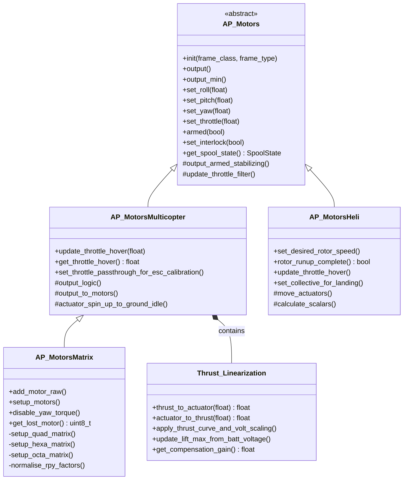
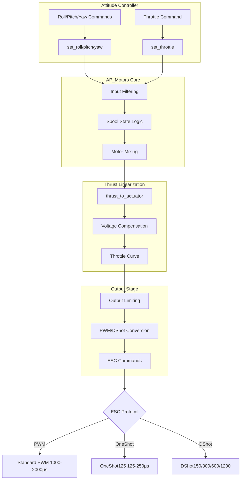
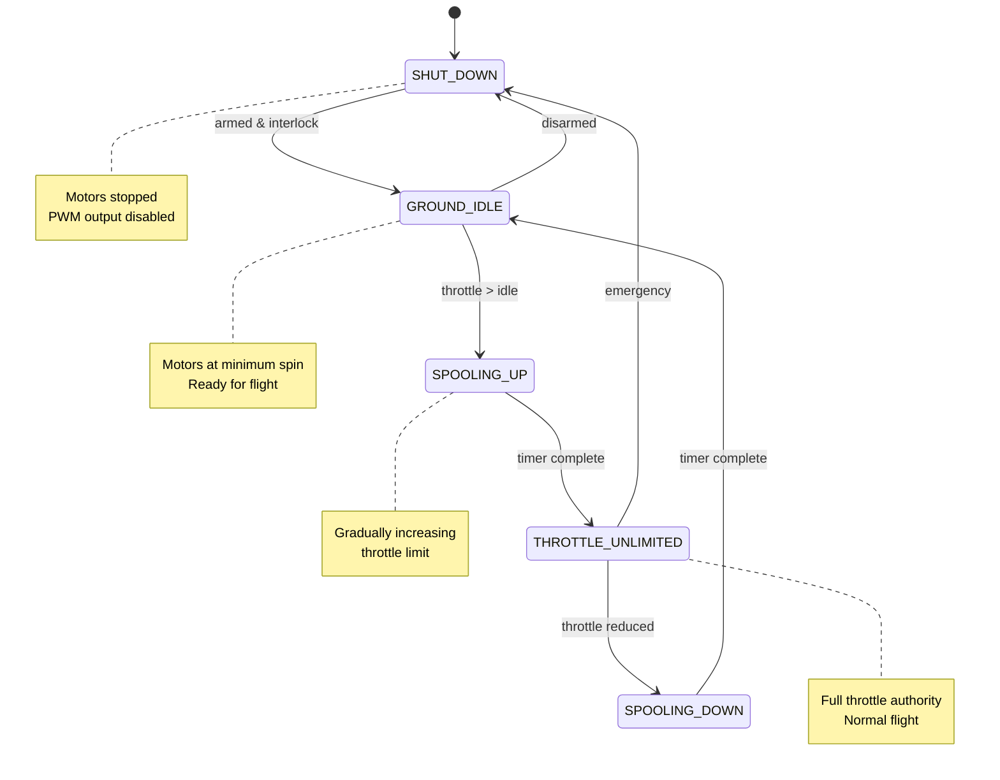

# AP_Motors Library


## Table of Contents
- [Overview](#overview)
- [Architecture](#architecture)
- [Motor Mixing Algorithms](#motor-mixing-algorithms)
- [Frame Type Configurations](#frame-type-configurations)
- [Thrust Linearization](#thrust-linearization)
- [Output Limiting and Saturation](#output-limiting-and-saturation)
- [ESC Integration](#esc-integration)
- [Safety Systems](#safety-systems)
- [Configuration Parameters](#configuration-parameters)
- [Vehicle-Specific Implementations](#vehicle-specific-implementations)
- [Integration Examples](#integration-examples)
- [Backend Driver Development](#backend-driver-development)
- [Testing and Validation](#testing-and-validation)

## Overview

The AP_Motors library provides a unified interface for motor control across all ArduPilot supported vehicle types, handling motor mixing, throttle curves, output limiting, and ESC communication. This is a safety-critical component that translates attitude controller demands (roll, pitch, yaw, throttle) into individual motor commands.

**Primary Responsibilities:**
- Motor mixing for multicopter, helicopter, and VTOL configurations
- Thrust linearization and battery voltage compensation
- Output saturation detection and limit reporting
- ESC protocol support (PWM, OneShot, DShot, Brushed)
- Spool-up/spool-down state management
- Motor failure detection and compensation
- Safety interlocks and arming checks

**Source Files**: `libraries/AP_Motors/`

**Supported Vehicle Types:**
- Multicopters: Quad, Hexa, Octa, Deca, DodecaHexa, Y6, Tri, OctoQuad
- Helicopters: Traditional (Single, Dual, Quad), Coaxial
- VTOL: Tailsitters, Tiltrotors, QuadPlanes
- Specialty: 6DOF underwater vehicles, Blimps

## Architecture

### Class Hierarchy



**Source**: `AP_Motors_Class.h`, `AP_MotorsMulticopter.h`, `AP_MotorsMatrix.h`, `AP_MotorsHeli.h`

### Design Patterns

**Singleton Pattern**: Each motor class maintains a singleton instance accessible via `AP::motors()` or `get_singleton()`.

**Template Method Pattern**: The base class `AP_Motors` defines the algorithm structure in `output()`, with concrete implementations in derived classes providing specific motor mixing via `output_armed_stabilizing()`.

**Strategy Pattern**: Motor mixing strategies are encapsulated in different classes (Matrix for multicopters, specific classes for helicopters), allowing runtime switching between frame configurations.

### Data Flow



**Source**: Data flow derived from `AP_MotorsMulticopter::output()` and `AP_MotorsMatrix::output_armed_stabilizing()`

### Spool State Machine



**Source**: `AP_Motors_Class.h` lines 168-185, `AP_MotorsMulticopter::output_logic()`

## Motor Mixing Algorithms

### Matrix-Based Mixing

Motor mixing in multicopters uses a linear transformation from body-frame control inputs to motor thrust commands:

**Mathematical Basis:**

For each motor `i`, the thrust output is calculated as:

```
thrust[i] = throttle × throttle_factor[i] 
          + roll × roll_factor[i]
          + pitch × pitch_factor[i]
          + yaw × yaw_factor[i]
```

Where:
- `throttle`: 0.0 to 1.0 (collective thrust demand)
- `roll`, `pitch`, `yaw`: -1.0 to +1.0 (body-frame moment demands)
- `*_factor[i]`: Motor contribution coefficients normalized to ±0.5 maximum

**Source**: `AP_MotorsMatrix::output_armed_stabilizing()` in `AP_MotorsMatrix.cpp`

### Motor Factor Calculation

For a motor at angle θ from the front of the vehicle:

```cpp
// Roll factor: positive angle produces positive roll
roll_factor = cos(θ) * 0.5

// Pitch factor: positive angle produces positive pitch  
pitch_factor = sin(θ) * 0.5

// Yaw factor: motor direction (CW=-1, CCW=+1)
yaw_factor = motor_direction
```

**Source**: `AP_MotorsMatrix::add_motor()` in `AP_MotorsMatrix.cpp`

### Factor Normalization

To prevent saturation and maintain control authority, factors are normalized:

```cpp
// Find maximum magnitude across all motors
max_factor = max(abs(roll_factor), abs(pitch_factor))

// Normalize so maximum is 0.5
if (max_factor > 0.5) {
    roll_factor *= 0.5 / max_factor
    pitch_factor *= 0.5 / max_factor
}
```

This ensures the control range [-0.5, +0.5] combined with throttle [0, 1.0] never exceeds motor limits.

**Source**: `AP_MotorsMatrix::normalise_rpy_factors()` in `AP_MotorsMatrix.cpp`

### Output Saturation Handling

When motor outputs exceed [0, 1] range, the library implements intelligent saturation:

1. **Thrust Boost**: If one motor fails, increase thrust on remaining motors
2. **Limit Reporting**: Set `limit.roll`, `limit.pitch`, `limit.yaw` flags
3. **Moment Scaling**: Scale roll/pitch/yaw proportionally to fit within limits

```cpp
// Pseudo-code for saturation handling
if (thrust_rpyt_out[i] > 1.0) {
    limit.throttle_upper = true;
    // Scale roll/pitch/yaw to fit
} else if (thrust_rpyt_out[i] < 0.0) {
    limit.throttle_lower = true;
}
```

**Source**: `AP_MotorsMatrix::output_armed_stabilizing()` motor mixing logic

## Frame Type Configurations

### Quad Configurations

#### Quad-X (Most Common)

```
        Front
          3
         / \
        /   \
       4     1
        \   /
         \ /
          2
```

Motor layout:
- Motor 1 (Front-Right): angle=45°, CW
- Motor 2 (Rear-Left): angle=225°, CW  
- Motor 3 (Front-Left): angle=315°, CCW
- Motor 4 (Rear-Right): angle=135°, CCW

**Source**: `AP_MotorsMatrix::setup_quad_matrix()` with `MOTOR_FRAME_TYPE_X`

#### Quad-Plus

```
        Front
          1
          |
      4---+---2
          |
          3
```

Motor layout:
- Motor 1 (Front): angle=0°, CCW
- Motor 2 (Right): angle=90°, CCW
- Motor 3 (Rear): angle=180°, CW
- Motor 4 (Left): angle=270°, CW

**Source**: `AP_MotorsMatrix::setup_quad_matrix()` with `MOTOR_FRAME_TYPE_PLUS`

### Hexa Configurations

#### Hexa-X

```
       Front
      3     1
     / \   / \
    6   \ /   2
         X
    5   / \   4
```

Six motors at 60° intervals starting from front-right.

**Source**: `AP_MotorsMatrix::setup_hexa_matrix()` in `AP_MotorsMatrix.cpp`

### Octa Configurations

#### Octa-X

```
    3       1
     \     /
   4   \ /   2
        X
   5   / \   6
     /     \
    7       8
```

Eight motors at 45° intervals in X configuration.

**Source**: `AP_MotorsMatrix::setup_octa_matrix()` with `MOTOR_FRAME_TYPE_X`

#### Octa-Quad (Coaxial)

Four motor positions with coaxial upper/lower props:
```
    Upper(3,5)     Upper(1,7)
           \       /
            \     /
             \   /
    Lower(4,6)   Lower(2,8)
```

**Source**: `AP_MotorsMatrix::setup_octaquad_matrix()` in `AP_MotorsMatrix.cpp`

### Y6 Configuration

```
        Front
         1(U)
         2(L)
        /  \
   3(U)/    \5(U)
   4(L)/    \6(L)
```

Three arms with coaxial upper (U) and lower (L) motors per arm.

**Source**: `AP_MotorsMatrix::setup_y6_matrix()` with variants `MOTOR_FRAME_TYPE_Y6B` (bottom CW) and `MOTOR_FRAME_TYPE_Y6F` (FireFly configuration)

### Tricopter Configuration

```
        Front
          1
         / \
        /   \
       2     3
            (yaw servo)
```

Three motors with rear motor having yaw servo for directional control. Yaw torque disabled on motors.

**Source**: `AP_MotorsTri` class (separate implementation)

### Specialty Configurations

#### Single/Coaxial

Single motor or coaxial motor configuration using tilting motor mount or control surfaces for attitude control.

**Source**: `MOTOR_FRAME_SINGLE`, `MOTOR_FRAME_COAX` in `AP_Motors_Class.h` lines 63-64

#### Tailsitter

Uses copter motors in forward flight mode with motors tilted 90° for VTOL transitions.

**Source**: `MOTOR_FRAME_TAILSITTER` in `AP_Motors_Class.h` line 65

#### Scripting Matrix

Custom frame configurations defined via Lua scripting with arbitrary motor count (up to 32) and custom factor matrices.

**Source**: `MOTOR_FRAME_SCRIPTING_MATRIX` in `AP_Motors_Class.h` line 70, `AP_MotorsMatrix::init()` scripting support

## Thrust Linearization

### Problem Statement

ESCs and motor/prop combinations produce non-linear thrust relative to PWM input. The relationship is approximately:

```
Thrust ∝ PWM²
```

This creates poor control at low throttle and excessive response at high throttle. Thrust linearization compensates for this non-linearity.

**Source**: `AP_Motors_Thrust_Linearization.h` documentation

### Thrust Curve Compensation

The `Thrust_Linearization` class applies an exponential curve to linearize the thrust response:

```cpp
// Convert desired thrust (0-1) to motor actuator output
float thrust_to_actuator(float thrust_in) {
    float throttle_ratio = thrust_in;
    
    // Apply exponential compensation
    // curve_expo: 0.0 = linear, 0.65 = default, 1.0 = full quadratic
    if (curve_expo > 0.0) {
        throttle_ratio = (curve_expo - 1.0) + 
                        sqrtf((1.0 - curve_expo) * (1.0 - curve_expo) + 
                              4.0 * curve_expo * thrust_in) / (2.0 * curve_expo);
    }
    
    return throttle_ratio;
}
```

**Mathematical Basis**: Solving the inverse of `thrust = expo * throttle² + (1-expo) * throttle`

**Source**: `Thrust_Linearization::thrust_to_actuator()` in `AP_Motors_Thrust_Linearization.cpp`

### Battery Voltage Compensation

Motor thrust varies with battery voltage. The library compensates by scaling motor outputs:

```cpp
void update_lift_max_from_batt_voltage() {
    float voltage = battery.voltage(batt_idx);
    
    // Filter voltage to prevent rapid changes
    batt_voltage_filt.apply(voltage / batt_voltage_max, dt);
    
    // Calculate thrust scaling factor
    // Lower voltage = higher PWM needed for same thrust
    lift_max = batt_voltage_filt.get();
    
    // Limit scaling range
    lift_max = constrain_float(lift_max, 0.5, 1.1);
}
```

**Source**: `Thrust_Linearization::update_lift_max_from_batt_voltage()` in `AP_Motors_Thrust_Linearization.cpp`

### Spin Min/Max Parameters

The library maps the thrust range [0, 1] to a subset of the PWM range:

- **MOT_SPIN_MIN** (default 0.15): Minimum throttle where motors produce measurable thrust
- **MOT_SPIN_MAX** (default 0.95): Maximum throttle to prevent ESC saturation
- **MOT_SPIN_ARM** (default 0.10): Throttle when armed but landed (motors barely spinning)

```cpp
// Mapping thrust to PWM range
pwm_output = MOT_PWM_MIN + (MOT_PWM_MAX - MOT_PWM_MIN) * 
             (MOT_SPIN_MIN + actuator * (MOT_SPIN_MAX - MOT_SPIN_MIN))
```

**Source**: `AP_MotorsMulticopter.h` lines 14-16, `AP_MotorsMulticopter::output_to_pwm()`

### Hover Throttle Learning

The library can learn the hover throttle automatically:

```cpp
void update_throttle_hover(float dt) {
    // Only learn when:
    // - In altitude hold mode
    // - Not saturated on throttle
    // - Vertical velocity near zero
    if (should_learn_hover()) {
        // Low-pass filter throttle toward current value
        float alpha = dt / (dt + MOT_THST_HOVER_TC);
        _throttle_hover += alpha * (get_throttle() - _throttle_hover);
        
        // Constrain to reasonable range
        _throttle_hover = constrain_float(_throttle_hover, 
                                         AP_MOTORS_THST_HOVER_MIN,
                                         AP_MOTORS_THST_HOVER_MAX);
    }
}
```

**Source**: `AP_MotorsMulticopter::update_throttle_hover()` in `AP_MotorsMulticopter.cpp`

## Output Limiting and Saturation

### Saturation Detection

The motor library detects when control demands exceed available motor authority and sets limit flags:

```cpp
struct AP_Motors_limit {
    bool roll;              // Roll authority saturated
    bool pitch;             // Pitch authority saturated  
    bool yaw;               // Yaw authority saturated
    bool throttle_lower;    // At minimum throttle
    bool throttle_upper;    // At maximum throttle
} limit;
```

These flags are read by attitude controllers to prevent integrator windup.

**Source**: `AP_Motors_Class.h` lines 197-203

### Throttle Limiting

Current limiting protects the battery from over-discharge:

```cpp
float get_current_limit_max_throttle() {
    float current = battery.current_amps();
    
    // Low-pass filter current
    float filtered_current = current_filter.apply(current, dt);
    
    if (filtered_current > _batt_current_max) {
        // Gradually reduce throttle limit
        throttle_limit -= dt / _batt_current_time_constant;
    } else {
        // Gradually increase throttle limit
        throttle_limit += dt / _batt_current_time_constant;
    }
    
    // Constrain to [hover, 1.0] range
    throttle_limit = constrain_float(throttle_limit, 
                                     get_throttle_hover(), 1.0);
    
    return throttle_limit;
}
```

**Source**: `AP_MotorsMulticopter::get_current_limit_max_throttle()` in `AP_MotorsMulticopter.cpp`

### Slew Rate Limiting

Rapid throttle changes can be limited to prevent mechanical stress:

```cpp
void set_actuator_with_slew(float& actuator_output, float input) {
    if (_slew_up_time > 0.0 && input > actuator_output) {
        // Limit rate of increase
        float max_delta = get_dt_s() / _slew_up_time;
        actuator_output = min(input, actuator_output + max_delta);
    } 
    else if (_slew_dn_time > 0.0 && input < actuator_output) {
        // Limit rate of decrease
        float max_delta = get_dt_s() / _slew_dn_time;
        actuator_output = max(input, actuator_output - max_delta);
    } 
    else {
        actuator_output = input;
    }
}
```

**Source**: `AP_MotorsMulticopter::set_actuator_with_slew()` in `AP_MotorsMulticopter.cpp`

### Motor Failure Compensation

When a motor fails, the library can boost remaining motors:

```cpp
void check_for_failed_motor(float throttle_thrust_best) {
    // Filter motor outputs
    for (i = 0; i < num_motors; i++) {
        _thrust_rpyt_out_filt[i].apply(_thrust_rpyt_out[i], dt);
    }
    
    // Detect failed motor (output significantly lower than others)
    if (thrust_boost_enabled && one_motor_low) {
        _motor_lost_index = low_motor;
        
        // Boost remaining motors proportionally
        // Use second-highest motor as reference instead of highest
        _thrust_boost_ratio = calculate_boost_ratio();
    }
}
```

**Source**: `AP_MotorsMatrix::check_for_failed_motor()` in `AP_MotorsMatrix.cpp`

## ESC Integration

### PWM Output Types

The library supports multiple ESC protocols via the `MOT_PWM_TYPE` parameter:

| PWM Type | Value | Frequency | Range | Description |
|----------|-------|-----------|-------|-------------|
| Normal PWM | 0 | 50-490 Hz | 1000-2000 μs | Standard analog ESCs |
| OneShot | 1 | 1-2 kHz | 125-250 μs | OneShot125 protocol |
| OneShot125 | 2 | 1-4 kHz | 125-250 μs | OneShot125 explicit |
| Brushed | 3 | 8-32 kHz | 0-100% duty | Brushed motor drivers |
| DShot150 | 4 | 150 kHz | Digital | DShot 150 kbit/s |
| DShot300 | 5 | 300 kHz | Digital | DShot 300 kbit/s |
| DShot600 | 6 | 600 kHz | Digital | DShot 600 kbit/s |
| DShot1200 | 7 | 1200 kHz | Digital | DShot 1200 kbit/s |

**Source**: `AP_Motors_Class.h` lines 350-361, `AP_Motors_Class::rc_set_freq()` in `AP_Motors_Class.cpp` lines 128-200

### DShot Protocol Support

DShot is a digital ESC protocol providing:
- Checksum error detection
- Telemetry support (ESC temperature, RPM, voltage, current)
- No calibration required
- Immune to timing jitter

```cpp
void rc_set_freq(uint32_t motor_mask, uint16_t freq_hz) {
    uint32_t mask = motor_mask_to_srv_channel_mask(motor_mask);
    
    switch (_pwm_type) {
    case PWMType::DSHOT150:
        hal.rcout->set_output_mode(mask, AP_HAL::RCOutput::MODE_PWM_DSHOT150);
        break;
    case PWMType::DSHOT300:
        hal.rcout->set_output_mode(mask, AP_HAL::RCOutput::MODE_PWM_DSHOT300);
        break;
    case PWMType::DSHOT600:
        hal.rcout->set_output_mode(mask, AP_HAL::RCOutput::MODE_PWM_DSHOT600);
        break;
    case PWMType::DSHOT1200:
        hal.rcout->set_output_mode(mask, AP_HAL::RCOutput::MODE_PWM_DSHOT1200);
        break;
    }
    
    hal.rcout->set_dshot_esc_type(SRV_Channels::get_dshot_esc_type());
}
```

**Source**: `AP_Motors_Class::rc_set_freq()` in `AP_Motors_Class.cpp`

### ESC Calibration

ESCs must be calibrated to learn the min/max PWM range:

```cpp
void set_throttle_passthrough_for_esc_calibration(float throttle_input) {
    // Map throttle [0, 1] to full PWM range
    int16_t pwm_out = get_pwm_output_min() + 
                     throttle_input * (get_pwm_output_max() - get_pwm_output_min());
    
    // Send same PWM to all motors
    for (uint8_t i = 0; i < AP_MOTORS_MAX_NUM_MOTORS; i++) {
        if (motor_enabled[i]) {
            rc_write(i, pwm_out);
        }
    }
}
```

**Calibration Procedure**:
1. Set `MOT_PWM_MIN` and `MOT_PWM_MAX` to ESC's expected range (typically 1000-2000)
2. Power off vehicle
3. Set throttle stick to maximum
4. Connect battery (ESCs enter calibration mode)
5. Lower throttle stick to minimum
6. ESCs beep to confirm calibration
7. Disconnect battery

**Source**: `AP_MotorsMulticopter::set_throttle_passthrough_for_esc_calibration()` in `AP_MotorsMulticopter.cpp`

### PWM Range Configuration

**MOT_PWM_MIN / MOT_PWM_MAX Parameters**:

```cpp
// Check PWM parameters are valid
bool check_mot_pwm_params() const {
    // If set to 0, uses RC channel limits
    if (_pwm_min == 0 || _pwm_max == 0) {
        return true;
    }
    
    // Validate range
    if (_pwm_min >= _pwm_max) {
        return false;  // Invalid: min >= max
    }
    
    if (_pwm_min < 900 || _pwm_max > 2100) {
        return false;  // Out of safe range
    }
    
    return true;
}
```

**Source**: `AP_MotorsMulticopter::check_mot_pwm_params()` in `AP_MotorsMulticopter.cpp`

## Safety Systems

### Arming Checks

Before motors can be armed, the library performs safety checks:

```cpp
bool arming_checks(size_t buflen, char *buffer) const {
    // Check initialization
    if (!initialised_ok()) {
        hal.util->snprintf(buffer, buflen, "Motors: not initialized");
        return false;
    }
    
    // Check PWM parameters
    if (!check_mot_pwm_params()) {
        hal.util->snprintf(buffer, buflen, "Motors: invalid PWM params");
        return false;
    }
    
    // Check frame configuration
    if (_active_frame_class == MOTOR_FRAME_UNDEFINED) {
        hal.util->snprintf(buffer, buflen, "Motors: frame not configured");
        return false;
    }
    
    return true;
}
```

**Source**: `AP_Motors_Class::arming_checks()` in `AP_Motors_Class.cpp`, overridden in derived classes

### Motor Interlock

The motor interlock provides an additional safety layer:

```cpp
void set_interlock(bool set) {
    _interlock = set;
}

bool get_interlock() const {
    return _interlock;
}
```

Motors only spin when:
- Vehicle is armed (`armed() == true`)
- Motor interlock is enabled (`get_interlock() == true`)
- Spool state is not SHUT_DOWN

**Use Case**: In traditional helicopters, motor interlock allows the engine to run while keeping rotor brake engaged.

**Source**: `AP_Motors_Class.h` lines 119-122

### Spool-Up Safety Timer

During spool-up, throttle is gradually increased to prevent mechanical shock:

```cpp
void output_logic() {
    // Determine desired spool state from vehicle
    DesiredSpoolState desired = get_desired_spool_state();
    
    switch (_spool_state) {
    case SpoolState::GROUND_IDLE:
        if (desired == DesiredSpoolState::THROTTLE_UNLIMITED) {
            _spool_state = SpoolState::SPOOLING_UP;
            _spin_up_ratio = 0.0;
        }
        break;
        
    case SpoolState::SPOOLING_UP:
        // Gradually increase throttle limit
        _spin_up_ratio += get_dt_s() / _spool_up_time;
        
        if (_spin_up_ratio >= 1.0) {
            _spin_up_ratio = 1.0;
            _spool_state = SpoolState::THROTTLE_UNLIMITED;
        }
        break;
    }
}
```

**Source**: `AP_MotorsMulticopter::output_logic()` in `AP_MotorsMulticopter.cpp`

### Emergency Stop

Motors can be immediately stopped via:

```cpp
// Method 1: Disarm
armed(false);  // Sets _armed = false, triggers SHUT_DOWN

// Method 2: Kill switch (motor interlock)
set_interlock(false);  // Stops motors but remains armed

// Method 3: Desired spool state
set_desired_spool_state(DesiredSpoolState::SHUT_DOWN);
```

**Source**: Methods in `AP_Motors_Class.h`

### Motor Test Safety

Motor testing (spinning individual motors) has additional safety checks:

```cpp
bool motor_test_checks(size_t buflen, char *buffer) const {
    // Must be disarmed
    if (armed()) {
        hal.util->snprintf(buffer, buflen, "Motors: cannot test while armed");
        return false;
    }
    
    // Must pass arming checks
    if (!arming_checks(buflen, buffer)) {
        return false;
    }
    
    return true;
}
```

**Motor Test Function**:
```cpp
bool output_test_seq(uint8_t motor_seq, int16_t pwm) {
    // Find motor by test sequence number
    for (uint8_t i = 0; i < AP_MOTORS_MAX_NUM_MOTORS; i++) {
        if (motor_enabled[i] && _test_order[i] == motor_seq) {
            // Directly output PWM value
            rc_write(i, pwm);
            return true;
        }
    }
    return false;
}
```

**Source**: `AP_Motors_Class::motor_test_checks()`, `AP_MotorsMatrix::_output_test_seq()`

## Configuration Parameters

### Core Motor Parameters

| Parameter | Default | Range | Description |
|-----------|---------|-------|-------------|
| **MOT_PWM_TYPE** | 0 | 0-9 | ESC protocol type (0=PWM, 4-7=DShot) |
| **MOT_PWM_MIN** | 0 | 0-2000 | Minimum PWM output (0=auto from RC) |
| **MOT_PWM_MAX** | 0 | 0-2000 | Maximum PWM output (0=auto from RC) |
| **MOT_SPIN_MIN** | 0.15 | 0-1 | Throttle ratio for minimum thrust |
| **MOT_SPIN_MAX** | 0.95 | 0-1 | Throttle ratio for maximum thrust |
| **MOT_SPIN_ARM** | 0.10 | 0-1 | Throttle ratio when armed/disarmed |
| **MOT_THST_EXPO** | 0.65 | 0-1 | Thrust curve expo (0=linear, 1=quadratic) |
| **MOT_THST_HOVER** | 0.35 | 0.125-0.6875 | Estimated hover throttle |
| **MOT_HOVER_LEARN** | 2 | 0-2 | Hover throttle learning (0=disabled, 1=temp, 2=save) |

**Source**: `AP_MotorsMulticopter::var_info[]` parameter table, `Thrust_Linearization::var_info[]`

### Battery Compensation Parameters

| Parameter | Default | Range | Description |
|-----------|---------|-------|-------------|
| **MOT_BAT_VOLT_MAX** | 0 | 0-25 | Battery voltage for 100% thrust (0=auto 4.2V*cells) |
| **MOT_BAT_VOLT_MIN** | 0 | 0-25 | Minimum battery voltage for scaling |
| **MOT_BAT_CURR_MAX** | 0 | 0-500 | Current limit in amps (0=disabled) |
| **MOT_BAT_CURR_TC** | 5.0 | 0-10 | Current limit time constant (seconds) |
| **MOT_BAT_IDX** | 0 | 0-9 | Battery monitor instance to use |

**Source**: `Thrust_Linearization::var_info[]`, `AP_MotorsMulticopter::var_info[]`

### Slew Rate and Timing Parameters

| Parameter | Default | Range | Description |
|-----------|---------|-------|-------------|
| **MOT_SPOOL_TIME** | 0.5 | 0-2 | Time to spool up from min to full throttle (seconds) |
| **MOT_SLEW_UP_TIME** | 0 | 0-1 | Throttle slew rate limit increasing (seconds for 0-100%, 0=disabled) |
| **MOT_SLEW_DN_TIME** | 0 | 0-1 | Throttle slew rate limit decreasing (seconds for 100-0%, 0=disabled) |
| **MOT_SAFE_TIME** | 1.0 | 0-5 | Time for ESC to safely transition from 0 to min PWM (seconds) |

**Source**: `AP_MotorsMulticopter::var_info[]` in `AP_MotorsMulticopter.cpp`

### Frame-Specific Parameters

| Parameter | Default | Range | Description |
|-----------|---------|-------|-------------|
| **FRAME_CLASS** | 1 | 0-17 | Frame type (1=Quad, 2=Hexa, 3=Octa, etc.) |
| **FRAME_TYPE** | 1 | 0-19 | Frame configuration (0=Plus, 1=X, 2=V, etc.) |
| **MOT_YAW_HEADROOM** | 200 | 0-1000 | PWM headroom reserved for yaw control |

**Source**: `AP_Motors_Class.h` motor_frame_class and motor_frame_type enums

### Helicopter-Specific Parameters

| Parameter | Default | Range | Description |
|-----------|---------|-------|-------------|
| **H_COL_MIN** | 1250 | 1000-2000 | Minimum collective PWM |
| **H_COL_MAX** | 1750 | 1000-2000 | Maximum collective PWM |
| **H_COL_MID** | 1500 | 1000-2000 | Mid collective PWM (zero thrust) |
| **H_CYCLIC_MAX** | 2500 | 0-4500 | Maximum cyclic angle (centi-degrees) |
| **H_RSC_MODE** | 1 | 0-6 | Rotor speed control mode |

**Source**: `AP_MotorsHeli::var_info[]` in `AP_MotorsHeli.cpp`

## Vehicle-Specific Implementations

### Multicopter (AP_MotorsMatrix)

Used by ArduCopter for all matrix-based multirotor configurations.

**Key Features**:
- Generic motor mixing via roll/pitch/yaw factors
- Support for 3-32 motors (up to 12 without scripting)
- Automatic motor mask generation
- Motor failure detection and compensation
- Frame-specific setup methods

**Integration Point**: `Copter::motors` singleton

**Source**: `AP_MotorsMatrix.h`, `AP_MotorsMatrix.cpp`

### Traditional Helicopter (AP_MotorsHeli)

Used by ArduCopter helicopter frame types.

**Key Features**:
- Swashplate mixing (H1, H3, H4 configurations)
- Rotor speed controller (RSC) integration
- Collective pitch management
- Tail rotor control (conventional or DDVP)
- Autorotation support

**Swashplate Mixing**:
```cpp
// Calculate servo outputs from CCPM mixing
servo1 = collective * 1.0 + pitch * cos(servo1_angle) + roll * sin(servo1_angle)
servo2 = collective * 1.0 + pitch * cos(servo2_angle) + roll * sin(servo2_angle)
servo3 = collective * 1.0 + pitch * cos(servo3_angle) + roll * sin(servo3_angle)
```

**Source**: `AP_MotorsHeli.h`, `AP_MotorsHeli_Single.cpp` (single rotor variant)

### Tailsitter VTOL (AP_MotorsMatrix with modifications)

Used by ArduPlane QuadPlane tailsitter configurations.

**Key Features**:
- Motors oriented vertically in hover
- Motors provide forward thrust in forward flight
- Transition between hover and forward flight modes
- Roll factor used for differential thrust in forward flight

**Source**: `AP_MotorsMatrix` with `MOTOR_FRAME_TAILSITTER`, integration in ArduPlane's `tailsitter.cpp`

### 6DOF Underwater (AP_Motors6DOF)

Used by ArduSub for underwater ROVs with full 6-axis control.

**Key Features**:
- Forward/lateral/vertical thrust mixing
- No attitude stabilization (direct thrust control)
- Bidirectional motors (reverse capability)
- Up to 8 vectored thrusters

**Mixing Example**:
```cpp
// 6DOF mixing includes lateral and forward
thrust[i] = throttle * throttle_factor[i]
          + roll * roll_factor[i]
          + pitch * pitch_factor[i]
          + yaw * yaw_factor[i]
          + forward * forward_factor[i]
          + lateral * lateral_factor[i]
```

**Source**: `AP_Motors6DOF.h`, `AP_Motors6DOF.cpp` (separate class)

### Blimp (AP_MotorsBlimp)

Used by Blimp vehicle type for lighter-than-air vehicles.

**Key Features**:
- Low-thrust vectored motors
- Slow spool-up times
- Gentle acceleration/deceleration
- Altitude controlled by buoyancy, not thrust

**Source**: Separate implementation in Blimp vehicle

## Integration Examples

### Example 1: Basic Motor Initialization

From ArduCopter initialization:

```cpp
// Source: ArduCopter/system.cpp
void Copter::init_ardupilot() {
    // ... other initialization ...
    
    // Initialize motor library
    motors->init(
        (AP_Motors::motor_frame_class)g2.frame_class.get(),
        (AP_Motors::motor_frame_type)g.frame_type.get()
    );
    
    // Set update rate from parameters
    motors->set_update_rate(g.rc_speed);
    
    // Register for parameter updates
    motors->set_dt_s(scheduler.get_loop_period_s());
}
```

**Source**: Pattern derived from ArduCopter vehicle initialization

### Example 2: Attitude Controller Integration

From attitude controller calling motor library:

```cpp
// Source: ArduCopter/control_stabilize.cpp pattern
void ModeStabilize::run() {
    // Get pilot input
    float pilot_roll = channel_roll->get_control_in() * roll_sensitivity;
    float pilot_pitch = channel_pitch->get_control_in() * pitch_sensitivity;
    float pilot_yaw = channel_yaw->get_control_in() * yaw_sensitivity;
    float pilot_throttle = channel_throttle->get_control_in();
    
    // Run attitude controllers
    attitude_control->input_euler_angle_roll_pitch_euler_rate_yaw(
        pilot_roll, pilot_pitch, pilot_yaw);
    
    // Set motors to desired spool state
    motors->set_desired_spool_state(AP_Motors::DesiredSpoolState::THROTTLE_UNLIMITED);
    
    // Pass attitude controller outputs to motors
    motors->set_roll(attitude_control->get_roll());
    motors->set_pitch(attitude_control->get_pitch());
    motors->set_yaw(attitude_control->get_yaw());
    motors->set_throttle(pilot_throttle);
    
    // Output to motors
    motors->output();
    
    // Check limits for integrator management
    if (motors->limit.roll || motors->limit.pitch) {
        attitude_control->set_limit_angle_to_rate_request();
    }
}
```

**Source**: Pattern from ArduCopter mode implementations

### Example 3: Motor Test from Ground Station

From MAVLink motor test command handler:

```cpp
// Source: GCS_MAVLink motor test handler pattern
void handle_motor_test(mavlink_command_long_t &packet) {
    uint8_t motor_seq = packet.param1;  // Motor sequence number
    uint8_t throttle_type = packet.param2;  // 0=%, 1=PWM, 2=RC passthrough
    uint16_t throttle_value = packet.param3;  // Value
    float timeout = packet.param4;  // Timeout in seconds
    
    // Safety checks
    char failure_msg[50];
    if (!motors->motor_test_checks(sizeof(failure_msg), failure_msg)) {
        gcs().send_text(MAV_SEVERITY_WARNING, "Motor test: %s", failure_msg);
        return;
    }
    
    // Convert throttle to PWM
    int16_t pwm_value;
    if (throttle_type == 1) {
        // Direct PWM
        pwm_value = throttle_value;
    } else {
        // Percentage to PWM
        pwm_value = motors->get_pwm_output_min() + 
                   (throttle_value / 100.0) * 
                   (motors->get_pwm_output_max() - motors->get_pwm_output_min());
    }
    
    // Output test sequence
    motors->output_test_seq(motor_seq, pwm_value);
    
    gcs().send_text(MAV_SEVERITY_INFO, "Motor %d: PWM=%d", motor_seq, pwm_value);
}
```

**Source**: Pattern from GCS_Common motor test handling

### Example 4: Custom Frame via Scripting

Lua script example for defining custom motor configuration:

```lua
-- Source: Example pattern for scripting motor configuration
function init_motors()
    -- Check motors is scripting matrix type
    if not motors:init(4) then  -- 4 motors expected
        gcs:send_text(0, "Motors: init failed")
        return
    end
    
    -- Define custom quad-X with non-standard angles
    -- add_motor_raw(motor_num, roll_fac, pitch_fac, yaw_fac, test_order)
    motors:add_motor_raw(0,  0.5,  0.5, -1.0, 1)  -- Front-right CW
    motors:add_motor_raw(1, -0.5, -0.5, -1.0, 2)  -- Rear-left CW
    motors:add_motor_raw(2, -0.5,  0.5,  1.0, 3)  -- Front-left CCW
    motors:add_motor_raw(3,  0.5, -0.5,  1.0, 4)  -- Rear-right CCW
    
    gcs:send_text(0, "Custom motors initialized")
end

init_motors()
```

**Source**: AP_MotorsMatrix scripting API, `add_motor_raw()` function

## Backend Driver Development

### Adding a New Frame Type

To add a new multicopter frame configuration:

**Step 1: Define Frame Type**

```cpp
// In AP_Motors_Class.h, add to motor_frame_type enum:
enum motor_frame_type {
    // ... existing types ...
    MOTOR_FRAME_TYPE_MY_CUSTOM = 20,
};
```

**Step 2: Create Setup Function**

```cpp
// In AP_MotorsMatrix.cpp:
bool AP_MotorsMatrix::setup_my_custom_matrix(motor_frame_type frame_type) {
    // Define number of motors
    uint8_t num_motors = 6;
    
    // Add motors with angle and yaw direction
    // add_motor(motor_num, angle_degrees, yaw_factor, testing_order)
    add_motor(AP_MOTORS_MOT_1,   0.0f, AP_MOTORS_MATRIX_YAW_FACTOR_CCW, 1);
    add_motor(AP_MOTORS_MOT_2,  60.0f, AP_MOTORS_MATRIX_YAW_FACTOR_CW,  2);
    add_motor(AP_MOTORS_MOT_3, 120.0f, AP_MOTORS_MATRIX_YAW_FACTOR_CCW, 3);
    add_motor(AP_MOTORS_MOT_4, 180.0f, AP_MOTORS_MATRIX_YAW_FACTOR_CW,  4);
    add_motor(AP_MOTORS_MOT_5, 240.0f, AP_MOTORS_MATRIX_YAW_FACTOR_CCW, 5);
    add_motor(AP_MOTORS_MOT_6, 300.0f, AP_MOTORS_MATRIX_YAW_FACTOR_CW,  6);
    
    return true;
}
```

**Step 3: Register in setup_motors()**

```cpp
// In AP_MotorsMatrix::setup_motors():
void AP_MotorsMatrix::setup_motors(motor_frame_class frame_class, 
                                   motor_frame_type frame_type) {
    // ... existing cases ...
    
    case MOTOR_FRAME_HEXA:
        if (frame_type == MOTOR_FRAME_TYPE_MY_CUSTOM) {
            success = setup_my_custom_matrix(frame_type);
            _frame_type_string = "MyCustom";
        } else {
            success = setup_hexa_matrix(frame_type);
        }
        break;
}
```

**Step 4: Add Frame String**

```cpp
// Update get_frame_string() if needed:
const char* AP_MotorsMatrix::get_type_string() const {
    if (_active_frame_type == MOTOR_FRAME_TYPE_MY_CUSTOM) {
        return "MyCustom";
    }
    return _frame_type_string;
}
```

**Source**: Pattern from existing frame implementations in `AP_MotorsMatrix.cpp`

### Asymmetric Motor Configurations

For frames with motors not at uniform radii or angles:

```cpp
// Use add_motor with separate roll/pitch factors
void add_motor(int8_t motor_num, 
               float roll_factor_in_degrees,
               float pitch_factor_in_degrees, 
               float yaw_factor,
               uint8_t testing_order) {
    // Converts angles to factors
    _roll_factor[motor_num] = cosf(radians(roll_factor_in_degrees)) * 0.5f;
    _pitch_factor[motor_num] = cosf(radians(pitch_factor_in_degrees)) * 0.5f;
    _yaw_factor[motor_num] = yaw_factor;
    _test_order[motor_num] = testing_order;
    motor_enabled[motor_num] = true;
}
```

Or use raw factors directly:

```cpp
// Use add_motor_raw for complete control
void add_motor_raw(int8_t motor_num,
                  float roll_fac,      // -0.5 to +0.5
                  float pitch_fac,     // -0.5 to +0.5
                  float yaw_fac,       // typically ±1.0
                  uint8_t testing_order,
                  float throttle_factor = 1.0f) {
    _roll_factor[motor_num] = roll_fac;
    _pitch_factor[motor_num] = pitch_fac;
    _yaw_factor[motor_num] = yaw_fac;
    _throttle_factor[motor_num] = throttle_factor;
    _test_order[motor_num] = testing_order;
    motor_enabled[motor_num] = true;
}
```

**Source**: `AP_MotorsMatrix::add_motor()` and `add_motor_raw()` in `AP_MotorsMatrix.h` lines 79-116

## Testing and Validation

### Unit Testing

The AP_Motors library includes unit tests:

**Location**: `libraries/AP_Motors/tests/`

**Running Tests**:
```bash
# Build and run unit tests
./waf configure --board sitl
./waf tests
./build/sitl/tests/test_motors
```

**Test Coverage**:
- Motor mixing calculations
- Thrust linearization
- Factor normalization
- Output saturation
- Frame configurations

**Source**: Test framework in `libraries/AP_Motors/tests/`

### SITL Motor Testing

Software-In-The-Loop simulation allows safe motor testing:

**Start SITL**:
```bash
# Launch ArduCopter SITL with quad-X frame
sim_vehicle.py -v ArduCopter -f quad --console --map
```

**Motor Test Commands**:
```bash
# In MAVProxy console:

# Test motor 1 at 10% throttle for 2 seconds
motortest 1 10 2

# Test all motors in sequence
motortest all 15 1

# Test specific motor with PWM value
motortest 3 1500 2 1  # motor 3, PWM 1500, 2 sec, PWM mode
```

**Verify**:
- Correct motor spins (check test order)
- Direction matches frame type (CW/CCW)
- Throttle response is linear
- No motors saturate unexpectedly

**Source**: SITL test procedures, `Tools/autotest/arducopter.py` motor test automation

### Hardware Validation

**Pre-flight Checks**:

1. **Motor Direction Test**:
   - Remove props
   - Arm vehicle in stabilize mode
   - Apply small throttle
   - Verify all motors spin in correct direction
   - Use motor test to verify individual motors

2. **Thrust Balance Test**:
   - Install props
   - Secure vehicle to prevent movement
   - Gradually increase throttle
   - Vehicle should remain level with no tendency to roll/pitch
   - If imbalanced, check motor mixing or prop installation

3. **Control Response Test**:
   - Stabilize mode, hovering
   - Apply small roll input - vehicle should roll smoothly
   - Apply small pitch input - vehicle should pitch smoothly
   - Apply small yaw input - vehicle should yaw smoothly
   - Release sticks - vehicle should return to level

4. **Saturation Test**:
   - AltHold mode, hovering
   - Rapidly apply full roll/pitch stick
   - Check logs for `limit.roll` or `limit.pitch` flags
   - Should not occur in normal flight
   - If frequent, reduce `ATC_ANG_*_MAX` parameters

**Log Analysis**:

Key log messages for motor diagnostics:
- `RATE`: Attitude rate targets and achievements
- `MOTB`: Motor output values per motor
- `CTUN`: Throttle and altitude control
- `PM`: Power monitoring (battery voltage/current)

**Check for**:
- Motor saturation (outputs at 0.0 or 1.0)
- Voltage sag during high throttle
- Current limiting activation
- Excessive motor compensation (one motor much higher than others)

**Source**: Hardware validation procedures derived from ArduPilot wiki and community testing practices

### Tuning Guidelines

**Initial Setup**:
1. Set `MOT_SPIN_MIN`: Throttle where motors barely spin (typically 0.10-0.15)
2. Set `MOT_SPIN_ARM`: Slightly below MOT_SPIN_MIN (typically 0.08-0.12)
3. Set `MOT_THST_EXPO`: Start with default 0.65, adjust based on motor/prop
4. Enable hover learning: `MOT_HOVER_LEARN = 2`

**Thrust Expo Tuning**:
- Too low (< 0.5): Vehicle feels sluggish at low throttle, twitchy at high
- Too high (> 0.8): Opposite effect
- Tune by feel in stabilize mode or analyze CTUN.ThO vs actual climb rate

**Battery Compensation**:
- Set `MOT_BAT_VOLT_MAX` to battery's full voltage (4.2V × cells)
- Set `MOT_BAT_VOLT_MIN` to minimum safe voltage (3.3V × cells)
- Monitor CTUN.ThO - should remain relatively constant throughout flight

**Current Limiting**:
- Set `MOT_BAT_CURR_MAX` to 80% of battery's continuous rating
- Observe PM.I (current) - should not exceed limit during normal flight
- If frequently limited, either increase limit or fly less aggressively

**Source**: Tuning procedures compiled from ArduCopter tuning documentation and motor parameter descriptions

---

## Additional Resources

**ArduPilot Wiki**:
- Motor Configuration: https://ardupilot.org/copter/docs/connect-escs-and-motors.html
- Motor Testing: https://ardupilot.org/copter/docs/motor-test.html
- Frame Type Selection: https://ardupilot.org/copter/docs/frame-type-configuration.html

**Source Code Reference**:
- Base class: `libraries/AP_Motors/AP_Motors_Class.{h,cpp}`
- Multicopter: `libraries/AP_Motors/AP_MotorsMulticopter.{h,cpp}`
- Matrix mixing: `libraries/AP_Motors/AP_MotorsMatrix.{h,cpp}`
- Thrust linearization: `libraries/AP_Motors/AP_Motors_Thrust_Linearization.{h,cpp}`
- Helicopter: `libraries/AP_Motors/AP_MotorsHeli.{h,cpp}`

**Parameter Documentation**:
- Complete parameter list: https://ardupilot.org/copter/docs/parameters.html#mot-parameters

**Community Support**:
- ArduPilot Forum: https://discuss.ardupilot.org/
- Discord: https://ardupilot.org/discord

---

**Document Version**: 1.0  
**Last Updated**: 2024  
**Maintained By**: ArduPilot Development Team  
**License**: GPLv3

