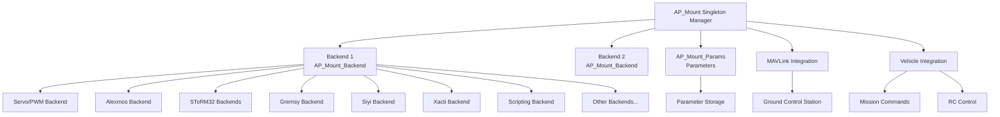

# AP_Mount

## Overview

The AP_Mount library provides comprehensive control for 2-axis and 3-axis camera gimbals and mount systems in ArduPilot. It enables stabilized camera pointing, region-of-interest (ROI) tracking, autonomous mission integration, and manual RC control across multiple gimbal protocols and manufacturers. The library supports servo-based mounts with software stabilization as well as smart gimbals with built-in stabilization controllers.

## Architecture



The AP_Mount library uses a singleton manager pattern with pluggable backends for different gimbal protocols. The manager (`AP_Mount` class) handles high-level logic including mode management, MAVLink communication, and parameter storage, while backends (`AP_Mount_Backend` derived classes) implement protocol-specific communication and control.

## Key Components

### AP_Mount Manager

The `AP_Mount` singleton class serves as the central manager coordinating up to `AP_MOUNT_MAX_INSTANCES` (default: 2) gimbal instances. Key responsibilities:

- **Backend instantiation**: Creates appropriate backend based on `MNTx_TYPE` parameter during `init()`
- **Scheduler integration**: `update()` called at ≥10Hz for general updates, `update_fast()` at INS rate for high-frequency attitude data
- **Mode management**: Handles transitions between RETRACT, NEUTRAL, RC_TARGETING, MAVLINK_TARGETING, GPS_POINT, SYSID_TARGET, HOME_LOCATION modes
- **MAVLink protocol**: Processes `MAV_CMD_DO_MOUNT_CONFIGURE`, `DO_MOUNT_CONTROL`, gimbal manager commands, and generates gimbal device/manager messages
- **ROI tracking**: Calculates pointing angles to GPS locations or other vehicles
- **Parameter migration**: Converts legacy mount parameters on first boot
- **Camera integration**: Forwards camera trigger, recording, zoom, and focus commands to backends

**Source**: `libraries/AP_Mount/AP_Mount.h`, `libraries/AP_Mount/AP_Mount.cpp`

### AP_Mount_Backend Base Class

The `AP_Mount_Backend` abstract base class defines the interface all backends must implement. Core functionality:

- **Lifecycle management**: `init()` for backend initialization, `update()` for periodic processing, `update_fast()` for high-rate updates
- **Attitude reporting**: `get_attitude_quaternion()` returns current gimbal attitude in earth-frame with body-frame yaw
- **Target management**: Stores angle and rate targets, handles RC-to-target conversion
- **ROI calculation**: Computes pointing angles to GPS locations with optional POI thread (`AP_MOUNT_POI_TO_LATLONALT_ENABLED`)
- **MAVLink helpers**: Provides gimbal device and manager message generation
- **Coordinate transforms**: Manages earth-frame vs body-frame yaw modes (yaw lock vs follow)
- **Camera controls**: Virtual methods for picture, video, zoom, focus, tracking commands
- **Rangefinder**: Optional rangefinder distance reporting for laser-equipped gimbals

**Update rate**: `update()` minimum 10Hz (AP_MOUNT_UPDATE_DT = 0.02s), `update_fast()` at INS rate (typically 400Hz)

**Source**: `libraries/AP_Mount/AP_Mount_Backend.h`, `libraries/AP_Mount/AP_Mount_Backend.cpp`

### AP_Mount_Params

Parameter storage class using `AP_Param` integration for persistent configuration:

- **Type and mode**: `MNTx_TYPE` selects backend, `MNTx_DEFLT_MODE` sets startup mode
- **Control limits**: `MNTx_ROLL/PITCH/YAW_MIN/MAX` define angle ranges in degrees
- **RC control**: `MNTx_RC_RATE` sets maximum pilot rate (deg/s), zero disables rate control
- **Position presets**: `MNTx_RETRACT_*` and `MNTx_NEUTRAL_*` define stow and neutral angles
- **Stabilization**: `MNTx_ROLL/PITCH_STB_LEAD` lead compensation for servo gimbals
- **Options bitmask**: Configures RC targeting lock behavior and failsafe actions
- **Device ID**: `MNTx_DEVID` for hardware identification

**Source**: `libraries/AP_Mount/AP_Mount_Params.h`, `libraries/AP_Mount/AP_Mount_Params.cpp`

### Backend Implementations

#### Servo Backend
**Type**: 1 (Servo), 7 (BrushlessPWM)  
**Protocol**: PWM servo control via `SRV_Channel`  
**Features**: Software stabilization with earth→body frame transforms, lead compensation, supports both traditional servos and self-stabilizing brushless gimbals  
**Source**: `libraries/AP_Mount/AP_Mount_Servo.h/.cpp`

#### 3DR Solo Gimbal
**Type**: 2 (SoloGimbal)  
**Protocol**: Solo SDK with MAVLink parameter protocol  
**Features**: EKF-based attitude estimation (SoloGimbalEKF), high-rate control, calibration, logging  
**Source**: `libraries/AP_Mount/AP_Mount_SoloGimbal.h/.cpp`, `SoloGimbalEKF.h/.cpp`

#### Alexmos/BaseCam
**Type**: 3 (Alexmos)  
**Protocol**: BaseCam SimpleBGC serial ASCII protocol ('>' framing, checksums)  
**Features**: Parameter mirror, motor enable, angle/speed commands, profile management  
**Angle units**: 0.02197 degrees per protocol unit  
**Source**: `libraries/AP_Mount/AP_Mount_Alexmos.h/.cpp`

#### SToRM32 MAVLink
**Type**: 4 (SToRM32)  
**Protocol**: MAVLink `COMMAND_LONG` with `MAV_CMD_DO_MOUNT_CONTROL`  
**Features**: Gimbal discovery via MAVLink routing, angle/rate commands in centidegrees  
**Source**: `libraries/AP_Mount/AP_Mount_SToRM32.h/.cpp`

#### SToRM32 Serial
**Type**: 5 (SToRM32_serial)  
**Protocol**: SToRM32 custom serial (0xFA framing, CRC checksums)  
**Features**: Binary angle/rate commands, reply parsing, periodic resend  
**Angle units**: 0.001 degrees per protocol unit  
**Source**: `libraries/AP_Mount/AP_Mount_SToRM32_serial.h/.cpp`

#### Gremsy
**Type**: 6 (Gremsy)  
**Protocol**: MAVLink v2 Gimbal Protocol (`GIMBAL_DEVICE_*` messages)  
**Features**: AUTOPILOT_STATE streaming, gimbal device information, attitude status, full gimbal manager protocol compliance  
**Discovery**: 60s timeout, 1s resend interval  
**Source**: `libraries/AP_Mount/AP_Mount_Gremsy.h/.cpp`

#### Siyi
**Type**: 8 (Siyi)  
**Protocol**: Siyi custom serial (STX 0x5566, CTRL/DATA/CRC16)  
**Features**: Camera controls (zoom/focus/record), rangefinder, thermal imaging, hardware detection (A2/A8/ZR10/ZR30/ZT6/ZT30), motion modes (LOCK/FOLLOW/FPV)  
**Update rates**: Attitude 20Hz, rangefinder 10Hz, thermal 5Hz  
**Source**: `libraries/AP_Mount/AP_Mount_Siyi.h/.cpp`

#### Scripting
**Type**: 9 (Scripting)  
**Protocol**: Lua script interface  
**Features**: Custom gimbal drivers via `get_location_target()` and `set_attitude_euler()` bindings, allows user-defined control algorithms  
**Source**: `libraries/AP_Mount/AP_Mount_Scripting.h/.cpp`

#### Xacti
**Type**: 10 (Xacti)  
**Protocol**: DroneCAN/UAVCAN over CAN bus  
**Features**: CAN message subscription, gimbal control, attitude telemetry, camera controls, parameter protocol, time synchronization  
**Source**: `libraries/AP_Mount/AP_Mount_Xacti.h/.cpp`

#### Viewpro
**Type**: 11 (Viewpro)  
**Protocol**: Viewpro custom serial (0x55,0xAA,0xDC header, XOR checksum)  
**Features**: Handshake protocol, M_AHRS telemetry, camera/zoom controls, lens selection for multi-sensor gimbals  
**Angle units**: 0.01 degrees per protocol unit  
**Source**: `libraries/AP_Mount/AP_Mount_Viewpro.h/.cpp`

#### Topotek
**Type**: 12 (Topotek)  
**Protocol**: Topotek ASCII ("#tp" prefix)  
**Features**: Bytewise parser, camera controls, tracking, rangefinder, periodic polling  
**Update rates**: Attitude 20Hz, rangefinder 10Hz  
**Source**: `libraries/AP_Mount/AP_Mount_Topotek.h/.cpp`

#### CADDX
**Type**: 13 (CADDX)  
**Protocol**: CADDX custom serial (0xA5/0x5A framing, CRC16-CCITT)  
**Features**: 12-bit axis values, 0.1 degree resolution, synthesized attitude (gimbal doesn't report angles)  
**Source**: `libraries/AP_Mount/AP_Mount_CADDX.h/.cpp`

#### XFRobot
**Type**: 14 (XFRobot)  
**Protocol**: XFRobot binary SetAttitude (CRC16-CCITT)  
**Features**: Comprehensive packet with attitude, acceleration, velocity, GPS, camera commands  
**Angle units**: 0.01 degrees, velocity in cm/s, GPS in degrees×10⁷  
**Source**: `libraries/AP_Mount/AP_Mount_XFRobot.h/.cpp`

## Supported Gimbal Protocols

| Backend | Type | Communication | Camera | Rangefinder | Zoom/Focus | Thermal | Notes |
|---------|------|---------------|--------|-------------|------------|---------|-------|
| Servo | 1, 7 | PWM/SRV_Channel | Via AP_Camera | No | No | No | Software stabilization |
| SoloGimbal | 2 | MAVLink params | No | No | No | No | EKF attitude estimation |
| Alexmos | 3 | Serial ASCII | No | No | No | No | BaseCam SimpleBGC protocol |
| SToRM32 | 4 | MAVLink commands | No | No | No | No | COMMAND_LONG based |
| SToRM32_serial | 5 | Serial binary | No | No | No | No | 0xFA framing, CRC |
| Gremsy | 6 | MAVLink v2 Gimbal | No | No | No | No | Full gimbal manager protocol |
| Siyi | 8 | Serial binary | Yes | Yes | Yes | Yes | STX 0x5566 packets |
| Scripting | 9 | Lua bindings | Custom | Custom | Custom | Custom | User-defined control |
| Xacti | 10 | DroneCAN/CAN | Yes | No | Yes | No | UAVCAN integration |
| Viewpro | 11 | Serial binary | Yes | No | Yes | No | Handshake required |
| Topotek | 12 | Serial ASCII | Yes | Yes | Yes | No | "#tp" protocol |
| CADDX | 13 | Serial binary | No | No | No | No | Synthesized attitude |
| XFRobot | 14 | Serial binary | Yes | No | No | No | Comprehensive telemetry |

## Pointing Modes

The gimbal operates in one of several modes controlled by `MNTx_DEFLT_MODE` parameter or `set_mode()` API:

### RETRACT (0)
**Purpose**: Stow gimbal in retracted position  
**Behavior**: Points to angles defined by `MNTx_RETRACT_X/Y/Z` parameters  
**Use case**: Protect gimbal during takeoff/landing, transit

### NEUTRAL (1)
**Purpose**: Position gimbal in neutral/forward-looking position  
**Behavior**: Points to angles defined by `MNTx_NEUTRAL_X/Y/Z` parameters  
**Use case**: Default forward-looking camera position, failsafe position

### RC_TARGETING (2)
**Purpose**: Manual RC control of gimbal  
**Behavior**: Pilot controls gimbal via RC inputs, mode switches between angle and rate control based on `MNTx_RC_RATE`:
- If `MNTx_RC_RATE` = 0: Angle control - RC stick position directly sets gimbal angle
- If `MNTx_RC_RATE` > 0: Rate control - RC stick position sets rotation rate (deg/s)  
**Yaw lock**: Configurable via `set_yaw_lock()` - true = earth-frame (locks to compass heading), false = body-frame (follows vehicle yaw)  
**Use case**: Manual gimbal control for filming, inspection

### MAVLINK_TARGETING (3)
**Purpose**: GCS or companion computer control via MAVLink  
**Behavior**: Gimbal points to angle or rate targets set via MAVLink messages (`DO_MOUNT_CONTROL`, gimbal manager messages)  
**Use case**: Autonomous missions, object tracking from companion computer

### GPS_POINT (4)
**Purpose**: Point gimbal at GPS location (ROI - Region of Interest)  
**Behavior**: Continuously calculates pointing angles to track specified GPS location as vehicle moves  
**Use case**: Surveying fixed points, tracking ground targets during flight

### SYSID_TARGET (5)
**Purpose**: Point gimbal at another MAVLink vehicle  
**Behavior**: Tracks another vehicle using its GPS position from `GLOBAL_POSITION_INT` messages  
**Target selection**: `MNTx_SYSID_DFLT` parameter or `set_target_sysid()` API  
**Use case**: Follow-me mode, multi-vehicle cinematography

### HOME_LOCATION (6)
**Purpose**: Point gimbal at home position  
**Behavior**: Continuously tracks home/launch location  
**Use case**: Return視覚ization, monitor base during missions

**Mode transitions**: Can be triggered by RC switch, mission commands (`DO_MOUNT_CONTROL`), MAVLink commands, or vehicle events (RC failsafe with `Options::NEUTRAL_ON_RC_FS`)

## Stabilization Mechanisms

### Servo Gimbal Stabilization

Servo-based gimbals (Type 1) implement software stabilization using earth-frame to body-frame transformations:

1. **Attitude compensation**: Gimbal targets specified in earth-frame (pitch/roll) or earth/body-frame (yaw) are transformed to body-frame servo commands
2. **Frame transformation**: Uses vehicle AHRS attitude quaternion to compute required servo angles
3. **Lead compensation**: Applies rate-based lead filter to improve dynamic response:
   - `MNTx_ROLL_STB_LEAD`: Roll axis lead time constant
   - `MNTx_PITCH_STB_LEAD`: Pitch axis lead time constant
4. **Servo mapping**: Body-frame angles (in degrees×10) output to `SRV_Channel` functions (MOUNT_ROLL, MOUNT_TILT, MOUNT_PAN, MOUNT_OPEN)

### Self-Stabilizing Gimbals

Brushless gimbals with integrated controllers (Types 3-14) handle stabilization internally:

- **Attitude commands**: ArduPilot sends desired earth-frame attitude (roll, pitch) and earth/body-frame yaw
- **Internal IMU**: Gimbal's IMU and controller maintain commanded attitude despite vehicle movement
- **Yaw modes**: 
  - **Yaw lock** (earth-frame yaw): Gimbal maintains absolute compass heading (e.g., always point North)
  - **Yaw follow** (body-frame yaw): Gimbal yaw rotates with vehicle (e.g., point forward relative to vehicle)
- **Motion modes** (Siyi): LOCK (all earth-frame), FOLLOW (roll/pitch earth-frame, yaw body-frame), FPV (all body-frame)

### Coordinate Frame Conventions

**NED Earth-Frame**: North-East-Down coordinate system
- Roll: Rotation about North axis (positive = right side down)
- Pitch: Rotation about East axis (positive = nose down)
- Yaw: Rotation about Down axis (positive = clockwise viewed from above)

**Body-Frame**: Vehicle-relative coordinate system
- Roll: Rotation about forward axis
- Pitch: Rotation about right-side axis  
- Yaw: Rotation about down axis (follows vehicle heading)

**Gimbal Attitude Reporting**: `get_attitude_quaternion()` returns earth-frame quaternion with body-frame yaw (hybrid representation optimal for multicopter control)

## Mission Integration

### DO_MOUNT_CONTROL Command

MAVLink mission command to control gimbal during autonomous missions:

```
MAV_CMD_DO_MOUNT_CONTROL
  param1: pitch (degrees or deg/s depending on backend)
  param2: roll (degrees or deg/s)
  param3: yaw (degrees or deg/s)
  param4: reserved
  param5: reserved
  param6: reserved  
  param7: mount mode (MAV_MOUNT_MODE enum)
```

**Usage in mission**:
1. Add DO_MOUNT_CONTROL command before waypoint
2. Gimbal transitions to specified mode and angles
3. Mode persists until next DO_MOUNT_CONTROL or mode change

### DO_SET_ROI Command

Sets Region of Interest for gimbal to track:

```
MAV_CMD_DO_SET_ROI
  param1: ROI mode (0=no ROI, 1=waypoint, 2=location, 3=target)
  param2-4: reserved
  param5: latitude (degrees×10⁷)
  param6: longitude (degrees×10⁷)
  param7: altitude (meters)
```

Sets `GPS_POINT` mode and continuously points gimbal at specified location.

### DO_SET_ROI_SYSID Command

Points gimbal at another vehicle by system ID:

```
MAV_CMD_DO_SET_ROI_SYSID
  param1: System ID (1-255)
  param2-7: reserved
```

Sets `SYSID_TARGET` mode to track specified vehicle.

### Camera Trigger Integration

When `AP_Camera` is configured, mount provides:
- **Pointing data**: Gimbal attitude included in camera trigger logs
- **Stabilization**: Camera shutter triggered when gimbal settled
- **Geo-tagging**: Gimbal angles recorded for image geotagging
- **Survey patterns**: Gimbal follows grid survey pointing during `AUTO` missions

## Configuration Parameters

### MNTx_TYPE
**Description**: Mount type selection (backend)  
**Range**: 0-14  
**Default**: 0 (None)  
**Values**: 0=None, 1=Servo, 2=SoloGimbal, 3=Alexmos, 4=SToRM32, 5=SToRM32_serial, 6=Gremsy, 7=BrushlessPWM, 8=Siyi, 9=Scripting, 10=Xacti, 11=Viewpro, 12=Topotek, 13=CADDX, 14=XFRobot

### MNTx_DEFLT_MODE
**Description**: Default/startup pointing mode  
**Range**: 0-6  
**Default**: 3 (MAVLink Targeting)  
**Values**: 0=Retract, 1=Neutral, 2=RC_Targeting, 3=MAVLink_Targeting, 4=GPS_Point, 5=SysID_Target, 6=Home_Location

### MNTx_RC_RATE
**Description**: Maximum RC control rate  
**Units**: deg/s  
**Range**: 0-90  
**Default**: 0 (angle control)  
**Notes**: If 0, RC inputs control angle directly; if >0, RC inputs control rotation rate

### MNTx_ROLL_MIN / MNTx_ROLL_MAX
**Description**: Roll angle limits  
**Units**: degrees  
**Range**: -180 to 180  
**Default**: 0 (roll disabled)  
**Notes**: Must have min < max to enable roll control

### MNTx_PITCH_MIN / MNTx_PITCH_MAX
**Description**: Pitch angle limits  
**Units**: degrees  
**Range**: -90 to 90  
**Default**: -90 to 0  
**Notes**: Negative = down, positive = up

### MNTx_YAW_MIN / MNTx_YAW_MAX
**Description**: Yaw angle limits  
**Units**: degrees  
**Range**: -180 to 180  
**Default**: -180 to 180  
**Notes**: Full 360° by default, constrain for limited-rotation gimbals

### MNTx_RETRACT_X/Y/Z
**Description**: Retracted position angles  
**Units**: degrees  
**Default**: 0, 0, 0  
**Notes**: X=roll, Y=pitch, Z=yaw

### MNTx_NEUTRAL_X/Y/Z
**Description**: Neutral position angles  
**Units**: degrees  
**Default**: 0, 0, 0  
**Notes**: X=roll, Y=pitch, Z=yaw (typically forward-looking)

### MNTx_ROLL_STB_LEAD / MNTx_PITCH_STB_LEAD
**Description**: Lead filter time constants for servo stabilization  
**Units**: seconds  
**Range**: 0.0 to 1.0  
**Default**: 0 (no lead)  
**Notes**: Only used by servo backend (Type 1), improves dynamic response

### MNTx_SYSID_DFLT
**Description**: Default target system ID for SYSID_TARGET mode  
**Range**: 0-255  
**Default**: 0  
**Notes**: 0 = first other vehicle found

### MNTx_OPTIONS
**Description**: Options bitmask  
**Bit 0**: RCTARGETING_LOCK_FROM_PREVMODE - Maintain yaw lock state when entering RC_TARGETING  
**Bit 1**: NEUTRAL_ON_RC_FS - Move to NEUTRAL mode on RC failsafe  
**Default**: 0

### MNTx_DEVID
**Description**: Device ID (read-only, auto-populated)  
**Notes**: Used for hardware identification and logging

## Backend-Specific Setup

### Servo Backend Setup (Type 1)

1. **Connect servos**: Wire servos to autopilot servo outputs
2. **Configure servo functions**: Set `SERVOx_FUNCTION`:
   - 6 = Mount Roll
   - 7 = Mount Tilt (pitch)
   - 8 = Mount Pan (yaw)
3. **Set parameters**:
   ```
   MNT1_TYPE = 1
   MNT1_PITCH_MIN = -90
   MNT1_PITCH_MAX = 45
   MNT1_YAW_MIN = -90
   MNT1_YAW_MAX = 90
   MNT1_DEFLT_MODE = 2  # RC Targeting
   ```
4. **Tune stabilization** (if needed):
   ```
   MNT1_PITCH_STB_LEAD = 0.2
   MNT1_ROLL_STB_LEAD = 0.2
   ```

### Alexmos Backend Setup (Type 3)

1. **Connect serial**: Wire Alexmos controller to autopilot UART
2. **Configure serial port**:
   ```
   SERIALx_PROTOCOL = 7  # Gimbal (auto-detects Alexmos)
   SERIALx_BAUD = 115    # 115200 baud
   ```
3. **Set parameters**:
   ```
   MNT1_TYPE = 3
   MNT1_PITCH_MIN = -90
   MNT1_PITCH_MAX = 0
   MNT1_DEFLT_MODE = 3  # MAVLink Targeting
   ```

### Gremsy Backend Setup (Type 6)

1. **Connect via MAVLink**: Gimbal sends MAVLink messages to autopilot UART or via CAN/DroneCAN
2. **Configure serial** (if not using DroneCAN):
   ```
   SERIALx_PROTOCOL = 2  # MAVLink2
   SERIALx_BAUD = 115    # 115200 baud
   ```
3. **Set parameters**:
   ```
   MNT1_TYPE = 6
   MNT1_PITCH_MIN = -135
   MNT1_PITCH_MAX = 45
   MNT1_YAW_MIN = -180
   MNT1_YAW_MAX = 180
   MNT1_DEFLT_MODE = 3
   ```
4. **Verify discovery**: Gimbal should appear in MAVLink device list within 60 seconds

### Siyi Backend Setup (Type 8)

1. **Connect serial**: Wire Siyi gimbal to autopilot UART
2. **Configure serial port**:
   ```
   SERIALx_PROTOCOL = 8  # Gimbal (auto-detects Siyi)
   SERIALx_BAUD = 115    # 115200 baud
   ```
3. **Set parameters**:
   ```
   MNT1_TYPE = 8
   MNT1_PITCH_MIN = -90
   MNT1_PITCH_MAX = 25
   MNT1_DEFLT_MODE = 3
   ```
4. **Camera/rangefinder**: If equipped, rangefinder auto-enabled, camera controls available via MAVLink

### DroneCAN/Xacti Setup (Type 10)

1. **Connect CAN**: Wire gimbal to CAN1 or CAN2 port
2. **Enable DroneCAN**:
   ```
   CAN_P1_DRIVER = 1     # First driver
   CAN_D1_PROTOCOL = 1   # DroneCAN
   ```
3. **Set parameters**:
   ```
   MNT1_TYPE = 10
   MNT1_PITCH_MIN = -90
   MNT1_PITCH_MAX = 45
   MNT1_DEFLT_MODE = 3
   ```
4. **Node discovery**: Gimbal node discovered automatically via DroneCAN

### SToRM32 Serial Setup (Type 5)

1. **Connect serial**: Wire SToRM32 to autopilot UART
2. **Configure serial port**:
   ```
   SERIALx_PROTOCOL = 8  # Gimbal
   SERIALx_BAUD = 115    # 115200 baud
   ```
3. **Set parameters**:
   ```
   MNT1_TYPE = 5
   MNT1_PITCH_MIN = -90
   MNT1_PITCH_MAX = 0
   MNT1_DEFLT_MODE = 3
   ```

### Scripting Backend Setup (Type 9)

1. **Enable scripting**:
   ```
   SCR_ENABLE = 1
   SCR_HEAP_SIZE = 81920  # Minimum 80KB
   ```
2. **Set mount type**:
   ```
   MNT1_TYPE = 9
   ```
3. **Create Lua script**: Place script in `APM/scripts/` directory
4. **Script template**:
   ```lua
   local mount = mount:get_singleton()
   
   function update()
     -- Get ROI target location
     local target_loc = mount:get_location_target(0)
     
     if target_loc then
       -- Calculate gimbal angles (your custom logic)
       local roll = 0
       local pitch = calculate_pitch(target_loc)
       local yaw = calculate_yaw(target_loc)
       
       -- Set gimbal attitude
       mount:set_attitude_euler(0, roll, pitch, yaw)
     end
     
     return update, 100  -- 10Hz update
   end
   
   return update()
   ```

## Coordinate Frames and Units

### Coordinate Frames

**Earth-Frame (NED - North-East-Down)**:
- **Origin**: Local tangent plane at vehicle position
- **X-axis**: Points North
- **Y-axis**: Points East  
- **Z-axis**: Points Down
- **Usage**: Roll and pitch gimbal angles, yaw when `yaw_lock = true`

**Body-Frame**:
- **Origin**: Vehicle center of gravity
- **X-axis**: Points forward (nose)
- **Y-axis**: Points right
- **Z-axis**: Points down
- **Usage**: Yaw gimbal angle when `yaw_lock = false` (yaw follows vehicle)

**Hybrid Representation**: `get_attitude_quaternion()` returns earth-frame quaternion with body-frame yaw, optimal for vehicle control and gimbal coordination.

### Yaw Lock vs Follow Mode

**Yaw Lock (earth-frame yaw)**:
- Gimbal maintains absolute compass heading
- Example: Point North regardless of vehicle heading
- Set with `set_yaw_lock(true)` or `yaw_is_earth_frame = true`
- Use case: Track fixed ground target while vehicle circles

**Yaw Follow (body-frame yaw)**:
- Gimbal yaw rotates with vehicle
- Example: Point forward relative to vehicle nose
- Set with `set_yaw_lock(false)` or `yaw_is_earth_frame = false`
- Use case: FPV flight, follow mode

### Angle Units

**API/Parameters**: Degrees
- `set_angle_target(roll_deg, pitch_deg, yaw_deg, yaw_is_ef)`
- Parameters: `MNTx_PITCH_MIN/MAX` in degrees
- MAVLink messages: Degrees (some exceptions)

**Internal**: Radians
- `mnt_target.angle_rad` structure
- All internal calculations in radians
- Quaternion rotations in radians

**Protocol-Specific**:
- Alexmos: 0.02197 degrees per unit
- SToRM32 serial: 0.001 degrees per unit
- CADDX: 12-bit with 0.1 degree resolution
- Viewpro: 0.01 degrees per unit
- XFRobot: 0.01 degrees per unit
- SToRM32 MAVLink: centidegrees

### Rate Units

**API**: deg/s (degrees per second)
- `set_rate_target(roll_degs, pitch_degs, yaw_degs, yaw_lock)`
- `MNTx_RC_RATE` in deg/s

**Internal**: rad/s (radians per second)
- `mnt_target.rate_rads` structure

## Usage Patterns

### Setting Angle Target

```cpp
// Get mount singleton
AP_Mount *mount = AP::mount();

// Set gimbal to look down 45°, no roll, forward yaw (body-frame)
mount->set_angle_target(0,      // instance
                        0.0f,   // roll_deg
                        -45.0f, // pitch_deg (negative = down)
                        0.0f,   // yaw_deg
                        false); // yaw_is_earth_frame (false = body-frame)
```

### Setting Rate Target

```cpp
// Pan gimbal right at 10 deg/s, maintain pitch
mount->set_rate_target(0,      // instance
                       0.0f,   // roll_degs
                       0.0f,   // pitch_degs
                       10.0f,  // yaw_degs (positive = right)
                       true);  // yaw_is_earth_frame
```

### ROI Tracking

```cpp
// Point at GPS location
Location roi_loc;
roi_loc.lat = -35.363261 * 1e7;  // Sydney Opera House
roi_loc.lng = 149.165230 * 1e7;
roi_loc.alt = 10 * 100;  // 10m altitude (cm)

mount->set_roi_target(0, roi_loc);
mount->set_mode(0, MAV_MOUNT_MODE_GPS_POINT);
```

### Vehicle Tracking

```cpp
// Track vehicle with system ID 2
mount->set_target_sysid(0, 2);
mount->set_mode(0, MAV_MOUNT_MODE_SYSID_TARGET);
```

### Camera Controls

```cpp
// Take picture
mount->take_picture(0);

// Start video recording
mount->record_video(0, true);

// Stop video recording
mount->record_video(0, false);

// Zoom in (rate)
mount->set_zoom(0, ZoomType::RATE, 1.0f);  // 1.0 = zoom in at full rate

// Zoom to percentage
mount->set_zoom(0, ZoomType::PCT, 50.0f);  // 50% zoom
```

### Scripting Integration

```lua
-- Access mount from Lua
function update()
  local mount = mount:get_singleton()
  
  -- Get target location
  local target = mount:get_location_target(0)
  
  if target then
    -- Calculate angles to target
    local vehicle_loc = ahrs:get_position()
    local bearing = vehicle_loc:get_bearing_to(target)
    local distance = vehicle_loc:get_distance(target)
    local alt_diff = target:alt() - vehicle_loc:alt()
    
    local pitch = math.deg(math.atan2(alt_diff, distance))
    local yaw = math.deg(bearing)
    
    -- Command gimbal
    mount:set_attitude_euler(0, 0, pitch, yaw)
  end
  
  return update, 100  -- 10Hz
end

return update()
```

## Testing Procedures

### SITL Simulation Setup

1. **Start SITL with mount support**:
   ```bash
   sim_vehicle.py -v Copter --console --map
   ```

2. **Configure mount in SITL**:
   ```
   param set MNT1_TYPE 1
   param set MNT1_PITCH_MIN -90
   param set MNT1_PITCH_MAX 45
   param set MNT1_DEFLT_MODE 3
   param set MNT1_RC_RATE 30
   param write
   reboot
   ```

3. **Verify mount initialization**:
   ```
   # Check mount status
   mount status
   ```

### MAVProxy Gimbal Control

**Mode control**:
```
# Set RC targeting mode
mount mode 2

# Set MAVLink targeting mode  
mount mode 3

# Set GPS point mode
mount mode 4
```

**Angle control**:
```
# Point down 45 degrees
mount pitch -45

# Point forward (level)
mount pitch 0

# Pan left 30 degrees (earth-frame)
mount yaw -30
```

**ROI control**:
```
# Set ROI at location
setroi <lat> <lon> <alt>

# Clear ROI
setroi clear
```

### Testing Each Pointing Mode

#### Test RETRACT Mode
```
param set MNT1_RETRACT_Y -90  # Point down
mount mode 0
# Verify gimbal points down 90°
```

#### Test NEUTRAL Mode
```
param set MNT1_NEUTRAL_Y 0  # Point forward
mount mode 1
# Verify gimbal points forward
```

#### Test RC_TARGETING Mode
```
mount mode 2
# Move RC pitch stick - verify gimbal follows
# Test yaw lock: rc 8 1900  # Yaw input
```

#### Test MAVLINK_TARGETING Mode
```
mount mode 3
mount pitch -30
# Verify gimbal points to commanded angle
```

#### Test GPS_POINT Mode
```
setroi -35.363261 149.165230 10
mount mode 4
# Fly around, verify gimbal tracks ROI location
```

#### Test SYSID_TARGET Mode
```
# Requires second vehicle (SITL or real)
param set MNT1_SYSID_DFLT 2
mount mode 5
# Verify gimbal tracks other vehicle
```

### Verification Procedures

**Check gimbal attitude**:
```
# View in MAVProxy HUD
module load attitude

# Log check
mavlogdump.py --type MNT
```

**Camera trigger integration**:
```
# Trigger camera
cam trigg

# Verify gimbal attitude in trigger log
```

**Performance monitoring**:
```
# Check update rate (should be ≥10Hz)
mavgraph.py --flightmode MNT.RatYZ

# Check lag between command and response
```

## Troubleshooting

### Gimbal Not Detected

**Servo backend**:
- Check `SERVOx_FUNCTION` set correctly (6=Roll, 7=Tilt, 8=Pan)
- Verify servo outputs configured in hwdef
- Test servos manually: `servo set x 1500`

**Serial backends**:
- Verify `SERIALx_PROTOCOL` set to correct value (2=MAVLink, 7=Alexmos, 8=Gimbal)
- Check baudrate matches gimbal (typically 115200)
- Verify TX/RX not swapped
- Check serial port not used by another module
- Test with: `serialmanager show`

**MAVLink gimbals** (Gremsy, SToRM32):
- Check gimbal appears in device list: `module load graph; graph HEARTBEAT`
- Verify SYSID/COMPID not conflicting
- Check MAVLink routing tables
- Enable MAVLink forwarding if needed

**DroneCAN gimbals** (Xacti):
- Verify CAN bus enabled: `CAN_P1_DRIVER = 1`
- Check node discovery: `can status`
- Verify gimbal has power and CAN termination

### Gimbal Pointing Incorrect Angles

**Angle inversion**:
- Check `SERVOx_REVERSED` for servo gimbals
- Verify `MNTx_PITCH_MIN/MAX` signs correct (negative = down)
- Test neutral position: `mount mode 1`

**Offset from expected**:
- Adjust `MNTx_NEUTRAL_X/Y/Z` to calibrate neutral position
- For servo gimbals, check `SERVOx_TRIM` values
- Verify vehicle AHRS attitude correct (affects earth-frame calculation)

**Yaw direction wrong**:
- Check `yaw_is_earth_frame` setting in API calls
- Verify compass calibration (affects earth-frame yaw)
- Test yaw lock vs follow: `set_yaw_lock(true)` vs `set_yaw_lock(false)`

**Oscillation or instability**:
- Reduce `MNTx_RC_RATE` for rate control
- Adjust `MNTx_ROLL/PITCH_STB_LEAD` for servo gimbals (try 0.1-0.3)
- Check gimbal PID tuning (vendor-specific)
- Verify gimbal IMU calibrated

### MAVLink Routing Issues

**Gimbal not receiving commands**:
- Check autopilot → gimbal MAVLink path
- Enable message forwarding: `SERIAL_PASS1/2` parameters
- Verify gimbal SYSID in routing table
- Check for MAVLink storms (message flooding)

**Gimbal telemetry not reaching GCS**:
- Enable gimbal device messages: `SR1_EXT_STAT` rate
- Check telemetry rate limits
- Verify GCS displays gimbal status

### Parameter Errors

**Parameter not saved**:
- Ensure `param write` after changes
- Check EEPROM not full
- Verify parameter exists: `param show MNT1_*`

**Legacy parameter conversion**:
- Old parameters (MNT_*) auto-convert to new (MNT1_*) on first boot
- If issues, manually set MNT1_* and remove old MNT_*

### Mode Transition Problems

**Mode not changing**:
- Check mode valid for backend: `valid_mode()`
- Verify RC switch configured correctly
- Check failsafe not overriding mode

**Mode changes unexpectedly**:
- Check `MNT1_OPTIONS` bit 1 (NEUTRAL_ON_RC_FS)
- Verify RC inputs not triggering RC_TARGETING mode
- Check mission DO_MOUNT_CONTROL commands

## Safety Considerations

### Pre-Arm Checks

Mount performs pre-arm checks via `pre_arm_checks()`:
- **Backend healthy**: Verifies gimbal communication active
- **Angles within limits**: Checks current angles within `MNTx_*_MIN/MAX` ranges
- **Configuration valid**: Verifies parameters consistent

**Failure behavior**: Pre-arm check failure prevents arming with error message to GCS

### Gimbal Limits Enforcement

**Angle clamping**: All angle commands clamped to `MNTx_ROLL/PITCH/YAW_MIN/MAX`
- Protects gimbal from mechanical damage
- Prevents gimbal collision with vehicle frame
- Check carefully for each vehicle/gimbal combination

**Rate limiting**: Rate commands limited by backend capabilities and `MNTx_RC_RATE`

### Failsafe Behavior

**RC Failsafe** (`MNT1_OPTIONS` bit 1 - NEUTRAL_ON_RC_FS):
- If enabled: Gimbal moves to NEUTRAL mode on RC signal loss
- If disabled: Gimbal maintains current mode
- Recommended: Enable for safety (returns to known safe position)

**Mode-specific failsafes**:
- **GPS_POINT**: If GPS lost, maintains last known pointing angle
- **SYSID_TARGET**: If target telemetry lost, maintains last pointing angle
- **RC_TARGETING**: If RC lost and option enabled, switches to NEUTRAL

### Mode Transition Safety

**Safe transitions**:
- All mode transitions checked for validity
- Invalid modes rejected with error
- Smooth angle interpolation prevents sudden movements

**During mission**:
- DO_MOUNT_CONTROL mode changes take effect immediately
- Previous mode state saved for restoration if needed
- Gimbal limits enforced continuously

### Camera Control Compatibility

**Backend-specific support**:
- Not all backends support camera controls (see Supported Gimbal Protocols table)
- Commands return `false` if unsupported
- Check capability before relying on camera features

**Rangefinder safety**:
- Laser rangefinders may present eye safety hazard
- Enable only when needed: `set_rangefinder_enable()`
- Follow local regulations for laser use

## Implementation Notes

### Singleton Pattern

AP_Mount uses singleton pattern accessed via `AP::mount()`:
```cpp
AP_Mount *mount = AP::mount();
if (mount != nullptr) {
    mount->update();
}
```

**Thread-safety**: Singleton access not thread-safe, call only from main thread or with appropriate locking.

### Update Rates

**update() method**: Minimum 10Hz (AP_MOUNT_UPDATE_DT = 0.02s)
- Mode management
- RC input processing
- MAVLink message generation
- Angle/rate target updates

**update_fast() method**: INS rate (typically 400Hz)
- High-frequency attitude data for Solo gimbal EKF
- Most backends don't override (empty implementation)
- Only Solo gimbal requires fast updates

**Backend-specific rates**:
- Siyi: Attitude poll 20Hz, rangefinder 10Hz, thermal 5Hz
- Topotek: Attitude request 20Hz, rangefinder 10Hz
- Servo: Output update at main loop rate

### Memory Allocation

**Fixed instances**: `AP_MOUNT_MAX_INSTANCES = 2` (compile-time constant)
- Supports up to 2 simultaneous gimbal instances
- Backends allocated during `init()` based on `MNTx_TYPE` parameters
- No dynamic memory allocation after initialization

**Backend memory**: Each backend allocates state on heap via `NEW_NOTHROW`
- If allocation fails, backend remains `nullptr`
- Safe to have fewer instances than MAX_INSTANCES

### Legacy Parameter Conversion

**convert_params() function**: Automatically migrates old parameter names
- Old: `MNT_TYPE`, `MNT_DEFLT_MODE`, etc.
- New: `MNT1_TYPE`, `MNT1_DEFLT_MODE`, etc.
- Runs once on first boot after firmware upgrade
- Preserves user configuration across updates

**Manual conversion**: If automatic conversion fails, manually copy old to new parameters and remove old.

### POI Calculation Thread

When `AP_MOUNT_POI_TO_LATLONALT_ENABLED`:
- Separate thread calculates Point of Interest from gimbal attitude and terrain
- Uses terrain database (`AP_Terrain`) to compute ground intersection
- Results cached for `get_poi()` API
- Requires sufficient flash (>1024 KB) and terrain support

### Coordinate Transform Caching

**Servo backend optimization**:
- Caches vehicle attitude from AHRS
- Reuses transforms within update cycle
- Reduces quaternion math overhead

**Earth-frame target storage**:
- Targets stored in `mnt_target` structure
- Frame conversions done once per update
- Body-frame outputs cached for servos

## References

### Source Files

**Core management**:
- `libraries/AP_Mount/AP_Mount.h` - Main manager class definition
- `libraries/AP_Mount/AP_Mount.cpp` - Manager implementation
- `libraries/AP_Mount/AP_Mount_Backend.h` - Backend base class
- `libraries/AP_Mount/AP_Mount_Backend.cpp` - Backend implementation
- `libraries/AP_Mount/AP_Mount_Params.h` - Parameter definitions
- `libraries/AP_Mount/AP_Mount_config.h` - Feature flags and configuration

**Backend implementations**:
- `libraries/AP_Mount/AP_Mount_Servo.{h,cpp}` - Servo/PWM backend
- `libraries/AP_Mount/AP_Mount_SoloGimbal.{h,cpp}` - 3DR Solo gimbal
- `libraries/AP_Mount/AP_Mount_Alexmos.{h,cpp}` - Alexmos/BaseCam
- `libraries/AP_Mount/AP_Mount_SToRM32.{h,cpp}` - SToRM32 MAVLink
- `libraries/AP_Mount/AP_Mount_SToRM32_serial.{h,cpp}` - SToRM32 serial
- `libraries/AP_Mount/AP_Mount_Gremsy.{h,cpp}` - Gremsy MAVLink v2
- `libraries/AP_Mount/AP_Mount_Siyi.{h,cpp}` - Siyi cameras
- `libraries/AP_Mount/AP_Mount_Scripting.{h,cpp}` - Lua scripting
- `libraries/AP_Mount/AP_Mount_Xacti.{h,cpp}` - Xacti DroneCAN
- `libraries/AP_Mount/AP_Mount_Viewpro.{h,cpp}` - Viewpro cameras
- `libraries/AP_Mount/AP_Mount_Topotek.{h,cpp}` - Topotek systems
- `libraries/AP_Mount/AP_Mount_CADDX.{h,cpp}` - CADDX gimbals
- `libraries/AP_Mount/AP_Mount_XFRobot.{h,cpp}` - XFRobot gimbals

### Related Libraries

- **GCS_MAVLink**: MAVLink protocol implementation for gimbal commands and telemetry
- **AP_Camera**: Camera trigger integration, logging, and geo-tagging
- **SRV_Channel**: Servo output functions for servo backend (MOUNT_ROLL, MOUNT_TILT, MOUNT_PAN)
- **AP_AHRS**: Vehicle attitude for earth-frame to body-frame transformations
- **AP_Terrain**: Terrain database for POI calculation (optional feature)
- **AP_Scripting**: Lua binding interface for scripting backend
- **AP_DroneCAN**: DroneCAN/UAVCAN protocol for Xacti backend
- **RC_Channel**: RC input processing for RC_TARGETING mode

### External Documentation

- **ArduPilot Wiki**: https://ardupilot.org/copter/docs/common-cameras-and-gimbals.html
- **MAVLink Gimbal Protocol**: https://mavlink.io/en/services/gimbal_v2.html
- **Parameter Reference**: https://ardupilot.org/copter/docs/parameters.html#mnt-parameters

### Protocol Specifications

- **BaseCam SimpleBGC**: https://www.basecamelectronics.com/serialapi/
- **SToRM32**: http://www.olliw.eu/storm32bgc-wiki/Main_Page
- **DroneCAN**: https://dronecan.github.io/
- **MAVLink**: https://mavlink.io/

### Hardware Support

- **Gremsy Gimbals**: https://gremsy.com/
- **Siyi Gimbals**: http://en.siyi.biz/
- **Topotek Systems**: Contact manufacturer for protocol documentation
- **Viewpro Gimbals**: Contact manufacturer for protocol documentation

---

**Version**: ArduPilot 4.5+  
**Last Updated**: 2024  
**Maintainers**: ArduPilot Development Team
