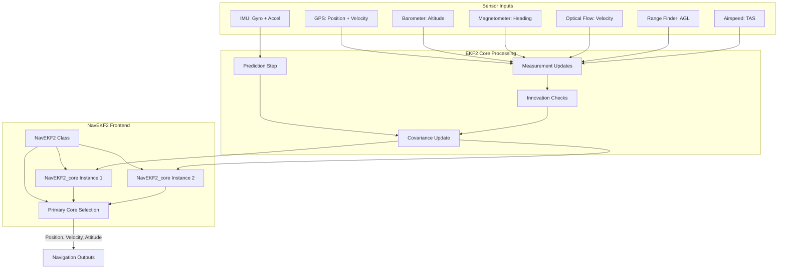
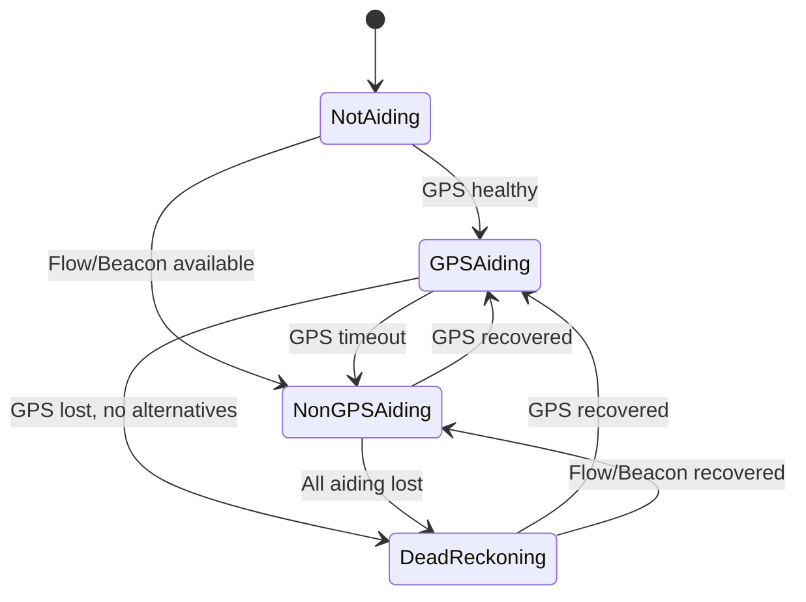

# NavEKF2 - Extended Kalman Filter Version 2

## Overview

NavEKF2 is a 24-state Extended Kalman Filter (EKF) providing inertial navigation for ArduPilot autopilots. It fuses measurements from multiple sensors including IMU (gyroscope and accelerometer), GPS, barometer, magnetometer, airspeed sensors, optical flow, range finders, and range beacons to produce optimal estimates of vehicle position, velocity, and attitude.

**Key Features:**
- **Multi-core/lane architecture**: Supports up to 2 EKF cores running in parallel with different IMUs for redundancy and fault tolerance
- **Continuous-time prediction with discrete measurement updates**: High-frequency IMU integration (100-400Hz) with asynchronous sensor fusion
- **Comprehensive sensor fusion**: GPS, barometer, magnetometer, airspeed, optical flow, range finders, range beacons, and external navigation systems
- **Adaptive aiding mode management**: Automatically transitions between GPS aiding, non-GPS aiding (flow/beacon), and dead-reckoning modes based on sensor availability
- **EKF-GSF yaw estimator integration**: Provides emergency yaw recovery from magnetic anomalies or compass failures
- **All outputs in NED coordinate frame**: North-East-Down navigation frame for consistent integration with autopilot systems

**Primary Use Cases:**
- Multicopter navigation with GPS and barometer
- Fixed-wing aircraft with airspeed sensor
- GPS-denied navigation using optical flow and rangefinder
- Indoor navigation using range beacons or external navigation systems
- Robust navigation through sensor failures with IMU redundancy

Source: libraries/AP_NavEKF2/AP_NavEKF2.h, libraries/AP_NavEKF2/AP_NavEKF2_core.h

## Architecture

NavEKF2 uses a frontend-backend architecture where the frontend (NavEKF2 class) manages multiple backend cores (NavEKF2_core instances), each running an independent EKF with a different IMU. The frontend selects the primary core based on innovation consistency and error scoring, enabling seamless failover when an IMU develops faults or excessive noise.



**Multi-Core Architecture Details:**

Each EKF core operates independently:
- **Core Assignment**: Each core is assigned to a specific IMU (configured via EK2_IMU_MASK parameter)
- **Independent Processing**: Each core runs its own prediction and measurement update cycles
- **Parallel Execution**: Cores process data simultaneously, improving fault tolerance
- **Primary Core Selection**: Frontend continuously monitors innovation consistency and selects the core with the lowest error score
- **Lane Switching**: When a better core is identified, the frontend switches primary core with appropriate reset tracking for controllers
- **Anti-Churn Timer**: 5-second minimum interval between lane switches prevents rapid oscillation

**Benefits of Multi-Core Design:**
- **Fault Tolerance**: Continued navigation even if one IMU fails completely
- **Noise Rejection**: Automatically switches away from IMU experiencing vibration or other noise sources
- **Graceful Degradation**: Smooth transition between sensors without abrupt failsafes
- **Improved Reliability**: Redundant estimation reduces risk of navigation failures

Source: libraries/AP_NavEKF2/AP_NavEKF2.cpp, libraries/AP_NavEKF2/AP_NavEKF2_core.cpp

## State Vector Composition

NavEKF2 maintains a 24-state vector representing the vehicle's navigation state, augmented with a 4-parameter quaternion for attitude representation (quaternion is separate from the state error vector). The state vector is designed to capture all aspects of vehicle dynamics, sensor biases, and environmental conditions needed for accurate navigation.

**State Vector (24 + 4 states with quaternion):**

| Index | State Component | Symbol | Units | Description |
|-------|----------------|--------|-------|-------------|
| 0-2 | Rotation Error | δθ | rad | 3D rotation error vector (rotation vector parameterization for minimal representation) |
| 3-5 | Velocity NED | V_N, V_E, V_D | m/s | Velocity in North-East-Down frame (V_D positive down) |
| 6-8 | Position NED | P_N, P_E, P_D | m | Position relative to EKF origin in NED frame (P_D positive down) |
| 9-11 | Gyro Bias | b_g | rad/s | Gyroscope bias estimates in body frame (learned during flight) |
| 12-14 | Gyro Scale | s_g | - | Gyroscope scale factor errors (dimensionless, typically near 0) |
| 15 | Accel Z Bias | b_az | m/s² | Z-axis accelerometer bias in body frame down direction |
| 16-18 | Earth Mag Field | B_N, B_E, B_D | gauss/1000 | Earth magnetic field in NED frame (learned during flight) |
| 19-21 | Body Mag Field | B_X, B_Y, B_Z | gauss/1000 | Body magnetic field offsets for hard iron compensation (learned in-flight) |
| 22-23 | Wind Velocity | W_N, W_E | m/s | Wind velocity in NE plane (positive = air moving in that direction) |
| 24-27 | Quaternion | q_0, q_1, q_2, q_3 | - | Attitude quaternion (rotation from NED to body frame, unit norm) |

**Covariance Matrix:**
- 24×24 symmetric positive-definite matrix P tracking estimation uncertainty
- Diagonal elements are variances (σ² in units²)
- Off-diagonal elements are covariances capturing correlations between states
- Maintained through prediction (growth) and update (reduction) steps
- Symmetry forced by averaging P(i,j) and P(j,i) for numerical stability

**Coordinate Frames:**
- **NED Frame (Navigation Frame)**: North-East-Down earth-fixed frame, origin at EKF initialization or set point
  - North: True north direction (magnetic declination corrected)
  - East: Perpendicular to north in horizontal plane
  - Down: Positive downward (gravity direction)
- **Body Frame**: Forward-Right-Down aircraft body frame that rotates with vehicle
  - Forward (X): Along vehicle longitudinal axis
  - Right (Y): Along vehicle lateral axis  
  - Down (Z): Perpendicular to XY plane, positive downward
- **Sensor Frames**: Individual sensor frames (IMU, flow, rangefinder) with known offsets from body frame origin

**State Initialization:**
- Attitude: Initialized from accelerometer (roll/pitch) and magnetometer (yaw) when stationary
- Velocity: Initialized to zero or from GPS velocity
- Position: Initialized at origin or from GPS position
- Biases: Gyro bias initialized from pre-arm calibration, accel bias from vertical acceleration offset
- Magnetic fields: Earth field initialized from World Magnetic Model (WMM), body field starts at zero
- Wind: Initialized to zero, learned during flight

Source: libraries/AP_NavEKF2/AP_NavEKF2_core.h:84-300

## Prediction Step: Continuous-Time Dynamics

The EKF prediction step integrates high-rate IMU measurements (gyroscope and accelerometer) to propagate the navigation state forward in time. This strapdown inertial navigation system (INS) integration runs at IMU sample rate (typically 100-400Hz) with full covariance prediction at the EKF target rate (100Hz).

**Strapdown INS Integration:**

IMU measurements are integrated using delta angles and delta velocities over each IMU sample interval:
- **Delta Angle Integration**: Δθ = ω × Δt (rotation increments from gyroscope)
- **Delta Velocity Integration**: Δv = a × Δt (velocity increments from accelerometer)
- **Coning Corrections**: Applied to delta angles to compensate for rotation during sampling period
- **Sculling Corrections**: Applied to delta velocities to compensate for translation during rotation
- **Quaternion Propagation**: q_new = q_old × exp(0.5 × Δθ) using rotation vector integration
- **Velocity Update**: V_new = V_old + C_bn × a_corrected × Δt + g_NED × Δt
- **Position Update**: P_new = P_old + V × Δt

Where:
- C_bn = Direction Cosine Matrix (DCM) from body to NED frame (computed from quaternion)
- a_corrected = Specific force measurement corrected for accelerometer bias
- g_NED = Gravity vector in NED frame [0, 0, 9.80665] m/s²

**State Prediction Equations (continuous-time dynamics):**

```
δθ_dot = -ω_corrected + b_g + n_g              (rotation error dynamics)
V_dot = C_bn * a_corrected + g_NED + n_a       (velocity dynamics)
P_dot = V                                       (position dynamics)
b_g_dot = n_bg                                  (gyro bias random walk)
s_g_dot = n_sg                                  (gyro scale random walk)
b_az_dot = n_ba                                 (accel Z bias random walk)
B_earth_dot = n_be                              (earth mag field drift)
B_body_dot = n_bb                               (body mag field drift)
W_dot = n_w                                     (wind velocity random walk)
q_dot = 0.5 * Ω(ω) * q                         (quaternion kinematics)
```

Where:
- ω_corrected = ω_measured - b_g - s_g × ω_measured (gyro measurement corrected for bias and scale)
- a_corrected = a_measured - [0, 0, b_az] (accel measurement corrected for Z-axis bias)
- n_* = Process noise terms (Gaussian white noise with tunable covariances)
- Ω(ω) = Quaternion rate matrix: [[0, -ω_z, ω_y, ω_x], [ω_z, 0, -ω_x, ω_y], [-ω_y, ω_x, 0, ω_z], [-ω_x, -ω_y, -ω_z, 0]]

**Covariance Prediction:**

The state covariance is propagated using linearized dynamics:

```
P_k+1 = Φ_k * P_k * Φ_k^T + Q_k
```

Where:
- Φ = State transition matrix (24×24), linearization of state dynamics about current state
- Q = Process noise covariance (24×24 diagonal), from EK2_*_P_NSE parameters
- Computed using algebraically simplified equations derived in Matlab

**Timing and Execution:**

- **Target Time Step**: EKF_TARGET_DT = 0.01s (100Hz) for covariance prediction
- **IMU Sample Rate**: Varies by platform (100-400Hz typical for copter, 50-100Hz for plane)
- **Adaptive Timing**: EKF update rate adapts to IMU sample rate and CPU budget
- **Covariance Limits**: Prediction limited to covTimeStepMax = 0.1s and covDelAngMax = 0.05 rad per step to maintain numerical accuracy
- **Double Precision Option**: HAL_WITH_EKF_DOUBLE enables 64-bit float arithmetic for improved accuracy in long-duration flights

**Numerical Conditioning:**

To maintain numerical stability:
- **Symmetry Forcing**: P = 0.5 × (P + P^T) after each prediction to correct floating-point asymmetry
- **Variance Limiting**: Diagonal elements clipped to [minVariance, maxVariance] to prevent negative or excessive values
- **Quaternion Renormalization**: q = q / |q| to maintain unit norm constraint after integration
- **State Limiting**: Position states limited to ±EK2_POSXY_STATE_LIMIT to prevent overflow

Source: libraries/AP_NavEKF2/AP_NavEKF2_core.cpp:UpdateFilter(), CovariancePrediction()

## Measurement Update Models

NavEKF2 fuses measurements from multiple sensors using sequential scalar updates. Each sensor measurement is processed as a separate update step, allowing flexible sensor configurations and robust handling of sensor failures.

### GPS Position and Velocity Fusion

GPS provides absolute position and velocity measurements in the earth frame, enabling long-term drift-free navigation.

**Measurement Model:**

For velocity measurements:
```
H_vel = [0_{3×3}, I_{3×3}, 0_{3×18}]     (observes velocity states directly)
z_vel = GPS velocity in NED frame
h(x) = V_NED                              (predicted velocity from state)
```

For position measurements:
```
H_pos = [0_{3×6}, I_{3×3}, 0_{3×15}]     (observes position states directly)
z_pos = GPS position in NED frame (relative to EKF origin)
h(x) = P_NED                              (predicted position from state)
```

**Sequential Fusion:**

FuseVelPosNED() performs up to 6 sequential scalar updates in this order:
1. V_N (North velocity)
2. V_E (East velocity)
3. V_D (Down velocity)
4. P_N (North position)
5. P_E (East position)
6. P_D (Down position)

For each axis:
```
innovation = z - h(x)                     (measurement residual)
S = H * P * H^T + R                       (innovation variance)
K = P * H^T * S^-1                        (Kalman gain)
x = x + K * innovation                    (state update)
P = P - K * H * P                         (covariance update, Joseph form for stability)
```

**Adaptive Measurement Noise:**

GPS measurement variance is scaled during maneuvers to account for reduced GPS accuracy:
```
R_effective = R_base * (1 + accelScale * |a_body|)
```

Scaling factors (from source):
- gpsNEVelVarAccScale = 0.05 (horizontal velocity)
- gpsDVelVarAccScale = 0.07 (vertical velocity)
- gpsPosVarAccScale = 0.05 (position)

This reduces GPS weight during aggressive flight when inertial solution is more reliable.

**Antenna Offset Correction:**

GPS antenna position offset from IMU is compensated using vehicle attitude:
```
P_GPS_corrected = P_GPS_measured - DCM^T * antenna_offset
```

Where antenna_offset is the GPS antenna position relative to IMU in body frame.

**Innovation Gating:**

Measurements are rejected if innovation exceeds gate threshold:
```
test_ratio = innovation² / S
if test_ratio > gate² then reject measurement
```

Gates (default values in 0.01 units for legacy reasons, divide by 100 for actual sigma):
- EK2_VELNE_I_GATE = 500 (5 sigma for NE velocity)
- EK2_VEL_I_GATE = 500 (5 sigma for down velocity)
- EK2_POSNE_I_GATE = 500 (5 sigma for NE position)

**Fusion Modes (EK2_GPS_TYPE):**
- **0**: Fuse 3D velocity + 2D position (default, best for most applications)
- **1**: Fuse 2D velocity + 2D position (no vertical velocity, for poor GPS vertical accuracy)
- **2**: Fuse 2D position only (no velocity, for GPS with poor velocity accuracy)
- **3**: No GPS fusion (requires alternative aiding like optical flow or beacons)

Source: libraries/AP_NavEKF2/AP_NavEKF2_PosVelFusion.cpp:FuseVelPosNED()

### Barometer Altitude Fusion

The barometer provides relative altitude measurements by measuring atmospheric pressure. It offers high-rate, low-noise altitude estimation but is subject to pressure variations from weather and airflow.

**Measurement Model:**

```
H_baro = [0_{1×5}, -1, 0_{1×18}]         (observes down position state, negative sign for altitude)
z_baro = -(P_static - P_origin) / (ρ × g) (altitude from pressure, converted to down position)
h(x) = P_D                                (predicted down position)
R = EK2_ALT_M_NSE²                        (typically 3 m)
```

**Ground Effect Compensation:**

When on ground or in ground effect (detectOptFlowTakeoff), barometer variance is scaled to reduce weight:
```
R_effective = R_base * gndEffectBaroScaler
```
Where gndEffectBaroScaler = 4.0, reducing barometer influence during takeoff and landing to prevent ground proximity pressure errors from corrupting height estimate.

**Barometer Offset Low-Pass Filter:**

A low-pass filter tracks slow barometer drift from weather pressure changes:
```
baro_offset_new = baro_offset_old + Δt × (innovation - baro_offset_old) / τ
```
This removes long-term drift while preserving short-term altitude changes.

**Height Source Selection:**

selectHeightForFusion() chooses the primary height sensor based on availability and EK2_ALT_SOURCE parameter:
- **Barometer (0)**: Default, uses barometric altitude for all flight phases
- **Rangefinder (1)**: Switches to rangefinder when EK2_RNG_USE_HGT conditions met (see Rangefinder section)
- **GPS (2)**: Uses GPS altitude (less accurate than baro for relative altitude, but immune to pressure variations)
- **Beacon (3)**: Uses range beacon triangulation for height
- **External Nav (4)**: Uses external navigation system altitude (visual odometry, motion capture)

Height fusion runs at high rate (typically 50-100Hz) for responsive altitude control.

Source: libraries/AP_NavEKF2/AP_NavEKF2_PosVelFusion.cpp:FuseVelPosNED(), selectHeightForFusion()

### Magnetometer Fusion

Magnetometer measurements provide heading information by sensing the Earth's magnetic field. NavEKF2 learns both the Earth magnetic field (NED frame) and body magnetic field offsets (hard iron) in-flight for improved accuracy.

**Measurement Model:**

The predicted magnetic field measurement in the body frame is:
```
h(x) = DCM^T * B_earth + B_body
```

Where:
- DCM = Direction Cosine Matrix from NED to body frame (computed from quaternion)
- B_earth = Earth magnetic field in NED frame (state 16-18, learned)
- B_body = Body magnetic field offsets in body frame (state 19-21, learned for hard iron compensation)

Measurement:
```
z_mag = Magnetometer reading in body frame [B_X, B_Y, B_Z]
R = EK2_MAG_M_NSE² (typically 0.05 gauss)
```

**Sequential Per-Axis Updates:**

FuseMagnetometer() performs 3 sequential scalar updates (X, Y, Z body axes). For each axis:
```
innovation = z_mag_axis - h(x)_axis
H = ∂h/∂x (Jacobian, computed analytically)
S = H * P * H^T + R
K = P * H^T * S^-1
x = x + K * innovation
P = P - K * H * P
```

Innovation gating: EK2_MAG_I_GATE (default 300 = 3 sigma)

**Declination Fusion:**

FuseDeclination() fuses known magnetic declination from World Magnetic Model (WMM):
```
declination_predicted = atan2(B_E, B_N)      (azimuth of earth field in NED)
declination_expected = WMM declination at current location
innovation = declination_expected - declination_predicted
```

This helps constrain yaw when vehicle is level and provides global heading reference.

**In-Flight Magnetometer Calibration:**

EK2_MAG_CAL parameter controls learning of body magnetic field offsets:
- **0**: Never learn (use pre-configured offsets only)
- **1**: Learn when flying (requires vehicle motion and GPS)
- **2**: Learn when moving (requires any motion)
- **3**: Always learn (default for copter, learns continuously)
- **4**: Learn after yaw alignment (learns after initial heading established)
- **5**: Learn during initial yaw alignment only

Body field learning constrained by:
- EK2_MAG_EF_LIM: Maximum allowed earth field variance increase (guards against learning incorrect values)
- Innovation consistency: Only learns when mag innovations are small
- Vehicle dynamics: Requires sufficient motion to separate earth and body fields

**Yaw Reset Logic:**

Emergency yaw reset triggered when:
- Magnetometer innovations consistently exceed gate (indicating magnetic anomaly or compass failure)
- EKF-GSF yaw estimator provides alternative yaw estimate
- Reset count < EK2_GSF_RST_MAX (default 2 per flight)

Reset procedure:
1. Align quaternion to GSF yaw while preserving roll/pitch
2. Reset earth magnetic field to WMM
3. Inform controllers of yaw discontinuity via yaw_reset_data
4. Increment reset counter

Limited resets prevent repeated resets from permanently incorrect compass.

**Magnetic Interference Rejection:**

- Innovation gating rejects measurements during strong interference
- Learned body field compensates for constant magnetic sources (motors, battery)
- Time-varying interference (from ESC currents, servos) causes increased innovations and potential lane switch

Source: libraries/AP_NavEKF2/AP_NavEKF2_MagFusion.cpp:FuseMagnetometer(), FuseDeclination()

### Airspeed Fusion

Airspeed sensors measure the pressure difference between pitot and static ports, providing true airspeed information for fixed-wing aircraft. This helps constrain velocity and wind estimates.

**True Airspeed Measurement:**

Equivalent Airspeed (EAS) from sensor is converted to True Airspeed (TAS):
```
TAS = EAS * sqrt(ρ_0 / ρ)
```
Where:
- ρ_0 = Sea level air density (1.225 kg/m³)
- ρ = Air density at current altitude from barometer

**Measurement Model:**

```
V_air_body = DCM^T * (V_NED - W_NED)         (airspeed vector in body frame)
h(x) = |V_air_body|                           (magnitude = TAS)
z_tas = TAS measurement
R = (EK2_EAS_M_NSE * EAS2TAS)²                (variance scales with air density ratio)
```

Innovation:
```
innovation = z_tas - h(x)
```

Jacobian H computed analytically with respect to velocity and wind states.

Innovation gating: EK2_TAS_I_GATE (default 500 = 5 sigma)

**Synthetic Sideslip Fusion:**

FuseSideslip() assumes coordinated flight (zero sideslip angle) for fixed-wing aircraft:
```
h(x) = V_air_body_Y                           (lateral velocity in body frame should be ~0)
z = 0 (assumption)
innovation = 0 - V_air_body_Y
```

This helps constrain:
- Lateral velocity drift
- Wind estimate in lateral direction
- Yaw accuracy

More applicable to fixed-wing than multicopters, which commonly operate with non-zero sideslip.

**Airspeed Offset Calibration:**

If airspeed sensor has offset error, it can be learned through:
- Comparison with GPS groundspeed in calm wind conditions
- Wind triangle solution: GPS velocity = TAS × heading + wind
- Not automatically compensated by EKF2; requires manual calibration or ARSPD_OFFSET parameter adjustment

Source: libraries/AP_NavEKF2/AP_NavEKF2_AirDataFusion.cpp:FuseAirspeed(), FuseSideslip()

### Optical Flow Fusion

Optical flow sensors measure angular rates of image motion, providing velocity information for GPS-denied navigation when combined with height-above-ground measurements.

**Flow Measurement Model:**

Flow rates (rad/s) about sensor X-Y axes are related to vehicle motion:
```
ω_flow_predicted = (V_body × r_sensor) / h_agl - ω_body
```

Where:
- V_body = Velocity in body frame
- r_sensor = Flow sensor position offset from IMU in body frame
- h_agl = Height above ground level from terrain estimator
- ω_body = Body rotation rates (from gyro)

The gyro compensation term removes rotational component, leaving only translational flow.

Measurement:
```
z_flow = [flow_X, flow_Y] in rad/s
R = EK2_FLOW_M_NSE² (typically 0.25 rad/s)
```

**Terrain Estimator:**

NavEKF2 runs a single-state terrain altitude EKF in parallel to the main navigation filter:
```
state: terrain_offset (vertical offset of terrain relative to EKF origin)
prediction: terrain_offset_dot = 0 (assumes terrain is stationary)
measurement: range_agl = P_D - terrain_offset (from rangefinder or flow-derived height)
```

The terrain estimator provides:
- Height-above-ground estimate for flow measurement model
- Terrain-relative altitude for low-level flight
- Terrain following capability

**Fusion Conditions:**

Optical flow is only fused when:
- DCM(3,3) > DCM33FlowMin = 0.71 (tilt < 45 degrees to prevent excessive measurement noise)
- Flow quality > threshold (sensor-reported quality metric)
- Height AGL within sensor range and valid
- Innovation within EK2_FLOW_I_GATE (default 300 = 3 sigma)
- Main filter has valid attitude solution

**Flow Usage Modes (EK2_FLOW_USE):**
- **0 (FLOW_USE_NONE)**: No fusion, flow sensor disabled
- **1 (FLOW_USE_NAV)**: Fusion into main nav filter for velocity aiding (primary mode for GPS-denied navigation)
- **2 (FLOW_USE_TERRAIN)**: Fusion into terrain estimator only, not used for navigation

**GPS-Denied Navigation with Flow:**

When GPS is unavailable:
1. Optical flow provides velocity aiding in NE plane
2. Rangefinder provides altitude hold
3. Magnetometer provides heading reference
4. Combined aiding prevents unbounded drift

Typical accuracy with quality flow sensor and rangefinder: <1% drift over distance traveled.

Source: libraries/AP_NavEKF2/AP_NavEKF2_OptFlowFusion.cpp:FuseOptFlow(), EstimateTerrainOffset()

### Range Finder Fusion

Downward-facing range finders (lidar, sonar, radar) provide accurate height-above-ground measurements for terrain-relative navigation and precision altitude control.

**Measurement Model:**

Range measurement corrected for vehicle tilt:
```
h(x) = (P_D - terrain_offset) / cos(tilt)
```

Where:
- P_D = Down position state (positive down)
- terrain_offset = Terrain altitude from terrain estimator
- tilt = Vehicle tilt angle (from attitude)
- cos(tilt) = DCM(3,3) (vertical component of down body axis in NED frame)

Measurement:
```
z_rng = Range sensor reading in meters
R = EK2_RNG_M_NSE² (typically 0.5 m)
```

Innovation gating: EK2_RNG_I_GATE (default 500 = 5 sigma)

**Terrain Following:**

When EK2_RNG_USE_HGT is enabled and conditions are met, rangefinder becomes primary height source:

Activation conditions:
- Vehicle speed < EK2_RNG_USE_SPD (m/s, default 2.0)
- Range < EK2_RNG_USE_HGT (% of max sensor range, default 70%)
- Range measurement quality good
- Vehicle tilt < 45 degrees

Benefits:
- Accurate relative altitude for low-altitude flight
- Terrain following capability
- Immune to barometer drift and pressure variations

Limitations:
- Requires good terrain return (fails over water, glass, absorptive surfaces)
- Limited maximum range (typically 10-40m depending on sensor)
- Sensitive to vehicle tilt (range measurement projects onto vertical)

**Rangefinder Data Processing:**

From AP_NavEKF2_Measurements.cpp, rangefinder data goes through:
1. **Ring Buffer**: Stores recent measurements for time alignment
2. **Median Filter**: Rejects outliers from transient reflections (3-sample median)
3. **Time Delay Compensation**: Accounts for sensor processing delay
4. **Tilt Compensation**: Corrects range for vehicle attitude
5. **Terrain Estimator Update**: Updates terrain height estimate

Source: libraries/AP_NavEKF2/AP_NavEKF2_Measurements.cpp:readRangeFinder(), libraries/AP_NavEKF2/AP_NavEKF2_PosVelFusion.cpp

### Range Beacon Fusion

Range beacons provide distance measurements to known ground station positions, enabling absolute positioning without GPS for indoor or GPS-denied environments.

**Beacon Measurement Model:**

Range to beacon at known NED position:
```
h(x) = |P_NED - BeaconPos_NED|
```

Where:
- P_NED = Vehicle position state (3D)
- BeaconPos_NED = Known beacon position in NED frame

Measurement:
```
z_bcn = Range measurement to beacon in meters
R = EK2_BCN_M_NSE² (typically 1.0 m)
```

Innovation:
```
innovation = z_bcn - h(x)
```

Jacobian H computed as unit vector from vehicle to beacon.

Innovation gating: EK2_BCN_I_GATE (default 500 = 5 sigma)

**Beacon Positioning Requirements:**

For 3D positioning:
- Minimum 4 beacons required (3 for 2D + 1 for 3D)
- Beacons must have known NED positions configured in system
- Good geometric dilution of precision (GDOP) - beacons spread around area
- Line-of-sight to beacons (UWB radio or ultrasonic)

**Beacon System Setup:**

1. Define origin (EKF origin = beacon coordinate frame origin)
2. Configure beacon positions in NED frame
3. Set EK2_BCN_M_NSE based on beacon ranging accuracy
4. Set EK2_BCN_DELAY to account for beacon processing time (default 50ms)
5. Enable beacon fusion (EK2_BCN_ENABLE)

**Indoor Navigation with Beacons:**

Typical application:
- 4-8 beacons mounted around flight area
- UWB (Ultra-Wideband) ranging for cm-level accuracy
- Provides position aiding similar to GPS
- Combined with optical flow for full 3D navigation

Source: libraries/AP_NavEKF2/AP_NavEKF2_RngBcnFusion.cpp:FuseRngBcn()

### External Navigation Fusion

External navigation systems (visual odometry, motion capture, visual-inertial odometry) can provide position and/or velocity measurements to the EKF.

**Measurement Model:**

Direct observation of position and/or velocity states:

Position measurement:
```
H_pos = [0_{3×6}, I_{3×3}, 0_{3×15}]
z_pos = External position in NED frame
h(x) = P_NED
```

Velocity measurement:
```
H_vel = [0_{3×3}, I_{3×3}, 0_{3×18}]
z_vel = External velocity in NED frame
h(x) = V_NED
```

Quaternion/attitude measurement:
```
h(x) = q (quaternion state)
z_quat = External attitude quaternion
innovation = quaternion error between z_quat and q
```

**External Navigation Interface:**

Vehicle code writes external navigation data via:
- **writeExtNavData()**: Position + quaternion + timestamp
- **writeExtNavVelData()**: Velocity + timestamp

Data is time-aligned with IMU using configured delay_ms parameter.

**Fusion Control:**

- Can be disabled via EK2_OPTIONS bit 0 (DisableExternalNav = 1)
- Fusion rate determined by external system update rate
- Innovation gating applied same as GPS measurements
- Used when GPS unavailable or as primary navigation source

**Common External Navigation Sources:**

1. **Intel RealSense T265**: Visual-inertial odometry (VIO) camera
   - Provides 6DOF pose (position + attitude) at 200Hz
   - Requires good visual features
   - Typical accuracy: <1% drift

2. **Motion Capture Systems**: OptiTrack, Vicon, Qualisys
   - Provides high-rate position + attitude from external cameras
   - Requires line-of-sight to markers
   - Very high accuracy (<1mm position)

3. **Visual Odometry**: Stereo cameras, monocular+IMU
   - Estimates ego-motion from visual features
   - Scale may drift without absolute reference
   - Useful for GPS-denied outdoor navigation

Source: libraries/AP_NavEKF2/AP_NavEKF2_Measurements.cpp:writeExtNavData(), writeExtNavVelData()

## Innovation Checking and Fault Detection

NavEKF2 continuously monitors measurement innovations (residuals) to detect sensor faults, reject outliers, and select the healthiest EKF core for primary navigation output.

**Innovation Sequence for Each Measurement:**

1. **Compute Innovation**:
   ```
   ν = z - h(x)                               (measurement - prediction)
   ```

2. **Compute Innovation Variance**:
   ```
   S = H * P * H^T + R                        (predicted variance of innovation)
   ```

3. **Compute Normalized Test Ratio**:
   ```
   τ = ν² / S                                 (chi-squared distributed if model correct)
   ```

4. **Innovation Gate Check**:
   ```
   if τ < gate² then
       accept and fuse measurement
   else
       reject measurement as outlier
   ```

The gate threshold is typically 3-5 sigma (gate = 300-500 in 0.01 units).

**Innovation Consistency Monitoring:**

Each core tracks innovation test ratios for all sensors:
- Accumulated into error score weighted by sensor reliability
- Primary core has lowest error score over time
- Lane switching triggered if another core has significantly better score

Error score components:
- GPS velocity innovations (high weight)
- GPS position innovations (medium weight)
- Barometer innovations (medium weight)
- Magnetometer innovations (low weight, may be intermittently unreliable)
- Airspeed innovations (medium weight)
- Optical flow innovations (medium weight)

**Filter Fault Detection:**

getFilterFaults() returns bitmask of detected faults:

| Bit | Fault Condition | Description |
|-----|----------------|-------------|
| 0 | Bad quaternion | Quaternions contain NaN values (severe numerical failure) |
| 1 | Bad velocity | Velocity states contain NaN values |
| 2 | Bad X mag fusion | X-axis magnetometer fusion is badly conditioned |
| 3 | Bad Y mag fusion | Y-axis magnetometer fusion is badly conditioned |
| 4 | Bad Z mag fusion | Z-axis magnetometer fusion is badly conditioned |
| 5 | Bad airspeed fusion | Airspeed fusion is badly conditioned |
| 6 | Bad sideslip fusion | Sideslip assumption fusion is badly conditioned |
| 7 | Filter not initialized | Core has not completed initialization sequence |

Badly conditioned fusion occurs when:
- Innovation variance S approaches zero (near-singular)
- Kalman gain calculation fails
- State update produces NaN or extreme values

**GPS Health Monitoring:**

GPS status checked via bitmask (MASK_GPS_*):

| Check | Parameter | Threshold | Purpose |
|-------|-----------|-----------|---------|
| NSATS | Number of satellites | 6+ for 3D, 9+ for yaw | Ensures sufficient satellite geometry |
| HDOP | Horizontal dilution of precision | < threshold | Measures satellite geometry quality |
| Speed error | GPS-reported speed accuracy | < threshold | Filters poor GPS solutions |
| Position error | GPS-reported position accuracy | < threshold | Filters poor GPS solutions |
| Yaw error | GPS-reported yaw accuracy | < threshold (dual GPS) | Validates GPS heading |
| Position drift | Innovation-based drift check | < limit | Detects GPS glitches |
| Vertical speed | Down velocity consistency | < limit | Checks GPS vertical velocity |
| Horizontal speed | NE velocity consistency | < limit | Checks GPS horizontal velocity |

GPS health checks can be relaxed via EK2_CHECK_SCALE parameter (100 = normal, 200 = relaxed).

**Sensor Timeout Detection:**

Each sensor has maximum time-since-last-valid-measurement threshold:
- GPS: 5000ms typical
- Barometer: 200ms typical
- Magnetometer: 500ms typical
- Optical flow: 500ms typical

Timeout triggers:
- Switch to degraded aiding mode
- Attempt lane switch if other core has sensor
- May trigger GPS failsafe if no alternative aiding

**Aiding Mode State Machine:**

Filter transitions between aiding modes based on sensor availability:



**Aiding Modes:**
- **GPS Aiding**: GPS position/velocity fusion active (best accuracy, no drift)
- **Non-GPS Aiding**: Optical flow, beacons, or external nav active (good short-term, bounded drift)
- **Dead Reckoning**: Inertial-only navigation (unbounded drift, emergency only)

**Height Aiding Requirement:**

Position validity requires:
- At least one active aiding source (GPS, flow, beacons, external nav)
- Valid height measurement (baro, rangefinder, GPS alt, or beacon)
- Without height aiding, position drift is unconstrained vertically

**Innovation-Based Lane Switching:**

Core selection algorithm (runCoreSelection):
1. Each core computes weighted error score from innovation test ratios
2. Lowest score = healthiest core
3. If non-primary core has significantly better score:
   - Check core is fully aligned (valid attitude, position, velocity)
   - Check score improvement exceeds threshold
   - Verify anti-churn timer expired (5 seconds since last switch)
4. If criteria met, switch primary core:
   - Record reset data for controllers (yaw, position discontinuities)
   - Update primary core index
   - Reset anti-churn timer

This provides:
- Automatic failover from faulty IMU
- Graceful degradation without abrupt failsafes
- Minimal controller disturbance during switch

Source: libraries/AP_NavEKF2/AP_NavEKF2_core.cpp:calcInnovations(), getFilterFaults(), libraries/AP_NavEKF2/AP_NavEKF2.cpp:runCoreSelection()

## Covariance Prediction and Update

The covariance matrix P captures estimation uncertainty and correlations between states. Proper covariance management is critical for optimal Kalman filter performance and numerical stability.

**Prediction Step (CovariancePrediction):**

Covariance is propagated forward using linearized dynamics:
```
P_k+1 = Φ_k * P_k * Φ_k^T + Q_k
```

Where:
- **Φ** = State transition matrix (24×24), linearization of state dynamics about current estimate
  - Computed from IMU measurements, gravity, current quaternion
  - Represents how state errors propagate over time step Δt
- **Q** = Process noise covariance (24×24 diagonal), tunable via EK2_*_P_NSE parameters
  - Models unpredictable state changes (sensor noise, unmodeled dynamics)
  - Larger Q → faster adaptation, more noise in estimates
  - Smaller Q → slower adaptation, smoother estimates

**Update Step (Kalman Update):**

Sequential scalar updates for each measurement:
```
S = H * P * H^T + R                            (innovation variance)
K = P * H^T / S                                (Kalman gain, scalar division for scalar update)
P = P - K * S * K^T                            (covariance update)
  = (I - K * H) * P                            (simplified form)
```

For improved numerical stability, Joseph form can be used:
```
P = (I - K*H) * P * (I - K*H)^T + K * R * K^T
```

**Numerical Conditioning:**

NavEKF2 applies several techniques to maintain numerical stability:

1. **ForceSymmetry()**: Enforces covariance matrix symmetry
   ```
   P(i,j) = P(j,i) = 0.5 * (P(i,j) + P(j,i))
   ```
   Corrects floating-point asymmetry accumulated over many operations.

2. **ConstrainVariances()**: Clips diagonal elements to valid range
   ```
   P(i,i) = constrain(P(i,i), minVariance, maxVariance)
   ```
   Prevents negative variances (non-physical) and excessive variances (overflow risk).

3. **ZeroRows() / ZeroCols()**: Zero specific rows/columns when resetting states
   - Used during state resets (position reset, velocity reset)
   - Removes correlations with reset states

4. **Double Precision Mode**: HAL_WITH_EKF_DOUBLE
   - Uses 64-bit floats for covariance operations
   - Improves accuracy in long-duration flights (hours)
   - Prevents accumulation of rounding errors

**Process Noise Tuning Parameters:**

| Parameter | Description | Copter Default | Plane Default | Units | Physical Meaning |
|-----------|-------------|----------------|---------------|-------|------------------|
| EK2_GYRO_P_NSE | Gyro process noise | 0.015 | 0.015 | rad/s | Rate gyro drift, vibration noise |
| EK2_ACC_P_NSE | Accel process noise | 0.35 | 0.35 | m/s² | Accelerometer noise, vibration |
| EK2_GBIAS_P_NSE | Gyro bias process noise | 1e-6 | 1e-6 | rad/s² | Rate of gyro bias change |
| EK2_GSCL_P_NSE | Gyro scale process noise | 5e-4 | 5e-4 | 1/s | Rate of gyro scale factor change |
| EK2_ABIAS_P_NSE | Accel Z bias process noise | 5e-3 | 5e-3 | m/s³ | Rate of accel bias change |
| EK2_WIND_P_NSE | Wind process noise | 0.1 | 0.1 | m/s/√s | Rate of wind change |
| EK2_WIND_PSCL | Wind noise height scaling | 0.5 | 0.5 | - | Scale wind noise by √(height_rate) |
| EK2_MAG_E_NSE | Earth mag process noise | 1e-3 | 1e-3 | gauss/s | Earth field drift rate |
| EK2_MAG_B_NSE | Body mag process noise | 1e-4 | 1e-4 | gauss/s | Hard iron drift rate |

**Measurement Noise Tuning Parameters:**

| Parameter | Description | Copter Default | Plane Default | Units | Physical Meaning |
|-----------|-------------|----------------|---------------|-------|------------------|
| EK2_VELNE_M_NSE | GPS horizontal velocity noise | 0.3 | 0.3 | m/s | GPS velocity accuracy NE |
| EK2_VELD_M_NSE | GPS vertical velocity noise | 0.4 | 0.4 | m/s | GPS velocity accuracy down |
| EK2_POSNE_M_NSE | GPS horizontal position noise | 5.0 | 3.0 | m | GPS position accuracy NE |
| EK2_ALT_M_NSE | Barometer altitude noise | 3.0 | 3.0 | m | Barometer short-term noise |
| EK2_MAG_M_NSE | Magnetometer noise | 0.05 | 0.05 | gauss | Compass measurement noise |
| EK2_EAS_M_NSE | Airspeed noise | 1.4 | 1.4 | m/s | Airspeed sensor noise |
| EK2_FLOW_M_NSE | Optical flow noise | 0.25 | 0.25 | rad/s | Flow sensor angular rate noise |
| EK2_RNG_M_NSE | Range finder noise | 0.5 | 0.5 | m | Rangefinder measurement noise |
| EK2_BCN_M_NSE | Range beacon noise | 1.0 | 1.0 | m | Beacon ranging noise |

**Innovation Gate Parameters:**

Gates are specified in 0.01 units (legacy format), divide by 100 to get sigma multiples:

| Parameter | Description | Default | Sigma | Purpose |
|-----------|-------------|---------|-------|---------|
| EK2_VELNE_I_GATE | GPS NE velocity gate | 500 | 5σ | Reject GPS velocity outliers |
| EK2_VEL_I_GATE | GPS down velocity gate | 500 | 5σ | Reject vertical velocity outliers |
| EK2_POSNE_I_GATE | GPS NE position gate | 500 | 5σ | Reject GPS glitches |
| EK2_HGT_I_GATE | Height innovation gate | 500 | 5σ | Reject altitude outliers |
| EK2_MAG_I_GATE | Magnetometer gate | 300 | 3σ | Reject magnetic interference |
| EK2_TAS_I_GATE | Airspeed gate | 500 | 5σ | Reject airspeed outliers |
| EK2_FLOW_I_GATE | Optical flow gate | 300 | 3σ | Reject flow outliers |
| EK2_RNG_I_GATE | Range finder gate | 500 | 5σ | Reject rangefinder spikes |
| EK2_BCN_I_GATE | Beacon ranging gate | 500 | 5σ | Reject beacon outliers |

**Tuning Guidelines:**

**Process Noise (Q matrix):**
- **Increase** when:
  - Filter responds too slowly to changes
  - Large steady-state innovations
  - Vehicle dynamics exceed model assumptions
- **Decrease** when:
  - Estimates are too noisy
  - Tracking measurement noise instead of true state
  - Excessive sensitivity to vibration
- **Common adjustments**:
  - High vibration: Increase EK2_GYRO_P_NSE, EK2_ACC_P_NSE
  - Slow wind changes: Increase EK2_WIND_P_NSE
  - Rapidly changing mag field: Increase EK2_MAG_E_NSE

**Measurement Noise (R matrix):**
- **Increase** when:
  - Sensor is noisy or unreliable
  - Want to reduce sensor influence
  - Sensor experiencing interference
- **Decrease** when:
  - Sensor is very accurate
  - Want faster convergence to measurement
  - High confidence in measurement quality
- **Common adjustments**:
  - Urban GPS (multipath): Increase EK2_POSNE_M_NSE to 10-15m
  - High-quality RTK GPS: Decrease EK2_POSNE_M_NSE to 1-2m
  - Magnetic interference area: Increase EK2_MAG_M_NSE to 0.1-0.2 gauss

**Innovation Gates:**
- **Increase** when:
  - Valid measurements being rejected during maneuvers
  - Want more tolerance for dynamic flight
- **Decrease** when:
  - Too many outliers being accepted
  - Sensor prone to glitches (careful: may reject all measurements)
- **Common adjustments**:
  - Aggressive copter flight: Increase GPS gates to 700-1000 (7-10σ)
  - High-quality sensors: Decrease gates to 300-400 (3-4σ)

**Variance Bounds:**

Hard-coded variance limits prevent numerical issues:
- Position variance: 1e6 m² maximum
- Velocity variance: 1e6 m²/s² maximum
- Attitude variance: 1 rad² maximum
- Bias variances: Reasonable limits based on sensor specifications

Source: libraries/AP_NavEKF2/AP_NavEKF2_core.cpp:CovariancePrediction(), libraries/AP_NavEKF2/AP_NavEKF2.cpp:var_info[]

## Lane Switching for Multi-IMU Redundancy

NavEKF2's multi-core architecture enables seamless failover between IMUs when one develops faults or excessive noise. The frontend continuously monitors all cores and switches to the healthiest one as primary navigation source.

**Core Selection Algorithm (runCoreSelection):**

Executed every update cycle to determine optimal primary core:

1. **Error Score Calculation** (per core):
   ```
   error_score = Σ (weighted innovation test ratios)
   ```
   
   Weights by sensor type:
   - GPS velocity: High weight (directly affects navigation)
   - GPS position: Medium weight
   - Barometer: Medium weight
   - Magnetometer: Low weight (may have intermittent interference)
   - Airspeed: Medium weight (planes only)
   - Optical flow: Medium weight

2. **Primary Candidate Selection**:
   ```
   candidate_core = arg min(error_score)
   ```
   Core with lowest error score is best candidate.

3. **Switch Criteria Evaluation** (coreBetterScore):
   - **Alignment Check**: Candidate core must have:
     - Valid attitude quaternion (no NaN)
     - Valid velocity estimate
     - Valid position estimate
     - Completed initialization sequence
   
   - **Score Improvement Check**:
     ```
     if candidate_error < current_primary_error - threshold then
         score_improvement = significant
     ```
     Prevents switching for marginal improvements.
   
   - **Anti-Churn Timer Check**:
     ```
     time_since_last_switch > 5000 ms
     ```
     Prevents rapid oscillation between cores.

4. **Execute Switch** (if all criteria met):
   - Record discontinuities for controller compensation
   - Update primary core index
   - Reset anti-churn timer

**Anti-Churn Timer:**

Purpose: Prevent rapid lane switching that could disturb flight controllers.

Mechanism:
```
lastLaneSwitch_ms = current_time_ms
minimum_switch_interval = 5000 ms
```

- Records timestamp of each lane switch
- Next switch blocked until 5 seconds elapsed
- Allows temporary innovation spikes without triggering switch
- Balances responsiveness vs stability

**Reset Data Tracking:**

When lane switch occurs, position/attitude discontinuities must be communicated to controllers:

**Yaw Reset Data** (yaw_reset_data):
```
struct {
    float angle;                    // Yaw discontinuity in radians
    uint32_t timestamp_ms;          // When reset occurred
}
```
Retrieved by controllers via: `getLastYawResetAngle()`

**Position Reset Data** (pos_reset_data):
```
struct {
    Vector2f position_cm;           // NE position jump in cm
    uint32_t timestamp_ms;          // When reset occurred
}
```
Retrieved via: `getLastPosNorthEastReset()`

**Down Position Reset** (pos_down_reset_data):
```
struct {
    float position_cm;              // Down position jump in cm
    uint32_t timestamp_ms;          // When reset occurred
}
```
Retrieved via: `getLastPosDownReset()`

**Controller Compensation:**

Flight controllers query reset data and compensate:
- **Position Controller**: Adjusts target positions by reset amount
- **Attitude Controller**: Adjusts yaw target by reset angle
- **Navigation**: Updates waypoint tracking for position jumps

This prevents sudden control transients during lane switch.

**Forced Lane Switch:**

Vehicle code can request immediate lane switch evaluation:
```
checkLaneSwitch()
```

Called when:
- Pre-failsafe condition detected (GPS glitch, ekf variance high)
- Attempting to find better core before declaring failsafe
- May prevent unnecessary mode changes and RTL activations

**Health Monitoring for Lane Selection:**

Each core reports health status influencing selection:

**healthy()** checks:
- Core initialized and running
- No NaN in position, velocity, attitude states
- Has active aiding (GPS, flow, beacons, or external nav)
- Innovation consistency acceptable
- Not in dead-reckoning mode

**Filter Status** (getFilterStatus()):
```
struct {
    bool attitude_valid;
    bool horiz_vel_valid;
    bool vert_vel_valid;
    bool horiz_pos_rel_valid;
    bool horiz_pos_abs_valid;
    bool vert_pos_valid;
    bool terrain_alt_valid;
    bool pred_horiz_pos_rel_valid;
    bool pred_horiz_pos_abs_valid;
    bool taking_off;
    bool touchdown;
    bool using_gps;
}
```

Unhealthy cores excluded from primary selection even if error score low.

**Lane Switching Scenarios:**

**Scenario 1: IMU Vibration**
- IMU0 develops high vibration from loose mounting
- IMU0 core innovation test ratios increase
- IMU1 core error score becomes lower
- Switch to IMU1 core after 5-second timer
- Flight continues smoothly on IMU1

**Scenario 2: IMU Complete Failure**
- IMU0 stops producing data or produces NaN
- IMU0 core fails health check (NaN states)
- IMU1 core selected immediately (unhealthy core excluded)
- No 5-second delay for critical failures

**Scenario 3: Transient GPS Glitch**
- GPS produces brief outlier position
- Both cores reject measurement (innovation gating)
- Error scores temporarily increase equally
- No lane switch (anti-churn timer prevents)
- Cores recover when GPS returns to normal

**Scenario 4: Magnetic Interference**
- Vehicle passes near magnetic anomaly
- Magnetometer innovations spike on both cores
- One core may handle better (random variation)
- Possible lane switch if difference significant
- After leaving interference, may switch back

**Benefits of Lane Switching:**

- **Graceful Degradation**: Smooth transition vs. abrupt failsafe
- **Continued Flight**: Navigate through single IMU failure
- **Automatic Recovery**: No pilot intervention required
- **Reduced False Failsafes**: Find healthy sensor before declaring emergency
- **Improved Reliability**: Redundancy increases overall system availability

**Configuration:**

- **EK2_IMU_MASK**: Bitmask selecting which IMUs to use
  - Bit 0 = IMU0, Bit 1 = IMU1, Bit 2 = IMU2
  - Example: 3 (binary 11) = use IMU0 and IMU1
  - Each enabled IMU gets dedicated EKF core

- **EK2_ENABLE**: Must be 1 to enable EKF2
- **AHRS_EKF_TYPE**: Set to 2 to use EKF2 as primary AHRS

Source: libraries/AP_NavEKF2/AP_NavEKF2.cpp:runCoreSelection(), coreBetterScore()

## Tuning Parameters Reference

This section consolidates all major EKF2 configuration parameters for quick reference.

**Core Enable and Selection:**

| Parameter | Description | Default | Range |
|-----------|-------------|---------|-------|
| EK2_ENABLE | Enable EKF2 (requires reboot) | 1 | 0-1 |
| EK2_IMU_MASK | Bitmask of IMUs to use | 3 | 0-255 |
| AHRS_EKF_TYPE | EKF type selection | 3 (EKF3) | 0=DCM, 2=EKF2, 3=EKF3 |

**GPS Configuration:**

| Parameter | Description | Default | Range |
|-----------|-------------|---------|-------|
| EK2_GPS_TYPE | GPS fusion mode | 0 | 0=3D vel, 1=2D vel, 2=no vel, 3=no GPS |
| EK2_POSNE_M_NSE | GPS horizontal position noise | 5.0 (copter), 3.0 (plane) | 0.1-50 m |
| EK2_VELNE_M_NSE | GPS horizontal velocity noise | 0.3 | 0.05-5 m/s |
| EK2_VELD_M_NSE | GPS vertical velocity noise | 0.4 | 0.05-5 m/s |
| EK2_POSNE_I_GATE | GPS position innovation gate | 500 | 100-1000 |
| EK2_VELNE_I_GATE | GPS velocity innovation gate | 500 | 100-1000 |
| EK2_GLITCH_RAD | GPS glitch radius | 25 | 10-100 m |
| EK2_CHECK_SCALE | GPS pre-arm check scale | 100 | 50-200 % |

**Altitude Source Configuration:**

| Parameter | Description | Default | Range |
|-----------|-------------|---------|-------|
| EK2_ALT_SOURCE | Primary altitude source | 0 | 0=baro, 1=range, 2=GPS, 3=beacon |
| EK2_ALT_M_NSE | Barometer noise | 3.0 | 0.1-10 m |
| EK2_HGT_I_GATE | Height innovation gate | 500 | 100-1000 |
| EK2_HGT_DELAY | Height measurement delay | Varies | 0-250 ms |
| EK2_RNG_M_NSE | Rangefinder noise | 0.5 | 0.1-10 m |
| EK2_RNG_I_GATE | Rangefinder innovation gate | 500 | 100-1000 |
| EK2_RNG_USE_HGT | Rangefinder max usage height | 70 | 0-100 % |
| EK2_RNG_USE_SPD | Rangefinder max usage speed | 2.0 | 0-10 m/s |

**Magnetometer Configuration:**

| Parameter | Description | Default | Range |
|-----------|-------------|---------|-------|
| EK2_MAG_M_NSE | Magnetometer noise | 0.05 | 0.01-0.5 gauss |
| EK2_MAG_I_GATE | Magnetometer innovation gate | 300 | 100-1000 |
| EK2_MAG_CAL | In-flight mag calibration | 3 (copter), 0 (plane) | 0-5 |
| EK2_MAG_MASK | Force simple heading magnetometer | 0 | 0-255 |
| EK2_MAG_EF_LIM | Earth field variance limit | 50 | 0-500 mGauss |

**Airspeed Configuration (Planes):**

| Parameter | Description | Default | Range |
|-----------|-------------|---------|-------|
| EK2_EAS_M_NSE | Airspeed noise | 1.4 | 0.5-5 m/s |
| EK2_TAS_I_GATE | Airspeed innovation gate | 500 | 100-1000 |

**Optical Flow Configuration:**

| Parameter | Description | Default | Range |
|-----------|-------------|---------|-------|
| EK2_FLOW_M_NSE | Optical flow noise | 0.25 | 0.05-1 rad/s |
| EK2_FLOW_I_GATE | Flow innovation gate | 300 | 100-1000 |
| EK2_FLOW_DELAY | Flow measurement delay | 10 | 0-250 ms |
| EK2_FLOW_USE | Flow usage mode | 1 | 0=none, 1=nav, 2=terrain |

**Range Beacon Configuration:**

| Parameter | Description | Default | Range |
|-----------|-------------|---------|-------|
| EK2_BCN_M_NSE | Beacon ranging noise | 1.0 | 0.1-10 m |
| EK2_BCN_I_GATE | Beacon innovation gate | 500 | 100-1000 |
| EK2_BCN_DELAY | Beacon measurement delay | 50 | 0-250 ms |

**Process Noise Configuration:**

| Parameter | Description | Default | Range |
|-----------|-------------|---------|-------|
| EK2_GYRO_P_NSE | Gyro process noise | 0.015 | 0.001-0.1 rad/s |
| EK2_ACC_P_NSE | Accelerometer process noise | 0.35 | 0.05-1 m/s² |
| EK2_GBIAS_P_NSE | Gyro bias process noise | 1e-6 | 1e-7 to 1e-5 rad/s² |
| EK2_GSCL_P_NSE | Gyro scale process noise | 5e-4 | 1e-5 to 1e-3 1/s |
| EK2_ABIAS_P_NSE | Accel Z bias process noise | 5e-3 | 1e-4 to 0.1 m/s³ |
| EK2_WIND_P_NSE | Wind process noise | 0.1 | 0.01-1 m/s/√s |
| EK2_WIND_PSCL | Wind noise height scaling | 0.5 | 0-1 |
| EK2_MAG_E_NSE | Earth mag field process noise | 1e-3 | 1e-4 to 0.01 gauss/s |
| EK2_MAG_B_NSE | Body mag field process noise | 1e-4 | 1e-5 to 1e-3 gauss/s |

**EKF-GSF Yaw Estimator:**

| Parameter | Description | Default | Range |
|-----------|-------------|---------|-------|
| EK2_GSF_RUN_MASK | Cores running GSF yaw estimator | 3 | 0-255 |
| EK2_GSF_USE_MASK | Cores using GSF for resets | 3 | 0-255 |
| EK2_GSF_RST_MAX | Max GSF yaw resets per flight | 2 | 0-10 |

**Advanced Options:**

| Parameter | Description | Default | Range |
|-----------|-------------|---------|-------|
| EK2_OPTIONS | Bitmask options | 0 | Bit 0=disable external nav |
| EK2_EXTNAV_DELAY | External nav delay | 10 | 0-250 ms |

Source: libraries/AP_NavEKF2/AP_NavEKF2.cpp:var_info[]

## Mathematical Foundations

NavEKF2 implements an Extended Kalman Filter (EKF) for nonlinear state estimation. This section provides mathematical background for understanding the algorithm.

**Extended Kalman Filter Theory:**

The EKF is an optimal state estimator for nonlinear systems with additive Gaussian noise. It extends the linear Kalman filter by linearizing nonlinear dynamics and measurement models about the current state estimate.

**System Model:**
```
x_dot = f(x, u) + w                            (continuous-time dynamics)
z = h(x) + v                                   (measurement model)
```

Where:
- x = State vector (24 states + quaternion)
- u = Control inputs (IMU measurements)
- w ~ N(0, Q) = Process noise (Gaussian, zero mean, covariance Q)
- z = Measurement vector
- h(x) = Measurement prediction function
- v ~ N(0, R) = Measurement noise (Gaussian, zero mean, covariance R)

**EKF Prediction:**
```
x̂_k+1 = x̂_k + ∫[t_k to t_k+1] f(x̂, u) dt     (state propagation)
P_k+1 = Φ_k * P_k * Φ_k^T + Q_k                (covariance propagation)
```

Where Φ = exp(F*Δt) ≈ I + F*Δt for small Δt, and F = ∂f/∂x (Jacobian of dynamics).

**EKF Update:**
```
H = ∂h/∂x |_(x̂)                               (measurement Jacobian)
S = H * P * H^T + R                            (innovation covariance)
K = P * H^T * S^-1                             (Kalman gain)
x̂ = x̂ + K * (z - h(x̂))                       (state update)
P = (I - K*H) * P                              (covariance update)
```

**Rotation Parameterization:**

Attitude representation uses dual parameterization for optimality:

**Quaternion** (4 parameters, no singularities):
```
q = [q_0, q_1, q_2, q_3]^T                    (unit norm: |q| = 1)
q represents rotation from NED frame to body frame
```

Quaternion kinematics:
```
q_dot = 0.5 * Ω(ω) * q
```

Where Ω(ω) is the quaternion rate matrix:
```
Ω(ω) = [  0    -ω_x  -ω_y  -ω_z ]
       [ ω_x    0     ω_z  -ω_y ]
       [ ω_y   -ω_z   0     ω_x ]
       [ ω_z    ω_y  -ω_x   0   ]
```

**Rotation Vector** (3 parameters, minimal):
```
δθ = [δθ_x, δθ_y, δθ_z]^T                     (rotation error vector)
```

Used in state vector for attitude error representation. Conversion to quaternion error:
```
δq ≈ [1, δθ_x/2, δθ_y/2, δθ_z/2]^T            (small angle approximation)
```

**Direction Cosine Matrix (DCM):**

Computed from quaternion for coordinate frame transformations:
```
DCM = [ 1-2(q_2²+q_3²)   2(q_1*q_2-q_0*q_3)  2(q_1*q_3+q_0*q_2) ]
      [ 2(q_1*q_2+q_0*q_3) 1-2(q_1²+q_3²)    2(q_2*q_3-q_0*q_1) ]
      [ 2(q_1*q_3-q_0*q_2) 2(q_2*q_3+q_0*q_1)  1-2(q_1²+q_2²)   ]
```

Transforms vectors from NED to body frame: v_body = DCM * v_NED

**State Transition Matrix Φ:**

Derived from linearization of state dynamics. Full derivation in Matlab at:
https://github.com/priseborough/InertialNav/blob/master/derivations/RotationVectorAttitudeParameterisation/GenerateNavFilterEquations.m

Key blocks:
```
∂(δθ_dot)/∂(δθ) = -[ω×]                       (rotation error dynamics)
∂(V_dot)/∂(δθ) = [g_NED×]                     (velocity coupled to attitude)
∂(V_dot)/∂(V) = 0                              (velocity uncoupled from itself)
∂(P_dot)/∂(V) = I                              (position = integral of velocity)
```

Where [v×] is the skew-symmetric matrix for cross product.

**Measurement Jacobians:**

Computed analytically for each sensor. Examples:

GPS velocity (direct observation):
```
H_vel = [0_{3×3}, I_{3×3}, 0_{3×18}]
```

Magnetometer (nonlinear):
```
H_mag_X = ∂(DCM^T * B_earth + B_body)_X / ∂x
        = [∂/∂δθ, 0, 0, 0, 0, 0, ∂/∂B_earth, ∂/∂B_body, 0]
```

Airspeed (nonlinear):
```
H_tas = ∂|V_body - W_body| / ∂x
      = [∂/∂δθ, ∂/∂V, 0, 0, 0, 0, 0, 0, ∂/∂W]
```

**Numerical Considerations:**

1. **Quaternion Normalization:**
   ```
   q = q / |q|                                 (after each update)
   ```

2. **Covariance Symmetry:**
   ```
   P = 0.5 * (P + P^T)                         (force symmetry)
   ```

3. **Positive Definiteness:**
   - Joseph form covariance update
   - Variance constraint bounds
   - Process noise addition

4. **Sequential Scalar Updates:**
   - Reduces computation (scalar Kalman gain)
   - Improves numerical stability
   - Simplifies innovation gating per measurement axis

**Double Precision Mode:**

When HAL_WITH_EKF_DOUBLE defined:
- Covariance matrix uses 64-bit floats
- Critical for long-duration flights (hours)
- Prevents accumulation of rounding errors
- Small performance cost on modern processors

**Coordinate Frame Conventions:**

- **NED Frame**: North-East-Down navigation frame (right-handed)
  - X-axis: North
  - Y-axis: East
  - Z-axis: Down
  - Origin: EKF initialization point or set reference

- **Body Frame**: Forward-Right-Down aircraft frame (right-handed)
  - X-axis: Forward (nose direction)
  - Y-axis: Right (starboard wing)
  - Z-axis: Down (through floor)
  - Rotates with vehicle

- **Transformation**: v_body = DCM * v_NED = DCM(q) * v_NED

Source: https://github.com/priseborough/InertialNav/blob/master/derivations/RotationVectorAttitudeParameterisation/GenerateNavFilterEquations.m

## Testing EKF2 with SITL

Software In The Loop (SITL) simulation enables comprehensive EKF2 testing without physical hardware.

**Basic SITL Setup:**

Start ArduPilot SITL with EKF2 enabled:
```bash
# Navigate to ArduPilot root directory
cd ~/ardupilot

# Start Copter SITL with console and map
sim_vehicle.py -v ArduCopter --console --map

# In MAVProxy console, enable EKF2
param set EK2_ENABLE 1
param set AHRS_EKF_TYPE 2

# Restart to apply
reboot
```

**Verify EKF2 Active:**
```bash
# Check EKF status
ekf status

# Monitor EKF messages
status EKF2

# Watch primary core
watch EK2_PRIMARY
```

**Testing GPS Fusion:**

Simulate normal GPS operation:
```bash
# Arm and takeoff
arm throttle
mode guided
takeoff 10

# Fly waypoint mission
wp load missions/copter_mission.txt
mode auto

# Land
mode land
```

Induce GPS glitches to test innovation rejection:
```bash
# Add 50m north position offset
param set SIM_GPS_GLITCH_X 50
param set SIM_GPS_GLITCH_Y 0

# Add 10 m/s velocity error
param set SIM_GPS_VEL_ERR 10

# Observe EKF rejecting bad measurements
# Check via: status EKF2

# Remove glitch
param set SIM_GPS_GLITCH_X 0
param set SIM_GPS_VEL_ERR 0
```

Simulate complete GPS loss:
```bash
# Disable GPS mid-flight
param set SIM_GPS_DISABLE 1

# Observe EKF switching to dead-reckoning
# Position will drift without alternative aiding

# Re-enable GPS
param set SIM_GPS_DISABLE 0
```

**Testing Optical Flow:**

Enable optical flow sensor in SITL:
```bash
# Set up optical flow
param set SIM_FLOW_ENABLE 1
param set FLOW_TYPE 1
param set EK2_FLOW_USE 1
param set EK2_FLOW_M_NSE 0.25
param set EK2_FLOW_DELAY 10

# Restart to initialize sensor
reboot
```

Test non-GPS navigation with flow:
```bash
# Disable GPS
param set SIM_GPS_DISABLE 1

# Arm and fly with optical flow aiding
arm throttle
mode loiter
rc 3 1550  # Climb

# Vehicle should hold position using flow
# Velocity derived from optical flow + range finder

# Enable GPS again
param set SIM_GPS_DISABLE 0
```

**Testing Magnetometer Failure:**

Simulate magnetometer interference:
```bash
# Add large magnetic anomaly
param set SIM_MAG1_OFFSET_X 500
param set SIM_MAG1_OFFSET_Y 500

# Observe magnetometer innovation increase
# EKF may trigger yaw reset if innovations exceed gate

# Remove anomaly
param set SIM_MAG1_OFFSET_X 0
param set SIM_MAG1_OFFSET_Y 0
```

Disable magnetometer completely:
```bash
# Disable mag sensor
param set SIM_MAG1_DEVID 0

# Enable EKF-GSF yaw estimator
param set EK2_GSF_RUN_MASK 3
param set EK2_GSF_USE_MASK 3

# Fly and observe yaw drift
# EKF-GSF will estimate yaw from IMU/GPS
```

**Testing Multi-IMU Lane Switching:**

Verify multi-core operation:
```bash
# Check IMU configuration
param show INS*

# Enable both IMUs for EKF2
param set EK2_IMU_MASK 3  # Binary 11 = IMU0 and IMU1

# Verify both cores running
ekf status
# Should show 2 cores active
```

Induce IMU failure to trigger lane switch:
```bash
# Add large bias to IMU1 accelerometer
param set SIM_ACC2_BIAS_X 10  # 10 m/s² bias

# Arm and fly
arm throttle
mode loiter

# Monitor lane switching
# Check EK2_PRIMARY in logs
# Core should switch from IMU1 to IMU0

# Remove bias
param set SIM_ACC2_BIAS_X 0
```

**Testing Barometer Altitude:**

Simulate barometer errors:
```bash
# Add barometer drift
param set SIM_BARO_DRIFT 5  # 5 m drift

# Add barometer noise
param set SIM_BARO_RND 0.5  # 0.5 m noise

# Observe altitude filtering
# EKF should smooth barometer noise
```

**Testing Airspeed (Plane):**

For fixed-wing testing:
```bash
# Start plane SITL
sim_vehicle.py -v ArduPlane --console --map

# Enable EKF2
param set EK2_ENABLE 1
param set AHRS_EKF_TYPE 2
reboot

# Enable airspeed sensor
param set ARSPD_TYPE 1
param set SIM_ARSPD_RND 0.5

# Takeoff and observe airspeed fusion
mode fbwa
arm throttle
rc 3 1700  # Full throttle for takeoff
```

**Testing Rangefinder Height:**

Enable rangefinder for terrain following:
```bash
# Enable downward rangefinder
param set SIM_SONAR_SCALE 10
param set RNGFND1_TYPE 1
param set RNGFND1_MAX_CM 1000

# Configure EKF to use rangefinder
param set EK2_RNG_USE_HGT 70  # Use up to 70% of max range
param set EK2_RNG_USE_SPD 2   # Use below 2 m/s

# Fly low and slow to activate rangefinder height
mode loiter
rc 3 1450  # Low altitude
rc 2 1400  # Slow forward flight
```

**Parameter Tuning Validation:**

Test effects of process noise changes:
```bash
# Increase gyro process noise
param set EK2_GYRO_P_NSE 0.05  # Default 0.015

# Fly and observe:
# - Noisier attitude estimates
# - Faster convergence after disturbances

# Reset to default
param set EK2_GYRO_P_NSE 0.015
```

Test measurement noise effects:
```bash
# Increase GPS velocity noise
param set EK2_VELNE_M_NSE 1.0  # Default 0.3

# Fly and observe:
# - Reduced GPS weight
# - More reliance on IMU prediction
# - Slower GPS correction

# Reset to default
param set EK2_VELNE_M_NSE 0.3
```

Test innovation gate effects:
```bash
# Tighten velocity innovation gate
param set EK2_VELNE_I_GATE 300  # Default 500 (3σ vs 5σ)

# Introduce GPS error
param set SIM_GPS_VEL_ERR 2

# Observe more GPS rejections
# Looser gate accepts more measurements, tighter gate rejects more

# Reset
param set EK2_VELNE_I_GATE 500
param set SIM_GPS_VEL_ERR 0
```

**Advanced SITL Testing:**

Test in challenging conditions:
```bash
# High wind environment
param set SIM_WIND_SPD 15  # 15 m/s wind
param set SIM_WIND_DIR 90  # From east
param set SIM_WIND_TURB 5  # Turbulence

# Fly and observe wind estimation in logs
```

Test vibration effects:
```bash
# Add IMU vibration
param set SIM_VIB_FREQ 50  # 50 Hz vibration
param set SIM_VIB_MOT_MAX 100  # Amplitude scaling

# Observe EKF handling vibration
# May trigger lane switching if one IMU more affected
```

Source: ArduPilot SITL documentation, Tools/autotest/

## Testing with Log Replay

The Replay tool enables re-running EKF2 on recorded flight logs with modified parameters, allowing offline tuning and analysis.

**Build Replay Tool:**
```bash
# Configure for Linux
./waf configure --board linux

# Build replay tool
./waf replay

# Replay tool location
ls -l build/linux/tool/Replay
```

**Basic Replay Usage:**
```bash
# Replay a log file with EKF2
./build/linux/tool/Replay --param EK2_ENABLE=1 --param AHRS_EKF_TYPE=2 path/to/logfile.BIN

# Output generates replay-0.BIN in current directory
# Contains re-computed EKF estimates
```

**Replay with Modified Parameters:**

Test tuning changes offline:
```bash
# Replay with increased gyro process noise
./build/linux/tool/Replay \
    --param EK2_ENABLE=1 \
    --param EK2_GYRO_P_NSE=0.03 \
    --param EK2_VELNE_M_NSE=0.5 \
    path/to/logfile.BIN

# Compare original vs. replayed estimates
```

**Multiple Parameter Changes:**
```bash
# Test complete tuning set
./build/linux/tool/Replay \
    --param EK2_ENABLE=1 \
    --param EK2_GYRO_P_NSE=0.02 \
    --param EK2_ACC_P_NSE=0.5 \
    --param EK2_VELNE_M_NSE=0.4 \
    --param EK2_POSNE_M_NSE=3.0 \
    --param EK2_ALT_M_NSE=2.0 \
    --param EK2_MAG_M_NSE=0.03 \
    path/to/logfile.BIN
```

**Analyzing Replay Results:**

Compare original and replayed logs in MAVExplorer:
```bash
# Install MAVExplorer if needed
pip3 install MAVProxy

# Launch MAVExplorer
mavexplorer.py original.BIN replay-0.BIN
```

Plot position comparison:
```python
# In MAVExplorer
graph NKF1.PN NKF1.PE
# Shows position estimates from both logs
```

Plot velocity innovations:
```python
graph NKF3.IVN NKF3.IVE NKF3.IVD
# Shows velocity innovations
# Compare how parameter changes affect innovation magnitudes
```

Plot covariances:
```python
graph NKF4.SV NKF4.SP NKF4.SH
# Shows velocity, position, height variances
# Assess filter confidence
```

**Programmatic Log Analysis:**

Extract EKF data with Python:
```python
#!/usr/bin/env python3
from pymavlink import mavutil

# Open log file
mlog = mavutil.mavlink_connection('logfile.BIN')

# Extract NKF1 messages (position, velocity, attitude)
nkf1_data = []
while True:
    msg = mlog.recv_match(type='NKF1')
    if msg is None:
        break
    if msg.C == 0:  # Primary core only
        nkf1_data.append({
            'timestamp': msg._timestamp,
            'pos_n': msg.PN,
            'pos_e': msg.PE,
            'pos_d': msg.PD,
            'vel_n': msg.VN,
            'vel_e': msg.VE,
            'vel_d': msg.VD,
        })

print(f"Extracted {len(nkf1_data)} NKF1 samples")
```

**Check EKF Health in Logs:**
```python
#!/usr/bin/env python3
from pymavlink import mavutil

mlog = mavutil.mavlink_connection('logfile.BIN')

print("Core | Time(s) | ErrorScore | Faults | Solution Status")
print("-" * 60)

while True:
    msg = mlog.recv_match(type='NKF4')
    if msg is None:
        break
    
    time_s = msg._timestamp
    print(f"  {msg.C}  | {time_s:7.1f} | {msg.ErSc:10.2f} | 0x{msg.FS:04x} | 0x{msg.SS:08x}")
```

**Innovation Sequence Analysis:**
```python
#!/usr/bin/env python3
from pymavlink import mavutil
import matplotlib.pyplot as plt

mlog = mavutil.mavlink_connection('logfile.BIN')

# Extract velocity innovations
time, ivn, ive, ivd = [], [], [], []
while True:
    msg = mlog.recv_match(type='NKF3')
    if msg is None:
        break
    if msg.C == 0:  # Primary core
        time.append(msg._timestamp)
        ivn.append(msg.IVN / 100.0)  # Convert cm/s to m/s
        ive.append(msg.IVE / 100.0)
        ivd.append(msg.IVD / 100.0)

# Plot innovations
plt.figure(figsize=(12, 6))
plt.plot(time, ivn, label='North Velocity Innovation', alpha=0.7)
plt.plot(time, ive, label='East Velocity Innovation', alpha=0.7)
plt.plot(time, ivd, label='Down Velocity Innovation', alpha=0.7)
plt.xlabel('Time (s)')
plt.ylabel('Innovation (m/s)')
plt.title('EKF2 Velocity Innovations')
plt.legend()
plt.grid(True)
plt.show()
```

**Replay for Algorithm Development:**

The replay tool is invaluable for EKF development:

1. **Capture problematic flight log**
2. **Modify EKF source code**
3. **Rebuild with ./waf replay**
4. **Replay log with new code**
5. **Compare results**
6. **Iterate until fixed**

Benefits:
- Deterministic: Same inputs, same outputs
- Fast: No need to fly hardware
- Safe: Test risky changes offline
- Comprehensive: Access to all sensor data

**Log Messages for EKF2 Analysis:**

Key message types in logs:

- **NKF0**: Beacon sensor diagnostics, beacon positions, innovation test ratios
- **NKF1**: Primary outputs - position (PN, PE, PD), velocity (VN, VE, VD), gyro bias, gyro scale
- **NKF2**: Secondary outputs - accel Z bias, wind velocity, earth mag field, body mag field
- **NKF3**: Innovations - velocity (IVN, IVE, IVD), position (IPN, IPE, IPD), magnetometer (IMX, IMY, IMZ), airspeed (IVT), yaw (IYA)
- **NKF4**: Variances and status - velocity variance (SV), position variance (SP), height variance (SH), error score (ErSc), fault status (FS), solution status (SS)
- **NKF5**: Optical flow - innovations, height above ground, angular/velocity/position errors
- **NKQ**: Attitude quaternion (Q1, Q2, Q3, Q4)
- **NKT**: Timing - IMU delta time, EKF update time, delta angle/velocity time
- **NKY0, NKY1**: EKF-GSF yaw estimator data - yaw estimate, yaw variance, individual model weights

**Diagnostic Workflows:**

**Workflow 1: Investigate EKF Failsafe**
1. Extract NKF4 messages
2. Plot error score over time
3. Identify when error score spiked
4. Extract NKF3 innovations at spike time
5. Determine which sensor caused failsafe
6. Check sensor health logs

**Workflow 2: Tune for Better GPS Rejection**
1. Replay original log
2. Extract GPS innovation test ratios
3. Identify false accepts (bad GPS not rejected)
4. Tighten innovation gates or increase measurement noise
5. Replay with new parameters
6. Verify improved rejection

**Workflow 3: Optimize Process Noise**
1. Replay with default parameters
2. Plot covariance (NKF4 SV, SP, SH)
3. If too noisy: decrease process noise
4. If too slow convergence: increase process noise
5. Replay and iterate

Source: Tools/Replay/, libraries/AP_DAL/, libraries/AP_Logger/

## Integration with Vehicle Code

NavEKF2 integrates with vehicle code through the AP_AHRS interface, which provides a unified API for attitude and navigation data.

**Initialization Sequence:**

Vehicle initialization in setup():
```cpp
// In Copter.cpp or similar vehicle main file
void Copter::init_ardupilot()
{
    // ... other initialization ...
    
    // Initialize AHRS (which initializes EKF)
    ahrs.init();
    
    // AHRS will call NavEKF2::InitialiseFilter()
    // if EK2_ENABLE=1 and AHRS_EKF_TYPE=2
}
```

NavEKF2 initialization:
```cpp
bool NavEKF2::InitialiseFilter(void)
{
    // Check if enabled
    if (_enable == 0) {
        return false;
    }
    
    // Allocate core instances based on EK2_IMU_MASK
    // Check available IMUs
    // Allocate memory for each core
    // Initialize cores
    
    return num_cores > 0;
}
```

**Runtime Update Loop:**

Vehicle scheduler calls EKF update at IMU rate:
```cpp
// In vehicle scheduler (typically 400 Hz for copter)
void Copter::fast_loop()
{
    // Read IMU
    ins.update();
    
    // Update AHRS (which updates EKF)
    ahrs.update();
    
    // AHRS calls NavEKF2::UpdateFilter()
}
```

NavEKF2 update processing:
```cpp
void NavEKF2::UpdateFilter(void)
{
    // For each active core:
    //   1. Read buffered IMU data
    //   2. Run prediction step
    //   3. Process queued measurements
    //   4. Update covariance
    //   5. Compute outputs
    
    // Run core selection algorithm
    runCoreSelection();
    
    // Primary core outputs used by AHRS
}
```

**Reading Navigation Outputs:**

Vehicle code accesses EKF data through AP_AHRS:
```cpp
// Get position in NED frame
Vector2f pos_ne;
float pos_d;
if (ahrs.get_relative_position_NED_origin(pos_ne, pos_d)) {
    // Use position (origin-relative)
}

// Get velocity in NED frame
Vector3f vel_ned;
if (ahrs.get_velocity_NED(vel_ned)) {
    // Use velocity
}

// Get attitude as quaternion
const Quaternion &quat = ahrs.get_quat();

// Get attitude as Euler angles
float roll, pitch, yaw;
ahrs.get_euler_angles(roll, pitch, yaw);

// Get gyro bias estimate
Vector3f gyro_bias;
if (ahrs.get_gyro_drift(gyro_bias)) {
    // Use gyro bias for compensation
}

// Get wind estimate (planes)
Vector3f wind_ned;
if (ahrs.wind_estimate(wind_ned)) {
    // Use wind for airspeed correction
}
```

**Health Monitoring:**

Pre-arm checks before flight:
```cpp
bool Copter::ekf_pre_arm_check()
{
    char failure_msg[50];
    if (!ahrs.pre_arm_check(failure_msg, sizeof(failure_msg))) {
        gcs().send_text(MAV_SEVERITY_CRITICAL, "PreArm: %s", failure_msg);
        return false;
    }
    return true;
}
```

In-flight health monitoring:
```cpp
void Copter::check_ekf_failsafe()
{
    // Check EKF health
    if (!ahrs.healthy()) {
        ekf_failsafe_triggered = true;
        set_mode(Mode::Number::LAND);
    }
    
    // Check specific failure modes
    nav_filter_status status;
    ahrs.get_filter_status(status);
    
    if (!status.flags.horiz_pos_abs && !status.flags.horiz_pos_rel) {
        // No valid position, enter failsafe
    }
}
```

**Coordinate Frame Conversions:**

EKF outputs are always in NED frame. Vehicle code converts as needed:

NED to body frame (for control):
```cpp
// Get velocity in body frame
Vector3f vel_ned = ahrs.get_velocity_NED();
Vector3f vel_body = ahrs.get_rotation_body_to_ned().transposed() * vel_ned;

// Now vel_body is in forward-right-down frame
float forward_velocity = vel_body.x;
float right_velocity = vel_body.y;
float down_velocity = vel_body.z;
```

**Handling Reset Discontinuities:**

When EKF resets position or yaw, controllers must compensate:
```cpp
// Position controller handling position reset
void AC_PosControl::handle_ekf_position_reset()
{
    Vector2f pos_shift;
    uint32_t reset_ms;
    
    if (ahrs.get_relative_position_NE_origin(pos_shift, reset_ms)) {
        // Check if reset occurred since last check
        if (reset_ms != last_reset_ms) {
            // Adjust target position by shift amount
            target_pos.x += pos_shift.x * 100;  // Convert m to cm
            target_pos.y += pos_shift.y * 100;
            last_reset_ms = reset_ms;
        }
    }
}

// Attitude controller handling yaw reset
void AC_AttitudeControl::handle_ekf_yaw_reset()
{
    float yaw_change;
    uint32_t reset_ms;
    
    if (ahrs.get_last_yaw_reset_angle(yaw_change, reset_ms)) {
        if (reset_ms != last_yaw_reset_ms) {
            // Adjust target yaw by change amount
            target_yaw += yaw_change;
            last_yaw_reset_ms = reset_ms;
        }
    }
}
```

**Parameter Access:**

Vehicle code can query EKF parameters:
```cpp
// Check if EKF2 is enabled
if (ahrs.get_NavEKF2().enabled()) {
    // EKF2 active
}

// Get primary core index
int8_t primary = ahrs.get_NavEKF2().getPrimaryCoreIndex();

// Check GPS usage
nav_filter_status status;
ahrs.get_filter_status(status);
if (status.flags.using_gps) {
    // GPS aiding active
}
```

**Providing Sensor Data to EKF:**

EKF automatically reads sensor data through singleton accessors:

```cpp
// In NavEKF2_Measurements.cpp
void NavEKF2_core::readIMUData()
{
    const AP_InertialSensor &ins = AP::ins();
    // Read gyro and accel deltas
}

void NavEKF2_core::readGpsData()
{
    const AP_GPS &gps = AP::gps();
    // Read GPS position, velocity, accuracy
}

void NavEKF2_core::readMagData()
{
    const Compass &compass = AP::compass();
    // Read magnetometer field vector
}
```

Vehicle code doesn't directly provide sensor data; EKF pulls it as needed.

**External Navigation Integration:**

For visual odometry or motion capture systems:
```cpp
// Vehicle code receiving external nav via MAVLink
void GCS_MAVLINK::handle_vision_position_estimate(mavlink_message_t *msg)
{
    mavlink_vision_position_estimate_t packet;
    mavlink_msg_vision_position_estimate_decode(msg, &packet);
    
    // Forward to EKF
    AP_AHRS_NavEKF &ahrs_ekf = AP::ahrs_navekf();
    ahrs_ekf.writeExtNavData(
        Vector3f(packet.x, packet.y, packet.z),  // Position
        Quaternion(...),                          // Attitude
        packet.usec,                              // Timestamp
        50                                        // Delay ms
    );
}
```

**Logging Control:**

Vehicle code controls EKF logging:
```cpp
// In logger.cpp
void AP_Logger::Write_EKF(NavEKF2 &ekf)
{
    ekf.Log_Write();  // Write all EKF log messages
}
```

Called from fast loop to capture high-rate EKF data.

Source: libraries/AP_AHRS/, ArduCopter/Copter.cpp, ArduCopter/ekf_check.cpp

## Common Issues and Troubleshooting

This section addresses frequent EKF2 problems and their solutions.

**Issue: EKF Pre-Arm Check Fails**

Symptoms:
- "PreArm: EKF2 compass variance" message
- "PreArm: EKF2 GPS speed error" message
- Unable to arm vehicle

Causes and Solutions:

1. **Poor GPS Quality:**
   - Check HDOP < 1.5 (NKF4.SH)
   - Verify satellites ≥ 9 for best performance
   - Ensure clear sky view
   - Wait for GPS to fully acquire
   - Solution: Move to location with better sky view, wait longer

2. **Compass Calibration:**
   - Check compass offsets not excessive (< 600)
   - Verify compass orientation correct
   - Ensure no metal near compass
   - Solution: Recalibrate compass, check for interference

3. **GPS Accuracy Insufficient:**
   - Check GPS horizontal accuracy (should be < 5m)
   - Check GPS vertical accuracy (should be < 10m)
   - Solution: Wait for better GPS lock, increase EK2_CHECK_SCALE to 150-200

4. **EKF Not Initialized:**
   - Ensure AHRS_EKF_TYPE = 2
   - Verify EK2_ENABLE = 1
   - Check logs for EKF initialization messages
   - Solution: Set parameters correctly and reboot

5. **Relaxing Pre-Arm Checks (temporary):**
   ```bash
   # Increase tolerance (use with caution)
   param set EK2_CHECK_SCALE 200  # 200% = very relaxed
   ```
   Warning: Only use for testing, not normal flight.

**Issue: Lane Switching Oscillation**

Symptoms:
- EK2_PRIMARY value alternating rapidly in logs
- "EKF lane switch" messages frequent
- Navigation feels jittery

Causes and Solutions:

1. **Similar Error Scores:**
   - Both cores have nearly equal error scores
   - Anti-churn timer should prevent this
   - Check timer is working (5-second minimum)
   - Solution: Check logs for actual switch frequency

2. **IMU Health Issues:**
   - One IMU intermittently failing
   - Check VIBE messages for vibration
   - Check clipping (IMU.C messages)
   - Solution: Improve vibration isolation, check IMU mounting

3. **Ambiguous Primary Selection:**
   - Process noise may be too low (scores too similar)
   - Solution: Slightly increase EK2_GYRO_P_NSE or EK2_ACC_P_NSE

**Issue: Position Drift Without GPS**

Symptoms:
- Position estimate drifts when GPS unavailable
- Vehicle doesn't hold position in loiter
- Increasing position error over time

Expected Behavior:
- Position drift is normal without GPS or alternative aiding
- Pure inertial navigation accumulates errors

Solutions:

1. **Enable Optical Flow:**
   ```bash
   param set FLOW_TYPE 1
   param set EK2_FLOW_USE 1
   param set EK2_FLOW_M_NSE 0.25
   ```

2. **Enable Rangefinder for Altitude:**
   ```bash
   param set RNGFND1_TYPE 1
   param set EK2_RNG_USE_HGT 70
   param set EK2_RNG_USE_SPD 2
   ```

3. **Use External Navigation:**
   - Visual odometry (ROS, T265 camera)
   - Motion capture system (Vicon, OptiTrack)
   - Configure via MAVLink VISION_POSITION_ESTIMATE

4. **Accept Drift:**
   - For short GPS outages, drift may be acceptable
   - Plan missions to maintain GPS lock

**Issue: Yaw Drift or Sudden Yaw Changes**

Symptoms:
- Heading slowly drifts over time
- Sudden yaw resets during flight
- "EKF2 yaw reset" messages in logs

Causes and Solutions:

1. **Magnetometer Interference:**
   - Check magnetic field strength (total field ~450 mGauss typical)
   - Identify interference sources (power cables, motors)
   - Solution: Move compass away from interference, use external compass

2. **Incorrect Declination:**
   - Auto-declination usually correct
   - Verify against NOAA World Magnetic Model
   - Solution: Manually set declination if needed

3. **Magnetic Anomalies:**
   - Flying over reinforced concrete, ore deposits, power lines
   - Solution: Enable EKF-GSF yaw estimator:
     ```bash
     param set EK2_GSF_RUN_MASK 3
     param set EK2_GSF_USE_MASK 3
     param set EK2_GSF_RST_MAX 2
     ```

4. **GPS Yaw for Dual GPS:**
   - Use GPS moving baseline for yaw
   - Requires two GPS units in specific configuration
   - Solution: Configure GPS_TYPE2 and GPS separation

5. **Excessive Resets:**
   - Check EK2_GSF_RST_MAX not exceeded
   - May indicate persistent interference
   - Solution: Investigate root cause, don't just increase reset limit

**Issue: Vibration Causing EKF Errors**

Symptoms:
- High EKF error score
- EKF failsafe triggered
- "Bad AHRS" messages
- VIBE messages show high vibration

Causes and Solutions:

1. **Physical Vibration:**
   - Check propeller balance
   - Check motor mounting
   - Check frame rigidity
   - Solution: Balance props, tighten mounts, add vibration dampening

2. **IMU Clipping:**
   - Check IMU.C* fields in logs (should be near zero)
   - High clipping = vibration exceeds IMU range
   - Solution: Reduce vibration at source

3. **Software Filtering:**
   - Enable harmonic notch filter:
     ```bash
     param set INS_HNTCH_ENABLE 1
     param set INS_HNTCH_FREQ 80  # Motor frequency Hz
     param set INS_HNTCH_BW 40
     param set INS_HNTCH_ATT 40
     ```
   - Notch filter removes motor frequency vibration

4. **Process Noise Increase (last resort):**
   ```bash
   # Increase tolerance to vibration (degrades performance)
   param set EK2_GYRO_P_NSE 0.03  # Default 0.015
   param set EK2_ACC_P_NSE 0.5    # Default 0.35
   ```
   Warning: Reduces EKF performance, only use if vibration cannot be reduced.

**Issue: Barometer Altitude Jumps**

Symptoms:
- Altitude estimate suddenly changes
- "Alt jump" or height innovations spike
- Vehicle altitude hunting

Causes and Solutions:

1. **Airflow Over Barometer:**
   - Propwash or wind affecting pressure sensor
   - Solution: Shield barometer, use foam covering

2. **Temperature Changes:**
   - Rapid temperature changes affect barometer
   - Solution: Insulate barometer, allow warm-up time

3. **Weather Pressure Changes:**
   - Barometric pressure changing during flight
   - Normal for long flights
   - Solution: Use GPS altitude or rangefinder at low altitude

4. **Reduce Barometer Weight:**
   ```bash
   param set EK2_ALT_M_NSE 5.0  # Increase from default 3.0
   ```
   Trusts barometer less, relies more on GPS/accel.

5. **Switch Height Source:**
   ```bash
   # Use rangefinder when available
   param set EK2_RNG_USE_HGT 70
   param set EK2_RNG_USE_SPD 2
   ```

**Issue: EKF Divergence After Tuning**

Symptoms:
- Position/velocity estimates clearly wrong
- Error score increasing continuously
- Filter never converges

Causes:

1. **Process Noise Too Low:**
   - Filter over-confident in model
   - Cannot adapt to real sensor errors
   - Solution: Increase EK2_GYRO_P_NSE, EK2_ACC_P_NSE

2. **Measurement Noise Too High:**
   - Filter ignoring valid sensor data
   - Relies too much on prediction
   - Solution: Decrease measurement noise parameters

3. **Innovation Gates Too Tight:**
   - Rejecting too many valid measurements
   - Solution: Increase innovation gate parameters

4. **Return to Defaults:**
   ```bash
   # Reset all EK2 parameters to defaults
   param reset EK2*
   reboot
   ```

**Issue: "EKF Variance" Failsafe**

Symptoms:
- "EKF variance" message in GCS
- Failsafe mode engaged (RTL or Land)
- High variances in NKF4 log messages

Causes and Solutions:

1. **GPS Glitch:**
   - Temporary GPS error
   - Check GPS health in logs
   - Solution: May resolve automatically, improve GPS antenna placement

2. **Sensor Failure:**
   - One sensor providing bad data
   - Check innovation test ratios (NKF3)
   - Solution: Identify and fix/disable faulty sensor

3. **Tuning Too Aggressive:**
   - Process noise too high causes variance growth
   - Solution: Reduce process noise parameters

4. **Check Threshold:**
   ```bash
   # Check failsafe threshold (don't change without understanding)
   param show FS_EKF_THRESH
   # Default 0.8 = 80% variance threshold
   ```

**Diagnostic Checklist:**

When troubleshooting EKF issues:

1. ✓ Check VIBE messages for vibration
2. ✓ Check GPS HDOP and satellite count
3. ✓ Check compass calibration and interference
4. ✓ Check NKF3 innovations for large values
5. ✓ Check NKF4 error score and variances
6. ✓ Check EK2_PRIMARY for lane switching
7. ✓ Check IMU clipping in logs
8. ✓ Verify parameter settings vs. defaults
9. ✓ Review pre-flight checks and arming status
10. ✓ Consult ArduPilot forums with log file

Source: ArduPilot forums, common support issues

## Key Source Files

NavEKF2 implementation is spread across multiple source files with clear separation of concerns:

**Frontend (Public API and Core Management):**

- **AP_NavEKF2.h** (350 lines)
  - Public API definitions
  - Parameter declarations (var_info[])
  - Frontend class managing multiple cores
  - Core selection interface
  - Output getter methods

- **AP_NavEKF2.cpp** (1100 lines)
  - Parameter registration and defaults
  - Core allocation and initialization
  - UpdateFilter() - main update orchestration
  - runCoreSelection() - primary core selection
  - Output aggregation from primary core
  - Reset handling and discontinuity tracking

**Core Backend (EKF Implementation):**

- **AP_NavEKF2_core.h** (800 lines)
  - NavEKF2_core class definition
  - State vector and covariance declarations
  - Internal method declarations
  - Buffer structures for sensor data
  - Timing and sequencing variables

- **AP_NavEKF2_core.cpp** (2500 lines)
  - Core initialization (InitialiseFilter)
  - Main update loop (UpdateFilter)
  - Prediction step (CovariancePrediction)
  - State transition matrix computation
  - Quaternion normalization
  - Coordinate frame transformations
  - Reset logic (position, velocity, attitude)

**Sensor Measurement Processing:**

- **AP_NavEKF2_Measurements.cpp** (1200 lines)
  - Sensor data acquisition:
    - readIMUData() - gyro and accel deltas
    - readGpsData() - GPS position, velocity, accuracy
    - readMagData() - magnetometer field vector
    - readBaroData() - barometric altitude
    - readAirSpdData() - true airspeed
    - readRngBcnData() - range beacon measurements
  - Sensor downsampling to EKF rate
  - Ring buffer management
  - Data time-alignment

- **AP_NavEKF2_PosVelFusion.cpp** (1800 lines)
  - GPS position fusion (FuseVelPosNED)
  - GPS velocity fusion
  - Height source selection (selectHeightForFusion)
  - Barometer fusion
  - Rangefinder fusion
  - External navigation fusion
  - Position/velocity resets
  - Antenna offset corrections

- **AP_NavEKF2_MagFusion.cpp** (1400 lines)
  - Magnetometer fusion (FuseMagnetometer)
  - Sequential per-axis updates (X, Y, Z)
  - Declination fusion (FuseDeclination)
  - In-flight magnetometer calibration
  - Earth and body magnetic field learning
  - Yaw reset logic with EKF-GSF integration
  - Magnetic anomaly detection

- **AP_NavEKF2_AirDataFusion.cpp** (600 lines)
  - True airspeed fusion (FuseAirspeed)
  - EAS to TAS conversion with air density
  - Synthetic sideslip fusion (FuseSideslip)
  - Wind velocity estimation
  - Drag-specific force fusion

- **AP_NavEKF2_OptFlowFusion.cpp** (900 lines)
  - Optical flow fusion (FuseOptFlow)
  - Flow measurement model with height AGL
  - Terrain estimator (parallel single-state EKF)
  - Flow quality checking
  - Range finder integration for height AGL

- **AP_NavEKF2_RngBcnFusion.cpp** (450 lines)
  - Range beacon fusion
  - Beacon position management
  - Range measurement model
  - Multi-beacon triangulation

**Control and Mode Management:**

- **AP_NavEKF2_Control.cpp** (800 lines)
  - Aiding mode management:
    - GPS aiding mode
    - Non-GPS aiding (flow, beacons, external nav)
    - Dead-reckoning mode
  - Sensor timeout detection
  - Flight state detection (on ground, takeoff, in-air, landed)
  - Optical flow takeoff detection
  - Aiding source retry timers

**Vehicle Status and Health:**

- **AP_NavEKF2_VehicleStatus.cpp** (600 lines)
  - GPS health checks:
    - calcGpsGoodToAlign() - pre-arm GPS quality
    - Number of satellites
    - HDOP thresholds
    - Speed accuracy, position accuracy
    - GPS drift detection
  - pre_arm_check() - comprehensive arming validation
  - getFilterStatus() - status flags for vehicle
  - Filter fault detection and reporting

**Output Computation:**

- **AP_NavEKF2_Outputs.cpp** (700 lines)
  - CalcOutputStates() - compute delayed outputs
  - Output time horizon management
  - Body to NED rotation (getRotationBodyToNED)
  - Quaternion output (getQuaternion)
  - Position and velocity outputs
  - Gyro bias outputs
  - Wind velocity outputs
  - Coordinate frame conversions

**Binary Logging:**

- **AP_NavEKF2_Logging.cpp** (500 lines)
  - Log_Write() - write all EKF log messages
  - NKF0 - Beacon diagnostics
  - NKF1 - Position, velocity, attitude, gyro bias
  - NKF2 - Accel bias, wind, mag fields
  - NKF3 - Innovations
  - NKF4 - Variances, error score, status
  - NKF5 - Optical flow, HAGL, errors
  - NKQ - Quaternion
  - NKT - Timing information
  - NKY0, NKY1 - EKF-GSF yaw estimator data

**Gyro Bias Estimation:**

- **AP_NavEKF2_GyroBias.cpp** (200 lines)
  - Gyro bias initialization
  - Bias reset logic
  - Bias learning rate control

**External Dependencies:**

- **AP_NavEKF/AP_Nav_Common.h**
  - Common structures shared with EKF3
  - nav_filter_status flags
  - Location_check definitions

**Related Support Files:**

- **LogStructure.h** (in AP_Logger)
  - Log message format definitions
  - @LoggerMessage annotations
  - Field descriptions and units

**File Organization Summary:**

```
libraries/AP_NavEKF2/
├── AP_NavEKF2.h               # Frontend API
├── AP_NavEKF2.cpp             # Frontend implementation, core selection
├── AP_NavEKF2_core.h          # Core backend API
├── AP_NavEKF2_core.cpp        # Core backend, prediction, initialization
├── AP_NavEKF2_Measurements.cpp    # Sensor data acquisition
├── AP_NavEKF2_PosVelFusion.cpp    # GPS, baro, rangefinder fusion
├── AP_NavEKF2_MagFusion.cpp       # Magnetometer, yaw fusion
├── AP_NavEKF2_AirDataFusion.cpp   # Airspeed, sideslip, wind
├── AP_NavEKF2_OptFlowFusion.cpp   # Optical flow, terrain estimator
├── AP_NavEKF2_RngBcnFusion.cpp    # Range beacon positioning
├── AP_NavEKF2_Control.cpp         # Aiding mode management
├── AP_NavEKF2_VehicleStatus.cpp   # Health checks, pre-arm
├── AP_NavEKF2_Outputs.cpp         # Output computation
├── AP_NavEKF2_Logging.cpp         # Binary log writing
└── AP_NavEKF2_GyroBias.cpp        # Gyro bias estimation
```

Total: ~12,000 lines of code

Source: libraries/AP_NavEKF2/

## References

**Mathematical Derivation:**
- **EKF Equations**: https://github.com/priseborough/InertialNav/blob/master/derivations/RotationVectorAttitudeParameterisation/GenerateNavFilterEquations.m
  - Complete Matlab symbolic derivation
  - State transition matrices
  - Measurement Jacobians
  - Covariance propagation equations
  - Rotation vector attitude parameterization

**ArduPilot Documentation:**
- **EKF Overview**: https://ardupilot.org/copter/docs/common-apm-navigation-extended-kalman-filter-overview.html
  - User-level EKF documentation
  - Parameter descriptions
  - Tuning guidance
- **Developer Wiki**: https://ardupilot.org/dev/
  - Build instructions
  - Code architecture
  - Contributing guidelines

**MAVLink Protocol:**
- **EKF_STATUS_REPORT**: https://mavlink.io/en/messages/common.html#EKF_STATUS_REPORT
  - EKF status telemetry message definition
  - Flags and health indicators
  - Error metrics
- **AHRS Messages**: Various AHRS and attitude messages
  - ATTITUDE, GLOBAL_POSITION_INT, LOCAL_POSITION_NED

**Log Message Documentation:**
- **Auto-Generated Docs**: Generated from @LoggerMessage tags in source code
  - Available in ArduPilot wiki
  - Describes all NKF* message fields
  - Units and scaling factors

**Academic References:**

Extended Kalman Filter theory:
- Kalman, R. E. (1960). "A New Approach to Linear Filtering and Prediction Problems"
- Maybeck, P. S. (1979). "Stochastic Models, Estimation, and Control"
- Bar-Shalom, Y., Li, X. R., & Kirubarajan, T. (2001). "Estimation with Applications to Tracking and Navigation"

Attitude parameterization:
- Shuster, M. D. (1993). "A Survey of Attitude Representations"
- Trawny, N., & Roumeliotis, S. I. (2005). "Indirect Kalman Filter for 3D Attitude Estimation"

Sensor fusion:
- Farrell, J. (2008). "Aided Navigation: GPS with High Rate Sensors"
- Groves, P. D. (2013). "Principles of GNSS, Inertial, and Multisensor Integrated Navigation Systems"

**Related Tools:**
- **SITL Simulation**: https://ardupilot.org/dev/docs/sitl-simulator-software-in-the-loop.html
- **MAVProxy**: https://ardupilot.org/mavproxy/
- **Mission Planner**: https://ardupilot.org/planner/
- **Log Analysis**: MAVExplorer, pymavlink

**Community Resources:**
- **ArduPilot Forum**: https://discuss.ardupilot.org/
  - EKF troubleshooting
  - Tuning discussions
  - Log analysis help
- **GitHub Issues**: https://github.com/ArduPilot/ardupilot/issues
  - Bug reports
  - Feature requests
  - Code contributions
- **Discord**: Real-time developer chat

**World Magnetic Model:**
- **NOAA WMM**: https://www.ngdc.noaa.gov/geomag/WMM/
  - Magnetic declination reference
  - Field strength values
  - Used for compass calibration validation

## Related Modules

NavEKF2 integrates with numerous ArduPilot subsystems:

**Navigation and State Estimation:**

- **AP_NavEKF3** (libraries/AP_NavEKF3/)
  - Newer EKF implementation with enhanced features
  - Improved multi-IMU support (up to 3 cores)
  - Better handling of sensor diversity
  - Additional sensor support (wheel encoders, external yaw)
  - **Recommendation**: Use EKF3 for new applications
  - **Migration**: Can run both EKF2 and EKF3 simultaneously for comparison

- **AP_AHRS** (libraries/AP_AHRS/)
  - Attitude and Heading Reference System
  - Unified interface abstracting EKF2/EKF3/DCM
  - Provides attitude, position, velocity to vehicle code
  - Handles EKF selection and failover
  - Vehicle code should use AHRS API, not access EKF directly

- **EKFGSF_yaw** (libraries/AP_NavEKF/EKFGSF_yaw.h/.cpp)
  - Emergency yaw estimator using IMU and GPS
  - Gaussian Sum Filter with multiple yaw hypotheses
  - Provides yaw reset when magnetometer unreliable
  - Automatically integrated with EKF2 when enabled
  - Critical for magnetic anomaly recovery

**Sensor Interfaces:**

- **AP_InertialSensor** (libraries/AP_InertialSensor/)
  - IMU driver interface
  - Provides gyro and accelerometer measurements
  - Handles sensor calibration and filtering
  - Manages multiple IMU instances
  - EKF reads delta angles and delta velocities

- **AP_GPS** (libraries/AP_GPS/)
  - GPS receiver driver interface
  - Supports multiple protocols (UBLOX, NMEA, SBF, etc.)
  - Provides position, velocity, accuracy metrics
  - GPS blending for multi-GPS configurations
  - Dual GPS yaw (moving baseline RTK)

- **AP_Compass** (libraries/AP_Compass/)
  - Magnetometer driver interface
  - Compass calibration (offsets, scale, motor comp)
  - Multiple compass support
  - Compass priority and health monitoring
  - EKF learns additional mag field parameters

- **AP_Baro** (libraries/AP_Baro/)
  - Barometric pressure sensor interface
  - Altitude calculation from pressure
  - Temperature compensation
  - Multi-barometer support
  - Primary altitude source for most vehicles

- **AP_RangeFinder** (libraries/AP_RangeFinder/)
  - Distance sensor interface (lidar, sonar, radar)
  - Provides height above ground
  - Used for terrain following
  - Alternative altitude source at low altitude
  - Multiple rangefinder support (up, down, forward, etc.)

- **AP_Airspeed** (libraries/AP_Airspeed/)
  - Airspeed sensor interface for planes
  - Differential pressure measurement
  - True airspeed calculation
  - Airspeed calibration
  - Wind velocity estimation aid

- **AP_OpticalFlow** (libraries/AP_OpticalFlow/)
  - Optical flow sensor interface
  - Provides velocity measurement from downward camera
  - Alternative to GPS for velocity
  - Enables GPS-denied navigation
  - Requires rangefinder for height reference

- **AP_Beacon** (libraries/AP_Beacon/)
  - Range beacon system interface
  - Provides ranges to known beacon positions
  - Alternative to GPS for absolute position
  - Indoor navigation capability
  - Requires 4+ beacons with known positions

**Control Systems:**

- **AC_AttitudeControl** (libraries/AC_AttitudeControl/)
  - Multicopter attitude controller
  - Consumes EKF attitude and gyro bias estimates
  - Compensates for EKF yaw resets
  - Requires NED to body frame conversions

- **AC_PosControl** (libraries/AC_PosControl/)
  - Multicopter position controller
  - Consumes EKF position and velocity
  - Compensates for EKF position resets
  - Handles position discontinuities during lane switches

- **AC_WPNav** (libraries/AC_WPNav/)
  - Waypoint navigation for multirotors
  - Uses EKF position for path following
  - Terrain following with EKF height source
  - Adjusts targets for EKF resets

- **APM_Control** (libraries/APM_Control/)
  - Fixed-wing attitude controllers
  - Uses EKF attitude and wind estimates
  - Airspeed fusion critical for planes

**Mission and Safety:**

- **AP_Mission** (libraries/AP_Mission/)
  - Waypoint mission execution
  - Relies on EKF position validity
  - Checks EKF health before proceeding
  - May pause mission if EKF unhealthy

- **AC_Fence** (libraries/AC_Fence/)
  - Geofencing system
  - Uses EKF position for boundary checks
  - Requires accurate position estimate
  - Fence breach actions based on EKF health

- **AP_Arming** (libraries/AP_Arming/)
  - Pre-flight arming checks
  - Calls EKF pre_arm_check()
  - Validates GPS quality via EKF
  - Prevents arming if EKF unhealthy

- **AP_Rally** (libraries/AP_Rally/)
  - Rally point management
  - Uses EKF position for rally selection
  - Nearest rally calculation

**Logging and Parameters:**

- **AP_Logger** (libraries/AP_Logger/)
  - Binary logging system
  - Records EKF telemetry (NKF* messages)
  - Log replay capability via Replay tool
  - Essential for post-flight analysis and tuning

- **AP_Param** (libraries/AP_Param/)
  - Parameter storage and management
  - All EK2_* parameters managed via AP_Param
  - Parameter persistence to storage
  - Runtime parameter modification

- **AP_DAL** (libraries/AP_DAL/)
  - Data Abstraction Layer for log replay
  - Allows EKF to run deterministically from logs
  - Critical for Replay tool functionality
  - Sensor data replay buffering

**Communication:**

- **GCS_MAVLink** (libraries/GCS_MAVLink/)
  - Ground Control Station communication
  - Sends EKF status to GCS
  - EKF_STATUS_REPORT messages
  - Arming check failure messages

**Simulation:**

- **SITL** (libraries/SITL/)
  - Software In The Loop simulation
  - Simulates all sensors (IMU, GPS, compass, etc.)
  - Allows EKF testing without hardware
  - Sensor failure injection for testing

- **AP_HAL_SITL** (libraries/AP_HAL_SITL/)
  - HAL implementation for SITL
  - Provides simulated sensor data to EKF
  - Timing and scheduling simulation

**EKF2 vs EKF3 Comparison:**

| Feature | EKF2 | EKF3 |
|---------|------|------|
| Max IMU Cores | 2 | 3 |
| Wheel Encoder Support | No | Yes |
| External Yaw Sensor | Limited | Yes |
| Beacon Positioning | Yes | Yes |
| Visual Odometry | Yes | Yes, enhanced |
| Optical Flow | Yes | Yes |
| Drag Fusion | Yes | Yes |
| Multi-GPS Yaw | Limited | Yes |
| Code Maturity | Mature | Current development focus |
| Recommendation | Legacy support | Preferred for new applications |

**Migration Path:**
- Both EKF2 and EKF3 can run simultaneously
- Set AHRS_EKF_TYPE = 2 for EKF2, 3 for EKF3
- Compare performance before switching
- EKF3 recommended for new deployments

---

**End of NavEKF2 Documentation**

For questions, issues, or contributions, visit:
- ArduPilot Forum: https://discuss.ardupilot.org/
- GitHub: https://github.com/ArduPilot/ardupilot

Last Updated: 2025

