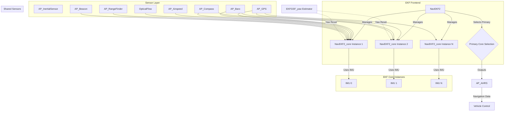
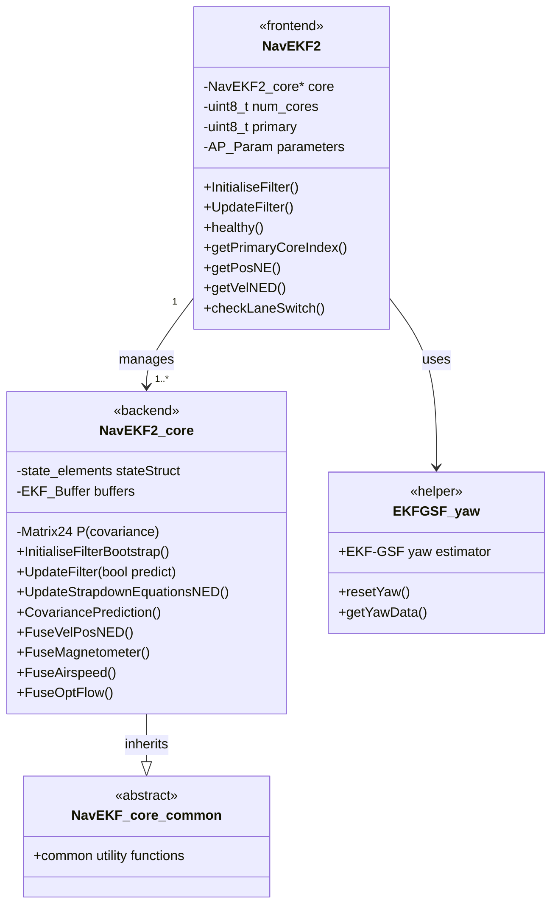

# AP_NavEKF2


## Table of Contents
- [Overview](#overview)
- [Mathematical Foundation](#mathematical-foundation)
- [State Vector Definition](#state-vector-definition)
- [Architecture](#architecture)
- [Sensor Fusion Algorithms](#sensor-fusion-algorithms)
- [Multi-IMU Support](#multi-imu-support)
- [Health Monitoring](#health-monitoring)
- [GPS Glitch Detection](#gps-glitch-detection)
- [GSF Yaw Estimator Integration](#gsf-yaw-estimator-integration)
- [Configuration Parameters](#configuration-parameters)
- [Tuning Guide](#tuning-guide)
- [API Reference](#api-reference)
- [Integration Examples](#integration-examples)
- [Performance Considerations](#performance-considerations)
- [Testing](#testing)

## Overview

AP_NavEKF2 is a 28-state Extended Kalman Filter implementation for autonomous vehicle navigation. It provides high-accuracy attitude, position, and velocity estimation by fusing data from multiple sensor types including GPS, IMU (Inertial Measurement Unit), magnetometer, barometer, airspeed sensor, optical flow, and range beacons.

**Source Files**: `/libraries/AP_NavEKF2/`
- `AP_NavEKF2.h` - Main class interface and parameter definitions
- `AP_NavEKF2_core.h` - Core filter implementation
- `AP_NavEKF2.cpp` - Frontend implementation
- `AP_NavEKF2_core.cpp` - Core state updates and initialization
- `AP_NavEKF2_*Fusion.cpp` - Sensor-specific fusion modules
- `AP_NavEKF2_Outputs.cpp` - Output data retrieval
- `AP_NavEKF2_Control.cpp` - Mode control and health monitoring

**Key Features**:
- **28-state Extended Kalman Filter** with quaternion attitude representation
- **Multi-sensor fusion** supporting GPS, magnetometer, barometer, airspeed, optical flow, range beacons, and external navigation
- **Multi-IMU support** with cooperative CPU budgeting and lane switching
- **Robust health monitoring** with innovation consistency checks and automatic fallback
- **GPS glitch detection and recovery** with configurable gates
- **GSF yaw estimator integration** for magnetic anomaly handling
- **Sequential sensor fusion** for computational efficiency
- **Vehicle-specific tuning** for copter, plane, and rover platforms

**Design Philosophy**:
AP_NavEKF2 implements a sequential fusion approach where each sensor measurement is processed independently in the order it is received. This provides computational advantages over batch processing while maintaining estimation accuracy. The filter uses a 28-state vector including attitude, velocity, position, sensor biases, magnetic fields, and wind estimates.

## Mathematical Foundation

AP_NavEKF2 is based on the Extended Kalman Filter derivation by Paul Riseborough, available at:
[https://github.com/priseborough/InertialNav/blob/master/derivations/RotationVectorAttitudeParameterisation/GenerateNavFilterEquations.m](https://github.com/priseborough/InertialNav/blob/master/derivations/RotationVectorAttitudeParameterisation/GenerateNavFilterEquations.m)

### Core Algorithm

The EKF operates in two main phases:

#### 1. Prediction Phase

**IMU-based State Propagation** (Source: `AP_NavEKF2_core.cpp:UpdateStrapdownEquationsNED()`)

The filter propagates states forward using IMU measurements at the sensor update rate (typically 400Hz):

```
Angular rate prediction:
ω = ω_measured - b_gyro - (b_gyro_scale × ω_measured)

Attitude update (quaternion):
q̇ = 0.5 × q ⊗ [0, ω]

Velocity update:
v̇ = C_bn × (a_measured - b_accel) + g_ned

Position update:
ṗ = v
```

Where:
- `ω_measured` = measured angular rates from gyroscope (rad/s)
- `b_gyro` = gyro bias estimates (rad/s)
- `b_gyro_scale` = gyro scale factor errors
- `q` = attitude quaternion
- `C_bn` = rotation matrix from body to NED frame
- `a_measured` = measured specific forces from accelerometer (m/s²)
- `b_accel` = Z-axis accelerometer bias estimate (m/s²)
- `g_ned` = gravity vector in NED frame [0, 0, 9.80665] (m/s²)
- `v` = velocity vector in NED frame (m/s)
- `p` = position vector in NED frame (m)

**Covariance Prediction** (Source: `AP_NavEKF2_core.cpp:CovariancePrediction()`)

The state covariance matrix P is propagated using:

```
P[k+1] = F × P[k] × F^T + Q
```

Where:
- `F` = state transition matrix (Jacobian of state equations)
- `Q` = process noise covariance matrix
- `P` = state covariance matrix (28×28)

#### 2. Update Phase (Sequential Fusion)

For each sensor measurement, the filter performs:

**Innovation Calculation**:
```
y = z_measured - h(x̂)
```

**Innovation Covariance**:
```
S = H × P × H^T + R
```

**Kalman Gain**:
```
K = P × H^T × S^-1
```

**State Update**:
```
x̂[k+1] = x̂[k] + K × y
```

**Covariance Update**:
```
P[k+1] = (I - K × H) × P[k]
```

Where:
- `z_measured` = sensor measurement
- `h(x̂)` = measurement prediction function
- `H` = measurement Jacobian matrix
- `R` = measurement noise covariance
- `y` = innovation (measurement residual)
- `S` = innovation covariance
- `K` = Kalman gain matrix

### Coordinate Systems

AP_NavEKF2 uses the **North-East-Down (NED)** coordinate system:
- **North**: Positive towards true north
- **East**: Positive towards east
- **Down**: Positive downward (altitude is negative of height)

Body frame axes (aircraft convention):
- **X**: Forward (roll axis)
- **Y**: Right (pitch axis)
- **Z**: Down (yaw axis)

### Numerical Stability

The implementation includes several numerical safeguards (Source: `AP_NavEKF2_core.cpp`):

1. **Covariance Symmetry Enforcement** - Forces P matrix symmetry after updates
2. **Variance Constraints** - Limits diagonal covariance terms to prevent numerical blow-up
3. **State Constraints** - Enforces physical limits on state values
4. **Innovation Gating** - Rejects outlier measurements exceeding threshold
5. **Conditional Updates** - Skips updates when innovation covariance is ill-conditioned

## State Vector Definition

The AP_NavEKF2 filter maintains a 28-state vector representation of vehicle motion and sensor characteristics.

**Source**: `libraries/AP_NavEKF2/AP_NavEKF2_core.h:405-416`

```cpp
struct state_elements {
    Vector3F    angErr;         // 0..2   - Rotation vector describing attitude error
    Vector3F    velocity;       // 3..5   - NED velocity (m/s)
    Vector3F    position;       // 6..8   - NED position relative to origin (m)
    Vector3F    gyro_bias;      // 9..11  - Gyroscope bias estimates (rad/s)
    Vector3F    gyro_scale;     // 12..14 - Gyroscope scale factor errors
    ftype       accel_zbias;    // 15     - Z-axis accelerometer bias (m/s²)
    Vector3F    earth_magfield; // 16..18 - Earth magnetic field NED (mgauss)
    Vector3F    body_magfield;  // 19..21 - Body fixed magnetic field (mgauss)
    Vector2F    wind_vel;       // 22..23 - NE wind velocity (m/s)
    QuaternionF quat;           // 24..27 - Attitude quaternion (body to NED)
};
```

### State Descriptions

#### States 0-2: Angular Error Vector (angErr)
- **Purpose**: Represents small angle attitude errors using rotation vector parameterization
- **Units**: Radians
- **Range**: Typically ±0.5 rad during normal operation
- **Usage**: Updated during attitude corrections, converted to quaternion updates
- **Note**: Using rotation vectors instead of Euler angles avoids gimbal lock

#### States 3-5: NED Velocity (velocity)
- **Purpose**: Vehicle velocity in North-East-Down frame
- **Units**: meters/second
- **Components**:
  - State 3: North velocity
  - State 4: East velocity
  - State 5: Down velocity (positive = descending)
- **Updated by**: GPS velocity, optical flow, external navigation
- **Typical Range**: ±100 m/s (vehicle dependent)

#### States 6-8: NED Position (position)
- **Purpose**: Vehicle position relative to EKF origin
- **Units**: meters
- **Components**:
  - State 6: North position
  - State 7: East position
  - State 8: Down position (positive = below origin)
- **Updated by**: GPS position, external navigation, range beacons
- **Constraints**: Limited to ±1e6 m (or ±50e6 m for double precision builds)
- **Note**: Origin set by `setOriginLLH()` or automatically initialized

#### States 9-11: Gyroscope Bias (gyro_bias)
- **Purpose**: Estimates gyro sensor bias for X, Y, Z body axes
- **Units**: radians/second
- **Typical Magnitude**: ±0.05 rad/s
- **Dynamics**: Slowly varying, modeled as random walk
- **Process Noise**: Controlled by `EK2_GBIAS_P_NSE` parameter (default: 1e-4 rad/s²)
- **Application**: Subtracted from gyro measurements before attitude integration

#### States 12-14: Gyroscope Scale Factor (gyro_scale)
- **Purpose**: Estimates scale factor errors in gyro measurements
- **Units**: dimensionless (fractional error)
- **Application**: `ω_corrected = ω_measured × (1 + gyro_scale)`
- **Typical Range**: ±0.01 (±1% scale error)
- **Process Noise**: Controlled by `EK2_GSCALE_P_NSE` parameter (default: 5e-4/s)

#### State 15: Z-Axis Accelerometer Bias (accel_zbias)
- **Purpose**: Estimates accelerometer bias in body Z-axis (vertical)
- **Units**: meters/second²
- **Typical Range**: ±1 m/s²
- **Dynamics**: Slowly varying with temperature and vibration
- **Process Noise**: Controlled by `EK2_ABIAS_P_NSE` parameter (default: 5e-3 m/s³)
- **Note**: Only Z-axis bias estimated due to observability constraints

#### States 16-18: Earth Magnetic Field (earth_magfield)
- **Purpose**: Estimates local earth magnetic field in NED frame
- **Units**: milligauss (mgauss)
- **Components**:
  - State 16: North magnetic field
  - State 17: East magnetic field
  - State 18: Down magnetic field
- **Typical Values**: Total field magnitude 200-600 mgauss depending on location
- **Process Noise**: Controlled by `EK2_MAGE_P_NSE` parameter (default: 1e-3 mgauss/s)
- **Constraints**: Constrained using World Magnetic Model (WMM) tables

#### States 19-21: Body Magnetic Field (body_magfield)
- **Purpose**: Estimates magnetic field from vehicle ferrous materials/electronics
- **Units**: milligauss (mgauss)
- **Components**: X, Y, Z in body frame
- **Typical Magnitude**: 50-200 mgauss
- **Process Noise**: Controlled by `EK2_MAGB_P_NSE` parameter (default: 1e-4 mgauss/s)
- **Usage**: In-flight magnetometer calibration
- **Note**: Represents hard-iron offsets

#### States 22-23: Wind Velocity (wind_vel)
- **Purpose**: Estimates horizontal wind velocity
- **Units**: meters/second
- **Components**:
  - State 22: North wind velocity
  - State 23: East wind velocity
- **Typical Range**: ±30 m/s
- **Updated by**: Airspeed sensor (when available)
- **Process Noise**: Controlled by `EK2_WIND_P_NSE` parameter, scaled by height rate
- **Note**: Only horizontal components estimated; vertical wind assumed small

#### States 24-27: Attitude Quaternion (quat)
- **Purpose**: Primary attitude representation (body to NED frame rotation)
- **Units**: dimensionless (unit quaternion)
- **Components**: [q0, q1, q2, q3] where q0 is scalar part
- **Constraint**: Normalized to unit length (q0² + q1² + q2² + q3² = 1)
- **Advantages**: No singularities, efficient rotation operations
- **Conversion**: Can be converted to Euler angles or rotation matrices
- **Note**: Updated via `angErr` states to maintain normalization

### State Observability

Not all states are directly observable from sensor measurements. The EKF relies on vehicle motion and sensor diversity to make states observable:

| State Group | Primary Observers | Requires Motion/Condition |
|-------------|------------------|---------------------------|
| Attitude (quat, angErr) | Gyro, Accel, Mag, GPS velocity | Accelerations for leveling |
| Velocity | GPS, Optical flow, External nav | - |
| Position | GPS, External nav, Range beacons | - |
| Gyro bias | Gyro, Mag, GPS | Vehicle rotation |
| Gyro scale | Gyro, Mag, GPS | Sustained rotation |
| Accel Z bias | Baro, GPS height, Range finder | Vertical motion |
| Earth mag field | Magnetometer | 3D vehicle rotation |
| Body mag field | Magnetometer | 3D vehicle rotation |
| Wind velocity | Airspeed sensor | Forward flight |

## Architecture

AP_NavEKF2 uses a frontend-backend architecture to support multiple EKF instances running simultaneously.

### System Architecture



### Class Hierarchy

**Source**: `libraries/AP_NavEKF2/AP_NavEKF2.h`, `AP_NavEKF2_core.h`



### Component Responsibilities

#### NavEKF2 (Frontend)
**Source**: `AP_NavEKF2.h`, `AP_NavEKF2.cpp`

Responsibilities:
- **Parameter Management**: Stores and exposes tuning parameters via AP_Param
- **Core Instance Management**: Allocates and manages multiple NavEKF2_core instances
- **Primary Core Selection**: Determines which core provides output based on health metrics
- **Sensor Data Distribution**: Distributes sensor measurements to all cores
- **Lane Switching**: Implements failsafe lane switching logic
- **External Interface**: Provides unified API for vehicle code

Key Methods:
- `InitialiseFilter()` - Allocates cores based on IMU mask
- `UpdateFilter()` - Calls update on all cores, selects primary
- `checkLaneSwitch()` - Attempts to switch to healthier core
- `getPosNE()`, `getVelNED()`, etc. - Returns data from primary core

#### NavEKF2_core (Backend)
**Source**: `AP_NavEKF2_core.h`, `AP_NavEKF2_core.cpp`

Responsibilities:
- **State Estimation**: Maintains 28-state vector and covariance matrix
- **IMU Integration**: Integrates gyro and accelerometer measurements
- **Sensor Fusion**: Fuses GPS, magnetometer, barometer, and other sensors
- **Health Monitoring**: Tracks innovation statistics and filter health
- **Output Buffering**: Maintains time-aligned output history

Key Methods:
- `UpdateStrapdownEquationsNED()` - IMU-based state propagation
- `CovariancePrediction()` - Covariance propagation
- `FuseVelPosNED()` - GPS and external nav fusion
- `FuseMagnetometer()` - Magnetometer fusion
- `FuseAirspeed()` - Airspeed sensor fusion
- `FuseOptFlow()` - Optical flow fusion

### Data Flow

**Sensor Measurement Pipeline** (Source: `AP_NavEKF2_core.cpp:UpdateFilter()`)

1. **IMU Data Arrival** (400Hz typical):
   - IMU samples buffered with timestamps
   - Prediction triggered when buffer sufficient

2. **Prediction Step**:
   - `UpdateStrapdownEquationsNED()` - Propagate states using IMU
   - `CovariancePrediction()` - Propagate covariance matrix
   - `ConstrainStates()` - Apply state limits
   - `ConstrainVariances()` - Limit covariance growth

3. **Measurement Fusion** (as measurements arrive):
   - GPS position/velocity → `FuseVelPosNED()`
   - Magnetometer → `FuseMagnetometer()`
   - Barometer → `FuseVelPosNED()` (height)
   - Airspeed → `FuseAirspeed()`
   - Optical flow → `FuseOptFlow()`
   - Range beacons → `FuseRngBcn()`

4. **Output Generation**:
   - States converted to output format (quaternion, velocity, position)
   - Stored in time-indexed circular buffer
   - Time-delayed outputs retrieved for sensor fusion timing

### Threading and Timing

**Thread Safety**: 
- Frontend and cores called from AP_AHRS update context (main thread)
- No internal threading; thread safety provided by caller
- Sensor data buffered to handle timing differences

**Update Rates**:
- IMU sampling: 400Hz (typical) - defined by hardware
- EKF prediction: Every 1-4 IMU samples based on `_framesPerPrediction`
- Target dt: 10ms (EKF_TARGET_DT = 0.01f)
- GPS updates: 5-10Hz (sensor dependent)
- Magnetometer: 50-100Hz
- Barometer: 50-100Hz

**Timing Constraints**:
- Total EKF update time budget: ~1ms per core at 400Hz IMU rate
- Prediction phase: ~200-300μs
- Each sensor fusion: ~50-200μs depending on type

## Sensor Fusion Algorithms

AP_NavEKF2 implements sequential fusion where each sensor type is processed independently. This section describes the fusion approach for each sensor.

### GPS Position and Velocity Fusion

**Source**: `AP_NavEKF2_PosVelFusion.cpp`

**Measurements Used**:
- GPS position (North, East) in meters
- GPS velocity (North, East, Down) in m/s
- GPS height in meters (when height source is GPS)

**Fusion Modes** (Controlled by `EK2_GPS_TYPE` parameter):
- Mode 0: Use 3D velocity + 2D position (default for most vehicles)
- Mode 1: Use 2D velocity + 2D position (constrains vertical velocity)
- Mode 2: Use 2D position only (velocity dead reckoning)
- Mode 3: Inhibit GPS use completely

**Observation Model**:
```
h_pos(x) = [position.x, position.y, position.z]
h_vel(x) = C_nb × velocity_ned
```

**Innovation Gating**:
- Velocity innovation gate: `EK2_VELNE_I_GATE` (default: 500%)
- Position innovation gate: `EK2_POSNE_I_GATE` (default: 500%)
- Innovations exceeding gate threshold are rejected

**Antenna Offset Correction**:
GPS measurements are corrected for antenna offset from IMU:
```
pos_corrected = pos_gps - C_nb × antenna_offset
```

**Quality Checks**:
1. GPS fix type must be 3D or better
2. Horizontal accuracy < threshold (from `EK2_GPS_CHECK`)
3. Satellite count > minimum (from `EK2_GPS_CHECK`)
4. Vertical speed within limits
5. Horizontal drift within limits

### Magnetometer Fusion

**Source**: `AP_NavEKF2_MagFusion.cpp`

**Measurements Used**:
- 3-axis magnetometer readings in body frame (mgauss)

**Observation Model**:
Earth field and body field (hard-iron) fusion:
```
h_mag(x) = C_nb × earth_magfield + body_magfield
```

**Fusion Strategy**:
Sequential fusion of X, Y, Z components to reduce computational cost:
```
For axis in [X, Y, Z]:
    innovation = mag_measured[axis] - h_mag[axis]
    if |innovation| < gate_threshold:
        Update states using Kalman gain for this axis
```

**Innovation Gating**:
- Threshold: `EK2_MAG_I_GATE` (default: 300%)
- Per-axis rejection: Rejects individual axes if innovation exceeds gate

**Declination Handling**:
- Earth field constrained using World Magnetic Model (WMM)
- Declination automatically applied based on location
- Field magnitude constrained to geophysical limits

**Inflight Calibration** (Controlled by `EK2_MAG_CAL`):
- Mode 0: Disabled
- Mode 1: Enable when airborne
- Mode 2: Enable when armed
- Mode 3: Enable always (default for copters)

Body magnetic field estimates updated when enabled, providing automatic hard-iron calibration.

**Yaw Resets**:
- Magnetic anomalies detected via large sustained innovations
- GSF yaw estimator used for recovery
- Maximum 2 yaw resets per flight due to magnetic anomalies
- Resets disabled above 2.5m altitude initially

### Barometer Fusion

**Source**: `AP_NavEKF2_PosVelFusion.cpp` (height fusion)

**Measurements Used**:
- Barometric altitude in meters

**Observation Model**:
```
h_baro(x) = position.z + origin_height
```

**Innovation Gating**:
- Height innovation gate: `EK2_ALT_I_GATE` (default: 500%)

**Height Source Selection** (Controlled by `EK2_ALT_SOURCE`):
- 0: Barometer (default for most conditions)
- 1: Range finder (for terrain following at low altitude)
- 2: GPS height (when barometer unavailable)
- 3: Range beacon height
- 4: External navigation height

**Altitude Reference**:
- Barometer reset to zero at arming location
- EKF origin height adjusted to maintain absolute altitude
- Allows relative height operation without GPS

### Airspeed Fusion

**Source**: `AP_NavEKF2_AirDataFusion.cpp`

**Measurements Used**:
- True airspeed (TAS) in m/s from pitot tube

**Observation Model**:
```
v_airspeed = velocity_ned - wind_vel
TAS = |v_airspeed|
```

**Enables Estimation Of**:
- Wind velocity (states 22-23)
- Improved velocity accuracy in forward flight

**Innovation Gating**:
- TAS innovation gate: `EK2_TAS_I_GATE` (default: 500% for planes)

**Synthetic Sideslip Fusion**:
When airspeed available, synthetic sideslip measurement (zero sideslip assumption) improves lateral velocity:
```
sideslip = atan2(v_airspeed.y, v_airspeed.x) ≈ 0
```

**Requirements**:
- Airspeed sensor calibrated and healthy
- Forward flight with adequate airspeed (typically > 7 m/s)
- Used primarily in fixed-wing and VTOL aircraft

### Optical Flow Fusion

**Source**: `AP_NavEKF2_OptFlowFusion.cpp`

**Measurements Used**:
- Flow rates in rad/s about sensor X and Y axes
- Gyro rates from flow sensor (if available)
- Range finder height
- Flow quality metric (0-255)

**Observation Model**:
```
range = terrain_height - position.z - sensor_offset.z
optical_flow = (C_nb × velocity_ned + C_nb × (ω × sensor_offset)) / range
```

**Enables**:
- Velocity estimation without GPS
- Position hold in GPS-denied environments
- Requires range finder for height above ground

**Innovation Gating**:
- Flow innovation gate: `EK2_FLOW_I_GATE` (default: 300%)

**Quality Requirements**:
- Flow quality > minimum threshold
- Range finder providing valid height
- Flow rates within `EK2_MAX_FLOW` limit (default: 2.5 rad/s)
- Height above ground suitable for flow sensor

**Height Control**:
When using optical flow as primary navigation:
- Height source typically switched to range finder (`EK2_ALT_SOURCE = 1`)
- Position relative to terrain maintained
- Absolute height via barometer for altitude changes

### Range Beacon Fusion

**Source**: `AP_NavEKF2_RngBcnFusion.cpp`

**Measurements Used**:
- Range measurements to multiple beacons (meters)
- Beacon positions in NED frame

**Observation Model**:
```
range_predicted = |position - beacon_position_ned|
```

**Positioning Modes**:
1. **Dynamic Mode**: Fuse range measurements while vehicle moving
2. **Static Mode**: Calculate position from multiple range measurements when stationary

**Requirements**:
- Minimum 4 beacons for 3D position
- Beacons configured with known positions
- Range measurements with acceptable variance

**Innovation Gating**:
- Range innovation gate: `EK2_RNG_I_GATE` (default: 500%)

**Applications**:
- Indoor navigation
- GPS-denied position estimation
- Complements or replaces GPS positioning

### External Navigation Fusion

**Source**: `AP_NavEKF2_PosVelFusion.cpp`, `AP_NavEKF2.cpp:writeExtNavData()`

**Measurements Used**:
- Position in NED frame (meters)
- Quaternion attitude (optional)
- Velocity in NED frame (optional)
- Measurement uncertainties

**Sources**:
- Visual-Inertial Odometry (VIO) systems
- Motion capture systems
- Visual SLAM systems
- Other external positioning systems

**Fusion Approach**:
- Position and velocity fused similar to GPS
- Can provide yaw reference when quaternion provided
- Handles position resets from external system

**Advantages**:
- Sub-meter positioning accuracy in GPS-denied environments
- Can operate indoors or in urban canyons
- Complementary error characteristics to GPS

### Range Finder Height Fusion

**Source**: `AP_NavEKF2_PosVelFusion.cpp` (height fusion)

**Measurements Used**:
- Terrain distance in meters

**Observation Model**:
```
h_rng(x) = terrain_height - position.z
```

**Usage Conditions**:
- Altitude < threshold (typically when optical flow active)
- Terrain stable (configured via `setTerrainHgtStable()`)
- Range finder healthy and within valid range

**Advantages**:
- Provides accurate height above ground for landing
- Enables terrain following
- Complements barometer for local height variations

## Multi-IMU Support

AP_NavEKF2 supports running multiple filter instances simultaneously, each using a different IMU. This provides redundancy and improved fault tolerance.

### Core Allocation

**Source**: `AP_NavEKF2.cpp:InitialiseFilter()`

**IMU Mask Configuration** (`EK2_IMU_MASK` parameter):
- Bitmask specifying which IMUs to use
- Bit 0 (value 1): Use IMU 0
- Bit 1 (value 2): Use IMU 1  
- Bit 2 (value 4): Use IMU 2
- Default: 3 (use IMU 0 and IMU 1)

**Example Configurations**:
```
EK2_IMU_MASK = 1  → Single core using IMU 0
EK2_IMU_MASK = 3  → Two cores using IMU 0 and IMU 1 (default)
EK2_IMU_MASK = 7  → Three cores using IMU 0, 1, and 2
```

**Core Initialization**:
Each enabled core:
1. Allocated from heap using `new` operator
2. Associated with specific IMU index
3. Shares same parameters from frontend
4. Maintains independent state vector and covariance
5. Receives common sensor data (GPS, mag, baro)

### Primary Core Selection

**Source**: `AP_NavEKF2.cpp:UpdateFilter()`

**Selection Criteria** (evaluated each update cycle):

1. **Health Status** - Core must pass `healthy()` check:
   - Filter initialized and not timed out
   - No NaN detected in states
   - Innovation variances within bounds
   - Critical fusion operations not failing

2. **Error Score** - Lower is better (Source: `AP_NavEKF2_core.cpp:errorScore()`):
   ```cpp
   score = velocity_variance + position_variance + 
           attitude_variance_scaled + innovation_test_ratios
   ```

3. **Sticky Selection** - Hysteresis prevents excessive switching:
   - New core must have significantly better score to take over
   - Prevents oscillation between similar-quality cores

**Primary Core Behavior**:
- Only primary core outputs used for vehicle control
- Determined by `getPrimaryCoreIndex()`
- Can change during flight if health degrades
- Lane switches logged for post-flight analysis

### Lane Switching

**Source**: `AP_NavEKF2.cpp:checkLaneSwitch()`

**Automatic Lane Switching**:
Called when vehicle code detects potential EKF failure conditions:
- Large position innovation on current primary
- EKF failsafe about to trigger
- Poor innovation consistency

**Lane Switch Decision Process**:
```cpp
1. Calculate innovation_magnitude for each core
2. Find core with lowest innovation_magnitude
3. If better core found AND significantly better:
   - Switch primary to better core
   - Trigger position/velocity reset in vehicle code
   - Log lane switch event
```

**Yaw Reset Request**:
`requestYawReset()` can be called to reset yaw to GSF estimate:
- Used when magnetic anomaly suspected
- All cores attempt yaw reset
- Timeout after 5 seconds if not successful

### Cooperative CPU Budgeting

**Execution Strategy**:

To maintain real-time performance with multiple cores:

1. **Staggered Updates**:
   - Cores update sequentially, not in parallel
   - Each core allocated time slice
   - Long-running operations split across frames

2. **Prediction Scheduling**:
   - Not all cores predict every IMU sample
   - `_framesPerPrediction` spreads load
   - Typical: predict every 2-4 IMU samples (2.5-10ms at 400Hz)

3. **Fusion Prioritization**:
   - Critical sensors (GPS, mag) fused first
   - Optional sensors (flow, beacons) may skip if time limited
   - Health monitoring prevents runaway processing

### Bias Estimation Across IMUs

**Source**: `AP_NavEKF2_core.h:488-492`

**Inactive IMU Bias Tracking**:
```cpp
struct {
    Vector3F gyro_bias;
    Vector3F gyro_scale;
    ftype accel_zbias;
} inactiveBias[INS_MAX_INSTANCES];
```

Each core maintains bias estimates for IMUs it's NOT using:
- Enables rapid core switching without bias convergence delay
- Biases learned from active core's sensor corrections
- Transferred when switching to different IMU

### Health Monitoring Per Core

**Source**: `AP_NavEKF2_core.cpp:healthy()`

**Per-Core Health Checks**:
1. **Initialization**: Core must complete initialization
2. **State Validity**: No NaN in state vector
3. **Covariance Bounds**: Variances not excessive
4. **Innovation Consistency**: Innovations within gates
5. **Timeout**: Recent successful measurements
6. **Fault Flags**: No critical fault conditions

**Health Status Available via API**:
- `healthy()` - Boolean consolidated health
- `getFilterFaults()` - Detailed fault bitmask
- `getFilterStatus()` - Comprehensive status structure

### Benefits of Multi-IMU Operation

1. **Sensor Failure Detection**:
   - Cores using different IMUs provide cross-checks
   - Failed IMU identified by poor error score
   - Automatic switchover to healthy IMU

2. **Improved Accuracy**:
   - Multiple independent estimates reduce random errors
   - Can detect and reject IMU anomalies
   - Provides confidence metrics

3. **Vibration Isolation**:
   - Different IMU mounting locations may have different vibration exposure
   - Healthier IMU selected automatically

4. **Graceful Degradation**:
   - System continues operation with subset of sensors
   - No single point of failure

### Lane Switching Example

```
Time    Primary   Core 0 Score   Core 1 Score   Event
-----   -------   ------------   ------------   -----
0.0s      0          0.45           0.48        Normal operation
10.2s     0          0.43           0.44        Core 0 slightly better
15.8s     0          2.85           0.52        Core 0 GPS glitch detected
15.9s     1          2.91           0.50        Switched to Core 1
16.5s     1          0.47           0.49        Core 0 recovered
25.0s     1          0.46           0.48        Remain on Core 1 (hysteresis)
```

## Health Monitoring

AP_NavEKF2 implements comprehensive health monitoring to detect filter divergence, sensor failures, and numerical issues.

### Innovation Consistency Checks

**Source**: `AP_NavEKF2_Measurements.cpp`, individual fusion files

**Innovation Definition**:
```
innovation = measurement - predicted_measurement
innovation_variance = H × P × H^T + R
normalized_innovation = innovation² / innovation_variance
```

**Per-Sensor Innovation Gates**:

| Sensor | Parameter | Default Gate | Units |
|--------|-----------|--------------|-------|
| GPS Velocity | EK2_VELNE_I_GATE | 500% | % of std dev |
| GPS Position | EK2_POSNE_I_GATE | 500% | % of std dev |
| Height | EK2_ALT_I_GATE | 500% | % of std dev |
| Magnetometer | EK2_MAG_I_GATE | 300% | % of std dev |
| Airspeed | EK2_TAS_I_GATE | 500% | % of std dev |
| Optical Flow | EK2_FLOW_I_GATE | 300% | % of std dev |
| Range Beacon | EK2_RNG_I_GATE | 500% | % of std dev |

**Gate Threshold Calculation**:
```cpp
gate_threshold = sq(gate_parameter / 100.0f) × degrees_of_freedom
// Example: 500% gate for 2D measurement = sq(5.0) × 2 = 50.0
```

**Innovation Test Ratio**:
```cpp
test_ratio = normalized_innovation / gate_threshold
// test_ratio > 1.0 = Measurement rejected
// test_ratio > 0.5 = Warning condition
```

### Variance Constraints

**Source**: `AP_NavEKF2_core.cpp:ConstrainVariances()`

**Diagonal Covariance Limits**:

Prevention of filter divergence by constraining state variances:

```cpp
// Attitude variance limits
P[0][0] = constrain(P[0][0], 0.0f, 1.0f);  // Roll error variance
P[1][1] = constrain(P[1][1], 0.0f, 1.0f);  // Pitch error variance  
P[2][2] = constrain(P[2][2], 0.0f, 1.0f);  // Yaw error variance

// Velocity variance limits (m/s)²
P[3][3] = constrain(P[3][3], 0.0f, 1.0e4f); // North velocity
P[4][4] = constrain(P[4][4], 0.0f, 1.0e4f); // East velocity
P[5][5] = constrain(P[5][5], 0.0f, 1.0e4f); // Down velocity

// Position variance limits (m)²
P[6][6] = constrain(P[6][6], 0.0f, 1.0e6f); // North position
P[7][7] = constrain(P[7][7], 0.0f, 1.0e6f); // East position
P[8][8] = constrain(P[8][8], 0.0f, 1.0e6f); // Down position

// Other states similarly constrained...
```

**Purpose**:
- Prevents numerical overflow
- Catches integration errors
- Maintains filter stability
- Provides bounded uncertainty estimates

### State Constraints

**Source**: `AP_NavEKF2_core.cpp:ConstrainStates()`

**Physical Limits on States**:

```cpp
// Position limits (prevents accumulation errors)
stateStruct.position.x = constrain(stateStruct.position.x, 
                                   -EK2_POSXY_STATE_LIMIT, 
                                   EK2_POSXY_STATE_LIMIT);
// EK2_POSXY_STATE_LIMIT = 1e6 m (or 50e6 m for double precision)

// Attitude quaternion normalization
stateStruct.quat.normalize();

// Gyro bias limits (rad/s)
stateStruct.gyro_bias.x = constrain(stateStruct.gyro_bias.x, -0.5f, 0.5f);
stateStruct.gyro_bias.y = constrain(stateStruct.gyro_bias.y, -0.5f, 0.5f);
stateStruct.gyro_bias.z = constrain(stateStruct.gyro_bias.z, -0.5f, 0.5f);

// Accel Z bias limit (m/s²)
stateStruct.accel_zbias = constrain(stateStruct.accel_zbias, -3.0f, 3.0f);

// Wind velocity limits (m/s)
stateStruct.wind_vel.x = constrain(stateStruct.wind_vel.x, -100.0f, 100.0f);
stateStruct.wind_vel.y = constrain(stateStruct.wind_vel.y, -100.0f, 100.0f);
```

### Filter Fault Detection

**Source**: `AP_NavEKF2_Outputs.cpp:getFilterFaults()`

**Fault Bitmask Definition**:
```cpp
bit 0: Quaternions are NaN
bit 1: Velocities are NaN  
bit 2: Badly conditioned X magnetometer fusion
bit 3: Badly conditioned Y magnetometer fusion
bit 4: Badly conditioned Z magnetometer fusion
bit 5: Badly conditioned airspeed fusion
bit 6: Badly conditioned synthetic sideslip fusion
bit 7: Filter is not initialised
```

**NaN Detection**:
```cpp
if (!stateStruct.quat.is_nan() || 
    !stateStruct.velocity.is_nan() ||
    !stateStruct.position.is_nan()) {
    // Set appropriate fault bit
    // Trigger filter reset or failsafe
}
```

**Fusion Conditioning Check**:
During each sensor update, innovation variance checked:
```cpp
if (innovation_variance < min_threshold || 
    innovation_variance > max_threshold) {
    // Mark fusion as badly conditioned
    // Skip update, set fault flag
}
```

### Filter Status Structure

**Source**: `AP_NavEKF/AP_Nav_Common.h:nav_filter_status`

Comprehensive status provided via `getFilterStatus()`:

```cpp
struct nav_filter_status {
    bool attitude           : 1;  // True if attitude estimate valid
    bool horiz_vel          : 1;  // True if horizontal velocity estimate valid
    bool vert_vel           : 1;  // True if vertical velocity estimate valid
    bool horiz_pos_rel      : 1;  // True if relative horizontal position estimate valid
    bool horiz_pos_abs      : 1;  // True if absolute horizontal position estimate valid
    bool vert_pos           : 1;  // True if vertical position estimate valid
    bool terrain_alt        : 1;  // True if terrain height estimate valid
    bool const_pos_mode     : 1;  // True if in constant position mode
    bool pred_horiz_pos_rel : 1;  // True if predicted relative position available
    bool pred_horiz_pos_abs : 1;  // True if predicted absolute position available
    bool takeoff_detected   : 1;  // True if takeoff detected
    bool takeoff_expected   : 1;  // True if takeoff expected
    bool gps_glitching      : 1;  // True if GPS glitch detected
    bool gps_quality_good   : 1;  // True if GPS quality acceptable
};
```

### Timeout Detection

**Sources**: Various timeouts tracked in `AP_NavEKF2_core.cpp`

**Critical Measurement Timeouts**:
```cpp
// GPS timeout (vehicle dependent)
if (imuSampleTime_ms - lastTimeGpsReceived_ms > gpsRetryTimeNoTAS) {
    // Trigger GPS timeout handling
    // May switch to dead reckoning
}

// Magnetometer timeout
if (imuSampleTime_ms - lastMagUpdate_ms > 200) {
    // Mag timeout - use gyro only for yaw
}

// Height measurement timeout  
if (imuSampleTime_ms - lastHgtMeas_ms > 5000) {
    // Critical - filter may become unhealthy
}
```

**Timeout Actions**:
- Reset corresponding state estimates
- Increase state uncertainties
- Switch to fallback sensors
- May trigger filter reinitialization

### Pre-Arm Checks

**Source**: `AP_NavEKF2.cpp:pre_arm_check()`

**Pre-Flight Validation**:
Before arming, filter must pass:

1. **Initialization Complete**: Filter fully initialized
2. **Health Status**: Core marked healthy
3. **Innovation Bounds**: All innovations within acceptable limits
4. **GPS Quality**: If GPS used, must meet quality thresholds
5. **Gyro Bias Convergence**: Gyro biases stable
6. **Attitude Accuracy**: Attitude variance below threshold

**Failure Messages**:
Specific failure reasons provided in `failure_msg` buffer:
- "EKF2 not started"
- "EKF2 unhealthy"
- "EKF2 high IMU errors"
- "EKF2 GPS errors"

## GPS Glitch Detection

AP_NavEKF2 implements sophisticated GPS anomaly detection to prevent position jumps from corrupting the navigation solution.

**Source**: `AP_NavEKF2_Measurements.cpp`, `AP_NavEKF2_Control.cpp`

### Glitch Detection Algorithm

**Innovation-Based Detection**:

```cpp
// Calculate GPS position innovation
Vector2f posInnov = gps_pos_measured - predicted_pos;
float posInnovDistSq = posInnov.length_squared();

// Calculate innovation gate threshold  
float posInnovGate = sq(_gpsGlitchRadiusMax) + P_pos_variance;

// Check for glitch
if (posInnovDistSq > posInnovGate) {
    gpsGlitchDetected = true;
}
```

**Parameters**:
- `EK2_GLITCH_RAD` (default: 25m) - Maximum allowed position discrepancy
- Adapted based on position uncertainty (P matrix)
- Lower threshold when filter confident, higher when uncertain

### Glitch Handling Strategy

**Detection Phase** (first occurrence):
1. Innovation exceeds gate threshold
2. `gps_glitching` flag set in status
3. GPS measurement rejected
4. Position held using IMU dead reckoning

**Persistence Monitoring**:
```cpp
if (gpsGlitchDetected) {
    glitchCounter++;
    if (glitchCounter > GLITCH_PERSISTENCE_THRESHOLD) {
        // Sustained glitch - may need position reset
    }
} else {
    glitchCounter = 0;  // Clear counter on good measurement
}
```

**Recovery Options**:

**Option 1: Transient Glitch**
- GPS quality returns to normal within ~1-2 seconds
- Filter naturally converges back to GPS
- No special action required

**Option 2: Sustained Glitch**
- Glitch persists > 5 seconds
- Options:
  - Switch to alternate GPS receiver (if available)
  - Initiate lane switch to core with better GPS tracking
  - Trigger GPS yaw reset using GSF estimator
  - Fall back to non-GPS navigation (optical flow, beacons)

**Option 3: Position Reset**
- If alternate GPS confirms position different from current estimate
- AND alternate GPS quality good
- Consider position reset to GPS:
```cpp
if (alternate_gps_quality_good && 
    sustained_disagreement &&
    !recently_airborne) {
    ResetPosition();  // Reset to GPS position
}
```

### Innovation Clipping

**Source**: `AP_NavEKF2_PosVelFusion.cpp`

**Measurement Conditioning**:
Instead of rejecting GPS entirely during minor glitches, innovations can be clipped:

```cpp
// If innovation exceeds gate but within clipping limit
if (innovation_test_ratio > 1.0f && innovation_test_ratio < 10.0f) {
    // Clip innovation to gate threshold
    float clip_ratio = sqrt(gate_threshold / normalized_innovation);
    clipped_innovation = innovation * clip_ratio;
    // Fuse clipped measurement with increased noise
}
```

**Benefits**:
- Maintains filter tracking during marginal GPS conditions
- Prevents complete loss of position reference
- Gradual adaptation to position corrections

### Multipath Detection

**Characteristics of GPS Multipath**:
- Rapid position jumps (multi-meter scale)
- Often correlated with specific orientations or locations
- May affect subset of satellites differently

**Detection Indicators**:
1. Large horizontal position innovation
2. Vertical position consistent (or vice versa)
3. GPS velocity still reasonable
4. Sudden HDOP or satellite count change

**Mitigation**:
- Innovation gating rejects worst measurements
- Increased measurement noise during suspected multipath
- May temporarily reduce GPS fusion weight

### GPS Quality Monitoring

**Source**: `AP_NavEKF2_Control.cpp:calcGpsGoodForFlight()`

**GPS Quality Metrics Tracked**:
```cpp
struct gps_quality_metrics {
    uint8_t satellite_count;
    float horizontal_accuracy;  // m
    float vertical_accuracy;    // m
    float speed_accuracy;       // m/s
    float hdop;                 // Horizontal Dilution of Precision
    Vector3f velocity;
    bool fix_3d;
};
```

**Quality Thresholds** (configurable via `EK2_GPS_CHECK`):
- Minimum satellites: 6 (bit 0)
- Maximum HDOP: 2.5 (bit 1)
- Maximum speed error: 1.0 m/s (bit 2)
- Maximum position error: 5.0 m (bit 3)
- Maximum yaw error: 0.5 rad (bit 4)
- Maximum position drift: 0.3 m/s over 10s (bit 5)
- Maximum vertical speed: 0.7 m/s when stationary (bit 6)
- Maximum horizontal speed: 1.0 m/s when stationary (bit 7)

**Check Scaler**:
`EK2_CHECK_SCALE` (default: 100%) allows relaxing all thresholds proportionally

## GSF Yaw Estimator Integration

The Gaussian Sum Filter (GSF) yaw estimator provides an independent yaw reference for recovering from magnetic anomalies.

**Source**: `AP_NavEKF/EKFGSF_yaw.h`, `AP_NavEKF/EKFGSF_yaw.cpp`

### GSF Yaw Estimator Overview

**Purpose**:
- Provides yaw estimate independent of magnetometer
- Uses GPS velocity vector and IMU to infer heading
- Particularly useful for recovering from magnetic interference

**Algorithm**:
Multiple EKF instances run in parallel, each with different yaw hypothesis:
```
GSF Instance 0: yaw = 0°
GSF Instance 1: yaw = 45°  
GSF Instance 2: yaw = 90°
GSF Instance 3: yaw = 135°
GSF Instance 4: yaw = 180°
GSF Instance 5: yaw = 225°
GSF Instance 6: yaw = 270°
GSF Instance 7: yaw = 315°
```

Each instance:
- Predicts velocity based on IMU and hypothesized yaw
- Compares prediction with GPS velocity
- Instance weights updated based on GPS agreement

**Convergence**:
Over ~10-20 seconds of vehicle motion, correct yaw hypothesis accumulates highest weight.

### Integration with AP_NavEKF2

**Source**: `AP_NavEKF2_core.cpp:EKFGSF_resetMainFilterYaw()`

**Yaw Initialization**:
At filter startup when magnetometer not available or unreliable:
```cpp
if (use_gps_for_yaw && !mag_available) {
    // Initialize yaw from GSF estimate
    yaw = EKFGSF_yaw_estimator->getYaw();
}
```

**Magnetic Anomaly Detection**:
```cpp
if (large_mag_innovation_detected && sustained_for_N_seconds) {
    mag_anomaly_count++;
    if (mag_anomaly_count < MAG_ANOMALY_RESET_MAX) {
        // Request yaw reset to GSF estimate
        EKFGSF_resetMainFilterYaw();
    }
}
```

**Yaw Reset Process**:
1. Retrieve GSF yaw estimate and uncertainty
2. Verify GSF has converged (low uncertainty)
3. Calculate yaw correction angle
4. Apply correction to quaternion state
5. Rotate relevant covariances
6. Reset magnetometer biases

**Reset Constraints**:
- Maximum 2 magnetic anomaly resets per flight
- GSF uncertainty must be below threshold (typically < 15°)
- Requires vehicle motion for GSF convergence
- Not performed during critical flight phases

### When GSF Yaw Reset Triggered

**Scenarios**:
1. **Magnetic Anomaly**: Sustained large magnetometer innovations
2. **Manual Request**: Via `requestYawReset()` function call
3. **Initialization**: When starting without valid magnetometer
4. **GPS compass switch**: Transitioning from mag to GPS yaw

**Altitude Restrictions**:
- Below 2.5m altitude: Yaw resets allowed freely
- Above 2.5m altitude: Resets limited to prevent in-flight surprises

### GSF Requirements

**Minimum Conditions for GSF Operation**:
- GPS velocity available with good quality
- Vehicle in motion (> 2 m/s ground speed typically)
- Adequate GPS velocity accuracy (< 0.5 m/s error)
- IMU functioning normally

**Convergence Time**:
- Stationary: Cannot converge (no heading observable)
- Slow motion (< 3 m/s): 30-60 seconds
- Moderate motion (5-10 m/s): 10-20 seconds
- Fast motion (> 15 m/s): 5-10 seconds

### GSF Yaw Estimator API

**Initialization**:
```cpp
EKFGSF_yaw* yaw_estimator = new EKFGSF_yaw();
```

**Update**:
```cpp
yaw_estimator->update(gyro_rate,       // Body frame gyro (rad/s)
                      accel,            // Body frame accel (m/s²)
                      gps_velocity,     // NED velocity (m/s)
                      velocity_accuracy // GPS velocity accuracy (m/s)
);
```

**Retrieve Estimate**:
```cpp
float yaw_rad;
float yaw_variance;
if (yaw_estimator->getYawData(yaw_rad, yaw_variance)) {
    // GSF has converged, yaw estimate available
    if (yaw_variance < threshold) {
        // Yaw estimate reliable enough to use
    }
}
```

## Configuration Parameters

AP_NavEKF2 exposes comprehensive tuning parameters via the AP_Param system. All parameters use the `EK2_` prefix.

**Source**: `AP_NavEKF2.cpp:131-350` (var_info[] array)

### Core Parameters

| Parameter | Type | Default | Units | Description |
|-----------|------|---------|-------|-------------|
| EK2_ENABLE | Int8 | 0 | - | Enable EKF2 (0=Disabled, 1=Enabled) |
| EK2_IMU_MASK | Int8 | 3 | bitmask | IMUs to use (bit 0=IMU0, bit 1=IMU1, etc) |
| EK2_GPS_TYPE | Int8 | 0 | - | GPS fusion mode (0=3D vel+2D pos, 1=2D vel+2D pos, 2=2D pos, 3=No GPS) |
| EK2_ALT_SOURCE | Int8 | 0 | - | Primary height source (0=Baro, 1=Range, 2=GPS, 3=Beacon) |
| EK2_GPS_CHECK | Int8 | 31 | bitmask | GPS preflight checks to perform |
| EK2_CHECK_SCALE | Int16 | 100 | % | Scaler applied to GPS check thresholds |

### Measurement Noise Parameters

**GPS Noise**:
| Parameter | Copter | Plane | Rover | Units | Description |
|-----------|--------|-------|-------|-------|-------------|
| EK2_VELNE_M_NSE | 0.3 | 0.5 | 0.5 | m/s | GPS horizontal velocity noise |
| EK2_VELD_M_NSE | 0.5 | 0.7 | 0.7 | m/s | GPS vertical velocity noise |
| EK2_POSNE_M_NSE | 1.0 | 1.0 | 1.0 | m | GPS horizontal position noise |

**Barometer Noise**:
| Parameter | Copter | Plane | Rover | Units | Description |
|-----------|--------|-------|-------|-------|-------------|
| EK2_ALT_M_NSE | 3.0 | 3.0 | 3.0 | m | Barometric altitude noise |

**Magnetometer Noise**:
| Parameter | Copter | Plane | Rover | Units | Description |
|-----------|--------|-------|-------|-------|-------------|
| EK2_MAG_M_NSE | 0.05 | 0.05 | 0.05 | Gauss | Magnetometer measurement noise |

**Airspeed Noise**:
| Parameter | Copter | Plane | Rover | Units | Description |
|-----------|--------|-------|-------|-------|-------------|
| EK2_EAS_M_NSE | - | 1.4 | - | m/s | Equivalent airspeed noise |

**Optical Flow Noise**:
| Parameter | Copter | Plane | Rover | Units | Description |
|-----------|--------|-------|-------|-------|-------------|
| EK2_FLOW_M_NSE | 0.25 | 0.15 | 0.25 | rad/s | Optical flow rate noise |
| EK2_FLOW_DELAY | 10 | 10 | 10 | ms | Optical flow measurement delay |
| EK2_MAX_FLOW | 2.5 | 2.5 | 2.5 | rad/s | Maximum valid optical flow rate |

**Range Finder Noise**:
| Parameter | Default | Units | Description |
|-----------|---------|-------|-------------|
| EK2_RNG_M_NSE | 0.5 | m | Range finder measurement noise |

### Process Noise Parameters

Process noise controls how quickly the filter allows states to change. Higher values allow faster adaptation but reduce filtering.

| Parameter | Copter | Plane | Rover | Units | Description |
|-----------|--------|-------|-------|-------|-------------|
| EK2_GYRO_P_NSE | 0.03 | 0.03 | 0.03 | rad/s | Gyro process noise |
| EK2_ACC_P_NSE | 0.6 | 0.6 | 0.6 | m/s² | Accelerometer process noise |
| EK2_GBIAS_P_NSE | 1e-4 | 1e-4 | 1e-4 | rad/s² | Gyro bias process noise |
| EK2_GSCALE_P_NSE | 5e-4 | 5e-4 | 5e-4 | 1/s | Gyro scale factor process noise |
| EK2_ABIAS_P_NSE | 0.005 | 0.005 | 0.005 | m/s³ | Accel Z bias process noise |
| EK2_WIND_P_NSE | 0.1 | 0.1 | 0.1 | m/s² | Wind velocity process noise |
| EK2_WIND_PSCALE | 0.5 | 0.5 | 0.5 | 1/s | Wind process noise scaling with height rate |
| EK2_MAGB_P_NSE | 1e-4 | 1e-4 | 1e-4 | Gauss/s | Body mag field process noise |
| EK2_MAGE_P_NSE | 0.001 | 0.001 | 0.001 | Gauss/s | Earth mag field process noise |
| EK2_YAW_M_NSE | 0.5 | 0.5 | 0.5 | rad | Yaw measurement noise |

### Innovation Gate Parameters

Innovation gates reject outlier measurements. Values are in percentage of standard deviations.

| Parameter | Copter | Plane | Rover | Units | Description |
|-----------|--------|-------|-------|-------|-------------|
| EK2_VELNE_I_GATE | 500 | 500 | 500 | % | GPS velocity innovation gate |
| EK2_POSNE_I_GATE | 500 | 500 | 500 | % | GPS position innovation gate |
| EK2_ALT_I_GATE | 500 | 500 | 500 | % | Height innovation gate |
| EK2_MAG_I_GATE | 300 | 300 | 300 | % | Magnetometer innovation gate |
| EK2_TAS_I_GATE | - | 500 | - | % | Airspeed innovation gate |
| EK2_FLOW_I_GATE | 300 | 500 | 300 | % | Optical flow innovation gate |
| EK2_RNG_I_GATE | 500 | 500 | 500 | % | Range finder innovation gate |

### Magnetometer Calibration

| Parameter | Copter | Plane | Rover | Description |
|-----------|--------|-------|-------|-------------|
| EK2_MAG_CAL | 3 | 0 | 2 | Inflight mag calibration (0=Disabled, 1=Airborne, 2=Armed, 3=Always) |

### GPS Glitch Detection

| Parameter | Default | Units | Description |
|-----------|---------|-------|-------------|
| EK2_GLITCH_RAD | 25 | m | Maximum GPS position discrepancy before glitch declared |

### Timing Parameters

| Parameter | Default | Units | Description |
|-----------|---------|-------|-------------|
| EK2_HGT_DELAY | 60 | ms | Height measurement delay relative to IMU |
| EK2_FLOW_DELAY | 10 | ms | Optical flow measurement delay |

### Advanced Parameters

| Parameter | Default | Units | Description |
|-----------|---------|-------|-------------|
| EK2_NOAID_M_NSE | 10.0 | m | Horizontal position noise when GPS unavailable |
| EK2_LOG_MASK | 1 | bitmask | Logging options (bit 0=Log replay data) |

### Parameter Access in Code

**Frontend Access** (from vehicle code):
```cpp
NavEKF2 &ekf2 = AP::ahrs_navekf2();
ekf2.set_baro_alt_noise(2.0f);  // Reduce baro noise
```

**Reading Parameters**:
```cpp
float gps_vel_noise = _gpsHorizVelNoise;  // From within NavEKF2
```

**Setting Parameters** (typically done via GCS):
```
EK2_GPS_TYPE 0      # Use 3D velocity
EK2_ALT_SOURCE 0    # Use barometer for height
EK2_IMU_MASK 3      # Use IMU 0 and 1
```

## Tuning Guide

This section provides guidance for tuning AP_NavEKF2 for specific vehicle configurations and operating environments.

### General Tuning Philosophy

**DO NOT tune EKF2 parameters unless**:
1. Default parameters demonstrably inadequate for your vehicle
2. Specific sensor characteristics require adjustment
3. Operating in unusual environment (e.g., GPS-denied indoors)
4. Attempting to achieve competition-level performance

**Tuning Order**:
1. Fix mechanical problems first (vibration, sensor mounting, interference)
2. Calibrate sensors properly (compass, accelerometer, gyro)
3. Adjust measurement noise parameters
4. Adjust innovation gates if needed
5. Adjust process noise only as last resort

### Measurement Noise Tuning

Measurement noise parameters tell the filter how much to trust each sensor.

#### GPS Noise Parameters

**When to Adjust**:
- Using high-accuracy GPS (RTK): Decrease GPS noise
- Using low-cost GPS in urban environment: Increase GPS noise
- Multi-path environment: Increase position noise more than velocity noise

**Example - RTK GPS**:
```
EK2_VELNE_M_NSE 0.1    # High confidence in velocity
EK2_POSNE_M_NSE 0.1    # High confidence in position
```

**Example - Urban Environment**:
```
EK2_POSNE_M_NSE 3.0    # Lower confidence in position
EK2_VELNE_M_NSE 0.5    # Moderate confidence in velocity
```

**Symptoms of Incorrect GPS Noise**:
- Too low: Filter follows GPS glitches, jerky position
- Too high: Sluggish GPS tracking, position drift, innovation test failures

#### Barometer Noise

**When to Adjust**:
- Operating in turbulent conditions: Increase
- Indoor flight with stable air: Decrease
- Poor barometer quality: Increase

**Example - Outdoor Copter in Wind**:
```
EK2_ALT_M_NSE 5.0      # Allow more baro variation
```

**Example - Indoor Calm Conditions**:
```
EK2_ALT_M_NSE 1.0      # Trust barometer more
```

**Symptoms**:
- Too low: Height jumps following pressure transients
- Too high: Slow height tracking, climbing/descending oscillation

#### Magnetometer Noise

**When to Adjust**:
- Strong magnetic interference: Increase noise or disable mag fusion
- Very clean magnetic environment: Decrease noise
- After external compass installation: May decrease noise

**Example - High Interference**:
```
EK2_MAG_M_NSE 0.1      # Reduce magnetometer weight
```
Or consider:
```
EK2_GPS_TYPE 0         # Use GPS velocity for yaw
EK2_MAG_CAL 0          # Disable mag inflight calibration
```

### Innovation Gate Tuning

Innovation gates determine when to reject outlier measurements.

**When to Adjust**:
- GPS glitch rejection too aggressive: Increase gates
- Accepting too many bad GPS readings: Decrease gates
- Environmental noise exceeds default assumptions: Increase gates

**Conservative Settings** (reject fewer measurements):
```
EK2_VELNE_I_GATE 700
EK2_POSNE_I_GATE 700
EK2_ALT_I_GATE 700
```

**Aggressive Settings** (reject more measurements):
```
EK2_VELNE_I_GATE 300
EK2_POSNE_I_GATE 300
EK2_ALT_I_GATE 300
```

**Tuning Process**:
1. Review logs for innovation test ratios
2. Find typical maximum test ratio during good flight
3. Set gate to 1.5-2× typical maximum
4. Verify outliers still rejected

### Process Noise Tuning

Process noise controls state dynamics. Requires deep understanding - adjust carefully.

#### Gyro Bias Process Noise

**When to Increase** (`EK2_GBIAS_P_NSE`):
- Significant temperature variations during flight
- Gyro bias drifts observed in logs
- After gyro replacement with different characteristics

**Default**: 1e-4 rad/s²

**Increased for Fast Bias Changes**:
```
EK2_GBIAS_P_NSE 5e-4
```

**Symptoms of Incorrect Setting**:
- Too low: Bias cannot track temperature effects, attitude drift
- Too high: Bias estimates noisy, attitude instability

#### Accelerometer Bias Process Noise

**When to Increase** (`EK2_ABIAS_P_NSE`):
- Significant vertical position drift
- Height estimate diverges from reality
- Temperature-dependent Z-accel bias

**Default**: 0.005 m/s³

**Symptoms**:
- Too low: Cannot compensate for accel bias changes, height drift
- Too high: Height instability, oscillation

#### Wind Process Noise

**For Fixed-Wing** (`EK2_WIND_P_NSE`):
- Operating in gusty conditions: Increase to allow rapid wind changes
- Smooth air conditions: Decrease for better wind estimate

**Default**: 0.1 m/s²

**Gusty Conditions**:
```
EK2_WIND_P_NSE 0.5
EK2_WIND_PSCALE 1.0
```

### Vehicle-Specific Tuning

#### Multicopter Tuning

**Typical Configuration**:
```
EK2_ENABLE 1
EK2_IMU_MASK 3              # Use 2 IMUs
EK2_GPS_TYPE 0              # 3D velocity + 2D position
EK2_ALT_SOURCE 0            # Barometer for height
EK2_MAG_CAL 3               # Always enable mag cal
EK2_GLITCH_RAD 25           # Standard glitch detection
```

**Racing/Acro Configuration** (if using EKF):
```
EK2_GYRO_P_NSE 0.05         # Higher for aggressive maneuvers
EK2_ACC_P_NSE 1.0           # Higher for acrobatics
```

**Indoor Flight** (GPS-denied):
```
EK2_GPS_TYPE 3              # No GPS
EK2_FLOW_M_NSE 0.15         # Enable optical flow
EK2_ALT_SOURCE 1            # Rangefinder for height
EK2_NOAID_M_NSE 5.0         # Allow some horizontal drift
```

#### Fixed-Wing Tuning

**Typical Configuration**:
```
EK2_ENABLE 1
EK2_GPS_TYPE 0              # Use GPS velocity
EK2_ALT_SOURCE 0            # Barometer
EK2_MAG_CAL 0               # Disable inflight mag cal
EK2_TAS_I_GATE 500          # Enable airspeed fusion
EK2_CHECK_SCALE 150         # Relaxed GPS checks for hand launch
```

**VTOL/QuadPlane**:
```
EK2_GPS_TYPE 0
EK2_ALT_SOURCE 0
EK2_MAG_CAL 2               # Enable when armed
EK2_WIND_P_NSE 0.25         # Allow rapid wind changes in transition
```

#### Rover Tuning

**Typical Configuration**:
```
EK2_ENABLE 1
EK2_GPS_TYPE 0              # Full GPS fusion
EK2_ALT_SOURCE 2            # GPS height (barometer less useful)
EK2_MAG_CAL 2               # Enable when armed
EK2_POSNE_M_NSE 2.0         # Slightly higher for ground operation
```

### Troubleshooting Common Issues

#### Issue: EKF Lane Switching

**Symptoms**: Frequent lane switches in logs, inconsistent navigation

**Diagnosis**:
```
Review logs:
- EKF innovation test ratios
- IMU consistency checks
- Vibration levels
```

**Solutions**:
1. Reduce vibration (mechanical fix)
2. Disable poorly performing IMU via `EK2_IMU_MASK`
3. Increase innovation gates if rejecting good measurements

#### Issue: GPS Glitch Rejected But Position Good

**Symptoms**: `gps_glitching` flag set, but GPS visually tracking well

**Solutions**:
```
EK2_GLITCH_RAD 40           # Increase radius
EK2_VELNE_I_GATE 700        # Increase velocity gate
EK2_POSNE_I_GATE 700        # Increase position gate
```

#### Issue: Height Drift

**Symptoms**: Altitude estimate diverges from barometer/GPS over time

**Diagnosis**:
- Check Z-accel bias estimate in logs
- Review barometer innovation test ratios
- Check for temperature effects

**Solutions**:
```
EK2_ABIAS_P_NSE 0.01        # Allow faster accel bias adaptation
EK2_ALT_M_NSE 4.0           # If baro noisy
```
Or try GPS height:
```
EK2_ALT_SOURCE 2            # Use GPS for height
```

#### Issue: Poor Yaw Estimate

**Symptoms**: Heading drifts, compass errors, poor loiter performance

**Diagnosis**:
- Review magnetometer innovation test ratios
- Check for magnetic interference sources
- Verify compass calibration

**Solutions**:
1. Recalibrate compass away from interference
2. Move compass away from power sources
3. Increase mag noise if environment noisy:
```
EK2_MAG_M_NSE 0.1
```
4. Consider GPS yaw:
```
# Enable GPS velocity-based yaw (requires motion)
# Automatic when mag quality poor
```

### Logging and Analysis

**Enable Full EKF Logging**:
```
LOG_BITMASK (ensure EKF bit set)
EK2_LOG_MASK 1              # Enable replay data
```

**Key Log Messages**:
- `NKF1`: Position, velocity, attitude
- `NKF2`: Innovation test ratios
- `NKF3`: Sensor selection, health flags
- `NKF4`: Quaternion, biases
- `NKF5`: Magnetometer innovation, yaw

**Analysis Tools**:
- MAVExplorer: `mavexplorer.py logfile.bin`
- Mission Planner: Review EKF logs
- Plot innovation test ratios vs time
- Compare position estimates between cores

### Performance Metrics

**Healthy EKF Performance**:
- Innovation test ratios typically < 0.5
- Lane switches rare (< 1 per flight)
- GPS glitch detections only during actual GPS issues
- Variance bounded (position variance < 100 m²)
- Yaw stable within ±5° during hover

**Competition-Level Performance**:
- Innovation test ratios < 0.3
- No lane switches during flight
- Position variance < 1 m²
- RTK GPS with tight tuning:
  ```
  EK2_VELNE_M_NSE 0.05
  EK2_POSNE_M_NSE 0.05
  EK2_ALT_M_NSE 0.5
  ```

## API Reference

This section documents the public API for integrating AP_NavEKF2 into vehicle code.

### Initialization

#### `bool InitialiseFilter(void)`

Initializes all EKF cores based on `EK2_IMU_MASK` configuration.

**Source**: `AP_NavEKF2.cpp:InitialiseFilter()`

**Returns**:
- `true` if at least one core successfully initialized
- `false` if initialization failed (insufficient memory, no IMUs available)

**Usage**:
```cpp
NavEKF2 &ekf2 = AP::ahrs_navekf2();
if (ekf2.InitialiseFilter()) {
    // EKF2 ready for use
} else {
    // Fall back to alternate AHRS
}
```

**Prerequisites**:
- `EK2_ENABLE` parameter set to 1
- At least one IMU available and healthy
- Called after sensor subsystems initialized

**Post-Conditions**:
- Core instances allocated
- Initial state estimates set from sensors
- Filter running and ready for updates

### Update Cycle

#### `void UpdateFilter(void)`

Updates all EKF cores with latest sensor data and selects primary core.

**Source**: `AP_NavEKF2.cpp:UpdateFilter()`

**Timing**:
- Called from AP_AHRS::update() at main loop rate (typically 400Hz)
- Internal prediction rate may be lower based on `_framesPerPrediction`

**Operations Performed**:
1. Retrieve latest IMU data for each core
2. Perform prediction step (integrate IMU)
3. Process buffered sensor measurements
4. Update health monitoring
5. Select primary core
6. Generate output data

**Usage**:
```cpp
void loop() {
    // ... read sensors ...
    
    ekf2.UpdateFilter();  // Update navigation estimates
    
    // ... use navigation data ...
}
```

### Health and Status

#### `bool healthy(void) const`

Returns consolidated health status of primary EKF core.

**Source**: `AP_NavEKF2.cpp:healthy()`

**Returns**:
- `true` if primary core is healthy and providing valid estimates
- `false` if unhealthy or no primary core selected

**Health Criteria**:
- Core initialized
- No NaN in states
- Recent sensor updates within timeout
- Innovation test ratios within bounds
- No critical fault flags set

**Usage**:
```cpp
if (!ekf2.healthy()) {
    // Trigger EKF failsafe
    // Switch to backup navigation
}
```

#### `bool pre_arm_check(char *failure_msg, uint8_t failure_msg_len) const`

Validates EKF readiness before arming.

**Source**: `AP_NavEKF2.cpp:pre_arm_check()`

**Parameters**:
- `failure_msg` - Buffer for failure description
- `failure_msg_len` - Size of failure message buffer

**Returns**:
- `true` if all pre-arm checks passed
- `false` if checks failed (reason in failure_msg)

**Usage**:
```cpp
char failure_msg[50];
if (!ekf2.pre_arm_check(failure_msg, sizeof(failure_msg))) {
    gcs().send_text(MAV_SEVERITY_CRITICAL, "EKF: %s", failure_msg);
    return false;  // Prevent arming
}
```

#### `int8_t getPrimaryCoreIndex(void) const`

Returns index of currently selected primary core.

**Returns**:
- Core index (0 to num_cores-1) if primary selected
- -1 if no healthy primary core

**Usage**:
```cpp
int8_t primary_core = ekf2.getPrimaryCoreIndex();
int8_t primary_imu = ekf2.getPrimaryCoreIMUIndex();
gcs().send_text(MAV_SEVERITY_INFO, "EKF: Core %d using IMU %d", 
                primary_core, primary_imu);
```

#### `void getFilterStatus(nav_filter_status &status) const`

Retrieves comprehensive filter status.

**Source**: `AP_NavEKF2_Outputs.cpp:getFilterStatus()`

**Parameters**:
- `status` - Reference to status structure (output)

**Status Fields**:
```cpp
status.attitude           // Attitude valid
status.horiz_vel          // Horizontal velocity valid
status.vert_vel           // Vertical velocity valid
status.horiz_pos_rel      // Relative horizontal position valid
status.horiz_pos_abs      // Absolute horizontal position valid
status.vert_pos           // Vertical position valid
status.terrain_alt        // Terrain height valid
status.const_pos_mode     // Constant position mode active
status.gps_glitching      // GPS glitch detected
status.gps_quality_good   // GPS quality acceptable
```

**Usage**:
```cpp
nav_filter_status status;
ekf2.getFilterStatus(status);
if (status.gps_glitching) {
    // GPS problem detected
}
```

#### `void getFilterFaults(uint16_t &faults) const`

Returns bitmask of filter fault conditions.

**Source**: `AP_NavEKF2_Outputs.cpp:getFilterFaults()`

**Fault Bits**:
- Bit 0: Quaternions are NaN
- Bit 1: Velocities are NaN
- Bit 2: Badly conditioned X magnetometer fusion
- Bit 3: Badly conditioned Y magnetometer fusion
- Bit 4: Badly conditioned Z magnetometer fusion
- Bit 5: Badly conditioned airspeed fusion
- Bit 6: Badly conditioned synthetic sideslip fusion
- Bit 7: Filter not initialized

### Position and Velocity Outputs

#### `bool getPosNE(Vector2p &posNE) const`

Retrieves North-East position relative to origin.

**Source**: `AP_NavEKF2_Outputs.cpp:getPosNE()`

**Parameters**:
- `posNE` - Reference to Vector2p for position (output)

**Returns**:
- `true` if position estimate valid for flight control
- `false` if degraded estimate (do not use for control)

**Units**: meters (North, East)

**Usage**:
```cpp
Vector2p pos_ne;
if (ekf2.getPosNE(pos_ne)) {
    // pos_ne.x = North position (m)
    // pos_ne.y = East position (m)
    // Safe to use for position control
}
```

#### `bool getPosD(postype_t &posD) const`

Retrieves Down position relative to origin.

**Parameters**:
- `posD` - Reference to position down (output)

**Returns**:
- `true` if position valid
- `false` if degraded

**Units**: meters (positive = below origin)

**Note**: Altitude = -posD (NED convention)

#### `void getVelNED(Vector3f &vel) const`

Retrieves velocity vector in NED frame.

**Source**: `AP_NavEKF2_Outputs.cpp:getVelNED()`

**Parameters**:
- `vel` - Reference to Vector3f for velocity (output)

**Units**: meters/second (North, East, Down)

**Usage**:
```cpp
Vector3f vel_ned;
ekf2.getVelNED(vel_ned);
float ground_speed = vel_ned.xy().length();
float climb_rate = -vel_ned.z;  // Negative down = positive climb
```

#### `bool getLLH(Location &loc) const`

Retrieves latitude, longitude, and height in WGS-84.

**Parameters**:
- `loc` - Reference to Location structure (output)

**Returns**:
- `true` if location available
- `false` if unavailable

**Usage**:
```cpp
Location current_loc;
if (ekf2.getLLH(current_loc)) {
    // current_loc.lat, current_loc.lng in degrees × 1e7
    // current_loc.alt in centimeters
}
```

### Attitude Outputs

#### `void getEulerAngles(Vector3f &eulers) const`

Retrieves Euler angles (roll, pitch, yaw).

**Source**: `AP_NavEKF2_Outputs.cpp:getEulerAngles()`

**Parameters**:
- `eulers` - Reference to Vector3f for angles (output)

**Units**: radians

**Convention**:
- eulers.x = roll (positive right)
- eulers.y = pitch (positive nose up)
- eulers.z = yaw (positive clockwise viewed from above)

**Usage**:
```cpp
Vector3f euler;
ekf2.getEulerAngles(euler);
float roll_deg = degrees(euler.x);
float pitch_deg = degrees(euler.y);
float yaw_deg = degrees(euler.z);
```

#### `void getQuaternion(Quaternion &quat) const`

Retrieves attitude quaternion.

**Parameters**:
- `quat` - Reference to Quaternion (output)

**Convention**: Rotation from NED to body frame

**Usage**:
```cpp
Quaternion att_quat;
ekf2.getQuaternion(att_quat);
// Use for attitude control
```

#### `void getRotationBodyToNED(Matrix3f &mat) const`

Retrieves rotation matrix from body to NED frame.

**Parameters**:
- `mat` - Reference to Matrix3f (output)

**Usage**:
```cpp
Matrix3f dcm;
ekf2.getRotationBodyToNED(dcm);
Vector3f accel_ned = dcm * accel_body;  // Transform to NED
```

### Sensor Bias and Wind Estimates

#### `void getGyroBias(Vector3f &gyroBias) const`

Retrieves estimated gyroscope biases.

**Source**: `AP_NavEKF2_Outputs.cpp:getGyroBias()`

**Parameters**:
- `gyroBias` - Reference to Vector3f (output)

**Units**: radians/second (body frame X, Y, Z axes)

**Usage**:
```cpp
Vector3f gyro_bias;
ekf2.getGyroBias(gyro_bias);
// Apply to gyro measurements:
Vector3f gyro_corrected = gyro_raw - gyro_bias;
```

#### `void getAccelZBias(float &zbias) const`

Retrieves Z-axis accelerometer bias estimate.

**Parameters**:
- `zbias` - Reference to float (output)

**Units**: meters/second²

#### `void getWind(Vector3f &wind) const`

Retrieves estimated wind velocity.

**Source**: `AP_NavEKF2_Outputs.cpp:getWind()`

**Parameters**:
- `wind` - Reference to Vector3f (output)

**Units**: meters/second (North, East, 0)

**Note**: Only horizontal wind estimated; wind.z always zero

**Usage**:
```cpp
Vector3f wind_ned;
ekf2.getWind(wind_ned);
float wind_speed = wind_ned.xy().length();
float wind_direction = degrees(atan2f(wind_ned.y, wind_ned.x));
```

### Magnetic Field Estimates

#### `void getMagNED(Vector3f &magNED) const`

Retrieves estimated earth magnetic field in NED frame.

**Parameters**:
- `magNED` - Reference to Vector3f (output)

**Units**: milligauss

#### `void getMagXYZ(Vector3f &magXYZ) const`

Retrieves estimated body magnetic field (hard-iron offsets).

**Parameters**:
- `magXYZ` - Reference to Vector3f (output)

**Units**: milligauss (body frame)

**Usage**:
```cpp
Vector3f body_mag;
ekf2.getMagXYZ(body_mag);
// body_mag represents vehicle ferrous interference
```

### Origin Management

#### `bool getOriginLLH(Location &loc) const`

Retrieves EKF origin location.

**Parameters**:
- `loc` - Reference to Location (output)

**Returns**:
- `true` if origin has been set
- `false` if origin not yet established

**Note**: All NED positions are relative to this origin

#### `bool setOriginLLH(const Location &loc)`

Sets EKF origin location.

**Parameters**:
- `loc` - Location to use as origin

**Returns**:
- `true` if origin successfully set
- `false` if rejected (e.g., vehicle armed)

**Constraints**:
- Cannot change origin during flight
- Typically set once at initialization or first GPS lock

### Reset Detection

These methods provide information about discontinuities in estimates.

#### `uint32_t getLastYawResetAngle(float &yawAngDelta)`

Returns timing and magnitude of last yaw reset.

**Parameters**:
- `yawAngDelta` - Reference to float for yaw change (output)

**Returns**:
- Timestamp (ms) of last reset, or 0 if never reset

**Usage**:
```cpp
float yaw_change;
uint32_t reset_time = ekf2.getLastYawResetAngle(yaw_change);
if (reset_time != last_reset_time) {
    // Yaw reset occurred
    // Compensate attitude controller
}
```

#### `uint32_t getLastPosNorthEastReset(Vector2f &posDelta)`

Returns position reset information.

**Parameters**:
- `posDelta` - Reference to Vector2f for position change (output)

**Returns**:
- Timestamp (ms) of last reset

#### `uint32_t getLastVelNorthEastReset(Vector2f &vel) const`

Returns velocity reset information.

**Parameters**:
- `vel` - Reference to Vector2f for velocity change (output)

**Returns**:
- Timestamp (ms) of last reset

### Advanced Functions

#### `void checkLaneSwitch(void)`

Attempts to switch to healthier EKF core.

**Source**: `AP_NavEKF2.cpp:checkLaneSwitch()`

**Usage**:
Called by vehicle code when EKF failsafe imminent, to attempt recovery by switching lanes before triggering failsafe action.

```cpp
if (ekf_variance_high) {
    ekf2.checkLaneSwitch();  // Try to find better core
    // Re-check after lane switch
}
```

#### `void requestYawReset(void)`

Requests yaw reset to GSF estimate.

**Source**: `AP_NavEKF2.cpp:requestYawReset()`

**Usage**:
Called when magnetic anomaly suspected.

```cpp
if (suspected_mag_interference) {
    ekf2.requestYawReset();  // Reset yaw using GPS velocity
}
```

**Conditions**:
- GSF yaw estimator must have converged
- Vehicle must be in motion for GPS yaw
- Request times out after 5 seconds

#### `void writeOptFlowMeas(const uint8_t rawFlowQuality, const Vector2f &rawFlowRates, const Vector2f &rawGyroRates, const uint32_t msecFlowMeas, const Vector3f &posOffset, float heightOverride)`

Injects optical flow measurement into EKF.

**Source**: `AP_NavEKF2.cpp:writeOptFlowMeas()`

**Parameters**:
- `rawFlowQuality` - Quality metric 0-255 (255 = best)
- `rawFlowRates` - Flow rates in rad/s about sensor X,Y axes
- `rawGyroRates` - Sensor's internal gyro rates rad/s
- `msecFlowMeas` - Timestamp when measurement taken (ms)
- `posOffset` - Sensor position in body frame (m)
- `heightOverride` - Fixed height for rovers (m), or 0 if not used

## Integration Examples

### Basic Vehicle Integration

**Initialization in vehicle setup()**:
```cpp
// In vehicle setup code
void Copter::init_ardupilot()
{
    // ... other initialization ...
    
    // Initialize AP_AHRS (includes EKF2)
    ahrs.init();
    
    // EKF2 automatically initialized if EK2_ENABLE = 1
    if (ahrs.get_ekf_type() == AP_AHRS_NavEKF::EKFType::TWO) {
        NavEKF2 &ekf2 = ahrs.get_NavEKF2();
        if (ekf2.InitialiseFilter()) {
            gcs().send_text(MAV_SEVERITY_INFO, "EKF2 initialized");
        } else {
            gcs().send_text(MAV_SEVERITY_ERROR, "EKF2 init failed");
        }
    }
}
```

**Update in main loop**:
```cpp
// In fast loop (typically 400Hz for copter)
void Copter::fast_loop()
{
    // Read IMU
    ins.update();
    
    // Update AHRS (which updates EKF2)
    ahrs.update();
    
    // EKF2 now has latest estimates
    // ... use navigation data ...
}
```

**Using Navigation Estimates**:
```cpp
void Copter::update_position_controller()
{
    // Get current position
    Vector2p pos_ne;
    postype_t pos_d;
    if (ahrs.get_relative_position_NE_origin(pos_ne) &&
        ahrs.get_relative_position_D_origin(pos_d)) {
        
        // Position control using EKF estimate
        Vector2f pos_target_ne = get_position_target();
        Vector2f pos_error = pos_target_ne - pos_ne.tofloat();
        
        // ... position control law ...
    }
    
    // Get current velocity
    Vector3f vel_ned;
    if (ahrs.get_velocity_NED(vel_ned)) {
        // Velocity control
        Vector3f vel_target = get_velocity_target();
        Vector3f vel_error = vel_target - vel_ned;
        
        // ... velocity control law ...
    }
}
```

### Monitoring EKF Health

```cpp
void Copter::ekf_check()
{
    static uint32_t last_ekf_check_ms = 0;
    uint32_t now = AP_HAL::millis();
    
    // Check every 100ms
    if (now - last_ekf_check_ms < 100) {
        return;
    }
    last_ekf_check_ms = now;
    
    NavEKF2 &ekf2 = ahrs.get_NavEKF2();
    
    // Check basic health
    if (!ekf2.healthy()) {
        // EKF unhealthy
        if (motors->armed()) {
            // Trigger failsafe
            failsafe_ekf_event();
        }
        return;
    }
    
    // Check for GPS glitching
    nav_filter_status status;
    ekf2.getFilterStatus(status);
    if (status.gps_glitching) {
        gcs().send_text(MAV_SEVERITY_WARNING, "GPS Glitch detected");
    }
    
    // Check innovations
    float vel_var, pos_var, hgt_var, tas_var;
    Vector3f mag_var;
    Vector2f offset;
    if (ekf2.getVariances(vel_var, pos_var, hgt_var, mag_var, tas_var, offset)) {
        // Check if variances acceptable
        const float max_pos_var = 100.0f;  // m²
        if (pos_var > max_pos_var) {
            gcs().send_text(MAV_SEVERITY_CRITICAL, 
                           "EKF pos variance %.1f", pos_var);
            // Consider lane switch
            ekf2.checkLaneSwitch();
        }
    }
    
    // Check filter faults
    uint16_t faults;
    ekf2.getFilterFaults(faults);
    if (faults & (1<<0)) {  // NaN in quaternions
        gcs().send_text(MAV_SEVERITY_CRITICAL, "EKF NaN detected");
        // Critical fault - need to reboot or switch AHRS
    }
}
```

### Pre-Arm Checks

```cpp
bool Copter::pre_arm_checks(bool display_failure)
{
    // ... other checks ...
    
    // EKF pre-arm checks
    if (ahrs.get_ekf_type() == AP_AHRS_NavEKF::EKFType::TWO) {
        NavEKF2 &ekf2 = ahrs.get_NavEKF2();
        
        char failure_msg[50];
        if (!ekf2.pre_arm_check(failure_msg, sizeof(failure_msg))) {
            if (display_failure) {
                gcs().send_text(MAV_SEVERITY_CRITICAL, "PreArm: %s", failure_msg);
            }
            return false;
        }
        
        // Additional vehicle-specific checks
        nav_filter_status status;
        ekf2.getFilterStatus(status);
        
        if (!status.horiz_pos_abs) {
            if (display_failure) {
                gcs().send_text(MAV_SEVERITY_CRITICAL, 
                               "PreArm: EKF no absolute position");
            }
            return false;
        }
    }
    
    return true;
}
```

### Handling Optical Flow

```cpp
void Copter::update_optical_flow()
{
    // Read from optical flow sensor
    if (!optflow.enabled() || !optflow.healthy()) {
        return;
    }
    
    // Get flow data
    const Vector2f &flowRate = optflow.flowRate();
    const Vector2f &bodyRate = optflow.bodyRate();
    uint8_t flowQuality = optflow.quality();
    
    // Get range finder height
    float heightOverride = 0.0f;
    if (g2.vehicle_type == VehicleType_Rover) {
        heightOverride = rangefinder_state.height_cm / 100.0f;
    }
    
    // Sensor position offset from IMU
    const Vector3f &posOffset = optflow.get_pos_offset();
    
    // Inject into EKF
    NavEKF2 &ekf2 = ahrs.get_NavEKF2();
    ekf2.writeOptFlowMeas(flowQuality, 
                          flowRate, 
                          bodyRate,
                          AP_HAL::millis(),
                          posOffset,
                          heightOverride);
}
```

## Performance Considerations

### Computational Requirements

**Per-Core CPU Usage** (at 400Hz IMU rate):

| Operation | Typical Time | Frequency | Load % |
|-----------|-------------|-----------|---------|
| Prediction | 200-300 μs | Every 2-4 samples | 2-3% |
| GPS fusion | 100-150 μs | 5-10 Hz | <0.1% |
| Mag fusion | 150-200 μs | 50-100 Hz | 0.5-1% |
| Baro fusion | 50-100 μs | 50-100 Hz | 0.3-0.5% |
| Flow fusion | 100-150 μs | 10-20 Hz | <0.1% |
| Output generation | 50 μs | 400 Hz | 0.5% |
| **Total per core** | - | - | **4-6%** |

**Multi-Core Overhead**:
- 2 cores: ~8-12% CPU
- 3 cores: ~12-18% CPU

**Recommendations**:
- Single core sufficient for most applications
- Two cores recommended for redundancy
- Three cores only if CPU budget allows and redundancy critical

### Memory Usage

**Per-Core Memory**:
- State vector: 28 × sizeof(float/double) = 112-224 bytes
- Covariance matrix: 28×28 × sizeof(float/double) = 3.1-6.3 KB
- Observation buffers: ~4-8 KB (depends on buffer depths)
- Output history: ~2-4 KB
- **Total per core**: ~10-20 KB

**Frontend**: ~2 KB for parameters and management

**Total for 2 cores**: ~22-42 KB

**Platform Requirements**:
- Minimum: 128 KB RAM (can run 1-2 cores)
- Recommended: 256 KB+ RAM (can run 2-3 cores comfortably)
- Modern autopilots (512 KB+): Memory not a constraint

### Timing Constraints

**Critical Timing Requirements**:

1. **IMU Sample Processing**:
   - Must complete within IMU sample period
   - At 400Hz: < 2.5ms budget
   - EKF prediction: 200-300 μs (well within budget)

2. **Sensor Fusion Latency**:
   - GPS: Typical 60-100ms delay from measurement to fusion
   - Magnetometer: 10-20ms delay
   - Barometer: 10-20ms delay
   - These delays compensated by time-stamped buffering

3. **Output Latency**:
   - Control loop uses time-delayed EKF output
   - Delay compensated via output history buffer
   - Typical control latency: 20-40ms

**Real-Time Performance**:
- EKF2 designed for hard real-time constraints
- No dynamic memory allocation in update loop
- Bounded execution time
- Suitable for safety-critical applications

### Optimization Strategies

**For Limited CPU**:
```cpp
// Reduce prediction rate
EK2_IMU_MASK 1              // Use only 1 core
// Or reduce IMU sample rate if platform supports

// Disable optional fusion
EK2_GPS_TYPE 0              // Use minimal GPS fusion
// Disable range beacon if not needed
```

**For Limited Memory**:
```cpp
// Reduce number of cores
EK2_IMU_MASK 1              // Single core

// Use single precision
// (Default, no configuration needed)
```

**For Maximum Accuracy**:
```cpp
// Multiple cores for cross-checking
EK2_IMU_MASK 3              // Two cores

// Enable all sensors
// Tight noise parameters (see Tuning Guide)

// High-rate GPS (10Hz+)
// RTK GPS if available
```

## Testing

### Unit Testing

AP_NavEKF2 includes unit tests for critical algorithms.

**Source**: `libraries/AP_NavEKF2/tests/`

**Running Unit Tests**:
```bash
./waf configure --board sitl
./waf tests
./build/sitl/tests/test_NavEKF2
```

**Test Coverage**:
- State initialization
- Covariance prediction
- Innovation calculations
- Quaternion operations
- Coordinate transformations

### SITL Testing

Software-In-The-Loop (SITL) provides comprehensive EKF validation.

**Source**: `Tools/autotest/arducopter.py`, `arduplane.py`, etc.

**Basic SITL Test**:
```bash
# Start SITL
sim_vehicle.py -v ArduCopter --console --map

# Enable EKF2
param set AHRS_EKF_TYPE 2
param set EK2_ENABLE 1

# Arm and fly
arm throttle
mode guided
takeoff 10

# Monitor EKF health
ekf status
watch EKF2
```

**EKF-Specific Test Cases**:

**Test 1: GPS Glitch Handling**:
```bash
# Inject GPS glitch
param set SIM_GPS_GLITCH_X 20  # 20m north error
param set SIM_GPS_GLITCH_Z 10  # 10m down error

# Verify EKF rejects glitch
# Check for "GPS Glitch" message
# Verify position holds steady during glitch
```

**Test 2: Lane Switching**:
```bash
# Enable multiple cores
param set EK2_IMU_MASK 3

# Inject IMU error
param set SIM_ACC1_BIAS_X 2.0  # 2 m/s² bias on IMU 1

# Verify switch to IMU 0
# Check EKF lane messages in logs
```

**Test 3: Magnetic Anomaly**:
```bash
# Inject mag interference
param set SIM_MAG_ANOMALY_X 500  # 500 mgauss anomaly

# Verify GSF yaw reset triggered
# Check for yaw reset messages
```

**Test 4: Optical Flow Navigation**:
```bash
# Enable optical flow
param set SIM_FLOW_ENABLE 1
param set EK2_GPS_TYPE 3  # Disable GPS

# Verify position hold without GPS
# Check flow fusion in logs
```

### Replay Testing

The Replay tool allows replaying logged flights through EKF.

**Source**: `Tools/Replay/`

**Building Replay**:
```bash
./waf configure --board sitl
./waf replay
```

**Replaying a Log**:
```bash
./build/sitl/tools/Replay logfile.bin
```

**Use Cases**:
- Reproduce EKF behavior from actual flight
- Test parameter changes on historical data
- Analyze filter performance post-flight
- Validate bug fixes

**Example - Testing Parameter Changes**:
```bash
# Replay with increased mag noise
./build/sitl/tools/Replay --param EK2_MAG_M_NSE=0.1 flight.bin

# Compare with original
# Analyze difference in innovations, variances
```

### Automated Testing

**Source**: `Tools/autotest/ardupilot/autotest/ekf_test.py`

**AutoTest EKF Validation**:
```bash
# Run EKF-specific autotests
./Tools/autotest/autotest.py build.Copter test.EKF

# Tests include:
# - GPS failsafe handling
# - Innovation monitoring
# - Lane switching
# - Yaw resets
# - Pre-arm checks
```

### Log Analysis

**Key Performance Indicators**:

**Innovation Test Ratios** (NKF2 message):
```
Innovation test ratios should typically be < 0.5
Occasional spikes to 0.8 acceptable
Sustained > 1.0 indicates problem
```

**Position Variance** (NKF3 message):
```
Horizontal position variance < 100 m² (good)
Horizontal position variance > 1000 m² (poor)
```

**Velocity Variance** (NKF3 message):
```
Velocity variance < 1 (m/s)² (good)
Velocity variance > 10 (m/s)² (poor)
```

**Yaw Variance** (NKF4 message):
```
Yaw variance < 0.1 rad² (good)
Yaw variance > 1.0 rad² (poor, consider GSF yaw reset)
```

**Analyzing Logs**:
```python
# Using pymavlink
from pymavlink import mavutil

mlog = mavutil.mavlink_connection('flight.bin')

# Extract innovation test ratios
while True:
    msg = mlog.recv_match(type='NKF2')
    if msg is None:
        break
    
    if msg.IVN > 1.0:  # Velocity innovation test ratio
        print(f"High velocity innovation at {msg.TimeUS/1e6:.1f}s: {msg.IVN}")
```

### Hardware Testing

**Recommended Test Sequence**:

1. **Bench Test**:
   - Power up, verify initialization
   - Check parameter settings
   - Verify sensor detection
   - Pre-arm checks pass

2. **Static GPS Test**:
   - Outdoor location with clear sky
   - Wait for GPS lock
   - Monitor position variance
   - Should converge to < 10 m² within 2 minutes

3. **Hover Test** (Copter):
   - Takeoff to 2m
   - Hover for 1 minute
   - Monitor position hold accuracy
   - Land and check logs

4. **GPS Denied Test** (if using flow):
   - Set EK2_GPS_TYPE = 3
   - Verify position hold on optical flow
   - Check flow fusion innovations

5. **Full Flight Test**:
   - Complete mission profile
   - Monitor telemetry during flight
   - Post-flight log analysis
   - Check for lane switches, GPS glitches, anomalies

### Continuous Integration

**CI Test Coverage**:
- Compiler warning checks
- Static analysis (cppcheck)
- SITL autotest battery
- Replay of reference logs
- Unit test suite

**Running Locally**:
```bash
# Full test suite
./Tools/scripts/run_ci.sh

# EKF-specific tests
./Tools/autotest/autotest.py test.EKF
```

---

## Additional Resources

**ArduPilot Wiki**:
- [EKF2 Overview](https://ardupilot.org/copter/docs/common-apm-navigation-extended-kalman-filter-overview.html)
- [EKF Failsafe](https://ardupilot.org/copter/docs/ekf-inav-failsafe.html)

**Mathematical Derivation**:
- [Paul Riseborough's Derivations](https://github.com/priseborough/InertialNav)

**Discussion Forum**:
- [ArduPilot Forum - EKF Category](https://discuss.ardupilot.org/c/copter)

**Source Code**:
- [GitHub - AP_NavEKF2](https://github.com/ArduPilot/ardupilot/tree/master/libraries/AP_NavEKF2)

---

**Document Version**: 1.0  
**Last Updated**: 2024  
**Maintained By**: ArduPilot Development Team

