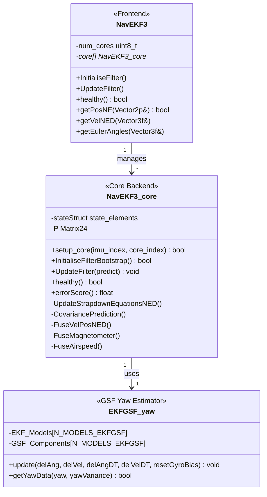
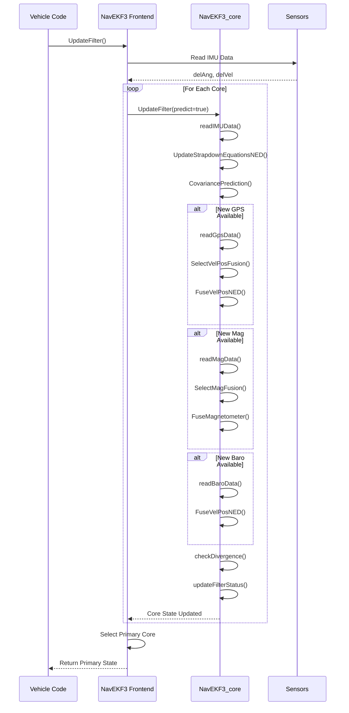
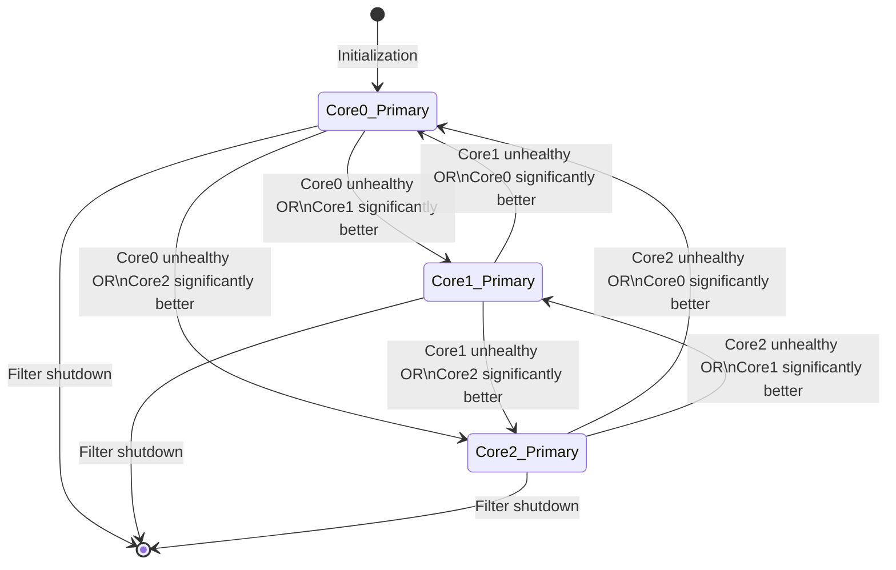

# AP_NavEKF3 Library


## Table of Contents
- [Overview](#overview)
- [Mathematical Foundation](#mathematical-foundation)
- [State Vector Definition](#state-vector-definition)
- [Architecture](#architecture)
- [Fusion Algorithms](#fusion-algorithms)
- [Multi-Core Lane Switching](#multi-core-lane-switching)
- [Health Monitoring](#health-monitoring)
- [GPS Glitch Handling](#gps-glitch-handling)
- [Configuration Parameters](#configuration-parameters)
- [Tuning Guide](#tuning-guide)
- [Improvements Over EKF2](#improvements-over-ekf2)
- [Integration Examples](#integration-examples)
- [Testing](#testing)

## Overview

The AP_NavEKF3 library implements a 24-state Extended Kalman Filter (EKF) for attitude, velocity, and position estimation in ArduPilot autopilot systems. It provides robust sensor fusion across multiple IMUs, GPS receivers, magnetometers, barometers, airspeed sensors, optical flow sensors, and range finders.

**Source Files**: `/libraries/AP_NavEKF3/`

**Key Features:**
- 24-state Extended Kalman Filter with quaternion-based attitude representation
- Multi-core architecture with automatic lane switching for improved reliability
- Advanced GPS glitch detection and recovery mechanisms
- GSF (Gaussian Sum Filter) yaw estimator for magnetometer-free operation
- Support for external navigation systems (visual odometry, motion capture)
- Real-time covariance prediction and innovation-based health monitoring
- Algebraic Jacobian implementations for computational efficiency
- Enhanced numerical stability through double-precision mathematics option

**Mathematical Basis**: The filter is based on the derivation in [PX4/ecl Matlab scripts](https://github.com/PX4/ecl/blob/master/matlab/scripts/Inertial%20Nav%20EKF/GenerateNavFilterEquations.m), converted from Matlab to C++ by Paul Riseborough.

**Source**: `/libraries/AP_NavEKF3/AP_NavEKF3.h:1-3`

## Mathematical Foundation

### Extended Kalman Filter Theory

The Extended Kalman Filter is a recursive state estimator that operates in two phases:

**1. Prediction Phase** (Time Update):
```
State Prediction:      x̂(k|k-1) = f(x̂(k-1|k-1), u(k))
Covariance Prediction: P(k|k-1) = F(k)·P(k-1|k-1)·F(k)ᵀ + Q(k)
```

**2. Correction Phase** (Measurement Update):
```
Innovation:            y(k) = z(k) - h(x̂(k|k-1))
Innovation Covariance: S(k) = H(k)·P(k|k-1)·H(k)ᵀ + R(k)
Kalman Gain:           K(k) = P(k|k-1)·H(k)ᵀ·S(k)⁻¹
State Update:          x̂(k|k) = x̂(k|k-1) + K(k)·y(k)
Covariance Update:     P(k|k) = (I - K(k)·H(k))·P(k|k-1)
```

Where:
- `x̂` = estimated state vector
- `P` = state covariance matrix
- `F` = state transition matrix (Jacobian of f)
- `Q` = process noise covariance matrix
- `H` = measurement matrix (Jacobian of h)
- `R` = measurement noise covariance matrix
- `z` = measurement vector
- `y` = innovation (measurement residual)

### Coordinate Systems

The filter operates in the following coordinate frames:

**NED (North-East-Down) Frame**: Earth-fixed inertial reference frame
- X-axis: Points North
- Y-axis: Points East  
- Z-axis: Points Down (positive downward)

**Body Frame**: Vehicle-fixed coordinate system
- X-axis: Points forward through vehicle nose
- Y-axis: Points right along the wing/right side
- Z-axis: Points down through vehicle bottom

**Source**: `/libraries/AP_NavEKF3/AP_NavEKF3_core.h:768`

### Quaternion Representation

Attitude is represented using quaternions to avoid singularities and provide computational efficiency:

```cpp
Quaternion q = [q0, q1, q2, q3]
where: q0² + q1² + q2² + q3² = 1
```

The quaternion defines rotation from local NED earth frame to body frame. Quaternion integration uses:

```cpp
q̇ = 0.5 · q ⊗ ω
```

Where `ω` = [0, ωx, ωy, ωz] is the angular velocity vector.

**Source**: `/libraries/AP_NavEKF3/AP_NavEKF3_core.h:556`

## State Vector Definition

### 24-State Vector Composition

The EKF maintains a 24-dimensional state vector structured as follows:

| State Index | Variable | Description | Units |
|-------------|----------|-------------|-------|
| 0-3 | `quat[4]` | Attitude quaternion (NED to body frame) | dimensionless |
| 4-6 | `velocity[3]` | NED velocity of IMU | m/s |
| 7-9 | `position[3]` | NED position of IMU relative to origin | m |
| 10-12 | `gyro_bias[3]` | Body frame gyro bias (XYZ) | rad |
| 13-15 | `accel_bias[3]` | Body frame Z-axis accelerometer bias | m/s² |
| 16-18 | `earth_magfield[3]` | NED earth magnetic field | Gauss |
| 19-21 | `body_magfield[3]` | Body frame magnetic field bias | Gauss |
| 22-23 | `wind_vel[2]` | Horizontal wind velocity (North, East) | m/s |

**Source**: `/libraries/AP_NavEKF3/AP_NavEKF3_core.h:555-564`

### State Element Struct Definition

```cpp
/**
 * @struct state_elements
 * @brief 24-state vector defining the complete filter state
 * 
 * @details States are accessible both as a Vector24 array and
 *          as individual named elements via a union construct
 */
struct state_elements {
    QuaternionF quat;           // quaternion (NED to body)       [0..3]
    Vector3F    velocity;       // IMU velocity in NED (m/s)      [4..6]
    Vector3F    position;       // IMU position in NED (m)        [7..9]
    Vector3F    gyro_bias;      // body gyro bias (rad)          [10..12]
    Vector3F    accel_bias;     // body accel bias (m/s)         [13..15]
    Vector3F    earth_magfield; // earth mag field (Gauss)       [16..18]
    Vector3F    body_magfield;  // body mag field (Gauss)        [19..21]
    Vector2F    wind_vel;       // NE wind velocity (m/s)        [22..23]
};
```

**Source**: `/libraries/AP_NavEKF3/AP_NavEKF3_core.h:555-564`

### State Covariance Matrix

The 24×24 state covariance matrix `P` represents the uncertainty in each state and their correlations:

```cpp
typedef ftype Matrix24[24][24];  // 24x24 covariance matrix
```

Diagonal elements represent state variances:
- Position variance: typically 0.5-10 m²
- Velocity variance: typically 0.1-1 m²/s²
- Attitude variance: typically 0.01-0.1 rad²
- Bias variances: dynamically estimated

Off-diagonal elements represent state correlations, which are critical for proper sensor fusion.

**Source**: `/libraries/AP_NavEKF3/AP_NavEKF3_core.h:547`

## Architecture

### Class Hierarchy



**Source**: `/libraries/AP_NavEKF3/AP_NavEKF3.h:31-46`, `/libraries/AP_NavEKF3/AP_NavEKF3_core.h:127-150`

### Multi-Core Architecture

AP_NavEKF3 supports running multiple independent filter instances (cores) in parallel, each potentially using different IMUs:

```cpp
// Maximum cores supported
#define MAX_EKF_CORES 3

// Each core maintains:
// - Independent state vector and covariance
// - Separate IMU, GPS, and sensor buffers
// - Individual health scoring
```

**Benefits:**
- Redundancy against sensor failures
- Ability to compare multiple solutions
- Graceful degradation with IMU failures
- Independent tuning per IMU quality

**Selection Algorithm:** The frontend selects the primary core based on:
1. Innovation test pass/fail status
2. Error score magnitude (`errorScore()`)
3. Time since last successful measurement fusion
4. Health monitoring flags

**Source**: `/libraries/AP_NavEKF3/AP_NavEKF3_core.h:482-484`

### Update Cycle



**Source**: `/libraries/AP_NavEKF3/AP_NavEKF3.cpp`, `/libraries/AP_NavEKF3/AP_NavEKF3_core.cpp:UpdateFilter()`

### Target Update Rate

The filter is designed to run at:
- **Target Rate**: 12ms (83.3 Hz)
- **Typical Rate**: 10-12ms depending on CPU load
- **IMU Sampling**: 400-800 Hz (downsampled internally)

```cpp
#define EKF_TARGET_DT_MS 12
#define EKF_TARGET_DT    0.012f
#define EKF_TARGET_RATE_HZ uint32_t(1.0 / EKF_TARGET_DT)  // 83 Hz
```

**Source**: `/libraries/AP_NavEKF3/AP_NavEKF3_core.h:58-89`

## Fusion Algorithms

### Overview

AP_NavEKF3 implements sensor-specific fusion algorithms optimized for each measurement type:

| Sensor Type | Fusion Module | Update Rate | Key Parameters |
|-------------|---------------|-------------|----------------|
| GPS Position/Velocity | `FuseVelPosNED()` | 5-10 Hz | `EK3_POSNE_M_NSE`, `EK3_VELNE_M_NSE` |
| Magnetometer | `FuseMagnetometer()` | 50-100 Hz | `EK3_MAG_M_NSE`, `EK3_MAG_I_GATE` |
| Barometer | `FuseVelPosNED()` | 20-50 Hz | `EK3_ALT_M_NSE`, `EK3_HGT_I_GATE` |
| Airspeed | `FuseAirspeed()` | 10-20 Hz | `EK3_EAS_M_NSE`, `EK3_EAS_I_GATE` |
| Optical Flow | `FuseOptFlow()` | 10-20 Hz | `EK3_FLOW_M_NSE`, `EK3_FLOW_I_GATE` |
| Range Finder | `FuseVelPosNED()` | 10-50 Hz | `EK3_RNG_M_NSE`, `EK3_RNG_I_GATE` |
| Range Beacons | `FuseRngBcn()` | Variable | Beacon-specific noise |

### GPS Position and Velocity Fusion

**Source**: `/libraries/AP_NavEKF3/AP_NavEKF3_PosVelFusion.cpp`

The GPS fusion algorithm processes position and velocity measurements simultaneously using a combined 6-state observation:

```cpp
/**
 * @brief Fuse GPS position and velocity measurements
 * 
 * @details Implements sequential fusion of NED velocity (3 states)
 *          and NED position (3 states) observations with algebraic
 *          Jacobian computation for efficiency
 */
void NavEKF3_core::FuseVelPosNED()
{
    // Innovation: measurement - prediction
    // vel_innov = GPS_vel - stateStruct.velocity
    // pos_innov = GPS_pos - stateStruct.position
    
    // Innovation variance: S = H*P*H' + R
    // where H is observation Jacobian, R is measurement noise
    
    // Kalman gain: K = P*H' * inv(S)
    
    // State update: x = x + K * innovation
    // Covariance update: P = P - K*H*P
}
```

**Innovation Gating:**
- Velocity gate: `EK3_VEL_I_GATE` (default 500 = 5.0 sigma)
- Position gate: `EK3_POS_I_GATE` (default 500 = 5.0 sigma)
- Glitch radius: `EK3_GLITCH_RAD` (default 25m)

**Innovation Test:**
```cpp
velTestRatio = (velInnov² / (EK3_VEL_I_GATE/100)² * velInnovVar)
if (velTestRatio > 1.0) {
    // Measurement fails consistency check
    // Either reject or clip innovation
}
```

**Source**: `/libraries/AP_NavEKF3/AP_NavEKF3_PosVelFusion.cpp`

### Magnetometer Fusion

**Source**: `/libraries/AP_NavEKF3/AP_NavEKF3_MagFusion.cpp`

The magnetometer fusion algorithm supports multiple fusion modes:

**Fusion Modes** (controlled by `EK3_MAG_CAL`):
- **Mode 0**: Heading fusion on ground, 3-axis fusion in flight (Plane default)
- **Mode 1**: 3-axis fusion only when maneuvering (Copter default)
- **Mode 2**: Heading fusion only, never estimate mag field states (Rover default)
- **Mode 3**: Heading on ground, 3-axis after first climb (Copter alternative)
- **Mode 4**: 3-axis fusion at all times

**3-Axis Magnetometer Fusion:**
```cpp
/**
 * @brief Fuse 3-axis magnetometer measurements
 * 
 * @details Estimates both earth and body magnetic field states
 *          Requires stable external magnetic environment
 *          Provides better heading accuracy in clean mag environment
 */
void NavEKF3_core::FuseMagnetometer()
{
    // Predicted measurement in body frame:
    // mag_pred = DCM * earth_magfield + body_magfield
    
    // Innovation for each axis:
    // mag_innov[X,Y,Z] = mag_meas - mag_pred
    
    // Sequential fusion of X, Y, Z components
    // Updates attitude, mag field states
}
```

**Heading-Only Fusion:**
- Computes yaw angle from magnetometer
- Fuses yaw observation without estimating field states
- More robust to magnetic anomalies
- Lower computational cost

**Source**: `/libraries/AP_NavEKF3/AP_NavEKF3_MagFusion.cpp`

### Airspeed Fusion

**Source**: `/libraries/AP_NavEKF3/AP_NavEKF3_AirDataFusion.cpp`

True airspeed fusion helps estimate wind velocity and improves dead-reckoning:

```cpp
/**
 * @brief Fuse true airspeed measurement
 * 
 * @details TAS measurement relates to states via:
 *          TAS = ||vel_body - DCM' * wind_vel_NED||
 *          where vel_body is vehicle velocity in body frame
 */
void NavEKF3_core::FuseAirspeed()
{
    // Compute velocity in body frame
    // vel_body = DCM' * velocity_NED
    
    // Compute relative wind in body frame
    // vel_rel = vel_body - DCM' * wind_vel
    
    // Predicted TAS
    // TAS_pred = ||vel_rel||
    
    // Innovation
    // tas_innov = TAS_meas - TAS_pred
    
    // Updates: velocity, wind, attitude states
}
```

**Wind State Estimation:**
- Horizontal wind (North, East) estimated in states 22-23
- Wind variance limits: 0.25 to 400 m²/s²
- Aided by airspeed, GPS velocity, and attitude observations

**Source**: `/libraries/AP_NavEKF3/AP_NavEKF3_AirDataFusion.cpp`

### Optical Flow Fusion

**Source**: `/libraries/AP_NavEKF3/AP_NavEKF3_OptFlowFusion.cpp`

Optical flow provides velocity observations without GPS:

```cpp
/**
 * @brief Fuse optical flow rate measurements
 * 
 * @details Flow rate relates to velocity and height:
 *          flow_rate = (vel_ground / height) + body_rate_compensation
 */
void NavEKF3_core::FuseOptFlow()
{
    // Compensate for body rotation
    // flow_compensated = flow_raw - gyro_rates
    
    // Predicted flow from velocity and terrain height
    // flow_pred = velocity_NE / terrain_height
    
    // Innovation
    // flow_innov = flow_compensated - flow_pred
    
    // Updates: velocity, position, terrain height states
}
```

**Terrain Height Estimation:**
- Additional state for terrain offset (not part of 24-state vector)
- Separate covariance tracking
- Aided by range finder when available

**Source**: `/libraries/AP_NavEKF3/AP_NavEKF3_OptFlowFusion.cpp`

### Range Beacon Fusion

**Source**: `/libraries/AP_NavEKF3/AP_NavEKF3_RngBcnFusion.cpp`

Range beacon measurements provide position observations:

```cpp
/**
 * @brief Fuse range beacon distance measurements
 * 
 * @details Range measurement: r = ||pos_NED - beacon_pos_NED||
 */
void NavEKF3_core::FuseRngBcn()
{
    // For each beacon:
    // Predicted range
    // range_pred = ||position - beacon_position||
    
    // Innovation
    // range_innov = range_meas - range_pred
    
    // Updates: position states
}
```

**Source**: `/libraries/AP_NavEKF3/AP_NavEKF3_RngBcnFusion.cpp`

### Algebraic Jacobian Implementation

To improve computational efficiency, AP_NavEKF3 uses algebraic (closed-form) Jacobians rather than numerical differentiation:

```cpp
// Example: GPS velocity fusion Jacobian
// ∂h/∂x where h(x) = velocity observation function

// Velocity observation relates directly to states 4-6
// H matrix is mostly zeros with identity block at [4:6, 4:6]
H[0][4] = 1.0f;  // ∂(vel_N_obs)/∂(vel_N_state) = 1
H[1][5] = 1.0f;  // ∂(vel_E_obs)/∂(vel_E_state) = 1  
H[2][6] = 1.0f;  // ∂(vel_D_obs)/∂(vel_D_state) = 1
```

**Benefits:**
- Deterministic execution time
- No numerical errors from finite differencing
- Derived from symbolic mathematics (Matlab scripts)

**Source**: Derived from PX4/ecl Matlab generation scripts

## Multi-Core Lane Switching

### Lane Selection Architecture

AP_NavEKF3 runs multiple independent filter cores in parallel, with automatic selection of the healthiest core for navigation:



**Source**: `/libraries/AP_NavEKF3/AP_NavEKF3.cpp:getPrimaryCoreIndex()`

### Error Scoring

Each core computes a continuous error score used for lane selection:

```cpp
/**
 * @brief Calculate error score for core health comparison
 * 
 * @details Lower scores indicate healthier cores
 *          Score combines multiple health metrics:
 *          - Innovation test ratios
 *          - Time since last measurement fusion
 *          - Covariance magnitude
 *          - GPS quality metrics
 * 
 * @return Error score (higher = worse)
 */
float NavEKF3_core::errorScore(void) const
{
    float score = 0.0f;
    
    // Add velocity innovation test ratio
    score += velTestRatio;
    
    // Add position innovation test ratio  
    score += posTestRatio;
    
    // Add height innovation test ratio
    score += hgtTestRatio;
    
    // Add magnetometer innovation test ratios
    score += (magTestRatio.x + magTestRatio.y + magTestRatio.z);
    
    // Penalize if not using GPS
    if (!gpsIsInUse) {
        score += 10.0f;
    }
    
    // Penalize if timing out on measurements
    // ... additional scoring logic
    
    return score;
}
```

**Source**: `/libraries/AP_NavEKF3/AP_NavEKF3_core.cpp:errorScore()`

### Lane Switch Hysteresis

To prevent rapid switching between cores, hysteresis is applied:

```cpp
// Switch to new core only if:
// 1. Current core is unhealthy, OR
// 2. New core error score is significantly better:
//    new_score < current_score * 0.9  (10% margin)

const float LANE_SWITCH_MARGIN = 0.9f;

if (!current_core_healthy || 
    (new_core_score < current_core_score * LANE_SWITCH_MARGIN)) {
    // Switch to new core
    primary_core = new_core_index;
}
```

**Benefits of Hysteresis:**
- Prevents oscillation between similar cores
- Reduces control system disturbances
- Allows temporary innovation spikes without switching

### Health Monitoring Per Core

Each core maintains independent health flags:

```cpp
struct nav_filter_status {
    bool attitude_healthy;      // Attitude estimate is healthy
    bool horiz_vel_healthy;     // Horizontal velocity estimate is healthy
    bool vert_vel_healthy;      // Vertical velocity estimate is healthy
    bool horiz_pos_healthy;     // Horizontal position estimate is healthy
    bool vert_pos_healthy;      // Vertical position estimate is healthy
    bool terrain_healthy;       // Terrain estimate is healthy (if using)
    bool const_pos_mode;        // In constant position mode (no vel/pos obs)
    bool pred_horiz_pos_rel;    // Filter is dead-reckoning horizontal position
    bool pred_horiz_pos_abs;    // Filter has lost GPS and is navigating with degraded accuracy
    bool takeoff_detected;      // Takeoff has been detected
    bool takeoff_expected;      // Takeoff is expected (armed)
    bool touchdown_detected;    // Touchdown has been detected
    bool using_gps;             // Using GPS for position/velocity
    bool gps_quality_good;      // GPS quality is good enough for navigation
    bool gps_glitching;         // GPS is glitching
    bool accel_error;           // IMU accelerometer error detected
    bool rejecting_airspeed;    // True if airspeed measurements are rejected
    bool dead_reckoning;        // In dead-reckoning mode
    bool using_flow;            // Using optical flow
    bool using_wing;            // Using fixed-wing specific algorithms
};
```

**Source**: `/libraries/AP_NavEKF3/AP_NavEKF3_core.cpp:updateFilterStatus()`

### IMU-to-Core Assignment

Each core can be assigned to a specific IMU:

```cpp
// Core 0 -> IMU 0 (primary)
// Core 1 -> IMU 1 (secondary)
// Core 2 -> IMU 2 (tertiary)

// Controlled by parameter:
// EK3_IMU_MASK: Bitmask of IMUs to use
// Bit 0 = IMU 0, Bit 1 = IMU 1, Bit 2 = IMU 2
```

**Redundancy Strategy:**
- Each IMU can have independent sensor errors
- Filter maintains independent solution per IMU
- System tolerates complete failure of one or more IMUs
- Best solution automatically selected

**Source**: `/libraries/AP_NavEKF3/AP_NavEKF3_core.h:479-482`

## Health Monitoring

### Pre-Arm Checks

Before allowing vehicle arming, the filter performs comprehensive health checks:

```cpp
/**
 * @brief Pre-arm health checks
 * 
 * @param requires_position True if horizontal position is required
 * @param failure_msg Buffer for failure message
 * @param failure_msg_len Length of failure message buffer
 * 
 * @return True if all checks pass, false otherwise
 */
bool NavEKF3_core::pre_arm_check(bool requires_position, 
                                  char *failure_msg, 
                                  uint8_t failure_msg_len) const
{
    // Check 1: Filter must be initialized
    if (!statesInitialised) {
        strncpy(failure_msg, "EKF3 not initialized", failure_msg_len);
        return false;
    }
    
    // Check 2: Tilt alignment must be complete
    if (!tiltAlignComplete) {
        strncpy(failure_msg, "EKF3 tilt not aligned", failure_msg_len);
        return false;
    }
    
    // Check 3: Yaw alignment must be complete
    if (!yawAlignComplete) {
        strncpy(failure_msg, "EKF3 yaw not aligned", failure_msg_len);
        return false;
    }
    
    // Check 4: Position estimate required and valid
    if (requires_position && !filterStatus.horiz_pos_healthy) {
        strncpy(failure_msg, "EKF3 horiz pos not healthy", failure_msg_len);
        return false;
    }
    
    // Check 5: GPS quality checks (if using GPS)
    if (gpsIsInUse) {
        // Check GPS satellite count
        // Check HDOP
        // Check GPS position drift
        // Check GPS velocity consistency
    }
    
    // Check 6: Covariance matrix health
    // Verify no excessive variances
    
    return true;
}
```

**GPS Pre-Flight Checks** (bitmask `EK3_GPS_CHECK`):
- Bit 0: Satellite count >= threshold
- Bit 1: HDOP <= threshold
- Bit 2: GPS speed accuracy <= threshold
- Bit 3: GPS position accuracy <= threshold
- Bit 4: GPS yaw accuracy <= threshold (if available)
- Bit 5: GPS position drift <= threshold
- Bit 6: GPS vertical speed consistency
- Bit 7: GPS horizontal speed consistency

**Source**: `/libraries/AP_NavEKF3/AP_NavEKF3_core.h:59,471`, `/libraries/AP_NavEKF3/AP_NavEKF3_core.h:39-47`

### Innovation Consistency Checks

Each sensor fusion performs innovation consistency testing:

```cpp
/**
 * @brief Innovation consistency test
 * 
 * @details Tests if innovation is within expected statistical bounds
 *          Innovation squared / variance should follow chi-squared distribution
 */
bool innovationConsistencyCheck(float innovation, 
                                float innovationVariance,
                                float gate_sigma)
{
    // Normalized innovation squared (NIS)
    float nis = (innovation * innovation) / innovationVariance;
    
    // Gate threshold (squared sigma value)
    float gate = (gate_sigma / 100.0f) * (gate_sigma / 100.0f);
    
    // Pass if NIS < gate
    return (nis < gate);
}

// Example for GPS velocity:
// velTestRatio = velInnovSq / (velInnovVar * (EK3_VEL_I_GATE/100)^2)
// Passes if velTestRatio < 1.0
```

**Innovation Gates** (default values):
- GPS Velocity: 500 (5.0 sigma)
- GPS Position: 500 (5.0 sigma)  
- Altitude: 500 (5.0 sigma)
- Magnetometer: 300 (3.0 sigma)
- Airspeed: 400 (4.0 sigma)
- Optical Flow: 300 (3.0 sigma)

**Source**: `/libraries/AP_NavEKF3/AP_NavEKF3_PosVelFusion.cpp`, `/libraries/AP_NavEKF3/AP_NavEKF3.cpp:169-329`

### Variance Monitoring

The filter monitors state variances to detect divergence:

```cpp
/**
 * @brief Constrain state variances to valid ranges
 * 
 * @details Prevents numerical instability from:
 *          - Variance collapse (too small)
 *          - Variance explosion (too large)
 */
void NavEKF3_core::ConstrainVariances()
{
    // Minimum variances (prevent collapse)
    const ftype VEL_STATE_MIN_VARIANCE = 1e-4f;   // (0.01 m/s)^2
    const ftype POS_STATE_MIN_VARIANCE = 1e-4f;   // (0.01 m)^2
    
    // Maximum variances (prevent explosion)
    const ftype VEL_STATE_MAX_VARIANCE = 1e6f;    // (1000 m/s)^2
    const ftype POS_STATE_MAX_VARIANCE = 1e6f;    // (1000 m)^2
    
    // Constrain velocity variances
    for (int i = 4; i <= 6; i++) {
        P[i][i] = constrain_ftype(P[i][i], 
                                   VEL_STATE_MIN_VARIANCE,
                                   VEL_STATE_MAX_VARIANCE);
    }
    
    // Constrain position variances
    for (int i = 7; i <= 9; i++) {
        P[i][i] = constrain_ftype(P[i][i],
                                   POS_STATE_MIN_VARIANCE,
                                   POS_STATE_MAX_VARIANCE);
    }
    
    // ... constrain other state variances
}
```

**Variance Limits:**
- Velocity: 1e-4 to 1e6 m²/s²
- Position: 1e-4 to 1e6 m²
- Attitude: 1e-8 to 1.0 rad²
- Gyro bias: Limited by `GYRO_BIAS_LIMIT` (0.5 rad/s)
- Wind velocity: 0.25 to 400 m²/s²

**Source**: `/libraries/AP_NavEKF3/AP_NavEKF3_core.h:83-85,108-110`, `/libraries/AP_NavEKF3/AP_NavEKF3_core.cpp:ConstrainVariances()`

### Divergence Detection

```cpp
/**
 * @brief Check for filter divergence
 * 
 * @details Monitors multiple indicators:
 *          - Innovation test failures
 *          - Excessive covariance growth
 *          - Measurement timeouts
 *          - Internal consistency
 */
void NavEKF3_core::checkDivergence(void)
{
    // Check 1: Multiple consecutive innovation failures
    if (velTestRatio > 1.0f && posTestRatio > 1.0f && hgtTestRatio > 1.0f) {
        // All navigation measurements failing
        // Possible divergence or sensor failure
    }
    
    // Check 2: Excessive velocity covariance
    if (P[4][4] + P[5][5] + P[6][6] > 100.0f) {
        // Velocity uncertainty > 10 m/s (1-sigma)
        // Indicates divergence
    }
    
    // Check 3: No GPS updates for extended period
    uint32_t gpsTimeout_ms = 5000;
    if (gpsIsInUse && (imuSampleTime_ms - lastTimeGpsReceived_ms) > gpsTimeout_ms) {
        // GPS timeout, transition to dead-reckoning
        filterStatus.dead_reckoning = true;
    }
    
    // Check 4: Vertical velocity variance clipping
    if (vertVelVarClipCounter > VERT_VEL_VAR_CLIP_COUNT_LIM) {
        // Persistent variance limiting suggests divergence
        // Reset height states
    }
}
```

**Source**: `/libraries/AP_NavEKF3/AP_NavEKF3_core.cpp:checkDivergence()`

## GPS Glitch Handling

### Glitch Detection Mechanisms

AP_NavEKF3 employs multiple strategies to detect and handle GPS glitches:

#### 1. Innovation-Based Detection

```cpp
/**
 * @brief Detect GPS position glitches using innovation magnitude
 * 
 * @details Compares GPS measurement to filter prediction
 *          Large innovation indicates:
 *          - GPS glitch/error
 *          - Filter divergence
 *          - True vehicle motion (rare)
 */

// Horizontal position innovation
Vector2f posInnov = gpsPos_NE - stateStruct.position.xy();

// Innovation magnitude
float posInnovDist = posInnov.length();

// Glitch threshold (EK3_GLITCH_RAD parameter)
float glitchRadiusMax = _frontend->_gpsGlitchRadiusMax;  // default 25m

if (posInnovDist > glitchRadiusMax) {
    // Potential GPS glitch detected
    filterStatus.gps_glitching = true;
    
    // Options:
    // A) Reject GPS measurement
    // B) Reset filter to GPS position (if GPS trusted)
    // C) Clip innovation to maximum radius
}
```

**Source**: `/libraries/AP_NavEKF3/AP_NavEKF3.cpp:194-201`, `/libraries/AP_NavEKF3/AP_NavEKF3_PosVelFusion.cpp`

#### 2. Consistency Checks

```cpp
/**
 * @brief GPS velocity consistency check
 * 
 * @details Compares vertical GPS velocity to:
 *          - Barometric vertical velocity
 *          - Accelerometer-derived vertical velocity
 */
void NavEKF3_core::checkGpsVelocityConsistency()
{
    // Compare GPS vertical velocity to baro rate
    float gpsVertVel = gpsDataDelayed.vel.z;
    float baroVertVel = -vertCompFiltState.vel;  // NED convention
    
    float velDiff = fabsf(gpsVertVel - baroVertVel);
    
    const float VEL_CONSISTENCY_LIMIT = 5.0f;  // m/s
    
    if (velDiff > VEL_CONSISTENCY_LIMIT) {
        // GPS vertical velocity inconsistent
        lastGpsVelFail_ms = imuSampleTime_ms;
        useGpsVertVel = false;
    } else {
        lastGpsVelPass_ms = imuSampleTime_ms;
        useGpsVertVel = true;
    }
}
```

**Source**: `/libraries/AP_NavEKF3/AP_NavEKF3_Measurements.cpp`

#### 3. Innovation Clipping Mode

When `EK3_GLITCH_RAD` is set to 0, innovations are clipped rather than rejected:

```cpp
/**
 * @brief Clip GPS innovations rather than rejecting
 * 
 * @details Useful when:
 *          - GPS quality is poor but only source available
 *          - IMU drift exceeds GPS error
 *          - Filter must track GPS despite occasional glitches
 * 
 * @warning Makes filter more susceptible to GPS errors
 */
if (_frontend->_gpsGlitchRadiusMax < 1.0f) {
    // Clipping mode enabled
    
    // Limit innovation magnitude to gate size
    float innovMag = posInnov.length();
    float gateSize = sqrtf(_gpsPosInnovGate / 100.0f * posInnovVar);
    
    if (innovMag > gateSize) {
        // Clip innovation to gate size
        posInnov *= (gateSize / innovMag);
        
        // Still fuse clipped innovation
        // (Rather than rejecting completely)
    }
}
```

**When to Use Clipping:**
- Poor GPS environments (urban, tree canopy)
- No alternative position sources
- IMU quality worse than GPS quality
- Reduced gate sizes recommended (300 vs 500)

**Source**: `/libraries/AP_NavEKF3/AP_NavEKF3.cpp:196-201`

### GPS Position Reset

When a GPS glitch is confirmed or filter diverges from GPS:

```cpp
/**
 * @brief Reset position states to GPS measurement
 * 
 * @details Used when:
 *          - GPS innovation exceeds glitch radius
 *          - Filter has diverged from GPS
 *          - Switching to GPS after dead-reckoning
 * 
 * @warning Causes discontinuity in position estimate
 */
void NavEKF3_core::ResetPosition(resetDataSource posResetSource)
{
    if (posResetSource == resetDataSource::GPS) {
        // Reset position states to GPS
        stateStruct.position.x = gpsDataDelayed.pos.x;
        stateStruct.position.y = gpsDataDelayed.pos.y;
        
        // Reset position covariance
        float gpsAccuracy = gpsPosAccuracy;  // From GPS receiver
        P[7][7] = gpsAccuracy * gpsAccuracy;
        P[8][8] = gpsAccuracy * gpsAccuracy;
        
        // Zero cross-correlations with position states
        zeroCols(P, 7, 8);
        zeroRows(P, 7, 8);
        
        // Record reset for output tracking
        posResetNE.x = stateStruct.position.x - outputDataNew.position.x;
        posResetNE.y = stateStruct.position.y - outputDataNew.position.y;
        lastPosReset_ms = imuSampleTime_ms;
    }
}
```

**Reset Triggers:**
1. Innovation exceeds `EK3_GLITCH_RAD`
2. No GPS for >5s then GPS reacquired
3. GPS quality suddenly improves after loss
4. User-commanded position reset

**Source**: `/libraries/AP_NavEKF3/AP_NavEKF3_Control.cpp:ResetPosition()`

### GPS Quality Assessment

```cpp
/**
 * @brief Assess GPS quality for navigation use
 * 
 * @details Combines multiple quality metrics:
 */
void NavEKF3_core::checkGpsQuality()
{
    // Metric 1: Number of satellites
    bool satsOK = (gpsDataDelayed.num_sats >= 6);
    
    // Metric 2: HDOP (Horizontal Dilution of Precision)
    bool hdopOK = (gpsDataDelayed.hdop < 2.5f);
    
    // Metric 3: Reported accuracy
    bool accuracyOK = (gpsPosAccuracy < 5.0f) && (gpsSpdAccuracy < 1.0f);
    
    // Metric 4: Innovation consistency
    bool innovOK = (velTestRatio < 1.0f) && (posTestRatio < 1.0f);
    
    // Metric 5: No rapid position jumps
    bool noDrift = (gpsDriftNE < 3.0f);
    
    // Combined assessment
    gpsAccuracyGood = satsOK && hdopOK && accuracyOK && innovOK && noDrift;
}
```

**Source**: `/libraries/AP_NavEKF3/AP_NavEKF3_Measurements.cpp`

## Configuration Parameters

### Parameter Groups

AP_NavEKF3 parameters are organized into functional groups:

#### Core Configuration

| Parameter | Description | Default | Units | Range |
|-----------|-------------|---------|-------|-------|
| `EK3_ENABLE` | Enable EKF3 | 1 | - | 0-1 |
| `EK3_IMU_MASK` | Bitmask of IMUs to use | 3 | - | 0-7 |
| `EK3_PRIMARY` | Primary core selection method | 0 | - | 0-1 |

**Source**: `/libraries/AP_NavEKF3/AP_NavEKF3.cpp:137-145`

#### GPS Parameters

| Parameter | Description | Default (Copter) | Units | Range |
|-----------|-------------|------------------|-------|-------|
| `EK3_VELNE_M_NSE` | GPS horizontal velocity noise | 0.3 | m/s | 0.05-5.0 |
| `EK3_VELD_M_NSE` | GPS vertical velocity noise | 0.5 | m/s | 0.05-5.0 |
| `EK3_VEL_I_GATE` | GPS velocity innovation gate | 500 | % sigma | 100-1000 |
| `EK3_POSNE_M_NSE` | GPS horizontal position noise | 0.5 | m | 0.1-10.0 |
| `EK3_POS_I_GATE` | GPS position innovation gate | 500 | % sigma | 100-1000 |
| `EK3_GLITCH_RAD` | GPS glitch radius | 25 | m | 10-100 |
| `EK3_GPS_CHECK` | GPS pre-flight check bitmask | 31 | - | 0-255 |

**Measurement Noise** (`_M_NSE`): Represents 1-sigma uncertainty in sensor measurement. Higher values reduce sensor weighting.

**Innovation Gate** (`_I_GATE`): Threshold for accepting/rejecting measurements, expressed as percentage of standard deviations (e.g., 500 = 5.0 sigma).

**Source**: `/libraries/AP_NavEKF3/AP_NavEKF3.cpp:151-201`

#### Barometer/Altitude Parameters

| Parameter | Description | Default (Copter) | Units | Range |
|-----------|-------------|------------------|-------|-------|
| `EK3_ALT_M_NSE` | Altitude measurement noise | 2.0 | m | 0.1-100.0 |
| `EK3_HGT_I_GATE` | Height innovation gate | 500 | % sigma | 100-1000 |
| `EK3_HGT_DELAY` | Height measurement delay | 60 | ms | 0-250 |

**Source**: `/libraries/AP_NavEKF3/AP_NavEKF3.cpp:211-236`

#### Magnetometer Parameters

| Parameter | Description | Default (Copter) | Units | Range |
|-----------|-------------|------------------|-------|-------|
| `EK3_MAG_M_NSE` | Magnetometer noise | 0.05 | Gauss | 0.01-0.5 |
| `EK3_MAG_CAL` | Magnetometer fusion mode | 3 | - | 0-4 |
| `EK3_MAG_I_GATE` | Magnetometer innovation gate | 300 | % sigma | 100-1000 |

**MAG_CAL Modes:**
- **0**: Heading on ground, 3-axis in flight (Plane)
- **1**: 3-axis only when maneuvering  
- **2**: Heading only, never estimate field (Rover)
- **3**: Heading on ground, 3-axis after climb (Copter)
- **4**: 3-axis at all times

**Source**: `/libraries/AP_NavEKF3/AP_NavEKF3.cpp:240-263`

#### Airspeed Parameters

| Parameter | Description | Default | Units | Range |
|-----------|-------------|---------|-------|-------|
| `EK3_EAS_M_NSE` | Airspeed measurement noise | 1.4 | m/s | 0.5-5.0 |
| `EK3_EAS_I_GATE` | Airspeed innovation gate | 400 | % sigma | 100-1000 |

**Source**: `/libraries/AP_NavEKF3/AP_NavEKF3.cpp:267-282`

#### Rangefinder Parameters

| Parameter | Description | Default | Units | Range |
|-----------|-------------|---------|-------|-------|
| `EK3_RNG_M_NSE` | Rangefinder measurement noise | 0.5 | m | 0.1-10.0 |
| `EK3_RNG_I_GATE` | Rangefinder innovation gate | 500 | % sigma | 100-1000 |

**Source**: `/libraries/AP_NavEKF3/AP_NavEKF3.cpp:286-301`

#### Optical Flow Parameters

| Parameter | Description | Default (Copter) | Units | Range |
|-----------|-------------|------------------|-------|-------|
| `EK3_FLOW_M_NSE` | Optical flow noise | 0.25 | rad/s | 0.05-1.0 |
| `EK3_FLOW_I_GATE` | Optical flow innovation gate | 300 | % sigma | 100-1000 |
| `EK3_FLOW_DELAY` | Optical flow delay | 10 | ms | 0-250 |
| `EK3_MAX_FLOW` | Maximum valid flow rate | 2.5 | rad/s | 1.0-4.0 |

**Source**: `/libraries/AP_NavEKF3/AP_NavEKF3.cpp:305-339`

#### Process Noise Parameters

| Parameter | Description | Default (Copter) | Units | Range |
|-----------|-------------|------------------|-------|-------|
| `EK3_GYRO_P_NSE` | Gyro process noise | 0.015 | rad/s | 0.0001-0.1 |
| `EK3_ACC_P_NSE` | Accelerometer process noise | 0.35 | m/s² | 0.01-1.0 |
| `EK3_GBIAS_P_NSE` | Gyro bias process noise | 0.001 | rad/s/s | 0.00001-0.001 |
| `EK3_ABIAS_P_NSE` | Accel bias process noise | 0.02 | m/s³ | 0.00001-0.02 |
| `EK3_WIND_P_NSE` | Wind process noise | 0.2 | m/s² | 0.01-2.0 |
| `EK3_WIND_PSCALE` | Wind altitude scaling | 1.0 | - | 0.0-2.0 |
| `EK3_MAGB_P_NSE` | Body mag field process noise | 0.0001 | Gauss/s | 0.00001-0.001 |
| `EK3_MAGE_P_NSE` | Earth mag field process noise | 0.001 | Gauss/s | 0.00001-0.01 |

**Process Noise** (`_P_NSE`): Controls how rapidly states can change over time. Higher values allow faster adaptation but increase noise sensitivity.

**Source**: `/libraries/AP_NavEKF3/AP_NavEKF3.cpp:343-397`

#### Source Selection Parameters

| Parameter | Description | Default | Range |
|-----------|-------------|---------|-------|
| `EK3_SRC1_POSXY` | Position horizontal source (set 1) | 3 (GPS) | 0-6 |
| `EK3_SRC1_POSZ` | Position vertical source (set 1) | 1 (Baro) | 0-6 |
| `EK3_SRC1_VELXY` | Velocity horizontal source (set 1) | 3 (GPS) | 0-7 |
| `EK3_SRC1_VELZ` | Velocity vertical source (set 1) | 3 (GPS) | 0-6 |
| `EK3_SRC1_YAW` | Yaw source (set 1) | 1 (Compass) | 0-8 |

**Source Options:**
- **0**: None
- **1**: Baro (height only)
- **2**: Rangefinder (height only)
- **3**: GPS
- **4**: Beacon (position only)
- **5**: External Nav (VIO, MoCap)
- **6**: Wheel Encoders (velocity only)
- **7**: Optical Flow (velocity only)
- **8**: External Yaw (yaw only)

## Tuning Guide

### Tuning Philosophy

EKF tuning balances two competing objectives:
1. **Responsiveness**: Quick adaptation to real changes
2. **Stability**: Rejection of sensor noise and glitches

```
Higher Measurement Noise → More filtering, slower response, more IMU reliance
Lower Measurement Noise → Less filtering, faster response, more sensor reliance

Higher Process Noise → Faster state adaptation, more measurement reliance
Lower Process Noise → Slower state adaptation, trusts dynamics model more
```

### Step-by-Step Tuning Procedure

#### Step 1: Verify Sensor Health

Before tuning EKF, ensure sensors are functioning correctly:

```bash
# Check IMU health
- Vibration levels: <30 m/s² for X/Y, <50 m/s² for Z
- Gyro drift: <0.01 rad/s when stationary
- Accelerometer bias: <0.5 m/s² when stationary
- Temperature stability: Ensure IMU warm-up complete

# Check GPS quality
- Satellites: ≥6, preferably ≥10
- HDOP: <2.0, preferably <1.5  
- Position accuracy: <5m reported by receiver
- Velocity accuracy: <0.5 m/s reported by receiver
- No position jumps when stationary: <1m

# Check magnetometer
- Offsets calibrated: Typical range ±400 milliGauss
- Field strength: Earth field ≈400-600 milliGauss total
- No interference: Constant reading when stationary
- Motor noise: <50 milliGauss variation with throttle changes
```

#### Step 2: Set Vehicle-Appropriate Defaults

Use vehicle-specific default parameters:

**Copter** (hovering, high maneuverability):
```
EK3_VELNE_M_NSE = 0.3    # Lower for accurate GPS
EK3_POSNE_M_NSE = 0.5
EK3_ACC_P_NSE = 0.35     # Higher for vibration tolerance
EK3_MAG_CAL = 3          # 3-axis after first climb
EK3_WIND_P_NSE = 0.2
```

**Plane** (continuous forward flight):
```
EK3_VELNE_M_NSE = 0.5
EK3_ACC_P_NSE = 0.35
EK3_MAG_CAL = 0          # 3-axis in flight
EK3_WIND_P_NSE = 0.1     # Lower, wind more stable
```

**Rover** (ground vehicle):
```
EK3_VELNE_M_NSE = 0.5
EK3_MAG_CAL = 2          # Heading only, no field estimation
EK3_WIND_P_NSE = 0.1     # Minimal wind effects
```

#### Step 3: Tune GPS Parameters

If GPS innovations are large or measurements are rejected:

**Symptom**: `velTestRatio > 1.0` or `posTestRatio > 1.0`

**Solution A** - Increase measurement noise (trust GPS less):
```
EK3_VELNE_M_NSE += 0.1   # Increase in 0.1 m/s steps
EK3_POSNE_M_NSE += 0.1   # Increase in 0.1 m steps
```

**Solution B** - Widen innovation gates:
```
EK3_VEL_I_GATE += 50     # Increase in 50 (0.5 sigma) steps
EK3_POS_I_GATE += 50
```

**Solution C** - Enable innovation clipping for poor GPS:
```
EK3_GLITCH_RAD = 0       # Enable clipping mode
EK3_VEL_I_GATE = 300     # Use tighter gates with clipping
EK3_POS_I_GATE = 300
```

#### Step 4: Tune Magnetometer Parameters

**Symptom**: Yaw drift, poor heading hold, `magTestRatio > 1.0`

**For clean magnetic environment** (rural, away from metal):
```
EK3_MAG_CAL = 3 or 4     # Use 3-axis fusion
EK3_MAG_M_NSE = 0.05     # Trust magnetometer
EK3_MAGE_P_NSE = 0.001   # Allow earth field learning
EK3_MAGB_P_NSE = 0.0001  # Allow body field learning
```

**For noisy magnetic environment** (urban, metal structures):
```
EK3_MAG_CAL = 2          # Heading only
EK3_MAG_M_NSE = 0.1      # Increase noise
EK3_MAG_I_GATE = 400     # Widen gate
```

**For magnetometer-free operation**:
```
COMPASS_USE = 0          # Disable all compasses
COMPASS_ENABLE = 0
EK3_GSF_RUN = 1          # Enable GSF yaw estimator
EK3_GSF_USE = 1          # Use GSF for yaw alignment
```

#### Step 5: Tune Height/Altitude

**Symptom**: Altitude bobbing, poor altitude hold, `hgtTestRatio > 1.0`

**For barometer primary**:
```
EK3_SRC1_POSZ = 1        # Barometer
EK3_ALT_M_NSE = 2.0      # Standard baro noise
EK3_HGT_I_GATE = 500     # Standard gate
```

**For GPS altitude** (when baro unavailable or unreliable):
```
EK3_SRC1_POSZ = 3        # GPS
EK3_ALT_M_NSE = 3.0      # GPS altitude less accurate
```

**For rangefinder terrain following**:
```
EK3_SRC1_POSZ = 2        # Rangefinder
EK3_RNG_M_NSE = 0.5      # Rangefinder noise
```

#### Step 6: Tune Process Noise

Process noise rarely requires tuning except for special cases:

**High vibration environment**:
```
EK3_ACC_P_NSE = 0.5      # Increase from 0.35
EK3_GYRO_P_NSE = 0.02    # Increase from 0.015
```

**Very stable platform** (large aircraft):
```
EK3_ACC_P_NSE = 0.25     # Decrease from 0.35
EK3_GYRO_P_NSE = 0.01    # Decrease from 0.015
```

**Rapid wind changes** (gusty conditions):
```
EK3_WIND_P_NSE = 0.5     # Increase from 0.2
EK3_WIND_PSCALE = 1.5    # Increase altitude scaling
```

#### Step 7: Configure GPS Glitch Handling

**For high-quality GPS** (RTK, good satellite visibility):
```
EK3_GLITCH_RAD = 25      # Standard rejection threshold
EK3_GPS_CHECK = 31       # Enable all pre-flight checks
```

**For poor GPS** (urban canyon, tree cover):
```
EK3_GLITCH_RAD = 50      # Wider tolerance
EK3_VEL_I_GATE = 600     # Wider gates
EK3_POS_I_GATE = 600
```

**For very poor GPS** (last resort):
```
EK3_GLITCH_RAD = 0       # Enable clipping mode
EK3_VEL_I_GATE = 300     # Tighter gates with clipping
EK3_POS_I_GATE = 300
```

### Tuning Validation

After tuning, verify performance:

**Log Analysis** (check dataflash logs):
```
# Innovation test ratios (should be <1.0 normally)
- XKF1.IVN, XKF1.IVE (velocity innovations)
- XKF1.IPN, XKF1.IPE (position innovations)
- XKF1.IVD (vertical velocity innovation)
- XKF4.SV (velocity test ratio)
- XKF4.SP (position test ratio)

# Variance monitoring
- XKF2.VN, VE, VD (velocity variance - check for growth)
- XKF2.PN, PE, PD (position variance - check for growth)

# GPS vs EKF comparison
- GPS.Spd vs XKF1.VN, VE (velocity agreement)
- GPS.Alt vs XKF1.PD (altitude agreement)
```

**In-Flight Indicators**:
- Stable hover (no drift) - for copters
- Accurate waypoint tracking
- No EKF failsafe warnings
- `ekfYawReset` and `ekfPosReset` events are rare
- Position estimate doesn't jump when switching between GPS/non-GPS navigation

## Improvements Over EKF2

### Key Enhancements

AP_NavEKF3 provides significant improvements over the legacy EKF2 implementation:

#### 1. Enhanced Numerical Stability

**EKF2 Limitations:**
- Single-precision float throughout
- Covariance matrix symmetry issues
- Occasional divergence with poor sensors

**EKF3 Improvements:**
```cpp
// Optional double-precision for position states
#if HAL_WITH_EKF_DOUBLE
    typedef double postype_t;
    #define EK3_POSXY_STATE_LIMIT 50.0e6  // 50,000 km
#else
    typedef float postype_t;
    #define EK3_POSXY_STATE_LIMIT 1.0e6   // 1,000 km
#endif
```

- Double-precision option for long-range missions
- Improved covariance symmetry enforcement
- Better numerical conditioning of matrix operations
- Reduced risk of filter divergence

**Source**: `/libraries/AP_NavEKF3/AP_NavEKF3_core.h:92-97`

#### 2. Multi-IMU Support

**EKF2**: Single IMU per core, limited redundancy

**EKF3**: 
- Up to 3 cores with independent IMUs
- Automatic IMU selection per core
- IMU health monitoring and failover
- Continued operation with multiple IMU failures

**IMU Blending** (within each core):
```cpp
/**
 * @brief Blend measurements from multiple IMUs
 * 
 * @details Each core can blend data from two IMUs
 *          based on relative health scoring
 */
void NavEKF3_core::calcIMU_Weighting(float K1, float K2)
{
    // K1, K2 are health-based weighting factors
    // K1 + K2 = 1.0
    
    // Blended delta angles
    delAngCorrected = K1 * imu1_delAng + K2 * imu2_delAng;
    
    // Blended delta velocity
    delVelCorrected = K1 * imu1_delVel + K2 * imu2_delVel;
}
```

**Source**: `/libraries/AP_NavEKF3/AP_NavEKF3_core.h:878`

#### 3. GSF Yaw Estimator Integration

**EKF2**: Requires magnetometer or GPS yaw for initialization

**EKF3**: Integrated Gaussian Sum Filter (GSF) yaw estimator
- Operates without magnetometer
- Uses IMU + GPS velocity for yaw estimation
- Multiple hypothesis tracking (typically 5 models)
- Automatic convergence during vehicle motion

```cpp
/**
 * @class EKFGSF_yaw
 * @brief Gaussian Sum Filter for yaw estimation without magnetometer
 * 
 * @details Maintains multiple parallel yaw hypotheses
 *          Weighted by GPS velocity consistency
 *          Converges to correct yaw during sufficient motion
 */
class EKFGSF_yaw {
    static const uint8_t N_MODELS_EKFGSF = 5;  // 5 parallel models
    
    // Each model maintains:
    // - Independent yaw estimate
    // - Velocity error covariance
    // - Weighting factor (probability)
};
```

**Enable GSF operation:**
```
COMPASS_USE = 0
COMPASS_ENABLE = 0
EK3_GSF_RUN = 1   # Run GSF estimator
EK3_GSF_USE = 1   # Use GSF for yaw alignment
```

**Source**: `/libraries/AP_NavEKF3/AP_NavEKF3_core.h:29,37,465`

#### 4. Improved GPS Glitch Handling

**EKF2**: Limited glitch detection, abrupt resets

**EKF3**:
- Innovation-based glitch detection
- Optional innovation clipping mode
- Smoother recovery from GPS loss
- Better velocity consistency checking
- Pre-flight GPS drift detection

**GPS Drift Check** (new in EKF3):
```cpp
/**
 * @brief Detect GPS position drift during pre-flight
 * 
 * @details Monitors GPS position stability when stationary
 *          Prevents arming with drifting GPS
 */
void checkGpsDrift()
{
    // Accumulate position changes
    Vector2f posDiff = currentGpsPos - previousGpsPos;
    gpsDriftNE += posDiff.length();
    
    // Threshold for arming check
    const float MAX_GPS_DRIFT = 3.0f;  // meters
    
    if (gpsDriftNE > MAX_GPS_DRIFT) {
        // GPS drifting, fail pre-arm check
        gpsGoodToAlign = false;
    }
}
```

**Source**: `/libraries/AP_NavEKF3/AP_NavEKF3_core.h:1253,1256`

#### 5. Advanced Mag Anomaly Detection

**EKF3** includes detection and recovery for magnetic anomalies:

```cpp
#define MAG_ANOMALY_RESET_MAX 2  // Maximum yaw resets per flight

/**
 * @brief Detect magnetic anomalies and reset yaw
 * 
 * @details Monitors for sudden changes in magnetic field
 *          that indicate local interference rather than
 *          yaw angle changes
 */
```

- Detects local magnetic field disturbances
- Automatic yaw reset using GPS velocity
- Limited resets prevent oscillation
- Switches to heading-only fusion if persistent

**Source**: `/libraries/AP_NavEKF3/AP_NavEKF3_core.h:71-72`

#### 6. External Navigation Support

**EKF3** has improved integration with external position sources:

- Visual Inertial Odometry (VIO)
- Motion Capture Systems  
- Wheel Odometry
- Range Beacon Systems

**API for external nav:**
```cpp
// Position and quaternion from external source
void writeExtNavData(const Vector3f &pos, const Quaternion &quat,
                     float posErr, float angErr, uint32_t timeStamp_ms);

// Body frame odometry
void writeBodyFrameOdom(float quality, const Vector3f &delPos,
                        const Vector3f &delAng, float delTime,
                        uint32_t timeStamp_ms);

// Wheel odometry  
void writeWheelOdom(float delAng, float delTime, uint32_t timeStamp_ms,
                    const Vector3f &posOffset, float radius);
```

**Source**: `/libraries/AP_NavEKF3/AP_NavEKF3.h:214,226`

#### 7. Better Parameter Organization

**EKF3** introduces source selection parameters:

```
# EKF2: Hardcoded source priorities
# EKF3: Configurable source selection

EK3_SRC1_POSXY = 3   # GPS for horizontal position
EK3_SRC1_VELXY = 3   # GPS for horizontal velocity
EK3_SRC1_POSZ = 1    # Barometer for vertical position
EK3_SRC1_VELZ = 0    # No direct vertical velocity (derived)
EK3_SRC1_YAW = 1     # Compass for yaw

# Up to 3 source sets for different flight phases
# EK3_SRC2_*, EK3_SRC3_* for alternate configurations
```

### Migration from EKF2 to EKF3

**Steps to transition:**

1. **Enable EKF3**:
   ```
   EK3_ENABLE = 1
   AHRS_EKF_TYPE = 3
   ```

2. **Copy tuning from EKF2** (if using custom values):
   ```
   EK3_VELNE_M_NSE = EK2_VELNE_M_NSE
   EK3_POSNE_M_NSE = EK2_POSNE_M_NSE
   # ... copy other matching parameters
   ```

3. **Configure sources** (new in EKF3):
   ```
   EK3_SRC1_POSXY = 3  # GPS (typical)
   EK3_SRC1_POSZ = 1   # Baro (typical)
   EK3_SRC1_VELXY = 3  # GPS (typical)
   EK3_SRC1_YAW = 1    # Compass (typical)
   ```

4. **Test thoroughly**:
   - Ground tests with motor run-up
   - Gentle test flights in stable conditions  
   - Compare EKF2 vs EKF3 logs
   - Verify no degradation in performance

5. **Optionally disable EKF2**:
   ```
   EK2_ENABLE = 0  # Once confident in EKF3
   ```

## Integration Examples

### Example 1: Basic Initialization

```cpp
/**
 * @brief Initialize EKF3 from vehicle code
 * 
 * @details Typical initialization sequence in main vehicle setup
 */
#include <AP_NavEKF3/AP_NavEKF3.h>

// Global EKF instance (usually via AP::ahrs())
NavEKF3 ekf3;

void setup() {
    // 1. Set parameters (usually from EEPROM)
    ekf3._enable.set(1);
    ekf3._gpsHorizVelNoise.set(0.3f);
    ekf3._gpsHorizPosNoise.set(0.5f);
    // ... set other parameters
    
    // 2. Initialize filter
    if (!ekf3.InitialiseFilter()) {
        gcs().send_text(MAV_SEVERITY_ERROR, "EKF3 init failed");
        return;
    }
    
    gcs().send_text(MAV_SEVERITY_INFO, "EKF3 initialized");
}
```

**Source**: `/libraries/AP_NavEKF3/AP_NavEKF3.h:49`

### Example 2: Main Loop Integration

```cpp
/**
 * @brief Update EKF3 in vehicle main loop
 * 
 * @details Called after new IMU data is available
 *          Typically at 400Hz IMU rate, but EKF internally
 *          decimates to ~83Hz update rate
 */
void loop() {
    // 1. Read IMU data (done automatically by EKF)
    
    // 2. Update all EKF cores
    ekf3.UpdateFilter();
    
    // 3. Check health
    if (!ekf3.healthy()) {
        // Handle EKF failure
        gcs().send_text(MAV_SEVERITY_ERROR, "EKF3 unhealthy");
        // Trigger failsafe...
    }
    
    // 4. Get navigation solution
    Vector3f eulers;
    ekf3.getEulerAngles(eulers);
    
    Vector3f velocity_NED;
    ekf3.getVelNED(velocity_NED);
    
    Vector2p position_NE;
    postype_t position_D;
    bool pos_valid = ekf3.getPosNE(position_NE);
    bool alt_valid = ekf3.getPosD(position_D);
    
    // 5. Use navigation solution for control
    // ...
}
```

**Source**: `/libraries/AP_NavEKF3/AP_NavEKF3.h:52,55,72,77,80`

### Example 3: Injecting Sensor Data

```cpp
/**
 * @brief Inject optical flow measurements into EKF3
 * 
 * @details Example of feeding external sensor data
 */
void process_optical_flow() {
    // Flow sensor provides:
    uint8_t quality = 200;              // 0-255
    Vector2f flowRates(0.1f, -0.05f);   // rad/s about X,Y body axes
    Vector2f bodyRates(0.02f, 0.01f);   // rad/s from flow sensor gyro
    uint32_t timestamp_ms = AP_HAL::millis();
    Vector3f sensorOffset(0.05f, 0.0f, -0.03f);  // Sensor position in body frame
    float heightOverride = 0.0f;        // 0 = use EKF height estimate
    
    // Write to EKF
    ekf3.writeOptFlowMeas(quality, flowRates, bodyRates, 
                          timestamp_ms, sensorOffset, heightOverride);
}
```

**Source**: `/libraries/AP_NavEKF3/AP_NavEKF3.h:198`

### Example 4: Reading Innovations

```cpp
/**
 * @brief Monitor EKF innovations for fault detection
 * 
 * @details Innovations indicate disagreement between
 *          measurements and filter predictions
 */
void check_ekf_innovations() {
    Vector3f velInnov, posInnov, magInnov;
    float tasInnov, yawInnov;
    
    if (ekf3.getInnovations(velInnov, posInnov, magInnov, tasInnov, yawInnov)) {
        // Check velocity innovations
        float velInnovMag = velInnov.length();
        if (velInnovMag > 2.0f) {  // meters/second
            gcs().send_text(MAV_SEVERITY_WARNING, 
                           "Large velocity innovation: %.2f m/s", velInnovMag);
        }
        
        // Check position innovations
        float posInnovMag = posInnov.xy().length();
        if (posInnovMag > 5.0f) {  // meters
            gcs().send_text(MAV_SEVERITY_WARNING,
                           "Large position innovation: %.2f m", posInnovMag);
        }
        
        // Check magnetometer innovations
        float magInnovMag = magInnov.length();
        if (magInnovMag > 0.5f) {  // Gauss
            gcs().send_text(MAV_SEVERITY_WARNING,
                           "Large mag innovation: %.3f Gauss", magInnovMag);
        }
    }
}
```

**Source**: `/libraries/AP_NavEKF3/AP_NavEKF3.h:177`

### Example 5: Handling Resets

```cpp
/**
 * @brief Monitor and handle EKF position/yaw resets
 * 
 * @details Resets occur when filter corrects large errors
 *          Vehicle control systems must handle discontinuities
 */
void monitor_ekf_resets() {
    // Check for position resets
    Vector2f posResetNE;
    uint32_t posResetTime_ms = ekf3.getLastPosNorthEastReset(posResetNE);
    
    static uint32_t lastPosResetTime_ms = 0;
    if (posResetTime_ms != lastPosResetTime_ms) {
        // New position reset occurred
        float resetDist = posResetNE.length();
        gcs().send_text(MAV_SEVERITY_INFO,
                       "EKF3 position reset: %.2f m", resetDist);
        
        // Adjust position controller target
        posController.handle_ekf_reset(posResetNE, posResetTime_ms);
        
        lastPosResetTime_ms = posResetTime_ms;
    }
    
    // Check for yaw resets
    float yawResetAngle;
    uint32_t yawResetTime_ms = ekf3.getLastYawResetAngle(yawResetAngle);
    
    static uint32_t lastYawResetTime_ms = 0;
    if (yawResetTime_ms != lastYawResetTime_ms) {
        // New yaw reset occurred
        gcs().send_text(MAV_SEVERITY_INFO,
                       "EKF3 yaw reset: %.1f deg", degrees(yawResetAngle));
        
        // Adjust heading controller
        attController.handle_yaw_reset(yawResetAngle, yawResetTime_ms);
        
        lastYawResetTime_ms = yawResetTime_ms;
    }
}
```

**Source**: `/libraries/AP_NavEKF3/AP_NavEKF3_core.h:392,399`

## Testing

### SITL (Software In The Loop) Testing

**Basic EKF3 SITL test:**

```bash
# Launch SITL with copter
cd ArduPilot/Tools/autotest
./sim_vehicle.py -v ArduCopter --console --map

# Enable EKF3
param set AHRS_EKF_TYPE 3
param set EK3_ENABLE 1

# Arm and takeoff
mode GUIDED
arm throttle
takeoff 10

# Monitor EKF status
watch EKF3

# Check innovations
set streamrate -1
watch MAV_ESTIMATOR_STATUS
```

**Multi-IMU SITL testing:**

```bash
# Enable multiple IMUs in SITL
param set INS_ACC_MASK 3   # Use IMU 0 and 1
param set EK3_IMU_MASK 3   # EKF uses IMU 0 and 1

# Inject IMU failure
param set SIM_ACC1_FAIL 1  # Fail accelerometer on IMU 1

# Verify EKF switches to healthy IMU
```

### Hardware Testing Protocol

**Ground Testing:**

1. **Sensor Check**:
   ```
   - Power up and wait for GPS lock (>6 satellites)
   - Verify IMU initialization (no excessive vibration)
   - Check compass calibration (offsets reasonable)
   - Ensure barometer stable
   ```

2. **Pre-Arm Verification**:
   ```
   - Monitor EKF status: wait for "EKF3 ready"
   - Check pre-arm messages for any EKF failures
   - Verify position estimate stable when stationary
   - Confirm yaw aligned (heading matches compass)
   ```

3. **Motor Run-Up Test**:
   ```
   - Arm vehicle (props off for safety)
   - Slowly advance throttle to hover point
   - Monitor EKF innovations (should remain small)
   - Check for magnetometer interference
   - Verify no position drift
   ```

**Flight Testing:**

1. **Gentle Hover** (for copters):
   ```
   - Takeoff to 3-5m altitude
   - Hover in position mode for 30 seconds
   - Monitor position hold quality
   - Check for drift or oscillation
   - Log data for analysis
   ```

2. **Velocity Test**:
   ```
   - Fly gentle circles at constant speed
   - Observe velocity estimate smoothness
   - Verify no velocity jumps during turns
   - Check GPS velocity vs EKF velocity agreement
   ```

3. **GPS Failure Test** (with safety pilot):
   ```
   - Fly stable pattern
   - Disable GPS (param GPS_TYPE = 0, requires reload)
   - Verify EKF transitions to dead-reckoning
   - Monitor position estimate quality
   - Re-enable GPS and verify recovery
   - Test should be brief (<30 seconds GPS off)
   ```

4. **Compass Failure Test**:
   ```
   - Disable compass (COMPASS_USE = 0)
   - Verify GSF yaw estimator active (if configured)
   - Fly sufficient movement for GSF convergence
   - Monitor yaw estimate quality
   ```

### Log Analysis

**Key Log Messages:**

```
# EKF3 status
XKF1: Position, velocity, attitude estimates
XKF2: State variances
XKF3: Innovation test ratios
XKF4: Measurement innovation magnitudes
XKF5: EKF origin and timing
XKFS: EKF filter status flags
XKFD: EKF fault status

# Primary vs all cores
XKF0: Primary core estimates (used for nav)
XKF1,2,3,4,5: Individual core data
```

**Analysis Checklist:**

1. **Innovation Consistency**:
   - Plot `XKF4.SV, SP, SH` (innovation test ratios)
   - Should be <1.0 most of the time
   - Spikes >1.0 indicate measurement rejection

2. **Variance Growth**:
   - Plot `XKF2.VN, VE, VD` (velocity variance)
   - Should remain bounded (<1.0 m²/s²)
   - Unbounded growth indicates divergence

3. **Position Accuracy**:
   - Plot `GPS.Lat/Lng` vs `XKF0.Lat/Lng`
   - Difference indicates position error
   - Should agree within GPS accuracy (~2-5m)

4. **Sensor Health**:
   - Plot `XKF4.SV, SP, SH, SMX, SMY, SMZ`
   - Identifies problematic sensors
   - Helps target tuning efforts

5. **Core Switching**:
   - Plot `XKF0.C` (primary core index)
   - Frequent switches indicate tuning issues
   - Each core should be healthy independently

### Unit Testing

**Source**: `/libraries/AP_NavEKF3/tests/`

AP_NavEKF3 includes unit tests for critical functions:

```cpp
// Run unit tests
./waf tests

// Specific EKF3 tests
./build/sitl/tests/test_navekf3
```

**Test Coverage:**
- State prediction accuracy
- Covariance prediction
- Innovation calculation
- Kalman gain computation
- State update correctness
- Quaternion normalization
- Coordinate transformations

### Continuous Integration

All EKF3 changes are validated through:
- Automated SITL regression tests
- Hardware-in-the-loop (HIL) testing
- Flight test campaign requirements
- Code review by experienced developers

---

## References

### Source Code

- **Primary Implementation**: `/libraries/AP_NavEKF3/`
- **Header Files**: `AP_NavEKF3.h`, `AP_NavEKF3_core.h`
- **Fusion Algorithms**: `AP_NavEKF3_*Fusion.cpp`
- **Control Logic**: `AP_NavEKF3_Control.cpp`
- **Measurements**: `AP_NavEKF3_Measurements.cpp`
- **Outputs**: `AP_NavEKF3_Outputs.cpp`

### Mathematical Derivation

- **Original Matlab Scripts**: https://github.com/PX4/ecl/blob/master/matlab/scripts/Inertial%20Nav%20EKF/GenerateNavFilterEquations.m
- **EKF Theory**: Kalman Filter literature, Bayesian estimation

### Related Libraries

- **AP_AHRS**: Attitude Heading Reference System integration
- **AP_InertialSensor**: IMU data provider
- **AP_GPS**: GPS data provider
- **AP_Compass**: Magnetometer data provider
- **AP_Baro**: Barometer data provider

### Documentation

- **ArduPilot Wiki**: https://ardupilot.org/copter/docs/common-apm-navigation-extended-kalman-filter-overview.html
- **Parameter Documentation**: https://ardupilot.org/copter/docs/parameters.html#ek3-parameters
- **Tuning Guide**: https://ardupilot.org/copter/docs/common-ek3-tuning.html

---

**Document Version**: 1.0
**Last Updated**: 2024
**Maintainer**: ArduPilot Development Team
**License**: GPLv3

---

*This documentation covers AP_NavEKF3 implementation as of ArduPilot 4.x series. For the latest updates, refer to the source code and commit history.*