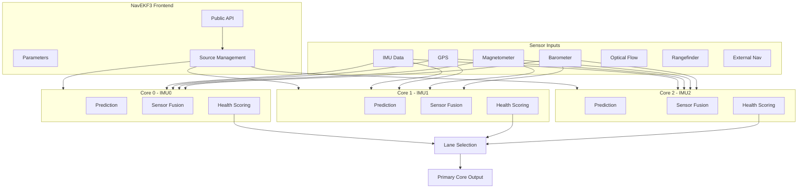
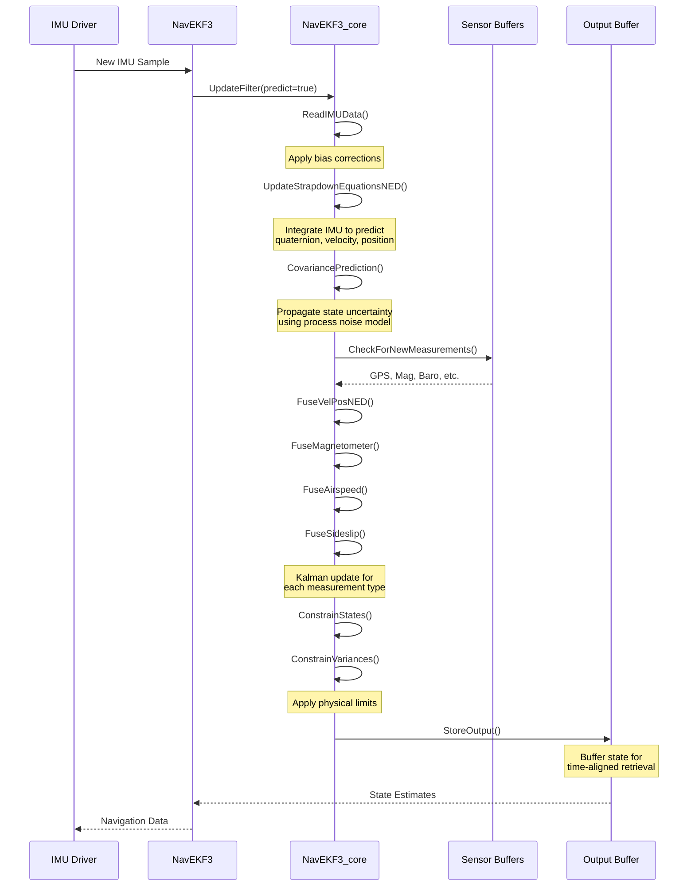
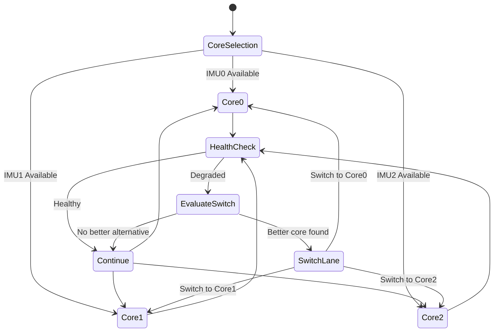
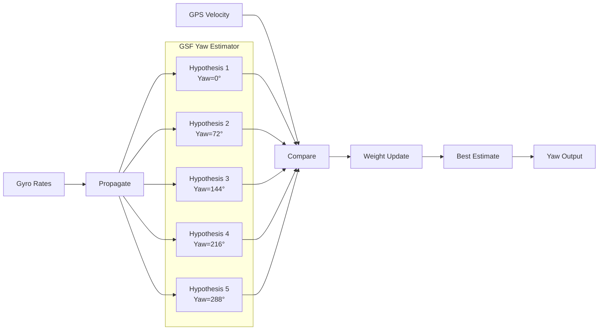

# AP_NavEKF3

## Overview

AP_NavEKF3 is ArduPilot's primary navigation filter, providing robust state estimation for position, velocity, and attitude across all vehicle types (Copter, Plane, Rover, Sub, Blimp, and AntennaTracker). It implements a 24-state Extended Kalman Filter (EKF) based on the mathematical derivation from PX4 ECL, converted from MATLAB to C++ by Paul Riseborough.

EKF3 represents a significant evolution over EKF2, featuring enhanced multi-IMU fault detection, improved sensor switching logic, a Gaussian Sum Filter (GSF) for magnetometer-independent yaw estimation, and better numerical stability. The filter operates in the NED (North-East-Down) navigation frame and fuses measurements from GPS, magnetometers, barometers, rangefinders, optical flow, visual odometry, wheel encoders, airspeed sensors, and external navigation systems.

**Key Capabilities**:
- 24-state Extended Kalman Filter for full 6DOF state estimation
- Multi-core architecture with parallel IMU processing and lane switching
- GSF yaw estimator for robust initialization without magnetometer
- Comprehensive sensor fusion with glitch detection and health monitoring
- Support for external navigation systems (T265, MoCap) and visual odometry
- Configurable via compile-time features for memory-constrained boards

**Primary Use Cases**:
- Autonomous vehicle navigation requiring cm-level position accuracy
- GPS-denied environments using optical flow or visual odometry
- Multi-sensor fusion with automatic failover and health monitoring
- Research and development of advanced navigation algorithms

## Architecture

### Multi-Core Design

EKF3 employs a multi-core architecture where each IMU gets its own dedicated EKF core instance running in parallel. This design provides robustness against IMU failures and allows seamless switching between cores based on health scoring.



**Frontend (NavEKF3 class)**:
- Manages multiple EKF core instances (one per IMU)
- Implements the public API for accessing state estimates
- Handles parameter storage and configuration
- Performs lane selection based on core health scores
- Manages sensor source selection and switching

**Backend (NavEKF3_core class)**:
- Executes the EKF prediction and update cycles
- Performs sensor fusion for all measurement sources
- Maintains the 24-state vector and covariance matrix
- Computes innovation statistics and health metrics
- Buffers sensor data to compensate for measurement delays

### Update Cycle Flow

The EKF operates at a fixed rate (typically 400Hz for Copter, 50-100Hz for other vehicles) synchronized with IMU updates. Each cycle consists of a prediction step followed by measurement fusion.



### Lane Selection and Health Scoring

The frontend continuously monitors all cores and selects the healthiest one as the primary lane. Lane switching occurs when a core's health degrades below acceptable thresholds or another core demonstrates significantly better performance.

**Health Scoring Factors**:
- Innovation consistency test ratios (position, velocity, magnetometer)
- State variance magnitudes (detecting filter divergence)
- Sensor data availability and quality
- Time since last measurement fusion
- Number of fused sensor types

**Lane Switching Logic**:


## 24-State Vector Composition

The EKF maintains 24 states organized as follows:

| Index | State | Description | Units | Frame |
|-------|-------|-------------|-------|-------|
| 0-3 | quaternion | Rotation from NED frame to body frame (q0, q1, q2, q3) | - | - |
| 4-6 | velocity | North, East, Down velocity | m/s | NED |
| 7-9 | position | North, East, Down position relative to origin | m | NED |
| 10-12 | gyro_bias | X, Y, Z axis gyroscope bias | rad | Body |
| 13-15 | accel_bias | X, Y, Z axis accelerometer bias | m/s | Body |
| 16-18 | earth_magfield | North, East, Down magnetic field | Gauss | NED |
| 19-21 | body_magfield | X, Y, Z axis magnetometer bias | Gauss | Body |
| 22-23 | wind_vel | North, East wind velocity | m/s | NED |

**Source**: `libraries/AP_NavEKF3/AP_NavEKF3_core.h:555-564`

**State Vector Mathematical Representation**:

The state vector derives from the continuous-time strapdown navigation equations with discrete-time updates. The quaternion representation avoids gimbal lock and provides computational efficiency compared to Euler angles.

**Quaternion Convention**: Hamilton convention with q0 as the scalar part, representing rotation from NED (navigation) frame to body frame. A positive rotation about Z-axis (yaw) increases q3.

**Position and Velocity**: Expressed in the local NED frame with origin set at the first valid position fix (typically GPS lock). All positions are relative to this origin to maintain numerical precision in single-precision floating point.

**Bias States**: Slowly-varying sensor biases are estimated to compensate for IMU imperfections, temperature drift, and aging effects. Gyro bias units are rad (not rad/s) because they represent the error integrated over the IMU sample period.

**Magnetic Field States**: Earth magnetic field components allow operation with changing magnetic declination and local anomalies. Body magnetic field estimates compensate for vehicle-mounted ferromagnetic materials and current-induced fields.

**Wind States**: Horizontal wind velocity estimation improves airspeed fusion and enables synthetic sideslip measurements. Vertical wind is not estimated due to observability limitations.

## Key Improvements Over EKF2

### Enhanced Multi-IMU Fault Detection

EKF3 runs independent cores for each IMU, allowing detection of individual IMU failures through:
- Cross-comparison of innovation statistics between cores
- Divergence detection when one core's state differs significantly from others
- Bias learning from healthy cores applied to inactive IMUs

**Implementation**: Each core maintains `inactiveBias[]` structures tracking gyro and accel biases for IMUs not actively driving that core. When a core switches IMUs, it initializes bias states from learned values.

**Source**: `libraries/AP_NavEKF3/AP_NavEKF3_core.h:673-678`

### GSF Yaw Estimator

The Gaussian Sum Filter (GSF) yaw estimator provides robust yaw initialization without requiring magnetometer data. This is critical for:
- Operation in magnetically-disturbed environments
- Indoor flight with metallic structures
- Vehicles with poor compass calibration
- Emergency yaw recovery after magnetic anomaly detection

**GSF Operation**:
- Maintains multiple yaw hypotheses (typically 5) as separate Gaussian distributions
- Each hypothesis is weighted based on consistency with GPS velocity
- Hypotheses are propagated using gyro measurements
- GPS velocity measurements update hypothesis weights
- Final yaw estimate is the weighted average of hypotheses

**Accuracy Threshold**: GSF yaw estimate must achieve <15° uncertainty (`GSF_YAW_ACCURACY_THRESHOLD_DEG`) before being used for filter initialization or yaw reset.

**Source**: `libraries/AP_NavEKF3/AP_NavEKF3_core.h:74-81`

### Improved Sensor Switching

EKF3 implements seamless switching between redundant sensors (multiple GPS, compasses, or airspeed sensors) with:
- Gradual weighting transitions to avoid discontinuities
- Innovation-based quality assessment for sensor health
- Automatic fallback when primary sensor fails pre-arm checks
- Source set management for coordinated switching of position/velocity/yaw sources

### Better Numerical Stability

Enhancements for numerical robustness:
- Optional double-precision support for position states (`HAL_WITH_EKF_DOUBLE`)
- Extended position state limits (±50M km for double precision vs ±1M km for single)
- Improved covariance matrix conditioning
- Variance clamping to prevent filter divergence
- Symmetry enforcement on covariance matrix after updates

**Source**: `libraries/AP_NavEKF3/AP_NavEKF3_core.h:92-97`

## Sensor Fusion Capabilities

### GPS Position and Velocity Fusion

**Fusion Method**: Direct Kalman update using GPS latitude/longitude (converted to NED meters) and velocity measurements.

**Glitch Detection**:
- Innovation consistency tests with configurable gates
- Statistical outlier rejection using chi-squared test
- Gradual timeout if GPS quality degrades
- Position drift monitoring during extended GPS outages

**Pre-Flight Checks** (`MASK_GPS_*` flags):
- Minimum satellite count (typically 6)
- Maximum HDOP threshold
- Speed error consistency
- Position error consistency
- Yaw error (for GPS heading)
- Position drift during arming
- Vertical and horizontal speed sanity

**Source**: `libraries/AP_NavEKF3/AP_NavEKF3_core.h:39-47`

### Magnetometer 3-Axis Fusion

**Fusion Method**: Fuses all three magnetometer axes simultaneously, comparing measured field with predicted field from estimated earth and body magnetic field states.

**Declination Handling**: Earth magnetic field estimate automatically learns declination, allowing operation anywhere on Earth without manual configuration.

**Anomaly Detection**:
- Sudden changes in earth field estimate trigger anomaly counter
- After `MAG_ANOMALY_RESET_MAX` (2) resets, switches to GPS or GSF yaw
- Magnetic field table constraints using World Magnetic Model (WMM)

**Learning Mode**: When using GPS yaw, magnetometer biases are slowly learned (`EK3_GPS_MAG_LEARN_RATE`) up to `EK3_GPS_MAG_LEARN_LIMIT` to enable eventual magnetometer use.

**Source**: `libraries/AP_NavEKF3/AP_NavEKF3_core.h:65-72`

### Barometer and Rangefinder Height Fusion

**Barometer Fusion**:
- Primary height reference for most flight conditions
- Reset-capable for changing altitude datums
- Temperature-compensated through baro driver

**Rangefinder Fusion**:
- Activated below configurable altitude threshold (`EK3_RNG_USE_HGT`)
- Speed-dependent engagement (`EK3_RNG_USE_SPD`)
- Terrain stability flag prevents use over unsuitable surfaces
- Median filtering to reject outliers
- Support for up to 2 downward-facing rangefinders with sensor selection

**Height Source Priority**:
1. Rangefinder (when in range and conditions suitable)
2. Barometer (standard mode)
3. GPS altitude (degraded mode or baro failure)

**Source**: `libraries/AP_NavEKF3/AP_NavEKF3_Measurements.cpp`

### Optical Flow Fusion with Terrain Estimation

**Flow Measurement Processing**:
- Motion compensation using gyro rates
- Quality-based weighting (0-255 scale)
- Body-frame position offset compensation for non-centered sensors

**Terrain Height Estimator**:
- Separate state for terrain height below vehicle
- Fuses optical flow and rangefinder measurements
- Enables navigation without GPS in height-constrained environments

**Speed Limiting**: Optical flow measurements constrain maximum navigation velocity based on sensor field-of-view and frame rate to maintain adequate pixel tracking.

**Source**: `libraries/AP_NavEKF3/AP_NavEKF3_OptFlowFusion.cpp`

### Visual Odometry (Body-Frame Integration)

**Measurement Format**: Body-frame linear displacement (`delPos`) and angular rotation (`delAng`) over time interval `delTime`.

**Integration Method**:
- Measurements are integrated using EKF-predicted rotation to transform to NED frame
- Quality weighting (0-100) adjusts measurement noise
- Sensor position offset compensation for non-IMU-centered cameras

**Typical Sources**:
- Intel RealSense T265 tracking camera
- Other VIO (Visual-Inertial Odometry) systems via MAVLink
- SLAM systems providing relative motion estimates

**Delay Compensation**: Visual odometry measurements can have significant processing delays (50-250ms) which are handled by the observation buffer system.

**Source**: `libraries/AP_NavEKF3/AP_NavEKF3.h:203-214`

### Wheel Encoder Odometry (Ground Vehicles)

**Measurement**: Change in wheel rotation angle over time, converted to linear displacement using wheel radius.

**Assumptions**:
- Wheel axis parallel to vehicle body X-axis
- No-slip condition (addressed via measurement noise tuning)
- Effective rolling radius configured correctly

**Typical Applications**:
- Rover GPS-denied navigation
- Indoor robotics
- Slip compensation via fusion with optical flow or GPS

**Feature Flag**: `EK3_FEATURE_BODY_ODOM` (enabled for Rover or boards >1MB)

**Source**: `libraries/AP_NavEKF3/AP_NavEKF3.h:216-226`

### External Navigation System Support

**Position and Quaternion Fusion**:
- Full 6DOF pose from external systems (T265, MoCap)
- Handles coordinate frame differences (detects NED vs ENU)
- Position reset synchronization to handle external system resets

**Velocity Fusion**:
- Independent velocity measurements from external nav
- Useful for systems providing velocity from optical flow or wheel odometry

**Delay Compensation**: External nav measurements specify average system delay allowing proper temporal alignment.

**Feature Flag**: `EK3_FEATURE_EXTERNAL_NAV` (enabled for boards >1MB)

**Source**: `libraries/AP_NavEKF3/AP_NavEKF3.h:242-264`

### Range Beacon Triangulation

**Fusion Method**: Measures range to fixed beacons with known NED positions, solving for vehicle position via least-squares.

**Applications**:
- Indoor positioning with UWB beacons
- GPS-denied outdoor navigation with radio beacons
- High-precision positioning in constrained areas

**Initialization**: Can use beacon ranges to perform static position estimation before takeoff.

**Feature Flag**: `EK3_FEATURE_BEACON_FUSION` (enabled when `AP_BEACON_ENABLED`)

**Source**: `libraries/AP_NavEKF3/AP_NavEKF3_RngBcnFusion.cpp`

### Airspeed and Synthetic Sideslip Fusion

**True Airspeed Fusion**:
- Improves wind estimation for fixed-wing aircraft
- Enables more accurate navigation in high-wind conditions
- Validates GPS velocity measurements

**Synthetic Sideslip**:
- Zero sideslip assumption for fixed-wing (no lateral velocity relative to airflow)
- Constrains velocity solution and improves wind estimation
- Disabled during high sideslip maneuvers (detected via roll angle)

**Source**: `libraries/AP_NavEKF3/AP_NavEKF3_AirDataFusion.cpp`

### Drag Fusion (High-Speed Fixed-Wing)

**Purpose**: Improves wind and velocity estimates at high airspeeds where drag forces are significant.

**Measurement**: Specific force (acceleration) measurements are compared with drag model predictions.

**Feature Flag**: `EK3_FEATURE_DRAG_FUSION` (enabled for boards >1MB)

## Compile-Time Features

EKF3 uses conditional compilation to reduce memory footprint on resource-constrained boards:

| Feature Macro | Default Enabled | Purpose |
|---------------|-----------------|---------|
| `EK3_FEATURE_BODY_ODOM` | Rover or >1MB boards | Wheel encoder and body-frame odometry |
| `EK3_FEATURE_EXTERNAL_NAV` | >1MB boards | External navigation system fusion (T265, MoCap) |
| `EK3_FEATURE_DRAG_FUSION` | >1MB boards | Aerodynamic drag-based velocity estimation |
| `EK3_FEATURE_BEACON_FUSION` | If `AP_BEACON_ENABLED` | Range beacon triangulation |
| `EK3_FEATURE_POSITION_RESET` | If `AP_AHRS_POSITION_RESET_ENABLED` | Position reset capability |
| `EK3_FEATURE_RANGEFINDER_MEASUREMENTS` | If `AP_RANGEFINDER_ENABLED` | Rangefinder height fusion |
| `EK3_FEATURE_OPTFLOW_FUSION` | If `AP_OPTICALFLOW_ENABLED` | Optical flow fusion and terrain estimation |

**Feature Selection Logic**: `EK3_FEATURE_ALL` is defined for standalone builds (Replay, DAL standalone) which always include all features.

**Source**: `libraries/AP_NavEKF3/AP_NavEKF3_feature.h`

## Parameter Tuning Guide

### Innovation Gate Parameters

Innovation gates determine how far a measurement can deviate from prediction before being rejected. Tighter gates improve robustness to outliers but may reject valid measurements during transients.

**Key Parameters**:
- `EK3_VELNE_M_NSE`: GPS horizontal velocity measurement noise (m/s)
- `EK3_VELD_M_NSE`: GPS vertical velocity measurement noise (m/s)
- `EK3_POSNE_M_NSE`: GPS horizontal position measurement noise (m)
- `EK3_ALT_M_NSE`: Barometric altitude measurement noise (m)
- `EK3_MAG_M_NSE`: Magnetometer measurement noise (Gauss)
- `EK3_EAS_M_NSE`: Airspeed measurement noise (m/s)

**Tuning Approach**:
1. Start with default values
2. Monitor innovation test ratios in logs (XKF4 messages)
3. If ratios consistently >0.5, measurement noise may be too low (gates too tight)
4. If filter responds slowly to valid changes, measurement noise may be too high
5. Adjust in 20-30% increments

### Process Noise Parameters

Process noise represents uncertainty in the state prediction model, primarily from unmodeled accelerations and sensor errors.

**Key Parameters**:
- `EK3_GYRO_P_NSE`: Gyroscope process noise (rad/s)
- `EK3_ACC_P_NSE`: Accelerometer process noise (m/s²)
- `EK3_GBIAS_P_NSE`: Gyro bias process noise (rad/s)
- `EK3_ABIAS_P_NSE`: Accel bias process noise (m/s²)
- `EK3_MAGE_P_NSE`: Earth magnetic field process noise (Gauss/s)
- `EK3_MAGB_P_NSE`: Body magnetic field process noise (Gauss/s)
- `EK3_WIND_P_NSE`: Wind velocity process noise (m/s²)

**Tuning Approach**:
1. Higher process noise allows faster state changes but increases uncertainty
2. Lower process noise improves smoothness but may lag true state changes
3. Increase if filter is slow to respond to real dynamics
4. Decrease if filter is too noisy or unstable

**Vibration Handling**: When high vibration is detected, accelerometer process noise is automatically increased to `BAD_IMU_DATA_ACC_P_NSE` (5.0 m/s²) to prevent filter divergence.

**Source**: `libraries/AP_NavEKF3/AP_NavEKF3_core.h:100`

### Vehicle-Specific Defaults

Different vehicle types have different default parameters optimized for their dynamics:

**Copter**:
- Lower position noise (copters can hold position)
- Tighter innovation gates
- Higher process noise for accel (aggressive maneuvering)

**Plane**:
- Airspeed fusion enabled
- Synthetic sideslip enabled
- Wind estimation tuned for cruise conditions

**Rover**:
- Wheel odometry typically enabled
- Reduced vertical dynamics constraints
- Magnetic declination more critical (lower speed)

**Sub**:
- Barometer disabled (pressure changes with depth)
- Rangefinder primary height source
- Reduced magnetic field learning (interference common)

### Yaw Source Selection

**Parameter**: `EK3_SRCn_YAW` (where n = 1, 2, 3 for source sets)

**Options**:
- 0 = None (disable yaw fusion)
- 1 = Compass (magnetometer-based yaw)
- 2 = GPS (requires dual GPS with yaw capability)
- 3 = GPS with compass fallback
- 6 = External navigation
- 8 = GSF (Gaussian Sum Filter)

**Recommendation**: Option 8 (GSF) provides best robustness in magnetically-disturbed environments while falling back to compass when reliable.

## GSF Yaw Estimator Deep Dive

The Gaussian Sum Filter yaw estimator is a key innovation in EKF3, enabling robust yaw initialization and recovery without magnetometer dependence.

### Algorithm Overview

GSF maintains 5 concurrent yaw hypotheses, each representing a possible vehicle heading. As GPS velocity measurements arrive, hypotheses inconsistent with observed motion are down-weighted while consistent hypotheses gain weight.



### Initialization

Hypotheses are initialized with evenly-spaced yaw angles (0°, 72°, 144°, 216°, 288°) and equal weights (0.2 each). This provides full coverage of the yaw circle with 5 samples.

### Propagation

Each hypothesis is propagated forward using gyro measurements (yaw rate integration). This maintains the relative angular spacing between hypotheses as the vehicle rotates.

### Weight Update

When GPS velocity is available, each hypothesis predicts what velocity should be measured given its yaw angle. The prediction error is used to update hypothesis weights via Bayesian update rule:

```
w_i = w_i * exp(-0.5 * innovation^2 / variance)
```

After update, weights are normalized so they sum to 1.0.

### Convergence Criteria

GSF output is considered valid when:
1. Maximum hypothesis weight exceeds threshold (typically 0.95)
2. Yaw uncertainty (calculated from weighted variance) < 15° (`GSF_YAW_ACCURACY_THRESHOLD_DEG`)
3. Estimate has been stable for `GSF_YAW_VALID_HISTORY_THRESHOLD` (5) consecutive updates

### Usage in EKF3

**Yaw Initialization**: During filter initialization, if magnetometer is unavailable or unreliable, EKF3 waits for GSF to converge before completing alignment.

**Yaw Reset**: If magnetometer yaw diverges significantly from GSF (indicating magnetic anomaly), EKF3 can reset yaw to GSF estimate via `requestYawReset()`.

**Timeout**: Yaw reset requests timeout after `YAW_RESET_TO_GSF_TIMEOUT_MS` (5000 ms) if not completed.

**Source**: `libraries/AP_NavEKF/EKFGSF_yaw.h` and `libraries/AP_NavEKF3/AP_NavEKF3_core.h:74-81`

## Coordinate Frames and Conventions

### NED Navigation Frame

The EKF operates in the North-East-Down (NED) local navigation frame:
- **North**: Points toward true north
- **East**: Points east (right-hand rule with North and Down)
- **Down**: Points toward Earth center (positive down)

**Origin**: Set at the first valid position fix (typically first GPS lock). All position states are relative to this origin. The origin can be queried via `getOriginLLH()` and set via `setOriginLLH()` (if vehicle is not armed).

**Advantages of NED**:
- Conventional for aerospace applications
- Right-handed coordinate system
- Z-axis aligns with gravity
- Avoids singularities at poles (unlike geodetic coordinates)

### Body Frame

The body frame is fixed to the vehicle:
- **X-axis**: Points forward (along vehicle longitudinal axis)
- **Y-axis**: Points right (along lateral axis)
- **Z-axis**: Points down (perpendicular to X-Y plane)

**Right-Handed**: Follows right-hand rule (X × Y = Z)

**Sensor Alignment**: IMU measurements (gyro, accel) are in body frame. Other sensors (magnetometer, optical flow) may require rotation matrices to align with body frame.

### Rotation Representation

**Quaternion** (states 0-3): Represents rotation from NED frame to body frame using Hamilton convention with q0 as scalar part:
```
q = [q0, q1, q2, q3] = [cos(θ/2), sin(θ/2)*axis]
```

**Conversion to Euler Angles**: Available via `getEulerAngles()`:
- Roll: Rotation about body X-axis (positive right-wing-down)
- Pitch: Rotation about body Y-axis (positive nose-up)
- Yaw: Rotation about body Z-axis (positive nose-right)

**Conversion to DCM**: Available via `getRotationBodyToNED()` for direct vector transformation.

### Unit Conventions

**Distances**: Meters (m)
**Velocities**: Meters per second (m/s)
**Angles**: Radians (rad) - note that Euler angle outputs may be converted to degrees by calling code
**Angular Rates**: Radians per second (rad/s)
**Magnetic Field**: Gauss
**Time**: Seconds (s) for intervals, milliseconds (ms) for timestamps

**Bias Units**: Gyro bias is in radians (not rad/s) because it represents the integrated error over the IMU sample period. Accel bias is in m/s for the same reason.

## Testing Procedures

### SITL Testing

Software-In-The-Loop simulation provides a safe environment to test EKF3 behavior without risking physical hardware.

**Basic SITL Startup**:
```bash
# Start Copter SITL with console and map
sim_vehicle.py -v ArduCopter --console --map

# Set parameters for EKF3 testing
param set AHRS_EKF_TYPE 3
param set EK3_ENABLE 1
```

**GPS Denied Testing**:
```bash
# Test optical flow navigation
param set EK3_SRC1_POSXY 0  # No GPS
param set EK3_SRC1_VELXY 5  # Use optical flow
param set EK3_SRC1_POSZ 1   # Use baro

# Simulate rangefinder for optical flow height reference
param set RNGFND1_TYPE 1    # Enable simulated rangefinder
param set RNGFND1_MAX_CM 1000

# Enable optical flow
param set FLOW_TYPE 2       # Simulated optical flow
```

**GSF Yaw Testing**:
```bash
# Disable compass to force GSF yaw
param set COMPASS_ENABLE 0
param set EK3_SRC1_YAW 8    # Use GSF

# Arm and observe yaw convergence in logs
arm throttle
```

**Multi-IMU Testing**:
```bash
# Inject IMU failure on IMU 0
param set SIM_IMU_FAIL 1

# Monitor lane switching in console
# Should see: "EKF3 lane switch 0 -> 1"
```

### Log Analysis

**Key Log Messages**:
- **XKF0**: EKF timing and yaw estimator status
- **XKF1**: Quaternion, velocity, position, gyro bias (primary core)
- **XKF2**: Accel bias, wind velocity, magnetic field (primary core)
- **XKF3**: Innovation consistency test ratios
- **XKF4**: Position, velocity, height variances (all cores)
- **XKF5**: Normalised innovation values (filtered)
- **XKFS**: GSF yaw estimator detailed state

**Checking Filter Health**:
```python
# Using MAVExplorer or similar log analysis tool
graph XKF4.SV  # Velocity variance - should stay <1.0
graph XKF4.SP  # Position variance - should stay <100
graph XKF3.IVN # Velocity innovation - should be within gates
graph XKF3.IPN # Position innovation - should be within gates
```

**Identifying Lane Switches**:
```bash
# Search log for lane switches
grep "lane switch" logfile.bin
```

**Innovation Analysis**: Innovation test ratios (XKF3) should typically be <0.5. Values approaching 1.0 indicate measurement rejections. Consistently high ratios suggest:
- Measurement noise parameters set too low
- Actual sensor noise higher than configured
- Sensor calibration issues
- Vehicle dynamics exceeding process noise model

### Hardware Testing

**Pre-Arm Checks**:
```bash
# Monitor EKF status on ground
# Should see: "EKF3 IMU0 is using GPS"
# Should see: "EKF3 IMU0 initial yaw alignment complete"

# Check pre-arm status
# Should pass: "EKF3 checks passed"
```

**In-Flight Monitoring**:
- Monitor `EKF_STATUS_REPORT` MAVLink messages
- Watch for position innovation spikes during GPS glitches
- Verify smooth lane switching (no position jumps)
- Check yaw stability during maneuvers

**Vibration Testing**:
```bash
# Post-flight vibration analysis
# Check VIBE message: Clip counts should be <5% of samples
# If high vibration: EKF3 may increase process noise (logged)
```

**Safe Testing Progression**:
1. Ground testing: Verify GPS lock, yaw alignment, sensor fusion
2. Hover testing: Check stability, position hold accuracy
3. Low-speed translation: Verify velocity estimates
4. Waypoint navigation: Test position accuracy over distance
5. Failsafe testing: Simulate GPS loss, compass failure, IMU issues

## Integration Examples

### Accessing EKF State Estimates

```cpp
#include <AP_NavEKF3/AP_NavEKF3.h>

// Get reference to EKF3 instance from AHRS
NavEKF3 &ekf3 = ahrs.get_NavEKF3();

// Check if EKF is healthy
if (!ekf3.healthy()) {
    gcs().send_text(MAV_SEVERITY_WARNING, "EKF3 unhealthy");
    return;
}

// Get NED position relative to origin
Vector2p posNE;
postype_t posD;
if (ekf3.getPosNE(posNE) && ekf3.getPosD(posD)) {
    // Position valid - can use for navigation
    float north_m = posNE.x;
    float east_m = posNE.y;
    float down_m = posD;
}

// Get NED velocity
Vector3f velNED;
ekf3.getVelNED(velNED);
float groundspeed = norm(velNED.x, velNED.y);

// Get attitude as Euler angles
Vector3f eulers;
ekf3.getEulerAngles(eulers);
float roll_rad = eulers.x;
float pitch_rad = eulers.y;
float yaw_rad = eulers.z;

// Get IMU bias estimates
Vector3f gyroBias, accelBias;
ekf3.getGyroBias(-1, gyroBias);  // -1 = primary core
ekf3.getAccelBias(-1, accelBias);
```

**Source**: `libraries/AP_NavEKF3/AP_NavEKF3.h:69-102`

### Handling Position Resets

EKF3 may reset position states when switching to a new sensor or recovering from prolonged GPS loss. Calling code should handle these resets gracefully.

```cpp
// Get position reset information
Vector2f posDelta;
uint32_t resetTime_ms = ekf3.getLastPosNorthEastReset(posDelta);

if (resetTime_ms != lastResetTime_ms) {
    // Position was reset - update dependent systems
    lastResetTime_ms = resetTime_ms;
    
    // Adjust waypoint targets by reset amount
    current_loc.offset(posDelta.x, posDelta.y);
    
    gcs().send_text(MAV_SEVERITY_INFO, "EKF position reset: %.2fm", 
                    posDelta.length());
}

// Similarly for velocity resets
Vector2f velDelta;
resetTime_ms = ekf3.getLastVelNorthEastReset(velDelta);

// And altitude resets
float altDelta;
resetTime_ms = ekf3.getLastPosDownReset(altDelta);

// And yaw resets
float yawDelta;
resetTime_ms = ekf3.getLastYawResetAngle(yawDelta);
```

**Source**: `libraries/AP_NavEKF3/AP_NavEKF3.h:298-312`

### Checking EKF Health Before Critical Operations

```cpp
// Before entering autonomous mode
bool ekf_ready_for_auto() {
    NavEKF3 &ekf3 = ahrs.get_NavEKF3();
    
    // Check basic health
    if (!ekf3.healthy()) {
        gcs().send_text(MAV_SEVERITY_ERROR, "EKF unhealthy");
        return false;
    }
    
    // Check position is available
    Vector2p posNE;
    if (!ekf3.getPosNE(posNE)) {
        gcs().send_text(MAV_SEVERITY_ERROR, "No EKF position");
        return false;
    }
    
    // Check origin is set
    Location origin;
    if (!ekf3.getOriginLLH(origin)) {
        gcs().send_text(MAV_SEVERITY_ERROR, "No EKF origin");
        return false;
    }
    
    // Check innovation test ratios
    Vector3f velInnov, posInnov, magInnov;
    float tasInnov, yawInnov;
    if (ekf3.getInnovations(velInnov, posInnov, magInnov, tasInnov, yawInnov)) {
        // Check position innovations are reasonable (<5m)
        if (posInnov.length() > 5.0f) {
            gcs().send_text(MAV_SEVERITY_ERROR, "Large position innovation");
            return false;
        }
    }
    
    return true;
}
```

**Source**: `libraries/AP_NavEKF3/AP_NavEKF3.h:176-180`

### Providing Sensor Data to EKF

```cpp
// Example: Feeding optical flow data
void handle_optical_flow() {
    // Get flow measurements from sensor
    uint8_t quality = flow_sensor.quality();
    Vector2f flowRates = flow_sensor.flow_rates_rad_per_sec();
    Vector2f gyroRates = flow_sensor.gyro_rates_rad_per_sec();
    uint32_t timestamp_ms = AP_HAL::millis();
    
    // Sensor position offset in body frame
    Vector3f sensorOffset(0.05f, 0.0f, -0.03f);  // 5cm forward, 3cm down
    
    // Send to all available EKFs
    NavEKF3 &ekf3 = ahrs.get_NavEKF3();
    ekf3.writeOptFlowMeas(quality, flowRates, gyroRates, 
                          timestamp_ms, sensorOffset, 0.0f);
}

// Example: Feeding external navigation data
void handle_external_nav(const mavlink_att_pos_mocap_t &msg) {
    // Extract position and orientation
    Vector3f pos(msg.x, msg.y, msg.z);
    Quaternion quat(msg.q[0], msg.q[1], msg.q[2], msg.q[3]);
    
    // Uncertainty estimates (tune based on external system specs)
    float posErr = 0.1f;   // 10cm position uncertainty
    float angErr = 0.05f;  // ~3° angle uncertainty
    
    uint32_t timestamp_ms = msg.time_usec / 1000;
    uint16_t delay_ms = 50;  // Typical processing + transmission delay
    
    NavEKF3 &ekf3 = ahrs.get_NavEKF3();
    ekf3.writeExtNavData(pos, quat, posErr, angErr, 
                         timestamp_ms, delay_ms, 0);
}
```

**Source**: `libraries/AP_NavEKF3/AP_NavEKF3.h:190-254`

## Safety Considerations

### Pre-Arm Checks

EKF3 implements comprehensive pre-arm checks to prevent takeoff with unhealthy navigation state:

**Position Accuracy Check**:
- Verifies position variance is below threshold
- Ensures GPS quality sufficient for planned flight
- Confirms altitude solution is reliable

**Yaw Alignment Check**:
- Requires yaw alignment to complete (compass, GPS, or GSF)
- Verifies yaw uncertainty below threshold (<15° typical)
- Ensures sufficient yaw observability

**IMU Consistency**:
- Checks for excessive differences between IMU cores
- Validates bias estimates are within bounds
- Detects IMU hardware failures

**Sensor Availability**:
- Confirms required sensors are present and healthy
- Validates sensor fusion is active for selected sources
- Ensures no prolonged data gaps

**Implementation**: `pre_arm_check()` populates failure message buffer with specific failure reasons if checks fail.

**Source**: `libraries/AP_NavEKF3/AP_NavEKF3.h:59`

### Failsafe Triggers

**EKF Failsafe Conditions**:
- Position variance exceeds threshold (typically 100m²)
- Velocity variance exceeds threshold (typically 10 m²/s²)
- Innovation test ratios exceed limits for prolonged period
- Filter declares itself unhealthy via `healthy()` check

**Actions on EKF Failsafe**:
1. Attempt lane switch to healthier core
2. Request yaw reset to GSF if available
3. If no recovery possible, trigger EKF failsafe mode (land, RTL, or hover depending on configuration)

**Graceful Degradation**: EKF3 attempts to maintain partial navigation capability even with sensor failures:
- GPS failure: Continue with dead reckoning using last velocity
- Compass failure: Switch to GSF yaw or GPS yaw
- Barometer failure: Use GPS altitude
- IMU failure: Switch to redundant IMU core

### Lane Switching Behavior

**Switching During Flight**: Lane switches can occur mid-flight when a core becomes unhealthy. Potential impacts:
- Brief position transient (typically <1m)
- Velocity discontinuity (typically <0.5 m/s)
- Attitude jump (typically <5°)

**Mitigation**: Position, velocity, and yaw reset deltas are logged and can be queried via `getLastPosNorthEastReset()`, `getLastVelNorthEastReset()`, `getLastYawResetAngle()` to allow flight control to compensate.

**Conservative Switching**: Lane switches only occur when new lane is significantly healthier (typically 20% better health score) to prevent oscillation.

### Vibration Effects

**High Vibration Detection**: When IMU clipping or accelerometer saturation is detected:
- Accelerometer process noise automatically increased to `BAD_IMU_DATA_ACC_P_NSE` (5.0 m/s²)
- Increased noise reduces confidence in IMU measurements
- Filter relies more on external measurements (GPS, baro)
- If vibration persists for >`BAD_IMU_DATA_TIMEOUT_MS` (1000ms), height source may be reset

**Warning**: Excessive vibration degrades state estimation quality. Mechanical fixes (vibration isolation, prop balancing) are strongly preferred over parameter tuning.

**Source**: `libraries/AP_NavEKF3/AP_NavEKF3_core.h:99-106`

### Magnetic Anomalies

**Detection**: Sudden changes in estimated earth magnetic field indicate nearby ferromagnetic objects or electrical interference.

**Response**:
- Counter incremented each time anomaly detected
- After `MAG_ANOMALY_RESET_MAX` (2) resets per flight, switch from magnetometer to GPS/GSF yaw
- Magnetometer bias learning continues if GPS yaw available (at rate `EK3_GPS_MAG_LEARN_RATE`)

**Manual Recovery**: Operator can manually switch yaw sources via `EK3_SRCn_YAW` parameters if needed.

**Source**: `libraries/AP_NavEKF3/AP_NavEKF3_core.h:71-72`

## Implementation Notes

### Design Decisions

**Multi-Core vs. Single Core with IMU Blending**: EKF3's multi-core approach was chosen over single-core with blended IMU inputs because:
- Isolates fault detection to individual IMUs
- Enables graceful degradation when one IMU fails
- Provides redundancy without requiring complex sensor fusion before EKF
- Allows bias learning for inactive IMUs

**24-State vs. 15-State**: The 24-state formulation includes wind and magnetic field states for:
- Improved navigation accuracy in wind (fixed-wing)
- Magnetic anomaly detection and compensation
- Better observability of IMU biases

**Quaternion vs. Euler Angles**: Quaternion representation avoids gimbal lock and reduces computational cost compared to Euler angles, critical for 400Hz update rates.

**Single vs. Double Precision**: Optional double precision for position states (`HAL_WITH_EKF_DOUBLE`) enables operation over very long distances (>1000km from origin) without precision loss, important for long-range missions.

### Known Limitations

**Vertical Wind Not Estimated**: Only horizontal (NE) wind is estimated due to poor observability. Vertical wind effects appear as altitude errors.

**No Terrain Following Without Rangefinder**: EKF cannot estimate terrain slope without downward-facing rangefinder or optical flow. GPS altitude is above sea level, not AGL.

**IMU Bias Convergence Time**: Gyro and accel biases require 1-5 minutes to converge after power-on. Fast takeoff may result in initial drift until biases stabilize.

**Magnetic Field Learning**: When using non-compass yaw sources, magnetic field biases learn slowly (hours to days) via `EK3_GPS_MAG_LEARN_RATE`, limiting immediate compass use.

**Optical Flow Height Limit**: Flow navigation effectiveness degrades above 5-10m AGL due to decreasing pixel resolution.

### Future Improvements

**Potential Enhancements** (not implemented):
- Tighter coupling with visual SLAM systems
- Direct integration of wheel slip estimation for rovers
- Multi-antenna GPS attitude fusion
- Integration with neural network-based sensor validation

## References

### Source Code Files

- **Frontend**: `libraries/AP_NavEKF3/AP_NavEKF3.{h,cpp}`
- **Core Backend**: `libraries/AP_NavEKF3/AP_NavEKF3_core.{h,cpp}`
- **Feature Flags**: `libraries/AP_NavEKF3/AP_NavEKF3_feature.h`
- **Measurement Handling**: `libraries/AP_NavEKF3/AP_NavEKF3_Measurements.cpp`
- **Position/Velocity Fusion**: `libraries/AP_NavEKF3/AP_NavEKF3_PosVelFusion.cpp`
- **Magnetometer Fusion**: `libraries/AP_NavEKF3/AP_NavEKF3_MagFusion.cpp`
- **Optical Flow Fusion**: `libraries/AP_NavEKF3/AP_NavEKF3_OptFlowFusion.cpp`
- **Beacon Fusion**: `libraries/AP_NavEKF3/AP_NavEKF3_RngBcnFusion.cpp`
- **Airspeed Fusion**: `libraries/AP_NavEKF3/AP_NavEKF3_AirDataFusion.cpp`
- **GSF Yaw Estimator**: `libraries/AP_NavEKF/EKFGSF_yaw.{h,cpp}`

### Related Modules

- **AP_AHRS**: `libraries/AP_AHRS/` - Attitude and Heading Reference System interface
- **AP_NavEKF2**: `libraries/AP_NavEKF2/` - Previous generation EKF (EKF2)
- **AP_NavEKF**: `libraries/AP_NavEKF/` - Common definitions and utilities
- **AP_InertialSensor**: `libraries/AP_InertialSensor/` - IMU data source
- **AP_GPS**: `libraries/AP_GPS/` - GPS measurement source
- **AP_Compass**: `libraries/AP_Compass/` - Magnetometer measurement source
- **AP_Baro**: `libraries/AP_Baro/` - Barometer measurement source

### External Documentation

- **ArduPilot Wiki - EKF3**: https://ardupilot.org/dev/docs/extended-kalman-filter.html
- **PX4 ECL EKF**: https://github.com/PX4/ecl/ - Mathematical derivation source
- **Parameter Reference**: https://ardupilot.org/copter/docs/parameters.html#ek3-parameters
- **MAVLink EKF Status**: https://mavlink.io/en/messages/common.html#EKF_STATUS_REPORT

### Academic References

- Farrell, J. A., & Barth, M. (1999). *The Global Positioning System and Inertial Navigation*. McGraw-Hill.
- Bar-Shalom, Y., Li, X. R., & Kirubarajan, T. (2001). *Estimation with Applications to Tracking and Navigation*. Wiley.
- Solà, J. (2017). *Quaternion kinematics for the error-state Kalman filter*. arXiv:1711.02508.
