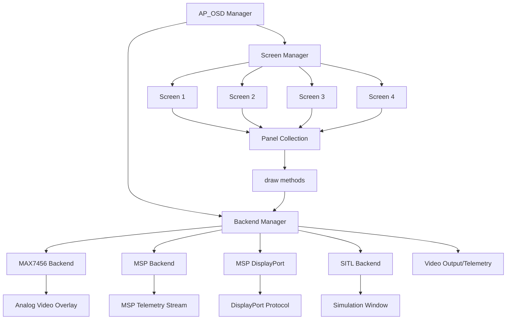
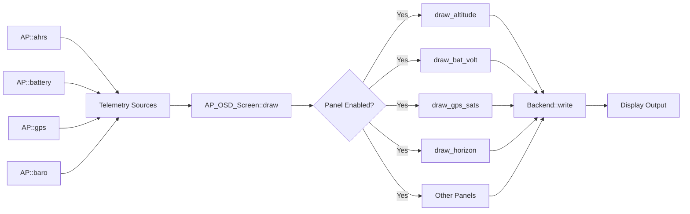
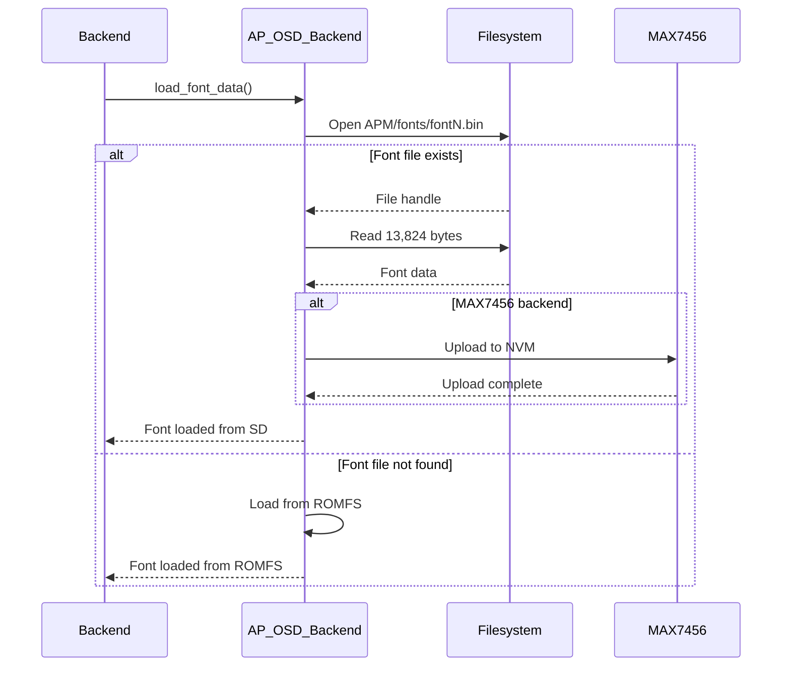
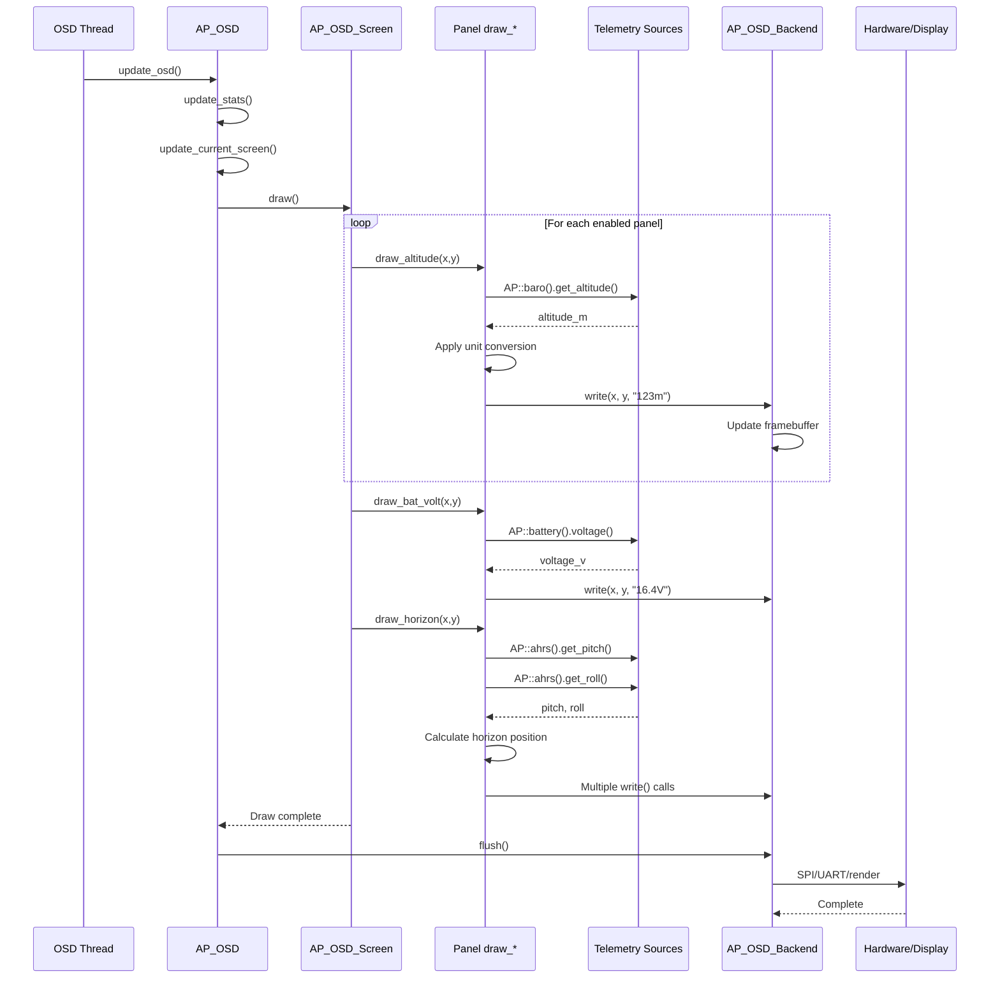

# AP_OSD - ArduPilot On-Screen Display Library

## Overview

The AP_OSD library provides comprehensive on-screen display (OSD) functionality for ArduPilot autopilots, overlaying real-time flight telemetry onto video feeds. The library supports multiple hardware and software backends including MAX7456-based analog OSD chips, MSP (MultiWii Serial Protocol) telemetry OSD systems, and simulation environments. The modular architecture enables flexible OSD implementations across diverse platforms, from traditional analog video systems to digital HD video links, while maintaining a consistent configuration and panel system.

## Architecture

The AP_OSD library implements a multi-backend architecture with centralized screen management and a flexible panel rendering system.



### Component Interactions

The AP_OSD manager (`AP_OSD` class) coordinates all OSD functionality through a dedicated thread. The manager maintains up to 4 display screens plus optional parameter configuration screens. Each screen contains a collection of configurable display panels (altitude, battery voltage, GPS status, etc.). The rendering pipeline retrieves telemetry data from ArduPilot subsystems, formats it according to unit preferences and display options, then passes character-based display commands to the active backend. Backends translate these commands into hardware-specific operations—SPI transactions for MAX7456 chips, MSP message packets for external OSDs, or graphical rendering for simulation.

## Key Components

### AP_OSD Manager

**Purpose**: Central coordinator for all OSD operations and configuration management

**Lifecycle**:
1. Initialization: `AP_OSD::init()` called during vehicle startup
2. Backend Probing: `init_backend()` creates appropriate backend(s) based on `OSD_TYPE` parameter
3. Thread Launch: Dedicated OSD thread runs `osd_thread()` continuously
4. Screen Updates: `update_osd()` called periodically to refresh display
5. Screen Switching: `update_current_screen()` handles user input for screen changes

**Thread Safety**: All OSD operations protected by `HAL_Semaphore` accessible via `get_semaphore()`

**Hardware Dependencies**: Backend-specific (SPI for MAX7456, UART for MSP, none for SITL)

### AP_OSD_Backend (Abstract Base Class)

**Purpose**: Defines interface contract for all OSD backend implementations

**Key Methods**:
- `init()`: Initialize backend hardware and allocate framebuffer
- `write(x, y, text)`: Write text string at specified character cell position
- `write(x, y, blink, fmt, ...)`: Write formatted text with optional blinking
- `flush()`: Push framebuffer contents to physical display
- `clear()`: Clear framebuffer and advance blink phase
- `load_font_data()`: Load font from SD card or ROMFS

**Coordinate System**: Character-based grid (typically 30x16 for NTSC, 30x13 for PAL in visible area)

### AP_OSD_Screen

**Purpose**: Manages collection of display panels and their positioning for one screen

**Responsibilities**:
- Panel collection: Contains 50+ optional AP_OSD_Setting panel instances
- Panel rendering: `draw()` method iterates enabled panels and calls draw functions
- Unit conversion: Handles metric/imperial/SI/aviation unit preferences
- Telemetry access: Retrieves data from AHRS, battery monitors, GPS, etc.

**Configuration**: Each panel has `enabled`, `xpos`, `ypos` parameters (e.g., `OSD1_ALTITUDE_EN`, `OSD1_ALTITUDE_X`, `OSD1_ALTITUDE_Y`)

### AP_OSD_Setting

**Purpose**: Holds enable/disable state and screen position for individual panels

**Parameters**:
- `enabled`: AP_Int8 (0=disabled, 1=enabled)
- `xpos`: AP_Int8 (horizontal character cell, 0-29 typical)
- `ypos`: AP_Int8 (vertical character cell, 0-15 NTSC, 0-12 PAL typical)

**Default Values**: Specified in constructor, optimized for non-overlapping layout

## Backend Implementations

### MAX7456 Backend (AP_OSD_MAX7456)

**Hardware**: Analog Systems MAX7456 OSD chip with SPI interface

**Capabilities**:
- Character-based overlay on analog composite video (NTSC/PAL)
- 256-character font support with programmable character memory (NVM)
- Hardware video sync detection and format auto-detection
- Adjustable horizontal/vertical offset via `OSD_H_OFFSET`, `OSD_V_OFFSET`

**Resolution**: 30 columns × 16 rows (NTSC) or 30 columns × 13 rows (PAL)

**Initialization Sequence**:
1. SPI device detection and reset
2. Video format detection (NTSC/PAL) via STAT register
3. Font loading from SD card (`fontN.bin`) or compiled ROMFS
4. Character upload to MAX7456 NVM if using SD card fonts
5. Video overlay enable

**Hardware Requirements**:
- SPI bus connection (typically SPI CS pin defined in hwdef)
- Analog video input/output connections
- 5V or 3.3V power depending on breakout board

**Configuration Parameters**:
- `OSD_TYPE=1` (MAX7456)
- `OSD_FONT`: Font selection (0-9)
- `OSD_H_OFFSET`: Horizontal position adjustment (0-63, default 32)
- `OSD_V_OFFSET`: Vertical position adjustment (0-31, default 16)

Source: libraries/AP_OSD/AP_OSD_MAX7456.cpp, libraries/AP_OSD/AP_OSD_MAX7456.h

### MSP Backend (AP_OSD_MSP)

**Protocol**: MultiWii Serial Protocol OSD telemetry messages

**Capabilities**:
- Transmits OSD panel data via MSP messages to external OSD hardware
- Compatible with Betaflight/iNav OSD systems
- Supports standard MSP OSD elements (battery, altitude, GPS, etc.)

**Message Flow**:
1. AP_OSD_Screen generates panel data
2. MSP backend formats data into MSP_OSD_CONFIG messages
3. Messages transmitted via configured UART
4. External OSD hardware renders display

**Use Cases**:
- DJI FPV system OSD overlay
- Standalone MSP OSD hardware modules
- Long-range video systems with MSP support

**Configuration**:
- `OSD_TYPE=3` (MSP)
- Serial port configured for MSP protocol
- MSP OSD device connected to configured UART

Source: libraries/AP_OSD/AP_OSD_MSP.cpp, libraries/AP_OSD/AP_OSD_MSP.h

### MSP DisplayPort Backend (AP_OSD_MSP_DisplayPort)

**Protocol**: MSP DisplayPort extension for high-resolution displays

**Capabilities**:
- Higher resolution support (HD formats)
- Per-screen resolution and font selection
- Compatible with DJI O3 Air Unit, Walksnail Avatar, HDZero

**Resolution Options**: Configurable via `OSDn_TXT_RES` parameter (backend-dependent, typically 30×16, 50×18, 60×22)

**Font Management**: Per-screen font selection via `OSDn_FONT_INDEX` parameter

**Configuration**:
- `OSD_TYPE=5` (MSP_DISPLAYPORT)
- `OSD1_TXT_RES`: Text resolution for screen 1
- `OSD1_FONT_INDEX`: Font index for screen 1

Source: libraries/AP_OSD/AP_OSD_MSP_DisplayPort.cpp, libraries/AP_OSD/AP_OSD_MSP_DisplayPort.h

### SITL Backend (AP_OSD_SITL)

**Purpose**: Software-in-the-loop simulation OSD for testing without hardware

**Capabilities**:
- Graphical window rendering OSD overlay
- Real-time display during SITL simulation
- Font rendering from `.bin` files
- Identical panel behavior to hardware backends

**Usage**: Automatically enabled when running SITL with `--osd` parameter

**Configuration**:
- `OSD_TYPE=2` (SITL)
- All panel and font parameters functional
- Window appears during SITL execution

Source: libraries/AP_OSD/AP_OSD_SITL.cpp, libraries/AP_OSD/AP_OSD_SITL.h (when `WITH_SITL_OSD` defined)

## Panel System

The AP_OSD panel system provides over 50 configurable display elements showing flight telemetry, navigation, and system status.

### Panel Architecture



### Available Panels

**Flight Data Panels**:
- `altitude`: Barometric altitude with unit symbol
- `gspeed`: Ground speed from GPS
- `aspeed`/`aspd1`/`aspd2`: Airspeed (fixed-wing, requires airspeed sensor)
- `vspeed`: Vertical speed (climb/descent rate)
- `throttle`: Throttle percentage
- `heading`: Compass heading in degrees
- `compass`: Rose compass display

**Navigation Panels**:
- `home`: Arrow and distance to home position
- `home_dist`: Distance to home (MSP OSD)
- `home_dir`: Direction to home (MSP OSD)
- `waypoint`: Current waypoint number and distance
- `xtrack_error`: Cross-track error in navigation
- `dist`: Distance traveled
- `wind`: Wind speed and direction indicator

**Attitude Panels**:
- `horizon`: Artificial horizon display
- `roll_angle`: Roll angle in degrees
- `pitch_angle`: Pitch angle in degrees
- `sidebars`: Graphical attitude sidebar indicators

**GPS/Position Panels**:
- `sats`: GPS satellite count
- `hdop`: Horizontal dilution of precision
- `gps_latitude`: GPS latitude coordinates
- `gps_longitude`: GPS longitude coordinates
- `pluscode`: Plus Code location encoding (if `HAL_PLUSCODE_ENABLE`)

**Battery/Power Panels**:
- `bat_volt`: Battery voltage
- `restvolt`: Battery resting voltage (under no load estimation)
- `avgcellvolt`: Average cell voltage
- `avgcellrestvolt`: Average cell resting voltage
- `current`: Battery current draw
- `batused`: Battery capacity used (mAh)
- `power`: Power consumption (watts, MSP)
- `cell_volt`: Cell voltage (MSP)
- `batt_bar`: Battery capacity bar graph (MSP)
- `bat2_vlt`/`bat2used`/`current2`: Secondary battery monitoring

**System Status Panels**:
- `fltmode`: Flight mode text
- `arming`: Armed/disarmed status (MSP)
- `message`: Status messages and warnings
- `rssi`: RC signal strength (RSSI)
- `link_quality`: RC link quality percentage
- `fence`: Geofence status indicator
- `callsign`: Operator callsign (from `BRD_OPTIONS` or SD card)

**Performance Panels**:
- `eff`: Power efficiency (mAh/km or mAh/mi)
- `climbeff`: Climb efficiency
- `rrpm`: RPM sensor reading (if `AP_RPM_ENABLED`)
- `esc_temp`/`esc_rpm`/`esc_amps`: ESC telemetry (if `HAL_WITH_ESC_TELEM`)

**Time/Info Panels**:
- `flightime`: Flight time since arming
- `clk`: Real-time clock
- `stat`: Statistics summary
- `temp`: Primary temperature sensor
- `atemp`: Airspeed temperature sensor
- `btemp`: Secondary barometer temperature
- `hgt_abvterr`: Height above terrain
- `rngf`: Rangefinder distance
- `vtx_power`: Video transmitter power level
- `crosshair`: Crosshair overlay (MSP)

**Extended Link Stats Panels** (if `AP_OSD_EXTENDED_LNK_STATS` - CRSF protocol):
- `rc_tx_power`: RC transmitter power
- `rc_rssi_dbm`: RSSI in dBm
- `rc_snr`: Signal-to-noise ratio
- `rc_active_antenna`: Active diversity antenna
- `rc_lq`: Link quality with RF mode

### Panel Configuration

Each panel is configured with three parameters per screen:

- `OSDn_PANEL_EN`: Enable (1) or disable (0) the panel
- `OSDn_PANEL_X`: Horizontal position (0-29 typical, 0=leftmost)
- `OSDn_PANEL_Y`: Vertical position (0-15 NTSC/0-12 PAL, 0=topmost)

Example for altitude panel on screen 1:
- `OSD1_ALTITUDE_EN = 1` (enabled)
- `OSD1_ALTITUDE_X = 23` (column 23)
- `OSD1_ALTITUDE_Y = 8` (row 8)

### Unit Conversion

The `OSD_UNITS` parameter controls display units:

- `0`: Metric (meters, km/h, °C)
- `1`: Imperial (feet, mph, °F)
- `2`: SI (meters, m/s, °C)
- `3`: Aviation (feet, knots, °C)

Unit symbols automatically display with appropriate values. The `u_scale()` and `u_icon()` helper functions in `AP_OSD_AbstractScreen` perform conversions.

Source: libraries/AP_OSD/AP_OSD_Screen.cpp lines 180-260 (panel declarations), libraries/AP_OSD/AP_OSD_Screen.cpp lines 267-340 (draw methods)

## Font Management

### Font System Architecture

The AP_OSD library supports customizable fonts with 256 characters per font, allowing localization and custom symbol sets.

**Font Storage Options**:
1. **Compiled ROMFS**: Fonts compiled into firmware (saves SD card space, increases flash usage)
2. **SD Card**: Fonts loaded from `APM/fonts/fontN.bin` files (saves flash, requires SD card)

**Font Selection**: `OSD_FONT` parameter (0-9) selects active font. Font index corresponds to filename (`font0.bin`, `font1.bin`, etc.).

### Font File Format

Font files are binary arrays of 54 bytes per character × 256 characters = 13,824 bytes total.

**Character Encoding**: Each character is 12 pixels wide × 18 pixels tall, stored as bit-packed bytes:
- 12 pixels/row × 18 rows = 216 bits = 27 bytes per character
- MAX7456 uses 2 bits per pixel (4 levels: transparent, black, white, gray)
- 54 bytes per character includes metadata and padding

**Symbol Lookup**: The `symbols_lookup_table[AP_OSD_NUM_SYMBOLS]` array maps logical symbols (altitude arrow, GPS icon, battery, etc.) to font character positions, enabling font-independent panel code.

### Font Loading Sequence



### Creating Custom Fonts

1. **Design Characters**: Use MAX7456 character generator tool or pixel editor (12×18 pixels, 2-bit grayscale)
2. **Generate Font File**: Export to `.bin` format (13,824 bytes)
3. **Install Font**: Copy `fontN.bin` to SD card `APM/fonts/` directory
4. **Select Font**: Set `OSD_FONT = N` parameter
5. **Reboot**: Font loads on next initialization

**Symbol Mapping**: Maintain compatibility with `symbols_lookup_table` for standard panels to display correctly.

**Font Resources**: See `libraries/AP_OSD/fonts/README.md` for font tools and repositories.

Source: libraries/AP_OSD/AP_OSD_Backend.cpp (load_font_data method), libraries/AP_OSD/fonts/README.md

## Screen Switching

The AP_OSD library supports multiple screens with user-controlled switching mechanisms.

### Screen Configuration

**Available Screens**:
- Screens 1-4: Display screens with panel collections
- Screens 5-6: Parameter configuration screens (if `OSD_PARAM_ENABLED`)

**Per-Screen Enable**: `OSDn_ENABLE` parameter (0=disabled, 1=enabled)

**Screen Channel Ranges**: Each screen has `OSDn_CHAN_MIN` and `OSDn_CHAN_MAX` parameters defining PWM range (μs) for activation.

### Switching Methods

Configured via `OSD_SW_METHOD` parameter:

#### Method 0: TOGGLE

**Behavior**: RC channel transitions toggle between enabled screens sequentially.

**Configuration**:
- `OSD_CHAN`: RC channel number for switching (0=disabled)
- Screen cycles on channel low→high→low transition
- Debounce logic prevents rapid switching

**Example**: Channel 7 switch position changes cycle through screens 1→2→3→1.

#### Method 1: PWM_RANGE

**Behavior**: RC channel PWM value selects screen based on ranges.

**Configuration**:
- Each screen has min/max PWM range
- Current channel PWM value determines active screen
- Allows direct screen selection with multi-position switches

**Example**:
- `OSD1_CHAN_MIN=1000, OSD1_CHAN_MAX=1300`: Screen 1 active when PWM 1000-1300
- `OSD2_CHAN_MIN=1301, OSD2_CHAN_MAX=1700`: Screen 2 active when PWM 1301-1700
- `OSD3_CHAN_MIN=1701, OSD3_CHAN_MAX=2000`: Screen 3 active when PWM 1701-2000

#### Method 2: AUTO_SWITCH

**Behavior**: Automatic screen switching based on vehicle state.

**Switching Logic**:
- Pre-arm: Display screen configured in `OSD_ARM_SCR` (default screen 1)
- Armed: Display screen configured in `OSD_ARM_SCR` 
- Disarmed: Switch to screen configured in `OSD_DISARM_SCR`
- Failsafe: Switch to screen configured in `OSD_FAILSAFE_SCR`
- Post-failsafe: Return to previous screen

**Use Case**: Show minimal info during flight, detailed stats after landing, warnings during failsafe.

**Configuration Example**:
- `OSD_ARM_SCR = 1`: Flight screen during armed
- `OSD_DISARM_SCR = 2`: Statistics screen when disarmed
- `OSD_FAILSAFE_SCR = 3`: Warnings screen during failsafe

Source: libraries/AP_OSD/AP_OSD.cpp (update_current_screen method)

## Rendering Pipeline

The OSD rendering pipeline executes in the dedicated `osd_thread()` at approximately 10-20 Hz update rate.



**Update Frequency**: Controlled by `OSD_MSGTIME_S` for message persistence and internal update timing.

**Framebuffer Management**: Backend maintains character framebuffer, flushed once per update cycle to minimize hardware transactions.

**Blinking Elements**: Blink phase advances on each `clear()` call, warnings blink at ~2 Hz.

Source: libraries/AP_OSD/AP_OSD.cpp (osd_thread, update_osd methods), libraries/AP_OSD/AP_OSD_Screen.cpp (draw method)

## Parameter Configuration

### Core OSD Parameters

| Parameter | Description | Default | Range | Units |
|-----------|-------------|---------|-------|-------|
| `OSD_TYPE` | Primary OSD backend type | 0 (None) | 0-5 | - |
| `OSD_TYPE2` | Secondary OSD backend (parallel) | 0 (None) | 0-5 | - |
| `OSD_FONT` | Font selection | 0 | 0-9 | - |
| `OSD_CHAN` | RC channel for screen switching | 0 | 0-16 | - |
| `OSD_SW_METHOD` | Screen switching method | 0 | 0-2 | - |
| `OSD_UNITS` | Display units | 0 (Metric) | 0-3 | - |
| `OSD_H_OFFSET` | Horizontal offset | 32 | 0-63 | chars |
| `OSD_V_OFFSET` | Vertical offset | 16 | 0-31 | chars |
| `OSD_OPTIONS` | Option bitmask | 0 | 0-255 | - |

### OSD_TYPE Values

- `0`: None (OSD disabled)
- `1`: MAX7456 (analog OSD chip via SPI)
- `2`: SITL (simulation OSD window)
- `3`: MSP (MultiWii Serial Protocol OSD)
- `4`: TXONLY (transmit-only, deprecated)
- `5`: MSP_DISPLAYPORT (MSP DisplayPort protocol for HD)

### OSD_OPTIONS Bitmask

| Bit | Option | Description |
|-----|--------|-------------|
| 0 | DECIMAL_PACK | Pack decimal values (reduce character usage) |
| 1 | INVERTED_WIND | Invert wind arrow direction |
| 2 | INVERTED_AH_ROLL | Invert artificial horizon roll |
| 3 | IMPERIAL_MILES | Use miles instead of nautical miles |
| 4 | DISABLE_CROSSHAIR | Disable crosshair display |
| 5 | BF_ARROWS | Use Betaflight-style arrow characters |
| 6 | AVIATION_AH | Aviation-style artificial horizon |
| 7 | RF_MODE_ALONG_WITH_LQ | Display RF mode with link quality |

### Warning Threshold Parameters

| Parameter | Description | Default | Units |
|-----------|-------------|---------|-------|
| `OSD_W_RSSI` | RSSI warning threshold | 30 (or -100) | % or dBm |
| `OSD_W_NSAT` | GPS satellite warning threshold | 6 | sats |
| `OSD_W_TERR` | Terrain altitude warning | -1 (disabled) | cm |
| `OSD_W_BATVOLT` | Battery voltage warning | 0 (auto) | V |
| `OSD_W_AVGCELLVOLT` | Average cell voltage warning | 3.5 | V |
| `OSD_W_RESTVOLT` | Resting voltage warning | 0 (disabled) | V |
| `OSD_W_AVGCELLRESTVOLT` | Resting cell voltage warning | 0 (disabled) | V |
| `OSD_W_BAT2VOLT` | Battery 2 voltage warning | 0 (disabled) | V |
| `OSD_W_LQ` | Link quality warning | 0 (disabled) | % |
| `OSD_W_SNR` | SNR warning threshold | 0 (disabled) | dB |

**Warning Behavior**: Values below thresholds trigger blinking display for corresponding panels.

### Screen State Parameters

| Parameter | Description | Default |
|-----------|-------------|---------|
| `OSD_ARM_SCR` | Screen to display when armed | 1 |
| `OSD_DISARM_SCR` | Screen to display when disarmed | 1 |
| `OSD_FAILSAFE_SCR` | Screen to display during failsafe | 1 |
| `OSD_MSGTIME_S` | Message display time | 10 seconds |
| `OSD_BTN_DELAY` | Button delay for param screens | 300 ms |

### Battery Configuration Parameters

| Parameter | Description | Default | Units |
|-----------|-------------|---------|-------|
| `OSD_CELL_COUNT` | Battery cell count (0=auto) | 0 | cells |
| `OSD_MAX_BAT_V` | Maximum battery voltage | 0 (auto) | V |

**Auto-detection**: When `OSD_CELL_COUNT=0`, cell count calculated from `OSD_MAX_BAT_V` or battery monitor configuration.

### Per-Screen Parameters

Each screen (1-4) has independent enable and switching parameters:

- `OSDn_ENABLE`: Enable screen (0=off, 1=on)
- `OSDn_CHAN_MIN`: Minimum PWM for PWM_RANGE switching
- `OSDn_CHAN_MAX`: Maximum PWM for PWM_RANGE switching

### Per-Panel Parameters (Example for Altitude)

Each panel on each screen has three parameters:

- `OSDn_ALTITUDE_EN`: Enable altitude panel (0=off, 1=on)
- `OSDn_ALTITUDE_X`: Horizontal position (0-29)
- `OSDn_ALTITUDE_Y`: Vertical position (0-15 NTSC, 0-12 PAL)

**Naming Pattern**: `OSD[screen]_[PANEL]_[EN|X|Y]`

**Total Parameters**: ~50 panels × 3 params × 4 screens = ~600 OSD panel parameters

Source: libraries/AP_OSD/AP_OSD.cpp (var_info array), libraries/AP_OSD/AP_OSD_Screen.cpp (panel var_info)

## Usage Patterns

### Accessing OSD Singleton

```cpp
#include <AP_OSD/AP_OSD.h>

// Get OSD instance
AP_OSD *osd = AP::osd();

if (osd != nullptr) {
    // OSD is available
    osd->set_nav_info(nav_info);
}
```

### Disabling/Enabling OSD

```cpp
// Temporarily disable OSD (e.g., during sensor calibration)
AP::osd()->disable();

// Re-enable OSD
AP::osd()->enable();
```

### Setting Navigation Information

```cpp
AP_OSD::NavInfo nav_info;
nav_info.wp_distance = 1234.5f;  // meters to waypoint
nav_info.wp_bearing = 45 * 100;  // centidegrees
nav_info.wp_xtrack_error = 12.3f;  // meters cross-track error
nav_info.wp_number = 5;  // current waypoint number

AP::osd()->set_nav_info(nav_info);
```

### Retrieving Statistics

```cpp
const AP_OSD::StatsInfo& stats = AP::osd()->get_stats_info();

float max_altitude = stats.max_alt_m;
float max_speed = stats.max_speed_mps;
float max_distance = stats.max_dist_m;
float min_voltage = stats.min_voltage_v;
```

**Statistics Tracking**: Automatically updated during flight, reset on disarm.

### Thread-Safe Access

```cpp
// Lock OSD for atomic updates
{
    WITH_SEMAPHORE(AP::osd()->get_semaphore());
    // Perform OSD operations
    AP::osd()->set_nav_info(nav_info);
}
// Semaphore automatically released
```

### Checking Current Screen

```cpp
uint8_t current_screen = AP::osd()->get_current_screen();

if (AP::osd()->is_readonly_screen()) {
    // Currently showing display screen (1-4)
} else {
    // Currently showing parameter config screen (5-6)
}
```

Source: libraries/AP_OSD/AP_OSD.h (public API methods)

## Custom Panel Development

### Adding a New Display Panel

Follow these steps to add a custom OSD panel:

#### Step 1: Add Panel Setting to AP_OSD_Screen

Edit `libraries/AP_OSD/AP_OSD_Screen.h`:

```cpp
class AP_OSD_Screen : public AP_OSD_AbstractScreen
{
private:
    // ... existing panels ...
    AP_OSD_Setting my_custom_panel{false, 10, 10};  // disabled by default, position (10,10)
};
```

**Constructor Parameters**: `AP_OSD_Setting(enabled, x_position, y_position)`

#### Step 2: Declare Draw Method

In `libraries/AP_OSD/AP_OSD_Screen.h`:

```cpp
class AP_OSD_Screen : public AP_OSD_AbstractScreen
{
private:
    void draw_my_custom_panel(uint8_t x, uint8_t y);
};
```

#### Step 3: Implement Draw Method

In `libraries/AP_OSD/AP_OSD_Screen.cpp`:

```cpp
void AP_OSD_Screen::draw_my_custom_panel(uint8_t x, uint8_t y)
{
    // Retrieve telemetry data
    float custom_value = get_custom_data_source();
    
    // Apply unit conversion if needed
    custom_value = u_scale(DISTANCE, custom_value);
    char unit_icon = u_icon(DISTANCE);
    
    // Format and write to backend
    backend->write(x, y, false, "%4.1f%c", custom_value, unit_icon);
}
```

**Backend Write Methods**:
- `write(x, y, text)`: Write string at position
- `write(x, y, blink, fmt, ...)`: Printf-style formatted output with optional blink
- Coordinates in character cells (0-29 horizontal, 0-15 vertical typical)

#### Step 4: Add to Screen Draw Loop

In `libraries/AP_OSD/AP_OSD_Screen.cpp`, add to `AP_OSD_Screen::draw()`:

```cpp
void AP_OSD_Screen::draw(void)
{
    // ... existing draw calls ...
    
    if (my_custom_panel.enabled) {
        draw_my_custom_panel(my_custom_panel.xpos, my_custom_panel.ypos);
    }
}
```

#### Step 5: Register Parameters

Add to `var_info` array in `libraries/AP_OSD/AP_OSD_Screen.cpp`:

```cpp
const AP_Param::GroupInfo AP_OSD_Screen::var_info[] = {
    // ... existing parameters ...
    
    // @Param: MY_CUSTOM_PANEL_EN
    // @DisplayName: MY_CUSTOM_PANEL Enable
    // @Description: Enable display of my custom panel
    // @Values: 0:Disabled,1:Enabled
    AP_SUBGROUPINFO(my_custom_panel, "MY_CUSTOM_PANEL", 50, AP_OSD_Screen, AP_OSD_Setting),
    
    AP_GROUPEND
};
```

**Parameter Naming**: `OSDn_MY_CUSTOM_PANEL_EN`, `OSDn_MY_CUSTOM_PANEL_X`, `OSDn_MY_CUSTOM_PANEL_Y` automatically created.

#### Step 6: Test in SITL

```bash
# Launch SITL with OSD
sim_vehicle.py -v Copter --console --map --osd

# Enable custom panel
param set OSD1_MY_CUSTOM_PANEL_EN 1
param set OSD1_MY_CUSTOM_PANEL_X 10
param set OSD1_MY_CUSTOM_PANEL_Y 5
```

### Panel Design Guidelines

**Character Budget**: Standard resolution is 30×16 characters. Design panels to fit within remaining space.

**Update Frequency**: All panels redraw at ~10-20 Hz. Avoid expensive calculations in draw methods.

**Unit Awareness**: Use `u_scale()` and `u_icon()` for user-configurable units.

**Symbol Usage**: Reference `symbols_lookup_table` for standard icons (arrows, GPS, battery, etc.).

**Blinking Warnings**: Pass `true` as blink parameter to `backend->write()` for warning conditions.

**Position Defaults**: Choose non-overlapping default positions that work across video standards.

Source: libraries/AP_OSD/AP_OSD_Screen.cpp (existing panel implementations)

## Backend-Specific Setup

### MAX7456 Hardware Setup

**Wiring** (typical SPI connection):
1. Connect MAX7456 CS pin to autopilot SPI CS pin (defined in hwdef)
2. Connect SPI SCK, MOSI, MISO to autopilot SPI bus
3. Connect video input from camera to MAX7456 VIDEO_IN
4. Connect video output from MAX7456 VIDEO_OUT to transmitter
5. Provide 5V power to MAX7456 (or 3.3V for 3.3V-compatible boards)

**Hardware Requirements**:
- MAX7456 OSD chip (common on PDB boards and standalone modules)
- Analog video camera (NTSC or PAL)
- Video transmitter

**Configuration**:
```
OSD_TYPE = 1
OSD_FONT = 0  # or 1-9 for custom fonts
OSD_H_OFFSET = 32  # adjust if display misaligned horizontally
OSD_V_OFFSET = 16  # adjust if display misaligned vertically
```

**Troubleshooting**:
- No OSD display: Check SPI connections, verify CS pin in hwdef
- Garbled display: Wrong video standard (NTSC/PAL auto-detect may need time)
- Misaligned display: Adjust `OSD_H_OFFSET` and `OSD_V_OFFSET`
- Font not loading: Check SD card `APM/fonts/fontN.bin` file exists and is 13,824 bytes

### MSP OSD Setup

**Wiring**:
1. Connect autopilot UART TX to MSP OSD device RX
2. Connect autopilot UART RX to MSP OSD device TX (if bidirectional)
3. Configure serial port for MSP protocol

**Configuration**:
```
SERIALn_PROTOCOL = 33  # MSP
SERIALn_BAUD = 115  # 115200 baud typical
OSD_TYPE = 3  # MSP
```

**Compatible Devices**:
- DJI FPV Goggles (Air Unit firmware with MSP support)
- Betaflight/iNav OSD hardware modules
- MWOSD boards

**Use Case**: Digital HD systems where MAX7456 analog overlay not applicable.

### MSP DisplayPort Setup

**Wiring**: Same as MSP OSD setup.

**Configuration**:
```
SERIALn_PROTOCOL = 42  # MSP DisplayPort
SERIALn_BAUD = 115
OSD_TYPE = 5  # MSP_DISPLAYPORT
OSD1_TXT_RES = 1  # HD resolution (backend-dependent)
OSD1_FONT_INDEX = 0  # Font selection
```

**Supported Systems**:
- DJI O3 Air Unit
- Walksnail Avatar HD system
- HDZero VTX modules with DisplayPort support

**Resolution Options** (via `OSDn_TXT_RES`):
- Values depend on backend device capabilities
- Common: 30×16 (SD), 50×18 (HD), 60×22 (HD+)

**Font Management**: Per-screen font selection allows different fonts for different screens on HD systems.

### SITL OSD Setup

**Launch SITL with OSD**:
```bash
# Basic SITL with OSD window
sim_vehicle.py -v Copter --osd

# With console and map
sim_vehicle.py -v Copter --console --map --osd
```

**Configuration**: OSD parameters function identically to hardware:
```
OSD_TYPE = 2  # SITL (auto-set when using --osd)
OSD_FONT = 0
# All panel parameters work normally
```

**Benefits**:
- Test OSD layouts without hardware
- Verify panel logic and positioning
- Rapid development iteration
- Screenshot OSD for documentation

**Limitations**:
- Rendering may differ slightly from hardware
- No video latency simulation
- Font rendering is software-based (appearance may vary)

Source: Hardware setup based on common MAX7456 board documentation, MSP configuration from AP_MSP integration

## Testing Procedures

### SITL Testing

**Basic OSD Functionality Test**:

```bash
# Launch SITL with OSD
cd ArduPilot
sim_vehicle.py -v Copter --console --map --osd

# In MAVProxy console
param set OSD_TYPE 2
param set OSD1_ENABLE 1
param set OSD1_ALTITUDE_EN 1
param set OSD1_ALTITUDE_X 23
param set OSD1_ALTITUDE_Y 8
param fetch
```

**Verify**: OSD window appears showing altitude at specified position.

**Panel Testing Workflow**:
1. Enable single panel
2. Verify display position and formatting
3. Test with different `OSD_UNITS` settings
4. Verify warning thresholds trigger blinking
5. Test screen switching logic

**Screen Switching Test**:
```bash
# Configure multiple screens
param set OSD1_ENABLE 1
param set OSD2_ENABLE 1
param set OSD_CHAN 7
param set OSD_SW_METHOD 0  # Toggle

# Use RC override to trigger switch
rc 7 1000
rc 7 2000
rc 7 1000  # Should cycle screens
```

### Hardware Testing

**Pre-Flight Testing Checklist**:
1. Power on system with video feed active
2. Verify OSD displays on ground station video
3. Check all enabled panels display correctly
4. Verify units match `OSD_UNITS` setting
5. Test screen switching with RC channel
6. Verify warning thresholds (low battery simulation)
7. Check statistics panels reset correctly after disarm

**Safe Battery Warning Test**:
```bash
# Use bench power supply or battery at safe voltage
param set OSD_W_BATVOLT 12.0  # Set warning above current voltage
# Verify battery voltage panel blinks
```

**Font Loading Test**:
```bash
# Copy fontN.bin to SD card APM/fonts/
param set OSD_FONT N
# Reboot and verify custom font displays
```

**Video Standard Test**:
- Test with both NTSC and PAL cameras
- Verify auto-detection works correctly
- Check display alignment with different standards

### Parameter Screen Testing (if OSD_PARAM_ENABLED)

```bash
# Enable parameter screen
param set OSD5_ENABLE 1
param set OSD_CHAN 7
param set OSD_SW_METHOD 0

# Switch to parameter screen
# Use RC channel to navigate parameters
# Verify parameter modification works
# Test save functionality
```

**Button Input Simulation**: Use RC channel overrides to simulate button presses for parameter navigation.

### Integration Testing

**Vehicle-Specific Testing**:
- **Copter**: Test horizon display during hover, verify throttle display
- **Plane**: Test airspeed panels, verify TECS energy display
- **Rover**: Test ground speed, verify waypoint navigation display

**Sensor Integration Test**:
- GPS: Verify satellite count, lat/lon, HDOP displays
- Battery: Test multiple battery instances
- Compass: Verify heading accuracy
- ESC Telemetry: Test ESC temp/RPM/current displays (if available)

**Failsafe Testing**:
```bash
# Simulate failsafe
rc failsafe
# Verify OSD switches to failsafe screen if configured
# Verify warning messages display
```

### Performance Testing

**Update Rate Verification**:
- Monitor OSD update frequency (should be ~10-20 Hz)
- Verify no dropped frames or flickering
- Check CPU usage (OSD thread should be <5% CPU)

**Memory Usage**:
- Verify font loading succeeds (requires ~14 KB RAM temporarily)
- Check for memory allocation failures in logs

Source: Testing procedures based on typical ArduPilot SITL and hardware validation workflows

## Safety Considerations

### Display Requirements

**Video Feed Criticality**: OSD is supplementary information only. Never rely solely on OSD for flight-critical decisions.

**Redundancy**: Maintain direct visual contact or use redundant telemetry systems (ground station, radio telemetry) for critical flight information.

**Warning Reliability**: OSD warnings (low battery, GPS loss, etc.) are helpful but may lag real-time conditions. Monitor multiple information sources.

### Thread Safety

**Concurrent Access**: OSD update thread runs independently of main vehicle control loops.

**Semaphore Protection**: The `get_semaphore()` method provides a `HAL_Semaphore` for locking OSD updates during critical external modifications:

```cpp
{
    WITH_SEMAPHORE(AP::osd()->get_semaphore());
    // Atomic OSD updates here
}
```

**Lock Duration**: Keep semaphore-locked sections brief to avoid delaying OSD updates.

### Display Limitations

**Latency**: OSD updates at 10-20 Hz. Fast-changing values (e.g., high-rate attitude) may appear delayed.

**Character Resolution**: Character-based display limits precision and detail compared to graphical displays.

**Video Standard Constraints**:
- NTSC: 30×16 visible area (some edges may be cut off by TV overscan)
- PAL: 30×13 visible area
- Position carefully to ensure critical info stays within safe area

### Parameter Safety

**Pre-Arm Checks**: The OSD system includes `pre_arm_check()` validation:
- Verifies OSD initialized if enabled
- Checks font loaded successfully
- Returns failure message if OSD configuration invalid

**Configuration Validation**: Test OSD configuration on ground before flight.

**Parameter Reset**: If OSD misconfigured, disable with `OSD_TYPE=0` to regain access.

### Battery Warning Configuration

**Critical Importance**: Set `OSD_W_BATVOLT` and `OSD_W_AVGCELLVOLT` conservatively:
- Allow sufficient margin for safe landing
- Account for voltage sag under load
- Test warning triggers before flight

**Multiple Warning Mechanisms**: OSD warnings complement vehicle failsafe systems, not replace them.

### Real-Time Performance

**CPU Budget**: OSD thread should consume <5% CPU. Excessive panel count or complex calculations may impact performance.

**SPI Bus Contention**: MAX7456 shares SPI bus with other devices. Ensure adequate bus bandwidth.

**Font Loading Time**: Initial font upload to MAX7456 NVM takes ~2 seconds. Vehicle initialization waits for completion.

### Video Interference

**MAX7456 Considerations**:
- Analog video overlay may introduce minor noise
- Ensure proper grounding to minimize video interference
- Use shielded cables for video connections where possible

**Power Supply Quality**: Ensure clean power to OSD hardware to prevent video artifacts.

Source: Safety considerations based on embedded real-time system best practices and OSD operational constraints

## Implementation Notes

### Design Decisions

**Character-Based Architecture**: Character cell addressing chosen for universal compatibility across backends. Allows MAX7456 hardware overlay, MSP telemetry transmission, and graphical rendering from same codebase.

**Multi-Backend Support**: Dual backend capability (`OSD_TYPE` and `OSD_TYPE2`) enables simultaneous analog and digital OSD output, supporting hybrid video systems.

**Thread Separation**: Dedicated OSD thread isolates display updates from flight control loops, preventing OSD processing from impacting critical timing.

**Panel Configuration Flexibility**: Individual enable/position parameters for each panel on each screen provides maximum customization without requiring firmware recompilation.

**Statistics Tracking**: Volatile `StatsInfo` structure enables post-flight analysis without requiring logging system, useful for recreational pilots.

### Trade-Offs

**Parameter Count vs. Flexibility**: ~600 OSD parameters enable comprehensive customization but consume parameter storage. Panel defaults minimize required configuration for typical use.

**Update Rate vs. CPU**: 10-20 Hz update rate balances smooth display with CPU budget. Higher rates possible but increase CPU usage.

**Font Storage**: SD card font loading saves flash at cost of ~14 KB RAM during load and SD card dependency. ROMFS fonts consume flash but eliminate SD requirement.

**Character Resolution vs. Detail**: Character-based system limits graphical detail compared to pixel-based OSD, but ensures universal compatibility and low bandwidth for MSP.

### Known Limitations

**MAX7456 Hardware Limitations**:
- Single-layer overlay (no transparency/anti-aliasing)
- Fixed character matrix (no arbitrary positioning)
- NTSC/PAL only (no HD digital video standards)
- Font upload time delays initialization (~2 seconds)

**MSP Protocol Limitations**:
- Bandwidth constraints limit update rate
- Panel support depends on receiving device capabilities
- No standardized extended panel set (device-dependent features)

**DisplayPort Limitations**:
- Resolution and font support varies by device
- Not all MSP DisplayPort devices support all panels
- Configuration requires trial-and-error for device-specific features

**General Limitations**:
- No pixel-level graphics (character-based only)
- Limited to 256 characters per font
- No runtime font switching (requires reboot)
- Screen switching requires RC channel or AUTO mode (no direct GCS control)

### Performance Characteristics

**Memory Usage**:
- ~14 KB during font loading (temporary)
- ~960 bytes framebuffer per backend (30×16 chars)
- ~50 KB compiled code size (with all panels enabled)

**CPU Usage**: <5% typical on STM32F4 at 168 MHz with 4 screens, 20+ panels enabled

**SPI Bandwidth** (MAX7456): ~30 characters × 2 bytes × 20 Hz = ~1.2 KB/s sustained

**UART Bandwidth** (MSP): Variable, typically 2-5 KB/s depending on panel count

### Future Enhancements

**Potential Improvements**:
- Pixel-based graphical panels for SITL/DisplayPort backends
- Dynamic font loading without reboot
- Additional panel types (thermal imaging, terrain awareness)
- GCS-based screen switching via MAVLink
- Custom panel scripting via Lua
- Video recording markers and telemetry injection

**Backward Compatibility**: Future enhancements maintain parameter compatibility to avoid requiring reconfiguration on firmware updates.

Source: Implementation notes based on code analysis and architectural patterns in libraries/AP_OSD/

## References

### Source Files

- **Core Manager**: `libraries/AP_OSD/AP_OSD.{h,cpp}` - Main OSD coordinator and singleton
- **Backend Interface**: `libraries/AP_OSD/AP_OSD_Backend.{h,cpp}` - Abstract base class for all backends
- **Screen Management**: `libraries/AP_OSD/AP_OSD_Screen.cpp` - Panel collection and rendering
- **MAX7456 Backend**: `libraries/AP_OSD/AP_OSD_MAX7456.{h,cpp}` - Analog OSD chip implementation
- **MSP Backend**: `libraries/AP_OSD/AP_OSD_MSP.{h,cpp}` - MSP telemetry OSD
- **DisplayPort Backend**: `libraries/AP_OSD/AP_OSD_MSP_DisplayPort.{h,cpp}` - MSP DisplayPort for HD systems
- **SITL Backend**: `libraries/AP_OSD/AP_OSD_SITL.{h,cpp}` - Simulation OSD
- **Parameter Screens**: `libraries/AP_OSD/AP_OSD.h` (AP_OSD_ParamScreen class) - Configuration UI

### Related Modules

- **AP_HAL**: Hardware abstraction for SPI/UART device access
- **AP_MSP**: MultiWii Serial Protocol implementation for telemetry
- **AP_Param**: Parameter storage and management system
- **AP_Notify**: Notification system (complementary to OSD warnings)
- **GCS_MAVLink**: Ground control station communication (OSD configuration messages)

### External Documentation

- **ArduPilot OSD Wiki**: https://ardupilot.org/copter/docs/common-osd-overview.html
- **MAX7456 Datasheet**: Analog Devices MAX7456 single-channel video overlay chip specifications
- **MSP Protocol**: MultiWii Serial Protocol specification
- **Font Repository**: https://github.com/ArduPilot/ardupilot_wiki/tree/master/images/osd-fonts

### Font Documentation

- **Font System**: `libraries/AP_OSD/fonts/README.md` - Font file format and loading details
- **Font Tools**: MAX7456 character generator and font editors (external)

### Configuration Tools

- **Mission Planner**: OSD panel configuration screen with visual positioning
- **QGroundControl**: Parameter-based OSD configuration
- **MAVProxy**: Command-line OSD parameter configuration

