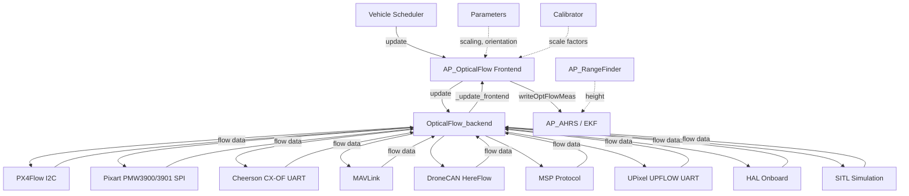
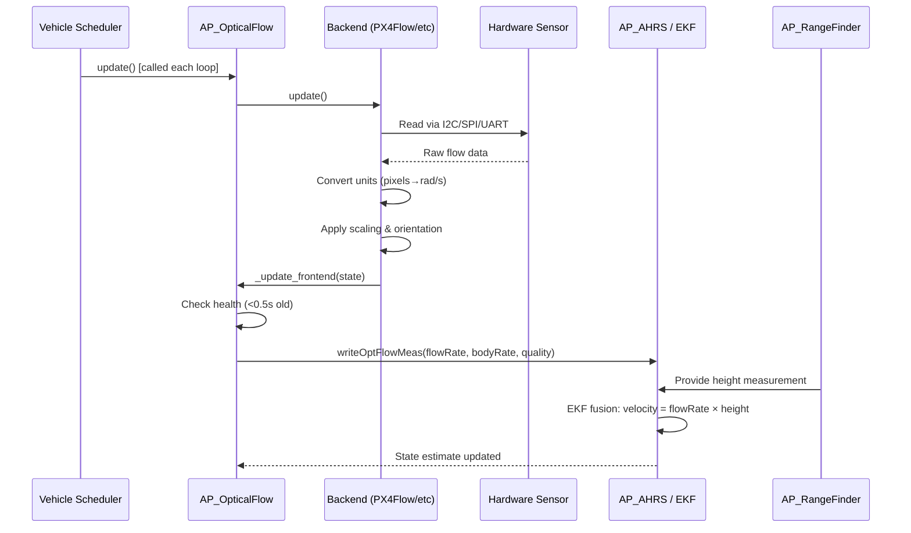

# AP_OpticalFlow - Optical Flow Sensor Library

## Overview

The AP_OpticalFlow library provides optical flow sensor integration for velocity estimation in GPS-denied environments. Optical flow sensors measure apparent motion of the ground by tracking visual features, enabling stable position hold and navigation when GPS is unavailable or unreliable. This library serves as a critical component in ArduPilot's navigation stack, particularly for indoor flight, operation under tree canopy, and GPS-jamming scenarios.

Optical flow works by measuring the angular rate at which visual features move across the sensor's field of view. When combined with rangefinder altitude measurements, this angular rate can be converted to linear velocity, providing the EKF with velocity observations for state estimation and enabling precise position control in GPS-denied environments.

## Architecture

The AP_OpticalFlow library follows a frontend-backend architecture pattern that abstracts hardware-specific implementations behind a common interface:



**Source:** libraries/AP_OpticalFlow/AP_OpticalFlow.h, AP_OpticalFlow_Backend.h

## Key Components

### Frontend Manager (AP_OpticalFlow)

The frontend manager (`AP_OpticalFlow`) is implemented as a singleton and provides a unified interface for all optical flow sensors in the system.

**Key Responsibilities:**
- **Backend lifecycle management** - Creates and initializes the appropriate backend based on FLOW_TYPE parameter
- **Parameter management** - Handles all user-configurable parameters (scaling, orientation, position offset)
- **State aggregation** - Collects flow measurements from backend and maintains health status
- **EKF integration** - Forwards processed flow measurements to the AHRS/EKF via `writeOptFlowMeas()`
- **Calibration support** - Manages the optional automatic calibration system

**Singleton Access:**
```cpp
// Access the global optical flow instance
AP_OpticalFlow *flow = AP::opticalflow();
```

**Public API:**
- `init(uint32_t log_bit)` - Initialize sensor with logging configuration
- `update()` - Called by vehicle scheduler to update flow measurements
- `enabled()` - Returns true if optical flow is enabled (FLOW_TYPE != 0)
- `healthy()` - Returns true if sensor is healthy (backend exists and data <0.5s old)
- `quality()` - Returns surface quality metric (0-255)
- `flowRate()` - Returns raw optical flow angular rate in rad/s
- `bodyRate()` - Returns IMU-compensated body angular rate in rad/s
- `last_update()` - Returns timestamp of last sensor update
- `get_pos_offset()` - Returns sensor position offset from vehicle center
- `start_calibration()` / `stop_calibration()` - Control automatic calibration

**Thread Safety:**
The frontend uses semaphores (`HAL_Semaphore`) to ensure thread-safe access to shared state between the backend update callbacks and the main vehicle loop.

**Source:** libraries/AP_OpticalFlow/AP_OpticalFlow.h:32-164, AP_OpticalFlow.cpp:104-260

### Backend Base Class (OpticalFlow_backend)

The `OpticalFlow_backend` abstract base class defines the interface that all sensor-specific implementations must follow.

**Pure Virtual Methods:**
- `update()` - Must be implemented by each backend to read sensor and update state

**Optional Virtual Methods:**
- `init()` - Called once after backend creation for sensor initialization
- `handle_msg(const mavlink_message_t &msg)` - Handle MAVLink optical flow messages
- `handle_msp(const MSP::msp_opflow_data_message_t &pkt)` - Handle MSP optical flow messages

**Protected Helper Methods:**
- `_update_frontend(const OpticalFlow_state &state)` - Updates frontend with new measurements
- `_flowScaler()` - Returns X/Y scaling factors from parameters
- `_yawAngleRad()` - Returns sensor yaw orientation in radians
- `_applyYaw(Vector2f &v)` - Applies yaw rotation to a flow vector
- `get_address()` - Returns I2C address from FLOW_ADDR parameter

**Common Pattern:**
All backends follow this workflow:
1. Read raw sensor data (I2C, SPI, UART, or network)
2. Convert to standard units (rad/s for flow rates)
3. Apply sensor-specific corrections (scaling, orientation)
4. Package into `OpticalFlow_state` structure
5. Call `_update_frontend()` to push to the frontend

**Source:** libraries/AP_OpticalFlow/AP_OpticalFlow_Backend.h:25-72

### Supported Sensors

#### PX4Flow (Type 1)

The PX4Flow is a smart camera module with onboard processing, gyro, and sonar rangefinder.

**Hardware Interface:**
- **Bus:** I2C
- **Default Address:** 0x42 (configurable via FLOW_ADDR: 0-7 for addresses 0x42-0x49)
- **Update Rate:** ~10Hz
- **Field of View:** ~45° diagonal

**Features:**
- Onboard image processing computes integrated motion
- Built-in 3-axis gyro for motion compensation
- Integrated sonar rangefinder (not currently used by ArduPilot)
- Optical quality metric

**Data Structure:**
The PX4Flow provides a 22-byte `i2c_integral_frame` structure (register 0x16):
```cpp
struct i2c_integral_frame {
    uint16_t frame_count_since_last_readout;
    int16_t pixel_flow_x_integral;      // Accumulated X flow in pixels
    int16_t pixel_flow_y_integral;      // Accumulated Y flow in pixels
    int16_t gyro_x_rate_integral;       // Accumulated gyro X (unused)
    int16_t gyro_y_rate_integral;       // Accumulated gyro Y (unused)
    int16_t gyro_z_rate_integral;       // Accumulated gyro Z (unused)
    uint32_t integration_timespan;      // Integration period in microseconds
    uint32_t sonar_timestamp;           // Sonar measurement time (unused)
    uint16_t ground_distance;           // Sonar distance in mm (unused)
    int16_t gyro_temperature;           // Gyro temp in cdeg (unused)
    uint8_t qual;                       // Image quality (0-255)
};
```

**Conversion:**
- Pixel flow converted to rad/s: `flow_rate = (pixel_flow * 1.0e-4) / (integration_timespan * 1.0e-6)`
- The 1.0e-4 factor converts pixels to radians based on sensor optics

**Source:** libraries/AP_OpticalFlow/AP_OpticalFlow_PX4Flow.h, AP_OpticalFlow_PX4Flow.cpp

#### PixArt PMW3900/PMW3901 (Type 2)

Gaming sensor chips designed for high-speed motion detection, commonly used in DIY optical flow boards.

**Hardware Interface:**
- **Bus:** SPI
- **Chip Select:** Detected via device names "pixartflow" or "pixartPC15"
- **Update Rate:** Up to 100Hz capable
- **Field of View:** ~42° diagonal

**Features:**
- Very high frame rate (up to 7000 fps for PMW3901)
- Low latency measurements
- Requires SROM firmware upload on initialization
- Motion burst read provides accumulated motion

**Initialization Sequence:**
1. Power-on reset and timing delays
2. Upload sensor-specific SROM firmware
3. Configure registers for optical flow mode
4. Enable motion burst readout mode

**Data Structure:**
10-byte motion burst packet:
- Motion status
- Observation counter
- Delta X/Y (signed 16-bit)
- SQUAL (surface quality)
- Raw data sum
- Maximum/minimum raw data
- Shutter time

**Note:** The Pixart backend requires careful SPI timing and may need platform-specific adjustments for reliable operation.

**Source:** libraries/AP_OpticalFlow/AP_OpticalFlow_Pixart.h, AP_OpticalFlow_Pixart.cpp

#### Cheerson CX-OF (Type 4)

UART-based optical flow sensor from Cheerson, commonly found on some Chinese flight controllers.

**Hardware Interface:**
- **Bus:** UART (serial)
- **Baud Rate:** 115200
- **Protocol:** 9-byte framed packets
- **Update Rate:** ~10-20Hz

**Packet Format:**
```
[0xFE] [0x04] [PixelX_Low] [PixelX_High] [PixelY_Low] [PixelY_High] [Quality] [RESERVED] [Checksum]
```

**Conversion:**
- Pixel scaling: 1.76e-3 rad/pixel
- Flow rate = (pixel_delta * 1.76e-3) / time_delta

**Limitations:**
- Requires specific UART port configuration
- Less sophisticated image processing than PX4Flow
- Quality metric interpretation sensor-specific

**Source:** libraries/AP_OpticalFlow/AP_OpticalFlow_CXOF.h, AP_OpticalFlow_CXOF.cpp

#### MAVLink (Type 5)

Receives optical flow data from a companion computer or external processor via MAVLink protocol.

**Hardware Interface:**
- **Bus:** MAVLink telemetry link (any UART or network)
- **Message:** OPTICAL_FLOW (ID 100) or OPTICAL_FLOW_RAD (ID 106)
- **Update Rate:** Depends on companion computer processing

**Use Cases:**
- Raspberry Pi with camera running optical flow algorithms
- NVIDIA Jetson with computer vision processing
- External smart camera modules with MAVLink output
- Custom optical flow implementations

**Message Handling:**
The backend accumulates multiple MAVLink messages and converts to the standard rate format. Both integrated motion messages (OPTICAL_FLOW) and instantaneous rate messages (OPTICAL_FLOW_RAD) are supported.

**Advantages:**
- Flexibility to use any camera and processing platform
- Can leverage GPU acceleration for flow computation
- Supports advanced algorithms (deep learning, feature tracking)

**Configuration:**
Set FLOW_TYPE=5 and ensure the companion computer publishes flow measurements at reasonable rate (10Hz+).

**Source:** libraries/AP_OpticalFlow/AP_OpticalFlow_MAV.h, AP_OpticalFlow_MAV.cpp

#### DroneCAN HereFlow (Type 6)

CAN bus optical flow sensor using the DroneCAN (formerly UAVCAN) protocol.

**Hardware Interface:**
- **Bus:** CAN (DroneCAN/UAVCAN)
- **Message:** `com.hex.equipment.flow.Measurement`
- **Update Rate:** ~10Hz
- **Field of View:** ~42° diagonal

**Features:**
- Robust CAN bus communication (noise immunity)
- Auto-configuration via DroneCAN parameters
- Integrated with DroneCAN ecosystem
- Built-in rangefinder (some models)

**Message Format:**
DroneCAN flow measurement includes:
- Integration time
- Integrated flow X/Y
- Rate gyro X/Y
- Quality indicator
- Surface distance (if rangefinder present)

**Advantages:**
- No additional serial ports required
- CAN bus reliability in noisy environments
- Can share bus with other DroneCAN peripherals (GPS, compass, ESCs)

**Source:** libraries/AP_OpticalFlow/AP_OpticalFlow_HereFlow.h, AP_OpticalFlow_HereFlow.cpp

#### MSP (Type 7)

MultiWii Serial Protocol optical flow integration for OSD systems.

**Hardware Interface:**
- **Bus:** MSP serial protocol
- **Use Case:** Integration with MSP OSD systems that have optical flow capability
- **Update Rate:** Depends on MSP system

**Protocol:**
Receives optical flow data via MSP messages from compatible OSD hardware or companion systems running MSP firmware.

**Axis Convention:**
MSP optical flow may have inverted axis conventions compared to ArduPilot standard - the backend handles necessary inversions.

**Source:** libraries/AP_OpticalFlow/AP_OpticalFlow_MSP.h, AP_OpticalFlow_MSP.cpp

#### UPixel UPFLOW (Type 8)

UART-based optical flow sensor from UPixel.

**Hardware Interface:**
- **Bus:** UART (serial)
- **Protocol:** 14-byte packet format
- **Update Rate:** ~10-20Hz

**Packet Format:**
```
[0xFE] [0x0A] [FlowX_bytes] [FlowY_bytes] [Quality] [Reserved bytes] [Checksum_XOR]
```

**Conversion:**
- Flow scaling: 1e-4 rad per unit
- XOR checksum validation for data integrity

**Features:**
- Simple UART interface
- Quality metric provided
- Lightweight protocol

**Source:** libraries/AP_OpticalFlow/AP_OpticalFlow_UPFLOW.h, AP_OpticalFlow_UPFLOW.cpp

#### Onboard (Type 3)

Platform-specific HAL optical flow driver for boards with built-in optical flow hardware.

**Hardware Interface:**
- **Bus:** Platform-specific (typically SPI or memory-mapped)
- **Examples:** Bebop drone, custom hardware with integrated flow sensor
- **Update Rate:** Platform-dependent

**Implementation:**
Uses `AP_HAL::OpticalFlow` interface to access hardware-specific drivers. The backend is rate-limited to 10Hz to match typical optical flow sensor capabilities.

**Use Case:**
This backend is used when the hardware platform has a built-in optical flow sensor directly supported by the HAL layer.

**Source:** libraries/AP_OpticalFlow/AP_OpticalFlow_Onboard.h, AP_OpticalFlow_Onboard.cpp

#### SITL (Type 10)

Software-in-the-loop simulation backend for testing optical flow functionality without hardware.

**Hardware Interface:**
- **Bus:** None (simulated)
- **Data Source:** Synthesized from vehicle state in simulator
- **Update Rate:** Configurable (typically 10-20Hz)

**Simulation Model:**
- Calculates expected flow from vehicle velocity and altitude
- Applies realistic noise and delay
- Simulates quality degradation based on altitude and surface
- Can simulate sensor failures and dropouts

**Features:**
- Perfect for algorithm development and testing
- No hardware required
- Configurable noise characteristics
- Deterministic for regression testing

**Testing:**
```bash
sim_vehicle.py -v ArduCopter --console
param set FLOW_TYPE 10
param set EK3_SRC1_VELXY 6
```

**Source:** libraries/AP_OpticalFlow/AP_OpticalFlow_SITL.h, AP_OpticalFlow_SITL.cpp

### Calibrator (AP_OpticalFlow_Calibrator)

The automatic calibration system estimates optimal scaling factors for the optical flow sensor.

**Purpose:**
Optical flow sensors may have manufacturing variations in focal length or pixel pitch that affect the conversion from pixel motion to angular rate. The calibrator compares optical flow measurements with expected values (from GPS velocity and vehicle kinematics) to compute correction factors.

**Algorithm:**
1. **Sample Collection** - Collects 50 samples of flow rate, body rate, and predicted line-of-sight rate
2. **Least-Squares Fitting** - Calculates scaling factors that minimize residual errors
3. **Quality Assessment** - Computes fitness metric (RMS error) for the calibration
4. **Auto-Save** - Automatically saves new FLOW_FXSCALER and FLOW_FYSCALER parameters

**Requirements for Calibration:**
- GPS must be available for velocity reference
- Vehicle must execute varied maneuvers (figure-8 recommended)
- Adequate altitude over textured surface (1-3m optimal)
- 50-sample collection typically takes 60-120 seconds
- Better results with more attitude and velocity variation

**Usage:**
```cpp
// Start calibration
flow->start_calibration();

// Fly varied maneuvers for 2 minutes
// Calibration completes automatically

// Check results
// New FLOW_FXSCALER and FLOW_FYSCALER saved to EEPROM
```

**Timeout:**
Calibration automatically times out after 120 seconds if insufficient samples are collected.

**Source:** libraries/AP_OpticalFlow/AP_OpticalFlow_Calibrator.h, AP_OpticalFlow_Calibrator.cpp

## Component Interactions

The optical flow library integrates with several other ArduPilot subsystems to provide velocity measurements for navigation:



**Key Integration Points:**

1. **Vehicle Scheduler** - Calls `update()` each main loop iteration (typically 400Hz for copters, lower for other vehicles)

2. **Hardware Layer** - Backend communicates with sensor via HAL drivers (I2C, SPI, UART)

3. **AHRS/EKF** - Frontend forwards measurements to EKF via `AP::ahrs().writeOptFlowMeas()`

4. **RangeFinder** - EKF combines flow angular rate with height to compute linear velocity

5. **Parameters** - Scaling factors, orientation, and position offset applied during processing

6. **Logging** - Flow measurements logged to dataflash for analysis

**Data Flow:**
- Raw sensor data → Backend conversion → Frontend aggregation → EKF fusion → Navigation estimate
- The EKF is responsible for converting angular flow rate to linear velocity using rangefinder altitude

**Source:** libraries/AP_OpticalFlow/AP_OpticalFlow.cpp:179-208

## Usage Patterns

### Basic Setup and Access

```cpp
#include <AP_OpticalFlow/AP_OpticalFlow.h>

// Access the singleton (typically already initialized by vehicle)
AP_OpticalFlow *flow = AP::opticalflow();

// Check if optical flow is enabled
if (flow != nullptr && flow->enabled()) {
    // Optical flow is configured
}

// Initialize (called once by vehicle during setup)
flow->init(log_bit);  // log_bit typically LOG_OPTFLOW_BIT

// Update in main loop (called by vehicle scheduler)
flow->update();
```

### Checking Health and Quality

```cpp
// Check overall health status
if (flow->healthy()) {
    // Backend exists and data is fresh (<0.5s old)
    
    // Get quality metric (0-255)
    uint8_t quality = flow->quality();
    
    if (quality > 100) {
        // Good quality, safe to use for navigation
        
        // Get flow measurements
        Vector2f flow_rate = flow->flowRate();     // rad/s, raw optical flow
        Vector2f body_rate = flow->bodyRate();     // rad/s, IMU-compensated
        
        // Check last update time
        uint32_t age_ms = AP_HAL::millis() - flow->last_update();
        
        GCS_SEND_TEXT(MAV_SEVERITY_INFO, "Flow: rate=(%.3f,%.3f) quality=%u age=%ums",
                      (double)flow_rate.x, (double)flow_rate.y, quality, age_ms);
    } else {
        // Low quality, poor surface or lighting
        GCS_SEND_TEXT(MAV_SEVERITY_WARNING, "Flow quality low: %u", quality);
    }
} else {
    // No healthy flow sensor
}
```

### Parameter Configuration Examples

#### PX4Flow I2C Configuration

```bash
# Set sensor type
param set FLOW_TYPE 1

# I2C address (0 = default 0x42)
param set FLOW_ADDR 0

# No scaling correction initially
param set FLOW_FXSCALER 0
param set FLOW_FYSCALER 0

# Sensor aligned with vehicle X-axis (0°)
param set FLOW_ORIENT_YAW 0

# Sensor mounted 5cm forward, 2cm right, 8cm below IMU
param set FLOW_POS_X 0.05
param set FLOW_POS_Y 0.02
param set FLOW_POS_Z 0.08

# Configure EKF to use optical flow
param set EK3_SRC1_VELXY 6    # 6 = OpticalFlow
param set EK3_FLOW_USE 1       # Enable flow fusion
param set EK3_FLOW_DELAY 10    # Typical sensor delay in ms

# Reboot to apply
reboot
```

#### Pixart SPI Configuration

```bash
# Set sensor type to Pixart
param set FLOW_TYPE 2

# Scaling will be calibrated
param set FLOW_FXSCALER 0
param set FLOW_FYSCALER 0

# Sensor orientation (if rotated 90° clockwise)
param set FLOW_ORIENT_YAW 9000  # 90° in centidegrees

# Sensor position offset
param set FLOW_POS_X 0.0
param set FLOW_POS_Y 0.0
param set FLOW_POS_Z 0.05

# EKF configuration
param set EK3_SRC1_VELXY 6
param set EK3_FLOW_USE 1
param set EK3_FLOW_DELAY 25    # Pixart may have slightly higher latency

# Reboot
reboot
```

#### MAVLink Companion Computer Configuration

```bash
# Set sensor type to MAVLink
param set FLOW_TYPE 5

# Scaling depends on companion processing
param set FLOW_FXSCALER 0
param set FLOW_FYSCALER 0

# Sensor orientation (companion should pre-rotate)
param set FLOW_ORIENT_YAW 0

# Camera position on vehicle
param set FLOW_POS_X 0.10   # 10cm forward
param set FLOW_POS_Y 0.0
param set FLOW_POS_Z 0.05   # 5cm down

# EKF configuration
param set EK3_SRC1_VELXY 6
param set EK3_FLOW_USE 1
param set EK3_FLOW_DELAY 50    # Companion processing delay

# Reboot
reboot
```

### Calibration Workflow

```bash
# 1. Set up sensor and verify basic operation
param set FLOW_TYPE 1
# ... other configuration parameters

# 2. Ensure GPS is working for reference
# Check GPS has 3D fix and good HDOP

# 3. Start calibration
calibrate optflow

# 4. Fly calibration pattern
# - Takeoff to 2-3m altitude
# - Fly figure-8 pattern for 2 minutes
# - Vary roll/pitch attitudes
# - Maintain altitude over textured surface
# - Keep quality > 100 throughout

# 5. Calibration completes automatically after 50 samples
# New FLOW_FXSCALER and FLOW_FYSCALER parameters saved

# 6. Verify calibration results
param show FLOW_FXSCALER
param show FLOW_FYSCALER

# Typical values: -200 to +200 (parts per thousand)

# 7. Test improved performance
# Compare EKF innovation errors before and after calibration
```

### Integration with EKF for Navigation

```cpp
// EKF automatically uses optical flow if configured
// Check EKF source selection
nav_filter_status ekf_status;
AP::ahrs().get_filter_status(ekf_status);

if (ekf_status.flags.using_optflow) {
    // EKF is using optical flow for velocity estimation
    GCS_SEND_TEXT(MAV_SEVERITY_INFO, "EKF using optical flow");
} else {
    // Not using flow (may be using GPS or dead reckoning)
    GCS_SEND_TEXT(MAV_SEVERITY_WARNING, "EKF not using optical flow");
}

// Check for flow measurement rejections
// (indicates flow quality issues or EKF innovation failures)
// View in log: NKF1.FlowInnoX, NKF1.FlowInnoY messages
```

## Configuration Parameters

| Parameter | Description | Range | Units | Default |
|-----------|-------------|-------|-------|---------|
| **FLOW_TYPE** | Optical flow sensor type | 0-10 | - | 0 (None) |
| | 0 = None (disabled) | | | |
| | 1 = PX4Flow (I2C) | | | |
| | 2 = Pixart PMW3900/3901 (SPI) | | | |
| | 3 = Bebop/Onboard (HAL) | | | |
| | 4 = Cheerson CX-OF (UART) | | | |
| | 5 = MAVLink | | | |
| | 6 = DroneCAN/HereFlow | | | |
| | 7 = MSP | | | |
| | 8 = UPixel UPFLOW (UART) | | | |
| | 10 = SITL (simulation) | | | |
| **FLOW_FXSCALER** | X-axis optical flow scale factor correction | -800 to 800 | ‰ | 0 (1.0) |
| | Parts per thousand correction | | | |
| | +100 = 10% increase in scale | | | |
| | -100 = 10% decrease in scale | | | |
| **FLOW_FYSCALER** | Y-axis optical flow scale factor correction | -800 to 800 | ‰ | 0 (1.0) |
| | Same scaling as FXSCALER for Y-axis | | | |
| **FLOW_ORIENT_YAW** | Sensor yaw angle relative to vehicle | -17999 to 18000 | cdeg | 0 |
| | Rotation about Z-axis (down) | | | |
| | Positive = sensor X-axis right of vehicle X | | | |
| | 9000 = 90° clockwise rotation | | | |
| **FLOW_POS_X** | Sensor X position offset from IMU | -5 to 5 | m | 0 |
| | Positive X = forward of IMU | | | |
| **FLOW_POS_Y** | Sensor Y position offset from IMU | -5 to 5 | m | 0 |
| | Positive Y = right of IMU | | | |
| **FLOW_POS_Z** | Sensor Z position offset from IMU | -5 to 5 | m | 0 |
| | Positive Z = below IMU | | | |
| **FLOW_ADDR** | I2C bus address (for PX4Flow) | 0 to 127 | - | 0 |
| | 0-7 maps to I2C addresses 0x42-0x49 | | | |
| **FLOW_HGT_OVR** | Height override for fixed-height vehicles | 0 to 2 | m | 0 |
| | Only used in Rover | | | |
| | Overrides rangefinder with fixed height | | | |

**Related EKF Parameters:**
- `EK3_SRC1_VELXY` - Set to 6 for optical flow velocity source
- `EK3_FLOW_USE` - Set to 1 to enable optical flow fusion
- `EK3_FLOW_DELAY` - Sensor processing and communication delay (ms)
- `EK3_RNG_USE_HGT` - Use rangefinder for height (required for flow)

**Source:** libraries/AP_OpticalFlow/AP_OpticalFlow.cpp:25-102

## Flow-to-Velocity Conversion

Optical flow sensors measure angular rate of apparent ground motion. To convert this to linear velocity for navigation, the system requires altitude information from a rangefinder.

### Mathematical Relationship

```
velocity = flowRate × height_above_ground
```

Where:
- **velocity** - Linear velocity in body frame (m/s)
- **flowRate** - Angular flow rate (rad/s) from optical flow sensor
- **height_above_ground** - Altitude from rangefinder (m)

This relationship is based on the small angle approximation:
```
tan(θ) ≈ θ  (for small θ)
```

At typical flight altitudes (0.5-5m), this approximation is valid.

### Example Calculation

Given:
- Flow rate: 0.2 rad/s in X direction
- Altitude: 2.0 m above ground
- Calculated velocity: 0.2 × 2.0 = 0.4 m/s forward

### Requirements for Accurate Conversion

1. **Rangefinder Required**
   - Must have functioning rangefinder (lidar, sonar, or radar)
   - Rangefinder must provide reliable altitude measurements
   - Configure `EK3_RNG_USE_HGT = -1` to use rangefinder for height

2. **Height Override (Rover Only)**
   - For ground vehicles at fixed height, can use `FLOW_HGT_OVR`
   - Sets a constant height instead of rangefinder measurement
   - Useful for rovers with sensors at consistent height

3. **Small Angle Validity**
   - Valid for altitudes up to ~10m (sensor dependent)
   - At higher altitudes, small angle approximation degrades
   - Flow quality typically degrades before approximation fails

### EKF Fusion Process

The Extended Kalman Filter performs the following steps:

1. **Prediction** - Estimate expected flow rate from current velocity and altitude:
   ```
   predicted_flow = velocity_estimate / height_estimate
   ```

2. **Innovation** - Calculate difference between measured and predicted flow:
   ```
   innovation = measured_flow - predicted_flow
   ```

3. **Gating** - Reject measurements with large innovations (indicates errors):
   ```
   if (abs(innovation) > innovation_gate) { reject_measurement(); }
   ```

4. **Update** - If innovation is reasonable, fuse measurement to update state estimate:
   ```
   state_estimate += kalman_gain × innovation
   ```

5. **Quality Weighting** - Lower quality measurements get lower weighting in fusion

**EKF Benefits:**
- Combines optical flow with GPS, IMU, barometer, compass
- Automatically handles sensor dropouts and failures
- Provides optimal estimate given all available measurements
- Adapts to changing measurement quality

**Source:** libraries/AP_AHRS/AP_AHRS.cpp, libraries/AP_NavEKF3/

## Camera Mounting and Orientation

### Coordinate Frames

ArduPilot uses standard aerospace conventions for coordinate frames:

**Body Frame (NED Convention):**
- **X-axis** - Forward (nose direction)
- **Y-axis** - Right (starboard)  
- **Z-axis** - Down (nadir)

**Optical Flow Convention:**
- **Flow rates** - Right-hand rotation about X/Y axes
- **Positive X flow** - Ground moving backward relative to sensor (vehicle moving forward)
- **Positive Y flow** - Ground moving leftward relative to sensor (vehicle moving right)

### Sensor Orientation Parameter

The `FLOW_ORIENT_YAW` parameter specifies sensor rotation about the Z-axis (down):

**Examples:**
- `FLOW_ORIENT_YAW = 0` - Sensor X-axis aligned with vehicle X-axis (forward)
- `FLOW_ORIENT_YAW = 9000` - Sensor rotated 90° clockwise (sensor X-axis points right)
- `FLOW_ORIENT_YAW = 18000` - Sensor rotated 180° (sensor X-axis points backward)
- `FLOW_ORIENT_YAW = -9000` (or 27000) - Sensor rotated 90° counterclockwise

**Setting Orientation:**
1. Identify sensor X-axis direction (usually marked on PCB or in datasheet)
2. Measure angle from vehicle X-axis to sensor X-axis
3. Positive angles = clockwise rotation when viewed from above
4. Enter angle in centidegrees (e.g., 90° = 9000 cdeg)

### Field of View Considerations

Different sensors have different field of view (FOV) characteristics:

| Sensor | Horizontal FOV | Diagonal FOV | Notes |
|--------|---------------|--------------|-------|
| PX4Flow | ~35° | ~45° | Wider FOV, better at altitude |
| Pixart PMW3900/3901 | ~35° | ~42° | Good balance |
| Custom cameras | Varies | Varies | Depends on lens |

**FOV Trade-offs:**
- **Wider FOV** - More robust at high altitude, tracks larger features, less sensitive to vibration
- **Narrower FOV** - Better resolution at low altitude, tracks finer features, more susceptible to vibration

**Optimal Altitude vs FOV:**
- For 42° FOV sensor at 2m altitude, ground coverage is approximately 1.7m diameter
- Features should be visible within this coverage area
- Higher altitude reduces angular flow rate (may approach sensor noise floor)

### Mounting Position (FLOW_POS_X/Y/Z)

The sensor position offset parameters tell the EKF where the sensor is located relative to the IMU/vehicle center of rotation. This is critical for accurate velocity estimation, especially during attitude changes.

**Why Position Matters:**
When the vehicle rotates, the sensor experiences additional apparent motion due to its offset from the center of rotation. The EKF needs to compensate for this effect.

**Measuring Position Offset:**
1. Locate the vehicle IMU (or center of rotation if different)
2. Measure sensor focal point position relative to IMU
3. Convert to body frame coordinates:
   - **FLOW_POS_X** - Forward distance (positive) or aft (negative)
   - **FLOW_POS_Y** - Right distance (positive) or left (negative)
   - **FLOW_POS_Z** - Down distance (positive) or up (negative)

**Example:**
- Sensor mounted 10cm forward of IMU: `FLOW_POS_X = 0.10`
- Sensor mounted 3cm right of centerline: `FLOW_POS_Y = 0.03`  
- Sensor mounted 5cm below IMU: `FLOW_POS_Z = 0.05`

**Accuracy Requirements:**
- Position errors of a few centimeters typically acceptable
- More critical for larger vehicles with more separation
- Most important during aggressive maneuvers with high rotation rates

## Surface Texture and Lighting Requirements

Optical flow sensors rely on visible features on the ground to track motion. Performance varies significantly with surface and lighting conditions.

### Surface Texture Requirements

**Required:** High contrast features at appropriate scale (0.1-1.0m typical)

**Good Surfaces:**
- Patterned carpet or rugs
- Textured concrete with variations
- Grass and vegetation
- Tiled floors with grout lines
- Mixed terrain with rocks/debris
- Indoor floors with furniture/markings

**Poor Surfaces:**
- Smooth uniform concrete
- Plain linoleum or smooth flooring
- Calm water
- Fresh snow (uniform white)
- Desert sand (uniform texture)
- Solid color surfaces

**Failed Surfaces:**
- Mirrors or highly reflective surfaces
- Completely featureless surfaces
- Transparent surfaces (glass over nothing)
- Extremely uniform industrial flooring

**Feature Scale:**
For optimal performance, ground features should subtend approximately 5-20 pixels in the sensor's view. This translates to:
- At 1m altitude with 42° FOV: Features of 3-15cm size optimal
- At 3m altitude: Features of 10-45cm size optimal

### Lighting Requirements

**Optimal Lighting:**
- Diffuse indoor lighting (500-2000 lux)
- Overcast daylight (5000-10000 lux)
- Even illumination without harsh shadows
- Fluorescent or LED continuous lighting

**Acceptable Lighting:**
- Direct sunlight (avoid sensor looking at sun)
- Indoor with windows (mixed lighting)
- Outdoor shade
- Dawn/dusk conditions (>50 lux)

**Poor Lighting:**
- Low light conditions (<50 lux)
- Flickering fluorescent lights (old ballasts)
- Strobing or pulsed lights
- High-speed LED PWM dimming (visible to camera)

**Failed Lighting:**
- Complete darkness (sensor cannot see)
- Direct sunlight into camera lens (saturation)
- Extreme backlight conditions
- Laser or extremely bright point sources

**Sensor-Specific Notes:**
- Some sensors have adjustable shutter/gain for different lighting
- Pixart gaming sensors optimized for indoor lighting
- PX4Flow has decent dynamic range but avoid extremes

### Altitude Constraints

Optical flow performance varies significantly with height above ground:

| Altitude Range | Performance | Notes |
|----------------|-------------|-------|
| < 0.2m | Poor | Too close, features out of focus or moving too fast |
| 0.2-0.5m | Marginal | Usable but quality varies, sensitive to vibration |
| 0.5-3m | **Optimal** | Best balance of feature visibility and flow rate |
| 3-5m | Good | Decreased quality, smaller features harder to track |
| 5-10m | Marginal | Low quality, only large features trackable |
| > 10m | Failed | Features too small, flow rates approach noise floor |

**Altitude Factors:**
- **Lower altitude** - Features large but move very fast (risk of motion blur, saturation)
- **Higher altitude** - Features smaller and move slowly (risk of insufficient contrast)
- **Optimal altitude** - Balance between feature size and tracking capability

**Rangefinder Requirements:**
- Optical flow requires accurate altitude measurement
- Rangefinder must work reliably at operating altitude
- Configure `EK3_RNG_USE_HGT` to use rangefinder for height

## Quality Metrics and Health Monitoring

### Quality Scale (0-255)

The quality metric reported by optical flow sensors indicates confidence in the measurement:

**Quality Interpretation:**
- **0** - Invalid measurement, no flow detected, sensor failure
- **1-50** - Very poor quality, unreliable measurement (do not use)
- **50-100** - Poor quality, use with extreme caution
- **100-150** - Acceptable quality, usable for navigation
- **150-200** - Good quality, normal operation
- **200-255** - Excellent quality, ideal conditions

**Typical Thresholds:**
- **Navigation threshold:** Quality > 100 recommended for position hold
- **EKF innovation gating:** Lower quality increases innovation gate (more lenient)
- **Auto-disabling:** Some flight modes may disable if quality < threshold

**Quality Factors:**
The quality metric typically reflects:
- Surface texture contrast
- Lighting conditions
- Feature visibility
- Motion blur amount
- Image sharpness

### Health Monitoring

```cpp
// Check overall health
bool healthy = flow->healthy();
// Returns true if:
// - Backend exists (sensor initialized)
// - Data age < 500ms

// Check quality threshold
uint8_t quality = flow->quality();
if (quality < 100) {
    // Poor quality, investigate cause
    GCS_SEND_TEXT(MAV_SEVERITY_WARNING, "Flow quality low: %u", quality);
}

// Check update timing
uint32_t last_update_ms = flow->last_update();
uint32_t age_ms = AP_HAL::millis() - last_update_ms;
if (age_ms > 200) {
    // Slow updates, communication issues?
    GCS_SEND_TEXT(MAV_SEVERITY_WARNING, "Flow update slow: %ums", age_ms);
}

// Check flow rate reasonableness
Vector2f flow_rate = flow->flowRate();
float flow_magnitude = flow_rate.length();
if (flow_magnitude > 2.0f) {
    // Very high flow rate, possible sensor error or excessive motion
    GCS_SEND_TEXT(MAV_SEVERITY_WARNING, "Flow rate high: %.2f rad/s", flow_magnitude);
}
```

### Common Failure Modes

**Low Quality (quality < 100):**
- **Cause:** Poor surface texture, uniform surface, insufficient contrast
- **Solution:** Improve surface texture, add visual markers, change flight area

**Timeout (no updates):**
- **Cause:** Sensor disconnected, communication failure, power issue
- **Check:** Wiring, I2C/SPI/UART configuration, power supply

**Stuck Values (same reading repeatedly):**
- **Cause:** Sensor initialization failure, frozen firmware
- **Solution:** Reboot, check sensor LED indicators, verify wiring

**High Variance (erratic readings):**
- **Cause:** Excessive vibration, poor mounting, electrical noise
- **Solution:** Improve vibration isolation, check motor balance, shield cables

**Quality Drops at Altitude:**
- **Cause:** Expected behavior (features smaller and harder to track)
- **Acceptable:** Quality degrades gradually with altitude
- **Solution:** Operate within optimal altitude range (0.5-3m)

**Zero Flow During Motion:**
- **Cause:** Surface too uniform, lighting too poor, sensor saturated
- **Check:** Surface conditions, lighting, check exposure/gain settings

### Telemetry and Logging

**MAVLink Messages:**
- `OPTICAL_FLOW` (ID 100) - Flow rate measurements and quality
- `OPTICAL_FLOW_RAD` (ID 106) - Flow rate in rad/s with additional data

**DataFlash Logging:**
- `OF` - Optical flow measurements
  - TimeUS - Timestamp microseconds
  - FlowX, FlowY - Flow rate rad/s
  - BodyX, BodyY - Body rate rad/s  
  - Qual - Quality 0-255

**Log Analysis:**
```bash
# Extract optical flow data from log
mavlogdump.py --type OF dataflash.bin

# Graph flow rates
mavgraph.py dataflash.bin "OF.FlowX" "OF.FlowY" "OF.Qual"

# Check for dropouts
# Look for gaps in OF messages or sudden quality drops
```

## Integration with EKF for GPS-Denied Navigation

### EKF Configuration for Optical Flow

Key EKF3 parameters must be set correctly for optical flow integration:

**Essential Parameters:**
```bash
# Primary velocity source = Optical Flow
param set EK3_SRC1_VELXY 6

# Enable optical flow fusion
param set EK3_FLOW_USE 1

# Optical flow sensor delay (ms)
param set EK3_FLOW_DELAY 10    # Typical, adjust per sensor

# Use rangefinder for height (required for flow velocity conversion)
param set EK3_RNG_USE_HGT -1   # -1 = use when available and healthy

# Rangefinder sensor delay (ms)
param set EK3_RNG_DELAY 5      # Typical for most rangefinders
```

**Additional Tuning Parameters:**
```bash
# Optical flow measurement noise (rad/s)
param set EK3_FLOW_M_NSE 0.15  # Default, increase if flow noisy

# Innovation gate size (standard deviations)
param set EK3_FLOW_I_GATE 3    # Default, increase to be more lenient

# Minimum range for optical flow use (m)
param set EK3_FLOW_MIN_RNG 0.2  # Don't use flow below this altitude

# Maximum range for optical flow use (m)
param set EK3_FLOW_MAX_RNG 5.0  # Don't use flow above this altitude
```

### Fusion Process

The EKF3 fusion algorithm:

1. **Receive Measurement**
   - Frontend calls `writeOptFlowMeas(flowRate, bodyRate, quality)`
   - EKF stores measurement with timestamp

2. **Time Alignment**
   - Apply `EK3_FLOW_DELAY` to align measurement with state estimate
   - Account for processing and communication latency

3. **Convert Angular to Linear**
   - Use rangefinder altitude: `velocity_obs = flowRate × height`
   - Check height validity and within `EK3_FLOW_MIN_RNG` to `EK3_FLOW_MAX_RNG`

4. **Predict Expected Flow**
   - From current state estimate: `predicted_flow = velocity_est / height`
   - Account for sensor position offset during vehicle rotation

5. **Innovation Calculation**
   - `innovation = measured_flow - predicted_flow`
   - Represents discrepancy between measurement and prediction

6. **Innovation Gating**
   - `if (innovation_squared > gate_squared) { reject(); }`
   - Gate size from `EK3_FLOW_I_GATE` parameter
   - Larger innovations indicate measurement or prediction error

7. **Measurement Update**
   - If innovation within gate, fuse measurement
   - Update state estimate (position, velocity)
   - Update covariance matrix (uncertainty)
   - Quality metric affects measurement weighting

8. **Health Monitoring**
   - Track innovation consistency
   - Detect sustained large innovations (sensor failure)
   - Automatically disable fusion if sensor unhealthy

**Innovation Analysis:**
Large flow innovations indicate problems:
- Optical flow miscalibration (scaling errors)
- Rangefinder errors (wrong altitude)
- Poor surface or lighting (low quality)
- EKF prediction error (IMU bias, wind)

Check in logs: `NKF1.FlowInnoX`, `NKF1.FlowInnoY`

### GPS-Denied Flight Modes

With properly configured optical flow and rangefinder, these flight modes work without GPS:

**Multicopter Modes:**
- **LOITER** - Position hold using optical flow velocity and rangefinder altitude
- **PosHold** - Similar to Loiter with pilot control authority
- **AUTO** - Waypoint navigation (limited accuracy without GPS)
- **GUIDED** - Commanded position control (from companion computer)
- **LAND** - Precision landing with flow-stabilized descent
- **RTL** - Return to launch using path history (SmartRTL)

**Rover Modes:**
- **LOITER** - Position hold
- **AUTO** - Waypoint navigation with flow odometry
- **GUIDED** - Position control

**Configuration Requirements:**
```bash
# Fence parameters - more conservative for GPS-denied
param set FENCE_ENABLE 1
param set FENCE_TYPE 3      # Altitude and circle
param set FENCE_RADIUS 50   # Smaller radius for flow operation
param set FENCE_ALT_MAX 5   # Stay within optimal flow altitude

# Failsafe configuration
param set FS_EKF_ACTION 1   # Land on EKF failure
param set FS_EKF_THRESH 0.8 # EKF variance threshold

# Flow must be healthy for arming
param set ARMING_CHECK 1    # Enable all arming checks
```

**Limitations:**
- Accuracy lower than GPS (typically 1-3m position accuracy)
- Altitude limited by rangefinder and flow sensor capability
- Requires suitable surface and lighting throughout flight
- Position drift accumulates over time without GPS correction

**Best Practices:**
- Test thoroughly in SITL before hardware flights
- Start with short flights at low altitude
- Have manual mode readily available
- Monitor flow quality continuously
- Configure appropriate failsafes

**Source:** libraries/AP_AHRS/AP_AHRS.cpp, libraries/AP_NavEKF3/

## Testing Procedures

### SITL Testing (Software-in-the-Loop Simulation)

SITL allows testing optical flow functionality without hardware:

```bash
# Start SITL with ArduCopter
cd ArduPilot
sim_vehicle.py -v ArduCopter --console --map

# In MAVProxy console, configure optical flow
param set FLOW_TYPE 10           # SITL backend
param set FLOW_FXSCALER 0
param set FLOW_FYSCALER 0  
param set FLOW_ORIENT_YAW 0

# Configure EKF for optical flow
param set EK3_SRC1_VELXY 6       # Use optical flow for velocity
param set EK3_FLOW_USE 1          # Enable flow fusion
param set EK3_FLOW_DELAY 10

# Configure SITL rangefinder
param set RNGFND1_TYPE 1          # SITL rangefinder
param set RNGFND1_MIN_CM 10
param set RNGFND1_MAX_CM 1000
param set EK3_RNG_USE_HGT -1      # Use rangefinder for height

# Reboot to apply
reboot

# After reboot, arm and takeoff
mode GUIDED
arm throttle
takeoff 2

# Switch to Loiter (GPS-denied position hold)
mode LOITER

# Monitor optical flow status
status optical_flow

# Check EKF is using flow
# Look for "using OptFlow" in EKF status

# Command position changes
guided NORTH 5   # Move 5m north
guided EAST 3    # Move 3m east

# Test failsafe behavior
# Disable flow to test failsafe
param set FLOW_TYPE 0
# EKF should detect flow loss and trigger failsafe

# Re-enable and land
param set FLOW_TYPE 10
mode LAND
```

**SITL Advantages:**
- Safe testing without vehicle risk
- Reproducible test scenarios
- Parameter exploration without hardware
- Algorithm development and debugging
- Regression testing

### Hardware Testing

#### Initial Hardware Setup

```bash
# 1. Install sensor hardware
# - Mount sensor facing downward
# - Secure all connections
# - Ensure clear field of view

# 2. Configure sensor type
param set FLOW_TYPE 1   # 1=PX4Flow, 2=Pixart, etc.

# 3. Configure sensor orientation  
param set FLOW_ORIENT_YAW 0   # Adjust if sensor rotated

# 4. Measure and set position offset
param set FLOW_POS_X 0.05   # Measured forward offset
param set FLOW_POS_Y 0.0
param set FLOW_POS_Z 0.08   # Measured down offset

# 5. Configure I2C address (PX4Flow only)
param set FLOW_ADDR 0       # 0 = default address 0x42

# 6. Configure EKF
param set EK3_SRC1_VELXY 6
param set EK3_FLOW_USE 1
param set EK3_FLOW_DELAY 10  # Adjust per sensor type

# 7. Ensure rangefinder configured
# Optical flow requires rangefinder!
param show RNGFND1_TYPE     # Must be > 0
param set EK3_RNG_USE_HGT -1

# 8. Reboot
reboot
```

#### Sensor Detection and Verification

```bash
# After reboot, check sensor detected
status optical_flow
# Should show: "Optical flow: Type X, Healthy"

# View live flow data in MAVProxy
graph OPTICAL_FLOW.flow_comp_m_x
graph OPTICAL_FLOW.flow_comp_m_y
graph OPTICAL_FLOW.quality

# Or in Mission Planner:
# Flight Data > Status tab > optflow

# Manually move vehicle and observe flow
# - Move forward: flow_x should be positive
# - Move right: flow_y should be positive
# - Quality should be > 100 over textured surface
```

#### Ground Testing

```bash
# Test at low altitude over textured surface

# 1. Arm and takeoff to 0.5m
mode GUIDED
arm throttle
takeoff 0.5

# 2. Check flow quality
status optical_flow
# Quality should be > 100

# 3. Test position hold
mode LOITER
# Vehicle should hold position without GPS

# 4. Test manual disturbances
# Gently push vehicle, should return to position

# 5. Increase altitude gradually
guided SET_ALTITUDE 1.0
# Monitor quality as altitude increases

guided SET_ALTITUDE 2.0
# Quality may start to decrease

guided SET_ALTITUDE 3.0  
# Check quality still acceptable

# 6. Land
mode LAND
```

#### Flight Testing

```bash
# Full flight test (ensure safety pilot ready!)

# 1. Takeoff to 2m
mode GUIDED  
arm throttle
takeoff 2

# 2. Verify EKF using flow
# Check GCS displays "EKF using OptFlow"

# 3. Test Loiter
mode LOITER
# Hover for 30 seconds, check drift

# 4. Test position commands
guided NORTH 3
# Wait for completion
guided EAST 3
guided SOUTH 3  
guided WEST 3
# Should return to starting position

# 5. Measure position drift
# Compare GPS position at start and end
# Typical drift: 1-3m over 2 minutes

# 6. Test over different surfaces
# Fly over varied terrain
# Monitor quality changes

# 7. Test altitude range
guided SET_ALTITUDE 1.0  
# Check quality

guided SET_ALTITUDE 3.0
# Check quality

# 8. Land
mode LAND
```

### Calibration Testing

Automatic calibration improves optical flow accuracy:

```bash
# 1. Ensure GPS working (required for calibration reference)
# Wait for 3D fix, good HDOP

# 2. Start calibration
calibrate optflow
# Message: "FlowCal: started"

# 3. Execute calibration flight pattern
# - Takeoff to 2m altitude
# - Fly figure-8 pattern
# - Vary roll/pitch angles
# - Maintain altitude over textured surface  
# - Keep quality > 100 throughout
# - Continue for 2 minutes or until completion message

# 4. Calibration completes automatically
# Message: "FlowCal: FLOW_FXSCALER=123, FLOW_FYSCALER=456"

# 5. New scaling factors saved to EEPROM
param show FLOW_FXSCALER
param show FLOW_FYSCALER

# 6. Verify improved performance
# Compare EKF innovation errors before/after calibration
# Download dataflash log, analyze NKF1.FlowInnoX/Y
# Smaller innovations = better calibration

# 7. If calibration unsatisfactory, can repeat
calibrate optflow
# Fly different pattern for 2 minutes
```

### Common Test Issues and Solutions

**Low Quality Indoors:**
- **Problem:** Quality < 100 even at correct altitude
- **Solutions:**
  - Improve lighting (add lamps, open curtains)
  - Add texture to floor (patterned mat, tape grid)
  - Check sensor lens is clean
  - Verify sensor orientation correct

**No Flow Data:**
- **Problem:** status optical_flow shows "unhealthy" or no data
- **Solutions:**
  - Check FLOW_TYPE matches hardware
  - Verify wiring (I2C/SPI/UART pins correct)
  - Check power to sensor (LED indicators)
  - Review boot messages for sensor detection errors
  - Test sensor on bench with I2C/SPI scanner

**Quality Drops at Altitude:**
- **Problem:** Quality decreases above 2-3m
- **Expected:** Normal behavior, features smaller at altitude
- **Solutions:**
  - Operate within optimal altitude range (0.5-3m)
  - Use larger ground features if flying higher
  - Accept reduced quality at higher altitudes

**EKF Not Using Flow:**
- **Problem:** EKF status shows not using optical flow
- **Solutions:**
  - Verify EK3_SRC1_VELXY = 6
  - Check EK3_FLOW_USE = 1
  - Confirm rangefinder working (required!)
  - Verify flow quality > 100
  - Check FLOW_POS_X/Y/Z set correctly
  - Review EKF innovation errors in log

**Poor Position Hold Accuracy:**
- **Problem:** Vehicle drifts in Loiter mode
- **Solutions:**
  - Run calibration (calibrate optflow)
  - Verify FLOW_ORIENT_YAW correct
  - Check FLOW_POS_X/Y/Z accurate
  - Tune EK3_FLOW_DELAY for sensor latency
  - Reduce vibration (improve mounting)
  - Check for IMU bias (calibrate IMU)

**Flow Disagrees with GPS:**
- **Problem:** Large EKF innovations, erratic behavior
- **Solutions:**
  - Calibrate flow scaling factors
  - Verify sensor orientation parameter
  - Check rangefinder accuracy
  - Inspect for vibration-induced errors
  - Validate surface suitable for flow measurement

## Safety Considerations

### Flight Critical Warnings

**Optical Flow Limitations:**
- ⚠️ **Altitude Dependency** - Optical flow requires rangefinder for accurate altitude measurement. Loss of rangefinder disables optical flow velocity estimation.
- ⚠️ **Surface Requirements** - Flight over water, snow, uniform surfaces, or in poor lighting may cause optical flow failure without warning.
- ⚠️ **Position Drift** - Optical flow provides relative velocity, not absolute position. Position estimate will drift over time without GPS correction.
- ⚠️ **Limited Range** - Optical flow typically only reliable 0.5-5m altitude. Performance degrades rapidly outside this range.

### Failsafe Configuration

Configure appropriate failsafes for optical flow operation:

```bash
# EKF failsafe - trigger on poor EKF health
param set FS_EKF_ENABLE 1       # Enable EKF failsafe
param set FS_EKF_ACTION 1       # Land on EKF failure
param set FS_EKF_THRESH 0.8     # EKF variance threshold

# Vibration failsafe
param set FS_VIBE_ENABLE 1      # Enable vibration monitoring
# High vibration can corrupt optical flow

# Battery failsafe - critical for GPS-denied flight
param set BATT_FS_LOW_ACT 2     # RTL on low battery
param set BATT_FS_CRT_ACT 1     # Land on critical battery

# Geofencing - more conservative for flow operation
param set FENCE_ENABLE 1
param set FENCE_TYPE 3          # Altitude + circle fence
param set FENCE_RADIUS 30       # Limit horizontal range
param set FENCE_ALT_MAX 5       # Stay within optimal flow altitude
param set FENCE_ACTION 1        # RTL on fence breach
```

### Pre-Flight Checks

**Mandatory Pre-Flight Verification:**

1. **Sensor Health**
   ```bash
   status optical_flow
   # Must show "healthy"
   ```

2. **Quality Check**
   - Hover at test altitude (1-2m)
   - Verify quality > 100
   - Check flow rates reasonable

3. **Rangefinder Verification**
   ```bash
   status rangefinder
   # Must be healthy for optical flow operation
   ```

4. **EKF Configuration**
   ```bash
   # Verify EKF using optical flow
   # Check GCS EKF status flags
   # Should show "using OptFlow"
   ```

5. **Position Offset Calibration**
   - Verify FLOW_POS_X/Y/Z set correctly
   - Measure physical sensor position
   - Critical for accurate velocity estimation

6. **Surface Assessment**
   - Inspect surface for adequate texture
   - Verify lighting sufficient
   - Check for reflective or problematic areas

### Operational Limits

**Maximum Wind:**
- Optical flow accuracy degrades in high wind (>10 m/s typical)
- Wind causes attitude changes that affect flow measurement
- Configure wind speed limit in vehicle parameters

**Maximum Altitude:**
- Typically 5-10m depending on surface and sensor
- Quality degrades above optimal range (0.5-3m)
- Configure `EK3_FLOW_MAX_RNG` appropriately

**Maximum Speed:**
- Flow sensor can saturate at high velocities (>5 m/s typical)
- Motion blur reduces quality
- Configure speed limits in flight mode parameters

**Environmental Limits:**
- Avoid water, snow, uniform surfaces
- Require adequate lighting (>50 lux)
- Avoid direct sunlight into sensor lens

### Emergency Procedures

**Loss of Optical Flow:**
1. Vehicle will switch to GPS if available
2. If no GPS, EKF failsafe will trigger
3. Default action: Land or RTL depending on configuration
4. Manual pilot control always available

**EKF Failure:**
1. Triggered by large innovations or poor health
2. Configured failsafe action executes (typically Land)
3. Switch to manual mode if necessary
4. Land immediately in safe area

**Rangefinder Failure:**
1. Optical flow velocity estimation disabled
2. EKF falls back to GPS or dead reckoning
3. Position hold accuracy severely degraded
4. Consider switching to manual control

**Quality Degradation:**
1. Monitor quality continuously
2. If quality drops < 100, consider landing
3. Fly to area with better surface/lighting if possible
4. Have manual mode ready

## Implementation Notes

### Design Decisions

**Frontend-Backend Architecture:**
The optical flow library uses a frontend-backend pattern to abstract hardware differences. This design provides:
- **Hardware abstraction** - Common interface for all sensor types
- **Polymorphic selection** - Runtime backend selection via FLOW_TYPE parameter
- **Code reuse** - Shared scaling, orientation, and position offset handling in frontend
- **Extensibility** - New sensors can be added by implementing backend interface

**Rationale:** This architecture allows ArduPilot to support diverse optical flow hardware without modifying vehicle code or EKF integration.

**Parameter-Based Scaling:**
Optical flow scaling factors (FLOW_FXSCALER/FYSCALER) are stored as parameters rather than compiled constants:
- **Advantages:** No recompile needed for calibration, user-adjustable, supports automatic calibration
- **Trade-offs:** Slight runtime overhead, potential for misconfiguration

**Rationale:** Manufacturing variations in optical sensors make compile-time scaling impractical. Parameter-based scaling enables field calibration and automatic tuning.

**Semaphore Protection:**
The backend uses semaphores for thread-safe state updates:
- **Purpose:** Backend may run in timer callback or separate thread
- **Protection:** Ensures atomic updates to frontend state
- **Overhead:** Minimal (simple lock/unlock around state copy)

**Rationale:** Without semaphores, frontend could read partially-updated state, causing inconsistent measurements.

**Single Sensor Design:**
Currently supports only one optical flow sensor:
- **Limitation:** No sensor redundancy or fusion of multiple flow sensors
- **Rationale:** Hardware complexity and computational cost of multi-sensor fusion not justified for typical applications
- **Future:** Could be extended to support redundant sensors with majority voting

### Performance Considerations

**Update Rate:**
- **Typical:** 10-100Hz depending on backend
- **PX4Flow:** ~10Hz (limited by I2C communication and onboard processing)
- **Pixart:** Up to 100Hz capable (SPI high-speed readout)
- **SITL:** Configurable (typically 10-20Hz to match real hardware)

**CPU Usage:**
- **Frontend:** Minimal (parameter lookups, state copy)
- **Backend:** Varies by sensor (I2C/SPI communication overhead)
- **EKF Fusion:** Moderate (Kalman update computation)
- **Overall:** Optical flow is not a significant CPU burden

**Memory:**
- **Frontend:** ~200 bytes (parameters, state, pointers)
- **Backend:** ~100-500 bytes depending on sensor-specific data structures
- **Total:** <1KB for typical configuration

**Communication Bandwidth:**
- **I2C:** ~1KB/s at 10Hz update rate (PX4Flow)
- **SPI:** <10KB/s at 100Hz (Pixart burst reads)
- **MAVLink:** Depends on telemetry link and message rate
- **Overall:** Negligible impact on system bandwidth

### Known Limitations

**Small Angle Approximation:**
The conversion from angular flow rate to linear velocity assumes small angles:
```
tan(θ) ≈ θ  for small θ
```
This approximation breaks down at high altitudes where the angular flow covers significant field of view. Typical error:
- At 2m altitude: <0.1% error
- At 10m altitude: <1% error  
- At 20m altitude: ~2-3% error

**Quality Metric Not Standardized:**
Different sensors use different quality metrics:
- **PX4Flow:** Image quality based on feature detection
- **Pixart:** SQUAL register (Surface Quality)
- **Others:** Sensor-specific or computed by backend

This makes quality comparison between sensors difficult. Use quality as relative indicator for each sensor type, not absolute across types.

**No Sensor Redundancy:**
Only one optical flow sensor supported. No provisions for:
- Multiple sensors for redundancy
- Sensor voting or fusion
- Automatic sensor switching on failure

**Workaround:** Rely on GPS failover for redundancy.

**SITL Simulation Limitations:**
The SITL backend does not model all real-world effects:
- Surface texture variations
- Lighting changes
- Motion blur
- Lens distortion
- Sensor noise characteristics specific to hardware

SITL is excellent for algorithm development but hardware testing always required before flight.

**Height-Dependent Velocity Scaling:**
The velocity conversion (velocity = flowRate × height) means:
- Rangefinder errors directly affect velocity estimate
- Height measurement noise amplifies flow noise
- Multi-path rangefinder returns can cause velocity jumps

This is inherent to optical flow operation and cannot be avoided.

## References

### Source Files

Primary implementation files in the AP_OpticalFlow library:

- **Frontend:** `libraries/AP_OpticalFlow/AP_OpticalFlow.{h,cpp}` - Main interface and parameter management
- **Backend Base:** `libraries/AP_OpticalFlow/AP_OpticalFlow_Backend.{h,cpp}` - Abstract backend interface
- **PX4Flow:** `libraries/AP_OpticalFlow/AP_OpticalFlow_PX4Flow.{h,cpp}` - I2C PX4Flow implementation
- **Pixart:** `libraries/AP_OpticalFlow/AP_OpticalFlow_Pixart.{h,cpp}` - SPI Pixart gaming sensor
- **CXOF:** `libraries/AP_OpticalFlow/AP_OpticalFlow_CXOF.{h,cpp}` - UART Cheerson CX-OF
- **MAVLink:** `libraries/AP_OpticalFlow/AP_OpticalFlow_MAV.{h,cpp}` - MAVLink message handling
- **HereFlow:** `libraries/AP_OpticalFlow/AP_OpticalFlow_HereFlow.{h,cpp}` - DroneCAN optical flow
- **MSP:** `libraries/AP_OpticalFlow/AP_OpticalFlow_MSP.{h,cpp}` - MSP protocol support
- **UPFLOW:** `libraries/AP_OpticalFlow/AP_OpticalFlow_UPFLOW.{h,cpp}` - UPixel UPFLOW UART
- **Onboard:** `libraries/AP_OpticalFlow/AP_OpticalFlow_Onboard.{h,cpp}` - HAL platform driver
- **SITL:** `libraries/AP_OpticalFlow/AP_OpticalFlow_SITL.{h,cpp}` - Simulation backend
- **Calibrator:** `libraries/AP_OpticalFlow/AP_OpticalFlow_Calibrator.{h,cpp}` - Automatic calibration
- **Config:** `libraries/AP_OpticalFlow/AP_OpticalFlow_config.h` - Feature enable/disable

### Related Modules

Optical flow integrates with these ArduPilot subsystems:

- **AP_AHRS** (`libraries/AP_AHRS/`) - AHRS and EKF integration via `writeOptFlowMeas()`
- **AP_NavEKF3** (`libraries/AP_NavEKF3/`) - Extended Kalman Filter optical flow fusion
- **AP_RangeFinder** (`libraries/AP_RangeFinder/`) - Altitude measurement for velocity conversion
- **AP_HAL** (`libraries/AP_HAL/`) - Hardware abstraction layer (I2C, SPI, UART drivers)
- **GCS_MAVLink** (`libraries/GCS_MAVLink/`) - MAVLink message handling for telemetry
- **AP_Logger** (`libraries/AP_Logger/`) - Dataflash logging of optical flow measurements

### External Documentation

**ArduPilot Wiki:**
- [Optical Flow Sensors Overview](https://ardupilot.org/copter/docs/common-optical-flow-sensors.html)
- [PX4Flow Setup Guide](https://ardupilot.org/copter/docs/common-px4flow-overview.html)
- [Indoor Flying](https://ardupilot.org/copter/docs/indoor-flying.html)
- [EKF3 Configuration](https://ardupilot.org/copter/docs/common-apm-navigation-extended-kalman-filter-overview.html)

**Hardware Documentation:**
- [PX4Flow Technical Reference](https://docs.px4.io/main/en/sensor/px4flow.html)
- [Pixart PMW3901 Datasheet](https://www.pixart.com/products-detail/10/PMW3901MB-TXQT)
- [DroneCAN Specification](https://dronecan.github.io/)

**Academic References:**
- Lucas-Kanade Optical Flow Algorithm (classic computer vision method)
- Visual Odometry and SLAM techniques (advanced optical flow applications)

### Development Resources

**Testing Tools:**
- SITL - Software-in-the-loop simulator for safe testing
- MAVProxy - Command-line GCS for parameter configuration and testing
- Mission Planner - Graphical GCS with optical flow telemetry display

**Analysis Tools:**
- MAVExplorer - Log analysis and graphing tool
- DataFlash logs - Detailed sensor and EKF data for debugging

**Community Support:**
- [ArduPilot Discuss Forum](https://discuss.ardupilot.org/) - Community assistance
- [Discord Chat](https://ardupilot.org/discord) - Real-time developer discussion

## Troubleshooting

### No Flow Measurements

**Symptom:** `status optical_flow` shows "unhealthy" or no data updates

**Diagnostic Steps:**
1. **Check FLOW_TYPE parameter**
   ```bash
   param show FLOW_TYPE
   # Must match actual hardware (1=PX4Flow, 2=Pixart, etc.)
   ```

2. **Verify sensor wiring**
   - I2C sensors: Check SDA, SCL, VCC, GND connections
   - SPI sensors: Check MOSI, MISO, SCK, CS, VCC, GND
   - UART sensors: Check TX, RX, VCC, GND
   - Confirm voltage (3.3V or 5V per sensor spec)

3. **Check sensor detection in boot messages**
   - Review console output during boot
   - Look for "OpticalFlow: detected" or similar
   - Errors indicate communication or hardware problem

4. **Verify power supply**
   - Measure voltage at sensor (should be stable)
   - Check for brownouts during operation
   - Verify adequate current capability (typically <200mA)

5. **Test sensor independently**
   - For I2C: Use `i2cdetect` to scan for device address
   - For SPI: Verify CS pin configuration in hwdef
   - For UART: Check baud rate and serial port assignment

### Low Quality Readings

**Symptom:** Quality < 100 even at correct altitude over textured surface

**Diagnostic Steps:**
1. **Improve surface texture**
   - Add patterned mat or carpet indoors
   - Place visual markers (tape grid, printed pattern)
   - Avoid uniform colored surfaces
   - Test over different surfaces to isolate problem

2. **Adjust lighting**
   - Add light sources to increase illumination
   - Aim for 500-2000 lux (bright room lighting)
   - Avoid direct sunlight into sensor lens
   - Eliminate flickering lights (old fluorescent)

3. **Check altitude**
   - Verify rangefinder working correctly
   - Maintain 0.5-3m altitude for best quality
   - Quality naturally degrades outside optimal range

4. **Reduce vibration**
   - Check propeller balance
   - Improve sensor mounting (vibration isolation)
   - Inspect for loose hardware
   - Consider soft-mounting sensor

5. **Clean sensor lens**
   - Inspect lens for dust, debris, fingerprints
   - Clean gently with microfiber cloth
   - Check for scratches or damage

6. **Verify sensor orientation**
   - Ensure sensor facing straight down
   - Check FLOW_ORIENT_YAW set correctly
   - Verify no mechanical obstructions in FOV

### EKF Not Using Flow

**Symptom:** EKF status shows not using optical flow for velocity

**Diagnostic Steps:**
1. **Check EK3_SRC1_VELXY parameter**
   ```bash
   param show EK3_SRC1_VELXY
   # Must be 6 for optical flow
   param set EK3_SRC1_VELXY 6
   reboot
   ```

2. **Verify EK3_FLOW_USE enabled**
   ```bash
   param show EK3_FLOW_USE
   # Must be 1 (or 2 for NavEKF2)
   param set EK3_FLOW_USE 1
   reboot
   ```

3. **Confirm rangefinder working**
   ```bash
   status rangefinder
   # Must show healthy with valid distance
   # Optical flow REQUIRES rangefinder!
   ```

4. **Check EK3_RNG_USE_HGT**
   ```bash
   param show EK3_RNG_USE_HGT
   # Should be -1 (use when available)
   param set EK3_RNG_USE_HGT -1
   ```

5. **Verify flow quality sufficient**
   - Quality must be > threshold (typically ~90)
   - Check surface and lighting conditions

6. **Validate FLOW_POS_X/Y/Z**
   - Ensure sensor position offset set correctly
   - Measure physical offset from IMU
   - Incorrect offset can cause large innovations

7. **Review EKF innovation errors in log**
   - Download dataflash log
   - Graph NKF1.FlowInnoX and NKF1.FlowInnoY
   - Large sustained innovations indicate problem
   - Possible causes: miscalibration, wrong orientation, poor measurements

### Poor Position Hold Accuracy

**Symptom:** Vehicle drifts significantly in Loiter mode despite optical flow

**Diagnostic Steps:**
1. **Run automatic calibration**
   ```bash
   # Requires GPS working
   calibrate optflow
   # Fly figure-8 for 2 minutes
   # Wait for completion message
   ```

2. **Verify FLOW_ORIENT_YAW**
   - Measure sensor orientation carefully
   - Common error: 180° rotation (sensor backward)
   - Test: Push vehicle forward, check flow_x sign

3. **Check FLOW_POS_X/Y/Z accuracy**
   - Measure sensor position from IMU precisely
   - Errors cause velocity estimate errors during rotation
   - Most critical for larger vehicles

4. **Tune EK3_FLOW_DELAY**
   - Default: 10ms
   - Increase for MAVLink or slow sensors: 25-50ms
   - Decrease for fast SPI sensors: 5-15ms
   - Incorrect delay causes phase lag in control

5. **Reduce vibration**
   - High vibration corrupts IMU and flow measurements
   - Check FS_VIBE_ENABLE and vibration logs
   - Balance propellers, improve mounting

6. **Check for IMU bias**
   - Calibrate accelerometers on level surface
   - Calibrate gyros with vehicle stationary
   - IMU bias causes drift in position estimate

7. **Verify rangefinder accuracy**
   - Incorrect altitude affects velocity conversion
   - Test rangefinder against known heights
   - Check for multi-path or interference

### Flow Disagrees with GPS

**Symptom:** Large EKF innovations, erratic behavior when both GPS and flow active

**Diagnostic Steps:**
1. **Calibrate flow scaling**
   - Run automatic calibration over 2 minutes
   - Ensures FLOW_FXSCALER/FYSCALER correct
   - Scaling errors cause velocity mismatch

2. **Verify sensor orientation parameter**
   - Double-check FLOW_ORIENT_YAW
   - 180° error causes velocity in wrong direction
   - 90° error causes X/Y axis swap

3. **Check rangefinder accuracy**
   - Wrong altitude causes wrong velocity scaling
   - Test rangefinder against GPS altitude
   - Ensure rangefinder pointing straight down

4. **Inspect for vibration**
   - Vibration affects both IMU and optical flow
   - High vibration causes measurement corruption
   - Graph vibration levels in dataflash log

5. **Validate surface suitable**
   - Poor surface causes erroneous flow measurements
   - GPS correct but flow incorrect if surface bad
   - Test over known good surface

6. **Review EKF logs**
   - Graph NKF1.FlowInnoX/Y vs GPS innovation
   - Consistent direction of error indicates bias
   - Random errors indicate noise or measurement problem

### Sensor Timeout / No Communication

**Symptom:** Sensor detected at boot but updates stop during operation

**Diagnostic Steps:**
1. **Check wiring and connections**
   - Inspect for loose connectors
   - Check for broken wires (especially flex cables)
   - Verify robust mechanical mounting

2. **Monitor power supply**
   - Measure sensor voltage during operation
   - Check for brownouts when motors spin up
   - Ensure power supply adequate current

3. **Check for I2C/SPI bus conflicts**
   - Verify no address collisions (I2C)
   - Check CS pin assignment (SPI)
   - Review hwdef for bus configuration

4. **Inspect for electrical noise**
   - Separate sensor cables from motor wires
   - Add ferrite beads if necessary
   - Shield sensor cables in noisy environments

5. **Update sensor firmware** (if applicable)
   - Some sensors have updatable firmware
   - Check manufacturer for firmware updates
   - Update via manufacturer tools

### Quality Degrades at Altitude

**Symptom:** Quality drops significantly above 2-3m altitude

**Expected Behavior:** This is normal for most optical flow sensors

**Understanding:**
- Features appear smaller at higher altitude
- Angular flow rates decrease with altitude
- Signal-to-noise ratio decreases
- Most sensors optimized for 0.5-3m range

**Solutions:**
1. **Operate within optimal altitude**
   - Stay in 0.5-3m range when possible
   - Configure `EK3_FLOW_MAX_RNG` to disable flow above limit

2. **Use larger surface features**
   - Outdoor flight benefits from larger features (trees, rocks)
   - Indoor flight needs larger patterns at high altitude

3. **Accept reduced quality**
   - Quality 80-120 may be acceptable at 3-5m
   - Monitor EKF innovations for actual performance
   - Have GPS backup available

4. **Consider different sensor**
   - Some sensors have wider FOV (better at altitude)
   - Custom camera-based solutions can be optimized
   - MAVLink backend allows external processing

**Not a Bug:** Quality degradation with altitude is expected and inherent to optical flow technology. Configure altitude limits and failsafes accordingly.

---

**For additional support:**
- ArduPilot Discuss Forum: https://discuss.ardupilot.org/
- Discord: https://ardupilot.org/discord
- Wiki: https://ardupilot.org/

