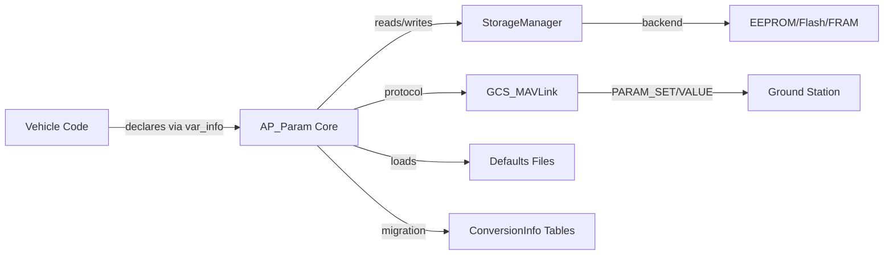
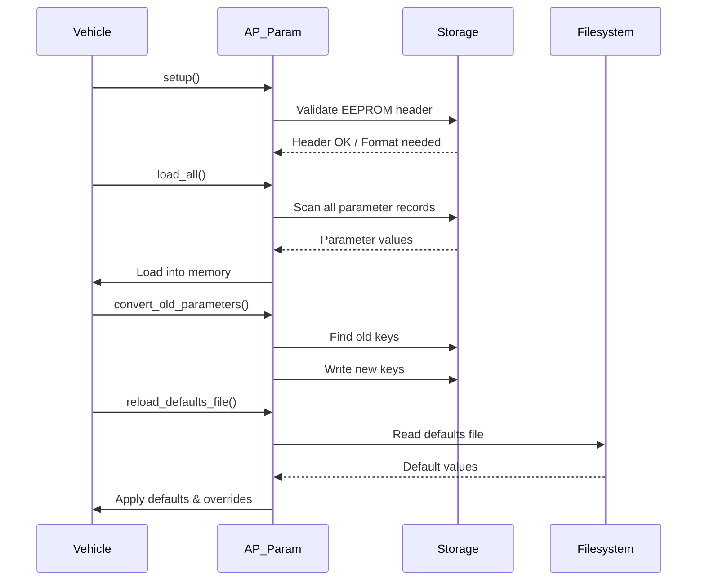
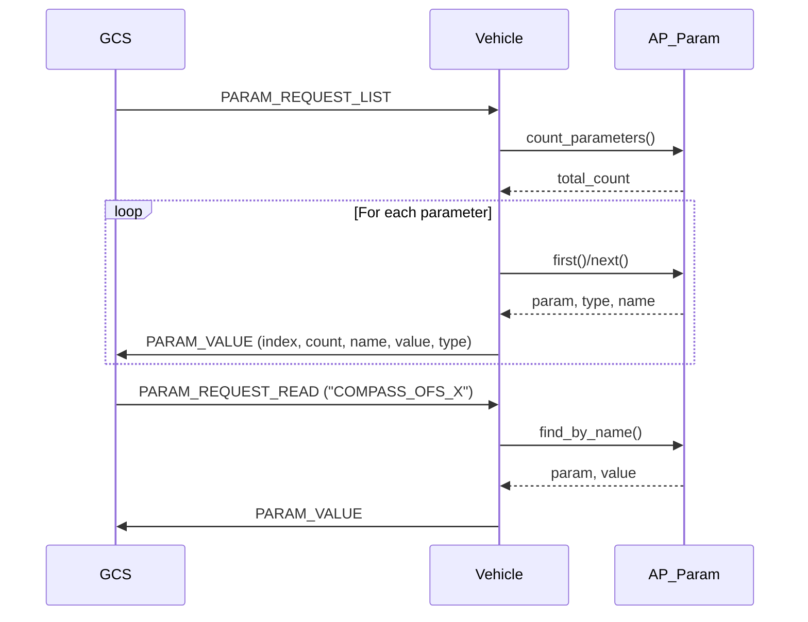
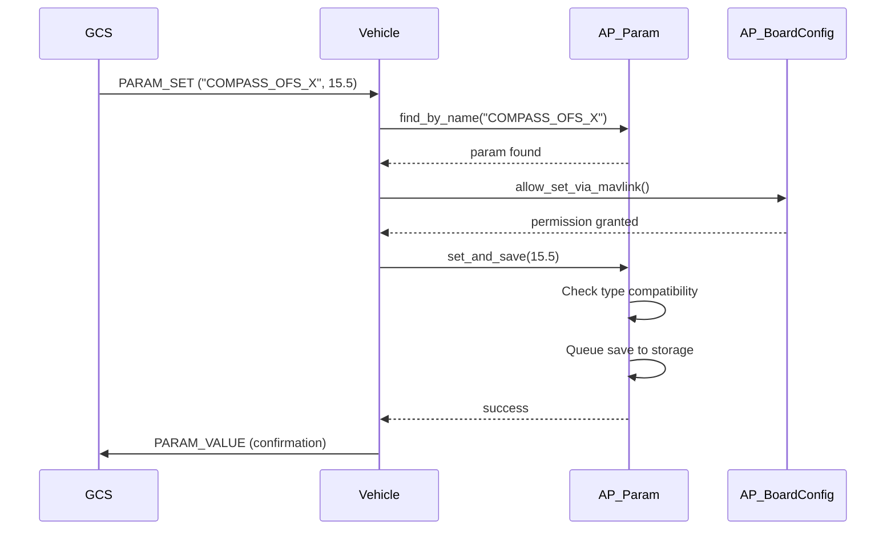

# AP_Param - ArduPilot Parameter System

## Overview

The AP_Param library provides ArduPilot's comprehensive parameter system for persistent storage and management of configuration variables. It enables flight controllers to save user-configurable settings across reboots, supports remote configuration via MAVLink protocol, and provides automatic migration when parameters are reorganized between firmware versions.

**Key Features**:
- **Persistent Storage**: Parameters saved to EEPROM/Flash/FRAM survive power cycles and firmware updates
- **Type Safety**: Compile-time type-checked parameter wrappers (AP_Int8/16/32, AP_Float, AP_Vector3f)
- **Version Migration**: Automatic parameter conversion preserves user settings across firmware refactoring
- **MAVLink Integration**: Full parameter protocol support for ground station communication
- **Structured Organization**: Hierarchical parameter groups with up to 3 nesting levels
- **Metadata System**: @Param tags enable auto-documentation and ground station UI generation
- **Default Management**: Multiple default sources with priority-based resolution
- **Dynamic Extension**: Runtime parameter table creation via scripting (when enabled)

**Architecture Components**:



## Storage Architecture

AP_Param uses a compact binary storage format optimized for flash/EEPROM efficiency:

**Storage Layout**:
```
Offset 0: EEPROM_header (4 bytes)
  - magic[2]: 0x50, 0x41 ("PA" signature)
  - revision: Format version (currently 6)
  - spare: Reserved byte

Offset 4+: Parameter records (variable length)
  Each record:
    - Param_header (4 bytes): key, type, group_element
    - Payload (1-12 bytes): Value data based on type

End: Sentinel record (4 bytes)
  - key: 0x1FF (sentinel marker)
  - type: 0x1F
  - group_element: 0xFF
```

**Parameter Header Encoding** (32-bit bitfield):
- `key_low` (8 bits) + `key_high` (1 bit): 9-bit top-level parameter key (0-511)
- `type` (5 bits): Parameter type (INT8, INT16, INT32, FLOAT, VECTOR3F, GROUP)
- `group_element` (18 bits): Nested group path (3 levels × 6 bits = 64 parameters per level)

**Payload Sizes by Type**:
- `AP_PARAM_INT8`: 1 byte
- `AP_PARAM_INT16`: 2 bytes
- `AP_PARAM_INT32`: 4 bytes
- `AP_PARAM_FLOAT`: 4 bytes
- `AP_PARAM_VECTOR3F`: 12 bytes (3× float)
- `AP_PARAM_GROUP`: 0 bytes (container only)

**Storage Backends**:
- **ChibiOS**: Flash-based storage with wear leveling
- **Linux**: File-based persistence (`/var/APM/params`)
- **SITL**: Simulated EEPROM in memory or file
- **FRAM**: Direct FRAM access where available (faster writes, no wear)

**Backup Storage**: When `HAL_STORAGE_SIZE >= 32KB`, parameters mirror to secondary storage region for redundancy.

Source: `libraries/AP_Param/AP_Param.h:634-662`, `libraries/AP_Param/AP_Param.cpp:153-190`

## Parameter Declaration and Registration

### Declaring Parameters in Vehicle Code

Parameters are declared using type-safe wrapper classes:

```cpp
class MyClass {
public:
    // Integer parameters (8/16/32 bit)
    AP_Int8  _mode;          // Range: -128 to 127
    AP_Int16 _speed;         // Range: -32768 to 32767
    AP_Int32 _distance;      // Range: -2147483648 to 2147483647
    
    // Floating-point parameter
    AP_Float _gain;
    
    // 3D vector parameter (e.g., offsets, gains)
    AP_Vector3f _offset;
    
    // Enumeration parameter (backed by AP_Int8/16)
    AP_Enum<FlightMode> _flight_mode;
    
    // Parameter registration table
    static const AP_Param::GroupInfo var_info[];
};
```

### Registering Parameters with var_info[]

Every class with parameters must define a static `var_info[]` array:

```cpp
const AP_Param::GroupInfo MyClass::var_info[] = {
    // AP_GROUPINFO(name, idx, class, element, default)
    AP_GROUPINFO("MODE",     0, MyClass, _mode,     1),
    AP_GROUPINFO("SPEED",    1, MyClass, _speed,    100),
    AP_GROUPINFO("DISTANCE", 2, MyClass, _distance, 0),
    AP_GROUPINFO("GAIN",     3, MyClass, _gain,     1.5f),
    AP_GROUPINFO("OFFSET",   4, MyClass, _offset,   0.0f),
    
    // Terminator (required)
    AP_GROUPEND
};
```

### Parameter Macro Reference

**Basic Macros**:
- `AP_GROUPINFO(name, idx, clazz, element, def)`: Standard scalar parameter
- `AP_GROUPINFO_FLAGS(name, idx, clazz, element, def, flags)`: Parameter with behavior flags
- `AP_GROUPINFO_FRAME(name, idx, clazz, element, def, frame_flags)`: Vehicle-specific parameter
- `AP_GROUPINFO_FLAGS_FRAME(...)`: Combined flags and frame filtering

**Nested Group Macros**:
- `AP_SUBGROUPINFO(element, name, idx, thisclazz, elclazz)`: Nested object with own var_info
- `AP_SUBGROUPPTR(element, name, idx, thisclazz, elclazz)`: Nested pointer-based object
- `AP_SUBGROUPVARPTR(element, name, idx, thisclazz, var_info)`: Dynamic var_info pointer
- `AP_NESTEDGROUPINFO(clazz, idx)`: Inherit parameters from base class

**Special Macros**:
- `AP_GROUPINFO_FLAGS_DEFAULT_POINTER(...)`: Default value at runtime offset
- `AP_GROUPEND`: Required array terminator

### Top-Level Registration

Vehicle code registers parameter groups in the top-level `Info` table:

```cpp
// In vehicle Parameters.cpp
const AP_Param::Info AP_Vehicle::var_info[] = {
    // GOBJECT(variable, name, class)
    GOBJECT(compass,  "COMPASS", Compass),
    GOBJECT(ins,      "INS",     AP_InertialSensor),
    GOBJECT(baro,     "BARO",    AP_Baro),
    
    // GSCALAR(variable, name, default) for top-level scalars
    GSCALAR(sysid_this_mav, "SYSID_THISMAV", 1),
    
    AP_VAREND
};
```

**Key Assignment**: Each top-level entry receives a unique 9-bit key (0-511) from the `k_param_*` enum:

```cpp
enum {
    k_param_ins = 1,
    k_param_compass,
    k_param_baro,
    k_param_sysid_this_mav = 20,
    // ... up to 511
};
```

**CRITICAL**: Keys must never change once assigned. Changing a key breaks parameter storage compatibility and causes users to lose their configuration.

Source: `libraries/AP_Param/AP_Param.h:132-176`, `libraries/AP_Param/AP_Param.h:199-224`

## Parameter Groups and Nested Structures

### GroupInfo Structure

The `GroupInfo` structure describes each parameter within a group:

```cpp
struct GroupInfo {
    const char *name;           // Parameter name (without prefix)
    ptrdiff_t offset;           // Byte offset in containing object
    union {
        const struct GroupInfo *group_info;     // Nested group table
        const struct GroupInfo **group_info_ptr;// Dynamic table pointer
        const float def_value;                  // Default value
        ptrdiff_t def_value_offset;             // Runtime default offset
    };
    uint16_t flags;             // Behavior flags (pointer, enable, frame, etc.)
    uint8_t idx;                // Index 0-63 within this nesting level
    uint8_t type;               // ap_var_type (INT8/INT16/INT32/FLOAT/VECTOR3F/GROUP)
};
```

**Flags**:
- `AP_PARAM_FLAG_NESTED_OFFSET`: Nested group without inheritance
- `AP_PARAM_FLAG_POINTER`: Object allocated dynamically
- `AP_PARAM_FLAG_ENABLE`: Controls subtree visibility
- `AP_PARAM_FLAG_INFO_POINTER`: var_info is pointer (dynamic tables)
- `AP_PARAM_FLAG_INTERNAL_USE_ONLY`: GCS visible but read-only
- `AP_PARAM_FLAG_HIDDEN`: Not visible in parameter lists
- `AP_PARAM_FLAG_DEFAULT_POINTER`: Default at runtime offset
- Frame flags (bits 8+): `AP_PARAM_FRAME_COPTER`, `AP_PARAM_FRAME_PLANE`, `AP_PARAM_FRAME_ROVER`, etc.

### Nesting Levels and group_element Encoding

AP_Param supports up to **3 levels** of parameter nesting using 18-bit `group_element`:

**Encoding**: 3 levels × 6 bits = 64 possible indices per level
- Level 1: bits 0-5 (idx × 2⁰)
- Level 2: bits 6-11 (idx × 2⁶)
- Level 3: bits 12-17 (idx × 2¹²)

**Example**: Multi-level nesting
```cpp
// Level 1: Compass object
class Compass {
    AP_Vector3f _offset[3];  // Array of offsets for 3 compasses
    static const AP_Param::GroupInfo var_info[];
};

const AP_Param::GroupInfo Compass::var_info[] = {
    // Nested Vector3f creates additional level
    // COMPASS_OFS -> COMPASS_OFS_X, COMPASS_OFS_Y, COMPASS_OFS_Z
    AP_GROUPINFO("OFS", 0, Compass, _offset[0], 0.0f),
    AP_GROUPEND
};

// Resulting parameter names:
// COMPASS_OFS_X   (group_element: 0 << 0)
// COMPASS_OFS_Y   (group_element: 1 << 0)
// COMPASS_OFS_Z   (group_element: 2 << 0)
```

### Enable Parameters

Enable parameters control visibility of entire parameter subtrees:

```cpp
const AP_Param::GroupInfo OptionalFeature::var_info[] = {
    // ENABLE controls whether remaining parameters visible
    AP_GROUPINFO_FLAGS("ENABLE", 0, OptionalFeature, _enable, 0, AP_PARAM_FLAG_ENABLE),
    
    // These only visible when ENABLE != 0
    AP_GROUPINFO("OPTION1", 1, OptionalFeature, _option1, 10),
    AP_GROUPINFO("OPTION2", 2, OptionalFeature, _option2, 20),
    
    AP_GROUPEND
};
```

When `_enable` is 0, parameters with idx >= 1 are hidden from GCS and parameter enumeration.

Source: `libraries/AP_Param/AP_Param.h:79-106`, `libraries/AP_Param/AP_Param.cpp:192-211`

## Default Values and Initialization

### Default Value Priority

Parameters resolve defaults from multiple sources with priority order:

1. **Parameter Overrides** (highest): Defaults file with `@READONLY` or `@FORCE`
2. **Stored Values**: Values saved in EEPROM/Flash from previous runs
3. **Defaults File**: External defaults file (if `AP_PARAM_DEFAULTS_FILE_PARSING_ENABLED`)
4. **Embedded Defaults**: APJ tool-modified embedded defaults
5. **Compiled Defaults** (lowest): Default values in var_info[] arrays

### Boot Sequence

Parameter initialization follows this sequence:



**Initialization Functions**:

1. `AP_Param::setup()`: One-time initialization
   - Validates storage header (magic bytes 0x5041, revision)
   - Reformats if invalid or version mismatch
   - Finds sentinel marker (end of stored parameters)
   - Validates var_info table consistency

2. `AP_Param::load_all()`: Load stored parameters
   - Scans storage for all parameter headers
   - Matches headers to registered parameters by key
   - Loads payload data into memory
   - Logs warnings for orphaned parameters

3. `convert_old_parameters()`: Migrate legacy parameters
   - Processes ConversionInfo table entries
   - Locates parameters with old keys
   - Remaps to new names/locations
   - Saves migrated parameters

4. `reload_defaults_file()`: Apply external defaults
   - Reads defaults file from filesystem
   - Parses parameter assignments
   - Applies `@READONLY` and `@FORCE` directives
   - Updates parameter values

### Defaults File Format

Text file format for external defaults (typical location: `@ROMFS/defaults.parm`):

```
# Comment lines start with #

# Basic parameter assignments
SYSID_THISMAV 1
COMPASS_ENABLE 1

# Metadata tags (parsed by param_parse.py)
# @Param: COMPASS_OFS_X
# @DisplayName: Compass offset X
# @Description: X-axis offset for compass calibration
# @Units: mG
# @Range: -400 400

COMPASS_OFS_X 0.0

# Special directives
# @READONLY: Prevents GCS modification
# @READONLY
SYSID_THISMAV 1

# @FORCE: Overrides stored value every boot
# @FORCE
LOG_BACKEND_TYPE 1

# Conditional parameters (vehicle-specific)
# @Param: FRAME_TYPE
# @Values: 0:Quad,1:Hexa,2:Octo
FRAME_TYPE 0

# Include other files
@include common_copter.parm
```

### Embedded Defaults with APJ Tool

When `FORCE_APJ_DEFAULT_PARAMETERS` is enabled, defaults can be modified post-build:

```bash
# Embed defaults in .apj firmware file
./Tools/scripts/apj_tool.py \
    --set-defaults my_defaults.parm \
    build/arducopter.apj \
    build/arducopter_custom.apj

# Verify embedded defaults
./Tools/scripts/apj_tool.py --show-defaults build/arducopter_custom.apj
```

This allows OEM customization without recompiling firmware.

Source: `libraries/AP_Param/AP_Param.cpp:521-687`, `libraries/AP_Param/AP_Param.cpp:1342-1489`

## Parameter Storage Format and EEPROM Layout

### Storage Header

**EEPROM_header** (4 bytes at offset 0):

```cpp
struct EEPROM_header {
    uint8_t magic[2];   // 0x50, 0x41 ("PA")
    uint8_t revision;   // Format version (currently 6)
    uint8_t spare;      // Reserved (0xFF)
};
```

If header is invalid or revision mismatches, storage is reformatted (all parameters lost).

### Parameter Header Encoding

**Param_header** (4 bytes, bitfield structure):

```cpp
struct Param_header {
    uint32_t key_low : 8;        // Low 8 bits of key
    uint32_t type : 5;           // ap_var_type enum
    uint32_t key_high : 1;       // High bit of key (total 9 bits)
    uint32_t group_element : 18; // Nested group path
};
```

**Key**: 9 bits (0-511) identifying top-level parameter group
**Type**: 5 bits encoding parameter type:
- 0: `AP_PARAM_NONE`
- 1: `AP_PARAM_INT8`
- 2: `AP_PARAM_INT16`
- 3: `AP_PARAM_INT32`
- 4: `AP_PARAM_FLOAT`
- 5: `AP_PARAM_VECTOR3F`
- 6: `AP_PARAM_GROUP`

**group_element**: 18 bits encoding up to 3 nesting levels (6 bits per level)

### Storage Scan Algorithm

AP_Param scans storage to build parameter index:

```cpp
uint16_t offset = sizeof(EEPROM_header);  // Start after header
while (offset < storage_size) {
    Param_header hdr;
    read_storage(offset, &hdr, sizeof(hdr));
    
    // Check for sentinel (end marker)
    if (hdr.key_low == 0xFF && hdr.key_high == 1) {  // key == 0x1FF
        sentinel_offset = offset;
        break;
    }
    
    // Valid parameter - calculate payload size
    uint8_t payload_size = type_size(hdr.type);
    
    // Index this parameter
    index_parameter(offset, hdr);
    
    // Advance to next parameter
    offset += sizeof(Param_header) + payload_size;
}
```

### Example Storage Layout

```
Offset  Data                      Description
------  ------------------------  ---------------------------
0x0000  50 41 06 FF               EEPROM header
0x0004  14 02 00 00               Param header: key=20, type=INT16, ge=0
0x0008  01 00                     Payload: int16 value 1 (SYSID_THISMAV)
0x000A  15 02 00 00               Param header: key=21, type=INT16, ge=0
0x000E  64 00                     Payload: int16 value 100
0x0010  16 04 00 00               Param header: key=22, type=FLOAT, ge=0
0x0014  00 00 C0 3F               Payload: float 1.5
0x0018  FF 3F 00 00               Sentinel: key=0x1FF
```

### Storage Limits and Efficiency

**Storage Capacity**:
- Typical EEPROM: 4KB - 16KB
- Large systems: 32KB+ with backup mirroring
- Sentinel indicates used space; remaining is free

**Optimization Strategies**:
1. **Avoid storing defaults**: Only save non-default values with `set_and_save()`
2. **Batch saves**: Use save queue to coalesce rapid changes
3. **Monitor usage**: Check `get_eeprom_full()` to detect exhaustion
4. **Minimize dynamic parameters**: Scripting tables consume storage

**Storage Exhaustion**: When storage is full:
- New parameter saves silently fail
- Existing parameters continue to work
- `get_eeprom_full()` returns true
- Reduce parameter count or increase storage size

Source: `libraries/AP_Param/AP_Param.h:634-662`, `libraries/AP_Param/AP_Param.cpp:153-190`, `libraries/AP_Param/tools/eedump_apparam.c`

## Parameter Conversion and Migration

### Migration Scenarios

Parameter conversion preserves user configuration across firmware changes:

**Common Scenarios**:
1. **Renaming**: Parameter name changed for clarity
2. **Reorganization**: Parameter moved between classes
3. **Type Changes**: Width expansion (INT16 → INT32) or int → float
4. **Scaling**: Unit changes (degrees → radians, cm → m)
5. **Class Refactoring**: Consolidation or splitting of parameter groups

### ConversionInfo Structure

Migration rules defined in `ConversionInfo` arrays:

```cpp
struct ConversionInfo {
    uint16_t old_key;          // Old top-level key
    uint32_t old_group_element;// Old nesting path
    ap_var_type type;          // Parameter type
    const char *new_name;      // New parameter name (full path)
    float multiplier;          // Scaling factor (optional, default 1.0)
};
```

### Basic Parameter Conversion

**Example 1: Simple Rename**
```cpp
// Old: COMPASS_ORIENT (key 10, type INT8)
// New: COMPASS_ORIENT2

const AP_Param::ConversionInfo conversion_table[] = {
    { 10, 0, AP_PARAM_INT8, "COMPASS_ORIENT2" },
};

// At boot:
AP_Param::convert_old_parameters(conversion_table, ARRAY_SIZE(conversion_table));
```

**Example 2: Move Between Groups**
```cpp
// Old: g.compass_offset_x (key 15, group_element 0)
// New: compass.offset.x (key 20, nested)

const AP_Param::ConversionInfo conversion_table[] = {
    { 15, 0, AP_PARAM_FLOAT, "COMPASS_OFS_X" },
};
```

### Type Conversion with Scaling

**Example 3: Centidegrees to Degrees**
```cpp
// Old: SERVO1_TRIM stored in centidegrees (INT16, range 0-36000)
// New: SERVO1_TRIM in degrees (FLOAT, range 0-360)

const AP_Param::ConversionInfo conversion_table[] = {
    { 25, 0, AP_PARAM_INT16, "SERVO1_TRIM", 0.01f },  // Scale by 0.01
};

// Result: Old value 9000 (90.00°) → New value 90.0°
```

**Example 4: Width Conversion**
```cpp
// Old: WP_RADIUS (INT16, range 0-32767 cm)
// New: WP_RADIUS (INT32, range 0-1000000 cm)

const AP_Param::ConversionInfo conversion_table[] = {
    { 30, 0, AP_PARAM_INT16, "WP_RADIUS" },  // Automatic width expansion
};
```

### Group Reorganization

**Example 5: Class Refactoring**
```cpp
// Old firmware: Parameters in separate G2 object
// New firmware: Parameters in AP_Vehicle

// Old keys (G2 object, key 200):
// - G2.param1 (group_element 0)
// - G2.param2 (group_element 1)

// New: Move to top-level
const AP_Param::ConversionInfo conversion_table[] = {
    { 200, 0, AP_PARAM_FLOAT, "PARAM1" },
    { 200, 1 << 0, AP_PARAM_INT16, "PARAM2" },  // group_element = 1
};
```

### Conversion Best Practices

1. **Maintain Tables Indefinitely**: Users may skip firmware versions
   ```cpp
   // Keep conversions from ALL previous versions
   const AP_Param::ConversionInfo conversion_table[] = {
       // Conversions from 2020 firmware
       { 10, 0, AP_PARAM_INT8, "OLD_NAME_2020" },
       
       // Conversions from 2021 firmware
       { 15, 0, AP_PARAM_FLOAT, "OLD_NAME_2021" },
       
       // Conversions from 2022 firmware
       { 20, 0, AP_PARAM_INT16, "OLD_NAME_2022" },
   };
   ```

2. **Test Upgrade Paths**: Verify conversions work
   ```bash
   # SITL test sequence
   1. Load old firmware
   2. Set parameters via MAVProxy
   3. Flash new firmware
   4. Verify parameters converted correctly
   ```

3. **Document Conversions**: Add comments explaining migration
   ```cpp
   // Conversion from 4.1: COMPASS_ORIENT renamed to COMPASS_ORIENT2
   // to avoid confusion with new auto-orientation system
   { 10, 0, AP_PARAM_INT8, "COMPASS_ORIENT2" },
   ```

4. **Handle Wildcards**: Use `CONVERT_FLAG_FORCE` to overwrite
   ```cpp
   // Force conversion even if new parameter already has value
   AP_Param::convert_old_parameters(table, size, AP_PARAM_CONVERT_FLAG_FORCE);
   ```

5. **Log Migrations**: Conversions logged for debugging
   ```
   AP: Converted OLD_PARAM to NEW_PARAM (1.5 -> 1.5)
   ```

Source: `libraries/AP_Param/AP_Param.h:754-771`, `libraries/AP_Param/AP_Param.cpp:1952-2145`

## MAVLink Parameter Protocol

AP_Param implements the MAVLink parameter protocol for Ground Control Station (GCS) interaction.

### Protocol Overview

**MAVLink Messages**:
- `PARAM_REQUEST_LIST`: GCS requests complete parameter list
- `PARAM_REQUEST_READ`: GCS requests specific parameter by name or index
- `PARAM_SET`: GCS sets parameter value
- `PARAM_VALUE`: Vehicle sends parameter to GCS

### Parameter Enumeration Workflow



**Enumeration Implementation**:
```cpp
// GCS_MAVLink parameter list download
void GCS_MAVLink::handle_param_request_list() {
    // Count total parameters (cached after first call)
    uint16_t param_count = AP_Param::count_parameters();
    
    // Enumerate all parameters
    AP_Param::ParamToken token;
    AP_Param *param;
    enum ap_var_type ptype;
    
    uint16_t index = 0;
    while ((param = AP_Param::next(&token, &ptype)) != nullptr) {
        // Get parameter name
        char name[AP_MAX_NAME_SIZE];
        param->copy_name_token(token, name, sizeof(name), true);
        
        // Get value
        float value = param->cast_to_float(ptype);
        
        // Send PARAM_VALUE to GCS
        send_parameter_value(name, value, ptype, index, param_count);
        index++;
    }
}
```

### Parameter Set Operations

**Setting Parameters**:


**Permission Checks**:
- Read-only parameters: Checked via `@READONLY` flag
- Remote modification: `AP_BoardConfig::allow_set_via_mavlink()`
- Scripting control: `AP_Scripting` can restrict parameter access
- Safety checks: Some parameters require arming state

**Type Conversion**:
```cpp
// MAVLink sends all values as float32
// AP_Param converts to storage type
bool AP_Param::set_by_name(const char *name, float value) {
    enum ap_var_type ptype;
    AP_Param *param = find_by_name(name, &ptype);
    
    if (param == nullptr) return false;
    
    switch (ptype) {
        case AP_PARAM_INT8:
            ((AP_Int8 *)param)->set(int8_t(value));
            break;
        case AP_PARAM_INT16:
            ((AP_Int16 *)param)->set(int16_t(value));
            break;
        case AP_PARAM_INT32:
            ((AP_Int32 *)param)->set(int32_t(value));
            break;
        case AP_PARAM_FLOAT:
            ((AP_Float *)param)->set(value);
            break;
    }
    return true;
}
```

### Parameter Value Notifications

**Automatic Broadcasts**:
- Parameter changes via `set_and_notify()` trigger `PARAM_VALUE` broadcast
- All connected GCS instances notified of changes
- Helps keep GCS UI synchronized with vehicle

**Change Detection**:
```cpp
// AP_ParamT tracks value changes
bool AP_Int16::set_and_save(int16_t value) {
    if (_value != value) {  // Change detected
        _value = value;
        save();              // Queue storage write
        notify();            // Broadcast to GCS
        return true;
    }
    return false;  // No change
}
```

### Parameter Metadata Integration

Ground stations request metadata from vehicle:
- Parameter display names
- Descriptions and units
- Valid ranges and increment values
- Enumeration values for selection
- Bitmask bit definitions

Metadata embedded in source via `@Param` tags (parsed by `param_parse.py`):
```cpp
// @Param: COMPASS_OFS_X
// @DisplayName: Compass offset X
// @Description: X-axis magnetometer offset
// @Units: mGauss
// @Range: -400 400
// @Increment: 1
// @User: Advanced
AP_GROUPINFO("OFS_X", 0, Compass, _offset_x, 0),
```

Source: `libraries/GCS_MAVLink/GCS_Param.cpp`, `libraries/AP_Param/AP_Param.cpp:1593-1702`

## Parameter Naming Conventions and Metadata

### Naming Rules

**Character Set**: Uppercase A-Z, digits 0-9, underscore `_`
**Maximum Length**: 16 characters (`AP_MAX_NAME_SIZE`)
**Forbidden**: Lowercase, spaces, special characters

### Naming Structure

**Pattern**: `PREFIX_SUBSYSTEM_PROPERTY`

**Examples**:
- `SYSID_THISMAV`: System ID for this MAVLink node
- `COMPASS_OFS_X`: Compass offset, X-axis
- `INS_GYRO_FILTER`: Inertial sensor gyro filter frequency
- `BARO1_GND_PRESS`: Barometer 1 ground pressure
- `WP_RADIUS`: Waypoint radius acceptance threshold

### Namespace Organization

**Top-Level Prefixes** (by vehicle type):
- **Common**: `SYSID_`, `LOG_`, `SERIAL_`, `BATT_`, `GPS_`
- **Copter**: `ATC_`, `PSC_`, `WPNAV_`, `CIRCLE_`, `RTL_`
- **Plane**: `TECS_`, `LIM_`, `STAB_`, `PTCH_`, `RLL_`
- `COMPASS_`: Magnetometer parameters
- **Rover**: `ATC_`, `CRUISE_`, `WP_`, `TURN_`
- **Sub**: `PILOT_`, `SURF_`, `JS_`

**Subsystem Prefixes**:
- `AHRS_`: Attitude and heading reference system
- `EK2_`, `EK3_`: Extended Kalman filters
- `INS_`: Inertial sensors
- `COMPASS_`: Magnetometers
- `BARO_`: Barometers
- `ARSPD_`: Airspeed sensors
- `RNGFND_`: Rangefinders
- `GPS_`: GPS receivers
- `MOT_`: Motor control
- `SERVO_`: Servo outputs
- `RC_`: RC input channels
- `FENCE_`: Geofencing
- `RALLY_`: Rally points

### @Param Tag Format

Metadata embedded in source code above parameter declarations:

```cpp
// @Param: PARAM_NAME
// @DisplayName: Human-Readable Name
// @Description: Detailed explanation of parameter purpose and behavior
// @Units: m/s
// @Range: 0 100
// @Increment: 0.1
// @User: Standard
// @Values: 0:Disabled,1:Enabled
// @Bitmask: 0:Option1,1:Option2,2:Option3
// @RebootRequired: True
// @ReadOnly: True
AP_GROUPINFO("PARAM_NAME", idx, Class, _member, default_value),
```

**Tag Descriptions**:

| Tag | Description | Example |
|-----|-------------|---------|
| `@Param` | Parameter name (without class prefix) | `OFS_X` |
| `@DisplayName` | User-friendly name | `Compass offset X` |
| `@Description` | Detailed explanation | `X-axis magnetometer offset for calibration` |
| `@Units` | Physical units | `m`, `m/s`, `deg`, `rad`, `Hz`, `A`, `V` |
| `@Range` | Valid min and max values | `0 100` |
| `@Increment` | Adjustment step size | `0.1`, `1`, `10` |
| `@User` | User skill level | `Standard`, `Advanced`, `Developer` |
| `@Values` | Enumeration choices | `0:Disabled,1:Enabled,2:Auto` |
| `@Bitmask` | Bit meanings for flags | `0:GPS,1:Compass,2:Baro` |
| `@RebootRequired` | Needs reboot to take effect | `True`, `False` |
| `@ReadOnly` | Not user-modifiable | `True` (set by firmware only) |

### Unit Specifications

**Standard Units**:

| Unit | Symbol | Description |
|------|--------|-------------|
| meters | `m` | Distance |
| centimeters | `cm` | Distance (precision) |
| meters/second | `m/s` | Velocity |
| centimeters/second | `cm/s` | Velocity (precision) |
| degrees | `deg` | Angle |
| centidegrees | `cdeg` | Angle (precision, 0.01°) |
| radians | `rad` | Angle (mathematical) |
| degrees/second | `deg/s` | Angular rate |
| radians/second | `rad/s` | Angular rate |
| Hertz | `Hz` | Frequency |
| seconds | `s` | Time |
| milliseconds | `ms` | Time |
| Amperes | `A` | Current |
| Volts | `V` | Voltage |
| milliGauss | `mGauss` | Magnetic field |
| Pascal | `Pa` | Pressure |
| hectoPascal | `hPa` | Pressure |
| percent | `%` | Percentage |
| PWM | `PWM` | Pulse width (μs) |

### Enumeration Values

**Format**: `value:Label,value:Label,...`

```cpp
// @Param: GPS_TYPE
// @DisplayName: GPS type
// @Description: GPS receiver protocol
// @Values: 0:None,1:AUTO,2:uBlox,5:NMEA,14:MAV,19:NOVA
AP_GROUPINFO("TYPE", 0, GPS, _type, 1),
```

### Bitmask Parameters

**Format**: `bit:Description,bit:Description,...`

```cpp
// @Param: LOG_BITMASK
// @DisplayName: Log bitmask
// @Description: Selects which log types to enable
// @Bitmask: 0:ATTITUDE_FAST,1:ATTITUDE_MED,2:GPS,3:PM,4:IMU,5:CMD
AP_GROUPINFO("BITMASK", 0, Logging, _bitmask, 0),
```

### Auto-Documentation Generation

**param_parse.py**: Extracts metadata from source code

```bash
# Generate parameter documentation
./Tools/autotest/param_metadata/param_parse.py \
    --vehicle ArduCopter \
    Parameters.cpp \
    libraries/*/AP_*.cpp

# Output: Parameters.html, Parameters.xml, Parameters.json
```

Generated documentation used by:
- Ground stations (Mission Planner, QGroundControl)
- Wiki documentation (ardupilot.org)
- Parameter editors and validators

Source: `libraries/AP_Param/AP_Param.h:66-76`, `Tools/autotest/param_metadata/param_parse.py`

## Testing Parameter Save/Load and Version Conversion

### Unit Testing Framework

**Test Location**: `libraries/AP_Param/tests/`

**Example Unit Test**:
```cpp
#include <gtest/gtest.h>
#include <AP_Param/AP_Param.h>

class TestVehicle {
public:
    AP_Int16 param1;
    AP_Float param2;
    
    static const AP_Param::GroupInfo var_info[];
};

const AP_Param::GroupInfo TestVehicle::var_info[] = {
    AP_GROUPINFO("PARAM1", 0, TestVehicle, param1, 100),
    AP_GROUPINFO("PARAM2", 1, TestVehicle, param2, 1.5f),
    AP_GROUPEND
};

TEST(AP_Param, FindByName) {
    // Register test vehicle parameters
    AP_Param::setup_object_defaults(&vehicle, vehicle.var_info);
    
    // Find by name
    enum ap_var_type ptype;
    AP_Param *param = AP_Param::find("PARAM1", &ptype);
    
    ASSERT_NE(param, nullptr);
    ASSERT_EQ(ptype, AP_PARAM_INT16);
    ASSERT_EQ(((AP_Int16 *)param)->get(), 100);
}

TEST(AP_Param, SetAndSave) {
    // Set parameter value
    vehicle.param1.set_and_save(200);
    
    // Verify in memory
    ASSERT_EQ(vehicle.param1.get(), 200);
    
    // Verify save queued
    AP_Param::flush();  // Force write
    
    // Reload from storage
    vehicle.param1.load();
    ASSERT_EQ(vehicle.param1.get(), 200);
}
```

**Running Unit Tests**:
```bash
# Build and run tests
./waf configure --board linux
./waf tests
./build/linux/tests/test_ap_param
```

### Integration Testing with SITL

**Save/Load Test**:
```bash
# Start SITL
sim_vehicle.py -v ArduCopter --console --map

# In MAVProxy console:
param set COMPASS_OFS_X 15.5
param set INS_GYRO_FILTER 20
param show COMPASS_OFS_X  # Verify: 15.500000
param show INS_GYRO_FILTER  # Verify: 20.000000

# Restart SITL
reboot

# After restart, verify persistence
param show COMPASS_OFS_X  # Should be: 15.500000
param show INS_GYRO_FILTER  # Should be: 20.000000
```

**Conversion Test Strategy**:

1. **Prepare Old State**:
   ```bash
   # Start old firmware version
   sim_vehicle.py -v ArduCopter --console
   
   # Set parameters that will be converted
   param set OLD_PARAM_NAME 42
   param write  # Force save
   ```

2. **Flash New Firmware**:
   ```bash
   # Build new firmware with conversion table
   ./waf configure --board linux
   ./waf copter
   
   # Flash to SITL (restart with new binary)
   ```

3. **Verify Conversion**:
   ```bash
   param show NEW_PARAM_NAME  # Should be: 42.000000
   param show OLD_PARAM_NAME  # Should not exist
   ```

### Manual Testing with MAVProxy

**Parameter Commands**:
```bash
# List all parameters
param show *

# Show specific parameter
param show COMPASS_OFS_X

# Set parameter (RAM only)
param set COMPASS_OFS_X 10.5

# Save parameters to file
param save params.txt

# Load parameters from file
param load params.txt

# Download parameters from vehicle
param fetch

# Upload parameters to vehicle
param set PARAM_NAME value

# Force parameter write to storage
param write
```

### Storage Exhaustion Testing

**Simulate Storage Full**:
```cpp
// In vehicle setup code
void test_storage_exhaustion() {
    // Fill storage with test parameters
    for (int i = 0; i < 1000; i++) {
        char name[AP_MAX_NAME_SIZE];
        snprintf(name, sizeof(name), "TEST%d", i);
        
        AP_Float test_param;
        test_param.set_and_save(float(i));
        
        if (AP_Param::get_eeprom_full()) {
            GCS_SEND_TEXT(MAV_SEVERITY_WARNING, "Storage full at %d params", i);
            break;
        }
    }
}
```

### Performance Testing

**Measure Save Time**:
```cpp
uint32_t start_us = AP_HAL::micros();

// Queue 100 parameter saves
for (int i = 0; i < 100; i++) {
    test_params[i].set_and_save(float(i));
}

// Wait for all saves to complete
AP_Param::flush();

uint32_t elapsed_us = AP_HAL::micros() - start_us;
GCS_SEND_TEXT(MAV_SEVERITY_INFO, "100 saves took %u us", elapsed_us);
```

**Measure Enumeration Time**:
```cpp
uint32_t start_us = AP_HAL::micros();
uint16_t count = AP_Param::count_parameters();
uint32_t elapsed_us = AP_HAL::micros() - start_us;

GCS_SEND_TEXT(MAV_SEVERITY_INFO, 
              "Enumerated %u params in %u us", count, elapsed_us);
```

### Failure Mode Testing

**Test Scenarios**:
1. **Corrupted Header**: Modify EEPROM header, verify reformat
2. **Invalid Sentinel**: Corrupt sentinel marker, verify scan recovery
3. **Orphaned Parameters**: Remove var_info entry, verify warning logged
4. **Type Mismatch**: Change parameter type, verify conversion handling
5. **Save During Critical**: Trigger saves during armed state, verify queuing

### Continuous Integration

**Automated Test Suite**:
```yaml
# .github/workflows/test_params.yml
name: Parameter Tests
on: [push, pull_request]
jobs:
  test:
    runs-on: ubuntu-latest
    steps:
      - name: Checkout
        uses: actions/checkout@v2
        
      - name: Build Tests
        run: |
          ./waf configure --board linux
          ./waf tests
          
      - name: Run Unit Tests
        run: ./build/linux/tests/test_ap_param
        
      - name: SITL Integration Tests
        run: |
          ./Tools/autotest/autotest.py build.Copter test.Copter.Parameters
```

Source: `libraries/AP_Param/tests/`, `Tools/autotest/pysim/util.py`

## Common Issues and Troubleshooting

### Parameters Reset to Defaults

**Symptoms**: All parameters revert to compiled defaults after reboot

**Causes**:
1. **Storage Header Corruption**: Magic bytes or revision mismatch
2. **Firmware Incompatibility**: Major version change reformats storage
3. **Hardware Failure**: EEPROM/Flash failure
4. **Manual Reset**: Parameter reset via ground station

**Solutions**:
```bash
# Check for reset messages in logs
param show FORMAT_VERSION  # Should match expected revision

# Backup parameters before firmware updates
param save backup_params.parm

# Restore after reset
param load backup_params.parm
param write  # Force save
```

**Prevention**:
- Always backup parameters before firmware updates
- Test firmware compatibility on bench before field deployment
- Monitor `PreArm: Parameters reset` messages

### Parameter Save Fails Silently

**Symptoms**: Parameter changes don't persist across reboots

**Causes**:

**1. Storage Full**:
```cpp
if (AP_Param::get_eeprom_full()) {
    GCS_SEND_TEXT(MAV_SEVERITY_WARNING, "Parameter storage full");
}
```
**Solution**: Reduce parameter count or disable unused features

**2. Read-Only Flag**:
```cpp
// Parameter marked with @READONLY in defaults file
// @READONLY
SYSID_THISMAV 1
```
**Solution**: Remove `@READONLY` directive or change via defaults file

**3. Save Queue Overflow**:
Rapid parameter changes exceed queue capacity (default 20)
**Solution**: Use `AP_Param::flush()` after batch changes

**4. Storage Backend Failure**:
Hardware write failure (flash wear, voltage issues)
**Solution**: Check hardware, replace board if necessary

### Conversion Not Applied

**Symptoms**: Old parameter names still present after firmware upgrade

**Causes**:
1. **Incorrect old_key**: Doesn't match stored parameter
2. **Wrong group_element**: Nesting path mismatch
3. **Type Mismatch**: Specified type doesn't match actual storage
4. **Conversion Table Missing**: Not called in setup sequence

**Debugging**:
```cpp
// Enable conversion debug logging
#define AP_PARAM_CONVERSION_DEBUG 1

// Check conversion table entry
const AP_Param::ConversionInfo conversion_table[] = {
    { old_key, old_group_element, type, "NEW_NAME" },
};

// Verify called at boot
convert_old_parameters(conversion_table, ARRAY_SIZE(conversion_table));
```

**Solutions**:
- Use `eedump_apparam` tool to inspect storage and find actual key/group_element
- Add debug logging to conversion code
- Verify conversion table matches old firmware version

### Parameter Name Truncation

**Symptoms**: Long parameter names truncated in GCS

**Cause**: Names exceed `AP_MAX_NAME_SIZE` (16 characters)

```cpp
// Truncated: COMPASS_OFFSET_MAX_X (20 chars)
// Becomes:   COMPASS_OFFSET_M (16 chars)
```

**Solution**: Use shorter, more concise names
```cpp
// Good: COMPASS_OFS_X (13 chars)
// Bad:  COMPASS_OFFSET_MAXIMUM_X (25 chars)
```

### Slow Parameter Download

**Symptoms**: GCS parameter list download takes minutes

**Causes**:
1. **Large Parameter Count**: 1000+ parameters with scripting/dynamic tables
2. **Slow Telemetry Link**: Low baud rate or high latency
3. **Inefficient Enumeration**: No caching of parameter count

**Solutions**:

**Optimize Count Caching**:
```cpp
// count_parameters() caches result
// Invalidate cache when tables change
AP_Param::invalidate_count();
```

**Rate Limiting**:
```cpp
// Spread parameter sends over time
if (gcs().send_parameter_value_all(...)) {
    // Sent this loop
} else {
    // Queue for next iteration
}
```

**Reduce Parameter Count**:
- Disable unused features (reduces dynamic parameters)
- Minimize scripting parameter tables

### Type Mismatch in PARAM_SET

**Symptoms**: GCS parameter set fails or produces unexpected values

**Cause**: MAVLink sends all values as float32, conversion required

**Example Problem**:
```cpp
// INT32 parameter with large value
AP_Int32 waypoint_count;  // Value: 1,000,000

// GCS sends as float32
// Float32 precision: ~7 decimal digits
// Value becomes: 1,000,000.0 (within precision, OK)

// But for larger values:
AP_Int32 large_value;  // Value: 2,147,483,647 (INT32_MAX)
// Float32 cannot represent exactly - precision loss!
```

**Solution**: Use appropriate types
- Use INT16 or INT32 for counts/indices
- Use FLOAT for continuous values
- Document precision limits in parameter descriptions

### Parameters Not Visible in GCS

**Symptoms**: Some parameters missing from GCS parameter list

**Causes**:

**1. Hidden Flag**:
```cpp
AP_GROUPINFO_FLAGS("INTERNAL", idx, Class, _param, 0, 
                   AP_PARAM_FLAG_HIDDEN);
```

**2. Enable Parameter Disabled**:
```cpp
// ENABLE = 0 hides subsequent parameters
AP_GROUPINFO_FLAGS("ENABLE", 0, Class, _enable, 0, 
                   AP_PARAM_FLAG_ENABLE);
```

**3. Frame-Specific Flag**:
```cpp
// Only visible on Copter, hidden on Plane/Rover
AP_GROUPINFO_FRAME("COPTER_PARAM", idx, Class, _param, 0,
                   AP_PARAM_FRAME_COPTER);
```

**4. Not Registered**:
Parameter declared but not in var_info[] table

**Solutions**:
- Check parameter flags
- Verify enable parameters set correctly
- Use `param show PARAM_*` to list all matches
- Check vehicle type matches frame flags

### Parameter CRC/Validation Failures

**Symptoms**: "Parameter CRC mismatch" or validation errors

**Causes**:
1. **Concurrent Modification**: Multiple threads writing parameters
2. **Storage Corruption**: Bit errors in flash/EEPROM
3. **Partial Write**: Power loss during save operation

**Solutions**:
- Use semaphores for concurrent access
- Enable backup storage mirroring (if available)
- Implement parameter validation on load:

```cpp
bool validate_parameter(float value, float min, float max) {
    if (value < min || value > max) {
        GCS_SEND_TEXT(MAV_SEVERITY_ERROR, 
                      "Param out of range: %.2f (%.2f-%.2f)",
                      value, min, max);
        return false;
    }
    return true;
}
```

## Advanced Topics

### Dynamic Parameter Tables via Scripting

ArduPilot Lua scripting can add parameters at runtime:

```lua
-- Add custom scripting parameters
local PARAM_TABLE_KEY = 100  -- Unique key for this script
local PARAM_TABLE_PREFIX = "SCRIPT_"

-- Create parameter table
local params = {}
params[1] = Parameter()  -- SCRIPT_ENABLE
params[2] = Parameter()  -- SCRIPT_GAIN

-- Declare parameters
assert(param:add_table(PARAM_TABLE_KEY, PARAM_TABLE_PREFIX, 2))
assert(params[1]:init("ENABLE"))
assert(params[2]:init("GAIN"))

-- Access parameters
if params[1]:get() == 1 then
    local gain = params[2]:get()
    -- Use parameter value
end
```

**Limitations**:
- Maximum dynamic tables: `AP_PARAM_MAX_DYNAMIC` (typically 10)
- Consumes parameter storage space
- Keys must not conflict with static tables

Source: `libraries/AP_Scripting/docs/docs.lua`

### Defaults File Parsing and Conditional Parameters

**Advanced Defaults Syntax**:

```
# Conditional parameters based on board type
# @include defaults_common.parm

# Board-specific overrides
# @if BOARD_TYPE == PIXHAWK6X
BARO_OPTIONS 1
# @endif

# Vehicle-specific defaults
# @if FRAME_CLASS == 2  # Quad
MOT_SPIN_MIN 0.12
# @endif

# Force value every boot (ignore stored)
# @FORCE
LOG_BACKEND_TYPE 1

# Prevent GCS modification
# @READONLY
SYSID_THISMAV 1

# Require reboot after change
# @REBOOT_REQUIRED
CAN_D1_PROTOCOL 1
```

### Parameter Backup and Restore Strategies

**Comprehensive Backup**:
```bash
# Save all parameters with metadata
param save full_backup.parm

# Format: name value
# SYSID_THISMAV 1.000000
# COMPASS_OFS_X 15.500000
# ...

# Save only non-default values (compact)
param save --defaults-file defaults.parm compact_backup.parm
```

**Selective Restore**:
```bash
# Restore only specific subsystem
grep "^COMPASS_" full_backup.parm > compass_only.parm
param load compass_only.parm

# Restore with validation
param load backup.parm --check-bounds
```

**Automated Backup**:
```cpp
// Periodic parameter backup to SD card
void backup_parameters_to_sd() {
    if (!AP::FS().available()) return;
    
    const char *path = "@MISSION/param_backup.parm";
    int fd = AP::FS().open(path, O_WRONLY | O_CREAT | O_TRUNC);
    
    if (fd == -1) return;
    
    AP_Param::ParamToken token;
    AP_Param *param;
    enum ap_var_type ptype;
    
    while ((param = AP_Param::next(&token, &ptype)) != nullptr) {
        char name[AP_MAX_NAME_SIZE];
        param->copy_name_token(token, name, sizeof(name), true);
        
        float value = param->cast_to_float(ptype);
        
        dprintf(fd, "%s %.6f\n", name, value);
    }
    
    AP::FS().close(fd);
}
```

### Custom Storage Backends by Platform

**Implementing Custom Backend**:

Platforms can override storage implementation in HAL:

```cpp
// In AP_HAL_CustomPlatform/Storage.cpp
class CustomStorage : public AP_HAL::Storage {
public:
    void read_block(void *dst, uint16_t src, size_t n) override {
        // Read from custom storage (e.g., external SPI flash)
        custom_flash_read(src, dst, n);
    }
    
    void write_block(uint16_t dst, const void *src, size_t n) override {
        // Write to custom storage with wear leveling
        custom_flash_write(dst, src, n);
    }
};
```

**Storage Requirements**:
- Minimum 4KB capacity
- Byte-addressable read/write
- Persistent across power cycles
- Reasonable write endurance (10,000+ cycles)

### Parameter CRC and Validation

**Adding CRC Protection**:

```cpp
// Calculate CRC over all parameters
uint32_t calculate_parameter_crc() {
    uint32_t crc = 0;
    
    AP_Param::ParamToken token;
    AP_Param *param;
    enum ap_var_type ptype;
    
    while ((param = AP_Param::next(&token, &ptype)) != nullptr) {
        float value = param->cast_to_float(ptype);
        crc = crc32_update(crc, &value, sizeof(value));
    }
    
    return crc;
}

// Validate on boot
void validate_parameters() {
    uint32_t stored_crc = get_stored_parameter_crc();
    uint32_t computed_crc = calculate_parameter_crc();
    
    if (stored_crc != computed_crc) {
        GCS_SEND_TEXT(MAV_SEVERITY_WARNING, "Parameter CRC mismatch");
        // Consider reloading defaults or backup
    }
}
```

### Range Enforcement

**Runtime Range Validation**:

```cpp
// AP_ParamT can enforce ranges
class RangedParam {
    AP_Float _value;
    float _min, _max;
    
public:
    void set(float value) {
        // Clamp to valid range
        value = constrain_float(value, _min, _max);
        _value.set(value);
    }
    
    void set_and_save(float value) {
        set(value);  // Applies range constraint
        _value.save();
    }
};
```

**GCS Range Enforcement**:
Ground stations read `@Range` metadata and enforce limits before sending `PARAM_SET`.

## References

### Source Code Locations

**Core Implementation**:
- `libraries/AP_Param/AP_Param.h`: Main header with structures and API
- `libraries/AP_Param/AP_Param.cpp`: Core implementation
- `libraries/AP_Param/AP_ParamT.cpp`: Template implementations
- `libraries/AP_Param/AP_Param_config.h`: Configuration options

**Tests and Tools**:
- `libraries/AP_Param/tests/`: Unit tests (Google Test framework)
- `libraries/AP_Param/tools/eedump_apparam.c`: EEPROM dump analyzer
- `Tools/autotest/param_metadata/param_parse.py`: Metadata extractor

**Integration Points**:
- `libraries/GCS_MAVLink/GCS_Param.cpp`: MAVLink protocol implementation
- `libraries/StorageManager/StorageManager.cpp`: Storage backend abstraction
- `libraries/AP_Filesystem/`: Defaults file loading

### Related Libraries

**Dependencies**:
- `AP_HAL`: Hardware abstraction for storage and timing
- `StorageManager`: Storage backend selection and management
- `AP_Filesystem`: File system access for defaults files
- `AP_BoardConfig`: Parameter permission checks
- `GCS_MAVLink`: Parameter protocol implementation

**Consumers**:
- All vehicle code (`ArduCopter`, `ArduPlane`, `Rover`, `ArduSub`, `Blimp`, `AntennaTracker`)
- All libraries with configurable behavior
- Scripting interface (`AP_Scripting`)

### Documentation Links

**ArduPilot Wiki**:
- Parameter List: https://ardupilot.org/copter/docs/parameters.html
- Parameter Reset: https://ardupilot.org/copter/docs/common-parameter-reset.html
- Scripting Parameters: https://ardupilot.org/dev/docs/common-lua-scripts.html

**MAVLink Protocol**:
- Parameter Protocol: https://mavlink.io/en/services/parameter.html
- PARAM_VALUE Message: https://mavlink.io/en/messages/common.html#PARAM_VALUE
- PARAM_SET Message: https://mavlink.io/en/messages/common.html#PARAM_SET

**Developer Resources**:
- Contributing Guide: https://ardupilot.org/dev/docs/contributing.html
- Parameter Conventions: https://ardupilot.org/dev/docs/code-overview-adding-a-new-parameter.html
- Testing Guide: https://ardupilot.org/dev/docs/testing-with-replay.html

### Tools

**Parameter Management**:
- **MAVProxy**: Command-line GCS with parameter commands
  ```bash
  pip install MAVProxy
  mavproxy.py --console --map
  ```

- **Mission Planner**: Windows-based GCS with parameter editor
- **QGroundControl**: Cross-platform GCS with parameter management

**Development Tools**:
- **param_parse.py**: Extract metadata from source code
  ```bash
  ./Tools/autotest/param_metadata/param_parse.py --vehicle ArduCopter
  ```

- **apj_tool.py**: Modify embedded defaults in firmware
  ```bash
  ./Tools/scripts/apj_tool.py --set-defaults defaults.parm firmware.apj
  ```

- **eedump_apparam**: Analyze raw EEPROM dumps
  ```bash
  cd libraries/AP_Param/tools
  gcc eedump_apparam.c -o eedump_apparam
  ./eedump_apparam eeprom_dump.bin
  ```

### Example Usage in Vehicle Code

**Copter Parameters** (`ArduCopter/Parameters.cpp`):
```cpp
const AP_Param::Info Copter::var_info[] = {
    GSCALAR(format_version, "SYSID_SW_MREV", 0),
    GSCALAR(sysid_this_mav, "SYSID_THISMAV", MAV_SYSTEM_ID),
    
    GOBJECT(ins,           "INS", AP_InertialSensor),
    GOBJECT(ahrs,          "AHRS", AP_AHRS),
    GOBJECT(compass,       "COMPASS", Compass),
    
    GOBJECT(attitude_control, "ATC", AC_AttitudeControl),
    GOBJECT(pos_control,   "PSC", AC_PosControl),
    
    AP_VAREND
};
```

**Library Parameters** (`libraries/AP_Compass/AP_Compass.cpp`):
```cpp
const AP_Param::GroupInfo Compass::var_info[] = {
    AP_GROUPINFO("OFS_X",  0, Compass, _state[0].offset.x, 0),
    AP_GROUPINFO("OFS_Y",  1, Compass, _state[0].offset.y, 0),
    AP_GROUPINFO("OFS_Z",  2, Compass, _state[0].offset.z, 0),
    
    AP_GROUPINFO_FLAGS("ENABLE", 8, Compass, _enabled, 1, AP_PARAM_FLAG_ENABLE),
    AP_GROUPINFO("ORIENT", 10, Compass, _state[0].orientation, ROTATION_NONE),
    
    AP_GROUPEND
};
```

**Nested Groups** (`libraries/AC_AttitudeControl/AC_AttitudeControl.cpp`):
```cpp
const AP_Param::GroupInfo AC_AttitudeControl::var_info[] = {
    // PID controllers are nested objects
    AP_SUBGROUPINFO(_pid_rate_roll,  "RAT_RLL", 0, AC_AttitudeControl, AC_PID),
    AP_SUBGROUPINFO(_pid_rate_pitch, "RAT_PIT", 1, AC_AttitudeControl, AC_PID),
    AP_SUBGROUPINFO(_pid_rate_yaw,   "RAT_YAW", 2, AC_AttitudeControl, AC_PID),
    
    // Results in parameter names:
    // ATC_RAT_RLL_P, ATC_RAT_RLL_I, ATC_RAT_RLL_D, ...
    // ATC_RAT_PIT_P, ATC_RAT_PIT_I, ATC_RAT_PIT_D, ...
    // ATC_RAT_YAW_P, ATC_RAT_YAW_I, ATC_RAT_YAW_D, ...
    
    AP_GROUPEND
};
```

---

## Quick Reference

### Common Tasks

**Add a New Parameter to Existing Class**:
1. Declare member variable: `AP_Float _new_param;`
2. Add to var_info[]: `AP_GROUPINFO("NEW_PARAM", idx, Class, _new_param, default)`
3. Choose unused idx (0-63)
4. Never reuse idx from removed parameters
5. Rebuild and test

**Access Parameter Value**:
```cpp
float value = _my_param.get();          // Read
_my_param.set(1.5f);                    // Write (RAM only)
_my_param.set_and_save(1.5f);           // Write + persist
```

**Find Parameter by Name**:
```cpp
AP_Param *param = AP_Param::find("COMPASS_OFS_X", &ptype);
if (param) {
    float value = param->cast_to_float(ptype);
}
```

**Enumerate All Parameters**:
```cpp
AP_Param::ParamToken token;
AP_Param *param;
enum ap_var_type ptype;

while ((param = AP_Param::next(&token, &ptype)) != nullptr) {
    char name[AP_MAX_NAME_SIZE];
    param->copy_name_token(token, name, sizeof(name), true);
    // Process parameter
}
```

**Add Parameter Conversion**:
```cpp
// In vehicle setup_parameters()
const AP_Param::ConversionInfo conversions[] = {
    { old_key, old_group_element, type, "NEW_NAME" },
};
AP_Param::convert_old_parameters(conversions, ARRAY_SIZE(conversions));
```

### Key Constraints

- **Maximum name length**: 16 characters
- **Top-level keys**: 0-511 (9-bit)
- **Group indices**: 0-63 per nesting level (6-bit)
- **Maximum nesting**: 3 levels
- **Storage format version**: Must remain compatible
- **Key stability**: Never change assigned keys
- **Thread safety**: Use save queue for deferred writes

### Performance Tips

- Cache `count_parameters()` result
- Use `set_and_save()` sparingly (triggers storage write)
- Batch parameter loads at boot
- Monitor storage usage with `get_eeprom_full()`
- Minimize dynamic parameter tables

---

*This documentation covers ArduPilot AP_Param library as of 2024. For the latest updates, consult the source code and developer wiki.*

