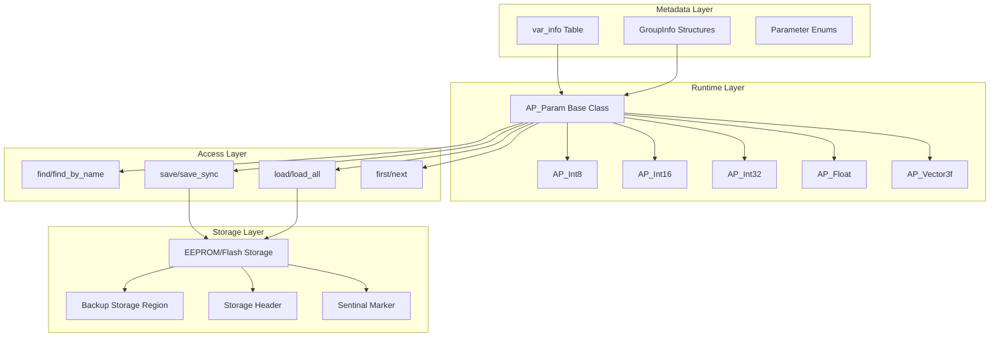
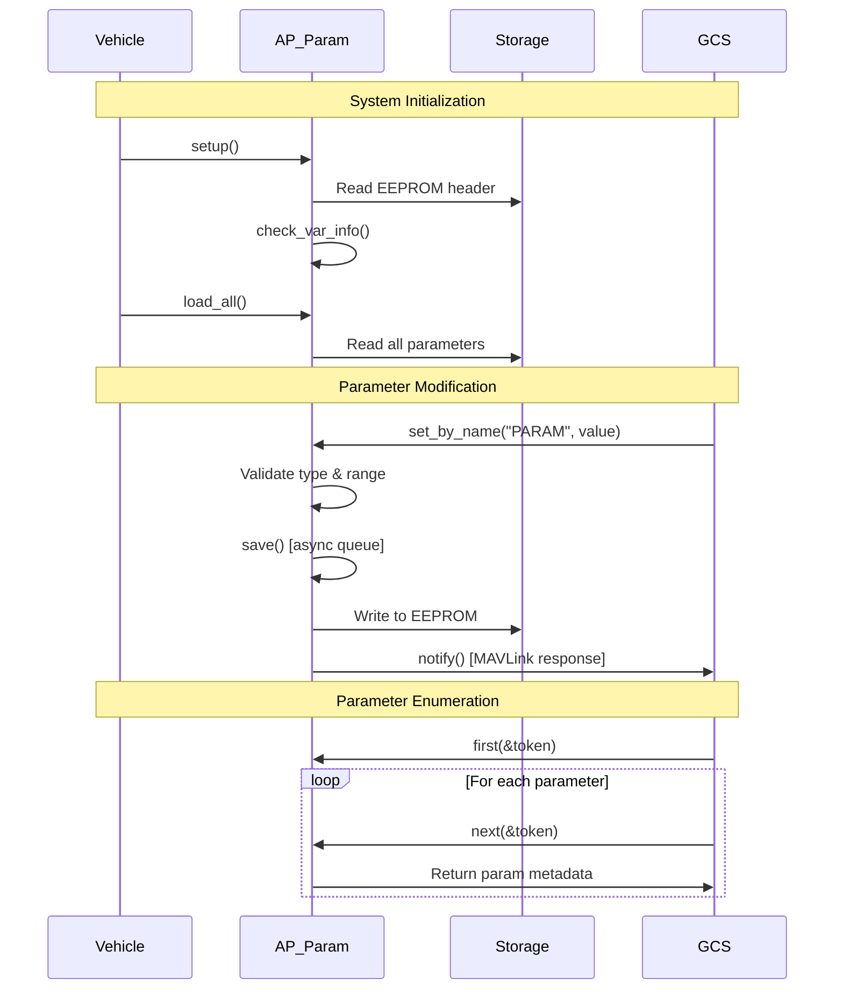

# AP_Param Library


## Table of Contents
- [Overview](#overview)
- [Architecture](#architecture)
- [Parameter System Components](#parameter-system-components)
- [Persistence Mechanisms](#persistence-mechanisms)
- [Parameter Groups and Tables](#parameter-groups-and-tables)
- [Validation and Constraints](#validation-and-constraints)
- [Migration Procedures](#migration-procedures)
- [API Reference](#api-reference)
- [Configuration Examples](#configuration-examples)
- [Integration Patterns](#integration-patterns)
- [Testing Procedures](#testing-procedures)
- [Memory Management](#memory-management)
- [Build Configuration](#build-configuration)
- [Safety Considerations](#safety-considerations)

## Overview

The AP_Param library is the configuration backbone of ArduPilot, providing a comprehensive system for managing and storing variables that are of general interest to the entire system. It handles persistent storage, runtime access, validation, migration, and synchronization of parameters across all vehicle types and subsystems.

**Source Files**: `/libraries/AP_Param/`
- `AP_Param.h` - Core class definitions and API
- `AP_Param.cpp` - Main implementation
- `AP_ParamT.cpp` - Template implementations
- `AP_Param_config.h` - Build-time configuration
- `tools/eedump_apparam.c` - EEPROM debugging utility

### Key Features

- **Persistent Storage**: Efficient EEPROM/Flash storage with backup regions
- **Type Safety**: Strongly-typed parameter access (Int8, Int16, Int32, Float, Vector3f)
- **Hierarchical Organization**: Nested parameter groups and subgroups
- **Dynamic Discovery**: Runtime enumeration of all parameters
- **GCS Integration**: MAVLink protocol support for parameter synchronization
- **Migration System**: Automated conversion of legacy parameter formats
- **Default Values**: Multiple mechanisms for specifying defaults
- **Frame Type Filtering**: Vehicle-specific parameter visibility
- **Thread Safety**: Atomic operations and semaphore protection
- **Scripting Support**: Dynamic parameter table creation

### Primary Responsibilities

1. **Configuration Management**: Centralized storage for all system configuration values
2. **Persistence**: Reliable save/load operations with backup mechanisms
3. **Discovery**: Name-based and index-based parameter enumeration
4. **Validation**: Type checking, range validation, and constraint enforcement
5. **Migration**: Conversion of parameters across firmware versions
6. **Synchronization**: GCS communication via MAVLink parameter protocol
7. **Defaults Management**: Multi-layered default value system

## Architecture

The AP_Param system consists of three main layers: metadata definition, persistent storage, and runtime access.



### Data Flow



## Parameter System Components

### AP_Param Base Class

The `AP_Param` class provides the foundation for the parameter system. It is a singleton that manages the global parameter table and storage operations.

**Source**: `libraries/AP_Param/AP_Param.h:194`

**Key Static Members**:
- `_var_info`: Pointer to the global parameter information table
- `_num_vars`: Total count of parameters in the table
- `_storage`: Primary EEPROM storage accessor
- `_storage_bak`: Backup storage accessor (if enabled)
- `sentinal_offset`: Current end of used EEPROM space

**Singleton Access**:
```cpp
AP_Param *param = AP::param();
```

### Parameter Header Structure

Each parameter stored in EEPROM has a 4-byte header containing metadata.

**Source**: `libraries/AP_Param/AP_Param.h:655`

```cpp
struct Param_header {
    uint32_t key_low : 8;       // Lower 8 bits of parameter key
    uint32_t type : 5;          // Parameter type (AP_PARAM_*)
    uint32_t key_high : 1;      // Upper bit of parameter key (9 bits total)
    uint32_t group_element : 18; // Position in nested group hierarchy
};
```

**Key Components**:
- **key**: 9-bit identifier (0-511) from `k_param_*` enum, uniquely identifies parameter
- **type**: Enum `ap_var_type` specifying data type (INT8, INT16, INT32, FLOAT, VECTOR3F, GROUP)
- **group_element**: 18-bit nested group identifier (3 levels × 6 bits = max 64 elements per level)

### EEPROM Header

The EEPROM storage begins with a 4-byte header indicating format version.

**Source**: `libraries/AP_Param/AP_Param.h:634`

```cpp
struct EEPROM_header {
    uint8_t magic[2];    // "AP" (0x50, 0x41)
    uint8_t revision;    // Format version (currently 6)
    uint8_t spare;       // Reserved for future use
};
```

**Magic Values**:
- `k_EEPROM_magic0 = 0x50` ('P')
- `k_EEPROM_magic1 = 0x41` ('A')
- `k_EEPROM_revision = 6` (current format)

If the header doesn't match, `setup()` erases all parameters and reinitializes storage.

### Parameter Types

AP_Param provides strongly-typed wrappers for different data types.

**Source**: `libraries/AP_Param/AP_Param.h:893-1103`

| Type | C++ Class | Size | Range | Usage |
|------|-----------|------|-------|-------|
| `AP_PARAM_INT8` | `AP_Int8` | 1 byte | -128 to 127 | Flags, small enums |
| `AP_PARAM_INT16` | `AP_Int16` | 2 bytes | -32768 to 32767 | Medium range values |
| `AP_PARAM_INT32` | `AP_Int32` | 4 bytes | ±2.1 billion | Large values, bitmasks |
| `AP_PARAM_FLOAT` | `AP_Float` | 4 bytes | ±3.4e38 | Real numbers, gains |
| `AP_PARAM_VECTOR3F` | `AP_Vector3f` | 12 bytes | Three floats | Offsets, positions |
| `AP_PARAM_GROUP` | N/A | Variable | N/A | Nested structures |

**Type Conversion**:
All types implicitly convert to their underlying value:
```cpp
AP_Int16 servo_min;
int16_t value = servo_min;  // Implicit conversion
float val = servo_min.cast_to_float();  // Explicit cast
```

### Enum Wrappers

For type-safe enums, use `AP_Enum` and `AP_Enum16`:

**Source**: `libraries/AP_Param/AP_Param.h:1110-1138`

```cpp
enum class FlightMode : uint8_t {
    STABILIZE = 0,
    ACRO = 1,
    ALT_HOLD = 2,
};

AP_Enum<FlightMode> mode;
mode.set(FlightMode::STABILIZE);
FlightMode current = mode;  // Implicit conversion
```

## Persistence Mechanisms

### Storage Backend

AP_Param uses the `StorageManager` system to access persistent storage, which abstracts EEPROM, Flash, or other non-volatile memory.

**Source**: `libraries/AP_Param/AP_Param.cpp:143-148`

```cpp
StorageAccess AP_Param::_storage(StorageManager::StorageParam);
#if AP_PARAM_STORAGE_BAK_ENABLED
StorageAccess AP_Param::_storage_bak(StorageManager::StorageParamBak);
#endif
```

**Storage Regions**:
- **Primary**: `StorageManager::StorageParam` - Main parameter storage
- **Backup**: `StorageManager::StorageParamBak` - Redundant copy (enabled when `HAL_STORAGE_SIZE >= 32768`)

### Backup and Recovery

When backup storage is enabled (`AP_PARAM_STORAGE_BAK_ENABLED`), every write operation updates both primary and backup regions.

**Source**: `libraries/AP_Param/AP_Param.cpp:154-160`

```cpp
void AP_Param::eeprom_write_check(const void *ptr, uint16_t ofs, uint8_t size)
{
    _storage.write_block(ofs, ptr, size);
#if AP_PARAM_STORAGE_BAK_ENABLED
    _storage_bak.write_block(ofs, ptr, size);
#endif
}
```

**Recovery Process**: During `setup()`, if primary storage header is corrupted but backup is valid, the system automatically restores from backup.

**Source**: `libraries/AP_Param/AP_Param.cpp:375-383`

```cpp
if (hdr2.magic[0] == k_EEPROM_magic0 &&
    hdr2.magic[1] == k_EEPROM_magic1 &&
    hdr2.revision == k_EEPROM_revision &&
    _storage.copy_area(_storage_bak)) {
    // Restored from backup
    INTERNAL_ERROR(AP_InternalError::error_t::params_restored);
    return true;
}
```

### Save Queue Processing

Parameter saves are asynchronous to avoid blocking the main flight control loop. Modified parameters are queued and written in a background task.

**Source**: `libraries/AP_Param/AP_Param.h:863-867`

```cpp
struct PACKED param_save {
    AP_Param *param;
    bool force_save;
};
static ObjectBuffer_TS<struct param_save> save_queue{30};
```

**Save Workflow**:
1. User code calls `param.save()` or `param.set_and_save(value)`
2. Save request is queued in thread-safe ring buffer (max 30 pending)
3. Background handler `save_io_handler()` processes queue at lower priority
4. Parameter is written to EEPROM with header
5. GCS notification is sent if enabled

**Synchronous Save**: For critical operations (e.g., pre-reboot), use `save_sync()`:

```cpp
param.save_sync(force_save, send_to_gcs);
```

### Storage Format

Parameters are stored sequentially after the EEPROM header:

```
Offset 0: EEPROM_header (4 bytes)
Offset 4: Param_header + Value
Offset N: Param_header + Value
...
Offset X: Sentinal (marks end of used space)
```

**Sentinal Marker**: A special header (`key=0x1FF, type=0x1F, group_element=0xFF`) marks the end of stored parameters.

**Source**: `libraries/AP_Param/AP_Param.h:668-670`

```cpp
static const uint16_t _sentinal_key   = 0x1FF;
static const uint8_t  _sentinal_type  = 0x1F;
static const uint8_t  _sentinal_group = 0xFF;
```

### Initialization Sequence

The parameter system is initialized in vehicle `setup()`:

**Source**: `libraries/AP_Param/AP_Param.cpp:360-397`

```cpp
bool AP_Param::setup(void)
{
    struct EEPROM_header hdr {};
    
    // Read primary storage header
    _storage.read_block(&hdr, 0, sizeof(hdr));
    
    // Validate magic bytes and revision
    if (hdr.magic[0] != k_EEPROM_magic0 ||
        hdr.magic[1] != k_EEPROM_magic1 ||
        hdr.revision != k_EEPROM_revision) {
        // Try backup recovery (if enabled)
        // Otherwise erase and reinitialize
        erase_all();
    }
    
    return true;
}
```

**Load All Parameters**:

```cpp
bool AP_Param::load_all()
{
    // Scan EEPROM and load all stored parameters
    // Parameters not in EEPROM retain their default values
    // Returns false if any parameter failed to load
}
```

## Parameter Groups and Tables

### Parameter Information Table

The global `var_info` table defines all parameters in the system. It maps parameter names to memory locations and provides metadata.

**Source**: `libraries/AP_Param/AP_Param.h:212-224`

```cpp
struct Info {
    const char *name;           // Parameter name (or prefix for groups)
    const void *ptr;            // Pointer to variable in memory
    union {
        const struct GroupInfo *group_info;         // Nested group definition
        const struct GroupInfo **group_info_ptr;    // Dynamic group pointer
        const float def_value;                      // Default value for scalars
        ptrdiff_t def_value_offset;                 // Offset to default value
    };
    uint16_t flags;             // Feature flags (frame type, visibility)
    uint16_t key;               // Parameter key (k_param_*)
    uint8_t type;               // Parameter type (AP_PARAM_*)
};
```

**Example Vehicle Table**:

```cpp
// From vehicle Parameters.h
const AP_Param::Info vehicle_var_info[] = {
    GSCALAR(format_version, "FORMAT_VERSION", 0),
    GGROUP(serial_manager, "SERIAL", AP_SerialManager),
    GOBJECT(motors, "MOT_", AP_Motors),
    AP_VAREND
};
```

### GroupInfo Structure

Groups allow related parameters to be organized hierarchically. Each group has its own `GroupInfo` table.

**Source**: `libraries/AP_Param/AP_Param.h:199-211`

```cpp
struct GroupInfo {
    const char *name;           // Parameter suffix (empty for nested groups)
    ptrdiff_t offset;           // Offset within parent object
    union {
        const struct GroupInfo *group_info;         // Nested subgroup
        const struct GroupInfo **group_info_ptr;    // Dynamic subgroup
        const float def_value;                      // Default value
        ptrdiff_t def_value_offset;                 // Offset to default
    };
    uint16_t flags;             // Feature flags
    uint8_t idx;                // Index within group (0-63)
    uint8_t type;               // Parameter type
};
```

### Defining Parameter Groups

**Simple Group Example**:

```cpp
class AP_Motors {
public:
    AP_Int16 spin_min;
    AP_Int16 spin_max;
    AP_Float hover_learn;
    
    static const struct AP_Param::GroupInfo var_info[];
};

const AP_Param::GroupInfo AP_Motors::var_info[] = {
    // name, idx, class, element, default
    AP_GROUPINFO("SPIN_MIN", 0, AP_Motors, spin_min, 100),
    AP_GROUPINFO("SPIN_MAX", 1, AP_Motors, spin_max, 1000),
    AP_GROUPINFO("HOVER_LEARN", 2, AP_Motors, hover_learn, 1.0f),
    AP_GROUPEND
};
```

**Result**: Parameters named `MOT_SPIN_MIN`, `MOT_SPIN_MAX`, `MOT_HOVER_LEARN`

### Nested Groups

Groups can contain other groups up to 3 levels deep (18 bits / 6 bits per level = 3 levels).

**Source**: `libraries/AP_Param/AP_Param.h:148-152`

```cpp
// Nested group - subclass with its own var_info
#define AP_NESTEDGROUPINFO(clazz, idx) \
    { "", 0, { group_info : clazz::var_info }, 0, idx, AP_PARAM_GROUP }

// Subgroup - member object with its own var_info  
#define AP_SUBGROUPINFO(element, name, idx, thisclazz, elclazz) \
    { name, AP_VAROFFSET(thisclazz, element), \
      { group_info : elclazz::var_info }, \
      AP_PARAM_FLAG_NESTED_OFFSET, idx, AP_PARAM_GROUP }
```

**Example**:

```cpp
class PID_Controller {
public:
    AP_Float kP;
    AP_Float kI;
    AP_Float kD;
    static const struct AP_Param::GroupInfo var_info[];
};

class AttitudeControl {
public:
    PID_Controller rate_roll;
    PID_Controller rate_pitch;
    
    static const struct AP_Param::GroupInfo var_info[];
};

const AP_Param::GroupInfo AttitudeControl::var_info[] = {
    AP_SUBGROUPINFO(rate_roll, "R_", 0, AttitudeControl, PID_Controller),
    AP_SUBGROUPINFO(rate_pitch, "P_", 1, AttitudeControl, PID_Controller),
    AP_GROUPEND
};
```

**Result**: Parameters like `ATC_R_P`, `ATC_R_I`, `ATC_R_D`, `ATC_P_P`, `ATC_P_I`, `ATC_P_D`

### Pointer Groups

For dynamically allocated objects, use pointer groups:

**Source**: `libraries/AP_Param/AP_Param.h:158-161`

```cpp
// Pointer to dynamically allocated object
#define AP_SUBGROUPPTR(element, name, idx, thisclazz, elclazz) \
    { name, AP_VAROFFSET(thisclazz, element), \
      { group_info : elclazz::var_info }, \
      AP_PARAM_FLAG_POINTER, idx, AP_PARAM_GROUP }

// Pointer with dynamic var_info
#define AP_SUBGROUPVARPTR(element, name, idx, thisclazz, var_info) \
    { name, AP_VAROFFSET(thisclazz, element), \
      { group_info_ptr : &var_info }, \
      AP_PARAM_FLAG_POINTER | AP_PARAM_FLAG_INFO_POINTER, idx, AP_PARAM_GROUP }
```

### Parameter Flags

Flags control parameter behavior and visibility.

**Source**: `libraries/AP_Param/AP_Param.h:80-122`

| Flag | Value | Purpose |
|------|-------|---------|
| `AP_PARAM_FLAG_NESTED_OFFSET` | `1<<0` | Subgroup with nested offset |
| `AP_PARAM_FLAG_POINTER` | `1<<1` | Dynamically allocated object |
| `AP_PARAM_FLAG_ENABLE` | `1<<2` | Controls subtree visibility |
| `AP_PARAM_FLAG_NO_SHIFT` | `1<<3` | Don't shift index 0 to 63 |
| `AP_PARAM_FLAG_INFO_POINTER` | `1<<4` | var_info is a pointer |
| `AP_PARAM_FLAG_INTERNAL_USE_ONLY` | `1<<5` | Read-only from GCS |
| `AP_PARAM_FLAG_HIDDEN` | `1<<6` | Hidden from GCS |
| `AP_PARAM_FLAG_DEFAULT_POINTER` | `1<<7` | Default is offset-based |

**Frame Type Flags** (shifted by 8 bits):
- `AP_PARAM_FRAME_COPTER` - Visible on multirotor
- `AP_PARAM_FRAME_ROVER` - Visible on ground vehicles
- `AP_PARAM_FRAME_PLANE` - Visible on fixed-wing
- `AP_PARAM_FRAME_SUB` - Visible on submarines
- `AP_PARAM_FRAME_TRICOPTER` - Visible on tricopters
- `AP_PARAM_FRAME_HELI` - Visible on helicopters
- `AP_PARAM_FRAME_BLIMP` - Visible on blimps

**Frame-Specific Parameters**:

```cpp
// Only visible on copters
AP_GROUPINFO_FRAME("LAND_SPEED", 5, Copter, land_speed, 50, 
                   AP_PARAM_FRAME_COPTER)

// Visible on both planes and copters
AP_GROUPINFO_FRAME("FS_BATT_ENABLE", 10, Vehicle, fs_batt_enable, 0,
                   AP_PARAM_FRAME_PLANE | AP_PARAM_FRAME_COPTER)
```

Vehicles enable their frame type during initialization:

```cpp
AP_Param::set_frame_type_flags(AP_PARAM_FRAME_COPTER);
```

## Validation and Constraints

### Type Validation

AP_Param enforces type safety at compile time through template specialization and at runtime through stored type information.

**Compile-Time Safety**:

```cpp
AP_Int16 servo_trim;
servo_trim.set(1500);        // OK
servo_trim.set(1500.5f);     // Compiler warning: float truncated to int
```

**Runtime Type Checking**:

**Source**: `libraries/AP_Param/AP_Param.cpp:558-600`

When loading from EEPROM, the stored type must match the variable's declared type:

```cpp
if (type == phdr.type) {
    // Type matches, safe to load
    *ptr = (void*)base;
    return &info;
}
// Type mismatch - parameter not loaded
```

### Range Validation

Parameters can specify valid ranges through default value mechanisms or external validation.

**Application-Level Validation**:

```cpp
void set_throttle(int16_t value) {
    value = constrain_int16(value, 0, 1000);  // Enforce range
    throttle_param.set_and_save(value);
}
```

**Parameter Metadata** (via GCS MAVLink):
While AP_Param doesn't store min/max in the library, ground stations receive this information via parameter metadata messages.

### Read-Only Parameters

Parameters can be marked read-only via defaults files using `@READONLY`:

**Source**: `libraries/AP_Param/AP_Param.h:840-844`

```cpp
struct param_override {
    const AP_Param *object_ptr;
    float value;
    bool read_only;  // Marked @READONLY in defaults file
};
```

**Example defaults.parm**:

```
SYSID_THISMAV @READONLY
SERIAL0_BAUD @READONLY
```

Read-only status is checked during parameter set operations:

```cpp
bool AP_Param::is_read_only(void) const {
    // Check if parameter is in read-only override list
}
```

### Enable Parameters

Enable parameters control visibility of entire parameter subtrees:

**Source**: `libraries/AP_Param/AP_Param.h:87`

```cpp
#define AP_PARAM_FLAG_ENABLE (1<<2)
```

**Usage Pattern**:

```cpp
class RangeFinder {
public:
    AP_Int8 enable;  // 0=disabled, 1=enabled
    AP_Float max_distance;
    AP_Float min_distance;
    
    static const struct AP_Param::GroupInfo var_info[];
};

const AP_Param::GroupInfo RangeFinder::var_info[] = {
    AP_GROUPINFO_FLAGS("ENABLE", 0, RangeFinder, enable, 0, 
                       AP_PARAM_FLAG_ENABLE),
    AP_GROUPINFO("MAX_DIST", 1, RangeFinder, max_distance, 10.0f),
    AP_GROUPINFO("MIN_DIST", 2, RangeFinder, min_distance, 0.2f),
    AP_GROUPEND
};
```

When `RNGFND_ENABLE = 0`, parameters `RNGFND_MAX_DIST` and `RNGFND_MIN_DIST` are hidden from GCS parameter lists.

### Internal Use Only

Some parameters are visible but should only be modified by ArduPilot code:

**Source**: `libraries/AP_Param/AP_Param.h:99`

```cpp
#define AP_PARAM_FLAG_INTERNAL_USE_ONLY (1<<5)
```

**Example**:

```cpp
AP_GROUPINFO_FLAGS("_LEARNED", 10, Class, learned_value, 0,
                   AP_PARAM_FLAG_INTERNAL_USE_ONLY)
```

These parameters can be read by GCS but attempts to set them via MAVLink are rejected.

**Source**: `libraries/AP_Param/AP_Param.h:574`

```cpp
bool allow_set_via_mavlink(uint16_t flags) const {
    if (flags & AP_PARAM_FLAG_INTERNAL_USE_ONLY) {
        return false;
    }
    return true;
}
```

## Migration Procedures

The parameter migration system allows firmware updates to change parameter organization without losing user configuration.

### Conversion Info Structure

Migration mappings are defined using `ConversionInfo`:

**Source**: `libraries/AP_Param/AP_Param.h:225-230`

```cpp
struct ConversionInfo {
    uint16_t old_key;               // Old k_param_* value
    uint32_t old_group_element;     // Old position in group
    enum ap_var_type type;          // Parameter type
    const char *new_name;           // New parameter name
};
```

### Simple Parameter Rename

**Example**: Rename `BATT_CAPACITY` to `BATT_CAPACITY_MAH`:

```cpp
const AP_Param::ConversionInfo conversion_table[] = {
    { Parameters::k_param_battery, 5, AP_PARAM_FLOAT, "BATT_CAPACITY_MAH" },
};

void Copter::load_parameters(void) {
    AP_Param::convert_old_parameters(conversion_table, 
                                     ARRAY_SIZE(conversion_table));
}
```

**Process**:
1. `convert_old_parameters()` searches EEPROM for old key/group_element
2. If found, reads old value
3. Calls `AP_Param::find()` with new name
4. Writes value to new location
5. Erases old location (optional, based on flags)

### Parameter Scaling

When changing parameter units, use scaled conversion:

**Source**: `libraries/AP_Param/AP_Param.h:478`

```cpp
static void convert_old_parameters_scaled(
    const ConversionInfo *conversion_table,
    uint8_t table_size, 
    float scaler,
    uint8_t flags);
```

**Example**: Convert degrees to centidegrees:

```cpp
const AP_Param::ConversionInfo conversion_table[] = {
    { k_param_angle, 0, AP_PARAM_INT16, "ANGLE_CD" },
};

AP_Param::convert_old_parameters_scaled(conversion_table,
                                        ARRAY_SIZE(conversion_table),
                                        100.0f);  // degrees * 100 = centidegrees
```

### Width Conversion

Expanding a parameter type (e.g., INT16 → INT32) is handled by `convert_parameter_width()`:

**Source**: `libraries/AP_Param/AP_Param.h:503-512`

```cpp
bool convert_parameter_width(ap_var_type old_ptype, float scale_factor=1.0);
bool convert_centi_parameter(ap_var_type old_ptype);
bool convert_bitmask_parameter_width(ap_var_type old_ptype);
```

**Usage in Parameter Definition**:

```cpp
void AP_Class::load_parameters() {
    my_int32_param.convert_parameter_width(AP_PARAM_INT16);
}
```

**Process**:
1. Searches EEPROM for parameter using current key but old type
2. If found, reads old value
3. Scales by scale_factor if provided
4. Writes to current location with new type
5. Returns true if conversion occurred

### Group-to-Group Migration

Moving parameters between groups uses `convert_class()`:

**Source**: `libraries/AP_Param/AP_Param.h:523-525`

```cpp
static void convert_class(uint16_t param_key,
                          void *object_pointer,
                          const struct GroupInfo *group_info,
                          uint16_t old_index,
                          bool is_top_level);
```

**Example**: Move parameters from `g` to `g2`:

```cpp
AP_Param::convert_class(Parameters::k_param_old_object,
                       &g2.new_object,
                       AP_NewClass::var_info,
                       3,  // Old index in g
                       true);
```

### G2 Object Conversion

Helper for migrating from vehicle's `g2` structure to `AP_Vehicle`:

**Source**: `libraries/AP_Param/AP_Param.h:482-487`

```cpp
struct G2ObjectConversion {
    void *object_pointer;
    const struct GroupInfo *var_info;
    uint16_t old_index;  // Old parameter index in g2
};

static void convert_g2_objects(const void *g2,
                               const G2ObjectConversion g2_conversions[],
                               uint8_t num_conversions);
```

## API Reference

### Initialization

#### setup()

Initialize the parameter system and validate EEPROM structure.

**Source**: `libraries/AP_Param/AP_Param.h:241`

```cpp
static bool setup();
```

**Returns**: `true` if initialization successful

**Usage**: Called once during vehicle startup before accessing any parameters.

```cpp
void Vehicle::setup() {
    AP_Param::setup();
    AP_Param::load_all();
}
```

#### load_all()

Load all parameters from EEPROM into RAM.

**Source**: `libraries/AP_Param/AP_Param.h:431`

```cpp
static bool load_all();
```

**Returns**: `false` if any parameter failed to load

**Behavior**: Parameters not found in EEPROM retain their default values.

### Parameter Discovery

#### find()

Find a parameter by name.

**Source**: `libraries/AP_Param/AP_Param.h:321`

```cpp
static AP_Param* find(const char *name, 
                     enum ap_var_type *ptype,
                     uint16_t *flags = nullptr);
```

**Parameters**:
- `name`: Full parameter name (e.g., "MOT_SPIN_MIN")
- `ptype`: [out] Parameter type
- `flags`: [out] Optional parameter flags

**Returns**: Pointer to parameter, or `nullptr` if not found

**Example**:

```cpp
enum ap_var_type ptype;
uint16_t flags;
AP_Param *param = AP_Param::find("SERVO1_TRIM", &ptype, &flags);
if (param != nullptr) {
    if (ptype == AP_PARAM_INT16) {
        AP_Int16 *servo_trim = (AP_Int16*)param;
        int16_t value = servo_trim->get();
    }
}
```

#### find_by_index()

Find a parameter by its index in the var_info table.

**Source**: `libraries/AP_Param/AP_Param.h:365`

```cpp
static AP_Param* find_by_index(uint16_t idx,
                               enum ap_var_type *ptype,
                               ParamToken *token);
```

**Parameters**:
- `idx`: Index (0-based) into flattened parameter space
- `ptype`: [out] Parameter type
- `token`: [out] Token for subsequent operations

**Returns**: Pointer to parameter, or `nullptr` if index invalid

#### find_by_name()

By-name equivalent of `find_by_index()`, returning token.

**Source**: `libraries/AP_Param/AP_Param.h:368`

```cpp
static AP_Param* find_by_name(const char* name,
                              enum ap_var_type *ptype,
                              ParamToken *token);
```

### Parameter Enumeration

#### first()

Get the first parameter in the system.

**Source**: `libraries/AP_Param/AP_Param.h:543`

```cpp
static AP_Param* first(ParamToken *token,
                      enum ap_var_type *ptype,
                      float *default_val = nullptr);
```

**Parameters**:
- `token`: [out] Token for use with `next()`
- `ptype`: [out] Parameter type
- `default_val`: [out] Optional default value

**Returns**: Pointer to first parameter

#### next()

Get the next parameter in iteration.

**Source**: `libraries/AP_Param/AP_Param.h:547-548`

```cpp
static AP_Param* next(ParamToken *token,
                     enum ap_var_type *ptype);

static AP_Param* next(ParamToken *token,
                     enum ap_var_type *ptype,
                     bool skip_disabled,
                     float *default_val = nullptr);
```

**Parameters**:
- `token`: [in,out] Token from `first()` or previous `next()`
- `ptype`: [out] Parameter type
- `skip_disabled`: Skip parameters with enable flag = 0
- `default_val`: [out] Optional default value

**Returns**: Pointer to next parameter, or `nullptr` when done

**Example - List All Parameters**:

```cpp
AP_Param::ParamToken token;
enum ap_var_type ptype;
for (AP_Param *param = AP_Param::first(&token, &ptype);
     param != nullptr;
     param = AP_Param::next(&token, &ptype)) {
    
    char name[AP_MAX_NAME_SIZE];
    param->copy_name_token(token, name, sizeof(name));
    
    float value = param->cast_to_float(ptype);
    printf("%s = %f\n", name, value);
}
```

#### next_scalar()

Enumerate only scalar parameters (skip groups).

**Source**: `libraries/AP_Param/AP_Param.h:552`

```cpp
static AP_Param* next_scalar(ParamToken *token,
                            enum ap_var_type *ptype,
                            float *default_val = nullptr);
```

### Value Access

#### get()

Get parameter value (type-specific).

**Source**: `libraries/AP_Param/AP_Param.h:901-903`

```cpp
const T &get(void) const;  // For AP_ParamT<T>
```

**Example**:

```cpp
AP_Int16 servo_trim;
int16_t value = servo_trim.get();

// Implicit conversion also works
int16_t value2 = servo_trim;
```

#### set()

Set parameter value in RAM (does not save to EEPROM).

**Source**: `libraries/AP_Param/AP_Param.h:907-909`

```cpp
void set(const T &v);
```

**Example**:

```cpp
AP_Float altitude;
altitude.set(100.5f);
```

#### set_and_save()

Set parameter and queue for saving to EEPROM.

**Source**: `libraries/AP_Param/AP_Param.h:928`

```cpp
void set_and_save(const T &v);
```

**Example**:

```cpp
AP_Int16 servo_trim;
servo_trim.set_and_save(1500);  // Save happens asynchronously
```

#### set_and_save_ifchanged()

Save only if value differs from current RAM value.

**Source**: `libraries/AP_Param/AP_Param.h:935`

```cpp
void set_and_save_ifchanged(const T &v);
```

**Usage**: Optimizes EEPROM writes when setting parameters that may already have the desired value.

#### set_and_notify()

Set parameter and notify GCS.

**Source**: `libraries/AP_Param/AP_Param.h:924`

```cpp
void set_and_notify(const T &v);
```

**Effect**: Triggers MAVLink `PARAM_VALUE` message to all connected ground stations.

### Storage Operations

#### save()

Queue parameter for asynchronous save to EEPROM.

**Source**: `libraries/AP_Param/AP_Param.h:415`

```cpp
void save(bool force_save=false);
```

**Parameters**:
- `force_save`: If `true`, save even if value equals default

**Thread Safety**: Thread-safe, uses ring buffer queue

#### save_sync()

Save parameter to EEPROM immediately (blocks).

**Source**: `libraries/AP_Param/AP_Param.h:405`

```cpp
void save_sync(bool force_save, bool send_to_gcs);
```

**Parameters**:
- `force_save`: Save even if value equals default
- `send_to_gcs`: Send notification to GCS after save

**Warning**: Blocks caller until EEPROM write completes (~3-10ms depending on hardware)

#### load()

Load this parameter from EEPROM.

**Source**: `libraries/AP_Param/AP_Param.h:421`

```cpp
bool load(void);
```

**Returns**: `true` if parameter found and loaded

**Usage**: Typically not needed, as `load_all()` loads all parameters at startup.

#### flush()

Flush all pending parameter saves (blocks until queue empty).

**Source**: `libraries/AP_Param/AP_Param.h:409`

```cpp
static void flush(void);
```

**Usage**: Called before reboot to ensure all parameter changes are saved.

### Name Operations

#### copy_name_token()

Get parameter name from token.

**Source**: `libraries/AP_Param/AP_Param.h:310`

```cpp
void copy_name_token(const ParamToken &token,
                    char *buffer,
                    size_t bufferSize,
                    bool force_scalar=false) const;
```

**Parameters**:
- `token`: Token from find/first/next operations
- `buffer`: Destination buffer
- `bufferSize`: Size of buffer
- `force_scalar`: For Vector3f, return base name without _X/_Y/_Z

### Defaults Management

#### set_default_by_name()

Override default value for a parameter.

**Source**: `libraries/AP_Param/AP_Param.h:328`

```cpp
static bool set_default_by_name(const char *name, float value);
```

**Returns**: `true` if parameter found

**Usage**: Typically called during initialization to customize defaults per vehicle type.

#### set_defaults_from_table()

Set multiple defaults from a table.

**Source**: `libraries/AP_Param/AP_Param.h:334`

```cpp
struct defaults_table_struct {
    const char *name;
    float value;
};

static void set_defaults_from_table(
    const struct defaults_table_struct *table,
    uint8_t count);
```

**Example**:

```cpp
const AP_Param::defaults_table_struct defaults[] = {
    { "RC1_MIN", 1000 },
    { "RC1_MAX", 2000 },
    { "RC1_TRIM", 1500 },
};

AP_Param::set_defaults_from_table(defaults, ARRAY_SIZE(defaults));
```

#### load_defaults_file()

Load parameter defaults from a file.

**Source**: `libraries/AP_Param/AP_Param.h:619`

```cpp
static bool load_defaults_file(const char *filename, bool last_pass);
```

**Parameters**:
- `filename`: Path to defaults.parm file
- `last_pass`: `true` on final load pass (after pointer params allocated)

**File Format**:

```
# Comment
PARAM_NAME value
PARAM_NAME value @READONLY
```

### By-Name Operations

#### set_by_name()

Set parameter by name.

**Source**: `libraries/AP_Param/AP_Param.h:341`

```cpp
static bool set_by_name(const char *name, float value);
```

**Returns**: `true` if parameter found and set

**Note**: Does not save to EEPROM

#### get()

Get parameter value by name (for scripting).

**Source**: `libraries/AP_Param/AP_Param.h:348`

```cpp
static bool get(const char *name, float &value);
```

**Returns**: `true` if parameter found

#### set_and_save_by_name()

Set parameter by name and save to EEPROM.

**Source**: `libraries/AP_Param/AP_Param.h:355-356`

```cpp
static bool set_and_save_by_name(const char *name, float value);
static bool set_and_save_by_name_ifchanged(const char *name, float value);
```

## Configuration Examples

### Basic Parameter Definition

**Step 1: Define parameters in class**:

```cpp
// MyClass.h
#include <AP_Param/AP_Param.h>

class MyClass {
public:
    MyClass();
    
    // Parameters
    AP_Int16 param_a;
    AP_Int16 param_b;
    AP_Float param_c;
    
    // Parameter table
    static const struct AP_Param::GroupInfo var_info[];
};
```

**Step 2: Define var_info table**:

```cpp
// MyClass.cpp
const AP_Param::GroupInfo MyClass::var_info[] = {
    // @Param: A
    // @DisplayName: Parameter A
    // @Description: First example parameter
    // @Range: 0 100
    // @User: Standard
    AP_GROUPINFO("A", 0, MyClass, param_a, 10),
    
    // @Param: B
    // @DisplayName: Parameter B
    // @Description: Second example parameter
    // @Range: 0 1000
    // @User: Advanced
    AP_GROUPINFO("B", 1, MyClass, param_b, 500),
    
    // @Param: C
    // @DisplayName: Parameter C
    // @Description: Float parameter
    // @Range: 0.0 10.0
    // @Increment: 0.1
    // @User: Standard
    AP_GROUPINFO("C", 2, MyClass, param_c, 5.0f),
    
    AP_GROUPEND
};
```

**Step 3: Register in vehicle var_info**:

```cpp
// Parameters.cpp
const AP_Param::Info vehicle_var_info[] = {
    GOBJECT(my_object, "MY_", MyClass),
    // ... other parameters
    AP_VAREND
};
```

**Result**: Parameters `MY_A`, `MY_B`, `MY_C` accessible via GCS

### Subgroup Example

**Nested PID Controller**:

```cpp
class PID {
public:
    AP_Float kP;
    AP_Float kI;
    AP_Float kD;
    AP_Float imax;
    
    static const struct AP_Param::GroupInfo var_info[];
};

const AP_Param::GroupInfo PID::var_info[] = {
    AP_GROUPINFO("P", 0, PID, kP, 0.0f),
    AP_GROUPINFO("I", 1, PID, kI, 0.0f),
    AP_GROUPINFO("D", 2, PID, kD, 0.0f),
    AP_GROUPINFO("IMAX", 3, PID, imax, 0.0f),
    AP_GROUPEND
};

class AttitudeControl {
public:
    PID pid_roll;
    PID pid_pitch;
    PID pid_yaw;
    
    static const struct AP_Param::GroupInfo var_info[];
};

const AP_Param::GroupInfo AttitudeControl::var_info[] = {
    AP_SUBGROUPINFO(pid_roll, "R_", 0, AttitudeControl, PID),
    AP_SUBGROUPINFO(pid_pitch, "P_", 1, AttitudeControl, PID),
    AP_SUBGROUPINFO(pid_yaw, "Y_", 2, AttitudeControl, PID),
    AP_GROUPEND
};
```

**Result**: Parameters like `ATC_R_P`, `ATC_R_I`, `ATC_P_P`, `ATC_Y_D`, etc.

### Frame-Specific Parameters

```cpp
const AP_Param::GroupInfo Copter::var_info[] = {
    // Copter-only parameter
    AP_GROUPINFO_FRAME("LAND_SPEED", 10, Copter, land_speed_cms, 50,
                       AP_PARAM_FRAME_COPTER | AP_PARAM_FRAME_HELI),
    
    // Plane-only parameter
    AP_GROUPINFO_FRAME("TECS_PITCH_MAX", 20, Plane, pitch_max, 20,
                       AP_PARAM_FRAME_PLANE),
    
    AP_GROUPEND
};

// In vehicle setup
void Copter::setup() {
    AP_Param::set_frame_type_flags(AP_PARAM_FRAME_COPTER);
}
```

### Enable Parameter Pattern

```cpp
class RangeFinder {
public:
    AP_Int8 type;  // 0=None, 1=Analog, 2=MaxbotixI2C, etc.
    AP_Float max_distance;
    AP_Float min_distance;
    
    static const struct AP_Param::GroupInfo var_info[];
};

const AP_Param::GroupInfo RangeFinder::var_info[] = {
    AP_GROUPINFO_FLAGS("TYPE", 0, RangeFinder, type, 0, 
                       AP_PARAM_FLAG_ENABLE),
    AP_GROUPINFO("MAX_DIST", 1, RangeFinder, max_distance, 10.0f),
    AP_GROUPINFO("MIN_DIST", 2, RangeFinder, min_distance, 0.2f),
    AP_GROUPEND
};
```

When `RNGFND_TYPE = 0`, `RNGFND_MAX_DIST` and `RNGFND_MIN_DIST` are hidden.

## Integration Patterns

### Singleton Access

Access the AP_Param singleton via:

```cpp
AP_Param *param_system = AP::param();
```

### Thread Safety

**Save Queue**: Parameter saves use thread-safe ring buffer.

**Source**: `libraries/AP_Param/AP_Param.h:863`

```cpp
ObjectBuffer_TS<struct param_save> save_queue{30};
```

**Safe Operations**:
- `save()` - Thread-safe (uses queue)
- `set()` - Not thread-safe (direct memory write)
- `get()` - Not thread-safe (direct memory read)

**Best Practice**: Perform all parameter access from main thread, or protect with semaphore:

```cpp
class MyClass {
    HAL_Semaphore _sem;
    AP_Float param;
    
public:
    void set_param_safe(float value) {
        WITH_SEMAPHORE(_sem);
        param.set(value);
    }
    
    float get_param_safe() {
        WITH_SEMAPHORE(_sem);
        return param.get();
    }
};
```

### GCS Integration

Parameters automatically integrate with MAVLink parameter protocol.

**Parameter List Request**:
```
GCS sends: PARAM_REQUEST_LIST
ArduPilot iterates: first() → next() → next() → ...
ArduPilot sends: PARAM_VALUE for each
```

**Parameter Set**:
```
GCS sends: PARAM_SET (name="SERVO1_TRIM", value=1520)
ArduPilot calls: set_by_name("SERVO1_TRIM", 1520)
ArduPilot calls: save()
ArduPilot sends: PARAM_VALUE (confirmation)
```

**Implementation**: Handled automatically by `GCS_MAVLINK` class.

### Scripting Support

Lua scripts can access parameters:

**Source**: `libraries/AP_Param/AP_Param.h:612-617`

```lua
-- Read parameter
local servo_min = param:get("SERVO1_MIN")

-- Set parameter
param:set_and_save("SERVO1_TRIM", 1500)
```

**Dynamic Parameter Tables**: Scripts can create their own parameter tables:

```cpp
#if AP_PARAM_DYNAMIC_ENABLED
static bool add_table(uint8_t key, const char *prefix, uint8_t num_params);
static bool add_param(uint8_t key, uint8_t param_num, 
                     const char *pname, float default_value);
#endif
```

### Parameter Change Callbacks

**Pattern**: Poll parameters in update loop or use change detection:

```cpp
class MyClass {
    AP_Float gain;
    float last_gain;
    
public:
    void update() {
        float current_gain = gain.get();
        if (!is_equal(current_gain, last_gain)) {
            // Parameter changed, recalculate
            on_gain_changed(current_gain);
            last_gain = current_gain;
        }
    }
};
```

**Note**: AP_Param does not provide automatic change callbacks to minimize overhead.

### Failsafe Defaults

Critical safety parameters should have safe defaults:

```cpp
// Failsafe battery voltage - default to safe value
AP_GROUPINFO("BATT_LOW_VOLT", 5, Copter, fs_batt_voltage, 10.5f),

// Throttle failsafe - default to enabled
AP_GROUPINFO("FS_THR_ENABLE", 10, Copter, fs_thr_enabled, 1),
```

## Testing Procedures

### Unit Tests

AP_Param includes unit tests in `/libraries/AP_Param/tests/`:

**Source**: `libraries/AP_Param/tests/test_find_by_name.cpp`

**Running Tests**:
```bash
./waf configure --board sitl
./waf tests
./build/sitl/tests/test_AP_Param
```

**Test Coverage**:
- Parameter find by name
- Parameter enumeration (first/next)
- Type validation
- Group nesting
- Vector3f handling

### Validation Tools

#### eedump_apparam

EEPROM dump utility for debugging parameter storage.

**Source**: `libraries/AP_Param/tools/eedump_apparam.c`

**Usage**:
```bash
gcc -o eedump_apparam eedump_apparam.c
./eedump_apparam eeprom.bin
```

**Output**: Human-readable dump of EEPROM contents with parameter headers decoded.

### Integration Testing

**SITL Parameter Testing**:

```bash
# Start SITL
sim_vehicle.py -v ArduCopter

# In MAVProxy
param set SERVO1_TRIM 1520
param save
param load saved_params.parm
param show SERVO*
```

**Autotest Parameter Scenarios**:

```python
# In Tools/autotest/arducopter.py
def test_parameters(self):
    self.set_parameter("SERVO1_TRIM", 1500)
    self.wait_parameter_value("SERVO1_TRIM", 1500)
    
    self.reboot_sitl()
    
    # Verify persistence
    self.wait_parameter_value("SERVO1_TRIM", 1500)
```

### Debugging Parameter Issues

**Enable Debug Output**:

**Source**: `libraries/AP_Param/AP_Param.cpp:62-70`

```cpp
#define ENABLE_DEBUG 1
```

**Debug Features**:
- Parameter table validation errors
- EEPROM scan details
- Load/save operations
- Conversion operations

**Check EEPROM Full**:

```cpp
if (AP_Param::get_eeprom_full()) {
    gcs().send_text(MAV_SEVERITY_ERROR, "Parameter storage full");
}
```

**Storage Usage**:

```cpp
uint16_t used = AP_Param::storage_used();
uint16_t total = AP_Param::storage_size();
float percent = 100.0f * used / total;
printf("Parameter storage: %u / %u bytes (%.1f%%)\n", used, total, percent);
```

## Memory Management

### Static Allocation

AP_Param uses primarily static allocation for predictable memory usage and real-time safety.

**Global Allocations**:
- `_var_info` table: Statically defined in vehicle code (flash/ROM)
- Parameter instances: Statically allocated as class members
- Storage buffers: Fixed-size `StorageAccess` objects

**No Dynamic Allocation** for core parameter storage ensures:
- Deterministic memory usage
- No heap fragmentation
- Safe operation in interrupt context (for reads)

### Storage Regions

Parameters use dedicated storage regions managed by `StorageManager`:

**Source**: `libraries/AP_Param/AP_Param.cpp:143-148`

```cpp
StorageAccess AP_Param::_storage(StorageManager::StorageParam);
#if AP_PARAM_STORAGE_BAK_ENABLED
StorageAccess AP_Param::_storage_bak(StorageManager::StorageParamBak);
#endif
```

**Typical Sizes**:
- Small boards (F4): 4KB - 8KB
- Medium boards (F7): 16KB - 32KB
- Large boards (H7): 32KB - 64KB+

**Storage Layout**:
```
[EEPROM_header: 4 bytes]
[Param 1: header + value]
[Param 2: header + value]
...
[Param N: header + value]
[Sentinal: 4 bytes]
[Unused space]
```

### Dynamic Tables (Scripting)

When scripting is enabled, dynamic parameter tables are supported:

**Source**: `libraries/AP_Param/AP_Param.h:822-835`

```cpp
#if AP_PARAM_DYNAMIC_ENABLED
static uint16_t _num_vars_base;
static struct Info *_var_info_dynamic;
static uint8_t _dynamic_table_sizes[AP_PARAM_MAX_DYNAMIC];
#endif
```

**Configuration**:
- `AP_PARAM_MAX_DYNAMIC`: Max dynamic tables (default: 10)
- `AP_PARAM_DYNAMIC_KEY_BASE`: Starting key for dynamic tables (300)

**Memory Impact**: Each dynamic table allocates `Info` structures on heap.

### Memory Safety

**DMA-Safe Storage**: EEPROM storage operations do not require DMA-safe buffers as `StorageManager` handles this internally.

**Stack Usage**: Parameter operations use minimal stack:
- `setup()`: ~100 bytes
- `save()`: ~50 bytes (queues to background task)
- `find()`: ~200 bytes (due to recursion through groups)

**Recursion Limits**: Group nesting limited to 3 levels to prevent stack overflow.

**Source**: `libraries/AP_Param/AP_Param.h:273-276`

```cpp
struct GroupNesting {
    static const uint8_t numlevels = 2;  // Actually supports 3 via recursion
    uint8_t level;
    const struct GroupInfo *group_ret[numlevels];
};
```

### Parameter Overrides

Default overrides are stored in dynamically allocated array:

**Source**: `libraries/AP_Param/AP_Param.h:840-848`

```cpp
struct param_override {
    const AP_Param *object_ptr;
    float value;
    bool read_only;
};
static struct param_override *param_overrides;
static uint16_t num_param_overrides;
static uint16_t param_overrides_len;
```

**Allocation**: Sized based on defaults file content, typically 50-200 entries.

### Embedded Defaults

Firmware can embed default parameter files:

**Source**: `libraries/AP_Param/AP_Param.h:682-690`

```cpp
#if AP_PARAM_MAX_EMBEDDED_PARAM > 0
struct PACKED param_defaults_struct {
    char magic_str[8];           // "PARMDEF"
    uint8_t param_magic[8];      // Magic bytes
    uint16_t max_length;
    volatile uint16_t length;
    volatile char data[AP_PARAM_MAX_EMBEDDED_PARAM];
};
static const param_defaults_struct param_defaults_data;
#endif
```

**Configuration**:
- `AP_PARAM_MAX_EMBEDDED_PARAM`: Max embedded param file size (0, 1024, or 8192 bytes)
- Modified by `apj_tool.py` during build

**Storage**: Located in flash memory, does not consume RAM.

## Build Configuration

### Compile-Time Options

**AP_Param_config.h** defines build-time configuration:

**Source**: `libraries/AP_Param/AP_Param_config.h`

#### AP_PARAM_DEFAULTS_FILE_PARSING_ENABLED

Enable parsing of defaults.parm files.

```cpp
#ifndef AP_PARAM_DEFAULTS_FILE_PARSING_ENABLED
#define AP_PARAM_DEFAULTS_FILE_PARSING_ENABLED AP_FILESYSTEM_FILE_READING_ENABLED
#endif
```

**Default**: Enabled if filesystem support enabled

**Disable**: Set to 0 to save flash space on constrained boards

#### FORCE_APJ_DEFAULT_PARAMETERS

Force inclusion of embedded defaults in APJ firmware.

```cpp
#ifndef FORCE_APJ_DEFAULT_PARAMETERS
#define FORCE_APJ_DEFAULT_PARAMETERS 0
#endif
```

**Enable**: Set to 1 in `hwdef.dat` for boards needing embedded defaults

#### AP_PARAM_MAX_EMBEDDED_PARAM

Maximum size of embedded parameter file.

**Source**: `libraries/AP_Param/AP_Param.h:52-62`

```cpp
#ifndef AP_PARAM_MAX_EMBEDDED_PARAM
  #if FORCE_APJ_DEFAULT_PARAMETERS
    #if HAL_PROGRAM_SIZE_LIMIT_KB <= 1024
      #define AP_PARAM_MAX_EMBEDDED_PARAM 1024
    #else
      #define AP_PARAM_MAX_EMBEDDED_PARAM 8192
    #endif
  #else
    #define AP_PARAM_MAX_EMBEDDED_PARAM 0
  #endif
#endif
```

**Sizes**:
- 0: Disabled (most boards)
- 1024: Small boards (1MB flash)
- 8192: Large boards (2MB+ flash)

#### AP_PARAM_DYNAMIC_ENABLED

Enable dynamic parameter tables for scripting.

```cpp
#ifndef AP_PARAM_DYNAMIC_ENABLED
#define AP_PARAM_DYNAMIC_ENABLED AP_SCRIPTING_ENABLED
#endif
```

**Default**: Enabled if scripting enabled

#### AP_PARAM_MAX_DYNAMIC

Maximum number of dynamic parameter tables.

```cpp
#ifndef AP_PARAM_MAX_DYNAMIC
#define AP_PARAM_MAX_DYNAMIC 10
#endif
```

#### AP_PARAM_KEY_DUMP

Enable debug parameter dumping functions.

```cpp
#ifndef AP_PARAM_KEY_DUMP
#define AP_PARAM_KEY_DUMP 0
#endif
```

**Enable**: Set to 1 for `show()` and `show_all()` functions

#### AP_PARAM_STORAGE_BAK_ENABLED

Enable backup storage region.

**Source**: `libraries/AP_Param/AP_Param.cpp:53-59`

```cpp
#ifndef AP_PARAM_STORAGE_BAK_ENABLED
#define AP_PARAM_STORAGE_BAK_ENABLED \
    (HAL_STORAGE_SIZE>=32768) && !defined(STORAGE_FLASH_PAGE)
#endif
```

**Condition**: Enabled when:
- Storage ≥ 32KB, AND
- Not using flash page storage

### Board-Specific Configuration

**hwdef.dat Options**:

```python
# Enable embedded defaults
define FORCE_APJ_DEFAULT_PARAMETERS 1

# Set storage size
define HAL_STORAGE_SIZE 32768

# Set embedded param size
define AP_PARAM_MAX_EMBEDDED_PARAM 8192
```

### Vehicle Configuration

Each vehicle defines its parameter table:

```cpp
// Copter/Parameters.cpp
const AP_Param::Info Copter::var_info[] = {
    GSCALAR(format_version, "FORMAT_VERSION", 0),
    GSCALAR(software_type, "SYSID_SW_TYPE", Parameters::k_software_type),
    GGROUP(serial_manager, "SERIAL", AP_SerialManager),
    // ... many more parameters
    AP_VAREND
};

// Copter/Copter.cpp
Copter::Copter() : 
    param_loader(var_info)
{
    // Constructor
}
```

## Safety Considerations

### Thread Safety

**Concurrent Access Risks**:

```cpp
// UNSAFE: Two threads modifying same parameter
Thread1: param.set(value1);
Thread2: param.set(value2);  // Race condition!
```

**Safe Patterns**:

1. **Single-threaded access**: Access parameters only from main thread
2. **Semaphore protection**: Protect with HAL_Semaphore if needed
3. **Use save() not save_sync()**: Async saves don't block other threads

**Save Queue Thread Safety**:

The save queue uses `ObjectBuffer_TS` (thread-safe ring buffer), making `save()` safe to call from any thread:

```cpp
// SAFE: save() is thread-safe
void ISR_handler() {
    important_param.set(new_value);
    important_param.save();  // Queues safely
}
```

### Atomic Operations

**Parameter Updates**: Individual parameter reads/writes are NOT atomic for types >8 bits on 8-bit/16-bit architectures.

**Best Practice**: Don't read parameters from interrupt context unless protected:

```cpp
// UNSAFE on some architectures
int32_t ISR_handler() {
    return my_int32_param.get();  // Non-atomic read
}

// SAFE
volatile int32_t cached_value;
void main_loop() {
    cached_value = my_int32_param.get();
}
int32_t ISR_handler() {
    return cached_value;  // Atomic read of volatile
}
```

### Failsafe Defaults

**Critical Parameters** must have safe defaults:

```cpp
// Battery failsafe - safe default
AP_GROUPINFO("BATT_LOW_VOLT", 0, Class, batt_low_volt, 10.5f),

// Arming checks - default to strict
AP_GROUPINFO("ARMING_CHECK", 1, Class, arming_check, 1),

// Failsafe actions - default to safe behavior
AP_GROUPINFO("FS_THR_ENABLE", 2, Class, fs_thr_enable, 1),
```

**Never** default safety-critical parameters to unsafe values:

```cpp
// BAD: Defaults to disabling safety features
AP_GROUPINFO("ARMING_CHECK", 1, Class, arming_check, 0),  // DON'T DO THIS!
```

### EEPROM Corruption Recovery

**Automatic Recovery**: If primary EEPROM corrupted, system restores from backup (if enabled):

**Source**: `libraries/AP_Param/AP_Param.cpp:375-383`

**Manual Recovery**:
```cpp
// Erase all parameters and reset to defaults
AP_Param::erase_all();
```

**Prevention**: Use `flush()` before reboot to ensure all saves complete:

```cpp
void Copter::reboot() {
    AP_Param::flush();  // Wait for all pending saves
    hal.scheduler->reboot(false);
}
```

### Parameter Validation

**Type Safety**: Type mismatches between EEPROM and RAM are caught:

```cpp
// If EEPROM contains INT16 but code expects FLOAT, load fails
// Parameter retains default value - safe behavior
```

**Range Checking**: Application must enforce ranges:

```cpp
void set_servo_trim(int16_t value) {
    // Validate range
    if (value < 900 || value > 2100) {
        gcs().send_text(MAV_SEVERITY_ERROR, "Invalid servo trim");
        return;
    }
    servo_trim.set_and_save(value);
}
```

### Real-Time Constraints

**Timing Considerations**:

| Operation | Typical Time | Max Time | Context |
|-----------|--------------|----------|---------|
| `get()` | <1μs | 5μs | Any |
| `set()` | <1μs | 5μs | Any |
| `save()` | 5-10μs | 50μs | Any (queues) |
| `save_sync()` | 3-10ms | 20ms | Main thread only |
| `load()` | 100-500μs | 2ms | Main thread only |
| `find()` | 50-200μs | 1ms | Any |

**Guidelines**:
- Never call `save_sync()` in time-critical loops
- Cache parameter values if accessed frequently:

```cpp
class FastController {
    AP_Float gain;
    float cached_gain;
    uint32_t last_update_ms;
    
public:
    void update() {
        uint32_t now = AP_HAL::millis();
        if (now - last_update_ms > 100) {  // Update cache every 100ms
            cached_gain = gain.get();
            last_update_ms = now;
        }
        // Use cached_gain in fast loop
    }
};
```

### Storage Wear Leveling

**EEPROM/Flash Endurance**:
- Typical EEPROM: 100,000 write cycles
- Flash memory: 10,000 - 100,000 write cycles

**Best Practices**:
1. Don't save parameters in fast loops
2. Use `set_and_save_ifchanged()` to avoid redundant writes
3. Batch parameter changes before saving
4. Use `save()` (async) not `save_sync()` to coalesce writes

**Storage Manager**: Handles wear leveling automatically for flash-based storage.

### Arming Checks

**EEPROM Full Check**:

```cpp
void AP_Arming::check_parameters() {
    if (AP_Param::get_eeprom_full()) {
        check_failed(ARMING_CHECK_PARAMETERS, true, 
                    "Parameter storage full");
    }
}
```

**Parameter Validation**: Vehicles perform pre-arm parameter validation:

```cpp
bool AP_Arming::check_parameters() {
    // Verify critical parameters in valid ranges
    if (param.value < min || param.value > max) {
        check_failed(ARMING_CHECK_PARAMETERS, true,
                    "PARAM out of range");
        return false;
    }
    return true;
}
```

---

## Summary

The AP_Param library provides a robust, efficient, and safety-critical parameter management system that:

- **Centralizes Configuration**: Single system for all vehicle parameters
- **Ensures Persistence**: Reliable EEPROM storage with backup and recovery
- **Enables Discovery**: Runtime enumeration and GCS synchronization
- **Supports Evolution**: Migration system for firmware updates
- **Maintains Safety**: Type checking, defaults, and failsafe mechanisms
- **Optimizes Performance**: Efficient storage, async saves, minimal overhead

**Key Design Principles**:
1. Safety first - safe defaults, validation, recovery
2. Efficiency - minimal RAM/flash, fast access
3. Flexibility - supports all vehicle types and configurations
4. Reliability - backup storage, atomic operations
5. Maintainability - clear structure, comprehensive migration support

**For more information**, see:
- Source code: `/libraries/AP_Param/`
- API documentation: Generated by Doxygen
- MAVLink parameter protocol: https://mavlink.io/en/services/parameter.html
- Development guide: https://ardupilot.org/dev/

