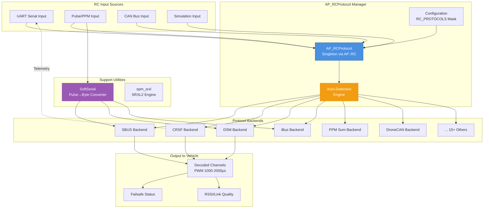
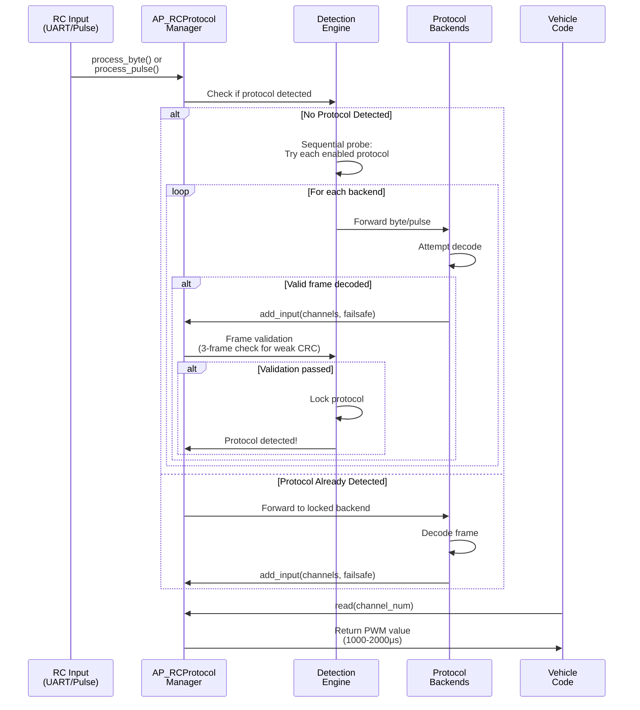
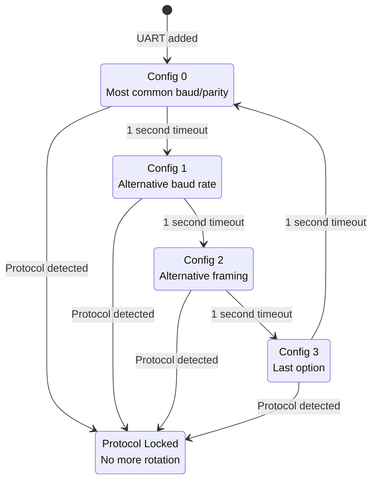

# AP_RCProtocol

## Overview

AP_RCProtocol is ArduPilot's central RC (Radio Control) input and protocol decoding subsystem. It provides a unified interface for receiving and decoding RC commands from 20+ different RC protocols with automatic protocol detection. The library abstracts away protocol-specific details and presents decoded channel data in a standardized format (PWM microseconds) to the rest of the autopilot system.

Key features include:
- **Multi-Protocol Support**: Serial protocols (SBUS, CRSF/ELRS, DSM, iBus, SUMD, SRXL, FPort, GHST, ST24), pulse protocols (PPM Sum), CAN protocols (DroneCAN), and simulation protocols (UDP, FDM, Joystick)
- **Automatic Protocol Detection**: Sequential probing with validation to automatically identify active protocol
- **Bidirectional Communication**: Telemetry downlink support for modern protocols (CRSF, GHST, FPort, SRXL2)
- **Failsafe Management**: Protocol-specific failsafe detection and propagation
- **Software Serial**: Pulse-to-byte conversion for protocols without dedicated UART hardware
- **Flexible Configuration**: Runtime protocol enable/disable via parameter mask

Source: libraries/AP_RCProtocol/AP_RCProtocol.h, libraries/AP_RCProtocol/AP_RCProtocol.cpp

## Architecture



## Key Components

### AP_RCProtocol Manager
- **Purpose**: Central coordinator for all RC protocol backends and auto-detection
- **Responsibilities**:
  - Initialize and manage protocol backend instances
  - Route RC input (bytes or pulses) to appropriate backends
  - Implement protocol auto-detection algorithm
  - Manage protocol selection and locking
  - Provide unified channel access interface
  - Handle UART configuration rotation for serial protocol probing
- **Lifecycle**: Singleton instantiated via `AP::RC()`, initialized at boot, runs continuously

### AP_RCProtocol_Backend Base Class
- **Purpose**: Abstract base class defining protocol backend interface
- **Responsibilities**:
  - Define common interface for all protocol implementations
  - Implement `add_input()` callback for passing decoded channels to frontend
  - Provide helper methods: `decode_11bit_channels()` for packed channel formats
  - Handle frame counting and failsafe propagation
  - Support optional telemetry, bind, and VTX configuration
- **Integration**: All protocol-specific backends inherit from this class

### Protocol-Specific Backends
Each protocol has a dedicated backend class implementing:
- `process_byte()`: Decode incoming UART bytes (serial protocols)
- `process_pulse()`: Decode pulse widths (pulse protocols)
- `process_handshake()`: Handle bidirectional handshake (CRSF, SRXL2)
- `update()`: Poll-based backends (DroneCAN, UDP, FDM, IOMCU)
- `start_bind()`: Initiate bind procedure (DSM, CRSF, SRXL2)

### SoftSerial Utility
- **Purpose**: Software UART implementation for converting pulse trains to serial bytes
- **Responsibilities**:
  - Reconstruct serial bytes from pulse width measurements
  - Support multiple serial configurations (8N1, 8E2I inverted, 8N1I)
  - Validate start/stop bits and parity
  - Provide microsecond-accurate byte timestamps
- **Usage**: Used by SBUS, iBus, DSM, SRXL backends for pulse-based input

### spm_srxl SRXL2 Engine
- **Purpose**: Complete SRXL2 protocol stack with bidirectional communication
- **Responsibilities**:
  - Handle SRXL2 handshake and device discovery
  - Manage baud rate negotiation
  - Process channel data with CRC validation
  - Support telemetry downlink, VTX control, and bind procedures
- **Integration**: Requires integrator callbacks for UART I/O and telemetry data

Source: libraries/AP_RCProtocol/AP_RCProtocol.h:32-112, libraries/AP_RCProtocol/AP_RCProtocol_Backend.h:27-145, libraries/AP_RCProtocol/SoftSerial.h:20-53

## Component Interactions

### Auto-Detection Sequence



### UART Configuration Rotation

For serial protocols, AP_RCProtocol rotates through different UART configurations to detect baud rate and framing:



Each protocol backend defines its preferred UART configuration(s) via `SerialConfig` structures specifying baud rate, parity, stop bits, and inversion settings.

Source: libraries/AP_RCProtocol/AP_RCProtocol.cpp:check_added_uart()

## Supported Protocols

### Serial Protocols (UART-based)

| Protocol | Channels | Resolution | Baud Rate | Features | Telemetry | Enable Macro |
|----------|----------|------------|-----------|----------|-----------|--------------|
| **SBUS** | 16 | 11-bit (172-1811μs) | 100000 | Failsafe flags, inverted UART (8E2I) | No | AP_RCPROTOCOL_SBUS_ENABLED |
| **SBUS_NI** | 16 | 11-bit | 100000 | Non-inverted variant | No | AP_RCPROTOCOL_SBUS_NI_ENABLED |
| **CRSF** | 16 | 11-bit | 416666 | Link quality, RSSI, bidirectional | Yes | AP_RCPROTOCOL_CRSF_ENABLED |
| **ELRS** | 16 | 11-bit | 420000 | ExpressLRS variant of CRSF | Yes | (via CRSF) |
| **DSM/DSMX** | 12 | 10/11-bit | 115200 | Spektrum, bind support | No | AP_RCPROTOCOL_DSM_ENABLED |
| **iBus** | 14 | 11-bit | 115200 | FlySky, checksum validation | No | AP_RCPROTOCOL_IBUS_ENABLED |
| **SUMD** | 16 | 12-bit | 115200 | Graupner HoTT, CRC16 | No | AP_RCPROTOCOL_SUMD_ENABLED |
| **SRXL** | 12 | 16-bit | 115200 | Spektrum Remote Link v1, CRC16 | No | AP_RCPROTOCOL_SRXL_ENABLED |
| **SRXL2** | 16 | 16-bit | 115200/400000 | Spektrum v2, VTX control, bind | Yes | AP_RCPROTOCOL_SRXL2_ENABLED |
| **ST24** | 12 | 12-bit | 115200 | Graupner HoTT ST24, CRC8 | No | AP_RCPROTOCOL_ST24_ENABLED |
| **FPort** | 16 | 11-bit | 115200 | FrSky, S.Port telemetry, inverted | Yes | AP_RCPROTOCOL_FPORT_ENABLED |
| **FPort2** | 16 | 11-bit | 115200 | FrSky v2, enhanced telemetry | Yes | AP_RCPROTOCOL_FPORT2_ENABLED |
| **GHST** | 12 | 11/12-bit | 420000 | ImmersionRC Ghost, link stats | Yes | AP_RCPROTOCOL_GHST_ENABLED |

### Pulse Protocols

| Protocol | Channels | Resolution | Timing | Features | Enable Macro |
|----------|----------|------------|--------|----------|--------------|
| **PPM Sum** | 8-12 | Direct PWM | Sync pulse >2700μs, channels 700-2300μs | Traditional analog receivers | AP_RCPROTOCOL_PPMSUM_ENABLED |

### CAN Protocols

| Protocol | Channels | Resolution | Bus Speed | Features | Enable Macro |
|----------|----------|------------|-----------|----------|--------------|
| **DroneCAN** | 18 | 16-bit (PWM μs) | CAN bus speed | Multi-node support, semaphore protection | AP_RCPROTOCOL_DRONECAN_ENABLED |

### Platform-Specific Protocols

| Protocol | Platform | Channels | Description | Enable Macro |
|----------|----------|----------|-------------|--------------|
| **IOMCU** | Pixhawk with IO MCU | 18 | Reads pre-decoded channels from separate STM32F100 IO processor | AP_RCPROTOCOL_IOMCU_ENABLED |
| **Emlid RCIO** | Navio/Navio2 | 8 | Reads PWM values from Linux sysfs /sys/kernel/rcio/rcin | AP_RCPROTOCOL_EMLID_RCIO_ENABLED |
| **AP_Radio** | Custom CYRF6936 hardware | Variable | Cyprus Semiconductor 2.4GHz radio, converts to PWM via formula | AP_RCPROTOCOL_RADIO_ENABLED |

### Simulation Protocols (SITL only)

| Protocol | Purpose | Source | Features | Enable Macro |
|----------|---------|--------|----------|--------------|
| **UDP** | Network RC injection | UDP socket port 5501 | Binary PWM array in network byte order | AP_RCPROTOCOL_UDP_ENABLED |
| **FDM** | Flight Dynamics Model | SITL::SIM class | Converts normalized ±1.0 to PWM μs | AP_RCPROTOCOL_FDM_ENABLED |
| **Joystick_SFML** | Physical joystick input | SFML joystick API | Maps SFML axes (-100 to +100) to PWM | AP_RCPROTOCOL_JOYSTICK_SFML_ENABLED |
| **MAVLink Radio** | GCS/companion control | RADIO_RC_CHANNELS MAVLink msg | Virtual RC from ground station or companion computer | AP_RCPROTOCOL_MAVLINK_RADIO_ENABLED |

Source: libraries/AP_RCProtocol/AP_RCProtocol.h:35-103, libraries/AP_RCProtocol/AP_RCProtocol_config.h

## Protocol Auto-Detection Algorithm

AP_RCProtocol automatically detects the active RC protocol using sequential probing with validation:

### Detection Logic

1. **Initialization**: All enabled protocol backends are instantiated at boot based on `RC_PROTOCOLS` parameter mask and compile-time enable macros

2. **Sequential Probing**: When no protocol is detected, incoming bytes or pulses are forwarded to ALL enabled backends simultaneously. Each backend attempts to decode the data according to its protocol specification.

3. **Frame Validation**: When a backend successfully decodes a frame, it calls `add_input()` with channel data. The manager validates the frame:
   - **Strong CRC protocols** (SUMD, SRXL, SRXL2, ST24): Lock immediately on first valid frame
   - **Weak CRC protocols** (SBUS, DSM, PPM, FPort, CRSF, GHST): Require 3 consecutive valid frames before locking
   
4. **Protocol Locking**: Once validated, the protocol is "locked" and becomes the sole active backend. All future RC input is directed only to the locked backend for efficiency.

5. **Fallback**: If RC signal is lost for an extended period (protocol-dependent timeout), the detection engine may unlock and restart probing.

### 3-Frame Validation for Weak CRC Protocols

Some protocols have weak or no CRC validation, making them susceptible to false positives from noise:
- **DSM**: Simple checksum
- **SBUS/FastSBUS**: No CRC, relies on framing
- **PPM Sum**: No CRC, pulse timing only
- **FPort/FPort2**: Basic CRC
- **CRSF/GHST**: CRC-8 (relatively weak)

The `requires_3_frames()` method identifies these protocols. Detection requires 3 consecutive valid frames to reduce false positive rate.

### UART Configuration Rotation

For serial protocols on an added UART, the manager rotates through different `SerialConfig` structures every second during probing:
- Each backend defines preferred configurations (baud rate, parity, stop bits, inversion)
- Manager applies configuration to UART
- Probes for 1 second
- Rotates to next configuration if no detection
- Repeats until protocol detected

This allows automatic detection of protocols with different baud rates and framing without user configuration.

Source: libraries/AP_RCProtocol/AP_RCProtocol.h:146-219, libraries/AP_RCProtocol/AP_RCProtocol.cpp:check_added_uart()

## Failsafe Handling

### RC Signal Loss Detection

Each protocol backend detects failsafe conditions differently:

**Protocol-Specific Failsafe Flags**:
- **SBUS**: Failsafe flag in byte 23, frame-lost flag
- **CRSF**: Signal timeout (500ms TX, 150ms RX)
- **GHST**: Link quality metrics
- **DSM**: Header byte failsafe indication
- **iBus**: Header byte nibbles (0x20 normal, 0x40 failsafe)
- **SUMD**: Status byte encoding
- **FPort/FPort2**: S.Port telemetry handshake timeout

**Timeout-Based Detection**:
- Protocols without explicit failsafe flags use frame timeout
- Typical timeout: 500ms without valid frame
- Manager tracks `_last_input_ms` timestamp

### Failsafe Propagation

When a backend detects failsafe:

1. Backend calls `add_input()` with `in_failsafe=true` parameter
2. Manager sets internal `_failsafe_active` flag via `set_failsafe_active(true)`
3. Vehicle code polls `failsafe_active()` to determine RC link health
4. Vehicle-level failsafe actions triggered (mode change, landing, etc.)

### Frame Counting

Two separate frame counters track RC health:
- **`rc_frame_count`**: Total frames received (including failsafe frames)
- **`rc_input_count`**: Frames with valid channel data (excluding failsafe)

These counters enable:
- Detection of intermittent signal issues
- Differentiation between "no frames" vs "failsafe frames"
- Log analysis of RC link quality

### Recovery

Failsafe clears when:
- Backend receives valid non-failsafe frame
- Backend calls `add_input()` with `in_failsafe=false`
- Manager clears `_failsafe_active` flag
- Vehicle resumes normal operation

Source: libraries/AP_RCProtocol/AP_RCProtocol_Backend.cpp:add_input(), libraries/AP_RCProtocol/AP_RCProtocol.h:126-131

## Protocol-Specific Features

### Bidirectional Telemetry

Modern RC protocols support downlink telemetry from vehicle to transmitter:

| Protocol | Telemetry Method | Data Rate | Supported Data |
|----------|------------------|-----------|----------------|
| **CRSF/ELRS** | Embedded in RC frames | ~150Hz | GPS, battery, attitude, flight mode, custom sensors |
| **GHST** | Dedicated telemetry frames | ~100Hz | Link stats, GPS, battery, attitude |
| **FPort/FPort2** | S.Port protocol | ~20-50Hz | All S.Port sensors via AP_Frsky_Telem |
| **SRXL2** | Bidirectional packets | Configurable | GPS, battery, custom telemetry via callbacks |

**Implementation**: Telemetry backends query vehicle data (GPS position, battery voltage, etc.) and construct protocol-specific packets for transmission via UART.

### VTX (Video Transmitter) Control

Protocols with VTX control allow RC transmitter to configure video transmitter settings:

| Protocol | VTX Method | Configurable Parameters |
|----------|------------|-------------------------|
| **CRSF** | VTX command frames | Band, channel, power, pit mode |
| **SRXL2** | `srxlOnVtx()` callback | Band (0-7), channel (0-7), power (0-7), pit mode (0/1) |

**Integration**: When AP_VIDEOTX_ENABLED, backends call `configure_vtx()` helper to update video transmitter settings via AP_VideoTX library.

### Link Quality Metrics

Protocols providing link quality information:

| Protocol | RSSI Source | Link Quality Metric | Units |
|----------|-------------|---------------------|-------|
| **CRSF** | Link statistics frame | LQ percentage, RSSI, SNR, TX power | dBm, % |
| **GHST** | Link statistics frame | LQ, RSSI, RF mode (50/150/250/500Hz) | dBm, % |
| **SBUS** | None | N/A | N/A |
| **DSM** | None | N/A | N/A |

**Access**: Vehicle code reads link quality via `get_RSSI()` and `get_rx_link_quality()` methods.

### Bind Support

Protocols with flight controller initiated bind:

| Protocol | Bind Method | Procedure |
|----------|-------------|-----------|
| **DSM** | Pulse sequence | Send specific pulse pattern to receiver |
| **CRSF** | Bind command frame | Send bind frame when `start_bind()` called |
| **SRXL2** | `srxlOnBind()` callback | Integrator implements bind UI and timing |

**Usage**: Ground station or vehicle parameter triggers `start_bind()` method, backend initiates bind procedure.

Source: libraries/AP_RCProtocol/AP_RCProtocol_CRSF.h:42-80, libraries/AP_RCProtocol/AP_RCProtocol_SRXL2.h, libraries/AP_RCProtocol/AP_RCProtocol_Backend.h:107-110

## UART Configuration

### SerialConfig Structure

Each protocol backend specifies its required UART configuration via `SerialConfig` struct:

```cpp
class SerialConfig {
public:
    uint32_t baud;        // Baud rate in bps (e.g., 100000, 115200, 416666)
    uint8_t parity;       // 0=none, 1=odd, 2=even
    uint8_t stop_bits;    // 1 or 2 stop bits
    bool invert_rx;       // true for inverted UART (SBUS, FPort)
};
```

### Common UART Configurations

| Protocol | Baud Rate | Parity | Stop Bits | Inversion | Config Shorthand |
|----------|-----------|--------|-----------|-----------|------------------|
| **SBUS** | 100000 | Even | 2 | Yes | 8E2I |
| **CRSF** | 416666 | None | 1 | No | 8N1 |
| **ELRS** | 420000 | None | 1 | No | 8N1 |
| **DSM** | 115200 | None | 1 | No | 8N1 |
| **iBus** | 115200 | None | 1 | No | 8N1 |
| **FPort** | 115200 | None | 1 | Yes | 8N1I |
| **GHST** | 420000 | None | 1 | No | 8N1 |

### Configuration Rotation During Probing

When a UART is added via `add_uart()`:
1. Manager maintains array of configurations to try
2. Every 1000ms (`last_config_change_ms`), applies next configuration
3. `config_num` tracks current configuration index
4. Cycles through all configurations until protocol detected
5. Once detected, rotation stops

This automatic rotation eliminates need for users to manually configure baud rate and framing.

### Inverted UART Support

Protocols requiring inverted UART (SBUS, FPort):
- Set `invert_rx=true` in `SerialConfig`
- HAL applies inversion at hardware level if supported
- SoftSerial handles inversion in software for pulse-based input

Source: libraries/AP_RCProtocol/AP_RCProtocol.h:252-260, libraries/AP_RCProtocol/AP_RCProtocol.cpp:SerialConfig::apply_to_uart()

## Usage Patterns

### Initialization

AP_RCProtocol is a singleton accessed via `AP::RC()`:

```cpp
#include <AP_RCProtocol/AP_RCProtocol.h>

void setup() {
    // Initialize RC protocol subsystem
    AP::RC().init();
    
    // Optionally add a UART for serial RC input
    AP_HAL::UARTDriver *uart = hal.serial(AP_HAL::UARTDriver::RCIN);
    if (uart != nullptr) {
        AP::RC().add_uart(uart);
    }
}
```

### Reading Channels

Read individual channel values in PWM microseconds (1000-2000μs):

```cpp
void loop() {
    // Check if new RC input available
    if (AP::RC().new_input()) {
        // Read individual channels (0-indexed)
        uint16_t roll_pwm = AP::RC().read(0);     // Channel 1
        uint16_t pitch_pwm = AP::RC().read(1);    // Channel 2
        uint16_t throttle_pwm = AP::RC().read(2); // Channel 3
        uint16_t yaw_pwm = AP::RC().read(3);      // Channel 4
        
        // Read all channels at once
        uint16_t channels[MAX_RCIN_CHANNELS];
        uint8_t num_channels = AP::RC().num_channels();
        AP::RC().read(channels, num_channels);
    }
}
```

### Checking Failsafe

Detect RC signal loss:

```cpp
void check_rc_failsafe() {
    if (AP::RC().failsafe_active()) {
        // RC signal lost - trigger failsafe actions
        GCS_SEND_TEXT(MAV_SEVERITY_WARNING, "RC failsafe active");
        // ... initiate failsafe mode
    } else {
        // RC signal healthy
    }
}
```

### Reading Link Quality

Get RSSI and link quality metrics (protocol-dependent):

```cpp
void log_link_quality() {
    int16_t rssi = AP::RC().get_RSSI();
    int16_t link_quality = AP::RC().get_rx_link_quality();
    
    if (rssi != -1) {
        // RSSI available (typically dBm for CRSF/GHST)
        GCS_SEND_TEXT(MAV_SEVERITY_INFO, "RSSI: %d dBm", rssi);
    }
    
    if (link_quality != -1) {
        // Link quality available (typically percentage)
        GCS_SEND_TEXT(MAV_SEVERITY_INFO, "Link Quality: %d%%", link_quality);
    }
}
```

### Checking Detected Protocol

Identify which protocol is currently active:

```cpp
void print_detected_protocol() {
    AP_RCProtocol::rcprotocol_t protocol = AP::RC().protocol_detected();
    const char* name = AP::RC().detected_protocol_name();
    
    if (protocol != AP_RCProtocol::NONE) {
        GCS_SEND_TEXT(MAV_SEVERITY_INFO, "RC Protocol: %s", name);
    } else {
        GCS_SEND_TEXT(MAV_SEVERITY_INFO, "No RC protocol detected");
    }
}
```

### Processing RC Input (Backend Implementation)

Example from within a protocol backend:

```cpp
void AP_RCProtocol_SBUS::process_byte(uint8_t byte, uint32_t baudrate) {
    // Accumulate bytes into frame buffer
    byte_input.buf[byte_input.ofs++] = byte;
    
    // Check if complete frame received
    if (byte_input.ofs == 25) {
        uint16_t values[SBUS_INPUT_CHANNELS];
        uint16_t num_values = 0;
        bool sbus_failsafe = false;
        
        // Decode SBUS frame
        if (sbus_decode(byte_input.buf, values, &num_values, 
                        sbus_failsafe, SBUS_INPUT_CHANNELS)) {
            // Valid frame decoded - pass to frontend
            add_input(num_values, values, sbus_failsafe);
        }
        
        // Reset for next frame
        byte_input.ofs = 0;
    }
}
```

Source: libraries/AP_RCProtocol/AP_RCProtocol.h:110-270, libraries/AP_RCProtocol/AP_RCProtocol_Backend.h:28-145

## Integration Guide

### Adding a New Protocol Backend

To implement support for a new RC protocol:

#### 1. Create Backend Header and Implementation

```cpp
// AP_RCProtocol_NEWPROTO.h
#pragma once

#include "AP_RCProtocol_config.h"

#if AP_RCPROTOCOL_NEWPROTO_ENABLED

#include "AP_RCProtocol.h"

class AP_RCProtocol_NEWPROTO : public AP_RCProtocol_Backend {
public:
    AP_RCProtocol_NEWPROTO(AP_RCProtocol &_frontend);
    
    // For serial protocols
    void process_byte(uint8_t byte, uint32_t baudrate) override;
    
    // OR for pulse protocols
    void process_pulse(uint32_t width_s0, uint32_t width_s1) override;
    
    // Optional: for poll-based protocols
    void update(void) override;
    
    // Optional: for bidirectional handshake
    void process_handshake(uint32_t baudrate) override;
    
    // Optional: for bind support
    void start_bind(void) override;
    
private:
    void decode_frame();
    
    // Frame buffer
    struct {
        uint8_t buf[FRAME_SIZE];
        uint8_t ofs;
    } frame;
};

#endif // AP_RCPROTOCOL_NEWPROTO_ENABLED
```

#### 2. Implement Frame Decoding

```cpp
// AP_RCProtocol_NEWPROTO.cpp
void AP_RCProtocol_NEWPROTO::decode_frame() {
    // Validate frame (CRC, checksum, etc.)
    if (!validate_frame(frame.buf)) {
        return;
    }
    
    // Extract channel data
    uint16_t values[MAX_CHANNELS];
    uint8_t num_channels = extract_channels(frame.buf, values);
    
    // Check for protocol-specific failsafe flag
    bool in_failsafe = check_failsafe_flag(frame.buf);
    
    // Optional: extract RSSI and link quality
    int16_t rssi = extract_rssi(frame.buf);
    int16_t link_quality = extract_lq(frame.buf);
    
    // Pass decoded data to frontend
    add_input(num_channels, values, in_failsafe, rssi, link_quality);
}
```

#### 3. Add Protocol to Configuration

```cpp
// In AP_RCProtocol_config.h
#ifndef AP_RCPROTOCOL_NEWPROTO_ENABLED
#define AP_RCPROTOCOL_NEWPROTO_ENABLED AP_RCPROTOCOL_BACKEND_DEFAULT_ENABLED
#endif
```

#### 4. Register Protocol in Manager

```cpp
// In AP_RCProtocol.h enum rcprotocol_t
#if AP_RCPROTOCOL_NEWPROTO_ENABLED
    NEWPROTO = XX,  // Choose next available enum value
#endif

// In AP_RCProtocol.cpp init()
#if AP_RCPROTOCOL_NEWPROTO_ENABLED
    backend[NEWPROTO] = new AP_RCProtocol_NEWPROTO(*this);
#endif
```

#### 5. Define UART Configuration (Serial Protocols)

If protocol requires specific UART settings, add configuration array in backend constructor:

```cpp
AP_RCProtocol_NEWPROTO::AP_RCProtocol_NEWPROTO(AP_RCProtocol &_frontend) 
    : AP_RCProtocol_Backend(_frontend)
{
    // Define preferred UART configuration(s)
    // Manager will rotate through these during probing
}
```

#### 6. Implement Optional Features

**Telemetry Downlink**:
```cpp
void AP_RCProtocol_NEWPROTO::update() {
    if (should_send_telemetry()) {
        uint8_t packet[TELEM_SIZE];
        construct_telemetry_packet(packet);
        
        AP_HAL::UARTDriver *uart = get_UART();
        if (uart != nullptr) {
            uart->write(packet, TELEM_SIZE);
        }
    }
}
```

**Bind Support**:
```cpp
void AP_RCProtocol_NEWPROTO::start_bind() {
    // Send bind initiation frame
    uint8_t bind_frame[] = { /* bind command bytes */ };
    AP_HAL::UARTDriver *uart = get_UART();
    if (uart != nullptr) {
        uart->write(bind_frame, sizeof(bind_frame));
    }
}
```

#### 7. Add 3-Frame Validation (If Needed)

For protocols with weak or no CRC, add to `requires_3_frames()` in AP_RCProtocol.h:

```cpp
bool requires_3_frames(enum rcprotocol_t p) {
    switch (p) {
        // ... existing protocols ...
#if AP_RCPROTOCOL_NEWPROTO_ENABLED
        case NEWPROTO:
#endif
            return true;
        // ...
    }
}
```

Source: libraries/AP_RCProtocol/AP_RCProtocol_Backend.h:27-145, libraries/AP_RCProtocol/AP_RCProtocol.h:35-103

## Configuration

### RC_PROTOCOLS Parameter Mask

The `RC_PROTOCOLS` parameter controls which protocols are enabled at runtime:

**Bit Mask Values**:
```
Bit  0 (value 1):    Enable ALL protocols (default)
Bit  1 (value 2):    PPM Sum
Bit  2 (value 4):    iBus
Bit  3 (value 8):    SBUS
Bit  4 (value 16):   SBUS_NI (non-inverted)
Bit  5 (value 32):   DSM
Bit  6 (value 64):   SUMD
Bit  7 (value 128):  SRXL
Bit  8 (value 256):  SRXL2
Bit  9 (value 512):  CRSF
Bit 10 (value 1024): ST24
Bit 11 (value 2048): FPort
Bit 12 (value 4096): FPort2
Bit 13 (value 8192): FastSBUS
Bit 14 (value 16384): DroneCAN
Bit 15 (value 32768): GHST
... (additional bits for other protocols)
```

**Usage**:
- **Default (1)**: All compiled protocols enabled
- **Specific protocols**: Set bits for desired protocols (e.g., 512 for CRSF only, 8+512 for SBUS+CRSF)
- **Performance**: Disabling unused protocols reduces detection time and CPU usage

**Setting via GCS**:
```
RC_PROTOCOLS = 1        # All protocols (default)
RC_PROTOCOLS = 512      # CRSF only
RC_PROTOCOLS = 520      # SBUS (8) + CRSF (512)
```

### Compile-Time Protocol Enable Macros

Each protocol has a compile-time enable macro in `AP_RCProtocol_config.h`:

**Common Macros**:
- `AP_RCPROTOCOL_ENABLED`: Master enable for entire subsystem
- `AP_RCPROTOCOL_BACKEND_DEFAULT_ENABLED`: Default state for backends
- `AP_RCPROTOCOL_SBUS_ENABLED`: Enable SBUS protocol
- `AP_RCPROTOCOL_CRSF_ENABLED`: Enable CRSF protocol
- `AP_RCPROTOCOL_DSM_ENABLED`: Enable DSM protocol
- (... one macro per protocol)

**Conditional Compilation**:
Some protocols have additional dependencies:
- `AP_RCPROTOCOL_DRONECAN_ENABLED`: Requires `HAL_ENABLE_DRONECAN_DRIVERS`
- `AP_RCPROTOCOL_IOMCU_ENABLED`: Requires `HAL_WITH_IO_MCU`
- `AP_RCPROTOCOL_FPORT2_ENABLED`: Requires `AP_FRSKY_SPORT_TELEM_ENABLED`
- `AP_RCPROTOCOL_MAVLINK_RADIO_ENABLED`: Requires `HAL_GCS_ENABLED` and sufficient flash
- `AP_RCPROTOCOL_UDP_ENABLED`: SITL only (`CONFIG_HAL_BOARD == HAL_BOARD_SITL`)
- `AP_RCPROTOCOL_FDM_ENABLED`: SITL only
- `AP_RCPROTOCOL_JOYSTICK_SFML_ENABLED`: Requires SFML library

**Flash Size Optimization**:

For boards with limited flash (< 1MB), disable unused protocols by defining macros in `hwdef.dat`:
```
# Disable unused protocols to save flash
define AP_RCPROTOCOL_SUMD_ENABLED 0
define AP_RCPROTOCOL_ST24_ENABLED 0
define AP_RCPROTOCOL_SRXL_ENABLED 0
```

Typical flash savings: ~500-1000 bytes per disabled protocol

Source: libraries/AP_RCProtocol/AP_RCProtocol_config.h:1-102, libraries/AP_RCProtocol/AP_RCProtocol.h:146-219

## Testing

### SITL (Software In The Loop) Testing

#### Basic SITL RC Input

Start SITL with default joystick RC:

```bash
cd ArduPilot/ArduCopter
sim_vehicle.py -v Copter --console --map
```

SITL uses FDM protocol by default, which maps joystick/keyboard to RC channels.

#### Testing Specific Protocols with UDP

Inject RC data via UDP protocol (port 5501):

```bash
# Start SITL
sim_vehicle.py -v Copter --console --map

# From another terminal, send UDP RC data:
# (requires custom script to send binary PWM array)
python3 Tools/autotest/send_rc_udp.py --channels 1500,1500,1000,1500
```

#### Testing with RCProtocolDecoder Example

Use the RCProtocolDecoder example to capture real RC input and replay in SITL:

```bash
# Build and run decoder on real autopilot
cd libraries/AP_RCProtocol/examples/RCProtocolDecoder
make

# Captures RC from UART and forwards to UDP
# Then inject captured data into SITL via UDP
```

### Protocol-Specific Testing with RCProtocolTest

The `RCProtocolTest` example provides comprehensive protocol validation:

```bash
cd libraries/AP_RCProtocol/examples/RCProtocolTest
make
./RCProtocolTest
```

**Test Coverage**:
- Frame encoding/decoding validation
- CRC/checksum verification
- Failsafe flag handling
- Channel value accuracy
- Edge case handling (invalid frames, truncated data)

### Hardware Testing

#### Connecting RC Receiver

1. **Identify RC Input**:
   - Check board documentation for RC input pin
   - Common: SBUS/PPM input on flight controller

2. **Connect Receiver**:
   - PPM: Single signal wire to PPM input
   - SBUS: Single signal wire to SBUS input (may require inverter on some boards)
   - DSM: Satellite receiver to dedicated DSM port
   - CRSF/ELRS: Connect to UART (TX from receiver to RX on FC)

3. **Configure UART (for serial protocols)**:
   ```
   # For CRSF on SERIAL7:
   SERIAL7_PROTOCOL = 23  # RC input
   SERIAL7_BAUD = 416     # 416666 baud (will be auto-detected)
   ```

4. **Enable Protocol**:
   ```
   RC_PROTOCOLS = 1  # All protocols (auto-detect)
   # OR
   RC_PROTOCOLS = 512  # CRSF only
   ```

5. **Verify Detection**:
   - Check RC sub-menu in Mission Planner
   - Or via MAVLink: `RC_CHANNELS` message should show channel data
   - Or via USB console: `rc protocol` command shows detected protocol

#### Radio Calibration

Once RC input is receiving:

```bash
# In Mission Planner, go to Initial Setup > Mandatory Hardware > Radio Calibration
# Move all sticks and switches through full range
# Click "Calibrate Radio" and follow prompts
```

Or via MAVLink command:
```
# Trigger radio calibration
mavlink.command_long_send(
    target_system, target_component,
    mavlink.MAV_CMD_PREFLIGHT_CALIBRATION,
    0, 0, 0, 0, 0, 1, 0, 0)
```

### Log Analysis

Enable RC input logging and analyze in dataflash logs:

**Relevant Log Messages**:
- **RCIN**: Raw RC input PWM values per channel
- **RCOU**: RC output to servos/motors
- **RFND**: Radio failsafe status
- **PROT**: Protocol detection events (if logging enabled)

**Analyzing RC Issues**:

```python
# Using pymavlink to analyze logs
from pymavlink import mavutil

mlog = mavutil.mavlink_connection('logfile.bin')

# Check RC input quality
while True:
    msg = mlog.recv_match(type='RCIN')
    if msg is None:
        break
    # Analyze channel values, check for dropouts
    print(f"C1:{msg.C1} C2:{msg.C2} C3:{msg.C3} C4:{msg.C4}")
```

**Common Issues**:
- **No RCIN messages**: Protocol not detected, check wiring and protocol enable
- **Intermittent RCIN**: Signal quality issue, check RSSI and link quality
- **Constant failsafe**: Check receiver binding and transmitter battery
- **Wrong protocol detected**: Disable other protocols via `RC_PROTOCOLS` mask

### Testing Telemetry (Bidirectional Protocols)

For CRSF, GHST, FPort, SRXL2:

1. **Verify Telemetry Enable**:
   ```
   # CRSF example on SERIAL7:
   SERIAL7_PROTOCOL = 23  # RC input with telemetry
   ```

2. **Check Transmitter Display**:
   - GPS coordinates
   - Battery voltage/current
   - Flight mode
   - RSSI/link quality

3. **Log Telemetry Data**:
   - Enable `log_data()` in backend (requires `HAL_LOGGING_ENABLED`)
   - Logs raw protocol frames to dataflash for debugging

Source: libraries/AP_RCProtocol/examples/RCProtocolTest/, Tools/autotest/

## Safety Considerations

### Protocol Validation Requirements

**Critical Importance**: RC input directly controls vehicle - invalid data can cause crashes

**Validation Levels**:

1. **Frame-Level Validation**:
   - CRC/checksum verification (MANDATORY for protocols providing it)
   - Frame length validation
   - Header/footer byte validation
   - Sequence number validation (where applicable)

2. **Channel-Level Validation**:
   - Range checking (typically 700-2300μs for PWM)
   - Sanity checking (detect stuck channels, invalid values)
   - Consistency checking across frames

3. **Protocol-Level Validation**:
   - 3-frame validation for weak-CRC protocols
   - Signal timeout detection
   - Failsafe flag processing

**Implementation Requirement**: All protocol backends MUST validate frames before calling `add_input()`. Invalid frames must be silently discarded.

### Failsafe Timeouts

**Critical Timing Constraints**:

| Protocol | Typical Frame Rate | Failsafe Timeout | Notes |
|----------|-------------------|------------------|-------|
| SBUS | 14ms (~70Hz) | 500ms | Explicit failsafe flag in frame |
| CRSF | 4-20ms (50-250Hz) | 500ms TX, 150ms RX | Rate-dependent, link stats every 200ms |
| DSM | 11ms (~90Hz) | 500ms | Header byte failsafe indication |
| PPM | 20ms (~50Hz) | 500ms | No explicit failsafe, timeout only |

**Safety Requirement**: Vehicle code MUST check `failsafe_active()` before using RC input for flight control. Failure to check failsafe can result in loss of control.

### Timing Constraints

**Real-Time Requirements**:

- **`process_byte()`**: MUST complete in < 100μs to avoid UART overrun
- **`process_pulse()`**: MUST complete in < 50μs to avoid missing pulses
- **Frame decoding**: SHOULD complete within one frame period
- **Auto-detection probing**: Should not interfere with other system tasks

**Interrupt Context**: Some backends may be called from ISR context (particularly pulse-based). Backends MUST NOT:
- Block on mutexes
- Allocate memory
- Perform I/O operations (except UART read)
- Call GCS telemetry functions

**Thread Safety**: `add_input()` propagates data to frontend which may be accessed by vehicle thread. Proper synchronization is critical.

### Critical Failure Modes

**Potential Failure Scenarios**:

1. **False Protocol Detection**:
   - **Cause**: Noise triggering weak-CRC protocol detection
   - **Mitigation**: 3-frame validation for weak-CRC protocols
   - **Impact**: Vehicle receives garbage RC input until real signal received

2. **Protocol Switch Mid-Flight**:
   - **Cause**: Signal loss causing unlock and re-detection
   - **Mitigation**: Protocol locking with extended unlock timeout
   - **Impact**: Brief RC input loss during switch

3. **UART Configuration Mismatch**:
   - **Cause**: Wrong baud rate or framing applied
   - **Mitigation**: Configuration rotation during probing
   - **Impact**: RC input not detected until correct config tried

4. **Frame Corruption**:
   - **Cause**: EMI, loose connections, low signal strength
   - **Mitigation**: CRC validation, frame validation, link quality monitoring
   - **Impact**: Occasional dropped frames, failsafe if sustained

5. **Failsafe Flag Ignored**:
   - **Cause**: Backend not checking or not propagating failsafe flag
   - **Mitigation**: Code review, testing with receiver failsafe triggered
   - **Impact**: Vehicle continues operating with stale/invalid RC input

**Testing Requirement**: All new protocol backends MUST be tested with:
- Valid frames (normal operation)
- Invalid CRC frames (should be rejected)
- Corrupted frames (should be rejected)
- Receiver failsafe condition (should set `in_failsafe=true`)
- Signal loss (should timeout and set failsafe)

### Debugging Safety Features

**Logging**: Enable raw frame logging for protocol debugging (requires `HAL_LOGGING_ENABLED`):
```cpp
log_data(AP_RCProtocol::MYPROTOCOL, timestamp_us, frame_buffer, frame_length);
```

**Console Commands**: Use `rc protocol` command in USB console to check detection status.

**GCS Messages**: Protocol detection and failsafe events logged to GCS messages (visible in Mission Planner Messages tab).

**Critical Safety Rule**: When in doubt about protocol implementation, prefer false negatives (rejecting valid frames) over false positives (accepting invalid frames). A few dropped frames are acceptable; accepting garbage RC input is NOT.

Source: libraries/AP_RCProtocol/AP_RCProtocol_Backend.cpp:add_input(), libraries/AP_RCProtocol/AP_RCProtocol.h:146-219

## Implementation Notes

### Design Decisions

**Why Plugin Architecture**: 
- Protocol backends are independent modules that can be compiled in/out based on board capabilities
- Reduces flash usage on resource-constrained boards
- Allows third-party protocol additions without modifying core manager

**Why Singleton Pattern**:
- RC input is fundamentally a system-wide resource (one receiver per vehicle)
- Singleton via `AP::RC()` provides global access without passing pointers
- Simplifies vehicle code access to RC data

**Why Auto-Detection**:
- User-friendly: No need to configure protocol manually
- Robust: Handles receiver changes without reconfiguration
- Flexible: Same autopilot can work with different receivers

**Why 3-Frame Validation for Weak CRC**:
- Protocols without strong CRC (DSM, SBUS, PPM) can false-trigger on noise
- 3 consecutive valid frames reduces false positive rate from ~1% to ~0.0001%
- Adds <50ms detection latency (acceptable for RC input)

**Why SoftSerial for Pulse Input**:
- Many receivers output PPM or pulse trains, not UART serial
- Software UART reconstructs serial bytes without dedicated hardware
- Enables protocol decoding in backends that expect byte streams

### Known Limitations

**Protocol Priority**:
- All enabled protocols probed simultaneously
- First protocol to validate 3 frames "wins"
- If multiple receivers present, unpredictable which detected
- **Workaround**: Use `RC_PROTOCOLS` mask to enable only desired protocol

**UART Sharing**:
- Only one UART can be added via `add_uart()`
- Multiple UARTs require separate RC protocol instances (not currently supported)
- **Workaround**: Use serial protocols on different UARTs for different purposes (RC on one, telemetry on another)

**Simulation Protocol Coexistence**:
- SITL protocols (UDP, FDM, Joystick) may conflict if multiple enabled
- **Workaround**: Enable only one simulation protocol at a time

**Baud Rate Detection Latency**:
- Configuration rotation occurs every 1 second
- Worst case: 4+ seconds to try all configurations
- **Workaround**: Manually configure UART baud to match receiver

**Protocol Switch Latency**:
- If signal lost and protocol unlocks, re-detection takes 50-100ms
- Brief RC input gap during switch
- **Mitigation**: Extended lock timeout before unlocking

### Performance Characteristics

**CPU Usage** (per protocol backend, approximate):
- **SBUS**: ~50μs per frame decode
- **CRSF**: ~80μs per frame decode
- **DSM**: ~40μs per frame decode
- **PPM**: ~5μs per pulse process

**Memory Usage**:
- Manager overhead: ~200 bytes
- Per backend: ~100-300 bytes depending on protocol complexity
- Frame buffers: 25-64 bytes per backend
- Total: ~2-5KB with all protocols enabled

**Flash Usage**:
- Manager: ~4KB
- Per backend: ~500-2000 bytes depending on features
- SoftSerial: ~800 bytes
- Total: ~15-25KB with all protocols enabled

**Optimization Opportunities**:
- Disable unused protocols to save flash and CPU
- Use hardware UART instead of SoftSerial where possible
- Compile out telemetry support if not needed (`HAL_CRSF_TELEM_ENABLED=0`)

### Future Improvements

**Potential Enhancements**:
- Multiple simultaneous protocols (receiver diversity)
- Protocol priority weighting (prefer CRSF over SBUS if both detected)
- Automatic baud rate detection without rotation
- Protocol-specific tuning parameters (frame timeout, validation strictness)
- Enhanced logging of protocol detection events
- User-configurable channel mapping in manager

**Community Contributions Welcome**:
- New protocol backends (e.g., FrSky D16, Flysky AFHDS3)
- Enhanced telemetry support
- Protocol fuzzing and testing
- Documentation improvements

Source: libraries/AP_RCProtocol/AP_RCProtocol.h, libraries/AP_RCProtocol/AP_RCProtocol.cpp

## References

### Source Files

**Core Manager**:
- `libraries/AP_RCProtocol/AP_RCProtocol.h` - Manager class definition and protocol enum
- `libraries/AP_RCProtocol/AP_RCProtocol.cpp` - Manager implementation and auto-detection
- `libraries/AP_RCProtocol/AP_RCProtocol_Backend.h` - Backend base class
- `libraries/AP_RCProtocol/AP_RCProtocol_Backend.cpp` - Backend implementation and helpers
- `libraries/AP_RCProtocol/AP_RCProtocol_config.h` - Compile-time enable macros

**Protocol Backends** (Serial):
- `libraries/AP_RCProtocol/AP_RCProtocol_SBUS.*` - FrSky S.Bus
- `libraries/AP_RCProtocol/AP_RCProtocol_CRSF.*` - TBS Crossfire / ExpressLRS
- `libraries/AP_RCProtocol/AP_RCProtocol_DSM.*` - Spektrum DSM/DSMX
- `libraries/AP_RCProtocol/AP_RCProtocol_IBUS.*` - FlySky iBus
- `libraries/AP_RCProtocol/AP_RCProtocol_SUMD.*` - Graupner SUMD
- `libraries/AP_RCProtocol/AP_RCProtocol_SRXL.*` - Spektrum SRXL v1
- `libraries/AP_RCProtocol/AP_RCProtocol_SRXL2.*` - Spektrum SRXL2
- `libraries/AP_RCProtocol/AP_RCProtocol_ST24.*` - Graupner HoTT ST24
- `libraries/AP_RCProtocol/AP_RCProtocol_FPort.*` - FrSky FPort
- `libraries/AP_RCProtocol/AP_RCProtocol_FPort2.*` - FrSky FPort v2
- `libraries/AP_RCProtocol/AP_RCProtocol_GHST.*` - ImmersionRC Ghost

**Protocol Backends** (Pulse/CAN/Platform):
- `libraries/AP_RCProtocol/AP_RCProtocol_PPMSum.*` - PPM Sum
- `libraries/AP_RCProtocol/AP_RCProtocol_DroneCAN.*` - DroneCAN over CAN
- `libraries/AP_RCProtocol/AP_RCProtocol_IOMCU.*` - Pixhawk IO MCU
- `libraries/AP_RCProtocol/AP_RCProtocol_Emlid_RCIO.*` - Navio/Navio2 RCIO
- `libraries/AP_RCProtocol/AP_RCProtocol_Radio.*` - AP_Radio (CYRF6936)

**Protocol Backends** (Simulation):
- `libraries/AP_RCProtocol/AP_RCProtocol_UDP.*` - UDP network injection
- `libraries/AP_RCProtocol/AP_RCProtocol_FDM.*` - SITL Flight Dynamics Model
- `libraries/AP_RCProtocol/AP_RCProtocol_Joystick_SFML.*` - SFML joystick
- `libraries/AP_RCProtocol/AP_RCProtocol_MAVLinkRadio.*` - MAVLink RC override

**Utilities**:
- `libraries/AP_RCProtocol/SoftSerial.h/.cpp` - Software UART for pulse-to-byte
- `libraries/AP_RCProtocol/spm_srxl.h/.cpp` - SRXL2 protocol engine
- `libraries/AP_RCProtocol/spm_srxl_config.h` - SRXL2 configuration

**Examples and Tests**:
- `libraries/AP_RCProtocol/examples/RCProtocolDecoder/` - UART to UDP bridge
- `libraries/AP_RCProtocol/examples/RCProtocolTest/` - Protocol validation harness
- `libraries/AP_RCProtocol/tests/test_sbus.cpp` - SBUS unit tests (GoogleTest)

### Related Modules

- `libraries/AP_HAL/` - Hardware abstraction for UART, GPIO, timers
- `libraries/RC_Channel/` - Higher-level RC channel management and mixing
- `libraries/AP_RCTelemetry/` - Telemetry data formatting for RC protocols
- `libraries/AP_Frsky_Telem/` - FrSky S.Port telemetry integration
- `libraries/AP_VideoTX/` - Video transmitter configuration
- `libraries/GCS_MAVLink/` - MAVLink RC_CHANNELS message handling
- `libraries/AP_DroneCAN/` - DroneCAN RC input message subscription

### External Documentation

- **ArduPilot Wiki - RC Input**: https://ardupilot.org/copter/docs/common-rc-systems.html
- **ArduPilot Wiki - Radio Calibration**: https://ardupilot.org/copter/docs/common-radio-control-calibration.html
- **SBUS Protocol**: FrSky specification (11-bit channels, 8E2 inverted UART)
- **CRSF Protocol**: TBS Crossfire protocol documentation (Team Black Sheep)
- **DSM Protocol**: Spektrum serial protocol specification
- **SRXL2 Protocol**: Spektrum Remote Receiver Link v2 specification
- **MAVLink RC_CHANNELS**: https://mavlink.io/en/messages/common.html#RC_CHANNELS

### Development Resources

- **Adding New Protocols**: See Integration Guide section above
- **Testing**: Use RCProtocolTest example for validation
- **Debugging**: Enable HAL_LOGGING_ENABLED for frame logging
- **Community Forum**: https://discuss.ardupilot.org/ (Hardware/RC Systems category)
- **Issue Tracker**: https://github.com/ArduPilot/ardupilot/issues

---

**Maintainers**: ArduPilot Development Team  
**Last Updated**: 2025-01 (Based on code analysis)  
**License**: GPLv3 (see individual source files for details)
