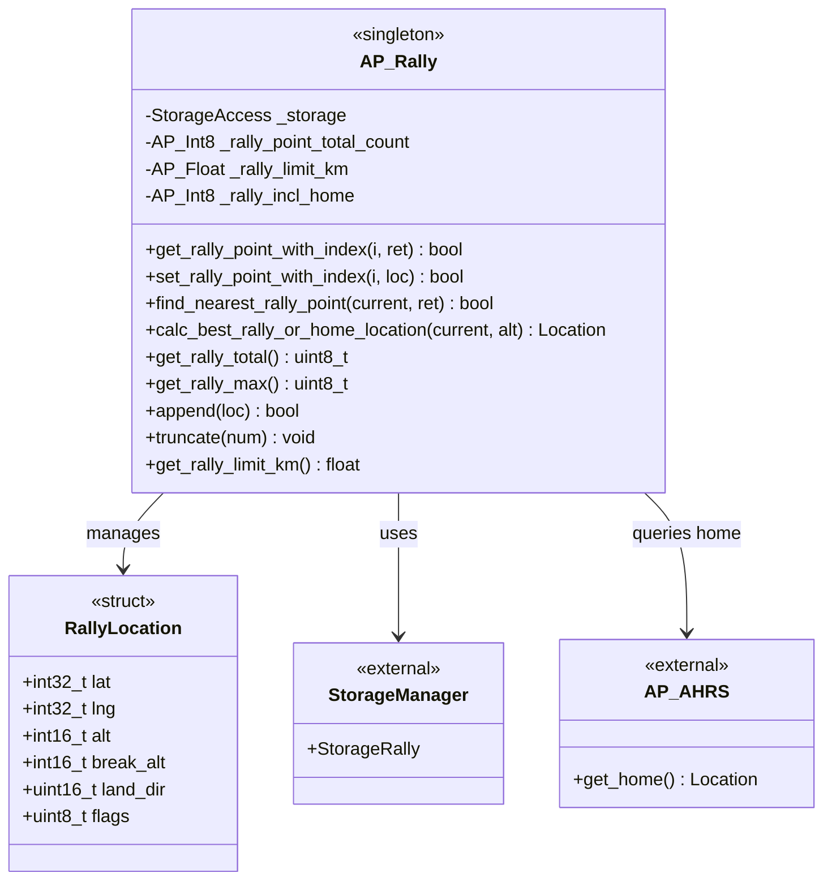
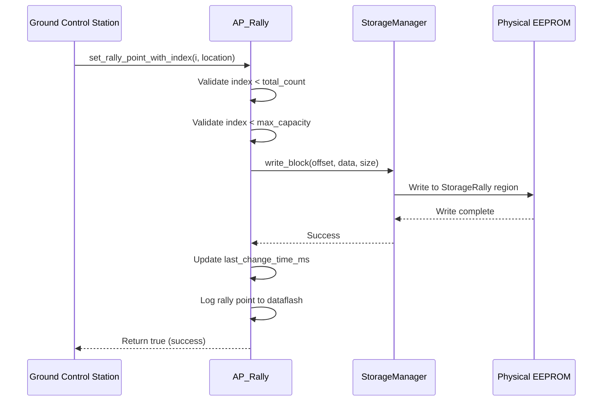
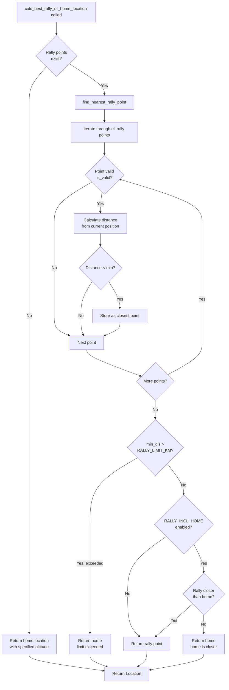
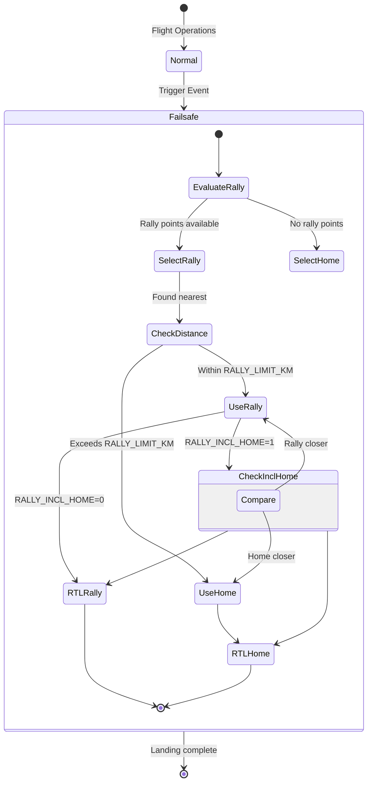

# AP_Rally Library


## Table of Contents
- [Overview](#overview)
- [Architecture](#architecture)
- [Rally Point Structure](#rally-point-structure)
- [Storage and Retrieval](#storage-and-retrieval)
- [Selection Logic](#selection-logic)
- [Altitude Handling](#altitude-handling)
- [Failsafe Integration](#failsafe-integration)
- [Configuration Parameters](#configuration-parameters)
- [API Reference](#api-reference)
- [Usage Examples](#usage-examples)
- [Testing](#testing)

## Overview

The AP_Rally library manages rally points - alternative safe landing or return-to-launch (RTL) locations that provide flexibility and safety in autonomous flight operations. Rally points allow vehicles to return to pre-defined safe locations other than the home position, which is particularly useful in scenarios where the launch location may not be suitable for landing or when multiple safe landing zones are available.

**Primary Responsibilities:**
- Store and retrieve rally point locations from persistent storage (EEPROM)
- Calculate the nearest or most appropriate rally point based on current vehicle position
- Provide intelligent selection logic that considers distance limits and home position
- Support altitude frames and auto-landing configurations
- Integrate with vehicle failsafe and RTL systems

**Key Features:**
- Persistent storage of up to 255 rally points (hardware dependent)
- Distance-based filtering to prevent accidental use of stale rally points
- Optional inclusion of home position as a rally point candidate
- Support for multiple altitude reference frames (ABOVE_HOME, ABSOLUTE, etc.)
- Auto-landing configuration with break altitude and landing direction
- Vehicle-specific default configurations (Copter, Plane, Rover)

**Source Files:**
- `/libraries/AP_Rally/AP_Rally.h` - Class definition and RallyLocation structure
- `/libraries/AP_Rally/AP_Rally.cpp` - Implementation of storage and selection logic
- `/libraries/AP_Rally/AP_Rally_config.h` - Feature configuration

## Architecture

The AP_Rally library follows a singleton pattern and integrates with ArduPilot's StorageManager for persistent data storage.



### System Integration

The AP_Rally library integrates with several core ArduPilot systems:

1. **StorageManager**: Provides persistent EEPROM storage for rally point data
2. **AP_AHRS**: Supplies home position for comparison and fallback
3. **AP_Param**: Manages configuration parameters
4. **Vehicle RTL Modes**: Called during return-to-launch to select destination
5. **Failsafe Systems**: Provides safe landing alternatives during failures
6. **GCS/MAVLink**: Receives rally point updates from ground control stations

## Rally Point Structure

Rally points are stored using the `RallyLocation` structure, which is tightly packed for efficient storage:

```cpp
struct PACKED RallyLocation {
    int32_t lat;        // Latitude * 10^7 (degrees)
    int32_t lng;        // Longitude * 10^7 (degrees)
    int16_t alt;        // Transit/loiter altitude in meters
    int16_t break_alt;  // Auto-land break altitude in meters
    uint16_t land_dir;   // Landing direction in centidegrees (0-36000)
    uint8_t flags;      // Bit-packed configuration flags
};
```

**Source:** `/libraries/AP_Rally/AP_Rally.h:27-43`

### Field Descriptions

| Field | Type | Description | Units | Range |
|-------|------|-------------|-------|-------|
| `lat` | int32_t | Latitude coordinate | degrees × 10⁷ | -900000000 to 900000000 |
| `lng` | int32_t | Longitude coordinate | degrees × 10⁷ | -1800000000 to 1800000000 |
| `alt` | int16_t | Transit and loiter altitude | meters | -32768 to 32767 |
| `break_alt` | int16_t | Altitude to break from loiter for auto-landing | meters | -32768 to 32767 |
| `land_dir` | uint16_t | Preferred landing direction | centidegrees | 0 to 36000 |
| `flags` | uint8_t | Configuration bit field | - | See below |

### Flag Bits

The `flags` field contains bit-packed configuration options:

- **Bit 0 (`favorable_winds`)**: When set, consider wind direction when selecting landing rally point
- **Bit 1 (`do_auto_land`)**: When set, automatically initiate landing sequence after reaching rally point
- **Bit 2 (`alt_frame_valid`)**: When set, use `alt_frame` value; otherwise default to `ABOVE_HOME`
- **Bits 3-4 (`alt_frame`)**: Altitude frame following `Location::AltFrame` enum (if `alt_frame_valid` is set)
- **Bits 5-7 (`unused`)**: Reserved for future use

**Supported Altitude Frames:**
- `ABOVE_HOME`: Altitude relative to home position
- `ABSOLUTE`: Altitude relative to mean sea level (AMSL)
- `ABOVE_TERRAIN`: Altitude relative to ground level (requires terrain database)
- `ABOVE_ORIGIN`: Altitude relative to EKF origin

## Storage and Retrieval

Rally points are stored in persistent EEPROM storage through the ArduPilot StorageManager system, ensuring they survive power cycles and reboots.

### Storage Architecture



### Storage Methods

#### Retrieving Rally Points

```cpp
/**
 * @brief Retrieve a rally point from EEPROM storage
 * 
 * @param[in]  i    Rally point index (0-based)
 * @param[out] ret  RallyLocation structure to populate
 * 
 * @return true if rally point retrieved successfully, false if index invalid or data corrupt
 * 
 * @note Source: /libraries/AP_Rally/AP_Rally.cpp:69-82
 */
bool get_rally_point_with_index(uint8_t i, RallyLocation &ret) const;
```

**Implementation Details:**
- Validates index against `_rally_point_total_count`
- Reads from EEPROM at calculated offset: `i * sizeof(RallyLocation)`
- Performs sanity check: rejects points with lat=0 and lng=0
- Returns false for invalid indices or corrupt data

#### Storing Rally Points

```cpp
/**
 * @brief Save a rally point to EEPROM storage
 * 
 * @param[in] i         Rally point index (0-based)
 * @param[in] rallyLoc  RallyLocation structure to save
 * 
 * @return true if rally point saved successfully, false if index invalid
 * 
 * @pre RALLY_TOTAL parameter should be set to include this index
 * @note Updates last_change_time_ms timestamp
 * @note Logs rally point to dataflash if logging enabled
 * 
 * @warning Source: /libraries/AP_Rally/AP_Rally.cpp:105-124
 */
bool set_rally_point_with_index(uint8_t i, const RallyLocation &rallyLoc);
```

**Implementation Details:**
- Validates index against both `_rally_point_total_count` and storage capacity
- Writes to EEPROM at calculated offset
- Updates modification timestamp for change detection
- Logs to AP_Logger for flight analysis

#### Appending Rally Points

```cpp
/**
 * @brief Append a new rally point to the end of the list
 * 
 * @param[in] loc  RallyLocation to append
 * 
 * @return true if successfully appended, false if storage full
 * 
 * @note Automatically increments RALLY_TOTAL parameter
 * @note Source: /libraries/AP_Rally/AP_Rally.cpp:93-102
 */
bool append(const RallyLocation &loc);
```

### Storage Capacity

The maximum number of rally points is determined by available EEPROM space:

```cpp
uint8_t get_rally_max(void) const {
    const uint16_t ret = _storage.size() / uint16_t(sizeof(RallyLocation));
    return (ret > 255) ? 255 : (uint8_t)ret;
}
```

- Rally point size: 15 bytes (enforced by `ASSERT_STORAGE_SIZE`)
- Maximum count: Lesser of storage size / 15 or 255
- Typical capacity: Hardware dependent (varies by autopilot board)

## Selection Logic

The AP_Rally library implements intelligent selection logic to choose the most appropriate rally point for RTL operations, with safety checks to prevent accidental use of stale or distant rally points.

### Rally Point Selection Flow



### Selection Algorithm

The selection process follows this prioritized logic:

1. **Find Nearest Valid Rally Point**
   - Iterate through all stored rally points
   - Calculate distance from current position using `Location::get_distance()`
   - Track the minimum distance and corresponding rally point
   - Apply vehicle-specific validity checks via `is_valid()` (extensible)

2. **Apply Distance Limit Check**
   - If `RALLY_LIMIT_KM > 0` and closest rally point exceeds this distance
   - AND home position is closer than any rally point
   - THEN return home position instead
   - **Purpose**: Prevents accidental use of rally points from previous flight locations

3. **Consider Home Position**
   - If `RALLY_INCL_HOME = 1`, compare rally point distance with home distance
   - If home is closer, use home position
   - If `RALLY_INCL_HOME = 0`, always prefer rally point if found

### Implementation Details

**Source:** `/libraries/AP_Rally/AP_Rally.cpp:141-166` (find_nearest_rally_point)
**Source:** `/libraries/AP_Rally/AP_Rally.cpp:169-185` (calc_best_rally_or_home_location)

```cpp
// Find nearest rally point
bool find_nearest_rally_point(const Location &current_loc, RallyLocation &return_loc) const {
    float min_dis = -1;  // -1 indicates no point found yet
    
    // Search through all rally points
    for (uint8_t i = 0; i < _rally_point_total_count; i++) {
        RallyLocation next_rally;
        if (!get_rally_point_with_index(i, next_rally)) {
            continue;  // Skip invalid points
        }
        
        Location rally_loc = rally_location_to_location(next_rally);
        float dis = current_loc.get_distance(rally_loc);
        
        // Update minimum if this point is valid and closer
        if (is_valid(rally_loc) && (dis < min_dis || min_dis < 0)) {
            min_dis = dis;
            return_loc = next_rally;
        }
    }
    
    // Apply distance limit check
    if ((_rally_limit_km > 0) && (min_dis > _rally_limit_km * 1000.0f)) {
        return false;  // Rally point too far, use home
    }
    
    return min_dis >= 0;  // Return true if any point was found
}
```

### Distance Limit Safety Feature

The `RALLY_LIMIT_KM` parameter provides critical safety by preventing the vehicle from flying to an old rally point left over from a previous flight at a different location.

**Scenario Example:**
1. Operator sets rally points at Airfield A
2. Vehicle is transported to Airfield B for next flight
3. Operator forgets to clear or update rally points
4. Without distance limit: Vehicle would RTL to distant Airfield A (dangerous)
5. With distance limit: Vehicle recognizes all rally points exceed limit and uses home (safe)

**Default Values by Vehicle Type:**
- **Copter/Heli**: 0.3 km (300 meters) - Short range, rally points should be nearby
- **Plane**: 5.0 km - Longer range, rally points may be farther from launch
- **Rover**: 0.5 km - Medium range for ground vehicles
- **Other**: 1.0 km - Conservative default

## Altitude Handling

Rally points support multiple altitude reference frames to accommodate different operational requirements and terrain conditions.

### Altitude Frame Selection

The altitude frame is determined by the `alt_frame_valid` and `alt_frame` flags in the RallyLocation structure:

```cpp
Location rally_location_to_location(const RallyLocation &rally_loc) const {
    Location ret {
        rally_loc.lat,
        rally_loc.lng,
        rally_loc.alt * 100,  // Convert meters to centimeters
        (rally_loc.alt_frame_valid == 1) ? 
            Location::AltFrame(rally_loc.alt_frame) : 
            Location::AltFrame::ABOVE_HOME  // Default fallback
    };
    return ret;
}
```

**Source:** `/libraries/AP_Rally/AP_Rally.cpp:127-138`

### Altitude Frame Types

| Frame Type | Description | Use Case | Safety Considerations |
|------------|-------------|----------|----------------------|
| **ABOVE_HOME** | Relative to home altitude | Default for most operations | Requires valid home position |
| **ABSOLUTE** | Mean Sea Level (MSL) | Fixed altitude regardless of terrain | Requires accurate barometer calibration |
| **ABOVE_TERRAIN** | Relative to ground level | Varying terrain operations | Requires terrain database or rangefinder |
| **ABOVE_ORIGIN** | Relative to EKF origin | Advanced applications | EKF origin must be stable |

### Altitude Fields

Rally points contain two altitude-related fields:

1. **`alt` (Transit Altitude)**
   - Altitude at which vehicle loiters upon reaching rally point
   - Used for both transit to rally point and loiter phase
   - Stored in meters, converted to centimeters internally

2. **`break_alt` (Break Altitude)**
   - Altitude at which vehicle exits loiter and begins descent
   - Used during auto-landing sequence
   - Only applicable when `do_auto_land` flag is set
   - Allows controlled descent from loiter to landing

### Auto-Landing Configuration

When configured for auto-landing, rally points support additional parameters:

```cpp
struct RallyLocation {
    // ... position fields ...
    int16_t break_alt;    // Altitude to begin descent (meters)
    uint16_t land_dir;    // Landing direction (centidegrees)
    struct {
        uint8_t favorable_winds : 1;  // Consider wind in landing direction
        uint8_t do_auto_land    : 1;  // Enable auto-landing at this rally point
        // ... other flags ...
    };
};
```

**Auto-Landing Sequence:**
1. Vehicle flies to rally point at `alt` altitude
2. Enters loiter pattern at rally point
3. When ready to land, descends to `break_alt`
4. Exits loiter and initiates landing approach
5. Aligns with `land_dir` (considers `favorable_winds` if enabled)
6. Executes landing sequence

## Failsafe Integration

The AP_Rally library plays a critical role in vehicle failsafe systems by providing alternative safe landing locations when the home position is not suitable or accessible.

### Failsafe Scenarios Using Rally Points



### Common Failsafe Triggers

Rally points provide safe return destinations for various failsafe conditions:

1. **Radio Loss Failsafe**
   - Loss of RC transmitter signal
   - Vehicle returns to nearest rally point or home
   - Rally point may be closer than home position

2. **Battery Failsafe**
   - Low battery voltage or remaining capacity
   - Critical to select nearest safe landing location
   - Rally points may provide closer landing option

3. **GCS Loss Failsafe**
   - Loss of ground control station telemetry
   - Autonomous return to pre-defined safe location
   - Rally points configured before flight

4. **EKF/GPS Failsafe**
   - Navigation system degradation
   - Return to known good location
   - Rally points provide alternatives if home unreachable

5. **Geofence Breach**
   - Vehicle exits defined boundary
   - Immediate return to safe zone
   - Rally points may be within safe zone when home is not

### Integration with Vehicle RTL Modes

Rally point selection is typically called from vehicle-specific RTL (Return to Launch) mode implementations:

**Copter Example:**
```cpp
// In ArduCopter RTL mode
Location rally_loc = rally.calc_best_rally_or_home_location(current_loc, rtl_alt);
set_destination(rally_loc);
```

**Plane Example:**
```cpp
// In ArduPlane RTL mode
Location best_loc = rally.calc_best_rally_or_home_location(current_loc, target_alt);
navigate_to_location(best_loc);
```

### Safety Considerations

**Critical Safety Features:**
- **Distance validation**: Prevents flying to distant stale rally points
- **Home fallback**: Always provides home as ultimate fallback
- **Persistent storage**: Rally points survive power cycles
- **Change detection**: `last_change_time_ms()` allows external systems to detect updates
- **Sanity checking**: Rejects rally points with zero coordinates

**Thread Safety:**
- Rally point retrieval is read-only and thread-safe
- Rally point updates should be performed from main thread
- Storage operations are atomic at the StorageManager level

**Timing Constraints:**
- Rally point selection executes quickly (microseconds)
- EEPROM writes are non-blocking via StorageManager
- No real-time constraints on selection algorithm

## Configuration Parameters

The AP_Rally library exposes three configuration parameters through the ArduPilot parameter system.

### Parameter Definitions

#### RALLY_TOTAL

```cpp
// @Param: RALLY_TOTAL
// @DisplayName: Rally Total
// @Description: Number of rally points currently loaded
// @User: Advanced
```

**Source:** `/libraries/AP_Rally/AP_Rally.cpp:30-34`

- **Type**: Integer (uint8_t)
- **Range**: 0 to 255
- **Default**: 0
- **Access**: Advanced user
- **Description**: Total count of rally points currently stored in EEPROM. This parameter is automatically updated when rally points are added or removed via ground control station. Users typically do not modify this directly.

#### RALLY_LIMIT_KM

```cpp
// @Param: RALLY_LIMIT_KM
// @DisplayName: Rally Limit
// @Description: Maximum distance to rally point. If the closest rally point is more 
//               than this number of kilometers from the current position and the home 
//               location is closer than any of the rally points, then RTL to home 
//               rather than to the closest rally point. This prevents a leftover rally 
//               point from a different airfield being used accidentally. If set to 0, 
//               the closest rally point is always used.
// @User: Advanced
// @Units: km
// @Increment: 0.1
```

**Source:** `/libraries/AP_Rally/AP_Rally.cpp:36-42`

- **Type**: Float
- **Units**: Kilometers
- **Range**: 0.0 to unlimited
- **Increment**: 0.1 km
- **Default**: Vehicle-specific
  - Copter/Heli: 0.3 km
  - Plane: 5.0 km
  - Rover: 0.5 km
  - Other: 1.0 km
- **Access**: Advanced user
- **Special**: Setting to 0 disables distance limiting (always use closest rally point)

**Usage Recommendations:**
- Set based on typical flight range and operational area size
- Should be larger than your normal flight radius
- Should be smaller than distance to other airfields
- Consider increasing for long-range plane operations
- Consider decreasing for confined urban copter operations

#### RALLY_INCL_HOME

```cpp
// @Param: RALLY_INCL_HOME
// @DisplayName: Rally Include Home
// @Description: Controls if Home is included as a Rally point (i.e. as a safe landing 
//               place) for RTL
// @User: Standard
// @Values: 0:DoNotIncludeHome,1:IncludeHome
```

**Source:** `/libraries/AP_Rally/AP_Rally.cpp:44-49`

- **Type**: Integer (boolean)
- **Range**: 0 or 1
- **Default**: Vehicle-specific
  - Copter/Heli: 1 (Include home)
  - Plane: 0 (Do not include home)
  - Rover: 1 (Include home)
  - Other: 0 (Do not include home)
- **Access**: Standard user
- **Values**:
  - `0`: Do not consider home position, always use rally points if available
  - `1`: Consider home position as a candidate, use if closer than rally points

**Configuration Philosophy:**

**When to use RALLY_INCL_HOME = 1:**
- Copters: Home is typically a suitable landing location
- Launch/landing site is same location
- Home position is safe for landing
- Want closest option between home and rally points

**When to use RALLY_INCL_HOME = 0:**
- Planes: Home may not be suitable for landing (hand launch sites, catapults)
- Launch site different from landing site
- Rally points are specifically chosen landing zones
- Always want to use designated rally points when available

### Parameter Access Examples

```cpp
// Get current rally point count
uint8_t total = rally.get_rally_total();

// Get distance limit
float limit_km = rally.get_rally_limit_km();

// Check if home should be included (requires parameter access)
// This is handled internally by calc_best_rally_or_home_location()
```

## API Reference

### Core Methods

#### Constructor

```cpp
/**
 * @brief Initialize AP_Rally singleton
 * 
 * @note Creates singleton instance and sets up AP_Param defaults
 * @note Source: /libraries/AP_Rally/AP_Rally.cpp:55-66
 */
AP_Rally::AP_Rally();
```

#### Rally Point Retrieval

```cpp
/**
 * @brief Retrieve a rally point from storage by index
 * 
 * @param[in]  i    Zero-based index of rally point (0 to RALLY_TOTAL-1)
 * @param[out] ret  RallyLocation structure to populate with data
 * 
 * @return true if rally point successfully retrieved, false if:
 *         - Index >= total count
 *         - Rally point data is corrupt (lat=0, lng=0)
 * 
 * @note Performs sanity check on retrieved data
 * @note Thread-safe for reading
 * @note Source: /libraries/AP_Rally/AP_Rally.cpp:69-82
 */
bool get_rally_point_with_index(uint8_t i, RallyLocation &ret) const;
```

#### Rally Point Storage

```cpp
/**
 * @brief Store a rally point to EEPROM at specified index
 * 
 * @param[in] i         Zero-based index for storage location
 * @param[in] rallyLoc  RallyLocation structure containing point data
 * 
 * @return true if successfully stored, false if:
 *         - Index >= RALLY_TOTAL
 *         - Index >= storage capacity
 * 
 * @pre RALLY_TOTAL parameter must be set to include this index
 * @post Updates last_change_time_ms timestamp
 * @post Logs rally point to dataflash if logging enabled
 * 
 * @note Source: /libraries/AP_Rally/AP_Rally.cpp:105-124
 * @warning Should only be called from main thread
 */
bool set_rally_point_with_index(uint8_t i, const RallyLocation &rallyLoc);
```

#### Append Rally Point

```cpp
/**
 * @brief Append a new rally point to the end of the list
 * 
 * @param[in] loc  RallyLocation structure to append
 * 
 * @return true if successfully appended, false if storage full
 * 
 * @post Increments RALLY_TOTAL parameter if successful
 * @post Stores rally point via set_rally_point_with_index()
 * @post Rolls back RALLY_TOTAL if storage fails
 * 
 * @note Source: /libraries/AP_Rally/AP_Rally.cpp:93-102
 */
bool append(const RallyLocation &loc) WARN_IF_UNUSED;
```

#### Truncate Rally Points

```cpp
/**
 * @brief Reduce the number of rally points to specified count
 * 
 * @param[in] num  New total rally point count (must be <= current count)
 * 
 * @post Updates RALLY_TOTAL parameter
 * @note Does not erase data from EEPROM, only reduces count
 * @note Never increases count (silently ignores if num > current)
 * @note Source: /libraries/AP_Rally/AP_Rally.cpp:84-91
 */
void truncate(uint8_t num);
```

#### Find Nearest Rally Point

```cpp
/**
 * @brief Find the nearest rally point to a given location
 * 
 * @param[in]  myloc      Current vehicle location
 * @param[out] return_loc RallyLocation structure to populate with nearest point
 * 
 * @return true if valid rally point found, false if:
 *         - No rally points configured
 *         - All rally points exceed RALLY_LIMIT_KM (when limit > 0)
 *         - All rally points fail is_valid() check
 * 
 * @note Iterates through all rally points to find closest
 * @note Applies distance limit check if configured
 * @note Uses 2D horizontal distance for comparison
 * @note Source: /libraries/AP_Rally/AP_Rally.cpp:141-166
 */
bool find_nearest_rally_point(const Location &current_loc, RallyLocation &return_loc) const;
```

#### Calculate Best Rally or Home

```cpp
/**
 * @brief Determine the best RTL destination (rally point or home)
 * 
 * @param[in] current_loc        Current vehicle location
 * @param[in] rtl_home_alt_amsl_cm  Desired RTL altitude for home in cm AMSL
 * 
 * @return Location structure containing selected destination
 *         - Rally point location if found and appropriate
 *         - Home location if no rally points or home is closer
 *         - Home location with specified altitude as fallback
 * 
 * @note Considers RALLY_INCL_HOME parameter
 * @note Applies RALLY_LIMIT_KM filtering
 * @note Always returns a valid location (never fails)
 * @note Source: /libraries/AP_Rally/AP_Rally.cpp:169-185
 */
Location calc_best_rally_or_home_location(const Location &current_loc, 
                                          float rtl_home_alt_amsl_cm) const;
```

#### Helper Methods

```cpp
/**
 * @brief Convert RallyLocation structure to Location object
 * 
 * @param[in] rally_loc  RallyLocation to convert
 * 
 * @return Location object with converted coordinates and altitude frame
 * 
 * @note Converts altitude from meters to centimeters
 * @note Applies altitude frame from flags or defaults to ABOVE_HOME
 * @note Source: /libraries/AP_Rally/AP_Rally.cpp:127-138
 */
Location rally_location_to_location(const RallyLocation &ret) const;

/**
 * @brief Get total number of rally points currently loaded
 * 
 * @return Rally point count (0-255)
 * 
 * @note Source: /libraries/AP_Rally/AP_Rally.h:57-59
 */
uint8_t get_rally_total() const;

/**
 * @brief Get maximum rally point storage capacity
 * 
 * @return Maximum number of rally points that can be stored
 * 
 * @note Based on available EEPROM storage
 * @note Capped at 255 even if more storage available
 * @note Source: /libraries/AP_Rally/AP_Rally.h:60-66
 */
uint8_t get_rally_max() const;

/**
 * @brief Get configured rally point distance limit
 * 
 * @return Distance limit in kilometers, 0 if disabled
 * 
 * @note Source: /libraries/AP_Rally/AP_Rally.h:72
 */
float get_rally_limit_km() const;

/**
 * @brief Get timestamp of last rally point modification
 * 
 * @return Millisecond timestamp from AP_HAL::millis()
 * 
 * @note Initial value is 0xFFFFFFFF (indicates no changes yet)
 * @note Updated whenever rally points are modified
 * @note Useful for detecting changes from external systems
 * @note Source: /libraries/AP_Rally/AP_Rally.h:81
 */
uint32_t last_change_time_ms() const;
```

### Singleton Access

```cpp
/**
 * @brief Get AP_Rally singleton instance
 * 
 * @return Pointer to AP_Rally singleton, or nullptr if not initialized
 * 
 * @note Source: /libraries/AP_Rally/AP_Rally.h:87
 */
static AP_Rally *get_singleton();

/**
 * @brief Convenience function to access AP_Rally singleton
 * 
 * @return Pointer to AP_Rally singleton
 * 
 * @note Preferred access method: AP::rally()
 * @note Source: /libraries/AP_Rally/AP_Rally.h:105-107
 */
namespace AP {
    AP_Rally *rally();
}
```

### Virtual Methods (Extensibility)

```cpp
/**
 * @brief Validate if a rally point location is acceptable
 * 
 * @param[in] rally_point  Location to validate
 * 
 * @return true if location is valid and acceptable
 * 
 * @note Default implementation always returns true
 * @note Vehicle-specific classes can override for custom validation
 * @note Example: Reject rally points over water for land vehicles
 * @note Source: /libraries/AP_Rally/AP_Rally.h:93
 */
virtual bool is_valid(const Location &rally_point) const;
```

## Usage Examples

### Example 1: Basic Rally Point Configuration

```cpp
// Access the rally singleton
AP_Rally *rally = AP::rally();

// Check current rally point count
uint8_t count = rally->get_rally_total();
hal.console->printf("Currently have %u rally points\n", count);

// Create a new rally point
RallyLocation new_rally;
new_rally.lat = -353632620;  // -35.3632620 degrees * 10^7
new_rally.lng = 1491509840;  // 149.1509840 degrees * 10^7
new_rally.alt = 100;          // 100 meters altitude
new_rally.break_alt = 50;     // Break from loiter at 50m
new_rally.land_dir = 9000;    // Land heading east (90 degrees * 100)
new_rally.flags = 0;          // Clear all flags
new_rally.alt_frame_valid = 1;
new_rally.alt_frame = (uint8_t)Location::AltFrame::ABOVE_HOME;
new_rally.do_auto_land = 0;   // Manual landing

// Append the rally point
if (rally->append(new_rally)) {
    hal.console->printf("Rally point added successfully\n");
} else {
    hal.console->printf("Failed to add rally point (storage full?)\n");
}
```

### Example 2: RTL Destination Selection

```cpp
// Get current vehicle position
Location current_loc = AP::ahrs().get_position();

// Get desired RTL altitude in centimeters AMSL
float rtl_alt_cm = 10000.0f;  // 100 meters

// Calculate best destination (rally point or home)
Location destination = AP::rally()->calc_best_rally_or_home_location(
    current_loc, 
    rtl_alt_cm
);

// Navigate to the selected destination
if (destination.same_latlon_as(AP::ahrs().get_home())) {
    hal.console->printf("Returning to HOME\n");
} else {
    hal.console->printf("Returning to RALLY POINT\n");
}

// Set as navigation target
set_target_location(destination);
```

### Example 3: Checking for Rally Point Updates

```cpp
// Store the last known change time
static uint32_t last_rally_check_ms = 0;

// Check if rally points have been modified
uint32_t current_change_time = AP::rally()->last_change_time_ms();

if (current_change_time != last_rally_check_ms) {
    // Rally points have been updated
    hal.console->printf("Rally points modified, revalidating mission\n");
    
    // Update our stored time
    last_rally_check_ms = current_change_time;
    
    // Perform any necessary updates
    recalculate_mission_parameters();
}
```

### Example 4: Iterating Through All Rally Points

```cpp
AP_Rally *rally = AP::rally();
uint8_t total = rally->get_rally_total();

hal.console->printf("=== Rally Points (%u total) ===\n", total);

for (uint8_t i = 0; i < total; i++) {
    RallyLocation rally_loc;
    if (rally->get_rally_point_with_index(i, rally_loc)) {
        // Convert to Location for easier manipulation
        Location loc = rally->rally_location_to_location(rally_loc);
        
        // Print rally point information
        hal.console->printf("Rally %u: Lat=%.7f Lng=%.7f Alt=%dm",
            i,
            rally_loc.lat / 1.0e7,
            rally_loc.lng / 1.0e7,
            rally_loc.alt);
        
        if (rally_loc.do_auto_land) {
            hal.console->printf(" AUTO_LAND break_alt=%dm dir=%u°",
                rally_loc.break_alt,
                rally_loc.land_dir / 100);
        }
        
        hal.console->printf("\n");
    }
}
```

### Example 5: Advanced Rally Point with Auto-Landing

```cpp
// Create a rally point configured for automatic landing
RallyLocation landing_rally;

// Position: Near runway threshold
landing_rally.lat = -353640000;  // Latitude
landing_rally.lng = 1491500000;  // Longitude

// Altitudes for landing pattern
landing_rally.alt = 120;         // Loiter at 120m AGL
landing_rally.break_alt = 60;    // Descend from loiter at 60m

// Landing configuration
landing_rally.land_dir = 27000;  // Land towards west (270°)
landing_rally.flags = 0;
landing_rally.do_auto_land = 1;       // Enable auto-landing
landing_rally.favorable_winds = 1;    // Consider wind direction
landing_rally.alt_frame_valid = 1;
landing_rally.alt_frame = (uint8_t)Location::AltFrame::ABOVE_HOME;

// Add to rally point list
if (AP::rally()->append(landing_rally)) {
    hal.console->printf("Auto-landing rally point configured\n");
}
```

### Example 6: Vehicle-Specific Rally Validation

```cpp
// Example of extending AP_Rally with custom validation
class AP_Rally_Copter : public AP_Rally {
protected:
    // Override validation for copter-specific checks
    bool is_valid(const Location &rally_point) const override {
        // Check if rally point is within geofence
        if (!fence.check_location(rally_point)) {
            return false;
        }
        
        // Check if rally point has valid altitude
        if (rally_point.alt() < 0) {
            return false;  // No underground rally points
        }
        
        // Check terrain clearance if terrain data available
        #if AP_TERRAIN_AVAILABLE
        float terrain_alt;
        if (terrain.height_amsl(rally_point, terrain_alt, true)) {
            if (rally_point.alt() < terrain_alt + 10.0f) {
                return false;  // Must be at least 10m above terrain
            }
        }
        #endif
        
        return true;
    }
};
```

## Testing

### Unit Testing

Rally point functionality can be tested using the ArduPilot autotest framework:

```bash
# Run SITL with rally point tests
cd ArduPilot
./Tools/autotest/autotest.py --vehicle=Copter --test=Rally

# Or test specific rally point scenarios
./Tools/autotest/autotest.py --vehicle=Plane --test=RallyRTL
```

### Manual Testing in SITL

**Setup Rally Points in SITL:**

1. Launch SITL simulator:
   ```bash
   cd ArduCopter
   ../Tools/autotest/sim_vehicle.py -v ArduCopter --console --map
   ```

2. In MAVProxy, set parameters:
   ```
   param set RALLY_LIMIT_KM 2.0
   param set RALLY_INCL_HOME 1
   ```

3. Add rally points via MAVProxy:
   ```
   rally add -35.363261 149.165230 100
   rally add -35.362800 149.164500 100
   rally list
   ```

4. Test RTL with rally points:
   ```
   arm throttle
   mode GUIDED
   takeoff 50
   mode RTL
   ```

5. Observe vehicle returning to nearest rally point

### Parameter Testing Scenarios

**Test Scenario 1: Distance Limit Enforcement**
```
1. Set RALLY_LIMIT_KM 0.5
2. Add rally point 1km away
3. Trigger RTL from nearby location
4. Expected: Vehicle returns to HOME (rally point too far)
```

**Test Scenario 2: Include Home Comparison**
```
1. Set RALLY_INCL_HOME 1
2. Add rally point 500m north
3. Fly 200m south of home
4. Trigger RTL
5. Expected: Vehicle returns to HOME (closer than rally)
```

**Test Scenario 3: Rally Point Priority**
```
1. Set RALLY_INCL_HOME 0
2. Add rally point 800m away
3. Position 200m from home, 600m from rally
4. Trigger RTL
5. Expected: Vehicle returns to RALLY (home not considered)
```

### Validation Checklist

- [ ] Rally points persist across reboot
- [ ] RALLY_TOTAL updates correctly when points added/removed
- [ ] Distance calculations use horizontal 2D distance
- [ ] RALLY_LIMIT_KM prevents use of distant points
- [ ] RALLY_INCL_HOME correctly influences selection
- [ ] Invalid rally points (0,0) are rejected
- [ ] Storage capacity limits are enforced
- [ ] last_change_time_ms updates on modifications
- [ ] Rally points log to dataflash correctly
- [ ] Altitude frames are respected in calculations
- [ ] Auto-land flags are preserved in storage

### Ground Control Station Testing

Most rally point configuration is performed via ground control stations:

**Mission Planner:**
- Use "Rally Points" screen to add/remove/modify points
- View rally points on map
- Test distance calculations
- Verify parameter updates

**QGroundControl:**
- Rally points in "Plan View"
- Upload/download rally point lists
- Real-time validation of positions

**MAVProxy:**
```bash
# Rally point commands
rally list                    # List all rally points
rally add LAT LON ALT        # Add new rally point
rally remove INDEX           # Remove rally point
rally clear                  # Remove all rally points
rally status                 # Show rally point parameters
```

## Contributing

When modifying the AP_Rally library, please ensure:

1. **Maintain Storage Format**: The RallyLocation structure size is critical (15 bytes). Changes require migration code.

2. **Preserve Safety Features**: Distance limiting and home fallback logic are safety-critical.

3. **Update Documentation**: Keep this README synchronized with code changes.

4. **Add Tests**: Include autotest scenarios for new features.

5. **Parameter Compatibility**: Maintain backward compatibility with existing parameter files.

6. **Log Changes**: Update RallyPoint logging if structure changes.

**Key Files to Review:**
- `/libraries/AP_Rally/AP_Rally.h` - Public API and structure definitions
- `/libraries/AP_Rally/AP_Rally.cpp` - Implementation logic
- `/libraries/AP_Logger/LogStructure.h` - Logging format
- `/libraries/StorageManager/StorageManager.h` - Storage allocation
- `/ArduCopter/mode_rtl.cpp` - Example vehicle integration
- `/ArduPlane/mode_rtl.cpp` - Plane-specific RTL usage

---

**Documentation Version:** 1.0  
**Last Updated:** 2024  
**Covers ArduPilot Version:** 4.x and later  
**License:** GPLv3
