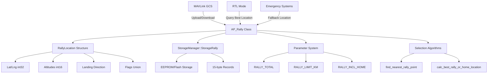
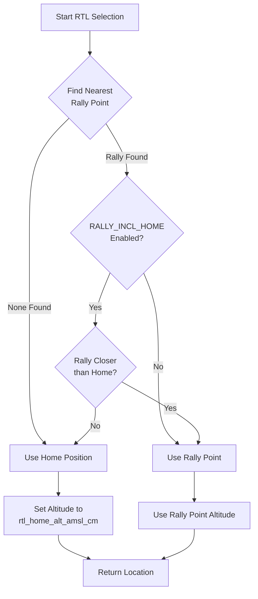

# AP_Rally - Rally Point System

## Overview

The AP_Rally library manages rally points - alternative safe landing locations for Return To Launch (RTL) operations in ArduPilot. Rally points provide flexibility beyond the home position by allowing pilots to designate multiple pre-surveyed landing sites. When RTL is triggered, the vehicle intelligently selects the nearest appropriate rally point or home position based on distance limits and configuration parameters, enabling safer emergency returns especially in complex operational environments with multiple suitable landing areas.

## Architecture

The AP_Rally library consists of three main components that work together to provide persistent rally point storage, retrieval, and intelligent selection algorithms:



## Key Components

### RallyLocation Structure

The `RallyLocation` structure defines the packed 15-byte persistent storage format for rally points:

- **Purpose**: Compact binary representation for efficient EEPROM/flash storage
- **Size**: Exactly 15 bytes (verified by ASSERT_STORAGE_SIZE at runtime)
- **Lifecycle**: Created during upload, stored persistently, retrieved for RTL operations
- **Thread Safety**: Access controlled through AP_Rally singleton methods

**Structure Fields**:
- `lat` (int32_t): Latitude × 10^7 (standard ArduPilot coordinate format)
- `lng` (int32_t): Longitude × 10^7 (standard ArduPilot coordinate format)
- `alt` (int16_t): Transit and loiter altitude in meters (absolute or frame-relative)
- `break_alt` (int16_t): Altitude in meters to break from loiter and begin final approach (for auto-landing)
- `land_dir` (uint16_t): Desired landing direction in centidegrees (0-35999, where 0=North, 9000=East)
- `flags` (union): 8-bit packed flags controlling behavior:
  - `favorable_winds` (bit 0): Reserved for future wind-aware landing selection
  - `do_auto_land` (bit 1): Enable automatic landing sequence after reaching rally point
  - `alt_frame_valid` (bit 2): When true, use alt_frame value; when false, default to ABOVE_HOME
  - `alt_frame` (bits 3-4): Altitude frame from Location::AltFrame enum (ABSOLUTE, ABOVE_HOME, ABOVE_ORIGIN, ABOVE_TERRAIN)
  - `unused` (bits 5-7): Reserved for future use

### AP_Rally Class

The `AP_Rally` class provides the primary interface for rally point management:

- **Purpose**: Singleton manager for rally point storage, retrieval, and selection logic
- **Lifecycle**: 
  - Initialization: Constructor called during vehicle startup, registers with parameter system
  - Usage: Accessed via `AP::rally()` singleton accessor throughout flight operations
  - Shutdown: Persists with vehicle lifetime (no explicit destruction)
- **Thread Safety**: All methods callable from main thread; storage operations use StorageManager's internal locking
- **Hardware Dependencies**: Requires StorageManager with StorageRally area configured (typically EEPROM or flash)

**Key Public Methods**:
- `get_rally_point_with_index(uint8_t i, RallyLocation &ret)`: Retrieve rally point by index
- `set_rally_point_with_index(uint8_t i, const RallyLocation &rallyLoc)`: Store rally point at specific index
- `append(const RallyLocation &loc)`: Add new rally point to end of list
- `truncate(uint8_t num)`: Reduce total rally point count
- `get_rally_total()`: Return number of currently loaded rally points
- `get_rally_max()`: Return maximum capacity based on storage size
- `find_nearest_rally_point(const Location &myloc, RallyLocation &ret)`: Find closest valid rally point
- `calc_best_rally_or_home_location(const Location &current_loc, float rtl_home_alt)`: Select optimal RTL destination
- `rally_location_to_location(const RallyLocation &ret)`: Convert RallyLocation to standard Location object
- `last_change_time_ms()`: Get timestamp of last rally point modification (for GCS synchronization)

**Protected Virtual Methods**:
- `is_valid(const Location &rally_point)`: Vehicle-specific validation hook (default: always valid)

### Storage Backend

Rally points are persistently stored using the StorageManager subsystem:

- **Storage Area**: `StorageManager::StorageRally` dedicated region
- **Record Format**: Fixed 15-byte RallyLocation structures written sequentially
- **Capacity Calculation**: `storage_size / sizeof(RallyLocation)` with maximum 255 points
- **Persistence**: Writes immediately persist to EEPROM/flash (subject to StorageManager wear-leveling)
- **Initialization**: Storage area pre-allocated during board initialization based on hwdef configuration

## Rally Point Storage and Management

### Index-Based Access Pattern

Rally points are accessed using zero-based indexing from 0 to (RALLY_TOTAL - 1):

- **Valid Range**: 0 ≤ index < RALLY_TOTAL
- **Bounds Checking**: All access methods validate index against RALLY_TOTAL parameter
- **Sequential Storage**: Rally points stored contiguously in storage backend at offset `index × 15 bytes`

### Capacity Management

The maximum number of rally points is determined by available storage:

```cpp
uint8_t max_rally_points = storage_size / sizeof(RallyLocation);
// Capped at 255 due to uint8_t index type
```

- **`get_rally_max()`**: Returns maximum capacity (never exceeds 255)
- **Storage Full Condition**: `set_rally_point_with_index()` returns false when index ≥ max capacity
- **Typical Capacity**: Depends on board configuration (commonly 10-50 points on flight controllers)

### Rally Point CRUD Operations

#### Reading Rally Points

**Method**: `bool get_rally_point_with_index(uint8_t i, RallyLocation &ret)`

- **Behavior**: Reads 15-byte RallyLocation from storage at specified index
- **Validation**: Returns false if index ≥ RALLY_TOTAL or if lat/lng are both zero (sanity check)
- **Performance**: Direct storage read, typically <1ms on most platforms
- **Thread Safety**: Safe to call from main thread during flight

#### Writing Rally Points

**Method**: `bool set_rally_point_with_index(uint8_t i, const RallyLocation &rallyLoc)`

- **Precondition**: RALLY_TOTAL parameter must be ≥ (i+1) before calling
- **Behavior**: Writes 15-byte RallyLocation to storage at specified index
- **Side Effects**:
  - Updates `_last_change_time_ms` timestamp for GCS synchronization
  - Logs Write_RallyPoint message if logging enabled
  - Triggers storage write (may cause brief EEPROM access delay)
- **Returns**: false if index out of bounds or exceeds storage capacity
- **MAVLink Protocol Note**: Ground stations typically increment RALLY_TOTAL first, then call this method

#### Appending Rally Points

**Method**: `bool append(const RallyLocation &loc)`

- **Behavior**: Atomically increments RALLY_TOTAL and writes new rally point at end of list
- **Rollback**: If write fails, RALLY_TOTAL is restored to previous value
- **Returns**: true on success, false if storage full or write fails
- **Usage**: Preferred method for adding rally points programmatically

#### Reducing Rally Point Count

**Method**: `void truncate(uint8_t num)`

- **Behavior**: Sets RALLY_TOTAL to specified value if smaller than current count
- **Safety**: Only reduces count, never increases (prevents accidental expansion)
- **Persistence**: Immediately saves new RALLY_TOTAL to parameter storage
- **Use Case**: Removing rally points from end of list or clearing all points (truncate to 0)

### MAVLink Upload Protocol

Ground stations upload rally points using the following sequence:

1. **Upload Start**: GCS sends target RALLY_TOTAL value (via parameter write)
2. **Point Upload**: For each point index 0 to RALLY_TOTAL-1:
   - GCS sends RALLY_POINT MAVLink message with index and RallyLocation data
   - Vehicle calls `set_rally_point_with_index()` to store point
3. **Verification**: GCS reads back points using RALLY_FETCH_POINT requests
4. **Synchronization**: `last_change_time_ms()` allows GCS to detect if rally points changed

**Important**: The protocol expects RALLY_TOTAL to be set before writing individual points, which is why `set_rally_point_with_index()` validates against the total count.

## Rally Point Selection Algorithms

### Finding the Nearest Rally Point

**Method**: `bool find_nearest_rally_point(const Location &myloc, RallyLocation &ret)`

**Algorithm**:
1. Initialize minimum distance to -1 (sentinel for "not found")
2. Iterate through all rally points (0 to RALLY_TOTAL-1):
   - Read each rally point from storage
   - Convert to Location object using `rally_location_to_location()`
   - Calculate distance using `Location::get_distance()` (2D horizontal distance in meters)
   - Validate using virtual `is_valid()` method (allows vehicle-specific constraints)
   - Update minimum if this point is closer and valid
3. Apply RALLY_LIMIT_KM constraint:
   - If minimum distance > RALLY_LIMIT_KM × 1000 meters, return false (use home instead)
   - This prevents using rally points from a previous flight at a different airfield
4. Return true if valid rally point found, false if none found or all beyond limit

**Distance Calculation**: Uses `Location::get_distance()` which computes 2D horizontal distance ignoring altitude differences. This ensures selection is based on horizontal proximity, not 3D distance.

**Vehicle-Specific Validation**: The `is_valid()` virtual method allows vehicles to reject rally points based on vehicle-specific criteria (e.g., terrain clearance, airspace restrictions). Default implementation always returns true.

### Selecting Best RTL Destination

**Method**: `Location calc_best_rally_or_home_location(const Location &current_loc, float rtl_home_alt_amsl_cm)`

**Selection Logic**:



**Algorithm Steps**:
1. **Default to Home**: Initialize return location with home position from AHRS
2. **Set Home Altitude**: Apply requested RTL altitude (rtl_home_alt_amsl_cm) in ABSOLUTE frame
3. **Search Rally Points**: Call `find_nearest_rally_point()` with current position
4. **Apply Selection Rules**:
   - If no valid rally point found (or all beyond RALLY_LIMIT_KM), use home
   - If RALLY_INCL_HOME = 0 (don't include home), always use rally if found
   - If RALLY_INCL_HOME = 1 (include home), compare distances:
     - Use rally point if closer to current position than home
     - Use home if home is closer (provides additional safety option)
5. **Return Selected Location**: Returns Location with appropriate altitude frame

**Altitude Handling**: Rally points define their own altitude (from `alt` field and `alt_frame`), while home location uses the passed `rtl_home_alt_amsl_cm` parameter to allow vehicle-specific RTL altitude calculation.

### RALLY_LIMIT_KM Distance Constraint

**Purpose**: Prevent accidental use of rally points from a different airfield

**Behavior**:
- If set to 0: Closest rally point always used (no distance limit)
- If set to positive value (km): Rally points beyond this distance are ignored
- When all rally points exceed limit: System falls back to home position (if closer)

**Vehicle-Specific Defaults**:
- **Copter/Helicopter**: 0.3 km (300 meters) - expects rally points very close to operating area
- **Plane**: 5.0 km - allows larger airfields and longer runways
- **Rover**: 0.5 km (500 meters) - moderate range for ground operations
- **Other Vehicles**: 1.0 km default

**Rationale**: Prevents dangerous scenario where a leftover rally point from a previous flight location causes RTL to a distant, inappropriate location. This is critical for portable vehicles that operate in different locations.

### RALLY_INCL_HOME Parameter

**Purpose**: Control whether home position is considered alongside rally points

**Values**:
- **0 (Do Not Include Home)**: Rally point always selected if any valid point exists within limit
- **1 (Include Home)**: Home position competes with rally points; closest location wins

**Vehicle-Specific Defaults**:
- **Copter/Helicopter**: 1 (Include Home) - home is typically a valid landing site
- **Plane**: 0 (Exclude Home) - home may not be suitable runway, prefer designated rally points
- **Rover**: 1 (Include Home) - home is usually accessible for ground vehicles
- **Other Vehicles**: 0 (Exclude Home) - conservative default

**Use Case**: Fixed-wing aircraft often take off from locations not suitable for landing (hand launch, catapult, rough field). Setting RALLY_INCL_HOME=0 ensures they RTL to surveyed landing strips, not the takeoff point.

## Altitude Frame Handling

### RallyLocation Altitude Storage

Rally point altitudes are stored internally as **int16 meters** with associated frame information:

- **`alt` field**: Primary altitude in meters (range: -32768 to +32767 meters)
- **`alt_frame_valid` flag**: Indicates whether explicit altitude frame is specified
- **`alt_frame` field**: 2-bit altitude frame selector when `alt_frame_valid = true`

### Altitude Frame Conversion

**Method**: `Location rally_location_to_location(const RallyLocation &rally_loc)`

**Conversion Logic**:
```cpp
// Altitude converted from meters to centimeters (× 100)
int32_t alt_cm = rally_loc.alt * 100;

// Frame selection
Location::AltFrame frame;
if (rally_loc.alt_frame_valid == 1) {
    frame = Location::AltFrame(rally_loc.alt_frame);  // Use explicit frame
} else {
    frame = Location::AltFrame::ABOVE_HOME;  // Default to ABOVE_HOME
}
```

### Supported Altitude Frames

When `alt_frame_valid = true`, the `alt_frame` field maps to `Location::AltFrame` enum:

- **ABSOLUTE (0)**: Altitude relative to mean sea level (AMSL) in meters
- **ABOVE_HOME (1)**: Altitude relative to home position in meters (default when alt_frame_valid = false)
- **ABOVE_ORIGIN (2)**: Altitude relative to EKF origin in meters
- **ABOVE_TERRAIN (3)**: Altitude relative to terrain (requires terrain database)

**Default Behavior**: When `alt_frame_valid = false` (older rally points or GCS compatibility), system defaults to ABOVE_HOME frame, which is safest for most operations.

**Unit Conversion**: Internal storage uses meters (int16) for compactness, but Location objects use centimeters (int32) for consistency with ArduPilot coordinate system.

### Break Altitude for Landing

**Purpose**: The `break_alt` field specifies when to transition from loiter to final approach during automatic landing

- **Storage**: int16 meters (same units as `alt` field)
- **Usage**: When rally point has `do_auto_land = true`, vehicle loiters at `alt` altitude until descending to `break_alt`, then begins final approach
- **Typical Values**: Set break_alt 20-50 meters below transit altitude for smooth landing transitions
- **Frame**: Implicitly uses same altitude frame as `alt` field

## Landing Rally Points vs Fly-Through Rally Points

Rally points support two operational modes controlled by the `do_auto_land` flag:

### Fly-Through Rally Points

**Configuration**: `do_auto_land = 0`

- **Behavior**: Vehicle navigates to rally point and loiters at specified altitude
- **Use Case**: Safe holding position while pilot regains control or assesses situation
- **Altitude**: Vehicle maintains `alt` altitude in specified `alt_frame`
- **Pilot Action**: Pilot manually takes control or initiates landing

### Auto-Landing Rally Points

**Configuration**: `do_auto_land = 1`

- **Behavior**: Vehicle automatically executes landing sequence upon reaching rally point
- **Landing Sequence**:
  1. Navigate to rally point horizontal position
  2. Loiter at `alt` altitude
  3. Descend to `break_alt` altitude
  4. Align to `land_dir` heading (centidegrees, where 0 = North, 9000 = East, 18000 = South, 27000 = West)
  5. Execute final approach and touchdown
- **Use Case**: Fully autonomous emergency landing at surveyed landing sites
- **Vehicle Support**: Primarily used by Plane; Copter typically lands vertically without heading alignment

### Landing Direction

**Field**: `land_dir` (uint16_t centidegrees)

- **Range**: 0 to 35999 centidegrees (0.00° to 359.99°)
- **Resolution**: 0.01° (1 centidegree)
- **Purpose**: Specifies desired heading during final approach
- **Examples**:
  - 0 = North (0°)
  - 9000 = East (90°)
  - 18000 = South (180°)
  - 27000 = West (270°)
  - 36000 wraps to 0° (though valid range is 0-35999)
- **Application**: Critical for runway alignment in fixed-wing landing, accounting for obstacles or runway orientation

### Favorable Winds Flag

**Field**: `favorable_winds` (bit 0 of flags union)

- **Status**: Reserved for future implementation
- **Intended Purpose**: Allow selection of rally points based on wind direction for optimal landing performance
- **Current Behavior**: Flag can be set but not currently used in selection algorithms
- **Future Enhancement**: Would enable wind-aware landing site selection, choosing runways with headwind component

## Integration with RTL and Emergency Systems

### AP::rally() Singleton Accessor

**Usage Pattern**:
```cpp
#include <AP_Rally/AP_Rally.h>

// Access rally singleton
AP_Rally *rally = AP::rally();
if (rally != nullptr) {
    // Use rally point functionality
    Location rtl_dest = rally->calc_best_rally_or_home_location(current_loc, rtl_alt);
}
```

**Availability**: The `AP::rally()` accessor returns nullptr if HAL_RALLY_ENABLED is false (compiled out on low-memory boards).

### RTL Mode Integration

**Typical RTL Sequence**:
1. RTL mode triggered (pilot action, failsafe, mission command)
2. RTL mode calls `calc_best_rally_or_home_location()` with current position and desired RTL altitude
3. Rally library evaluates all rally points and home position based on configuration
4. Returns optimal Location for RTL destination
5. RTL mode navigates to returned location
6. If rally point has `do_auto_land = true`, RTL mode executes landing sequence

**Mode-Specific Behavior**:
- **Copter**: Uses rally points for position, typically vertical landing (ignores land_dir)
- **Plane**: Uses rally points for landing approach, aligns to land_dir for runway final
- **Rover**: Uses rally points as safe return position, drives to location

### SmartRTL Coordination

**Interaction**: SmartRTL records path and can return along safe route, but rally points provide destination:

- SmartRTL determines **how** to return (follow recorded path vs direct)
- Rally point system determines **where** to return (which landing site)
- Complementary systems for maximum safety

### Emergency Landing Procedures

Rally points serve as fallback locations for emergency scenarios:

- **Battery Failsafe**: Triggers RTL to nearest rally point for immediate landing
- **RC Loss Failsafe**: Returns to rally point or home based on configuration
- **GCS Loss Failsafe**: Autonomous return to rally point if configured
- **EKF Failure**: May trigger emergency landing at last known good rally point position

**Critical Safety**: Rally point selection occurs immediately at failsafe trigger to ensure deterministic behavior even if position estimate degrades.

## Configuration Parameters

The AP_Rally library exposes three parameters through the ArduPilot parameter system:

| Parameter | Type | Description | Default Value | Range | Units |
|-----------|------|-------------|---------------|-------|-------|
| **RALLY_TOTAL** | AP_Int8 | Number of rally points currently loaded | 0 | 0-255 | count |
| **RALLY_LIMIT_KM** | AP_Float | Maximum distance to rally point. If closest rally point exceeds this distance and home is closer, RTL will use home instead. Set to 0 to disable distance checking. | Vehicle-specific* | 0-100 | km |
| **RALLY_INCL_HOME** | AP_Int8 | Controls whether home position is considered as a rally point option during RTL selection | Vehicle-specific* | 0-1 | boolean |

**Vehicle-Specific Defaults**:

| Vehicle Type | RALLY_LIMIT_KM | RALLY_INCL_HOME | Rationale |
|--------------|----------------|-----------------|-----------|
| Copter/Helicopter | 0.3 km | 1 (Include Home) | Close-range operations, home typically safe landing site |
| Plane | 5.0 km | 0 (Exclude Home) | Larger airfields, home may not be suitable runway |
| Rover | 0.5 km | 1 (Include Home) | Moderate range, home typically accessible |
| Other | 1.0 km | 0 (Exclude Home) | Conservative defaults |

**Parameter Persistence**: All parameters are stored in non-volatile memory (EEPROM/flash) and persist across reboots. Changes take effect immediately without requiring reboot.

**Ground Station Interaction**: Ground stations read RALLY_TOTAL to determine number of rally points to download, and may modify it during upload operations.

## Usage Patterns

### Common Operations

#### Operation 1: Retrieving Rally Points

Enumerate all rally points for display or analysis:

```cpp
#include <AP_Rally/AP_Rally.h>

AP_Rally *rally = AP::rally();
if (rally == nullptr) {
    // Rally system not available on this board
    return;
}

uint8_t num_rally_points = rally->get_rally_total();
for (uint8_t i = 0; i < num_rally_points; i++) {
    RallyLocation rally_loc;
    if (rally->get_rally_point_with_index(i, rally_loc)) {
        // Convert to standard Location for use
        Location loc = rally->rally_location_to_location(rally_loc);
        
        // Access rally point data
        int32_t lat = rally_loc.lat;  // Latitude × 10^7
        int32_t lng = rally_loc.lng;  // Longitude × 10^7
        int16_t alt_m = rally_loc.alt;  // Altitude in meters
        uint16_t land_dir_cd = rally_loc.land_dir;  // Landing direction in centidegrees
        bool auto_land = rally_loc.do_auto_land;  // Auto-land flag
        
        // Use rally point data...
    }
}
```

#### Operation 2: Adding a New Rally Point

Programmatically add a rally point (e.g., for dynamic waypoint generation):

```cpp
#include <AP_Rally/AP_Rally.h>

// Check if rally system available and has capacity
AP_Rally *rally = AP::rally();
if (rally == nullptr) {
    return false;
}

if (rally->get_rally_total() >= rally->get_rally_max()) {
    // Storage full, cannot add more rally points
    return false;
}

// Create rally point at current location
RallyLocation new_rally;
Location current_loc = AP::ahrs().get_position();  // Get current position

new_rally.lat = current_loc.lat;
new_rally.lng = current_loc.lng;
new_rally.alt = 100;  // 100 meters altitude
new_rally.break_alt = 50;  // Break to final approach at 50 meters
new_rally.land_dir = 0;  // Land heading North (0 degrees = 0 centidegrees)
new_rally.do_auto_land = 1;  // Enable auto-land
new_rally.alt_frame_valid = 1;  // Use explicit altitude frame
new_rally.alt_frame = (uint8_t)Location::AltFrame::ABOVE_HOME;  // Relative to home
new_rally.favorable_winds = 0;  // Not used currently

// Append to rally point list
if (!rally->append(new_rally)) {
    // Failed to add rally point
    return false;
}

return true;  // Successfully added
```

#### Operation 3: Finding Best RTL Destination

Determine optimal RTL location during mode transition:

```cpp
#include <AP_Rally/AP_Rally.h>

// Get current position
Location current_loc = AP::ahrs().get_position();

// Define desired RTL altitude (in centimeters AMSL)
float rtl_altitude_cm = 10000.0f;  // 100 meters AMSL

// Calculate best RTL destination considering rally points and home
AP_Rally *rally = AP::rally();
Location rtl_destination;

if (rally != nullptr) {
    // Rally system available - use intelligent selection
    rtl_destination = rally->calc_best_rally_or_home_location(current_loc, rtl_altitude_cm);
} else {
    // No rally system - fall back to home position
    rtl_destination = AP::ahrs().get_home();
    rtl_destination.set_alt_cm(rtl_altitude_cm, Location::AltFrame::ABSOLUTE);
}

// Navigate to rtl_destination...
```

#### Operation 4: Checking Rally Point Distance Limits

Validate if rally points are within operational limits:

```cpp
#include <AP_Rally/AP_Rally.h>

AP_Rally *rally = AP::rally();
if (rally == nullptr) {
    return;
}

Location current_loc = AP::ahrs().get_position();
float limit_km = rally->get_rally_limit_km();

if (limit_km <= 0.0f) {
    // No distance limit configured, all rally points valid
    return;
}

// Check each rally point
uint8_t num_rally = rally->get_rally_total();
for (uint8_t i = 0; i < num_rally; i++) {
    RallyLocation rally_loc;
    if (rally->get_rally_point_with_index(i, rally_loc)) {
        Location loc = rally->rally_location_to_location(rally_loc);
        float distance_m = current_loc.get_distance(loc);
        float distance_km = distance_m / 1000.0f;
        
        if (distance_km > limit_km) {
            // This rally point is beyond the configured limit
            // It will not be used for RTL from current position
        }
    }
}
```

## Safety Considerations

### RALLY_LIMIT_KM Prevents Dangerous Returns

**Critical Safety Feature**: The RALLY_LIMIT_KM parameter is essential to prevent vehicles from attempting to return to rally points from a completely different operational area.

**Scenario**: Pilot flies at airfield A, loads rally points for runways at airfield A. Later, pilot flies at airfield B (5+ km away) but forgets to clear rally points. Without RALLY_LIMIT_KM, an RTL failsafe would command vehicle to fly back to distant airfield A, potentially exhausting battery en route.

**Protection**: RALLY_LIMIT_KM causes system to use home position (current airfield B) if all rally points are beyond the limit, ensuring safe local return.

**Best Practice**: Set RALLY_LIMIT_KM appropriate for your operational scale:
- Close-range operations (same field): 0.3-0.5 km
- Large airfield operations: 2-5 km
- Cross-field operations: Use vehicle-specific defaults and verify rally points before each flight

### Validate Rally Point Positions Before Flight

**Pre-Flight Checklist**:
1. **Verify Count**: Check RALLY_TOTAL matches expected number of rally points
2. **Download and Inspect**: Download rally points to ground station and verify coordinates visually on map
3. **Check Altitude Frames**: Ensure altitude frames are appropriate (ABOVE_HOME for relative, ABSOLUTE for surveyed elevations)
4. **Validate Altitudes**: Confirm transit altitudes provide adequate terrain clearance
5. **Test Landing Direction**: For auto-land points, verify land_dir aligns with runway/clear approach path
6. **Distance Check**: Ensure all rally points are within reasonable RALLY_LIMIT_KM of operating area

**Ground Station Verification**: Most ground stations (Mission Planner, QGroundControl, MAVProxy) provide graphical display of rally points on map for visual verification.

### Storage Limits and Full Condition

**Capacity Constraints**:
- Maximum rally points determined by `storage_size / 15 bytes`
- Hard limit of 255 points (uint8_t index type)
- Typical flight controllers: 10-50 rally points depending on board configuration

**Behavior When Full**:
- `append()` returns false and does not add point
- `set_rally_point_with_index()` returns false for indices beyond capacity
- RALLY_TOTAL cannot exceed `get_rally_max()`

**Monitoring**: Always check return values when adding rally points programmatically to detect full condition.

### Rally Point Validation

**Sanity Checks Performed**:
- **Zero Coordinate Check**: `get_rally_point_with_index()` returns false if both lat and lng are zero (indicates uninitialized or corrupt data)
- **Bounds Check**: All index-based access validates against RALLY_TOTAL parameter
- **Capacity Check**: Write operations validate against storage capacity

**Vehicle-Specific Validation**: The virtual `is_valid()` method allows vehicles to implement additional checks:
- Terrain clearance validation (requires terrain database)
- Airspace restriction checking
- Distance from obstacles
- Operational area boundaries

**Default Behavior**: Base implementation accepts all non-zero rally points as valid.

### EEPROM Write Implications

**Storage Persistence**:
- Every `set_rally_point_with_index()` call writes 15 bytes to EEPROM/flash
- StorageManager handles wear-leveling to extend storage life
- Writes are relatively slow (typically 1-10ms depending on storage backend)

**Best Practices**:
- Upload rally points on ground before flight, not during flight operations
- Avoid repeatedly writing same rally point unnecessarily
- Use `last_change_time_ms()` for synchronization rather than polling storage

**Write Durability**: Modern storage backends support 100,000+ write cycles with wear-leveling; normal rally point operations will not exceed storage lifespan.

## Testing with SITL

Software In The Loop (SITL) simulation provides safe environment for testing rally point functionality without risking hardware.

### Starting SITL with Rally Support

Launch Copter simulation with console and map display:

```bash
# Start SITL simulation
cd ~/ardupilot/ArduCopter
sim_vehicle.py -v ArduCopter --console --map

# Wait for SITL to initialize and display "APM: EKF2 IMU0 is using GPS"
```

### Uploading Rally Points via MAVProxy

**Method 1: Using Rally Point Module**

MAVProxy includes a rally point management module:

```
# Load rally module (if not already loaded)
module load rally

# Add rally point at specific location
rally add LAT LNG ALT

# Example: Add rally point 100m north of home at 50m altitude
rally add -35.362938 149.165230 50

# List all rally points
rally list

# Clear all rally points
rally clear

# Save rally points to file
rally save rally_points.txt

# Load rally points from file
rally load rally_points.txt
```

**Method 2: Using Parameter and MAVLink Commands**

Manual rally point upload sequence:

```
# Set number of rally points to upload
param set RALLY_TOTAL 2

# Use ground station (Mission Planner/QGC) to upload individual rally points
# Or use MAVLink RALLY_POINT messages programmatically
```

### Testing Rally Point Selection

**Test Scenario 1: Rally Point Within Limit**

```bash
# Configure rally point limit to 1 km
param set RALLY_LIMIT_KM 1.0
param set RALLY_INCL_HOME 1

# Add rally point 500m from home
rally add -35.367938 149.165230 50

# Takeoff and fly 300m away
mode GUIDED
arm throttle
takeoff 20
# (Wait for takeoff to complete)

# Fly away from home
guided -35.365000 149.165000 20

# Trigger RTL - should select rally point (closer than home)
mode RTL

# Observe in map: vehicle should navigate to rally point, not home
```

**Test Scenario 2: Rally Point Beyond Limit**

```bash
# Configure small rally point limit
param set RALLY_LIMIT_KM 0.2
param set RALLY_INCL_HOME 1

# Add rally point 500m away (beyond 200m limit)
rally add -35.367938 149.165230 50

# Takeoff and fly short distance
mode GUIDED
arm throttle
takeoff 20
guided -35.363500 149.165230 20

# Trigger RTL - should use home (rally beyond limit)
mode RTL

# Observe: vehicle returns to home position, ignoring distant rally point
```

**Test Scenario 3: Multiple Rally Points**

```bash
# Add multiple rally points
param set RALLY_TOTAL 3
rally add -35.363500 149.165230 50  # North rally
rally add -35.362500 149.165230 50  # South rally  
rally add -35.363000 149.166000 50  # East rally

# Takeoff and navigate near specific rally point
mode GUIDED
arm throttle
takeoff 20
guided -35.363400 149.165230 20  # Near north rally

# Trigger RTL - should select north rally (closest)
mode RTL

# Observe: vehicle selects nearest rally point
```

### Log Analysis for Rally Point Decisions

Rally point operations are logged for post-flight analysis:

**Enable Detailed Logging**:
```
param set LOG_BITMASK 131071  # Enable all logging
```

**Log Messages to Review**:
- **PARM**: Parameter changes (RALLY_TOTAL, RALLY_LIMIT_KM, RALLY_INCL_HOME)
- **MSG**: Text messages may indicate rally point selection reasoning
- **RALY**: Rally point write messages (if HAL_LOGGING_ENABLED)

**Download and Analyze Logs**:
```bash
# Download log after flight
log list
log download LATEST

# Analyze with MAVExplorer or Mission Planner log viewer
# Look for mode changes to RTL and resulting navigation targets
```

**Log Replay for Algorithm Testing**:

Use Tools/Replay to test rally point selection with recorded flight data:

```bash
cd ~/ardupilot
./Tools/Replay/Replay.py --log flight_log.BIN
# Modify rally parameters in replayed scenario to test selection logic
```

### SITL Test Scenarios Checklist

Comprehensive test coverage for rally point system:

- [ ] Upload single rally point, verify storage and retrieval
- [ ] Upload maximum rally points (test capacity limits)
- [ ] Test RALLY_LIMIT_KM: rally within limit selected
- [ ] Test RALLY_LIMIT_KM: rally beyond limit ignored, home used
- [ ] Test RALLY_INCL_HOME=1: home selected when closer
- [ ] Test RALLY_INCL_HOME=0: rally selected even when home closer
- [ ] Test multiple rally points: nearest selected
- [ ] Test RTL mode with rally points loaded
- [ ] Test battery failsafe triggers RTL to rally point
- [ ] Test rally point with do_auto_land flag in Plane SITL
- [ ] Test truncate operation: reduce rally point count
- [ ] Test append operation: add rally point at end
- [ ] Verify rally points persist across SITL restarts
- [ ] Test rally point deletion by truncating to 0

## Implementation Notes

### Singleton Pattern Enforcement

The AP_Rally library enforces singleton pattern to ensure only one instance exists:

```cpp
// In constructor (AP_Rally.cpp:55-66)
#if CONFIG_HAL_BOARD == HAL_BOARD_SITL
    if (_singleton != nullptr) {
        AP_HAL::panic("Rally must be singleton");
    }
#endif
_singleton = this;
```

**Rationale**: Single storage backend and parameter system registration require unique instance. Multiple instances would cause storage corruption and parameter conflicts.

**SITL Enforcement**: Debug assertion in SITL catches accidental multiple instantiations during development.

**Production Behavior**: Single instance created during vehicle initialization; no runtime checks in production builds for performance.

### Storage Size Assertion

The constructor validates RallyLocation structure size at compile time:

```cpp
ASSERT_STORAGE_SIZE(RallyLocation, 15);
```

**Purpose**: Ensures structure packing produces exactly 15 bytes, critical for storage layout compatibility.

**Failure Condition**: Build fails if compiler padding or alignment produces structure != 15 bytes.

**Portability**: Guarantees rally point format consistency across platforms and compiler versions.

### Parameter Default Initialization

Rally parameters use vehicle-specific defaults via conditional compilation:

```cpp
// Vehicle-specific defaults (AP_Rally.cpp:15-27)
#if APM_BUILD_COPTER_OR_HELI
  #define RALLY_LIMIT_KM_DEFAULT 0.3f
  #define RALLY_INCLUDE_HOME_DEFAULT 1
#elif APM_BUILD_TYPE(APM_BUILD_ArduPlane)
  #define RALLY_LIMIT_KM_DEFAULT 5.0f
  #define RALLY_INCLUDE_HOME_DEFAULT 0
// ... more vehicle types
```

**Initialization**: `AP_Param::setup_object_defaults(this, var_info)` called in constructor applies vehicle-appropriate defaults.

**First Boot**: On first boot (no saved parameters), defaults are used and saved to storage.

**User Override**: Once user modifies parameters, saved values take precedence over defaults.

### Change Tracking for Synchronization

The `_last_change_time_ms` member tracks rally point modifications:

```cpp
// Updated on every write (AP_Rally.cpp:117)
_last_change_time_ms = AP_HAL::millis();
```

**Purpose**: Ground stations poll `last_change_time_ms()` to detect if rally points changed, triggering re-download if needed.

**Initial Value**: Set to 0xFFFFFFFF on construction, effectively "never changed" until first write.

**Overflow Handling**: Uses 32-bit milliseconds (49-day wraparound); GCS implementations must handle wraparound.

### Virtual is_valid() Method

Base class provides virtual validation hook for vehicle-specific constraints:

```cpp
// AP_Rally.h:93
virtual bool is_valid(const Location &rally_point) const { return true; }
```

**Extensibility**: Vehicles can override to implement:
- Terrain clearance checks (requires AP_Terrain)
- Distance from known obstacles
- Airspace restriction validation
- Operational area boundaries

**Default Behavior**: Base implementation accepts all non-zero rally points as valid, suitable for most vehicles.

**Usage**: Called during `find_nearest_rally_point()` to filter candidate rally points before distance comparison.

## References

### Source Files

- **AP_Rally.h**: Interface definitions, RallyLocation structure, AP_Rally class declaration
  - Location: `libraries/AP_Rally/AP_Rally.h`
  - Lines: 1-110
  - Key Definitions: RallyLocation struct (27-43), AP_Rally class (47-103)

- **AP_Rally.cpp**: Implementation of storage, retrieval, and selection algorithms
  - Location: `libraries/AP_Rally/AP_Rally.cpp`
  - Lines: 1-199
  - Key Methods: get_rally_point_with_index (69-82), set_rally_point_with_index (105-124), find_nearest_rally_point (141-166), calc_best_rally_or_home_location (169-185)

- **AP_Rally_config.h**: Compile-time enable/disable control via HAL_RALLY_ENABLED
  - Location: `libraries/AP_Rally/AP_Rally_config.h`
  - Purpose: Feature flag for excluding rally system on low-memory boards

### Related Modules

- **StorageManager**: Provides persistent storage backend for rally points
  - Location: `libraries/StorageManager/`
  - Storage Area: `StorageManager::StorageRally`
  - Documentation: See StorageManager/README.md

- **AP_Param**: Parameter system for RALLY_TOTAL, RALLY_LIMIT_KM, RALLY_INCL_HOME
  - Location: `libraries/AP_Param/`
  - Integration: Rally parameters registered via AP_Param::GroupInfo var_info[]

- **AP_Mission**: Waypoint management system (complementary to rally points)
  - Location: `libraries/AP_Mission/`
  - Relationship: Missions define flight plans; rally points define emergency destinations

- **AP_SmartRTL**: Intelligent return path planning
  - Location: `libraries/AP_SmartRTL/`
  - Integration: SmartRTL determines return path; rally points determine destination

- **GCS_MAVLink**: MAVLink protocol implementation for rally point upload/download
  - Location: `libraries/GCS_MAVLink/`
  - Messages: RALLY_POINT, RALLY_FETCH_POINT
  - Protocol: Handles ground station communication for rally point management

- **AP_Logger**: Binary logging system
  - Location: `libraries/AP_Logger/`
  - Rally Logging: Write_RallyPoint() logs rally point writes for analysis

- **Location**: Standard coordinate representation in ArduPilot
  - Location: `libraries/AP_Common/Location.h`
  - Usage: Rally points converted to Location objects for navigation

### External Documentation

- **ArduPilot Wiki - Rally Points**: https://ardupilot.org/copter/docs/common-rally-points.html
  - User-facing documentation for configuring and using rally points
  - Ground station setup instructions
  - Mission planning integration

- **MAVLink Protocol - Rally Points**: https://mavlink.io/en/messages/common.html#RALLY_POINT
  - RALLY_POINT message definition
  - RALLY_FETCH_POINT command specification
  - Protocol sequence documentation

- **ArduPilot Development Wiki**: https://ardupilot.org/dev/
  - Architecture documentation
  - Developer setup guides
  - Contribution guidelines

### Parameter Reference

Full parameter documentation available in-vehicle via ground station or at:
- https://ardupilot.org/copter/docs/parameters.html#rally-parameters
- https://ardupilot.org/plane/docs/parameters.html#rally-parameters
- https://ardupilot.org/rover/docs/parameters.html#rally-parameters

### Test Resources

- **SITL Testing Framework**: `Tools/autotest/`
- **Rally Point Test Scenarios**: Integration tests in `Tools/autotest/arducopter.py`, `arduplane.py`, etc.
- **Log Replay Tool**: `Tools/Replay/` for algorithm validation with flight data

---

**Last Updated**: 2025-01-31

**Maintainers**: ArduPilot Development Team

**License**: GPLv3 - See LICENSE.txt in repository root
