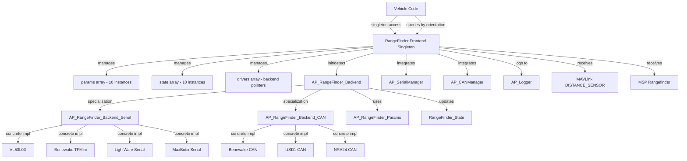

# AP_RangeFinder

## Overview

The AP_RangeFinder library provides distance measurement capabilities for ArduPilot autopilots, supporting up to 10 simultaneous rangefinder sensors. This subsystem manages multiple sensor types through a unified frontend/backend architecture and enables critical flight capabilities including terrain following, precision landing, obstacle avoidance, and altitude hold relative to ground level.

The library abstracts various sensor communication interfaces (I2C, UART, CAN, PWM, analog, MAVLink, MSP, DroneCAN, and Lua scripting) providing a consistent API for distance measurements regardless of underlying sensor hardware. Applications include autonomous terrain following at constant AGL (Above Ground Level), precision landing with sub-meter altitude accuracy, multi-directional obstacle detection for avoidance systems, and enhanced altitude hold using ground-relative measurements.

Source: libraries/AP_RangeFinder/AP_RangeFinder.h:48-346

## Architecture

The AP_RangeFinder subsystem follows a frontend-manager/backend-driver pattern similar to other ArduPilot sensor libraries.



### Frontend Components

**RangeFinder Class** (AP_RangeFinder.h:48-339):
- Singleton manager accessible via `AP::rangefinder()`
- Maintains three parallel arrays for up to RANGEFINDER_MAX_INSTANCES (10) sensors:
  - `params[RANGEFINDER_MAX_INSTANCES]` - Per-instance parameter storage
  - `state[RANGEFINDER_MAX_INSTANCES]` - Current sensor state (distance, status, quality)
  - `drivers[RANGEFINDER_MAX_INSTANCES]` - Backend driver pointers

**Backend Lifecycle**:
1. **Detection**: `init(orientation_default)` called at vehicle startup
2. **Instantiation**: `detect_instance()` creates appropriate backend based on type parameter
3. **Update Loop**: `update()` called at ~10Hz from main loop, polls all active backends
4. **Data Access**: Vehicle code queries by sensor orientation using `distance_orient()`, `status_orient()`

Source: libraries/AP_RangeFinder/AP_RangeFinder.h:236-248

### Backend Base Classes

**AP_RangeFinder_Backend** (AP_RangeFinder_Backend.h:26-105):

Abstract base class defining the interface all rangefinder drivers must implement:

- **Pure Virtual Methods**:
  - `update()` - Called at ~10Hz to poll sensor and update state
  - `_get_mav_distance_sensor_type()` - Returns MAV_DISTANCE_SENSOR type enum

- **State Management**:
  - `state` reference - distance_m, signal_quality_pct, voltage_mv, status, range_valid_count, last_reading_ms
  - `params` reference - Configuration parameters for this instance
  - `_sem` - HAL_Semaphore for thread-safe state access

- **Accessor Methods**:
  - `distance()`, `status()`, `has_data()` - Query current measurements
  - `orientation()`, `max_distance()`, `min_distance()` - Configuration accessors
  - `range_valid_count()` - Consecutive good reading counter for outlier rejection

- **Status Determination**:
  - `update_status()` - Compares reading to min/max thresholds, sets status enum
  - `set_status()` - Updates status and manages range_valid_count

Source: libraries/AP_RangeFinder/AP_RangeFinder_Backend.h:26-105

**AP_RangeFinder_Backend_Serial** (AP_RangeFinder_Backend_Serial.h:9-44):

Specialization for UART-based sensors integrating with AP_SerialManager:

- **Serial Configuration**:
  - `initial_baudrate(serial_instance)` - Virtual method returns required baudrate
  - `rx_bufsize()` / `tx_bufsize()` - Optional buffer size specification (0 = use default)
  - `uart` - UARTDriver pointer for byte-level communication

- **Reading Interface**:
  - `get_reading(float &reading_m)` - Pure virtual, backend implements protocol parsing
  - `get_signal_quality_pct()` - Optional signal strength reporting (-1 = unknown)
  - `read_timeout_ms()` - Timeout before transitioning to NoData status (default 200ms)

- **Base Class update()**: Calls get_reading(), validates, updates state - backends only implement protocol parsing

Source: libraries/AP_RangeFinder/AP_RangeFinder_Backend_Serial.h:9-44

**AP_RangeFinder_Backend_CAN** (AP_RangeFinder_Backend_CAN.h:13-63):

Specialization for CAN bus sensors with frame routing and accumulation:

- **CAN Integration**:
  - `handle_frame(AP_HAL::CANFrame &frame)` - Pure virtual, backend parses CAN frame
  - `receive_id` - Parameter filters frames by CAN ID
  - `is_correct_id()` - Validates frame CAN ID matches configured receive_id

- **Distance Accumulation**:
  - `accumulate_distance_m(distance)` - Called from handle_frame() for each measurement
  - `_distance_sum` / `_distance_count` - Accumulates multiple readings per update cycle
  - `update()` - Averages accumulated measurements, resets accumulators

- **Signal Filtering**:
  - `snr_min` - Parameter defines minimum Signal-to-Noise Ratio threshold
  - Backends reject frames below SNR threshold in handle_frame()

- **Multi-Device Support**:
  - `multican_rangefinder` - Allows multiple CAN rangefinders on single bus
  - `next` - Linked list for multiple backends sharing CAN interface

Source: libraries/AP_RangeFinder/AP_RangeFinder_Backend_CAN.h:13-63

## Supported Sensors

The AP_RangeFinder library supports a comprehensive range of distance sensors across multiple communication interfaces. Each sensor type has a corresponding Type enum value and conditionally-compiled backend driver.

### Laser Rangefinders (LiDAR)

| Sensor Model | Type Enum | Interface | Range | Notes |
|--------------|-----------|-----------|-------|-------|
| LightWare SF10/SF11/SF20 | LWSER (8), LWI2C (7) | Serial, I2C | 50m-100m | Multiple beam widths, configurable update rates |
| LightWare SF40C | LWSER | Serial | 100m | 360-degree scanning lidar |
| LightWare SF45B | LWSER | Serial | 50m | Rotating lidar with multiple detection zones |
| VL53L0X | VL53L0X (16) | I2C | 2m | Time-of-flight, compact, low power |
| VL53L1X | VL53L1X_Short (28) | I2C | 4m | Improved range and accuracy over VL53L0X |
| Garmin LIDAR-Lite v2/v3/v3HP | PLI2C (3), PLI2CV3 (15), PLI2CV3HP (21) | I2C, PWM | 40m | Popular hobbyist lidar, PWM output mode |
| Benewake TF02 | BenewakeTF02 (19) | Serial | 22m | IP65 rated, outdoor capable |
| Benewake TF03 | BenewakeTF03 (27) | Serial | 180m | Long-range industrial lidar |
| Benewake TFmini | BenewakeTFmini (20) | Serial | 12m | Compact, low-cost, high update rate |
| Benewake TFmini Plus | BenewakeTFminiPlus (25), Benewake_CAN (34) | Serial, CAN | 12m | Enhanced TFmini with CAN option |
| TeraRanger One | TRI2C (14) | I2C | 14m | Fast update rate, narrow beam |
| TeraRanger Evo | TeraRanger_Serial (35) | Serial | 60m | Various models with different ranges |
| LeddarOne | LEDDARONE (12) | Serial (Modbus RTU) | 40m | Industrial-grade, Modbus protocol |
| LeddarVu8 | LeddarVu8_Serial (29) | Serial (Modbus RTU) | 215m | 8-segment scanning lidar |
| Lanbao PSK-CM8JL65-CC5 | Lanbao (26) | Serial | 10m | Industrial proximity sensor |
| NoopLoop TOFSense-P | NoopLoop_P (37), TOFSenseP_CAN (38) | I2C, CAN | 4m | High-speed ToF sensor |
| NoopLoop TOFSense-F | TOFSenseF_I2C (40) | I2C | 25m | Long-range variant |
| USD1 | USD1_Serial (11), USD1_CAN (33) | Serial, CAN | 15m | Dual interface sensor |
| JRE Serial | JRE_Serial (41) | Serial | Varies | JRE protocol family |
| Ainstein LR-D1 | Ainstein_LR_D1 (42) | Serial | 50m | FMCW radar rangefinder |
| RDS02UF | RDS02UF (43) | Serial | 30m | Ultrasonic/laser hybrid |
| NRA24 | NRA24_CAN (39) | CAN | 50m | 24GHz radar sensor |
| Wasp | WASP (18) | Custom | Varies | WASP family sensors |

### Ultrasonic Rangefinders

| Sensor Model | Type Enum | Interface | Range | Notes |
|--------------|-----------|-----------|-------|-------|
| MaxBotix MB1xxx I2C | MBI2C (2) | I2C | 7.65m | XL-MaxSonar family, wide beam |
| MaxBotix MB1xxx Serial | MBSER (13) | Serial | 7.65m | LV-MaxSonar family, ASCII/binary protocols |
| HC-SR04 | HC_SR04 (30) | PWM (pulse timing) | 4m | Low-cost ultrasonic, requires dedicated GPIO |
| GY-US42v2 | GYUS42v2 (31) | I2C | 7m | I2C ultrasonic with temperature compensation |
| Blue Robotics Ping1D | BLPing (23) | Serial | 30m | Underwater sonar for ArduSub applications |

### Analog Rangefinders

| Type Enum | Interface | Range | Configuration |
|-----------|-----------|-------|---------------|
| ANALOG (1) | Analog voltage | Sensor-dependent | Requires scaling and offset parameters |

**Analog Transfer Functions**:
- **LINEAR** (Function 0): `distance = (voltage × scaling) + offset`
- **INVERTED** (Function 1): `distance = scaling / (voltage + offset)`
- **HYPERBOLA** (Function 2): `distance = (scaling × scaling) / (voltage + offset)` for inverse-square sensors

Source: libraries/AP_RangeFinder/AP_RangeFinder.h:60-191, 193-197

### Platform-Specific Sensors

| Sensor | Type Enum | Platform | Interface | Notes |
|--------|-----------|----------|-----------|-------|
| Bebop Ultrasonic | BEBOP (9) | Parrot Bebop | Platform-specific | Built-in downward sonar |
| BBB PRU | BBB_PRU (6) | BeagleBone Black | PRU memory-mapped I/O | Uses Programmable Realtime Unit |

### Protocol Adapters

| Type | Type Enum | Source | Notes |
|------|-----------|--------|-------|
| MAVLink | MAVLink (10) | Ground station or companion computer | Receives DISTANCE_SENSOR messages |
| MSP | MSP (32) | MSP-compatible devices | MSP rangefinder protocol for OSD integration |
| DroneCAN/UAVCAN | UAVCAN (24) | CAN bus devices | Standard UAVCAN rangefinder messages |
| Lua Scripting | Lua_Scripting (36) | Lua scripts | Allows custom sensor integration via scripting |
| SITL Simulation | SIM (100) | SITL environment | Simulated rangefinder for testing |

Source: libraries/AP_RangeFinder/AP_RangeFinder.cpp:20-65

## Parameters

Each rangefinder instance has a dedicated parameter group (RNGFND1_, RNGFND2_, ... RNGFND10_).

### Core Parameters

| Parameter | Type | Description | Units | Default |
|-----------|------|-------------|-------|---------|
| TYPE | Int8 | Sensor type enum (see Type enum above) | - | 0 (NONE) |
| ORIENT | Int8 | Mounting orientation (Rotation enum) | - | ROTATION_PITCH_270 (down) |
| MIN_CM | Float | Minimum valid distance | centimeters | 10 |
| MAX_CM | Float | Maximum valid distance | centimeters | 700 |
| GNDCLEAR | Float | Minimum ground clearance for landing detection | meters | 0.10 |

### Physical Configuration

| Parameter | Type | Description | Units | Default |
|-----------|------|-------------|-------|---------|
| POS_X | Float | Position offset forward from body frame origin | meters | 0.0 |
| POS_Y | Float | Position offset right from body frame origin | meters | 0.0 |
| POS_Z | Float | Position offset down from body frame origin | meters | 0.0 |

### Sensor-Specific Parameters

| Parameter | Type | Description | Applies To | Default |
|-----------|------|-------------|------------|---------|
| ADDR | Int8 | I2C address or CAN node ID | I2C and CAN sensors | 0 (auto) |
| PIN | Int8 | Analog input pin or GPIO pin | Analog, PWM sensors | -1 (disabled) |
| SCALING | Float | Voltage-to-distance scaling factor | Analog sensors | 3.0 |
| OFFSET | Float | Distance offset calibration | Analog sensors | 0.0 |
| FUNCTION | Int8 | Transfer function (LINEAR, INVERTED, HYPERBOLA) | Analog sensors | 0 (LINEAR) |
| RATIOMETRIC | Int8 | Voltage is ratiometric (0-Vcc) vs absolute | Analog sensors | 0 |
| PWRSAV | Int16 | Altitude above which sensor powers down | All | 0 (disabled) |
| STOP_PIN | Int8 | GPIO pin to enable/disable sensor | Sensors with enable pin | -1 |

Source: libraries/AP_RangeFinder/AP_RangeFinder_Params.h:10-34

### Orientation Configuration

The ORIENT parameter uses the standard ArduPilot Rotation enum to define sensor mounting direction:

| Orientation | ORIENT Value | Description | Typical Use Case |
|-------------|--------------|-------------|------------------|
| ROTATION_NONE | 0 | Sensor pointing forward | Forward obstacle detection |
| ROTATION_YAW_45 | 1 | 45° right of forward | Diagonal forward-right |
| ROTATION_YAW_90 | 2 | Sensor pointing right | Right-side obstacle detection |
| ROTATION_YAW_135 | 3 | 45° right of backward | Diagonal back-right |
| ROTATION_YAW_180 | 4 | Sensor pointing backward | Rear obstacle detection |
| ROTATION_YAW_225 | 5 | 45° left of backward | Diagonal back-left |
| ROTATION_YAW_270 | 6 | Sensor pointing left | Left-side obstacle detection |
| ROTATION_YAW_315 | 7 | 45° left of forward | Diagonal forward-left |
| ROTATION_PITCH_90 | 24 | Sensor pointing up | Ceiling/overhead detection |
| ROTATION_PITCH_270 | 25 | Sensor pointing down | Terrain following, altitude, landing |
| ROTATION_ROLL_90_PITCH_270 | 38 | Down + 90° roll | Specialized mounting configurations |

**Coordinate Frame**: All orientations relative to vehicle body frame (X=forward, Y=right, Z=down in NED convention)

Source: libraries/AP_RangeFinder/AP_RangeFinder_Backend.h:54

## Multi-Rangefinder Configurations

The AP_RangeFinder subsystem supports up to 10 simultaneous rangefinder instances, enabling complex multi-sensor configurations for comprehensive environmental awareness.

### Obstacle Avoidance Configuration

Configure multiple rangefinders with different orientations to create a 360-degree or partial obstacle detection system:

```
RNGFND1_TYPE = 20          # TFmini forward-facing
RNGFND1_ORIENT = 0         # ROTATION_NONE (forward)
RNGFND1_MIN_CM = 30
RNGFND1_MAX_CM = 1200

RNGFND2_TYPE = 20          # TFmini right-facing
RNGFND2_ORIENT = 2         # ROTATION_YAW_90 (right)
RNGFND2_MIN_CM = 30
RNGFND2_MAX_CM = 1200

RNGFND3_TYPE = 20          # TFmini backward-facing
RNGFND3_ORIENT = 4         # ROTATION_YAW_180 (backward)
RNGFND3_MIN_CM = 30
RNGFND3_MAX_CM = 1200

RNGFND4_TYPE = 20          # TFmini left-facing
RNGFND4_ORIENT = 6         # ROTATION_YAW_270 (left)
RNGFND4_MIN_CM = 30
RNGFND4_MAX_CM = 1200
```

### Precision Landing Configuration

Downward-facing rangefinder optimized for precision landing requires fast update rate and accurate close-range measurements:

```
RNGFND1_TYPE = 16          # VL53L0X or 28 for VL53L1X
RNGFND1_ORIENT = 25        # ROTATION_PITCH_270 (down)
RNGFND1_MIN_CM = 5         # 5cm minimum for precision landing
RNGFND1_MAX_CM = 200       # 2m maximum, VL53L0X range limit
RNGFND1_GNDCLEAR = 0.05    # 5cm ground clearance threshold
RNGFND1_POS_X = 0.10       # 10cm forward of center of gravity
RNGFND1_POS_Y = 0.0        # Centered laterally
RNGFND1_POS_Z = 0.05       # 5cm below CG
```

**Position Offset Importance**: Accurate pos_offset configuration critical for precision landing when rangefinder not at vehicle center of gravity. Algorithm compensates for vehicle attitude using position offset.

### Terrain Following Configuration

For autonomous terrain following, configure downward rangefinder with appropriate range for flight altitude and terrain variation:

```
RNGFND1_TYPE = 8           # LightWare Serial
RNGFND1_ORIENT = 25        # ROTATION_PITCH_270 (down)
RNGFND1_MIN_CM = 50        # Ignore very close readings
RNGFND1_MAX_CM = 5000      # 50m range for high-altitude terrain following
RNGFND1_GNDCLEAR = 0.20    # 20cm ground clearance
```

**Terrain Following Operation**: Vehicle maintains constant altitude above ground level (AGL) rather than above home/takeoff altitude. Handles sloped terrain by continuously adjusting altitude based on rangefinder measurements.

### Query by Orientation

Vehicle code queries rangefinder measurements by orientation rather than instance number:

```cpp
// Check if downward rangefinder available and get distance
if (rangefinder.has_orientation(ROTATION_PITCH_270)) {
    float distance_m = rangefinder.distance_orient(ROTATION_PITCH_270);
    RangeFinder::Status status = rangefinder.status_orient(ROTATION_PITCH_270);
    
    if (status == RangeFinder::Status::Good) {
        // Use distance_m for altitude hold or terrain following
        float altitude_agl = distance_m; // meters above ground
    }
}

// Check forward-facing rangefinder for obstacle avoidance
if (rangefinder.has_orientation(ROTATION_NONE)) {
    float forward_distance = rangefinder.distance_orient(ROTATION_NONE);
    int8_t signal_quality = rangefinder.signal_quality_pct_orient(ROTATION_NONE);
    
    // Implement obstacle avoidance logic
    if (forward_distance < 5.0f && signal_quality > 50) {
        // Obstacle within 5 meters with good signal quality
    }
}
```

Source: libraries/AP_RangeFinder/AP_RangeFinder.h:257-303

## Sensor Health Monitoring

The AP_RangeFinder library implements comprehensive health monitoring to ensure reliable distance measurements and reject invalid data.

### Status Enum

Each rangefinder instance maintains a Status enum indicating current health:

| Status | Value | Description | Trigger Condition |
|--------|-------|-------------|-------------------|
| NotConnected | 0 | Sensor not detected during initialization | `init()` failed to detect sensor on I2C/Serial/CAN |
| NoData | 1 | No readings received within timeout | No valid data for `read_timeout_ms()` (default 200ms) |
| OutOfRangeLow | 2 | Distance below minimum threshold | `distance_m < params.min_distance` |
| OutOfRangeHigh | 3 | Distance above maximum threshold | `distance_m > params.max_distance` |
| Good | 4 | Valid measurement within range | `min_distance <= distance_m <= max_distance` |

**Status Usage**: Vehicle code should check `status_orient()` before using distance measurements. Only Status::Good indicates reliable data.

Source: libraries/AP_RangeFinder/AP_RangeFinder.h:199-205

### Outlier Rejection

The `range_valid_count` field implements simple outlier rejection by tracking consecutive good readings:

- **Increment**: Increases by 1 for each consecutive Good status reading
- **Reset**: Reset to 0 on any non-Good status
- **Maximum**: Capped at 10 to prevent overflow
- **Purpose**: Filter transient noise or spurious readings before trusting sensor

**Implementation** (AP_RangeFinder_Backend.cpp):
```cpp
// In set_status() method:
if (status == RangeFinder::Status::Good) {
    if (state.range_valid_count < 10) {
        state.range_valid_count++;
    }
} else {
    state.range_valid_count = 0;
}
```

**Usage Pattern**: Vehicle code can require minimum range_valid_count before trusting rangefinder:
```cpp
uint8_t valid_count = rangefinder.range_valid_count_orient(ROTATION_PITCH_270);
if (valid_count >= 3) {
    // At least 3 consecutive good readings, data stable
    float distance = rangefinder.distance_orient(ROTATION_PITCH_270);
}
```

Source: libraries/AP_RangeFinder/AP_RangeFinder.h:212-221

### Signal Quality

The `signal_quality_pct` field provides sensor-specific quality metric:

- **Range**: 0-100 (worst to best signal) or -1 (unknown/not supported)
- **Sensor-Specific**: Implementation varies by sensor type:
  - **Optical sensors**: Return signal strength or reflected light intensity
  - **CAN sensors**: Signal-to-Noise Ratio (SNR) converted to percentage
  - **Ultrasonic**: Some provide echo amplitude
  - **Simple sensors**: Return SIGNAL_QUALITY_UNKNOWN (-1)

**SNR Filtering** (CAN sensors): Backend parameter `snr_min` defines minimum acceptable SNR. Frames below threshold rejected in `handle_frame()`.

**Quality Usage**:
```cpp
int8_t quality = rangefinder.signal_quality_pct_orient(ROTATION_PITCH_270);
if (quality >= 0) {
    // Quality metric available
    if (quality < 30) {
        // Poor signal quality, treat measurement with caution
    } else if (quality >= 70) {
        // Excellent signal quality, high confidence
    }
}
```

Source: libraries/AP_RangeFinder/AP_RangeFinder.h:207-209, 214

### Voltage Monitoring

Some sensors provide `voltage_mv` indicating supply voltage or analog sensor voltage:

- **Analog Rangefinders**: Raw ADC voltage in millivolts
- **Smart Sensors**: Some report supply voltage for diagnostics
- **Unused**: Many digital sensors set voltage_mv to 0

### Pre-arm Checks

The `prearm_healthy()` method validates rangefinders before arming:

**Check 1 - Distance Variation**: Sensor must show distance changes >50cm to detect stuck readings:
```cpp
#define RANGEFINDER_PREARM_REQUIRED_CHANGE_CM 50 // (0 in SITL)
```

**Check 2 - Altitude Limit**: Vehicle altitude must be <2m at arming to ensure sensor tested:
```cpp
#define RANGEFINDER_PREARM_ALT_MAX_CM 200
```

**Check 3 - Status**: All enabled sensors must be NotConnected or Good status (not NoData, OutOfRange)

**Failure Messages**: Pre-arm failures populate `failure_msg` buffer with specific issue for ground station display.

Source: libraries/AP_RangeFinder/AP_RangeFinder.h:38-44, 241

### Timeout Management

Each backend defines `read_timeout_ms()` virtual method (default 200ms). If no valid reading received within timeout, status transitions to NoData.

**Timeout Considerations**:
- **Slow sensors**: Override timeout for low-update-rate sensors
- **Intermittent data**: CAN/MAVLink sensors may have variable update rates
- **Startup**: Allow extended timeout during initialization

Source: libraries/AP_RangeFinder/AP_RangeFinder_Backend_Serial.h:43

## Testing Procedures

### SITL Testing

Software-in-the-loop simulation provides safe rangefinder testing without physical hardware:

```bash
# Launch ArduCopter SITL with console and map
sim_vehicle.py -v ArduCopter --console --map

# Configure simulated downward rangefinder
param set RNGFND1_TYPE 100        # SIM type (SITL simulation backend)
param set RNGFND1_ORIENT 25       # ROTATION_PITCH_270 (pointing down)
param set RNGFND1_MIN_CM 10       # 10cm minimum distance
param set RNGFND1_MAX_CM 1000     # 10m maximum distance
param set RNGFND1_GNDCLEAR 0.10   # 10cm ground clearance

# Restart to apply parameters
reboot

# Check rangefinder status
param show RNGFND1*

# Monitor distance in SITL - should change with altitude
# Arm and takeoff to test altitude measurements
arm throttle
mode guided
takeoff 5

# Distance should read ~5m when at 5m altitude
# Land and distance should decrease to near zero
land
```

**SITL Rangefinder Behavior**: Simulated rangefinder returns distance to ground plane, accounts for terrain height if terrain database loaded.

Source: libraries/AP_RangeFinder/AP_RangeFinder.h:188-190

### Hardware Testing

#### Basic Functionality Test

1. **Connect Sensor**: Wire sensor to appropriate port (I2C, Serial, CAN) per sensor documentation
2. **Configure Parameters**: Set TYPE, ORIENT, MIN_CM, MAX_CM for sensor
3. **Power Cycle**: Reboot autopilot to initialize sensor
4. **Check Detection**: Verify no "RangeFinder: Not Detected" messages in logs
5. **Monitor Readings**: Use ground station to monitor DISTANCE_SENSOR MAVLink messages
6. **Vary Distance**: Move hand or object in front of sensor, verify readings change appropriately
7. **Check Limits**: Test minimum and maximum range limits, verify OutOfRangeLow/High status

#### Pre-arm Validation

Pre-arm checks verify sensor health before flight:

```bash
# Altitude must be <2m for pre-arm to pass
# Sensor must show >50cm distance variation

# Test pre-arm checks:
# 1. Place vehicle on ground
# 2. Attempt to arm
# 3. If pre-arm fails, check failure message in ground station
# 4. Lift and lower vehicle to create distance variation >50cm
# 5. Retry arming
```

**Pre-arm Failure Messages**:
- "RangeFinder: Not Detected" - Sensor not found during init
- "RangeFinder: No Data" - Sensor not returning measurements
- "RangeFinder: Min/Max" - Distance outside configured limits
- "RangeFinder: Stuck" - No distance variation detected

Source: libraries/AP_RangeFinder/AP_RangeFinder.h:38-44

#### Accuracy Verification

Validate measurement accuracy with known distances:

1. **Setup Targets**: Place markers at known distances (0.5m, 1.0m, 2.0m, 5.0m)
2. **Record Measurements**: Log distance at each target position
3. **Calculate Error**: Compare reported distance to actual distance
4. **Adjust Calibration**: For analog sensors, adjust SCALING and OFFSET parameters
5. **Verify Limits**: Confirm sensor reliably detects min_distance and max_distance

**Expected Accuracy**:
- **Laser rangefinders**: ±3-5cm typical
- **Ultrasonic**: ±1% of reading
- **Analog**: Dependent on sensor and calibration quality

#### Update Rate Test

Verify sensor update rate matches specifications:

1. **Enable Logging**: Set `LOG_BITMASK` to include RFND messages
2. **Record Data**: Arm and hover for 10 seconds
3. **Analyze Logs**: Download log and check RFND message rate
4. **Expected Rates**:
   - VL53L0X: 20-50Hz
   - TFmini: 100Hz
   - LightWare: 10-390Hz (configurable)
   - Ultrasonic: 10-20Hz

### RFND_test Example

The libraries/AP_RangeFinder/examples/RFND_test/ directory contains standalone test harness:

```cpp
// Example demonstrates:
// - RangeFinder initialization: init(ROTATION_PITCH_270)
// - Main update loop: update() at 10Hz
// - Backend enumeration: num_sensors(), get_backend()
// - Status checking: status(), has_data()
// - Distance reading: distance()
// - Console output with type, status, distance

// Build and run on hardware:
cd libraries/AP_RangeFinder/examples/RFND_test
../../waf configure --board <your_board>
../../waf build --target examples
# Upload and monitor serial output
```

**Use Cases**:
- Hardware bring-up for new sensors
- Driver debugging
- Serial protocol verification
- I2C address detection

### Integration Testing

Test rangefinder integration with vehicle flight modes:

#### Terrain Following Test (Copter)

```bash
# Enable terrain following mode
param set TERRAIN_ENABLE 1
param set TERRAIN_FOLLOW 1

# Configure downward rangefinder (if not already configured)
param set RNGFND1_TYPE <sensor_type>
param set RNGFND1_ORIENT 25

# Test in GUIDED mode with terrain following
mode guided
arm throttle
takeoff 10  # 10m above ground level

# Fly over sloped terrain - altitude AGL should remain constant
# while altitude MSL changes with terrain
```

#### Precision Landing Test (Copter)

```bash
# Enable precision landing with rangefinder
param set PLND_ENABLED 1
param set PLND_TYPE 0  # Disabled (rangefinder only for altitude)

# Rangefinder provides accurate AGL altitude during landing
mode land

# Monitor RFND messages - distance should smoothly decrease to zero
# Landing detection uses ground_clearance parameter
```

Source: Libraries provide integration with AC_PrecLand, AP_Terrain, AC_WPNav for these modes

### Troubleshooting

**Sensor Not Detected**:
- Verify correct wiring (power, ground, data lines)
- Check I2C address matches ADDR parameter
- Confirm SERIAL protocol set correctly for UART sensors
- Check CAN termination and baud rate for CAN sensors
- Enable HAL debug logging: `param set LOG_BITMASK 131071`

**No Data / Intermittent Readings**:
- Check sensor is not obstructed
- Verify sufficient supply voltage (check voltage_mv)
- Increase read_timeout_ms if needed
- Check for I2C/Serial bus errors in logs
- Verify sensor update rate matches expectations

**Inaccurate Readings**:
- Calibrate analog sensors with SCALING and OFFSET
- Check sensor mounting angle matches ORIENT parameter
- Verify sensor not affected by propeller downwash
- Test in controlled environment with known distances
- Check signal_quality_pct for quality issues

**Pre-arm Failures**:
- Ensure altitude <2m at arming location
- Move vehicle up/down >50cm to create distance variation
- Check min_distance and max_distance parameters appropriate for environment
- Verify sensor has Good status (not OutOfRange)

## Integration Guide

### Adding Support for New Sensor

This section provides a comprehensive guide for implementing a new rangefinder backend driver.

#### Step 1: Create Backend Header and Implementation Files

Create two files in libraries/AP_RangeFinder/:
- `AP_RangeFinder_NewSensor.h` - Class declaration
- `AP_RangeFinder_NewSensor.cpp` - Implementation

**Example Header** (AP_RangeFinder_NewSensor.h):

```cpp
#pragma once

#include "AP_RangeFinder_config.h"

#if AP_RANGEFINDER_NEWSENSOR_ENABLED

#include "AP_RangeFinder_Backend_Serial.h"

class AP_RangeFinder_NewSensor : public AP_RangeFinder_Backend_Serial {
public:
    // Static factory method - required for all backends
    static AP_RangeFinder_Backend_Serial *create(
        RangeFinder::RangeFinder_State &_state,
        AP_RangeFinder_Params &_params) {
        return NEW_NOTHROW AP_RangeFinder_NewSensor(_state, _params);
    }

protected:
    // Define required baudrate
    uint32_t initial_baudrate(uint8_t serial_instance) const override {
        return 115200; // NewSensor operates at 115200 baud
    }

    // Specify buffer sizes if non-default needed
    uint16_t rx_bufsize() const override { return 256; }
    uint16_t tx_bufsize() const override { return 32; }

    // Define MAVLink sensor type for telemetry
    MAV_DISTANCE_SENSOR _get_mav_distance_sensor_type() const override {
        return MAV_DISTANCE_SENSOR_LASER; // or ULTRASOUND, RADAR, etc.
    }

    // Optional: customize timeout if sensor has slow update rate
    uint16_t read_timeout_ms() const override { return 500; }

private:
    // Constructor is private - use create() factory method
    using AP_RangeFinder_Backend_Serial::AP_RangeFinder_Backend_Serial;

    // Implement protocol parsing - called by base class update()
    bool get_reading(float &reading_m) override;

    // Optional: provide signal quality if sensor supports it
    int8_t get_signal_quality_pct() const override;

    // Protocol state machine variables
    uint8_t parse_state;
    uint8_t frame_buffer[32];
    uint8_t frame_len;
};

#endif  // AP_RANGEFINDER_NEWSENSOR_ENABLED
```

**Example Implementation** (AP_RangeFinder_NewSensor.cpp):

```cpp
#include "AP_RangeFinder_NewSensor.h"

#if AP_RANGEFINDER_NEWSENSOR_ENABLED

#include <AP_HAL/AP_HAL.h>

// Implement protocol parsing
bool AP_RangeFinder_NewSensor::get_reading(float &reading_m)
{
    if (uart == nullptr) {
        return false;
    }

    // Example: Read bytes from UART and parse NewSensor protocol
    uint32_t nbytes = uart->available();
    
    for (uint32_t i = 0; i < nbytes; i++) {
        int16_t byte = uart->read();
        if (byte < 0) {
            break;
        }

        // State machine to parse NewSensor frame format
        // Example assumes frame: [0x59][0x59][dist_low][dist_high][checksum]
        
        switch (parse_state) {
        case 0: // Wait for first header byte
            if (byte == 0x59) {
                frame_buffer[0] = byte;
                parse_state = 1;
            }
            break;

        case 1: // Wait for second header byte
            if (byte == 0x59) {
                frame_buffer[1] = byte;
                frame_len = 2;
                parse_state = 2;
            } else {
                parse_state = 0;
            }
            break;

        case 2: // Collect frame data
            frame_buffer[frame_len++] = byte;
            
            if (frame_len >= 5) {
                // Complete frame received - validate checksum
                uint8_t checksum = 0;
                for (uint8_t j = 0; j < 4; j++) {
                    checksum += frame_buffer[j];
                }
                
                if (checksum == frame_buffer[4]) {
                    // Valid frame - extract distance
                    uint16_t dist_cm = frame_buffer[2] | (frame_buffer[3] << 8);
                    reading_m = dist_cm * 0.01f; // Convert cm to meters
                    parse_state = 0;
                    return true;
                } else {
                    // Checksum error - discard frame
                    parse_state = 0;
                }
            }
            break;
        }
    }

    return false; // No complete valid frame this update
}

// Optional: signal quality implementation
int8_t AP_RangeFinder_NewSensor::get_signal_quality_pct() const
{
    // If sensor provides signal strength, convert to 0-100 percentage
    // Return -1 if not supported
    return RangeFinder::SIGNAL_QUALITY_UNKNOWN;
}

#endif  // AP_RANGEFINDER_NEWSENSOR_ENABLED
```

Source pattern: libraries/AP_RangeFinder/AP_RangeFinder_Benewake_TFMini.cpp

#### Step 2: Add Type to Enum

Edit `libraries/AP_RangeFinder/AP_RangeFinder.h` to add new sensor type to Type enum:

```cpp
enum class Type {
    // ... existing types ...
    NewSensor = 45, // Choose next available number
};
```

Source: libraries/AP_RangeFinder/AP_RangeFinder.h:60-191

#### Step 3: Add Feature Flag

Create feature flag in `libraries/AP_RangeFinder/AP_RangeFinder_config.h`:

```cpp
#ifndef AP_RANGEFINDER_NEWSENSOR_ENABLED
#define AP_RANGEFINDER_NEWSENSOR_ENABLED AP_RANGEFINDER_BACKEND_DEFAULT_ENABLED
#endif
```

This allows the backend to be conditionally compiled based on board capabilities and feature requirements.

#### Step 4: Register in detect_instance()

Edit `libraries/AP_RangeFinder/AP_RangeFinder.cpp` to add detection case:

```cpp
#include "AP_RangeFinder_NewSensor.h"

// In detect_instance() method, add case to switch statement:
void RangeFinder::detect_instance(uint8_t instance, uint8_t& serial_instance)
{
    // ... existing detection code ...

#if AP_RANGEFINDER_NEWSENSOR_ENABLED
    case Type::NewSensor:
        // Serial backend - will be initialized via init_serial()
        if (AP_RangeFinder_NewSensor::create(state[instance], params[instance])) {
            serial_instance++;
        }
        break;
#endif

    // ... rest of cases ...
}
```

Source: libraries/AP_RangeFinder/AP_RangeFinder.cpp:detect_instance()

#### Step 5: Implement Protocol Parsing

Key considerations for `get_reading()` implementation:

**State Machine Pattern**: Most serial protocols require multi-byte parsing:
- Maintain parse state between update() calls
- Buffer partial frames
- Validate checksums/CRCs before accepting data
- Handle frame synchronization and resynchronization

**Byte Reading**:
```cpp
// Check for available data
uint32_t nbytes = uart->available();
if (nbytes == 0) {
    return false;
}

// Read bytes one at a time or in bulk
for (uint32_t i = 0; i < nbytes; i++) {
    int16_t byte = uart->read();
    if (byte < 0) {
        break; // No more data
    }
    // Process byte...
}
```

**Unit Conversion**: Always return distance in meters:
```cpp
// Sensor reports centimeters
reading_m = distance_cm * 0.01f;

// Sensor reports millimeters
reading_m = distance_mm * 0.001f;
```

**Validation**: Reject obviously invalid readings:
```cpp
if (reading_m < 0.01f || reading_m > 100.0f) {
    return false; // Invalid reading
}
```

**Timeout Handling**: Base class handles timeout via `read_timeout_ms()` - no explicit timeout code needed in backend.

Source: libraries/AP_RangeFinder/AP_RangeFinder_Backend_Serial.h:29-44

#### Step 6: CAN Backend Alternative

For CAN-based sensors, inherit from `AP_RangeFinder_Backend_CAN`:

```cpp
class AP_RangeFinder_NewSensor_CAN : public AP_RangeFinder_Backend_CAN {
public:
    AP_RangeFinder_NewSensor_CAN(
        RangeFinder::RangeFinder_State &_state,
        AP_RangeFinder_Params &_params)
        : AP_RangeFinder_Backend_CAN(_state, _params, 
                                     AP_CAN::Protocol::NewSensor,
                                     "NewSensor") {}

protected:
    // Parse CAN frame and extract distance
    bool handle_frame(AP_HAL::CANFrame &frame) override {
        // Check CAN ID matches expected receive_id
        if (!is_correct_id(frame.id)) {
            return false;
        }

        // Parse CAN frame data
        uint16_t dist_mm = frame.data[0] | (frame.data[1] << 8);
        float distance_m = dist_mm * 0.001f;

        // Accumulate measurement (averaged in base class update())
        accumulate_distance_m(distance_m);
        
        return true;
    }
};
```

**CAN Frame Routing**: `receive_id` parameter filters frames. `is_correct_id()` validates frame CAN ID matches configuration.

**Accumulation Pattern**: Multiple CAN frames may arrive per update cycle. Call `accumulate_distance_m()` for each frame; base class averages accumulated measurements.

Source: libraries/AP_RangeFinder/AP_RangeFinder_Backend_CAN.h:13-63

#### Step 7: Testing New Backend

1. **Compile**: `./waf configure --board <board> && ./waf build`
2. **Flash**: Upload to autopilot
3. **Configure**: Set RNGFND1_TYPE to new type number
4. **Monitor**: Enable HAL debug logging, check for init messages
5. **Verify**: Use RFND_test example or monitor DISTANCE_SENSOR MAVLink
6. **Validate**: Test min/max ranges, update rate, accuracy

#### Step 8: Documentation

Add sensor to "Supported Sensors" table in this README with:
- Sensor model and variants
- Type enum value
- Interface (Serial, I2C, CAN, etc.)
- Range specification
- Special notes (update rate, beam width, power requirements)

### I2C Backend Pattern

For I2C sensors, inherit from `AP_RangeFinder_Backend`:

```cpp
class AP_RangeFinder_NewSensor_I2C : public AP_RangeFinder_Backend {
public:
    static AP_RangeFinder_Backend *detect(
        RangeFinder::RangeFinder_State &_state,
        AP_RangeFinder_Params &_params);

protected:
    void update() override;

private:
    AP_RangeFinder_NewSensor_I2C(
        RangeFinder::RangeFinder_State &_state,
        AP_RangeFinder_Params &_params,
        AP_HAL::OwnPtr<AP_HAL::I2CDevice> dev);

    bool init();
    bool read_sensor();

    AP_HAL::OwnPtr<AP_HAL::I2CDevice> _dev;
    uint32_t last_reading_ms;
};
```

**I2C Detection Pattern**:
```cpp
AP_RangeFinder_Backend *AP_RangeFinder_NewSensor_I2C::detect(
    RangeFinder::RangeFinder_State &_state,
    AP_RangeFinder_Params &_params)
{
    // Get I2C bus from HAL
    AP_HAL::OwnPtr<AP_HAL::I2CDevice> dev = 
        hal.i2c_mgr->get_device(1, _params.address); // Bus 1
    
    if (!dev) {
        return nullptr;
    }

    AP_RangeFinder_NewSensor_I2C *sensor = 
        NEW_NOTHROW AP_RangeFinder_NewSensor_I2C(_state, _params, std::move(dev));
    
    if (sensor && !sensor->init()) {
        delete sensor;
        return nullptr;
    }

    return sensor;
}
```

**I2C Communication**:
```cpp
bool AP_RangeFinder_NewSensor_I2C::read_sensor()
{
    uint8_t buffer[4];
    
    // Read 4 bytes from sensor
    if (!_dev->read_registers(0x00, buffer, sizeof(buffer))) {
        return false;
    }

    // Parse distance from buffer
    uint16_t dist_mm = (buffer[0] << 8) | buffer[1];
    float distance_m = dist_mm * 0.001f;

    // Update state
    state.distance_m = distance_m;
    state.last_reading_ms = AP_HAL::millis();
    update_status();

    return true;
}
```

Source pattern: libraries/AP_RangeFinder/AP_RangeFinder_VL53L0X.cpp

## Safety Considerations

The AP_RangeFinder library is used in safety-critical flight operations including terrain following, obstacle avoidance, and autonomous landing.

### Critical Parameters

**min_distance / max_distance**: Define sensor valid operating envelope. Incorrectly configured limits can cause:
- **Too narrow**: Frequent OutOfRange status, loss of altitude control
- **Too wide**: Acceptance of invalid data from reflections or crosstalk

**Recommendation**: Set min_distance to manufacturer specified minimum + 10cm margin. Set max_distance to manufacturer specified maximum - 10% margin.

**orientation**: Incorrect orientation configuration causes:
- **Terrain following**: Vehicle attempts to maintain altitude relative to wrong direction
- **Obstacle avoidance**: Wrong obstacle detected or missed completely
- **Precision landing**: Landing detection from wrong sensor

**Warning**: Always verify orientation with ground testing before flight. Incorrect orientation can cause crashes.

**ground_clearance**: Used for landing detection. If set too low:
- Vehicle may detect landing prematurely in tall grass or rough terrain
- If set too high: Vehicle may continue descending into ground before detecting landing

**Recommendation**: Set ground_clearance to 5-10cm for smooth surfaces, 15-20cm for rough terrain.

Source: libraries/AP_RangeFinder/AP_RangeFinder_Params.h:20-34

### Pre-arm Validation

Pre-arm checks prevent flight with misconfigured or failed rangefinders:

**Distance Variation Check**: Requires >50cm distance change to detect stuck sensors. False positives possible if:
- Vehicle on table/stand preventing distance variation
- Indoor testing with fixed ceiling distance

**Workaround**: Lift and lower vehicle >50cm before arming, or temporarily disable rangefinder for testing.

**Altitude Limit Check**: Restricts arming to <2m altitude. Prevents:
- Arming in flight after mid-air reboot
- Arming with untested rangefinder configuration

**Limitation**: May prevent arming on elevated launch points. Understand this check before flying from towers or structures.

Source: libraries/AP_RangeFinder/AP_RangeFinder.h:38-44

### Failure Modes

**Sensor Disconnection**:
- **Detection**: Status transitions to NotConnected or NoData
- **Impact**: Terrain following/precision landing disabled, altitude hold reverts to barometric
- **Recovery**: Automatic if sensor reconnects; manual intervention if persistent

**Timeout / No Data**:
- **Cause**: Communication loss, sensor failure, obstruction
- **Detection**: No readings for read_timeout_ms (default 200ms)
- **Impact**: Status becomes NoData, sensor data ignored by vehicle
- **Recovery**: Automatic when data resumes

**Out-of-Range Readings**:
- **Cause**: Distance below min_distance or above max_distance
- **Detection**: Status becomes OutOfRangeLow or OutOfRangeHigh
- **Impact**: Distance data ignored until back in range
- **Note**: Normal during flight altitude changes; not a failure if temporary

**Invalid Data / Corruption**:
- **Detection**: Backend-specific checksum/CRC validation
- **Handling**: Invalid frames discarded, no state update
- **Impact**: Reduced update rate if frequent; transitions to NoData if persistent
- **Quality Metric**: signal_quality_pct indicates data quality

**Interference**:
- **Causes**: Propeller downwash, electromagnetic interference, optical reflections
- **Symptoms**: Erratic readings, low signal_quality_pct, range_valid_count not increasing
- **Mitigation**: Mounting location selection, shielding, filtering via range_valid_count

### Testing Requirements

**Critical**: Always test rangefinder in SITL before hardware flight testing:

1. **SITL Validation**: Verify parameter configuration, orientation, behavior in simulation
2. **Ground Testing**: Confirm detection, readings, min/max ranges on ground
3. **Hover Test**: Verify altitude hold with rangefinder at 2-5m AGL
4. **Altitude Changes**: Test transitions between barometric and rangefinder altitude
5. **Failure Testing**: Simulate sensor disconnect, verify graceful degradation

**Warning**: Do not test new rangefinder configurations in autonomous modes without thorough ground testing and manual flight validation first.

### Sensor Mounting Considerations

**Propeller Downwash**: Downward-facing sensors can receive false echoes from disturbed air or ground debris:
- **Symptom**: Noisy readings at high throttle, inconsistent landing detection
- **Mitigation**: Mount sensor away from propeller downwash center, use range_valid_count filtering

**Vibration**: High-frequency vibration can affect optical sensors:
- **Symptom**: Intermittent readings, reduced range
- **Mitigation**: Vibration dampening mounting, anti-vibration foam

**Field of View**: Wide beam sensors may detect obstacles outside intended path:
- **Symptom**: Unexpected obstacle detection, false avoidance triggers
- **Mitigation**: Understand sensor beam pattern, mount to avoid false detections from vehicle structure

**Reflective Surfaces**: Glass, water, shiny metal can cause unpredictable reflections:
- **Symptom**: Erratic readings, total return loss, false long-range readings
- **Awareness**: Test in operational environment, some surfaces may be problematic

## Performance Considerations

### Update Rates

**Frontend Update Frequency**: RangeFinder::update() called at ~10Hz from vehicle main loop
- **Rationale**: Balances sensor polling frequency with CPU budget
- **Impact**: Even fast sensors (100Hz+) downsampled to 10Hz by vehicle navigation

**Backend Timer Callbacks**: Some backends use HAL timer callbacks for higher-rate polling:
- **I2C Sensors**: Often polled at 20-50Hz in timer callback
- **UART Sensors**: Parse bytes as received (up to 400Hz for fast sensors)
- **CAN Sensors**: Frames processed immediately on reception
- **Accumulation**: Multiple high-rate measurements averaged per 10Hz update cycle

Source: libraries/AP_RangeFinder/AP_RangeFinder.h:246-248

### Resource Usage

**Memory Footprint**:
- **Frontend**: state[10] + params[10] + drivers[10] arrays ≈ 2KB
- **Per Backend**: ~100-200 bytes per instance
- **Total**: Approximately 2-3KB for typical multi-sensor configuration

**CPU Usage**:
- **Frontend update()**: <1% CPU @ 10Hz on STM32F4
- **Serial parsing**: Minimal, byte-by-byte in update() or UART interrupt
- **I2C transactions**: Handled by HAL DMA, negligible CPU
- **CAN processing**: Frame reception in CAN interrupt, parsing in thread

**Flash Usage**:
- **Core library**: ~15KB (frontend + base backend classes)
- **Per sensor backend**: 2-5KB depending on protocol complexity
- **Feature flags**: Conditionally compile only needed backends

### Power Saving

**powersave_range Parameter**: Automatically disables sensor at high altitudes to reduce power consumption:

```cpp
// In backend update() - checks estimated terrain height
if (params.powersave_range > 0) {
    float height_cm = get_terrain_height_estimate() * 100.0f;
    if (height_cm > params.powersave_range) {
        // Disable sensor - no readings, low power state
        set_status(RangeFinder::Status::OutOfRangeHigh);
        return;
    }
}
```

**Configuration Example**:
```
RNGFND1_PWRSAV = 3000  # Power down sensor above 30m AGL
```

**Use Case**: Long-range missions where rangefinder only needed near ground. Saves power during cruise, automatically re-enables on descent.

Source: libraries/AP_RangeFinder/AP_RangeFinder_Params.h:23

### Optimization for Fast Sensors

High-update-rate sensors (100Hz+) benefit from accumulation:

**CAN Backend Accumulation** (already implemented):
```cpp
// In handle_frame():
accumulate_distance_m(distance_from_frame);
// Base class update() averages: distance = sum / count
```

**Serial Backend**: Single reading per update cycle (no accumulation). Fast serial sensors naturally downsampled to 10Hz.

**Recommendation**: For noise reduction with fast sensors, consider running median filter in backend before reporting distance.

## References

### Source Files

**Core Frontend**:
- libraries/AP_RangeFinder/AP_RangeFinder.h - Main singleton class and enums
- libraries/AP_RangeFinder/AP_RangeFinder.cpp - Frontend implementation, detection, update loop
- libraries/AP_RangeFinder/AP_RangeFinder_config.h - Feature flags and conditional compilation

**Backend Base Classes**:
- libraries/AP_RangeFinder/AP_RangeFinder_Backend.h - Abstract backend interface
- libraries/AP_RangeFinder/AP_RangeFinder_Backend.cpp - Common backend implementation
- libraries/AP_RangeFinder/AP_RangeFinder_Backend_Serial.h - Serial sensor specialization
- libraries/AP_RangeFinder/AP_RangeFinder_Backend_Serial.cpp - Serial parsing framework
- libraries/AP_RangeFinder/AP_RangeFinder_Backend_CAN.h - CAN sensor specialization
- libraries/AP_RangeFinder/AP_RangeFinder_Backend_CAN.cpp - CAN frame routing and accumulation

**Parameters**:
- libraries/AP_RangeFinder/AP_RangeFinder_Params.h - Per-instance parameter definitions
- libraries/AP_RangeFinder/AP_RangeFinder_Params.cpp - Parameter implementation and tables

**Example Backends** (reference implementations):
- libraries/AP_RangeFinder/AP_RangeFinder_Benewake_TFMini.cpp - Serial parsing example
- libraries/AP_RangeFinder/AP_RangeFinder_VL53L0X.cpp - I2C sensor example
- libraries/AP_RangeFinder/AP_RangeFinder_Benewake_CAN.cpp - CAN sensor example
- libraries/AP_RangeFinder/AP_RangeFinder_MAVLink.cpp - MAVLink message handling example
- libraries/AP_RangeFinder/AP_RangeFinder_analog.cpp - Analog sensor with transfer functions

**Testing**:
- libraries/AP_RangeFinder/examples/RFND_test/ - Standalone rangefinder test harness

### Related ArduPilot Libraries

**AP_Proximity**: Multi-directional obstacle avoidance using rangefinder arrays
- Uses AP_RangeFinder for individual sensor readings
- Implements 360-degree obstacle detection and avoidance boundaries
- Integration: libraries/AP_Proximity/

**AC_Fence**: Geofencing with terrain altitude limits
- Uses AP_RangeFinder for ground-relative altitude in terrain-based fences
- Prevents altitude fence violations on sloped terrain
- Integration: libraries/AC_Fence/

**AP_Terrain**: Terrain database for advanced terrain following
- Combines AP_RangeFinder measurements with terrain database
- Provides terrain height estimates for power saving optimization via set_estimated_terrain_height()
- Integration: libraries/AP_Terrain/

**AP_Landing**: Precision landing state machine
- Uses AP_RangeFinder for accurate AGL altitude during final approach
- Implements landing detection via ground_clearance threshold
- Rangefinder provides sub-meter altitude accuracy vs barometric
- Integration: libraries/AP_Landing/

**AC_WPNav**: Waypoint navigation with terrain following
- Queries AP_RangeFinder for terrain-relative altitude hold
- Maintains constant AGL in terrain following modes
- Integration: libraries/AC_WPNav/

**AC_PrecLand**: Precision landing with visual targets
- Uses AP_RangeFinder for altitude component of precision landing
- Combines visual target tracking with rangefinder altitude
- Integration: libraries/AC_PrecLand/

### External Documentation

**ArduPilot Wiki**:
- https://ardupilot.org/copter/docs/common-rangefinder-landingpage.html - Rangefinder setup and configuration guide
- https://ardupilot.org/copter/docs/terrain-following.html - Terrain following mode documentation
- https://ardupilot.org/copter/docs/precision-landing-with-irlock.html - Precision landing guide

**Sensor Datasheets**: Consult manufacturer datasheets for:
- Communication protocol specifications (frame format, checksums, CAN messages)
- Electrical specifications (voltage, current, pin assignments)
- Performance specifications (range, accuracy, update rate, beam width)
- Mounting and environmental considerations

**MAVLink Protocol**:
- DISTANCE_SENSOR message definition: https://mavlink.io/en/messages/common.html#DISTANCE_SENSOR
- MAV_DISTANCE_SENSOR enum: Sensor type classification for telemetry

### Development Resources

**Adding New Sensors**:
- Follow integration guide in this document (see "Integration Guide" section)
- Reference existing backends for similar sensors (Serial/I2C/CAN pattern)
- Enable HAL debugging for protocol development: `param set LOG_BITMASK 131071`
- Test with RFND_test example before vehicle integration

**Debugging Tools**:
- MAVProxy: Monitor DISTANCE_SENSOR messages: `module load graph; graph DISTANCE_SENSOR.current_distance`
- Serial terminal: Capture raw sensor output for protocol analysis
- Logic analyzer: Verify I2C/SPI/UART timing and protocol correctness
- CAN analyzer: Monitor CAN bus traffic for CAN-based sensors

**Code Review and Contribution**:
- ArduPilot contribution guidelines: https://ardupilot.org/dev/docs/contributing.html
- Submit new sensor backends via GitHub pull request
- Include sensor datasheet link and testing evidence in PR description
- Follow existing code style and feature flag patterns

