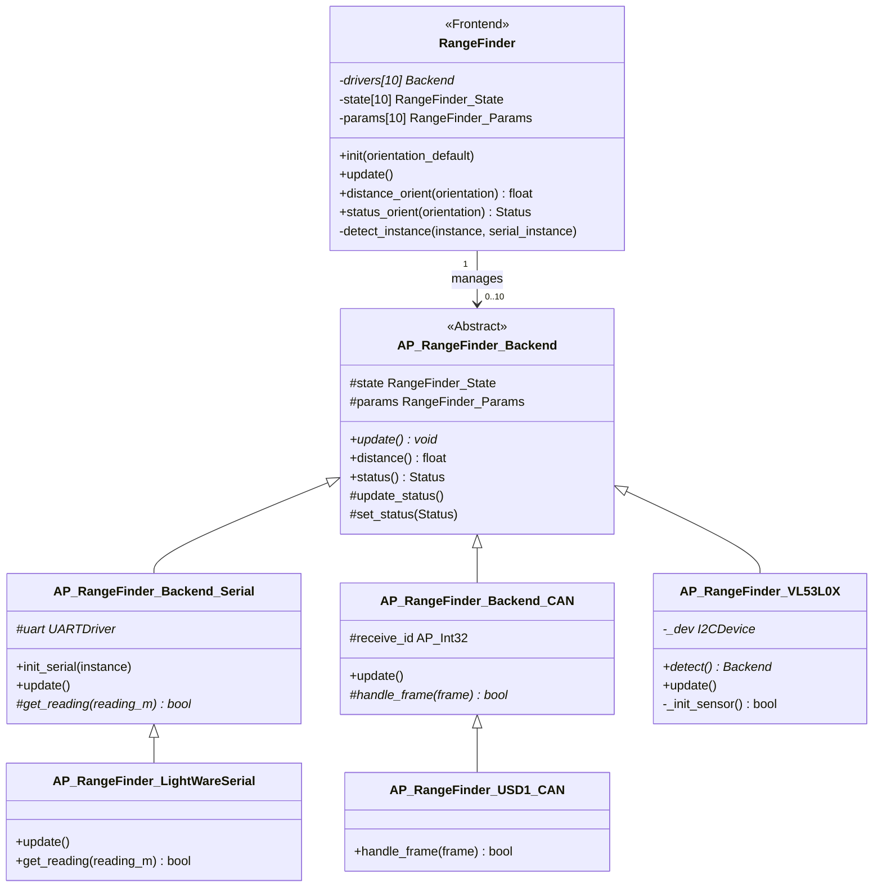
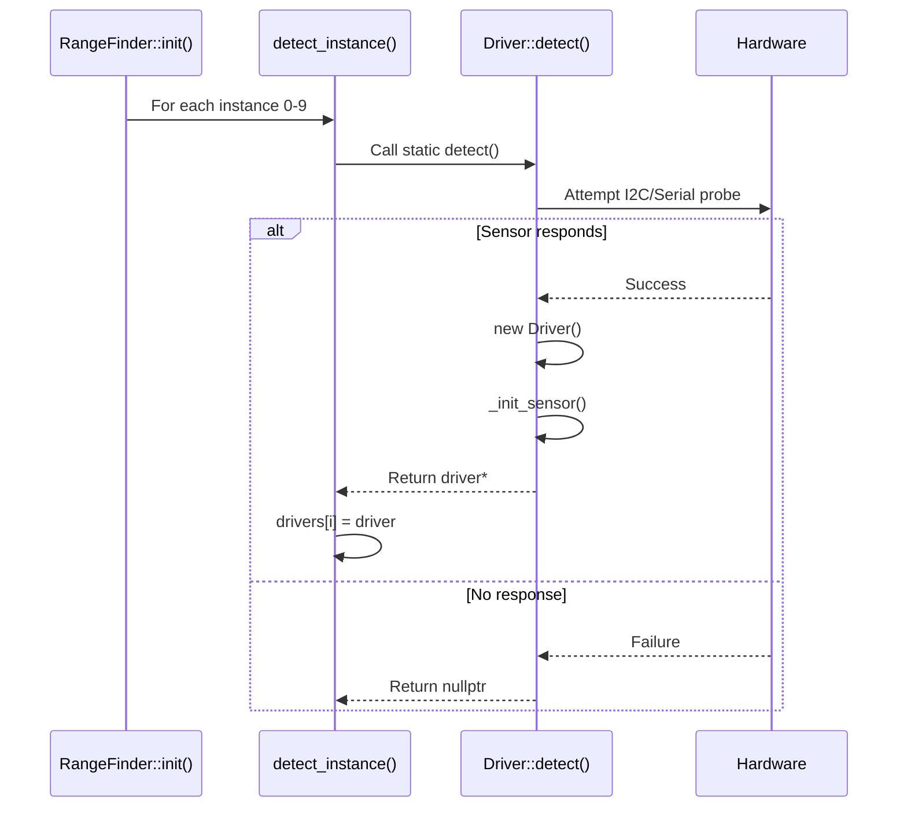
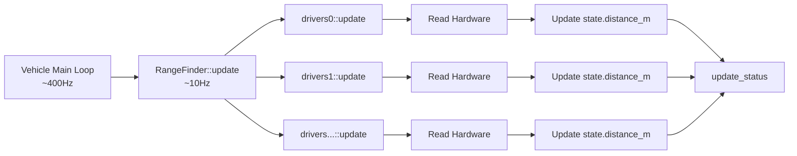
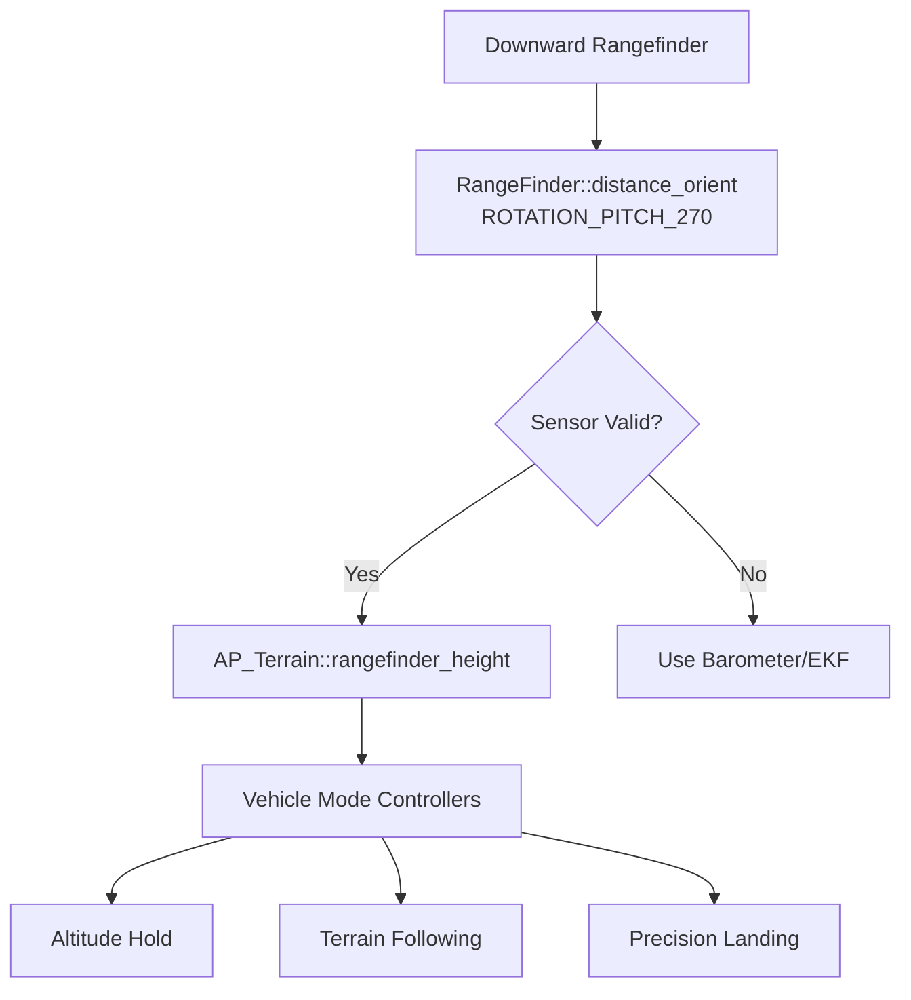

# AP_RangeFinder Library


## Table of Contents
- [Overview](#overview)
- [Architecture](#architecture)
  - [Frontend/Backend Pattern](#frontendbackend-pattern)
  - [HAL Abstraction](#hal-abstraction)
  - [Class Hierarchy](#class-hierarchy)
- [Supported Sensors](#supported-sensors)
  - [Lidar Sensors](#lidar-sensors)
  - [Sonar Sensors](#sonar-sensors)
  - [Radar Sensors](#radar-sensors)
  - [By Interface Type](#by-interface-type)
- [Driver Implementation Guide](#driver-implementation-guide)
  - [Backend Driver Structure](#backend-driver-structure)
  - [detect() Factory Pattern](#detect-factory-pattern)
  - [update() Lifecycle](#update-lifecycle)
- [Configuration](#configuration)
  - [Orientation Configuration](#orientation-configuration)
  - [Parameter Reference](#parameter-reference)
  - [Multi-Sensor Setup](#multi-sensor-setup)
- [System Integration](#system-integration)
  - [Obstacle Detection (AP_Proximity)](#obstacle-detection-ap_proximity)
  - [Terrain Following (AP_Terrain)](#terrain-following-ap_terrain)
- [Usage Examples](#usage-examples)
  - [Altitude Hold](#altitude-hold)
  - [Precision Landing](#precision-landing)
  - [Collision Avoidance](#collision-avoidance)
- [Vehicle-Specific Use Cases](#vehicle-specific-use-cases)
- [API Reference](#api-reference)
- [Testing](#testing)

## Overview

The AP_RangeFinder library provides a unified interface for distance sensor integration across ArduPilot vehicle types. It manages detection, initialization, configuration, and real-time polling of rangefinder sensors (lidar, sonar, radar) to provide accurate distance measurements for altitude control, terrain following, obstacle avoidance, and precision landing.

**Source Files**: `libraries/AP_RangeFinder/`

**Key Features**:
- Support for up to 10 simultaneous rangefinder instances
- 40+ sensor drivers covering lidar, sonar, and radar technologies
- Multiple interface support: I2C, UART, CAN (DroneCAN), PWM, Analog
- Configurable sensor orientations for multi-directional sensing
- Integration with AP_Proximity for obstacle detection
- Terrain following support via AP_Terrain
- MAVLink, MSP, and Lua scripting interfaces
- Pre-arm health checks and signal quality monitoring

**Primary Responsibilities**:
- Sensor detection and initialization at boot
- Real-time distance measurement polling (typically 10Hz)
- Data validation and range checking
- Sensor fusion for multi-sensor configurations
- Status reporting and health monitoring
- Parameter management and persistence

**Singleton Access**:
```cpp
RangeFinder *rangefinder = AP::rangefinder();
```

## Architecture

### Frontend/Backend Pattern

The AP_RangeFinder library employs a classic frontend/backend architecture to separate the user-facing API from hardware-specific driver implementations.

**Frontend (`RangeFinder` class)**:
- Source: `libraries/AP_RangeFinder/AP_RangeFinder.h`, `AP_RangeFinder.cpp`
- Manages up to `RANGEFINDER_MAX_INSTANCES` (default: 10) sensor instances
- Provides unified API for vehicle code to query distance measurements
- Handles sensor detection during initialization
- Coordinates update() calls to all active backends
- Implements orientation-based sensor selection
- Manages parameter storage and retrieval

**Backend (`AP_RangeFinder_Backend` class)**:
- Source: `libraries/AP_RangeFinder/AP_RangeFinder_Backend.h`, `AP_RangeFinder_Backend.cpp`
- Abstract base class defining the driver interface
- Each concrete driver (e.g., `AP_RangeFinder_VL53L0X`) inherits from this
- Implements hardware-specific communication protocols
- Updates shared state structure with distance measurements
- Handles sensor-specific error conditions



**State Structure** (Source: `AP_RangeFinder.h:212-221`):
```cpp
struct RangeFinder_State {
    float distance_m;                   // Measured distance in meters
    int8_t signal_quality_pct;          // Signal quality 0-100, or -1 if unknown
    uint16_t voltage_mv;                // Analog voltage in millivolts (if applicable)
    enum RangeFinder::Status status;    // Sensor status
    uint8_t range_valid_count;          // Consecutive valid readings (max 10)
    uint32_t last_reading_ms;           // Timestamp of last successful reading
};
```

### HAL Abstraction

The AP_RangeFinder library leverages the Hardware Abstraction Layer (HAL) to maintain portability across different autopilot hardware platforms (ChibiOS, Linux, SITL).

**I2C Bus Abstraction**:
- Uses `AP_HAL::I2CDevice` and `AP_HAL::I2CDeviceManager`
- Drivers call `hal.i2c_mgr->get_device(bus, address)` to obtain device handles
- Example: `AP_RangeFinder_VL53L0X::detect()` iterates through I2C buses with `FOREACH_I2C(i)`

**Serial/UART Abstraction**:
- Serial backends inherit from `AP_RangeFinder_Backend_Serial`
- Uses `AP_SerialManager` to allocate UART ports by protocol type
- Initialization via `init_serial(serial_instance)` obtains `AP_HAL::UARTDriver*`

**CAN Bus Abstraction**:
- CAN backends inherit from `AP_RangeFinder_Backend_CAN`
- Integrates with `AP_CANManager` and DroneCAN stack
- Frame reception via `handle_frame(AP_HAL::CANFrame&)` virtual method

**Timer/Scheduler Abstraction**:
- Many drivers use `hal.scheduler->register_periodic_callback()` for continuous sampling
- Semaphore protection via `HAL_Semaphore` and `WITH_SEMAPHORE()` macros

**GPIO Abstraction**:
- PWM-based sensors (e.g., HC-SR04) use `hal.gpio->pinMode()` and timing functions

### Class Hierarchy

The library organizes drivers into a clear inheritance hierarchy:

```
AP_RangeFinder_Backend (Abstract base class)
├── Direct implementations
│   ├── AP_RangeFinder_VL53L0X         (I2C time-of-flight)
│   ├── AP_RangeFinder_VL53L1X         (I2C time-of-flight, long range)
│   ├── AP_RangeFinder_MaxsonarI2CXL   (I2C ultrasonic)
│   ├── AP_RangeFinder_PulsedLightLRF  (I2C lidar)
│   ├── AP_RangeFinder_LightWareI2C    (I2C lidar)
│   ├── AP_RangeFinder_TeraRangerI2C   (I2C lidar)
│   ├── AP_RangeFinder_Benewake_TFMiniPlus (I2C lidar)
│   ├── AP_RangeFinder_TOFSenseF_I2C   (I2C lidar)
│   ├── AP_RangeFinder_analog          (Analog voltage)
│   ├── AP_RangeFinder_PWM             (PWM pulse width)
│   ├── AP_RangeFinder_HC_SR04         (GPIO ultrasonic)
│   ├── AP_RangeFinder_MAVLink         (MAVLink DISTANCE_SENSOR)
│   ├── AP_RangeFinder_MSP             (MSP protocol)
│   ├── AP_RangeFinder_Lua             (Lua scripting)
│   └── AP_RangeFinder_SITL            (Simulation)
│
├── AP_RangeFinder_Backend_Serial (Serial/UART specialization)
│   ├── AP_RangeFinder_LightWareSerial (Serial lidar)
│   ├── AP_RangeFinder_LeddarOne       (Serial lidar, Modbus)
│   ├── AP_RangeFinder_LeddarVu8       (Serial lidar array, Modbus)
│   ├── AP_RangeFinder_MaxsonarSerialLV (Serial ultrasonic)
│   ├── AP_RangeFinder_USD1_Serial     (Serial lidar)
│   ├── AP_RangeFinder_Benewake_TF02   (Serial lidar)
│   ├── AP_RangeFinder_Benewake_TF03   (Serial lidar)
│   ├── AP_RangeFinder_Benewake_TFMini (Serial lidar)
│   ├── AP_RangeFinder_TeraRanger_Serial (Serial lidar)
│   ├── AP_RangeFinder_NMEA            (NMEA depth sounder)
│   ├── AP_RangeFinder_GYUS42v2        (Serial ultrasonic)
│   ├── AP_RangeFinder_Wasp            (Serial lidar array)
│   ├── AP_RangeFinder_BLPing          (Serial underwater sonar)
│   ├── AP_RangeFinder_Lanbao          (Serial laser)
│   ├── AP_RangeFinder_JRE_Serial      (Serial radar)
│   ├── AP_RangeFinder_NoopLoop        (Serial ToF)
│   ├── AP_RangeFinder_Ainstein_LR_D1  (Serial radar)
│   └── AP_RangeFinder_RDS02UF         (Serial ultrasonic)
│
└── AP_RangeFinder_Backend_CAN (CAN bus specialization)
    ├── AP_RangeFinder_DroneCAN        (DroneCAN/UAVCAN)
    ├── AP_RangeFinder_USD1_CAN        (CAN lidar)
    ├── AP_RangeFinder_Benewake_CAN    (CAN lidar)
    ├── AP_RangeFinder_TOFSenseP_CAN   (CAN lidar)
    ├── AP_RangeFinder_NRA24_CAN       (CAN radar)
    └── AP_RangeFinder_HEXSOON_RADAR   (CAN radar)
```

## Supported Sensors

The AP_RangeFinder library supports 40+ rangefinder models spanning lidar, sonar, and radar technologies. Sensors are categorized by sensing technology and communication interface.

### Lidar Sensors

Lidar (Light Detection and Ranging) sensors use laser pulses to measure distance with high accuracy.

| Sensor Model | Type Enum | Interface | Range | Notes |
|--------------|-----------|-----------|-------|-------|
| **PulsedLight LIDAR-Lite v1/v2** | `PLI2C` (3) | I2C | 0-40m | Popular low-cost lidar |
| **PulsedLight LIDAR-Lite v3** | `PLI2CV3` (15) | I2C | 0-40m | Improved v3 version |
| **PulsedLight LIDAR-Lite v3HP** | `PLI2CV3HP` (21) | I2C | 0-40m | High-performance variant |
| **LightWare SF02, SF10, SF11** | `LWI2C` (7) | I2C | 0-50m | Industrial lidar |
| **LightWare SF02, SF10, SF11** | `LWSER` (8) | Serial | 0-50m | Serial version |
| **LeddarOne** | `LEDDARONE` (12) | Serial | 0-40m | Modbus RTU protocol |
| **LeddarVu8** | `LeddarVu8_Serial` (29) | Serial | 0-215m | 8-segment lidar array |
| **Benewake TF02** | `BenewakeTF02` (19) | Serial | 0.3-22m | Cost-effective lidar |
| **Benewake TF03** | `BenewakeTF03` (27) | Serial | 0.1-180m | Long-range lidar |
| **Benewake TFmini** | `BenewakeTFmini` (20) | Serial | 0.3-12m | Compact micro lidar |
| **Benewake TFmini Plus** | `BenewakeTFminiPlus` (25) | I2C/Serial | 0.1-12m | Enhanced TFmini |
| **Benewake CAN** | `Benewake_CAN` (34) | CAN | Varies | CAN bus variants |
| **TeraRanger One/Evo** | `TRI2C` (14) | I2C | 0.2-14m | Fast sampling rate |
| **TeraRanger Serial** | `TeraRanger_Serial` (35) | Serial | 0.2-14m | Serial version |
| **Lanbao PSK-CM8JL65-CC5** | `Lanbao` (26) | Serial | 0.1-8m | Industrial laser |
| **USD1 (Benewake TF02 Pro)** | `USD1_Serial` (11) | Serial | 0.3-22m | Extended range |
| **USD1 CAN** | `USD1_CAN` (33) | CAN | 0.3-22m | CAN version |
| **Wasp** | `WASP` (18) | Serial | 0.1-45m | Multi-directional array |
| **TOFSense-F** | `TOFSenseF_I2C` (40) | I2C | 0.05-12m | High-speed ToF |
| **TOFSense-P CAN** | `TOFSenseP_CAN` (38) | CAN | 0.05-20m | CAN time-of-flight |
| **NoopLoop TOFSense** | `NoopLoop_P` (37) | Serial | 0.05-10m | Precision ToF |
| **JRE ZLSN** | `JRE_Serial` (41) | Serial | 0.2-20m | Laser distance |

### Sonar Sensors

Sonar (ultrasonic) sensors use sound waves for distance measurement, effective for short ranges and soft targets.

| Sensor Model | Type Enum | Interface | Range | Notes |
|--------------|-----------|-----------|-------|-------|
| **MaxBotix I2CXL series** | `MBI2C` (2) | I2C | 0.2-7.6m | EZ0-4, XL-MaxSonar |
| **MaxBotix Serial LV/XL** | `MBSER` (13) | Serial | 0.2-7.6m | ASCII/binary output |
| **HC-SR04** | `HC_SR04` (30) | GPIO | 0.02-4m | Low-cost ultrasonic |
| **GY-US42v2** | `GYUS42v2` (31) | Serial | 0.02-7m | I2C/Serial ultrasonic |
| **RDS-02-UF** | `RDS02UF` (43) | Serial | 0.2-5m | Ultrasonic sensor |
| **Blue Robotics Ping** | `BLPing` (23) | Serial | 0.5-30m | Underwater sonar |
| **NMEA Depth Sounder** | `NMEA` (17) | Serial | Varies | Marine depth sounder |
| **Bebop Sonar** | `BEBOP` (9) | Platform | 0.1-8m | Parrot Bebop built-in |

### Radar Sensors

Radar sensors use radio waves for distance measurement, suitable for all weather conditions.

| Sensor Model | Type Enum | Interface | Range | Notes |
|--------------|-----------|-----------|-------|-------|
| **Ainstein US-D1** | `Ainstein_LR_D1` (42) | Serial | 0.5-75m | 24GHz radar |
| **NRA24 (Nooploop)** | `NRA24_CAN` (39) | CAN | 0.15-15m | mmWave radar |
| **HexSoon Radar** | `HEXSOON_RADAR` (44) | CAN | 0.15-15m | mmWave radar |

### By Interface Type

**I2C Sensors** (typically 0x29, 0x62, 0x70 addresses):
- PulsedLight variants (PLI2C, PLI2CV3, PLI2CV3HP)
- MaxBotix I2CXL (MBI2C)
- LightWare I2C (LWI2C)
- TeraRanger I2C (TRI2C)
- VL53L0X, VL53L1X
- Benewake TFmini Plus (I2C mode)
- TOFSense-F I2C

**Serial/UART Sensors** (configured via `SERIAL*_PROTOCOL = 9` for rangefinder):
- LightWare Serial, LeddarOne, LeddarVu8
- MaxBotix Serial, USD1 Serial
- Benewake TF02/TF03/TFmini family
- TeraRanger Serial, NMEA
- GYUS42v2, Wasp, BLPing, Lanbao
- JRE Serial, NoopLoop, Ainstein, RDS02UF

**CAN Sensors** (DroneCAN or proprietary CAN):
- DroneCAN rangefinders (Type 24)
- USD1 CAN, Benewake CAN
- TOFSense-P CAN, NRA24 CAN, HexSoon Radar

**PWM/Analog Sensors**:
- PX4_PWM (Type 5) - PWM pulse width measurement
- PWM (Type 22) - Generic PWM rangefinder
- Analog (Type 1) - Analog voltage input (e.g., LV-MaxSonar-EZ)

**Protocol-Based Sensors**:
- MAVLink (Type 10) - DISTANCE_SENSOR messages
- MSP (Type 32) - MultiWii Serial Protocol
- Lua_Scripting (Type 36) - Custom Lua script drivers

**Simulation**:
- SIM (Type 100) - SITL simulation rangefinder

## Driver Implementation Guide

### Backend Driver Structure

All rangefinder drivers inherit from `AP_RangeFinder_Backend` and must implement the pure virtual `update()` method. Drivers follow a common structure pattern.

**Minimum Driver Requirements**:

```cpp
// Header file: AP_RangeFinder_MySensor.h
#pragma once

#include "AP_RangeFinder_Backend.h"

class AP_RangeFinder_MySensor : public AP_RangeFinder_Backend
{
public:
    // Static factory method for detection
    static AP_RangeFinder_Backend *detect(
        RangeFinder::RangeFinder_State &state,
        AP_RangeFinder_Params &params);
    
    // Update distance reading (called at ~10Hz)
    void update() override;
    
protected:
    // Return MAVLink sensor type for telemetry
    MAV_DISTANCE_SENSOR _get_mav_distance_sensor_type() const override {
        return MAV_DISTANCE_SENSOR_LASER;
    }
    
private:
    // Constructor (private - use detect() factory)
    AP_RangeFinder_MySensor(
        RangeFinder::RangeFinder_State &state,
        AP_RangeFinder_Params &params);
    
    // Hardware interface (I2C device, UART, etc.)
    AP_HAL::I2CDevice *_dev;
    
    // Internal state
    bool _init_sensor();
    uint32_t _sum_mm;
    uint32_t _count;
};
```

**Implementation file structure**:

```cpp
// Source file: AP_RangeFinder_MySensor.cpp
#include "AP_RangeFinder_MySensor.h"

// Static factory: detect and instantiate driver
AP_RangeFinder_Backend *AP_RangeFinder_MySensor::detect(
    RangeFinder::RangeFinder_State &state,
    AP_RangeFinder_Params &params)
{
    // Allocate driver instance (NEW_NOTHROW for error handling)
    AP_RangeFinder_MySensor *sensor = NEW_NOTHROW AP_RangeFinder_MySensor(state, params);
    if (!sensor) {
        return nullptr;
    }
    
    // Attempt hardware initialization
    if (!sensor->_init_sensor()) {
        delete sensor;
        return nullptr;
    }
    
    return sensor;
}

// Constructor
AP_RangeFinder_MySensor::AP_RangeFinder_MySensor(
    RangeFinder::RangeFinder_State &_state,
    AP_RangeFinder_Params &_params)
    : AP_RangeFinder_Backend(_state, _params)
{
}

// Initialize sensor hardware
bool AP_RangeFinder_MySensor::_init_sensor()
{
    // Acquire I2C device handle
    _dev = hal.i2c_mgr->get_device(bus, address);
    if (!_dev) {
        return false;
    }
    
    // Configure sensor registers
    WITH_SEMAPHORE(_dev->get_semaphore());
    _dev->write_register(REG_MODE, MODE_CONTINUOUS);
    
    // Register periodic callback for async reading
    _dev->register_periodic_callback(100000,  // 100ms = 10Hz
        FUNCTOR_BIND_MEMBER(&AP_RangeFinder_MySensor::timer, void));
    
    return true;
}

// Update method: called by frontend at ~10Hz
void AP_RangeFinder_MySensor::update()
{
    // Accumulate readings taken by timer callback
    if (_count == 0) {
        // No new data
        set_status(RangeFinder::Status::NoData);
        return;
    }
    
    // Average accumulated readings
    WITH_SEMAPHORE(_sem);
    state.distance_m = (_sum_mm / _count) * 0.001f;  // Convert mm to meters
    state.last_reading_ms = AP_HAL::millis();
    _sum_mm = 0;
    _count = 0;
    
    // Validate reading and update status
    update_status();
}

// Timer callback: read sensor (called from interrupt context)
void AP_RangeFinder_MySensor::timer()
{
    uint16_t distance_mm;
    
    WITH_SEMAPHORE(_dev->get_semaphore());
    if (_dev->read_registers(REG_DISTANCE, (uint8_t*)&distance_mm, 2)) {
        WITH_SEMAPHORE(_sem);
        _sum_mm += distance_mm;
        _count++;
    }
}
```

### detect() Factory Pattern

The `detect()` static method implements the factory pattern for sensor instantiation. This pattern is called during system initialization to probe for connected sensors.

**Source**: `AP_RangeFinder.cpp:285-600` (detect_instance method)

**Detection Flow**:



**I2C Detection Example** (VL53L0X):

```cpp
AP_RangeFinder_Backend *AP_RangeFinder_VL53L0X::detect(
    RangeFinder::RangeFinder_State &_state,
    AP_RangeFinder_Params &_params,
    AP_HAL::OwnPtr<AP_HAL::I2CDevice> dev)
{
    if (!dev) {
        return nullptr;
    }
    
    // Instantiate driver
    AP_RangeFinder_VL53L0X *sensor = NEW_NOTHROW AP_RangeFinder_VL53L0X(_state, _params, std::move(dev));
    
    if (!sensor) {
        return nullptr;
    }
    
    // Initialize sensor hardware
    if (!sensor->_init()) {
        delete sensor;
        return nullptr;
    }
    
    return sensor;
}
```

**Serial Detection Example** (LightWare Serial):

```cpp
// Serial drivers are detected via AP_SerialManager protocol matching
// The detect_instance() method in AP_RangeFinder.cpp handles serial allocation
```

**Key Detection Patterns**:

- **I2C Multi-Bus Scan**: Use `FOREACH_I2C(i)` macro to try all available I2C buses
- **Address Configuration**: Check `params.address` for user-configured I2C address
- **Serial Instance Tracking**: Serial drivers increment `serial_instance` to allocate next available UART
- **Probe Validation**: Read device ID register or attempt test transaction to confirm presence
- **Resource Cleanup**: Delete allocated driver if initialization fails

### update() Lifecycle

The `update()` method is the core of each driver, called by the frontend at approximately 10Hz from the main vehicle loop.

**Source**: `RangeFinder::update()` in `AP_RangeFinder.cpp:245-261`

**Update Call Chain**:



**Common Update Patterns**:

**1. Synchronous Reading** (simple serial sensors):
```cpp
void AP_RangeFinder_SimpleSensor::update()
{
    float reading_m;
    
    // Attempt to read from sensor
    if (get_reading(reading_m)) {
        // Valid reading received
        state.distance_m = reading_m;
        state.last_reading_ms = AP_HAL::millis();
        update_status();  // Sets Good/OutOfRange/OutOfRangeLow
    } else {
        // Check for timeout
        uint32_t now = AP_HAL::millis();
        if (now - state.last_reading_ms > read_timeout_ms()) {
            set_status(RangeFinder::Status::NoData);
        }
    }
}
```

**2. Asynchronous Accumulation** (high-rate I2C sensors):
```cpp
// Timer callback runs at high rate (e.g., 50Hz)
void AP_RangeFinder_FastSensor::timer()
{
    uint16_t raw_value;
    if (read_sensor(&raw_value)) {
        WITH_SEMAPHORE(_sem);
        _sum += raw_value;
        _count++;
    }
}

// Update averages accumulated readings
void AP_RangeFinder_FastSensor::update()
{
    WITH_SEMAPHORE(_sem);
    if (_count > 0) {
        state.distance_m = (float)_sum / _count * SCALE_FACTOR;
        state.last_reading_ms = AP_HAL::millis();
        _sum = 0;
        _count = 0;
        update_status();
    } else {
        set_status(RangeFinder::Status::NoData);
    }
}
```

**3. State Machine** (sensors requiring multi-phase transactions):
```cpp
void AP_RangeFinder_StateMachine::update()
{
    switch (_state) {
        case State::IDLE:
            // Trigger measurement
            trigger_measurement();
            _state = State::WAIT_READY;
            _trigger_time_ms = AP_HAL::millis();
            break;
            
        case State::WAIT_READY:
            // Wait for conversion time
            if (AP_HAL::millis() - _trigger_time_ms > CONVERSION_TIME_MS) {
                _state = State::READ_RESULT;
            }
            break;
            
        case State::READ_RESULT:
            if (read_result(&state.distance_m)) {
                state.last_reading_ms = AP_HAL::millis();
                update_status();
            }
            _state = State::IDLE;
            break;
    }
}
```

**Status Management**:

The `update_status()` helper automatically sets the appropriate status based on distance:

```cpp
// Source: AP_RangeFinder_Backend.cpp:60-70
void AP_RangeFinder_Backend::update_status()
{
    if (state.distance_m > max_distance()) {
        set_status(RangeFinder::Status::OutOfRangeHigh);
    } else if (state.distance_m < min_distance()) {
        set_status(RangeFinder::Status::OutOfRangeLow);
    } else {
        set_status(RangeFinder::Status::Good);
    }
}
```

**Status Enum** (Source: `AP_RangeFinder.h:199-205`):
- `NotConnected` (0): Sensor not detected or disabled
- `NoData` (1): No readings received within timeout
- `OutOfRangeLow` (2): Distance below configured minimum
- `OutOfRangeHigh` (3): Distance above configured maximum
- `Good` (4): Valid measurement within range

**Range Valid Count**: The `range_valid_count` field (Source: `AP_RangeFinder_Backend.cpp:73-84`) tracks consecutive good readings (maxes at 10) and is used by vehicle code to ensure sensor stability before trusting readings.

## Configuration

### Orientation Configuration

Rangefinders can be mounted in various orientations to provide distance measurements in different directions. This is critical for obstacle avoidance and terrain following.

**Supported Orientations** (enum `Rotation` from `AP_Math`):

| Orientation | Value | Direction | Use Case |
|-------------|-------|-----------|----------|
| `ROTATION_PITCH_270` | 25 | Down | Altitude/terrain (most common) |
| `ROTATION_NONE` | 0 | Forward | Forward collision avoidance |
| `ROTATION_YAW_45` | 2 | Forward-Right | Multi-directional obstacle detection |
| `ROTATION_YAW_90` | 3 | Right | Side obstacle detection |
| `ROTATION_YAW_135` | 4 | Rear-Right | Rear coverage |
| `ROTATION_YAW_180` | 5 | Rear | Rear collision avoidance |
| `ROTATION_YAW_225` | 6 | Rear-Left | Rear coverage |
| `ROTATION_YAW_270` | 7 | Left | Side obstacle detection |
| `ROTATION_YAW_315` | 8 | Forward-Left | Multi-directional obstacle detection |
| `ROTATION_PITCH_90` | 24 | Up | Ceiling detection |

**Configuration**:
```
RNGFND1_ORIENT = 25    # Down-facing (default for altitude sensing)
RNGFND2_ORIENT = 0     # Forward-facing (obstacle avoidance)
RNGFND3_ORIENT = 3     # Right-facing
RNGFND4_ORIENT = 7     # Left-facing
```

**Orientation-Based Query** (Source: `AP_RangeFinder.h:294-303`):

Vehicle code queries rangefinder by orientation rather than instance number:

```cpp
// Get distance from downward-facing sensor
float altitude_m = rangefinder->distance_orient(ROTATION_PITCH_270);

// Check if forward-facing sensor is healthy
RangeFinder::Status fwd_status = rangefinder->status_orient(ROTATION_NONE);
if (fwd_status == RangeFinder::Status::Good) {
    float obstacle_distance_m = rangefinder->distance_orient(ROTATION_NONE);
}
```

**Multi-Sensor Fusion**: When multiple sensors share the same orientation, the library selects the one with the most recent valid reading (Source: `AP_RangeFinder.cpp:find_instance()`).

### Parameter Reference

Each rangefinder instance has a complete parameter set (prefix `RNGFND1_` through `RNGFND10_`):

**Source**: `AP_RangeFinder_Params.h`, `AP_RangeFinder_Params.cpp`

| Parameter | Type | Description | Units | Default |
|-----------|------|-------------|-------|---------|
| `RNGFND*_TYPE` | Int8 | Sensor type enum | - | 0 (None) |
| `RNGFND*_PIN` | Int8 | Analog input pin | - | -1 |
| `RNGFND*_SCALING` | Float | Linear scaling factor | - | 1.0 |
| `RNGFND*_OFFSET` | Float | Offset added to distance | m | 0.0 |
| `RNGFND*_FUNCTION` | Int8 | Scaling function (0=Linear, 1=Inverted, 2=Hyperbola) | - | 0 |
| `RNGFND*_MIN_CM` | Float | Minimum valid distance | m | 0.2 |
| `RNGFND*_MAX_CM` | Float | Maximum valid distance | m | 40.0 |
| `RNGFND*_STOP_PIN` | Int8 | Pin for stopping measurements | - | -1 |
| `RNGFND*_RMETRIC` | Int8 | Ratiometric analog sensor | bool | 0 |
| `RNGFND*_GNDCLEAR` | Float | Ground clearance when landed | m | 0.1 |
| `RNGFND*_ADDR` | Int8 | I2C/CAN address | - | 0 (auto) |
| `RNGFND*_POS_X` | Float | X position offset | m | 0.0 |
| `RNGFND*_POS_Y` | Float | Y position offset | m | 0.0 |
| `RNGFND*_POS_Z` | Float | Z position offset | m | 0.0 |
| `RNGFND*_ORIENT` | Int8 | Sensor orientation | enum | 25 (down) |
| `RNGFND*_WSP_MAVG` | Int8 | Wasp moving average window | samples | 0 |
| `RNGFND*_WSP_MEDF` | Int8 | Wasp median filter window | samples | 0 |
| `RNGFND*_WSP_FRQ` | Int8 | Wasp update frequency | Hz | 0 |
| `RNGFND*_WSP_AVG` | Int8 | Wasp averaging | - | 0 |
| `RNGFND*_WSP_THR` | Int8 | Wasp threshold | - | 0 |
| `RNGFND*_WSP_BAUD` | Int32 | Wasp baud rate | baud | 0 |
| `RNGFND*_RECV_ID` | Int32 | CAN receive ID | - | 0 |
| `RNGFND*_SNR_MIN` | Int32 | Minimum signal-to-noise ratio | - | 0 |

**Note**: Parameters marked `RNGFND*_WSP_*` are Wasp-specific. CAN parameters (`RECV_ID`, `SNR_MIN`) apply to CAN backends.

### Multi-Sensor Setup

The library supports up to 10 simultaneous rangefinder instances (`RANGEFINDER_MAX_INSTANCES`).

**Source**: `AP_RangeFinder.h:30-36`

**Configuration Example** (obstacle avoidance with 4 sensors):

```
# Sensor 1: Down-facing lidar for terrain following
RNGFND1_TYPE = 20          # Benewake TFmini
RNGFND1_ORIENT = 25        # Down (ROTATION_PITCH_270)
RNGFND1_MIN_CM = 30        # 0.3m minimum
RNGFND1_MAX_CM = 1200      # 12m maximum
SERIAL2_PROTOCOL = 9       # Rangefinder protocol
SERIAL2_BAUD = 115         # 115200 baud

# Sensor 2: Forward-facing lidar for collision avoidance
RNGFND2_TYPE = 15          # PulsedLight v3
RNGFND2_ORIENT = 0         # Forward (ROTATION_NONE)
RNGFND2_ADDR = 98          # I2C address 0x62
RNGFND2_MIN_CM = 50        # 0.5m minimum
RNGFND2_MAX_CM = 4000      # 40m maximum

# Sensor 3: Right-facing ultrasonic
RNGFND3_TYPE = 2           # MaxBotix I2CXL
RNGFND3_ORIENT = 3         # Right (ROTATION_YAW_90)
RNGFND3_ADDR = 112         # I2C address 0x70
RNGFND3_MIN_CM = 20        # 0.2m minimum
RNGFND3_MAX_CM = 765       # 7.65m maximum

# Sensor 4: Left-facing ultrasonic
RNGFND4_TYPE = 2           # MaxBotix I2CXL
RNGFND4_ORIENT = 7         # Left (ROTATION_YAW_270)
RNGFND4_ADDR = 113         # I2C address 0x71
RNGFND4_MIN_CM = 20
RNGFND4_MAX_CM = 765
```

**Position Offsets**: For precise applications, configure sensor physical position relative to vehicle center of gravity:

```
RNGFND1_POS_X = 0.0       # Center
RNGFND1_POS_Y = 0.0       # Center
RNGFND1_POS_Z = -0.05     # 5cm below CG

RNGFND2_POS_X = 0.15      # 15cm forward
RNGFND2_POS_Y = 0.0       # Center
RNGFND2_POS_Z = 0.0       # Level with CG
```

**Initialization Order**: Sensors are detected sequentially during `RangeFinder::init()` (Source: `AP_RangeFinder.cpp:206-239`). Each instance's `detect_instance()` is called with type checking against `RNGFND*_TYPE` parameter.

## System Integration

### Obstacle Detection (AP_Proximity)

The AP_RangeFinder library integrates with the AP_Proximity system to provide obstacle detection for path planning and collision avoidance.

**Integration Point**: `AP_Proximity_RangeFinder` backend

The AP_Proximity library can use rangefinder instances as obstacle sensors by reading their orientation-based distance measurements. This enables:

- **Simple Avoidance**: Single forward-facing rangefinder for basic obstacle detection
- **Multi-Directional Sensing**: 3D obstacle map from multiple oriented rangefinders
- **OA_TYPE Configuration**: Set `OA_TYPE = 2` to enable proximity-based avoidance

**Data Flow**:


**Example Usage in Vehicle Code**:

```cpp
// Check for obstacles in multiple directions
AP_Proximity *proximity = AP::proximity();
float distance_m;
if (proximity->get_horizontal_distance(0.0f, distance_m)) {  // 0° = forward
    if (distance_m < 5.0f) {
        // Obstacle detected within 5m forward
        gcs().send_text(MAV_SEVERITY_WARNING, "Obstacle %.1fm ahead", distance_m);
    }
}
```

**Configuration for Proximity**:
```
PRX_TYPE = 4               # Rangefinder-based proximity
AVOID_ENABLE = 3           # Enable avoidance (slide and stop)
AVOID_MARGIN = 2.0         # 2m avoidance margin
```

**Supported Patterns**:
- **Single Forward Sensor**: Basic collision warning
- **Dual Horizontal**: Forward + rear sensing
- **Quad Horizontal**: 360° horizontal coverage (0°, 90°, 180°, 270°)
- **3D Sensing**: Combined horizontal and vertical (up/down) sensing

### Terrain Following (AP_Terrain)

Downward-facing rangefinders provide real-time terrain altitude for precision terrain following and safe landing operations.

**Integration Point**: `AP_Terrain::rangefinder_height()`

The AP_Terrain library uses the rangefinder's downward-facing sensor (orientation `ROTATION_PITCH_270`) to:

- Provide ground-relative altitude for terrain following modes
- Validate terrain database elevation data
- Enable precision landing with real-time height AGL (Above Ground Level)
- Support surface tracking for rovers and boats

**Data Flow**:



**Terrain Following Mode** (Copter example):

```cpp
// In AC_WPNav terrain following
AP_Terrain *terrain = AP::terrain();
RangeFinder *rangefinder = AP::rangefinder();

// Use rangefinder if healthy, otherwise terrain database
float terrain_alt_cm;
if (rangefinder->status_orient(ROTATION_PITCH_270) == RangeFinder::Status::Good) {
    // Direct rangefinder measurement
    float ground_distance_m = rangefinder->distance_orient(ROTATION_PITCH_270);
    terrain_alt_cm = (current_alt_cm - ground_distance_m * 100.0f);
} else if (terrain->height_terrain_difference_home(terrain_alt_cm, true)) {
    // Fall back to terrain database
}
```

**Configuration for Terrain Following**:
```
RNGFND1_TYPE = 20          # Downward lidar
RNGFND1_ORIENT = 25        # Down
RNGFND1_MIN_CM = 30        # Minimum reliable range
RNGFND1_MAX_CM = 1000      # Maximum range
RNGFND1_GNDCLEAR = 0.10    # Expected ground clearance when landed (10cm)

TERRAIN_ENABLE = 1         # Enable terrain following
WPNAV_RFND_USE = 1         # Use rangefinder for terrain following
```

**Pre-Arm Checks**: The rangefinder undergoes pre-arm validation to ensure terrain following safety (Source: `AP_RangeFinder.cpp:prearm_healthy()`):

- Sensor must return valid data
- Reading must change by at least `RANGEFINDER_PREARM_REQUIRED_CHANGE_CM` (default 50cm) when vehicle is lifted
- Distance must be below `RANGEFINDER_PREARM_ALT_MAX_CM` (default 2m) for ground-level testing

**Estimated Terrain Height**: Vehicle code can inform the rangefinder of estimated terrain altitude to enable power-saving modes on supported sensors (Source: `AP_RangeFinder.h:312-314`):

```cpp
rangefinder->set_estimated_terrain_height(terrain_height_m);
```

## Usage Examples

### Altitude Hold

**Scenario**: Quadcopter maintaining stable hover over uneven terrain.

**Configuration**:
```
RNGFND1_TYPE = 16          # VL53L0X I2C lidar
RNGFND1_ORIENT = 25        # Down-facing
RNGFND1_MIN_CM = 5         # 5cm minimum (sensor spec)
RNGFND1_MAX_CM = 1200      # 12m maximum (effective range)
RNGFND1_GNDCLEAR = 0.08    # 8cm ground clearance (landing gear)

# Enable surface tracking in altitude control
WPNAV_RFND_USE = 1         # Use rangefinder for surface tracking
```

**Vehicle Code** (ArduCopter altitude control):

```cpp
// In Copter::update_surface_offset()
RangeFinder *rangefinder = AP::rangefinder();

if (rangefinder->status_orient(ROTATION_PITCH_270) == RangeFinder::Status::Good) {
    // Valid rangefinder available
    float terrain_offset_cm = rangefinder->distance_orient(ROTATION_PITCH_270) * 100.0f;
    pos_control->set_pos_terrain_offset(terrain_offset_cm);
}
```

**Behavior**:
- Below 12m: Vehicle maintains constant height above ground using rangefinder
- Above 12m: Falls back to barometric altitude hold
- Smooth transition between rangefinder and barometric altitude
- No terrain database required

### Precision Landing

**Scenario**: Accurate landing on precise target with real-time height measurement.

**Configuration**:
```
RNGFND1_TYPE = 15          # PulsedLight LIDAR-Lite v3
RNGFND1_ORIENT = 25        # Down
RNGFND1_MIN_CM = 50        # 50cm minimum
RNGFND1_MAX_CM = 4000      # 40m maximum
RNGFND1_POS_X = 0.0        # Centered on vehicle
RNGFND1_POS_Y = 0.0
RNGFND1_POS_Z = -0.05      # 5cm below CG

PLND_ENABLED = 1           # Enable precision landing
PLND_TYPE = 1              # Companion computer
PLND_EST_TYPE = 1          # Use rangefinder for height
```

**Landing Sequence**:

```cpp
// In AC_PrecLand precision landing controller
RangeFinder *rangefinder = AP::rangefinder();

// Get real-time height above ground
if (rangefinder->status_orient(ROTATION_PITCH_270) == RangeFinder::Status::Good) {
    float height_agl_m = rangefinder->distance_orient(ROTATION_PITCH_270);
    
    if (height_agl_m < 1.0f) {
        // Final descent phase - reduce descent rate
        target_descent_rate_cms = 20.0f;  // 20cm/s for gentle touchdown
    }
    
    if (height_agl_m < 0.15f) {
        // Ground contact imminent - disarm threshold
        landing_complete = true;
    }
}
```

**Benefits**:
- Accurate height measurement independent of barometric drift
- Consistent landing performance across varying terrain
- Reduced risk of hard landings or tip-over
- Compatible with precision landing vision systems

### Collision Avoidance

**Scenario**: Autonomous navigation with multi-directional obstacle detection.

**Configuration** (4-sensor setup):
```
# Forward sensor
RNGFND1_TYPE = 8           # LightWare Serial
RNGFND1_ORIENT = 0         # Forward
RNGFND1_MIN_CM = 20
RNGFND1_MAX_CM = 5000      # 50m range
SERIAL2_PROTOCOL = 9

# Right sensor
RNGFND2_TYPE = 16          # VL53L0X I2C
RNGFND2_ORIENT = 3         # Right (90°)
RNGFND2_ADDR = 41          # 0x29
RNGFND2_MIN_CM = 5
RNGFND2_MAX_CM = 400       # 4m range

# Rear sensor (MAVLink from companion computer)
RNGFND3_TYPE = 10          # MAVLink
RNGFND3_ORIENT = 5         # Rear (180°)

# Left sensor
RNGFND4_TYPE = 16          # VL53L0X I2C
RNGFND4_ORIENT = 7         # Left (270°)
RNGFND4_ADDR = 42          # 0x2A (address changed via GPIO)
RNGFND4_MIN_CM = 5
RNGFND4_MAX_CM = 400

# Enable proximity and avoidance
PRX_TYPE = 4               # Rangefinder-based
AVOID_ENABLE = 3           # Enable slide and stop avoidance
AVOID_MARGIN = 2.0         # 2m safety margin
AVOID_BEHAVE = 0           # Slide around obstacles
```

**Avoidance Logic** (vehicle code):

```cpp
// In AC_Avoid obstacle avoidance system
void AC_Avoid::adjust_velocity_for_proximity()
{
    RangeFinder *rangefinder = AP::rangefinder();
    
    // Check each direction
    const Rotation orientations[] = {
        ROTATION_NONE,        // Forward
        ROTATION_YAW_90,      // Right
        ROTATION_YAW_180,     // Rear
        ROTATION_YAW_270      // Left
    };
    
    for (uint8_t i = 0; i < ARRAY_SIZE(orientations); i++) {
        float distance_m = rangefinder->distance_orient(orientations[i]);
        RangeFinder::Status status = rangefinder->status_orient(orientations[i]);
        
        if (status == RangeFinder::Status::Good && distance_m < avoid_margin_m) {
            // Obstacle too close - adjust velocity away from obstacle
            Vector2f avoidance_vector = get_avoidance_vector(orientations[i], distance_m);
            velocity_desired += avoidance_vector;
        }
    }
}
```

**Behavior**:
- Vehicle autonomously adjusts path to avoid detected obstacles
- Maintains minimum separation margin (AVOID_MARGIN)
- Can slide parallel to obstacles or stop before collision
- Compatible with GPS-guided missions and manual flight

## Vehicle-Specific Use Cases

### ArduCopter (Multirotor)

**Primary Applications**:
- **Precision Altitude Hold**: Maintain constant height above terrain in Loiter/AltHold modes
- **Terrain Following**: Navigate over hills/valleys at constant AGL
- **Precision Landing**: Accurate touchdown on confined landing zones
- **Surface Tracking**: Over water or moving platforms
- **Obstacle Avoidance**: Navigate through cluttered environments

**Common Configurations**:
```
# Single downward sensor (most common)
RNGFND1_TYPE = 20          # TFmini
RNGFND1_ORIENT = 25        # Down
WPNAV_RFND_USE = 1         # Enable surface tracking

# Multi-directional obstacle avoidance
RNGFND1_TYPE = 20          # Down for altitude
RNGFND2_TYPE = 15          # Forward for avoidance
RNGFND3_TYPE = 2           # Right
RNGFND4_TYPE = 2           # Left
PRX_TYPE = 4
AVOID_ENABLE = 3
```

**Flight Mode Integration**:
- **AltHold**: Uses rangefinder below max range, barometer above
- **Loiter**: Combines rangefinder altitude with GPS position
- **Auto**: Terrain following in waypoint missions
- **Land**: Precision descent and landing detection

### ArduPlane (Fixed-Wing)

**Primary Applications**:
- **Automatic Landing**: Flare control based on real-time height
- **Terrain Following**: Low-level flight over varying terrain
- **Obstacle Detection**: Ground collision avoidance during takeoff/landing

**Configuration** (landing aid):
```
RNGFND1_TYPE = 8           # LightWare Serial (long range)
RNGFND1_ORIENT = 25        # Down
RNGFND1_MAX_CM = 10000     # 100m maximum

# Landing parameters
TECS_LAND_THR = -1         # Use rangefinder for landing
TECS_LAND_SRC = 1          # Rangefinder is primary source
LAND_FLARE_ALT = 3.0       # Begin flare at 3m AGL
LAND_FLARE_SEC = 2.0       # 2 second flare time
```

**Landing Sequence**:
1. Approach: Monitor altitude with rangefinder
2. Flare trigger: At `LAND_FLARE_ALT` meters AGL
3. Flare execution: Increase pitch, reduce throttle
4. Touchdown: Detect ground contact via rangefinder

**QuadPlane VTOL**:
- Uses rangefinder in VTOL modes (QLOITER, QLAND, QHOVER)
- Switches between fixed-wing and VTOL altitude sources
- Critical for precision VTOL landings

### Rover (Ground Vehicles)

**Primary Applications**:
- **Obstacle Detection**: Forward collision avoidance
- **Terrain Profiling**: Adjust speed based on terrain ahead
- **Dock Detection**: Precise approach to charging stations
- **Water Depth**: For boat/USV applications

**Configuration** (forward obstacle avoidance):
```
RNGFND1_TYPE = 15          # Forward-facing lidar
RNGFND1_ORIENT = 0         # Forward
RNGFND1_MIN_CM = 50
RNGFND1_MAX_CM = 3000      # 30m range

PRX_TYPE = 4
AVOID_ENABLE = 7           # All avoidance features
AVOID_MARGIN = 5.0         # 5m margin for high speed
```

**Speed Control Integration**:
```cpp
// Reduce speed when obstacle detected ahead
RangeFinder *rangefinder = AP::rangefinder();
float distance_m = rangefinder->distance_orient(ROTATION_NONE);

if (distance_m < 10.0f && distance_m > 0) {
    // Obstacle within 10m - reduce to 50% speed
    float speed_scale = distance_m / 10.0f;
    target_speed_ms *= speed_scale;
}
```

### ArduSub (Underwater ROV/AUV)

**Primary Applications**:
- **Altitude Hold**: Maintain constant height above seafloor
- **Ceiling Avoidance**: Prevent collision with surface/structures above
- **Docking**: Precision approach to underwater charging stations
- **Pipeline Inspection**: Maintain consistent standoff distance

**Supported Sensors**:
- **Ping Sonar** (BLPing): Underwater acoustic rangefinder
- **Analog Depth**: Pressure-based depth sensors

**Configuration** (dual range finding):
```
RNGFND1_TYPE = 23          # Ping Sonar (down)
RNGFND1_ORIENT = 25        # Down for bottom tracking
SERIAL1_PROTOCOL = 9
SERIAL1_BAUD = 115

RNGFND2_TYPE = 23          # Ping Sonar (up)
RNGFND2_ORIENT = 24        # Up for ceiling/surface detection
SERIAL2_PROTOCOL = 9
```

**Depth Hold Mode**:
- Uses rangefinder to maintain altitude above seafloor
- Prevents settling into sediment
- Enables consistent sonar/camera imaging distance

### AntennaTracker

**Application**: Distance measurement to tracked vehicle for display purposes.

**Configuration**:
```
RNGFND1_TYPE = 10          # MAVLink (from vehicle telemetry)
```

## API Reference

### Frontend API (RangeFinder Class)

**Singleton Access**:
```cpp
RangeFinder *rangefinder = AP::rangefinder();
```

**Initialization** (called once at boot):
```cpp
/**
 * @brief Initialize rangefinder library and detect connected sensors
 * @param orientation_default Default orientation for unconfigured sensors
 * 
 * Source: AP_RangeFinder.cpp:206
 */
void init(enum Rotation orientation_default = ROTATION_PITCH_270);
```

**Update** (called at ~10Hz from main loop):
```cpp
/**
 * @brief Update all active rangefinder backends
 * 
 * Calls update() on each enabled driver instance. Should be called at
 * approximately 10Hz from vehicle main loop.
 * 
 * Source: AP_RangeFinder.cpp:245
 */
void update(void);
```

**Orientation-Based Queries**:
```cpp
/**
 * @brief Get distance measurement from sensor with specified orientation
 * @param orientation Desired sensor orientation (e.g., ROTATION_PITCH_270 for down)
 * @return Distance in meters, or 0 if no sensor available
 * 
 * Returns distance from first healthy sensor matching orientation.
 * Source: AP_RangeFinder.cpp
 */
float distance_orient(enum Rotation orientation) const;

/**
 * @brief Get sensor status for specified orientation
 * @param orientation Desired sensor orientation
 * @return Status enum (NotConnected, NoData, OutOfRange*, Good)
 * 
 * Source: AP_RangeFinder.cpp
 */
RangeFinder::Status status_orient(enum Rotation orientation) const;

/**
 * @brief Check if sensor with orientation has valid data
 * @param orientation Desired sensor orientation
 * @return true if sensor is connected and returning data
 */
bool has_data_orient(enum Rotation orientation) const;

/**
 * @brief Get signal quality for sensor with orientation
 * @param orientation Desired sensor orientation
 * @return Quality percentage 0-100, or -1 if unknown
 */
int8_t signal_quality_pct_orient(enum Rotation orientation) const;

/**
 * @brief Get maximum valid range for sensor with orientation
 * @param orientation Desired sensor orientation
 * @return Maximum range in meters
 */
float max_distance_orient(enum Rotation orientation) const;

/**
 * @brief Get minimum valid range for sensor with orientation
 * @param orientation Desired sensor orientation
 * @return Minimum range in meters
 */
float min_distance_orient(enum Rotation orientation) const;

/**
 * @brief Get configured ground clearance for sensor
 * @param orientation Desired sensor orientation
 * @return Ground clearance in meters (RNGFND*_GNDCLEAR)
 */
float ground_clearance_orient(enum Rotation orientation) const;

/**
 * @brief Get MAVLink sensor type for telemetry
 * @param orientation Desired sensor orientation
 * @return MAV_DISTANCE_SENSOR enum value
 */
MAV_DISTANCE_SENSOR get_mav_distance_sensor_type_orient(enum Rotation orientation) const;

/**
 * @brief Get timestamp of last successful reading
 * @param orientation Desired sensor orientation
 * @return System time in milliseconds
 */
uint32_t last_reading_ms(enum Rotation orientation) const;

/**
 * @brief Get position offset of sensor
 * @param orientation Desired sensor orientation
 * @return Vector3f of sensor position relative to vehicle CG (meters)
 */
const Vector3f &get_pos_offset_orient(enum Rotation orientation) const;
```

**Instance-Based Queries** (use orientation-based methods instead when possible):
```cpp
/**
 * @brief Get backend driver for specific instance
 * @param id Instance number (0-9)
 * @return Pointer to backend, or nullptr if invalid
 */
AP_RangeFinder_Backend *get_backend(uint8_t id) const;

/**
 * @brief Get number of detected rangefinder instances
 * @return Count of active rangefinders
 */
uint8_t num_sensors(void) const;
```

**Protocol Handlers**:
```cpp
/**
 * @brief Handle incoming MAVLink DISTANCE_SENSOR message
 * @param msg MAVLink message structure
 * 
 * Routes message to appropriate MAVLink rangefinder backend.
 * Source: AP_RangeFinder.cpp
 */
void handle_msg(const mavlink_message_t &msg);

#if HAL_MSP_RANGEFINDER_ENABLED
/**
 * @brief Handle incoming MSP rangefinder message
 * @param pkt MSP rangefinder data packet
 */
void handle_msp(const MSP::msp_rangefinder_data_message_t &pkt);
#endif
```

**Utility Methods**:
```cpp
/**
 * @brief Check if any sensor with specified orientation exists
 * @param orientation Orientation to check
 * @return true if at least one sensor configured for that orientation
 */
bool has_orientation(enum Rotation orientation) const;

/**
 * @brief Perform pre-arm health checks
 * @param failure_msg Buffer for failure message output
 * @param failure_msg_len Length of failure_msg buffer
 * @return true if all rangefinders pass pre-arm checks
 * 
 * Validates sensor connectivity, reading changes when lifted, etc.
 * Source: AP_RangeFinder.cpp
 */
bool prearm_healthy(char *failure_msg, const uint8_t failure_msg_len) const;

/**
 * @brief Set estimated terrain height for power saving
 * @param height Estimated terrain altitude in meters
 * 
 * Some sensors can reduce power consumption at high altitudes.
 */
void set_estimated_terrain_height(float height);
```

### Backend API (AP_RangeFinder_Backend Class)

Driver authors implement these methods:

```cpp
/**
 * @brief Update distance measurement (pure virtual)
 * 
 * Called at ~10Hz. Must update state.distance_m and call update_status().
 */
virtual void update() = 0;

/**
 * @brief Initialize serial port (for serial backends)
 * @param serial_instance Serial manager instance number
 */
virtual void init_serial(uint8_t serial_instance);

/**
 * @brief Handle MAVLink message (for MAVLink backend)
 * @param msg MAVLink message
 */
virtual void handle_msg(const mavlink_message_t &msg);
```

**Protected Helper Methods**:
```cpp
/**
 * @brief Update status based on current distance measurement
 * 
 * Automatically sets Good/OutOfRangeLow/OutOfRangeHigh based on
 * min/max distance parameters.
 */
void update_status();

/**
 * @brief Set explicit status and update valid count
 * @param status Status to set
 * 
 * Increments range_valid_count for Good status (max 10), resets to 0 otherwise.
 */
void set_status(RangeFinder::Status status);
```

**Accessor Methods**:
```cpp
float distance() const;                    // Current distance (m)
int8_t signal_quality_pct() const;         // Signal quality 0-100 or -1
uint16_t voltage_mv() const;               // Analog voltage (mV)
float max_distance() const;                // Max valid range (m)
float min_distance() const;                // Min valid range (m)
float ground_clearance() const;            // Ground clearance (m)
RangeFinder::Status status() const;        // Current status
enum Rotation orientation() const;         // Sensor orientation
bool has_data() const;                     // Has valid data
uint8_t range_valid_count() const;         // Consecutive good readings
uint32_t last_reading_ms() const;          // Last reading timestamp
const Vector3f &get_pos_offset() const;    // Position offset
```

## Testing

### Hardware Testing

**RFND_test Example**: `libraries/AP_RangeFinder/examples/RFND_test/`

Diagnostic tool for testing rangefinder functionality on hardware:

```bash
# Build for your autopilot board
./waf configure --board=CubeOrange
./waf examples
./waf upload examples

# Connect via console (MAVProxy, screen, etc.)
# The RFND_test will output:
# - Detected sensors
# - Real-time distance readings
# - Status updates
# - Signal quality
```

**Console Output Example**:
```
Init APM_Config
Init RangeFinder library
RangeFinder: 2 sensors detected
Sensor 0: VL53L0X (type=16) orient=25
Sensor 1: TFmini (type=20) orient=0

Update loop:
[0] 2.34m (Good) Q=95%  [1] 8.12m (Good) Q=87%
[0] 2.31m (Good) Q=96%  [1] 8.09m (Good) Q=88%
[0] NoData              [1] 8.15m (Good) Q=86%
```

### SITL Testing

**Simulation Configuration**:

```bash
# Start SITL with simulated rangefinder
sim_vehicle.py -v ArduCopter --console --map

# In MAVProxy:
param set SIM_SONAR_SCALE 10    # Simulated rangefinder scaling
param set RNGFND1_TYPE 100      # Enable SIM rangefinder
param set RNGFND1_ORIENT 25     # Down-facing
param set RNGFND1_MIN_CM 10
param set RNGFND1_MAX_CM 5000
param fetch
```

**Test Scenarios**:
```python
# In autotest (Tools/autotest/arducopter.py)
def test_rangefinder_althold():
    """Test altitude hold using rangefinder"""
    # Arm and takeoff
    self.takeoff(10, mode='GUIDED')
    
    # Switch to AltHold - should use rangefinder
    self.set_rc(3, 1500)  # Mid throttle
    self.change_mode('ALT_HOLD')
    
    # Verify stable hover using rangefinder
    self.wait_altitude(9, 11, relative=True, timeout=30)
```

### Unit Testing

Unit tests for rangefinder library components:

**Location**: `libraries/AP_RangeFinder/tests/`

**Running Tests**:
```bash
./waf configure --board=linux
./waf tests
./build/linux/tests/test_rangefinder
```

**Test Coverage**:
- Parameter parsing and validation
- Orientation-based sensor selection
- Status state machine transitions
- Multi-sensor fusion logic
- Pre-arm check logic

### Pre-Flight Testing

**Ground Checks**:
1. **Sensor Detection**: Verify `RNGFND*_TYPE` set and sensor detected at boot
2. **Reading Validity**: Lift vehicle 1m - reading should change appropriately
3. **Orientation**: Wave hand/object in front of each sensor - correct sensor should respond
4. **Pre-Arm**: Check Messages tab in GCS for rangefinder pre-arm failures
5. **Range Limits**: Test minimum and maximum range thresholds

**Flight Test Procedure**:
1. Takeoff in manual mode (Stabilize/Loiter)
2. Hover at 2m AGL - verify rangefinder reading matches altitude
3. Climb to max range - verify transition to barometric altitude
4. Descend - verify transition back to rangefinder
5. Test AltHold mode below rangefinder max range
6. Perform precision landing - verify smooth touchdown

**Telemetry Monitoring**:
```
# MAVProxy commands
watch RANGEFINDER           # Real-time rangefinder status
graph RANGEFINDER.distance  # Plot distance over time
```

**DataFlash Logging**:

Rangefinder data is logged to onboard DataFlash/SDCard in RFND messages:

| Field | Description | Units |
|-------|-------------|-------|
| TimeUS | Timestamp | microseconds |
| Instance | Sensor instance (0-9) | - |
| Dist | Distance measurement | meters |
| Status | Sensor status | enum |
| Orient | Sensor orientation | enum |

**Analysis**:
```python
# Using pymavlink to analyze logs
from pymavlink import mavutil

mlog = mavutil.mavlink_connection('flight.bin')
while True:
    msg = mlog.recv_match(type='RFND')
    if msg is None:
        break
    print(f"Instance {msg.Instance}: {msg.Dist}m status={msg.Status}")
```

---

## Contributing

When adding a new rangefinder driver:

1. Create header/source files: `AP_RangeFinder_NewSensor.h` and `.cpp`
2. Inherit from `AP_RangeFinder_Backend` (or `_Serial`/`_CAN` specialization)
3. Implement `detect()` factory method
4. Implement `update()` method
5. Add `_get_mav_distance_sensor_type()` override
6. Add driver type to enum in `AP_RangeFinder.h`
7. Add feature flag to `AP_RangeFinder_config.h`
8. Add detection case to `AP_RangeFinder.cpp:detect_instance()`
9. Add include to `AP_RangeFinder.cpp`
10. Test with hardware and SITL
11. Document in this README

**Code Style**:
- Follow ArduPilot coding conventions
- Use `NEW_NOTHROW` for heap allocations
- Protect I2C/SPI transactions with semaphores
- Use `WITH_SEMAPHORE()` for shared state access
- Convert units to meters in `state.distance_m`
- Call `update_status()` or `set_status()` in every update cycle

**Documentation Requirements**:
- Add sensor to [Supported Sensors](#supported-sensors) table
- Document special configuration parameters
- Provide example configuration
- Note any platform-specific requirements

---

## References

- **ArduPilot Documentation**: https://ardupilot.org/copter/docs/common-rangefinder-landingpage.html
- **MAVLink DISTANCE_SENSOR**: https://mavlink.io/en/messages/common.html#DISTANCE_SENSOR
- **AP_Math Rotation Enum**: `libraries/AP_Math/rotations.h`
- **AP_SerialManager**: `libraries/AP_SerialManager/`
- **AP_Proximity**: `libraries/AP_Proximity/`
- **AP_Terrain**: `libraries/AP_Terrain/`

---

**Document Version**: 1.0  
**Last Updated**: 2024  
**Maintainer**: ArduPilot Development Team

