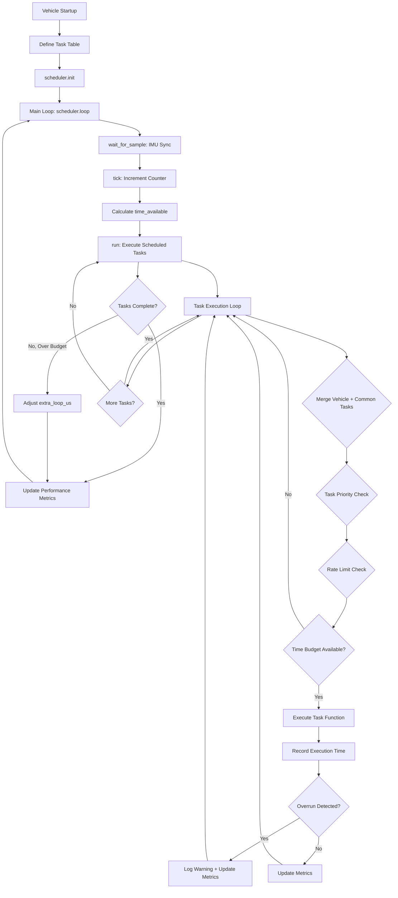

# AP_Scheduler

## Overview

The AP_Scheduler library implements a priority-based cooperative multitasking scheduler for real-time vehicle control in ArduPilot. It provides deterministic task execution synchronized with IMU sampling, ensuring critical control loops run at consistent rates while managing CPU time budgets across diverse vehicle operations.

**Primary Responsibilities**:
- Schedule and execute tasks at specified rates (Hz) with priority ordering
- Enforce timing budgets to prevent task overruns from starving lower-priority tasks
- Synchronize main loop execution with inertial measurement unit (IMU) sampling
- Monitor real-time performance metrics (loop rate, task execution time, CPU load)
- Dynamically adjust loop timing budget when tasks consistently miss their deadlines
- Merge vehicle-specific and common task tables into unified execution schedule

The scheduler is the heart of ArduPilot's real-time execution model, called as the **only** function in the vehicle's main loop to ensure predictable timing behavior.

## Architecture

The scheduler implements a priority-based cooperative multitasking model where tasks voluntarily yield control. Task execution is synchronized with IMU sensor sampling to ensure control algorithms receive fresh data at the configured loop rate.



**Key Architectural Concepts**:

- **IMU Synchronization**: Main loop waits for new inertial sensor sample before executing tasks
- **Priority-Based Execution**: Tasks with lower priority numbers execute before higher numbers; vehicle tasks win ties
- **Cooperative Multitasking**: Tasks must complete and return control; no preemption mechanism
- **Rate Limiting**: Tasks specify execution rate in Hz; scheduler enforces intervals between runs
- **Timing Budget Enforcement**: Each task declares maximum execution time; scheduler monitors compliance
- **Adaptive Load Management**: System automatically adds extra loop time when tasks consistently miss budgets

## Key Components

### AP_Scheduler Class

Main scheduler implementation providing task management and execution control.

**Purpose**: Coordinate execution of all vehicle tasks while maintaining real-time performance constraints.

**Lifecycle**:
1. **Initialization**: `init()` - Register task tables, validate priorities, allocate tracking arrays
2. **Main Loop**: `loop()` - Wait for IMU sample, increment tick counter, execute scheduled tasks
3. **Task Execution**: `run()` - Iterate through merged task list, check rates/budgets, execute functions
4. **Performance Monitoring**: `update_logging()` - Log metrics, adjust per-task profiling allocation

**Thread Safety**: Holds semaphore `_rsem` except when waiting for IMU sample to prevent concurrent access.

**Hardware Dependencies**: Requires functional IMU (via `AP::ins().wait_for_sample()`) for loop synchronization.

Source: libraries/AP_Scheduler/AP_Scheduler.h, libraries/AP_Scheduler/AP_Scheduler.cpp

### AP::PerfInfo Class

Loop and per-task performance monitoring subsystem.

**Purpose**: Track execution statistics for main loop and individual tasks to identify performance bottlenecks.

**Responsibilities**:
- Record min/max/average loop execution times
- Maintain filtered loop rate using low-pass filter
- Track long-running loop occurrences (loops exceeding time budget)
- Optionally record per-task statistics (min/max/elapsed time, slip count, overrun count)
- Generate performance logs and telemetry data

**Memory Management**: Per-task info array dynamically allocated based on `SCHED_OPTIONS` bitmask.

Source: libraries/AP_Scheduler/PerfInfo.h, libraries/AP_Scheduler/PerfInfo.cpp

### Task Structure

Definition of a schedulable task with function pointer, name, rate, budget, and priority.

```cpp
struct Task {
    task_fn_t function;        // Function pointer (void return, no args)
    const char *name;          // Task name for debugging/logging
    float rate_hz;             // Execution rate in Hz (0 = loop rate)
    uint16_t max_time_micros;  // Maximum allowed execution time
    uint8_t priority;          // Execution priority (0-255, lower = higher priority)
};
```

**Field Details**:
- `function`: Bound via `FUNCTOR_BIND` macro to class method
- `name`: Automatically generated from class and method names via macros
- `rate_hz`: 0 means "every loop"; positive values rate-limit execution
- `max_time_micros`: Time budget for scheduler enforcement (0 for fast tasks)
- `priority`: Must be monotonically increasing in task table; defines execution order

### Task Table Macros

Convenience macros for defining task tables with proper binding and naming.

**SCHED_TASK_CLASS**: Define a task bound to a class method

```cpp
SCHED_TASK_CLASS(ClassName, instance_ptr, method_name, rate_hz, max_time_micros, priority)
```

**FAST_TASK_CLASS**: Define a fast-loop task (priority 0, no rate limit)

```cpp
FAST_TASK_CLASS(ClassName, instance_ptr, method_name)
```

**Usage**: Vehicle code defines task table arrays using these macros, ensuring consistent formatting and automatic name generation.

Source: libraries/AP_Scheduler/AP_Scheduler.h:45-62

## Scheduling Algorithm

The scheduler implements a sophisticated priority-based cooperative scheduling algorithm with adaptive timing budget management.

### Priority-Based Execution

Tasks are executed in strict priority order, with lower priority numbers running first. When vehicle-specific and common tasks have the same priority, the vehicle task executes first.

**Task Merging Process**:
1. Vehicle defines `_vehicle_tasks[]` array with priorities
2. Common tasks retrieved from `AP::vehicle()->get_common_scheduler_tasks()`
3. Scheduler iterates through both arrays, selecting task with lowest priority at each step
4. Vehicle task wins when priorities are equal

Source: libraries/AP_Scheduler/AP_Scheduler.cpp:198-228

### Rate Limiting

Tasks specify desired execution frequency via `rate_hz` field. Scheduler enforces minimum interval between executions.

**Rate Calculation**:
```cpp
interval_ticks = (rate_hz == 0) ? 1 : (_loop_rate_hz / rate_hz)
dt = _tick_counter - _last_run[task_index]
if (dt < interval_ticks) {
    // Skip task - not yet time to run
}
```

**Example**: At 400Hz loop rate, a 50Hz task runs every 8 ticks (400/50 = 8).

**Special Case**: `rate_hz = 0` means "loop rate" - task runs every tick (fast tasks).

Source: libraries/AP_Scheduler/AP_Scheduler.cpp:230-240

### Timing Budget Enforcement

Each task declares `max_time_micros` - maximum allowed execution time. Scheduler skips task if insufficient time remains in current loop iteration.

**Budget Allocation**:
- **Fast Tasks** (priority 0-2): Get full loop period as budget (`get_loop_period_us()`)
- **Slow Tasks** (priority >2): Get specified `max_time_micros` budget

**Time Available Calculation**:
```cpp
time_available = loop_period_us - elapsed_time + extra_loop_us
```

**Budget Check**:
```cpp
if (task.max_time_micros > time_available) {
    continue; // Skip this task, try next one
}
```

**Overrun Detection**: After task execution, compare actual time taken against budget; log warning if exceeded.

Source: libraries/AP_Scheduler/AP_Scheduler.cpp:254-288

### Adaptive extra_loop_us

When tasks consistently miss their execution deadlines (running less frequently than specified `rate_hz`), the scheduler automatically increases the time budget for each loop.

**Slowdown Detection**:
```cpp
if (dt >= interval_ticks * max_task_slowdown) {
    task_not_achieved++; // Task running 4x slower than desired
}
```

**Budget Increase** (when `task_not_achieved > 0`):
```cpp
extra_loop_us = MIN(extra_loop_us + 100, 5000); // Add 100us, max 5000us
```

**Budget Decrease** (after 50 successful loops):
```cpp
extra_loop_us = MAX(0, extra_loop_us - 50); // Remove 50us per 50-loop cycle
```

**Effect**: Effectively lowers the main loop rate temporarily to give CPU-constrained systems more time per iteration.

Source: libraries/AP_Scheduler/AP_Scheduler.cpp:248-252, 405-420

### Fast vs Slow Task Separation

**Fast Tasks** (priority 0-2):
- Execute every loop iteration regardless of rate_hz
- Get full loop period as time budget
- Used for critical real-time operations (IMU reads, attitude control)
- Priority constants: `FAST_TASK_PRI0` (0), `FAST_TASK_PRI1` (1), `FAST_TASK_PRI2` (2)

**Slow Tasks** (priority >2):
- Rate-limited by `rate_hz` specification
- Get `max_time_micros` as time budget
- Used for non-critical operations (mission logic, logging, telemetry)

**Rationale**: Critical control loops must run every iteration for stability; slower tasks can be deferred when CPU time is scarce.

Source: libraries/AP_Scheduler/AP_Scheduler.cpp:230-261

### Slip Detection

A "slip" occurs when a task's actual execution interval exceeds twice its desired interval due to CPU load.

**Detection**:
```cpp
if (dt >= interval_ticks * 2) {
    perf_info.task_slipped(task_index);
}
```

**Implications**: Slipped tasks indicate CPU saturation; control performance may degrade.

**Monitoring**: Enable `SCHED_DEBUG=2` to see slip warnings on console.

Source: libraries/AP_Scheduler/AP_Scheduler.cpp:244-246

### Overrun Detection

An "overrun" occurs when a task exceeds its declared `max_time_micros` budget.

**Detection**:
```cpp
if (time_taken > _task_time_allowed) {
    overrun = true;
    debug(3, "Scheduler overrun task[%u-%s] (%u/%u)\n", ...);
}
```

**Implications**: Overrunning task starves lower-priority tasks; system may miss critical deadlines.

**Monitoring**: Enable `SCHED_DEBUG=3` to see overrun warnings on console.

Source: libraries/AP_Scheduler/AP_Scheduler.cpp:279-288

## Task Table Definition

Vehicle code defines task tables as static arrays using scheduler macros.

### Syntax Example

```cpp
// Define convenience macro for this vehicle
#define SCHED_TASK(func, rate_hz, max_time_us, prio) \
    SCHED_TASK_CLASS(Copter, &copter, func, rate_hz, max_time_us, prio)

const AP_Scheduler::Task Copter::scheduler_tasks[] = {
    // Fast loop tasks (priority 0-2) - run every loop
    SCHED_TASK(read_radio,              400,    100,  0),
    SCHED_TASK(rc_loop,                 400,    130,  1),
    SCHED_TASK(throttle_loop,           400,     75,  2),
    
    // Slow loop tasks - rate limited
    SCHED_TASK(update_batt_compass,      10,    120,  3),
    SCHED_TASK(read_aux_all,             50,     50,  4),
    SCHED_TASK(update_GPS,               50,    200,  5),
    SCHED_TASK(update_flight_mode,      400,    100,  6),
    SCHED_TASK(update_navigation,       400,    400,  7),
    SCHED_TASK(update_throttle_hover,    10,     90,  8),
    SCHED_TASK(one_hz_loop,               1,    100,  9),
};

// Initialize in setup()
void Copter::setup() {
    scheduler.init(&scheduler_tasks[0], ARRAY_SIZE(scheduler_tasks), 
                   MASK_LOG_PM);
}
```

### Field Specifications

**rate_hz**: Desired execution frequency
- `0` = loop rate (every tick) - use for fast tasks
- `400` = 400Hz - every tick at 400Hz loop rate, every 8th tick at 50Hz
- `50` = 50Hz - every 8th tick at 400Hz loop rate, every tick at 50Hz
- `10` = 10Hz - every 40th tick at 400Hz loop rate
- `1` = 1Hz - every 400th tick at 400Hz loop rate
- `0.2` = once per 5 seconds

**max_time_micros**: Time budget in microseconds
- Fast tasks: Use 0 (gets full loop period)
- Slow tasks: Measure typical execution time, add safety margin
- Example: If task typically takes 80us, specify 120us budget

**priority**: Task priority (0-255)
- **CRITICAL REQUIREMENT**: Must be monotonically increasing in table
- 0-2: Fast tasks (run every loop)
- 3-255: Slow tasks (rate limited)
- Lower number = higher priority (executes first)

### Priority Ordering Requirement

Task table entries **must** have monotonically increasing priority values. The scheduler validates this at initialization and triggers an internal error if violated.

**Valid Example**:
```cpp
SCHED_TASK(task_a, 400, 100, 0),  // Priority 0
SCHED_TASK(task_b, 400, 100, 1),  // Priority 1 (>= 0) ✓
SCHED_TASK(task_c, 50,  200, 3),  // Priority 3 (>= 1) ✓
```

**Invalid Example**:
```cpp
SCHED_TASK(task_a, 400, 100, 1),  // Priority 1
SCHED_TASK(task_b, 400, 100, 0),  // Priority 0 (< 1) ✗ ERROR
```

Source: libraries/AP_Scheduler/AP_Scheduler.cpp:147-165

### Vehicle vs Common Task Merging

The scheduler merges vehicle-specific tasks (`_vehicle_tasks`) with common tasks (`_common_tasks`) from the vehicle base class. When priorities are equal, vehicle tasks execute first.

**Common Tasks**: Defined in `AP_Vehicle::get_common_scheduler_tasks()`, typically include:
- Fast loop counter updates
- Shared sensor processing
- Common telemetry functions
- Logging operations

**Merged Execution**: Scheduler iterates through both lists simultaneously, selecting the task with lowest priority at each step.

Source: libraries/AP_Scheduler/AP_Scheduler.cpp:125-132, 198-228

## Loop Rate Control

The main loop rate determines how frequently the scheduler executes the task table. This rate is synchronized with IMU sampling for consistent control timing.

### Main Loop Rate Defaults

**Copter/Helicopter/ArduSub**: 400Hz (2.5ms loop period)
- Rationale: Fast attitude control requires high-rate IMU sampling and control loop updates
- Typical fast task execution: Radio input, RC loop, throttle output, attitude control

**Plane/Rover/Other Vehicles**: 50Hz (20ms loop period)
- Rationale: Slower dynamics allow longer loop periods; reduces CPU load
- Typical fast task execution: Radio input, navigation updates, control surface outputs

Source: libraries/AP_Scheduler/AP_Scheduler.cpp:43-47

### SCHED_LOOP_RATE Parameter

User-configurable parameter to adjust main loop rate.

**Parameter Details**:
- Default: 400Hz (copter/sub), 50Hz (plane/rover)
- Range: 50-2000Hz (clamped at initialization to 50-2000Hz)
- Units: Hz
- **Reboot Required**: Yes - takes effect only after reboot

**Warning**: Values over 400Hz are experimental. High loop rates increase CPU load and may cause performance issues on slower processors.

**Usage**: Advanced users may lower loop rate on CPU-constrained platforms or increase for experimental high-performance applications.

Source: libraries/AP_Scheduler/AP_Scheduler.cpp:61-68, 109-120

### IMU Synchronization

The scheduler's `loop()` method waits for a new IMU sample before executing tasks, ensuring control algorithms always have fresh sensor data.

**Synchronization Sequence**:
```cpp
void AP_Scheduler::loop() {
    _rsem.give();                          // Release semaphore
    AP::ins().wait_for_sample();           // BLOCK until new IMU sample
    _rsem.take_blocking();                 // Reacquire semaphore
    
    _loop_sample_time_us = AP_HAL::micros64();  // Record sample time
    tick();                                     // Increment tick counter
    run(time_available);                        // Execute scheduled tasks
}
```

**Implications**:
- Loop rate directly tied to IMU sampling rate
- If IMU samples at 1kHz internally but configured for 400Hz output, scheduler runs at 400Hz
- Jitter in IMU sampling causes jitter in loop execution

Source: libraries/AP_Scheduler/AP_Scheduler.cpp:347-398

### Loop Period Calculations

The scheduler provides several accessors for loop timing:

**get_loop_period_us()**: Returns loop period in microseconds
```cpp
uint32_t loop_period_us = 1000000UL / _loop_rate_hz;
// 400Hz -> 2500us, 50Hz -> 20000us
```

**get_loop_period_s()**: Returns loop period in seconds
```cpp
float loop_period_s = 1.0f / _loop_rate_hz;
// 400Hz -> 0.0025s, 50Hz -> 0.02s
```

**get_loop_rate_hz()**: Returns configured loop rate in Hz

Source: libraries/AP_Scheduler/AP_Scheduler.h:143-162

### Filtered Loop Rate Monitoring

The scheduler tracks actual achieved loop rate using a low-pass filter to smooth out transient variations.

**get_filtered_loop_rate_hz()**: Returns smoothed actual loop rate
- Calculated by `PerfInfo` class using exponential moving average
- Used to detect CPU overload (actual rate significantly below configured rate)

**Load Average Calculation**:
```cpp
if (get_filtered_loop_rate_hz() < get_loop_rate_hz() * 0.95) {
    return 1.0;  // System is overloaded (running >5% slow)
}
```

Source: libraries/AP_Scheduler/AP_Scheduler.cpp:333-345

## Timing Budget Management

The scheduler carefully manages CPU time allocation to ensure critical tasks complete while preventing any task from monopolizing the processor.

### time_available Calculation

At the start of each task execution cycle, the scheduler calculates available time:

```cpp
// Measure time elapsed since loop start
const uint32_t loop_tick_us = now - sample_time_us;

// Calculate remaining time in this loop iteration
if (loop_tick_us < loop_us) {
    time_available = loop_us - loop_tick_us;
}

// Add adaptive extra time for CPU-constrained systems
time_available += extra_loop_us;
```

**Components**:
- `loop_us`: Base loop period (e.g., 2500us for 400Hz)
- `loop_tick_us`: Time already consumed in this iteration
- `extra_loop_us`: Adaptive budget increase (0-5000us)

Source: libraries/AP_Scheduler/AP_Scheduler.cpp:385-395

### Per-Task Budget Allocation

**Fast Tasks** (priority 0-2):
```cpp
_task_time_allowed = get_loop_period_us();  // Full loop period
```
Fast tasks get the entire loop period as their budget since they must complete every iteration.

**Slow Tasks** (priority >2):
```cpp
_task_time_allowed = task.max_time_micros;  // Specified budget
```
Slow tasks get their declared maximum time from the task table.

**Budget Check Before Execution**:
```cpp
if (_task_time_allowed > time_available) {
    continue;  // Skip task - insufficient time remaining
}
```

Source: libraries/AP_Scheduler/AP_Scheduler.cpp:242, 254-261

### Spare Time Tracking

The scheduler accumulates unused time at the end of each run cycle to calculate CPU load.

**Accumulation**:
```cpp
_spare_micros += time_available;  // Add unused time
_spare_ticks++;                    // Count loops

// Prevent overflow - halve every 32 ticks
if (_spare_ticks == 32) {
    _spare_ticks /= 2;
    _spare_micros /= 2;
}
```

**Load Average Calculation**:
```cpp
const uint32_t loop_us = get_loop_period_us();
const uint32_t used_time = loop_us - (_spare_micros / _spare_ticks);
float load = used_time / (float)loop_us;  // 0.0 to 1.0
```

A load of 1.0 means 100% CPU utilization; 0.0 means idle.

Source: libraries/AP_Scheduler/AP_Scheduler.cpp:308-316, 333-345

### Adaptive extra_loop_us Adjustment

The scheduler dynamically adjusts the time budget when tasks consistently miss their execution deadlines.

**Increase Trigger**: Task running 4x slower than desired rate
```cpp
const uint8_t max_task_slowdown = 4;
if (dt >= interval_ticks * max_task_slowdown) {
    task_not_achieved++;
}

// At end of loop
if (task_not_achieved > 0) {
    extra_loop_us = MIN(extra_loop_us + 100U, 5000U);  // Add 100us, cap at 5ms
    task_not_achieved = 0;
    task_all_achieved = 0;
}
```

**Decrease Trigger**: 50 consecutive successful loops
```cpp
if (extra_loop_us > 0) {
    task_all_achieved++;
    if (task_all_achieved > 50) {
        task_all_achieved = 0;
        extra_loop_us = MAX(0U, extra_loop_us - 50U);  // Remove 50us
    }
}
```

**Effect**: Temporarily reduces effective loop rate (e.g., 400Hz -> 390Hz with 2500us extra) to give CPU-constrained systems breathing room.

Source: libraries/AP_Scheduler/AP_Scheduler.cpp:248-252, 405-420

## Performance Monitoring

The scheduler provides comprehensive real-time performance monitoring to identify bottlenecks and diagnose timing issues.

### Loop Statistics

**Tracked Metrics** (via `AP::PerfInfo`):
- **min_time**: Minimum loop execution time (microseconds)
- **max_time**: Maximum loop execution time (microseconds)  
- **avg_time**: Average loop execution time (microseconds)
- **stddev_time**: Standard deviation of loop time (microseconds)
- **long_running**: Count of loops exceeding time budget
- **filtered_loop_time**: Low-pass filtered loop time (seconds)
- **filtered_loop_rate_hz**: Low-pass filtered achieved loop rate (Hz)

**Reset Frequency**: Metrics reset every second via `update_logging()` call.

Source: libraries/AP_Scheduler/PerfInfo.h:12-43

### Per-Task Metrics

When enabled via `SCHED_OPTIONS` bit 0, the scheduler tracks individual task statistics:

**Per-Task Data** (struct TaskInfo):
```cpp
struct TaskInfo {
    uint16_t min_time_us;       // Minimum execution time
    uint16_t max_time_us;       // Maximum execution time
    uint32_t elapsed_time_us;   // Total accumulated time
    uint32_t tick_count;        // Number of executions
    uint16_t slip_count;        // Number of slips (delayed execution)
    uint16_t overrun_count;     // Number of budget overruns
};
```

**Memory Allocation**: Task info array dynamically allocated only when enabled to conserve RAM.

**Access**: Task statistics exported via `@SYS/tasks.txt` file on SD card for analysis.

Source: libraries/AP_Scheduler/PerfInfo.h:16-27, libraries/AP_Scheduler/AP_Scheduler.cpp:445-449

### Filtered Loop Time

The scheduler applies a low-pass filter to loop execution time to smooth transient spikes:

```cpp
filtered_loop_time = filtered_loop_time * 0.99f + current_loop_time * 0.01f;
```

**Purpose**: Provides stable load indication for telemetry and decision-making.

**Access**: `get_filtered_loop_time()` returns filtered time in seconds.

Source: libraries/AP_Scheduler/AP_Scheduler.h:165-167

### Load Average Calculation

The load average represents CPU utilization as a value between 0.0 (idle) and 1.0 (fully loaded).

**Calculation**:
```cpp
float load_average() {
    // Return 1.0 if running >5% slow
    if (get_filtered_loop_rate_hz() < get_loop_rate_hz() * 0.95) {
        return 1.0;
    }
    
    // Calculate from spare time
    const uint32_t loop_us = get_loop_period_us();
    const uint32_t used_time = loop_us - (_spare_micros / _spare_ticks);
    return constrain_float(used_time / (float)loop_us, 0, 1);
}
```

**Interpretation**:
- 0.0-0.7: Healthy margin, system can handle load variations
- 0.7-0.9: Moderate load, monitor for performance issues
- 0.9-1.0: High load, some tasks may slip or be delayed
- 1.0: Overloaded, system running slower than configured rate

Source: libraries/AP_Scheduler/AP_Scheduler.cpp:333-345

### PERF Message Logging

The scheduler logs performance data to dataflash for post-flight analysis.

**Log Structure** (LOG_PERFORMANCE_MSG):
```cpp
struct log_Performance {
    uint64_t time_us;              // Timestamp
    uint16_t loop_rate;            // Achieved loop rate (Hz)
    uint16_t num_long_running;     // Long loop count
    uint16_t num_loops;            // Total loops this period
    uint32_t max_time;             // Max loop time (us)
    uint32_t mem_avail;            // Available memory (bytes)
    uint16_t load;                 // Load average * 1000
    uint32_t extra_loop_us;        // Extra time budget (us)
    // ... plus internal error and bus transaction counts
};
```

**Logging Trigger**: Written when `_log_performance_bit` is set in logging bitmask (typically MASK_LOG_PM).

**Access**: Analyze PERF messages in dataflash logs using MAVExplorer or other log analysis tools.

Source: libraries/AP_Scheduler/AP_Scheduler.cpp:453-480

### MAVLink Telemetry

The scheduler exports performance data via MAVLink for real-time monitoring by ground control stations.

**Update Method**:
```cpp
void update_logging() {
    if (debug_flags()) {
        perf_info.update_logging();  // Console output if debug enabled
    }
    if (should_log(_log_performance_bit)) {
        Log_Write_Performance();      // Write to dataflash
    }
    perf_info.set_loop_rate(get_loop_rate_hz());
    perf_info.reset();                // Reset counters for next period
}
```

**Call Frequency**: Vehicle code must call `update_logging()` at 1Hz.

Source: libraries/AP_Scheduler/AP_Scheduler.cpp:433-450

### Debug Modes

The `SCHED_DEBUG` parameter enables console output for scheduler diagnostics.

**Debug Levels**:
- `0`: Disabled (default) - no console output
- `2`: Show slips - print message when task delayed due to CPU load
- `3`: Show overruns - print message when task exceeds time budget

**Example Output** (SCHED_DEBUG=3):
```
Scheduler overrun task[7-update_navigation] (425/400)
                        ^    ^                ^    ^
                      index name          actual allowed
```

**Usage**: Enable temporarily for debugging performance issues; disable in flight to avoid console spam.

Source: libraries/AP_Scheduler/AP_Scheduler.cpp:54-59, 283-287

### Task Info Allocation via SCHED_OPTIONS

The `SCHED_OPTIONS` parameter controls optional scheduler features via bitmask.

**Bit 0: Enable per-task perf info**
- When set: Allocates `TaskInfo` array for all tasks
- When clear: Frees task info array to conserve RAM
- Dynamic: Can be changed at runtime; scheduler adapts allocation

**Memory Impact**: Approximately `sizeof(TaskInfo) * num_tasks` bytes
- Example: 50 tasks * 16 bytes/task = 800 bytes

**Trade-off**: Enable only when debugging task performance; disable for production to save RAM.

Source: libraries/AP_Scheduler/AP_Scheduler.cpp:70-75, 445-449

## Configuration Parameters

| Parameter | Description | Default | Range | Units | Reboot Required |
|-----------|-------------|---------|-------|-------|-----------------|
| SCHED_DEBUG | Debug level: 0=off, 2=show slips, 3=show overruns | 0 | 0-3 | - | No |
| SCHED_LOOP_RATE | Main loop rate for scheduler and fast loop tasks | 400 (copter/sub)<br>50 (plane/rover) | 50-2000 | Hz | Yes |
| SCHED_OPTIONS | Bitmask: bit 0 = record per-task perf info | 0 | 0-1 | - | No |

**Parameter Details**:

**SCHED_DEBUG**:
- 0: Normal operation, no scheduler console output
- 2: Print warning when task slips (runs less frequently than specified due to CPU load)
- 3: Print warning when task overruns time budget (helps identify CPU hogs)
- Usage: Enable temporarily for performance diagnosis, disable for normal operation

**SCHED_LOOP_RATE**:
- Controls main loop rate and IMU sampling frequency
- Default varies by vehicle type (400Hz for copters/subs with fast dynamics, 50Hz for planes/rovers)
- Higher values: More responsive control, higher CPU load
- Lower values: Reduced CPU load, slower control response
- **Warning**: Values >400Hz are experimental; may cause instability on slower processors
- **Critical**: Reboot required for changes to take effect

**SCHED_OPTIONS**:
- Bit 0 (value 1): Enable per-task performance info collection
  - Allocates memory for tracking individual task execution statistics
  - Enables `@SYS/tasks.txt` file generation with detailed task timing data
  - Costs ~800 bytes RAM for typical 50-task vehicle
  - Useful for identifying which specific tasks cause performance issues
  - Can be toggled at runtime; scheduler adapts memory allocation dynamically

Source: libraries/AP_Scheduler/AP_Scheduler.cpp:53-77

## Usage Patterns

### Basic Task Table Definition

```cpp
class MyVehicle {
public:
    void setup();
    void loop();
    
private:
    AP_Scheduler scheduler;
    
    // Task functions
    void fast_loop();
    void slow_loop();
    void one_hz_loop();
    
    static const AP_Scheduler::Task scheduler_tasks[];
};

// Define task table
const AP_Scheduler::Task MyVehicle::scheduler_tasks[] = {
    SCHED_TASK_CLASS(MyVehicle, &myvehicle, fast_loop,   400,  100, 0),
    SCHED_TASK_CLASS(MyVehicle, &myvehicle, slow_loop,    50,  200, 3),
    SCHED_TASK_CLASS(MyVehicle, &myvehicle, one_hz_loop,   1,  500, 6),
};

void MyVehicle::setup() {
    // Initialize scheduler with task table
    scheduler.init(&scheduler_tasks[0], 
                   ARRAY_SIZE(scheduler_tasks),
                   MASK_LOG_PM);  // Enable performance logging
}

void MyVehicle::loop() {
    // Call scheduler.loop() as ONLY function in main loop
    scheduler.loop();
}

void MyVehicle::fast_loop() {
    // Critical fast-loop operations (runs every loop at 400Hz)
    // Read sensors, update attitude control, output to motors
}

void MyVehicle::slow_loop() {
    // Rate-limited operations (runs at 50Hz)
    // Update navigation, process mission commands
}

void MyVehicle::one_hz_loop() {
    // Slow periodic operations (runs at 1Hz)
    // Update logging, send telemetry, check arming status
}
```

Source: Derived from libraries/AP_Scheduler/examples/Scheduler_test/Scheduler_test.cpp

### Querying Performance Metrics

```cpp
// In vehicle code - call periodically to monitor health

void MyVehicle::check_performance() {
    // Get current load average (0.0 to 1.0)
    float load = scheduler.load_average();
    
    if (load > 0.9) {
        gcs().send_text(MAV_SEVERITY_WARNING, "High CPU load: %.1f%%", load * 100);
    }
    
    // Get actual achieved loop rate
    float actual_rate = scheduler.get_filtered_loop_rate_hz();
    float target_rate = scheduler.get_loop_rate_hz();
    
    if (actual_rate < target_rate * 0.95) {
        gcs().send_text(MAV_SEVERITY_CRITICAL, 
                       "Loop rate degraded: %.1f Hz (target %u Hz)",
                       actual_rate, target_rate);
    }
    
    // Get extra time being added to each loop
    uint32_t extra_us = scheduler.get_extra_loop_us();
    if (extra_us > 0) {
        gcs().send_text(MAV_SEVERITY_INFO,
                       "Scheduler adding %u us per loop", extra_us);
    }
    
    // Get last loop execution time
    float loop_time = scheduler.get_last_loop_time_s();
    float loop_period = scheduler.get_loop_period_s();
    
    if (loop_time > loop_period * 1.1) {
        gcs().send_text(MAV_SEVERITY_WARNING,
                       "Slow loop: %.3f ms", loop_time * 1000);
    }
}
```

### Task Time Budget Checking

```cpp
// Within a scheduled task - check remaining time budget

void MyVehicle::complex_task() {
    // Do first part of work
    process_phase_1();
    
    // Check if enough time remaining for second phase
    uint16_t time_remaining_us = scheduler.time_available_usec();
    
    if (time_remaining_us > 500) {
        // Safe to continue
        process_phase_2();
    } else {
        // Defer second phase to next execution
        defer_phase_2_flag = true;
    }
    
    // Check again before optional third phase
    if (scheduler.time_available_usec() > 1000) {
        process_phase_3();
    }
}
```

### Integrating Scheduler Updates

```cpp
// In vehicle's 1Hz update function

void MyVehicle::one_hz_loop() {
    // Update scheduler logging (REQUIRED at 1Hz)
    scheduler.update_logging();
    
    // Check performance and warn if needed
    check_performance();
    
    // Other 1Hz tasks...
}
```

## Integration Guide

### Step-by-Step Integration

**1. Include Header**

```cpp
#include <AP_Scheduler/AP_Scheduler.h>
```

**2. Declare Scheduler Instance and Task Table**

```cpp
class MyVehicle {
private:
    AP_Scheduler scheduler;
    static const AP_Scheduler::Task scheduler_tasks[];
    
    // Declare all task methods
    void task_1();
    void task_2();
    void task_3();
};
```

**3. Define Task Table**

```cpp
// Create convenience macro
#define SCHED_TASK(func, rate_hz, max_time_us, prio) \
    SCHED_TASK_CLASS(MyVehicle, &myvehicle, func, rate_hz, max_time_us, prio)

const AP_Scheduler::Task MyVehicle::scheduler_tasks[] = {
    // Tasks in priority order (lower number = higher priority)
    SCHED_TASK(task_1, 400, 100, 0),  // Fast loop
    SCHED_TASK(task_2,  50, 200, 3),  // Medium rate
    SCHED_TASK(task_3,   1, 500, 6),  // Slow loop
};
```

**4. Initialize Scheduler in Setup**

```cpp
void MyVehicle::setup() {
    // Initialize other subsystems first...
    
    // Initialize scheduler with task table and logging bit
    scheduler.init(&scheduler_tasks[0], 
                   ARRAY_SIZE(scheduler_tasks),
                   MASK_LOG_PM);
}
```

**5. Call Scheduler in Main Loop**

```cpp
void MyVehicle::loop() {
    // CRITICAL: scheduler.loop() must be ONLY function called here
    scheduler.loop();
}
```

**6. Update Scheduler Logging at 1Hz**

```cpp
void MyVehicle::one_hz_tasks() {
    // REQUIRED: Update scheduler logging at 1Hz
    scheduler.update_logging();
    
    // Optional: Monitor performance
    if (scheduler.load_average() > 0.9) {
        // Warn about high CPU load
    }
}
```

### Task Implementation Guidelines

**Fast Tasks** (priority 0-2):
- Keep execution time minimal (<100us typical)
- Perform only critical operations (sensor reads, control outputs)
- Never block or delay
- Avoid complex calculations
- Set `rate_hz = 0` or loop rate
- Set `max_time_micros = 0` (gets full loop period)

**Medium Tasks** (priority 3-10):
- Moderate execution time (100-500us)
- Control loops, navigation updates, telemetry
- Set appropriate `rate_hz` (typically 10-100Hz)
- Declare realistic `max_time_micros` with safety margin

**Slow Tasks** (priority >10):
- Longer execution time allowed (500us-5ms)
- Mission logic, logging, diagnostics
- Set low `rate_hz` (typically 1-10Hz)
- Be generous with `max_time_micros` but don't abuse

**General Rules**:
- Tasks must NEVER block indefinitely
- Use `scheduler.time_available_usec()` to check remaining budget
- Split long operations across multiple executions if needed
- Avoid heap allocation in tasks (use static or stack allocation)
- Keep critical sections short when using mutexes

### Priority Assignment Strategy

**Priority Tiers**:
- 0: Critical sensor reads (IMU, radio input)
- 1: Critical control outputs (motor mixing, servo output)
- 2: Fast attitude/position control loops
- 3-5: Medium-rate sensor updates (GPS, compass, baro)
- 6-10: Navigation and mode logic
- 11-20: Telemetry and logging
- 21-50: Mission execution and high-level planning
- 51+: Diagnostics and optional features

**Ordering Within Priority**:
- Data producers before consumers
- Sensor reads before sensor-dependent logic
- Control calculation before control output

## Safety Considerations

The AP_Scheduler is a **safety-critical component** that directly impacts vehicle control timing. Improper use can lead to vehicle instability, loss of control, or crashes.

### Critical Path: Main Loop Constraint

**REQUIREMENT**: The vehicle's main `loop()` function must **ONLY** call `scheduler.loop()` and nothing else.

**Rationale**: 
- Scheduler synchronizes with IMU sampling for consistent control timing
- Any additional code in main loop disrupts timing and introduces jitter
- Fast loop tasks (attitude control) require predictable execution intervals

**Correct Implementation**:
```cpp
void loop() {
    scheduler.loop();  // ONLY function call
}
```

**PROHIBITED**:
```cpp
void loop() {
    scheduler.loop();
    some_other_function();  // ✗ WRONG - breaks timing
    hal.scheduler->delay(1); // ✗ WRONG - adds unpredictable delay
}
```

**Consequence of Violation**: Unpredictable control loop timing leads to poor attitude control, oscillations, and potential crashes.

Source: libraries/AP_Scheduler/AP_Scheduler.h:109-111

### Real-Time Constraint: Task Time Budgets

**REQUIREMENT**: Tasks must complete within their declared `max_time_micros`.

**Rationale**:
- Overrunning task starves lower-priority tasks
- Critical tasks (navigation, telemetry) may be skipped entirely
- System cannot maintain target loop rate

**Prevention**:
- Measure actual task execution time using SCHED_DEBUG=3
- Add 20-30% safety margin to measured time for `max_time_micros`
- Split long operations across multiple task executions
- Use `scheduler.time_available_usec()` to check remaining budget within task

**Detection**:
- Enable `SCHED_DEBUG=3` to see overrun warnings
- Monitor `perf_info.get_num_long_running()` for frequent overruns
- Check for "Scheduler overrun" messages in logs

**Consequence**: Task overruns cause control instability, degraded telemetry, or mission execution failures.

### Priority Ordering: Monotonicity Requirement

**REQUIREMENT**: Task table priorities must be monotonically increasing (non-decreasing).

**Rationale**: Scheduler assumes priority ordering for efficient task selection and merging of vehicle/common task lists.

**Validation**: Scheduler checks priority ordering at initialization; triggers `INTERNAL_ERROR` if violated.

**Correct Example**:
```cpp
SCHED_TASK(task_a, 400, 100, 0),  // Priority 0
SCHED_TASK(task_b, 400, 100, 1),  // Priority 1 ✓
SCHED_TASK(task_c,  50, 200, 5),  // Priority 5 ✓
```

**PROHIBITED**:
```cpp
SCHED_TASK(task_a, 400, 100, 5),  // Priority 5
SCHED_TASK(task_b, 400, 100, 1),  // Priority 1 ✗ ERROR - decreased
```

**Consequence**: Internal error logged; task execution order may be incorrect, leading to data races or timing violations.

Source: libraries/AP_Scheduler/AP_Scheduler.cpp:147-165

### Overrun Impact: Task Starvation

**ISSUE**: Task exceeding its time budget prevents lower-priority tasks from executing.

**Scenario**:
1. High-priority task overruns by 500us
2. No time remains for lower-priority tasks in this loop iteration
3. Lower-priority tasks delayed until next iteration (or longer if overruns persist)

**Impact Examples**:
- Telemetry task starved → Ground station loses connection
- Compass calibration task starved → Heading estimation degrades
- Mission task starved → Waypoint navigation stalls

**Mitigation**:
- Set realistic time budgets with safety margins
- Monitor for overruns using `SCHED_DEBUG=3`
- Optimize or split tasks that frequently overrun
- Consider lowering loop rate on CPU-constrained platforms

### Slip Impact: Control Stability Degradation

**ISSUE**: Task running less frequently than specified `rate_hz` degrades control performance.

**Scenario**:
1. High CPU load prevents 50Hz navigation task from running every 8 ticks (at 400Hz loop)
2. Task actually runs every 16 ticks (25Hz) - 50% slip
3. Navigation updates arrive at half the expected rate

**Impact Examples**:
- Position control becomes sluggish
- Waypoint tracking accuracy degrades
- Wind compensation lags actual conditions

**Detection**:
- Enable `SCHED_DEBUG=2` to see slip warnings
- Check `perf_info` task slip counters
- Monitor `extra_loop_us` - persistent non-zero value indicates sustained slips

**Mitigation**:
- Reduce CPU load by disabling optional features
- Lower loop rate via `SCHED_LOOP_RATE` parameter
- Optimize tasks that consistently overrun
- Add more processing headroom (upgrade to faster processor)

### IMU Synchronization: Timing Dependency

**CRITICAL**: Scheduler waits for IMU sample before executing tasks. IMU failures or misconfiguration cause scheduler to stall.

**Failure Modes**:
- IMU hardware failure → `wait_for_sample()` blocks indefinitely → vehicle unresponsive
- IMU sample rate mismatch → irregular loop timing → jittery control
- IMU interrupt priority issues → delayed samples → reduced effective loop rate

**Prevention**:
- Ensure IMU properly initialized before calling `scheduler.init()`
- Configure IMU sample rate to match or exceed `SCHED_LOOP_RATE`
- Monitor filtered loop rate to detect IMU timing issues

**Consequence**: IMU timing problems directly translate to control loop timing problems and potential loss of vehicle control.

### Testing Requirement: Pre-Flight Validation

**MANDATORY**: Verify scheduler performance with `SCHED_DEBUG=3` before flying new builds or task tables.

**Test Procedure**:
1. Set `SCHED_DEBUG=3` (show overruns) via ground station
2. Run vehicle on bench with all sensors connected
3. Exercise all flight modes and features
4. Check console/logs for "Scheduler overrun" messages
5. Verify `load_average() < 0.8` with safety margin
6. Confirm `filtered_loop_rate` near target rate
7. Disable `SCHED_DEBUG` for flight

**SITL Testing**:
```bash
sim_vehicle.py -v Copter --console --map
param set SCHED_DEBUG 3
# Exercise vehicle in simulation
# Check for overrun messages in console
```

**Hardware Testing**:
- Connect via USB/telemetry
- Monitor MAVLink SYSTEM_TIME messages for loop rate
- Check dataflash logs for PERF message load values
- Verify no overrun or slip messages in console output

**Acceptance Criteria**:
- Zero scheduler overrun messages during normal operation
- Load average < 0.8 (20%+ margin)
- Filtered loop rate within 2% of target rate
- No persistent non-zero `extra_loop_us` values

**Consequence of Skipping Tests**: Undetected timing issues manifest as poor flight performance, oscillations, or loss of control.

## Testing

### Unit Testing

**Test Location**: `libraries/AP_Scheduler/examples/Scheduler_test/Scheduler_test.cpp`

**Test Coverage**:
- Task execution at specified rates
- Priority-based task ordering
- Loop synchronization with IMU
- Task counting and frequency validation

**Running Test**:
```bash
cd ArduPilot
./waf configure --board sitl
./waf examples --target Scheduler_test
./build/sitl/examples/Scheduler_test

# Expected output:
# one_hz: t=...
# five_seconds: t=... ins_counter=...
# Test PASSED
```

**Test Validation**: Example runs for 1000 IMU samples (20 seconds at 50Hz), verifies:
- 1Hz task executes exactly 20 times
- 0.2Hz task (5-second) executes exactly 4 times

Source: libraries/AP_Scheduler/examples/Scheduler_test/Scheduler_test.cpp

### SITL Testing

**Purpose**: Validate scheduler performance under simulated flight loads without risking hardware.

**Setup**:
```bash
# Launch SITL with Copter
sim_vehicle.py -v Copter --console --map

# Enable scheduler debugging
param set SCHED_DEBUG 3
param fetch

# Optional: Enable per-task profiling
param set SCHED_OPTIONS 1
param fetch
```

**Test Scenarios**:

**1. Idle Ground Test**:
```
# Vehicle on ground, disarmed
# Check baseline performance
module load graph
graph SCHED.Load*0.1  # Load average (scaled for display)
graph SCHED.FilteredLoopTime*1000  # Loop time in ms
```
Expected: Load < 0.5, loop time near 2.5ms (400Hz)

**2. Armed Hover**:
```
arm throttle
rc 3 1500  # Mid throttle
mode loiter
# Monitor for overruns or slips in console
```
Expected: Load 0.6-0.7, no overrun messages

**3. Aggressive Maneuvering**:
```
mode acro
# Perform rapid stick inputs
# Check for performance degradation
```
Expected: Load 0.7-0.8, acceptable slip rate

**4. Mission Execution**:
```
wp load mission.txt
auto
# Run complex mission with mode changes
# Monitor scheduler health
```
Expected: Load < 0.8, mission tasks execute on schedule

**5. CPU Load Test** (SITL only):
```
param set SIM_LOOP_DELAY 1000  # Add 1ms delay per loop
# Observe scheduler adaptation
```
Expected: `extra_loop_us` increases, load approaches 1.0

**Console Monitoring**:
- Watch for "Scheduler overrun task[X-name]" messages
- Note which tasks overrun and by how much
- Check if overruns occur under specific conditions (mode, altitude, etc.)

### Hardware Testing

**Safety**: Test on bench with propellers removed before flight testing.

**Bench Test Procedure**:

**1. Connect telemetry and power**
- Use USB or radio telemetry for parameter access
- Power with battery (not USB) for realistic CPU load
- Connect all sensors that will be used in flight

**2. Enable debugging**:
```
param set SCHED_DEBUG 3  # Show overruns
param set SCHED_OPTIONS 1  # Enable task profiling
```

**3. System startup monitoring**:
- Check console for startup overruns (expected during init)
- Verify loop rate stabilizes after 5 seconds
- Confirm no persistent overrun messages

**4. Exercise all flight modes**:
```
# Cycle through all modes to load different code paths
mode stabilize
mode althold
mode loiter
mode auto
mode rtl
# Check for mode-specific overruns
```

**5. Arm/disarm cycles**:
- Perform multiple arm/disarm cycles
- Check pre-arm checks don't cause scheduler issues
- Monitor arming check task timing

**6. Sensor stress test**:
- Wave vehicle to exercise IMU
- Cover optical flow sensor (if present)
- Block GPS signal
- Check graceful degradation under sensor failures

**7. Download and analyze logs**:
```
# Download dataflash logs
# Analyze PERF messages
# Look for patterns in load spikes
```

**Log Analysis Commands** (MAVExplorer):
```python
# Load log
mavgraph.py LOG_FILE.bin

# Plot scheduler metrics
graph PERF.NLon  # Long-running loops
graph PERF.Load*0.001  # Load average
graph PERF.ExtraLoopUS  # Extra loop time

# List PERF message statistics
message PERF
```

**Flight Test Procedure**:

**1. Pre-flight check**:
- Set `SCHED_DEBUG=0` (disable console spam)
- Keep `SCHED_OPTIONS=1` (for post-flight analysis)
- Verify bench tests passed

**2. Initial hover**:
- Short hover in stabilize mode
- Check vehicle responsiveness
- Monitor telemetry for performance warnings

**3. Progressive testing**:
- Gradual increase in maneuver aggressiveness
- Test each flight mode
- Execute typical mission profiles

**4. Post-flight analysis**:
- Download logs immediately
- Check PERF messages for anomalies
- Analyze `@SYS/tasks.txt` for task timing statistics
- Look for correlation between flight events and scheduler issues

**Red Flags** (abort testing):
- Load average consistently > 0.9
- Frequent overrun messages (>10 per minute)
- Filtered loop rate < 95% of target rate
- Vehicle oscillations or instability
- Loss of telemetry or control

### Identifying Bottlenecks

**Using Console Debug Output** (`SCHED_DEBUG=3`):
```
Scheduler overrun task[15-update_navigation] (425/400)
```
→ Task 15 (update_navigation) took 425us but was budgeted 400us

**Using @SYS/tasks.txt** (requires `SCHED_OPTIONS=1`):
```
TasksV2
Name                    Rate     MaxTime  AvgTime  Count  Slips  Overruns
read_radio              400Hz     100us     45us   12000      0         0
rc_loop                 400Hz     130us     78us   12000      0         0
update_navigation       400Hz     400us    387us   12000     15        23
one_hz_loop               1Hz     500us    234us      30      0         0
```
→ update_navigation has high average time near budget, with slips and overruns

**Optimization Strategies**:
1. **Task splitting**: Divide long task across multiple lower-rate executions
2. **Algorithm optimization**: Use faster math functions, lookup tables
3. **Lazy evaluation**: Defer non-critical calculations to slower rate
4. **Disable features**: Turn off optional functionality to reduce load
5. **Budget adjustment**: If task legitimately needs more time, increase `max_time_micros`

## Implementation Notes

### Design Decisions

**Why cooperative scheduling instead of preemptive?**
- Simpler implementation, lower overhead
- Easier to reason about code (no unexpected preemption)
- Most ArduPilot code not written for thread-safety
- Deterministic execution order simplifies debugging

**Why synchronize with IMU sampling?**
- Control algorithms need consistent sensor data age
- Eliminates timing jitter between sensor read and control output
- Allows deterministic latency analysis for control design

**Why merge vehicle and common task tables?**
- Vehicles can override common task priorities
- Allows vehicle-specific optimizations
- Maintains single unified execution order for predictability

**Why adaptive extra_loop_us instead of fixed rate?**
- Automatically adapts to CPU load variations
- Graceful degradation under high load
- Recovers full performance when load decreases
- Avoids manual tuning for each platform

Source: Design patterns evident throughout libraries/AP_Scheduler/AP_Scheduler.cpp

### Singleton Pattern

The scheduler uses the singleton pattern for global access.

**Access Method**:
```cpp
AP::scheduler().load_average();  // Via namespace function
// or
AP_Scheduler::get_singleton()->load_average();  // Direct singleton access
```

**Rationale**: 
- Vehicle code needs scheduler metrics from many locations
- Tasks themselves may query remaining time budget
- Logging and telemetry systems access performance data

**Limitation**: Only one scheduler instance per vehicle (enforced in SITL builds).

Source: libraries/AP_Scheduler/AP_Scheduler.h:82-83, 278-280

### Task Execution: Function Pointers via FUNCTOR_BIND

Tasks are stored as function pointers created using the FUNCTOR_BIND macro.

**Binding Mechanism**:
```cpp
.function = FUNCTOR_BIND(classptr, &ClassName::method, void)
```

**Execution**:
```cpp
task.function();  // Calls bound method on instance
```

**Advantages**:
- Type-safe function binding
- No overhead beyond virtual function call
- Works with member functions (captures 'this' pointer)

Source: libraries/AP_Scheduler/AP_Scheduler.h:45-51

### Memory Allocation: Dynamic Arrays

The scheduler dynamically allocates tracking arrays at initialization.

**_last_run Array**:
```cpp
_last_run = NEW_NOTHROW uint16_t[_num_tasks];
```
Stores tick counter value when each task last executed, used for rate limiting.

**TaskInfo Array** (optional):
```cpp
perf_info.allocate_task_info(_num_tasks);
```
Allocated only when `SCHED_OPTIONS` bit 0 set; freed when cleared.

**Rationale**: Task count unknown at compile time (vehicle + common tasks); dynamic allocation required.

**Memory Impact**: 
- `_last_run`: 2 bytes per task
- `TaskInfo`: 16 bytes per task (when enabled)
- Typical: 50 tasks → 100 bytes + optional 800 bytes

Source: libraries/AP_Scheduler/AP_Scheduler.cpp:134, 141-143

### Semaphore Usage: _rsem

The scheduler holds semaphore `_rsem` except when waiting for IMU sample.

**Locking Strategy**:
```cpp
void loop() {
    _rsem.give();                     // Release before blocking
    AP::ins().wait_for_sample();      // Block (may be long)
    _rsem.take_blocking();            // Reacquire before task execution
    
    // Execute tasks (semaphore held)
    run(time_available);
}
```

**Purpose**: Allows other threads (e.g., sensor drivers) to access scheduler data during IMU wait period without blocking the scheduler's task execution phase.

**Protected Operations**: Task execution, performance updates, timing calculations.

Source: libraries/AP_Scheduler/AP_Scheduler.cpp:350-354

### Persistent Storage: Crash Debugging

The scheduler stores current task index in persistent data for crash analysis.

**Update Points**:
```cpp
hal.util->persistent_data.scheduler_task = task_index;  // Before execution
task.function();                                        // Execute task
hal.util->persistent_data.scheduler_task = -1;          // After execution
```

**Special Values**:
- `-1`: No task executing (idle or between tasks)
- `-3`: Waiting for IMU sample
- `0-N`: Executing task N

**Usage**: If vehicle crashes, debugger can read `persistent_data.scheduler_task` to identify which task was executing at crash time.

Source: libraries/AP_Scheduler/AP_Scheduler.cpp:265, 270, 350, 354

### SITL Support: Loop Delay Parameter

SITL builds support artificial CPU load injection for testing.

**Parameter**: `SIM_LOOP_DELAY` (microseconds)

**Effect**:
```cpp
uint32_t loop_delay_us = sitl->loop_delay.get();
hal.scheduler->delay_microseconds(loop_delay_us);
```

**Usage**: Test scheduler behavior under CPU load without modifying production code.

**Example**: Set `SIM_LOOP_DELAY=1000` to add 1ms delay per loop, simulating heavy CPU usage.

Source: libraries/AP_Scheduler/AP_Scheduler.cpp:366-375

## Known Limitations

### Cooperative Scheduling: No Preemption

**Limitation**: Tasks are not preempted; they must voluntarily return control to scheduler.

**Implication**: 
- Misbehaving task can monopolize CPU
- No mechanism to forcibly stop runaway task
- Critical task cannot interrupt lower-priority long-running task

**Mitigation**: 
- Careful task design and code review
- Timing budget enforcement detects but cannot prevent overruns
- Watchdog timer provides last-resort recovery (system reset)

### Priority Inversion: Blocking by Lower-Priority Task

**Limitation**: High-priority task can be blocked if lower-priority task hasn't yielded.

**Scenario**:
1. Low-priority task begins execution (within budget)
2. Task takes longer than expected (still within budget)
3. High-priority task ready to run but must wait
4. Control loops miss deadlines due to delayed high-priority task

**Mitigation**:
- Keep all tasks short (<500us typical)
- Use fast task priorities (0-2) for truly critical operations
- Monitor for slips in high-priority tasks

### Fixed Interval: Rate Hz Must Divide Evenly

**Limitation**: Task rate_hz should be integer divisor of loop rate for precise timing.

**Example**: At 400Hz loop rate:
- 400Hz, 200Hz, 100Hz, 50Hz, 40Hz, 25Hz → Execute on exact intervals
- 30Hz → Actually runs at 40Hz (400/10 = every 10 ticks, closest match)
- 75Hz → Runs at 80Hz (400/5 = every 5 ticks)

**Implication**: Requested rate may not match actual execution rate.

**Mitigation**: 
- Choose rates that divide evenly into loop rate
- Common good choices: 400, 200, 100, 50, 20, 10, 5, 2, 1 Hz

### Task Table Size: RAM Constraint

**Limitation**: Number of tasks limited by available RAM for `_last_run[]` array.

**Memory Cost**: 2 bytes per task minimum, 18 bytes per task with `SCHED_OPTIONS=1`

**Typical Limits**:
- High-end boards (STM32H7): 200+ tasks feasible
- Low-end boards (STM32F4): 100-150 tasks practical
- Memory-constrained (STM32F1): 50-80 tasks

**Mitigation**:
- Combine related tasks into single function when feasible
- Use task time budget checking to split work within single task entry
- Disable optional features to reduce task count

## References

### Source Files

- **Main Implementation**: `libraries/AP_Scheduler/AP_Scheduler.cpp`
  - Core scheduling algorithm (run method: lines 190-316)
  - Main loop synchronization (loop method: lines 347-430)
  - Performance logging (Log_Write_Performance: lines 453-480)

- **Public API**: `libraries/AP_Scheduler/AP_Scheduler.h`
  - Task structure definition (lines 87-93)
  - Scheduler class interface (lines 74-276)
  - Task table macros (lines 45-62)

- **Performance Monitoring**: `libraries/AP_Scheduler/PerfInfo.cpp`, `libraries/AP_Scheduler/PerfInfo.h`
  - Loop statistics tracking (PerfInfo.h: lines 12-43)
  - Per-task timing (TaskInfo struct: lines 17-27)

- **Example Code**: `libraries/AP_Scheduler/examples/Scheduler_test/Scheduler_test.cpp`
  - Complete working example of scheduler integration
  - Task table definition example (lines 71-75)
  - Initialization and usage patterns (lines 78-109)

### Related Modules

- **HAL Scheduler Interface**: `libraries/AP_HAL/Scheduler.h`
  - Platform-specific timing primitives
  - Delay and microsecond counter functions

- **Inertial Sensor**: `libraries/AP_InertialSensor/AP_InertialSensor.h`
  - IMU sample synchronization (`wait_for_sample()` method)
  - Sensor sampling rates that drive scheduler loop rate

- **Vehicle Task Tables**:
  - ArduCopter: `ArduCopter/Copter.cpp` (scheduler_tasks array)
  - ArduPlane: `ArduPlane/Plane.cpp` (scheduler_tasks array)
  - Rover: `Rover/Rover.cpp` (scheduler_tasks array)

### External Documentation

- ArduPilot Developer Wiki: https://ardupilot.org/dev/docs/learning-ardupilot-threading.html
- Scheduler Design Discussion: https://discuss.ardupilot.org/ (search "scheduler")
