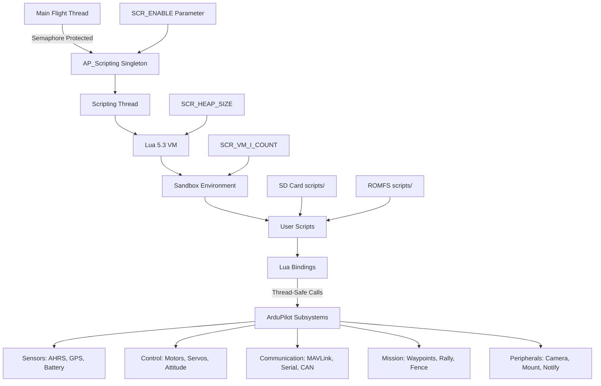

# AP_Scripting

## Overview

AP_Scripting provides embedded Lua 5.3 scripting capabilities for ArduPilot, enabling users to extend autopilot functionality without modifying C++ firmware. Scripts can implement custom flight modes, integrate new sensors and peripherals, create mission logic, automate operations, and interface with external systems through serial, I2C, CAN, and network protocols.

**Key Capabilities:**
- Custom flight behavior and automation logic
- Sensor driver integration (serial, I2C, CAN devices)
- Mission manipulation and advanced waypoint logic
- Telemetry processing and custom MAVLink messages
- Peripheral control (servos, relays, LEDs, cameras)
- Real-time vehicle state monitoring and logging
- Network and filesystem operations

**Design Philosophy:** Scripts run in a sandboxed, resource-limited environment with deterministic scheduling and automatic garbage collection. The runtime enforces safety through instruction budgets, memory limits, and isolated execution to prevent interference with flight-critical code paths.

## Architecture

The AP_Scripting subsystem integrates Lua 5.3 into ArduPilot's multithreaded architecture, providing safe script execution isolated from real-time flight control:



**Component Responsibilities:**

- **AP_Scripting Singleton** (`AP_Scripting.cpp/.h`): Runtime integration, parameter management, thread lifecycle
- **lua_scripts** (`lua_scripts.cpp/.h`): VM lifecycle, script loading, scheduling, instruction budget enforcement
- **lua_bindings** (`lua_bindings.cpp/.h`): C++ to Lua bridge exposing ArduPilot APIs
- **Binding Generator** (`generator/`): Code generation tool for creating Lua bindings from `.desc` files
- **Sandbox Environment**: Isolated Lua state with disabled unsafe standard library functions
- **MultiHeap Allocator**: Custom memory allocator with configurable heap size and protection

## Enabling Scripting Support in Builds

Scripting is automatically enabled on all boards with at least 1MB of flash space.
The following example enables scripting, builds the ArduPlane firmware for the Cube, and uploads it.

```
$ waf configure --board=CubeBlack

$ waf plane

$ waf plane --upload
```

To run SITL you can simply use the `sim_vehicle.py` script which will wrap the configuration, compilation,
and launching of the simulation into one command for you.


```
$ Tools/autotest/sim_vehicle.py -v ArduPlane
```

Once you have a vehicle flashed with scripting you need to set the `SCR_ENABLE` parameter to 1 to enable scripting and reboot.

## Script Lifecycle

Understanding the script lifecycle is essential for writing robust, efficient Lua scripts for ArduPilot.

### Loading Phase

1. **Discovery**: On boot (or script restart), AP_Scripting scans configured directories:
   - SD card: `APM/scripts/` (unless disabled by `SCR_DIR_DISABLE` bit 1)
   - ROMFS: Embedded `scripts/` directory (unless disabled by `SCR_DIR_DISABLE` bit 0)

2. **Parsing**: Each `.lua` file is loaded and compiled by the Lua VM
   - Syntax errors prevent script loading and are reported via GCS messages
   - Successfully compiled scripts are added to the execution queue
   - CRC32 checksums calculated for verification (`SCR_LD_CHECKSUM`, `SCR_RUN_CHECKSUM`)

3. **Initialization**: Scripts execute their top-level code once
   - Global variables and functions are defined
   - Parameters registered via `param:add_table()` / `param:add_param()`
   - Initial state setup and validation performed
   - Must return a function reference and delay: `return update, 1000`

### Execution Phase

Scripts use a **cooperative scheduling model** based on return values:

```lua
function update()
    -- Script logic here
    
    return update, 1000  -- Reschedule this function in 1000ms
end

return update, 1000  -- Initial schedule after 1000ms from load
```

**Scheduling Contract:**
- Scripts must return `(function_reference, delay_milliseconds)` to reschedule
- `delay_milliseconds`: Minimum time until next execution (actual may be longer if system busy)
- Returning `nil` or nothing terminates the script
- Functions can reschedule themselves or different functions for state machines

**Instruction Budget:**
- Each script execution limited by `SCR_VM_I_COUNT` instructions (default 10000)
- Budget prevents infinite loops and ensures fair scheduling
- Exceeding budget terminates current execution cycle, script resumes on next schedule
- Complex calculations should be split across multiple cycles if needed

### Error Handling

**Protected Calls** (recommended pattern):

```lua
function protected_wrapper()
    local success, err = pcall(update)
    if not success then
        gcs:send_text(6, string.format("Script error: %s", err))  -- MAV_SEVERITY_ERROR
    end
    return protected_wrapper, 1000
end

function update()
    -- Your code that might fail
    local data = peripheral:read()  -- might return nil
    if not data then
        error("Failed to read peripheral")
    end
    -- process data
end

return protected_wrapper, 1000
```

**Error Reporting:**
- Unhandled errors terminate script execution
- Error messages logged to `/APM/scripts/error.txt` on SD card
- GCS receives error notifications if `SCR_DEBUG` runtime messages enabled
- Wrapping main logic in `pcall()` prevents script termination on errors

### Termination

Scripts terminate when:
- They return `nil` or nothing (intentional exit)
- Unhandled Lua error occurs (unless wrapped in `pcall`)
- Script file deleted and runtime restarted
- `SCR_ENABLE` set to 0
- Firmware reboot

**Clean Shutdown:**
- No explicit destructor or cleanup phase
- Resources (file handles, network sockets) automatically released on termination
- Parameters created by script persist in memory/storage

## Adding Scripts

The vehicle will automatically look for and launch any scripts that are contained in the `scripts` folder when it starts.
On real hardware this should be inside of the `APM` folder of the SD card. In SITL this should be in the working directory (typically the main `ardupilot` directory).

An example script is given below:

```lua
function update () -- periodic function that will be called
  local current_pos = ahrs:get_location() -- fetch the current position of the vehicle
  local home = ahrs:get_home()            -- fetch the home position of the vehicle
  if current_pos and home then            -- check that both a vehicle location, and home location are available
    local distance = current_pos:get_distance(home) -- calculate the distance from home in meters
    if distance > 1000 then -- if more then 1000 meters away
      distance = 1000;      -- clamp the distance to 1000 meters
    end
    SRV_Channels:set_output_pwm(96, 1000 + distance) -- set the servo assigned function 96 (scripting3) to a proportional value
  end

  return update, 1000 -- request "update" to be rerun again 1000 milliseconds (1 second) from now
end

return update, 1000   -- request "update" to be the first time 1000 milliseconds (1 second) after script is loaded
```

## Lua Binding API Reference

AP_Scripting exposes a comprehensive set of ArduPilot subsystems to Lua scripts through automatically generated bindings. The complete API is documented with EmmyLua annotations in `docs/docs.lua` for IDE autocompletion.

### Core Timing and System

| Function | Description |
|----------|-------------|
| `millis()` | Returns milliseconds since boot (uint32_t, wraps at ~50 days) |
| `micros()` | Returns microseconds since boot (uint32_t, wraps at ~71 minutes) |
| `get_time_flying_ms()` | Time vehicle has been flying in milliseconds |
| `mission_loaded()` | Returns true if mission is loaded |

### Attitude and Navigation (AHRS)

Access through `ahrs:` singleton:

| Method | Description |
|--------|-------------|
| `ahrs:get_position()` | Returns current Location or nil if no position |
| `ahrs:get_location()` | Alias for get_position() |
| `ahrs:get_home()` | Returns home Location |
| `ahrs:get_gyro()` | Returns gyro Vector3f (rad/s, body frame) |
| `ahrs:get_accel()` | Returns accelerometer Vector3f (m/s², body frame) |
| `ahrs:get_roll()` | Roll angle in radians |
| `ahrs:get_pitch()` | Pitch angle in radians |
| `ahrs:get_yaw()` | Yaw angle in radians |
| `ahrs:get_velocity_NED()` | Velocity Vector3f (m/s, NED frame) |
| `ahrs:wind_estimate()` | Wind velocity Vector3f (m/s, NED frame) |
| `ahrs:groundspeed_vector()` | Ground velocity Vector3f (m/s) |
| `ahrs:get_hagl()` | Height above ground level (m) |

### GPS and Positioning

Access through `gps:` singleton:

| Method | Description |
|--------|-------------|
| `gps:num_sensors()` | Number of GPS instances |
| `gps:primary_sensor()` | Primary GPS instance index |
| `gps:status(instance)` | GPS fix type (0=No GPS, 3=3D Fix, 4=DGPS, 5=RTK Float, 6=RTK Fixed) |
| `gps:location(instance)` | Returns Location for GPS instance |
| `gps:speed_accuracy(instance)` | Speed accuracy estimate (m/s) |
| `gps:horizontal_accuracy(instance)` | Horizontal position accuracy (m) |
| `gps:vertical_accuracy(instance)` | Vertical position accuracy (m) |
| `gps:num_sats(instance)` | Number of satellites |
| `gps:get_antenna_offset(instance)` | GPS antenna offset Vector3f (m, body frame) |

### Battery Monitoring

Access through `battery:` singleton:

| Method | Description |
|--------|-------------|
| `battery:num_instances()` | Number of battery monitors |
| `battery:healthy(instance)` | Returns true if battery monitor healthy |
| `battery:voltage(instance)` | Battery voltage (V) |
| `battery:current_amps(instance)` | Current draw (A) |
| `battery:consumed_mah(instance)` | Consumed capacity (mAh) |
| `battery:remaining_capacity(instance)` | Remaining capacity percentage (0-100) |

### Rangefinder

Access through `rangefinder:` singleton:

| Method | Description |
|--------|-------------|
| `rangefinder:num_sensors()` | Number of rangefinders |
| `rangefinder:distance_cm_orient(orientation)` | Distance in cm for given orientation |
| `rangefinder:status_orient(orientation)` | Status for orientation (0=NotConnected, 1=NoData, 2=OutOfRangeLow, 3=OutOfRangeHigh, 4=Good) |
| `rangefinder:ground_clearance_cm_orient(orientation)` | Ground clearance in cm |
| `rangefinder:max_distance_cm_orient(orientation)` | Maximum range in cm |

**Orientation Constants:** `ROTATION_NONE`, `ROTATION_YAW_45`, `ROTATION_YAW_90`, etc.

### Barometer

Access through `baro:` singleton:

| Method | Description |
|--------|-------------|
| `baro:get_pressure()` | Atmospheric pressure (Pa) |
| `baro:get_temperature()` | Temperature (°C) |

### Compass

Access through `compass:` singleton:

| Method | Description |
|--------|-------------|
| `compass:get_count()` | Number of compasses |
| `compass:get_primary()` | Primary compass instance |
| `compass:healthy(instance)` | Compass health status |
| `compass:get_field(instance)` | Magnetic field Vector3f (mGauss) |

### Motors and Servos

**Motors** (multicopters) - `motors:` singleton:

| Method | Description |
|--------|-------------|
| `motors:get_armed()` | Returns true if motors armed |
| `motors:get_interlock()` | Motor interlock state |
| `motors:set_frame_string(name)` | Set frame type string |

**Servo Channels** - `SRV_Channels:` singleton:

| Method | Description |
|--------|-------------|
| `SRV_Channels:find_channel(function)` | Find channel by output function number |
| `SRV_Channels:set_output_pwm(function, pwm)` | Set PWM for function (μs) |
| `SRV_Channels:set_output_pwm_chan_timeout(chan, pwm, timeout_ms)` | Set PWM with timeout |
| `SRV_Channels:get_output_pwm(function)` | Read current PWM output |

**Common Servo Functions:** 
- 33-38: Motor1-6
- 94-96: Script outputs 1-3 (Scripting1/2/3)
- 300-307: Script outputs (Scripting4-11)

### RC Input

Access through `rc:` singleton:

| Method | Description |
|--------|-------------|
| `rc:get_channel(chan)` | Get RC channel object (1-16) |
| `channel:norm_input()` | Normalized input (-1.0 to 1.0) |
| `channel:get_aux_switch_pos()` | Aux switch position (0=low, 1=mid, 2=high) |

### Vehicle Control (Copter/Plane specific)

**Position Control** (Copter) - `poscontrol:` singleton:

| Method | Description |
|--------|-------------|
| `vehicle:set_target_location(location)` | Set guided mode target |
| `vehicle:set_target_velocity_NED(vel_vector)` | Set target velocity (m/s, NED) |
| `vehicle:set_target_velaccel_NED(vel, accel)` | Set velocity and acceleration targets |
| `vehicle:set_target_posvel_NED(pos, vel)` | Set position and velocity targets |
| `vehicle:set_target_pos_NED(pos_offset)` | Set target position (m, NED offset from current) |
| `vehicle:set_target_angle_and_climbrate(roll, pitch, yaw, climb)` | Direct attitude control (deg, deg, deg, m/s) |

**Note:** Vehicle control functions require vehicle to be in guided mode or specific scripting-controlled modes.

### Mission Management

Access through `mission:` singleton:

| Method | Description |
|--------|-------------|
| `mission:num_commands()` | Total mission items |
| `mission:get_current_nav_index()` | Current navigation command index |
| `mission:set_current_cmd(index)` | Jump to mission item |
| `mission:get_item(index)` | Get mission item object |
| `mission:set_item(index, item)` | Update mission item |
| `mission:clear()` | Clear entire mission |
| `mission:state()` | Mission state (0=None, 1=Active, 2=Complete) |

### Communication

**GCS Messaging** - `gcs:` singleton:

| Method | Description |
|--------|-------------|
| `gcs:send_text(severity, text)` | Send text message to GCS |
| `gcs:send_named_float(name, value)` | Send named float telemetry |

**MAVLink** - `mavlink:` singleton:

| Method | Description |
|--------|-------------|
| `mavlink:init(chan, msgid)` | Initialize MAVLink receive for message ID |
| `mavlink:receive_chan()` | Attempt to receive message, returns msg object or nil |
| `mavlink:send_chan(chan, msgid, payload)` | Send MAVLink message |
| `mavlink:block_command(sysid, compid, command)` | Block MAVLink command from execution |
| `mavlink:register_rx_msgid(msgid)` | Register to receive specific message ID |

### Serial Ports

Access through `serial:` singleton:

| Method | Description |
|--------|-------------|
| `serial:find_serial(protocol)` | Find first serial port with protocol |
| `port:begin(baud)` | Initialize serial port at baud rate |
| `port:read()` | Read single byte, returns 0-255 or -1 if none |
| `port:write(byte)` | Write single byte |
| `port:available()` | Bytes available to read |
| `port:readstring()` | Read entire buffer as string |

**Serial Protocol Numbers:** 
- 28 = Scripting
- 29 = Scripting2
- 30 = Scripting3

### I2C

Access through `i2c:` singleton:

| Method | Description |
|--------|-------------|
| `i2c:get_device(bus, address)` | Get I2C device handle |
| `device:read_registers(reg, count)` | Read count bytes from register |
| `device:write_register(reg, value)` | Write byte to register |
| `device:set_retries(count)` | Set retry attempts |

**Note:** Maximum 4 I2C devices per script. Scripts must request I2C devices at init time.

### CAN Bus

Access through `CAN:` singleton (requires `AP_SCRIPTING_CAN_SENSOR_ENABLED`):

| Method | Description |
|--------|-------------|
| `CAN:get_device(buffer_size)` | Get CAN sensor device |
| `device:read_frame()` | Read CANFrame object or nil |
| `device:write_frame(frame, timeout_us)` | Write CANFrame |
| `frame:data(index)` | Access frame data byte (0-7) |
| `frame:dlc()` | Data length code |
| `frame:id()` | CAN frame ID |

### Network (requires `AP_NETWORKING_ENABLED`)

**Socket API** - `Socket:` singleton:

| Method | Description |
|--------|-------------|
| `Socket(blocking)` | Create UDP socket |
| `socket:bind(ip, port)` | Bind to address |
| `socket:sendto(data, ip, port)` | Send UDP packet |
| `socket:recv(size)` | Receive data |
| `socket:close()` | Close socket |

**Note:** Maximum 50 network sockets across all scripts.

### Filesystem

Standard Lua `io` library available with limitations:

```lua
file = io.open("/APM/scripts/data.txt", "w")
file:write("Data\n")
file:close()
```

**Restrictions:**
- Access limited to `/APM/` directory on SD card
- Maximum open file handles limited by system

### Logging

Access through `logger:` singleton:

| Method | Description |
|--------|-------------|
| `logger:write(name, labels, format, data...)` | Write custom log message |

**Format Specifiers:** `'B'`=uint8, `'H'`=uint16, `'I'`=uint32, `'f'`=float, `'d'`=double, `'n'`=char[4], `'Z'`=char[64]

Example:
```lua
logger:write('SCPT', 'TimeUS,Value', 'Qf', micros(), 42.0)
```

### Parameters

Access through `param:` singleton:

| Method | Description |
|--------|-------------|
| `param:get(name)` | Get parameter value |
| `param:set(name, value)` | Set parameter value |
| `param:set_and_save(name, value)` | Set and save to storage |
| `param:add_table(key, prefix, num_params)` | Register parameter table |
| `param:add_param(table, index, name, default)` | Add parameter to table |

**Parameter Object:**
```lua
Parameter(key)  -- Create parameter binding
parameter:get()
parameter:set(value)
parameter:set_and_save(value)
```

### Arming Control

Access through `arming:` singleton:

| Method | Description |
|--------|-------------|
| `arming:is_armed()` | Vehicle armed status |
| `arming:arm()` | Attempt to arm (requires safety checks) |
| `arming:disarm()` | Disarm vehicle |
| `arming:set_aux_auth_passed(id)` | Pass auxiliary arming check |
| `arming:set_aux_auth_failed(id, reason)` | Fail auxiliary arming check with reason |

### Math Types

**Vector3f:**
```lua
v = Vector3f(x, y, z)
v:x(), v:y(), v:z()  -- Component access
v:length()           -- Vector magnitude
v:normalized()       -- Unit vector
v:cross(other)       -- Cross product
v:dot(other)         -- Dot product
```

**Location:**
```lua
loc = Location()
loc:lat(degrees_e7)  -- Latitude * 1e7
loc:lng(degrees_e7)  -- Longitude * 1e7
loc:alt(cm)          -- Altitude in cm
loc:get_distance(other_loc)  -- Distance in meters
loc:get_bearing(other_loc)   -- Bearing in degrees
loc:offset(ofs_north_m, ofs_east_m)
```

**Quaternion:**
```lua
q = Quaternion()
q:from_euler(roll, pitch, yaw)  -- Create from Euler angles (radians)
q:to_axis_angle()                -- Returns Vector3f axis, angle
```

### Complete API Documentation

The full API with EmmyLua type annotations is in `docs/docs.lua`. This file provides:
- Complete function signatures with type information
- IDE autocompletion support (compatible with EmmyLua language server)
- Parameter and return type documentation
- Detailed usage notes

**Using with IDE:**
1. Install EmmyLua language server extension (VSCode, IntelliJ, etc.)
2. Reference `docs/docs.lua` in your workspace
3. Get autocompletion and type checking while writing scripts

## Examples

AP_Scripting includes 140+ example scripts organized by functionality, plus production-ready applets and hardware drivers.

### Example Script Catalog

**Location:** `libraries/AP_Scripting/examples/`

#### Tutorial and Basic Examples

| Script | Description |
|--------|-------------|
| `hello_world.lua` | Minimal script demonstrating `gcs:send_text()` and scheduling |
| `simple_loop.lua` | Basic periodic execution pattern |
| `protected_call.lua` | Error handling with `pcall()` wrapper pattern |
| `OOP_example.lua` | Object-oriented programming patterns in Lua |

#### Custom Flight Modes

| Script | Description |
|--------|-------------|
| `Flip_Mode.lua` | Automated flip maneuver for multicopters |
| `copter-nav-script-time.lua` | NAV_SCRIPT_TIME mode example with position control |
| `copter-posoffset.lua` | Position offset control in guided mode |
| `copter-fast-descent.lua` | Rapid descent profile for deliveries |
| `plane_guided_follow.lua` | Fixed-wing follow mode implementation |
| `set-target-posvel-circle.lua` | Circular trajectory generation |

See `applets/Aerobatics/` for comprehensive aerobatic maneuvers (loops, rolls, knife-edge, etc.)

#### Sensor Integration

| Script | Description |
|--------|-------------|
| `rangefinder_test.lua` | Rangefinder data access and display |
| `temperature_sensor.lua` | Serial temperature sensor driver |
| `trisonica-mini.lua` | Trisonica Mini ultrasonic wind sensor |
| `SN-GCJA5-particle-sensor.lua` | Particle sensor integration |
| `RM3100_self_test.lua` | RM3100 magnetometer self-test |
| `benewakeH30_can_rangefinder.lua` | CAN-based rangefinder driver |

See `drivers/` folder for complete peripheral drivers.

#### Mission and Navigation

| Script | Description |
|--------|-------------|
| `mission-load.lua` | Load mission from script |
| `mission-save.lua` | Save mission to file |
| `mission-edit-demo.lua` | Runtime mission modification |
| `mission_spiral.lua` | Generate spiral search pattern |
| `jump_tags_calibrate_agl.lua` | Mission jump tags for terrain calibration |
| `crosstrack_restore.lua` | Restore crosstrack error after mode change |

#### Actuator and Servo Control

| Script | Description |
|--------|-------------|
| `servo_scan.lua` | Scan servos through range of motion |
| `servo_slew.lua` | Smooth servo rate limiting |
| `servo_set_get.lua` | Read and write servo positions |
| `mount-test.lua` | Gimbal mount control |
| `relay_control.lua` | Relay activation patterns |

#### Camera and Gimbal

| Script | Description |
|--------|-------------|
| `camera-test.lua` | Camera trigger control |
| `set_CAMERA_INFORMATION.lua` | MAVLink CAMERA_INFORMATION message composition |

See applets: `Gimbal_Camera_Mode.lua`, `mount-poi.lua`, `ONVIF_Camera_Control.lua`

#### LED and Display

| Script | Description |
|--------|-------------|
| `LED_roll.lua` | LED brightness based on roll angle |
| `LED_poslight.lua` | Position lighting patterns |
| `LED_matrix_text.lua` | Display text on LED matrix |
| `LED_matrix_image.lua` | Display images on LED matrix |
| `rgb_led_test.lua` | RGB LED color patterns |
| `rgb_notify_patterns.lua` | Custom notification patterns |

#### CAN Bus Examples

| Script | Description |
|--------|-------------|
| `CAN_read.lua` | Read raw CAN frames |
| `CAN_write.lua` | Write CAN frames |
| `CAN_logger.lua` | Log CAN traffic |
| `CAN_MiniCheetah_drive.lua` | MiniCheetah motor driver via CAN |
| `DroneCAN_test.lua` | DroneCAN/UAVCAN integration |

#### MAVLink Examples

| Script | Description |
|--------|-------------|
| `MAVLink_Commands.lua` | Send and receive MAVLink commands |
| `MAVLinkHL.lua` | High-level MAVLink message library |
| `message_interval.lua` | Request specific message rates |

#### Motor and Mixer Examples

| Script | Description |
|--------|-------------|
| `MotorMatrix_setup.lua` | Custom motor matrix configuration |
| `Motor_mixer_dynamic_setup.lua` | Dynamic motor mixer |
| `Motors_6DoF.lua` | 6-degree-of-freedom motor control |
| `MotorMatrix_fault_tolerant_hex.lua` | Fault-tolerant hexacopter |
| `motor_failure_test.lua` | Simulate motor failures |

#### Vehicle-Specific Examples

**Copter:**
- `copter_pingpong.lua` - Automated bounce pattern
- `copter-wall-climber.lua` - Wall climbing demonstration
- `copter-circle-speed.lua` - Adjust circle mode speed
- `copter_terrain_brake.lua` - Terrain-aware braking

**Plane:**
- `plane-wind-failsafe.lua` - Wind-based failsafe logic
- `plane-callout-alt.lua` - Altitude voice callouts
- `plane-doublets.lua` - Control doublets for system ID

**Rover:**
- `rover-set-steering-and-throttle.lua` - Direct motor control
- `rover-SaveTurns.lua` - Save turn locations
- `rover-TerrainDetector.lua` - Terrain type detection

**Sub:**
- `sub_test_synthetic_seafloor.lua` - Synthetic depth data

#### Serial and UART

| Script | Description |
|--------|-------------|
| `serial_test.lua` | Basic serial I/O |
| `Serial_Dump.lua` | Serial port data dump |
| `UART_log.lua` | Log serial data to file |
| `readstring_test.lua` | Serial string reading |

#### Network Examples (requires networking support)

| Script | Description |
|--------|-------------|
| `net_test.lua` | UDP socket communication |

See applets: `net-ntrip.lua` (NTRIP client), `net_webserver.lua` (HTTP server)

#### Logging and Diagnostics

| Script | Description |
|--------|-------------|
| `logging.lua` | Custom dataflash log messages |
| `FlexDebug.lua` | Flexible debugging output |

#### Parameter Management

| Script | Description |
|--------|-------------|
| `param_add.lua` | Register custom parameters |
| `param_get_set_test.lua` | Parameter read/write test |

See applets: `param-set.lua`, `revert_param.lua`

#### Advanced Control

| Script | Description |
|--------|-------------|
| `fault_handling.lua` | Sensor fault detection and handling |
| `notch_switch.lua` | Dynamic notch filter switching |
| `ESC_slew_rate.lua` | ESC output slew rate limiting |

### Production Applets

**Location:** `libraries/AP_Scripting/applets/`

Production-quality scripts with comprehensive documentation (each has companion `.md` file):

#### Tuning and Setup
- `VTOL-quicktune.lua` - Automated quadplane tuning
- `rover-quicktune.lua` - Rover tuning automation
- `Heli_IM_COL_Tune.lua` - Helicopter collective tuning
- `Heli_idle_control.lua` - Helicopter idle speed control

#### Mission Automation
- `UniversalAutoLand.lua` - Universal automatic landing
- `MissionSelector.lua` - Switch between multiple missions
- `advance-wp.lua` - Waypoint advancement control
- `Script_Controller.lua` - Script-based mode controller
- `Param_Controller.lua` - Parameter-based automation

#### Precision Landing and Safety
- `plane_precland.lua` - Fixed-wing precision landing
- `plane_ship_landing.lua` - Ship deck landing for planes
- `plane_package_place.lua` - Precision package placement
- `copter-deadreckon-home.lua` - Dead reckoning RTL
- `copter_terrain_brake.lua` - Terrain-aware braking
- `QuadPlane_Low_Alt_FW_mode_prevention.lua` - Low altitude safety

#### Camera and Gimbal
- `Gimbal_Camera_Mode.lua` - Mode-based gimbal control
- `ONVIF_Camera_Control.lua` - ONVIF camera integration
- `camera-change-setting.lua` - Dynamic camera settings
- `mount-poi.lua` - Point of interest tracking
- `SmartAudio.lua` - SmartAudio VTX control
- `pelco_d_antennatracker.lua` - Pelco-D gimbal protocol

#### Telemetry and Communication
- `RockBlock.lua` - RockBlock satellite modem
- `net-ntrip.lua` - NTRIP RTK correction client
- `net_webserver.lua` - Embedded web server
- `follow-target-send.lua` - Send follow target messages
- `video-stream-information.lua` - Video stream info MAVLink

#### Battery and Power
- `BattEstimate.lua` - Battery capacity estimation
- `BatteryTag.lua` - Battery identification and logging

#### Hardware Control
- `winch-control.lua` - Winch control for delivery
- `forward_flight_motor_shutdown.lua` - Motor shutdown in forward flight
- `motor_failure_test.lua` - Test motor failure handling
- `x-quad-cg-allocation.lua` - CG offset compensation
- `Hexsoon LEDs.lua` - Hexsoon LED control

#### Developer Tools
- `repl.lua` - Interactive Lua REPL console
- `Aerobatics/` - Complete aerobatic script suite with SITL tools

### Hardware Drivers

**Location:** `libraries/AP_Scripting/drivers/`

Complete peripheral drivers ready for integration:

- **EFI Systems:** Various EFI protocol drivers
- **ESC Telemetry:** ESC communication protocols
- **Battery Monitors:** Custom battery monitor implementations
- **Serial Devices:** GPS, rangefinders, wind sensors
- **CAN Devices:** CAN-based peripherals
- **Network Devices:** IP-based sensors and services

### Usage Patterns and Best Practices

Review examples for these common patterns:
- **Parameter registration:** `param_add.lua`
- **Protected execution:** `protected_call.lua`
- **State machines:** `rangefinder_quality_test.lua`
- **Mission manipulation:** `mission-edit-demo.lua`
- **Serial protocols:** `trisonica-mini.lua`
- **MAVLink messaging:** `MAVLink_Commands.lua`
- **Error handling:** Multiple examples use `pcall()` wrappers

### Testing Examples

Examples include SITL test commands and setup instructions in their documentation. Always test new scripts in SITL before deploying to hardware:

```bash
sim_vehicle.py -v ArduCopter --console --map
# Place script in ardupilot/scripts/
# Set SCR_ENABLE=1 and reboot
```

## Performance Considerations

AP_Scripting runs in a resource-constrained embedded environment. Understanding performance implications is critical for writing efficient, reliable scripts.

### Memory Limits

**Heap Allocation:**
- Controlled by `SCR_HEAP_SIZE` parameter (bytes)
- Default varies by platform:
  - High-performance boards (H7, F7): 256KB - 1MB
  - Mid-range boards (F4): 64KB - 256KB
  - Low-end boards: May not support scripting
- Set to 0 to use platform default
- Heap shared across ALL scripts
- Exceeding heap causes script load failure or runtime errors

**Memory Usage Patterns:**
```lua
-- BAD: Creates new objects in tight loop
function update()
    for i = 1, 100 do
        local v = Vector3f(i, i, i)  -- 100 allocations per cycle!
    end
    return update, 10
end

-- GOOD: Reuse objects where possible
local work_vector = Vector3f()
function update()
    for i = 1, 100 do
        work_vector:x(i)
        work_vector:y(i)
        work_vector:z(i)
        -- Use work_vector
    end
    return update, 10
end
```

**Monitoring Memory:**
- Check GCS messages for "Out of memory" errors
- Reduce `SCR_HEAP_SIZE` if other systems need memory
- Increase if scripts fail to load or run

### CPU Budgeting

**Instruction Count Limit:**
- Parameter: `SCR_VM_I_COUNT` (default 10000)
- Lua VM instructions per script execution cycle
- Exceeds limit → execution terminates for that cycle, resumes on next schedule
- Does NOT crash script, just truncates current run

**Understanding Instruction Counts:**
- Simple operations: 1-5 instructions
- Function calls: 10-50 instructions
- Complex calculations: 100+ instructions
- String operations: 50-500 instructions (expensive!)

**Optimizing for Instruction Budget:**
```lua
-- BAD: Expensive operations every cycle
function update()
    local msg = string.format("Altitude: %.2f Battery: %.2f Distance: %.2f", 
                              ahrs:get_position():alt()/100,
                              battery:voltage(0),
                              ahrs:get_position():get_distance(ahrs:get_home()))
    gcs:send_text(6, msg)
    return update, 100  -- Every 100ms!
end

-- GOOD: Rate-limit expensive operations
local counter = 0
function update()
    counter = counter + 1
    if counter >= 10 then  -- Only every 1000ms
        counter = 0
        local msg = string.format("Altitude: %.2f Battery: %.2f Distance: %.2f", 
                                  ahrs:get_position():alt()/100,
                                  battery:voltage(0),
                                  ahrs:get_position():get_distance(ahrs:get_home()))
        gcs:send_text(6, msg)
    end
    return update, 100
end
```

**Split Long Operations:**
```lua
-- Process large dataset across multiple cycles
local data_index = 1
local data_size = 1000

function process_chunk()
    local chunk_end = math.min(data_index + 50, data_size)
    for i = data_index, chunk_end do
        -- Process data[i]
    end
    data_index = chunk_end + 1
    
    if data_index > data_size then
        data_index = 1  -- Restart
    end
    
    return process_chunk, 20  -- Small delay
end
```

**Monitoring CPU Usage:**
- Enable `SCR_DEBUG` bit 1 (RUNTIME_MSG) to log execution time
- Enable `SCR_DEBUG` bit 3 (LOG_RUNTIME) for detailed timing logs
- Check GCS messages for "exceeded time limit" warnings

### Execution Timing and Scheduling

**Scheduler Integration:**
- Scripts run in dedicated scripting thread
- Thread priority: `SCR_THD_PRIORITY` (0=NORMAL to 8=BOOST)
- Default priority: NORMAL (does not interfere with flight control)
- Higher priority → more responsive, but may impact system

**Timing Guarantees:**
- `return func, 1000` schedules MINIMUM 1000ms delay
- Actual delay may be longer if system busy
- Not suitable for hard real-time requirements
- Flight control loops have priority

**Scheduling Best Practices:**
```lua
-- GOOD: Match timing to requirements
function slow_sensor_poll()
    -- Slow sensor, poll every 1 second
    local temp = read_temperature()
    return slow_sensor_poll, 1000
end

function fast_control_loop()
    -- Control loop, run at 50Hz
    update_controller()
    return fast_control_loop, 20
end

-- BAD: Running too fast wastes CPU
function wasteful()
    check_something()  -- Only changes every second
    return wasteful, 1  -- Checking every 1ms!
end
```

**Avoid Blocking Operations:**
- No `while true do ... end` loops
- No busy-wait polling
- No long calculations without yielding
- Use cooperative scheduling (return to reschedule)

### Garbage Collection

**Lua GC Behavior:**
- Automatic garbage collection
- Runs incrementally to avoid pauses
- Cannot be directly controlled from scripts
- Triggered by memory pressure

**Minimizing GC Pressure:**
- Reuse objects instead of creating new ones
- Avoid temporary string concatenations
- Pre-allocate tables and vectors
- Use local variables (faster, easier to collect)

```lua
-- BAD: Constant allocation
function update()
    local status = "Mode: " .. vehicle:get_mode() .. " Armed: " .. tostring(arming:is_armed())
    gcs:send_text(6, status)
    return update, 100
end

-- GOOD: Minimize allocations
local status_counter = 0
function update()
    status_counter = status_counter + 1
    if status_counter >= 10 then  -- Send every 1000ms instead
        status_counter = 0
        gcs:send_text(6, string.format("Mode: %d Armed: %s", vehicle:get_mode(), tostring(arming:is_armed())))
    end
    return update, 100
end
```

### Resource Limits

**Hard Limits:**
- I2C devices: 4 per script
- PWM sources: 4 per script
- Network sockets: 50 total across all scripts
- Serial device ports: 3 ports can have scripting protocol enabled
- File handles: Limited by system (typically 10-20)

**Exceeding Limits:**
- Device creation returns `nil`
- Check return values and handle gracefully
```lua
local i2c_dev = i2c:get_device(0, 0x50)
if not i2c_dev then
    gcs:send_text(0, "Failed to get I2C device - limit reached?")
    return  -- Exit script
end
```

### Performance Monitoring and Debugging

**Enable Performance Logging:**
```
SCR_DEBUG = 10  -- Bit 1 (RUNTIME_MSG) + Bit 3 (LOG_RUNTIME)
```

**Interpreting Messages:**
- "Script <name> exceeded time limit" → Increase `SCR_VM_I_COUNT` or optimize script
- "Out of memory" → Increase `SCR_HEAP_SIZE` or reduce allocations
- Execution time logs show per-script CPU usage

**SITL Performance Testing:**
```bash
sim_vehicle.py -v ArduCopter --console --map
# Set SCR_DEBUG appropriately
# Monitor GCS messages for timing info
# Use --speedup to stress-test scheduling
```

### @warning Performance Impact on Flight Safety

**Critical Considerations:**
- Scripts share CPU with flight control (though at lower priority)
- Excessive script CPU usage can cause:
  - EKF timing glitches
  - Delayed sensor processing
  - Reduced control loop rates
  - IMU sample drops
- Always test in SITL before deploying to aircraft
- Monitor system load in flight with `SCR_DEBUG` logging
- If experiencing flight issues, disable scripting to rule out impact

**Safe Performance Guidelines:**
- Keep execution time < 1ms per cycle on typical hardware
- Use delays ≥ 20ms for most scripts (50Hz maximum rate)
- Reserve 100ms+ delays for slow background tasks
- Test with multiple scripts running simultaneously
- Monitor system load (CPU, memory) in flight tests

## Safety Restrictions and Sandboxing

AP_Scripting implements multiple layers of safety to protect flight-critical systems from script errors or malicious code.

### Sandbox Isolation

**Isolated Lua Environment:**
- Each script runs in a separate Lua state
- No direct memory access to ArduPilot internals
- No access to C++ pointers or references
- Scripts cannot modify or inspect other scripts
- Cannot access operating system resources directly

**What Scripts CANNOT Do:**
- ❌ Access raw memory addresses
- ❌ Call arbitrary C/C++ functions
- ❌ Load native libraries
- ❌ Execute system commands
- ❌ Access filesystem outside `/APM/`
- ❌ Create threads or processes
- ❌ Disable safety checks
- ❌ Override flight controller directly (except via exposed bindings)

### Disabled Lua Standard Library Functions

For security and safety, dangerous Lua standard library functions are disabled:

**Completely Disabled:**
- `io.*` (except safe file operations via `io.open` with restrictions)
- `os.execute()`, `os.exit()`, `os.remove()`, `os.rename()`
- `debug.*` (debug library entirely disabled)
- `package.loadlib()`, `require()` for dynamic loading
- `dofile()`, `loadfile()` (arbitrary code loading)

**Available Safe Subset:**
- `math.*` - All mathematical functions
- `string.*` - String manipulation
- `table.*` - Table operations
- `os.clock()`, `os.time()`, `os.date()` - Time functions only
- `io.open()` - File operations restricted to `/APM/` directory

**Module System:**
- Custom `require()` implementation for script modules
- Only loads from approved directories:
  - `/APM/scripts/modules/`
  - ROMFS `scripts/modules/`
- Cannot load binary modules or external code

### Resource Limits

Scripts are constrained to prevent resource exhaustion:

**Memory Limits:**
- Heap size: `SCR_HEAP_SIZE` parameter (default 32-256KB depending on board)
- Stack depth: Limited by Lua VM
- Cannot allocate unlimited objects

**Device Limits:**
- Maximum I2C devices per script: 4
- Maximum PWM sources per script: 4
- Maximum network sockets (all scripts combined): 50
- Serial ports: 3 maximum with scripting protocol

**Execution Limits:**
- Instruction count per cycle: `SCR_VM_I_COUNT` (default 10000)
- Execution terminated if exceeded (non-fatal, resumes next cycle)
- Prevents infinite loops from hanging system

**File System Limits:**
- Access restricted to `/APM/` directory on SD card
- Cannot access system files or boot partition
- File handle limits enforced by OS

### Arming Safety Checks

Scripts can be required to load successfully before arming:

**Pre-Arm Check:**
- If scripts fail to load, vehicle may not arm (depending on configuration)
- Disable with `SCR_DEBUG` bit 4 (DISABLE_PRE_ARM) for testing
- Ensures critical scripts are running before flight

**Runtime Failures:**
- Script crashes during flight do NOT force disarm
- Vehicle continues flying with remaining scripts or no scripts
- Error logged to SD card and reported via GCS

**Arming Control:**
```lua
-- Scripts can register auxiliary arming checks
local AUTH_ID = arming:get_aux_auth_id()

function check_conditions()
    if sensor_healthy() then
        arming:set_aux_auth_passed(AUTH_ID)
    else
        arming:set_aux_auth_failed(AUTH_ID, "Sensor not healthy")
    end
    return check_conditions, 1000
end
```

### Flight-Critical Operation Warnings

**@warning: Scripts Can Affect Vehicle Safety**

Scripts have access to functions that can directly impact flight safety:

**High-Risk Operations:**
- **Motor control:** `SRV_Channels:set_output_pwm()` can command motors
- **Mode changes:** Setting flight modes affects vehicle behavior
- **Position control:** Guided mode commands directly control vehicle
- **Mission manipulation:** Changing missions mid-flight
- **Parameter changes:** Modifying tuning parameters in flight
- **Sensor data injection:** Writing synthetic sensor data (advanced features)

**Safety Guidelines:**
- Test extensively in SITL before hardware deployment
- Use protected calls (`pcall`) for error handling
- Validate all inputs and sensor data
- Implement sanity checks and limits
- Provide manual override mechanisms
- Log all critical actions for post-flight analysis

**Example Safe Pattern:**
```lua
-- Safe motor control with limits and validation
function set_motor_safe(channel, pwm)
    -- Validate inputs
    if not channel or not pwm then
        return false
    end
    
    -- Enforce safety limits
    local MIN_PWM = 1000
    local MAX_PWM = 2000
    pwm = math.max(MIN_PWM, math.min(MAX_PWM, pwm))
    
    -- Check armed status
    if not arming:is_armed() then
        gcs:send_text(4, "Cannot set motor: not armed")  -- MAV_SEVERITY_WARNING
        return false
    end
    
    -- Protected call
    local success, err = pcall(function()
        SRV_Channels:set_output_pwm(channel, pwm)
    end)
    
    if not success then
        gcs:send_text(3, string.format("Motor set failed: %s", err))  -- MAV_SEVERITY_ERROR
        return false
    end
    
    return true
end
```

### Thread Safety

**Scripting Thread Model:**
- Scripts execute in dedicated scripting thread
- Main flight control runs in separate thread
- Bindings use semaphore protection for shared data access
- Lua VM is single-threaded (no concurrency within scripts)

**Developer Implications:**
- No need for locking within scripts
- Bindings automatically handle thread safety
- Don't assume instantaneous updates to vehicle state
- Race conditions handled by binding layer

### Checksum Verification

**Script Integrity Checking:**
- `SCR_LD_CHECKSUM`: CRC32 of loaded scripts
- `SCR_RUN_CHECKSUM`: CRC32 of running scripts
- Automatically calculated and stored
- Can be used to verify script integrity
- Mismatch indicates script changed on SD card

**Usage:**
```
# Load scripts, note checksum
SCR_LD_CHECKSUM -> 0x12345678

# Verify same scripts running
SCR_RUN_CHECKSUM -> 0x12345678  (match = OK)
```

### Debug and Development Options

**SCR_DEBUG Bitmask:**

| Bit | Value | Function | Use Case |
|-----|-------|----------|----------|
| 0 | 1 | NO_SCRIPTS_TO_RUN | Suppress "no scripts" warning |
| 1 | 2 | RUNTIME_MSG | Show script execution time in GCS messages |
| 2 | 4 | SUPPRESS_SCRIPT_LOG | Reduce logging verbosity |
| 3 | 8 | LOG_RUNTIME | Detailed timing logs to dataflash |
| 4 | 16 | DISABLE_PRE_ARM | Disable pre-arm script check (testing only) |
| 5 | 32 | SAVE_CHECKSUM | Save checksums to parameters |
| 6 | 64 | DISABLE_HEAP_EXPANSION | Prevent automatic heap size increases |

**@warning: Development vs Production Settings**

- `DISABLE_PRE_ARM` should NEVER be used in production flight
- Use for benchtop testing and development only
- Re-enable pre-arm checks before any flight testing

### Security Considerations

**SD Card Access:**
- Physical access to SD card allows script modification
- Use checksum verification to detect tampering
- Secure physical access to vehicle and SD card
- Consider read-only ROMFS scripts for critical functions

**Network Security:**
- Network-enabled scripts can connect to external services
- Validate all network inputs
- Use encryption where possible
- Limit network access via firewall configuration

**Best Practices:**
- Review all scripts before deployment
- Use signed/versioned scripts for fleet deployments
- Implement logging for security-relevant events
- Monitor for unexpected script behavior in flight

### Script Directory Control

**SCR_DIR_DISABLE Bitmask:**

| Bit | Value | Disables |
|-----|-------|----------|
| 0 | 1 | ROMFS scripts/ directory |
| 1 | 2 | SD card scripts/ directory |

**Use Cases:**
- Disable SD scripts for security (only ROMFS allowed)
- Disable ROMFS scripts to force SD card loading
- Disable both for scripting shutdown without changing `SCR_ENABLE`

## Debugging Techniques

Effective debugging is essential for developing reliable scripts. AP_Scripting provides multiple tools and techniques for troubleshooting.

### SITL Debugging

**Software-In-The-Loop Simulation** provides a safe environment for testing scripts without risking hardware:

**Starting SITL with Scripting:**
```bash
# Launch ArduCopter SITL with console and map
sim_vehicle.py -v ArduCopter --console --map

# Set parameters
param set SCR_ENABLE 1
reboot

# Place scripts in ardupilot/scripts/ directory
# Scripts automatically load after reboot
```

**SITL Advantages:**
- No hardware risk
- Faster iteration (instant reboot)
- Full GCS message visibility
- Can pause, speed up, or slow down simulation
- Easy script modification and reload

**Testing Workflow:**
1. Write script in editor
2. Save to `ardupilot/scripts/script_name.lua`
3. In SITL console: `reboot` or restart SITL
4. Monitor GCS messages for errors
5. Test vehicle behavior
6. Iterate

### Logging and Messages

**GCS Text Messages:**

Most common debugging technique - send messages to ground control station:

```lua
-- Severity levels (MAVLink MAV_SEVERITY)
gcs:send_text(0, "Emergency message")    -- MAV_SEVERITY_EMERGENCY
gcs:send_text(1, "Alert message")        -- MAV_SEVERITY_ALERT
gcs:send_text(2, "Critical message")     -- MAV_SEVERITY_CRITICAL
gcs:send_text(3, "Error message")        -- MAV_SEVERITY_ERROR
gcs:send_text(4, "Warning message")      -- MAV_SEVERITY_WARNING
gcs:send_text(5, "Notice message")       -- MAV_SEVERITY_NOTICE
gcs:send_text(6, "Info message")         -- MAV_SEVERITY_INFO
gcs:send_text(7, "Debug message")        -- MAV_SEVERITY_DEBUG

-- Typical usage
local current_mode = vehicle:get_mode()
gcs:send_text(6, string.format("Current mode: %d", current_mode))
```

**Rate Limiting:**
- Don't send messages every cycle (floods GCS)
- Send only on state changes or periodically
```lua
local last_log_time = 0
function update()
    local now = millis()
    if now - last_log_time > 1000 then  -- Every 1 second
        last_log_time = now
        gcs:send_text(6, string.format("Status: %s", get_status()))
    end
    return update, 100
end
```

**Error Log File:**

Unhandled errors written to `/APM/scripts/error.txt` on SD card:
```bash
# View error log
cat /APM/scripts/error.txt

# On SITL, in scripts/ directory
cat error.txt
```

### Error Handling with pcall

**Protected Calls** catch errors without crashing script:

```lua
function safe_operation()
    local success, result = pcall(risky_function, arg1, arg2)
    if success then
        gcs:send_text(6, string.format("Success: %s", tostring(result)))
        return result
    else
        gcs:send_text(3, string.format("Error: %s", tostring(result)))
        return nil
    end
end

function risky_function(arg1, arg2)
    -- Code that might fail
    if arg1 == nil then
        error("arg1 is nil!")
    end
    return arg1 + arg2
end
```

**Wrapper Pattern:**
```lua
function main_logic()
    -- Your actual script logic
    local pos = ahrs:get_position()
    if not pos then
        error("No position available")
    end
    -- ... more code
end

function protected_update()
    local success, err = pcall(main_logic)
    if not success then
        gcs:send_text(3, string.format("Script error: %s", err))
    end
    return protected_update, 1000
end

return protected_update, 1000
```

### Nil Checking

**Always check for nil returns:**

```lua
function update()
    local pos = ahrs:get_position()
    if not pos then
        -- Position not available yet (no GPS fix, etc.)
        return update, 1000
    end
    
    local home = ahrs:get_home()
    if not home then
        -- Home not set
        return update, 1000
    end
    
    -- Safe to use pos and home
    local distance = pos:get_distance(home)
    gcs:send_text(6, string.format("Distance from home: %.1fm", distance))
    
    return update, 1000
end
```

### SCR_DEBUG Parameter

Enable detailed debugging output with bitmask parameter:

| Setting | Value | Effect |
|---------|-------|--------|
| RUNTIME_MSG | 2 | Display script execution time in GCS messages |
| SUPPRESS_SCRIPT_LOG | 4 | Reduce logging verbosity (fewer messages) |
| LOG_RUNTIME | 8 | Log detailed timing to dataflash logs |

**Enabling Runtime Messages:**
```
param set SCR_DEBUG 2
```

**Output Example:**
```
Script 'my_script.lua' took 0.5ms
```

**Interpreting Timing:**
- < 1ms: Good
- 1-5ms: Acceptable but watch for impact
- > 5ms: Needs optimization
- Exceeds `SCR_VM_I_COUNT`: Script terminated early, increase limit or optimize

### Custom Logging to Dataflash

**Write custom log messages:**

```lua
function update()
    local altitude = ahrs:get_position():alt() / 100  -- Convert cm to m
    local velocity = ahrs:get_velocity_NED()
    
    -- Log custom message
    -- Format: 'Q'=uint64 (TimeUS), 'f'=float
    logger:write('SCPT', 'TimeUS,Alt,VelN,VelE,VelD', 'Qffff',
                 micros(),
                 altitude,
                 velocity:x(),
                 velocity:y(),
                 velocity:z())
    
    return update, 100  -- 10Hz logging
end
```

**Analyzing Logs:**
```bash
# Download .bin log file from vehicle
# Open in MAVExplorer or plot in Mission Planner
# Look for SCPT messages
```

### IDE Integration with EmmyLua

**Type Checking and Autocomplete:**

1. **Install EmmyLua Language Server:**
   - VSCode: Install "EmmyLua" extension
   - IntelliJ: Install "EmmyLua" plugin

2. **Configure Workspace:**
   ```lua
   -- At top of script file
   ---@diagnostic disable: undefined-global
   ```

3. **Reference docs.lua:**
   - Place `docs/docs.lua` in workspace
   - EmmyLua will provide autocompletion for all bindings

4. **Benefits:**
   - Autocomplete for all ArduPilot functions
   - Type checking catches errors before deployment
   - Inline documentation in IDE
   - Function signature hints

### Print Debugging (SITL Only)

**In SITL, can use print() for console output:**

```lua
function update()
    local pos = ahrs:get_position()
    if pos then
        print(string.format("Lat: %.7f Lon: %.7f", 
                            pos:lat()/1e7, pos:lng()/1e7))
    end
    return update, 1000
end
```

**Note:** `print()` output appears in SITL console, NOT available on real hardware.

### Common Debugging Scenarios

**Script Not Loading:**
1. Check syntax: Run `lua -c script.lua` to check for syntax errors
2. Check file location: Scripts must be in `scripts/` directory
3. Check `SCR_ENABLE`: Must be set to 1
4. Check GCS messages: Error messages indicate load failures
5. Check `/APM/scripts/error.txt` for error details

**Script Loads But Doesn't Run:**
1. Check return statement: Must return `(function, delay)`
2. Check for early termination: Ensure script doesn't return nil
3. Enable `SCR_DEBUG` bit 1 to see execution times
4. Check for exceptions: Use `pcall()` wrapper

**Script Runs But Misbehaves:**
1. Add `gcs:send_text()` at key points to trace execution
2. Log variable values to understand state
3. Check for nil returns: Add nil checks everywhere
4. Verify timing: Ensure update rate is appropriate
5. Check instruction budget: May be hitting `SCR_VM_I_COUNT` limit

**Performance Issues:**
1. Enable `SCR_DEBUG` bit 3 (LOG_RUNTIME) for detailed timing
2. Profile different sections with `millis()` timestamps
3. Optimize loops and string operations
4. Increase update delay to reduce CPU load
5. Split work across multiple cycles

### Testing Best Practices

**Progressive Testing:**
1. **Syntax check:** `lua -c script.lua`
2. **SITL dry run:** Test with vehicle disarmed
3. **SITL armed test:** Test with motors running
4. **SITL full mission:** Complete mission test
5. **Bench test:** Test on real hardware, no props
6. **Tethered test:** First flight with safety tether
7. **Flight test:** Full operational test

**Always Include:**
- Error handling (`pcall` wrappers)
- Nil checking for all bindings
- Logging for critical events
- Safety limits on all commands
- Manual override mechanisms

## Applet System

Applets are production-ready, documented scripts designed for easy integration into vehicles. Located in `libraries/AP_Scripting/applets/`, each applet includes comprehensive documentation and follows consistent design patterns.

### What Are Applets?

**Applets vs Examples:**
- **Examples:** Demonstrate specific techniques, may be incomplete
- **Applets:** Production-ready, documented, tested scripts for real-world use

**Applet Characteristics:**
- Companion `.md` documentation file
- Parameter configuration via script tables
- Error handling and validation
- GCS message feedback
- Safe defaults and limits

### Available Applets

**Tuning and Control:**
- `VTOL-quicktune.lua` - Automated quadplane attitude controller tuning
- `rover-quicktune.lua` - Automated rover steering/speed controller tuning
- `Heli_IM_COL_Tune.lua` - Helicopter collective tuning automation
- `Heli_idle_control.lua` - Helicopter idle speed optimization

**Mission Automation:**
- `MissionSelector.lua` - Switch between multiple pre-loaded missions
- `Script_Controller.lua` - Script-based custom mode controller
- `Param_Controller.lua` - Parameter-triggered automation
- `advance-wp.lua` - Manual waypoint advancement control
- `UniversalAutoLand.lua` - Universal landing sequence automation

**Precision Operations:**
- `plane_precland.lua` - Fixed-wing precision landing
- `plane_ship_landing.lua` - Ship deck landing automation
- `plane_package_place.lua` - Precision package/payload placement
- `copter-deadreckon-home.lua` - Dead reckoning return-to-launch
- `QuadPlane_Low_Alt_FW_mode_prevention.lua` - Prevent low-altitude fixed-wing mode

**Camera and Gimbal:**
- `Gimbal_Camera_Mode.lua` - Flight mode-based gimbal control
- `ONVIF_Camera_Control.lua` - ONVIF IP camera integration
- `camera-change-setting.lua` - Dynamic camera settings adjustment
- `mount-poi.lua` - Point-of-interest gimbal tracking
- `pelco_d_antennatracker.lua` - Pelco-D protocol gimbal driver

**Communication:**
- `RockBlock.lua` - RockBlock Iridium satellite modem
- `net-ntrip.lua` - NTRIP RTK correction client
- `net_webserver.lua` - Embedded HTTP web server
- `SmartAudio.lua` - SmartAudio VTX control
- `follow-target-send.lua` - Broadcast follow-target MAVLink messages

**Battery and Power:**
- `BattEstimate.lua` - Battery capacity estimation
- `BatteryTag.lua` - Battery identification and logging

**Safety and Failsafe:**
- `plane-wind-failsafe.lua` - Wind-based failsafe logic
- `copter_terrain_brake.lua` - Terrain-aware emergency braking
- `motor_failure_test.lua` - Motor failure simulation and testing

**Hardware Control:**
- `winch-control.lua` - Winch deployment automation
- `forward_flight_motor_shutdown.lua` - Shutdown lift motors in forward flight
- `x-quad-cg-allocation.lua` - CG offset thrust compensation
- `Hexsoon LEDs.lua` - Hexsoon LED control and patterns

**Developer Tools:**
- `repl.lua` - Interactive Lua REPL console for runtime debugging
- `Aerobatics/` - Complete aerobatic maneuver suite with SITL tools

### Using Applets

**Installation Steps:**

1. **Locate Applet:** Browse `libraries/AP_Scripting/applets/` directory

2. **Read Documentation:** Each applet has companion `.md` file:
   ```
   applets/MissionSelector.lua
   applets/MissionSelector.md  ← Read this first!
   ```

3. **Check Dependencies:** Some applets require modules from `modules/` directory:
   ```
   # If applet needs modules, copy them too
   cp modules/some_module.lua /APM/scripts/modules/
   ```

4. **Copy to Vehicle:**
   - Hardware: Copy `.lua` file to SD card `/APM/scripts/` directory
   - SITL: Copy to `ardupilot/scripts/` directory

5. **Configure Parameters:** Set applet-specific parameters (documented in `.md` file)

6. **Enable Scripting:**
   ```
   SCR_ENABLE = 1
   # Reboot vehicle
   ```

7. **Verify Loading:** Check GCS messages for successful load or errors

**Example: MissionSelector Applet**

```bash
# 1. Read documentation
cat applets/MissionSelector.md

# 2. Copy to vehicle
cp applets/MissionSelector.lua /APM/scripts/

# 3. Configure (example parameters)
# MSEL_AUXFUNC = 300  (select via aux function)
# (Parameters set via GCS)

# 4. Enable scripting and reboot
# SCR_ENABLE = 1

# 5. Use RC switch to select missions during flight
```

### Applet Best Practices

**Parameter Configuration:**
- Applets register custom parameters using `param:add_table()`
- Parameters typically prefixed with applet name (e.g., `MSEL_*`, `QAUTOTUNE_*`)
- Configure before first use
- Saved to parameter storage automatically

**Documentation Standards:**
- Each applet has `.md` file with:
  - Purpose and use cases
  - Parameter descriptions
  - Setup instructions
  - Usage examples
  - Troubleshooting tips
  - Safety considerations

**Testing:**
- All applets tested in SITL
- Many include SITL test instructions in documentation
- Test thoroughly before flight use

### Contributing Applets

**Quality Requirements:**
- Comprehensive documentation in companion `.md` file
- Error handling and validation
- Safe defaults
- Parameter configuration (no hardcoded values)
- GCS message feedback
- Tested in SITL and real hardware

**Submission Process:**
1. Develop and test script
2. Write complete `.md` documentation
3. Submit pull request to ArduPilot repository
4. Code review by maintainers
5. Integration testing
6. Merge and distribution

## Binding Generation System

AP_Scripting uses a custom code generator to create Lua bindings from C++ ArduPilot subsystems, ensuring type safety and automatic synchronization.

### Architecture

**Generator Location:** `libraries/AP_Scripting/generator/`

**Build Integration:**
- Generator written in C (`generator/src/main.c`)
- Automatically invoked by waf build system
- Runs whenever binding descriptions change
- Generates C++ header and source files

**Workflow:**
```
.desc files → Generator → lua_generated_bindings.h/cpp → Compiled into firmware
```

### Descriptor Files

**Location:** `libraries/AP_Scripting/generator/description/*.desc`

**Key Files:**
- `bindings.desc` - Core scripting types and base functionality
- `ap_vehicle.desc` - Vehicle-level bindings (all vehicle types)
- `ap_library.desc` - Library bindings (common libraries)
- `ap_hal.desc` - HAL bindings (serial, I2C, etc.)
- `ap_common.desc` - Common utilities
- Vehicle-specific: `ap_copter.desc`, `ap_plane.desc`, `ap_rover.desc`, `ap_sub.desc`

### Descriptor Syntax

**Basic Structure:**

```c
// Singleton binding - single global object
singleton AP_AHRS alias ahrs {
    // Methods exposed to Lua
    Location get_location(void);
    Vector3f get_gyro(void);
    
    float get_roll(void);
    float get_pitch(void);
    float get_yaw(void);
};

// Userdata binding - objects created/returned
userdata Location {
    // Fields
    int32_t alt(void);  // Getter
    void alt(int32_t v);  // Setter
    
    // Methods
    float get_distance(Location &loc);
    float get_bearing(Location &loc);
};
```

**Syntax Elements:**

| Element | Description | Example |
|---------|-------------|---------|
| `singleton` | Global singleton object | `singleton AP_AHRS alias ahrs` |
| `userdata` | Lua userdata type | `userdata Vector3f` |
| `alias` | Lua name for binding | `alias ahrs` (accessed as `ahrs:get_roll()`) |
| `method` | C++ method exposed to Lua | `float get_roll(void);` |
| `field` | Getter/setter pair | `void x(float v); float x(void);` |
| `depends` | Conditional compilation | `depends AP_NETWORKING_ENABLED` |
| `creation` | Constructor | `creation Vector3f(float x, float y, float z)` |

**Type Mappings:**

| C++ Type | Lua Type | Notes |
|----------|----------|-------|
| `void` | nil | No return value |
| `bool` | boolean | true/false |
| `float`, `double` | number | IEEE 754 double in Lua |
| `int8_t`, `uint8_t`, ... `int32_t`, `uint32_t` | integer | Lua 5.3 integers |
| `const char *` | string | Null-terminated strings |
| `Location`, `Vector3f`, etc. | userdata | Object references |

### Adding New Bindings

**Step-by-Step Process:**

1. **Identify C++ API to expose:**
   ```cpp
   // In ArduPilot C++ code
   class AP_NewSensor {
   public:
       float get_temperature();
       bool is_healthy();
   };
   ```

2. **Edit descriptor file** (`generator/description/ap_library.desc`):
   ```c
   singleton AP_NewSensor alias newsensor depends AP_NEW_SENSOR_ENABLED {
       float get_temperature(void);
       boolean is_healthy(void);
   };
   ```

3. **Rebuild firmware:**
   ```bash
   ./waf configure --board=MatekH743
   ./waf copter
   ```

4. **Generator automatically runs** and creates bindings in:
   - `libraries/AP_Scripting/lua_generated_bindings.h`
   - `libraries/AP_Scripting/lua_generated_bindings.cpp`

5. **Update EmmyLua documentation** (`docs/docs.lua`):
   ```lua
   ---@class newsensor
   local newsensor = {}
   
   ---Get temperature in Celsius
   ---@return number temperature
   function newsensor:get_temperature() end
   
   ---Check sensor health
   ---@return boolean healthy
   function newsensor:is_healthy() end
   ```

6. **Test in script:**
   ```lua
   function update()
       if newsensor:is_healthy() then
           local temp = newsensor:get_temperature()
           gcs:send_text(6, string.format("Temp: %.1f C", temp))
       end
       return update, 1000
   end
   
   return update, 1000
   ```

### Advanced Binding Features

**Conditional Compilation:**
```c
// Only include if feature enabled
singleton AP_Networking alias networking depends AP_NETWORKING_ENABLED {
    // ...
};
```

**Reference vs Value:**
```c
// Pass by reference (object modified in C++)
void update_location(Location &loc);

// Pass by value (object copied)
void process_vector(Vector3f vec);
```

**Nullable Returns:**
```c
// Returns NULL pointer if not available (becomes nil in Lua)
Location nullable get_position(void);
```

### Generated Code

**Generated Files (NOT in git):**
- `lua_generated_bindings.h` - Function declarations
- `lua_generated_bindings.cpp` - Implementation
- Generated fresh on every build
- Should NOT be manually edited

**Manual Binding Code:**
- `lua_bindings.cpp` - Manual/custom bindings
- Used for complex cases generator can't handle
- Maintained by developers

### Binding Maintenance

**When to Update Bindings:**
- Adding new ArduPilot features to scripting
- Exposing existing C++ APIs to Lua
- Changing function signatures (update `.desc`)
- Adding new libraries or subsystems

**Testing New Bindings:**
1. Write simple test script
2. Test in SITL first
3. Verify nil checking
4. Test error conditions
5. Document in `docs/docs.lua`

**Documentation Requirements:**
- Update EmmyLua annotations in `docs/docs.lua`
- Add usage examples
- Document parameter meanings and units
- Note any safety implications

## Parameter Reference

AP_Scripting is controlled through ArduPilot parameters. These parameters configure memory limits, performance budgets, and debug options.

### Core Parameters

**SCR_ENABLE**
- **Type:** Boolean (0 or 1)
- **Default:** 1 (on boards with sufficient flash/RAM)
- **Description:** Master enable/disable for scripting subsystem
- **Values:**
  - 0 = Scripting disabled
  - 1 = Scripting enabled
- **Note:** Requires reboot to take effect

**SCR_VM_I_COUNT**
- **Type:** Integer
- **Default:** 10000
- **Range:** 1000 - 1000000
- **Description:** Lua VM instruction count budget per script execution cycle
- **Higher values:** Script can run longer per cycle (more CPU time)
- **Lower values:** Script terminates earlier (less CPU impact)
- **Exceeding limit:** Current cycle terminates, script resumes next schedule
- **Tuning:** Increase if scripts log "exceeded time limit" warnings

**SCR_HEAP_SIZE**
- **Type:** Integer (bytes)
- **Default:** 0 (use platform default)
- **Platform Defaults:**
  - H7/F7 high-performance: 256KB - 1MB
  - F4 mid-range: 64KB - 256KB
  - Smaller boards: May not support scripting
- **Description:** Heap memory allocated for all Lua scripts combined
- **0 value:** Use automatic platform-appropriate default
- **Tuning:**
  - Increase if scripts fail to load due to "out of memory"
  - Decrease if other systems need more RAM
  - Minimum depends on script complexity (~32KB for simple scripts)

**SCR_THD_PRIORITY**
- **Type:** Integer (0-8)
- **Default:** Varies by vehicle
- **Values:**
  - 0 = IO (lowest)
  - 1 = UART
  - 2 = RCOUT
  - 3 = DRIVERS
  - 4 = NORMAL (typical default)
  - 5 = MAIN
  - 6 = BOOST
  - 7 = BOOST_HIGH
  - 8 = BOOST_MAX (highest)
- **Description:** Thread priority for scripting thread
- **Lower priority:** Less impact on flight control, more latency for scripts
- **Higher priority:** More responsive scripts, potential impact on real-time systems
- **Warning:** Values > 4 may impact flight stability, test carefully

### Debug Parameters

**SCR_DEBUG**
- **Type:** Bitmask
- **Default:** 0 (no debug)
- **Description:** Debug option bitmask for troubleshooting and development
- **Bits:**

| Bit | Value | Name | Description |
|-----|-------|------|-------------|
| 0 | 1 | NO_SCRIPTS_TO_RUN | Suppress "no scripts to run" warning message |
| 1 | 2 | RUNTIME_MSG | Display script execution time in GCS messages |
| 2 | 4 | SUPPRESS_SCRIPT_LOG | Reduce logging verbosity |
| 3 | 8 | LOG_RUNTIME | Log detailed timing information to dataflash |
| 4 | 16 | DISABLE_PRE_ARM | **Disable pre-arm script check (TESTING ONLY)** |
| 5 | 32 | SAVE_CHECKSUM | Save script checksums to parameters |
| 6 | 64 | DISABLE_HEAP_EXPANSION | Prevent automatic heap size increases |

**Common Combinations:**
```
SCR_DEBUG = 0   # Normal operation (no debug)
SCR_DEBUG = 2   # Show execution times (RUNTIME_MSG)
SCR_DEBUG = 10  # Show execution times + log detailed timing (RUNTIME_MSG + LOG_RUNTIME)
SCR_DEBUG = 16  # Disable pre-arm check for benchtop testing (NEVER in flight!)
```

**@warning SCR_DEBUG bit 4 (DISABLE_PRE_ARM):**
- Disables requirement for scripts to load before arming
- **ONLY** use for benchtop testing and development
- **NEVER** use for flight testing or operations
- Re-enable pre-arm checks before any flight

### Directory Control

**SCR_DIR_DISABLE**
- **Type:** Bitmask
- **Default:** 0 (both directories enabled)
- **Description:** Disable script loading from specific directories
- **Bits:**

| Bit | Value | Disables |
|-----|-------|----------|
| 0 | 1 | ROMFS scripts/ directory (embedded in firmware) |
| 1 | 2 | SD card scripts/ directory |

**Use Cases:**
```
SCR_DIR_DISABLE = 0  # Load from both ROMFS and SD card (default)
SCR_DIR_DISABLE = 1  # Disable ROMFS, only load from SD card
SCR_DIR_DISABLE = 2  # Disable SD card, only load from ROMFS (secure mode)
SCR_DIR_DISABLE = 3  # Disable both (scripting enabled but no scripts run)
```

### Checksum Parameters

**SCR_LD_CHECKSUM**
- **Type:** Integer (CRC32)
- **Default:** 0
- **Description:** CRC32 checksum of loaded scripts
- **Read-only:** Automatically calculated by system
- **Purpose:** Verify which scripts were loaded at boot
- **Changes:** Every time script files change

**SCR_RUN_CHECKSUM**
- **Type:** Integer (CRC32)
- **Default:** 0
- **Description:** CRC32 checksum of currently running scripts
- **Read-only:** Automatically calculated by system
- **Purpose:** Verify runtime script integrity
- **Comparison:** Should match `SCR_LD_CHECKSUM` (mismatch indicates modification)

### User Parameters

Scripts can register custom parameters using `param:add_table()`:

**SCR_USER1 through SCR_USER6**
- **Type:** Float
- **Default:** 0.0
- **Description:** User-defined parameters for script configuration
- **Usage:** Script-specific configuration values
- **Example:**
  ```lua
  -- Reserve parameter table
  local PARAM_TABLE_KEY = 72
  local PARAM_TABLE_PREFIX = "MYSCR_"
  assert(param:add_table(PARAM_TABLE_KEY, PARAM_TABLE_PREFIX, 6), "Could not add param table")
  
  -- Add parameters
  assert(param:add_param(PARAM_TABLE_KEY, 1, "ENABLE", 0), "Could not add param")
  assert(param:add_param(PARAM_TABLE_KEY, 2, "VALUE", 1.0), "Could not add param")
  
  -- Access as MYSCR_ENABLE and MYSCR_VALUE in GCS
  ```

### Parameter Tuning Guide

**Out of Memory Errors:**
1. Increase `SCR_HEAP_SIZE` by 50% increments
2. Check if multiple scripts running (shared heap)
3. Optimize scripts to reduce memory allocation
4. Typical values: 64KB (simple), 128KB (moderate), 256KB+ (complex)

**Script Execution Timeout:**
1. Increase `SCR_VM_I_COUNT` by 50% increments
2. Check if script has expensive operations (string formatting, math)
3. Optimize script to reduce instruction count
4. Split work across multiple cycles
5. Typical values: 10000 (default), 20000 (moderate), 50000+ (complex)

**Performance Monitoring:**
```
# Enable timing display
SCR_DEBUG = 2

# Enable detailed logging
SCR_DEBUG = 10

# Check GCS messages for:
# "Script X took Y ms" - execution time
# "Script X exceeded time limit" - needs optimization or higher I_COUNT
```

**Production vs Development:**
```
# Production configuration
SCR_ENABLE = 1
SCR_DEBUG = 0
SCR_DIR_DISABLE = 2  # Only ROMFS (secure)

# Development configuration
SCR_ENABLE = 1
SCR_DEBUG = 2  # Show timing
SCR_DIR_DISABLE = 0  # Both directories
```

## Threading and Concurrency

Understanding AP_Scripting's threading model is essential for writing scripts that safely interact with flight-critical systems.

### Thread Architecture

**Dedicated Scripting Thread:**
- Scripts run in a separate thread from main flight control
- Priority controlled by `SCR_THD_PRIORITY` parameter
- Default priority: NORMAL (does not interfere with real-time loops)
- Scheduled cooperatively (scripts must return to yield CPU)

**Main Flight Control Threads:**
- IMU processing (highest priority)
- EKF estimation
- Attitude/position control
- Motor output
- Sensor reading

**Thread Separation:**
```
┌─────────────────────────────────────────┐
│         Main Flight Control             │
│  (High Priority Real-Time Tasks)        │
│  - IMU @ 1000Hz                         │
│  - EKF @ 400Hz                          │
│  - Attitude Control @ 400Hz             │
│  - Motor Output @ 400Hz                 │
└────────────────┬────────────────────────┘
                 │
        ┌────────▼────────┐
        │   Semaphores    │
        └────────┬────────┘
                 │
┌────────────────▼────────────────────────┐
│      Scripting Thread                   │
│  (Lower Priority, Cooperative)          │
│  - Script Execution @ Variable Rate     │
│  - Lua VM Instruction Execution         │
│  - Garbage Collection                   │
└─────────────────────────────────────────┘
```

### Lua VM Single-Threading

**Within Scripts:**
- Lua VM is single-threaded
- No concurrency within Lua code
- No need for locks in Lua scripts
- Multiple scripts run sequentially, not in parallel

**Execution Model:**
```
Script A → Script B → Script C → Script A → Script B → ...
(Each runs for its instruction budget, then yields)
```

### Binding Thread Safety

**Automatic Protection:**
- All bindings use semaphore protection
- C++ ArduPilot objects protected by `WITH_SEMAPHORE` macros
- Scripts don't need to manage locking
- Thread safety handled in binding layer

**Example Binding Implementation (internal):**
```cpp
// In binding code (developers don't write this, generator creates it)
float lua_get_roll() {
    WITH_SEMAPHORE(AP::ahrs().get_semaphore());
    return AP::ahrs().get_roll();
}
```

### Data Consistency Considerations

**Snapshot Consistency:**
- Vehicle state may change between binding calls
- Data from different calls may not be from same instant
- For consistency, cache values in script:

```lua
-- BAD: Multiple calls, may see inconsistent state
function update()
    if ahrs:get_roll() > 0.5 then
        gcs:send_text(6, string.format("Roll: %.2f", ahrs:get_roll()))  -- Might be different!
    end
    return update, 100
end

-- GOOD: Cache values for consistency
function update()
    local roll = ahrs:get_roll()
    if roll > 0.5 then
        gcs:send_text(6, string.format("Roll: %.2f", roll))  -- Same value
    end
    return update, 100
end
```

**State Changes:**
- Vehicle state updated by flight control thread
- Scripts see snapshots when they call bindings
- Don't assume values won't change between calls
- Cache critical values at beginning of update function

### Timing Considerations

**No Real-Time Guarantees:**
- Scripts scheduled with minimum delay, not exact timing
- Higher priority threads may delay script execution
- Actual execution time varies with system load

**Scheduling Behavior:**
```lua
-- Request execution in 100ms
return update, 100

-- Actual execution:
-- - At least 100ms later
-- - May be 105ms, 110ms, 150ms depending on system load
-- - No guarantee of exact timing
```

**Implications:**
- Don't use scripts for hard real-time control
- Flight control loops maintain precise timing
- Scripts suitable for monitoring, slow control, peripherals
- Add tolerance for timing jitter

### Cooperative Scheduling

**Scripts Must Yield:**
- Must return from update function to yield CPU
- Cannot block indefinitely
- No busy-wait loops

```lua
-- BAD: Never yields, blocks scripting thread
function bad_script()
    while true do
        do_something()
    end
end

-- GOOD: Yields every cycle
function good_script()
    do_something()
    return good_script, 100  -- Yield and reschedule
end
```

**Instruction Budget:**
- `SCR_VM_I_COUNT` instructions per execution
- Exceeding budget terminates cycle (resumes next time)
- Automatic protection against runaway scripts

### Performance Impact

**CPU Sharing:**
- Scripts share CPU with flight control
- Lower priority means minimal impact on flight
- Excessive script CPU usage still affects system

**Monitoring System Load:**
```
# Enable runtime monitoring
SCR_DEBUG = 2

# Watch for:
# - Script execution times > 1ms (consider optimization)
# - EKF timing glitches (reduce script CPU usage)
# - IMU sample drops (serious - disable scripts and investigate)
```

**Safe CPU Usage:**
- Keep execution time < 1ms per cycle
- Use delays ≥ 20ms (50Hz maximum rate)
- Reserve 100ms+ for background tasks
- Test with all scripts running simultaneously

### Interaction with Flight Control

**Script Commands Delayed:**
- Scripts set requests, not direct control
- Flight control processes requests when safe
- Asynchronous execution model

```lua
-- Script requests mode change
vehicle:set_mode(4)  -- Returns immediately

-- Flight control thread:
-- 1. Validates mode change
-- 2. Executes safety checks
-- 3. Performs transition
-- 4. May reject if unsafe

-- Script continues immediately, mode change happens later
```

**Check Results:**
```lua
-- Request mode change
vehicle:set_mode(4)

-- Wait and verify
function verify_mode()
    local current_mode = vehicle:get_mode()
    if current_mode == 4 then
        gcs:send_text(6, "Mode change successful")
    else
        gcs:send_text(4, "Mode change failed or pending")
    end
end
```

### Best Practices

**Cache Vehicle State:**
```lua
function update()
    -- Cache at start of function
    local pos = ahrs:get_position()
    local vel = ahrs:get_velocity_NED()
    local attitude_roll = ahrs:get_roll()
    
    -- Use cached values
    if pos and vel then
        -- Process with consistent state
    end
    
    return update, 100
end
```

**Avoid Long Operations:**
```lua
-- BAD: Long string operations
function update()
    local msg = ""
    for i = 1, 100 do
        msg = msg .. string.format("%d ", i)  -- O(n²) string concatenation!
    end
    gcs:send_text(6, msg)
    return update, 100
end

-- GOOD: Build efficiently
function update()
    local parts = {}
    for i = 1, 100 do
        parts[i] = tostring(i)
    end
    local msg = table.concat(parts, " ")  -- O(n)
    gcs:send_text(6, msg)
    return update, 100
end
```

**Don't Assume Instant Updates:**
```lua
-- Commands are asynchronous
SRV_Channels:set_output_pwm(94, 1500)
-- PWM may not be updated yet
-- Don't immediately read and expect new value
```

## Memory Management

AP_Scripting uses custom memory allocation to isolate script memory from flight-critical systems and enforce resource limits.

### Heap Architecture

**Dedicated Lua Heap:**
- Separate heap for scripting (`SCR_HEAP_SIZE`)
- Isolated from main ArduPilot memory
- Prevents script memory leaks from affecting flight control
- Fixed size (no dynamic growth by default)

**Memory Layout:**
```
┌───────────────────────────────────────┐
│     Main ArduPilot Heap               │
│  (Flight control, drivers, etc.)      │
│                                       │
└───────────────────────────────────────┘

┌───────────────────────────────────────┐
│     Scripting Heap (SCR_HEAP_SIZE)    │
│  ┌─────────────────────────────────┐  │
│  │ Lua VM State                    │  │
│  ├─────────────────────────────────┤  │
│  │ Script Objects                  │  │
│  │ - Tables                        │  │
│  │ - Strings                       │  │
│  │ - Userdata (Vector3f, etc.)     │  │
│  ├─────────────────────────────────┤  │
│  │ Free Space                      │  │
│  └─────────────────────────────────┘  │
└───────────────────────────────────────┘
```

### Allocation Behavior

**Initial Allocation:**
- Heap allocated at boot when `SCR_ENABLE = 1`
- Size determined by `SCR_HEAP_SIZE` (0 = platform default)
- Allocation failure prevents scripting from starting

**Runtime Allocation:**
- Lua VM allocates from dedicated heap
- Custom allocator using `MultiHeap` class
- All allocations go through scripting allocator
- `NEW_NOTHROW` used (returns NULL on failure, doesn't throw)

**Allocation Failures:**
- Lua objects return `nil` if allocation fails
- Scripts should check for `nil` returns
- "Out of memory" errors logged to GCS and SD card

### Lua Garbage Collection

**Automatic GC:**
- Lua 5.3 incremental garbage collector
- Runs automatically based on memory pressure
- Cannot be directly controlled from scripts
- Incremental to avoid long pauses

**GC Triggers:**
- Memory usage exceeds threshold
- Explicit `collectgarbage()` call (available in Lua)
- Periodic background collection

**GC Behavior:**
```lua
-- Objects eligible for GC when no references
local v = Vector3f(1, 2, 3)
-- 'v' holds reference

v = nil  -- No references, object becomes garbage
-- GC will reclaim memory at some point
```

### Memory Usage Patterns

**Creating Objects:**
```lua
-- Each call allocates new object
function update()
    local v1 = Vector3f(1, 2, 3)  -- Allocation
    local v2 = Vector3f(4, 5, 6)  -- Allocation
    -- Use v1, v2
    return update, 100
    -- v1, v2 become garbage, GC eventually reclaims
end
```

**Reusing Objects:**
```lua
-- Reuse single object (more efficient)
local work_vector = Vector3f()

function update()
    work_vector:x(1)
    work_vector:y(2)
    work_vector:z(3)
    -- Use work_vector
    return update, 100
    -- work_vector persists, no GC pressure
end
```

### Memory-Efficient Techniques

**Pre-allocate Tables:**
```lua
-- BAD: Allocates new table every cycle
function update()
    local data = {0, 0, 0}
    -- Populate and use data
    return update, 100
end

-- GOOD: Reuse table
local data = {0, 0, 0}

function update()
    data[1] = 0
    data[2] = 0
    data[3] = 0
    -- Populate and use data
    return update, 100
end
```

**String Concatenation:**
```lua
-- BAD: Creates many intermediate strings
local msg = "Value1: " .. val1 .. " Value2: " .. val2 .. " Value3: " .. val3

-- GOOD: Single allocation
local msg = string.format("Value1: %d Value2: %d Value3: %d", val1, val2, val3)
```

**Object Creation:**
```lua
-- BAD: Allocates in loop
for i = 1, 100 do
    local v = Vector3f(i, i, i)
    process(v)
end

-- GOOD: Reuse object
local v = Vector3f()
for i = 1, 100 do
    v:x(i)
    v:y(i)
    v:z(i)
    process(v)
end
```

### Monitoring Memory Usage

**Out of Memory Errors:**
- GCS message: "Out of memory"
- Logged to `/APM/scripts/error.txt`
- Script may terminate or function fail

**Symptoms:**
- Scripts fail to load
- Binding calls return `nil` unexpectedly
- Intermittent script failures

**Diagnosis:**
```
# Check current heap size
SCR_HEAP_SIZE = ?

# Try increasing by 50%
SCR_HEAP_SIZE = (current * 1.5)

# Reboot and test
```

### Heap Size Tuning

**Starting Points:**
- Simple scripts (1-2 scripts, basic functions): 32-64KB
- Moderate scripts (multiple scripts, sensor drivers): 64-128KB
- Complex scripts (applets, heavy processing): 128-256KB
- Very complex (multiple applets, networking): 256KB-1MB

**Platform Limits:**
- Check board specifications for available RAM
- Leave headroom for flight control (priority)
- Test with all scripts loaded simultaneously

**Heap Expansion:**
- Some boards support automatic expansion
- Controlled by `SCR_DEBUG` bit 6 (DISABLE_HEAP_EXPANSION)
- Default: expansion enabled if supported
- Disable for predictable memory usage

### Memory Safety

**No Buffer Overflows:**
- Lua manages memory safety
- Cannot overflow buffers from Lua code
- Bindings validate sizes and bounds

**No Memory Leaks (in Scripts):**
- GC automatically reclaims unused memory
- Leaks in C++ binding code possible (rare, developer issue)
- Scripts cannot leak memory by design

**Isolation:**
- Script memory isolated from flight control
- Script crashes don't corrupt flight memory
- Script OOM doesn't affect flight systems directly

### Best Practices

**Check Return Values:**
```lua
local i2c_dev = i2c:get_device(0, 0x50)
if not i2c_dev then
    gcs:send_text(3, "Failed to allocate I2C device")
    return  -- Exit script
end
```

**Minimize Allocations:**
- Reuse objects where possible
- Pre-allocate tables and vectors
- Avoid string concatenation in loops
- Use `string.format()` over `..` operator

**Profile Memory Usage:**
```lua
-- Test script with progressively larger data
-- Monitor for OOM errors
-- Tune SCR_HEAP_SIZE appropriately
```

**Clean Initialization:**
```lua
-- Allocate resources once at init
local sensors = {}
for i = 1, 4 do
    sensors[i] = i2c:get_device(0, 0x50 + i)
    if not sensors[i] then
        gcs:send_text(3, string.format("Failed to allocate sensor %d", i))
        return  -- Exit script
    end
end

-- Use pre-allocated resources in update
function update()
    for i = 1, 4 do
        local data = sensors[i]:read_registers(0, 2)
        -- Process data
    end
    return update, 100
end
```

## Lua Source Code

The Lua 5.3.6 source code is vendored in `lua/`. This is a customized
version of the [official
distribution](https://www.lua.org/ftp/lua-5.3.6.tar.gz). Where possible,
differences have been marked of the code.

Lua (not including modifications) is distributed under the terms of the
MIT license.
