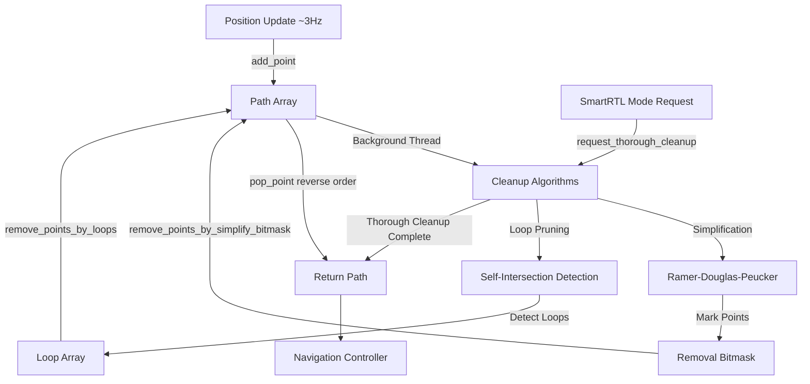
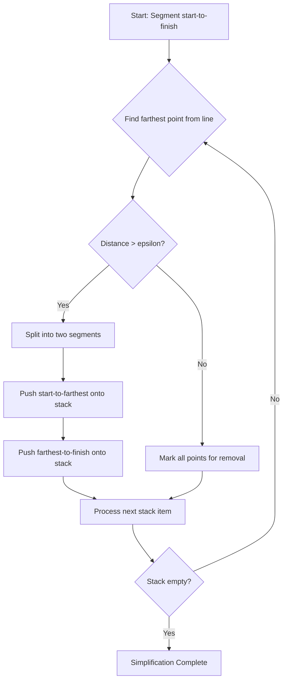
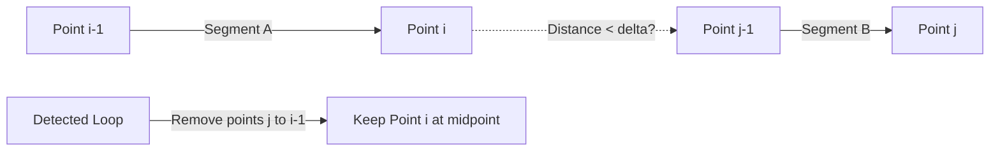
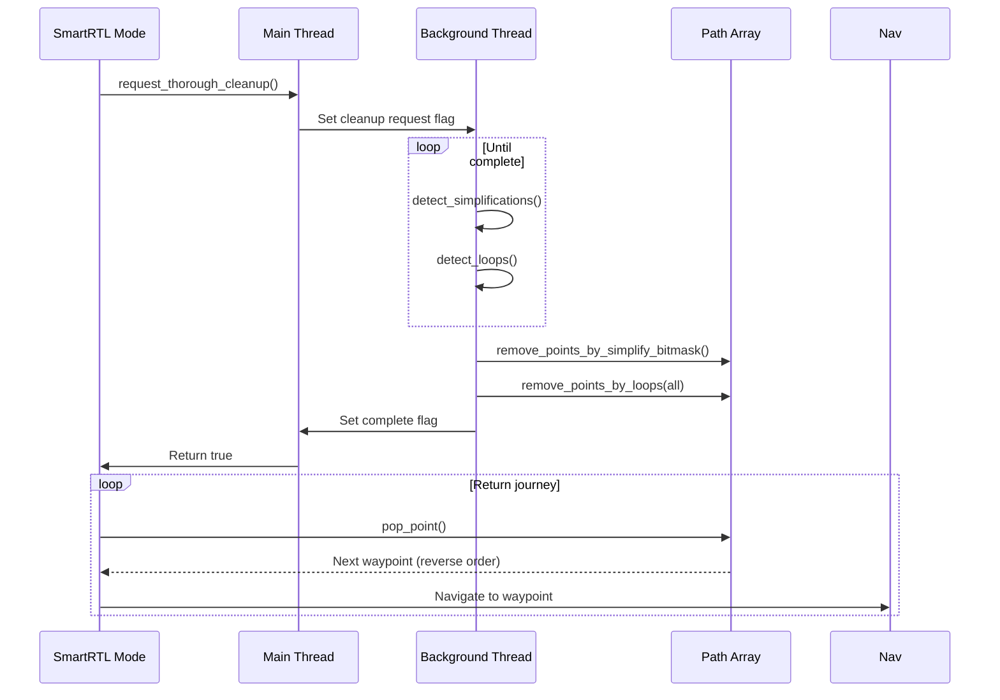

# AP_SmartRTL

## Overview

AP_SmartRTL (Smart Return-to-Launch) is a memory-efficient path recording and optimization system that enables vehicles to return home along the path they flew rather than in a straight line. The system continuously records the vehicle's position as "breadcrumbs" during flight, applies sophisticated path optimization algorithms to minimize memory usage, and generates an optimized return route when SmartRTL mode is engaged. This provides safer returns in complex environments where obstacles, terrain, or flight restrictions make a direct return path undesirable.

Key benefits:
- **Safer Returns**: Follows proven safe path rather than unknown direct route
- **Memory Efficient**: Automatic path simplification and loop pruning keeps memory usage under control
- **Obstacle Avoidance**: Returns along path that successfully avoided obstacles during outbound flight
- **Configurable**: Adjustable accuracy and maximum points allow tuning for mission requirements

## Architecture

The SmartRTL system consists of four main components operating asynchronously:



**Component Interactions**:

1. **Path Recording**: Main thread calls `update()` at ~3Hz, adding position samples to the path array when vehicle moves beyond the accuracy threshold
2. **Background Cleanup**: IO thread runs `run_background_cleanup()` continuously, performing time-sliced simplification and pruning to manage memory
3. **Thorough Cleanup**: When SmartRTL mode is requested, a complete cleanup runs to maximize path optimization before return journey begins
4. **Path Consumption**: During SmartRTL flight, navigation controller retrieves waypoints by popping points from the path in reverse order

## Path Recording

SmartRTL records the vehicle's position during flight to create a breadcrumb trail for return navigation.

**Position Sampling**:
- Sampling rate: Recommended 3Hz (configurable by calling code)
- Position source: AHRS/EKF estimated position
- Coordinate frame: NED (North-East-Down) in meters from EKF origin
- Storage format: `Vector3f` array (12 bytes per point)

**Recording Logic**:
```cpp
// Position is added only if vehicle has moved beyond accuracy threshold
// Source: libraries/AP_SmartRTL/AP_SmartRTL.cpp:259-291
void update(bool position_ok, const Vector3f& current_pos) {
    // Record position if:
    // 1. Position is valid (GPS/EKF healthy)
    // 2. Vehicle moved >= SRTL_ACCURACY meters from last point
    // 3. Memory is available
    // 4. SmartRTL is active
}
```

**Accuracy Parameter**:
- Default: 2.0 meters (SRTL_ACCURACY parameter)
- Range: 0-10 meters
- Effect: Minimum spacing between recorded points
- Lower values: More detailed path, higher memory usage
- Higher values: Coarser path, lower memory usage

**Memory Allocation**:
- Memory per point: ~20 bytes (12 bytes Vector3f + 8 bytes overhead)
- Default capacity: 300 points (~6KB)
- Maximum capacity: 500 points (~10KB)
- Total memory: path array + simplify stack + prune buffer

**Deactivation Conditions**:
- Memory full and cleanup unable to free space
- No position saved for 15 seconds (SMARTRTL_TIMEOUT)
- Initialization failure (memory allocation failed)
- User sets SRTL_POINTS parameter to 0

## Path Simplification Algorithm

SmartRTL uses the **Ramer-Douglas-Peucker algorithm** to identify and remove unnecessary points that lie close to the line between their neighbors.

**Algorithm Overview**:

The Ramer-Douglas-Peucker algorithm recursively examines path segments to find points that can be removed without significantly altering the path shape. For each segment from point A to point B, it finds the farthest intermediate point C. If C is closer than epsilon (tolerance) to the A-B line, all points between A and B can be removed.



**Implementation Details**:

Source: libraries/AP_SmartRTL/AP_SmartRTL.cpp:492-559

- **Non-recursive implementation**: Uses explicit stack instead of recursion to avoid stack overflow
- **Epsilon tolerance**: `SMARTRTL_SIMPLIFY_EPSILON = SRTL_ACCURACY * 0.5` (e.g., 1.0m for default 2.0m accuracy)
- **Removal marking**: Bitmask marks removable points without modifying path array
- **Time-sliced execution**: Runs for maximum 200 microseconds per call (SMARTRTL_SIMPLIFY_TIME_US)
- **Anytime algorithm**: Can be interrupted and resumed; partial results are valid

**Trigger Conditions**:
- 50 points added to path (SMARTRTL_CLEANUP_POINT_TRIGGER), OR
- Low memory (≤10 free slots) AND 10+ points added (SMARTRTL_CLEANUP_POINT_MIN)

**Stack Sizing**:
- Stack size: `points_max * (2.0/3.0) + 1`
- Example: 300 points → ~201 stack entries
- Rationale: Worst-case depth for binary tree subdivision

**Performance Characteristics**:
- Time complexity: O(n log n) average case, O(n²) worst case
- Space complexity: O(log n) for stack
- Typical removal: 20-40% of points depending on path complexity

## Loop Pruning Algorithm

Loop pruning detects when the vehicle's path crosses itself and removes the intervening loop to create a more direct return route.

**Loop Detection Strategy**:

The algorithm compares every line segment in the path against every other non-adjacent segment to find pairs that come within SMARTRTL_PRUNING_DELTA distance of each other. When segments get close enough, the loop between them is identified for removal.



**Algorithm Implementation**:

Source: libraries/AP_SmartRTL/AP_SmartRTL.cpp:568-628

```
// Nested loop structure
for i = path_points_count-1 down to 4:
    for j = 1 to i-2:
        distance = segment_segment_dist(path[i], path[i-1], path[j-1], path[j])
        if distance < SMARTRTL_PRUNING_DELTA:
            add_loop(j, i-1, midpoint)
```

**Key Parameters**:
- **SMARTRTL_PRUNING_DELTA**: `SRTL_ACCURACY * 0.99` (e.g., 1.98m for 2.0m accuracy)
- **Loop buffer size**: `points_max * 0.25` (e.g., 75 loops for 300 points)
- **Time slice**: Maximum 200 microseconds per call (SMARTRTL_PRUNING_LOOP_TIME_US)

**Loop Management**:
- **Overlap detection**: When loops overlap, only the longest loop is kept
- **Loop priority**: Longer loops are removed first to maximize point reduction
- **Midpoint placement**: First point of loop is repositioned to midpoint between loop endpoints

**segment_segment_dist Calculation**:

Source: libraries/AP_SmartRTL/AP_SmartRTL.cpp:796-867

Computes the minimum distance between two 3D line segments and the point midway between their closest approach:
1. Calculate segment direction vectors
2. Compute closest points using parametric line equations
3. Handle parallel/collinear segments as special cases
4. Return distance and midpoint between closest points

**Trigger Conditions**:
- Low memory: Path has ≤10 free slots (SMARTRTL_CLEANUP_START_MARGIN)
- Runs after simplification completes
- Always runs during thorough cleanup

## Return Path Generation

When SmartRTL mode is engaged, the system generates an optimized return path from the recorded breadcrumbs.

**Thorough Cleanup Process**:

Before return navigation begins, `request_thorough_cleanup()` is called repeatedly until it returns true:



**Path Consumption**:

Source: libraries/AP_SmartRTL/AP_SmartRTL.cpp:144-171

- **pop_point()**: Removes and returns the last point in the path array
  - Returns points in reverse order (last recorded → first recorded)
  - Decrements `_path_points_count`
  - Thread-safe with semaphore protection
  - Returns false if path is empty or semaphore unavailable

- **peek_point()**: Returns the next point without removing it
  - Useful for navigation lookahead
  - Returns `path[_path_points_count-1]`
  - Non-blocking semaphore attempt

**Fallback Behavior**:

If SmartRTL becomes unavailable:
- Vehicle code should fall back to standard RTL mode
- Reasons for unavailability:
  - Memory allocation failed during init
  - Path became too long and couldn't be cleaned up
  - No position recorded for 15+ seconds
  - User disabled with SRTL_POINTS = 0

## Memory Management

SmartRTL uses dynamic memory allocation at initialization with careful management to avoid fragmentation and runtime allocation.

**Memory Allocation**:

Source: libraries/AP_SmartRTL/AP_SmartRTL.cpp:94-135

```cpp
void init() {
    // All memory allocated once at initialization
    _path = (Vector3f*)calloc(_points_max, sizeof(Vector3f));
    _prune.loops = (prune_loop_t*)calloc(loops_max, sizeof(prune_loop_t));
    _simplify.stack = (simplify_start_finish_t*)calloc(stack_max, sizeof(simplify_start_finish_t));
    
    // Check allocation success
    if (_path == nullptr || _prune.loops == nullptr || _simplify.stack == nullptr) {
        log_action(DEACTIVATED_INIT_FAILED);
        GCS_SEND_TEXT(MAV_SEVERITY_WARNING, "SmartRTL deactivated: init failed");
        // Free any successful allocations
        free(_path); free(_prune.loops); free(_simplify.stack);
        return;
    }
}
```

**Memory Breakdown**:

| Component | Size per Element | Count | Total (300 points) |
|-----------|------------------|-------|---------------------|
| Path array | 12 bytes (Vector3f) | SRTL_POINTS | 3.6 KB |
| Simplify stack | 4 bytes (2x uint16_t) | points * 0.67 | 0.8 KB |
| Prune loops | 20 bytes (prune_loop_t) | points * 0.25 | 1.5 KB |
| **Total** | | | **~6 KB** |

For maximum 500 points: ~10 KB total memory

**SRTL_POINTS Parameter**:
- Default: 300 points
- Range: 0-500 points
- Requires reboot: Memory allocated at init() only
- Setting to 0: Disables SmartRTL entirely
- Memory calculation: `points * 20` bytes approximate total

**Thread Safety**:

Source: libraries/AP_SmartRTL/AP_SmartRTL.h:204

- **HAL_Semaphore _path_sem**: Protects path array access
- Main thread: Uses semaphore for add_point(), pop_point(), peek_point()
- Background thread: Uses semaphore for point removal operations
- Non-blocking attempts: Functions return false if semaphore unavailable
- Prevents corruption during concurrent access

**Allocation Failure Handling**:
1. Log DEACTIVATED_INIT_FAILED action
2. Send MAVLink warning to ground station
3. Free any partially allocated memory
4. Set `_active = false` permanently
5. SmartRTL unavailable for entire flight

## Integration with Failsafe and Mode Switching

SmartRTL integrates with ArduPilot's mode system and failsafe mechanisms.

**Initialization at Arming**:

Source: libraries/AP_SmartRTL/AP_SmartRTL.cpp:200-224

```cpp
// Called during arming sequence
void set_home(bool position_ok) {
    if (!position_ok) {
        return;  // SmartRTL will not be available this flight
    }
    
    // Clear any existing path
    _path_points_count = 0;
    _home_saved = true;
    _last_good_position_ms = AP_HAL::millis();
    
    // Reset cleanup algorithms
    reset_simplification();
    reset_pruning();
}
```

**Continuous Updates**:

The vehicle code must call `update()` continuously at ~3Hz regardless of flight mode:

```cpp
// Called from vehicle main loop at 3Hz
void Copter::update_smartrtl() {
    // Get current position from AHRS
    Vector3f current_pos;
    bool position_ok = ahrs.get_relative_position_NED_origin(current_pos);
    
    // Update SmartRTL (records path in all modes)
    g2.smart_rtl.update(position_ok, current_pos);
}
```

**Mode Engagement**:

When entering SmartRTL mode:

```cpp
// Called when switching to SmartRTL mode
bool ModeSmartRTL::enter() {
    // Check if SmartRTL is available
    if (!g2.smart_rtl.is_active() || g2.smart_rtl.get_num_points() == 0) {
        // Fall back to regular RTL
        gcs().send_text(MAV_SEVERITY_WARNING, "SmartRTL: no path, using RTL");
        return copter.set_mode(Mode::Number::RTL, ModeReason::SMARTRTL_FALLBACK);
    }
    
    // Request thorough cleanup
    return g2.smart_rtl.request_thorough_cleanup();
}

void ModeSmartRTL::run() {
    // Wait for cleanup to complete
    if (!thorough_cleanup_complete) {
        thorough_cleanup_complete = g2.smart_rtl.request_thorough_cleanup();
        if (!thorough_cleanup_complete) {
            // Hold position while cleanup runs
            return;
        }
    }
    
    // Pop next waypoint and navigate to it
    Vector3f next_point;
    if (g2.smart_rtl.pop_point(next_point)) {
        wp_nav->set_wp_destination(next_point);
    }
}
```

**Deactivation Scenarios**:

Source: libraries/AP_SmartRTL/AP_SmartRTL.cpp:869-881

| Scenario | Trigger | Action | Recovery |
|----------|---------|--------|----------|
| Timeout | No position save for 15s | Deactivate, log, GCS warning | Rearm vehicle |
| Memory full | Path full, cleanup fails | Deactivate, log, GCS warning | Rearm vehicle |
| Init failed | Memory allocation failed | Never activates | Increase available RAM |
| User disabled | SRTL_POINTS = 0 | Never activates | Set SRTL_POINTS > 0, reboot |

**GCS Notifications**:

Source: libraries/AP_SmartRTL/AP_SmartRTL.cpp:273-280

- "SmartRTL deactivated: init failed"
- "SmartRTL deactivated: bad position timeout"
- "SmartRTL deactivated: path full timeout"
- "SmartRTL: running out of path" (when low on memory)

## Configuration Parameters

SmartRTL behavior is controlled by three parameters in the SRTL_ group:

| Parameter | Description | Default | Range | Units | Notes |
|-----------|-------------|---------|-------|-------|-------|
| **SRTL_ACCURACY** | Minimum point spacing | 2.0 | 0-10 | meters | Lower values = more points recorded. Affects simplify epsilon (0.5×) and prune delta (0.99×) |
| **SRTL_POINTS** | Maximum path points | 300 | 0-500 | points | Memory usage ≈ points × 20 bytes. Requires reboot to change. Set to 0 to disable. |
| **SRTL_OPTIONS** | Bitmask options | 0 | - | bitmask | Bit 2: Ignore pilot yaw input during SmartRTL flight |

**Parameter Tuning Guidelines**:

**SRTL_ACCURACY**:
- **Shorter flights (<1km)**: 1.0-2.0m - Captures path details for close-quarters maneuvering
- **Long flights (>5km)**: 3.0-5.0m - Reduces memory usage for extended missions
- **Complex terrain**: 1.5-2.5m - More points to follow terrain contours accurately
- **Open areas**: 4.0-8.0m - Fewer points needed for simple paths

**SRTL_POINTS**:
- **Memory-constrained boards**: 100-200 points (~2-4KB)
- **Standard boards**: 300 points (default, ~6KB)
- **High-memory boards**: 400-500 points (~8-10KB)
- **Flight duration**: ~1 point per second of flight at 3m/s average speed with 2m accuracy

**SRTL_OPTIONS**:
- **Bit 2 (value 4)**: Ignore pilot yaw
  - Enabled: Vehicle automatically orients along return path
  - Disabled: Pilot can control yaw during SmartRTL flight
  - Recommended: Enabled for autonomous missions, disabled for manual oversight

**Memory vs. Flight Time**:

Example: 300 points, 2m accuracy, 3m/s average speed
- Distance per point: 2m
- Total recordable distance: 600m
- Flight time at 3m/s: 200 seconds (~3 minutes)
- With 50% simplification: ~6 minutes effective

## Testing SmartRTL with SITL

SmartRTL can be thoroughly tested using Software-In-The-Loop (SITL) simulation without risking hardware.

**SITL Setup**:

```bash
# Start SITL with Copter
cd ArduPilot
./Tools/autotest/sim_vehicle.py -v ArduCopter --console --map

# Enable SmartRTL (in MAVProxy console)
param set SRTL_ACCURACY 2.0
param set SRTL_POINTS 300
param fetch
```

**Test Flight Scenario 1: Simple Out-and-Back**:

```bash
# Arm and takeoff
mode GUIDED
arm throttle
takeoff 10

# Fly a rectangular pattern
wp set 1
# Create waypoints forming a rectangle
wp add 10 0 10 0
wp add 10 10 10 0
wp add 0 10 10 0
wp add 0 0 10 0

mode AUTO
# Wait for mission completion

# Engage SmartRTL
mode SMARTRTL
# Vehicle should return along the rectangular path in reverse
```

**Test Flight Scenario 2: Complex Path with Loops**:

```bash
# Fly a figure-8 pattern to test loop pruning
mode GUIDED
arm throttle
takeoff 10

# Manual navigation creating a figure-8
wp set 1
wp add 20 0 10 0
wp add 20 20 10 0
wp add 0 20 10 0
wp add 0 0 10 0
wp add 20 0 10 0
wp add 20 -20 10 0
wp add 0 -20 10 0
wp add 0 0 10 0

mode AUTO
# After mission completion
mode SMARTRTL
# Observe loop pruning optimizing the return path
```

**Using the Example Sketch**:

The SmartRTL_test example provides deterministic algorithm testing:

```bash
# Build example (from ArduPilot root)
./waf configure --board sitl
./waf examples

# Run SmartRTL test
./build/sitl/examples/SmartRTL_test

# Example tests:
# - Simplification on known paths
# - Loop detection and pruning
# - Memory management edge cases
# - Algorithm timing measurements
```

**Log Analysis**:

Source: libraries/AP_SmartRTL/AP_SmartRTL.cpp:883-908

SmartRTL generates SRTL log messages with the following fields:

```
SRTL: TimeUS, Active, NumPts, Action, N, E, D
```

**Log message fields**:
- **TimeUS**: Timestamp in microseconds
- **Active**: SmartRTL active status (1 = active, 0 = inactive)
- **NumPts**: Current number of points in path
- **Action**: Last action code
  - 0: POINT_ADD
  - 1: POINT_PRUNE
  - 2: POINT_SIMPLIFY
  - 3: ADD_FAILED_NO_SEMAPHORE
  - 4: ADD_FAILED_PATH_FULL
  - 9: DEACTIVATED_BAD_POSITION_TIMEOUT
  - 10: DEACTIVATED_PATH_FULL_TIMEOUT
- **N, E, D**: Last point coordinates (NED, meters)

**Log analysis commands**:

```bash
# Extract SmartRTL logs from .bin file
mavlogdump.py --types SRTL flight.bin

# Plot path in 2D
mavgraph.py flight.bin "SRTL.E" "SRTL.N"

# Monitor point count over time
mavgraph.py flight.bin "SRTL.NumPts"

# Check for errors
mavlogdump.py --types SRTL flight.bin | grep -E "Action: (3|4|9|10)"
```

**Validation Checklist**:

- [ ] Path recording starts after arming with GPS lock
- [ ] Points added approximately every SRTL_ACCURACY meters
- [ ] Point count stays below SRTL_POINTS maximum
- [ ] Simplification triggers after ~50 points added
- [ ] Loop pruning activates when memory gets low
- [ ] SmartRTL mode engages without errors
- [ ] Return path follows outbound path in reverse
- [ ] Loops are successfully pruned from complex paths
- [ ] No semaphore timeout errors in logs
- [ ] Memory deactivation warnings appear if path too long

## Safety Considerations

SmartRTL operates in a safety-critical environment and requires careful configuration and monitoring.

**Memory Constraints**:

- **Board RAM limits**: Verify board has sufficient free RAM for configured SRTL_POINTS
- **Memory fragmentation**: Init happens at startup to avoid runtime fragmentation
- **Allocation failure**: SmartRTL permanently deactivates if memory allocation fails
- **Recommendation**: Test with `param set SRTL_POINTS 300` initially, increase only if needed and RAM permits

**Position Validity Requirements**:

- **GPS health**: SmartRTL requires valid GPS position (EKF origin set)
- **EKF status**: Position must have low variance and good innovation checks
- **Timeout protection**: Deactivates after 15 seconds without valid position
- **Pre-arming**: set_home() must be called with position_ok=true at arming

**Timeout Deactivation**:

Source: libraries/AP_SmartRTL/AP_SmartRTL.cpp:246-257

```cpp
// Deactivation if no position saved for too long
if (AP_HAL::millis() - _last_position_save_ms > SMARTRTL_TIMEOUT) {
    deactivate(DEACTIVATED_BAD_POSITION_TIMEOUT, 
               "bad position timeout");
}
```

**Implications**:
- GPS glitches lasting >15s will deactivate SmartRTL for remainder of flight
- Indoor flights or GPS-denied environments incompatible with SmartRTL
- Must rearm to re-enable SmartRTL after deactivation

**Thread-Safety Requirements**:

- **Semaphore protection**: All path array access must use _path_sem
- **Non-blocking**: Main thread uses `take_nonblocking()` to avoid flight delays
- **Background thread**: IO thread can be preempted by higher priority tasks
- **Critical section duration**: Kept minimal (<1ms) to avoid blocking flight control

**Fallback to Regular RTL**:

SmartRTL should always have a fallback strategy:

```cpp
// Example vehicle code pattern
bool start_smartrtl() {
    if (!smart_rtl.is_active() || smart_rtl.get_num_points() == 0) {
        gcs().send_text(MAV_SEVERITY_WARNING, "SmartRTL unavailable, using RTL");
        return set_mode(RTL);
    }
    return set_mode(SMARTRTL);
}
```

**Flight Testing Recommendations**:

1. **Initial testing**: SITL simulation only until confident in behavior
2. **First hardware test**: Short flight in open area with visual observer
3. **Monitor GCS**: Watch for SmartRTL deactivation warnings
4. **Log review**: Analyze SRTL logs after each flight before extending range
5. **Gradual increase**: Increase flight complexity gradually as confidence builds
6. **Failsafe configuration**: Ensure battery and radio failsafes are properly configured

**Failure Mode Analysis**:

| Failure | Detection | Impact | Mitigation |
|---------|-----------|--------|------------|
| Memory allocation fails | At init | SmartRTL unavailable | GCS warning, fall back to RTL |
| Path fills up | During flight | SmartRTL deactivates | GCS warning, fall back to RTL |
| GPS loss >15s | During flight | SmartRTL deactivates | GCS warning, fall back to RTL |
| Semaphore timeout | Point add/pop | Single operation fails | Logged, retried next cycle |
| Cleanup fails to free space | Low memory | Path fills, deactivates | Increase SRTL_ACCURACY or reduce SRTL_POINTS |

**Prohibited Configurations**:

- ❌ SRTL_ACCURACY = 0 (would record at every update, filling memory instantly)
- ❌ SRTL_POINTS > 500 (exceeds design limits, risks memory corruption)
- ❌ Using SmartRTL in GPS-denied environments (requires continuous valid position)
- ❌ Disabling EKF when SmartRTL enabled (positions will be invalid)

## Implementation Notes

**Design Decisions**:

**Background Cleanup on IO Thread**:

Source: libraries/AP_SmartRTL/AP_SmartRTL.cpp:131-134

```cpp
// Register cleanup to run on IO thread, not main flight control thread
if (!_example_mode) {
    hal.scheduler->register_io_process(
        FUNCTOR_BIND_MEMBER(&AP_SmartRTL::run_background_cleanup, void));
}
```

**Rationale**: 
- Flight control thread must maintain deterministic timing
- Cleanup algorithms can take several milliseconds
- IO thread has lower priority, doesn't interfere with attitude control
- Preemptible by time-critical operations

**Time-Slicing for Real-Time Responsiveness**:

Both simplification and pruning use fixed time slices:
- Maximum execution: 200 microseconds per call
- Saves state and returns, resumed on next call
- Prevents long-running algorithms from delaying other tasks
- Allows gradual progress without blocking

**Anytime Algorithms**:

Both cleanup algorithms are "anytime algorithms":
- Can be interrupted at any time
- Partial results are valid and useful
- Quality improves with more time allowed
- Graceful degradation under time pressure

Example: If memory fills rapidly, even partial simplification helps by identifying some removable points immediately.

**uint16_t Bounds for Memory Efficiency**:

- All point indices use `uint16_t` (2 bytes) not `uint32_t` (4 bytes)
- Limits maximum points to 65,535 (design limit is 500)
- Saves 2 bytes per index in structures
- Significant savings in stack and loop arrays
- Design decision: 500 points deemed sufficient for any practical mission

**Example Mode for Testing**:

Source: libraries/AP_SmartRTL/AP_SmartRTL.h:30

```cpp
AP_SmartRTL(bool example_mode = false);
```

**Purpose**:
- Disables background thread when example_mode=true
- Allows deterministic testing of algorithms
- Enables timing measurements of cleanup operations
- Used by SmartRTL_test example sketch
- Not used by vehicle code (always false)

**Known Limitations**:

1. **Path cannot handle GPS origin changes**: Positions stored relative to EKF origin; origin change invalidates all points
2. **No altitude limit awareness**: Records path at any altitude; mode code must enforce altitude limits
3. **No obstacle database**: Only avoids obstacles that were present during outbound flight
4. **Memory is fixed**: Cannot dynamically grow/shrink path array during flight
5. **Single path only**: Cannot maintain multiple return paths or branch points

**Future Enhancement Opportunities** (documented, not implemented):

- Adaptive accuracy: Increase spacing in open areas, decrease near obstacles
- Altitude-aware pruning: Preserve vertical path detail even if horizontal path simplifies
- Path compression: Use curve fitting or splines to represent smooth sections
- Persistent storage: Save path to SD card for use across reboots
- Multi-path support: Maintain separate paths for different flight phases

## References

**Source Code**:
- Path recording and management: `libraries/AP_SmartRTL/AP_SmartRTL.cpp:200-350`
- Simplification algorithm: `libraries/AP_SmartRTL/AP_SmartRTL.cpp:492-559`
- Loop pruning algorithm: `libraries/AP_SmartRTL/AP_SmartRTL.cpp:568-628`
- Segment distance calculation: `libraries/AP_SmartRTL/AP_SmartRTL.cpp:796-867`
- Memory management: `libraries/AP_SmartRTL/AP_SmartRTL.cpp:94-135`
- Configuration parameters: `libraries/AP_SmartRTL/AP_SmartRTL.cpp:22-47`
- Header definitions: `libraries/AP_SmartRTL/AP_SmartRTL.h:1-243`

**Related ArduPilot Modules**:
- **AP_AHRS**: Provides vehicle position estimates from EKF
- **AP_Logger**: Logs SmartRTL actions and path points to binary logs
- **GCS_MAVLink**: Sends SmartRTL status and warnings to ground control station
- **AP_Param**: Parameter storage and retrieval system
- **HAL::Scheduler**: Thread scheduling and IO process registration

**Algorithm References**:
- **Ramer-Douglas-Peucker Algorithm**: Douglas, D. H., & Peucker, T. K. (1973). "Algorithms for the reduction of the number of points required to represent a digitized line or its caricature." Cartographica: The International Journal for Geographic Information and Geovisualization, 10(2), 112-122.
  - Wikipedia: https://en.wikipedia.org/wiki/Ramer%E2%80%93Douglas%E2%80%93Peucker_algorithm

**External Documentation**:
- ArduPilot SmartRTL mode documentation: https://ardupilot.org/copter/docs/smartrtl-mode.html
- Parameter reference: https://ardupilot.org/copter/docs/parameters.html#srtl-parameters

**Example Code**:
- Algorithm testing: `libraries/AP_SmartRTL/examples/SmartRTL_test/SmartRTL_test.cpp`
- Mode implementation: `ArduCopter/mode_smartrtl.cpp` (vehicle-specific)

**Testing Tools**:
- SITL simulation: `Tools/autotest/sim_vehicle.py`
- Log analysis: `Tools/scripts/mavlogdump.py`
- Parameter management: MAVProxy, Mission Planner, QGroundControl
