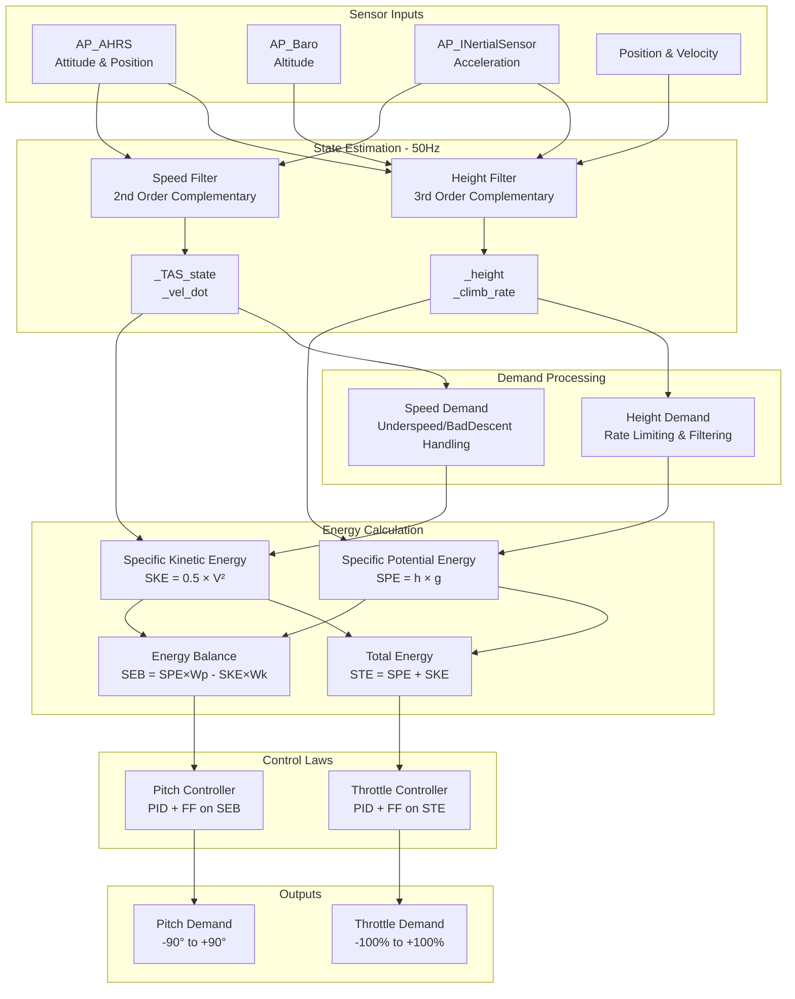
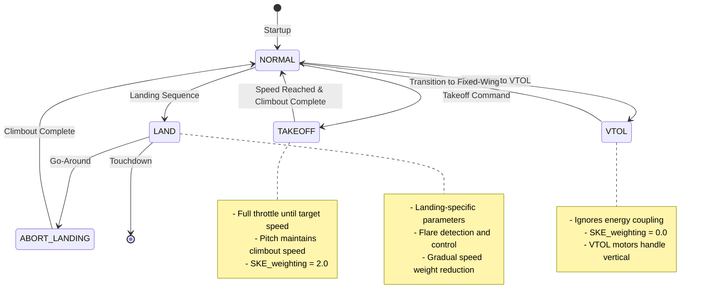

# AP_TECS - Total Energy Control System


## Table of Contents
- [Overview](#overview)
- [Theoretical Background](#theoretical-background)
- [Architecture](#architecture)
- [Energy Management Principles](#energy-management-principles)
- [Control System Design](#control-system-design)
- [Configuration Parameters](#configuration-parameters)
- [Flight Stage Integration](#flight-stage-integration)
- [Tuning Guide](#tuning-guide)
- [Troubleshooting](#troubleshooting)
- [API Reference](#api-reference)
- [Examples](#examples)

## Overview

The Total Energy Control System (TECS) is a sophisticated control algorithm that coordinates aircraft altitude and airspeed control in fixed-wing vehicles. Unlike traditional separate throttle-for-speed and pitch-for-altitude controllers, TECS recognizes the fundamental coupling between these control axes through the aircraft's total energy state.

**Source Files**: `libraries/AP_TECS/`
- **AP_TECS.h** - Class definition and interface
- **AP_TECS.cpp** - Core algorithm implementation

### Key Features

- **Unified Energy Management**: Controls total energy (altitude + airspeed) and energy distribution (potential vs kinetic)
- **Intelligent Mode Selection**: Automatically adapts control strategy based on flight stage and sensor availability
- **Underspeed Protection**: Prevents dangerous low-speed conditions through automatic priority adjustments
- **Landing Optimization**: Specialized behavior for precision approaches and flares
- **Glider Support**: Native handling of unpowered and thermalling flight
- **Synthetic Airspeed**: Fallback operation when airspeed sensor is unavailable or unreliable

### Design Philosophy

TECS was written by Paul Riseborough in 2013 to provide:
- Combined control of speed and height using throttle to control total energy and pitch angle to control exchange of energy between potential and kinetic
- Selectable speed or height priority modes when calculating pitch angle
- Fallback mode when no airspeed measurement is available
- Underspeed protection with automatic mode switching
- Relative ease of tuning through intuitive time constant, damping, and integrator parameters

## Theoretical Background

### Total Energy Concept

The fundamental insight of TECS is that an aircraft's total mechanical energy consists of two components:

**Specific Potential Energy (SPE)**:
```
SPE = h × g
```
Where:
- `h` = height above reference (m)
- `g` = gravitational acceleration (9.80665 m/s²)

**Specific Kinetic Energy (SKE)**:
```
SKE = 0.5 × V²
```
Where:
- `V` = true airspeed (m/s)

**Specific Total Energy (STE)**:
```
STE = SPE + SKE = h×g + 0.5×V²
```

### Energy Rate Equations

The rate of change of total energy is controlled by throttle:

**Specific Total Energy Rate**:
```
STEdot = SPEdot + SKEdot
       = (dh/dt)×g + V×(dV/dt)
       = climb_rate×g + V×acceleration
```

The distribution of energy between potential (altitude) and kinetic (speed) is controlled by pitch:

**Specific Energy Balance (SEB)**:
```
SEB = SPE×Wp - SKE×Wk
```
Where:
- `Wp` = potential energy weighting (height priority)
- `Wk` = kinetic energy weighting (speed priority)

### Control Strategy

**Throttle Control Loop**:
- Inputs: Total energy error (STE_error), Total energy rate error (STEdot_error)
- Output: Throttle demand
- Purpose: Add or remove energy from the system

**Pitch Control Loop**:
- Inputs: Energy balance error (SEB_error), Energy balance rate error (SEBdot_error)
- Output: Pitch demand
- Purpose: Redistribute energy between altitude and speed

This decoupling allows independent control of:
1. **How much energy** the aircraft has (via throttle)
2. **How that energy is distributed** between altitude and speed (via pitch)

### Mathematical Foundation

The TECS controller implements a cascaded control structure:

**Throttle Demand Calculation**:
```
throttle = throttle_ff + K_STE2Thr × (STE_error + STEdot_error × damping) + integrator
```

**Pitch Demand Calculation**:
```
pitch = (SEBdot_demand + SEBdot_error × damping + integrator) / (V × g)
```

Where:
- `K_STE2Thr` = gain from specific total energy to throttle
- `SEBdot_demand` = (h_rate_demand × g × Wp) + (SEB_error / time_constant)

## Architecture

### Class Structure

```cpp
/**
 * @class AP_TECS
 * @brief Total Energy Control System for coordinated altitude/airspeed control
 * 
 * Source: /libraries/AP_TECS/AP_TECS.h
 * 
 * This class implements a total energy control algorithm that manages the coupling
 * between altitude and airspeed control in fixed-wing aircraft. The controller
 * uses throttle to manage total energy and pitch to control energy distribution.
 */
```

### Control Loop Architecture



### Update Loop Timing

TECS operates with a two-stage update cycle:

**1. Fast Update Loop (50Hz minimum)**:
- Function: `update_50hz()`
- Source: `AP_TECS.cpp:313`
- Purpose: State estimation and sensor fusion
- Operations:
  - Height estimation using 3rd order complementary filter
  - Climb rate calculation from EKF or filtered barometer
  - Airspeed estimation using 2nd order complementary filter
  - Acceleration filtering and velocity derivative calculation

**2. Control Loop (10Hz to 500Hz)**:
- Function: `update_pitch_throttle()`
- Source: `AP_TECS.cpp:1259`
- Purpose: Compute control outputs
- Operations:
  - Demand processing and rate limiting
  - Energy quantity calculation
  - Control law execution
  - Output limiting and anti-windup

> **Important**: `update_50hz()` must be called before `update_pitch_throttle()` to ensure state estimates are current. Failure to call `update_50hz()` will result in division by zero errors.

## Energy Management Principles

### Height Estimation

TECS uses a sophisticated 3rd order complementary filter to fuse barometric altitude with vertical acceleration, providing smooth height and climb rate estimates with minimal lag.

**Filter Implementation** (Source: `AP_TECS.cpp:313-379`):

When EKF vertical velocity is available:
```cpp
// Direct use of EKF estimates
_climb_rate = -velned.z;  // NED frame (down is positive in NED)
_ahrs.get_relative_position_D_home(_height);
_height *= -1.0f;  // Convert to up-positive
```

When EKF velocity unavailable (fallback mode):
```cpp
// 3rd order complementary filter
// Reference: Widnall & Sinha, "Optimizing the Gains of the Baro-Inertial Vertical Channel"
// AIAA Journal of Guidance and Control, 78-1307R

float omega = TECS_HGT_OMEGA;  // Crossover frequency (default 3.0 rad/s)
float omega2 = omega * omega;
float omega3 = omega2 * omega;

// Vertical acceleration measurement
float hgt_ddot_mea = -(accel_ef.z + GRAVITY_MSS);

// Three integrators with feedback
height_filter.dd_height += (baro_error × omega3) × dt;
climb_rate += (height_filter.dd_height + hgt_ddot_mea + baro_error × omega2 × 3.0) × dt;
height_filter.height += (climb_rate + baro_error × omega × 3.0) × dt;
```

**Filter Characteristics**:
- **Crossover frequency**: Configurable via `TECS_HGT_OMEGA` (1.0-5.0 rad/s, default 3.0)
- **Phase lag**: Minimal at frequencies below crossover
- **Noise rejection**: High-frequency accelerometer noise heavily attenuated
- **Response time**: ~0.33 seconds to 63% of step change (at default omega)

### Airspeed Estimation

A 2nd order complementary filter fuses airspeed measurements with longitudinal acceleration to provide a low-lag, low-noise airspeed estimate.

**Filter Implementation** (Source: `AP_TECS.cpp:381-475`):

```cpp
// Calculate longitudinal acceleration in body frame
float temp = rotMat.c.x × GRAVITY_MSS + accel_body.x;
float vel_dot = vdot_filter.apply(temp);  // 5-point moving average

// 2nd order complementary filter
float omega = TECS_SPD_OMEGA;  // Crossover frequency (default 2.0 rad/s)
float omega2 = omega * omega;

float airspeed_error = (EAS × EAS2TAS) - TAS_state;

// Two integrators
integDTAS_state += (airspeed_error × omega2) × dt;
TAS_state += (integDTAS_state + vel_dot + airspeed_error × omega × 1.4142) × dt;
```

**Synthetic Airspeed Mode** (Source: `AP_TECS.cpp:400`):
When no airspeed sensor is available and `TECS_SYNAIRSPEED=1`:
- Uses GPS groundspeed corrected for estimated wind
- Relies on EKF wind estimation accuracy
- Degrades gracefully to cruise airspeed when wind estimate poor
- **Warning**: Synthetic airspeed has significant limitations in wind

**Airspeed Limit Adaptation** (Source: `AP_TECS.cpp:408-419`):
TECS dynamically adjusts maximum airspeed to prevent situations where the aircraft cannot climb:
```cpp
if (throttle_clipping_at_max) {
    // Reduce TASmax when unable to climb at current max speed
    TASmax += dt × (0.5 × STEdot_min / TAS_state);
    TASmax = MAX(TASmax, airspeed_cruise);
} else {
    // Restore TASmax to parameter value
    TASmax += dt × (0.5 × STEdot_max / TAS_state);
}
```

### Energy Quantity Calculation

**Core Energy Equations** (Source: `AP_TECS.cpp:681-700`):

```cpp
// Demanded energies (what we want)
SPE_dem = hgt_dem × GRAVITY_MSS;
SKE_dem = 0.5 × TAS_dem_adj × TAS_dem_adj;

// Estimated energies (what we have)
SPE_est = height × GRAVITY_MSS;
SKE_est = 0.5 × TAS_state × TAS_state;

// Energy rates (first derivatives)
SPEdot = climb_rate × GRAVITY_MSS;
SKEdot = TAS_state × (vel_dot - vel_dot_lpf);  // High-pass filtered

// Demanded energy rate
SKEdot_dem = TAS_state × (TAS_rate_dem - TAS_rate_dem_lpf);
```

**High-Pass Filtering of Velocity Derivatives**:
The subtraction of low-pass filtered values implements a high-pass filter that removes bias errors from the complementary filters while preserving dynamic response.

### Speed/Height Priority Weighting

TECS uses a weighting factor (`TECS_SPDWEIGHT`) to adjust the priority between altitude and airspeed control in the pitch axis.

**Weighting Calculation** (Source: `AP_TECS.cpp:991-1016`):

```cpp
SKE_weighting = TECS_SPDWEIGHT;  // User parameter (0.0 to 2.0)
SPE_weighting = 2.0 - SKE_weighting;

// Constrain to prevent instability
SPE_weighting = MIN(SPE_weighting, 1.0);
SKE_weighting = MIN(SKE_weighting, 1.0);
```

**Weighting Interpretations**:

| SPDWEIGHT | SKE_weight | SPE_weight | Behavior | Use Case |
|-----------|------------|------------|----------|----------|
| 0.0 | 0.0 | 1.0 | Pitch controls altitude only, throttle controls speed | No airspeed sensor |
| 1.0 | 1.0 | 1.0 | Balanced control (default) | Normal operation with airspeed |
| 2.0 | 1.0 | 0.0 | Pitch controls speed only, throttle controls altitude | Gliders, underspeed protection |

**Automatic Weighting Adjustments**:

1. **No Airspeed Sensor**: `SKE_weighting = 0.0`
   - Pitch controls altitude directly
   - Throttle controls climb rate
   
2. **Underspeed Condition**: `SKE_weighting = 2.0`
   - Pitch prioritizes speed recovery
   - Prevents stall by allowing altitude loss
   
3. **Takeoff/Abort Landing**: `SKE_weighting = 2.0`
   - Pitch maintains safe climb speed
   - Throttle at maximum for climb performance
   
4. **VTOL Mode**: `SKE_weighting = 0.0`
   - Decouples speed and height (VTOL motors provide vertical thrust)
   
5. **Landing** (Source: `AP_TECS.cpp:1008-1015`):
   - If `TECS_LAND_SPDWGT >= 0`: Uses fixed landing weight
   - If `TECS_LAND_SPDWGT = -1`: Scales from `TECS_SPDWEIGHT` at approach start to 0.0 at touchdown

## Control System Design

### Throttle Control Loop

The throttle controller manages the aircraft's total energy by controlling the sum of potential and kinetic energy.

**Control Law** (Source: `AP_TECS.cpp:722-882`):

```cpp
// Total energy error
STE_error = constrain_float((SPE_dem - SPE_est), SPE_err_min, SPE_err_max) 
            + SKE_dem - SKE_est;

// Total energy rate demand
STEdot_dem = constrain_float((SPEdot_dem + SKEdot_dem), STEdot_min, STEdot_max);

// Total energy rate error (with filtering)
STEdot_error = STEdot_dem - SPEdot - SKEdot;
STEdot_error = lowpass_filter(STEdot_error, 0.5s);

// Gain calculation
K_thr2STE = (STEdot_max - STEdot_min) / (THRmax - THRmin);
K_STE2Thr = 1 / (time_constant × K_thr2STE);

// Feed-forward throttle (with turn compensation)
ff_throttle = throttle_cruise + (STEdot_dem + rollComp × (1/cos²(roll) - 1)) / K_thr2STE;

// PID throttle
throttle_dem = (STE_error + STEdot_error × THR_DAMP) × K_STE2Thr + ff_throttle;

// Integrator (with anti-windup)
integrator += STE_error × INTEG_GAIN × dt × K_STE2Thr;
integrator = constrain(integrator, integ_min, integ_max);

// Final output with rate limiting
throttle_dem += integrator;
throttle_dem = rate_limit(throttle_dem, throttle_slewrate);
```

**Key Features**:

1. **Turn Compensation** (`TECS_RLL2THR`): Automatically increases throttle in turns to compensate for increased induced drag
2. **Anti-Windup**: Integrator limits prevent wind-up when throttle saturates
3. **Rate Limiting**: Smooth throttle changes via `THR_SLEWRATE` parameter
4. **Dynamic Limits**: Respects external throttle limits from servos or takeoff logic

**Special Modes**:

**Underspeed Protection** (Source: `AP_TECS.cpp:753-754`):
```cpp
if (underspeed_flag) {
    throttle_dem = 1.0;  // Full throttle demand
}
```

**Gliding Mode** (Source: `AP_TECS.cpp:755-756`):
```cpp
if (is_gliding_flag) {
    throttle_dem = 0.0;  // Zero throttle
}
```

### Pitch Control Loop

The pitch controller manages energy distribution between potential (altitude) and kinetic (airspeed) forms.

**Control Law** (Source: `AP_TECS.cpp:989-1163`):

```cpp
// Specific energy balance (weighted)
SEB_dem = SPE_dem × SPE_weighting - SKE_dem × SKE_weighting;
SEB_est = SPE_est × SPE_weighting - SKE_est × SKE_weighting;
SEB_error = SEB_dem - SEB_est;

// Energy balance rate demand
SEBdot_dem = hgt_rate_dem × GRAVITY_MSS × SPE_weighting 
             + SEB_error / time_constant;
SEBdot_dem = constrain(SEBdot_dem, -maxSinkRate × g, maxClimbRate × g);

// Energy balance rate error
SEBdot_est = SPEdot × SPE_weighting - SKEdot × SKE_weighting;
SEBdot_error = SEBdot_dem - SEBdot_est;

// PID calculation
SEBdot_total = SEBdot_dem + SEBdot_error × PTCH_DAMP;

// Integrators (two separate integrators)
integSEBdot += SEBdot_error × INTEG_GAIN × dt;
integKE += (SKE_est - SKE_dem) × SKE_weighting × dt / time_constant;

// Pitch demand
pitch_dem_unc = (SEBdot_total + integSEBdot + integKE) / (TAS_state × GRAVITY_MSS);

// Feed-forward for gliders
if (is_gliding) {
    pitch_dem_unc += (TAS_dem_adj - PTCH_FF_V0) × PTCH_FF_K;
}

// Limit and rate limit
pitch_dem = constrain(pitch_dem_unc, PITCHmin, PITCHmax);
pitch_dem = rate_limit(pitch_dem, VERT_ACC / TAS_state);
```

**Dual Integrator Design**:

1. **Primary Integrator** (`integSEBdot`): Trims out long-term energy balance errors
2. **Speed Trim Integrator** (`integKE`): Compensates for airspeed errors when SKE_weighting > 0

This dual design prevents integrator fighting and improves response in different flight modes.

**Anti-Windup Strategy** (Source: `AP_TECS.cpp:1086-1096`):
```cpp
// Inhibit integration when saturating
if ((pitch_dem_unc > PITCHmax && integrator_delta > 0) ||
    (pitch_dem_unc < PITCHmin && integrator_delta < 0)) {
    // Fade out integrator instead of holding
    integrator × = (1.0 - dt / (dt + time_constant));
}
```

### Throttle Control Without Airspeed

When no airspeed sensor is available, TECS falls back to a simplified pitch-to-throttle mapping.

**Algorithm** (Source: `AP_TECS.cpp:910-962`):

```cpp
// Use blended pitch (high-pass demand + low-pass measured)
pitch_demand_lpf = lowpass(pitch_dem);
pitch_demand_hpf = pitch_dem - pitch_demand_lpf;
pitch_measured_lpf = lowpass(ahrs.get_pitch());
pitch_blended = pitch_demand_hpf + (pitch_measured_lpf - pitch_trim);

// Map pitch to throttle
if (pitch_blended > 0 && PITCHmax > 0) {
    throttle = cruise_thr + (max_thr - cruise_thr) × (pitch_blended / PITCHmax);
} else if (pitch_blended < 0 && PITCHmin < 0) {
    throttle = cruise_thr + (min_thr - cruise_thr) × (pitch_blended / PITCHmin);
} else {
    throttle = cruise_thr;
}

// Add turn compensation
throttle += rollComp × (1/cos²(roll) - 1) / (STEdot_max - STEdot_min);
```

This provides basic altitude hold capability without airspeed feedback, suitable for:
- Vehicles without airspeed sensors
- Airspeed sensor failures
- Low-speed flight where airspeed readings are unreliable

## Configuration Parameters

### Core Performance Parameters

**TECS_TIME_CONST** (Source: `AP_TECS.cpp:38-43`)
- **Range**: 3.0 - 10.0 seconds (default: 5.0)
- **Purpose**: Primary time constant controlling response speed
- **Effect**: 
  - Smaller values: Faster altitude corrections, potential overshoot
  - Larger values: Slower, smoother corrections, better stability
- **Tuning**: Start with 5.0, reduce if altitude tracking is sluggish, increase if oscillating

**TECS_CLMB_MAX** (Source: `AP_TECS.cpp:21-27`)
- **Range**: 0.1 - 20.0 m/s (default: 5.0)
- **Purpose**: Maximum demanded climb rate
- **Tuning Procedure**:
  1. Set to climb speed achievable at `THR_MAX`, `AIRSPEED_CRUISE`, and low battery voltage
  2. If airspeed cannot be maintained during climb: **reduce**
  3. If throttle doesn't increase significantly to climb: **increase**
- **Safety**: Do not exceed physical climb performance

**TECS_SINK_MIN** (Source: `AP_TECS.cpp:29-35`)
- **Range**: 0.1 - 10.0 m/s (default: 2.0)
- **Purpose**: Minimum sink rate at `THR_MIN` and `AIRSPEED_CRUISE`
- **Tuning**: Measure actual sink rate in manual mode at minimum throttle

**TECS_SINK_MAX** (Source: `AP_TECS.cpp:109-115`)
- **Range**: 0.0 - 20.0 m/s (default: 5.0)
- **Purpose**: Maximum demanded descent rate
- **Constraint**: Must not exceed achievable descent rate at `THR_MIN`, `TECS_PITCH_MIN`, and `AIRSPEED_MAX`

**TECS_VERT_ACC** (Source: `AP_TECS.cpp:61-67`)
- **Range**: 1.0 - 10.0 m/s² (default: 7.0)
- **Purpose**: Maximum vertical acceleration for correcting errors
- **Effect**: Limits rate of pitch change
- **Tuning**: Higher values give faster altitude response but may cause aggressive maneuvering

### Damping and Integrator Parameters

**TECS_PTCH_DAMP** (Source: `AP_TECS.cpp:101-107`)
- **Range**: 0.1 - 1.0 (default: 0.3)
- **Purpose**: Pitch control damping gain
- **Effect**: Adds derivative action to pitch control
- **Symptoms**: 
  - Too low: Oscillations in speed and height
  - Too high: Sluggish response, additional oscillation
- **Tuning**: Increase gradually until oscillations are well damped

**TECS_THR_DAMP** (Source: `AP_TECS.cpp:45-51`)
- **Range**: 0.1 - 1.0 (default: 0.5)
- **Purpose**: Throttle control damping gain
- **Tuning**: Similar to `PTCH_DAMP`, increase to dampen throttle oscillations

**TECS_INTEG_GAIN** (Source: `AP_TECS.cpp:53-59`)
- **Range**: 0.0 - 0.5 (default: 0.3)
- **Purpose**: Integrator gain to eliminate steady-state errors
- **Effect**: Trims out long-term speed and height errors
- **Tuning**:
  - Too low: Persistent trim errors in cruise
  - Too high: Slow integrator wind-up, overshoot
- **Recommendation**: Start at 0.3, adjust by ±0.05 increments

### Speed/Height Priority

**TECS_SPDWEIGHT** (Source: `AP_TECS.cpp:93-99`)
- **Range**: 0.0 - 2.0 (default: 1.0)
- **Purpose**: Mixing of pitch and throttle correction
- **Settings**:
  - **0.0**: Pitch controls altitude, throttle controls airspeed (no airspeed sensor mode)
  - **1.0**: Balanced control (recommended for most aircraft)
  - **2.0**: Pitch controls airspeed, throttle controls altitude (glider mode)
- **Tuning**: Use 1.0 for powered aircraft, 1.5-2.0 for efficient gliders

### Pitch Limits

**TECS_PITCH_MAX** (Source: `AP_TECS.cpp:141-147`)
- **Range**: 0 - 45 degrees (default: 15)
- **Purpose**: Maximum pitch in auto flight modes
- **Override**: Overrides `PTCH_LIM_MAX_DEG` when non-zero
- **Tuning**: Set to angle aircraft can sustain climb at `AIRSPEED_CRUISE` and `THR_MAX`

**TECS_PITCH_MIN** (Source: `AP_TECS.cpp:149-155`)
- **Range**: -45 - 0 degrees (default: 0)
- **Purpose**: Minimum pitch in auto flight modes
- **Override**: Overrides `PTCH_LIM_MIN_DEG` when non-zero
- **Tuning**: Set to angle where aircraft doesn't exceed `AIRSPEED_MAX` in descent

### Complementary Filter Tuning

**TECS_HGT_OMEGA** (Source: `AP_TECS.cpp:69-75`)
- **Range**: 1.0 - 5.0 rad/s (default: 3.0)
- **Purpose**: Height complementary filter crossover frequency
- **Effect**:
  - Higher: Faster response to altitude changes, more accelerometer noise
  - Lower: Smoother but lagged height estimate
- **Typical Values**: 2.0-4.0 rad/s

**TECS_SPD_OMEGA** (Source: `AP_TECS.cpp:77-83`)
- **Range**: 0.5 - 2.0 rad/s (default: 2.0)
- **Purpose**: Speed complementary filter crossover frequency
- **Tuning**: Similar trade-off to `HGT_OMEGA` for airspeed estimation

### Turn Compensation

**TECS_RLL2THR** (Source: `AP_TECS.cpp:85-91`)
- **Range**: 5.0 - 30.0 (default: 10.0)
- **Purpose**: Bank angle compensation gain
- **Meaning**: Approximate additional throttle per 45° bank to maintain altitude
- **Tuning Procedure**:
  1. Fly automatic mission with >90° turns
  2. Monitor altitude and airspeed in turns
  3. If altitude drops: **increase** value
  4. If airspeed drops in turns: **increase** value
  5. Set to ~10× measured sink rate (m/s) in a 45° turn
- **Related Parameters**: Tune with `PTCH2SRV_RLL` and `KFF_RDDRMIX` for constant airspeed/altitude turns

### Landing Parameters

**TECS_LAND_ARSPD** (Source: `AP_TECS.cpp:117-123`)
- **Range**: -1 - 127 m/s (default: -1)
- **Purpose**: Target airspeed during landing approach
- **Special Values**:
  - `-1`: Automatically use midpoint between `AIRSPEED_MIN` and `AIRSPEED_CRUISE`
  - `>0`: Fixed landing approach speed
- **Note**: Requires airspeed sensor (use `TECS_LAND_THR` if no sensor)

**TECS_LAND_THR** (Source: `AP_TECS.cpp:125-131`)
- **Range**: -1 - 100% (default: -1)
- **Purpose**: Cruise throttle during landing approach (no airspeed sensor)
- **Special Values**:
  - `-1`: Disabled, use `TECS_LAND_ARSPD` instead
  - `0-100`: Fixed throttle percentage for approach

**TECS_LAND_SPDWGT** (Source: `AP_TECS.cpp:133-139`)
- **Range**: -1.0 - 2.0 (default: -1.0)
- **Purpose**: Speed/height priority during landing
- **Special Values**:
  - `-1.0`: Gradually scale from `TECS_SPDWEIGHT` to `0.0` during approach
  - `0.0-2.0`: Fixed weighting for entire landing
- **Behavior**:
  - Near `0.0`: Ignores speed error, maintains pitch up (good for gliders, may overshoot)
  - Near `2.0`: Ignores height error (risk of stall)

**TECS_LAND_SINK** (Source: `AP_TECS.cpp:157-163`)
- **Range**: 0.0 - 2.0 m/s (default: 0.25)
- **Purpose**: Target sink rate for final landing stage
- **Tuning**: Lower for gentle touchdown, higher for steeper approaches

**TECS_LAND_TCONST** (Source: `AP_TECS.cpp:165-171`)
- **Range**: 1.0 - 5.0 seconds (default: 2.0)
- **Purpose**: Time constant during final landing stage
- **Requirement**: Must be smaller than `TECS_TIME_CONST` for responsive flare

**TECS_LAND_DAMP** (Source: `AP_TECS.cpp:173-179`)
- **Range**: 0.1 - 1.0 (default: 0.5)
- **Purpose**: Sink rate to pitch gain during flare
- **Requirement**: Should be larger than `TECS_PTCH_DAMP` for better sink rate control

**TECS_LAND_PMAX** (Source: `AP_TECS.cpp:181-187`)
- **Range**: -5 - 40 degrees (default: 10)
- **Purpose**: Maximum pitch during final landing stage
- **Tuning**: 5-10° typical to prevent stall in flare
- **Special Values**: `0` = use normal pitch limits

**TECS_LAND_SRC** (Source: `AP_TECS.cpp:198-205`)
- **Range**: -2.0 - 2.0 m/s/m (default: 0)
- **Purpose**: Sink rate change proportional to distance past land waypoint
- **Effect**:
  - Positive: Increases sink rate beyond waypoint (force earlier landing)
  - Negative: Decreases sink rate beyond waypoint (allow pitched-up stall landing)
- **Typical Value**: 0.2 for forced landing if overspeeding

**TECS_APPR_SMAX** (Source: `AP_TECS.cpp:189-196`)
- **Range**: 0.0 - 20.0 m/s (default: 0)
- **Purpose**: Maximum sink rate during approach stage
- **Use Case**: Steep approaches or reverse thrust
- **Special Values**: `0` = use `TECS_SINK_MAX`

### Takeoff Parameters

**TECS_TKOFF_IGAIN** (Source: `AP_TECS.cpp:223-229`)
- **Range**: 0.0 - 0.5 (default: 0)
- **Purpose**: Integrator gain during takeoff
- **Special Values**: `0` = use `TECS_INTEG_GAIN`
- **Effect**: Higher values trim errors faster during climbout

### Advanced Options

**TECS_SYNAIRSPEED** (Source: `AP_TECS.cpp:239-244`)
- **Values**: 0=Disable, 1=Enable (default: 0)
- **Purpose**: Enable synthetic airspeed (no airspeed sensor)
- **Warning**: 
  - Very poor estimates when wind estimate is inaccurate
  - For development/testing only
  - Understand limitations before enabling
- **Behavior**: Has no effect if healthy airspeed sensor present

**TECS_OPTIONS** (Source: `AP_TECS.cpp:246-251`)
- **Bit 0 (GliderOnly)**: Disables bad descent detection
- **Bit 1 (AllowDescentSpeedup)**: Allows speed increase during maximum descent
- **Default**: 0 (all options disabled)

**TECS_PTCH_FF_V0** (Source: `AP_TECS.cpp:253-258`)
- **Range**: 5.0 - 50.0 m/s (default: 12.0)
- **Purpose**: Baseline airspeed for pitch feed-forward
- **Tuning**: Set to airspeed where aircraft glides at neutral pitch (including `STAB_PITCH_DOWN`)

**TECS_PTCH_FF_K** (Source: `AP_TECS.cpp:260-265`)
- **Range**: -5.0 - 0.0 rad/(m/s) (default: 0.0)
- **Purpose**: Gain from demanded airspeed to pitch
- **Typical Values**:
  - `-0.04`: Gliders
  - `-0.08`: Draggy airframes
  - `0.0`: Disabled (default)

**TECS_THR_ERATE** (Source: `AP_TECS.cpp:269-275`)
- **Range**: 0 - 100 %/s (default: 20)
- **Purpose**: External throttle lower limit decay rate
- **Effect**: Minimum throttle limit reduces by this rate after being externally set
- **Special Values**: `≤0` = hold limit for one frame only

**TECS_FLARE_HGT** (Source: `AP_TECS.cpp:277-283`)
- **Range**: 0 - 15 m (default: 1.0)
- **Purpose**: Height above ground for flare holdoff
- **Effect**: Below this height, sink rate held at `TECS_LAND_SINK`
- **Use**: Perform hold-off maneuver with small `TECS_LAND_SINK` values

**TECS_HDEM_TCONST** (Source: `AP_TECS.cpp:285-292`)
- **Range**: 1.0 - 5.0 seconds (default: 3.0)
- **Purpose**: Time constant of height demand low-pass filter
- **Note**: Only applies when bit 0 of `TECS_OPTIONS` not set

## Flight Stage Integration

TECS behavior adapts automatically based on the flight stage reported by the vehicle's mission controller.

### Flight Stage State Machine



### Takeoff Mode

**Activation**: `FlightStage::TAKEOFF` or `FlightStage::ABORT_LANDING`

**TECS Behavior** (Source: `AP_TECS.cpp:789-793`, `AP_TECS.cpp:1314-1320`):

```cpp
// Speed weighting: priority on maintaining safe climb speed
SKE_weighting = 2.0;

// Throttle: demand full throttle until target speed reached
if (!reached_speed_takeoff && TAS_state >= TASmin) {
    throttle_dem = MAX(throttle_dem, THRmax - integrator);
    reached_speed_takeoff = true;
}

// Pitch: minimum pitch set by takeoff logic (ptchMinCO_cd parameter)
PITCHmin = ptchMinCO_cd;  // Applied externally per takeoff configuration

// Integrators: special handling during initial climbout
if (!flag_have_reset_after_takeoff) {
    // Reset all integrators at takeoff start
    integrator = 0;
    reached_speed_takeoff = false;
}
```

**Tuning Parameters**:
- `TECS_TKOFF_IGAIN`: Integrator gain during takeoff (0 = use normal)
- `TKOFF_THR_MAX`: Maximum throttle during takeoff (vehicle parameter)
- `TKOFF_PITCH_MIN`: Minimum pitch during takeoff (vehicle parameter)

### Landing Mode

**Activation**: `FlightStage::LAND`

**Landing Phases**:

1. **Approach Phase** (Source: `AP_TECS.cpp:1519-1540`):
   - Uses approach-specific parameters
   - Smooth transition to lower time constant
   - Sink rate ramping if `TECS_APPR_SMAX` set

2. **Flare Phase** (Source: `AP_TECS.cpp:1498-1526`):
   - Triggered when height above field < threshold
   - Smooth pitch limit transition to `LAND_PITCH_CD`
   - Holds sink rate at `TECS_LAND_SINK`
   - Height tracking offset compensates for filter lag

**Flare Logic** (Source: `AP_TECS.cpp:623-647`):

```cpp
if (landing.is_flaring()) {
    if (!flare_initialised) {
        // Capture current state at flare entry
        hgt_at_start_of_flare = hgt_afe;
        hgt_rate_at_flare_entry = climb_rate;
        pitch_min_at_flare_entry = PITCHmin;
        
        // Set ideal flare profile
        flare_hgt_dem_ideal = hgt_afe - TECS_LAND_SINK × time_to_flare;
        flare_hgt_dem_adj = hgt_dem;
    }
    
    // Progress through flare (0 at start, 1 at touchdown)
    float p = constrain((hgt_at_start_of_flare - hgt_afe) / hgt_at_start_of_flare, 0, 1);
    
    // Blend pitch limits
    PITCHmin = (1-p) × pitch_min_at_flare_entry + p × LAND_PITCH_CD/100;
    
    // Control sink rate with height tracking
    hgt_dem = flare_hgt_dem_adj × (1-p) + flare_hgt_dem_ideal × p;
}
```

**Landing Parameters Applied**:
- `TECS_LAND_ARSPD` or `TECS_LAND_THR`: Target approach speed/throttle
- `TECS_LAND_SPDWGT`: Speed/height priority
- `TECS_LAND_SINK`: Target sink rate in flare
- `TECS_LAND_TCONST`: Faster time constant for responsive flare
- `TECS_LAND_DAMP`: Increased damping for smooth touchdown
- `TECS_LAND_PMAX`: Maximum pitch in final stage
- `TECS_LAND_IGAIN`: Landing integrator gain (if non-zero)
- `TECS_LAND_TDAMP`: Landing throttle damping (if non-zero)
- `TECS_LAND_PDAMP`: Landing pitch damping (if non-zero)

### VTOL Transition Mode

**Activation**: `FlightStage::VTOL`

**TECS Behavior** (Source: `AP_TECS.cpp:728-735`, `AP_TECS.cpp:1000-1005`):

```cpp
// Decouple speed and height control
SKE_weighting = 0.0;  // Pitch controls height only

// Ignore potential energy errors in total energy calculation
if (flight_stage == VTOL) {
    SPE_err_max = 0;
    SPE_err_min = 0;  // Vertical thrust handled by VTOL motors
}
```

**Rationale**: VTOL motors provide independent vertical thrust, breaking the normal energy coupling between altitude and airspeed in fixed-wing flight.

### Normal Flight Mode

**Activation**: All other flight stages

**TECS Behavior**:
- Full energy coupling between altitude and airspeed
- Uses standard parameters (`TECS_SPDWEIGHT`, `TECS_TIME_CONST`, etc.)
- All protection mechanisms active (underspeed, bad descent)

## Tuning Guide

### Initial Setup Procedure

**Step 1: Gather Aircraft Performance Data**

Perform test flights in manual mode to measure:

1. **Maximum Climb Rate**: At `THR_MAX`, `AIRSPEED_CRUISE`, and low battery
2. **Minimum Sink Rate**: At `THR_MIN`, `AIRSPEED_CRUISE`
3. **Maximum Sink Rate**: At `THR_MIN`, minimum safe pitch, `AIRSPEED_MAX`
4. **Turn Sink Rate**: Measure altitude loss rate in sustained 45° bank turn

**Step 2: Set Performance Limits**

```
TECS_CLMB_MAX = measured_max_climb_rate  (typically 5-8 m/s for trainers)
TECS_SINK_MIN = measured_min_sink_rate   (typically 1-3 m/s)
TECS_SINK_MAX = measured_max_sink_rate   (typically 4-6 m/s)
TECS_RLL2THR = 10 × turn_sink_rate       (typically 10-15)
```

**Step 3: Set Pitch Limits**

```
TECS_PITCH_MAX = maximum_sustainable_climb_pitch  (typically 10-20°)
TECS_PITCH_MIN = maximum_safe_descent_pitch       (typically -5 to -15°)
```

**Step 4: Initial Conservative Settings**

```
TECS_TIME_CONST = 5.0      # Start with default
TECS_PTCH_DAMP = 0.3       # Start with default
TECS_THR_DAMP = 0.5        # Start with default
TECS_INTEG_GAIN = 0.3      # Start with default
TECS_SPDWEIGHT = 1.0       # Balanced control
TECS_VERT_ACC = 7.0        # Start with default
```

### Flight Test Procedure

**Test 1: Basic Altitude Hold**

1. Fly AUTO mission with straight legs at constant altitude
2. Observe altitude tracking:
   - Acceptable: ±5m with smooth corrections
   - Poor tracking: Increase `TECS_VERT_ACC`, decrease `TECS_TIME_CONST`
   - Oscillations: Increase `TECS_PTCH_DAMP`, increase `TECS_TIME_CONST`

**Test 2: Altitude Changes**

1. Command step changes in altitude (50-100m)
2. Observe response:
   - Slow response: Decrease `TECS_TIME_CONST`, increase `TECS_VERT_ACC`
   - Overshoot: Increase `TECS_TIME_CONST`, increase damping
   - Persistent offset: Increase `TECS_INTEG_GAIN`

**Test 3: Speed Changes**

1. Command airspeed changes in AUTO mode
2. Observe speed tracking:
   - Good: Speed reaches target within 5-10 seconds
   - Oscillating: Increase `TECS_THR_DAMP`
   - Slow: Decrease `TECS_TIME_CONST`

**Test 4: Turns**

1. Fly mission with >90° turns
2. Monitor altitude and speed in turns:
   - Altitude loss: Increase `TECS_RLL2THR`
   - Speed loss: Increase `TECS_RLL2THR`
   - Altitude gain: Decrease `TECS_RLL2THR`

### Parameter Interactions

**Primary Response Speed**: `TECS_TIME_CONST` ↔ `TECS_VERT_ACC`
- Decrease `TIME_CONST` OR increase `VERT_ACC` → faster response
- These work together; adjust both for optimal response

**Stability**: `TECS_PTCH_DAMP` ↔ `TECS_THR_DAMP` ↔ `TECS_TIME_CONST`
- Increase damping to stabilize oscillations
- If already at max damping, increase `TIME_CONST`

**Steady-State Accuracy**: `TECS_INTEG_GAIN`
- Too low: Trim errors persist
- Too high: Overshoot and wind-up
- Adjust slowly (±0.05 steps)

### Common Issues and Solutions

#### Problem: Altitude Oscillations (Period ~10-20 seconds)

**Causes**:
- Insufficient damping
- Time constant too small
- Vertical acceleration limit too high

**Solutions**:
1. Increase `TECS_PTCH_DAMP` by 0.1
2. Increase `TECS_TIME_CONST` by 0.5
3. Decrease `TECS_VERT_ACC` by 1.0

#### Problem: Airspeed Oscillations

**Causes**:
- Insufficient throttle damping
- Speed weight too high for aircraft dynamics

**Solutions**:
1. Increase `TECS_THR_DAMP` by 0.1
2. Reduce `TECS_SPDWEIGHT` toward 1.0
3. Check for throttle servo issues or engine response lag

#### Problem: Altitude Slowly Wanders

**Causes**:
- Integrator gain too low
- Time constant too large

**Solutions**:
1. Increase `TECS_INTEG_GAIN` by 0.05
2. Decrease `TECS_TIME_CONST` by 0.5

#### Problem: Overshoot on Altitude Changes

**Causes**:
- Time constant too small
- Integrator gain too high
- Vertical acceleration limit too high

**Solutions**:
1. Increase `TECS_TIME_CONST` by 0.5
2. Decrease `TECS_INTEG_GAIN` by 0.05
3. Decrease `TECS_VERT_ACC` by 1.0

#### Problem: Cannot Maintain Speed in Climb

**Symptom**: `TECS_CLMB_MAX` set too high

**Solutions**:
1. Reduce `TECS_CLMB_MAX` to achievable climb rate
2. Check battery voltage under load
3. Verify `THR_MAX` is set correctly

#### Problem: Aircraft Descends into Ground

**Symptoms**: Bad descent condition activated

**Root Causes**:
- Demanded airspeed too high for aircraft performance
- `AIRSPEED_MAX` set beyond aircraft capability

**TECS Protection** (Source: `AP_TECS.cpp:964-986`):
```
Bad descent detected when:
1. Total energy error > 200 (>~20m height error)
2. Total energy decreasing (STEdot < 0)
3. Throttle demand > 90%

Protection action:
- Sets demanded airspeed to minimum
- Forces speed priority mode (SKE_weighting = 2.0)
```

**Solutions**:
1. Reduce `AIRSPEED_MAX` to achievable maximum speed
2. Check aircraft drag and power-to-weight ratio
3. Ensure `TECS_CLMB_MAX` and `TECS_SINK_MAX` are realistic

### Landing Tuning

**Approach Tuning**:

1. Set target approach speed:
   ```
   TECS_LAND_ARSPD = stall_speed × 1.3  (typically 12-16 m/s)
   ```

2. Set approach sink rate limit (if needed):
   ```
   TECS_APPR_SMAX = 0  (use normal SINK_MAX)
   # OR for steep approaches:
   TECS_APPR_SMAX = 8.0  (allows steeper descent)
   ```

**Flare Tuning**:

1. Set flare time constant (faster response):
   ```
   TECS_LAND_TCONST = 2.0  (faster than normal TIME_CONST)
   ```

2. Set target sink rate:
   ```
   TECS_LAND_SINK = 0.25  (gentle touchdown)
   # OR for quick landing:
   TECS_LAND_SINK = 0.5
   ```

3. Set flare damping (more aggressive):
   ```
   TECS_LAND_DAMP = 0.5  (higher than normal PTCH_DAMP)
   ```

4. Set maximum flare pitch:
   ```
   TECS_LAND_PMAX = 10  (prevent stall)
   ```

**Speed Priority Tuning**:

For standard powered aircraft:
```
TECS_LAND_SPDWGT = -1  (automatic scaling)
```

For gliders (pitch up at touchdown):
```
TECS_LAND_SPDWGT = 0.0  (ignore speed, maintain pitch)
```

**Holdoff Tuning** (for hold-off maneuver):
```
TECS_FLARE_HGT = 1.0       # Height to start holdoff
TECS_LAND_SINK = 0.15      # Very gentle sink in holdoff
```

### Glider-Specific Tuning

**Configuration**:
```
TECS_SPDWEIGHT = 2.0       # Pitch controls speed, throttle controls altitude
TECS_PTCH_FF_V0 = 15.0     # Trim speed for neutral pitch
TECS_PTCH_FF_K = -0.04     # Pitch feed-forward gain (negative)
TECS_OPTIONS = 1           # Bit 0: Disable bad descent detection
THR_MAX = 0                # No engine (automatic gliding mode)
```

**Feed-Forward Tuning Procedure**:

1. Fly in CRUISE or FBWB mode
2. Note airspeed where pitch trim is neutral (including `STAB_PITCH_DOWN`)
3. Set `TECS_PTCH_FF_V0` to this speed
4. Start with `TECS_PTCH_FF_K = -0.04`
5. Adjust until speed changes produce appropriate pitch response

**Thermalling Support**:
- TECS automatically sets `is_gliding = true` when `THR_MAX = 0`
- Throttle demand forced to zero
- Speed priority weighting (pitch controls speed)
- Soaring controller can request gliding via `set_gliding_requested_flag()`

## Troubleshooting

### Diagnostic Data Logging

TECS provides extensive logging for diagnosis and tuning. Enable logging with:

```
LOG_BITMASK: Enable "TECS" logging
```

**Log Messages** (Source: `AP_TECS.cpp:1365-1407`):

**TECS Message**: Primary state and control data
```
Fields:
- h: Current height estimate (m)
- dh: Current climb rate (m/s)
- hin: Height demand input from autopilot (m)
- hdem: Height demand after filtering that TECS is tracking (m)
- dhdem: Climb rate demand (m/s)
- spdem: True airspeed demand (m/s)
- sp: Current estimated true airspeed (m/s)
- dsp: Longitudinal acceleration estimate (m/s²)
- th: Throttle output (0-1)
- ph: Pitch output (radians)
- f: Status flags (underspeed, badDescent, autoLanding, reachedTakeoffSpd)
```

**TEC2 Message**: Energy balance details
```
Fields:
- PEW: Potential energy weighting
- KEW: Kinetic energy weighting
- EBD: Energy balance demand
- EBE: Energy balance estimate
- EBDD: Energy balance rate demand
- EBDE: Energy balance rate estimate
- EBDDT: Total energy balance rate (demand + damping)
- I: Energy balance error integral
- KI: Pitch demand kinetic energy integral
```

**TEC3 Message**: Total energy details
```
Fields:
- KED: Kinetic energy dot (SKEdot)
- PED: Potential energy dot (SPEdot)
- KEDD: Kinetic energy dot demand
- PEDD: Potential energy dot demand
- TEE: Total energy error
- TEDE: Total energy dot error
- FFT: Feed-forward throttle
- I: Throttle integrator state
```

**TEC4 Message**: Energy states
```
Fields:
- P: Specific potential energy estimate
- K: Specific kinetic energy estimate
- Pdem: Demanded potential energy
- Kdem: Demanded kinetic energy
```

### Log Analysis for Common Problems

#### Oscillating Altitude

**What to Check**:
1. Plot `TECS.h` and `TECS.hdem`: Should track with minimal overshoot
2. Plot `TEC2.I` (integrator): Should not wind up to limits
3. Check `TEC2.EBDDT`: Excessive damping term indicates oscillation

**Diagnosis**:
- If integrator hitting limits: Reduce `TECS_INTEG_GAIN`
- If high-frequency oscillation: Increase `TECS_PTCH_DAMP`
- If slow oscillation: Increase `TECS_TIME_CONST`

#### Airspeed Not Tracking

**What to Check**:
1. Plot `TECS.sp` vs `TECS.spdem`
2. Plot `TECS.th` (throttle): Check for saturation
3. Plot `TEC3.I` (throttle integrator)

**Diagnosis**:
- If throttle saturated at max: Reduce demanded speed or increase aircraft power
- If throttle oscillating: Increase `TECS_THR_DAMP`
- If persistent speed offset: Increase `TECS_INTEG_GAIN`

#### Bad Descent Triggering

**What to Check**:
1. Plot `TECS.f` bits (flag field)
2. Plot `TEC3.TEE` (total energy error)
3. Plot `TECS.th` (throttle demand)

**Diagnosis** (Source: `AP_TECS.cpp:964-986`):
```
Bad descent triggers when ALL true:
- Total energy error > 200
- STEdot < 0 (losing energy)
- Throttle demand > 90%
```

**Solutions**:
- If frequently triggered: Demanded speed too high for aircraft performance
- Reduce `AIRSPEED_MAX` to achievable speed
- Check battery voltage and motor performance
- For gliders, set bit 0 of `TECS_OPTIONS` to disable

#### Underspeed Protection Activating

**What to Check**:
1. Plot `TECS.f` for underspeed bit
2. Plot `TECS.sp` vs minimum airspeed
3. Plot `TECS.th` for throttle saturation

**Trigger Conditions** (Source: `AP_TECS.cpp:650-678`):
```
Underspeed triggers when:
- Airspeed < TASmin × 0.9, AND
- Throttle demand > 95%, AND
- Not in flare

OR when already underspeed:
- Height < demanded height
```

**Recovery**:
```
Clears when ALL true:
- Airspeed > TASmin × 1.15
- 3 seconds since last underspeed
- (Height >= demanded) OR (throttle < 95% AND airspeed > TASmin × 0.9)
```

**Solutions**:
- Review `AIRSPEED_MIN` setting (may be too high)
- Check climb performance (may need lower `TECS_CLMB_MAX`)
- Verify battery capacity and motor power

### Safety Features

#### Underspeed Protection

**Purpose**: Prevent stall by prioritizing airspeed recovery

**Activation** (Source: `AP_TECS.cpp:663-668`):
```cpp
if ((TAS_state < TASmin × 0.9) && 
    (throttle_dem >= THRmax × 0.95) &&
    !landing.is_flaring()) {
    underspeed_flag = true;
}
```

**Protection Actions**:
1. Set `SKE_weighting = 2.0` (pitch controls speed only)
2. Set `TAS_dem = TASmin` (demand minimum safe speed)
3. Set `throttle_dem = 1.0` (full throttle)

**Recovery**: Requires sustained airspeed >15% above minimum for 3+ seconds

#### Bad Descent Protection

**Purpose**: Prevent descent into terrain due to unachievable airspeed demands

**Activation** (Source: `AP_TECS.cpp:973-983`):
```cpp
if ((STE_error > 200.0) &&    // Large energy deficit (~20m low)
    (STEdot < 0.0) &&          // Still losing energy
    (throttle_dem >= THRmax × 0.9)) {
    badDescent_flag = true;
}
```

**Protection Actions**:
1. Set `TAS_dem = TASmin` (reduce speed demand)
2. Set `SKE_weighting = 2.0` (pitch for speed)
3. Allow altitude loss to recover speed

**Recovery**: Clears when `STE_error < 0` (energy deficit eliminated)

#### Throttle and Pitch Limiting

**External Limits** (Source: `AP_TECS.cpp:1433-1562`):

TECS respects limits set externally (e.g., from servo library or takeoff logic):

```cpp
// Applied each control cycle
_THRmaxf = MIN(1.0, _THRmaxf_ext);
_THRminf = MAX(-1.0, _THRminf_ext);
_PITCHmaxf = MIN(_PITCHmaxf, _PITCHmaxf_ext);
_PITCHminf = MAX(_PITCHminf, _PITCHminf_ext);
```

**Methods for External Override**:
- `set_throttle_min(thr_min, reset_output)`: Set minimum throttle override
- `set_throttle_max(thr_max)`: Set maximum throttle override (one cycle)
- `set_pitch_min(pitch_min)`: Set minimum pitch override (one cycle)
- `set_pitch_max(pitch_max)`: Set maximum pitch override (one cycle)

#### Integrator Anti-Windup

**Throttle Integrator** (Source: `AP_TECS.cpp:777-796`):
```cpp
// Dynamic anti-windup limits (allow 10% saturation margin)
integ_max = constrain(THRmax - throttle_dem + 0.1, -maxAmp, maxAmp);
integ_min = constrain(THRmin - throttle_dem - 0.1, -maxAmp, maxAmp);
integrator = constrain(integrator, integ_min, integ_max);
```

**Pitch Integrators** (Source: `AP_TECS.cpp:1086-1096`):
```cpp
// Inhibit integration when saturating
if ((pitch_unc > PITCHmax && delta > 0) ||
    (pitch_unc < PITCHmin && delta < 0)) {
    // Fade out instead of holding
    integrator × = (1.0 - dt/(dt + time_constant));
}
```

This prevents integrator wind-up and allows faster recovery from saturation.

## API Reference

### Public Methods

#### Initialization

```cpp
/**
 * @brief Constructor
 * @param ahrs Reference to AHRS object for attitude and position
 * @param parms Reference to fixed-wing parameters (AP_FixedWing)
 * @param landing Reference to landing controller
 * @param log_bitmask Logging configuration bitmask
 * 
 * Source: AP_TECS.h:29-36
 */
AP_TECS(AP_AHRS &ahrs, const AP_FixedWing &parms, 
        const AP_Landing &landing, const uint32_t log_bitmask);
```

#### State Update Methods

```cpp
/**
 * @brief Update state estimation at 50Hz
 * 
 * @details Performs sensor fusion for height and airspeed estimation using
 *          complementary filters. Must be called before update_pitch_throttle().
 * 
 * @pre Called at 50Hz minimum
 * @post Updates _height, _climb_rate, _TAS_state, _vel_dot
 * 
 * @warning Failure to call this will cause division by zero in control loop
 * 
 * Source: AP_TECS.cpp:313-379
 */
void update_50hz(void);

/**
 * @brief Update control loop and calculate pitch/throttle demands
 * 
 * @details Main control loop calculating throttle and pitch demands based on
 *          altitude and airspeed errors. Call rate: 10Hz to 500Hz.
 * 
 * @param hgt_dem_cm Demanded height above field elevation in centimeters
 * @param EAS_dem_cm Demanded equivalent airspeed in cm/s
 * @param flight_stage Current flight stage (TAKEOFF, LAND, VTOL, NORMAL, etc.)
 * @param distance_beyond_land_wp Distance beyond landing waypoint (m), used for sink rate adjustment
 * @param ptchMinCO_cd Minimum pitch in centidegrees from takeoff/landing controller
 * @param throttle_nudge Throttle adjustment from pilot (-100 to +100)
 * @param hgt_afe Height above field elevation in meters
 * @param load_factor Aerodynamic load factor (1.0 = 1g, 2.0 = 2g)
 * @param pitch_trim_deg Pitch trim angle in degrees
 * 
 * @pre update_50hz() must have been called recently
 * @post Updates _throttle_dem and _pitch_dem outputs
 * 
 * @note Do not call slower than 10Hz or faster than 500Hz
 * 
 * Source: AP_TECS.cpp:1259-1408
 */
void update_pitch_throttle(int32_t hgt_dem_cm,
                           int32_t EAS_dem_cm,
                           enum AP_FixedWing::FlightStage flight_stage,
                           float distance_beyond_land_wp,
                           int32_t ptchMinCO_cd,
                           int16_t throttle_nudge,
                           float hgt_afe,
                           float load_factor,
                           float pitch_trim_deg);
```

#### Output Retrieval Methods

```cpp
/**
 * @brief Get demanded throttle output
 * 
 * @return Throttle demand in percent (-100 to +100)
 *         Positive for forward thrust, negative if reverse thrust enabled
 * 
 * @note Returns value in range _THRminf to _THRmaxf scaled to percentage
 * 
 * Source: AP_TECS.h:60-62
 */
float get_throttle_demand(void);

/**
 * @brief Get demanded pitch angle
 * 
 * @return Pitch demand in centidegrees (-9000 to +9000)
 *         Positive = nose up, Negative = nose down
 * 
 * @note Converts internal radians to centidegrees (× 5729.5781)
 * 
 * Source: AP_TECS.h:66-68
 */
int32_t get_pitch_demand(void);
```

#### State Query Methods

```cpp
/**
 * @brief Get rate of change of velocity along X body axis
 * @return Acceleration in m/s²
 * Source: AP_TECS.h:71-73
 */
float get_VXdot(void);

/**
 * @brief Get current target equivalent airspeed
 * @return Target EAS in m/s
 * Source: AP_TECS.h:76-78
 */
float get_target_airspeed(void) const;

/**
 * @brief Get maximum climb rate
 * @return Maximum climb rate in m/s (from TECS_CLMB_MAX)
 * Source: AP_TECS.h:81-83
 */
float get_max_climbrate(void) const;

/**
 * @brief Get maximum sink rate
 * @return Maximum sink rate in m/s, positive = down (from TECS_SINK_MAX)
 * Source: AP_TECS.h:86-88
 */
float get_max_sinkrate(void) const;

/**
 * @brief Get landing sink rate
 * @return Landing sink rate in m/s (from TECS_LAND_SINK)
 * Source: AP_TECS.h:102-104
 */
float get_land_sinkrate(void) const;

/**
 * @brief Get landing airspeed
 * @return Landing airspeed in m/s (from TECS_LAND_ARSPD)
 * Source: AP_TECS.h:107-109
 */
float get_land_airspeed(void) const;

/**
 * @brief Get height rate demand
 * @return Demanded climb/sink rate in m/s
 * Source: AP_TECS.h:112-114
 */
float get_height_rate_demand(void) const;
```

#### Control Adjustment Methods

```cpp
/**
 * @brief Reset pitch integrators to zero
 * 
 * @details Resets both pitch integrators (_integSEBdot and _integKE).
 *          Used by soaring controller when transitioning modes.
 * 
 * @note Does not reset throttle integrator
 * 
 * Source: AP_TECS.h:91-94
 */
void reset_pitch_I(void);

/**
 * @brief Reset throttle integrator to zero
 * 
 * @details Clears accumulated throttle integral term.
 * 
 * Source: AP_TECS.h:97-99
 */
void reset_throttle_I(void);

/**
 * @brief Set path proportion for landing
 * 
 * @param path_proportion Value from 0.0 (approach start) to 1.0 (touchdown)
 * 
 * @details Used with TECS_LAND_SPDWGT = -1 to gradually adjust speed weighting
 *          during landing approach.
 * 
 * Source: AP_TECS.h:117-119
 */
void set_path_proportion(float path_proportion);

/**
 * @brief Set gliding requested flag
 * 
 * @param gliding_requested true to request gliding mode (zero throttle)
 * 
 * @details Used by soaring controller to request unpowered flight.
 *          When true, sets throttle_dem = 0 and SKE_weighting = 2.0.
 * 
 * Source: AP_TECS.h:122-124
 */
void set_gliding_requested_flag(bool gliding_requested);

/**
 * @brief Set propulsion failure flag
 * 
 * @param propulsion_failed true if engine failure detected
 * 
 * @details Forces gliding mode when propulsion unavailable.
 * 
 * Source: AP_TECS.h:127-129
 */
void set_propulsion_failed_flag(bool propulsion_failed);

/**
 * @brief Set minimum throttle override
 * 
 * @param thr_min Minimum throttle [-1.0, 1.0]
 * @param reset_output If true, reset output slew limiter to respect limit
 * 
 * @details External minimum throttle limit, typically set by servo library.
 *          Decays at rate TECS_THR_ERATE after being set.
 * 
 * Source: AP_TECS.cpp:1413-1422
 */
void set_throttle_min(const float thr_min, bool reset_output = false);

/**
 * @brief Set maximum throttle override (one cycle)
 * 
 * @param thr_max Maximum throttle [0.0, 1.0]
 * 
 * @details Applies for one control cycle only. Used by external limiters.
 * 
 * Source: AP_TECS.cpp:1426-1431
 */
void set_throttle_max(const float thr_max);

/**
 * @brief Set minimum pitch override (one cycle)
 * 
 * @param pitch_min Minimum pitch in degrees
 * 
 * @details Applies for one control cycle only.
 * 
 * Source: AP_TECS.h:141-142
 */
void set_pitch_min(const float pitch_min);

/**
 * @brief Set maximum pitch override (one cycle)
 * 
 * @param pitch_max Maximum pitch in degrees
 * 
 * @details Applies for one control cycle only.
 * 
 * Source: AP_TECS.h:145-146
 */
void set_pitch_max(const float pitch_max);

/**
 * @brief Force use of synthetic airspeed for one loop
 * 
 * @details Used during QuadPlane transitions when pitch is constrained.
 *          Overrides airspeed sensor for one control cycle.
 * 
 * Source: AP_TECS.h:149-151
 */
void use_synthetic_airspeed(void);

/**
 * @brief Reset TECS state on next update
 * 
 * @details Flags TECS to reset all integrators and state estimates
 *          on next update_pitch_throttle() call.
 * 
 * Source: AP_TECS.h:154-156
 */
void reset(void);

/**
 * @brief Apply altitude offset to internal height states
 * 
 * @param alt_offset Altitude offset in meters (positive = home altitude increased)
 * 
 * @details Compensates internal states when home altitude changes.
 *          Must be called before update_pitch_throttle().
 * 
 * Source: AP_TECS.cpp:1565-1591
 */
void offset_altitude(const float alt_offset);
```

### Parameter Access

All TECS parameters are accessible via the AP_Param system:

```cpp
// Access parameter group
static const struct AP_Param::GroupInfo var_info[];
```

Parameters can be accessed and modified through:
- Ground Control Station (GCS) parameter interface
- MAVLink PARAM_SET/PARAM_GET messages
- Mission Planner, QGroundControl, or other GCS software

## Examples

### Basic Integration in Vehicle Code

```cpp
// Source: ArduPlane/Plane.h and Plane.cpp equivalent

// 1. Instantiate TECS object
AP_TECS tecs(ahrs, aparm, landing, log_bitmask);

// 2. In main loop (50Hz or faster)
void update_sensors() {
    // Update TECS state estimation
    tecs.update_50hz();
}

// 3. In attitude controller (10-50Hz typical)
void update_throttle_pitch() {
    // Get current demands from autopilot
    int32_t target_alt_cm = auto_state.next_WP_loc.alt;  // Target altitude
    int32_t target_speed_cm = aparm.airspeed_cruise * 100;  // Target airspeed
    
    // Get current height above field
    float height_afe;
    ahrs.get_relative_position_D_home(height_afe);
    height_afe *= -1.0f;  // Convert to up-positive
    
    // Update TECS control loop
    tecs.update_pitch_throttle(
        target_alt_cm,                    // Height demand
        target_speed_cm,                  // Speed demand
        flight_stage,                     // Current flight stage
        auto_state.wp_distance,           // Distance to waypoint
        auto_state.takeoff_pitch_cd,      // Min pitch from takeoff
        0,                                // Throttle nudge (RC override)
        height_afe,                       // Height above field
        ahrs.get_EAS2TAS(),              // Load factor (simplified)
        g.pitch_trim_deg                  // Pitch trim setting
    );
    
    // Get outputs and send to servos
    SRV_Channels::set_output_scaled(SRV_Channel::k_throttle, 
                                    tecs.get_throttle_demand());
    
    float pitch_target = radians(tecs.get_pitch_demand() * 0.01f);
    attitude_control.input_euler_angle_roll_pitch_euler_rate_yaw(
        nav_roll_cd * 0.01f,
        pitch_target,
        0.0f);
}
```

### Landing Integration Example

```cpp
// Source: Adapted from ArduPlane landing logic

void handle_landing() {
    // Determine flight stage
    AP_FixedWing::FlightStage stage;
    
    if (landing.is_flaring()) {
        stage = AP_FixedWing::FlightStage::LAND;
    } else if (landing.is_on_approach()) {
        stage = AP_FixedWing::FlightStage::LAND;
    } else {
        stage = AP_FixedWing::FlightStage::NORMAL;
    }
    
    // Set path proportion for automatic speed weight scaling
    float path_proportion = constrain_float(
        wp_distance / total_approach_distance,
        0.0f, 1.0f
    );
    tecs.set_path_proportion(path_proportion);
    
    // Calculate distance beyond land waypoint for sink rate adjustment
    float dist_beyond = 0.0f;
    if (wp_distance < 0) {
        dist_beyond = -wp_distance;  // Negative = past waypoint
    }
    
    // Use landing airspeed or fall back to midpoint
    int32_t target_airspeed_cm;
    if (aparm.airspeed_land_approach > 0) {
        target_airspeed_cm = aparm.airspeed_land_approach * 100;
    } else {
        // Use midpoint between min and cruise
        target_airspeed_cm = ((aparm.airspeed_min + aparm.airspeed_cruise) / 2) * 100;
    }
    
    // Update TECS with landing-specific configuration
    tecs.update_pitch_throttle(
        land_point.alt,              // Landing point altitude
        target_airspeed_cm,          // Landing approach speed
        stage,                       // LAND stage
        dist_beyond,                 // Distance past waypoint
        landing.get_pitch_min_cd(),  // Flare pitch limit
        channel_throttle->get_control_in() * 0.01f,  // Pilot override
        height_above_field,
        load_factor,
        g.pitch_trim_deg
    );
}
```

### Glider/Soaring Integration

```cpp
// Source: Adapted from soaring controller integration

class SoaringController {
public:
    void update(AP_TECS &tecs) {
        // Detect if we're in a thermal
        bool in_thermal = detect_thermal();
        
        if (in_thermal) {
            // Request zero throttle for thermalling
            tecs.set_gliding_requested_flag(true);
            
            // Reset pitch integrator when entering thermal
            // (mode transition may have built up integral)
            if (!was_thermalling) {
                tecs.reset_pitch_I();
            }
            
            was_thermalling = true;
        } else {
            // Normal powered flight or gliding cruise
            tecs.set_gliding_requested_flag(false);
            was_thermalling = false;
        }
    }
    
private:
    bool was_thermalling = false;
    
    bool detect_thermal() {
        // Thermal detection algorithm
        // (Typically based on sustained climb rate or energy gain)
        return (climb_rate_lpf > threshold);
    }
};
```

### Handling Airspeed Sensor Failure

```cpp
// Source: ArduPlane/sensors.cpp equivalent

void check_airspeed_sensor() {
    // Check if airspeed sensor has failed
    if (airspeed.unhealthy() && airspeed_was_healthy) {
        // Log failure
        Log_Write_Error(ERROR_SUBSYSTEM_AIRSPEED, ERROR_CODE_UNHEALTHY);
        
        // TECS will automatically switch to non-airspeed mode
        // based on ahrs.using_airspeed_sensor() returning false
        
        // Optionally force synthetic airspeed for one cycle
        // during transition
        tecs.use_synthetic_airspeed();
        
        airspeed_was_healthy = false;
    }
    
    // Recovery when sensor becomes healthy again
    if (airspeed.healthy() && !airspeed_was_healthy) {
        Log_Write_Error(ERROR_SUBSYSTEM_AIRSPEED, ERROR_CODE_RECOVERED);
        
        // Reset TECS to avoid transients from stale estimates
        tecs.reset();
        
        airspeed_was_healthy = true;
    }
}
```

### VTOL Transition Example

```cpp
// Source: ArduPlane/quadplane.cpp equivalent

void handle_transition() {
    AP_FixedWing::FlightStage stage;
    
    if (in_vtol_mode()) {
        // VTOL motors active, disable energy coupling
        stage = AP_FixedWing::FlightStage::VTOL;
        
        // TECS will set SKE_weighting = 0 (pitch for height only)
        // and ignore potential energy errors in total energy calc
        
    } else if (transitioning_to_fixed_wing()) {
        // During transition, may need synthetic airspeed
        // if actual airspeed sensor reading unreliable
        tecs.use_synthetic_airspeed();
        
        stage = AP_FixedWing::FlightStage::NORMAL;
        
    } else {
        // Normal fixed-wing flight
        stage = AP_FixedWing::FlightStage::NORMAL;
    }
    
    tecs.update_pitch_throttle(
        target_alt_cm,
        target_speed_cm,
        stage,  // VTOL or NORMAL
        /* other parameters... */
    );
}
```

### External Throttle Limiting Example

```cpp
// Source: ArduPlane/servos.cpp - apply_throttle_limits()

void apply_external_limits() {
    // Example: Battery failsafe reduces maximum throttle
    if (battery.get_failsafe() == AP_BatteryMonitor::BatteryFailsafe_Low) {
        float reduced_max = 0.5f;  // Limit to 50% throttle
        tecs.set_throttle_max(reduced_max);
    }
    
    // Example: Geofence requires minimum climb
    if (fence.get_breach_type() == AC_Fence::BREACH_MINALT) {
        float increased_min = 0.7f;  // Force at least 70% throttle
        tecs.set_throttle_min(increased_min, true);  // Reset output slew
    }
    
    // Example: Takeoff requires minimum pitch
    if (control_mode == &mode_takeoff) {
        float min_pitch_deg = 10.0f;
        tecs.set_pitch_min(min_pitch_deg);
    }
    
    // These limits apply for current control cycle only
    // and are reset on next update
}
```

---

## References

### Academic Background

- **Widnall, W.S., & Sinha, P.K.** (1978). "Optimizing the Gains of the Baro-Inertial Vertical Channel." *AIAA Journal of Guidance and Control*, 78-1307R.
  - Foundation for 3rd order complementary filter used in height estimation

### ArduPilot Documentation

- **TECS Tuning Guide**: https://ardupilot.org/plane/docs/tecs-total-energy-control-system-for-speed-height-tuning-guide.html
- **Fixed-Wing Tuning**: https://ardupilot.org/plane/docs/tuning-quickstart.html
- **Landing Setup**: https://ardupilot.org/plane/docs/automatic-landing.html

### Source Code

- **Primary Implementation**: `libraries/AP_TECS/AP_TECS.cpp`
- **Header File**: `libraries/AP_TECS/AP_TECS.h`
- **Vehicle Integration**: `ArduPlane/Plane.h`, `ArduPlane/servos.cpp`, `ArduPlane/attitude.cpp`

---

**Document Version**: 1.0  
**Last Updated**: 2024  
**Author**: ArduPilot Development Team  
**Original Algorithm**: Paul Riseborough (2013)

