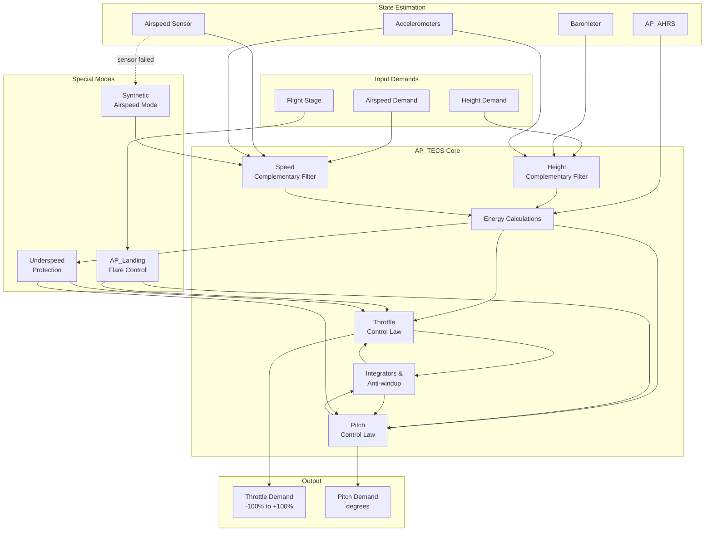
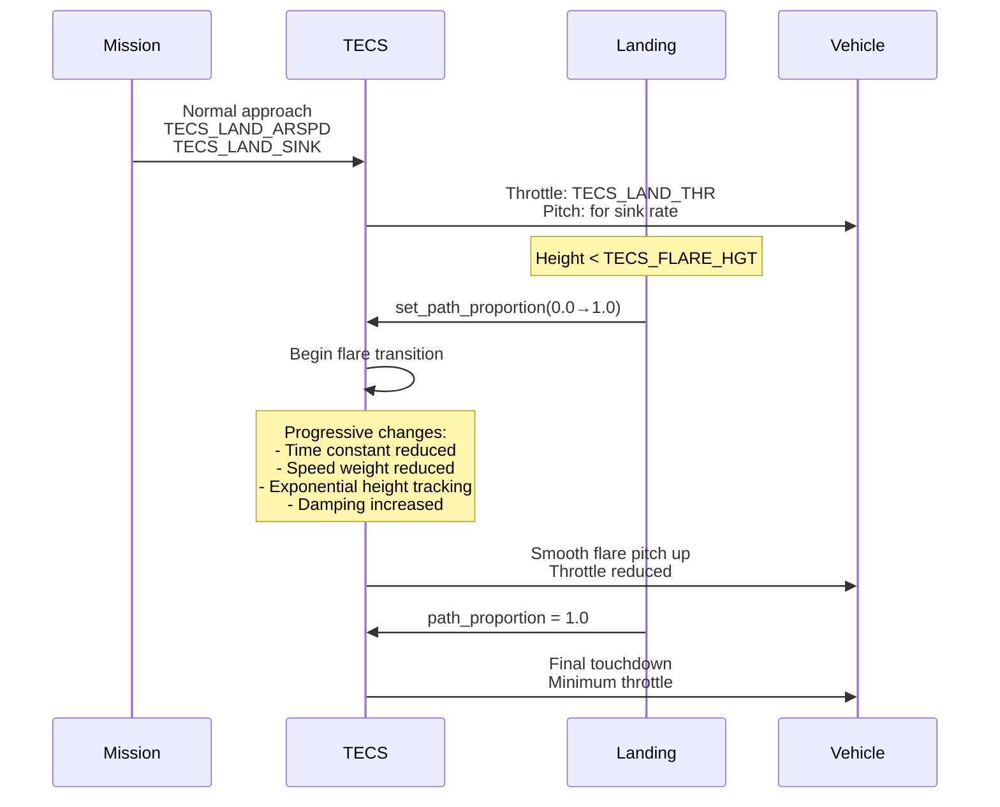
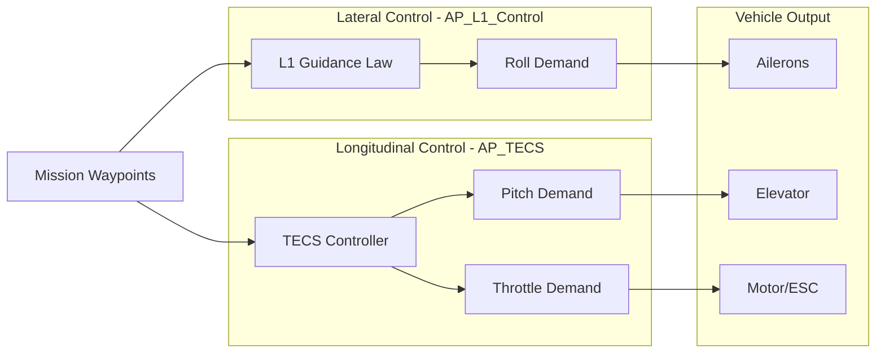

# AP_TECS - Total Energy Control System

## Overview

The AP_TECS (Total Energy Control System) library provides energy-based altitude and airspeed control for fixed-wing aircraft in ArduPilot. TECS implements a coordinated throttle and pitch control strategy based on the principle that an aircraft's total energy is the sum of its kinetic energy (speed) and potential energy (altitude). By controlling total energy rate with throttle and energy balance with pitch, TECS achieves smooth, efficient altitude and airspeed tracking while avoiding the oscillations and control conflicts that plague traditional separated altitude and speed controllers.

**Core Principle**: Total Energy (TE) = Potential Energy + Kinetic Energy = mgh + ½mv²

**Control Strategy**:
- **Throttle** controls the rate of change of total energy (d(TE)/dt)
- **Pitch** controls the distribution between potential and kinetic energy

This decoupled approach allows the aircraft to trade altitude for speed (or vice versa) naturally through pitch control while maintaining total energy through throttle, resulting in coordinated maneuvers that respect aircraft physics.

## Architecture



### Key Components

#### AP_TECS Class
- **Purpose**: Main TECS controller implementing energy-based altitude and airspeed control
- **Lifecycle**: Constructed with references to AHRS, vehicle parameters, and landing controller → update_50hz() called at ≥50Hz for state estimation → update_pitch_throttle() called at 10-500Hz for control law computation
- **Thread Safety**: Not thread-safe; must be called from main vehicle thread only
- **Hardware Dependencies**: Requires barometer, accelerometer; airspeed sensor highly recommended but can fallback to synthetic airspeed

#### Complementary Filters
- **Height Filter**: Fuses barometer altitude (low-frequency accuracy) with vertical accelerometer (high-frequency responsiveness)
  * Crossover frequency: TECS_HGT_OMEGA (default 3.0 rad/s)
  * Provides smoothed height estimate and height rate without lag
- **Speed Filter**: Fuses airspeed sensor (low-frequency) with longitudinal accelerometer (high-frequency)
  * Crossover frequency: TECS_SPD_OMEGA (default 2.0 rad/s)
  * Reduces airspeed noise while maintaining responsiveness

#### Energy Management
- **Total Energy Rate (STEdot)**: Rate of change of specific total energy = d(SPE + SKE)/dt
  * Controlled by throttle to climb, maintain altitude, or descend
- **Energy Balance Rate (SEBdot)**: Rate of energy exchange between potential and kinetic
  * Controlled by pitch to trade altitude for speed or speed for altitude
- **Speed Weight (TECS_SPDWEIGHT)**: Controls priority between height and speed control
  * 0.0 = height priority (pitch for height, throttle manages resulting speed)
  * 1.0 = balanced (normal operation)
  * 2.0 = speed priority (pitch for speed, throttle manages resulting height)

#### Control Laws
- **Throttle Control**: Proportional-Integral-Damping (PID) controller for total energy rate
  * Proportional term: error in total energy rate
  * Integral term: trims long-term energy errors
  * Damping term: reduces oscillations from throttle changes
- **Pitch Control**: PID controller for energy balance rate
  * Separate integrals for energy balance and kinetic energy errors
  * Landing-specific damping and time constants
  * Underspeed protection override

#### Special Operating Modes
- **Landing Flare**: Exponential altitude tracking during final approach
  * Flare initiation at TECS_FLARE_HGT height above field
  * Progressive speed weight reduction for altitude priority
  * Reduced time constant (TECS_LAND_TCONST) for precision
- **Underspeed Protection**: Automatic mode shift when airspeed drops to stall margin
  * Throttle forced to maximum
  * Speed weight forced to 2.0 (speed priority)
  * Altitude sacrificed to maintain safe airspeed
- **Synthetic Airspeed**: Fallback mode when airspeed sensor unavailable
  * Estimates airspeed from throttle, pitch, and height rate
  * Degraded performance but maintains basic control

## Energy Management

### Mathematical Foundation

TECS is built on fundamental aircraft energy relationships:

**Total Energy (TE)**:
```
TE = Potential Energy + Kinetic Energy
TE = mgh + ½mv²
```

**Specific Energy** (energy per unit mass):
```
SPE = gh (Specific Potential Energy, m²/s²)
SKE = ½v² (Specific Kinetic Energy, m²/s²)
STE = SPE + SKE (Specific Total Energy)
```

**Energy Rates**:
```
STEdot = d(STE)/dt = g·(dh/dt) + v·(dv/dt)
         = g·climb_rate + airspeed·acceleration

SEBdot = d(SEB)/dt where SEB = w₁·SPE - w₂·SKE
         (Energy Balance with weighting factors)
```

### Energy Control Strategy

TECS decouples energy control into two independent channels:

1. **Total Energy Rate Control (Throttle)**:
   - Throttle adjusts engine power to control total energy rate (STEdot)
   - Increasing throttle increases total energy → aircraft climbs or accelerates
   - Decreasing throttle decreases total energy → aircraft descends or decelerates
   - Control law: `throttle_demand = f(STEdot_error, integral, damping)`

2. **Energy Balance Control (Pitch)**:
   - Pitch adjusts lift vector to exchange potential and kinetic energy
   - Nose up: trades kinetic energy (speed) for potential energy (altitude)
   - Nose down: trades potential energy for kinetic energy
   - Control law: `pitch_demand = f(SEBdot_error, integral, damping, speed_weight)`

### Speed Weight Parameter

The speed weight (TECS_SPDWEIGHT) controls the balance between height and speed priority:

**SPDWEIGHT = 0.0** (Height Priority):
- Pitch primarily controls height error
- Throttle adjusts to maintain whatever speed results
- Use case: Landing approach, thermal soaring, maintaining specific altitude

**SPDWEIGHT = 1.0** (Balanced - Default):
- Pitch and throttle share responsibility for height and speed errors
- Energy balance equation weighted equally
- Use case: Normal cruise flight, waypoint navigation

**SPDWEIGHT = 2.0** (Speed Priority):
- Pitch primarily controls speed error
- Throttle adjusts to maintain whatever height results
- Use case: Underspeed protection, high-speed dash, racing

The speed weight affects the energy balance calculation:
```
SEB = w₁·SPE - w₂·SKE
where w₂/w₁ ratio is determined by SPDWEIGHT
```

Source: libraries/AP_TECS/AP_TECS.cpp:681-700 (energy calculations)

## Altitude and Airspeed Control

### Height Estimation and Control

**Complementary Filter Architecture**:
```
height_estimate = ∫(baro_rate·(1-k) + accel_vertical·k) dt
where k = TECS_HGT_OMEGA / (s + TECS_HGT_OMEGA)
```

The height filter combines:
- **Barometer**: Accurate long-term altitude reference, but slow response and lag
- **Vertical Accelerometer**: Fast response to altitude changes, but drifts over time
- **Result**: Smooth height estimate with minimal lag and good transient response

**Height Demand Tracking**:
- Height demand processed through time-constant filter: `τ = TECS_TIME_CONST`
- Rate limiters prevent excessive climb/sink rate commands
- Slew limiters smooth rapid demand changes
- Vertical acceleration limit (TECS_VERT_ACC) constrains aggressive maneuvers

### Airspeed Estimation and Control

**Speed Complementary Filter**:
```
airspeed_estimate = ∫(pitot_rate·(1-k) + accel_longitudinal·k) dt
where k = TECS_SPD_OMEGA / (s + TECS_SPD_OMEGA)
```

The speed filter fuses:
- **Airspeed Sensor (Pitot)**: Direct airspeed measurement, accurate but noisy
- **Longitudinal Accelerometer**: High-frequency acceleration data, captures rapid changes
- **Result**: Low-noise airspeed estimate with good dynamic response

**Airspeed Demand Tracking**:
- Airspeed demand filtered through time constant
- Automatic conversion between Equivalent Airspeed (EAS) and True Airspeed (TAS)
- Density altitude compensation for high-altitude flight

### Underspeed Protection

TECS includes automatic underspeed protection to prevent stall:

**Trigger Conditions** (internal computation):
- Airspeed drops below minimum safe speed plus margin
- Takes into account aircraft configuration and load factor
- More aggressive triggering during turns (higher stall speed)

**Protection Actions**:
1. Throttle forced to maximum (100%)
2. Speed weight forced to 2.0 (speed priority mode)
3. Pitch lowered to accelerate
4. Altitude may be sacrificed to regain safe airspeed

**Recovery**:
- Protection automatically releases when airspeed returns to safe margin
- Smooth transition back to normal control mode

⚠️ **Safety Note**: Underspeed protection is a last-line defense. Proper tuning (TECS_CLMB_MAX, AIRSPEED_MIN) should prevent activation during normal flight.

Source: libraries/AP_TECS/AP_TECS.cpp:650-680 (underspeed detection)

### Synthetic Airspeed Mode

When airspeed sensor fails or is unavailable:

**Synthetic Airspeed Estimation**:
- Estimates airspeed from throttle setting, pitch angle, and height rate
- Uses aircraft performance model and wind estimation
- Significantly less accurate than real airspeed sensor

**Control Mode Changes**:
- Throttle control based on height rate demand instead of energy rate
- Pitch control priority shifted toward height
- Reduced performance but maintains basic control

**Limitations**:
- Cannot accurately maintain specific airspeeds
- Vulnerable to wind gusts and changing conditions
- Reduced efficiency and increased altitude/speed deviations

## Throttle and Pitch Control Allocation

### Throttle Control Law

The throttle control law regulates total energy rate (STEdot):

**Control Equation**:
```
throttle_demand = throttle_setpoint 
                  + K_p · STEdot_error
                  + K_i · ∫(STEdot_error) dt
                  + K_d · d(STEdot_error)/dt
                  + bank_angle_compensation
```

**Components**:

1. **Proportional Term**: Direct response to total energy rate error
   - `STEdot_error = STEdot_demand - STEdot_actual`
   - Scaled by time constant (TECS_TIME_CONST)

2. **Integral Term** (`_integTHR_state`): Trims long-term energy errors
   - Gain: TECS_INTEG_GAIN (default 0.3)
   - Anti-windup: Clipped when throttle saturates
   - Separate gain during takeoff (TECS_INTEG_GAIN_TKOFF)

3. **Damping Term**: Reduces oscillations from throttle changes
   - Gain: TECS_THR_DAMP (default 0.5)
   - Adds damping proportional to rate of change of speed error
   - Critical for preventing phugoid oscillations

4. **Bank Angle Compensation** (TECS_RLL2THR):
   - Adds throttle in turns to compensate for increased drag
   - `throttle_compensation = TECS_RLL2THR · (1/cos(roll) - 1)`
   - Typical value: ~10× sink rate in 45° turn

**Output Limiting**:
- Throttle clipped to [TECS_THR_MIN, TECS_THR_MAX] or override limits
- Slew rate limiting for smooth throttle changes
- Landing-specific throttle (TECS_LAND_THR) during final approach

Source: libraries/AP_TECS/AP_TECS.cpp:722-884 (throttle control law)

### Pitch Control Law

The pitch control law regulates energy balance rate (SEBdot):

**Control Equation**:
```
pitch_demand = pitch_trim
               + K_p · SEBdot_error
               + K_i_seb · ∫(SEBdot_error) dt
               + K_i_ke · ∫(SKE_error) dt
               + K_d · d(height_error)/dt
               + feedforward_term
```

**Components**:

1. **Proportional Term**: Response to energy balance rate error
   - `SEBdot_error = SEBdot_demand - SEBdot_actual`
   - Speed weight affects balance between height and speed errors

2. **Energy Balance Integral** (`_integSEBdot`): Long-term balance trim
   - Gain: TECS_INTEG_GAIN
   - Anti-windup when pitch saturates
   - Landing-specific gain (TECS_INTEG_GAIN_LAND)

3. **Kinetic Energy Integral** (`_integKE`): Speed error trim
   - Separate integral for speed errors
   - Speed weight affects contribution

4. **Damping Term**: Stabilizes height oscillations
   - Gain: TECS_PTCH_DAMP (default 0.3)
   - Landing-specific damping (TECS_LAND_DAMP)
   - Proportional to height rate error

5. **Pitch Feedforward**: Compensates for airspeed changes
   - `ff_pitch = TECS_PITCH_FF_V0 + TECS_PITCH_FF_K · airspeed`
   - Improves pitch response during speed changes

**Output Limiting**:
- Pitch clipped to [TECS_PITCH_MIN, TECS_PITCH_MAX] or override limits
- Landing-specific limits (TECS_LAND_PMAX) during final approach
- Reduced limits during takeoff for safe climbout

Source: libraries/AP_TECS/AP_TECS.cpp:989-1163 (pitch control law)

### Time Constant and Tracking

The time constant (TECS_TIME_CONST) is the primary tuning parameter:

**Physical Meaning**:
- Approximate time for aircraft to correct 63% of altitude error
- Larger values → slower, smoother corrections
- Smaller values → faster, more aggressive corrections

**Effect on Control Laws**:
```
Proportional gains ∝ 1/TECS_TIME_CONST
Response speed ∝ 1/TECS_TIME_CONST
```

**Typical Values**:
- Conservative (large aircraft, smooth flight): 7-10 seconds
- Standard (most aircraft): 5-7 seconds
- Aggressive (small, responsive aircraft): 3-5 seconds
- **Warning**: Values < 3 seconds risk instability and overshoot

## Climb/Descent Optimization

### Maximum Climb Rate

**TECS_CLMB_MAX** defines the maximum sustained climb rate:

**Setting Guidelines**:
1. Fly aircraft at AIRSPEED_CRUISE and THR_MAX
2. Measure sustained climb rate (not initial zoom climb)
3. Set TECS_CLMB_MAX to measured value
4. Account for battery voltage sag under load

⚠️ **Critical Safety**: Setting TECS_CLMB_MAX too high causes:
- Speed bleed during climb attempts
- Repeated climb attempts that fail
- Risk of stall in sustained climbs

**Energy Rate Limit**:
```
STEdot_max = g · TECS_CLMB_MAX + margin
```

### Sink Rate Limits

**TECS_SINK_MIN**: Minimum sink rate at THR_MIN and cruise speed
- Typical value: 2.0 m/s
- Should match aircraft drag at minimum throttle
- Used to compute throttle-to-energy-rate mapping

**TECS_SINK_MAX**: Maximum allowed descent rate
- Typical value: 5.0 m/s
- Prevents excessive dive angles
- Ensures descent rate doesn't exceed safe speed (VNE)
- Limits energy extraction rate

**TECS_SINK_MAX_APPR**: Maximum sink rate during approach
- Typically lower than TECS_SINK_MAX
- Ensures safe, controlled descent to landing

### Vertical Acceleration Limit

**TECS_VERT_ACC** (default 7.0 m/s²):
- Constrains rate of change of climb/sink rate
- Prevents aggressive pitch changes and passenger discomfort
- Limits energy rate commands

**Effect**:
```
if |d(climb_rate)/dt| > TECS_VERT_ACC:
    limit energy rate command
```

### Bank Angle Compensation

**TECS_RLL2THR** compensates for energy loss in turns:

**Physical Basis**:
- Turns at constant altitude require increased lift: L = mg/cos(bank)
- Increased lift → increased drag → energy loss
- Need additional throttle to maintain energy in turns

**Tuning**:
1. Set to approximately 10× sink rate in 45° turn
2. Fly auto mission with >90° turns
3. Monitor airspeed and altitude in turns
4. Increase if speed bleeds in turns
5. Decrease if aircraft climbs in turns

**Calculation**:
```
throttle_addition = TECS_RLL2THR · (1/cos(roll_angle) - 1)
```

Example: 45° bank, TECS_RLL2THR=10:
```
throttle_addition = 10 · (1/cos(45°) - 1) = 10 · (1.414 - 1) = 4.14%
```

## Landing Flare Control

### Landing Sequence Overview



### Flare Initiation

**Trigger**: Height above field elevation drops below **TECS_FLARE_HGT**

**Path Proportion**:
- Landing controller provides `path_proportion` [0.0, 1.0]
- 0.0 = flare just initiated
- 1.0 = touchdown imminent
- Smooth exponential progression through flare

### Flare Control Transitions

As `path_proportion` increases from 0.0 to 1.0:

1. **Time Constant Reduction**:
   ```
   effective_time_const = TECS_TIME_CONST · (1 - path_proportion)
                          + TECS_LAND_TCONST · path_proportion
   ```
   - Transitions from cruise time constant to landing time constant
   - TECS_LAND_TCONST typically shorter for precise tracking

2. **Speed Weight Reduction**:
   ```
   effective_speed_weight = TECS_SPDWEIGHT · (1 - path_proportion)
                            + 0.0 · path_proportion
   ```
   - Gradually shifts to height priority
   - Final approach focuses on altitude, allows speed to vary

3. **Exponential Height Tracking**:
   - Height demand follows exponential decay toward ground
   - Provides smooth, continuous descent profile
   - Prevents abrupt pitch changes or ballooning

4. **Damping Increases**:
   - Pitch damping: TECS_PTCH_DAMP → TECS_LAND_DAMP
   - Throttle damping: TECS_THR_DAMP → TECS_LAND_TDAMP
   - Increased damping prevents oscillations during touchdown

5. **Pitch Limits**:
   - Maximum pitch limited to TECS_LAND_PMAX (typically 10-15°)
   - Prevents excessive nose-up attitude during flare

Source: libraries/AP_TECS/AP_TECS.cpp:536-649 (landing flare logic)

### Landing-Specific Parameters

**TECS_LAND_ARSPD**: Target landing approach airspeed
- If negative: uses (AIRSPEED_MIN + AIRSPEED_CRUISE) / 2
- Must be above stall speed with safety margin
- Account for wind gusts and turbulence

**TECS_LAND_THR**: Throttle percentage during landing
- If negative: TECS_LAND_ARSPD used instead
- Useful for aircraft without airspeed sensor
- Typical range: 0-30% for powered approach

**TECS_LAND_SINK**: Target sink rate during approach
- Typical range: 0.5-1.5 m/s
- Must be achievable without excessive nose-down pitch
- Smoother landings with lower sink rates

**TECS_LAND_TCONST**: Time constant during landing
- Typically 2-4 seconds (shorter than cruise)
- Shorter values for precise height tracking
- Too short → oscillations and porpoising

**TECS_LAND_DAMP**: Pitch damping during landing
- Higher than cruise damping for stability
- Prevents pitch oscillations during flare

**TECS_LAND_PMAX**: Maximum pitch during final approach
- Typical range: 10-15 degrees
- Limits flare to prevent ballooning
- Too high → balloon and float
- Too low → hard landing

**TECS_FLARE_HGT**: Flare initiation height above field
- Account for radar altimeter lag
- Account for landing gear height
- Typical range: 2-8 meters depending on aircraft size
- Too low → hard landing
- Too high → excessive float and long landing

⚠️ **Safety Warning**: Test all landing parameters extensively in SITL before real-world landing attempts. Improper tuning can result in hard landings, ballooning, or runway overrun.

## TECS Tuning Parameters

### Primary Tuning Parameters

#### TECS_TIME_CONST
- **Description**: Controller time constant - THE primary tuning parameter
- **Default**: 5.0 seconds
- **Range**: 3.0 - 10.0 seconds
- **Physical Meaning**: Approximate time to correct 63% of altitude error
- **Effect**:
  * **Smaller values (3-4s)**: Faster altitude corrections, more aggressive, risk of overshoot
  * **Larger values (7-10s)**: Smoother flight, slower corrections, more conservative
- **Tuning**: Start with 5.0, decrease for faster response if needed, increase if oscillations occur

#### TECS_CLMB_MAX
- **Description**: Maximum sustained climb rate
- **Default**: 5.0 m/s
- **Range**: 0.1 - 20.0 m/s
- **Critical Setting**: Must match aircraft performance at AIRSPEED_CRUISE and THR_MAX
- **Measurement**: Fly at cruise speed and full throttle, measure sustained climb rate
- **Safety**: Setting too high causes speed bleed and potential stall during climbs
- **Effect**: Limits how aggressively TECS will command climbs

#### TECS_SINK_MIN
- **Description**: Minimum sink rate at THR_MIN and cruise speed
- **Default**: 2.0 m/s
- **Range**: 0.1 - 10.0 m/s
- **Measurement**: Fly at cruise speed and minimum throttle, measure sink rate
- **Effect**: Defines throttle-to-energy-rate relationship at low end

#### TECS_SINK_MAX
- **Description**: Maximum allowed descent rate
- **Default**: 5.0 m/s
- **Range**: 0.0 - 20.0 m/s
- **Safety**: Must not exceed safe dive speed (VNE consideration)
- **Effect**: Limits how aggressive descents can be

#### TECS_THR_DAMP
- **Description**: Throttle damping gain
- **Default**: 0.5
- **Range**: 0.1 - 1.0
- **Effect**:
  * Adds damping to reduce speed oscillations
  * Higher values → more stable but slower throttle response
  * Lower values → faster throttle response but risk of phugoid oscillations
- **Symptoms**: If experiencing slow speed oscillations → increase this parameter

#### TECS_PTCH_DAMP
- **Description**: Pitch damping gain
- **Default**: 0.3 (varies by aircraft)
- **Range**: 0.0 - 1.0
- **Effect**:
  * Adds damping to height oscillations
  * Higher values → more damping, smoother but slower
  * Lower values → faster response but risk of oscillations
- **Tuning**: Increase if altitude oscillations observed, decrease if response too slow

#### TECS_INTEG_GAIN
- **Description**: Integrator gain for trimming long-term errors
- **Default**: 0.3
- **Range**: 0.0 - 0.5
- **Effect**:
  * Eliminates steady-state speed and height errors
  * Higher values → faster trim but risk of integral windup
  * Lower values → slower trim but more stable
- **Symptoms**: Persistent speed or altitude offset → increase slightly

#### TECS_VERT_ACC
- **Description**: Vertical acceleration limit
- **Default**: 7.0 m/s²
- **Range**: 1.0 - 10.0 m/s²
- **Effect**:
  * Constrains aggressive altitude changes
  * Lower values → smoother, more passenger-friendly
  * Higher values → faster corrections, more aggressive

#### TECS_RLL2THR
- **Description**: Bank angle compensation gain
- **Default**: 10.0
- **Range**: 5.0 - 30.0
- **Tuning Guide**:
  1. Set to approximately 10× sink rate in 45° turn
  2. Fly auto mission with waypoints and >90° turns
  3. Monitor airspeed in turns
  4. Increase if speed bleeds in turns
  5. Decrease if aircraft climbs in turns
- **Effect**: Adds throttle in turns to maintain energy

#### TECS_SPDWEIGHT
- **Description**: Speed vs height control priority
- **Default**: 1.0
- **Range**: 0.0 - 2.0
- **Values**:
  * **0.0**: Height priority (pitch for height, throttle manages speed)
  * **1.0**: Balanced (normal cruise flight)
  * **2.0**: Speed priority (pitch for speed, throttle manages height)
- **Use Cases**:
  * Glider thermal soaring: 0.0-0.5
  * Normal flight: 1.0
  * Underspeed protection: 2.0 (automatic)

### Complementary Filter Parameters

#### TECS_HGT_OMEGA
- **Description**: Height complementary filter crossover frequency
- **Default**: 3.0 rad/s
- **Range**: 1.0 - 5.0 rad/s
- **Effect**: Higher values → faster response to height changes, more accelerometer influence
- **Typical**: Leave at default unless specific tuning need

#### TECS_SPD_OMEGA
- **Description**: Speed complementary filter crossover frequency
- **Default**: 2.0 rad/s
- **Range**: 0.5 - 2.0 rad/s
- **Effect**: Higher values → faster response to speed changes, noisier
- **Typical**: Leave at default unless specific tuning need

### Landing-Specific Parameters

#### TECS_LAND_ARSPD
- **Description**: Target airspeed during landing approach
- **Default**: -1 (auto: midpoint between AIRSPEED_MIN and AIRSPEED_CRUISE)
- **Range**: -1 to 127 m/s
- **Safety**: Must be above stall speed with margin for gusts
- **Effect**: Controls approach speed; faster = longer landing, slower = risk of stall

#### TECS_LAND_THR
- **Description**: Throttle percentage during landing approach
- **Default**: -1 (disabled, use TECS_LAND_ARSPD instead)
- **Range**: -1 to 100%
- **Use Case**: Aircraft without airspeed sensor
- **Typical**: 10-30% for powered approach

#### TECS_LAND_SINK
- **Description**: Target sink rate during approach
- **Default**: 0.5 m/s
- **Range**: 0.25 - 2.0 m/s
- **Effect**: Lower = gentler approach, higher = steeper approach
- **Safety**: Must be achievable without excessive nose-down pitch

#### TECS_LAND_TCONST
- **Description**: Time constant during landing
- **Default**: 2.0 seconds
- **Range**: 2.0 - 5.0 seconds
- **Effect**: Shorter than cruise for precise height tracking during flare
- **Tuning**: Too short → pitch oscillations, too long → imprecise flare

#### TECS_LAND_DAMP
- **Description**: Pitch damping during landing
- **Default**: 0.5
- **Range**: 0.1 - 1.0
- **Effect**: Higher than cruise damping for stable flare
- **Symptoms**: Pitch oscillations during flare → increase this parameter

#### TECS_LAND_PMAX
- **Description**: Maximum pitch angle during final approach
- **Default**: 10 degrees
- **Range**: 0 - 45 degrees
- **Effect**:
  * Too high → ballooning and floating
  * Too low → hard landing
- **Typical**: 10-15 degrees for most aircraft

#### TECS_LAND_SPDWGT
- **Description**: Speed weight during landing
- **Default**: -1.0 (auto-scaling from TECS_SPDWEIGHT to 0.0)
- **Range**: -1.0 to 2.0
- **Values**:
  * **-1.0**: Auto-scale (starts at TECS_SPDWEIGHT, ends at 0.0 by touchdown)
  * **0.0**: Height priority (recommended for final approach)
  * **>1.0**: Speed priority (not recommended for landing)

#### TECS_FLARE_HGT
- **Description**: Height above field to initiate flare
- **Default**: 2.0 meters
- **Range**: 0.0 - 10.0 meters
- **Critical**: Must account for radar altimeter lag and landing gear height
- **Tuning**:
  * Too low → hard landing
  * Too high → ballooning, floating, long landing
- **Typical**: 2-4m for small aircraft, 4-8m for large aircraft

### Advanced Parameters

#### TECS_PITCH_MAX
- **Description**: Maximum pitch in auto flight
- **Default**: 15 degrees
- **Range**: 0 - 45 degrees
- **Effect**: Overrides PTCH_LIM_MAX_DEG in auto modes
- **Tuning**: Set to angle aircraft can climb at AIRSPEED_CRUISE and THR_MAX

#### TECS_PITCH_MIN
- **Description**: Minimum pitch in auto flight
- **Default**: 0 degrees (uses PTCH_LIM_MIN_DEG)
- **Range**: -45 to 0 degrees
- **Effect**: Limits nose-down pitch in auto modes

#### TECS_PITCH_FF_V0
- **Description**: Pitch feedforward at zero airspeed
- **Default**: 0.0
- **Range**: -1.0 to 1.0 radians
- **Advanced**: Improves pitch response during speed changes

#### TECS_PITCH_FF_K
- **Description**: Pitch feedforward gain vs airspeed
- **Default**: 0.0
- **Range**: 0.0 to 0.1
- **Advanced**: Adds airspeed-dependent pitch feedforward

#### TECS_INTEG_GAIN_TKOFF
- **Description**: Integrator gain during takeoff
- **Default**: Same as TECS_INTEG_GAIN
- **Effect**: Can be set lower during takeoff for stability

#### TECS_INTEG_GAIN_LAND
- **Description**: Integrator gain during landing
- **Default**: Same as TECS_INTEG_GAIN
- **Effect**: Can be set lower during landing for smoother approach

## Integration with AP_L1_Control

TECS and AP_L1_Control work together to provide complete 3D navigation for fixed-wing aircraft:

### Division of Responsibilities



### AP_L1_Control Overview

**AP_L1_Control** provides lateral navigation guidance:
- **L1 Algorithm**: Geometric path-following law for waypoint tracking
- **Roll Control**: Commands bank angle to follow desired ground track
- **Loiter**: Coordinates circular loitering at specified radius
- **Turn Anticipation**: Predicts turn points for smooth waypoint transitions

### Integration Points

#### 1. Coordinated Airspeed

L1 uses TECS target airspeed for navigation calculations:

```cpp
float target_airspeed = tecs.get_target_airspeed();
l1_controller.update_loiter(center_WP, radius, target_airspeed);
```

- L1 loiter radius scaled by airspeed
- Turn distance calculations use TECS airspeed
- Ensures coordinated speed and path tracking

#### 2. Mission Sequencer Coordination

The mission sequencer coordinates altitude and position changes:

```cpp
// Update both controllers with mission demands
l1_controller.update_waypoint(prev_WP, next_WP);
tecs.update_pitch_throttle(
    target_altitude_cm,
    target_airspeed_cm,
    flight_stage,
    ...
);
```

- L1 handles horizontal waypoint navigation
- TECS handles altitude transitions between waypoints
- Both reference same AHRS state estimate

#### 3. Shared AHRS Reference

Both controllers use AP_AHRS for state estimation:
- Current position, velocity, attitude
- Wind estimation
- GPS data
- Inertial measurements

Consistent state reference ensures:
- Coordinated lateral and longitudinal control
- No conflicting control commands
- Smooth 3D trajectory tracking

#### 4. Turn Coordination

During waypoint turns:
- **L1**: Commands bank angle for ground track following
- **TECS**: Adds throttle compensation via TECS_RLL2THR
- **Result**: Maintains airspeed and altitude through turns

Example: 45° bank turn
```
L1: roll_demand = 45°
TECS: throttle_addition = TECS_RLL2THR · (1/cos(45°) - 1)
      pitch_adjustment for load factor
```

### Complete 3D Navigation Example

**Scenario**: Auto mission with altitude change and turn

```cpp
// Mission segment: Waypoint with altitude gain and 90° turn

// L1 handles lateral navigation
l1_controller.update_waypoint(prev_WP, next_WP);
float roll_demand = l1_controller.nav_roll_cd();

// TECS handles longitudinal navigation  
tecs.update_pitch_throttle(
    next_WP.alt * 100,              // altitude demand
    target_airspeed * 100,          // airspeed demand
    AP_FixedWing::FLIGHT_NORMAL,    // flight stage
    distance_beyond_land_wp,
    ptchMinCO_cd,
    throttle_nudge,
    height_above_field,
    ahrs.get_aerodynamic_load_factor(),
    pitch_trim_deg
);

float pitch_demand = tecs.get_pitch_demand();
float throttle_demand = tecs.get_throttle_demand();

// Output to control surfaces
SRV_Channels::set_output_scaled(SRV_Channel::k_aileron, roll_demand);
SRV_Channels::set_output_scaled(SRV_Channel::k_elevator, pitch_demand);
SRV_Channels::set_output_scaled(SRV_Channel::k_throttle, throttle_demand);
```

**Result**:
- Aircraft follows ground track from prev_WP to next_WP (L1)
- Aircraft climbs to next_WP altitude smoothly (TECS)
- Aircraft maintains target airspeed through climb and turn (TECS)
- Additional throttle applied in turn to maintain energy (TECS)
- Coordinated, smooth 3D trajectory

### Related Modules

- **AP_L1_Control**: Lateral navigation and guidance (`libraries/AP_L1_Control/`)
- **AP_AHRS**: Attitude and heading reference system (`libraries/AP_AHRS/`)
- **AP_Landing**: Landing sequencer and flare control (`libraries/AP_Landing/`)
- **APM_Control**: Roll/pitch/yaw rate controllers (`libraries/APM_Control/`)
- **ArduPlane**: Main vehicle code using TECS (`ArduPlane/`)

## Testing with Plane SITL

Software-In-The-Loop (SITL) simulation allows safe testing and tuning of TECS parameters before real flights.

### Setup SITL Environment

```bash
# Navigate to ArduPilot directory
cd ~/ardupilot

# Start Plane SITL with console and map display
sim_vehicle.py -v ArduPlane --console --map

# Alternative: Specify aircraft model
sim_vehicle.py -v ArduPlane --console --map --aircraft Rascal

# Wait for initialization
# Console and map windows will appear
```

**Load Test Mission**:
```bash
# In MAVProxy console, load a mission with altitude and speed variations
wp load Tools/autotest/ArduPlane-Missions/CMAC-toff-loop.txt

# Alternatively, create custom mission with varied altitudes
wp editor
```

### Test Scenario 1: Climb Performance

**Objective**: Verify TECS_CLMB_MAX is correctly set and aircraft maintains airspeed during climbs

```bash
# Arm and switch to AUTO mode
mode AUTO
arm throttle

# Monitor during takeoff and initial climb
# Watch for:
# - Throttle goes to maximum during climb
# - Airspeed maintained (no excessive bleed)
# - Smooth altitude gain without oscillations
# - Transition to cruise when target altitude reached
```

**Telemetry to Monitor**:
```
graph VFR_HUD.airspeed
graph VFR_HUD.alt
graph VFR_HUD.climb
graph VFR_HUD.throttle
```

**Success Criteria**:
- Airspeed remains within ±2 m/s of target during sustained climb
- No stall warnings or underspeed protection triggers
- Smooth transition from climb to cruise
- Throttle at or near 100% during sustained climb

**Failure Symptoms**:
- Airspeed bleeds progressively during climb → TECS_CLMB_MAX too high
- Aircraft climbs faster than TECS_CLMB_MAX → increase parameter
- Oscillations in climb rate → reduce TECS_TIME_CONST or increase TECS_PTCH_DAMP

### Test Scenario 2: Cruise Altitude Tracking

**Objective**: Evaluate altitude hold performance and time constant tuning

```bash
# During cruise leg of mission
# Command altitude changes via parameters or mission
param set ALT_HOLD_RTL 150  # Change RTL altitude

# Observe altitude tracking
```

**What to Monitor**:
- Time to reach new altitude
- Overshoot (should be minimal)
- Oscillations after reaching target
- Airspeed variations during altitude change

**Telemetry**:
```
graph GLOBAL_POSITION_INT.relative_alt
graph VFR_HUD.airspeed
graph ATTITUDE.pitch
graph VFR_HUD.throttle
```

**Tuning**:
- **Too slow response** → Decrease TECS_TIME_CONST (carefully, small steps)
- **Overshoot/oscillations** → Increase TECS_TIME_CONST or TECS_PTCH_DAMP
- **Altitude oscillations** → Increase TECS_PTCH_DAMP
- **Speed variations** → Adjust TECS_SPDWEIGHT toward 1.0

### Test Scenario 3: Descent Performance

**Objective**: Verify sink rate limits and throttle behavior during descents

```bash
# Command descent to lower altitude
# In mission, include waypoint with significant altitude decrease

# Observe:
# - Throttle reduction (should go toward minimum)
# - Sink rate stays within TECS_SINK_MAX
# - No excessive speed gain
# - Smooth level-off at target altitude
```

**Telemetry**:
```
graph VFR_HUD.climb  # Should be negative, limited by TECS_SINK_MAX
graph VFR_HUD.airspeed  # Should remain controlled
graph VFR_HUD.throttle  # Should reduce
```

**Success Criteria**:
- Sink rate ≤ TECS_SINK_MAX
- Airspeed controlled (no excessive dive speed)
- Smooth recovery to level flight
- No phugoid oscillations (long-period speed/altitude coupling)

**Failure Symptoms**:
- Phugoid oscillations (speed and altitude see-sawing) → Increase TECS_THR_DAMP
- Excessive descent rate → Check TECS_SINK_MAX setting
- Speed gain in descent → Increase TECS_THR_DAMP or adjust TECS_SPDWEIGHT

### Test Scenario 4: Airspeed Changes

**Objective**: Test TECS response to airspeed demand changes

```bash
# Change cruise airspeed parameter
param set AIRSPEED_CRUISE 18  # Set new cruise speed (m/s)

# Observe pitch and throttle response
# Pitch should adjust to trade energy
# Throttle should adjust to maintain total energy
```

**Expected Behavior**:

**Speed Increase Command**:
1. Pitch initially lowers (trades altitude for speed)
2. Throttle increases (adds total energy)
3. Aircraft accelerates while maintaining approximate altitude
4. Settles at new speed with altitude recovered

**Speed Decrease Command**:
1. Pitch initially raises (trades speed for altitude)
2. Throttle decreases (removes total energy)
3. Aircraft decelerates while maintaining approximate altitude
4. Settles at new speed

**Telemetry**:
```
graph VFR_HUD.airspeed
graph ATTITUDE.pitch
graph VFR_HUD.throttle
graph VFR_HUD.alt
```

**Tuning**:
- **Large altitude excursions** → Adjust TECS_SPDWEIGHT closer to 1.0
- **Slow speed response** → Decrease TECS_TIME_CONST
- **Oscillations** → Increase damping parameters

### Test Scenario 5: Landing Approach and Flare

**Objective**: Validate landing parameters and flare behavior

```bash
# Execute AUTO landing mission
# Ensure mission includes land waypoint (MAV_CMD_NAV_LAND)

# Monitor approach phase:
# - Descent at TECS_LAND_SINK rate
# - Airspeed at TECS_LAND_ARSPD
# - Throttle at TECS_LAND_THR

# Monitor flare (when height < TECS_FLARE_HGT):
# - Pitch increases smoothly
# - Throttle reduces
# - Exponential altitude decay
# - Smooth touchdown without bounce
```

**Critical Heights to Watch**:
- **Approach Phase**: Height > TECS_FLARE_HGT
  * Constant sink rate descent
  * Stable airspeed
  * Constant throttle
  
- **Flare Initiation**: Height = TECS_FLARE_HGT
  * Beginning of pitch increase
  * Start of throttle reduction
  
- **Final Flare**: Height < TECS_FLARE_HGT/2
  * Progressive pitch increase
  * Throttle near idle
  * Speed bleeding controlled
  
- **Touchdown**: Height → 0
  * Pitch near TECS_LAND_PMAX
  * Throttle at minimum
  * Smooth contact

**Telemetry**:
```
graph VFR_HUD.alt  # Should show smooth exponential decay
graph ATTITUDE.pitch  # Should show progressive increase
graph VFR_HUD.airspeed  # Monitor for stall
graph VFR_HUD.throttle  # Should reduce to TECS_LAND_THR
```

**Success Criteria**:
- Smooth, controlled descent through flare
- No ballooning (climbing back up after flare)
- No porpoising (pitch oscillations)
- Touchdown within 50m of land point
- No stall warnings

**Failure Symptoms and Fixes**:

| Symptom | Likely Cause | Fix |
|---------|-------------|-----|
| Ballooning during flare | TECS_FLARE_HGT too high | Decrease TECS_FLARE_HGT |
| | TECS_LAND_PMAX too high | Decrease TECS_LAND_PMAX |
| Hard landing | TECS_FLARE_HGT too low | Increase TECS_FLARE_HGT |
| | TECS_LAND_SINK too high | Decrease TECS_LAND_SINK |
| Porpoising | TECS_LAND_DAMP too low | Increase TECS_LAND_DAMP |
| | TECS_LAND_TCONST too short | Increase TECS_LAND_TCONST |
| Floating/long landing | TECS_LAND_SINK too low | Increase slightly |
| | TECS_FLARE_HGT too high | Decrease TECS_FLARE_HGT |
| Stall during approach | TECS_LAND_ARSPD too low | Increase TECS_LAND_ARSPD |

### Test Scenario 6: Underspeed Protection

**Objective**: Verify underspeed protection activates safely

⚠️ **Warning**: This test intentionally approaches stall conditions. Only test in SITL.

```bash
# Command very low airspeed (near stall)
param set AIRSPEED_CRUISE 10  # Set unrealistically low speed

# Or command high climb rate that bleeds speed
param set TECS_CLMB_MAX 15  # Excessive for most aircraft

mode AUTO
# Observe underspeed protection activation
```

**Expected Behavior**:
1. Airspeed drops below safe margin
2. Underspeed protection activates:
   - Throttle forced to 100%
   - Speed weight forced to 2.0 (speed priority)
   - Pitch lowers to accelerate
3. Altitude may be lost
4. Once safe speed regained, normal control resumes

**Telemetry**:
```
graph VFR_HUD.airspeed  # Should recover to safe speed
graph VFR_HUD.throttle  # Should go to 100%
graph ATTITUDE.pitch  # Should lower
graph VFR_HUD.alt  # May decrease during recovery
```

**TECS Log Messages** (check dataflash):
```
# TECS.flg bit 0 indicates underspeed protection active
```

**Success**: System automatically recovers safe airspeed, prevents stall

### SITL Telemetry Analysis

After flights, analyze detailed TECS telemetry:

**Key Log Messages**:
- **TECS**: Main TECS state
  * `h`: Height estimate (m)
  * `dh`: Height demand (m)
  * `h_dem`: Height error (m)
  * `sp`: Speed estimate (m/s)
  * `dsp`: Speed demand (m/s)
  * `sp_dem`: Speed error (m/s)
  * `pit`: Pitch demand (radians)
  * `thr`: Throttle demand (0-1)
  * `flg`: Flags (bit 0 = underspeed)

**Graphing Commands**:
```bash
# After flight, analyze logs
mavlogdump.py --type TECS mav.log > tecs.txt

# Or use MAVExplorer
MAVExplorer.py mav.log
```

**Key Graphs**:
```
graph TECS.h TECS.dh  # Height tracking
graph TECS.sp TECS.dsp  # Speed tracking
graph TECS.pit ATTITUDE.pitch  # Pitch command vs actual
graph TECS.thr VFR_HUD.throttle  # Throttle command vs actual
```

**Analysis Checklist**:
- [ ] Height tracking: demand and actual converge smoothly
- [ ] Speed tracking: minimal oscillations
- [ ] Pitch reasonable: within ±20° for normal flight
- [ ] Throttle reasonable: 0-100% range, smooth changes
- [ ] No underspeed flag activations (except deliberate test)
- [ ] Energy management: appropriate throttle for climbs/descents

### Common Tuning Issues Identified in SITL

| Symptom in SITL | Root Cause | Solution |
|-----------------|------------|----------|
| Altitude oscillations | TECS_TIME_CONST too small | Increase to 6-8s |
| | TECS_PTCH_DAMP too low | Increase to 0.5-0.7 |
| Airspeed oscillations | TECS_THR_DAMP too low | Increase to 0.6-0.8 |
| | Phugoid mode | Increase TECS_THR_DAMP |
| Slow altitude response | TECS_TIME_CONST too large | Decrease to 4-5s |
| | TECS_VERT_ACC too low | Increase to 8-10 m/s² |
| Altitude loss in turns | TECS_RLL2THR too low | Increase to 15-20 |
| Speed bleed in climbs | TECS_CLMB_MAX too high | Reduce to measured capability |
| | Insufficient throttle headroom | Check battery voltage, motor capability |
| Hard landings | TECS_FLARE_HGT too low | Increase flare height |
| | TECS_LAND_SINK too high | Reduce sink rate |
| Ballooning | TECS_LAND_PMAX too high | Reduce maximum pitch |
| | TECS_FLARE_HGT too high | Decrease flare height |
| Landing float | TECS_LAND_SINK too low | Increase slightly |

## Usage Patterns

### Initialization in Vehicle Code

```cpp
// In ArduPlane::ArduPlane() constructor
// TECS requires references to AHRS, parameters, and landing controller

TECS tecs(ahrs,           // AP_AHRS reference for state
          aparm,          // AP_FixedWing parameters
          landing,        // AP_Landing reference
          LOG_BITMASK);   // Logging configuration
```

### Main Loop Integration

TECS requires two-step update process:

#### Step 1: State Estimation (50Hz minimum)

```cpp
// Called from 50Hz scheduler task
// MUST be called before update_pitch_throttle()

void Plane::update_50Hz(void) {
    // Update navigation, control surfaces, etc.
    // ...
    
    // Update TECS state estimation
    // Complementary filters for height and speed
    tecs.update_50hz();
}
```

**Critical**: `update_50hz()` MUST be called before `update_pitch_throttle()` in the same control cycle to ensure state estimates are current.

#### Step 2: Control Law Computation (10-500Hz)

```cpp
// Called from mode-specific update functions
// Typically at 50Hz in ArduPlane

void Mode::update_pitch_throttle(void) {
    // Determine height and airspeed demands based on current mode
    // Examples:
    // - AUTO: From mission waypoints
    // - CRUISE: From AIRSPEED_CRUISE and current altitude
    // - FBWB: From pilot throttle stick and current altitude
    // - LOITER: From loiter altitude and cruise airspeed
    
    int32_t hgt_dem_cm = target_altitude.get_cm();
    int32_t EAS_dem_cm = target_airspeed_ms() * 100;
    
    // Get current flight stage for mode-specific behavior
    AP_FixedWing::FlightStage stage = plane.flight_stage;
    
    // Calculate distance beyond land waypoint (for landing flare)
    float land_dist = 0.0f;
    if (stage == AP_FixedWing::FLIGHT_LAND) {
        land_dist = plane.get_distance_to_land();
    }
    
    // Get minimum pitch during climbout (for takeoff safety)
    int32_t pitch_min_cd = plane.aparm.pitch_limit_min_cd;
    if (stage == AP_FixedWing::FLIGHT_TAKEOFF) {
        pitch_min_cd = plane.takeoff_state.pitch_cd;
    }
    
    // Manual throttle nudge (for pilot override)
    int16_t throttle_nudge = plane.channel_throttle->get_control_in() 
                             - plane.aparm.throttle_cruise;
    
    // Height above field elevation (for landing flare trigger)
    float hgt_afe = plane.relative_ground_altitude(plane.g.rangefinder_landing);
    
    // Aerodynamic load factor (for turn compensation)
    float load_factor = plane.ahrs.get_aerodynamic_load_factor();
    
    // Pitch trim (from manual tuning or autotune)
    float pitch_trim_deg = plane.g.pitch_trim_cd * 0.01f;
    
    // Call TECS control law
    tecs.update_pitch_throttle(
        hgt_dem_cm,           // Height demand (cm)
        EAS_dem_cm,           // Equivalent airspeed demand (cm/s)
        stage,                // Flight stage enum
        land_dist,            // Distance beyond land waypoint (m)
        pitch_min_cd,         // Minimum pitch during climbout (centidegrees)
        throttle_nudge,       // Manual throttle adjustment
        hgt_afe,              // Height above field elevation (m)
        load_factor,          // Aerodynamic load factor (g's)
        pitch_trim_deg        // Pitch trim (degrees)
    );
    
    // Retrieve TECS outputs
    float throttle_pct = tecs.get_throttle_demand();  // -100 to +100%
    int32_t pitch_cd = tecs.get_pitch_demand();       // centidegrees
    
    // Apply to control surfaces
    SRV_Channels::set_output_scaled(SRV_Channel::k_throttle, throttle_pct);
    plane.nav_pitch_cd = pitch_cd;
}
```

### Mode-Specific Usage Examples

#### AUTO Mode

```cpp
// AUTO mode with mission waypoints
void ModeAuto::update_pitch_throttle(void) {
    // Height demand from mission waypoint altitude
    int32_t hgt_dem_cm = plane.next_WP_loc.alt;
    
    // Airspeed demand from cruise setting or mission item
    int32_t EAS_dem_cm = plane.target_airspeed_cm;
    
    // Flight stage determined by mission sequencer
    AP_FixedWing::FlightStage stage = plane.flight_stage;
    
    // Standard TECS update
    tecs.update_pitch_throttle(
        hgt_dem_cm, EAS_dem_cm, stage, 
        /* landing distance */ 0.0f,
        plane.aparm.pitch_limit_min_cd,
        /* throttle nudge */ 0,
        plane.height_above_target(),
        plane.ahrs.get_aerodynamic_load_factor(),
        plane.get_pitch_trim_cd() * 0.01f
    );
    
    // Output to servos
    SRV_Channels::set_output_scaled(SRV_Channel::k_throttle, 
                                     tecs.get_throttle_demand());
    plane.nav_pitch_cd = tecs.get_pitch_demand();
}
```

#### FBWB (Fly-By-Wire B) Mode

```cpp
// FBWB: Pilot controls airspeed with throttle, altitude with pitch
void ModeFBWB::update_pitch_throttle(void) {
    // Height demand: maintain current altitude from when mode entered
    // (or adjusted by pilot elevator stick)
    int32_t hgt_dem_cm = plane.target_altitude.get_cm();
    
    // Airspeed demand from pilot throttle stick
    // Maps throttle stick to airspeed range
    float throttle_in = plane.channel_throttle->get_control_in();
    int32_t EAS_dem_cm = plane.calc_airspeed_from_throttle(throttle_in);
    
    // FBWB is cruise flight stage
    AP_FixedWing::FlightStage stage = AP_FixedWing::FLIGHT_NORMAL;
    
    tecs.update_pitch_throttle(
        hgt_dem_cm, EAS_dem_cm, stage,
        0.0f, plane.aparm.pitch_limit_min_cd,
        0, plane.height_above_target(),
        plane.ahrs.get_aerodynamic_load_factor(),
        plane.get_pitch_trim_cd() * 0.01f
    );
    
    SRV_Channels::set_output_scaled(SRV_Channel::k_throttle,
                                     tecs.get_throttle_demand());
    plane.nav_pitch_cd = tecs.get_pitch_demand();
}
```

#### CRUISE Mode with Altitude Hold

```cpp
// CRUISE: Maintains altitude and airspeed, pilot controls ground track
void ModeCruise::update_pitch_throttle(void) {
    // Height demand from RTL altitude or parameter
    int32_t hgt_dem_cm = plane.g.RTL_altitude_cm;
    
    // Airspeed demand from cruise parameter
    int32_t EAS_dem_cm = plane.aparm.airspeed_cruise_cm;
    
    tecs.update_pitch_throttle(
        hgt_dem_cm, EAS_dem_cm, 
        AP_FixedWing::FLIGHT_NORMAL,
        0.0f, plane.aparm.pitch_limit_min_cd,
        0, plane.height_above_target(),
        plane.ahrs.get_aerodynamic_load_factor(),
        plane.get_pitch_trim_cd() * 0.01f
    );
    
    SRV_Channels::set_output_scaled(SRV_Channel::k_throttle,
                                     tecs.get_throttle_demand());
    plane.nav_pitch_cd = tecs.get_pitch_demand();
}
```

### Takeoff-Specific Overrides

```cpp
// Takeoff requires special handling
void Mode::handle_takeoff(void) {
    // Override throttle to maximum during takeoff
    tecs.set_throttle_max(1.0f);
    
    // Limit pitch angle during initial climbout for safety
    float takeoff_pitch_max = plane.g.takeoff_pitch_max;
    tecs.set_pitch_max(takeoff_pitch_max);
    
    // Reset integrators at takeoff initiation to prevent windup
    if (plane.takeoff_state.running && 
        plane.takeoff_state.speed_achieved) {
        // Only reset once when takeoff speed reached
        if (!takeoff_integrators_reset) {
            tecs.reset_pitch_I();
            tecs.reset_throttle_I();
            takeoff_integrators_reset = true;
        }
    }
}
```

### Landing-Specific Usage

```cpp
// Landing approach and flare
void ModeLanding::update_pitch_throttle(void) {
    // Landing controller provides path proportion for flare
    float path_proportion = plane.landing.get_path_proportion();
    tecs.set_path_proportion(path_proportion);
    
    // Height demand tracks landing slope until flare
    int32_t hgt_dem_cm = plane.landing.get_target_altitude_cm();
    
    // Airspeed demand from landing parameter
    int32_t EAS_dem_cm = plane.aparm.airspeed_landing_cm;
    if (EAS_dem_cm <= 0) {
        // Auto-calculate if not set
        EAS_dem_cm = (plane.aparm.airspeed_min + plane.aparm.airspeed_cruise) / 2;
    }
    
    // Distance beyond land waypoint for flare trigger
    float dist_beyond = plane.auto_state.wp_distance;
    
    tecs.update_pitch_throttle(
        hgt_dem_cm, EAS_dem_cm,
        AP_FixedWing::FLIGHT_LAND,  // Landing flight stage
        dist_beyond,
        plane.aparm.pitch_limit_min_cd,
        0, plane.height_above_target(),
        plane.ahrs.get_aerodynamic_load_factor(),
        plane.get_pitch_trim_cd() * 0.01f
    );
    
    SRV_Channels::set_output_scaled(SRV_Channel::k_throttle,
                                     tecs.get_throttle_demand());
    plane.nav_pitch_cd = tecs.get_pitch_demand();
}
```

### Accessing TECS State

```cpp
// Get current target airspeed for other systems (e.g., L1 controller)
float target_speed = tecs.get_target_airspeed();  // m/s
l1_controller.update_waypoint(prev_wp, next_wp, target_speed);

// Get maximum climb rate capability
float max_climb = tecs.get_max_climbrate();  // m/s

// Get maximum sink rate capability
float max_sink = tecs.get_max_sinkrate();  // m/s (positive down)

// Get current height rate demand for monitoring
float hgt_rate_dem = tecs.get_height_rate_demand();  // m/s

// Get longitudinal acceleration for other systems
float accel_x = tecs.get_VXdot();  // m/s²
```

### Reset and Recovery

```cpp
// Reset TECS state (e.g., when switching modes or after failure)
tecs.reset();

// Reset only pitch integrators (e.g., entering soaring mode)
tecs.reset_pitch_I();

// Reset only throttle integrator (e.g., after throttle cut recovery)
tecs.reset_throttle_I();

// Force synthetic airspeed for one update cycle
// (when airspeed sensor temporarily unreliable)
if (airspeed_sensor_glitch_detected) {
    tecs.use_synthetic_airspeed();
}
```

### Advanced: Override Limits

```cpp
// Temporarily override minimum throttle
// Useful for gliding or engine failure simulation
tecs.set_throttle_min(0.0f, /* reset_output */ true);

// Temporarily override maximum throttle
// Useful for limiting power in specific situations
tecs.set_throttle_max(0.8f);  // Limit to 80%

// Temporarily override pitch limits
// Useful for aggressive maneuvers or aerobatics
tecs.set_pitch_min(-30.0f);  // degrees
tecs.set_pitch_max(45.0f);   // degrees

// Note: Overrides apply for ONE control cycle only
// Must be called every update if sustained override needed
```

## Safety Considerations

### Critical Safety Constraints

⚠️ **TECS IS SAFETY-CRITICAL**: Incorrect tuning or configuration can cause loss of control, stall, crash, or injury.

**Mandatory Safety Practices**:
1. **Always test new parameters in SITL first** - Never test unvalidated tuning on real aircraft
2. **Use conservative tuning initially** - Larger time constants, moderate gains, safety margins
3. **Verify TECS_CLMB_MAX matches aircraft capability** - Overestimating climb performance risks stall
4. **Test landings extensively in SITL** - Landing is highest-risk phase
5. **Maintain airspeed sensor health** - TECS performance degrades significantly without airspeed
6. **Monitor battery voltage** - Climb performance degrades with low battery
7. **Have manual takeover ready** - Be prepared to switch to manual mode if TECS behaves unexpectedly

### Parameter Safety Limits

#### TECS_CLMB_MAX (CRITICAL)

⚠️ **Most Critical Safety Parameter**

**Risk**: Setting too high causes:
- Progressive speed bleed during sustained climbs
- Inability to reach commanded altitude
- Potential stall during climb attempts
- High angle of attack with full throttle (dangerous configuration)

**Safe Setting Procedure**:
1. Fly aircraft at AIRSPEED_CRUISE and THR_MAX in real conditions
2. Measure SUSTAINED climb rate (not initial zoom climb)
3. Set TECS_CLMB_MAX to 90% of measured value (safety margin)
4. Account for battery voltage sag under load
5. Retest climb capability with low battery

**Verification**: In SITL or real flight, command sustained climb and verify:
- Airspeed remains stable (±2 m/s)
- No underspeed protection triggers
- Throttle at or near 100% during climb
- Actual climb rate achieves TECS_CLMB_MAX

#### TECS_TIME_CONST

**Stability Boundary**: Values < 3.0 seconds risk instability

**Symptoms of Too-Small Time Constant**:
- Altitude oscillations (porpoising)
- Overshoot of commanded altitudes
- Aggressive, uncomfortable flight
- Potential pilot-induced oscillations in manual modes

**Safe Range**: 5.0-7.0 seconds for most aircraft

**Only reduce below 5.0 if**:
- Aircraft is small and highly responsive
- Extensive SITL testing shows stability
- Real flight test at high altitude with escape options

#### TECS_SINK_MAX

**Risk**: Setting too high can exceed safe dive speed (VNE)

**Safe Setting**:
1. Calculate maximum dive speed: VNE (never-exceed speed)
2. Calculate descent rate at VNE with PITCH_MIN: `sink_max = VNE · sin(PITCH_MIN)`
3. Set TECS_SINK_MAX to 80% of calculated value (safety margin)
4. Typical: 5.0 m/s for general aviation aircraft

**Verification**: Command steep descent in SITL and verify airspeed stays below VNE

### Landing Safety

Landing is the highest-risk phase of flight. Extensive testing required.

#### TECS_LAND_ARSPD (CRITICAL)

**Risk**: Setting too low causes approach stall

**Safe Setting**:
- Minimum: AIRSPEED_MIN + 5 m/s (gust margin)
- Account for wind gusts and turbulence
- Higher approach speed in gusty conditions
- Never set below 1.3× stall speed

**Verification**: Fly approach in SITL with simulated wind gusts

#### TECS_FLARE_HGT

**Risk**: Incorrect flare height causes hard landing or ballooning

**Too Low**:
- Hard landing (insufficient flare time)
- Potential damage to aircraft and payload

**Too High**:
- Ballooning (climbing during flare)
- Floating down runway (long landing, runway overrun risk)

**Safe Setting**:
- Account for radar altimeter lag (~0.1-0.2 seconds)
- Account for landing gear height
- Typical: 2-4m for small aircraft, 4-8m for large aircraft

**Testing**: Test landings at various flare heights in SITL:
- Start high (6m) and gradually decrease
- Look for smooth touchdown without bounce
- Verify no ballooning or hard impact

#### TECS_LAND_SINK

**Risk**: Excessive sink rate causes hard landing

**Safe Setting**:
- Maximum: 1.5 m/s for most aircraft
- Lower for fragile aircraft or rough fields
- Must be achievable without excessive pitch-down

**Verification**: 
- Sink rate should be comfortable and controlled
- Pitch attitude should remain reasonable (<10° nose down)

#### Landing Testing Protocol

**Before real landing attempts**:

1. **Test Pattern in SITL** (minimum 20 landings):
   - Normal conditions
   - Crosswind (10-15 kt)
   - Tailwind (5 kt)
   - Headwind (20 kt)
   - Turbulence
   - Different approach angles

2. **Monitor for Failure Modes**:
   - [ ] Ballooning
   - [ ] Hard landing
   - [ ] Porpoising
   - [ ] Floating/long landing
   - [ ] Runway overrun
   - [ ] Approach stall
   - [ ] Excessive pitch angles

3. **First Real Landing**:
   - Large, clear airfield
   - Calm winds
   - Observer on ground
   - Manual takeover ready
   - Abort altitude defined

### Underspeed Protection

Underspeed protection is a last-line defense. Proper tuning prevents activation.

**Normal Flight Should NOT Trigger Underspeed Protection**

**If underspeed protection activates during normal flight**:
1. TECS_CLMB_MAX is set too high
2. AIRSPEED_MIN is set too low
3. Aircraft is underpowered for configuration

**Testing Underspeed Protection**:
- Only test in SITL
- Deliberately command impossible climb or low speed
- Verify throttle goes to 100%, pitch lowers
- Verify recovery to safe airspeed
- Verify altitude may be sacrificed

**Real Flight Underspeed Event**:
- Trust the protection system
- Do not fight the pitch-down command
- Allow altitude loss if necessary
- Once speed recovered, investigate root cause

### Failsafe Behavior

#### Airspeed Sensor Failure

**Detection**: AHRS detects airspeed sensor failure or inconsistency

**TECS Response**:
- Automatically switches to synthetic airspeed mode
- Control degrades but remains functional
- Recommend: Switch to manual mode and land as soon as practical

**Pilot Action**:
1. Monitor altitude and speed closely
2. Avoid aggressive maneuvers
3. Land at nearest suitable airfield
4. Higher approach speed for safety margin

#### GPS Failure with Airspeed Sensor Failure

**Critical Emergency**: No velocity reference available

**TECS State**:
- Cannot estimate wind
- Cannot accurately estimate airspeed
- Control significantly degraded

**Pilot Action**:
1. Immediately switch to MANUAL mode
2. Fly by visual reference
3. Land as soon as practical
4. Emergency landing if necessary

### Parameter Change Safety

**Never change parameters in flight unless**:
- Change is minor and well-understood
- High altitude with recovery options
- Prepared to switch to manual mode
- Change is documented and reversible

**Safe Parameter Changes in Flight**:
- Small adjustments to damping (±0.1)
- Airspeed demand changes
- Speed weight adjustments

**Unsafe Parameter Changes in Flight**:
- TECS_TIME_CONST
- TECS_CLMB_MAX
- TECS_SINK_MAX
- Any landing parameters
- Complementary filter frequencies

### Emergency Procedures

#### Uncommanded Altitude Loss

**Possible Causes**:
- TECS_CLMB_MAX too high (can't climb)
- Battery depleted (insufficient power)
- Excessive drag (configuration error)

**Actions**:
1. Switch to MANUAL mode immediately
2. Apply full throttle
3. Trim for best glide speed
4. Select landing site

#### Altitude/Speed Oscillations

**Possible Causes**:
- TECS_TIME_CONST too small
- Damping too low
- Airspeed sensor noise

**Actions**:
1. Switch to MANUAL or FBWA mode
2. Fly smoothly to safe altitude
3. Land and review parameters
4. Increase time constant and damping
5. Retest in SITL before next auto flight

#### Stall During Climb

**Possible Causes**:
- TECS_CLMB_MAX too high
- Battery voltage sag
- Overweight aircraft

**Actions**:
1. Switch to MANUAL mode
2. Lower nose immediately
3. Recover airspeed
4. Level flight
5. Do not attempt further auto climbs
6. Review and reduce TECS_CLMB_MAX

## Implementation Notes

### Design Decisions

#### Why Total Energy Control?

**Problem with Traditional Approach**:
- Separate altitude and speed controllers fight each other
- Throttle for altitude + pitch for speed: Throttle change affects speed, pitch change affects altitude
- Result: Oscillations, inefficiency, poor performance

**TECS Solution**:
- Recognizes that throttle changes TOTAL ENERGY (KE + PE)
- Recognizes that pitch TRADES energy between kinetic and potential
- Decouples the control problem into orthogonal channels
- Result: Smooth, coordinated, physically-correct control

**Mathematical Basis**:
```
Total Energy = mgh + ½mv²
d(TE)/dt controlled by throttle (thrust adds energy)
Energy balance controlled by pitch (lift vector trades energy forms)
```

#### Why Complementary Filters?

**Height Estimation Problem**:
- **Barometer**: Accurate long-term, but slow response, lag in dynamic maneuvers
- **Accelerometer**: Fast response, but drifts over time, noise

**Solution**: Complementary filter fuses both
```
height_estimate = low_pass(baro) + high_pass(accel_integrated)
```

**Benefits**:
- Fast response from accelerometer for maneuvers
- Long-term accuracy from barometer
- Minimal lag compared to pure barometer
- No drift compared to pure accelerometer integration

**Same Logic for Airspeed**:
- Pitot: Accurate, noisy
- Longitudinal accelerometer: Fast, but drifts
- Complementary filter: Best of both

#### Why Time Constant Tuning?

**Alternative**: Traditional PID gains (Kp, Ki, Kd)

**Problem with PID Tuning**:
- Multiple interconnected gains
- Non-intuitive relationship to aircraft performance
- Difficult to relate gains to physical behavior
- Easy to create instability

**Time Constant Advantage**:
- Single intuitive parameter
- Physical meaning: "time to correct altitude error"
- Easy to understand: larger = smoother, smaller = faster
- Maps directly to pilot experience
- Other gains scaled automatically based on time constant

**Result**: Easier tuning, fewer parameters, better understanding

#### Why Speed Weight Parameter?

**Problem**: Different flight phases need different priorities
- Landing: Height critical, speed less critical
- Underspeed: Speed critical, height sacrificed
- Thermal soaring: Height priority
- Normal flight: Balanced

**Traditional Solution**: Multiple control modes with switching

**TECS Solution**: Continuous speed weight parameter
```
SPDWEIGHT = 0.0: Height priority
SPDWEIGHT = 1.0: Balanced
SPDWEIGHT = 2.0: Speed priority
```

**Advantages**:
- Smooth transitions (no mode-switching discontinuities)
- Automatic blending during landing
- Simple override for underspeed protection
- Single parameter controls behavior

### Trade-offs

#### Performance vs Smoothness

**Time Constant Trade-off**:
- **Smaller (3-4s)**: Faster corrections, aggressive, overshoot risk, passenger discomfort
- **Larger (7-10s)**: Smoother flight, slower corrections, larger steady-state errors

**Typical Choice**: 5.0s balances performance and smoothness for most aircraft

**When to Adjust**:
- Aerial photography: Larger for smooth footage
- Racing: Smaller for performance
- Heavy cargo: Larger for safety
- Aerobatics: Smaller for responsiveness

#### Energy Efficiency vs Speed Control

**Speed Weight Trade-off**:
- **Lower weight (0.0-0.5)**: Maintains altitude precisely, allows speed variation
  * Better for terrain following
  * More efficient in thermals (gliders)
  * Speed less consistent
- **Higher weight (1.5-2.0)**: Maintains speed precisely, allows altitude variation
  * Better for precision speed missions
  * More consistent speed
  * Altitude less precise

**Typical Choice**: 1.0 for balanced cruise flight

#### Throttle Damping vs Speed Response

**Throttle Damping Trade-off**:
- **Higher damping (0.7-1.0)**: Reduces oscillations, more stable, slower speed response
- **Lower damping (0.3-0.5)**: Faster speed corrections, risk of phugoid oscillations

**Phugoid Mode**: Long-period coupled speed/altitude oscillation
- Caused by insufficient throttle damping
- Period: 30-60 seconds typically
- Oscillation in airspeed coupled with altitude

**Typical Choice**: 0.5 balances stability and response

### Known Limitations

#### 1. Coordinated Flight Assumption

**Limitation**: TECS assumes coordinated flight (zero sideslip)

**Impact of Uncoordinated Flight**:
- Sideslip introduces cross-coupling
- Lift vector not purely vertical in body frame
- Energy equations become approximate
- Control performance degrades

**When This Matters**:
- Crosswind landings with crab angle
- Uncoordinated turns
- Spins or unusual attitudes (outside TECS envelope anyway)

**Mitigation**: ArduPlane maintains coordinated flight through rudder control

#### 2. Low Airspeed Limitations

**Limitation**: Very low airspeeds (<10 m/s) reduce control authority

**Physical Reasons**:
- Reduced lift and control surface effectiveness
- Pitch control less effective at low speed
- Approach to stall reduces control margins
- Energy trades become more coupled

**Impact**:
- TECS performance degrades below 10 m/s
- Increased altitude/speed variations
- Reduced disturbance rejection

**Mitigation**:
- Set AIRSPEED_MIN appropriately (well above stall)
- Underspeed protection activates
- Avoid slow flight in auto modes

#### 3. Extreme Maneuvers Outside Design Envelope

**Not Designed For**:
- High-G aerobatics (>2G)
- Spins and unusual attitudes
- Inverted flight
- Knife-edge flight

**Reason**: TECS equations assume:
- Load factor near 1G (turns up to ~60° bank acceptable)
- Right-side-up flight
- Coordinated maneuvering flight

**Use Cases**: TECS designed for:
- Waypoint navigation
- Altitude hold
- Cruise flight
- Climbs and descents
- Coordinated turns
- Takeoff and landing

#### 4. VTOL Transition Flight

**Limitation**: TECS not suitable for VTOL transition

**Reason**: During transition:
- Airspeed changes dramatically
- Lift source changes (rotors → wing)
- Energy relationships change
- Fixed-wing assumptions invalid

**Mitigation**: ArduPlane automatically:
- Sets speed weight to 0.0 during transition
- Reduces TECS authority
- Uses transition-specific controllers
- Gradually transitions to TECS as forward flight established

#### 5. Extreme Turbulence

**Impact**:
- Rapid airspeed variations
- Altitude disturbances
- May trigger underspeed protection temporarily
- Increased control activity

**Mitigation**:
- Increase damping parameters for rough air
- Increase time constant for smoother response
- Higher minimum airspeed for safety margin
- Underspeed protection prevents stall

#### 6. Synthetic Airspeed Mode Limitations

**Significant Performance Degradation**:
- Cannot accurately maintain specific airspeeds
- Wind estimation poor or unavailable
- Speed control relies on indirect methods
- Altitude control less precise

**When Active**:
- Airspeed sensor failed or unavailable
- Fallback mode only
- Recommend manual flight and landing

**Limitations in Synthetic Mode**:
- No precise airspeed control
- Vulnerable to wind shear
- Reduced energy management accuracy
- Increased altitude/speed deviations

**Best Practice**: Always use functional airspeed sensor. Synthetic mode is emergency fallback only.

### Future Improvement Areas

**Identified Opportunities** (not currently implemented):

1. **Adaptive Time Constants**:
   - Automatically adjust based on turbulence
   - Faster response in smooth air, smoother in rough air
   - Speed-regime dependent time constants

2. **Wind Shear Handling**:
   - Detect and compensate for wind shear during landing
   - Improved energy management in variable wind
   - Predictive wind compensation

3. **Angle-of-Attack Integration**:
   - Direct stall margin monitoring with AoA sensor
   - More precise underspeed protection trigger
   - Load-factor compensated stall warning

4. **Model-Predictive Landing Flare**:
   - Predict touchdown point more accurately
   - Optimize flare trajectory for smooth landing
   - Better handling of wind gusts during flare

5. **Multi-Objective Optimization**:
   - Simultaneously optimize energy efficiency, precision, smoothness
   - Pareto-optimal control allocation
   - Adaptive weighting based on mission phase

6. **Machine Learning Tuning**:
   - Automatic parameter tuning from flight data
   - Learn aircraft-specific performance models
   - Adapt to changing aircraft mass, CG, configuration

**Note**: These are research directions, not roadmap commitments. Current TECS implementation is mature and effective for ArduPilot's mission requirements.

## References

### Source Code

- **AP_TECS.h**: Class definition and public API
  * Path: `libraries/AP_TECS/AP_TECS.h`
  * Lines: 1-512 (complete file)
  * Key sections: Class interface (27-163), parameter definitions (162), private state (164-512)

- **AP_TECS.cpp**: Implementation and parameter definitions
  * Path: `libraries/AP_TECS/AP_TECS.cpp`
  * Lines: 1-1591 (complete file)
  * Key functions:
    - Parameter definitions: lines 19-230
    - update_50hz(): lines 232-545
    - update_pitch_throttle(): lines 547-1080
    - Energy calculations: lines 681-700
    - Throttle control law: lines 722-884
    - Pitch control law: lines 989-1163
    - Landing flare logic: lines 536-649
    - Underspeed detection: lines 650-680

### Related Modules

- **AP_L1_Control**: Lateral navigation and guidance
  * Path: `libraries/AP_L1_Control/`
  * Purpose: Provides roll guidance complementing TECS longitudinal control
  * Integration: L1 uses TECS target airspeed for turn calculations

- **AP_AHRS**: Attitude and Heading Reference System
  * Path: `libraries/AP_AHRS/`
  * Purpose: Provides state estimates (position, velocity, attitude) to TECS
  * Integration: TECS queries AHRS for aircraft state each update

- **AP_Landing**: Landing sequencer and flare control
  * Path: `libraries/AP_Landing/`
  * Purpose: Coordinates landing sequence and provides path_proportion to TECS
  * Integration: Landing controller triggers and manages TECS flare behavior

- **APM_Control**: Roll/pitch/yaw rate controllers
  * Path: `libraries/APM_Control/`
  * Purpose: Receives pitch demand from TECS and controls elevator
  * Integration: TECS provides pitch angle demand, APM_Control generates servo commands

- **AP_FixedWing**: Fixed-wing vehicle parameters
  * Path: `libraries/AP_Vehicle/AP_FixedWing.h`
  * Purpose: Defines aircraft parameters and flight stages
  * Integration: TECS uses airspeed limits, pitch limits, flight stage enum

- **ArduPlane**: Main vehicle code
  * Path: `ArduPlane/`
  * Purpose: Vehicle-level coordination of all subsystems
  * Integration: ArduPlane mode classes call TECS for longitudinal control

### External Documentation

- **ArduPilot Wiki - TECS Overview**:
  * URL: https://ardupilot.org/plane/docs/tecs-total-energy-control-system-for-speed-height-tuning-guide.html
  * Content: User-focused TECS explanation and tuning guide

- **ArduPilot Wiki - Cruise Tuning**:
  * URL: https://ardupilot.org/plane/docs/tuning-cruise.html#total-energy-control-system-tecs-tuning
  * Content: Step-by-step cruise flight tuning including TECS parameters

- **ArduPilot Wiki - Automatic Landing**:
  * URL: https://ardupilot.org/plane/docs/automatic-landing.html
  * Content: Landing setup and tuning including TECS landing parameters

- **ArduPilot Developer Documentation**:
  * URL: https://ardupilot.org/dev/
  * Content: General developer documentation and architecture guides

### Academic References

- **Total Energy Control Concept**:
  * Origin: Developed for manned aircraft autopilots in 1980s-1990s
  * Physical basis: Conservation of energy, energy exchange between potential and kinetic
  * Application: Commercial and military autopilots

- **Paul Riseborough's 2013 Implementation**:
  * Designer: Paul Riseborough
  * Year: 2013
  * Contribution: Adapted total energy control for small UAVs with ArduPilot
  * Innovations: Speed weight parameter, complementary filters, underspeed protection

- **Complementary Filter Theory**:
  * Standard signal processing technique for sensor fusion
  * Combines low-frequency accuracy of one sensor with high-frequency response of another
  * Widely used in inertial navigation and state estimation

- **Fixed-Wing Flight Dynamics**:
  * Energy-based aircraft control
  * Longitudinal dynamics and phugoid mode
  * Coupling between airspeed and altitude

### Community Resources

- **ArduPilot Discourse Forum**:
  * URL: https://discuss.ardupilot.org/
  * Section: Fixed Wing category
  * Content: User discussions, tuning help, troubleshooting

- **ArduPilot GitHub Repository**:
  * URL: https://github.com/ArduPilot/ardupilot
  * Content: Source code, issues, pull requests, development discussion

- **ArduPilot Discord**:
  * Community real-time chat for support and development discussion

---

**Last Updated**: 2025
**Author**: ArduPilot Development Team
**Maintainer**: ArduPilot Fixed-Wing Development Team
**License**: GNU General Public License v3.0

