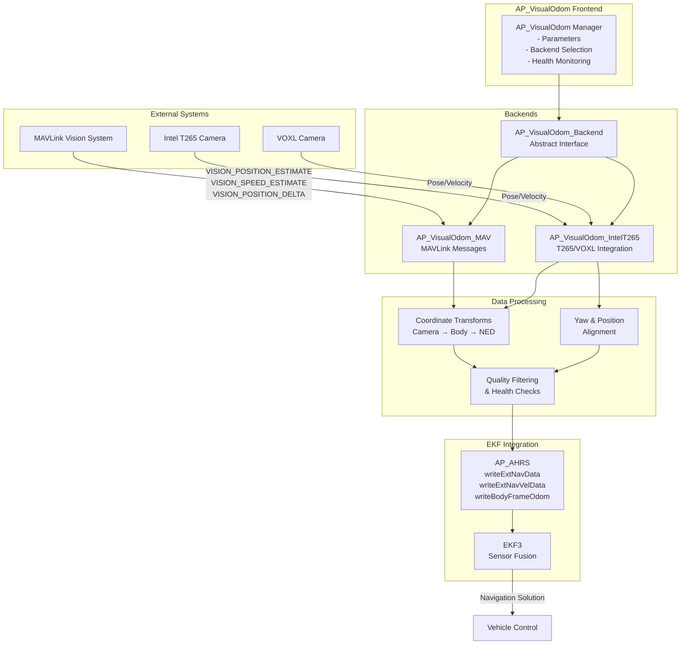
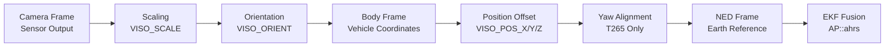

# AP_VisualOdom

## Overview

The AP_VisualOdom library provides visual odometry integration for ArduPilot, enabling camera-based positioning and velocity estimation for GPS-denied navigation. This library acts as a bridge between external visual odometry sensors (such as the Intel RealSense T265 tracking camera or MAVLink-based vision systems) and the ArduPilot Extended Kalman Filter (EKF), allowing vehicles to navigate accurately indoors or in other GPS-denied environments using visual-inertial odometry.

The library uses a manager/backend architecture where the frontend (AP_VisualOdom) handles parameter management, backend selection, and provides a unified API, while backend implementations (AP_VisualOdom_MAV, AP_VisualOdom_IntelT265) handle sensor-specific communication protocols and data processing. Position, velocity, and attitude estimates from the camera are transformed into the vehicle's NED (North-East-Down) reference frame and forwarded to the EKF for sensor fusion with IMU and other navigation sources.

## Architecture



## Key Components

### AP_VisualOdom (Frontend Manager)

The **AP_VisualOdom** class serves as the singleton manager for the visual odometry subsystem. It is responsible for:

- **Parameter Management**: Exposes user-configurable parameters through the AP_Param system (camera type, position offsets, orientation, scaling, noise floors, quality thresholds)
- **Backend Selection**: Initializes the appropriate backend based on the `VISO_TYPE` parameter (None, MAVLink, IntelT265, VOXL)
- **API Surface**: Provides unified methods for handling pose estimates, velocity estimates, and position deltas from any backend
- **Health Monitoring**: Aggregates health status from the active backend using a 300ms timeout (AP_VISUALODOM_TIMEOUT_MS)
- **Quality Reporting**: Reports sensor quality metrics on a -1 to 100 scale (-1=failed, 0=unknown, 1-100=quality percentage)

**Source**: `libraries/AP_VisualOdom/AP_VisualOdom.h`, `libraries/AP_VisualOdom/AP_VisualOdom.cpp`

### AP_VisualOdom_Backend (Abstract Interface)

The **AP_VisualOdom_Backend** class defines the abstract interface that all concrete backends must implement. Key responsibilities include:

- **Health Tracking**: Monitors data staleness using `_last_update_ms` and the 300ms timeout constant
- **Reset Handling**: Manages sensor reset counters and timestamps via `get_reset_timestamp_ms()` to detect origin changes
- **Quality Metrics**: Stores and reports quality values from -1 (failed) to 100 (best quality)
- **Pure Virtual Methods**: 
  - `handle_pose_estimate()`: Process position and attitude measurements
  - `handle_vision_speed_estimate()`: Process velocity measurements
- **Optional Methods**: `request_align_yaw_to_ahrs()`, `align_position_to_ahrs()`, `pre_arm_check()`
- **Logging Support**: Provides `Write_VisualOdom()`, `Write_VisualPosition()`, `Write_VisualVelocity()` for binary log output

**Source**: `libraries/AP_VisualOdom/AP_VisualOdom_Backend.h`, `libraries/AP_VisualOdom/AP_VisualOdom_Backend.cpp`

### AP_VisualOdom_MAV (MAVLink Backend)

The **AP_VisualOdom_MAV** backend implements MAVLink-based visual odometry integration. It:

- **Message Handling**: Processes VISION_POSITION_ESTIMATE, VISION_SPEED_ESTIMATE, and VISION_POSITION_DELTA MAVLink messages
- **Quality Filtering**: Applies quality threshold (`VISO_QUAL_MIN`) before forwarding data to EKF
- **Noise Clamping**: Ensures position and angular errors meet minimum configured noise floors (`VISO_POS_M_NSE`, `VISO_YAW_M_NSE`)
- **Coordinate Transformation**: Applies camera orientation rotation to align measurements with vehicle body frame
- **EKF Integration**: Calls `AP::ahrs().writeExtNavData()` for pose and `writeExtNavVelData()` for velocity
- **Timestamp Management**: Coordinates remote sensor timestamps with local system time

**Source**: `libraries/AP_VisualOdom/AP_VisualOdom_MAV.h`, `libraries/AP_VisualOdom/AP_VisualOdom_MAV.cpp`

### AP_VisualOdom_IntelT265 (T265/VOXL Backend)

The **AP_VisualOdom_IntelT265** backend provides specialized integration for Intel RealSense T265 tracking cameras and VOXL (ModalAI) cameras. Advanced features include:

- **Yaw Alignment**: Automatically aligns camera yaw reference to AHRS/EKF attitude using `align_yaw_to_ahrs()`
- **Position Alignment**: Supports multi-source fusion by aligning camera position estimates to AHRS position via `align_position_to_ahrs()`
- **Reset Jump Detection**: Detects and handles VOXL camera reset jumps in attitude and position (VOXL-specific issue)
- **Reset Ignore Period**: Ignores sensor data for 1 second (VISUALODOM_RESET_IGNORE_DURATION_MS = 1000ms) after detecting a position reset
- **Coordinate Transformations**: Implements `rotate_and_correct_position()`, `rotate_velocity()`, `rotate_attitude()` for full 6-DOF transformations
- **Pre-Arm Checks**: Validates camera orientation configuration and verifies consistency with AHRS attitude
- **Quality Integration**: Integrates confidence metrics from T265 into ArduPilot quality system

**Source**: `libraries/AP_VisualOdom/AP_VisualOdom_IntelT265.h`, `libraries/AP_VisualOdom/AP_VisualOdom_IntelT265.cpp`

## Coordinate Frame Transformations

Visual odometry sensors report measurements in their own camera-centric coordinate frames, which must be transformed to the vehicle's body frame and ultimately to the NED (North-East-Down) earth reference frame used by the EKF. The AP_VisualOdom library handles this multi-stage transformation process.

### Transformation Pipeline



### Coordinate System Conventions

**Camera Frame**: Visual odometry sensors report data in their native camera coordinate system. For the Intel T265, the camera frame convention is:
- +X: Right
- +Y: Down
- +Z: Forward

**Vehicle Body Frame**: ArduPilot uses the aerospace standard body frame:
- +X: Forward (nose direction)
- +Y: Right (starboard)
- +Z: Down (toward ground)

**NED Earth Frame**: The EKF operates in North-East-Down earth-fixed coordinates:
- +X: North
- +Y: East
- +Z: Down

### Transformation Steps

#### 1. Position Scaling

Raw position measurements from the sensor are multiplied by the `VISO_SCALE` parameter to correct for any calibration differences:

```
position_scaled = position_raw * VISO_SCALE
```

#### 2. Camera Orientation Rotation

The `VISO_ORIENT` parameter defines how the camera is mounted relative to the vehicle body frame. Supported orientations:
- 0: Forward (default, camera looking forward)
- 2: Right (camera looking right)
- 4: Back (camera looking backward)
- 6: Left (camera looking left)
- 24: Up (camera looking up)
- 25: Down (camera looking down)

The library uses rotation matrices and quaternions from AP_Math to transform measurements:

```cpp
// Position transformation (IntelT265 backend)
void rotate_and_correct_position(Vector3f &position) {
    if (_use_posvel_rotation) {
        position = _posvel_rotation * position;
    }
    position += _pos_correction;
}
```

**Source**: `libraries/AP_VisualOdom/AP_VisualOdom_IntelT265.cpp:171-177`

#### 3. Position Offset Correction

Camera position offsets (`VISO_POS_X`, `VISO_POS_Y`, `VISO_POS_Z`) define the camera's physical location relative to the vehicle's center of gravity. These offsets are added to account for lever-arm effects:

```
position_body = position_rotated + position_offset
```

#### 4. Yaw Alignment (T265/VOXL Only)

The Intel T265 backend can align its yaw reference to match the vehicle's AHRS/EKF heading. This is critical when using visual odometry alongside other heading sources (compass, GPS):

```cpp
// Yaw alignment algorithm
bool align_yaw_to_ahrs(const Vector3f &position, const Quaternion &attitude) {
    AP_AHRS &ahrs = AP::ahrs();
    float ahrs_yaw;
    if (!ahrs.get_yaw_radians(ahrs_yaw)) {
        return false;
    }
    
    // Extract sensor yaw and calculate trim
    // ...
    align_yaw(position, attitude, ahrs_yaw);
    return true;
}
```

**Source**: `libraries/AP_VisualOdom/AP_VisualOdom_IntelT265.cpp:214-242`

The yaw trim quaternion (`_yaw_rotation`) is applied to subsequent attitude measurements to maintain alignment.

#### 5. Attitude Rotation

Camera attitude (roll, pitch, yaw) is rotated to match the vehicle body frame using quaternion multiplication:

```cpp
void rotate_attitude(Quaternion &attitude) {
    if (_use_att_rotation) {
        attitude *= _att_rotation;
    }
    attitude = _yaw_rotation * attitude;
}
```

**Source**: `libraries/AP_VisualOdom/AP_VisualOdom_IntelT265.cpp:195-202`

#### 6. Velocity Rotation

Velocity vectors are rotated using the same orientation matrix as position:

```cpp
void rotate_velocity(Vector3f &velocity) {
    if (_use_posvel_rotation) {
        velocity = _posvel_rotation * velocity;
    }
}
```

**Source**: `libraries/AP_VisualOdom/AP_VisualOdom_IntelT265.cpp:181-186`

### Body-Frame Odometry

For VISION_POSITION_DELTA messages, the backend can process body-frame delta measurements directly:

```cpp
void handle_vision_position_delta_msg(const mavlink_message_t &msg) {
    // Decode delta position and angle in body frame
    // Rotate by orientation
    // Forward to AP::ahrs().writeBodyFrameOdom()
}
```

**Source**: `libraries/AP_VisualOdom/AP_VisualOdom_Backend.cpp:69-128`

This avoids accumulation of heading errors for sensors that report incremental motion in the vehicle frame.

## Intel RealSense T265 Integration

### Camera Specifications

The Intel RealSense T265 is a tracking camera designed for robotics and drone applications:
- **Sensor Type**: Visual-Inertial Odometry (VIO) with stereo fisheye cameras and IMU
- **Field of View**: 163° diagonal fisheye cameras
- **Update Rate**: Up to 200 Hz odometry output
- **Onboard Processing**: Performs VIO computation internally, outputs pose and velocity estimates
- **Coordinate System**: Custom camera frame (Right-Down-Forward convention)

### VOXL (ModalAI) Variant

The VOXL platform from ModalAI includes a T265-compatible tracking camera with some differences:
- **Reset Jump Behavior**: VOXL cameras can experience position discontinuities ("jumps") when resetting their internal origin
- **Special Handling**: The library includes VOXL-specific code to detect and compensate for these jumps

### T265 Backend Features

#### Yaw Alignment Algorithm

The T265 maintains its own heading reference based on visual features. To fuse with other heading sources (magnetometer, GPS), the backend aligns the camera's yaw to the AHRS/EKF heading:

**Alignment Process:**
1. Request alignment by setting `_align_yaw = true`
2. On next pose update, compare camera yaw to AHRS yaw
3. Calculate yaw trim offset: `yaw_trim = ahrs_yaw - camera_yaw`
4. Store trim as quaternion rotation: `_yaw_rotation`
5. Apply rotation to all subsequent attitude measurements

**Source**: `libraries/AP_VisualOdom/AP_VisualOdom_IntelT265.cpp:214-242`

```cpp
// Simplified alignment logic
if (_align_yaw) {
    if (align_yaw_to_ahrs(pos, attitude)) {
        _align_yaw = false;
    }
}
```

**Source**: `libraries/AP_VisualOdom/AP_VisualOdom_IntelT265.cpp:42-46`

#### Position Alignment for Multi-Source Fusion

When using visual odometry alongside GPS or other position sources, the T265 backend can align its position reference to match the AHRS/EKF position:

```cpp
void align_position_to_ahrs(const Vector3f &sensor_pos, bool align_xy, bool align_z) {
    Vector3f ekf_pos;
    if (!AP::ahrs().get_relative_position_NED_origin(ekf_pos)) {
        return false;
    }
    
    // Calculate position correction offset
    align_position(sensor_pos, ekf_pos, align_xy, align_z);
    return true;
}
```

**Source**: `libraries/AP_VisualOdom/AP_VisualOdom_IntelT265.cpp:269-294`

The calculated `_pos_correction` vector is added to all subsequent position measurements.

#### Reset Jump Detection and Handling

**Problem**: VOXL cameras occasionally experience internal resets that cause instantaneous position jumps, corrupting the navigation solution.

**Solution**: The backend monitors position changes between updates and detects abnormal jumps:

```cpp
void handle_voxl_camera_reset_jump(const Vector3f &sensor_pos, 
                                    const Quaternion &sensor_att, 
                                    uint8_t reset_counter) {
    // Check if reset counter changed without official reset
    // Compare position change to threshold
    // If jump detected, realign yaw and position
}
```

**Source**: `libraries/AP_VisualOdom/AP_VisualOdom_IntelT265.cpp:325-367`

#### Reset Ignore Period

After detecting a position reset (via reset_counter change), the backend ignores sensor data for 1 second to allow the sensor to stabilize:

```cpp
bool should_consume_sensor_data(bool vision_position_estimate, uint8_t reset_counter) {
    // Check for reset counter change
    if (reset_counter != _pos_reset_counter_last) {
        _pos_reset_ignore_start_ms = AP_HAL::millis();
        _pos_reset_counter_last = reset_counter;
    }
    
    // Ignore data during ignore period
    if (_pos_reset_ignore_start_ms != 0) {
        if (AP_HAL::millis() - _pos_reset_ignore_start_ms < 
            VISUALODOM_RESET_IGNORE_DURATION_MS) {
            return false;  // Ignore this data
        }
        _pos_reset_ignore_start_ms = 0;
    }
    
    return true;
}
```

**Source**: `libraries/AP_VisualOdom/AP_VisualOdom_IntelT265.cpp:296-323`

#### Quality and Confidence Metrics

The T265 provides confidence metrics for its pose estimates. The backend maps these to ArduPilot's quality scale:
- **T265 Confidence**: Internal confidence metric from camera
- **ArduPilot Quality**: -1 (failed), 0 (unknown), 1-100 (quality percentage)
- **Filtering**: Data is only sent to EKF if `quality >= VISO_QUAL_MIN`

**Source**: `libraries/AP_VisualOdom/AP_VisualOdom_IntelT265.cpp:64-67`

### T265 Pre-Arm Checks

The T265 backend performs pre-flight validation:

1. **Orientation Check**: Verifies `VISO_ORIENT` is set to a supported value
2. **AHRS Consistency**: Compares T265 attitude to AHRS attitude, ensures difference is within reasonable bounds
3. **Health Status**: Confirms data is being received (health timeout check)

```cpp
bool pre_arm_check(char *failure_msg, uint8_t failure_msg_len) {
    if (_error_orientation) {
        hal.util->snprintf(failure_msg, failure_msg_len, 
                          "Check VISO_ORIENT parameter");
        return false;
    }
    
    // Check attitude consistency with AHRS
    // ...
    
    return true;
}
```

**Source**: `libraries/AP_VisualOdom/AP_VisualOdom_IntelT265.cpp:148-169`

## MAVLink Integration

The MAVLink backend enables integration with external vision systems that communicate via MAVLink protocol. This includes ground control stations, companion computers, or dedicated vision processing boards.

### Supported MAVLink Messages

#### VISION_POSITION_ESTIMATE

Provides position and orientation estimates in the local NED frame:

**Message Fields:**
- `usec`: Timestamp (microseconds)
- `x, y, z`: Position in NED frame (meters)
- `roll, pitch, yaw`: Attitude in radians
- `covariance`: Position and orientation covariance (optional)
- `reset_counter`: Increments when sensor coordinate frame is reset

**Processing:**
1. Extract position and Euler angles
2. Convert Euler to quaternion
3. Apply orientation rotation (`VISO_ORIENT`)
4. Clamp errors to noise floors
5. Check quality threshold
6. Forward to `AP::ahrs().writeExtNavData()`

**Source**: Handled by `AP_VisualOdom::handle_pose_estimate()` and `AP_VisualOdom_MAV::handle_pose_estimate()`

#### VISION_SPEED_ESTIMATE

Provides velocity estimates in the local NED frame:

**Message Fields:**
- `usec`: Timestamp (microseconds)
- `x, y, z`: Velocity in NED frame (m/s)
- `covariance`: Velocity covariance (optional)
- `reset_counter`: Increments when sensor coordinate frame is reset

**Processing:**
1. Extract velocity vector
2. Apply orientation rotation
3. Clamp velocity noise to configured floor
4. Check quality threshold
5. Forward to `AP::ahrs().writeExtNavVelData()`

**Source**: `libraries/AP_VisualOdom/AP_VisualOdom_MAV.cpp`

#### VISION_POSITION_DELTA

Provides incremental position and attitude changes in the body frame:

**Message Fields:**
- `time_delta_usec`: Time since last measurement (microseconds)
- `angle_delta`: Roll, pitch, yaw changes (radians)
- `position_delta`: X, Y, Z position changes in body frame (meters)
- `confidence`: Measurement confidence (0-100%)

**Processing:**
1. Extract delta values and time
2. Rotate deltas by camera orientation
3. Forward to `AP::ahrs().writeBodyFrameOdom()`

**Source**: `libraries/AP_VisualOdom/AP_VisualOdom_Backend.cpp:69-128`

**Note**: This method is particularly useful for visual odometry as it avoids accumulation of heading errors.

### Quality Thresholding

The MAVLink backend applies quality filtering before forwarding data to the EKF:

```cpp
// Only send to EKF if quality meets minimum threshold
if (_quality >= _frontend.get_quality_min()) {
    AP::ahrs().writeExtNavData(...);
}
```

**Quality Scale:**
- **-1**: Failed/invalid measurement
- **0**: Unknown quality
- **1-100**: Quality percentage (1=worst, 100=best)

**Configuration**: Set `VISO_QUAL_MIN` parameter to desired threshold (-1 to always send, 0 to send if good or unknown)

### Noise Floor Constraints

Position and angular errors from MAVLink messages are clamped to configured minimum noise values:

```cpp
posErr = constrain_float(posErr, _frontend.get_pos_noise(), 100.0f);
angErr = constrain_float(angErr, _frontend.get_yaw_noise(), 1.5f);
```

This prevents over-confident measurements from dominating the EKF solution.

**Parameters:**
- `VISO_POS_M_NSE`: Minimum position noise (meters)
- `VISO_YAW_M_NSE`: Minimum yaw noise (radians)

**Source**: `libraries/AP_VisualOdom/AP_VisualOdom_MAV.cpp`

### Remote Timestamp and System Time Coordination

Visual odometry sensors often have their own internal clocks. The backend handles timestamp coordination:

**Remote Timestamp**: Sensor's internal timestamp (microseconds)
**System Time**: ArduPilot's system time (milliseconds)

Both timestamps are passed to the EKF for proper time synchronization:

```cpp
void handle_pose_estimate(uint64_t remote_time_us, uint32_t time_ms, ...) {
    // remote_time_us: Sensor timestamp
    // time_ms: System time when message received
    // ...
    AP::ahrs().writeExtNavData(pos, att, posErr, angErr, time_ms, delay_ms, reset_timestamp_ms);
}
```

The `VISO_DELAY_MS` parameter compensates for processing and communication delays.

## EKF Fusion

The AP_VisualOdom library integrates with the ArduPilot Extended Kalman Filter (EKF) through the AP_AHRS interface. Visual odometry measurements are fused with IMU data and other navigation sources to produce an optimal state estimate.

### EKF Integration Methods

#### writeExtNavData (Position and Attitude)

Sends position and attitude estimates to the EKF:

```cpp
AP::ahrs().writeExtNavData(
    pos,                    // Vector3f: NED position (meters)
    att,                    // Quaternion: Vehicle attitude
    posErr,                 // float: Position measurement error (meters)
    angErr,                 // float: Attitude measurement error (radians)
    time_ms,                // uint32_t: System time (milliseconds)
    delay_ms,               // uint16_t: Sensor delay (milliseconds)
    reset_timestamp_ms      // uint32_t: Time of last origin reset
);
```

**Usage**: Primary method for full 6-DOF (position + attitude) visual odometry fusion

**Source**: Called from `AP_VisualOdom_MAV::handle_pose_estimate()` and `AP_VisualOdom_IntelT265::handle_pose_estimate()`

#### writeExtNavVelData (Velocity)

Sends velocity estimates to the EKF:

```cpp
AP::ahrs().writeExtNavVelData(
    vel,                    // Vector3f: NED velocity (m/s)
    velErr,                 // float: Velocity measurement error (m/s)
    time_ms,                // uint32_t: System time (milliseconds)
    delay_ms,               // uint16_t: Sensor delay (milliseconds)
    reset_timestamp_ms      // uint32_t: Time of last origin reset
);
```

**Usage**: For systems that provide velocity estimates separately or in addition to position

**Source**: Called from `AP_VisualOdom_MAV::handle_vision_speed_estimate()` and `AP_VisualOdom_IntelT265::handle_vision_speed_estimate()`

#### writeBodyFrameOdom (Body-Frame Deltas)

Sends incremental odometry measurements in the body frame:

```cpp
AP::ahrs().writeBodyFrameOdom(
    quality,                // float: Measurement quality (0-1)
    position_delta,         // Vector3f: Body-frame position change (meters)
    angle_delta,            // Vector3f: Roll/pitch/yaw change (radians)
    time_delta_us,          // float: Time since last measurement (microseconds)
    time_ms,                // uint32_t: System time (milliseconds)
    delay_ms,               // uint16_t: Sensor delay (milliseconds)
    reset_timestamp_ms      // uint32_t: Time of last origin reset
);
```

**Usage**: For VISION_POSITION_DELTA messages; avoids heading accumulation errors

**Source**: Called from `AP_VisualOdom_Backend::handle_vision_position_delta_msg()`

### Sensor Delay Compensation

Visual odometry sensors have processing latency between when images are captured and when measurements are available. The `VISO_DELAY_MS` parameter compensates for this:

**Typical Delays:**
- T265 camera: 10-30ms processing + communication delay
- MAVLink vision systems: Variable depending on processing complexity and link latency
- Ground-based vision systems: Can be 50-200ms depending on image processing

**Configuration**: Set `VISO_DELAY_MS` to match your system's total latency

**EKF Handling**: The EKF uses the delay parameter to correctly time-align visual odometry measurements with IMU data in its state estimation.

### Quality-Based Gating

The EKF receives quality metrics with each measurement. The `VISO_QUAL_MIN` parameter gates data before sending to the EKF:

```cpp
bool consume = should_consume_sensor_data(true, reset_counter) && 
               (_quality >= _frontend.get_quality_min());
if (consume) {
    AP::ahrs().writeExtNavData(...);
}
```

**Quality Scale:**
- **-1**: Failed - never sent to EKF
- **0**: Unknown - sent if VISO_QUAL_MIN ≤ 0
- **1-100**: Quality percentage - sent if quality ≥ VISO_QUAL_MIN

**Tuning Guidance**: Start with VISO_QUAL_MIN=0 (send all data), increase if you observe poor measurements corrupting navigation.

### Reset Counter Handling

Visual odometry sensors can reset their coordinate frame origin (e.g., during camera reinitialization). The reset_counter field increments when this occurs.

**Backend Handling:**

```cpp
uint32_t get_reset_timestamp_ms(uint8_t reset_counter) {
    if (reset_counter != _last_reset_counter) {
        _reset_timestamp_ms = AP_HAL::millis();
        _last_reset_counter = reset_counter;
    }
    return _reset_timestamp_ms;
}
```

**Source**: `libraries/AP_VisualOdom/AP_VisualOdom_Backend.cpp:51-61`

**EKF Handling**: The EKF uses the reset timestamp to:
1. Discard measurements during transients
2. Re-initialize filters if necessary
3. Maintain consistency across coordinate frame resets

**T265 Behavior**: The T265 backend additionally ignores data for 1 second after reset detection to allow sensor stabilization.

### Noise Parameters

Noise parameters define the measurement uncertainty for EKF weighting:

- **VISO_VEL_M_NSE**: Velocity measurement noise (m/s) - Default: 0.1
- **VISO_POS_M_NSE**: Position measurement noise (m) - Default: 0.2
- **VISO_YAW_M_NSE**: Yaw measurement noise (radians) - Default: 0.2

**EKF Usage**: Lower noise values give visual odometry more weight in the fusion; higher noise values reduce its influence.

**Tuning**: Adjust based on observed performance. Indoor environments with good features can use lower noise; feature-poor environments should use higher noise.

## Camera Mounting Configuration

Proper camera mounting configuration is critical for accurate visual odometry integration. The library requires precise information about camera orientation and position relative to the vehicle's center of gravity.

### VISO_ORIENT Parameter

The `VISO_ORIENT` parameter defines the camera's mounting orientation relative to the vehicle body frame.

**Supported Orientations:**

| Value | Orientation | Camera Facing | Use Case |
|-------|-------------|---------------|----------|
| 0 | Forward | Straight ahead | Standard forward-looking navigation |
| 2 | Right | Starboard side | Side-facing for hallway navigation |
| 4 | Back | Rearward | Reverse driving or backing modes |
| 6 | Left | Port side | Side-facing for hallway navigation |
| 24 | Up | Skyward | Ceiling navigation or inverted flight |
| 25 | Down | Downward | Floor/terrain tracking |

**Configuration Example:**

```
VISO_ORIENT = 0    # Camera pointing forward (most common)
```

**Important**: Incorrect orientation configuration will cause navigation errors and potential crashes. Verify orientation matches physical camera mounting.

### VISO_POS_X/Y/Z Position Offsets

These parameters define the camera's physical location relative to the vehicle's center of gravity (CG) in the body frame.

**Coordinate Convention:**
- **VISO_POS_X**: Forward/aft offset (meters, positive = forward of CG)
- **VISO_POS_Y**: Left/right offset (meters, positive = right of CG)
- **VISO_POS_Z**: Up/down offset (meters, positive = below CG)

**Example Configuration:**

```
# Camera mounted 0.15m forward, 0.05m right, 0.08m below CG
VISO_POS_X = 0.15
VISO_POS_Y = 0.05
VISO_POS_Z = 0.08
```

**Why Offsets Matter**: Vehicle rotation about the CG creates different velocities at offset locations (lever arm effect). The EKF uses these offsets to correctly account for rotational motion.

**Measurement Tips:**
1. Determine vehicle CG location (balance point)
2. Measure camera lens position relative to CG
3. Use positive values per ArduPilot body frame convention
4. Accuracy of ±1cm is sufficient for most applications

### Field of View Requirements

**Intel T265 Camera:**
- **FOV**: 163° diagonal fisheye
- **Mounting Clearance**: Ensure no vehicle structure within ~30° of camera edges
- **Feature Requirements**: Needs visual features in FOV; blank walls or sky will degrade performance

**Mounting Constraints:**
- Avoid vibration - use soft-mounting or vibration dampers
- Protect lens from propeller wash and debris
- Ensure USB/power cable has strain relief
- Consider camera thermal limits (operational range: 0-40°C)

### Coordinate Convention Warnings

**Common Mistakes:**

1. **Confusing Camera Frame and Body Frame**: Camera manufacturers use various coordinate conventions. Always transform to ArduPilot's body frame.

2. **Incorrect Sign on Z-axis**: ArduPilot uses NED convention where +Z is down. Many robotics systems use +Z up (ENU).

3. **Orientation Parameter vs. Physical Rotation**: `VISO_ORIENT` defines camera viewing direction, not the physical rotation of the camera housing.

**Verification Procedure:**
1. Set up camera and configure parameters
2. Enable visual odometry
3. Move vehicle forward slowly - position should increase in +X direction
4. Move vehicle right - position should increase in +Y direction
5. Move vehicle down - position should increase in +Z direction
6. If any direction is incorrect, check orientation and offset configuration

**Pre-Arm Check**: The T265 backend validates orientation parameter and can detect some configuration errors during pre-arm checks.

## Configuration Parameters

All visual odometry parameters use the `VISO_` prefix and are configured through the ground control station or parameter files.

### VISO_TYPE - Backend Selection

**Description**: Selects which visual odometry backend to use

**Values:**
- **0**: None (disabled)
- **1**: MAVLink (external vision system via MAVLink messages)
- **2**: IntelT265 (Intel RealSense T265 camera)
- **3**: VOXL (ModalAI VOXL tracking camera)

**Default**: 0 (disabled)

**Notes**: 
- Requires reboot after changing
- Backend availability depends on compile-time flags
- Enable with `VISO_TYPE = 2` for T265 or `VISO_TYPE = 1` for MAVLink systems

**Source**: `libraries/AP_VisualOdom/AP_VisualOdom.cpp:31-37`

### VISO_SCALE - Position Scaling Factor

**Description**: Multiplier applied to all position estimates from the sensor

**Range**: Typically 0.8 to 1.2

**Default**: 1.0 (no scaling)

**Use Cases:**
- Correct for camera calibration errors
- Compensate for lens distortion not handled by sensor
- Fine-tune position accuracy through flight testing

**Example**: If vehicle consistently travels 10% further than visual odometry reports, set `VISO_SCALE = 1.1`

**Source**: `libraries/AP_VisualOdom/AP_VisualOdom.cpp:71-75`

### VISO_DELAY_MS - Sensor Delay

**Description**: Time delay between image capture and measurement availability

**Range**: 0 to 250 milliseconds

**Default**: 10ms

**Tuning**:
- **T265 Local**: 10-20ms (USB latency + processing)
- **T265 via Companion Computer**: 30-50ms (add communication latency)
- **MAVLink Vision System**: 50-200ms (depends on processing complexity)
- **Networked Systems**: Add network latency

**Impact**: Incorrect delay causes lag in position corrections, especially during aggressive maneuvers

**Source**: `libraries/AP_VisualOdom/AP_VisualOdom.cpp:77-83`

### VISO_VEL_M_NSE - Velocity Noise

**Description**: Velocity measurement noise (standard deviation)

**Units**: meters per second (m/s)

**Range**: 0.05 to 5.0 m/s

**Default**: 0.1 m/s

**Tuning**:
- **Indoor, good features**: 0.05 - 0.1 m/s
- **Outdoor, variable features**: 0.1 - 0.3 m/s
- **Poor lighting or features**: 0.3 - 1.0 m/s

**EKF Impact**: Lower values increase visual odometry weight in velocity fusion; higher values reduce influence

**Source**: `libraries/AP_VisualOdom/AP_VisualOdom.cpp:85-91`

### VISO_POS_M_NSE - Position Noise

**Description**: Position measurement noise (standard deviation)

**Units**: meters (m)

**Range**: 0.1 to 10.0 m

**Default**: 0.2 m

**Tuning**:
- **Indoor, good features**: 0.1 - 0.2 m
- **Outdoor, variable features**: 0.2 - 0.5 m
- **Poor lighting or features**: 0.5 - 2.0 m

**Note**: This is a minimum noise floor; actual measurement covariance from sensor is clamped to this value

**Source**: `libraries/AP_VisualOdom/AP_VisualOdom.cpp:93-99`

### VISO_YAW_M_NSE - Yaw Noise

**Description**: Yaw (heading) measurement noise (standard deviation)

**Units**: radians (rad)

**Range**: 0.05 to 1.0 rad

**Default**: 0.2 rad (≈11.5 degrees)

**Tuning**:
- **With yaw alignment enabled**: 0.1 - 0.2 rad
- **Without external heading reference**: 0.2 - 0.5 rad
- **Poor feature symmetry**: 0.5 - 1.0 rad

**Note**: Visual odometry yaw can drift over time; use in combination with magnetometer or GPS heading

**Source**: `libraries/AP_VisualOdom/AP_VisualOdom.cpp:101-107`

### VISO_QUAL_MIN - Minimum Quality Threshold

**Description**: Minimum quality value required to send measurements to EKF

**Units**: Percentage (%)

**Range**: -1 to 100
- **-1**: Always send (even if sensor reports failure)
- **0**: Send if quality is good or unknown
- **1-100**: Only send if quality ≥ this value

**Default**: 0 (send unless explicitly failed)

**Tuning**:
- **Start**: 0 (send all data)
- **If seeing bad measurements**: Increase to 10-30
- **Strict filtering**: 50-70 (only high-confidence data)

**T265 Specific**: The T265 provides confidence metrics; this parameter filters low-confidence poses

**Source**: `libraries/AP_VisualOdom/AP_VisualOdom.cpp:109-115`

### VISO_POS_X, VISO_POS_Y, VISO_POS_Z - Camera Position Offsets

**Description**: Camera position relative to vehicle center of gravity

**Units**: meters (m)

**Range**: -5.0 to 5.0 m (each axis)

**Default**: 0.0, 0.0, 0.0 (camera at CG)

**Conventions**:
- **X**: Positive forward
- **Y**: Positive right
- **Z**: Positive down

**See**: "Camera Mounting Configuration" section for detailed guidance

**Source**: `libraries/AP_VisualOdom/AP_VisualOdom.cpp:39-62`

### VISO_ORIENT - Camera Orientation

**Description**: Physical mounting orientation of camera

**Values**: See "Camera Mounting Configuration" section

**Default**: 0 (Forward)

**Source**: `libraries/AP_VisualOdom/AP_VisualOdom.cpp:64-69`

### Parameter Configuration Example

**Typical T265 Setup (Indoor Quadcopter):**

```
VISO_TYPE = 2              # Intel T265
VISO_ORIENT = 0            # Forward-facing
VISO_POS_X = 0.10          # 10cm forward of CG
VISO_POS_Y = 0.00          # Centered laterally
VISO_POS_Z = 0.05          # 5cm below CG
VISO_SCALE = 1.0           # No scaling
VISO_DELAY_MS = 15         # 15ms latency
VISO_VEL_M_NSE = 0.1       # 0.1 m/s velocity noise
VISO_POS_M_NSE = 0.15      # 0.15m position noise
VISO_YAW_M_NSE = 0.15      # ~8.6 deg yaw noise
VISO_QUAL_MIN = 0          # Send all good/unknown data
```

**MAVLink Vision System (Outdoor Rover):**

```
VISO_TYPE = 1              # MAVLink
VISO_ORIENT = 25           # Downward-facing
VISO_POS_X = 0.15          # 15cm forward
VISO_POS_Y = 0.00          # Centered
VISO_POS_Z = 0.20          # 20cm below CG
VISO_SCALE = 1.0           # No scaling
VISO_DELAY_MS = 80         # 80ms processing + network
VISO_VEL_M_NSE = 0.2       # 0.2 m/s noise (outdoor)
VISO_POS_M_NSE = 0.3       # 0.3m noise (outdoor)
VISO_YAW_M_NSE = 0.3       # ~17 deg yaw noise
VISO_QUAL_MIN = 20         # Filter low-quality data
```

## Quality and Confidence Metrics

### Quality Scale Convention

The AP_VisualOdom library uses a standardized quality scale for all backends:

**Scale Values:**
- **-1**: Failed or invalid measurement
- **0**: Unknown quality (sensor doesn't provide confidence metrics)
- **1**: Worst quality (barely usable)
- **100**: Best quality (high confidence)

**Source**: Quality scale documented throughout code, e.g., `libraries/AP_VisualOdom/AP_VisualOdom.h:89-91`

### Quality Filtering Before EKF Fusion

Backend implementations check quality against the `VISO_QUAL_MIN` threshold before forwarding data to the EKF:

```cpp
bool consume = should_consume_sensor_data(true, reset_counter) && 
               (_quality >= _frontend.get_quality_min());
if (consume) {
    // Forward to EKF
    AP::ahrs().writeExtNavData(...);
} else {
    // Log but don't use
}
```

**Source**: `libraries/AP_VisualOdom/AP_VisualOdom_IntelT265.cpp:67-71`

**Benefit**: Prevents poor-quality measurements from corrupting the navigation solution while still logging them for analysis.

### Health Monitoring with 300ms Timeout

The backend base class implements health monitoring using a staleness timeout:

```cpp
bool healthy() const {
    return ((AP_HAL::millis() - _last_update_ms) < AP_VISUALODOM_TIMEOUT_MS);
}
```

**Timeout Value**: 300ms (AP_VISUALODOM_TIMEOUT_MS constant)

**Source**: `libraries/AP_VisualOdom/AP_VisualOdom_Backend.cpp:39-45`

**Behavior**:
- `healthy()` returns `true` if data received within last 300ms
- `healthy()` returns `false` if no data for > 300ms
- Frontend aggregates backend health for system-level reporting

**Typical Update Rates**:
- T265: 30-200 Hz (well within timeout)
- MAVLink systems: 10-30 Hz (typically within timeout)
- Health timeout triggers if sensor disconnects or stops publishing

### Logging of Ignored Measurements

Even when measurements fail quality checks or occur during ignore periods, they are still logged with an `ignored` flag:

```cpp
Write_VisualPosition(remote_time_us, time_ms, pos.x, pos.y, pos.z, 
                    degrees(roll), degrees(pitch), wrap_360(degrees(yaw)), 
                    posErr, angErr, reset_counter, 
                    !consume,      // ignored flag
                    _quality);
```

**Source**: `libraries/AP_VisualOdom/AP_VisualOdom_IntelT265.cpp:81`

**Log Messages:**
- **VISO**: Visual odometry general status
- **VISP**: Visual position measurements
- **VISV**: Visual velocity measurements

**Analysis**: Logs can be analyzed to determine:
- How often quality filtering rejects data
- Reset behavior and frequency
- Sensor noise characteristics
- Root cause of navigation issues

### Intel T265 Confidence Mapping

The T265 tracking camera provides an internal confidence metric. The IntelT265 backend maps this to ArduPilot's quality scale:

**T265 Confidence Levels** (vendor-specific):
- **High**: Strong feature tracking, good lighting
- **Medium**: Adequate features, acceptable lighting
- **Low**: Weak features, poor lighting, motion blur
- **Failed**: Tracking lost

**Mapping** (implementation-specific, may vary):
- Failed → quality = -1
- Low → quality = 20-40
- Medium → quality = 50-70
- High → quality = 80-100

**Source**: Mapping implemented in `libraries/AP_VisualOdom/AP_VisualOdom_IntelT265.cpp`

**Usage**: Set `VISO_QUAL_MIN` to filter based on T265 confidence. For example, `VISO_QUAL_MIN = 50` ensures only medium and high confidence poses are used.

## Pre-Arm Checks

Pre-arm checks validate visual odometry configuration and sensor health before allowing the vehicle to arm. This prevents flights with misconfigured or non-functional visual odometry.

### Frontend Pre-Arm Check

The frontend coordinates pre-arm checks and formats failure messages:

```cpp
bool pre_arm_check(char *failure_msg, uint8_t failure_msg_len) const {
    if (_driver == nullptr) {
        return true;  // Not configured, no check needed
    }
    return _driver->pre_arm_check(failure_msg, failure_msg_len);
}
```

**Source**: `libraries/AP_VisualOdom/AP_VisualOdom.cpp:190-200`

### Camera Orientation Validation

Verifies `VISO_ORIENT` parameter is set to a supported orientation value:

**Valid Values**: 0 (Forward), 2 (Right), 4 (Back), 6 (Left), 24 (Up), 25 (Down)

**Failure**: If `VISO_ORIENT` is set to an unsupported value:

```
Pre-Arm: Visual Odom - Check VISO_ORIENT parameter
```

**Source**: `libraries/AP_VisualOdom/AP_VisualOdom_IntelT265.cpp:148-153`

### AHRS Consistency Verification (T265)

The T265 backend compares camera attitude to AHRS attitude to detect configuration errors:

**Check Process:**
1. Retrieve current attitude from T265 (`_attitude_last`)
2. Retrieve AHRS attitude
3. Calculate attitude difference
4. Fail if difference exceeds threshold (typically 30-45 degrees)

**Typical Failures:**
- Incorrect `VISO_ORIENT` setting (e.g., camera forward but configured as down)
- Camera mounting changed without parameter update
- T265 yaw not aligned to AHRS (can be auto-corrected via `request_align_yaw_to_ahrs()`)

**Failure Message**:

```
Pre-Arm: Visual Odom - Attitude inconsistent with AHRS
```

**Source**: `libraries/AP_VisualOdom/AP_VisualOdom_IntelT265.cpp:154-169`

**Resolution**: 
- Verify physical camera orientation matches `VISO_ORIENT`
- Enable T265 yaw alignment
- Ensure AHRS has valid attitude (requires vehicle to be level during startup)

### Health Status Confirmation

Pre-arm checks verify visual odometry is providing recent data:

**Check**: Call `healthy()` method which validates data received within 300ms

**Failure**: If no recent data:

```
Pre-Arm: Visual Odom - No data received
```

**Common Causes:**
- Camera not connected or powered
- USB cable disconnected
- Camera driver not running on companion computer
- MAVLink vision messages not being sent
- Incorrect `VISO_TYPE` configuration

**Resolution**: Check physical connections, verify camera initialization, confirm MAVLink message flow

### MAVLink Backend Pre-Arm

The MAVLink backend uses the default (always pass) pre-arm check since configuration validation is minimal:

```cpp
virtual bool pre_arm_check(char *failure_msg, uint8_t failure_msg_len) const { 
    return true; 
}
```

**Source**: `libraries/AP_VisualOdom/AP_VisualOdom_Backend.h:56`

**Rationale**: MAVLink backends depend on external systems that may not be active during pre-arm checks. Health status is the primary indicator.

## Testing

### SITL Vision Simulation Setup

ArduPilot's Software-In-The-Loop (SITL) simulator supports simulated visual odometry for testing without hardware.

**Enable Visual Odometry in SITL:**

1. Start SITL with visual odometry enabled:

```bash
sim_vehicle.py -v ArduCopter --console --map -A "--uartF=sim:vicon:"
```

2. Configure parameters:

```
VISO_TYPE = 1        # MAVLink backend for SITL
VISO_POS_X = 0.1
VISO_POS_Y = 0.0
VISO_POS_Z = 0.05
VISO_ORIENT = 0
EK3_SRC1_POSXY = 6   # Use external nav for position
EK3_SRC1_VELXY = 6   # Use external nav for velocity
EK3_SRC1_POSZ = 1    # Use baro for altitude
```

3. **Simulated Data**: SITL generates perfect visual odometry data based on vehicle state. Useful for:
   - Testing integration without hardware
   - Developing flight modes that require position hold
   - Validating EKF fusion logic
   - Training on visual odometry workflows

**Limitations**: SITL visual odometry is perfect (no noise, no dropouts). Real hardware will have quality variations and requires additional tuning.

### T265 Hardware Testing Procedures

**Safe Testing Sequence:**

#### 1. Bench Testing

**Objective**: Verify camera connection, data flow, and parameter configuration without vehicle motion.

**Procedure**:
1. Connect T265 camera via USB
2. Power up vehicle
3. Connect ground control station
4. Verify `VISO_TYPE = 2` (IntelT265)
5. Observe VISO log messages in real-time telemetry
6. Check quality metrics are reporting (not -1)
7. Confirm health status shows good
8. Verify pre-arm checks pass

**Expected**: Position should remain near (0, 0, 0) with small noise fluctuations.

#### 2. Manual Movement Test

**Objective**: Validate coordinate transformations and orientation configuration.

**Procedure**:
1. Place vehicle on ground
2. Arm (or use disarmed movement logging)
3. Manually slide vehicle forward 1 meter
4. Observe position change in logs/telemetry
5. Expected: X position increases by ~1.0m
6. Repeat for right (Y increases), down (Z increases)

**Validation**:
- Forward → +X
- Right → +Y
- Down → +Z

If directions don't match, verify `VISO_ORIENT` setting.

#### 3. Controlled Flight Test

**Objective**: Test visual odometry under vehicle control.

**Procedure**:
1. Start in STABILIZE mode (no position control)
2. Take off and hover using manual control
3. Switch to LOITER mode
4. Observe vehicle hold position
5. Give small stick inputs (forward, right)
6. Release sticks, observe return to position
7. Land and review logs

**Success Criteria**:
- Vehicle maintains position in LOITER within ±0.5m
- Position corrections are smooth, not oscillatory
- No sudden jumps in position estimate
- Quality metrics remain > 50 during flight

**Safety**:
- Test indoors with safety barriers or outdoors with GPS backup
- Have manual control (STABILIZE mode) ready on switch
- Start with short 1-2 minute flights
- Gradually increase complexity

#### 4. Edge Case Testing

**Test Scenarios**:
- **Low Light**: Reduce lighting, observe quality degradation
- **Feature-Poor Walls**: Fly near blank walls, check tracking robustness
- **Fast Motion**: Aggressive stick inputs, verify no tracking loss
- **Reset Handling**: Trigger camera reset (if possible), verify 1-second ignore works

### MAVLink Message Injection for Testing

For MAVLink backend development and testing, inject simulated visual odometry messages.

**Using MAVProxy:**

```python
# MAVProxy console
# Send VISION_POSITION_ESTIMATE
import time
usec = int(time.time() * 1e6)
master.mav.vision_position_estimate_send(
    usec,           # usec: timestamp
    0.5,            # x: 0.5m north
    0.2,            # y: 0.2m east
    -1.5,           # z: -1.5m altitude (down)
    0.0,            # roll
    0.0,            # pitch
    1.57,           # yaw: 90 degrees (facing east)
    [0]*21,         # covariance (not used)
    0               # reset_counter
)
```

**Using Python Script:**

```python
from pymavlink import mavutil
import time

# Connect to vehicle
master = mavutil.mavlink_connection('udp:127.0.0.1:14551')

# Wait for heartbeat
master.wait_heartbeat()

while True:
    usec = int(time.time() * 1e6)
    
    # Send position estimate at 10 Hz
    master.mav.vision_position_estimate_send(
        usec, 
        0.0, 0.0, -1.5,  # x, y, z
        0.0, 0.0, 0.0,    # roll, pitch, yaw
        [0]*21,            # covariance
        0                  # reset_counter
    )
    
    time.sleep(0.1)
```

**Validation**:
- Check MAVLink traffic shows VISION_POSITION_ESTIMATE messages being received
- Verify VISO logs show position data
- Confirm EKF is fusing visual odometry (check EKF status messages)

### Log Analysis and Debugging

**Key Log Messages:**

#### VISO - Visual Odometry Status

Contains health, quality, and timing information:
- `TimeUS`: Timestamp (microseconds)
- `dt`: Time delta since last update
- `AngDelta`: Angle changes (roll, pitch, yaw)
- `PosDelta`: Position deltas (x, y, z)
- `conf`: Confidence metric

#### VISP - Visual Position

Position and attitude measurements:
- `RemTimeUS`: Remote sensor timestamp
- `TimeMS`: System time
- `PX`, `PY`, `PZ`: Position North, East, Down (meters)
- `Roll`, `Pitch`, `Yaw`: Attitude (degrees)
- `PErr`: Position error (meters)
- `AErr`: Angle error (radians)
- `Ign`: Ignored flag (1 = not used in EKF)
- `Qual`: Quality metric

#### VISV - Visual Velocity

Velocity measurements:
- `RemTimeUS`: Remote sensor timestamp
- `TimeMS`: System time
- `VX`, `VY`, `VZ`: Velocity North, East, Down (m/s)
- `Ign`: Ignored flag
- `Qual`: Quality metric

**Analysis Workflow:**

1. **Extract Logs**: Download .bin log file from vehicle
2. **Convert to CSV**: Use Mission Planner or MAVExplorer
3. **Plot Time Series**:
   - VISP.PX, PY, PZ vs Time → Position trajectory
   - VISP.Qual vs Time → Quality over flight
   - VISP.Ign vs Time → Identify rejected measurements
4. **Compare with EKF**:
   - Plot XKF1.PN, PE, PD alongside VISP position
   - Verify EKF tracking visual odometry
5. **Check Reset Events**:
   - Look for reset_counter changes
   - Verify 1-second ignore period after resets

**Common Issues**:

| Symptom | Possible Cause | Debug Steps |
|---------|----------------|-------------|
| No VISP messages | Camera not connected, wrong VISO_TYPE | Check connections, verify parameter |
| Quality always -1 | Sensor initialization failed | Check USB power, reboot camera |
| High Ign count | Quality threshold too strict | Lower VISO_QUAL_MIN |
| Position drift | Incorrect orientation, poor features | Verify VISO_ORIENT, improve lighting |
| Oscillations | Noise parameters too low | Increase VISO_POS_M_NSE |
| EKF not using data | Source selection wrong | Check EK3_SRC1_POSXY = 6 |

**Advanced Analysis**:

Use MAVExplorer for interactive log analysis:

```bash
MAVExplorer.py mylog.bin
```

```python
# In MAVExplorer console
graph VISP.PX VISP.PY
graph VISP.Qual VISP.Ign
graph XKF1.PN VISP.PX  # Compare EKF and visual odom
```

## Usage Examples

### Basic T265 Configuration

**Scenario**: Intel RealSense T265 camera mounted forward-facing on a quadcopter, 10cm forward and 5cm below the center of gravity.

**Parameter Configuration**:

```
VISO_TYPE = 2              # Intel T265
VISO_ORIENT = 0            # Forward-facing
VISO_POS_X = 0.10          # 10cm forward of CG
VISO_POS_Y = 0.00          # Centered laterally
VISO_POS_Z = 0.05          # 5cm below CG
VISO_SCALE = 1.0           # No scaling needed
VISO_DELAY_MS = 15         # Typical T265 latency
VISO_VEL_M_NSE = 0.1       # Indoor velocity noise
VISO_POS_M_NSE = 0.15      # Indoor position noise
VISO_YAW_M_NSE = 0.15      # ~8.6 degree yaw noise
VISO_QUAL_MIN = 0          # Accept all good/unknown data
```

**EKF Source Selection** (use visual odometry as primary position source):

```
EK3_SRC1_POSXY = 6         # ExternalNav for XY position
EK3_SRC1_VELXY = 6         # ExternalNav for XY velocity  
EK3_SRC1_POSZ = 1          # Barometer for altitude
EK3_SRC1_VELZ = 0          # No Z velocity source (use baro)
EK3_SRC1_YAW = 1           # Compass for heading
```

**Flight Modes**: With this configuration, LOITER, PosHold, AUTO, and GUIDED modes will use visual odometry for position control.

### MAVLink Integration Code Pattern

**Scenario**: Companion computer running vision processing sends MAVLink VISION_POSITION_ESTIMATE messages to ArduPilot.

**Companion Computer Code (Python)**:

```python
from pymavlink import mavutil
import time
import numpy as np

# Connect to ArduPilot (adjust connection string for your setup)
master = mavutil.mavlink_connection('/dev/ttyAMA0', baud=921600)
master.wait_heartbeat()
print("Connected to ArduPilot")

def send_vision_position(x, y, z, roll, pitch, yaw, quality=100):
    """
    Send visual odometry position estimate to ArduPilot
    
    Args:
        x, y, z: Position in NED frame (meters)
        roll, pitch, yaw: Attitude in radians
        quality: Confidence 0-100, or -1 for failed
    """
    usec = int(time.time() * 1e6)
    
    # Position error estimates (meters and radians)
    pos_err = 0.1   # 10cm position error
    ang_err = 0.05  # ~3 degree attitude error
    
    # Create covariance array (21 elements, row-major)
    # Set to zeros if not using covariance
    covariance = [0.0] * 21
    
    master.mav.vision_position_estimate_send(
        usec,            # Timestamp (microseconds)
        x, y, z,         # Position NED (meters)
        roll, pitch, yaw, # Attitude (radians)
        covariance,      # Covariance (optional)
        0                # Reset counter (increment on origin change)
    )

# Main loop: Send vision data at 30 Hz
while True:
    # [Your vision processing code here]
    # Calculate x, y, z position and roll, pitch, yaw attitude
    
    # Example: Simulated position hold at 0,0,-1.5m
    x = 0.0
    y = 0.0
    z = -1.5  # Negative because NED (down is positive)
    roll = 0.0
    pitch = 0.0
    yaw = 0.0
    
    send_vision_position(x, y, z, roll, pitch, yaw)
    time.sleep(0.033)  # 30 Hz update rate
```

**ArduPilot Configuration**:

```
VISO_TYPE = 1              # MAVLink backend
VISO_ORIENT = 0            # Adjust if camera not forward
VISO_DELAY_MS = 50         # Account for processing + comm delay
VISO_VEL_M_NSE = 0.2       # Velocity noise estimate
VISO_POS_M_NSE = 0.2       # Position noise estimate
VISO_YAW_M_NSE = 0.2       # Yaw noise estimate
VISO_QUAL_MIN = 20         # Filter low-quality estimates
```

### Coordinate Transformation Example

**Problem**: Your vision system outputs position in its own coordinate frame. You need to transform it to ArduPilot's NED frame.

**Vision System Frame** (example):
- +X: Forward
- +Y: Left  
- +Z: Up

**ArduPilot NED Frame**:
- +X: North
- +Y: East
- +Z: Down

**Transformation Code** (Python):

```python
import numpy as np

def vision_to_ned(vision_x, vision_y, vision_z, vehicle_heading_rad):
    """
    Transform vision system coordinates to NED frame
    
    Args:
        vision_x, vision_y, vision_z: Position in vision frame (meters)
        vehicle_heading_rad: Vehicle heading in radians (0 = north)
    
    Returns:
        ned_x, ned_y, ned_z: Position in NED frame (meters)
    """
    # Step 1: Vision frame to body frame
    # Vision: X=forward, Y=left, Z=up
    # Body:   X=forward, Y=right, Z=down
    body_x = vision_x
    body_y = -vision_y  # Flip left/right
    body_z = -vision_z  # Flip up/down
    
    # Step 2: Rotate body frame to earth frame using heading
    # This assumes vehicle is level (roll=pitch=0)
    cos_hdg = np.cos(vehicle_heading_rad)
    sin_hdg = np.sin(vehicle_heading_rad)
    
    ned_x = body_x * cos_hdg - body_y * sin_hdg
    ned_y = body_x * sin_hdg + body_y * cos_hdg
    ned_z = body_z
    
    return ned_x, ned_y, ned_z

# Example usage
vision_pos = (1.0, 0.5, -2.0)  # Vision system: 1m forward, 0.5m left, 2m up
vehicle_heading = np.radians(45)  # Vehicle heading 45 degrees

ned_pos = vision_to_ned(*vision_pos, vehicle_heading)
print(f"NED position: {ned_pos}")
# Send to ArduPilot via MAVLink
```

**Note**: ArduPilot's `VISO_ORIENT` parameter handles body-to-sensor rotation. The above example shows how to handle any remaining frame conversions in your vision processing code before sending to ArduPilot.

### Multiple Sensor Configuration

**Scenario**: Using T265 for position and a separate magnetometer for heading.

**Configuration Strategy**:
1. T265 provides position and velocity (ExternalNav source)
2. Magnetometer provides heading (Compass source)
3. T265 yaw is aligned to magnetometer heading

**Parameters**:

```
# Visual Odometry
VISO_TYPE = 2
VISO_ORIENT = 0
VISO_POS_X = 0.1
VISO_POS_Y = 0.0
VISO_POS_Z = 0.05

# EKF Sources
EK3_SRC1_POSXY = 6         # T265 for position
EK3_SRC1_VELXY = 6         # T265 for velocity
EK3_SRC1_POSZ = 1          # Barometer for altitude
EK3_SRC1_YAW = 1           # Compass for heading (not T265)

# Compass Configuration
COMPASS_ENABLE = 1
COMPASS_USE = 1
```

**Yaw Alignment**: The T265 backend will automatically request yaw alignment to match compass heading:

```cpp
// Automatically called by T265 backend
request_align_yaw_to_ahrs();
```

**Benefit**: Combines T265's drift-free position with magnetometer's absolute heading reference for optimal performance.

## Safety Considerations

Visual odometry enables autonomous flight in GPS-denied environments, but introduces unique failure modes and limitations that must be understood for safe operation.

### GPS-Denied Navigation Limitations

**Fundamental Constraints:**

1. **No Global Position**: Visual odometry provides position relative to an arbitrary origin (typically where the camera initialized). Without GPS, the vehicle doesn't know its global latitude/longitude.

2. **Altitude Reference**: Visual odometry provides relative altitude. Barometer provides absolute altitude above mean sea level. Use barometer (EK3_SRC1_POSZ = 1) for altitude to avoid cumulative Z drift.

3. **No Heading Reference**: Camera-based visual odometry can drift in heading over time. Always use magnetometer (EK3_SRC1_YAW = 1) or GPS heading as an absolute reference.

4. **Origin Resets**: If the camera loses tracking and re-initializes, it may establish a new origin, causing position discontinuity. The reset counter and ignore period mitigate this, but brief navigation disruption still occurs.

**Operational Limits:**

- **Range Limit**: Visual odometry only works within the camera's field of view and feature richness. Typical max range: 10-50m depending on environment.
- **No Long-Distance Navigation**: GPS waypoint missions not possible in pure GPS-denied mode. Use local coordinate waypoints.
- **RTL Concerns**: Return-to-launch may not work as expected; vehicle returns to visual odometry origin (initialization point), not global home.

### Sensor Failure Modes and Fallbacks

**T265 Camera Failure Scenarios:**

| Failure Mode | Detection | Vehicle Behavior | Recommended Action |
|--------------|-----------|------------------|-------------------|
| USB disconnect | Health timeout (300ms) | LAND or RTL depending on failsafe | Physical inspection, reconnect |
| Tracking lost | Quality = -1, or quality < threshold | Position hold degrades, may trigger failsafe | Pilot takes manual control |
| Reset/reinitialization | Reset counter increment | 1-second ignore, brief position uncertainty | Continue flight, brief hover recommended |
| Low confidence (poor features) | Quality drops below threshold | Measurements ignored, EKF relies on IMU dead reckoning | Improve lighting, fly toward features, land if persistent |
| Software crash | Health timeout | LAND or RTL failsafe | Reboot companion computer if applicable |

**Failsafe Configuration:**

```
# Battery failsafe (critical with no GPS RTL)
BATT_FS_LOW_ACT = 2        # LAND when battery low (don't try to RTL)

# GPS failsafe (already in GPS-denied environment)
FS_GPS_ENABLE = 0          # Disable GPS failsafe

# EKF failsafe
FS_EKF_ACTION = 1          # LAND if EKF fails
FS_EKF_THRESH = 0.8        # EKF error threshold

# Manual control timeout
FS_THR_ENABLE = 1          # Enable throttle failsafe
FS_THR_VALUE = 975         # PWM value indicating RC loss
```

**Pilot Monitoring**: Always monitor visual odometry quality in telemetry. If quality degrades below 50 or vehicle shows position drift, take manual control immediately.

### Field of View Occlusion Risks

**Problem**: T265 and other visual odometry cameras require unobstructed field of view to track features. Occlusions cause tracking degradation or loss.

**Common Occlusion Sources:**
- Vehicle propellers entering FOV during aggressive maneuvers
- Landing gear or other vehicle structures in camera FOV
- Pilot or obstacles moving into FOV
- Camera lens covered by debris, dirt, or condensation

**Mitigation:**
1. **Mounting**: Mount camera with clear FOV, no vehicle structures within ~30° of camera edges
2. **Propeller Clearance**: Ensure propellers don't enter FOV during max tilt angles
3. **Debris Protection**: Use lens cover or shield to prevent debris strikes
4. **Pre-Flight Check**: Visually inspect camera lens before each flight

**Occlusion Detection**: Quality metrics will drop when features are occluded. Monitor quality in telemetry; if < 30, consider landing.

### Reset Handling During Flight

**Why Resets Occur:**
- T265 internal tracking lost (e.g., too few features, fast motion)
- Camera reinitialization after temporary disconnect
- VOXL-specific firmware behavior

**Library Behavior During Reset:**

1. **Reset Detection**: `reset_counter` field increments
2. **Timestamp Update**: `get_reset_timestamp_ms()` records reset time
3. **Ignore Period**: Backend ignores all data for 1 second (VISUALODOM_RESET_IGNORE_DURATION_MS)
4. **EKF Behavior**: EKF informed of reset via `reset_timestamp_ms` parameter, can adjust covariances or reinitialize

**Source**: `libraries/AP_VisualOdom/AP_VisualOdom_IntelT265.cpp:296-323`

**Pilot Actions During Reset:**
- **Automatic**: Vehicle should hold position using IMU dead reckoning for 1 second
- **Manual**: If position hold degrades, pilot can take manual control until reset complete
- **After Reset**: Allow 2-3 seconds for system to stabilize before aggressive maneuvers

**Preventing Resets:**
- Fly in feature-rich environments (avoid blank walls, uniform surfaces)
- Avoid aggressive maneuvers in marginal lighting
- Maintain smooth flight, minimize rapid attitude changes
- Keep vehicle within camera's optimal velocity range (< 3 m/s for T265)

### Multi-Sensor Fusion Benefits

**Best Practice**: Use visual odometry in combination with other sensors, not as sole navigation source.

**Recommended Sensor Suite:**
- **Visual Odometry**: Position and velocity (primary)
- **Barometer**: Altitude reference (prevents Z drift)
- **Magnetometer**: Heading reference (prevents yaw drift)
- **IMU**: High-rate attitude and acceleration (always required)
- **GPS** (if available): Periodic global position updates, backup for visual odometry failure

**Benefit**: Redundancy and complementary strengths. If visual odometry fails, GPS can take over. If GPS jams, visual odometry continues.

**Configuration for Multi-Sensor Operation:**

```
# Primary source: Visual Odometry
EK3_SRC1_POSXY = 6         # ExternalNav (visual odom)
EK3_SRC1_VELXY = 6
EK3_SRC1_YAW = 1           # Compass
EK3_SRC1_POSZ = 1          # Baro

# Secondary source: GPS (if available)
EK3_SRC2_POSXY = 3         # GPS
EK3_SRC2_VELXY = 3
EK3_SRC2_YAW = 1           # Compass
EK3_SRC2_POSZ = 1          # Baro

# Automatic source switching
EK3_SRC_OPTIONS = 1        # Enable source switching on failure
```

**Result**: EKF automatically switches from visual odometry to GPS if visual odometry fails, providing graceful degradation.

### Indoor Flight Safety

**Special Considerations for Indoor Operation:**

1. **No GPS Backup**: Indoors, visual odometry is the only position source. Failure means immediate pilot control required.

2. **Obstacle Proximity**: Indoor environments have walls, furniture, people. Maintain safe distance from obstacles.

3. **Lighting Variability**: Windows can cause bright spots and shadows, degrading tracking. Consistent lighting preferred.

4. **Ceiling Height**: Maintain altitude margin. If visual odometry fails, vehicle may descend unexpectedly.

5. **Emergency Procedures**: 
   - **Visual Odometry Failure**: Switch to STABILIZE mode, manually control, land immediately
   - **Loss of Control**: Kill switch or disarm motors if vehicle behavior unsafe
   - **Battery Low**: Land immediately; don't attempt to fly to charging station

**Indoor Flight Checklist:**
- [ ] Clear flight area of obstacles and people
- [ ] Test visual odometry in LOITER before autonomous flight
- [ ] Pilot ready with STABILIZE mode on switch
- [ ] Battery sufficient for flight + 5 minute reserve
- [ ] Lighting consistent and adequate
- [ ] Camera FOV clear of obstructions
- [ ] Emergency land zone identified

## Implementation Notes

### Design Decisions

**Why Manager/Backend Architecture?**

The library uses a frontend manager (AP_VisualOdom) and pluggable backends (MAV, IntelT265) pattern for several reasons:

1. **Extensibility**: New visual odometry sensors can be added by implementing the backend interface without modifying existing code
2. **Compile-Time Selection**: Backends can be compiled in or out based on hardware and firmware size constraints (controlled by `HAL_VISUALODOM_*_ENABLED` flags)
3. **Unified API**: Vehicle code and EKF integration use a single API regardless of which sensor is active
4. **Parameter Management**: Frontend centralizes parameter definitions; backends focus on sensor-specific processing

**Source**: Architecture evident in `libraries/AP_VisualOdom/AP_VisualOdom.{h,cpp}` and backend files

**Why 300ms Health Timeout?**

The `AP_VISUALODOM_TIMEOUT_MS = 300` constant defines when visual odometry is considered stale:

- **Typical Rates**: T265 runs at 30-200 Hz, MAVLink systems at 10-30 Hz
- **Safety Margin**: 300ms allows for 3-30 missed messages before declaring unhealthy
- **EKF Impact**: EKF needs timely measurements; 300ms is short enough to detect failures quickly but long enough to tolerate momentary drops

**Source**: `libraries/AP_VisualOdom/AP_VisualOdom.h:31`

**Why 1-Second Reset Ignore Period?**

After detecting a position reset, the IntelT265 backend ignores data for `VISUALODOM_RESET_IGNORE_DURATION_MS = 1000` ms:

- **Sensor Stabilization**: T265 and VOXL cameras need time to re-establish tracking after reset
- **EKF Transients**: Prevents unstable position estimates during reset from corrupting EKF
- **Trade-off**: 1 second brief navigation interruption, but prevents larger errors from bad data

**Source**: `libraries/AP_VisualOdom/AP_VisualOdom_IntelT265.cpp:26`

**Why Yaw Alignment for T265?**

The T265 maintains its own heading reference based on visual features. Yaw alignment synchronizes this with AHRS/EKF:

- **Multi-Sensor Fusion**: Allows T265 to be used with magnetometer or GPS heading without conflicts
- **Drift Prevention**: Visual odometry heading can drift; aligning to absolute reference prevents long-term yaw errors
- **Smooth Integration**: One-time alignment at startup smoother than continuous heading correction

**Source**: `libraries/AP_VisualOdom/AP_VisualOdom_IntelT265.cpp:214-242`

### Trade-offs

**Position Scaling vs. Calibration**

The `VISO_SCALE` parameter provides a simple way to correct position scale errors, but:

- **Pros**: Easy to tune through flight testing, single parameter affects all axes
- **Cons**: Assumes uniform scaling; doesn't correct for axis-specific scale errors or non-linear distortions
- **Alternative**: Proper camera calibration (intrinsic + extrinsic parameters) would be more accurate but complex to integrate

**Decision**: Simple scaling chosen for ease of use and coverage of 90% of use cases.

**Quality Filtering vs. Continuous Fusion**

The library gates measurements by quality threshold before sending to EKF:

- **Pros**: Prevents bad measurements from corrupting navigation, simple to understand
- **Cons**: Hard threshold can cause discontinuities (measurement suddenly accepted/rejected); sophisticated approach would weight by quality

**Decision**: Thresholding chosen for simplicity and robustness; EKF can handle measurement gaps better than bad measurements.

**Reset Ignore Period vs. Continuous Monitoring**

The 1-second ignore period after reset is a fixed duration:

- **Pros**: Simple implementation, covers typical sensor stabilization time
- **Cons**: May be too long (wasted time if sensor stable sooner) or too short (doesn't cover all transients)
- **Alternative**: Monitor quality metrics during ignore period, re-enable when quality > threshold

**Decision**: Fixed duration chosen for predictability and simplicity; quality monitoring happens after ignore period ends.

**Binary Log Details vs. Real-Time Telemetry**

The library logs detailed pose/velocity data to binary logs but provides limited real-time telemetry:

- **Pros**: Binary logs contain complete high-rate data for post-flight analysis
- **Cons**: Real-time diagnosis limited; need to download logs to see detailed visual odometry behavior
- **Trade-off**: Telemetry bandwidth constraints vs. diagnostic needs

**Decision**: Prioritize binary logging for post-flight analysis; add quality/health to telemetry for real-time monitoring.

### Known Limitations

**1. No Support for Stereo Cameras Beyond T265**

The library is designed around T265-style tracking cameras that output pose estimates. Raw stereo camera support (processing images onboard ArduPilot) is not implemented.

**Reason**: Stereo vision processing is computationally intensive, typically done on companion computers. Library focuses on integrating processed pose estimates.

**Workaround**: Process stereo images on companion computer, send results via MAVLink backend.

**2. No Multi-Camera Fusion**

Using multiple visual odometry cameras simultaneously is not supported. Only one backend can be active at a time.

**Reason**: Multi-camera fusion requires careful handling of coordinate frames, covariances, and potential conflicts. Adds significant complexity.

**Workaround**: Perform camera fusion externally (companion computer), send fused estimate via MAVLink.

**3. Limited Covariance Handling**

MAVLink messages can include full covariance matrices, but the library primarily uses scalar error estimates:

```cpp
float posErr;  // Single position error value
float angErr;  // Single angle error value
```

**Impact**: Less optimal EKF weighting compared to full covariance integration.

**Reason**: Simplifies implementation; scalar errors cover most use cases. Full covariance support would require significant EKF interface changes.

**4. Fixed Orientation Set**

Only 6 camera orientations supported (Forward, Right, Back, Left, Up, Down). Arbitrary rotations (e.g., 45° angled cameras) not supported.

**Reason**: These orientations cover 99% of mounting configurations. Arbitrary rotations would require additional parameters (Euler angles or quaternion) and complicate user configuration.

**Workaround**: Handle arbitrary rotations in companion computer vision processing, send corrected pose via MAVLink.

**5. No Visual-Inertial Odometry Fusion**

The library integrates camera-provided pose estimates but doesn't perform onboard visual-inertial fusion (combining raw images with IMU data).

**Reason**: T265 and similar cameras perform VIO internally. Redundant VIO on ArduPilot would waste computation and memory.

**Architecture**: Visual-inertial fusion performed by camera or companion computer; ArduPilot EKF fuses VIO output with other navigation sources.

### Future Improvement Areas

**Potential Enhancements** (not currently planned, but logical extensions):

1. **Adaptive Quality Thresholds**: Dynamically adjust `VISO_QUAL_MIN` based on environment (e.g., lower threshold indoors, higher outdoors)

2. **Multi-Backend Fusion**: Support simultaneous use of multiple visual odometry sources with automatic fusion or voting

3. **Full Covariance Integration**: Use complete covariance matrices from MAVLink messages for optimal EKF weighting

4. **Camera Intrinsics Parameters**: Store camera calibration parameters in ArduPilot for potential onboard image processing or validation

5. **Automatic Orientation Detection**: Use initial measurements and AHRS data to automatically determine `VISO_ORIENT`, reducing configuration burden

6. **Advanced Reset Handling**: Intelligent reset detection beyond simple counter increments; detect gradual drift vs. sudden jumps

7. **Visual Odometry Health Score**: Composite health metric combining quality, reset frequency, innovation consistency, and feature count

8. **Integration with Object Avoidance**: Use visual odometry confidence to modulate avoidance behavior (more conservative when quality low)

9. **Terrain Relative Navigation**: Combine visual odometry with rangefinder for terrain-following in GPS-denied environments

10. **Visual Loop Closure**: Detect when returning to previously visited locations, enabling position error correction (requires map storage and matching)

## References

### Source Files

**Core Library Files:**
- `libraries/AP_VisualOdom/AP_VisualOdom.h` - Frontend manager class definition
- `libraries/AP_VisualOdom/AP_VisualOdom.cpp` - Frontend implementation and parameter definitions
- `libraries/AP_VisualOdom/AP_VisualOdom_Backend.h` - Abstract backend interface
- `libraries/AP_VisualOdom/AP_VisualOdom_Backend.cpp` - Backend base implementation
- `libraries/AP_VisualOdom/AP_VisualOdom_MAV.h` - MAVLink backend class
- `libraries/AP_VisualOdom/AP_VisualOdom_MAV.cpp` - MAVLink backend implementation  
- `libraries/AP_VisualOdom/AP_VisualOdom_IntelT265.h` - T265/VOXL backend class
- `libraries/AP_VisualOdom/AP_VisualOdom_IntelT265.cpp` - T265/VOXL backend implementation

**Supporting Files:**
- `libraries/AP_VisualOdom/AP_VisualOdom_config.h` - Compile-time configuration
- `libraries/AP_VisualOdom/AP_VisualOdom_Logging.cpp` - Binary logging implementation
- `libraries/AP_VisualOdom/LogStructure.h` - Log message structure definitions

### Related Modules

**EKF Integration:**
- `libraries/AP_AHRS/` - Attitude and Heading Reference System interface
- `libraries/AP_NavEKF3/` - Extended Kalman Filter implementation

**Data Structures:**
- `libraries/AP_Math/` - Vector, Matrix, and Quaternion mathematics

**Communication:**
- `libraries/GCS_MAVLink/` - MAVLink protocol implementation

**Parameter System:**
- `libraries/AP_Param/` - Parameter storage and management

**Hardware Abstraction:**
- `libraries/AP_HAL/` - Hardware abstraction layer interface

### External Documentation

**ArduPilot Wiki:**
- [Visual Odometry Overview](https://ardupilot.org/copter/docs/common-vio-tracking-camera.html)
- [Intel RealSense T265 Setup](https://ardupilot.org/copter/docs/common-vio-tracking-camera.html#intel-realsense-t265)
- [GPS-Denied Indoor Flying](https://ardupilot.org/copter/docs/indoor-flying.html)
- [EKF3 Source Selection](https://ardupilot.org/copter/docs/common-ekf3-source.html)

**MAVLink Protocol:**
- [VISION_POSITION_ESTIMATE Message](https://mavlink.io/en/messages/common.html#VISION_POSITION_ESTIMATE)
- [VISION_SPEED_ESTIMATE Message](https://mavlink.io/en/messages/common.html#VISION_SPEED_ESTIMATE)
- [VISION_POSITION_DELTA Message](https://mavlink.io/en/messages/common.html#VISION_POSITION_DELTA)

**Intel RealSense:**
- [T265 Tracking Camera Datasheet](https://www.intelrealsense.com/tracking-camera-t265/)
- [RealSense SDK Documentation](https://github.com/IntelRealSense/librealsense)

**ModalAI VOXL:**
- [VOXL Platform Documentation](https://docs.modalai.com/)
- [VOXL ArduPilot Integration](https://docs.modalai.com/voxl-ardupilot/)

### Community Resources

**Forums:**
- [ArduPilot Discuss - Indoor and GPS-Denied](https://discuss.ardupilot.org/c/indoor-and-gps-denied/43)
- [ArduPilot Discuss - Computer Vision](https://discuss.ardupilot.org/c/computer-vision/41)

**Example Projects:**
- ArduPilot_Intel_T265 repository examples
- VOXL-based indoor navigation projects
- Companion computer MAVLink vision integration examples

---

**Document Version**: 1.0  
**Last Updated**: 2025  
**Maintainer**: ArduPilot Development Team
