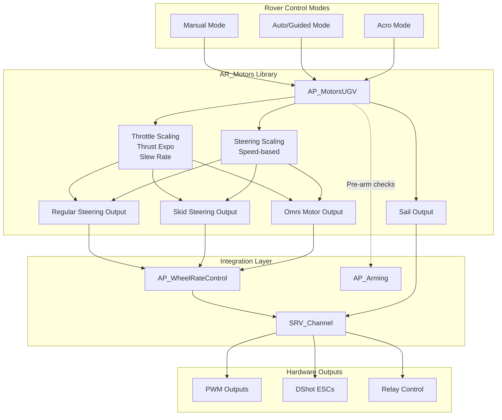

# AR_Motors (ArduRover Motors)

## Overview

The AR_Motors library provides motor control and output management for ground vehicles (rovers) in ArduPilot. This library serves as the motor output abstraction layer within the ArduRover architecture, handling diverse steering mechanisms (regular steering, skid-steering, omni-directional), throttle control with configurable thrust curves and slew rate limiting, and integration with the ArduPilot servo output system. AR_Motors supports vehicles ranging from simple car-like rovers to complex omni-directional platforms and boats with vectored thrust.

## Architecture



### Component Interactions

The AR_Motors library sits between the vehicle control modes and the hardware outputs:

1. **Input Stage**: Control modes (Manual, Auto, Guided, Acro) set desired steering (-4500 to +4500), throttle (-100 to +100), and lateral input (-100 to +100) through the AP_MotorsUGV interface
2. **Processing Stage**: The library applies thrust curve expo shaping, slew rate limiting, speed-based steering scaling, and handles frame-specific mixing (regular, skid, omni)
3. **Output Stage**: Processed motor commands are sent through SRV_Channel to hardware as PWM, OneShot, DShot, or brushed motor signals with optional relay control for direction

Source: libraries/AR_Motors/AP_MotorsUGV.h:1-252, libraries/AR_Motors/AP_MotorsUGV.cpp:1-150

## Key Components

### AP_MotorsUGV Class

The main class implementing motor control for unmanned ground vehicles (UGV).

- **Purpose**: Centralizes all motor output logic for ground vehicles
- **Lifecycle**: Constructed with AP_WheelRateControl reference → init() called with frame type → output() called at main loop rate
- **Thread Safety**: Called from main thread only; uses WITH_SEMAPHORE for SRV_Channel access
- **Hardware Dependencies**: Requires SRV_Channel configuration for motor/servo outputs
- **Singleton Access**: Available via `AP::motors_ugv()` accessor

Source: libraries/AR_Motors/AP_MotorsUGV.h:7-247

### Motor Output Functions

#### Regular Steering
- Single steering servo with single or dual throttle motors
- Ackermann steering geometry support for car-like vehicles
- Speed-based steering scaling (MOT_SPD_SCA_BASE parameter)
- Used for most car-like rovers and tracked vehicles with separate steering

#### Skid Steering
- Differential motor control (left and right throttle channels)
- Mixing steering and throttle with prioritization (MOT_STR_THR_MIX parameter)
- Thrust asymmetry support for motors with different forward/reverse performance
- Commonly used for tracked vehicles, differential-drive robots

#### Omni-Directional
- Multiple motor configurations with per-motor throttle, steering, and lateral factors
- **OMNI3**: Three motors at 120-degree spacing
- **OMNIX**: Four motors in X configuration (45-degree angles)
- **OMNIPLUS**: Four motors in plus configuration (90-degree angles)
- **OMNI3MECANUM**: Three mecanum wheels for holonomic movement
- Supports lateral (sideways) movement independent of heading

#### Vectored Thrust
- Boat configuration with motor mounted on steering servo
- Thrust vectoring angle limited by MOT_VEC_ANGLEMAX parameter
- Combined steering and propulsion through motor angle

Source: libraries/AR_Motors/AP_MotorsUGV.h:24-31, lines 88-92, lines 164-178

## Steering Control Mechanisms

### Regular Steering (Car-like Vehicles)

**Configuration**: Single steering servo (SRV_Channel function `k_steering`) and throttle motor(s)

**Steering Input Convention**:
- Range: -4500 to +4500 (representing normalized servo deflection)
- Negative values: Left turn
- Positive values: Right turn
- Zero: Straight ahead

**Speed-based Steering Scaling**: When MOT_SPD_SCA_BASE is set (default 1.0 m/s), steering output is reduced at speeds above the base speed to prevent rollovers and maintain stability. The scaling factor is `base_speed / current_speed`.

```cpp
// Example: Setting steering in manual mode (no scaling)
motors.set_steering(-2000, false);  // Turn left, no speed scaling

// Example: Setting steering in auto mode (with scaling)
motors.set_steering(3000, true);    // Turn right, apply speed scaling
```

Source: libraries/AR_Motors/AP_MotorsUGV.h:45-49, AP_MotorsUGV.cpp:91-97

### Skid Steering (Tank-style Vehicles)

**Configuration**: Separate left and right throttle channels (functions `k_throttleLeft` and `k_throttleRight`)

**Steering Mixing**: Steering input is mixed with throttle using the formula:
- Left motor = throttle - (steering × mix_factor)
- Right motor = throttle + (steering × mix_factor)

**Prioritization Parameter** (MOT_STR_THR_MIX):
- Range: 0.2 to 1.0 (default 0.5)
- Higher values (→1.0): Prioritize steering responsiveness (reduce throttle to maintain steering)
- Lower values (→0.2): Prioritize forward drive (allow steering to saturate)

**Thrust Asymmetry** (MOT_THST_ASYM): Compensates for motors that have different forward/backward performance. Value of 2.0 means motors move twice as fast forward as backward.

```cpp
// Example: Skid steering with balanced mix
motors.set_steering(1500);   // Steering input
motors.set_throttle(60);     // Throttle input
// Output mixing handled internally based on MOT_STR_THR_MIX
```

Source: libraries/AR_Motors/AP_MotorsUGV.h:88-89, AP_MotorsUGV.cpp:99-104, lines 114-119

### Omni-Directional Vehicles

**Frame Types**:

| Frame Type | Motors | Configuration | Use Case |
|------------|--------|---------------|----------|
| OMNI3 | 3 | 120° spacing | Compact holonomic platforms |
| OMNIX | 4 | 45° angles (X) | Most common omni configuration |
| OMNIPLUS | 4 | 90° angles (+) | Simpler mixing, aligned axes |
| OMNI3MECANUM | 3 | Mecanum wheels | Three-wheeled mecanum platforms |

**Motor Factor System**: Each motor has three factors defining its contribution:
- **Throttle Factor**: Contribution to forward/backward motion
- **Steering Factor**: Contribution to rotational motion
- **Lateral Factor**: Contribution to sideways motion

**Control Inputs**:
- **Throttle**: -100 to +100 (forward/backward)
- **Steering**: -4500 to +4500 (rotation left/right)
- **Lateral**: -100 to +100 (sideways left/right)

```cpp
// Example: Omni vehicle moving diagonally while rotating
motors.set_throttle(50);    // Move forward
motors.set_lateral(30);     // Move right
motors.set_steering(1000);  // Rotate right slowly
```

Source: libraries/AR_Motors/AP_MotorsUGV.h:24-31, lines 67-69, lines 152-162, lines 229-233

### Vectored Thrust (Boats)

**Configuration**: Motor mounted on steering servo for combined propulsion and steering

**Angle Limiting**: MOT_VEC_ANGLEMAX parameter defines maximum deflection angle (0-90 degrees). Zero disables vectored thrust mode.

**Behavior**: Throttle is adjusted based on steering angle to maintain forward thrust while providing steering moment. Full throttle is available when steering is neutral; throttle is reduced as steering angle increases.

```cpp
// Example: Check if vehicle has vectored thrust
if (motors.have_vectored_thrust()) {
    // Vectored thrust behavior active
    // Throttle will be automatically adjusted based on steering angle
}
```

Source: libraries/AR_Motors/AP_MotorsUGV.h:91-92, AP_MotorsUGV.cpp:106-112

## Throttle and Brake Control

### Throttle Range and Conventions

- **Range**: -100 to +100 percent
- **Negative values**: Reverse motion
- **Positive values**: Forward motion
- **Zero**: Stopped (or neutral for boats)

### Throttle Limiting Parameters

| Parameter | Description | Default | Range | Units |
|-----------|-------------|---------|-------|-------|
| MOT_THR_MIN | Minimum throttle percentage applied by autopilot | 0 | 0-20 | % |
| MOT_THR_MAX | Maximum throttle percentage applied by autopilot | 100 | 30-100 | % |

**MOT_THR_MIN Use Cases**:
- Handle ESC deadzone at low throttle
- Prevent internal combustion engines from stalling during missions
- Maintain minimum motor speed for cooling

**MOT_THR_MAX Use Cases**:
- Prevent ESC or motor overheating on electric rovers
- Limit speed for indoor or confined environments
- Reduce power consumption for extended missions

Source: libraries/AR_Motors/AP_MotorsUGV.cpp:55-71

### Slew Rate Limiting

**Purpose**: Limits the rate of throttle change to prevent:
- Battery voltage sag and brownouts (especially with NiMH batteries)
- Sudden vehicle jumps or wheelies
- Excessive current draw during acceleration
- Gear train shock loads

**Parameter**: MOT_SLEWRATE
- **Units**: Percent per second (%/s)
- **Range**: 0-1000
- **Default**: 100 (full throttle range change in 1 second)
- **Disabled**: 0 (no slew limiting)
- **NiMH Battery Recommendation**: 40 %/s to reduce current demand

**Implementation**: Applied independently to each throttle channel before output. Slew limiting is bypassed when disarmed or in motor test mode.

```cpp
// Example: Get slew-limited throttle for preview
float limited_throttle = motors.get_slew_limited_throttle(80.0, 0.02);
// For 80% throttle request with 20ms time step
```

Source: libraries/AR_Motors/AP_MotorsUGV.h:83-86, AP_MotorsUGV.cpp:73-80

### Thrust Curve Exponential Shaping

**Parameter**: MOT_THST_EXPO
- **Range**: -1.0 to +1.0
- **Default**: 0.0 (linear)
- **Positive values**: More thrust at high throttle (less sensitive at low throttle)
- **Negative values**: More thrust at low throttle (more sensitive at low throttle)

**Purpose**: Shapes throttle response to match motor/ESC characteristics or provide desired control feel. Linear response (0.0) provides equal throttle increment per stick movement across the range.

**Implementation**: Applied after slew rate limiting but before output scaling. Formula applies exponential curve while preserving throttle sign for bidirectional operation.

Source: libraries/AR_Motors/AP_MotorsUGV.cpp:82-87, lines 189-191

### Motor Reversal Delay

**Parameter**: MOT_REV_DELAY
- **Units**: Seconds
- **Range**: 0.1 to 1.0
- **Default**: 0 (disabled)

**Purpose**: Some ESCs require a delay when changing motor direction to prevent damage or allow mechanical braking to complete. When reversal delay is set, throttle goes to zero for the specified duration before outputting the new direction.

**Application**: Only affects reversible throttle channels when the commanded direction changes from forward to reverse or reverse to forward.

Source: libraries/AR_Motors/AP_MotorsUGV.h:238-244, AP_MotorsUGV.cpp:121-128

### Wheel Rate Control Integration

AR_Motors integrates with AP_WheelRateControl for closed-loop speed control using wheel encoders:
- When wheel rate control is active, throttle commands are interpreted as desired wheel speeds
- PID controller adjusts throttle output to achieve target speed
- Provides accurate speed control and odometry for navigation

```cpp
// Example: Throttle output with optional rate control
void output_throttle(SRV_Channel::Function function, float throttle, float dt) {
    // If rate control active and dt provided, use rate controller
    // Otherwise, direct throttle output with expo and limiting
}
```

Source: libraries/AR_Motors/AP_MotorsUGV.h:192-196

## Motor Output Scaling and Mixing

### Speed-based Steering Scaling

**Parameter**: MOT_SPD_SCA_BASE
- **Units**: m/s (meters per second)
- **Range**: 0-10
- **Default**: 1.0
- **Disabled**: 0

**Behavior**: When vehicle ground speed exceeds the base speed, steering output is scaled down proportionally:
```
steering_scale = min(1.0, base_speed / ground_speed)
```

**Purpose**: Prevents rollovers and maintains stability at high speeds by reducing steering authority as speed increases. Only applied when `apply_scaling` parameter is true (typically in autonomous modes).

Source: libraries/AR_Motors/AP_MotorsUGV.cpp:91-97

### Skid Steering Mixing

**Parameter**: MOT_STR_THR_MIX
- **Range**: 0.2 to 1.0
- **Default**: 0.5

**Mixing Algorithm**: Balances steering responsiveness vs forward drive capability
- **High values (0.8-1.0)**: Reduces throttle when steering is commanded, prioritizing turning ability
- **Low values (0.2-0.4)**: Maintains throttle even with steering, prioritizing forward drive
- **Middle values (0.5)**: Balanced compromise

**Saturation Handling**: When mixed outputs exceed ±100%, the library tracks saturation in `limit` flags (steer_left, steer_right, throttle_lower, throttle_upper) for use by higher-level control loops.

Source: libraries/AR_Motors/AP_MotorsUGV.h:122-127, AP_MotorsUGV.cpp:99-104

### Omni-Directional Motor Mixing

Each omni motor output is calculated as:
```
motor_output = (throttle × throttle_factor) + 
               (steering × steering_factor) + 
               (lateral × lateral_factor)
```

**Factor Configuration**: Factors are set during `setup_omni()` based on frame type:
- **OMNI3**: Three motors at 0°, 120°, 240° with appropriate trigonometric factors
- **OMNIX**: Four motors at 45°, 135°, 225°, 315° for X configuration
- **OMNIPLUS**: Four motors at 0°, 90°, 180°, 270° for plus configuration
- **OMNI3MECANUM**: Mecanum-specific factors for three-wheeled configuration

Source: libraries/AR_Motors/AP_MotorsUGV.h:152-172, lines 229-233

## PWM Output Configuration

### Supported PWM Types

| PWM Type | Value | Description | Use Case |
|----------|-------|-------------|----------|
| Normal | 0 | Standard PWM 1000-2000µs | Most ESCs and servos |
| OneShot | 1 | OneShot125 125-250µs | High-refresh ESCs |
| OneShot125 | 2 | OneShot125 protocol | High-performance multirotors |
| BrushedWithRelay | 3 | PWM duty cycle + relay for direction | Brushed DC motors with H-bridge |
| BrushedBiPolar | 4 | Separate forward/reverse PWM | Brushed motors with bipolar control |
| DShot150 | 5 | Digital 150kbit/s | Digital ESC protocol |
| DShot300 | 6 | Digital 300kbit/s | Common DShot speed |
| DShot600 | 7 | Digital 600kbit/s | High-speed DShot |
| DShot1200 | 8 | Digital 1200kbit/s | Maximum DShot speed |

**Parameter**: MOT_PWM_TYPE (requires reboot)

**Digital PWM Detection**: DShot protocols are detected as digital and receive special handling (fixed endpoints, no PWM trim).

Source: libraries/AR_Motors/AP_MotorsUGV.h:134-144, AP_MotorsUGV.cpp:30-36

### PWM Frequency for Brushed Motors

**Parameter**: MOT_PWM_FREQ
- **Units**: kHz (kilohertz)
- **Range**: 1-20
- **Default**: 16
- **Application**: Only used for brushed motor PWM types

**Purpose**: Higher frequencies (10-20 kHz) provide smoother motor operation and reduce audible noise. Lower frequencies (1-5 kHz) may be needed for some motor controllers.

Source: libraries/AR_Motors/AP_MotorsUGV.cpp:38-46

### Motor Mask Generation

The motor mask identifies which servo output channels are configured as motors (vs servos):
- Generated during initialization based on SRV_Channel function assignments
- Used by higher-level code to determine motor vs servo channels
- Affects safety output configuration and pre-arm checks

```cpp
// Example: Get motor mask for logging or diagnostics
uint32_t mask = motors.get_motor_mask();
// Each bit represents a servo output channel configured as a motor
```

Source: libraries/AR_Motors/AP_MotorsUGV.h:109-110, lines 226

### Digital vs Analog PWM Handling

**Digital PWM (DShot)**:
- Fixed output range (commands 0-2000)
- No trim or endpoint adjustment
- Bidirectional telemetry available (ESC-dependent)
- Precise motor synchronization

**Analog PWM**:
- Configurable endpoints via SRV_Channel parameters
- Trim adjustment supported
- Dead-zone compensation
- Compatible with wider range of ESCs

Source: libraries/AR_Motors/AP_MotorsUGV.h:112-113

## Safety Features

### Motor Arming Integration

**Pre-arm Checks**: Performed before vehicle can be armed
- Validates steering and throttle channels are configured
- Checks for conflicting channel assignments
- Verifies PWM type is valid
- For omni vehicles, ensures all required motors are configured
- Reports failures via GCS messages when `report` parameter is true

```cpp
// Example: Pre-arm check called by AP_Arming
if (!motors.pre_arm_check(true)) {
    // Pre-arm failed, GCS notified with specific failure
}
```

Source: libraries/AR_Motors/AP_MotorsUGV.h:106-107

### Emergency Stop / Disarm Behavior

**Parameter**: MOT_SAFE_DISARM
- **Values**: 0 = PWM enabled while disarmed, 1 = PWM disabled while disarmed
- **Default**: 0 (PWM continues when disarmed)

**Behavior When Disarmed**:
- If MOT_SAFE_DISARM = 1: All motor outputs set to trim (neutral) values
- If MOT_SAFE_DISARM = 0: Motors receive commanded outputs even when disarmed (allows motor testing)
- Slew rate limiting bypassed when disarmed
- Reversal delay not applied when disarmed

**Safety Outputs**: Separate safety output configuration defines failsafe behavior when main CPU fails or loses communication.

Source: libraries/AR_Motors/AP_MotorsUGV.h:39-43, AP_MotorsUGV.cpp:48-53

### Soft-start on Arming

When vehicle transitions from disarmed to armed:
- Throttle starts from zero regardless of stick position
- Slew rate limiting ensures gradual ramp-up
- Prevents sudden vehicle movement that could cause loss of control
- Reversal delay timer reset to prevent false reversals

**Implementation**: The output() function applies slew limiting from previous throttle state, ensuring smooth transition even when commanded throttle jumps from zero to full.

Source: libraries/AR_Motors/AP_MotorsUGV.h:184

### Motor Limit Flags

**Purpose**: Provides feedback to control loops when outputs are saturated

**Limit Structure**:
```cpp
struct AP_MotorsUGV_limit {
    uint8_t steer_left      : 1;  // Steering limited left
    uint8_t steer_right     : 1;  // Steering limited right
    uint8_t throttle_lower  : 1;  // Throttle at minimum
    uint8_t throttle_upper  : 1;  // Throttle at maximum
} limit;
```

**Usage**: Control modes check limit flags to:
- Prevent integrator windup in controllers
- Adjust navigation waypoint acceptance
- Modify speed targets when throttle saturated
- Implement anti-lockup braking

Source: libraries/AR_Motors/AP_MotorsUGV.h:122-127, lines 186-187

## Omni-Directional Vehicle Support

### Frame Type Selection

**Initialization**: Frame type set during `init()` call with frame_type parameter
```cpp
motors.init(AP_MotorsUGV::FRAME_TYPE_OMNIX);  // Initialize for X-configuration
```

### Motor Factor Configuration

Factors define each motor's contribution to vehicle motion:

**OMNI3 Configuration** (120° spacing):
```
Motor 0 (0°):    throttle=1.0,  steering=-0.33, lateral=0.0
Motor 1 (120°):  throttle=-0.5, steering=-0.33, lateral=0.866
Motor 2 (240°):  throttle=-0.5, steering=-0.33, lateral=-0.866
```

**OMNIX Configuration** (45° angles):
```
Motor 0 (45°):   throttle=0.707,  steering=-0.25, lateral=0.707
Motor 1 (135°):  throttle=0.707,  steering=-0.25, lateral=-0.707
Motor 2 (225°):  throttle=-0.707, steering=-0.25, lateral=-0.707
Motor 3 (315°):  throttle=-0.707, steering=-0.25, lateral=0.707
```

**OMNIPLUS Configuration** (90° angles):
```
Motor 0 (0°):    throttle=1.0, steering=-0.25, lateral=0.0
Motor 1 (90°):   throttle=0.0, steering=-0.25, lateral=1.0
Motor 2 (180°):  throttle=-1.0, steering=-0.25, lateral=0.0
Motor 3 (270°):  throttle=0.0, steering=-0.25, lateral=-1.0
```

### Lateral Input Control

**Lateral Input Convention**:
- Range: -100 to +100
- Negative: Move left (relative to vehicle heading)
- Positive: Move right (relative to vehicle heading)
- Zero: No lateral motion

**Holonomic Motion**: Omni vehicles can move in any direction while rotating independently:
```cpp
// Example: Strafe right while rotating left and moving forward
motors.set_throttle(40);     // 40% forward
motors.set_lateral(60);      // 60% right strafe
motors.set_steering(-2000);  // Rotate left
```

Source: libraries/AR_Motors/AP_MotorsUGV.h:24-31, lines 67-69, lines 152-162

### Omni Motor Configuration

**Motor Addition**: Each motor registered with factors:
```cpp
void add_omni_motor(int8_t motor_num, 
                    float throttle_factor, 
                    float steering_factor, 
                    float lateral_factor);
```

**Output Channel Assignment**: Motors assigned to servo functions:
- Motor 1: SRV_Channel::k_motor1
- Motor 2: SRV_Channel::k_motor2
- Motor 3: SRV_Channel::k_motor3
- Motor 4: SRV_Channel::k_motor4

**Maximum Motors**: AP_MOTORS_NUM_MOTORS_MAX = 4

Source: libraries/AR_Motors/AP_MotorsUGV.h:155-162, lines 198

## Usage Patterns

### Basic Initialization

```cpp
#include <AR_Motors/AP_MotorsUGV.h>
#include <AP_WheelEncoder/AP_WheelRateControl.h>

// Create wheel rate controller
AP_WheelRateControl rate_controller;

// Create motors object
AP_MotorsUGV motors(rate_controller);

// Initialize for regular steering vehicle
motors.init(AP_MotorsUGV::FRAME_TYPE_UNDEFINED);

// Setup servo outputs and safety
motors.setup_servo_output();
motors.setup_safety_output();
```

### Setting Steering and Throttle from Manual Mode

```cpp
// Manual mode - no scaling applied
float pilot_steering = channel_steer->norm_input() * 4500;
float pilot_throttle = channel_throttle->get_control_in();

motors.set_steering(pilot_steering, false);  // false = no scaling
motors.set_throttle(pilot_throttle);
```

### Setting Steering and Throttle from Auto Mode

```cpp
// Auto mode - with speed-based steering scaling
float desired_steering = 3000;  // Turn right
float desired_throttle = 70;    // 70% throttle

motors.set_steering(desired_steering, true);  // true = apply scaling
motors.set_throttle(desired_throttle);
```

### Omni-Directional Control with Lateral Input

```cpp
// Initialize omni vehicle (X configuration)
motors.init(AP_MotorsUGV::FRAME_TYPE_OMNIX);

// Control holonomic movement
motors.set_throttle(50);     // Move forward at 50%
motors.set_lateral(-30);     // Strafe left at 30%
motors.set_steering(1500);   // Rotate right slowly

// Output to motors (typically called at 50Hz)
motors.output(arming.is_armed(), ahrs.groundspeed(), 0.02);
```

### Motor Output Loop

```cpp
// Called from main loop (typically 50Hz)
void Rover::update_throttle() {
    // Scheduler ensures consistent dt
    float dt = scheduler.get_loop_period_s();
    
    // Get current ground speed from AHRS
    float ground_speed = ahrs.groundspeed();
    
    // Output to all motors with current armed state
    motors.output(arming.is_armed(), ground_speed, dt);
}
```

### Motor Testing Procedures

```cpp
// Test individual motor using percentage
// motor_seq: MOTOR_TEST_THROTTLE, MOTOR_TEST_STEERING, etc.
// pct: -100 to +100
bool success = motors.output_test_pct(
    AP_MotorsUGV::MOTOR_TEST_THROTTLE, 50.0);

// Test using direct PWM value
bool success = motors.output_test_pwm(
    AP_MotorsUGV::MOTOR_TEST_STEERING, 1500);

// Check for specific vehicle capabilities
if (motors.have_skid_steering()) {
    // Test left and right throttle independently
    motors.output_test_pct(AP_MotorsUGV::MOTOR_TEST_THROTTLE_LEFT, 50);
    motors.output_test_pct(AP_MotorsUGV::MOTOR_TEST_THROTTLE_RIGHT, 50);
}
```

### Checking Motor Limits

```cpp
// After calling output(), check if limits reached
if (motors.limit.throttle_upper) {
    // Maximum throttle reached, adjust target speed
    target_speed = constrain_float(target_speed, 0, current_speed);
}

if (motors.limit.steer_left || motors.limit.steer_right) {
    // Steering saturated, may need to slow down
    // or adjust navigation waypoint acceptance radius
}
```

## Configuration Parameters

| Parameter | Description | Default | Range | Units |
|-----------|-------------|---------|-------|-------|
| MOT_PWM_TYPE | PWM output type (Normal/OneShot/DShot/Brushed) | 0 (Normal) | 0-8 | - |
| MOT_PWM_FREQ | PWM frequency for brushed motors | 16 | 1-20 | kHz |
| MOT_SAFE_DISARM | Disable PWM when disarmed (0=No, 1=Yes) | 0 | 0-1 | - |
| MOT_THR_MIN | Minimum throttle percentage | 0 | 0-20 | % |
| MOT_THR_MAX | Maximum throttle percentage | 100 | 30-100 | % |
| MOT_SLEWRATE | Throttle slew rate (0=disabled) | 100 | 0-1000 | %/s |
| MOT_THST_EXPO | Thrust curve exponent | 0.0 | -1.0 to 1.0 | - |
| MOT_THST_ASYM | Thrust asymmetry (forward/backward ratio) | 1.0 | 1.0-10.0 | - |
| MOT_SPD_SCA_BASE | Speed for steering scaling (0=disabled) | 1.0 | 0-10 | m/s |
| MOT_STR_THR_MIX | Steering vs throttle mix (skid steering) | 0.5 | 0.2-1.0 | - |
| MOT_VEC_ANGLEMAX | Vectored thrust max angle (0=disabled) | 0.0 | 0-90 | deg |
| MOT_REV_DELAY | Motor reversal delay | 0 | 0.1-1.0 | s |

Source: libraries/AR_Motors/AP_MotorsUGV.cpp:29-130

## Testing with Rover SITL

### Starting Rover SITL

```bash
# Start basic rover simulation
cd ardupilot/Rover
sim_vehicle.py -v Rover --console --map

# Start with specific frame type (skid steering)
sim_vehicle.py -v Rover -f rover-skid --console --map

# Start omni vehicle
sim_vehicle.py -v Rover -f rover-skid --console --map
```

### Testing Different Vehicle Configurations

#### Regular Steering Vehicle
```bash
# Default configuration uses regular steering
# Steering on channel 1, throttle on channel 3

# Test steering
rc 1 1200    # Steer left
rc 1 1800    # Steer right
rc 1 1500    # Center steering

# Test throttle
rc 3 1600    # Forward
rc 3 1400    # Reverse
rc 3 1500    # Stop
```

#### Skid Steering Vehicle
```bash
# Configure for skid steering
param set SERVO1_FUNCTION 73  # ThrottleLeft
param set SERVO3_FUNCTION 74  # ThrottleRight

# Set skid steering mix
param set MOT_STR_THR_MIX 0.5

# Test skid steering
rc 1 1800    # Turn right (differential throttle)
rc 3 1600    # Forward on both
```

#### Omni-Directional Vehicle
```bash
# Configure OMNIX frame (4 motors at 45° angles)
param set FRAME_TYPE 2  # OMNIX

# Assign motor channels
param set SERVO1_FUNCTION 33  # Motor1
param set SERVO2_FUNCTION 34  # Motor2
param set SERVO3_FUNCTION 35  # Motor3
param set SERVO4_FUNCTION 36  # Motor4

# Test omni movement
# Throttle=forward/back, Roll=lateral, Yaw=rotation
rc 3 1600    # Forward
rc 1 1600    # Strafe right
rc 4 1600    # Rotate right
```

### Motor Testing using MAVLink

```bash
# Test throttle motor at 50% (5 seconds, sequence 1)
long DO_MOTOR_TEST 1 50 5 1

# Test steering servo at 50% (3 seconds, sequence 2)
long DO_MOTOR_TEST 2 50 3 1

# Test left throttle at 50% (skid steering, sequence 3)
long DO_MOTOR_TEST 3 50 5 1

# Test right throttle at 50% (skid steering, sequence 4)
long DO_MOTOR_TEST 4 50 5 1
```

### Parameter Configuration Examples

```bash
# Configure for NiMH batteries (prevent brownouts)
param set MOT_SLEWRATE 40

# Limit maximum throttle to 80% (prevent overheating)
param set MOT_THR_MAX 80

# Set minimum throttle to overcome deadzone
param set MOT_THR_MIN 5

# Configure speed-based steering scaling
param set MOT_SPD_SCA_BASE 2.0  # Scale steering above 2 m/s

# Set thrust expo for smoother low-throttle control
param set MOT_THST_EXPO 0.2

# Configure motor reversal delay for ESC protection
param set MOT_REV_DELAY 0.5

# Set PWM type to DShot300
param set MOT_PWM_TYPE 6
param fetch
param reboot
```

## Integration Guide

### Integration with Rover Control Modes

AR_Motors integrates with all Rover control modes:

**Manual Mode**:
- Direct pilot input to motors without scaling
- Uses `set_steering(steering, false)` to bypass speed scaling
- Slew rate limiting still applied for safety

**Acro Mode**:
- Rate-based steering control
- Throttle controls forward speed
- Uses lateral input for omni vehicles

**Steering and Hold Modes**:
- Steering controller outputs to `set_steering()` with scaling
- Maintains heading while allowing throttle control

**Auto/Guided Modes**:
- Navigation controller computes desired steering and throttle
- Speed scaling applied: `set_steering(steering, true)`
- Integrates with path following algorithms

**RTL (Return to Launch)**:
- Uses auto mode motor control
- May reduce speed near home for precision

Source: Rover vehicle mode implementations

### Connection to AP_WheelRateControl

**Purpose**: Closed-loop speed control using wheel encoders

**Integration**:
1. AR_Motors holds reference to AP_WheelRateControl
2. When wheel encoders configured, rate control is active
3. `output_throttle()` calls `get_rate_controlled_throttle()`
4. PID controller adjusts throttle to achieve target wheel speed

**Benefits**:
- Accurate speed control on slopes
- Consistent behavior across terrain
- Improved odometry for navigation

```cpp
// Rate-controlled throttle (internal)
float throttle_out = get_rate_controlled_throttle(
    SRV_Channel::k_throttle,
    desired_throttle,
    dt);
```

Source: libraries/AR_Motors/AP_MotorsUGV.h:192-196

### SRV_Channel Mapping and Configuration

**Servo Function Assignments**:

| Function | Enum | Description |
|----------|------|-------------|
| k_steering | 26 | Main steering servo |
| k_throttle | 70 | Main throttle motor |
| k_throttleLeft | 73 | Left throttle (skid steering) |
| k_throttleRight | 74 | Right throttle (skid steering) |
| k_motor1 | 33 | Omni motor 1 |
| k_motor2 | 34 | Omni motor 2 |
| k_motor3 | 35 | Omni motor 3 |
| k_motor4 | 36 | Omni motor 4 |
| k_mainsail | 89 | Sailboat mainsail |
| k_wingsail | 90 | Sailboat wing sail |
| k_mast_rotation | 91 | Sailboat mast rotation |

**Configuration**: Set via SERVOn_FUNCTION parameters (e.g., SERVO1_FUNCTION = 26 for steering on output 1)

**Output Scaling**: SRV_Channel handles PWM range mapping, trim, and reversal based on SERVOn_MIN, SERVOn_MAX, SERVOn_TRIM, SERVOn_REVERSED parameters

Source: libraries/AR_Motors/AP_MotorsUGV.h:15-22

### Relay Usage for Brushed Motor Direction Control

**Brushed Motor PWM Types**:

**BrushedWithRelay (PWM_TYPE=3)**:
- PWM controls motor speed (duty cycle)
- Relay controls direction (forward/reverse)
- Requires relay configuration on appropriate GPIO

**BrushedBiPolar (PWM_TYPE=4)**:
- Separate PWM outputs for forward and reverse
- One output active at a time
- No relay required

**Relay Configuration**:
- Relays assigned via SERVO_GPIO or relay function parameters
- Direction change handled automatically based on throttle sign
- Reversal delay applied when direction changes

Source: libraries/AR_Motors/AP_MotorsUGV.h:134-144, AP_MotorsUGV.cpp:138-141

## Implementation Notes

### Singleton Pattern Usage

The AR_Motors library implements the singleton pattern for global access:

```cpp
// Singleton instance
static AP_MotorsUGV *_singleton;

// Access via AP namespace
AP_MotorsUGV *motors = AP::motors_ugv();

// Or direct singleton access
AP_MotorsUGV *motors = AP_MotorsUGV::get_singleton();
```

**Purpose**: Provides convenient access from any Rover code without passing references through call chains.

**Thread Safety**: Singleton is set during construction (main thread). All motor operations must be called from main thread only.

Source: libraries/AR_Motors/AP_MotorsUGV.h:12-13, lines 246-251

### Main Output Loop Timing

**Typical Call Rate**: 50 Hz (every 20 ms)

**Critical Timing Requirements**:
- `output()` must be called at consistent rate for slew limiting accuracy
- `dt` parameter should reflect actual loop period
- Inconsistent timing causes throttle rate variation

**Scheduler Integration**:
```cpp
// Called from Rover scheduler at 50Hz
const AP_Scheduler::Task Rover::scheduler_tasks[] = {
    SCHED_TASK(update_throttle, 50, 100),  // 50Hz, 100us budget
    // ... other tasks
};
```

**CPU Budget**: Motor output is lightweight (typically <100µs) but includes:
- Steering/throttle scaling calculations
- Omni motor mixing (if applicable)
- Slew rate limiting
- SRV_Channel output calls

Source: libraries/AR_Motors/AP_MotorsUGV.h:94-97

### Coordinate System Conventions

**AR_Motors Coordinate System**:
- **Throttle**: Positive = forward, Negative = backward (body X-axis)
- **Steering**: Positive = right turn, Negative = left turn (body Z-axis)
- **Lateral**: Positive = right strafe, Negative = left strafe (body Y-axis)

**Input Ranges**:
- **Throttle**: -100 to +100 (percent)
- **Steering**: -4500 to +4500 (normalized servo units)
- **Lateral**: -100 to +100 (percent)

**Frame Convention**: Body frame (forward-right-down) is standard for all calculations

Source: libraries/AR_Motors/AP_MotorsUGV.h:45-69

### Special Considerations for Sailboat Controls

AR_Motors includes specialized outputs for sailboats:

**Mainsail Control** (k_mainsail function):
- Range: 0 to 100 (0 = fully eased, 100 = fully sheeted)
- Controls mainsail sheet tension
- No negative values (sails cannot push)

**Wing Sail Control** (k_wingsail function):
- Range: -100 to +100 (symmetric wing sail angle)
- Bidirectional control for symmetric foil

**Mast Rotation Control** (k_mast_rotation function):
- Range: -100 to +100
- Controls rotating mast angle for sail optimization

```cpp
// Example: Sailboat control
motors.set_mainsail(60);          // Sheet mainsail to 60%
motors.set_wingsail(30);          // Wing sail to +30
motors.set_mast_rotation(-15);    // Rotate mast -15
```

Source: libraries/AR_Motors/AP_MotorsUGV.h:70-81, lines 177-181

## Safety Considerations

### Critical Importance of Correct Motor Direction

**Pre-flight Verification Essential**: Incorrect motor direction or channel assignment can cause:
- Vehicle moving opposite to commanded direction
- Steering reversed (vehicle turns opposite to commanded)
- Skid-steering vehicle spinning uncontrollably
- Loss of control and potential crash

**Testing Procedure**:
1. Perform motor test with vehicle on blocks (wheels off ground)
2. Verify throttle forward produces forward wheel motion
3. Verify steering right turns wheels right
4. For skid steering, verify differential is correct direction
5. For omni vehicles, test each motion axis independently

### Pre-arm Check Validation

**Pre-arm Failures Prevent Arming**: Common failures include:
- Steering or throttle channel not configured
- Conflicting servo function assignments
- Invalid PWM type selected
- Omni vehicle missing required motors
- Relay configuration invalid for brushed motors

**Resolution**: Address pre-arm failure message before attempting to arm. All checks are safety-critical.

Source: libraries/AR_Motors/AP_MotorsUGV.h:106-107

### Soft-start Behavior

**Purpose**: Prevents vehicle jumping on arm

**Implementation**:
- Throttle ramps from zero using slew rate limit
- Occurs even if pilot commands full throttle immediately
- Provides operator time to react if vehicle is on ground

**Tuning**: If soft-start is too slow, increase MOT_SLEWRATE parameter. If vehicle jumps on arm, decrease MOT_SLEWRATE.

### Emergency Stop on Disarm

**Disarm Behavior** (MOT_SAFE_DISARM = 1):
- All motors immediately commanded to neutral/stop
- Prevents runaway vehicle if control is lost
- Standard safety practice for autonomous vehicles

**When to Disable** (MOT_SAFE_DISARM = 0):
- Bench testing and motor configuration
- Telemetry testing without arming
- NOT recommended for field operation

### Throttle Slew Rate for Battery Protection

**NiMH Battery Considerations**: NiMH battery packs have high internal resistance and limited current capability:
- Sudden high current draw causes voltage sag
- Voltage brownout can reset flight controller
- Loss of control during acceleration

**Recommended Setting**: MOT_SLEWRATE = 40 for NiMH batteries

**LiPo Batteries**: Can typically handle full slew rate (MOT_SLEWRATE = 100) due to low internal resistance

**Symptom of Inadequate Slew Rate**: Flight controller resets or brownout during rapid acceleration

Source: libraries/AR_Motors/AP_MotorsUGV.cpp:73-80

### Motor Overheating Protection

**Throttle Limiting**: Use MOT_THR_MAX to prevent:
- ESC overheating during prolonged high-throttle operation
- Motor overheating on high-current electric motors
- Battery overcurrent protection triggering

**Thermal Management**:
- Monitor ESC and motor temperatures during testing
- Reduce MOT_THR_MAX if consistent overheating occurs
- Consider improving cooling (airflow, heatsinks)
- For indoor vehicles, lower throttle limits may be appropriate

### Failsafe and Safety Output Configuration

**Safety Output Configuration**: Defines motor behavior when:
- Main CPU fails
- Flight controller loses power
- Receiver failsafe triggered

**Typical Safety Configuration**:
- Motors set to neutral/stop
- Steering centered
- Prevents runaway vehicle in failure scenarios

**Testing**: Trigger failsafe conditions during testing to verify safe behavior

Source: libraries/AR_Motors/AP_MotorsUGV.h:39-43

## References

### Source Files

- `libraries/AR_Motors/AP_MotorsUGV.h` - Class definition, public API, parameter declarations
- `libraries/AR_Motors/AP_MotorsUGV.cpp` - Implementation of motor control logic, output functions, parameter definitions

### Related Libraries

- **SRV_Channel** (`libraries/SRV_Channel/`) - Servo output channel management and PWM generation
- **AP_WheelRateControl** (`libraries/AP_WheelEncoder/AP_WheelRateControl.h`) - Closed-loop wheel speed control using encoders
- **AP_Arming** (`libraries/AP_Arming/`) - Arming checks and safety validation
- **AP_HAL** (`libraries/AP_HAL/`) - Hardware abstraction for PWM output and relay control

### Rover Vehicle Code Integration

- **Rover/mode.h** - Base class for Rover control modes
- **Rover/mode_manual.cpp** - Manual mode motor control (no scaling)
- **Rover/mode_auto.cpp** - Autonomous mode motor control (with scaling)
- **Rover/motor_test.cpp** - Motor testing functionality
- **Rover/Rover.cpp** - Main vehicle class with motor initialization

### External Documentation

- [ArduPilot Rover Documentation](https://ardupilot.org/rover/) - End-user documentation for Rover vehicle
- [Rover Motor Configuration](https://ardupilot.org/rover/docs/rover-motor-and-servo-configuration.html) - Detailed motor setup guide
- [Rover Frame Types](https://ardupilot.org/rover/docs/rover-first-drive.html) - Vehicle configuration examples
- [Servo Output Configuration](https://ardupilot.org/rover/docs/common-servo.html) - SRV_Channel parameter guide

---

**Last Updated**: 2025-01-30  
**ArduPilot Version**: Latest (master branch)  
**Maintainer**: ArduPilot Development Team
