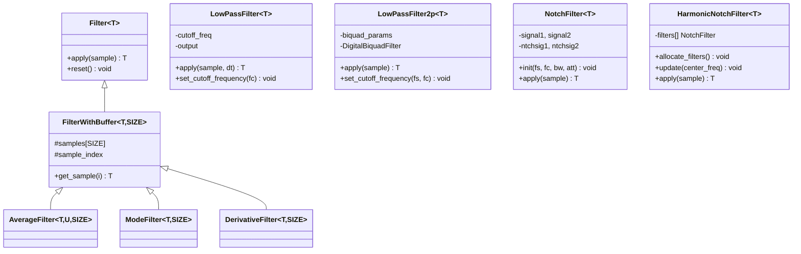
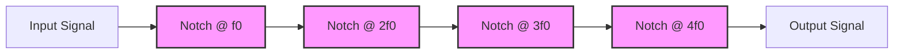

# Filter Library

## Overview

The ArduPilot Filter library provides a comprehensive suite of digital signal processing filters for noise reduction, harmonic rejection, rate limiting, and sensor fusion. This library is a critical component of the autopilot system, used throughout the codebase for filtering sensor data, smoothing control outputs, and rejecting disturbances.

**Key Capabilities:**
- **Low-Pass Filters**: First-order and second-order filters for noise reduction
- **Notch Filters**: Single and harmonic notch banks for rejecting specific frequencies
- **Statistical Filters**: Median/mode filters and moving averages for outlier rejection
- **Derivative Filters**: Timestamp-aware smoothing differentiators
- **Slew Limiters**: Rate-of-change limiting for controller stability
- **Butterworth Filters**: Pre-computed coefficient filters for common configurations
- **Parameter Integration**: EEPROM-persistent filter configuration via AP_Param

**Primary Use Cases:**
- Sensor noise reduction (IMU, barometer, GPS, compass)
- Motor noise harmonic rejection (propeller-induced vibrations)
- Control signal smoothing (attitude and position controllers)
- Outlier and spike rejection (median filters)
- Rate limiting to prevent oscillation (slew limiters)
- Complementary filtering for sensor fusion

## Architecture Overview

The Filter library is organized around a template-based inheritance hierarchy with both abstract base classes and standalone filter implementations.



### Design Patterns

**Template-Based Type Genericity**: All filters use C++ templates to support multiple data types (int8_t through uint32_t, float, Vector2f, Vector3f) without code duplication.

**Header-Only for Efficiency**: Many filters are header-only templates enabling compiler inlining and optimization. Complex filters provide explicit template instantiations in .cpp files for common types.

**Pure Virtual Interface**: The `Filter<T>` base class defines a minimal contract (`apply()` and `reset()`) that all filters implement, enabling polymorphic filter usage.

**Circular Buffer Management**: `FilterWithBuffer<T, SIZE>` provides automatic circular buffer wrap for filters requiring sample history (average, mode, derivative).

**Static Coefficients**: Butterworth filters use compile-time coefficient structs for maximum efficiency when filter parameters are known at compile time.

**Parameter Persistence**: The `AP_Filter` and `AP_Filters` classes integrate with AP_Param for EEPROM-persistent runtime filter configuration.

### Component Relationships

**Core Filter Hierarchy:**
- `Filter<T>` (FilterClass.h) - Pure virtual base interface
- `FilterWithBuffer<T, FILTER_SIZE>` (FilterWithBuffer.h) - Adds circular buffer management
- Concrete filters (AverageFilter, ModeFilter, DerivativeFilter) - Implement specific algorithms

**Standalone Filters:**
- `LowPassFilter<T>` - Variable and constant dt first-order filters
- `LowPassFilter2p<T>` - Second-order biquad low-pass
- `NotchFilter<T>` - Single notch filter
- `HarmonicNotchFilter<T>` - Bank of harmonic notches
- `Butter2<Coefficients>` - Butterworth with pre-computed coefficients
- `SlewLimiter` - Rate-of-change limiter

**ArduPilot Integration:**
- `AP_Filter` - Base class for parameter-managed filters
- `AP_NotchFilter_params` - Notch filter with AP_Param integration
- `AP_Filters` - Singleton manager for runtime configurable filters
- Filter.h - Umbrella header including all filter types

**Configuration and Compilation:**
- `AP_Filter_config.h` - Compile-time configuration (AP_FILTER_ENABLED, AP_FILTER_NUM_FILTERS)
- Enabled on boards with >1024KB program size
- 8 filter slots on large boards, 4 on medium boards
- Can be disabled on memory-constrained platforms

## Low-Pass Filters

Low-pass filters attenuate high-frequency noise while preserving low-frequency signal content. The Filter library provides three low-pass filter implementations with different trade-offs.

### First-Order Low-Pass Filter (LowPassFilter)

**Purpose**: Single-pole exponential smoothing filter suitable for general noise reduction.

**Algorithm**: Implements the discrete-time first-order RC filter:
```
output[n] = alpha * input[n] + (1 - alpha) * output[n-1]
```

Where alpha (smoothing factor) is calculated as:
```
alpha = dt / (dt + 1/(2*pi*fc))
```

**Mathematical Characteristics:**
- **Transfer Function**: H(s) = 1 / (1 + s/ωc) where ωc = 2πfc
- **Rolloff**: 20 dB/decade (-6 dB/octave) above cutoff frequency
- **Phase Delay**: Approximately 1/(2πfc) seconds at cutoff frequency
- **Step Response**: Exponential approach, no overshoot
- **Settling Time**: ~5τ where τ = 1/(2πfc) for 95% settling

**Two Implementations:**

1. **LowPassFilter<T>**: Variable dt, recalculates alpha every sample
   - Use when: Sample timing varies or updates are sporadic
   - Overhead: Alpha recalculation on each apply()
   - More accurate for non-uniform sampling

2. **LowPassFilterConstDt<T>**: Constant dt, pre-computes alpha once
   - Use when: Fixed sample rate (e.g., 400Hz main loop)
   - Overhead: Minimal, alpha computed only on set_cutoff_frequency()
   - More CPU efficient for regular sampling

**Usage Example:**
```cpp
// Constant dt low-pass filter for 400Hz gyro data
LowPassFilterConstDtFloat gyro_filter;
gyro_filter.set_cutoff_frequency(400.0f, 50.0f);  // 400Hz sample, 50Hz cutoff

// In 400Hz loop:
float filtered_gyro = gyro_filter.apply(raw_gyro);

// Variable dt low-pass filter for sporadic GPS updates
LowPassFilterFloat gps_filter;
gps_filter.set_cutoff_frequency(0.5f);  // 0.5Hz cutoff

// On GPS update:
float dt = (current_time - last_time) / 1000000.0f;  // dt in seconds
float filtered_velocity = gps_filter.apply(gps_velocity, dt);
```

**Cutoff Frequency Selection:**
- **Rule of Thumb**: fc = 1/(5τ) where τ is desired settling time
- **Nyquist Constraint**: fc << fs/2 (sample frequency / 2)
- **Balance**: Lower fc = more smoothing but more delay
- **Common Values**: 
  - Gyro: 30-100 Hz for 400Hz sampling
  - Accelerometer: 10-30 Hz for 400Hz sampling
  - Barometer: 0.1-1 Hz for slow updates
  - GPS: 0.1-0.5 Hz for navigation

**Supported Types:**
- `LowPassFilterFloat`, `LowPassFilterConstDtFloat` - Scalar float
- `LowPassFilterVector2f`, `LowPassFilterConstDtVector2f` - 2D vectors
- `LowPassFilterVector3f`, `LowPassFilterConstDtVector3f` - 3D vectors
- Integer types: int8_t through uint32_t

Source: libraries/Filter/LowPassFilter.h, libraries/Filter/LowPassFilter.cpp

### Second-Order Low-Pass Filter (LowPassFilter2p)

**Purpose**: Two-pole biquad filter providing steeper rolloff than first-order filters.

**Algorithm**: Digital biquad IIR filter using direct form II structure:
```
y[n] = b0*x[n] + b1*x[n-1] + b2*x[n-2] - a1*y[n-1] - a2*y[n-2]
```

Coefficients computed via bilinear transform from analog Butterworth prototype.

**Mathematical Characteristics:**
- **Transfer Function**: Second-order Butterworth (maximally flat passband)
- **Rolloff**: 40 dB/decade (-12 dB/octave) above cutoff frequency
- **Quality Factor**: Q = 0.707 (critically damped, Butterworth response)
- **Phase Delay**: Approximately 1/(2πfc) seconds, slightly more than first-order
- **Step Response**: Small overshoot possible with Q > 0.707
- **Attenuation**: Better stopband rejection than first-order filters

**Usage Example:**
```cpp
// Second-order low-pass for 400Hz IMU data
LowPassFilter2pFloat accel_filter;
accel_filter.set_cutoff_frequency(400.0f, 20.0f);  // 400Hz sample, 20Hz cutoff

// In main loop:
float filtered_accel = accel_filter.apply(raw_accel);

// Reset to steady-state value (e.g., at initialization)
accel_filter.reset(1.0f);  // Initialize to expected DC value
```

**When to Use Second-Order vs First-Order:**
- **Use Second-Order**: Need steeper rolloff, better attenuation above cutoff
- **Use First-Order**: Minimize phase delay, simpler and faster computation
- **Phase Delay Trade-off**: Second-order has more phase delay near cutoff
- **Computational Cost**: Second-order requires 5 multiplies vs 2 for first-order

**Stability Considerations:**
- Cutoff frequency must be < Nyquist frequency (fs/2)
- Recommended: fc < fs/10 for numerical stability
- Second-order filters more sensitive to coefficient quantization
- Use double precision for coefficient calculation, float for filtering

**Supported Types:**
- `LowPassFilter2pFloat` - Scalar float
- `LowPassFilter2pVector2f` - 2D vectors
- `LowPassFilter2pVector3f` - 3D vectors
- `LowPassFilter2pInt`, `LowPassFilter2pLong` - Integer types

Source: libraries/Filter/LowPassFilter2p.h, libraries/Filter/LowPassFilter2p.cpp

### Butterworth Filter (Butter)

**Purpose**: Pre-computed coefficient Butterworth filter for maximum efficiency when filter parameters are known at compile time.

**Algorithm**: Second-order biquad with coefficients stored in template parameter struct:
```cpp
template <class Coefficients>
class Butter2 {
    T filter(const T &input) {
        // Biquad using Coefficients::A1, A2, GAIN
    }
};
```

**Available Configurations:**

| Sample Rate | Cutoff Frequencies (Hz) |
|-------------|------------------------|
| 100 Hz      | 0.25, 0.5, 1.0, 1.5, 2.0, 3.0, 4.0, 8.0 |
| 50 Hz       | 0.125, 0.25, 0.5, 0.75, 1.0, 1.5, 2.0, 4.0 |
| 10 Hz       | 0.025, 0.05, 0.1, 0.15, 0.2, 0.3, 0.4, 0.8 |

**Proportional Scaling**: Coefficients scale proportionally: 100Hz/1Hz ≡ 50Hz/0.5Hz ≡ 10Hz/0.1Hz

**Usage Example:**
```cpp
#include <Filter/Butter.h>

// Use pre-computed coefficients for 100Hz sample, 1Hz cutoff
butter100hz1 altitude_filter;

// Initialize history to avoid transients
altitude_filter.history[0] = initial_altitude;
altitude_filter.history[1] = initial_altitude;

// In 100Hz loop:
float filtered_altitude = altitude_filter.filter(raw_altitude);
```

**Advantages:**
- No runtime coefficient calculation
- Maximum computational efficiency
- Compile-time verified filter parameters
- Ideal for embedded systems with known sample rates

**Disadvantages:**
- Limited to pre-defined sample/cutoff combinations
- Cannot change filter parameters at runtime
- Must manually initialize history buffer

**Typical Typedef Names:**
- `butter100hz0_25` - 100Hz sample, 0.25Hz cutoff
- `butter100hz1` - 100Hz sample, 1.0Hz cutoff
- `butter50hz0_5` - 50Hz sample, 0.5Hz cutoff

Source: libraries/Filter/Butter.h

## Notch Filters

Notch filters reject narrow-band noise at specific frequencies while preserving the rest of the spectrum. They are essential for eliminating motor noise, propeller harmonics, and other periodic disturbances.

### Single Notch Filter (NotchFilter)

**Purpose**: Rejects a single frequency with configurable bandwidth and attenuation.

**Algorithm**: Digital biquad IIR notch filter with zeros at center frequency:
```
Transfer function H(z) has zeros at e^(±j2πfc/fs)
creating deep attenuation at center frequency fc
```

**Design Parameters:**
- **center_freq_hz**: Frequency to reject (Hz)
- **bandwidth_hz**: Width of rejection region (Hz)
- **attenuation_dB**: Depth of notch (typically 20-40 dB)
- **Quality Factor Q**: Q = center_freq / bandwidth (higher Q = narrower notch)

**Mathematical Relationship:**
```
bandwidth_hz = center_freq_hz / Q
Q = center_freq_hz / bandwidth_hz
```

**Usage Example:**
```cpp
// Reject 60Hz motor noise in gyro data
NotchFilterFloat gyro_notch;
gyro_notch.init(400.0f,   // Sample frequency (Hz)
                60.0f,    // Center frequency (Hz)
                10.0f,    // Bandwidth (Hz) -> Q = 60/10 = 6
                30.0f);   // Attenuation (dB)

// In main loop:
float filtered_gyro = gyro_notch.apply(raw_gyro);
```

**Tuning Guidelines:**
- **Narrow Notch** (High Q): Q = 10-20, bandwidth = fc/10 to fc/20
  - Advantage: Minimal impact on nearby frequencies
  - Disadvantage: Must know exact frequency
- **Wide Notch** (Low Q): Q = 2-5, bandwidth = fc/2 to fc/5
  - Advantage: Tolerant to frequency variation
  - Disadvantage: Affects wider frequency range
- **Typical Values**: Q = 10 for motor noise, Q = 5 for propeller harmonics

**Frequency Tracking:**
- Notch filters support dynamic center frequency updates
- `need_reset` flag enables slew rate limiting for smooth transitions
- Useful for RPM-based motor noise tracking

**Supported Types:**
- `NotchFilterFloat` - Scalar float
- `NotchFilterVector2f` - 2D vectors
- `NotchFilterVector3f` - 3D vectors

Source: libraries/Filter/NotchFilter.h, libraries/Filter/NotchFilter.cpp

### Harmonic Notch Filter Bank (HarmonicNotchFilter)

**Purpose**: Manages a bank of notch filters targeting a fundamental frequency and its harmonics simultaneously. Essential for rejecting motor noise which contains energy at the fundamental RPM frequency and integer multiples (2x, 3x, 4x, etc.).

**Algorithm**: Allocates and manages multiple `NotchFilter<T>` instances, cascading them to reject multiple frequencies:
- Fundamental frequency: f₀
- Harmonics: 2f₀, 3f₀, 4f₀, ..., Nf₀
- Each harmonic gets one or more notch filters
- Supports composite notches (double/triple) for wider rejection

**Architecture:**


**Dynamic Tracking Modes:**
1. **Fixed**: Static center frequency (set once)
2. **UpdateThrottle**: Frequency proportional to throttle
3. **UpdateRPM**: Tracks RPM sensor (primary or secondary)
4. **UpdateBLHeli**: Uses BLHeli ESC telemetry for per-motor frequencies
5. **UpdateGyroFFT**: Tracks dominant frequency from gyro FFT analysis

**Composite Notch Options:**
- **Single Notch**: One notch per harmonic frequency
- **Double Notch**: Two notches per harmonic (wider rejection, ±bandwidth/2)
- **Triple Notch**: Three notches per harmonic (even wider rejection)

**Usage Example:**
```cpp
// Harmonic notch for quadcopter motor noise
HarmonicNotchFilterFloat gyro_harmonic_notch;

// Configure parameters
HarmonicNotchFilterParams params;
params.center_freq_hz = 80.0f;       // Base motor frequency
params.bandwidth_hz = 20.0f;         // Notch bandwidth
params.attenuation_dB = 30.0f;       // Attenuation depth
params.harmonics = 0b00001111;       // Enable harmonics 1,2,3,4

// Allocate filter bank
gyro_harmonic_notch.allocate_filters(
    4,        // Number of notches (one per harmonic)
    params.harmonics,
    1         // Composite notches (1=single, 2=double, 3=triple)
);

// Initialize
gyro_harmonic_notch.init(400.0f, params);

// In main loop with dynamic tracking:
float motor_rpm = get_motor_rpm();
float fundamental_freq = motor_rpm / 60.0f;  // Convert RPM to Hz
gyro_harmonic_notch.update(fundamental_freq);

// Apply filtering
float filtered_gyro = gyro_harmonic_notch.apply(raw_gyro);
```

**Harmonic Selection (Bitmask):**
```
Bit 0 (0x01): 1st harmonic (fundamental)
Bit 1 (0x02): 2nd harmonic
Bit 2 (0x04): 3rd harmonic
Bit 3 (0x08): 4th harmonic
...
Bit 15 (0x8000): 16th harmonic

Example: 0b00001111 = 0x0F = harmonics 1,2,3,4
Example: 0b00010101 = 0x15 = harmonics 1,3,5 (odd harmonics only)
```

**Configuration Guidelines:**
- **Quadcopters**: Typically need harmonics 1-4 (motors have strong 2nd harmonic)
- **Hexacopters**: May need up to 6 harmonics
- **Fixed-Wing**: Usually only fundamental needed (propeller)
- **Bandwidth**: Start with 20Hz, increase if frequency varies
- **Composite Notches**: Use double/triple if frequency tracking imprecise

**Performance Considerations:**
- Each notch adds computational cost (5-7 multiplies per sample)
- Example: 4 harmonics × 3 axes × 400Hz = 4800 filter operations/sec
- Allocate filters only when unarmed (heap allocation)
- Maximum HNF_MAX_HARMONICS = 16 harmonics

**Telemetry and Logging:**
- Logs FCN messages with current center frequencies
- Useful for verifying frequency tracking accuracy
- Can plot notch frequencies vs time in log analysis

**Advanced Features:**
- **Frequency Spreading**: Spread notch frequencies for multiple motors
- **Per-Motor Tracking**: Different frequencies for each motor (BLHeli mode)
- **Dynamic Harmonics**: Enable/disable harmonics based on flight conditions

Source: libraries/Filter/HarmonicNotchFilter.h, libraries/Filter/HarmonicNotchFilter.cpp

## Statistical Filters

Statistical filters reject outliers and smooth data using rank-order statistics or moving averages rather than frequency-domain attenuation.

### Mode/Median Filter (ModeFilter)

**Purpose**: Rank-order filter that outputs the median (or other ranked element) from a sorted sample buffer. Excellent for rejecting impulse noise and outliers.

**Algorithm**: Maintains sorted buffer using insertion sort with alternating high/low sample eviction:
1. Insert new sample into sorted buffer
2. Evict either highest or lowest sample (alternates)
3. Return element at specified rank position

**Mathematical Characteristics:**
- **Impulse Rejection**: Excellent - single outliers cannot affect median
- **Edge Preservation**: Better than averaging for step changes
- **Phase Delay**: (FILTER_SIZE-1)/2 samples
- **Computational Complexity**: O(FILTER_SIZE) per sample for insertion

**Usage Example:**
```cpp
// 5-sample median filter for spike rejection in rangefinder
ModeFilterFloat_Size5 rangefinder_filter(2);  // return_element=2 for median

// In sensor update loop:
float filtered_distance = rangefinder_filter.apply(raw_distance);
```

**Return Element Selection:**
- `return_element = 0`: Minimum value (lowest sample)
- `return_element = FILTER_SIZE/2`: Median value (middle sample)
- `return_element = FILTER_SIZE-1`: Maximum value (highest sample)

**Filter Size Recommendations:**
- **Size 3**: Fast, minimal delay, good for high-rate sensors
- **Size 5**: Balanced performance and delay (typical choice)
- **Size 7**: Better outlier rejection, more delay
- **Odd Sizes**: Always use odd sizes (3,5,7) for true median

**When to Use Median vs Low-Pass:**
- **Use Median**: Impulse noise, dropouts, intermittent interference
- **Use Low-Pass**: Gaussian noise, continuous high-frequency content
- **Combination**: Median followed by low-pass (outlier rejection + smoothing)

**Supported Types and Sizes:**
- Types: `int8_t`, `uint8_t`, `int16_t`, `uint16_t`, `float`
- Sizes: 3, 4, 5, 6, 7 (common typedefs available)
- Example typedefs: `ModeFilterFloat_Size5`, `ModeFilterUInt16_Size3`

Source: libraries/Filter/ModeFilter.h, libraries/Filter/ModeFilter.cpp

### Average Filter (AverageFilter)

**Purpose**: Simple moving average (rectangular window FIR filter) for smoothing noisy data.

**Algorithm**: Computes mean of last FILTER_SIZE samples:
```
output = (sum of last N samples) / N
```

**Two Implementations:**

1. **AverageFilter<T, U, FILTER_SIZE>**: Recalculates sum on each sample
   - More general, handles overflow risk
   - Template parameter U is larger accumulator type
   - Example: `AverageFilter<int16_t, int32_t, 5>`

2. **AverageIntegralFilter<T, U, FILTER_SIZE>**: Running sum for integers
   - More efficient: O(1) instead of O(FILTER_SIZE)
   - Incrementally updates: sum = sum - oldest + newest
   - Designed for integer types
   - Call `getf()` or `getd()` to retrieve average

**Mathematical Characteristics:**
- **Frequency Response**: Sinc function with nulls at fs/FILTER_SIZE, 2fs/FILTER_SIZE, ...
- **Phase Delay**: Linear phase, (FILTER_SIZE-1)/2 samples delay
- **Stopband Attenuation**: Poor (~13dB at first null)
- **Computational Cost**: Very low, simple addition/division

**Usage Example:**
```cpp
// 5-sample moving average for sensor smoothing
AverageFilterFloat_Size5 sensor_filter;

// In sensor loop:
float filtered_value = sensor_filter.apply(raw_sensor);

// For integral filter (more efficient):
AverageIntegralFilterFloat_Size5 efficient_filter;
efficient_filter.apply(raw_sensor);
float filtered_value = efficient_filter.getf();  // Retrieve as float
```

**Window Size Selection:**
- **Smaller Window** (2-3): Less smoothing, less delay, faster response
- **Medium Window** (4-5): Typical choice, balanced performance
- **Larger Window** (6+): More smoothing, significant delay
- **Rule of Thumb**: FILTER_SIZE = sample_rate / cutoff_freq

**Overflow Prevention:**
- Use accumulator type U large enough to hold FILTER_SIZE × max(T)
- Example: For `int16_t` values and SIZE=5: U must hold 5 × 32767 = 163835
- `int32_t` sufficient for most cases

**Comparison to Low-Pass Filters:**
- **Average**: Linear phase, poor frequency selectivity, very simple
- **Low-Pass**: Better frequency selectivity, nonlinear phase, more computation
- **Use Average**: When phase linearity important, extreme simplicity needed
- **Use Low-Pass**: Better noise rejection, frequency-domain design

**Extensive Type Support:**
- Scalar types: `int8_t` through `uint32_t`, `float`
- Common sizes: 2, 3, 4, 5
- 40+ pre-defined typedefs for common combinations

Source: libraries/Filter/AverageFilter.h

## Derivative Filter

**Purpose**: Computes smoothed time-derivative (slope) of non-uniformly sampled signals using timestamp-aware differentiation.

**Algorithm**: Holoborodko smooth low-noise differentiator adapted for variable sample timing:
- Maintains buffer of samples and microsecond timestamps
- Applies smoothing coefficients during differentiation
- Handles non-uniform sampling naturally
- Reference: http://www.holoborodko.com/pavel/numerical-methods/numerical-derivative/smooth-low-noise-differentiators/

**Key Features:**
- **Timestamp Awareness**: Uses actual microsecond timestamps for dt calculation
- **Smooth Differentiation**: Combines differentiation with smoothing (noise rejection)
- **Variable Sample Rate**: Handles irregular timing naturally
- **Cached Output**: Caches last computed slope for efficiency

**Usage Example:**
```cpp
// 7-sample derivative filter for velocity estimation
DerivativeFilterFloat_Size7 velocity_filter;

uint32_t timestamp_us = AP_HAL::micros();

// Update position samples with timestamps
velocity_filter.update(position, timestamp_us);

// Get velocity in units/second
float velocity = velocity_filter.slope();
```

**Filter Sizes:**
- **Size 5**: Minimal smoothing, faster response, more noise
- **Size 7**: Balanced (typical choice)
- **Size 9**: More smoothing, less noise, more delay
- **Size 11**: Maximum smoothing, significant delay

**Output Units:**
- Input: Any units (meters, degrees, etc.)
- Timestamps: Microseconds
- Output: Input_units per second

**When to Use:**
- Computing velocity from position
- Detecting rate of change in sensor readings
- Smoothed differentiation of noisy signals
- Applications where timestamps are readily available

**Supported Types:**
- `float` (most common)
- Pre-defined typedefs: `DerivativeFilterFloat_Size5`, `Size7`, `Size9`

Source: libraries/Filter/DerivativeFilter.h, libraries/Filter/DerivativeFilter.cpp

## Slew Limiter

**Purpose**: Prevents controller oscillation by detecting and limiting excessive slew rates (rate of change). Produces a modifier in range [0,1] that can be applied to controller gains or outputs.

**Algorithm**:
1. Compute derivative of input signal (low-passed at 25Hz)
2. Track positive and negative slew rate events
3. Detect oscillation cycles (alternating positive/negative events)
4. Generate modifier that reduces when oscillation detected
5. Apply attack/decay smoothing

**Key Features:**
- **Internal Derivative Filter**: 25Hz low-pass on derivative calculation
- **Event History**: Tracks last 2 slew events (positive/negative)
- **Cycle Detection**: Identifies complete oscillation cycles
- **Smooth Modifier**: Attack and decay time constants for gradual changes

**Usage Example:**
```cpp
// Slew limiter for PID controller
SlewLimiter rate_limiter(50.0f, 0.5f);  // 50 units/s max, 0.5s tau

float dt = 0.0025f;  // 400Hz loop (2.5ms)
float pid_output = compute_pid(...);

// Get limiter modifier [0,1]
float modifier = rate_limiter.modifier(pid_output, dt);

// Apply to output (1.0 = no limiting, <1.0 = limited)
float limited_output = pid_output * modifier;
```

**Parameters:**
- `slew_rate_max`: Maximum acceptable slew rate (units/second)
- `slew_rate_tau`: Time constant for smoothing (seconds)

**Typical Applications:**
- Preventing I-term wind-up oscillation in PID controllers
- Detecting and damping resonance modes
- Adaptive gain reduction during instability
- Protecting mechanical systems from rapid changes

**Design Considerations:**
- Set `slew_rate_max` above normal operating rates
- Only activates when sustained oscillation detected
- Does not affect steady-state performance
- Minimal overhead (one derivative calculation per update)

Source: libraries/Filter/SlewLimiter.h, libraries/Filter/SlewLimiter.cpp

## Filter Design Patterns

### Filter Selection Guide

Choosing the right filter depends on noise characteristics and system requirements:

| Noise Type | Recommended Filter | Rationale |
|------------|-------------------|-----------|
| **Broadband white noise** | LowPassFilter or LowPassFilter2p | Attenuates all high frequencies uniformly |
| **Narrow-band tones** | NotchFilter | Targets specific frequency, minimal impact elsewhere |
| **Motor harmonics** | HarmonicNotchFilter | Rejects fundamental and harmonics simultaneously |
| **Impulse spikes** | ModeFilter (median) | Rank-order rejects outliers |
| **Sensor dropouts** | ModeFilter + LowPassFilter | Median removes dropouts, low-pass smooths |
| **General smoothing** | AverageFilter | Simple, linear phase |
| **Rate limiting** | SlewLimiter | Prevents excessive derivatives |

### Cascading Filters

Filters can be cascaded (series connection) for enhanced performance:

**Series Low-Pass Filters:**
```cpp
// Two first-order filters ≈ one second-order filter
LowPassFilterConstDtFloat stage1(400.0f, 50.0f);
LowPassFilterConstDtFloat stage2(400.0f, 50.0f);

float filtered = stage2.apply(stage1.apply(raw_value));
```

Benefits:
- Steeper rolloff: N stages → 20N dB/decade
- Adjustable phase characteristics
- Computational alternative to higher-order filters

**Median + Low-Pass Combination:**
```cpp
// Reject outliers then smooth
ModeFilterFloat_Size5 median_filter(2);  // Median
LowPassFilterConstDtFloat lp_filter(400.0f, 20.0f);

float step1 = median_filter.apply(raw_value);
float filtered = lp_filter.apply(step1);
```

Benefits:
- Outlier rejection from median
- Frequency-domain smoothing from low-pass
- Best of both statistical and frequency approaches

### Complementary Filtering

Combine low-pass and high-pass filters for sensor fusion:

```cpp
// Complementary filter for IMU sensor fusion
// Low-pass on slow accurate sensor (e.g., magnetometer)
// High-pass on fast noisy sensor (e.g., gyro integration)

LowPassFilterFloat mag_filter;
mag_filter.set_cutoff_frequency(0.5f);  // 0.5 Hz cutoff

float alpha = 0.98f;  // Complementary coefficient

// Sensor fusion update:
float dt = 0.0025f;  // 400 Hz
float gyro_heading = previous_heading + gyro_rate * dt;
float mag_heading = mag_filter.apply(magnetometer_heading, dt);

// Complementary combination
float fused_heading = alpha * gyro_heading + (1 - alpha) * mag_heading;
```

Complementary filter property: Low-pass + High-pass = All-pass (unity gain)

### Parameter Persistence with AP_Param

For runtime-configurable filters integrated with ground station:

```cpp
// Using AP_Filter parameter integration
AP_NotchFilter_params notch_param;

// Parameters automatically registered in ground station:
// FILT1_TYPE, FILT1_NOTCH_FREQ, FILT1_NOTCH_Q, FILT1_NOTCH_ATT

// Setup from parameters
NotchFilterFloat my_filter;
if (notch_param.setup_notch_filter(my_filter, sample_rate)) {
    // Filter configured successfully from EEPROM parameters
}

// Parameters persist across reboots
// Can be tuned via ground station without recompiling
```

## Filter Tuning Guidelines

### Cutoff Frequency Selection

**For Low-Pass Filters:**

1. **Identify Signal Bandwidth**: Determine highest frequency in useful signal
   - IMU: Typically 0-50 Hz for vehicle dynamics
   - GPS: 0-0.5 Hz for position updates
   - Barometer: 0-1 Hz for altitude

2. **Sample Rate Constraint**: fc < fs/10 (recommended), fc < fs/2 (absolute limit)
   - Example: 400 Hz sampling → fc < 40 Hz (recommended)

3. **Phase Delay Tolerance**: Phase delay ≈ 1/(2πfc)
   - Higher fc = less delay but less filtering
   - Lower fc = more filtering but more delay
   
4. **Rule of Thumb**: fc = 1/(5τ) where τ is desired 95% settling time
   - τ = 0.1s → fc = 2 Hz
   - τ = 0.01s → fc = 20 Hz

**Common Values by Application:**
```
Gyroscope (400 Hz):     fc = 30-80 Hz (first-order) or 20-50 Hz (second-order)
Accelerometer (400 Hz): fc = 10-30 Hz
Barometer (10-50 Hz):   fc = 0.5-2 Hz
GPS (5-10 Hz):          fc = 0.2-0.5 Hz
Rangefinder (10-20 Hz): fc = 1-5 Hz
```

### Notch Filter Tuning

**Center Frequency:**
- Must know disturbance frequency accurately
- For motor noise: RPM/60 × pole_pairs
- Use FFT analysis to identify dominant frequencies
- Dynamic tracking for varying RPM

**Quality Factor (Q) and Bandwidth:**

| Q Factor | Bandwidth Ratio | Use Case |
|----------|----------------|----------|
| Q = 2    | bw = fc/2      | Frequency varies ±25% |
| Q = 5    | bw = fc/5      | Frequency varies ±10% |
| Q = 10   | bw = fc/10     | Frequency known accurately |
| Q = 20   | bw = fc/20     | Precise frequency tracking |

**Attenuation:**
- 20 dB: Mild rejection (10:1 amplitude reduction)
- 30 dB: Strong rejection (31:1 amplitude reduction)
- 40 dB: Very strong rejection (100:1 amplitude reduction)

**Stability Margin**: Ensure fc < fs/2 (Nyquist frequency)

### Sample Rate Requirements

**Minimum Sample Rate**: fs > 2 × fmax (Nyquist criterion)
- fmax is highest frequency in signal of interest

**Recommended Sample Rate**: fs > 10 × fc (for low-pass filters)
- Provides margin for filter rolloff region
- Reduces aliasing and numerical errors

**Anti-Aliasing**: Use analog anti-alias filter before ADC when possible
- Prevents high-frequency noise from folding into passband
- Digital filters cannot remove aliased content

### Damping and Stability

**Second-Order Filter Q Factor:**
- Q = 0.5: Overdamped (slow, no overshoot)
- Q = 0.707: Critically damped (Butterworth, optimal)
- Q = 1.0: Slightly underdamped (small overshoot)
- Q > 1.0: Underdamped (overshoot and ringing)

**Stability Checks:**
- All poles must be inside unit circle (for digital filters)
- Avoid cutoff frequencies near Nyquist
- Use double precision for coefficient calculation
- Test with worst-case inputs

## Filter State Initialization

Proper initialization prevents transients and overshoot at startup.

### Lazy Initialization

Most filters automatically initialize to first applied sample:

```cpp
LowPassFilterFloat filter;
filter.set_cutoff_frequency(20.0f);

// First apply() call initializes output to first sample
float filtered = filter.apply(initial_value);  // No transient
```

### Explicit Reset to Value

For known initial conditions, explicitly reset filter:

```cpp
// Reset low-pass filter to expected steady-state
LowPassFilter2pFloat altitude_filter;
altitude_filter.set_cutoff_frequency(50.0f, 1.0f);
altitude_filter.reset(initial_altitude);  // Sets internal state

// Now filtering starts from correct initial condition
```

### History Buffer Pre-Fill

For filters with delay elements (biquad, Butterworth):

```cpp
// Pre-fill Butterworth history to avoid startup transient
butter100hz1 pressure_filter;
pressure_filter.history[0] = initial_pressure;
pressure_filter.history[1] = initial_pressure;

// Filter now starts at steady-state
```

### Transient Avoidance Strategies

1. **Delay Filter Activation**: Start filtering after system stabilizes
   ```cpp
   if (system_initialized && millis() > 5000) {
       filtered_value = filter.apply(raw_value);
   } else {
       filtered_value = raw_value;  // No filtering during init
   }
   ```

2. **Gradual Cutoff Increase**: Start with very low cutoff, gradually increase
   ```cpp
   float cutoff = min(target_cutoff, startup_time * ramp_rate);
   filter.set_cutoff_frequency(cutoff);
   ```

3. **Reset on Mode Changes**: Clear filter state when context changes
   ```cpp
   if (mode_changed) {
       gyro_filter.reset();  // Clear history for new flight mode
   }
   ```

## Testing and Validation

### SITL Simulation Testing

ArduPilot's Software-In-The-Loop simulator enables filter testing without hardware:

```bash
# Start SITL with filter test parameters
sim_vehicle.py -v Copter --console --map

# In MAVProxy console:
param set INS_GYRO_FILTER 80     # Gyro low-pass cutoff
param set INS_ACCEL_FILTER 20    # Accel low-pass cutoff
param set INS_HNTCH_ENABLE 1     # Enable harmonic notch
param set INS_HNTCH_FREQ 80      # Motor base frequency
param set INS_HNTCH_BW 40        # Notch bandwidth

# Arm and fly test scenario
arm throttle
mode guided
takeoff 10

# Monitor filter performance in real-time
```

### Frequency Response Measurement

Measure filter characteristics using sine sweep:

```cpp
// Inject sine wave at varying frequencies
for (float freq = 0.1f; freq < 50.0f; freq += 0.1f) {
    float input = sinf(2.0f * M_PI * freq * time);
    float output = filter.apply(input);
    
    // Log input and output for FFT analysis
    logger.write_filter_test(freq, input, output);
}
```

Analyze logs to plot:
- Magnitude response: 20*log10(output_amplitude / input_amplitude)
- Phase response: phase(output) - phase(input)

### Phase Delay Measurement

Use cross-correlation to measure actual phase delay:

```python
# Python analysis of ArduPilot logs
import numpy as np
from scipy import signal

# Load logged input and output signals
input_signal = log['FilterInput']
output_signal = log['FilterOutput']

# Compute cross-correlation
correlation = signal.correlate(output_signal, input_signal)
lag = np.argmax(correlation)

# Phase delay in samples
phase_delay_samples = lag
phase_delay_seconds = lag / sample_rate
```

### Unit Tests

The Filter library includes comprehensive unit tests:

```bash
# Location: libraries/Filter/tests/
# Available tests:
test_averagefilter.cpp    # Tests moving average filter
test_modefilter.cpp       # Tests median filter
test_notchfilter.cpp      # Tests notch filter functionality
```

Build and run tests:
```bash
cd libraries/Filter/tests
./waf configure --board linux
./waf build --target test_notchfilter
./build/linux/tests/test_notchfilter
```

### Example Test Procedures

**Example Files:** libraries/Filter/examples/
- Derivative filter example
- LowPassFilter example  
- LowPassFilter2p example
- Butterworth filter example
- SlewLimiter example

Each example generates CSV output for analysis:
```bash
cd libraries/Filter/examples/LowPassFilter
./waf configure --board linux
./waf build
./build/linux/examples/LowPassFilter > output.csv
```

### Visualization and Analysis

Plot filter responses using provided scripts:

```bash
# Gnuplot scripts in tests/ directory
cd libraries/Filter/tests
gnuplot plot_filter_response.gnu
```

Or use MATLAB/Python for custom analysis:

```python
import pandas as pd
import matplotlib.pyplot as plt

# Load CSV output from test
data = pd.read_csv('filter_output.csv')

# Plot input vs output
plt.figure(figsize=(12,6))
plt.plot(data['time'], data['input'], label='Input')
plt.plot(data['time'], data['output'], label='Filtered')
plt.xlabel('Time (s)')
plt.ylabel('Amplitude')
plt.legend()
plt.grid(True)
plt.show()

# FFT analysis
from scipy.fft import fft, fftfreq
fft_output = fft(data['output'])
fft_freq = fftfreq(len(data), data['time'][1] - data['time'][0])
plt.plot(fft_freq[:len(fft_freq)//2], 
         20*np.log10(np.abs(fft_output[:len(fft_freq)//2])))
plt.xlabel('Frequency (Hz)')
plt.ylabel('Magnitude (dB)')
plt.title('Filter Frequency Response')
plt.grid(True)
plt.show()
```

### Performance Validation

**CPU Timing**: Measure filter computational cost:

```cpp
// Measure filter execution time
uint32_t start_us = AP_HAL::micros();

for (int i = 0; i < 1000; i++) {
    filtered = filter.apply(test_value);
}

uint32_t elapsed_us = AP_HAL::micros() - start_us;
float us_per_call = elapsed_us / 1000.0f;

// Typical results (on STM32H7 at 480 MHz):
// LowPassFilter:     0.1-0.3 µs per call
// LowPassFilter2p:   0.3-0.5 µs per call
// NotchFilter:       0.4-0.6 µs per call
// HarmonicNotch(8):  3-5 µs per call
// ModeFilter_Size5:  1-2 µs per call
```

**Numeric Accuracy**: Validate against reference implementation:

```cpp
// Compare against high-precision reference
double reference_output = reference_filter.apply(input);
float test_output = test_filter.apply(input);

float error = fabsf(test_output - (float)reference_output);
assert(error < 1e-5);  // Acceptable float precision
```

## API Reference

### Common Filter Methods

All filters implement the `Filter<T>` interface:

```cpp
template <typename T>
class Filter {
public:
    // Apply filter to new sample, return filtered result
    virtual T apply(T sample) = 0;
    
    // Reset filter to initial state (clear history)
    virtual void reset() = 0;
};
```

### LowPassFilter API

**Variable dt (non-uniform sampling):**
```cpp
LowPassFilterFloat filter;
filter.set_cutoff_frequency(cutoff_hz);
float output = filter.apply(sample, dt_seconds);
filter.reset();  // Clear state
filter.reset(initial_value);  // Reset to specific value
```

**Constant dt (uniform sampling):**
```cpp
LowPassFilterConstDtFloat filter(sample_freq_hz, cutoff_freq_hz);
filter.set_cutoff_frequency(sample_freq_hz, cutoff_freq_hz);
float output = filter.apply(sample);
float cutoff = filter.get_cutoff_freq();
filter.reset();
```

**Available Types:**
- `LowPassFilterFloat`, `LowPassFilterVector2f`, `LowPassFilterVector3f`
- `LowPassFilterConstDtFloat`, `LowPassFilterConstDtVector2f`, `LowPassFilterConstDtVector3f`

### LowPassFilter2p API

```cpp
LowPassFilter2pFloat filter(sample_freq_hz, cutoff_freq_hz);
filter.set_cutoff_frequency(sample_freq_hz, cutoff_freq_hz);
float output = filter.apply(sample);
float cutoff = filter.get_cutoff_freq();
float sample_freq = filter.get_sample_freq();
filter.reset();
filter.reset(initial_value);
```

**Available Types:**
- `LowPassFilter2pInt`, `LowPassFilter2pLong`, `LowPassFilter2pFloat`
- `LowPassFilter2pVector2f`, `LowPassFilter2pVector3f`

### NotchFilter API

```cpp
NotchFilterFloat filter;
filter.init(sample_freq_hz, center_freq_hz, bandwidth_hz, attenuation_dB);

// Or use direct Q and A parameters:
filter.init_with_A_and_Q(sample_freq_hz, center_freq_hz, A, Q);

float output = filter.apply(sample);
filter.reset();

float center = filter.center_freq_hz();
float sample = filter.sample_freq_hz();
filter.disable();  // Bypass filtering
```

**Helper Functions:**
```cpp
// Calculate A and Q from bandwidth and attenuation
float A, Q;
NotchFilterFloat::calculate_A_and_Q(center_freq, bandwidth, atten_dB, A, Q);
```

**Available Types:**
- `NotchFilterFloat`, `NotchFilterVector2f`, `NotchFilterVector3f`

### HarmonicNotchFilter API

```cpp
HarmonicNotchFilterFloat filter;

// Allocate filter bank
bool success = filter.allocate_filters(
    num_notches,       // Number of tracking sources
    harmonics_mask,    // Bitmask: 0b0111 = 1st, 2nd, 3rd harmonics
    composite_notches  // 1=single, 2=double, 3=triple
);

// Initialize with sample rate and parameters
filter.init(sample_freq_hz, params);

// Update center frequency (dynamic tracking)
filter.update(center_freq_hz);  // Single frequency
// Or multiple tracking sources:
filter.update(num_centers, center_freq_array);

// Apply filtering
Vector3f filtered = filter.apply(gyro_sample);

// Reset all notches
filter.reset();

// Logging
filter.log_notch_centers(instance, timestamp_us);
```

### ModeFilter API

```cpp
ModeFilterFloat_Size5 filter(return_element);
// return_element: 0=min, 2=median (for size 5), 4=max

float output = filter.apply(sample);
float latest = filter.get();  // Get last returned value
```

**Available Sizes:** 3, 4, 5, 6, 7
**Available Types:** Int8, UInt8, Int16, UInt16, Float

### AverageFilter API

```cpp
AverageFilterFloat_Size5 filter;  // Size 5 window
float output = filter.apply(sample);
filter.reset();
```

**AverageIntegralFilter (optimized for integers):**
```cpp
AverageIntegralFilterInt16_Size5 filter;
filter.apply(sample);  // Returns 0
float avg = filter.getf();  // Get average as float
double avg_d = filter.getd();  // Get average as double
filter.reset();
```

**Available Sizes:** 2, 3, 4, 5
**Available Types:** Int8, UInt8, Int16, UInt16, Int32, UInt32, Float

### DerivativeFilter API

```cpp
DerivativeFilterFloat_Size7 filter;  // 7-sample window
filter.update(sample, timestamp_us);  // Add sample with timestamp
float slope = filter.slope();  // Get derivative in units/second
filter.reset();
```

**Available Sizes:** 5, 7, 9, 11 samples
**Template:** `DerivativeFilter<T, FILTER_SIZE>`

### Butter (Butterworth) API

```cpp
// Use pre-defined typedef for specific sample/cutoff combination
butter100hz1 filter;  // 100Hz sample, 1Hz cutoff

// Initialize history to avoid transients
filter.history[0] = initial_value;
filter.history[1] = initial_value;

float output = filter.filter(sample);
```

**Available Combinations:**
- Sample rates: 100Hz, 50Hz, 10Hz
- Cutoff frequencies: 0.25, 0.5, 1.0, 1.5, 2.0, 3.0, 4.0, 8.0 Hz

**Custom Coefficients:**
```cpp
// Define custom coefficients
struct my_coeffs {
    static constexpr float A1 = -1.9111;
    static constexpr float A2 = 0.9149;
    static constexpr float GAIN = 0.0009446;
};

Butter2<my_coeffs> custom_filter;
```

### SlewLimiter API

```cpp
SlewLimiter limiter(slew_rate_max, slew_rate_tau);
float modifier = limiter.modifier(sample, dt_seconds);
// modifier in [0,1]: 1.0 = no limiting, <1.0 = slew detected

float slew = limiter.get_slew_rate();
```

## Mathematical Foundations

### Digital Filter Design

**Continuous to Discrete Transformation:**

Analog prototype filters (s-domain) are converted to digital filters (z-domain) using:

**Bilinear Transform:**
```
s = (2/T) * (z - 1)/(z + 1)

where T = sample period = 1/fs
```

This transform:
- Maps entire s-plane into unit circle in z-plane
- Preserves stability (stable analog → stable digital)
- Introduces frequency warping: Ω = (2/T) * tan(ωT/2)

**Impulse Invariance:**
- Samples the analog impulse response
- Used for FIR filter design
- Can cause aliasing if analog filter not band-limited

### Filter Difference Equations

**First-Order Low-Pass:**
```
y[n] = α·x[n] + (1-α)·y[n-1]

where α = Δt / (Δt + 1/(2πfc))
```

Recursive form, one delay element, 6 dB/octave rolloff.

**Second-Order Biquad (Direct Form II):**
```
y[n] = b0·x[n] + b1·x[n-1] + b2·x[n-2] - a1·y[n-1] - a2·y[n-2]
```

Coefficients computed from analog prototype via bilinear transform.

**Notch Filter:**
```
Transfer function has zeros at ejωc (center frequency)
Poles placed nearby to limit bandwidth
Q factor controls notch width
A controls attenuation depth
```

### Z-Transform and Transfer Functions

**First-Order Low-Pass:**
```
H(z) = α / (1 - (1-α)z⁻¹)

Pole at z = (1-α)
DC gain = 1
```

**Second-Order Butterworth:**
```
H(z) = (b0 + b1·z⁻¹ + b2·z⁻²) / (1 + a1·z⁻¹ + a2·z⁻²)

Poles at complex conjugate pair
Maximally flat magnitude response
```

**Notch Filter:**
```
H(z) = (1 - 2cos(ωc)z⁻¹ + z⁻²) / (denominator)

Zeros at e±jωc (on unit circle at notch frequency)
Poles inside unit circle for stability
```

### Frequency Response

**Magnitude Response:**
```
|H(ejω)| = |H(z)| evaluated at z = ejω

Expressed in dB: 20·log10(|H(ejω)|)
```

**Phase Response:**
```
φ(ω) = arg(H(ejω))

Group delay: τg(ω) = -dφ/dω
```

**Cutoff Frequency:**
- Defined at -3dB point: |H(ejωc)| = 0.707
- Half-power point

### Filter Stability

**Stability Criterion:**
All poles must be inside unit circle in z-plane:
```
|pole| < 1
```

For second-order filters:
```
|a1| < 2
|a2| < 1
|a1| < 1 + a2
```

**Checking Stability:**
```cpp
bool is_stable(float a1, float a2) {
    return (fabsf(a1) < 2.0f) && 
           (fabsf(a2) < 1.0f) && 
           (fabsf(a1) < 1.0f + a2);
}
```

## Usage Examples

### Basic Low-Pass Filtering

**Constant Sample Rate (Most Efficient):**
```cpp
#include <Filter/Filter.h>

class MySensorClass {
private:
    LowPassFilterConstDtFloat temperature_filter;
    
public:
    void init() {
        // 10 Hz sample rate, 1 Hz cutoff
        temperature_filter.set_cutoff_frequency(10.0f, 1.0f);
    }
    
    void update() {
        float raw_temp = read_temperature();
        float filtered_temp = temperature_filter.apply(raw_temp);
        
        // Use filtered_temp for control...
    }
};
```

**Variable Sample Rate:**
```cpp
#include <Filter/Filter.h>

class GPSClass {
private:
    LowPassFilterVector2f velocity_filter;
    uint32_t last_update_ms;
    
public:
    void init() {
        velocity_filter.set_cutoff_frequency(0.5f);  // 0.5 Hz cutoff
        last_update_ms = AP_HAL::millis();
    }
    
    void process_gps_update(Vector2f velocity) {
        uint32_t now_ms = AP_HAL::millis();
        float dt = (now_ms - last_update_ms) * 0.001f;
        last_update_ms = now_ms;
        
        Vector2f filtered_vel = velocity_filter.apply(velocity, dt);
        
        // Use filtered velocity...
    }
};
```

### Motor Noise Rejection with Harmonic Notch

```cpp
#include <Filter/HarmonicNotchFilter.h>

class IMUClass {
private:
    HarmonicNotchFilterVector3f gyro_notch;
    HarmonicNotchFilterParams params;
    
public:
    void init() {
        // Configure notch parameters
        params._center_freq_hz = 80.0f;      // Base motor frequency
        params._bandwidth_hz = 40.0f;        // Notch bandwidth
        params._attenuation_dB = 30.0f;      // 30 dB rejection
        params._harmonics = 0b0111;          // 1st, 2nd, 3rd harmonics
        params._tracking_mode = HarmonicNotchDynamicMode::UpdateThrottle;
        
        // Allocate 1 tracking source, 3 harmonics, single notches
        gyro_notch.allocate_filters(1, params._harmonics, 1);
        gyro_notch.init(1000.0f, params);  // 1kHz sample rate
    }
    
    void update_gyro(Vector3f gyro_raw, float throttle) {
        // Update notch center frequency based on throttle
        float motor_rpm = throttle * max_rpm;
        float motor_freq = motor_rpm / 60.0f * pole_pairs;
        gyro_notch.update(motor_freq);
        
        // Apply notch filtering
        Vector3f gyro_filtered = gyro_notch.apply(gyro_raw);
        
        // Use filtered gyro for attitude estimation...
    }
};
```

### Spike Rejection with Median Filter

```cpp
#include <Filter/Filter.h>

class RangeFinderClass {
private:
    ModeFilterFloat_Size5 distance_filter;
    
public:
    void init() {
        // Return element 2 = median for size 5
        distance_filter = ModeFilterFloat_Size5(2);
    }
    
    void update() {
        float raw_distance = read_sensor();
        
        // Median filter removes outlier spikes
        float filtered_distance = distance_filter.apply(raw_distance);
        
        // Reliable distance measurement
        if (filtered_distance < max_range && filtered_distance > min_range) {
            update_altitude(filtered_distance);
        }
    }
};
```

### Smooth Derivative Calculation

```cpp
#include <Filter/DerivativeFilter.h>

class AltitudeControlClass {
private:
    DerivativeFilterFloat_Size7 climb_rate_filter;
    
public:
    void init() {
        // 7-sample window for smooth derivative
    }
    
    void update_altitude(float altitude_m) {
        uint32_t now_us = AP_HAL::micros();
        
        // Update filter with timestamped sample
        climb_rate_filter.update(altitude_m, now_us);
        
        // Get climb rate in m/s
        float climb_rate = climb_rate_filter.slope();
        
        // Use for vertical velocity control...
    }
};
```

### Complementary Filter for Sensor Fusion

```cpp
#include <Filter/LowPassFilter.h>

class HeadingEstimatorClass {
private:
    LowPassFilterFloat mag_heading_filter;
    float fused_heading;
    
public:
    void init() {
        mag_heading_filter.set_cutoff_frequency(0.5f);  // 0.5 Hz
        fused_heading = 0.0f;
    }
    
    void update(float gyro_rate, float mag_heading, float dt) {
        // High-pass on gyro (complementary to low-pass)
        float alpha = 0.98f;
        float gyro_delta = gyro_rate * dt;
        
        // Low-pass on magnetometer
        float mag_filtered = mag_heading_filter.apply(mag_heading, dt);
        
        // Complementary fusion
        fused_heading = alpha * (fused_heading + gyro_delta) + 
                        (1.0f - alpha) * mag_filtered;
                        
        // Wrap to ±180 degrees
        fused_heading = wrap_180(fused_heading);
    }
};
```

### Rate Limiting with SlewLimiter

```cpp
#include <Filter/SlewLimiter.h>

class PIDControllerClass {
private:
    SlewLimiter rate_limiter;
    float kp, ki, kd;
    float integral;
    
public:
    void init() {
        // 100 units/s max slew, 0.5s time constant
        rate_limiter = SlewLimiter(100.0f, 0.5f);
        kp = 1.0f;
        ki = 0.5f;
        kd = 0.1f;
    }
    
    float update(float error, float dt) {
        // Calculate PID output
        integral += error * dt;
        float derivative = (error - prev_error) / dt;
        float output = kp * error + ki * integral + kd * derivative;
        prev_error = error;
        
        // Get slew limiter modifier
        float modifier = rate_limiter.modifier(output, dt);
        
        // Apply modifier to I-term to prevent wind-up oscillation
        if (modifier < 1.0f) {
            integral *= modifier;  // Reduce integral during oscillation
        }
        
        // Recompute output with limited integral
        output = kp * error + ki * integral + kd * derivative;
        return output;
    }
};
```

## Implementation Notes

### Memory Management

**Stack Allocation (Preferred):**
```cpp
// Filter allocated on stack - no heap fragmentation
LowPassFilterFloat stack_filter;
```

**Template Instantiations:**
The library provides explicit template instantiations in `.cpp` files for common types to reduce code size and compilation time.

Available instantiations:
- Numeric types: float, int, long, int8_t, uint8_t, int16_t, uint16_t, int32_t, uint32_t
- Vector types: Vector2f, Vector3f
- Common filter sizes: 2, 3, 4, 5, 6, 7 samples

### Thread Safety

**Filters are NOT thread-safe by default.**

If filters accessed from multiple threads, use semaphores:

```cpp
#include <AP_HAL/AP_HAL.h>

class ThreadSafeFilter {
private:
    HAL_Semaphore sem;
    LowPassFilterFloat filter;
    
public:
    float apply(float sample) {
        WITH_SEMAPHORE(sem);
        return filter.apply(sample);
    }
};
```

### Compile-Time Configuration

**AP_Filter Subsystem:**
Controlled by `AP_Filter_config.h`:
```cpp
#ifndef AP_FILTER_ENABLED
#define AP_FILTER_ENABLED (HAL_PROGRAM_SIZE_LIMIT_KB > 1024)
#endif

#ifndef AP_FILTER_NUM_FILTERS
#if HAL_PROGRAM_SIZE_LIMIT_KB > 1024
#define AP_FILTER_NUM_FILTERS 8
#else
#define AP_FILTER_NUM_FILTERS 4
#endif
#endif
```

Override with compiler flags:
```bash
./waf configure --define AP_FILTER_ENABLED=0  # Disable subsystem
./waf configure --define AP_FILTER_NUM_FILTERS=16  # 16 filter slots
```

## Related Modules

- **AP_InertialSensor**: Uses filters for gyro/accel data (LowPassFilter2p, HarmonicNotchFilter)
- **AC_AttitudeControl**: Uses derivative filters for rate control
- **AP_AHRS**: Uses complementary filtering for attitude estimation
- **AP_Baro**: Uses low-pass filters for altitude smoothing
- **AP_Math**: Provides Vector2f/Vector3f types used by filters
- **AP_Param**: Enables runtime filter configuration via ground station

## References

### Source Code

- **Base Classes**: libraries/Filter/FilterClass.h, FilterWithBuffer.h
- **Low-Pass**: libraries/Filter/LowPassFilter.{h,cpp}, LowPassFilter2p.{h,cpp}
- **Notch**: libraries/Filter/NotchFilter.{h,cpp}, HarmonicNotchFilter.{h,cpp}
- **Statistical**: libraries/Filter/ModeFilter.{h,cpp}, AverageFilter.h
- **Specialized**: libraries/Filter/DerivativeFilter.{h,cpp}, SlewLimiter.{h,cpp}, Butter.h
- **Integration**: libraries/Filter/AP_Filter.{h,cpp}, Filter.h
- **Examples**: libraries/Filter/examples/
- **Tests**: libraries/Filter/tests/

### External Resources

- **Holoborodko Derivative Filters**: http://www.holoborodko.com/pavel/numerical-methods/numerical-derivative/smooth-low-noise-differentiators/
- **Digital Filter Design**: "Digital Signal Processing" by Proakis & Manolakis
- **Butterworth Filters**: "Analog and Digital Filter Design" by Winder
- **ArduPilot Documentation**: https://ardupilot.org/dev/docs/apmcopter-code-overview.html

### Algorithm References

- **Biquad Implementation**: Digital biquad direct form II
- **Bilinear Transform**: Tustin's method for analog-to-digital conversion
- **Harmonic Notch**: Multi-notch bank with dynamic frequency tracking
- **Median Filter**: Rank-order statistics with insertion sort
