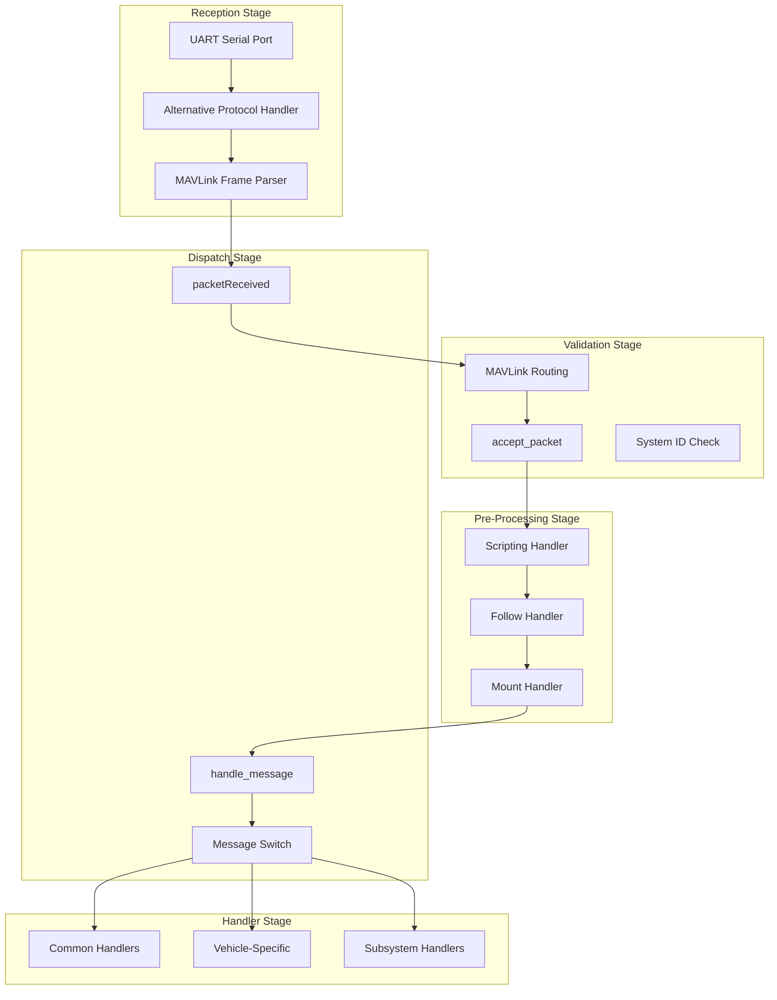
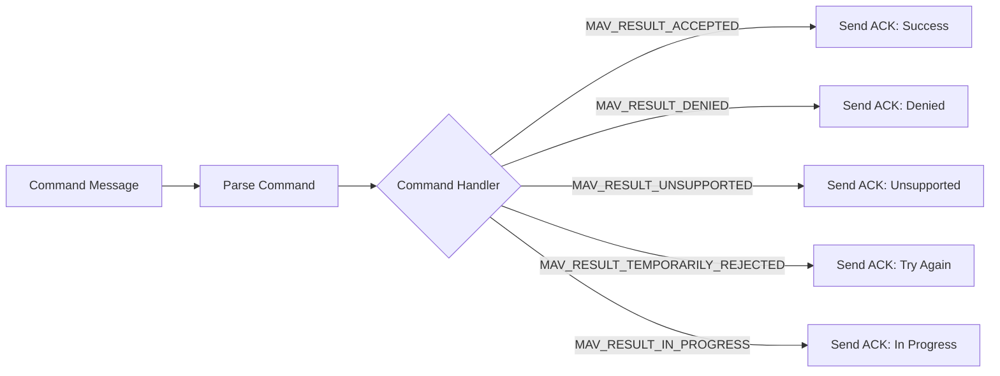
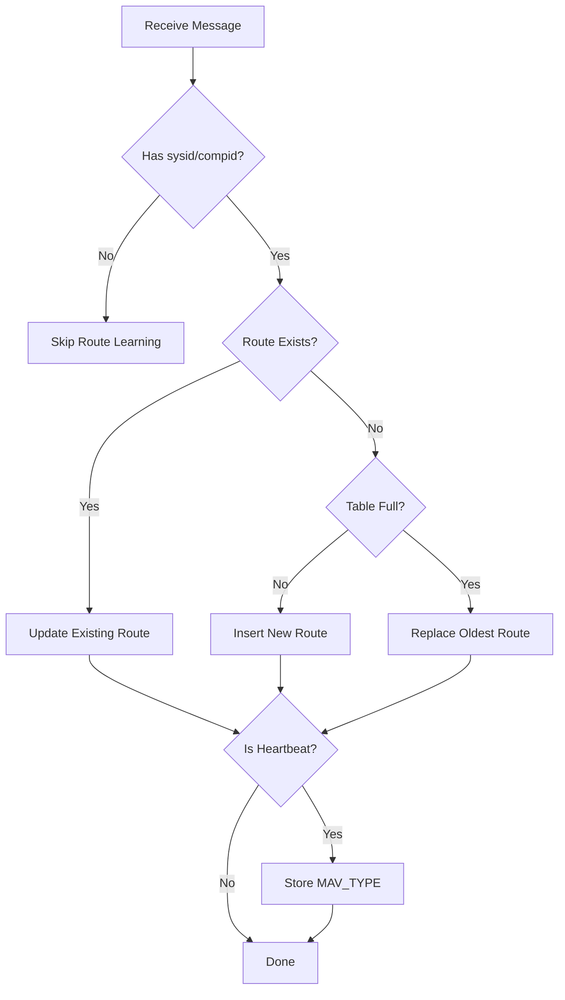
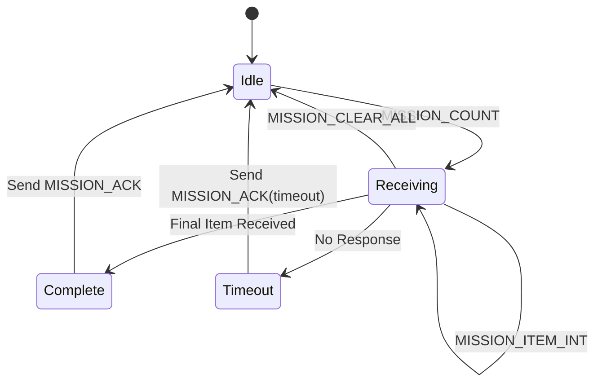
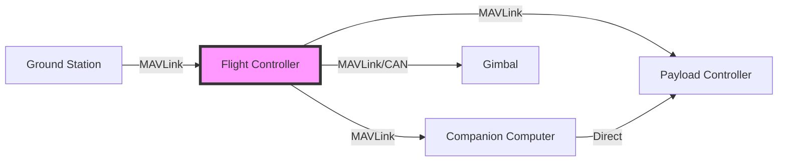

# MAVLink Message Handlers


## Table of Contents
- [Overview](#overview)
- [Message Processing Pipeline](#message-processing-pipeline)
- [Handler Registration and Dispatch](#handler-registration-and-dispatch)
- [Message Routing Architecture](#message-routing-architecture)
- [Handler Implementation Patterns](#handler-implementation-patterns)
- [Error Handling and Recovery](#error-handling-and-recovery)
- [Integration with Vehicle Subsystems](#integration-with-vehicle-subsystems)
- [Performance Considerations](#performance-considerations)
- [Testing and Debugging](#testing-and-debugging)

## Overview

The GCS_MAVLink message handling subsystem provides the core infrastructure for receiving, routing, and processing MAVLink protocol messages in ArduPilot. This documentation describes the complete message processing pipeline, from byte-level reception through final handler dispatch.

**Source Files**: 
- `/libraries/GCS_MAVLink/GCS_Common.cpp` - Core message handling implementation
- `/libraries/GCS_MAVLink/GCS.h` - Handler interface definitions
- `/libraries/GCS_MAVLink/MAVLink_routing.cpp` - Message routing logic

**Key Responsibilities**:
- Byte-level MAVLink message parsing and framing
- Message validation and protocol version handling (MAVLink1/MAVLink2)
- Multi-channel message routing with learned route tables
- Handler dispatch to appropriate subsystem implementations
- Broadcast and targeted message forwarding
- Integration with vehicle-specific command handlers

## Message Processing Pipeline

The MAVLink message processing pipeline consists of multiple stages that transform raw serial bytes into processed commands and state updates.

### Pipeline Architecture



### Stage 1: Byte Reception and Framing

**Source**: `GCS_Common.cpp:update_receive()` (lines 1902-1970)

The reception stage reads bytes from the UART serial port and attempts to frame complete MAVLink messages. This stage handles:

- **Alternative Protocol Support**: Before parsing as MAVLink, the system checks for alternative protocols (e.g., FrSky, LTM) if no MAVLink traffic has been seen for 4 seconds
- **Character-by-Character Parsing**: Uses `mavlink_frame_char_buffer()` to incrementally build message frames
- **Protocol Version Detection**: Automatically detects MAVLink1 vs MAVLink2 framing

```cpp
// Source: /libraries/GCS_MAVLink/GCS_Common.cpp:1917
const uint16_t nbytes = _port->available();
for (uint16_t i=0; i<nbytes; i++)
{
    const uint8_t c = (uint8_t)_port->read();
    const uint32_t protocol_timeout = 4000;
    
    if (alternative.handler &&
        now_ms - alternative.last_mavlink_ms > protocol_timeout) {
        // Try parsing using alternative handler
        if (alternative.handler(c, mavlink_comm_port[chan])) {
            alternative.last_alternate_ms = now_ms;
            gcs_alternative_active[chan] = true;
        }
    }
    
    // Try to get a new message
    const uint8_t framing = mavlink_frame_char_buffer(
        channel_buffer(), channel_status(), c, &msg, &status);
    if (framing == MAVLINK_FRAMING_OK) {
        hal.util->persistent_data.last_mavlink_msgid = msg.msgid;
        packetReceived(status, msg);
```

> **Note**: The update_receive() method accepts a `max_time_us` parameter (default 1000µs) to limit processing time and prevent scheduler overruns.

**Timing Constraints**:
- Maximum execution time per call: Configurable via max_time_us parameter
- Called from main scheduler loop at vehicle-specific rates (typically 50-400Hz)
- Must not block to prevent starvation of other scheduler tasks

### Stage 2: Packet Reception and Protocol Version Handling

**Source**: `GCS_Common.cpp:packetReceived()` (lines 1848-1899)

Once a complete message is framed, the `packetReceived()` method performs protocol-level handling:

```cpp
// Source: /libraries/GCS_MAVLink/GCS_Common.cpp:1848
void GCS_MAVLINK::packetReceived(const mavlink_status_t &status,
                                 const mavlink_message_t &msg)
{
    // Mark channel as active (except for radio status messages)
    if (msg.msgid != MAVLINK_MSG_ID_RADIO && 
        msg.msgid != MAVLINK_MSG_ID_RADIO_STATUS) {
        mavlink_active |= (1U<<(chan-MAVLINK_COMM_0));
    }
    
    // Auto-switch from MAVLink1 to MAVLink2 if we receive MAVLink2 packets
    const auto mavlink_protocol = uartstate->get_protocol();
    if (!(status.flags & MAVLINK_STATUS_FLAG_IN_MAVLINK1) &&
        (status.flags & MAVLINK_STATUS_FLAG_OUT_MAVLINK1) &&
        (mavlink_protocol == AP_SerialManager::SerialProtocol_MAVLink2 ||
         mavlink_protocol == AP_SerialManager::SerialProtocol_MAVLinkHL)) {
        // Switch to sending MAVLink2
        _channel_status.flags &= ~MAVLINK_STATUS_FLAG_OUT_MAVLINK1;
    }
    
    // Check routing - returns false if we shouldn't process locally
    if (!routing.check_and_forward(*this, msg)) {
        return;
    }
```

**Protocol Version Handling**:
- **MAVLink1**: Legacy 1.0 protocol with smaller headers
- **MAVLink2**: Modern protocol with extended features (signing, extensions)
- **Automatic Upgrade**: System automatically switches to MAVLink2 output when MAVLink2 input is detected
- **Compatibility**: Can simultaneously handle MAVLink1 on some channels and MAVLink2 on others

### Stage 3: Message Routing and Forwarding

**Source**: `MAVLink_routing.cpp:check_and_forward()` (lines 97-221)

The routing stage determines whether a message should be:
1. Processed locally by this autopilot
2. Forwarded to other MAVLink channels
3. Both processed locally and forwarded

#### Routing Decision Logic

The routing system implements the official MAVLink routing specification:

**Process Locally If**:
- Message has no `target_system` field (broadcast)
- Message `target_system` is 0 (broadcast)
- Message `target_system` matches our system ID and has no `target_component`
- Message `target_system` matches our system ID and `target_component` matches ours
- Message targets a system/component we haven't seen on any link (local responsibility)

**Forward to Link If**:
- Message is broadcast (no target or target_system=0)
- Message targets a system we've seen on that link
- Message targets our system but a specific component we've seen on that link

```cpp
// Source: /libraries/GCS_MAVLink/MAVLink_routing.cpp:146
// Extract targets for this packet
int16_t target_system = -1;
int16_t target_component = -1;
get_targets(msg, target_system, target_component);

bool broadcast_system = (target_system == 0 || target_system == -1);
bool broadcast_component = (target_component == 0 || target_component == -1);
bool match_system = broadcast_system || (target_system == mavlink_system.sysid);
bool match_component = match_system && (broadcast_component || 
                                        (target_component == mavlink_system.compid));
bool process_locally = match_system && match_component;
```

#### Route Learning

The routing system dynamically learns the topology of the MAVLink network:

```cpp
// Routes are learned from heartbeats and any message with source sysid/compid
learn_route(in_link, msg);

// Route table entry
struct route_entry {
    uint8_t sysid;
    uint8_t compid;
    mavlink_channel_t channel;
    uint8_t mavtype;  // MAV_TYPE from heartbeat
};
```

**Route Learning Behavior**:
- All messages update the routing table with their source sysid/compid/channel
- Heartbeat messages additionally record the `MAV_TYPE` for vehicle type queries
- Routes persist until the system reboots or a new route for the same sysid/compid is learned
- Maximum routes: Defined by routing table size (typically 20-50 entries)

### Stage 4: Pre-Processing Handlers

Before dispatching to the main handler switch, several subsystems get early access to messages:

**Source**: `GCS_Common.cpp:packetReceived()` (lines 1870-1892)

#### Scripting Integration

```cpp
// Source: /libraries/GCS_MAVLink/GCS_Common.cpp:1876
#if AP_SCRIPTING_ENABLED
{
    AP_Scripting *scripting = AP_Scripting::get_singleton();
    if (scripting != nullptr) {
        scripting->handle_message(msg, chan);
    }
}
#endif
```

**Purpose**: Allows Lua scripts to intercept and process MAVLink messages before standard handlers
**Use Cases**: Custom protocols, payload control, external sensor integration

#### Follow Mode Integration

```cpp
// Source: /libraries/GCS_MAVLink/GCS_Common.cpp:1885
#if AP_MAVLINK_FOLLOW_HANDLING_ENABLED
{
    AP_Follow *follow = AP_Follow::get_singleton();
    if (follow != nullptr) {
        follow->handle_msg(msg);
    }
}
#endif
```

**Purpose**: Processes `GLOBAL_POSITION_INT` messages from lead vehicles for follow-me mode
**Use Cases**: Formation flying, autonomous follow operations

#### Mount/Gimbal Integration

```cpp
// Source: /libraries/GCS_MAVLink/GCS_Common.cpp:1870
if (msg.msgid == MAVLINK_MSG_ID_GLOBAL_POSITION_INT) {
#if HAL_MOUNT_ENABLED
    // Allow mounts to see the location of other vehicles
    handle_mount_message(msg);
#endif
}
```

**Purpose**: Allows gimbals to track other vehicles using their position data
**Use Cases**: Camera tracking, antenna pointing

### Stage 5: Packet Acceptance Filtering

**Source**: `GCS.h:accept_packet()` (line 496)

The final validation stage before handler dispatch:

```cpp
// Source: /libraries/GCS_MAVLink/GCS_Common.cpp:1894
if (!accept_packet(status, msg)) {
    // e.g. enforce-sysid says we shouldn't look at this packet
    return;
}
handle_message(msg);
```

**Enforcement Options**:
- System ID filtering: Only process messages from specific GCS system IDs
- Component ID validation: Verify sender component ID
- Signing verification: Check MAVLink2 message signatures (if signing enabled)

**Security Note**: The `accept_packet()` method is the primary security boundary for preventing unauthorized command execution.

## Handler Registration and Dispatch

The MAVLink handler dispatch system uses a centralized switch statement combined with virtual method overrides for vehicle-specific customization.

### Main Dispatch Switch

**Source**: `GCS_Common.cpp:handle_message()` (lines 4278-4620)

The `handle_message()` method contains a comprehensive switch statement that maps message IDs to handler functions:

```cpp
// Source: /libraries/GCS_MAVLink/GCS_Common.cpp:4278
void GCS_MAVLINK::handle_message(const mavlink_message_t &msg)
{
    switch (msg.msgid) {
    
    case MAVLINK_MSG_ID_HEARTBEAT: {
        handle_heartbeat(msg);
        break;
    }
    
    case MAVLINK_MSG_ID_COMMAND_ACK: {
        handle_command_ack(msg);
        break;
    }
    
    case MAVLINK_MSG_ID_PARAM_REQUEST_LIST:
    case MAVLINK_MSG_ID_PARAM_SET:
    case MAVLINK_MSG_ID_PARAM_REQUEST_READ:
        handle_common_param_message(msg);
        break;
        
    case MAVLINK_MSG_ID_COMMAND_LONG:
        handle_command_long(msg);
        break;
        
    case MAVLINK_MSG_ID_COMMAND_INT:
        handle_command_int(msg);
        break;
    
    // ... 80+ additional message types
    }
}
```

### Handler Types and Categories

The message handlers are organized into several functional categories:

#### 1. Core Protocol Handlers

**Message Types**: `HEARTBEAT`, `SYSTEM_TIME`, `SETUP_SIGNING`, `TIMESYNC`
**Purpose**: Fundamental MAVLink protocol operations
**Implementation**: Common handlers in `GCS_Common.cpp`

```cpp
case MAVLINK_MSG_ID_HEARTBEAT: {
    handle_heartbeat(msg);  // Updates GCS connection state
    break;
}

case MAVLINK_MSG_ID_TIMESYNC:
    handle_timesync(msg);  // Time synchronization with GCS
    break;
```

#### 2. Parameter Protocol Handlers

**Message Types**: `PARAM_REQUEST_LIST`, `PARAM_SET`, `PARAM_REQUEST_READ`, `PARAM_VALUE`
**Purpose**: Parameter synchronization between GCS and autopilot
**Implementation**: `handle_common_param_message()` dispatcher

```cpp
case MAVLINK_MSG_ID_PARAM_REQUEST_LIST:
case MAVLINK_MSG_ID_PARAM_SET:
case MAVLINK_MSG_ID_PARAM_REQUEST_READ:
    handle_common_param_message(msg);
    break;
```

**Handler Details**:
- `handle_param_request_list()`: Initiates streaming of all parameters to GCS
- `handle_param_set()`: Validates and applies parameter changes from GCS
- `handle_param_request_read()`: Sends a single parameter value
- `handle_param_value()`: Receives parameter updates from other systems

#### 3. Mission Protocol Handlers

**Message Types**: Mission-related messages (upload, download, status)
**Purpose**: Mission waypoint management
**Implementation**: `MissionItemProtocol` classes

```cpp
case MAVLINK_MSG_ID_MISSION_WRITE_PARTIAL_LIST:
case MAVLINK_MSG_ID_MISSION_REQUEST_LIST:
case MAVLINK_MSG_ID_MISSION_COUNT:
case MAVLINK_MSG_ID_MISSION_CLEAR_ALL:
case MAVLINK_MSG_ID_MISSION_ITEM:
case MAVLINK_MSG_ID_MISSION_ITEM_INT:
case MAVLINK_MSG_ID_MISSION_REQUEST_INT:
case MAVLINK_MSG_ID_MISSION_REQUEST:
case MAVLINK_MSG_ID_MISSION_ACK:
case MAVLINK_MSG_ID_MISSION_SET_CURRENT:
    handle_common_mission_message(msg);
    break;
```

**Mission Protocol Features**:
- State machine for reliable upload/download
- Timeout handling and retransmission
- Partial mission updates
- Mission type differentiation (waypoints, rally, fence)

#### 4. Command Protocol Handlers

**Message Types**: `COMMAND_LONG`, `COMMAND_INT`, `COMMAND_ACK`
**Purpose**: Execute commands and report results
**Implementation**: Command dispatcher with MAV_RESULT responses

```cpp
case MAVLINK_MSG_ID_COMMAND_LONG:
    handle_command_long(msg);  // Legacy float parameter commands
    break;
    
case MAVLINK_MSG_ID_COMMAND_INT:
    handle_command_int(msg);   // Integer/location-based commands
    break;
```

**Command Handling Flow**:



**Common Commands**:
- `MAV_CMD_COMPONENT_ARM_DISARM`: Arm/disarm motors
- `MAV_CMD_NAV_TAKEOFF`: Initiate takeoff
- `MAV_CMD_NAV_LAND`: Initiate landing
- `MAV_CMD_DO_SET_MODE`: Change flight mode
- `MAV_CMD_DO_SET_HOME`: Set home position
- `MAV_CMD_PREFLIGHT_CALIBRATION`: Sensor calibration

#### 5. Sensor Data Injection Handlers

**Message Types**: External sensor messages
**Purpose**: Integrate external sensor data into estimation pipeline
**Implementation**: Forwarded to appropriate subsystem handlers

```cpp
#if AP_GPS_ENABLED
case MAVLINK_MSG_ID_GPS_RTCM_DATA:
case MAVLINK_MSG_ID_GPS_INPUT:
case MAVLINK_MSG_ID_GPS_INJECT_DATA:
    AP::gps().handle_msg(chan, msg);
    break;
#endif

#if HAL_VISUALODOM_ENABLED
case MAVLINK_MSG_ID_VISION_POSITION_ESTIMATE:
    handle_vision_position_estimate(msg);
    break;
    
case MAVLINK_MSG_ID_ODOMETRY:
    handle_odometry(msg);
    break;
#endif
```

**Supported External Sensors**:
- GPS/RTK corrections (`GPS_RTCM_DATA`)
- Vision position estimates (`VISION_POSITION_ESTIMATE`, `VICON_POSITION_ESTIMATE`)
- Visual odometry (`ODOMETRY`, `VISION_SPEED_ESTIMATE`)
- Optical flow (`OPTICAL_FLOW`)
- Distance sensors (`DISTANCE_SENSOR`)
- Obstacle detection (`OBSTACLE_DISTANCE`, `OBSTACLE_DISTANCE_3D`)

#### 6. Subsystem-Specific Handlers

Many messages are forwarded to specialized subsystem handlers:

```cpp
// Logger subsystem
#if HAL_LOGGING_ENABLED
case MAVLINK_MSG_ID_LOG_REQUEST_LIST:
case MAVLINK_MSG_ID_LOG_REQUEST_DATA:
case MAVLINK_MSG_ID_LOG_ERASE:
case MAVLINK_MSG_ID_LOG_REQUEST_END:
case MAVLINK_MSG_ID_REMOTE_LOG_BLOCK_STATUS:
    AP::logger().handle_mavlink_msg(*this, msg);
    break;
#endif

// Camera subsystem
#if AP_CAMERA_ENABLED
case MAVLINK_MSG_ID_DIGICAM_CONTROL:
case MAVLINK_MSG_ID_GOPRO_HEARTBEAT:
case MAVLINK_MSG_ID_CAMERA_INFORMATION:
{
    AP_Camera *camera = AP::camera();
    if (camera != nullptr) {
        camera->handle_message(chan, msg);
    }
    break;
}
#endif

// Mount/Gimbal subsystem
#if HAL_MOUNT_ENABLED
case MAVLINK_MSG_ID_GIMBAL_REPORT:
case MAVLINK_MSG_ID_GIMBAL_DEVICE_INFORMATION:
case MAVLINK_MSG_ID_GIMBAL_DEVICE_ATTITUDE_STATUS:
case MAVLINK_MSG_ID_GIMBAL_MANAGER_SET_ATTITUDE:
case MAVLINK_MSG_ID_GIMBAL_MANAGER_SET_PITCHYAW:
    handle_mount_message(msg);
    break;
#endif
```

### Vehicle-Specific Handler Overrides

Vehicle types (Copter, Plane, Rover, Sub) can override the base `handle_message()` method to add vehicle-specific message handling:

**Source**: Vehicle-specific GCS_Mavlink.cpp files (e.g., `/ArduCopter/GCS_Mavlink.cpp`)

```cpp
// Example: Vehicle-specific override pattern
void GCS_MAVLINK_Vehicle::handle_message(const mavlink_message_t &msg)
{
    switch (msg.msgid) {
    
    case MAVLINK_MSG_ID_VEHICLE_SPECIFIC:
        handle_vehicle_specific_message(msg);
        break;
        
    default:
        // Fall through to common handler
        GCS_MAVLINK::handle_message(msg);
        break;
    }
}
```

**Vehicle-Specific Message Examples**:
- **Copter**: Manual control interpretation for acro mode
- **Plane**: QuadPlane-specific commands
- **Rover**: Steering and throttle overrides
- **Sub**: Lights and camera tilt control

### Handler Registration Pattern

Unlike some systems with dynamic handler registration, ArduPilot uses compile-time static dispatch through switch statements. This approach provides:

**Advantages**:
- Zero runtime overhead for handler lookup
- Guaranteed handler coverage at compile time
- Easy to audit which messages are handled
- Predictable code flow for debugging
- Optimal code generation and inlining

**Disadvantages**:
- Adding new messages requires modifying switch statement
- No runtime extensibility without recompilation
- Large switch statements can impact maintainability

## Message Routing Architecture

The MAVLink routing subsystem implements a learned routing table that dynamically builds a network topology map as messages are received.

### Routing Table Structure

**Source**: `MAVLink_routing.h` and `MAVLink_routing.cpp`

```cpp
// Route table entry structure
struct route_entry {
    uint8_t sysid;              // Source system ID
    uint8_t compid;             // Source component ID  
    mavlink_channel_t channel;  // Channel where system/component was seen
    uint8_t mavtype;            // MAV_TYPE from heartbeat (for queries)
};

// Routing class
class MAVLink_routing {
private:
    route_entry routes[MAVLINK_MAX_ROUTES];
    uint8_t num_routes;
    uint8_t no_route_mask;  // Channels to exclude from routing
    
public:
    bool check_and_forward(GCS_MAVLINK &in_link, const mavlink_message_t &msg);
    void learn_route(GCS_MAVLINK &link, const mavlink_message_t &msg);
    bool find_by_mavtype(uint8_t mavtype, uint8_t &sysid, uint8_t &compid, 
                         mavlink_channel_t &channel);
    void send_to_components(uint32_t msgid, const char *pkt, uint8_t pkt_len);
};
```

### Route Learning Process

**Source**: `MAVLink_routing.cpp:learn_route()`

Routes are learned from any message with a valid source system ID and component ID:



**Route Learning Behavior**:
1. Every message updates the routing table with its source
2. If a route already exists for that sysid/compid, the channel is updated
3. If the table is full, the oldest route may be replaced
4. Heartbeat messages additionally record the MAV_TYPE for vehicle type queries
5. Private channels record routes but don't forward messages (except specific cases)

### Routing Decision Algorithm

**Source**: `MAVLink_routing.cpp:check_and_forward()` (lines 97-221)

The routing algorithm implements the MAVLink routing specification:

```cpp
// Source: /libraries/GCS_MAVLink/MAVLink_routing.cpp:146
// Extract message targets
int16_t target_system = -1;
int16_t target_component = -1;
get_targets(msg, target_system, target_component);

// Determine if broadcast or targeted
bool broadcast_system = (target_system == 0 || target_system == -1);
bool broadcast_component = (target_component == 0 || target_component == -1);

// Check if message matches our system
bool match_system = broadcast_system || (target_system == mavlink_system.sysid);
bool match_component = match_system && (broadcast_component || 
                                        (target_component == mavlink_system.compid));

// Decide if we should process locally
bool process_locally = match_system && match_component;
```

### Routing Scenarios

#### Scenario 1: Broadcast Message

**Example**: GCS sends `HEARTBEAT` with target_system=0

```
Message: HEARTBEAT
  sysid: 255 (GCS)
  compid: 190 (MAV_COMP_ID_MISSIONPLANNER)
  target_system: 0 (broadcast)
  
Decision:
  ✓ Process locally (broadcast)
  ✓ Forward to all other channels (broadcast)
```

#### Scenario 2: Targeted to Our System

**Example**: GCS sends `PARAM_SET` to autopilot

```
Message: PARAM_SET
  sysid: 255 (GCS)
  compid: 190
  target_system: 1 (our sysid)
  target_component: 1 (autopilot)
  
Decision:
  ✓ Process locally (matches our sysid and compid)
  ✗ Do not forward (specific to us)
```

#### Scenario 3: Targeted to Component on Another Channel

**Example**: GCS sends `GIMBAL_MANAGER_SET_ATTITUDE` to gimbal

```
Message: GIMBAL_MANAGER_SET_ATTITUDE
  sysid: 255 (GCS)
  compid: 190
  target_system: 1 (our sysid)
  target_component: 154 (gimbal, seen on CAN channel)
  
Decision:
  ✗ Do not process locally (not our compid)
  ✓ Forward to channel where compid 154 was seen
```

#### Scenario 4: Targeted to Different System

**Example**: Multi-vehicle setup, message for another vehicle

```
Message: COMMAND_LONG
  sysid: 255 (GCS)
  compid: 190
  target_system: 2 (different vehicle)
  target_component: 1
  
Decision:
  ✗ Do not process locally (not our sysid)
  ✓ Forward to channel where sysid 2 was seen
```

### Forwarding Implementation

**Source**: `MAVLink_routing.cpp:check_and_forward()` (lines 174-213)

When forwarding is required, the system iterates through learned routes:

```cpp
// Source: /libraries/GCS_MAVLink/MAVLink_routing.cpp:178
bool forwarded = false;
bool sent_to_chan[MAVLINK_COMM_NUM_BUFFERS];
memset(sent_to_chan, 0, sizeof(sent_to_chan));

for (uint8_t i=0; i<num_routes; i++) {
    GCS_MAVLINK *out_link = gcs().chan(routes[i].channel);
    if (out_link == nullptr) {
        continue;
    }
    
    // Skip private channels unless exact target match
    if (out_link->is_private() &&
        (target_system != routes[i].sysid ||
         target_component != routes[i].compid)) {
        continue;
    }
    
    // Forward if broadcast or target matches this route
    if (broadcast_system || 
        (target_system == routes[i].sysid &&
         (broadcast_component || target_component == routes[i].compid ||
          !match_system))) {
        
        // Don't send back on same channel, and only once per channel
        if (&in_link != out_link && !sent_to_chan[routes[i].channel]) {
            if (out_link->check_payload_size(msg.len)) {
                _mavlink_resend_uart(routes[i].channel, &msg);
            }
            sent_to_chan[routes[i].channel] = true;
            forwarded = true;
        }
    }
}
```

**Forwarding Rules**:
1. Never forward back to the receiving channel
2. Only forward once per channel (even if multiple routes exist)
3. Check buffer space before forwarding
4. Skip private channels unless target exactly matches their sysid/compid
5. Respect the no_route_mask for channels that shouldn't forward

### Private Channels

Private channels are point-to-point connections that don't participate in general message forwarding:

**Source**: `GCS.h:set_channel_private()`, `MAVLink_routing.cpp`

```cpp
// Mark a channel as private
static void set_channel_private(mavlink_channel_t chan);

// Check if channel is private
static bool is_private(mavlink_channel_t chan) {
    return (mavlink_private & (1U<<(unsigned)chan)) != 0;
}
```

**Private Channel Behavior**:
- Still learns routes from received messages
- Still processes messages locally if targeted appropriately
- Does NOT forward broadcast messages
- Does NOT forward messages unless exact target match
- Used for: Direct companion computer links, payload controllers, special protocols

**Use Cases**:
- Companion computer on dedicated serial port
- Camera controller with private protocol
- Payload computer requiring isolated communication
- Preventing broadcast spam on low-bandwidth links

### Send to Components

**Source**: `MAVLink_routing.cpp:send_to_components()` (lines 228-277)

Special routing function to send messages to all components with our system ID:

```cpp
// Source: /libraries/GCS_MAVLink/MAVLink_routing.cpp:228
void MAVLink_routing::send_to_components(uint32_t msgid, const char *pkt, 
                                         uint8_t pkt_len)
{
    bool sent_to_chan[MAVLINK_COMM_NUM_BUFFERS] {};
    
    // Check learned routes
    for (uint8_t i=0; i<num_routes; i++) {
        if (routes[i].sysid != mavlink_system.sysid) {
            // Not our system ID
            continue;
        }
        if (sent_to_chan[routes[i].channel]) {
            // Already sent on this channel
            continue;
        }
        // Check space and send
        if (comm_get_txspace(routes[i].channel) >= 
            packet_overhead + max_msg_len) {
            _mav_finalize_message_chan_send(routes[i].channel, msgid, pkt, 
                                           min_msg_len, max_msg_len, crc_extra);
            sent_to_chan[routes[i].channel] = true;
        }
    }
}
```

**Purpose**: Send messages to all companion components (e.g., camera, gimbal) with our system ID
**Example Use**: Broadcasting a parameter change notification to all components

### Route Queries

The routing table can be queried to find specific vehicle or component types:

```cpp
// Find by MAV_TYPE
bool find_by_mavtype(uint8_t mavtype, uint8_t &sysid, uint8_t &compid, 
                     mavlink_channel_t &channel);

// Find by MAV_TYPE and component ID
bool find_by_mavtype_and_compid(uint8_t mavtype, uint8_t compid, 
                                uint8_t &sysid, mavlink_channel_t &channel);
```

**Use Cases**:
- Finding a gimbal component: `find_by_mavtype(MAV_TYPE_GIMBAL, ...)`
- Locating a companion computer: `find_by_mavtype_and_compid(MAV_TYPE_ONBOARD_CONTROLLER, MAV_COMP_ID_ONBOARD_COMPUTER, ...)`
- Determining if a lead vehicle exists for follow mode

## Handler Implementation Patterns

This section describes common patterns and best practices for implementing MAVLink message handlers.

### Basic Handler Pattern

A typical message handler follows this structure:

```cpp
void GCS_MAVLINK::handle_example_message(const mavlink_message_t &msg)
{
    // 1. Decode the message
    mavlink_example_message_t packet;
    mavlink_msg_example_message_decode(&msg, &packet);
    
    // 2. Validate inputs
    if (packet.value < MIN_VALUE || packet.value > MAX_VALUE) {
        // Send error to GCS
        send_text(MAV_SEVERITY_WARNING, "Invalid value: %f", packet.value);
        return;
    }
    
    // 3. Check system state / preconditions
    if (!hal.util->get_soft_armed()) {
        send_text(MAV_SEVERITY_WARNING, "Cannot execute while disarmed");
        return;
    }
    
    // 4. Perform the action
    bool success = subsystem->set_value(packet.value);
    
    // 5. Send acknowledgment (for command-type messages)
    if (msg.msgid == MAVLINK_MSG_ID_COMMAND_LONG ||
        msg.msgid == MAVLINK_MSG_ID_COMMAND_INT) {
        mavlink_msg_command_ack_send(
            chan,
            packet.command,
            success ? MAV_RESULT_ACCEPTED : MAV_RESULT_FAILED
        );
    }
    
    // 6. Log the action
    if (success) {
        AP::logger().Write_Event(LogEvent::EXAMPLE_ACTION);
    }
}
```

### Command Handler Pattern

Commands (COMMAND_LONG and COMMAND_INT) use a standardized pattern with MAV_RESULT responses:

**Source**: `GCS_Common.cpp:handle_command_long()`, `handle_command_int()`

```cpp
void GCS_MAVLINK::handle_command_int(const mavlink_message_t &msg)
{
    // Decode command
    mavlink_command_int_t packet;
    mavlink_msg_command_int_decode(&msg, &packet);
    
    // Dispatch to specific command handler
    MAV_RESULT result = MAV_RESULT_UNSUPPORTED;
    
    switch (packet.command) {
    case MAV_CMD_COMPONENT_ARM_DISARM:
        result = handle_command_component_arm_disarm(packet);
        break;
        
    case MAV_CMD_DO_SET_HOME:
        result = handle_command_do_set_home(packet);
        break;
        
    case MAV_CMD_DO_FOLLOW:
        result = handle_command_do_follow(packet, msg);
        break;
        
    // ... many more commands
    
    default:
        // Try vehicle-specific handler
        result = handle_command_int_packet(packet, msg);
        break;
    }
    
    // Send acknowledgment
    mavlink_msg_command_ack_send(
        chan,
        packet.command,
        result,
        0,  // progress (0-100, or 255 for unknown)
        0,  // result_param2
        msg.sysid,
        msg.compid
    );
}
```

**MAV_RESULT Values**:
- `MAV_RESULT_ACCEPTED`: Command executed successfully
- `MAV_RESULT_TEMPORARILY_REJECTED`: Try again later (e.g., system busy)
- `MAV_RESULT_DENIED`: Command rejected due to policy/safety
- `MAV_RESULT_UNSUPPORTED`: Command not implemented
- `MAV_RESULT_FAILED`: Command failed during execution
- `MAV_RESULT_IN_PROGRESS`: Command executing, ACK will follow

### Asynchronous Command Pattern

Some commands take time to execute and use the IN_PROGRESS pattern:

**Source**: `GCS.h:GCS_MAVLINK_InProgress` (lines 134-168)

```cpp
// Start long-running operation
MAV_RESULT handle_command_long_operation(const mavlink_command_int_t &packet)
{
    // Get task tracker
    auto *task = GCS_MAVLINK_InProgress::get_task(
        packet.command,
        GCS_MAVLINK_InProgress::Type::SD_FORMAT,
        packet.sysid,
        packet.compid,
        chan
    );
    
    if (task == nullptr) {
        return MAV_RESULT_TEMPORARILY_REJECTED;  // Busy
    }
    
    // Start the operation
    if (!start_operation()) {
        task->abort();
        return MAV_RESULT_FAILED;
    }
    
    // Send IN_PROGRESS ack
    task->send_in_progress();
    
    return MAV_RESULT_ACCEPTED;
}

// Later, when operation completes:
void operation_complete_callback(bool success)
{
    auto *task = GCS_MAVLINK_InProgress::get_active_task();
    if (task != nullptr) {
        task->conclude(success ? MAV_RESULT_ACCEPTED : MAV_RESULT_FAILED);
    }
}
```

**Use Cases**:
- SD card formatting
- Compass calibration
- Airspeed calibration
- Firmware update

### Parameter Protocol Pattern

Parameter handlers use the AP_Param system for persistence:

```cpp
void GCS_MAVLINK::handle_param_set(const mavlink_message_t &msg)
{
    mavlink_param_set_t packet;
    mavlink_msg_param_set_decode(&msg, &packet);
    
    // Find the parameter
    AP_Param *vp;
    enum ap_var_type var_type;
    vp = AP_Param::find(packet.param_id, &var_type);
    
    if (vp == nullptr) {
        // Parameter not found
        send_text(MAV_SEVERITY_WARNING, "Param %s not found", packet.param_id);
        return;
    }
    
    // Validate parameter bounds
    if (!vp->check_value(packet.param_value, var_type)) {
        send_text(MAV_SEVERITY_WARNING, "Param %s: invalid value", packet.param_id);
        return;
    }
    
    // Set and save parameter
    vp->set_value(var_type, packet.param_value);
    vp->save();
    
    // Send parameter value back to confirm
    send_parameter_value(packet.param_id, var_type, packet.param_value);
}
```

### Mission Protocol Pattern

Mission upload/download uses a state machine with timeout handling:

**Source**: `MissionItemProtocol_Waypoints.cpp`



### Buffer Management Pattern

Always check buffer space before sending messages:

```cpp
bool GCS_MAVLINK::send_example_message(uint32_t value)
{
    // Check if message will fit in output buffer
    CHECK_PAYLOAD_SIZE(EXAMPLE_MESSAGE);
    
    // Send the message
    mavlink_msg_example_message_send(
        chan,
        value,
        AP_HAL::millis()
    );
    
    return true;
}
```

**Macros for Buffer Checking**:
- `CHECK_PAYLOAD_SIZE(id)`: Returns false if message won't fit
- `CHECK_PAYLOAD_SIZE2(id)`: For use with explicit channel variable
- `HAVE_PAYLOAD_SPACE(chan, id)`: Boolean expression for buffer check

### Subsystem Delegation Pattern

Many messages are forwarded to subsystem-specific handlers:

```cpp
case MAVLINK_MSG_ID_GPS_INJECT_DATA:
    // Let GPS subsystem handle GPS-specific messages
    AP::gps().handle_msg(chan, msg);
    break;

case MAVLINK_MSG_ID_LOG_REQUEST_LIST:
    // Let logger handle log-related messages
    AP::logger().handle_mavlink_msg(*this, msg);
    break;

case MAVLINK_MSG_ID_CAMERA_INFORMATION:
{
    // Let camera subsystem handle camera messages
    AP_Camera *camera = AP::camera();
    if (camera != nullptr) {
        camera->handle_message(chan, msg);
    }
    break;
}
```

**Subsystem Handler Interface**:
```cpp
class SubsystemExample {
public:
    // Handle a MAVLink message
    void handle_message(mavlink_channel_t chan, const mavlink_message_t &msg);
    
    // Alternative: Handle specific message
    void handle_msg(mavlink_channel_t chan, const mavlink_message_t &msg);
};
```

## Error Handling and Recovery

Robust error handling is critical for safety-critical autopilot systems.

### Error Categories

#### 1. Protocol Errors

**Source**: Malformed messages, invalid frames, checksum failures

```cpp
void GCS_MAVLINK::update_receive(uint32_t max_time_us)
{
    const uint8_t framing = mavlink_frame_char_buffer(
        channel_buffer(), channel_status(), c, &msg, &status);
    
    if (framing == MAVLINK_FRAMING_BAD_CRC) {
        // CRC failure - message corrupted in transit
        // Logged automatically by MAVLink library
        // No action needed - GCS will retransmit
    } else if (framing == MAVLINK_FRAMING_BAD_SIGNATURE) {
        // Message signature invalid
        // Potential security issue - message dropped
    }
}
```

**Recovery**: Automatic - GCS detects missing ACK and retransmits

#### 2. Validation Errors

**Source**: Invalid parameter values, out-of-range commands

```cpp
MAV_RESULT handle_command_with_validation(const mavlink_command_int_t &packet)
{
    // Validate parameter ranges
    if (packet.param1 < MIN || packet.param1 > MAX) {
        send_text(MAV_SEVERITY_WARNING, "Param1 out of range: %.2f", 
                  packet.param1);
        return MAV_RESULT_DENIED;
    }
    
    // Validate system state
    if (!preconditions_met()) {
        send_text(MAV_SEVERITY_WARNING, "Preconditions not met");
        return MAV_RESULT_TEMPORARILY_REJECTED;
    }
    
    // Execute command
    return MAV_RESULT_ACCEPTED;
}
```

**Recovery**: Return appropriate MAV_RESULT code, send explanatory text

#### 3. State Errors

**Source**: Command not valid in current state (e.g., arm while in flight)

```cpp
MAV_RESULT handle_command_component_arm_disarm(const mavlink_command_int_t &packet)
{
    const bool arm = (packet.param1 == 1.0f);
    
    if (arm && hal.util->get_soft_armed()) {
        send_text(MAV_SEVERITY_WARNING, "Already armed");
        return MAV_RESULT_FAILED;
    }
    
    if (!arm && !hal.util->get_soft_armed()) {
        send_text(MAV_SEVERITY_WARNING, "Already disarmed");
        return MAV_RESULT_FAILED;
    }
    
    // Perform arming checks
    AP_Arming *arming = AP::arming();
    if (arm && !arming->arm(AP_Arming::Method::MAVLINK)) {
        // Arming checks failed - reason already sent by arming subsystem
        return MAV_RESULT_DENIED;
    }
    
    return MAV_RESULT_ACCEPTED;
}
```

**Recovery**: Inform GCS of state conflict, require GCS to resolve

#### 4. Resource Errors

**Source**: Out of memory, buffer full, no available channels

```cpp
bool send_message_with_resource_check(enum ap_message id)
{
    // Check output buffer space
    if (txspace() < required_space) {
        out_of_space_to_send_count++;
        return false;  // Will retry on next scheduler cycle
    }
    
    // Check rate limiting
    if (!check_rate_limit(id)) {
        return false;  // Try again later
    }
    
    // Send message
    send_message(id);
    return true;
}
```

**Recovery**: Automatic retry on next scheduler cycle, rate limiting

### Error Reporting Mechanisms

#### 1. STATUSTEXT Messages

```cpp
// Send text message to GCS
send_text(MAV_SEVERITY_ERROR, "Critical failure: %s", error_msg);
send_text(MAV_SEVERITY_WARNING, "Configuration issue: %s", warning);
send_text(MAV_SEVERITY_INFO, "Status: %s", info);
```

**Severity Levels**:
- `MAV_SEVERITY_EMERGENCY`: System unusable
- `MAV_SEVERITY_ALERT`: Action must be taken immediately
- `MAV_SEVERITY_CRITICAL`: Critical conditions
- `MAV_SEVERITY_ERROR`: Error conditions
- `MAV_SEVERITY_WARNING`: Warning conditions
- `MAV_SEVERITY_NOTICE`: Normal but significant
- `MAV_SEVERITY_INFO`: Informational
- `MAV_SEVERITY_DEBUG`: Debug messages

#### 2. COMMAND_ACK with Result Codes

```cpp
mavlink_msg_command_ack_send(
    chan,
    command_id,
    MAV_RESULT_DENIED,  // Result code
    0,                  // Progress (0-100)
    0,                  // result_param2
    msg.sysid,
    msg.compid
);
```

#### 3. System Status Reporting

```cpp
// Report system health in heartbeat/status messages
MAV_STATE system_status() const {
    if (critical_failure) {
        return MAV_STATE_CRITICAL;
    }
    if (sensors_unhealthy) {
        return MAV_STATE_EMERGENCY;
    }
    return MAV_STATE_ACTIVE;
}
```

### Timeout Handling

Mission protocol example with timeout handling:

```cpp
void MissionItemProtocol_Waypoints::timeout_handler()
{
    const uint32_t now = AP_HAL::millis();
    
    if (_state == State::RECEIVING) {
        if (now - _last_receive_ms > TIMEOUT_MS) {
            // No mission item received within timeout
            send_mission_ack(MAV_MISSION_ERROR);
            _state = State::IDLE;
            send_text(MAV_SEVERITY_WARNING, "Mission upload timeout");
        }
    }
}
```

### Failsafe Integration

Some MAVLink commands can trigger or clear failsafes:

```cpp
void handle_heartbeat(const mavlink_message_t &msg)
{
    // Update last valid heartbeat time
    last_heartbeat_time = AP_HAL::millis();
    
    // Clear GCS failsafe if we were in failsafe
    if (failsafe.gcs) {
        failsafe.gcs = false;
        send_text(MAV_SEVERITY_INFO, "GCS failsafe cleared");
    }
    
    // Record GCS system ID for later validation
    if (sysid_my_gcs() == 0) {
        sysid_mygcs_seen(msg.sysid);
    }
}
```

**GCS Failsafe Trigger**:
- No heartbeat received for > 3 seconds (configurable)
- Triggers RTL, Land, or other configured failsafe action
- Cleared when heartbeat resumes

## Integration with Vehicle Subsystems

MAVLink message handlers integrate with various vehicle subsystems through standardized interfaces.

### Subsystem Handler Interface Patterns

#### GPS Subsystem

**Source**: `libraries/AP_GPS/AP_GPS.cpp`

```cpp
// GPS subsystem handles multiple GPS-related messages
case MAVLINK_MSG_ID_GPS_RTCM_DATA:
case MAVLINK_MSG_ID_GPS_INPUT:
case MAVLINK_MSG_ID_GPS_INJECT_DATA:
    AP::gps().handle_msg(chan, msg);
    break;
```

**GPS Handler Capabilities**:
- `GPS_RTCM_DATA`: Inject RTK correction data to GPS receivers
- `GPS_INPUT`: Accept GPS position from external source
- `GPS_INJECT_DATA`: Send raw data to GPS (e.g., assistance data)

#### Logger Subsystem

**Source**: `libraries/AP_Logger/AP_Logger.cpp`

```cpp
case MAVLINK_MSG_ID_LOG_REQUEST_LIST:
case MAVLINK_MSG_ID_LOG_REQUEST_DATA:
case MAVLINK_MSG_ID_LOG_ERASE:
case MAVLINK_MSG_ID_LOG_REQUEST_END:
case MAVLINK_MSG_ID_REMOTE_LOG_BLOCK_STATUS:
    AP::logger().handle_mavlink_msg(*this, msg);
    break;
```

**Logger Handler Capabilities**:
- Log file listing and metadata
- Log download with resume capability
- Log erasure
- Remote log streaming

#### Camera Subsystem

**Source**: `libraries/AP_Camera/AP_Camera.cpp`

```cpp
case MAVLINK_MSG_ID_DIGICAM_CONTROL:
case MAVLINK_MSG_ID_GOPRO_HEARTBEAT:
case MAVLINK_MSG_ID_CAMERA_INFORMATION:
{
    AP_Camera *camera = AP::camera();
    if (camera != nullptr) {
        camera->handle_message(chan, msg);
    }
    break;
}
```

**Camera Handler Capabilities**:
- Camera trigger commands
- Camera configuration
- Video recording control
- GoPro-specific commands

#### Mount/Gimbal Subsystem

**Source**: `libraries/AP_Mount/AP_Mount.cpp`

```cpp
case MAVLINK_MSG_ID_GIMBAL_REPORT:
case MAVLINK_MSG_ID_GIMBAL_DEVICE_INFORMATION:
case MAVLINK_MSG_ID_GIMBAL_DEVICE_ATTITUDE_STATUS:
case MAVLINK_MSG_ID_GIMBAL_MANAGER_SET_ATTITUDE:
case MAVLINK_MSG_ID_GIMBAL_MANAGER_SET_PITCHYAW:
    handle_mount_message(msg);
    break;
```

**Mount Handler Capabilities**:
- Gimbal attitude control
- Camera pointing commands
- Gimbal status and capability reporting
- Support for MAVLink Gimbal Protocol v2

### Vehicle-Specific Integration

Each vehicle type provides customized integration for mode changes, control, and status reporting.

#### ArduCopter Integration Example

**Source**: `ArduCopter/GCS_Mavlink.cpp`

```cpp
void GCS_MAVLINK_Copter::handle_message(const mavlink_message_t &msg)
{
    switch (msg.msgid) {
    
    case MAVLINK_MSG_ID_LANDING_TARGET:
        // Precision landing target detection
        copter.precland.handle_msg(msg);
        break;
        
    case MAVLINK_MSG_ID_MANUAL_CONTROL:
        // Interpret manual control for copter flight modes
        handle_manual_control(msg);
        break;
        
    default:
        // Fall through to common handler
        GCS_MAVLINK::handle_message(msg);
        break;
    }
}
```

#### ArduPlane Integration Example

**Source**: `ArduPlane/GCS_Mavlink.cpp`

```cpp
MAV_RESULT GCS_MAVLINK_Plane::handle_command_int_packet(
    const mavlink_command_int_t &packet, const mavlink_message_t &msg)
{
    switch (packet.command) {
    
    case MAV_CMD_DO_VTOL_TRANSITION:
        // QuadPlane VTOL transition
        if (plane.quadplane.available()) {
            plane.quadplane.handle_do_vtol_transition(packet.param1);
            return MAV_RESULT_ACCEPTED;
        }
        return MAV_RESULT_UNSUPPORTED;
        
    case MAV_CMD_DO_LAND_START:
        // Plane-specific landing sequence
        return handle_command_do_land_start(packet);
        
    default:
        // Fall through to common handler
        return GCS_MAVLINK::handle_command_int_packet(packet, msg);
    }
}
```

### Scripting Integration

**Source**: `libraries/AP_Scripting/AP_Scripting.cpp`

Lua scripts can register handlers for specific MAVLink messages:

```lua
-- Example Lua script handling custom MAVLink message
function handle_mavlink_message(msg)
    if msg:msgid() == mavlink_msgs.get_msgid("CUSTOM_MESSAGE") then
        -- Parse and handle custom message
        local value = msg:param1()
        gcs:send_text(6, string.format("Received: %f", value))
        return true  -- Message handled, don't pass to other handlers
    end
    return false  -- Not handled, continue normal processing
end

mavlink:register_rx_msgid(mavlink_msgs.get_msgid("CUSTOM_MESSAGE"))
```

### Component Communication Pattern

Messages can be routed between vehicle components (autopilot, companion computer, gimbal):



**Component Routing Example**:
```cpp
// Send message to all companion components
GCS_MAVLINK::send_to_components(
    MAVLINK_MSG_ID_COMMAND_LONG,
    (const char*)&packet,
    sizeof(packet)
);
```

## Performance Considerations

MAVLink message processing can impact system performance if not carefully managed.

### Computational Overhead

#### Message Processing Time

**Typical Processing Times** (on ARM Cortex-M7 @ 216MHz):
- Simple message decode: 5-20 µs
- Parameter set with validation: 50-200 µs
- Mission item processing: 100-500 µs
- Command with subsystem interaction: 200-1000 µs

**Performance Guidelines**:
```cpp
void GCS_MAVLINK::update_receive(uint32_t max_time_us)
{
    uint32_t tstart_us = AP_HAL::micros();
    
    // Process messages until time budget exhausted
    while (AP_HAL::micros() - tstart_us < max_time_us) {
        // Process one message
        if (!process_next_byte()) {
            break;  // No more data
        }
    }
}
```

**Scheduler Integration**:
- update_receive() typically called at 50Hz with 1000µs budget
- Must not block or exceed time budget
- Complex operations deferred to lower-priority tasks

#### Buffer Management

**Source**: `GCS_Common.cpp:txspace()`, `check_payload_size()`

```cpp
uint16_t GCS_MAVLINK::txspace() const {
    if (_locked) {
        return 0;
    }
    // Limit to 8KB to prevent trying to do too much in one loop
    return MIN(_port->txspace(), 8192U);
}

bool GCS_MAVLINK::check_payload_size(uint16_t max_payload_len) {
    uint16_t required = packet_overhead() + max_payload_len;
    if (txspace() < required) {
        out_of_space_to_send();  // Track buffer overrun events
        return false;
    }
    return true;
}
```

**Buffer Sizing Recommendations**:
- Serial port TX buffer: 1024-4096 bytes typical
- USB virtual serial: 4096-8192 bytes
- Telemetry radio: 512-2048 bytes (limited by radio buffer)
- High-bandwidth links: Up to 16KB

### Bandwidth Management

#### Stream Rate Control

**Source**: `GCS_Common.cpp:send_message()`, stream rate parameters

Messages are grouped into streams with configurable rates:

```cpp
// Stream definitions
enum streams : uint8_t {
    STREAM_RAW_SENSORS,        // IMU, baro, mag
    STREAM_EXTENDED_STATUS,    // System status, battery, etc.
    STREAM_RC_CHANNELS,        // RC input
    STREAM_RAW_CONTROLLER,     // PID outputs
    STREAM_POSITION,           // GPS, attitude
    STREAM_EXTRA1,             // Attitude, sim state
    STREAM_EXTRA2,             // VFR_HUD
    STREAM_EXTRA3,             // AHRS, HWSTATUS
    STREAM_PARAMS,             // Parameters
    STREAM_ADSB,               // ADSB vehicles
    NUM_STREAMS
};
```

**Rate Configuration**:
```cpp
// Parameters: SR0_*, SR1_*, SR2_*, SR3_* for each channel
// Example: SR0_POSITION = 5 → Send position stream at 5 Hz on channel 0

// Rate limiting implementation
bool should_send_message_in_this_interval(ap_message id) {
    uint16_t interval_ms = get_interval_for_message(id);
    uint32_t now_ms = AP_HAL::millis();
    
    if (now_ms - last_send_ms[id] >= interval_ms) {
        last_send_ms[id] = now_ms;
        return true;
    }
    return false;
}
```

#### Bandwidth Optimization Strategies

**1. Message Prioritization**:
```cpp
// High priority: Commands, acks, critical status
// Medium priority: Position, attitude, sensor data
// Low priority: Parameter lists, logs, debug data

void update_send() {
    // Send high-priority messages first
    send_queued_commands();
    send_queued_acks();
    
    // Then stream messages by priority
    send_stream_messages();
    
    // Finally, background tasks if bandwidth available
    queued_param_send();
    queued_mission_request_send();
}
```

**2. Adaptive Rate Limiting**:
```cpp
// Reduce rates on low-bandwidth links
uint16_t cap_message_interval(uint16_t interval_ms) const {
    const uint16_t min_interval = 1000 / (0.8 * scheduler.get_loop_rate_hz());
    return MAX(interval_ms, min_interval);
}
```

**3. Message Coalescence**:
```cpp
// Batch multiple updates into single message
// Example: RC_CHANNELS includes all 18 channels in one message
// Rather than individual messages per channel
```

### Memory Considerations

#### Stack Usage

```cpp
/**
 * @stack Typical handler stack usage: 128-512 bytes
 * @warning Deep call chains can exceed stack limits
 * @note Avoid large local arrays in handlers
 */
void handle_message_with_stack_awareness(const mavlink_message_t &msg)
{
    // Good: Small local variables
    mavlink_example_t packet;
    mavlink_msg_example_decode(&msg, &packet);
    
    // Bad: Large stack array
    // char buffer[4096];  // Don't do this!
    
    // Good: Use static or heap allocation for large buffers
    static char large_buffer[4096];
}
```

#### Heap Allocation

```cpp
// ArduPilot generally avoids dynamic allocation in message handlers
// Prefer static allocation or pre-allocated buffers

// Example: Pre-allocated mission item storage
static AP_Mission::Mission_Command mission_cmd_buffer[MAX_MISSIONS];
```

### Real-Time Constraints

**Timing Requirements**:
- Message handlers must complete quickly (< 1ms typical)
- Long operations must be split across multiple cycles
- Watchdog timer resets if handlers block too long

**Example: Non-Blocking Operation**:
```cpp
// Bad: Blocking wait
void handle_slow_operation_bad(const mavlink_command_int_t &packet) {
    start_operation();
    while (!operation_complete()) {  // BLOCKS!
        hal.scheduler->delay(10);
    }
    send_ack(MAV_RESULT_ACCEPTED);
}

// Good: Asynchronous with state machine
void handle_slow_operation_good(const mavlink_command_int_t &packet) {
    start_operation();
    auto *task = GCS_MAVLINK_InProgress::get_task(...);
    task->send_in_progress();
    // Operation completes in background, callback sends final ACK
}
```

## Testing and Debugging

### Message Flow Debugging

#### Enable MAVLink Debug Output

**Compile-time Debug Options**:
```cpp
// In MAVLink_routing.cpp
#define ROUTING_DEBUG 1  // Enable routing debug output

// In GCS_Common.cpp  
#define GCS_DEBUG_SEND_MESSAGE_TIMINGS 1  // Enable send timing debug
```

**Runtime Monitoring**:
```cpp
// Monitor active channels
uint8_t active = GCS_MAVLINK::active_channel_mask();
gcs().send_text(MAV_SEVERITY_INFO, "Active channels: 0x%02x", active);

// Monitor routing table
for (uint8_t i = 0; i < num_routes; i++) {
    gcs().send_text(MAV_SEVERITY_DEBUG, 
        "Route %d: sysid=%d compid=%d chan=%d type=%d",
        i, routes[i].sysid, routes[i].compid, 
        routes[i].channel, routes[i].mavtype);
}
```

### Common Debugging Scenarios

#### Scenario 1: Message Not Being Handled

**Symptoms**: GCS sends message, no response or action

**Debug Steps**:
1. Verify message is being received:
```cpp
// Add to packetReceived():
gcs().send_text(MAV_SEVERITY_DEBUG, "RX msgid=%u from sysid=%u compid=%u", 
                msg.msgid, msg.sysid, msg.compid);
```

2. Check routing decision:
```cpp
// In check_and_forward():
if (process_locally) {
    gcs().send_text(MAV_SEVERITY_DEBUG, "Processing msgid=%u locally", msg.msgid);
}
```

3. Verify handler is called:
```cpp
// Add to handle_message():
gcs().send_text(MAV_SEVERITY_DEBUG, "Handling msgid=%u", msg.msgid);
```

4. Check handler implementation:
```cpp
// In specific handler:
gcs().send_text(MAV_SEVERITY_DEBUG, "Handler executed: result=%d", result);
```

#### Scenario 2: Message Forwarding Issues

**Symptoms**: Message should be forwarded but isn't reaching target

**Debug Steps**:
1. Check routing table:
```bash
# Enable ROUTING_DEBUG and look for:
# "fwd msg %u from chan %u on chan %u sysid=%d compid=%d"
```

2. Verify target exists in routing table:
```cpp
bool found = routing.find_by_mavtype_and_compid(target_type, target_comp, 
                                                 sysid, channel);
gcs().send_text(MAV_SEVERITY_DEBUG, "Route found: %d", found);
```

3. Check buffer space on target channel:
```cpp
uint16_t space = chan(target_channel)->txspace();
gcs().send_text(MAV_SEVERITY_DEBUG, "Chan %d space: %u bytes", 
                target_channel, space);
```

#### Scenario 3: Commands Not Executing

**Symptoms**: Command sent, ACK received, but action doesn't occur

**Debug Steps**:
1. Check command ACK result:
```cpp
gcs().send_text(MAV_SEVERITY_DEBUG, "CMD %d result: %d", 
                command_id, result);
```

2. Verify preconditions:
```cpp
gcs().send_text(MAV_SEVERITY_DEBUG, "Armed: %d, Mode: %d, Checks: %d",
                hal.util->get_soft_armed(), 
                control_mode,
                arming_checks_passed);
```

3. Check for error messages:
```bash
# Look for STATUSTEXT messages explaining why command failed
```

### Test Tools and Utilities

#### MAVProxy

Command-line GCS for testing:
```bash
# Connect to autopilot
mavproxy.py --master=/dev/ttyUSB0 --baudrate=115200

# Send command
command long 1 1 MAV_CMD_COMPONENT_ARM_DISARM 0 1 0 0 0 0 0 0

# Monitor messages
set shownoise False
set moddebug 3
```

#### pymavlink

Python library for custom test scripts:
```python
from pymavlink import mavutil

# Connect
mav = mavutil.mavlink_connection('/dev/ttyUSB0', baud=115200)

# Wait for heartbeat
mav.wait_heartbeat()

# Send command
mav.mav.command_long_send(
    mav.target_system,
    mav.target_component,
    mavutil.mavlink.MAV_CMD_DO_SET_MODE,
    0,  # confirmation
    mavutil.mavlink.MAV_MODE_FLAG_CUSTOM_MODE_ENABLED,
    5,  # custom mode (e.g., LOITER)
    0, 0, 0, 0, 0
)

# Monitor responses
while True:
    msg = mav.recv_match(blocking=True, timeout=1.0)
    if msg:
        print(msg)
```

#### Mission Planner / QGroundControl

Full-featured GCS for integration testing:
- MAVLink Inspector: View all messages in real-time
- Console: View STATUSTEXT messages
- Parameter Editor: Test parameter protocol
- Mission Planner: Test mission upload/download

### Unit Testing

**Source**: `libraries/GCS_MAVLink/tests/`

Example unit test structure:
```cpp
#include <AP_gtest.h>
#include <GCS_MAVLink/GCS.h>

TEST(GCS_MAVLink, TestRouting)
{
    // Setup test routing table
    MAVLink_routing routing;
    
    // Create test message
    mavlink_message_t msg;
    msg.sysid = 255;
    msg.compid = 190;
    
    // Test routing decision
    bool process = routing.check_and_forward(link, msg);
    
    EXPECT_TRUE(process);
}

TEST(GCS_MAVLink, TestCommandHandling)
{
    // Setup test command
    mavlink_command_int_t cmd;
    cmd.command = MAV_CMD_COMPONENT_ARM_DISARM;
    cmd.param1 = 1.0f;  // Arm
    
    // Execute handler
    MAV_RESULT result = gcs().chan(0)->handle_command_component_arm_disarm(cmd);
    
    EXPECT_EQ(result, MAV_RESULT_ACCEPTED);
}
```

### Performance Profiling

```cpp
// Measure handler execution time
void handle_message(const mavlink_message_t &msg)
{
    uint32_t start_us = AP_HAL::micros();
    
    // ... normal handler code ...
    
    uint32_t elapsed_us = AP_HAL::micros() - start_us;
    if (elapsed_us > 1000) {
        gcs().send_text(MAV_SEVERITY_WARNING, 
            "Slow handler msgid=%u took %u us", msg.msgid, elapsed_us);
    }
}
```

## Summary

The GCS_MAVLink message handling subsystem provides:

- **Robust Message Processing**: Multi-stage pipeline from bytes to actions
- **Intelligent Routing**: Learned topology with broadcast and targeted forwarding
- **Flexible Handler Dispatch**: Centralized switch with vehicle-specific overrides
- **Comprehensive Error Handling**: Validation, timeouts, and recovery mechanisms
- **Efficient Performance**: Buffer management, rate limiting, and real-time constraints
- **Extensive Integration**: Seamless connection to all vehicle subsystems

**Key Takeaways**:
1. Messages flow through: Reception → Validation → Routing → Pre-processing → Dispatch → Handler
2. Routing table learns network topology automatically from message traffic
3. Handlers must complete quickly and use asynchronous patterns for long operations
4. Error handling uses MAV_RESULT codes and STATUSTEXT for user feedback
5. Performance is managed through buffer checks, rate limiting, and time budgets

**For Further Information**:
- MAVLink Protocol Specification: https://mavlink.io/
- ArduPilot MAVLink Integration: https://ardupilot.org/dev/docs/mavlink-basics.html
- Message Definitions: `/libraries/GCS_MAVLink/include/mavlink/`

---
*This documentation is part of the ArduPilot comprehensive documentation initiative.*


