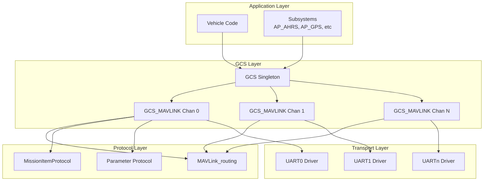
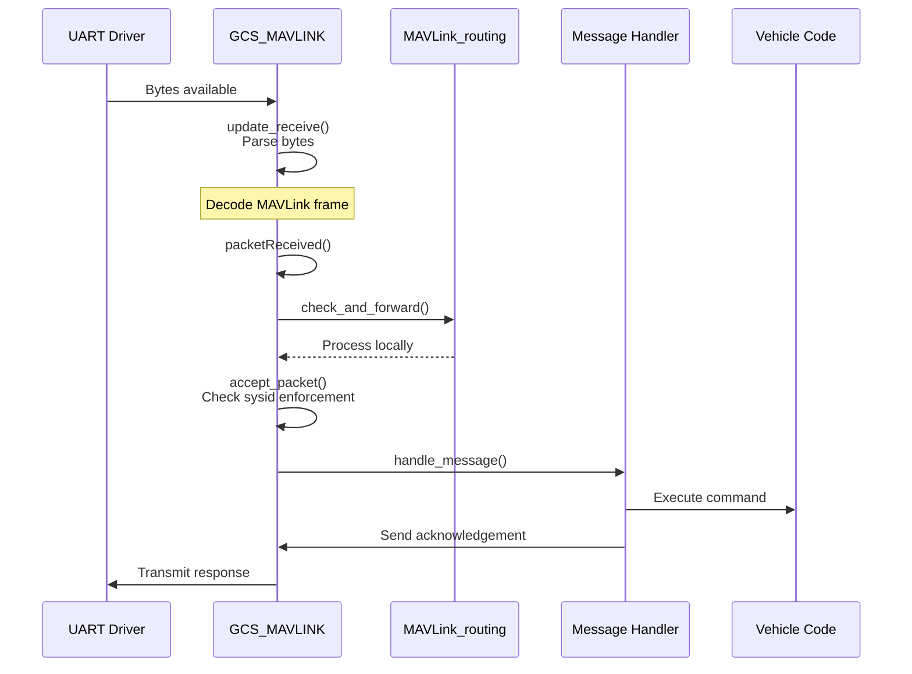
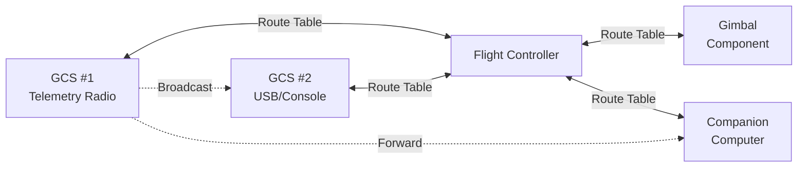
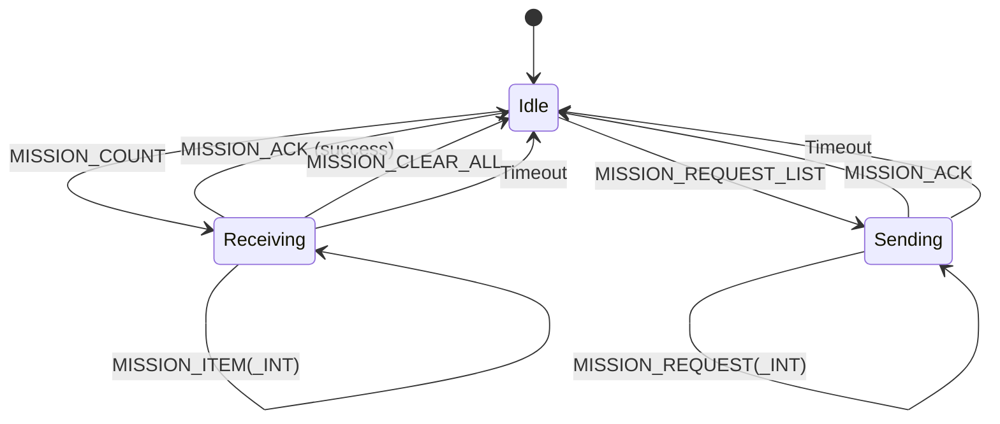
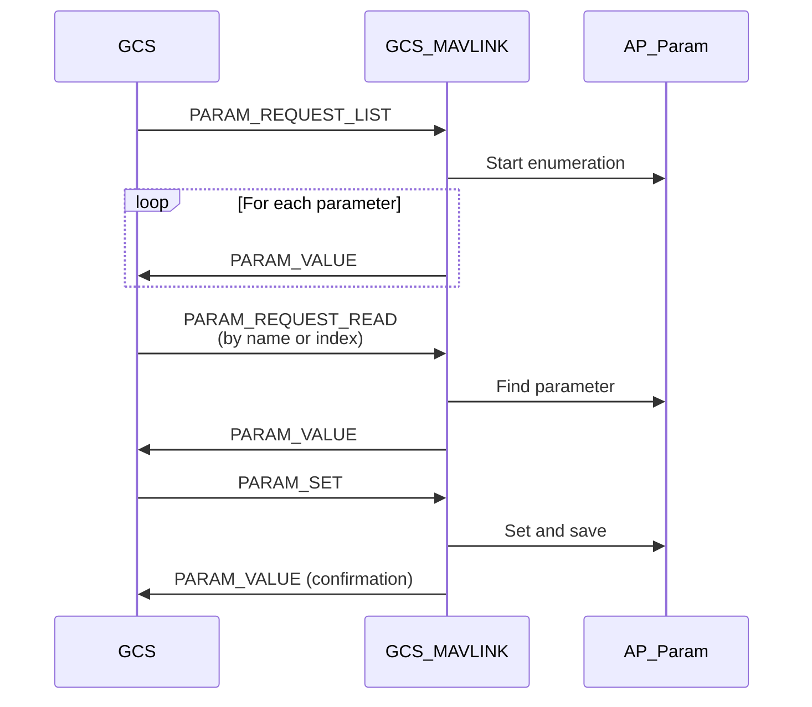

# GCS_MAVLink


## Table of Contents
- [Overview](#overview)
- [Architecture](#architecture)
  - [System Components](#system-components)
  - [Message Processing Pipeline](#message-processing-pipeline)
  - [Routing Mechanism](#routing-mechanism)
- [Message Handling](#message-handling)
  - [Handler Registration](#handler-registration)
  - [Packet Reception Flow](#packet-reception-flow)
  - [Message Dispatch](#message-dispatch)
- [Stream Configuration](#stream-configuration)
  - [Stream Types](#stream-types)
  - [Rate Control](#rate-control)
  - [Telemetry Streams](#telemetry-streams)
- [Protocol Implementations](#protocol-implementations)
  - [Mission Protocol](#mission-protocol)
  - [Parameter Protocol](#parameter-protocol)
  - [Command Protocol](#command-protocol)
- [MAVLink Channels](#mavlink-channels)
  - [Channel Management](#channel-management)
  - [Private Channels](#private-channels)
  - [Channel Prioritization](#channel-prioritization)
- [Integration Guide](#integration-guide)
  - [Adding Message Handlers](#adding-message-handlers)
  - [Sending Messages](#sending-messages)
  - [Custom Messages](#custom-messages)
- [Configuration](#configuration)
  - [Parameters](#parameters)
  - [Build Options](#build-options)
- [Examples](#examples)
- [Testing](#testing)
- [API Reference](#api-reference)
- [Contributing](#contributing)

## Overview

The GCS_MAVLink library implements ArduPilot's ground control station communication layer using the MAVLink protocol. This library provides a comprehensive, production-ready implementation for bidirectional communication between autopilot and ground control stations, supporting both MAVLink 1.0 and 2.0 protocols.

**Source Files**: `/libraries/GCS_MAVLink/`

### Key Features

- **Multi-Channel Support**: Simultaneous communication over up to 8 MAVLink channels (configurable)
- **Protocol Version Negotiation**: Automatic switching between MAVLink 1.0 and 2.0
- **Message Routing**: Intelligent routing of packets between multiple MAVLink endpoints
- **Stream Management**: Configurable telemetry streams with independent rate control
- **Mission Upload/Download**: Complete mission, rally point, and fence management
- **Parameter Synchronization**: Robust parameter get/set protocol with queuing
- **Command Processing**: MAV_CMD_* command handling with acknowledgements
- **Signing Support**: MAVLink 2.0 message signing for secure communications
- **FTP Support**: File transfer protocol for log download and parameter file upload
- **High Latency Mode**: Optimized communications for bandwidth-constrained links

### Primary Classes

- **GCS**: Singleton managing all GCS_MAVLINK channel instances
- **GCS_MAVLINK**: Per-channel MAVLink transport and message handling
- **MAVLink_routing**: Message routing engine for multi-endpoint topologies
- **MissionItemProtocol**: Mission item upload/download state machines
- **GCS_MAVLINK_Parameters**: Stream rate and option configuration

## Architecture

### System Components

The MAVLink subsystem consists of multiple layers working together to provide reliable communication:



**Source**: `/libraries/GCS_MAVLink/GCS.h:1160-1443`, `/libraries/GCS_MAVLink/GCS.h:174-1158`

#### GCS Singleton (`class GCS`)

The GCS class is a singleton that manages all GCS_MAVLINK channel instances and coordinates system-wide MAVLink operations.

**Responsibilities**:
- Creating and initializing GCS_MAVLINK backend instances
- Broadcasting messages to all active channels
- Managing statustext message queue
- Coordinating mission/rally/fence protocols across channels
- Sensor status flag aggregation

**Key Methods**:
- `init()`: Initialize all MAVLink channels from serial manager configuration
- `update_send()`: Round-robin update of all channels for message transmission
- `update_receive()`: Process incoming data on all channels
- `send_message(ap_message id)`: Broadcast message to all active channels
- `send_text(severity, fmt, ...)`: Queue statustext message for transmission

#### GCS_MAVLINK Channel (`class GCS_MAVLINK`)

Each GCS_MAVLINK instance represents a single MAVLink communication channel, typically bound to a UART or network interface.

**Source**: `/libraries/GCS_MAVLink/GCS.h:174`

**Responsibilities**:
- Packet parsing and frame synchronization
- Message handler dispatch
- Stream-based telemetry scheduling
- Parameter request/reply queuing
- Mission item protocol state machines
- Message signing and verification
- Flow control and bandwidth management

**Key Methods**:
- `update_receive(max_time_us)`: Parse incoming bytes, decode packets
- `update_send()`: Send queued and scheduled messages
- `packetReceived(status, msg)`: Handle successfully decoded packet
- `handle_message(msg)`: Dispatch message to appropriate handler
- `send_message(ap_message id)`: Queue message for transmission

### Message Processing Pipeline

The message processing pipeline transforms raw UART bytes into actionable commands:



**Source**: `/libraries/GCS_MAVLink/GCS_Common.cpp:1902-1952` (update_receive), `/libraries/GCS_MAVLink/GCS_Common.cpp:1848-1899` (packetReceived)

#### Packet Reception (`update_receive`)

The `update_receive()` method is called periodically from the main loop to process incoming data:

```cpp
// Source: /libraries/GCS_MAVLink/GCS_Common.cpp:1902
void GCS_MAVLINK::update_receive(uint32_t max_time_us)
{
    // Read bytes from UART
    const uint16_t nbytes = _port->available();
    for (uint16_t i=0; i<nbytes; i++) {
        const uint8_t c = (uint8_t)_port->read();
        
        // Parse byte through MAVLink state machine
        if (mavlink_frame_char_buffer(channel_buffer(),
                                      channel_status(),
                                      c,
                                      &msg,
                                      &status) == MAVLINK_FRAMING_OK) {
            // Complete packet decoded
            packetReceived(status, msg);
        }
    }
}
```

**Timing Constraints**: Maximum processing time is limited by `max_time_us` parameter (default 1000µs) to prevent blocking the main loop.

**Thread Safety**: Not thread-safe; must be called from main thread only.

#### Packet Reception Handler (`packetReceived`)

**Source**: `/libraries/GCS_MAVLink/GCS_Common.cpp:1848`

The `packetReceived()` virtual method is called when a complete packet has been decoded:

```cpp
void GCS_MAVLINK::packetReceived(const mavlink_status_t &status,
                                 const mavlink_message_t &msg)
{
    // Mark channel as active (except for radio status messages)
    if (msg.msgid != MAVLINK_MSG_ID_RADIO && 
        msg.msgid != MAVLINK_MSG_ID_RADIO_STATUS) {
        mavlink_active |= (1U<<(chan-MAVLINK_COMM_0));
    }
    
    // Handle MAVLink version negotiation
    if (!(status.flags & MAVLINK_STATUS_FLAG_IN_MAVLINK1) &&
        (status.flags & MAVLINK_STATUS_FLAG_OUT_MAVLINK1)) {
        // Switch to MAVLink2 if we receive any MAVLink2 packets
        _channel_status.flags &= ~MAVLINK_STATUS_FLAG_OUT_MAVLINK1;
    }
    
    // Check routing - returns false if packet should be forwarded only
    if (!routing.check_and_forward(*this, msg)) {
        return;
    }
    
    // Check sysid enforcement if enabled
    if (!accept_packet(status, msg)) {
        return;
    }
    
    // Dispatch to message handler
    handle_message(msg);
}
```

**Key Operations**:
1. Channel activity tracking for telemetry timeout detection
2. Automatic MAVLink 1→2 protocol upgrade
3. Routing decision and forwarding to other channels
4. Sysid enforcement for security
5. Message handler dispatch

### Routing Mechanism

The routing subsystem forwards packets between multiple MAVLink endpoints intelligently.

**Source**: `/libraries/GCS_MAVLink/MAVLink_routing.cpp`



#### Routing Rules

**Source**: `/libraries/GCS_MAVLink/MAVLink_routing.cpp:38-96`

The routing engine follows these rules for packet handling:

**Process Locally If**:
1. Message has no `target_system` field (broadcast)
2. Message has `target_system` of zero (broadcast)
3. Message targets this system with no `target_component` field
4. Message targets this system and component ID
5. Message targets this system/component but no route exists for that combination

**Forward to Link If**:
1. Message is broadcast (`target_system` = 0)
2. Message targets different system seen on that link
3. Message targets this system but different component seen on that link
4. Message is not from a private channel (unless destination is private)

#### Route Learning

Routes are learned automatically when packets are received:

```cpp
// When a packet arrives from sysid=1 compid=50 on channel 0,
// the routing table records that system 1, component 50 is
// reachable via channel 0
routing.learn_route(chan, msg.sysid, msg.compid);
```

**Route Timeout**: Routes expire after 10 seconds of inactivity to handle component resets.

## Message Handling

### Handler Registration

Message handlers are implemented in the `handle_message()` virtual method using a large switch statement.

**Source**: `/libraries/GCS_MAVLink/GCS_Common.cpp:4278`

```cpp
void GCS_MAVLINK::handle_message(const mavlink_message_t &msg)
{
    switch (msg.msgid) {
    
    case MAVLINK_MSG_ID_HEARTBEAT:
        handle_heartbeat(msg);
        break;
    
    case MAVLINK_MSG_ID_COMMAND_ACK:
        handle_command_ack(msg);
        break;
    
    case MAVLINK_MSG_ID_PARAM_REQUEST_LIST:
    case MAVLINK_MSG_ID_PARAM_SET:
    case MAVLINK_MSG_ID_PARAM_REQUEST_READ:
        handle_common_param_message(msg);
        break;
    
    case MAVLINK_MSG_ID_MISSION_WRITE_PARTIAL_LIST:
    case MAVLINK_MSG_ID_MISSION_REQUEST_LIST:
    case MAVLINK_MSG_ID_MISSION_COUNT:
    case MAVLINK_MSG_ID_MISSION_CLEAR_ALL:
    case MAVLINK_MSG_ID_MISSION_ITEM:
    case MAVLINK_MSG_ID_MISSION_ITEM_INT:
        handle_common_mission_message(msg);
        break;
    
    case MAVLINK_MSG_ID_COMMAND_LONG:
        handle_command_long(msg);
        break;
    
    case MAVLINK_MSG_ID_COMMAND_INT:
        handle_command_int(msg);
        break;
    
    // ... additional handlers
    
    default:
        // Unknown message - vehicles may override to handle custom messages
        break;
    }
}
```

### Packet Reception Flow

The complete packet reception flow from hardware to handler:

**Source**: `/libraries/GCS_MAVLink/GCS_Common.cpp:1902`, `/libraries/GCS_MAVLink/GCS_Common.cpp:1848`

1. **Main Loop** calls `GCS::update_receive()` each iteration
2. **GCS::update_receive()** calls `update_receive()` on each channel
3. **Channel::update_receive()** reads bytes from UART driver
4. **MAVLink Parser** decodes bytes into complete packets
5. **packetReceived()** performs routing and security checks
6. **handle_message()** dispatches to message-specific handler
7. **Handler Function** processes message and updates vehicle state
8. **Response Generation** queues acknowledgements or replies

### Message Dispatch

Common message handling patterns:

#### Heartbeat Processing

```cpp
// Source: GCS_Common.cpp
void handle_heartbeat(const mavlink_message_t &msg)
{
    // Decode packet
    mavlink_heartbeat_t packet;
    mavlink_msg_heartbeat_decode(&msg, &packet);
    
    // Record GCS system ID if this is from our GCS
    if (msg.sysid != sysid && packet.type == MAV_TYPE_GCS) {
        sysid_mygcs_seen(AP_HAL::millis());
    }
    
    // Update last heartbeat time
    last_heartbeat_time = AP_HAL::millis();
}
```

#### Command Processing

```cpp
void handle_command_int(const mavlink_message_t &msg)
{
    mavlink_command_int_t packet;
    mavlink_msg_command_int_decode(&msg, &packet);
    
    // Dispatch to command-specific handler
    MAV_RESULT result = handle_command_int_packet(packet, msg);
    
    // Send acknowledgement
    mavlink_msg_command_ack_send(
        chan,
        packet.command,
        result,
        0, 0, // progress, result_param2
        msg.sysid,
        msg.compid);
}
```

## Stream Configuration

MAVLink telemetry is organized into streams, each with an independent update rate.

**Source**: `/libraries/GCS_MAVLink/GCS.h:270-282`

### Stream Types

ArduPilot defines these standard telemetry streams:

| Stream ID | Stream Name | Typical Messages | Default Rate |
|-----------|-------------|------------------|--------------|
| 0 | STREAM_RAW_SENSORS | RAW_IMU, SCALED_PRESSURE, SCALED_IMU* | 1 Hz |
| 1 | STREAM_EXTENDED_STATUS | SYS_STATUS, POWER_STATUS, MEMINFO, MISSION_CURRENT, GPS_RAW_INT, GPS_RTK, GPS2_RAW, GPS2_RTK, NAV_CONTROLLER_OUTPUT, FENCE_STATUS | 2 Hz |
| 2 | STREAM_RC_CHANNELS | SERVO_OUTPUT_RAW, RC_CHANNELS, RC_CHANNELS_RAW | 1 Hz |
| 3 | STREAM_RAW_CONTROLLER | RC_CHANNELS_SCALED | 1 Hz |
| 4 | STREAM_POSITION | LOCAL_POSITION_NED, GLOBAL_POSITION_INT | 3 Hz |
| 5 | STREAM_EXTRA1 | ATTITUDE, SIMSTATE, AHRS | 10 Hz |
| 6 | STREAM_EXTRA2 | VFR_HUD | 10 Hz |
| 7 | STREAM_EXTRA3 | AHRS2, HWSTATUS, SYSTEM_TIME, RANGEFINDER, DISTANCE_SENSOR, TERRAIN_REPORT, BATTERY2, MOUNT_STATUS, OPTICAL_FLOW, GIMBAL_REPORT, MAG_CAL_REPORT, MAG_CAL_PROGRESS, EKF_STATUS_REPORT, VIBRATION, RPM | 2 Hz |
| 8 | STREAM_PARAMS | PARAM_VALUE | 50 Hz |
| 9 | STREAM_ADSB | ADSB_VEHICLE | 5 Hz |

**Note**: These are overridable per-vehicle; actual message composition is defined in vehicle-specific code.

### Rate Control

Stream rates are controlled by the `SRn_*` parameter group, where `n` is the serial port number.

**Parameters**:
- `SR0_RAW_SENS`: Stream 0 rate on serial port 0 (Hz)
- `SR0_EXT_STAT`: Stream 1 rate on serial port 0 (Hz)
- `SR0_RC_CHAN`: Stream 2 rate on serial port 0 (Hz)
- `SR0_RAW_CTRL`: Stream 3 rate on serial port 0 (Hz)
- `SR0_POSITION`: Stream 4 rate on serial port 0 (Hz)
- `SR0_EXTRA1`: Stream 5 rate on serial port 0 (Hz)
- `SR0_EXTRA2`: Stream 6 rate on serial port 0 (Hz)
- `SR0_EXTRA3`: Stream 7 rate on serial port 0 (Hz)
- `SR0_PARAMS`: Stream 8 rate on serial port 0 (Hz)
- `SR0_ADSB`: Stream 9 rate on serial port 0 (Hz)

**Setting Rates at Runtime**:

GCS can request stream rate changes via `REQUEST_DATA_STREAM` (deprecated) or by setting `SRn_*` parameters directly.

```cpp
// Example: Request EXTENDED_STATUS stream at 5 Hz
mavlink_msg_request_data_stream_send(
    chan,
    target_system,
    target_component,
    MAV_DATA_STREAM_EXTENDED_STATUS,
    5, // rate in Hz
    1  // start_stop: 1=start, 0=stop
);
```

**Modern Approach**: Use `MAV_CMD_SET_MESSAGE_INTERVAL` to control individual message rates:

```cpp
// Request ATTITUDE message every 100ms (10 Hz)
mavlink_msg_command_long_send(
    chan,
    target_system,
    target_component,
    MAV_CMD_SET_MESSAGE_INTERVAL,
    0, // confirmation
    MAVLINK_MSG_ID_ATTITUDE, // param1: message ID
    100000, // param2: interval in microseconds
    0, 0, 0, 0, 0 // unused params
);
```

### Telemetry Streams

Stream scheduling uses a bucket-based deferred message system:

**Source**: `/libraries/GCS_MAVLink/GCS.h:873-886`

```cpp
struct deferred_message_bucket_t {
    Bitmask<MSG_LAST> ap_message_ids;  // Messages in this bucket
    uint16_t interval_ms;               // Send interval
    uint16_t last_sent_ms;             // Last transmission time
};
```

Each stream maps to one or more deferred message buckets. When a bucket's interval expires, all messages in that bucket are queued for transmission if bandwidth permits.

**Flow Control**: If a message cannot be sent due to insufficient buffer space, it is rescheduled for the next bucket interval.

## Protocol Implementations

### Mission Protocol

The mission protocol handles upload and download of waypoint missions, fence points, and rally points.

**Source**: `/libraries/GCS_MAVLink/MissionItemProtocol.cpp`



#### Mission Upload (GCS → Vehicle)

**Source**: `/libraries/GCS_MAVLink/MissionItemProtocol.cpp:78-110`

1. **GCS sends MISSION_COUNT**: Specifies number of items to upload
   ```cpp
   mavlink_msg_mission_count_send(chan, target_sys, target_comp,
                                   count, MAV_MISSION_TYPE_MISSION);
   ```

2. **Vehicle allocates resources**: Prepares to receive mission items
   ```cpp
   MAV_MISSION_RESULT allocate_receive_resources(uint16_t count);
   ```

3. **Vehicle requests items**: Sends MISSION_REQUEST_INT for each item
   ```cpp
   mavlink_msg_mission_request_int_send(chan, gcs_sysid, gcs_compid,
                                        item_index, MAV_MISSION_TYPE_MISSION);
   ```

4. **GCS sends MISSION_ITEM_INT**: Provides item data
   ```cpp
   mavlink_msg_mission_item_int_send(chan, target_sys, target_comp,
                                     seq, frame, command, current, autocontinue,
                                     param1, param2, param3, param4,
                                     x, y, z, mission_type);
   ```

5. **Vehicle sends MISSION_ACK**: Confirms receipt of all items
   ```cpp
   send_mission_ack(link, msg, MAV_MISSION_ACCEPTED);
   ```

**Timeout Handling**: If no MISSION_ITEM received within 5 seconds, upload is cancelled.

#### Mission Download (Vehicle → GCS)

1. **GCS sends MISSION_REQUEST_LIST**
2. **Vehicle sends MISSION_COUNT** with current mission size
3. **GCS sends MISSION_REQUEST_INT** for each item
4. **Vehicle sends MISSION_ITEM_INT** for requested item
5. **GCS sends MISSION_ACK** when all items received

**Source**: `/libraries/GCS_MAVLink/MissionItemProtocol.cpp:32-39` (handle_mission_clear_all)

#### Mission Types

**Source**: MAVLink common.xml

- `MAV_MISSION_TYPE_MISSION` (0): Waypoint mission
- `MAV_MISSION_TYPE_FENCE` (1): Geofence boundary points
- `MAV_MISSION_TYPE_RALLY` (2): Rally/safe return points

Each mission type has a separate `MissionItemProtocol` instance managed by GCS.

### Parameter Protocol

The parameter protocol provides get/set access to vehicle configuration.

**Source**: `/libraries/GCS_MAVLink/GCS_Param.cpp`

#### Parameter Request Flow



#### Parameter Operations

**Request All Parameters**:
```cpp
// Source: GCS_Param.cpp
void handle_param_request_list(const mavlink_message_t &msg)
{
    // Start parameter enumeration
    _queued_parameter_index = 0;
    _queued_parameter_count = AP_Param::count_parameters();
    _queued_parameter_token = {};
    
    // Parameters will be sent via queued_param_send()
    // called from update_send()
}
```

**Request Single Parameter**:
```cpp
void handle_param_request_read(const mavlink_message_t &msg)
{
    mavlink_param_request_read_t packet;
    mavlink_msg_param_request_read_decode(&msg, &packet);
    
    AP_Param *vp;
    if (packet.param_index != -1) {
        // Request by index
        vp = AP_Param::find_by_index(packet.param_index, ...);
    } else {
        // Request by name
        vp = AP_Param::find(packet.param_id, ...);
    }
    
    if (vp != nullptr) {
        send_parameter_value(param_name, param_type, vp->cast_to_float());
    }
}
```

**Set Parameter**:
```cpp
void handle_param_set(const mavlink_message_t &msg)
{
    mavlink_param_set_t packet;
    mavlink_msg_param_set_decode(&msg, &packet);
    
    // Find parameter
    AP_Param *vp = AP_Param::find(packet.param_id, &var_type);
    if (vp == nullptr) {
        return; // Parameter not found
    }
    
    // Check if value actually changed
    if (!vp->set_float(packet.param_value, var_type)) {
        return; // Value unchanged or type mismatch
    }
    
    // Save to EEPROM/flash
    vp->save();
    
    // Send confirmation
    send_parameter_value(packet.param_id, var_type, packet.param_value);
}
```

**Asynchronous Parameter Replies**: Parameter operations use an I/O timer callback to avoid blocking the main loop during EEPROM writes.

**Source**: `/libraries/GCS_MAVLink/GCS.h:966-967`

```cpp
static ObjectBuffer<pending_param_request> param_requests;
static ObjectBuffer<pending_param_reply> param_replies;
```

### Command Protocol

Commands use the `COMMAND_INT` and `COMMAND_LONG` messages for executing vehicle actions.

**Source**: `/libraries/GCS_MAVLink/GCS_Common.cpp:4373-4379`

#### Command Types

**Navigation Commands**: MAV_CMD_NAV_* (e.g., WAYPOINT, RETURN_TO_LAUNCH, LAND)
**Condition Commands**: MAV_CMD_CONDITION_* (e.g., DELAY, DISTANCE)
**Do Commands**: MAV_CMD_DO_* (e.g., SET_SERVO, SET_RELAY, SET_MODE)

#### Command Processing

```cpp
void handle_command_int(const mavlink_message_t &msg)
{
    mavlink_command_int_t packet;
    mavlink_msg_command_int_decode(&msg, &packet);
    
    // Dispatch to command handler
    MAV_RESULT result = handle_command_int_packet(packet, msg);
    
    // Send acknowledgement
    mavlink_msg_command_ack_send(
        chan,
        packet.command,
        result,
        0, // progress
        0, // result_param2
        msg.sysid,
        msg.compid);
}
```

**Common Commands**:

| Command | MAV_CMD ID | Description |
|---------|-----------|-------------|
| ARM/DISARM | 400 | Arm or disarm motors |
| TAKEOFF | 22 | Takeoff to specified altitude |
| LAND | 21 | Land at current position |
| RTL | 20 | Return to launch |
| SET_MODE | 176 | Change flight mode |
| PREFLIGHT_CALIBRATION | 241 | Calibrate sensors |
| COMPONENT_ARM_DISARM | 400 | Arm/disarm with safety checks |
| DO_SET_HOME | 179 | Set home position |
| DO_SET_SERVO | 183 | Set servo PWM |
| DO_SET_RELAY | 181 | Set relay state |

**In-Progress Commands**: Long-running commands (e.g., compass calibration) use the `GCS_MAVLINK_InProgress` system to send periodic progress updates.

**Source**: `/libraries/GCS_MAVLink/GCS.h:134-168`

```cpp
class GCS_MAVLINK_InProgress {
    enum class Type {
        AIRSPEED_CAL,
        SD_FORMAT,
        // ... other long-running tasks
    };
    
    bool send_in_progress();  // Send COMMAND_ACK with progress
    bool conclude(MAV_RESULT result);  // Send final ACK
};
```

## MAVLink Channels

### Channel Management

ArduPilot supports multiple simultaneous MAVLink channels, typically one per serial port.

**Source**: `/libraries/GCS_MAVLink/GCS_MAVLink.h:18-24`

```cpp
#if HAL_PROGRAM_SIZE_LIMIT_KB > 1024
    #define MAVLINK_COMM_NUM_BUFFERS 8  // Large boards
#else
    #define MAVLINK_COMM_NUM_BUFFERS 5  // Small boards
#endif
```

**Channel Enumeration**:
- `MAVLINK_COMM_0`: Typically primary telemetry radio
- `MAVLINK_COMM_1`: Typically USB/console
- `MAVLINK_COMM_2`: Typically secondary telemetry
- `MAVLINK_COMM_3-7`: Additional ports (network, CAN, etc.)

**Channel Initialization**:

```cpp
// Source: GCS.cpp
void GCS::init()
{
    // Create GCS_MAVLINK backend for each MAVLink serial port
    for (uint8_t i=0; i<MAVLINK_COMM_NUM_BUFFERS; i++) {
        create_gcs_mavlink_backend(uart);
    }
    
    // Initialize each backend
    for (uint8_t i=0; i<_num_gcs; i++) {
        _chan[i]->init(i);
    }
}
```

### Private Channels

Private channels don't participate in message forwarding or broadcasts.

**Source**: `/libraries/GCS_MAVLink/GCS.h:422-435`

**Use Cases**:
- Point-to-point protocols (e.g., to companion computer)
- Dedicated command/control links
- Reducing bandwidth on low-speed links

**Configuration**:
```cpp
// Set channel as private via MAVn_OPTIONS parameter
// Bit 1 (value 2): NO_FORWARD option
set_channel_private(MAVLINK_COMM_2);
```

**Behavior**:
- Receives and processes messages normally
- Does NOT receive broadcast messages from other channels
- Does NOT forward messages from other channels
- Still sends heartbeat and responds to direct queries

### Channel Prioritization

**High Bandwidth Check**:

```cpp
bool is_high_bandwidth() { 
    return chan == MAVLINK_COMM_0; 
}
```

MAVLINK_COMM_0 is considered the primary high-bandwidth link and may receive additional messages or higher update rates.

**Flow Control**:

```cpp
bool have_flow_control();  // Returns true if UART has CTS/RTS
```

Channels with hardware flow control can use higher data rates without overflow.

## Integration Guide

### Adding Message Handlers

To handle a new MAVLink message in your vehicle:

1. **Add case to handle_message()**:

```cpp
// In GCS_MAVLink_Vehicle.cpp
void GCS_MAVLINK_Vehicle::handle_message(const mavlink_message_t &msg)
{
    switch (msg.msgid) {
    
    case MAVLINK_MSG_ID_YOUR_MESSAGE:
        handle_your_message(msg);
        break;
    
    default:
        // Call base class handler
        GCS_MAVLINK::handle_message(msg);
        break;
    }
}
```

2. **Implement handler method**:

```cpp
void GCS_MAVLINK_Vehicle::handle_your_message(const mavlink_message_t &msg)
{
    // Decode message
    mavlink_your_message_t packet;
    mavlink_msg_your_message_decode(&msg, &packet);
    
    // Process message data
    vehicle.do_something(packet.field1, packet.field2);
    
    // Send acknowledgement if needed
    send_your_response();
}
```

3. **Ensure message is in MAVLink dialect**:

Edit `modules/mavlink/message_definitions/v1.0/ardupilotmega.xml` or `common.xml` to define message structure.

### Sending Messages

#### One-time Message Send

```cpp
// From anywhere in vehicle code
gcs().send_text(MAV_SEVERITY_INFO, "Status message");
```

```cpp
// From GCS_MAVLINK method
send_heartbeat();
send_attitude();
send_sys_status();
```

#### Scheduled Stream Messages

To add a message to a telemetry stream:

1. **Define ap_message enum**:

```cpp
// In ap_message.h
enum ap_message {
    MSG_HEARTBEAT,
    MSG_ATTITUDE,
    MSG_YOUR_NEW_MESSAGE,  // Add here
    MSG_LAST
};
```

2. **Implement try_send_message()**:

```cpp
// In GCS_MAVLink_Vehicle.cpp
bool GCS_MAVLINK_Vehicle::try_send_message(ap_message id)
{
    switch (id) {
    case MSG_YOUR_NEW_MESSAGE:
        CHECK_PAYLOAD_SIZE(YOUR_MESSAGE);
        send_your_message();
        break;
    
    default:
        return GCS_MAVLINK::try_send_message(id);
    }
    return true;
}
```

3. **Add to stream definition**:

```cpp
// In GCS_MAVLink_Vehicle.cpp
static const ap_message STREAM_EXTRA3_msgs[] = {
    MSG_AHRS2,
    MSG_HWSTATUS,
    MSG_YOUR_NEW_MESSAGE,  // Add to appropriate stream
};
```

4. **Implement send function**:

```cpp
void GCS_MAVLINK_Vehicle::send_your_message()
{
    // Prepare data
    float value1 = vehicle.get_value1();
    uint32_t value2 = vehicle.get_value2();
    
    // Send message
    mavlink_msg_your_message_send(
        chan,
        value1,
        value2);
}
```

### Custom Messages

For custom messages not in standard MAVLink:

1. **Define in ardupilotmega.xml**:

```xml
<message id="12345" name="YOUR_MESSAGE">
  <description>Your message description</description>
  <field type="float" name="field1">Field 1 description (units)</field>
  <field type="uint32_t" name="field2">Field 2 description</field>
</message>
```

2. **Regenerate MAVLink headers**:

```bash
./modules/mavlink/pymavlink/tools/mavgen.py \
    --lang=C \
    --wire-protocol=2.0 \
    --output=libraries/GCS_MAVLink/include/mavlink/v2.0 \
    modules/mavlink/message_definitions/v1.0/ardupilotmega.xml
```

3. **Use as normal message** in handler and sender functions.

## Configuration

### Parameters

MAVLink behavior is controlled by several parameter groups:

#### Serial Port Configuration (SERIALn_*)

- `SERIAL0_PROTOCOL` through `SERIAL7_PROTOCOL`: Protocol type
  - `1` = MAVLink1
  - `2` = MAVLink2 (recommended)
  - `23` = MAVLink High Latency
- `SERIAL0_BAUD` through `SERIAL7_BAUD`: Baud rate (typically 57 or 115)

#### MAVLink Options (MAVn_OPTIONS)

**Source**: `/libraries/GCS_MAVLink/GCS.h:523-537`

| Bit | Option | Description |
|-----|--------|-------------|
| 0 | MAVLINK2_SIGNING_DISABLED | Disable message signing even if keys configured |
| 1 | NO_FORWARD | Mark channel as private (no forwarding) |
| 2 | NOSTREAMOVERRIDE | Ignore REQUEST_DATA_STREAM messages from GCS |

**Example**: `MAV0_OPTIONS = 2` enables NO_FORWARD for SERIAL0

#### Stream Rates (SRn_*)

Control telemetry stream rates per serial port (see Stream Configuration section).

#### Global MAVLink Parameters

**Source**: `/libraries/GCS_MAVLink/GCS.h:1365-1368`

- `SYSID_THISMAV`: This vehicle's MAVLink system ID (1-255)
- `SYSID_MYGCS`: Expected GCS system ID (0 = accept any)
- `MAV_OPTIONS`: Global MAVLink options
  - Bit 0: `GCS_SYSID_ENFORCE` - Only process messages from SYSID_MYGCS
- `TELEM_DELAY`: Delay before starting telemetry (seconds)

### Build Options

Compile-time features are controlled in `GCS_config.h`:

```cpp
// Maximum message length (MAVLink 2.0)
#define MAVLINK_MAX_PAYLOAD_LEN 255

// Enable/disable features
#define HAL_GCS_ENABLED 1
#define AP_MAVLINK_FTP_ENABLED 1
#define AP_MAVLINK_MISSION_SET_CURRENT_ENABLED 1
#define HAL_HIGH_LATENCY2_ENABLED 0
```

**Feature Flags**:
- `AP_MAVLINK_FTP_ENABLED`: File transfer protocol support
- `AP_MAVLINK_SIGNING_ENABLED`: Message signing (security)
- `HAL_HIGH_LATENCY2_ENABLED`: High latency optimizations
- `AP_MAVLINK_MSG_RELAY_STATUS_ENABLED`: Relay status messages

## Examples

### Example 1: Sending a Status Message

```cpp
// From anywhere in code:
GCS_SEND_TEXT(MAV_SEVERITY_INFO, "System initialized");
GCS_SEND_TEXT(MAV_SEVERITY_WARNING, "Low battery: %.1fV", battery_voltage);
```

### Example 2: Handling Custom Command

```cpp
MAV_RESULT GCS_MAVLINK_Copter::handle_command_int_packet(
    const mavlink_command_int_t &packet,
    const mavlink_message_t &msg)
{
    switch (packet.command) {
    
    case MAV_CMD_DO_MY_CUSTOM_ACTION:
        if (packet.param1 < 0 || packet.param1 > 100) {
            return MAV_RESULT_FAILED;
        }
        copter.do_custom_action(packet.param1);
        return MAV_RESULT_ACCEPTED;
    
    default:
        return GCS_MAVLINK::handle_command_int_packet(packet, msg);
    }
}
```

### Example 3: Requesting Mission from Vehicle

```cpp
// GCS code to download mission
void request_mission() {
    // Step 1: Request mission count
    mavlink_msg_mission_request_list_send(
        chan,
        target_system,
        target_component,
        MAV_MISSION_TYPE_MISSION);
    
    // Vehicle will respond with MISSION_COUNT
    // Then request each item with MISSION_REQUEST_INT
}

// Handle MISSION_COUNT response
void handle_mission_count(const mavlink_mission_count_t &packet) {
    mission_count = packet.count;
    
    // Request first item
    mavlink_msg_mission_request_int_send(
        chan,
        packet.target_system,
        packet.target_component,
        0, // seq
        MAV_MISSION_TYPE_MISSION);
}

// Handle MISSION_ITEM_INT response
void handle_mission_item_int(const mavlink_mission_item_int_t &packet) {
    // Store item
    store_mission_item(packet);
    
    // Request next item if more remain
    if (packet.seq + 1 < mission_count) {
        mavlink_msg_mission_request_int_send(
            chan,
            packet.target_system,
            packet.target_component,
            packet.seq + 1,
            MAV_MISSION_TYPE_MISSION);
    } else {
        // All items received, send ACK
        mavlink_msg_mission_ack_send(
            chan,
            packet.target_system,
            packet.target_component,
            MAV_MISSION_ACCEPTED,
            MAV_MISSION_TYPE_MISSION);
    }
}
```

### Example 4: Setting Parameters Programmatically

```cpp
// Find parameter by name
AP_Param *param = AP_Param::find("PARAM_NAME", &type);
if (param != nullptr) {
    // Set new value
    param->set_float(new_value, type);
    
    // Save to storage
    param->save();
    
    // Notify GCS of change
    gcs().send_parameter_value("PARAM_NAME", type, new_value);
}
```

### Example 5: Vehicle-Specific Stream Configuration

```cpp
// Define stream contents in vehicle code
// Source: ArduCopter/GCS_Mavlink.cpp
static const ap_message STREAM_RAW_SENSORS_msgs[] = {
    MSG_RAW_IMU,
    MSG_SCALED_IMU2,
    MSG_SCALED_IMU3,
    MSG_SCALED_PRESSURE,
    MSG_SCALED_PRESSURE2,
    MSG_SCALED_PRESSURE3,
};

static const ap_message STREAM_POSITION_msgs[] = {
    MSG_LOCATION,
    MSG_LOCAL_POSITION
};

const GCS_MAVLINK::stream_entries GCS_MAVLINK::all_stream_entries[] = {
    MAV_STREAM_ENTRY(RAW_SENSORS),
    MAV_STREAM_ENTRY(EXTENDED_STATUS),
    MAV_STREAM_ENTRY(POSITION),
    MAV_STREAM_ENTRY(EXTRA1),
    MAV_STREAM_ENTRY(EXTRA2),
    MAV_STREAM_ENTRY(EXTRA3),
    MAV_STREAM_TERMINATOR
};
```

## Testing

### SITL Testing

Test MAVLink communications in Software-In-The-Loop simulation:

```bash
# Start SITL with MAVProxy
sim_vehicle.py -v ArduCopter --console --map

# In MAVProxy console:
param show SR*        # Show stream rates
param set SR0_EXTRA1 10   # Set EXTRA1 stream to 10 Hz
status                # Check link status
```

### Hardware Testing

Test on real hardware:

```bash
# Connect to vehicle via serial
mavproxy.py --master=/dev/ttyUSB0 --baudrate=57600

# Monitor message rates
mavproxy.py --master=/dev/ttyUSB0 --baudrate=57600 --cmd="set streamrate 10"

# Test parameter operations
param fetch           # Download all parameters
param set SYSID_THISMAV 2  # Change system ID
param download /tmp/params.param  # Save to file
param load /tmp/params.param     # Upload from file
```

### MAVLink Inspector

Use MAVLink Inspector in Mission Planner or QGroundControl to:
- Monitor all received messages
- Check message rates
- Verify packet structure
- Test custom messages

### Unit Tests

Run MAVLink unit tests:

```bash
./waf configure --board=linux
./waf tests

# Run specific test
./build/linux/tests/test_gcs
```

## API Reference

### GCS Class

**Singleton Access**:
```cpp
GCS &gcs();  // Get global GCS instance
```

**Key Methods**:

| Method | Description | Source |
|--------|-------------|--------|
| `init()` | Initialize all MAVLink channels | GCS.cpp |
| `update_send()` | Process outgoing message queues | GCS.cpp |
| `update_receive()` | Process incoming data on all channels | GCS.cpp |
| `send_message(ap_message id)` | Broadcast message to all active channels | GCS.cpp |
| `send_text(severity, fmt, ...)` | Send statustext to all channels | GCS.cpp |
| `send_to_active_channels(msgid, pkt)` | Broadcast raw packet | GCS.cpp |

### GCS_MAVLINK Class

**Per-Channel Instance**:
```cpp
GCS_MAVLINK *gcs().chan(uint8_t channel_index);
```

**Message Handling**:

| Method | Description | Source |
|--------|-------------|--------|
| `packetReceived(status, msg)` | Handle decoded packet | GCS_Common.cpp:1848 |
| `handle_message(msg)` | Dispatch message to handler | GCS_Common.cpp:4278 |
| `send_message(ap_message id)` | Queue message for transmission | GCS_Common.cpp |
| `send_text(severity, fmt, ...)` | Send statustext on this channel | GCS_Common.cpp |

**Channel State**:

| Method | Description | Source |
|--------|-------------|--------|
| `is_active()` | Returns true if channel has seen traffic | GCS.h:288 |
| `is_streaming()` | Returns true if actively sending streams | GCS.h:291 |
| `is_high_bandwidth()` | Returns true for primary telemetry | GCS.h:284 |
| `have_flow_control()` | Returns true if UART has CTS/RTS | GCS.h:286 |
| `locked()` | Returns true if channel reserved for alternate protocol | GCS.h:410 |

**Buffer Management**:

| Method | Description | Source |
|--------|-------------|--------|
| `txspace()` | Available transmit buffer space (bytes) | GCS.h:202 |
| `check_payload_size(len)` | Check if message will fit in buffer | GCS.h:212 |

### MAVLink_routing Class

**Routing Operations**:

| Method | Description | Source |
|--------|-------------|--------|
| `check_and_forward(link, msg)` | Route packet, return true if should process locally | MAVLink_routing.cpp:97 |
| `learn_route(chan, sysid, compid)` | Record route to system/component | MAVLink_routing.cpp |
| `find_by_mavtype(type, ...)` | Find route to component by MAV_TYPE | GCS.h:456 |

### MissionItemProtocol Class

**Mission Operations**:

| Method | Description | Source |
|--------|-------------|--------|
| `handle_mission_request_list(link, msg)` | Start mission download | MissionItemProtocol.cpp |
| `handle_mission_count(link, packet, msg)` | Begin mission upload | MissionItemProtocol.cpp:78 |
| `handle_mission_item(link, msg)` | Receive mission item | MissionItemProtocol.cpp |
| `handle_mission_clear_all(link, msg)` | Clear all items | MissionItemProtocol.cpp:32 |

**Mission Protocol Subclasses**:
- `MissionItemProtocol_Waypoints`: Waypoint missions
- `MissionItemProtocol_Rally`: Rally points
- `MissionItemProtocol_Fence`: Geofence points

### Helper Macros

**Payload Size Checking**:

```cpp
// Check space from within GCS_MAVLINK method
CHECK_PAYLOAD_SIZE(MESSAGE_NAME);

// Check space with explicit channel
CHECK_PAYLOAD_SIZE2(MESSAGE_NAME);

// Get size of message with overhead
PAYLOAD_SIZE(chan, MESSAGE_NAME);

// Check if space available (evaluates to bool)
HAVE_PAYLOAD_SPACE(chan, MESSAGE_NAME);
```

**Source**: `/libraries/GCS_MAVLink/GCS.h:55-81`

## Contributing

### Adding New MAVLink Messages

1. **Define message in MAVLink XML**:
   - For ArduPilot-specific: `modules/mavlink/message_definitions/v1.0/ardupilotmega.xml`
   - For standard messages: Submit to MAVLink project

2. **Regenerate headers**:
   ```bash
   git submodule update --init --recursive
   ./libraries/GCS_MAVLink/generate.sh
   ```

3. **Add handler** to vehicle-specific `GCS_MAVLink_Vehicle::handle_message()`

4. **Add sender** to vehicle-specific `GCS_MAVLink_Vehicle::try_send_message()`

5. **Add to stream** if periodic transmission needed

6. **Test thoroughly** in SITL and hardware

### Coding Standards

- Follow ArduPilot coding style (see CONTRIBUTING.md)
- Use Doxygen comments for new public methods
- Check return values and handle errors gracefully
- Test with multiple GCS types (Mission Planner, QGC, MAVProxy)
- Verify backwards compatibility with MAVLink 1.0 if applicable

### Performance Considerations

- **Minimize blocking operations**: `update_receive()` and `update_send()` are called from main loop
- **Check buffer space**: Always use `CHECK_PAYLOAD_SIZE()` before sending
- **Limit processing time**: `update_receive()` respects `max_time_us` parameter
- **Use deferred queues**: Don't send messages directly from handlers
- **Consider bandwidth**: High-rate messages impact telemetry radio performance

### Security Considerations

- **Validate inputs**: Check command parameters and location data
- **Enforce SYSID**: Use `SYSID_ENFORCE` option for single-GCS operation
- **Message signing**: Enable MAVLink 2.0 signing for secure links
- **Rate limiting**: Prevent command flooding
- **Access control**: Some parameters/commands require arming checks

## Additional Resources

### MAVLink Protocol

- **MAVLink Developer Guide**: https://mavlink.io/en/
- **MAVLink Message Definitions**: https://mavlink.io/en/messages/common.html
- **ArduPilot MAVLink Extensions**: https://ardupilot.org/dev/docs/mavlink-basics.html

### ArduPilot Documentation

- **MAVLink Commands**: https://ardupilot.org/dev/docs/copter-commands-in-guided-mode.html
- **Parameter Documentation**: https://ardupilot.org/copter/docs/parameters.html
- **GCS Protocols**: https://ardupilot.org/dev/docs/mavlink-get-set-params.html

### Tools

- **MAVProxy**: Command-line GCS - https://ardupilot.org/mavproxy/
- **Mission Planner**: Windows GCS - https://ardupilot.org/planner/
- **QGroundControl**: Cross-platform GCS - http://qgroundcontrol.com/
- **pymavlink**: Python MAVLink library - https://github.com/ArduPilot/pymavlink

### Source Code References

All source file references in this document:

- `/libraries/GCS_MAVLink/GCS.h` - Main GCS and GCS_MAVLINK class definitions
- `/libraries/GCS_MAVLink/GCS_MAVLink.h` - MAVLink protocol integration header
- `/libraries/GCS_MAVLink/GCS_Common.cpp` - Common message handling implementation
- `/libraries/GCS_MAVLink/MissionItemProtocol.cpp` - Mission upload/download protocol
- `/libraries/GCS_MAVLink/GCS_Param.cpp` - Parameter get/set protocol
- `/libraries/GCS_MAVLink/MAVLink_routing.cpp` - Message routing engine

---

**Document Version**: 1.0
**Last Updated**: 2025
**Maintainer**: ArduPilot Development Team
**License**: GPLv3
