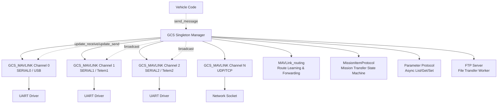
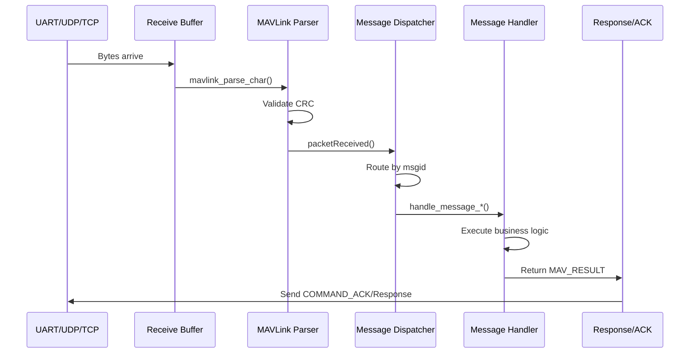
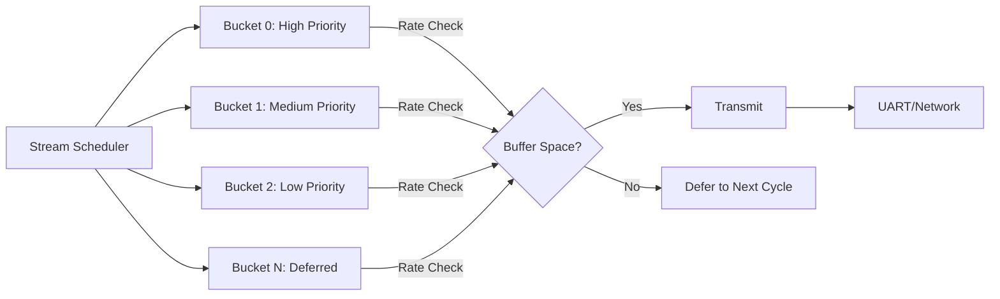
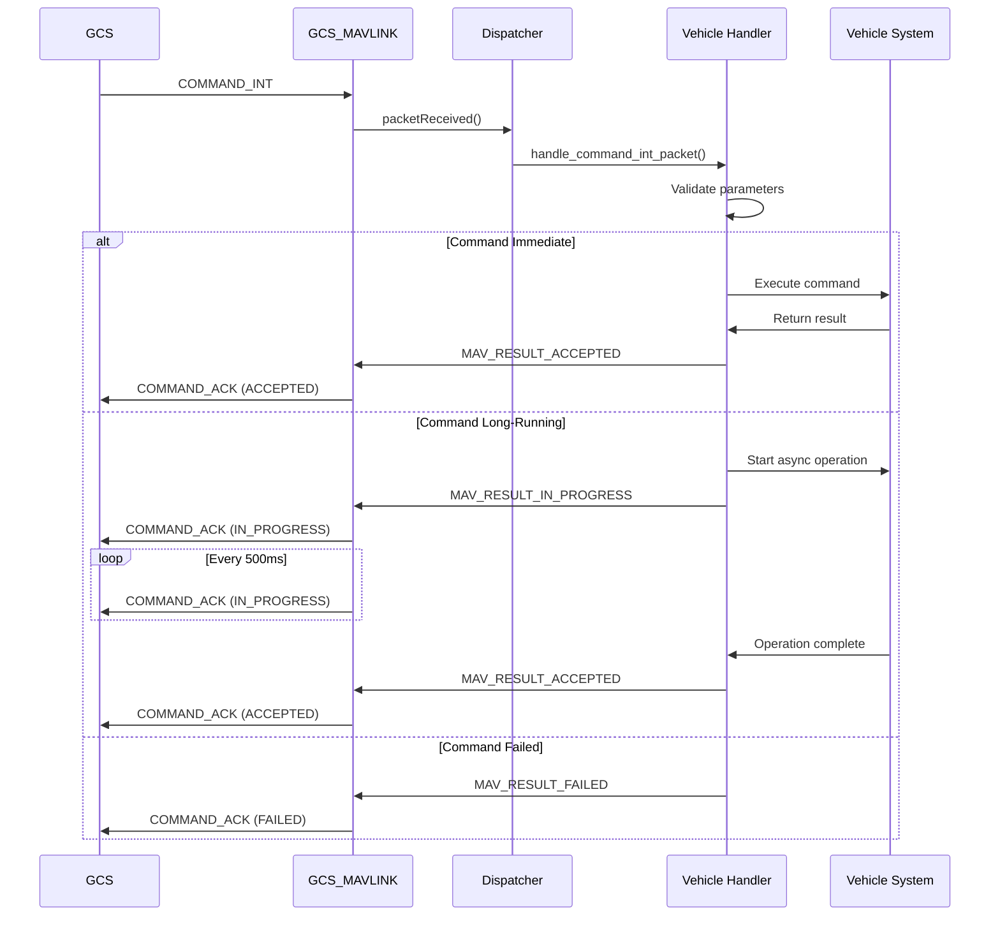
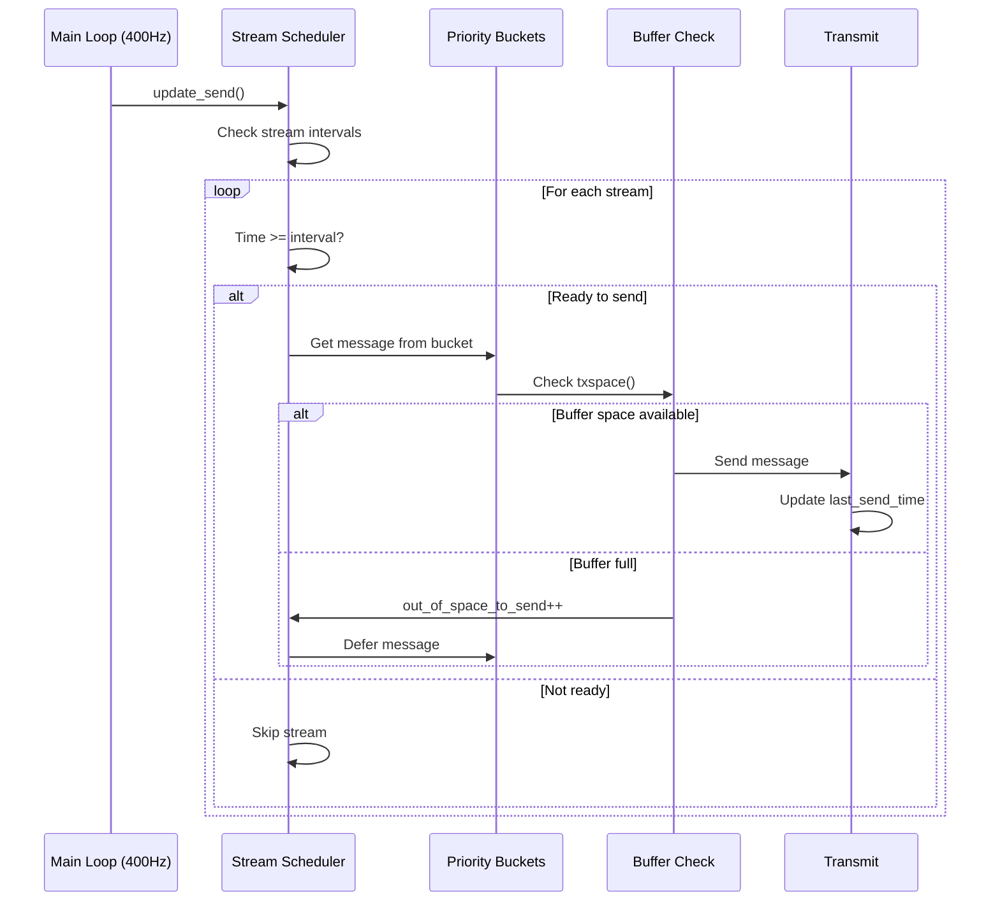
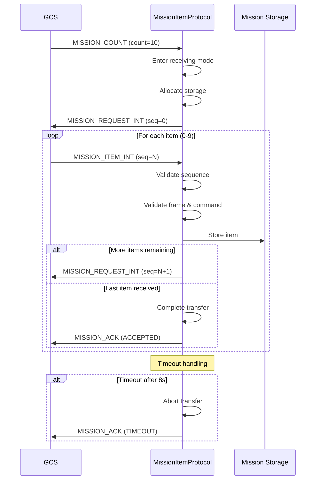
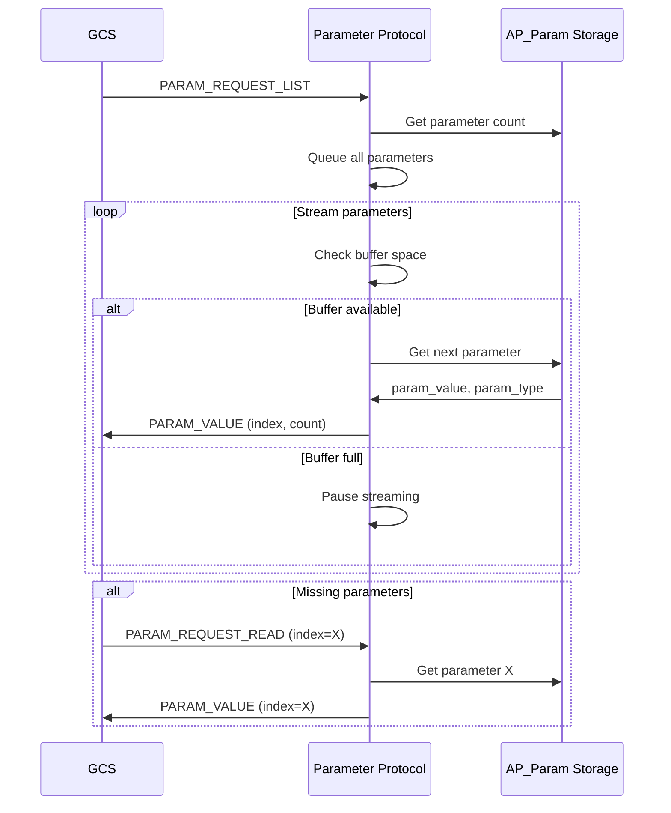
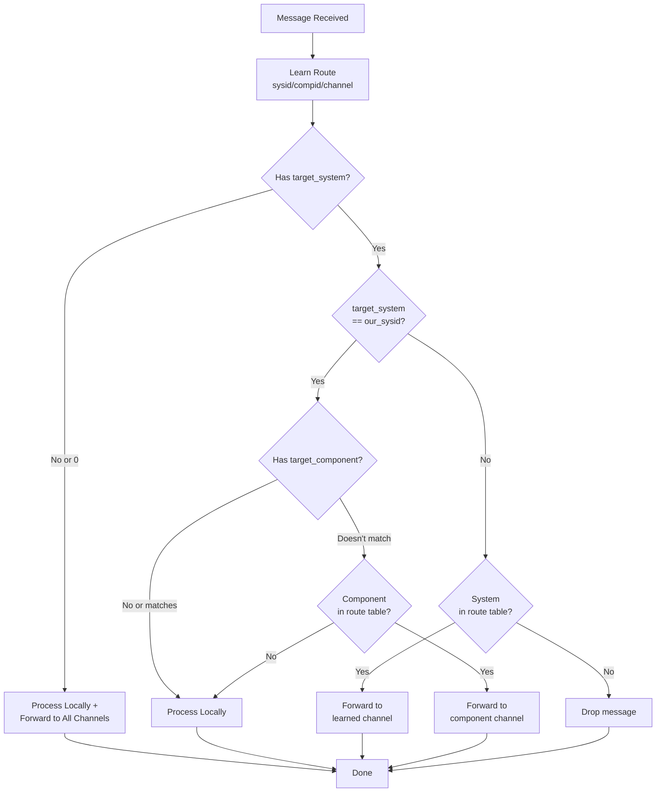

# GCS_MAVLink

## Overview

The GCS_MAVLink library is ArduPilot's Ground Control Station MAVLink communication subsystem. It provides the bridge between the autopilot and ground control stations, companion computers, and other MAVLink-speaking devices.

**Purpose**: Implement complete MAVLink protocol support for bidirectional communication between ArduPilot and external systems.

**Responsibilities**:
- MAVLink message framing, parsing, and validation
- Message routing between multiple communication channels
- Command dispatching and acknowledgment handling
- Telemetry streaming with rate limiting and prioritization
- Mission upload/download protocol implementation
- Parameter get/set protocol with persistence
- MAVLink FTP for file transfer operations
- Multi-GCS coordination and connection management

**Role in System**: GCS_MAVLink acts as the communication layer that exposes vehicle state, accepts commands, and coordinates with ground control stations. It handles up to 8 simultaneous connections across UART, UDP, and TCP transports, supporting both MAVLink1 and MAVLink2 protocols.

## Architecture

The GCS_MAVLink subsystem follows a manager-per-channel architecture where a singleton `GCS` class coordinates multiple `GCS_MAVLINK` channel instances.



### Message Handling Pipeline



### Stream Scheduling Architecture

The telemetry streaming system uses a bucketed priority queue for efficient message scheduling:



## Key Components

### GCS_MAVLINK Class

**Purpose**: Per-channel transport handler managing receive, send, and streaming for one telemetry port.

**Responsibilities**:
- Receive and parse incoming MAVLink messages
- Transmit outgoing messages with flow control
- Schedule and stream telemetry messages at configured rates
- Maintain channel-specific state and buffers
- Handle channel locking for thread-safe transmission

**Lifecycle**:
1. **Initialization**: `init(instance)` - Binds to UART/network port, initializes buffers
2. **Operation**: `update_receive()` and `update_send()` called from main loop (400Hz)
3. **Streaming**: Background message scheduling based on stream rate parameters
4. **Shutdown**: Automatic cleanup on channel close

**Key Methods**:
- `update_receive(max_time_us)` - Process incoming bytes and parse messages
- `update_send()` - Send queued messages with priority and rate limiting
- `packetReceived()` - Dispatch complete messages to handlers
- `send_message(ap_message_id)` - Queue message for transmission
- `txspace()` - Check available transmit buffer space

**Thread Safety**: Uses `comm_send_lock/unlock` semaphores to protect concurrent access to send buffers.

Source: `libraries/GCS_MAVLink/GCS.h`, `GCS_MAVLink.cpp`

### GCS Singleton

**Purpose**: Global manager coordinating all MAVLink channels and providing vehicle integration.

**Responsibilities**:
- Manage multiple GCS_MAVLINK channel instances (up to 8)
- Broadcast messages to all active channels
- Coordinate mission and parameter transfers
- Interface with vehicle-specific code
- Provide unified send interface for vehicle systems

**Key Methods**:
- `send_to_active_channels()` - Broadcast to all active connections
- `update_receive()` - Update all channels' receive processing
- `update_send()` - Update all channels' send processing
- `chan(offset)` - Access specific channel instance
- `num_gcs()` - Query number of active channels

**Integration**: Vehicle code accesses GCS via singleton pattern: `gcs().send_text()`, `gcs().send_message()`.

Source: `libraries/GCS_MAVLink/GCS.h`, `GCS.cpp`

### MAVLink_routing

**Purpose**: Learned routing table for forwarding messages to companion computers and multi-vehicle systems.

**Responsibilities**:
- Learn routes based on observed message sources (sysid/compid/channel)
- Forward messages to correct channels based on target_system/target_component
- Handle broadcast messages (forward to all channels)
- Prevent routing loops with suppression masks
- Support multi-vehicle and multi-GCS scenarios

**Route Table**:
- Fixed-size array: 20 entries (MAVLINK_MAX_ROUTES)
- Each entry: `{sysid, compid, channel, mavtype}`
- Linear search for predictability in real-time context

**Route Learning**: Automatically adds new routes when messages arrive from previously unknown sources.

**Forwarding Logic**:
```
IF target_system == 0 OR no target_system field:
    Process locally AND forward to all channels (broadcast)
ELSE IF target_system == our_sysid:
    IF target_component matches OR no target_component:
        Process locally
    IF target_component in route table:
        Forward to learned channel
ELSE:
    IF target_system in route table:
        Forward to learned channel
    ELSE:
        Drop message (no route)
```

Source: `libraries/GCS_MAVLink/MAVLink_routing.h`, `MAVLink_routing.cpp`

### MissionItemProtocol

**Purpose**: Generic mission transfer state machine with concrete adapters for different mission types.

**Architecture**:
- Abstract base class: `MissionItemProtocol`
- Concrete implementations: `MissionItemProtocol_Waypoints`, `MissionItemProtocol_Rally`, `MissionItemProtocol_Fence`
- State tracking: IDLE → RECEIVING_COUNT → RECEIVING_ITEMS → COMPLETE
- Timeout handling: 8-second timeout with retry logic

**Upload Flow** (GCS → Vehicle):
1. GCS sends `MISSION_COUNT` with total items
2. Vehicle enters receiving mode, sends `MISSION_REQUEST_INT` for item 0
3. GCS sends `MISSION_ITEM_INT`, vehicle validates and stores
4. Vehicle requests next item, repeat until all received
5. Vehicle sends `MISSION_ACK` with result (ACCEPTED or error)
6. Timeout triggers re-request or abort

**Download Flow** (Vehicle → GCS):
1. GCS sends `MISSION_REQUEST_LIST`
2. Vehicle sends `MISSION_COUNT` with total items
3. GCS requests each item with `MISSION_REQUEST_INT`
4. Vehicle sends `MISSION_ITEM_INT` for requested index
5. Repeat until GCS has all items
6. GCS sends `MISSION_ACK` (ACCEPTED)

**Key Features**:
- Prefers `MISSION_ITEM_INT` over deprecated `MISSION_ITEM` (better precision)
- Sequence validation prevents gaps or duplicates
- Frame and command validation per mission type
- Deferred request sending to avoid blocking main thread
- Separate storage for waypoints, rally points, and fence items

Source: `libraries/GCS_MAVLink/MissionItemProtocol.h`, `MissionItemProtocol_Waypoints.cpp`

### Stream Scheduler

**Purpose**: Bucketed queue system for prioritized message transmission with rate limiting.

**Responsibilities**:
- Organize messages into priority buckets
- Enforce per-stream rate limits (configurable in Hz)
- Check buffer space before sending
- Defer messages when buffer full
- Track overrun events with `out_of_space_to_send` counter

**Stream Configuration**:
- 10 configurable streams: RAW_SENSORS, EXTENDED_STATUS, RC_CHANNELS, RAW_CONTROLLER, POSITION, EXTRA1, EXTRA2, EXTRA3, PARAMS, ADSB
- Per-channel rate parameters: SR0_* through SR3_* (Hz) for SERIAL0-SERIAL3
- Rates capped at 0.8 × SCHED_LOOP_RATE to prevent main loop starvation

**Bucket System**:
- Higher priority buckets processed first
- Messages within bucket sent in FIFO order
- Rate limiting per message ID prevents bandwidth saturation
- Deferred sending when buffer space insufficient

**Rate Limiting Algorithm**:
```
FOR each stream:
    IF time_since_last_send >= interval:
        IF txspace() >= message_size:
            Send message
            Update last_send_time
        ELSE:
            Increment out_of_space_counter
            Defer to next cycle
```

Source: `libraries/GCS_MAVLink/GCS_Common.cpp`

### Command Dispatcher

**Purpose**: Routes MAV_CMD_* commands to appropriate handlers with automatic acknowledgment.

**Command Processing**:
1. `COMMAND_INT` or `COMMAND_LONG` received
2. Dispatcher calls vehicle-specific `handle_command_int_packet()` or `handle_command_long_packet()`
3. Handler executes command and returns `MAV_RESULT` code:
   - `MAV_RESULT_ACCEPTED` - Command successful
   - `MAV_RESULT_FAILED` - Command failed
   - `MAV_RESULT_DENIED` - Command rejected (e.g., not armed)
   - `MAV_RESULT_UNSUPPORTED` - Command not implemented
   - `MAV_RESULT_IN_PROGRESS` - Command executing asynchronously
4. `COMMAND_ACK` automatically sent with result code

**Long-Running Commands**:
- Tracked by `GCS_MAVLINK_InProgress` for operations taking >500ms
- Periodic `IN_PROGRESS` ACKs prevent GCS timeout
- Final ACK sent on completion with result
- Examples: Calibration, SD card formatting

**Preference**: `COMMAND_INT` preferred over `COMMAND_LONG` for position-based commands (better precision with integer degrees E7).

Source: `libraries/GCS_MAVLink/GCS_Common.cpp`

### Parameter Protocol

**Purpose**: Asynchronous parameter list/get/set with flow control and persistence.

**List/Download** (`PARAM_REQUEST_LIST`):
1. GCS sends `PARAM_REQUEST_LIST`
2. Vehicle queues all parameters for streaming
3. Vehicle sends `PARAM_VALUE` messages with throttling
4. Each `PARAM_VALUE` includes: param_id, param_type, param_value, param_count, param_index
5. GCS tracks received parameters, re-requests missing indexes
6. Streaming pauses if buffer full, resumes when space available

**Get Single Parameter** (`PARAM_REQUEST_READ`):
1. GCS sends `PARAM_REQUEST_READ` with param_id or param_index
2. Vehicle sends `PARAM_VALUE` immediately (subject to buffer space)

**Set Parameter** (`PARAM_SET`):
1. GCS sends `PARAM_SET` with param_id, param_type, param_value
2. Vehicle validates type and value range
3. If valid: saves to AP_Param storage (EEPROM/flash), sends `PARAM_VALUE` confirmation
4. If invalid: may send `STATUSTEXT` with error, no `PARAM_VALUE`
5. GCS waits for `PARAM_VALUE` confirmation (retry on timeout)

**Features**:
- Flow control: Throttles streaming based on available buffer space
- Type validation: Ensures param_type matches actual parameter type
- Persistence: `PARAM_SET` triggers save to non-volatile storage with wear leveling
- Indexed and named access: Supports both param_index and param_id lookups
- Concurrent support: Multiple GCS can request parameters simultaneously

**Safety Note**: Parameter changes take effect immediately. Flight-critical parameters (PID gains, failsafe thresholds) should only be modified when vehicle is disarmed or in safe conditions.

Source: `libraries/GCS_MAVLink/GCS_Param.cpp`

### FTP Server

**Purpose**: MAVLink FTP protocol implementation for reliable file transfer over MAVLink.

**Architecture**:
- Worker thread (FTP scheduler thread) processes requests asynchronously
- Request queue with session management
- Filesystem operations via AP_Filesystem abstraction (FAT, LittleFS, ROMFS)
- Retransmission support for reliable transfer over lossy links

**Supported Operations**:
- **OpenFileRO/ReadFile**: Open file for reading, transfer chunks to GCS
- **CreateFile/WriteFile**: Open file for writing, receive chunks from GCS
- **ListDirectory**: Return directory contents with file sizes and types
- **CreateDirectory**: Make new directory
- **RemoveFile/RemoveDirectory**: Delete files or empty directories
- **Rename**: Move/rename files or directories
- **CalcFileCRC32**: Calculate CRC32 checksum for file integrity verification
- **BurstReadFile**: High-speed burst mode for large file transfers

**Session Management**:
- Session ID tracks each transfer (prevents request mixing)
- Sequence numbers ensure ordered chunk delivery
- Timeouts abort stale sessions (default: 30 seconds)
- Burst mode sends multiple packets without per-packet ACK
- Size limits prevent memory exhaustion (max 251 bytes per chunk)

**Security Considerations**:
- `AP_MAVLINK_FTP_ENABLED` compile-time flag controls availability
- Filesystem permissions enforced by AP_Filesystem layer
- Path validation prevents directory traversal attacks (e.g., "../..")
- Read-only vs read-write filesystem mounting
- Session-based access control

**Common Use Cases**:
- Download logs from vehicle (`@MISSION/logs/*.bin`)
- Upload terrain data or scripts
- Access parameter files
- Retrieve crash dumps

Source: `libraries/GCS_MAVLink/GCS_FTP.cpp`

## Component Interactions

### Command Processing Flow



### Telemetry Streaming Sequence



### Mission Upload Workflow



### Parameter Download Flow



### Routing and Forwarding Decision



## Message Handling Lifecycle

### Receive Path

The receive path processes incoming bytes from UART or network sockets and parses complete MAVLink messages:

1. **Byte Reception** (`update_receive()` called from main loop at 400Hz):
   - Reads available bytes from UART/socket into channel buffer
   - Typically processes multiple bytes per call (up to `max_time_us` limit)
   - Non-blocking operation returns immediately if no data available

2. **MAVLink Parsing**:
   - `mavlink_parse_char()` processes bytes one at a time
   - State machine tracks: STX byte, length, sequence, sysid, compid, msgid, payload, checksum
   - Validates CRC using message-specific CRC_EXTRA values
   - Detects MAVLink1 vs MAVLink2 protocol automatically
   - Rejects malformed messages (bad CRC, invalid length, protocol violations)

3. **Packet Received** (`packetReceived()` callback):
   - Called when complete, valid message assembled
   - Updates `last_heartbeat_time` for connection tracking
   - Passes message to routing system for forwarding decision
   - Dispatches based on message ID to handler functions

4. **Message Dispatching**:
   - Large switch statement routes by `msg.msgid`
   - Unpacks message payload into typed structure (e.g., `mavlink_command_int_t`)
   - Calls handler: `handle_command_int()`, `handle_mission_item()`, etc.
   - Handlers execute in main thread context (must complete quickly)

5. **Handler Execution**:
   - Validates message parameters and vehicle state
   - Executes business logic (update mode, set parameter, store mission item)
   - Returns result code or sends response messages
   - Long operations tracked by `GCS_MAVLINK_InProgress` for async execution

**Timing Constraints**:
- `update_receive()` must complete within microseconds to avoid main loop overrun
- Handlers must not block (no delays, file I/O, or long computations)
- Heavy operations deferred to lower-priority tasks or worker threads

Source: `libraries/GCS_MAVLink/GCS_Common.cpp:update_receive()`, `packetReceived()`

### Send Path

The send path manages outgoing message transmission with rate limiting and flow control:

1. **Message Queueing**:
   - Vehicle systems call `gcs().send_message(ap_message_id)`
   - Message added to appropriate stream bucket based on priority
   - Each message associated with configured stream interval

2. **Stream Scheduling** (`update_send()` called from main loop at 400Hz):
   - Processes bucketed stream queues in priority order
   - Checks time since last send against configured interval
   - Skips messages not ready to send (rate limiting)
   - Iterates through buckets until buffer exhausted or all streams processed

3. **Buffer Space Check** (`txspace()`):
   - Queries UART/socket for available transmit buffer space
   - Returns minimum of actual space and 8192 bytes (prevents excessive queueing)
   - If `_locked` flag set (channel busy), returns 0
   - Defers message if insufficient space (retries next cycle)

4. **Message Transmission**:
   - Acquires send lock (`comm_send_lock()`) for thread-safety
   - Packs message into MAVLink frame with appropriate protocol version
   - Computes CRC with message-specific CRC_EXTRA
   - Writes frame to UART/socket transmit buffer
   - Releases send lock (`comm_send_unlock()`)
   - Updates stream's last_send_time

5. **Flow Control**:
   - Hardware UART flow control (RTS/CTS) if available
   - Software flow control via buffer space monitoring
   - Priority queuing ensures critical messages sent first
   - `out_of_space_to_send` counter tracks overflow events

6. **Protocol Negotiation**:
   - Starts with MAVLink2 (signing support, extended message IDs)
   - Falls back to MAVLink1 if GCS only supports v1
   - Per-channel protocol version tracking
   - Automatic detection based on received message format

**Message Size Calculation**:
```
MAVLink1: 6 (header) + payload_len + 2 (CRC) = 8 + payload_len
MAVLink2: 10 (header) + payload_len + 2 (CRC) + signing (optional) = 12+ payload_len
```

Source: `libraries/GCS_MAVLink/GCS_Common.cpp:update_send()`

### Command Acknowledgment Protocol

Commands follow a strict request-acknowledgment pattern to ensure reliable execution:

1. **Command Reception**:
   - GCS sends `COMMAND_INT` (preferred) or `COMMAND_LONG`
   - Contains: command ID, parameters (up to 7), target system/component
   - `COMMAND_INT` uses integer position encoding (degrees E7) for precision

2. **Handler Invocation**:
   - Dispatcher calls `handle_command_int_packet()` or `handle_command_long_packet()`
   - Handler validates:
     - Vehicle state (armed/disarmed, flying/landed)
     - Parameter ranges and types
     - Permission to execute command (safety checks)

3. **Result Codes** (`MAV_RESULT`):
   - **ACCEPTED (0)**: Command executed successfully
   - **TEMPORARILY_REJECTED (1)**: Command valid but cannot execute now (e.g., not armed)
   - **DENIED (2)**: Command rejected (e.g., safety violation)
   - **UNSUPPORTED (3)**: Command not implemented for this vehicle type
   - **FAILED (4)**: Command execution failed
   - **IN_PROGRESS (5)**: Command executing asynchronously

4. **Immediate Acknowledgment**:
   - Handler returns `MAV_RESULT` to dispatcher
   - Dispatcher automatically sends `COMMAND_ACK` with result code
   - ACK echoes command ID and requesting sysid/compid
   - Typically completes within same main loop cycle (<2.5ms)

5. **Long-Running Commands**:
   - Handler calls `GCS_MAVLINK_InProgress::get_task()` to allocate tracking
   - Initial `COMMAND_ACK` sent with `IN_PROGRESS`
   - Periodic `IN_PROGRESS` ACKs sent every 500ms
   - Final `COMMAND_ACK` sent on completion with result
   - Examples: `MAV_CMD_PREFLIGHT_CALIBRATION`, `MAV_CMD_PREFLIGHT_STORAGE`

6. **Retry Logic** (GCS-side):
   - GCS resends command if no ACK received within timeout (typically 1-3 seconds)
   - Vehicle must handle duplicate commands gracefully (idempotency)
   - Maximum retry attempts vary by GCS implementation

**Example Long-Running Command Flow**:
```
T=0ms:     GCS sends COMMAND_INT (MAV_CMD_PREFLIGHT_CALIBRATION)
T=10ms:    Vehicle sends COMMAND_ACK (IN_PROGRESS)
T=510ms:   Vehicle sends COMMAND_ACK (IN_PROGRESS)
T=1010ms:  Vehicle sends COMMAND_ACK (IN_PROGRESS)
T=1485ms:  Calibration completes
T=1490ms:  Vehicle sends COMMAND_ACK (ACCEPTED)
```

Source: `libraries/GCS_MAVLink/GCS_Common.cpp:handle_command_*()`, `GCS.h:GCS_MAVLINK_InProgress`

## Telemetry Streaming System

### Stream Configuration

ArduPilot defines 10 configurable message streams, each containing related telemetry messages:

| Stream | Messages | Typical Use |
|--------|----------|-------------|
| STREAM_RAW_SENSORS | RAW_IMU, SCALED_PRESSURE, SCALED_IMU2/3 | Raw sensor data for analysis |
| STREAM_EXTENDED_STATUS | SYS_STATUS, POWER_STATUS, MEMINFO, MISSION_CURRENT, GPS_RAW_INT, GPS_RTK, GPS2_RAW, GPS2_RTK, NAV_CONTROLLER_OUTPUT | Vehicle status and navigation |
| STREAM_RC_CHANNELS | RC_CHANNELS, RC_CHANNELS_RAW | RC input monitoring |
| STREAM_RAW_CONTROLLER | SERVO_OUTPUT_RAW | Actuator outputs |
| STREAM_POSITION | GLOBAL_POSITION_INT, LOCAL_POSITION_NED | Position estimation |
| STREAM_EXTRA1 | ATTITUDE, SIMSTATE, AHRS | Attitude and AHRS |
| STREAM_EXTRA2 | VFR_HUD | HUD display data |
| STREAM_EXTRA3 | AHRS2, AHRS3, SYSTEM_TIME, RANGEFINDER | Extended AHRS and sensors |
| STREAM_PARAMS | PARAM_VALUE (during download) | Parameter transfer |
| STREAM_ADSB | ADSB_VEHICLE | ADS-B traffic |

**Per-Channel Configuration**:
- Parameters: `SR0_*` through `SR3_*` for SERIAL0-SERIAL3
- Units: Hertz (messages per second)
- Range: 0-50 Hz (0 = disabled)
- Default: Most streams disabled (0 Hz) on initialization

**Example Configuration**:
```
SR0_EXTRA1=10     # ATTITUDE at 10 Hz on SERIAL0
SR0_POSITION=5    # Position at 5 Hz
SR0_EXT_STAT=2    # Extended status at 2 Hz
```

### Rate Limiting and Bandwidth Management

The telemetry streaming system implements sophisticated rate limiting to prevent bandwidth saturation:

**Rate Cap Formula**:
```
max_stream_rate = 0.8 × SCHED_LOOP_RATE
```
For 400Hz main loop: max_stream_rate = 320 Hz

This 80% cap ensures streaming doesn't starve other main loop tasks (flight control, sensor processing).

**Bucketed Priority Queue**:
- Messages grouped into priority buckets (0=highest, N=lowest)
- Higher priority buckets processed first in `update_send()`
- Within bucket: FIFO order
- Messages defer to next cycle if buffer full

**Interval Enforcement**:
```cpp
FOR each message in stream:
    time_since_last = now - last_send_time[msgid]
    interval_required = 1000 / stream_rate_hz
    
    IF time_since_last >= interval_required:
        IF txspace() >= message_size:
            send_message()
            last_send_time[msgid] = now
        ELSE:
            out_of_space_to_send_count++
            defer_to_next_cycle()
```

**Buffer Overflow Handling**:
- `txspace()` checks UART/network buffer availability
- Messages deferred (not dropped) when buffer full
- `out_of_space_to_send` counter tracks overflow events
- Critical messages (HEARTBEAT) have highest priority

**Bandwidth Calculation Example**:
```
ATTITUDE message: 30 bytes (MAVLink2)
Rate: 10 Hz
Bandwidth: 30 bytes × 10 Hz = 300 bytes/sec = 2400 bps

Typical telemetry link budgets:
- 57600 baud UART: ~5760 bytes/sec effective (after overhead)
- 115200 baud UART: ~11520 bytes/sec effective
- WiFi/Ethernet: Limited by buffer sizes, not bandwidth
```

### Multiple GCS Connection Handling

ArduPilot supports up to 8 simultaneous MAVLink connections (MAVLINK_COMM_NUM_BUFFERS):

**Channel Allocation**:
- Channel 0: Typically USB or SERIAL0 (high bandwidth)
- Channel 1-3: Hardware UARTs (SERIAL1-3, e.g., telemetry radios)
- Channel 4-7: Network connections (UDP/TCP) or additional UARTs

**Independent Configuration**:
- Each channel has separate stream rate parameters (SR0_*, SR1_*, SR2_*, SR3_*)
- Independent buffers and parsing state
- Separate MAVLink protocol version negotiation
- Per-channel locking for thread-safe access

**Active Channel Detection** (`is_active()`):
```
Channel considered active if:
- HEARTBEAT received within last 2.5 seconds
- Or data sent within last 2 seconds
```

**Broadcast Messaging** (`send_to_active_channels()`):
- Sends message to all active channels
- Each channel applies own rate limiting
- Used for: HEARTBEAT, STATUSTEXT, COMMAND_ACK, critical notifications
- Inactive channels skipped to save CPU

**Selective Sending**:
```cpp
// Send to specific channel
GCS_MAVLINK *chan = gcs().chan(channel_num);
chan->send_message(MSG_ATTITUDE);

// Send to high-bandwidth channel only
if (chan->is_high_bandwidth()) {
    chan->send_message(MSG_RAW_IMU);
}

// Broadcast to all active
gcs().send_to_active_channels(MSG_HEARTBEAT);
```

**Channel Priority**:
- Channel 0 treated as "high bandwidth" (more data allowed)
- Other channels throttled more aggressively
- Flow control (RTS/CTS) used on hardware UARTs when available

**Thread Safety**:
- Send operations protected by per-channel semaphores
- `WITH_SEMAPHORE(comm_chan_lock(chan))` guards concurrent access
- Prevents corruption from simultaneous sends (e.g., FTP worker thread + main thread)

**Common Configurations**:
1. **Single GCS**: Channel 0 (USB) for Mission Planner/QGC
2. **GCS + Telemetry**: Channel 0 (USB), Channel 1 (900MHz radio)
3. **GCS + Companion Computer**: Channel 0 (USB), Channel 1 (UART to RPi)
4. **Multi-GCS**: Channel 0 (USB), Channel 1 (radio), Channel 4 (UDP)

Source: `libraries/GCS_MAVLink/GCS.h:_num_gcs`, `GCS_Common.cpp:send_to_active_channels()`

## Mission Upload/Download Protocol

### Mission Upload Flow (GCS → Vehicle)

The mission upload protocol transfers waypoints, rally points, or fence items from ground station to vehicle:

**Step 1: Initiate Transfer** (GCS):
```
GCS sends MISSION_COUNT:
- target_system: Vehicle sysid
- target_component: Autopilot compid (usually 1)
- count: Number of mission items (e.g., 15)
- mission_type: MAV_MISSION_TYPE_MISSION (0), _FENCE (1), or _RALLY (2)
```

**Step 2: Enter Receiving Mode** (Vehicle):
- `MissionItemProtocol::handle_mission_count()` called
- Allocates storage for 'count' items
- Validates count <= max_items (mission: 600+, rally: 10, fence: 84)
- Sets `receiving = true` (blocks other uploads)
- Stores requesting GCS sysid/compid
- Sends `MISSION_REQUEST_INT` for item 0

**Step 3: Request-Send Loop**:
```
FOR seq = 0 to (count - 1):
    Vehicle sends MISSION_REQUEST_INT:
        - target_system: GCS sysid
        - target_component: GCS compid
        - seq: Requested item index
        - mission_type: Same as MISSION_COUNT
    
    GCS sends MISSION_ITEM_INT:
        - frame: MAV_FRAME_GLOBAL_INT, _GLOBAL_RELATIVE_ALT_INT, etc.
        - command: MAV_CMD_NAV_WAYPOINT, MAV_CMD_DO_JUMP, etc.
        - x: Latitude (degrees × 10^7)
        - y: Longitude (degrees × 10^7)
        - z: Altitude (meters)
        - param1-4: Command-specific parameters
        - seq: Item index (must match request)
        - current: 0 (not current waypoint)
        - autocontinue: 1 (auto-continue to next item)
        - mission_type: Same as request
    
    Vehicle validates:
        - seq matches expected value
        - frame valid for mission type
        - command valid for mission type
        - Stores item in mission storage
    
    IF seq < (count - 1):
        Request next item (seq + 1)
    ELSE:
        Mission complete
```

**Step 4: Transfer Complete** (Vehicle):
- Calls `complete()` backend method
- For waypoints: Validates mission integrity (no invalid jumps, home set, etc.)
- Sends `MISSION_ACK`:
  - result: MAV_MISSION_ACCEPTED (0) if successful
  - Or error code: INVALID_SEQUENCE, INVALID_FRAME, INVALID_PARAM, etc.
- Sets `receiving = false` (allows new transfers)
- Updates mission in non-volatile storage

**Timeout Handling**:
- Vehicle waits up to 8 seconds for each `MISSION_ITEM_INT`
- If timeout: Sends `MISSION_ACK(TIMEOUT)`, aborts transfer
- GCS can restart transfer by resending `MISSION_COUNT`

**Error Handling**:
| Error Code | Meaning | Common Causes |
|------------|---------|---------------|
| INVALID_SEQUENCE | seq mismatch | GCS sent wrong item number |
| INVALID_FRAME | Unsupported frame | e.g., MAV_FRAME_LOCAL_NED for fence |
| INVALID | Invalid command | e.g., MAV_CMD_DO_SET_HOME in fence |
| NO_SPACE | Storage full | Too many items |
| UNSUPPORTED | Feature not compiled | e.g., AP_MISSION_ENABLED=0 |

**Example Mission Upload** (5 waypoints):
```
T=0:     GCS → MISSION_COUNT(count=5, mission_type=MISSION)
T=10:    Vehicle → MISSION_REQUEST_INT(seq=0)
T=20:    GCS → MISSION_ITEM_INT(seq=0, lat=353977320, lon=-1201234560, alt=100)
T=30:    Vehicle → MISSION_REQUEST_INT(seq=1)
T=40:    GCS → MISSION_ITEM_INT(seq=1, ...)
         ... (repeat for seq=2,3,4)
T=150:   Vehicle → MISSION_ACK(ACCEPTED)
```

Source: `libraries/GCS_MAVLink/MissionItemProtocol.cpp:handle_mission_count()`, `MissionItemProtocol_Waypoints.cpp`

### Mission Download Flow (Vehicle → GCS)

The mission download protocol transfers the current mission from vehicle to ground station:

**Step 1: Request Mission List** (GCS):
```
GCS sends MISSION_REQUEST_LIST:
- target_system: Vehicle sysid
- target_component: Autopilot compid
- mission_type: MAV_MISSION_TYPE_MISSION, _FENCE, or _RALLY
```

**Step 2: Send Item Count** (Vehicle):
- `MissionItemProtocol::handle_mission_request_list()` called
- Queries storage for item count
- Sends `MISSION_COUNT`:
  - count: Total items (e.g., 12)
  - mission_type: Same as request

**Step 3: GCS Requests Items**:
```
FOR seq = 0 to (count - 1):
    GCS sends MISSION_REQUEST_INT:
        - seq: Requested item index
        - mission_type: Same as list request
    
    Vehicle retrieves item from storage:
        - Calls get_item(seq)
        - Converts internal format to MISSION_ITEM_INT
    
    Vehicle sends MISSION_ITEM_INT:
        - All fields populated from storage
        - seq: Requested index
        - current: 1 if this is active waypoint, 0 otherwise
```

**Step 4: Download Complete** (GCS):
- GCS sends `MISSION_ACK(ACCEPTED)` after receiving all items
- Vehicle acknowledges and releases any download resources

**Optimizations**:
- Items sent on-demand (not pre-queued) to save memory
- No timeout on vehicle side (GCS controls pacing)
- Supports out-of-order requests (GCS can re-request specific items)

**Partial Download**:
GCS can request subset of mission:
```
GCS sends MISSION_REQUEST_LIST:
- mission_type: MISSION
- start_index: 5 (optional, default 0)
- end_index: 10 (optional, default count-1)

Vehicle sends MISSION_COUNT: count=6 (items 5-10)
```

**Concurrent Operations**:
- Download allowed while mission executing
- Upload blocks downloads (mutual exclusion)
- Current waypoint marked in download (current=1)

Source: `libraries/GCS_MAVLink/MissionItemProtocol.cpp:handle_mission_request_list()`

### MISSION_ITEM vs MISSION_ITEM_INT

**MISSION_ITEM** (Deprecated):
- Lat/lon as float (degrees, 32-bit)
- Precision: ~1 meter at equator
- Precision degrades near poles
- Legacy GCS support only

**MISSION_ITEM_INT** (Preferred):
- Lat/lon as int32 (degrees × 10^7)
- Precision: ~1.1 cm everywhere on Earth
- Required for precision landing, surveying
- ArduPilot issues warnings if GCS uses MISSION_ITEM

**Automatic Conversion**:
- ArduPilot accepts both message types
- Internally converts MISSION_ITEM → MISSION_ITEM_INT
- Sends warning: "Mission received in deprecated MISSION_ITEM format"
- Always sends MISSION_ITEM_INT in downloads

**Migration Path**:
- Modern GCS (QGC, MP) use MISSION_ITEM_INT exclusively
- Legacy support maintained for compatibility
- Warning messages encourage GCS updates

Source: `libraries/GCS_MAVLink/MissionItemProtocol.cpp:handle_mission_item()`

## Parameter Protocol

### Parameter Data Types

ArduPilot parameters support multiple data types, encoded in MAVLink messages:

| ap_var_type | MAV_PARAM_TYPE | Size | Range | Example |
|-------------|----------------|------|-------|---------|
| AP_PARAM_INT8 | MAV_PARAM_TYPE_INT8 | 1 byte | -128 to 127 | Signed counters |
| AP_PARAM_INT16 | MAV_PARAM_TYPE_INT16 | 2 bytes | -32768 to 32767 | Stream rates (SR0_*) |
| AP_PARAM_INT32 | MAV_PARAM_TYPE_INT32 | 4 bytes | -2^31 to 2^31-1 | Large integers |
| AP_PARAM_FLOAT | MAV_PARAM_TYPE_REAL32 | 4 bytes | IEEE 754 float | PID gains, angles |

**Type Safety**:
- `PARAM_SET` includes param_type field
- Vehicle validates type matches parameter's actual type
- Type mismatch rejected silently (no PARAM_VALUE confirmation)
- Prevents accidental corruption (e.g., sending int to float parameter)

**Float Precision**:
- IEEE 754 single precision: ~7 decimal digits
- Sufficient for typical tuning parameters
- PID gains, angles, rates, scaling factors

**Parameter Naming**:
- ASCII string, max 16 characters (null-terminated)
- Format: `GROUP_PARAM` (e.g., `ATC_RAT_RLL_P`)
- Case-sensitive
- Underscore-separated for readability

Source: `libraries/AP_Param/AP_Param.h`, `libraries/GCS_MAVLink/GCS_Param.cpp`

### Parameter List/Get/Set Operations

**PARAM_REQUEST_LIST** - Download All Parameters:

**Flow**:
```
1. GCS sends PARAM_REQUEST_LIST
   - target_system: Vehicle sysid
   - target_component: Autopilot compid (usually 1)

2. Vehicle queues all parameters for streaming:
   - param_count: Total number of parameters (e.g., 823)
   - Initializes streaming index: param_index = 0

3. Vehicle streams PARAM_VALUE messages:
   FOR param_index = 0 to (param_count - 1):
       IF txspace() >= PARAM_VALUE_size:
           Send PARAM_VALUE:
               - param_id: "ATC_RAT_RLL_P" (example)
               - param_value: 0.15 (float, regardless of actual type)
               - param_type: MAV_PARAM_TYPE_REAL32
               - param_count: 823 (total count)
               - param_index: N (current index)
       ELSE:
           Defer to next update_send() cycle
           (Prevents buffer overflow)

4. GCS receives all PARAM_VALUE messages:
   - Tracks received indices (e.g., bitmap or list)
   - Detects missing parameters (gaps in sequence)

5. GCS re-requests missing parameters:
   FOR each missing index:
       Send PARAM_REQUEST_READ with param_index
```

**Throttling**:
- Parameter streaming respects buffer space
- Pauses if `txspace() < message_size`
- Resumes automatically when buffer space available
- Typical download time: 20-60 seconds (depends on baud rate)

**PARAM_REQUEST_READ** - Get Single Parameter:

**By Name**:
```
GCS sends PARAM_REQUEST_READ:
- param_id: "ATC_RAT_RLL_P"
- param_index: -1 (indicates lookup by name)

Vehicle responds:
- Looks up parameter by name
- IF found: Sends PARAM_VALUE with current value
- IF not found: No response (GCS times out)
```

**By Index**:
```
GCS sends PARAM_REQUEST_READ:
- param_id: "" (empty string)
- param_index: 42 (specific parameter index)

Vehicle responds:
- Returns parameter at index 42
- Sends PARAM_VALUE with param_id and value
```

**PARAM_SET** - Modify Parameter:

**Flow**:
```
1. GCS sends PARAM_SET:
   - param_id: "ATC_RAT_RLL_P"
   - param_value: 0.18 (new value, always sent as float)
   - param_type: MAV_PARAM_TYPE_REAL32

2. Vehicle validates:
   - Parameter exists?
   - param_type matches actual type?
   - Value within configured range (min/max)?

3. IF validation passes:
   - Update parameter in RAM
   - Save to non-volatile storage (EEPROM/flash)
   - Send PARAM_VALUE confirmation:
       - param_id: "ATC_RAT_RLL_P"
       - param_value: 0.18 (new value)
       - param_type: MAV_PARAM_TYPE_REAL32
       - param_count: 823
       - param_index: 42

4. IF validation fails:
   - No PARAM_VALUE sent
   - May send STATUSTEXT: "Parameter ATC_RAT_RLL_P out of range"
   - GCS retries or alerts user

5. GCS waits for PARAM_VALUE:
   - Timeout: 1-3 seconds
   - IF timeout: Retry PARAM_SET (up to 3 attempts)
   - IF confirmed: Update local cache
```

**Persistence**:
- `AP_Param::save()` writes to non-volatile storage
- Wear leveling implemented (varies by backend)
- Flash/EEPROM lifespan: 10,000-100,000 write cycles
- Avoid high-frequency parameter changes in flight

**Concurrent Access**:
- Multiple GCS can request parameters simultaneously
- Each channel has independent streaming state
- `PARAM_SET` from any channel visible to all channels
- Last-write-wins for conflicting sets

**Performance**:
```
Baud Rate     | Download Time (800 params)
--------------|---------------------------
57600 baud    | ~60 seconds
115200 baud   | ~30 seconds
460800 baud   | ~8 seconds
WiFi/Ethernet | ~2 seconds
```

Source: `libraries/GCS_MAVLink/GCS_Param.cpp`

### Parameter Safety and Validation

**Range Checking**:
- Most parameters have `@Range` metadata: min and max values
- Example: `ANGLE_MAX` has range 1000-8000 (centidegrees)
- Vehicle enforces ranges on PARAM_SET
- Out-of-range values rejected (no PARAM_VALUE confirmation)

**Read-Only Parameters**:
- Some parameters read-only at runtime (e.g., `SYSID_THISMAV`)
- Require reboot to take effect
- PARAM_SET accepted but changes ignored until reboot
- STATUSTEXT may indicate "reboot required"

**Safety-Critical Parameters**:
- **PID Gains** (ATC_*): Invalid values cause instability or crashes
- **Failsafe Thresholds** (FS_*): Incorrect settings prevent failsafe activation
- **Arming Checks** (ARMING_CHECK): Disabling bypasses safety checks

**Best Practices**:
- Modify parameters when vehicle disarmed
- Test parameter changes in SITL before flight
- Document parameter changes for troubleshooting
- Use GCS parameter compare feature to detect drift

**Parameter Backup**:
```
// Via MAVLink FTP
ftp get @MISSION/param.pck   # Download current parameters

// Via MAVProxy
param save params_backup.parm

// Via Mission Planner
Full Parameter List → Save to File
```

Source: `libraries/AP_Param/AP_Param.cpp`

## FTP Protocol for File Transfer

### FTP Session Management

MAVLink FTP uses a session-based protocol for reliable file transfer over unreliable links:

**Session Lifecycle**:
```
1. Session Creation (OpenFileRO, CreateFile, ListDirectory):
   - GCS sends FTP request with session=0 (new session)
   - Vehicle allocates session ID (1-255)
   - Returns session ID in response
   - Session stores: file handle, offset, sequence number

2. Data Transfer (ReadFile, WriteFile):
   - GCS includes session ID in each request
   - Vehicle validates session ID
   - Tracks sequence numbers for ordered delivery
   - Detects packet loss via sequence gaps

3. Session Termination (Explicit or Timeout):
   - Explicit: GCS sends TerminateSession
   - Timeout: Vehicle closes session after 30s inactivity
   - Resources released: file handle, buffers, sequence state
```

**Sequence Numbers**:
- 16-bit counter per session
- Increments with each packet
- GCS can detect missing responses
- Supports retransmission of lost packets

**Burst Mode**:
- High-speed transfer mode for large files
- Sends multiple packets without per-packet ACK
- Final ACK confirms entire burst
- Up to 239 bytes per packet
- Example: 100KB log file in ~420 packets

Source: `libraries/GCS_MAVLink/GCS_FTP.cpp:handle_message()`

### FTP Operations

**OpenFileRO / ReadFile** - Download from Vehicle:
```
1. GCS sends OpenFileRO:
   - opcode: kCmdOpenFileRO
   - payload: "@MISSION/logs/00000001.BIN" (path)
   - session: 0 (new session)

2. Vehicle responds:
   - opcode: kRspAck
   - session: 42 (allocated session ID)
   - size: File size in bytes
   - payload: Empty

3. GCS sends ReadFile in loop:
   FOR offset = 0 to filesize STEP 239:
       Send ReadFile:
           - opcode: kCmdReadFile
           - session: 42
           - offset: Current file offset
           - size: 239 (max chunk size)
       
       Vehicle responds:
           - opcode: kRspAck
           - session: 42
           - payload: File chunk (up to 239 bytes)
           - size: Actual bytes returned

4. GCS sends TerminateSession:
   - session: 42
```

**CreateFile / WriteFile** - Upload to Vehicle:
```
1. GCS sends CreateFile:
   - opcode: kCmdCreateFile
   - payload: "@MISSION/scripts/test.lua" (path)
   - session: 0

2. Vehicle creates file and responds:
   - opcode: kRspAck
   - session: 17 (allocated session)

3. GCS sends WriteFile in loop:
   FOR each chunk:
       Send WriteFile:
           - opcode: kCmdWriteFile
           - session: 17
           - offset: Current offset
           - size: Chunk size (up to 239 bytes)
           - payload: Data chunk
       
       Vehicle writes chunk and responds:
           - opcode: kRspAck
           - session: 17

4. GCS sends TerminateSession:
   - session: 17

5. Vehicle closes and flushes file
```

**ListDirectory** - List Files:
```
GCS sends ListDirectory:
- opcode: kCmdListDirectory
- payload: "@MISSION/" (directory path)
- session: 0

Vehicle responds:
- opcode: kRspAck
- session: 18
- payload: Directory listing (formatted):
    "D\tlogs\t0\n"           # Directory
    "F\t00000001.BIN\t4523\n" # File, size 4523 bytes
    "F\t00000002.BIN\t8192\n"
    Format: Type\tName\tSize\n

GCS parses listing and terminates session
```

**RemoveFile / RemoveDirectory**:
```
GCS sends RemoveFile:
- opcode: kCmdRemoveFile
- payload: "@MISSION/logs/00000001.BIN"
- session: 0 (one-shot operation)

Vehicle deletes file and responds:
- opcode: kRspAck (success)
- OR kRspNak with error code (failure)
```

**CalcFileCRC32** - Verify File Integrity:
```
GCS sends CalcFileCRC32:
- opcode: kCmdCalcFileCRC32
- payload: "@MISSION/logs/00000001.BIN"
- session: 0

Vehicle calculates CRC32 and responds:
- opcode: kRspAck
- size: CRC32 value (32-bit)
- Typically takes 100-500ms for multi-MB file

GCS compares with local CRC32 to verify transfer
```

Source: `libraries/GCS_MAVLink/GCS_FTP.cpp`

### FTP Directory Structure

**Virtual Filesystem Roots**:
- `@MISSION/` - Primary storage (SD card or flash)
  - `logs/` - DataFlash logs (*.BIN)
  - `scripts/` - Lua scripts (*.lua)
  - `terrain/` - Terrain data (*.DAT)
  - `param.pck` - Saved parameters
- `@ROMFS/` - Read-only filesystem (compiled-in resources)
- `@SYS/` - System files (e.g., `/dev/` on Linux HAL)

**Path Examples**:
```
@MISSION/logs/00000042.BIN   # Log file 42
@MISSION/scripts/hello.lua   # Lua script
@MISSION/APM/terrain/        # Terrain cache
@ROMFS/defaults.parm         # Factory defaults
```

**Security**:
- Path validation prevents directory traversal (`../` rejected)
- AP_FILESYSTEM enforces mount point restrictions
- Some paths read-only (`@ROMFS/`)
- FTP enabled/disabled via `AP_MAVLINK_FTP_ENABLED` compile flag

**Storage Backends**:
- **ChibiOS/ARM**: FatFS on SD card (via SDMMC or SPI)
- **Linux**: POSIX filesystem (e.g., `/var/APM/`)
- **ESP32**: LittleFS on flash partition
- **SITL**: Host filesystem (`logs/` directory)

Source: `libraries/AP_Filesystem/AP_Filesystem.cpp`

### FTP Error Handling

**Error Codes** (`kErrCode*`):
| Code | Name | Meaning | Common Causes |
|------|------|---------|---------------|
| 1 | kErrFail | Generic failure | Unknown error |
| 2 | kErrFailErrno | System error | Check errno (e.g., ENOENT, EACCES) |
| 3 | kErrInvalidDataSize | Invalid size | Payload too large |
| 4 | kErrInvalidSession | Invalid session | Session expired or never created |
| 5 | kErrNoSessionsAvailable | Session limit | Too many concurrent FTP sessions |
| 6 | kErrEOF | End of file | Attempted read past EOF |
| 7 | kErrUnknownCommand | Unknown opcode | Unsupported FTP operation |
| 8 | kErrFileExists | File exists | CreateFile on existing file |
| 9 | kErrFileProtected | Protected file | Cannot modify read-only file |
| 10 | kErrFileNotFound | Not found | File or directory doesn't exist |

**NAK Response**:
```
Vehicle sends:
- opcode: kRspNak
- session: Original session ID
- size: errno value (if kErrFailErrno)
- payload: Error message (optional, for debugging)

Example NAK:
{
    "opcode": kRspNak,
    "session": 42,
    "size": 2,  # ENOENT
    "payload": "File not found: @MISSION/missing.txt"
}
```

**Retry Strategy** (GCS):
- Transient errors (kErrFail): Retry up to 3 times
- Session errors: Recreate session and restart operation
- File errors (kErrFileNotFound): Report to user, do not retry
- Timeout (no response): Retry request with same sequence number

**Timeout Values**:
- Per-request timeout: 1 second (GCS side)
- Session timeout: 30 seconds (vehicle side, inactivity)
- Burst mode timeout: 5 seconds (for entire burst)

Source: `libraries/GCS_MAVLink/GCS_FTP.cpp:send_nak()`

## Custom ArduPilot MAVLink Message Extensions

### Custom Messages in ardupilotmega.xml

ArduPilot defines many custom MAVLink messages beyond the common message set:

**Attitude and State Estimation**:
- **AHRS** (163): AHRS attitude estimates and error metrics
- **AHRS2** (178): Secondary AHRS for redundancy comparison
- **AHRS3** (182): Tertiary AHRS source
- **SIMSTATE** (164): SITL simulation state (position, attitude, rates)

**Sensors and Hardware**:
- **HWSTATUS** (165): Hardware status (Vcc voltage, I2C errors)
- **WIND** (168): Wind speed and direction estimate from AHRS
- **RANGEFINDER** (173): Single rangefinder distance (deprecated, use DISTANCE_SENSOR)
- **SENSOR_OFFSETS** (150): IMU/compass/barometer offsets and scaling

**Radio and Communication**:
- **RADIO** (166): Telemetry radio RSSI, noise, error counts (e.g., SiK radio status)
- **RADIO_STATUS** (109): Alternative radio status format

**Safety and Limits**:
- **LIMITS_STATUS** (167): Fence and altitude limit status
- **FENCE_STATUS** (162): Geofence breach information

**Autopilot Information**:
- **AUTOPILOT_VERSION_REQUEST** (183): Request autopilot version information
- **GIMBAL_REPORT** (200): Solo gimbal status (legacy Solo drone support)

**Full message list**: `modules/mavlink/message_definitions/v1.0/ardupilotmega.xml`

**Usage**:
```cpp
// Send custom message
mavlink_msg_wind_send(
    chan,
    wind_dir,    // degrees
    wind_speed,  // m/s
    wind_speed_z // m/s vertical
);

// Receive custom message
void GCS_MAVLINK::handle_message_wind(const mavlink_message_t &msg)
{
    mavlink_wind_t packet;
    mavlink_msg_wind_decode(&msg, &packet);
    // Process wind data
}
```

Source: `modules/mavlink/message_definitions/v1.0/ardupilotmega.xml`, `libraries/GCS_MAVLink/GCS_Common.cpp`

### Custom Commands (MAV_CMD_*)

ArduPilot implements many custom commands beyond standard MAVLink commands:

**Home and Position**:
- **MAV_CMD_DO_SET_HOME** (179): Set home position to current location or specified coordinates

**Motor and Actuator Testing**:
- **MAV_CMD_DO_MOTOR_TEST** (209): Test individual motors (throttle, timeout, motor number, test type)

**Calibration and Setup**:
- **ACCELCAL_VEHICLE_POS** (42429): Accelerometer calibration position indication
- **MAV_CMD_PREFLIGHT_CALIBRATION** (241): Various sensor calibrations (gyro, compass, airspeed, etc.)
- **MAV_CMD_PREFLIGHT_STORAGE** (245): Format storage / load-save parameters

**Camera and Gimbal**:
- **MAV_CMD_DO_SET_ROI** (201): Set region of interest (camera/gimbal target)
- **MAV_CMD_DO_DIGICAM_CONTROL** (203): Camera trigger and control

**Auxiliary Functions**:
- **MAV_CMD_DO_AUX_FUNCTION** (218): Trigger auxiliary function by ID (e.g., `AUX_FUNC_CAMERA_TRIGGER`)

**Mission and Navigation**:
- **MAV_CMD_DO_SEND_BANNER** (42428): Request banner text (vehicle name, version)

**System**:
- **MAV_CMD_START_RX_PAIR** (500): Start RC receiver pairing mode

**Example Usage**:
```cpp
// Handle custom command
MAV_RESULT GCS_MAVLINK_Copter::handle_command_int_packet(
    const mavlink_command_int_t &packet)
{
    switch (packet.command) {
    case MAV_CMD_DO_MOTOR_TEST: {
        uint8_t motor_seq = packet.param1;
        uint8_t throttle_pct = packet.param2;
        float timeout_sec = packet.param3;
        
        if (!motors_test.run(motor_seq, throttle_pct, timeout_sec)) {
            return MAV_RESULT_FAILED;
        }
        return MAV_RESULT_ACCEPTED;
    }
    
    case MAV_CMD_DO_SET_HOME: {
        // Use current location if param1 == 1
        // Or use packet.x/y (lat/lon E7) if param1 == 0
        if (packet.param1 > 0.5f) {
            set_home_to_current_location();
        } else {
            Location loc;
            loc.lat = packet.x;
            loc.lng = packet.y;
            loc.alt = packet.z * 100; // m to cm
            set_home(loc);
        }
        return MAV_RESULT_ACCEPTED;
    }
    
    default:
        return GCS_MAVLINK::handle_command_int_packet(packet);
    }
}
```

**Command Registry**: Each vehicle type (Copter, Plane, Rover, Sub) implements subset of commands relevant to its operation. Base `GCS_MAVLINK` class handles common commands.

Source: `ArduCopter/GCS_Copter.cpp`, `ArduPlane/GCS_Plane.cpp`, `libraries/GCS_MAVLink/GCS_Common.cpp`

### Vehicle-Specific Message Handlers

Each vehicle type customizes MAVLink message handling for its specific needs:

**Inheritance Structure**:
```
GCS_MAVLINK (base class)
    ↓
GCS_MAVLINK_Copter / _Plane / _Rover / _Sub (vehicle-specific)
```

**Copter-Specific** (`GCS_MAVLINK_Copter`):
- Guided mode position/velocity/angle setpoints
- Precision landing commands
- Winch control messages
- Copter-specific telemetry (e.g., rotor RPM)

**Plane-Specific** (`GCS_MAVLINK_Plane`):
- Airspeed calibration commands
- Quadplane transition commands
- VTOL-specific mission items
- Soaring telemetry

**Rover-Specific** (`GCS_MAVLINK_Rover`):
- Steering and throttle overrides
- Pivot turn commands
- Wheel encoder messages

**Sub-Specific** (`GCS_MAVLINK_Sub`):
- Depth hold setpoints
- Joystick input mapping
- Lights and camera control
- Leak detector status

**Customization Points**:
```cpp
class GCS_MAVLINK_Copter : public GCS_MAVLINK {
protected:
    // Override message generation
    bool try_send_message(ap_message id) override;
    
    // Override command handling
    MAV_RESULT handle_command_int_packet(
        const mavlink_command_int_t &packet) override;
    
    // Override capability reporting
    MAV_MODE base_mode() const override;
    uint32_t custom_mode() const override;
    MAV_STATE vehicle_system_status() const override;
};
```

Source: `ArduCopter/GCS_Mavlink.cpp`, `ArduPlane/GCS_Mavlink.cpp`

## MAVLink Routing System

### Route Learning Algorithm

The MAVLink routing system automatically learns routes based on observed message traffic:

**Learning Trigger**:
```
FOR each received message:
    source_sysid = msg.sysid
    source_compid = msg.compid
    source_channel = chan (channel message arrived on)
    
    learn_route(source_sysid, source_compid, source_channel)
```

**Route Table Entry**:
```cpp
struct route {
    uint8_t sysid;        // System ID (1-255)
    uint8_t compid;       // Component ID (1-255)
    mavlink_channel_t channel;  // Channel (0-7)
    uint8_t mavtype;      // MAV_TYPE (e.g., MAV_TYPE_GCS)
};

route routes[MAVLINK_MAX_ROUTES];  // Array of 20 entries
uint8_t num_routes;                // Current route count
```

**Learning Logic** (`learn_route()`):
```cpp
1. Search for existing route:
   FOR i = 0 to num_routes-1:
       IF routes[i].sysid == sysid AND routes[i].compid == compid:
           // Route exists, update channel if changed
           IF routes[i].channel != channel:
               routes[i].channel = channel
           return

2. Add new route:
   IF num_routes < MAVLINK_MAX_ROUTES:
       routes[num_routes].sysid = sysid
       routes[num_routes].compid = compid
       routes[num_routes].channel = channel
       routes[num_routes].mavtype = get_mavtype_from_heartbeat(msg)
       num_routes++
   ELSE:
       // Table full, replace oldest entry (routes[0])
       memmove(&routes[0], &routes[1], sizeof(route) * (MAVLINK_MAX_ROUTES-1))
       routes[MAVLINK_MAX_ROUTES-1] = new_route
```

**Route Sources**:
- Ground Control Stations (MAV_TYPE_GCS)
- Companion Computers (MAV_TYPE_ONBOARD_CONTROLLER)
- Other vehicles in multi-vehicle swarm
- Gimbal controllers (MAV_TYPE_GIMBAL)
- Cameras with MAVLink (MAV_TYPE_CAMERA)

**Learning from HEARTBEAT**:
```cpp
void MAVLink_routing::handle_heartbeat(const mavlink_message_t &msg)
{
    mavlink_heartbeat_t hb;
    mavlink_msg_heartbeat_decode(&msg, &hb);
    
    // Store MAV_TYPE in route table
    FOR each route with matching sysid/compid:
        route.mavtype = hb.type
}
```

**Route Persistence**: Routes stored in RAM only (not persisted across reboots). Learned fresh on each power cycle.

Source: `libraries/GCS_MAVLink/MAVLink_routing.cpp:learn_route()`

### Message Forwarding Decision Tree

The routing system decides whether to process locally, forward, or drop each message:

**Step 1: Extract Target** (`get_targets()`):
```cpp
// Extract target_system and target_component from message payload
// Different messages have targets in different positions
switch (msg.msgid) {
    case MAVLINK_MSG_ID_COMMAND_LONG:
        target_system = payload.target_system
        target_component = payload.target_component
        break
    case MAVLINK_MSG_ID_MISSION_ITEM_INT:
        target_system = payload.target_system
        target_component = payload.target_component
        break
    case MAVLINK_MSG_ID_PARAM_SET:
        target_system = payload.target_system
        target_component = payload.target_component
        break
    // ... many other targeted messages
    default:
        target_system = -1  // No target (broadcast)
        target_component = -1
}
```

**Step 2: Forwarding Decision** (`check_and_forward()`):
```cpp
bool process_locally = false
bool forward = false

IF target_system == -1 OR target_system == 0:
    // Broadcast message
    process_locally = true
    forward = true  // Forward to all channels

ELSE IF target_system == mavlink_system.sysid:
    // Targeted at this vehicle
    
    IF target_component == -1 OR target_component == 0:
        // No specific component
        process_locally = true
    
    ELSE IF target_component == mavlink_system.compid:
        // Targeted at autopilot component
        process_locally = true
    
    ELSE:
        // Targeted at different component (e.g., gimbal)
        // Check if we know route to that component
        FOR each route:
            IF route.sysid == target_system AND route.compid == target_component:
                forward_to_channel = route.channel
                forward = true
                break
        
        IF no route found:
            // We've never seen this component, process locally
            process_locally = true

ELSE:
    // Targeted at different vehicle
    FOR each route:
        IF route.sysid == target_system:
            forward_to_channel = route.channel
            forward = true
            break
    
    IF no route found:
        // Drop message (unknown destination)
        process_locally = false

RETURN process_locally
```

**Step 3: Execute Forwarding**:
```cpp
IF forward:
    IF forward_to_channel != -1:
        // Send to specific channel
        GCS_MAVLINK *chan = gcs().chan(forward_to_channel)
        chan->send_message(msgid, payload)
    ELSE:
        // Broadcast to all channels except source
        FOR each channel:
            IF channel != source_channel:
                channel->send_message(msgid, payload)
```

Source: `libraries/GCS_MAVLink/MAVLink_routing.cpp:check_and_forward()`

### Special Routing Cases

**HEARTBEAT Forwarding**:
- Always forwarded to all channels (enables route discovery)
- Allows new GCS/components to learn about vehicle
- Allows multi-vehicle systems to see each other

**ADSB_VEHICLE Filtering**:
- ADS-B traffic messages forwarded selectively
- Prevents duplicate traffic on multiple links
- Filters based on ICAO address (deduplication)

**Solo Gimbal Support**:
- Special handling for 3DR Solo gimbal (MAV_TYPE_GIMBAL, compid 154)
- Routes gimbal messages to Solo's GoPro
- Legacy support for Solo drone ecosystem

**Suppression Mask** (`no_route_mask`):
- Prevents forwarding specific message types
- Example: Don't forward RADIO messages back to radio (loop prevention)
- Configurable per-deployment

**Route to Components** (`send_to_components()`):
```cpp
// Send message to all components with this vehicle's sysid
void send_to_components(uint32_msgid, const char *payload)
{
    FOR each route:
        IF route.sysid == mavlink_system.sysid AND
           route.compid != mavlink_system.compid:
            // Send to companion component on this vehicle
            GCS_MAVLINK *chan = gcs().chan(route.channel)
            chan->send_message(msgid, payload)
}
```

**Routing Examples**:
```
Example 1: GCS command to autopilot
- Message: COMMAND_INT(target_system=1, target_component=1)
- Source: Channel 0 (USB)
- Decision: Process locally (we are sysid 1, compid 1)

Example 2: GCS command to gimbal
- Message: COMMAND_LONG(target_system=1, target_component=154)
- Source: Channel 0 (USB)
- Route table: {sysid=1, compid=154, channel=2} (gimbal on Telem2)
- Decision: Forward to channel 2

Example 3: Companion computer to another vehicle
- Message: COMMAND_INT(target_system=2, target_component=1)
- Source: Channel 1 (companion on Telem1)
- Route table: {sysid=2, compid=1, channel=0} (other vehicle on USB)
- Decision: Forward to channel 0

Example 4: Broadcast HEARTBEAT
- Message: HEARTBEAT(no target)
- Source: Channel 0
- Decision: Process locally + forward to channels 1,2,3...
```

Source: `libraries/GCS_MAVLink/MAVLink_routing.cpp`

## Testing and Development

### MAVProxy Integration

MAVProxy is the recommended command-line GCS for testing MAVLink integration:

**Connect to SITL**:
```bash
# Start SITL with MAVProxy
sim_vehicle.py -v ArduCopter --console --map

# Manual MAVProxy connection
mavproxy.py --master=tcp:127.0.0.1:5760 --sitl=127.0.0.1:5501 \\
            --out=127.0.0.1:14550 --out=127.0.0.1:14551
```

**Multiple GCS Connections** (test routing):
```bash
# Primary GCS on UDP 14550
mavproxy.py --master=tcp:127.0.0.1:5760 --out=udp:127.0.0.1:14550

# Secondary GCS on UDP 14551
mavproxy.py --master=udp:127.0.0.1:14551

# Connect Mission Planner to UDP 14550
# Connect QGroundControl to UDP 14551
```

**Test Parameter Protocol**:
```bash
# Download all parameters
param download

# Get specific parameter
param show ANGLE_MAX

# Set parameter
param set ATC_RAT_RLL_P 0.18

# Save parameters to file
param save /tmp/params.parm

# Load parameters from file
param load /tmp/params.parm
```

**Test Mission Protocol**:
```bash
# Load mission from file
wp load missions/copter_mission.txt

# Display current mission
wp list

# Clear mission
wp clear

# Save mission to file
wp save /tmp/mission_backup.txt

# Set current waypoint
wp set 3
```

**Test Command Protocol**:
```bash
# Arm vehicle
arm throttle

# Set mode
mode GUIDED

# Takeoff to 10m
takeoff 10

# Go to position (lat, lon, alt)
guided 35.363261 149.165230 100

# Land
mode LAND

# Disarm
disarm
```

**Test FTP Operations**:
```bash
# Load FTP module
module load ftp

# List files
ftp list @MISSION/

# List logs
ftp list @MISSION/logs/

# Download log
ftp get @MISSION/logs/00000001.BIN

# Upload script
ftp put test.lua @MISSION/scripts/test.lua

# Remove file
ftp rm @MISSION/test.txt

# Calculate CRC
ftp crc @MISSION/logs/00000001.BIN
```

**Monitor MAVLink Traffic**:
```bash
# Enable MAVLink2
mavproxy.py --master=tcp:127.0.0.1:5760 --mav20

# Show message rates
module load messagerate
messagerate

# Watch specific message
watch ATTITUDE

# Set stream rates
set streamrate -1  # Request all streams at default rates
set streamrate2 5  # Request STREAM_EXTRA2 at 5 Hz
```

Source: MAVProxy documentation, `Tools/autotest/pysim/`

### Autotest Scenarios

ArduPilot's autotest framework includes comprehensive MAVLink protocol tests:

**Run MAVLink-Specific Tests**:
```bash
# All MAVLink tests for Copter
./Tools/autotest/autotest.py --vehicle ArduCopter \\
    build.ArduCopter fly.ArduCopter.MAVLinkTests

# Parameter protocol tests
./Tools/autotest/autotest.py --vehicle ArduCopter \\
    test.ArduCopter.Parameters

# Mission upload/download
./Tools/autotest/autotest.py --vehicle ArduCopter \\
    test.ArduCopter.MissionUpload

# Command protocol (COMMAND_INT)
./Tools/autotest/autotest.py --vehicle ArduCopter \\
    test.ArduCopter.CommandInt

# FTP protocol
./Tools/autotest/autotest.py --vehicle ArduCopter \\
    test.ArduCopter.FTP
```

**Example Test** (`Tools/autotest/arducopter.py`):
```python
def MAVLinkTests(self):
    """Test MAVLink protocol implementation"""
    # Test parameter download
    self.get_parameter("ANGLE_MAX")
    
    # Test parameter set
    self.set_parameter("ANGLE_MAX", 4500)
    
    # Test mission upload
    self.upload_simple_relhome_mission([
        (mavutil.mavlink.MAV_CMD_NAV_TAKEOFF, 0, 0, 10),
        (mavutil.mavlink.MAV_CMD_NAV_WAYPOINT, 50, 50, 20),
        (mavutil.mavlink.MAV_CMD_NAV_RETURN_TO_LAUNCH, 0, 0, 0),
    ])
    
    # Test mission download
    items = self.download_using_mission_protocol(mavutil.mavlink.MAV_MISSION_TYPE_MISSION)
    self.assert_mission_count(3)
    
    # Test command acknowledgment
    self.run_cmd(mavutil.mavlink.MAV_CMD_DO_SET_MODE,
                 mavutil.mavlink.MAV_MODE_FLAG_CUSTOM_MODE_ENABLED,
                 self.mode_number("GUIDED"),
                 want_result=mavutil.mavlink.MAV_RESULT_ACCEPTED)
```

**Routing Tests**:
```python
def RoutingTests(self):
    """Test MAVLink routing and forwarding"""
    # Create secondary connection (simulated companion computer)
    companion = mavutil.mavlink_connection("tcp:127.0.0.1:5762")
    
    # Send HEARTBEAT from companion
    companion.mav.heartbeat_send(
        mavutil.mavlink.MAV_TYPE_ONBOARD_CONTROLLER,
        mavutil.mavlink.MAV_AUTOPILOT_INVALID,
        0, 0, 0)
    
    # Verify route learned
    # Send targeted message to companion from GCS
    # Verify message forwarded
```

**Stream Rate Tests**:
```python
def StreamRateTests(self):
    """Test telemetry streaming and rate limiting"""
    # Request specific stream rate
    self.set_stream_rate(mavutil.mavlink.MAV_DATA_STREAM_EXTRA1, 10)
    
    # Verify ATTITUDE messages at ~10 Hz
    count = 0
    start_time = time.time()
    while time.time() - start_time < 5:
        msg = self.mav.recv_match(type='ATTITUDE', blocking=True, timeout=1)
        if msg:
            count += 1
    
    rate = count / 5.0
    self.assert_near(rate, 10.0, 2.0)  # Within 2 Hz
```

Source: `Tools/autotest/arducopter.py`, `Tools/autotest/common.py`

### SITL Testing Procedures

Software-In-The-Loop simulation provides safe testing environment for MAVLink integration:

**Start SITL with Custom Configuration**:
```bash
# Start Copter SITL
sim_vehicle.py -v ArduCopter -L CMAC --console --map

# Start with specific parameters
sim_vehicle.py -v ArduCopter --add-param-file=custom_params.parm

# Multiple vehicles (for routing tests)
sim_vehicle.py -v ArduCopter -I0  # Vehicle 1 (sysid 1)
sim_vehicle.py -v ArduCopter -I1  # Vehicle 2 (sysid 2)
```

**Enable MAVLink Logging**:
```bash
# Log MAVLink traffic to file
mavproxy.py --master=tcp:127.0.0.1:5760 \\
            --out=127.0.0.1:14550 \\
            --logfile=mavlink_traffic.tlog

# Replay logged traffic
mavproxy.py --master=mavlink_traffic.tlog --out=127.0.0.1:14550
```

**Test Message Rates**:
```bash
# Set parameters for high-rate streaming
param set SR0_EXTRA1 50   # ATTITUDE at 50 Hz
param set SR0_POSITION 10 # Position at 10 Hz
param set LOG_DISARMED 1  # Enable logging when disarmed

# Monitor rates
module load messagerate
messagerate

# Verify no buffer overruns
status  # Check "out_of_space" counter
```

**Test Routing with Simulated Companion**:
```bash
# Terminal 1: Start SITL
sim_vehicle.py -v ArduCopter

# Terminal 2: Connect MAVProxy as GCS
mavproxy.py --master=tcp:127.0.0.1:5760

# Terminal 3: Connect as companion computer
mavproxy.py --master=tcp:127.0.0.1:5762 --source-system=2

# Send commands from companion (Terminal 3)
set moddebug 3  # Enable debug output
guided 35.363261 149.165230 100  # Should forward to autopilot

# Verify forwarding in Terminal 1
# Should see "Received COMMAND_INT from sysid=2"
```

**Performance Testing**:
```bash
# Stress test parameter download
time param download  # Measure download time

# Stress test mission upload (large mission)
wp load missions/survey_500_waypoints.txt
time wp list

# Verify FTP performance
ftp get @MISSION/logs/large_log.BIN
# Check transfer rate and retry count
```

**Failure Injection**:
```bash
# Simulate packet loss (Linux only)
sudo tc qdisc add dev lo root netem loss 10%  # 10% packet loss

# Test protocol recovery (retries, timeouts)
param download  # Should complete despite packet loss

# Remove packet loss
sudo tc qdisc del dev lo root netem
```

Source: `Tools/autotest/sim_vehicle.py`, ArduPilot SITL documentation

### Unit Testing

**Routing Unit Tests** (`libraries/GCS_MAVLink/examples/routing_example`):
```cpp
// Test route learning
MAVLink_routing router;
mavlink_message_t msg;

// Simulate HEARTBEAT from GCS
msg.sysid = 255;
msg.compid = 190;
router.learn_route(link, msg);

// Verify route learned
assert(router.find_by_sysid_compid(255, 190, channel));

// Test forwarding decision
mavlink_command_int_t cmd;
cmd.target_system = 1;  // Our system
cmd.target_component = 1;  // Our component
bool process = router.check_and_forward(link, msg);
assert(process == true);  // Should process locally

// Test forwarding to other vehicle
cmd.target_system = 2;  // Different vehicle
process = router.check_and_forward(link, msg);
assert(process == false);  // Should forward, not process locally
```

**Parameter Protocol Unit Tests**:
```cpp
// Test parameter set with type validation
GCS_MAVLINK gcs;
mavlink_param_set_t pkt;
strcpy(pkt.param_id, "ANGLE_MAX");
pkt.param_type = MAV_PARAM_TYPE_REAL32;
pkt.param_value = 4500.0f;

// Should succeed
assert(gcs.handle_param_set(pkt) == true);

// Test type mismatch (wrong type for parameter)
pkt.param_type = MAV_PARAM_TYPE_INT16;
assert(gcs.handle_param_set(pkt) == false);  // Should reject
```

**Mission Protocol Unit Tests**:
```cpp
// Test mission upload sequence
MissionItemProtocol_Waypoints wp_protocol;

// Send MISSION_COUNT
mavlink_mission_count_t count;
count.count = 5;
count.mission_type = MAV_MISSION_TYPE_MISSION;
wp_protocol.handle_mission_count(link, count, msg);

// Verify receiving state
assert(wp_protocol.receiving == true);

// Send mission items
for (uint16_t i = 0; i < 5; i++) {
    mavlink_mission_item_int_t item;
    item.seq = i;
    // ... populate item fields
    MAV_MISSION_RESULT result = wp_protocol.handle_mission_item(msg, item);
    assert(result == MAV_MISSION_ACCEPTED);
}

// Verify mission stored
assert(mission.num_commands() == 5);
```

Source: `libraries/GCS_MAVLink/examples/`

## Configuration Parameters

### Stream Rate Parameters

Stream rate parameters control telemetry message frequencies per channel:

| Parameter | Description | Default | Range | Units |
|-----------|-------------|---------|-------|-------|
| SR0_RAW_SENS | Raw sensor stream rate on SERIAL0 | 0 | 0-50 | Hz |
| SR0_EXT_STAT | Extended status stream rate | 2 | 0-50 | Hz |
| SR0_RC_CHAN | RC channel stream rate | 2 | 0-50 | Hz |
| SR0_RAW_CTRL | Raw controller stream rate | 0 | 0-50 | Hz |
| SR0_POSITION | Position stream rate | 2 | 0-50 | Hz |
| SR0_EXTRA1 | Extra1 stream rate (ATTITUDE, SIMSTATE, AHRS) | 4 | 0-50 | Hz |
| SR0_EXTRA2 | Extra2 stream rate (VFR_HUD) | 4 | 0-50 | Hz |
| SR0_EXTRA3 | Extra3 stream rate (AHRS2, SYSTEM_TIME, etc.) | 2 | 0-50 | Hz |
| SR0_PARAMS | Parameter stream rate (during download) | 50 | 0-50 | Hz |
| SR0_ADSB | ADSB stream rate | 5 | 0-50 | Hz |

**Additional Channel Parameters**:
- SR1_* through SR3_* for SERIAL1-SERIAL3
- Typically: SR0 = USB (high bandwidth), SR1 = Telemetry radio 1, SR2 = Telemetry radio 2

**Bandwidth Planning**:
```
Example configuration for 57600 baud telemetry:
SR1_EXT_STAT=1   # Status at 1 Hz (~100 bytes/sec)
SR1_POSITION=3   # Position at 3 Hz (~150 bytes/sec)
SR1_EXTRA1=4     # Attitude at 4 Hz (~120 bytes/sec)
SR1_EXTRA2=2     # VFR_HUD at 2 Hz (~60 bytes/sec)
SR1_RC_CHAN=2    # RC inputs at 2 Hz (~80 bytes/sec)

Total: ~510 bytes/sec (~4 kbps) out of ~5.7 kBps available
```

**Setting Stream Rates via MAVLink**:
```cpp
// GCS sends REQUEST_DATA_STREAM
mavlink_msg_request_data_stream_send(
    chan,
    target_system,
    target_component,
    MAV_DATA_STREAM_EXTRA1,  // Stream ID
    10,  // Rate in Hz
    1    // Start streaming (1) or stop (0)
);

// Or set parameters directly
mavlink_msg_param_set_send(
    chan,
    target_system,
    target_component,
    "SR1_EXTRA1",
    10.0f,  // 10 Hz
    MAV_PARAM_TYPE_REAL32
);
```

Source: `libraries/GCS_MAVLink/GCS.h`, `libraries/GCS_MAVLink/GCS_Common.cpp`

### MAVLink System Configuration

| Parameter | Description | Default | Range | Notes |
|-----------|-------------|---------|-------|-------|
| SYSID_THISMAV | This vehicle's MAVLink system ID | 1 | 1-250 | Must be unique per vehicle |
| SYSID_MYGCS | Expected GCS system ID (0=any) | 255 | 0-255 | 0 = accept from any GCS |
| MAV_COMP_ID | This autopilot's component ID | 1 | 1-255 | Typically 1 (autopilot) |

**Multi-Vehicle Configuration**:
- Each vehicle needs unique SYSID_THISMAV
- Example swarm: Vehicle 1 (sysid=1), Vehicle 2 (sysid=2), GCS (sysid=255)
- Routing automatically forwards messages to correct vehicle

**Component IDs**:
| Component | Typical compid | Purpose |
|-----------|----------------|---------|
| Autopilot | 1 | Main flight controller |
| Camera | 100 | Camera system |
| Gimbal | 154 | 3-axis gimbal (Solo standard) |
| GCS | 190 | Ground control station |
| Companion | 191 | Companion computer |

Source: `libraries/AP_Common/AP_Common.h`

### Serial Port Configuration

MAVLink channels typically mapped to serial ports via SERIAL*_PROTOCOL parameters:

| Protocol Value | Meaning | Use Case |
|----------------|---------|----------|
| 1 | MAVLink1 | Legacy GCS (deprecated) |
| 2 | MAVLink2 | Modern GCS (preferred) |
| 3 | Frsky D | FrSky telemetry |
| 4 | Frsky SPort | FrSky SmartPort telemetry |
| 5 | GPS | GPS receiver |
| 10 | MSP | Betaflight OSD |
| 28 | Scripting | Lua scripting serial access |

**Example Configuration**:
```
SERIAL0_PROTOCOL=2   # USB = MAVLink2
SERIAL0_BAUD=115     # 115200 baud

SERIAL1_PROTOCOL=2   # Telem1 = MAVLink2
SERIAL1_BAUD=57      # 57600 baud

SERIAL2_PROTOCOL=2   # Telem2 = MAVLink2
SERIAL2_BAUD=921     # 921600 baud (high-speed)
```

**Baud Rate Encoding**:
- 1 = 1200, 2 = 2400, 4 = 4800, 9 = 9600
- 19 = 19200, 38 = 38400, 57 = 57600, 111 = 111100
- 115 = 115200, 230 = 230400, 460 = 460800, 500 = 500000
- 921 = 921600, 1500 = 1500000, 2000 = 2000000

Source: `libraries/AP_SerialManager/AP_SerialManager.cpp`

## Safety Considerations

### Command Handling Safety

**Arming State Validation**:
```cpp
// Many commands check arming state before execution
MAV_RESULT GCS_MAVLINK::handle_command_do_set_mode(...)
{
    if (mode_requires_armed() && !vehicle.is_armed()) {
        return MAV_RESULT_DENIED;
    }
    // Execute mode change
}
```

**Flight-Critical Commands**:
- **MAV_CMD_COMPONENT_ARM_DISARM**: Requires pre-arm checks to pass
- **MAV_CMD_NAV_TAKEOFF**: Validates safe takeoff conditions
- **MAV_CMD_DO_MOTOR_TEST**: Only allowed when disarmed
- **MAV_CMD_PREFLIGHT_CALIBRATION**: Blocks while flying

**Parameter Change Safety**:
```
Safety-critical parameters require caution:
- ATC_RAT_*_P/I/D: Invalid PID gains cause instability or crashes
- FS_*: Incorrect failsafe thresholds may prevent failsafe activation
- ANGLE_MAX: Excessive values allow dangerous attitudes
- WPNAV_SPEED: Excessive speeds may exceed vehicle capabilities

Best practice: Modify parameters while disarmed, test in SITL first
```

**Command Acknowledgment Reliability**:
- All commands MUST receive COMMAND_ACK
- GCS retries if no ACK within timeout (typically 1-3 seconds)
- Duplicate commands handled idempotently
- Long-running commands send periodic IN_PROGRESS ACKs

Source: `libraries/GCS_MAVLink/GCS_Common.cpp`, `ArduCopter/GCS_Copter.cpp`

### Message Handler Timing

**Real-Time Constraints**:
```
Main loop rate: 400 Hz (Copter), 100-400 Hz (Plane), 50 Hz (Rover)
Loop period: 2.5ms (Copter), 2.5-10ms (Plane), 20ms (Rover)

update_receive() budget: <500μs per cycle
update_send() budget: <500μs per cycle

Handler execution must complete in <100μs to avoid loop overrun
```

**Long-Running Operations**:
- **MAV_CMD_PREFLIGHT_CALIBRATION**: Calibration takes 5-30 seconds
  - Solution: `GCS_MAVLINK_InProgress` tracks async operation
  - Sends IN_PROGRESS ACKs every 500ms
  - Final COMMAND_ACK on completion

- **PARAM_SET to flash**: Write takes 1-10ms
  - Solution: Deferred to lower-priority task
  - PARAM_VALUE sent after write completes

- **Mission upload validation**: Checking 100+ waypoints takes milliseconds
  - Solution: Validation split across multiple cycles
  - Uses state machine to track progress

**Handler Design Pattern**:
```cpp
MAV_RESULT handle_command_long_operation(const mavlink_command_int_t &pkt)
{
    // Quick validation (must complete in <100μs)
    if (!validate_parameters(pkt)) {
        return MAV_RESULT_FAILED;
    }
    
    // Start async operation
    auto *task = GCS_MAVLINK_InProgress::get_task(
        pkt.command,
        GCS_MAVLINK_InProgress::Type::LONG_OP,
        pkt.sysid, pkt.compid, chan);
    
    if (task == nullptr) {
        return MAV_RESULT_TEMPORARILY_REJECTED;  // Too many tasks
    }
    
    // Schedule background work
    start_background_operation();
    
    // Immediate response
    return MAV_RESULT_IN_PROGRESS;
}

// Background task (runs in scheduler)
void background_operation_update()
{
    if (operation_complete()) {
        task->conclude(MAV_RESULT_ACCEPTED);
    } else if (operation_failed()) {
        task->conclude(MAV_RESULT_FAILED);
    }
    // Otherwise continue, IN_PROGRESS ACKs sent automatically
}
```

Source: `libraries/GCS_MAVLink/GCS.h:GCS_MAVLINK_InProgress`

### Buffer Management

**Transmit Buffer Overflow**:
```cpp
// Check buffer space before sending
if (txspace() < message_size) {
    out_of_space_to_send_count++;
    defer_to_next_cycle();
    return;
}
```

**Overflow Consequences**:
- Messages deferred (not dropped) when possible
- Critical messages (HEARTBEAT) prioritized
- Telemetry data may be delayed, not lost
- Parameter/mission transfers automatically retry

**Buffer Size Management**:
```
Typical UART transmit buffer sizes:
- ChibiOS/ARM: 512-2048 bytes (configurable per port)
- Linux HAL: 8192 bytes
- ESP32: 256-1024 bytes
- Network (UDP/TCP): OS socket buffers (typically 8-64 KB)

txspace() limits return to 8192 bytes max to prevent excessive queuing
```

**Monitoring Buffer Health**:
```cpp
// Check overrun counter
uint16_t overruns = gcs().chan(0)->out_of_space_to_send_count;

// Monitor in flight:
// - Mission Planner: Press Ctrl+F, "Mavlink Inspector"
// - MAVProxy: "status" command shows channel statistics
```

**Buffer Overflow Prevention**:
- Rate limiting: Streams capped at 0.8 × main loop rate
- Priority queuing: Critical messages sent first
- Flow control: Hardware RTS/CTS on UARTs
- Adaptive rates: Reduce stream rates if persistent overflow

Source: `libraries/GCS_MAVLink/GCS.h:txspace()`, `GCS_Common.cpp:out_of_space_to_send()`

### Thread Safety

**Concurrent Send Access**:
```cpp
// Problem: FTP worker thread + main thread both sending
// Solution: Per-channel send locks

// Main thread sending telemetry
WITH_SEMAPHORE(comm_chan_lock(chan));
mavlink_msg_attitude_send(chan, ...);

// FTP worker thread sending file chunk
WITH_SEMAPHORE(comm_chan_lock(chan));
mavlink_msg_ftp_send(chan, ...);
```

**Locking Primitives**:
- `comm_send_lock(chan)` - Acquire channel send lock
- `comm_send_unlock(chan)` - Release channel send lock
- `WITH_SEMAPHORE(lock)` - RAII-style scoped lock (preferred)

**Mission/Parameter Storage Protection**:
```cpp
// Mission modifications protected by HAL_Semaphore
void MissionItemProtocol::handle_mission_item(...)
{
    WITH_SEMAPHORE(_mission->get_semaphore());
    _mission->set_item(seq, item);
}

// Parameter access protected by AP_Param
void GCS_Param::handle_param_set(...)
{
    WITH_SEMAPHORE(AP_Param::semaphore());
    AP_Param::set_value(param_type, param_ptr, value);
}
```

**Reentrancy Considerations**:
- Message handlers are NOT reentrant
- Handlers execute in main thread only (single-threaded)
- Worker threads (FTP) communicate via queues, not direct calls
- No recursive locking issues in normal operation

**Deadlock Prevention**:
- Lock ordering: Always acquire in same order (channel lock → storage lock)
- Lock duration: Hold locks for minimum time required
- No blocking operations while holding locks (no delays, file I/O)

Source: `libraries/GCS_MAVLink/GCS_MAVLink.h:comm_send_lock()`, `libraries/AP_HAL/Semaphores.h`

## Known Limitations

**Channel Limits**:
- Maximum 8 MAVLink channels (MAVLINK_COMM_NUM_BUFFERS)
- Limit set by available RAM and CPU budget
- Reducing to 5 channels on boards with <1MB flash

**Routing Table Size**:
- Maximum 20 routes (MAVLINK_MAX_ROUTES)
- Oldest route replaced when table full
- Sufficient for typical scenarios (1-2 GCS, 1-2 companions, multi-vehicle)
- Large swarms (>15 vehicles) may experience route thrashing

**Stream Rate Constraints**:
- Rates capped at 0.8 × SCHED_LOOP_RATE (typically 320 Hz for Copter)
- Higher rates risk main loop overrun
- Individual message rates limited by bandwidth and buffer space

**Parameter Download Performance**:
- Slow on low-bandwidth links (57600 baud: ~60 seconds for 800 parameters)
- Throttled by buffer space availability
- Improvements: Use higher baud rate, enable compression (MAVLink2)

**Mission Size Limits**:
- Waypoints: ~600 (depends on available EEPROM/flash)
- Rally points: ~10-20 (varies by vehicle type)
- Fence points: ~84 (polygon vertices)
- Limits enforced to prevent storage exhaustion

**FTP Transfer Speed**:
- Dependent on link quality and latency
- Typical: 2-10 KB/s on 57600 baud radio
- Burst mode improves speed on reliable links
- Large files (multi-MB logs) may take minutes to download

**Packet Loss Handling**:
- Mission/parameter protocols resilient to loss (retries)
- Telemetry streaming best-effort (no retries)
- FTP supports retransmission (reliable transfer)
- High loss rates (>5%) significantly impact performance

**Protocol Version Compatibility**:
- MAVLink1 vs MAVLink2 auto-detection per channel
- Some features require MAVLink2 (signing, message IDs > 255)
- Mixed-version networks supported but may lose some features
- Deprecation warnings sent for MISSION_ITEM (use MISSION_ITEM_INT)

Source: `libraries/GCS_MAVLink/GCS_MAVLink.h`, `libraries/GCS_MAVLink/MAVLink_routing.h`

## References

**Source Code**:
- GCS singleton and channel manager: `libraries/GCS_MAVLink/GCS.h`, `GCS.cpp`
- Per-channel MAVLink handling: `libraries/GCS_MAVLink/GCS_Common.cpp`
- Message handlers: `libraries/GCS_MAVLink/GCS_Common.cpp:packetReceived()`
- Routing system: `libraries/GCS_MAVLink/MAVLink_routing.h`, `MAVLink_routing.cpp`
- Mission protocol: `libraries/GCS_MAVLink/MissionItemProtocol.h`, `MissionItemProtocol_Waypoints.cpp`
- Parameter protocol: `libraries/GCS_MAVLink/GCS_Param.cpp`
- FTP server: `libraries/GCS_MAVLink/GCS_FTP.cpp`
- Vehicle-specific handlers: `ArduCopter/GCS_Mavlink.cpp`, `ArduPlane/GCS_Mavlink.cpp`, etc.

**MAVLink Protocol**:
- MAVLink specification: https://mavlink.io/en/
- Common message set: https://mavlink.io/en/messages/common.html
- ArduPilot extensions: `modules/mavlink/message_definitions/v1.0/ardupilotmega.xml`

**Testing and Tools**:
- Autotest framework: `Tools/autotest/`
- MAVProxy: https://ardupilot.org/mavproxy/
- SITL simulation: `Tools/autotest/sim_vehicle.py`

**ArduPilot Documentation**:
- MAVLink basics: https://ardupilot.org/dev/docs/mavlink-basics.html
- Adding MAVLink messages: https://ardupilot.org/dev/docs/code-overview-adding-a-new-mavlink-message.html
- GCS failover: https://ardupilot.org/dev/docs/gcs-failover.html

**Related Modules**:
- Mission management: `libraries/AP_Mission/`
- Parameter system: `libraries/AP_Param/`
- Serial port management: `libraries/AP_SerialManager/`
- Network stack: `libraries/AP_Networking/`
- Filesystem abstraction: `libraries/AP_Filesystem/`
