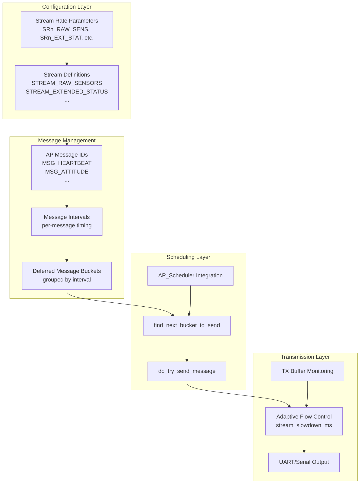
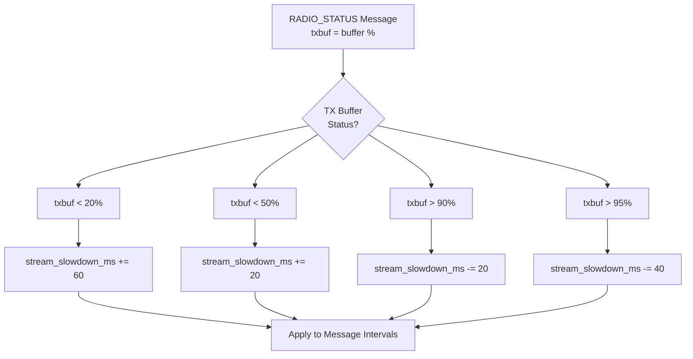
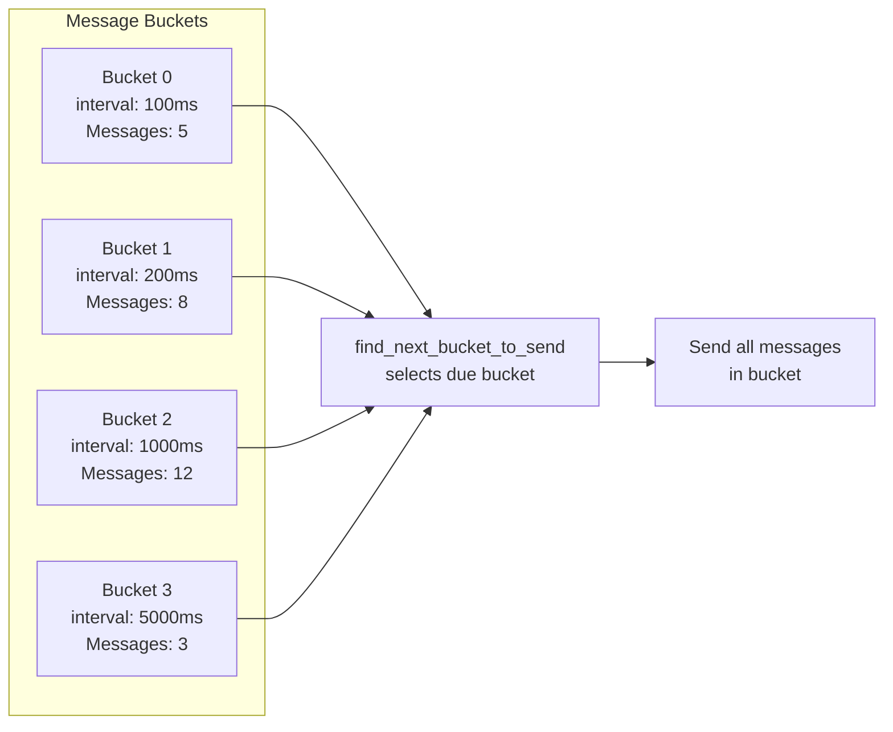

# MAVLink Telemetry Streaming


## Table of Contents
- [Overview](#overview)
- [Streaming Architecture](#streaming-architecture)
- [Stream Types and Message Groups](#stream-types-and-message-groups)
- [Stream Rate Configuration](#stream-rate-configuration)
- [Message Interval Management](#message-interval-management)
- [Bandwidth Management and Flow Control](#bandwidth-management-and-flow-control)
- [Message Scheduling System](#message-scheduling-system)
- [Dynamic Stream Adjustment](#dynamic-stream-adjustment)
- [Per-Channel Configuration](#per-channel-configuration)
- [Integration with AP_Scheduler](#integration-with-ap_scheduler)
- [Configuration Parameters](#configuration-parameters)
- [API Reference](#api-reference)
- [Examples](#examples)
- [Performance Considerations](#performance-considerations)
- [Troubleshooting](#troubleshooting)

## Overview

The MAVLink streaming subsystem in ArduPilot provides a sophisticated telemetry management system that controls when and how frequently MAVLink messages are sent to Ground Control Stations (GCS) and other MAVLink endpoints. The system implements adaptive bandwidth management, message prioritization, and Quality of Service (QoS) mechanisms to ensure reliable telemetry delivery across varying link conditions.

**Key Features:**
- **Organized Stream Groups**: Messages are organized into 10 logical stream groups for easy configuration
- **Adaptive Flow Control**: Automatic rate adjustment based on link capacity and buffer status
- **Message Interval System**: Fine-grained control of individual message transmission intervals
- **Bucket Scheduling**: Efficient message scheduling system using deferred message buckets
- **Per-Channel Configuration**: Independent streaming configuration for each MAVLink channel
- **Bandwidth Optimization**: Dynamic stream slowdown to prevent buffer overrun

**Source Files**: 
- `/libraries/GCS_MAVLink/GCS_Common.cpp` - Core streaming implementation
- `/libraries/GCS_MAVLink/GCS_MAVLink_Parameters.cpp` - Stream parameters and message groups
- `/libraries/GCS_MAVLink/ap_message.h` - Message ID definitions

## Streaming Architecture

The streaming architecture consists of several interrelated components that work together to deliver telemetry efficiently:



### Architecture Components

1. **Stream Groups** (`streams` enum)
   - Source: `/libraries/GCS_MAVLink/GCS.h:270-282`
   - Logical grouping of related messages
   - 10 predefined stream types (RAW_SENSORS, EXTENDED_STATUS, POSITION, etc.)
   - Configured via per-stream rate parameters

2. **AP Message System** (`ap_message` enum)
   - Source: `/libraries/GCS_MAVLink/ap_message.h:14-117`
   - 100+ individual message identifiers
   - Maps to specific MAVLink messages
   - Provides abstraction layer between streams and MAVLink protocol

3. **Message Interval Management**
   - Source: `/libraries/GCS_MAVLink/GCS_Common.cpp:1711-1800`
   - Per-message transmission intervals in milliseconds
   - Dynamic adjustment based on stream rates
   - Configurable via MAV_CMD_SET_MESSAGE_INTERVAL

4. **Bucket Scheduling System**
   - Source: `/libraries/GCS_MAVLink/GCS_Common.cpp:1275-1680`
   - Groups messages with similar intervals into "buckets"
   - Efficient scheduling of multiple messages
   - Prevents message starvation

5. **Adaptive Flow Control**
   - Source: `/libraries/GCS_MAVLink/GCS_Common.cpp:910-945`
   - Monitors TX buffer utilization
   - Dynamically adjusts stream_slowdown_ms
   - Prevents buffer overflow on constrained links

## Stream Types and Message Groups

ArduPilot organizes telemetry into 10 logical stream groups. Each stream contains related messages and can be independently rate-controlled.

### Stream Definitions

#### STREAM_RAW_SENSORS
**Purpose**: Raw and scaled sensor data from IMU, barometer, and airspeed sensors  
**Source**: `/libraries/GCS_MAVLink/GCS_MAVLink_Parameters.cpp:227-237`  
**Messages**:
- `MSG_RAW_IMU` - Raw accelerometer, gyro, magnetometer data
- `MSG_SCALED_IMU2` - Scaled IMU data from second sensor
- `MSG_SCALED_IMU3` - Scaled IMU data from third sensor
- `MSG_SCALED_PRESSURE` - Primary barometer data
- `MSG_SCALED_PRESSURE2` - Secondary barometer data
- `MSG_SCALED_PRESSURE3` - Tertiary barometer data
- `MSG_AIRSPEED` - Airspeed sensor data (if AP_AIRSPEED_ENABLED)

**Default Rates** (Hz):
- ArduCopter/Heli/Blimp: 0
- ArduPlane: 1
- Rover/AntennaTracker: 1
- ArduSub: 2

**Parameter**: `SRn_RAW_SENS` (where n is channel number 0-3)

#### STREAM_EXTENDED_STATUS
**Purpose**: System status, GPS, navigation, and fence information  
**Source**: `/libraries/GCS_MAVLink/GCS_MAVLink_Parameters.cpp:239-269`  
**Messages**:
- `MSG_SYS_STATUS` - System health, voltage, current
- `MSG_POWER_STATUS` - Detailed power status
- `MSG_MCU_STATUS` - MCU temperature and resource usage
- `MSG_MEMINFO` - Memory utilization
- `MSG_CURRENT_WAYPOINT` - Active mission item
- `MSG_GPS_RAW` - GPS position, velocity, accuracy
- `MSG_GPS_RTK` - RTK GPS correction status
- `MSG_GPS2_RAW` - Secondary GPS data
- `MSG_GPS2_RTK` - Secondary GPS RTK status
- `MSG_NAV_CONTROLLER_OUTPUT` - Navigation controller state
- `MSG_FENCE_STATUS` - Geofence status
- `MSG_POSITION_TARGET_GLOBAL_INT` - Target position
- `MSG_NAMED_FLOAT` - Named debug values (ArduSub only)

**Default Rates** (Hz):
- ArduCopter/Heli/Blimp: 0
- ArduPlane/Rover/AntennaTracker: 1
- ArduSub: 2

**Parameter**: `SRn_EXT_STAT`

#### STREAM_POSITION
**Purpose**: Vehicle position in global and local coordinates  
**Source**: `/libraries/GCS_MAVLink/GCS_MAVLink_Parameters.cpp:271-276`  
**Messages**:
- `MSG_LOCATION` - Global position (lat/lon/alt)
- `MSG_LOCAL_POSITION` - Local NED position and velocity

**Default Rates** (Hz):
- ArduCopter/Heli/Blimp: 0
- ArduPlane/Rover/AntennaTracker: 1
- ArduSub: 3

**Parameter**: `SRn_POSITION`

#### STREAM_RAW_CONTROLLER
**Purpose**: Raw controller outputs (vehicle-specific)  
**Source**: `/libraries/GCS_MAVLink/GCS_MAVLink_Parameters.cpp:278-282`  
**Messages**:
- `MSG_SERVO_OUT` - Individual servo outputs (Rover only)

**Default Rates** (Hz):
- All vehicles except Rover: 0
- Rover: 1

**Parameter**: `SRn_RAW_CTRL`

#### STREAM_RC_CHANNELS
**Purpose**: RC input and servo output values  
**Source**: `/libraries/GCS_MAVLink/GCS_MAVLink_Parameters.cpp:284-290`  
**Messages**:
- `MSG_SERVO_OUTPUT_RAW` - PWM output values
- `MSG_RC_CHANNELS` - RC input channels
- `MSG_RC_CHANNELS_RAW` - Raw RC input (MAVLink v1 only)

**Default Rates** (Hz):
- ArduCopter/Heli/Blimp: 0
- ArduPlane/Rover/AntennaTracker: 1
- ArduSub: 2

**Parameter**: `SRn_RC_CHAN`

#### STREAM_EXTRA1
**Purpose**: Attitude, simulation data, and auxiliary telemetry  
**Source**: `/libraries/GCS_MAVLink/GCS_MAVLink_Parameters.cpp:292-330`  
**Messages**:
- `MSG_ATTITUDE` - Roll, pitch, yaw, rates
- `MSG_SIMSTATE` - Simulator state (SITL only)
- `MSG_AHRS2` - Secondary AHRS solution
- `MSG_RPM` - Engine/motor RPM
- `MSG_AOA_SSA` - Angle of attack, sideslip (Plane only)
- `MSG_PID_TUNING` - PID tuning data
- `MSG_LANDING` - Landing state (Plane with deepstall)
- `MSG_ESC_TELEMETRY` - ESC temperature, current, RPM
- `MSG_WHEEL_DISTANCE` - Wheel encoder data (Rover)
- `MSG_GENERATOR_STATUS` - Generator telemetry
- `MSG_WINCH_STATUS` - Winch position and load
- `MSG_EFI_STATUS` - Electronic fuel injection data
- `MSG_HYGROMETER` - Humidity sensor data

**Default Rates** (Hz):
- ArduCopter/Heli/Blimp: 0
- ArduPlane/Rover/AntennaTracker: 1
- ArduSub: 10

**Parameter**: `SRn_EXTRA1`

#### STREAM_EXTRA2
**Purpose**: VFR HUD data for cockpit displays  
**Source**: `/libraries/GCS_MAVLink/GCS_MAVLink_Parameters.cpp:332-337`  
**Messages**:
- `MSG_VFR_HUD` - Airspeed, groundspeed, heading, throttle, altitude, climb

**Default Rates** (Hz):
- ArduCopter/Heli/Blimp: 0
- ArduPlane/Rover/AntennaTracker: 1
- ArduSub: 10

**Parameter**: `SRn_EXTRA2`

#### STREAM_EXTRA3
**Purpose**: Extended sensor and estimation data  
**Source**: `/libraries/GCS_MAVLink/GCS_MAVLink_Parameters.cpp:339-373`  
**Messages**:
- `MSG_AHRS` - AHRS solution (DCM or EKF)
- `MSG_WIND` - Wind estimation
- `MSG_RANGEFINDER` - Rangefinder distance
- `MSG_WATER_DEPTH` - Depth sounder (Rover only)
- `MSG_DISTANCE_SENSOR` - Distance sensors (all directions)
- `MSG_SYSTEM_TIME` - System time synchronization
- `MSG_TERRAIN_REPORT` - Terrain database status
- `MSG_TERRAIN_REQUEST` - Terrain data requests
- `MSG_BATTERY_STATUS` - Detailed battery information
- `MSG_GIMBAL_DEVICE_ATTITUDE_STATUS` - Gimbal orientation
- `MSG_OPTICAL_FLOW` - Optical flow sensor data
- `MSG_MAG_CAL_REPORT` - Magnetometer calibration status
- `MSG_MAG_CAL_PROGRESS` - Compass calibration progress
- `MSG_EKF_STATUS_REPORT` - EKF health and variance
- `MSG_VIBRATION` - Accelerometer vibration levels

**Default Rates** (Hz):
- ArduCopter/Heli/Blimp: 0
- ArduPlane/Rover/AntennaTracker: 1
- ArduSub: 3

**Parameter**: `SRn_EXTRA3`

#### STREAM_PARAMS
**Purpose**: Parameter list transmission  
**Source**: `/libraries/GCS_MAVLink/GCS_MAVLink_Parameters.cpp:375-378`  
**Messages**:
- `MSG_NEXT_PARAM` - Next parameter in sequence
- `MSG_AVAILABLE_MODES` - List of available flight modes

**Default Rates** (Hz):
- ArduCopter/Heli/Blimp: 0
- ArduPlane/Rover/AntennaTracker: 10
- ArduSub: 0

**Parameter**: `SRn_PARAMS`

**Note**: Parameter streaming is forced to minimum 100ms interval (10Hz max) even if disabled, ensuring vehicle recovery from bad configuration (source: `GCS_Common.cpp:1713-1721`).

#### STREAM_ADSB
**Purpose**: ADS-B and AIS traffic information  
**Source**: `/libraries/GCS_MAVLink/GCS_MAVLink_Parameters.cpp:380-385`  
**Messages**:
- `MSG_ADSB_VEHICLE` - Aircraft traffic data
- `MSG_AIS_VESSEL` - Marine vessel traffic

**Default Rates** (Hz):
- ArduCopter/Heli/Blimp/Rover/AntennaTracker/ArduSub: 0
- ArduPlane: 5

**Parameter**: `SRn_ADSB`

### Stream-to-Message Mapping

The `all_stream_entries[]` array defines the complete mapping between streams and messages:

**Source**: `/libraries/GCS_MAVLink/GCS_MAVLink_Parameters.cpp:396-408`

```cpp
const struct GCS_MAVLINK::stream_entries GCS_MAVLINK::all_stream_entries[] = {
    MAV_STREAM_ENTRY(STREAM_RAW_SENSORS),
    MAV_STREAM_ENTRY(STREAM_EXTENDED_STATUS),
    MAV_STREAM_ENTRY(STREAM_POSITION),
    MAV_STREAM_ENTRY(STREAM_RAW_CONTROLLER),
    MAV_STREAM_ENTRY(STREAM_RC_CHANNELS),
    MAV_STREAM_ENTRY(STREAM_EXTRA1),
    MAV_STREAM_ENTRY(STREAM_EXTRA2),
    MAV_STREAM_ENTRY(STREAM_EXTRA3),
    MAV_STREAM_ENTRY(STREAM_PARAMS),
    MAV_STREAM_ENTRY(STREAM_ADSB),
    MAV_STREAM_TERMINATOR // must be at end
};
```

Each entry contains:
- `stream_id` - The stream enum identifier
- `ap_message_ids` - Pointer to array of message IDs in this stream
- `num_ap_message_ids` - Count of messages in the array

## Stream Rate Configuration

Stream rates control how frequently messages within a stream are transmitted. Rates are specified in Hertz (Hz) and converted to intervals internally.

### Parameter Format

Each MAVLink channel has its own set of stream rate parameters:
- **Format**: `SRn_STREAMNAME` where n is channel number (0-3)
- **Example**: `SR0_RAW_SENS` controls raw sensor stream on channel 0 (typically USB/primary telemetry)
- **Units**: Hz (messages per second)
- **Range**: 0-50 Hz
- **Default**: Varies by vehicle type (see stream definitions above)

### Interval Calculation

Stream rates (in Hz) are converted to transmission intervals (in milliseconds):

**Source**: `/libraries/GCS_MAVLink/GCS_Common.cpp:6783-6794`

```cpp
uint16_t GCS_MAVLINK::get_interval_for_stream(GCS_MAVLINK::streams id) const
{
    const int16_t frate = streamRates[id].get();  // Get rate in Hz
    if (frate == 0) {
        return 0;  // Stream disabled
    }
    const uint32_t ret = 1000/frate;  // Convert to milliseconds
    if (ret > 60000) {
        return 60000;  // Cap at 60 seconds
    }
    return ret;
}
```

**Conversion Examples**:
- 10 Hz → 100ms interval
- 5 Hz → 200ms interval
- 1 Hz → 1000ms interval
- 0 Hz → 0 (disabled)

### Stream Initialization

When the MAVLink subsystem initializes, stream rates are converted to per-message intervals:

**Source**: `/libraries/GCS_MAVLink/GCS_Common.cpp:6988-7003`

```cpp
void GCS_MAVLINK::initialise_message_intervals_from_streamrates()
{
    // Convert all stream rates to message intervals
    for (uint8_t i=0; all_stream_entries[i].ap_message_ids != nullptr; i++) {
        initialise_message_intervals_for_stream(all_stream_entries[i].stream_id);
    }
    
    // Special handling for heartbeat
    #if HAL_HIGH_LATENCY2_ENABLED
    if (!is_high_latency_link) {
        set_mavlink_message_id_interval(MAVLINK_MSG_ID_HEARTBEAT, 1000);
    } else {
        set_mavlink_message_id_interval(MAVLINK_MSG_ID_HIGH_LATENCY2, 5000);
    }
    #else
    set_mavlink_message_id_interval(MAVLINK_MSG_ID_HEARTBEAT, 1000);
    #endif
}
```

The `initialise_message_intervals_for_stream()` function applies the stream's interval to all messages in that stream:

**Source**: `/libraries/GCS_MAVLink/GCS_Common.cpp:6796-6810`

```cpp
void GCS_MAVLINK::initialise_message_intervals_for_stream(GCS_MAVLINK::streams id)
{
    // Find the stream entry
    for (uint8_t i=0; all_stream_entries[i].ap_message_ids != nullptr; i++) {
        const GCS_MAVLINK::stream_entries &entries = all_stream_entries[i];
        if (entries.stream_id != id) {
            continue;
        }
        // Found it! Set interval for all messages in stream
        const uint16_t interval_ms = get_interval_for_stream(id);
        for (uint8_t j=0; j<entries.num_ap_message_ids; j++) {
            set_ap_message_interval(entries.ap_message_ids[j], interval_ms);
        }
        break;
    }
}
```

## Message Interval Management

While stream rates provide coarse control over groups of messages, the message interval system provides fine-grained control over individual message transmission timing.

### Setting Message Intervals

The `set_ap_message_interval()` function is the core of interval management:

**Source**: `/libraries/GCS_MAVLink/GCS_Common.cpp:1711-1800`

```cpp
bool GCS_MAVLINK::set_ap_message_interval(enum ap_message id, uint16_t interval_ms)
{
    // Special handling for parameters - never fully disable
    if (id == MSG_NEXT_PARAM) {
        if (interval_ms == 0) {
            interval_ms = 100;  // Minimum 100ms
        } else if (interval_ms > 1000) {
            interval_ms = 1000;  // Maximum 1000ms
        }
    }

    #if AP_SCHEDULER_ENABLED
    interval_ms = cap_message_interval(interval_ms);
    #endif

    // Check if it's a specially-handled deferred message
    const int8_t deferred_offset = get_deferred_message_index(id);
    if (deferred_offset != -1) {
        deferred_message[deferred_offset].interval_ms = interval_ms;
        deferred_message[deferred_offset].last_sent_ms = AP_HAL::millis16();
        return true;
    }

    // For normal messages, find appropriate bucket...
    // (bucket assignment logic follows)
}
```

### Message Interval Capping

To ensure the system remains responsive and messages can be sent within scheduler constraints, intervals are capped:

**Source**: `/libraries/GCS_MAVLink/GCS_Common.cpp:262-273`

```cpp
uint16_t GCS_MAVLINK::cap_message_interval(uint16_t interval_ms) const
{
    // Cap interval to prevent slowdown from blocking transmission
    const uint16_t stream_slowdown = get_stream_slowdown_ms();
    
    // If interval + slowdown exceeds available time, cap it
    if (interval_ms + stream_slowdown > available_time_ms) {
        interval_ms = available_time_ms - stream_slowdown;
    }
    
    return interval_ms;
}
```

### Retrieving Default Intervals

Ground stations can query default intervals for any message:

**Source**: `/libraries/GCS_MAVLink/GCS_Common.cpp:7005-7041`

```cpp
bool GCS_MAVLINK::get_default_interval_for_ap_message(const ap_message id, 
                                                      uint16_t &interval) const
{
    // Heartbeat is special - always 1Hz
    if (id == MSG_HEARTBEAT) {
        interval = 1000;
        return true;
    }

    #if HAL_HIGH_LATENCY2_ENABLED
    if (id == MSG_HIGH_LATENCY2) {
        interval = 5000;  // 0.2 Hz for high-latency links
        return true;
    }
    #endif

    #if HAL_MAVLINK_INTERVALS_FROM_FILES_ENABLED
    // Check for user-configured defaults from files
    if (default_intervals_from_files != nullptr &&
        default_intervals_from_files->get_interval_for_ap_message_id(id, interval)) {
        return true;
    }
    #endif

    // Find which stream this message belongs to
    for (uint8_t i=0; all_stream_entries[i].ap_message_ids != nullptr; i++) {
        const GCS_MAVLINK::stream_entries &entries = all_stream_entries[i];
        for (uint8_t j=0; j<entries.num_ap_message_ids; j++) {
            if (entries.ap_message_ids[j] == id) {
                interval = get_interval_for_stream(all_stream_entries[i].stream_id);
                return true;
            }
        }
    }
    return false;  // Message not found in any stream
}
```

### MAVLink Protocol Commands

Ground stations can dynamically change message intervals using MAVLink commands:

#### MAV_CMD_SET_MESSAGE_INTERVAL (Command ID 511)

**Source**: `/libraries/GCS_MAVLink/GCS_Common.cpp:3167-3215`

```cpp
MAV_RESULT GCS_MAVLINK::set_message_interval(uint32_t msg_id, int32_t interval_us)
{
    // Convert MAVLink message ID to ap_message ID
    ap_message id;
    if (!get_ap_message_id_from_mavlink_message_id(msg_id, id)) {
        return MAV_RESULT_FAILED;  // Unknown message
    }

    uint16_t interval_ms;
    if (interval_us == 0) {
        // Use default interval from stream configuration
        if (!get_default_interval_for_ap_message(id, interval_ms)) {
            return MAV_RESULT_FAILED;
        }
    } else if (interval_us == -1) {
        // Disable message
        interval_ms = 0;
    } else {
        // Convert microseconds to milliseconds
        interval_ms = interval_us / 1000;
    }

    // Check if capping would prevent achieving requested rate
    if (interval_ms != 0 && cap_message_interval(interval_ms) > interval_ms) {
        return MAV_RESULT_TEMPORARILY_REJECTED;
    }

    // Apply the new interval
    if (set_ap_message_interval(id, interval_ms)) {
        return MAV_RESULT_ACCEPTED;
    }
    
    return MAV_RESULT_FAILED;
}
```

**Parameters**:
- `param1` - MAVLink message ID
- `param2` - Interval in microseconds (0=default, -1=disable, >0=interval)

**Return Values**:
- `MAV_RESULT_ACCEPTED` - Interval successfully set
- `MAV_RESULT_TEMPORARILY_REJECTED` - Requested rate not achievable due to bandwidth limits
- `MAV_RESULT_FAILED` - Unknown message or other error

#### MAV_CMD_GET_MESSAGE_INTERVAL (Command ID 510)

**Source**: `/libraries/GCS_MAVLink/GCS_Common.cpp:3296-3323`

```cpp
MAV_RESULT GCS_MAVLINK::handle_command_get_message_interval(const mavlink_command_int_t &packet)
{
    const uint32_t mavlink_id = packet.param1;

    // Check if we have buffer space for reply
    if (txspace() < PAYLOAD_SIZE(chan, MESSAGE_INTERVAL) + 
                   PAYLOAD_SIZE(chan, COMMAND_ACK)) {
        return MAV_RESULT_TEMPORARILY_REJECTED;
    }

    // Convert to ap_message
    ap_message id;
    if (!get_ap_message_id_from_mavlink_message_id(mavlink_id, id)) {
        mavlink_msg_message_interval_send(chan, mavlink_id, 0); // not available
        return MAV_RESULT_ACCEPTED;
    }

    uint16_t interval_ms;
    if (!get_ap_message_interval(id, interval_ms) || interval_ms == 0) {
        // Message not being streamed
        mavlink_msg_message_interval_send(chan, mavlink_id, -1); // disabled
        return MAV_RESULT_ACCEPTED;
    }

    // Send current interval (convert ms to us)
    mavlink_msg_message_interval_send(chan, mavlink_id, interval_ms * 1000);
    return MAV_RESULT_ACCEPTED;
}
```

## Bandwidth Management and Flow Control

ArduPilot implements sophisticated adaptive flow control to prevent telemetry buffer overflow and optimize link utilization.

### Adaptive Stream Slowdown

The system monitors radio buffer status and dynamically adjusts `stream_slowdown_ms` to match link capacity:

**Source**: `/libraries/GCS_MAVLink/GCS_Common.cpp:910-945`



**Implementation**:

```cpp
void GCS_MAVLINK::handle_radio_status(const mavlink_message_t &msg)
{
    mavlink_radio_t packet;
    mavlink_msg_radio_decode(&msg, &packet);
    
    // Use transmit buffer state for adaptive flow control
    if (packet.txbuf < 20 && stream_slowdown_ms < 2000) {
        // Very low on space - slow down a lot
        stream_slowdown_ms += 60;
    } else if (packet.txbuf < 50 && stream_slowdown_ms < 2000) {
        // Low on space - slow down slightly
        stream_slowdown_ms += 20;
    } else if (packet.txbuf > 95 && stream_slowdown_ms > 200) {
        // Plenty of space - speed up a lot
        stream_slowdown_ms -= 40;
    } else if (packet.txbuf > 90 && stream_slowdown_ms != 0) {
        // Good space - speed up a bit
        if (stream_slowdown_ms > 20) {
            stream_slowdown_ms -= 20;
        } else {
            stream_slowdown_ms = 0;
        }
    }
    
    // Cap maximum slowdown
    if (stream_slowdown_ms > 2000) {
        stream_slowdown_ms = 2000;
    }
}
```

### Stream Slowdown Application

The `stream_slowdown_ms` value is added to every message interval:

**Source**: `/libraries/GCS_MAVLink/GCS_Common.cpp:1238-1255`

```cpp
uint16_t GCS_MAVLINK::get_reschedule_interval_ms(const deferred_message_bucket_t &deferred) const
{
    uint16_t interval_ms = deferred.interval_ms;
    
    // Add adaptive slowdown
    interval_ms += stream_slowdown_ms;
    
    // Ensure we don't exceed maximum reasonable interval
    if (interval_ms > 60000) {
        interval_ms = 60000;
    }
    
    return interval_ms;
}
```

### Buffer Capacity Monitoring

The system tracks channel activity and streaming status:

**Source**: `/libraries/GCS_MAVLink/GCS_Common.cpp:1826-1830, GCS.h:291-293`

```cpp
// Update streaming channel mask
if (is_streaming()) {
    GCS_MAVLINK::chan_is_streaming |= (1U<<(chan-MAVLINK_COMM_0));
} else {
    GCS_MAVLINK::chan_is_streaming &= ~(1U<<(chan-MAVLINK_COMM_0));
}

// Check if channel is actively streaming
bool is_streaming() const {
    return sending_bucket_id != no_bucket_to_send;
}
```

### Flow Control Strategies

**Bandwidth Optimization Techniques**:

1. **Graduated Response**
   - TX buffer 0-20%: Aggressive slowdown (+60ms per update)
   - TX buffer 20-50%: Moderate slowdown (+20ms per update)
   - TX buffer 90-95%: Moderate speedup (-20ms per update)
   - TX buffer >95%: Aggressive speedup (-40ms per update)

2. **Slowdown Limiting**
   - Minimum slowdown: 0ms (no throttling)
   - Maximum slowdown: 2000ms (prevents complete stall)
   - Maximum interval: 60000ms (prevents wraparound issues)

3. **Recovery Mechanism**
   - Slowdown decreases automatically when buffer space available
   - Gradual recovery prevents oscillation
   - Different rates for increase vs decrease provides hysteresis

4. **Special Message Handling**
   - Parameters: Always sent even if interval is 0, capped at 1Hz max
   - Heartbeat: Fixed 1Hz, never adjusted by flow control
   - High-latency mode: Switches to HIGH_LATENCY2 message at 0.2Hz

## Message Scheduling System

The message scheduling system uses a bucket-based architecture to efficiently manage the transmission of many messages with different intervals.

### Bucket Architecture

Messages with similar transmission intervals are grouped into "buckets":



**Bucket Structure** (`deferred_message_bucket_t`):
- `interval_ms` - Transmission interval for this bucket
- `last_sent_ms` - Last time bucket was transmitted (16-bit timestamp)
- `ap_message_ids` - Bitmask of message IDs in this bucket

### Bucket Selection Algorithm

The `find_next_bucket_to_send()` function selects which bucket to process:

**Source**: `/libraries/GCS_MAVLink/GCS_Common.cpp:1275-1310`

```cpp
void GCS_MAVLINK::find_next_bucket_to_send()
{
    const uint16_t now16_ms = AP_HAL::millis16();
    
    sending_bucket_id = no_bucket_to_send;
    
    // Scan all buckets for one that's due
    for (uint8_t i=0; i<ARRAY_SIZE(deferred_message_bucket); i++) {
        if (deferred_message_bucket[i].ap_message_ids.count() == 0) {
            continue;  // Empty bucket
        }
        
        const uint16_t interval = get_reschedule_interval_ms(deferred_message_bucket[i]);
        const uint16_t ms_since_last_sent = now16_ms - deferred_message_bucket[i].last_sent_ms;
        
        // Check if this bucket is due
        if (ms_since_last_sent >= interval) {
            sending_bucket_id = i;
            break;  // Found one, use it
        }
    }
    
    if (sending_bucket_id != no_bucket_to_send) {
        // Copy message IDs to send list
        bucket_message_ids_to_send = deferred_message_bucket[sending_bucket_id].ap_message_ids;
    }
}
```

**Selection Strategy**:
- Buckets are checked in order (0, 1, 2, ...)
- First bucket that is "due" (interval has elapsed) is selected
- Due calculation: `current_time - last_sent_time >= interval`
- Uses 16-bit millisecond timestamps (wraps every ~65 seconds)

### Message Transmission Loop

Once a bucket is selected, all messages in that bucket are attempted:

**Source**: `/libraries/GCS_MAVLink/GCS_Common.cpp:1315-1680`

```cpp
while (sending_bucket_id != no_bucket_to_send) {
    const uint16_t now16_ms = AP_HAL::millis16();
    const uint16_t ms_since_last_sent = 
        now16_ms - deferred_message_bucket[sending_bucket_id].last_sent_ms;
    
    // Check if still due (may have been delayed)
    if (ms_since_last_sent < get_reschedule_interval_ms(
                                deferred_message_bucket[sending_bucket_id])) {
        // Not due anymore, find next bucket
        find_next_bucket_to_send();
        continue;
    }
    
    // Try to send next message from bucket
    const ap_message next = bucket_message_ids_to_send.first_set();
    if (next != MSG_LAST) {
        bucket_message_ids_to_send.clear(next);
        
        if (!do_try_send_message(next)) {
            // Failed to send (no buffer space)
            break;
        }
        
        // Successfully sent
        if (bucket_message_ids_to_send.count() == 0) {
            // All messages in bucket sent
            const uint16_t interval_ms = get_reschedule_interval_ms(
                                           deferred_message_bucket[sending_bucket_id]);
            deferred_message_bucket[sending_bucket_id].last_sent_ms += interval_ms;
            
            // Check for large time skips (clock jumped)
            if (uint16_t(start16 - deferred_message_bucket[sending_bucket_id].last_sent_ms) 
                > interval_ms) {
                deferred_message_bucket[sending_bucket_id].last_sent_ms = start16;
            }
            
            // Find next bucket to send
            find_next_bucket_to_send();
        }
    }
}
```

### Bucket Assignment

When a message interval is set, the message is assigned to an appropriate bucket:

**Source**: `/libraries/GCS_MAVLink/GCS_Common.cpp:1735-1800`

```cpp
// Find closest bucket by interval
int8_t closest_bucket = -1;
uint16_t closest_bucket_interval_delta = UINT16_MAX;
int8_t in_bucket = -1;
int8_t empty_bucket_id = -1;

for (uint8_t i=0; i<ARRAY_SIZE(deferred_message_bucket); i++) {
    const deferred_message_bucket_t &bucket = deferred_message_bucket[i];
    
    if (bucket.interval_ms == 0) {
        // Unused bucket
        if (empty_bucket_id == -1) {
            empty_bucket_id = i;
        }
        continue;
    }
    
    if (bucket.ap_message_ids.get(id)) {
        in_bucket = i;  // Message already in this bucket
    }
    
    const uint16_t interval_delta = abs(bucket.interval_ms - interval_ms);
    if (interval_delta < closest_bucket_interval_delta) {
        closest_bucket = i;
        closest_bucket_interval_delta = interval_delta;
    }
}

// Decision logic:
// 1. If message is already in a bucket and closest bucket has same interval, don't move it
// 2. If closest bucket has exact interval match, move message there
// 3. If no exact match, use empty bucket or closest bucket
// 4. Messages with similar intervals share buckets for efficiency
```

### Deferred Messages

Some high-priority messages bypass the bucket system and use direct scheduling:

**Source**: Referenced in `GCS_Common.cpp:1728-1733`

```cpp
const int8_t deferred_offset = get_deferred_message_index(id);
if (deferred_offset != -1) {
    // This is a specially-handled deferred message
    deferred_message[deferred_offset].interval_ms = interval_ms;
    deferred_message[deferred_offset].last_sent_ms = AP_HAL::millis16();
    return true;
}
```

**Deferred message types** (handled separately from buckets):
- Mission acknowledgments
- Parameter responses
- Command acknowledgments
- Other time-critical responses

These messages are checked and sent before bucket messages in the main update loop.

## Dynamic Stream Adjustment

The streaming system adapts to changing conditions dynamically without requiring parameter changes or reboots.

### Run-Time Adjustment Mechanisms

**1. MAVLink Command Interface**

Ground stations can adjust individual message rates using `MAV_CMD_SET_MESSAGE_INTERVAL`:

```cpp
// Example: Set ATTITUDE message to 20Hz (50ms interval)
MAV_CMD_SET_MESSAGE_INTERVAL
    param1: MAVLINK_MSG_ID_ATTITUDE (30)
    param2: 50000 (microseconds)
    
// Example: Disable GPS_RAW messages
MAV_CMD_SET_MESSAGE_INTERVAL
    param1: MAVLINK_MSG_ID_GPS_RAW_INT (24)
    param2: -1 (disable)
    
// Example: Restore default rate
MAV_CMD_SET_MESSAGE_INTERVAL
    param1: MAVLINK_MSG_ID_ATTITUDE (30)
    param2: 0 (use default from stream configuration)
```

**2. Automatic Link Quality Adaptation**

The system automatically adjusts based on radio link quality:

```cpp
// When RADIO_STATUS received:
// - Low buffer → Increase stream_slowdown_ms → All messages slower
// - High buffer → Decrease stream_slowdown_ms → All messages faster
// Effect is immediate on next bucket transmission
```

**3. Per-Channel Independence**

Each MAVLink channel maintains independent streaming state:
- Channel 0 (USB/Primary): Often high-bandwidth, low latency
- Channel 1 (Telemetry 1): May have bandwidth limits
- Channel 2 (Telemetry 2): May be low-bandwidth long-range link
- Channel 3 (Telemetry 3): Optional additional link

Each channel has:
- Independent `stream_slowdown_ms` value
- Independent bucket state and timing
- Independent parameter configuration (`SR0_*`, `SR1_*`, etc.)

### Load Shedding

When the system detects it cannot keep up with requested rates:

**Source**: `/libraries/GCS_MAVLink/GCS_Common.cpp:1370-1410`

```cpp
bool GCS_MAVLINK::do_try_send_message(const ap_message id)
{
    const uint32_t start_us = AP_HAL::micros();
    
    // Attempt to send the message
    if (!try_send_message(id)) {
        // No buffer space available
        try_send_message_stats.no_space_for_message++;
        return false;
    }
    
    const uint32_t delta_us = AP_HAL::micros() - start_us;
    
    // Track longest send time for diagnostics
    if (delta_us > try_send_message_stats.longest_time_us) {
        try_send_message_stats.longest_time_us = delta_us;
        try_send_message_stats.longest_id = id;
    }
    
    // Detect if we're consistently behind schedule
    if (delta_us > expected_time_per_message_us) {
        try_send_message_stats.behind++;
        if (try_send_message_stats.behind > 100) {
            // We're consistently unable to keep up
            // Flow control will naturally slow down streams
            // via radio buffer monitoring
        }
    }
    
    return true;
}
```

**Load Shedding Strategies**:

1. **Automatic Rate Reduction**
   - When TX buffer fills → stream_slowdown_ms increases
   - All message intervals effectively increase
   - No messages are completely dropped, just delayed

2. **Priority Preservation**
   - Deferred messages (acks, responses) sent before bucket messages
   - Heartbeat always sent at 1Hz regardless of slowdown
   - Parameters always sent even if rate is 0

3. **Bucket Skipping**
   - If bucket transmission takes too long, bucket may be skipped
   - Next bucket check uses actual elapsed time
   - Prevents cascade failures from one slow message

### High-Latency Mode

For satellite or very low bandwidth links, a special high-latency mode is available:

**Source**: `/libraries/GCS_MAVLink/GCS_Common.cpp:6994-7002`

```cpp
#if HAL_HIGH_LATENCY2_ENABLED
if (!is_high_latency_link) {
    // Normal mode: Heartbeat at 1Hz
    set_mavlink_message_id_interval(MAVLINK_MSG_ID_HEARTBEAT, 1000);
} else {
    // High-latency mode: Compressed telemetry at 0.2Hz
    set_mavlink_message_id_interval(MAVLINK_MSG_ID_HIGH_LATENCY2, 5000);
}
#else
// Standard heartbeat
set_mavlink_message_id_interval(MAVLINK_MSG_ID_HEARTBEAT, 1000);
#endif
```

**HIGH_LATENCY2 Message**:
- Compressed status message with essential telemetry
- Position, attitude, velocity, battery, flight mode
- Single message replaces dozens of normal messages
- Designed for satellite links with high cost per byte
- 5 second interval (0.2 Hz) suitable for Iridium, RockBLOCK, etc.

## Per-Channel Configuration

Each MAVLink channel can have completely different streaming configurations to match link characteristics.

### Channel Parameter Sets

**Channel 0** (`SR0_*` parameters):
```
SR0_RAW_SENS  = 2    # 2 Hz raw sensors
SR0_EXT_STAT  = 2    # 2 Hz status
SR0_RC_CHAN   = 2    # 2 Hz RC/servo
SR0_POSITION  = 3    # 3 Hz position
SR0_EXTRA1    = 10   # 10 Hz attitude/tuning
SR0_EXTRA2    = 10   # 10 Hz VFR_HUD
SR0_EXTRA3    = 3    # 3 Hz AHRS/sensors
SR0_PARAMS    = 0    # On-demand
SR0_ADSB      = 0    # Off
```

**Channel 1** (`SR1_*` parameters):
```
SR1_RAW_SENS  = 1    # 1 Hz raw sensors
SR1_EXT_STAT  = 1    # 1 Hz status
SR1_RC_CHAN   = 1    # 1 Hz RC/servo
SR1_POSITION  = 1    # 1 Hz position
SR1_EXTRA1    = 1    # 1 Hz attitude
SR1_EXTRA2    = 1    # 1 Hz VFR_HUD
SR1_EXTRA3    = 1    # 1 Hz AHRS/sensors
SR1_PARAMS    = 10   # 10 Hz parameters
SR1_ADSB      = 5    # 5 Hz traffic
```

### Channel Selection Strategy

**Common Configurations**:

**High-Bandwidth USB (Channel 0)**:
- Use for development and tuning
- High rates for EXTRA1/EXTRA2 (attitude, tuning data)
- Real-time PID tuning visualization
- Parameter downloads

**Medium-Bandwidth Telemetry Radio (Channel 1)**:
- 57600 baud typical
- 1-2 Hz for most streams
- Good balance of information and bandwidth
- Suitable for RFD900, SiK radio

**Low-Bandwidth Long-Range (Channel 2)**:
- 9600 baud or lower
- 0-1 Hz for critical streams only
- May use high-latency mode
- Suitable for LoRa, 900MHz low power

**Mission-Specific (Channel 3)**:
- Custom rates for specific payloads
- May stream only specific messages
- Example: High-rate camera telemetry only

### Channel-Specific Options

The `MAVn_OPTIONS` parameter provides per-channel behavioral flags:

**Source**: `/libraries/GCS_MAVLink/GCS_MAVLink_Parameters.cpp:210-216`

```cpp
// @Param: _OPTIONS
// @DisplayName: Bitmask for configuring this telemetry channel
// @Description: Bitmask for configuring this telemetry channel
// @RebootRequired: True
// @User: Standard
// @Bitmask: 1:Don't forward mavlink to/from, 2:Ignore Streamrate
AP_GROUPINFO("_OPTIONS", 20, GCS_MAVLINK, options, 0),
```

**Option Bits**:
- **Bit 0 (0x01)**: Don't forward MAVLink to/from this channel
  - Prevents routing messages through this channel
  - Use when channel should only receive direct commands
  
- **Bit 1 (0x02)**: Ignore stream rates
  - Disables automatic streaming on this channel
  - Messages only sent when explicitly requested
  - Use for command-only or on-demand telemetry links

**Example Use Cases**:

```
# Channel 0: Normal streaming
MAV0_OPTIONS = 0

# Channel 1: No forwarding (prevent loop with dual telemetry)
MAV1_OPTIONS = 1

# Channel 2: On-demand only (low-bandwidth link)
MAV2_OPTIONS = 2

# Channel 3: Isolated command channel
MAV3_OPTIONS = 3 (no forwarding + ignore streams)
```

## Integration with AP_Scheduler

The MAVLink streaming system integrates tightly with ArduPilot's main scheduler to ensure deterministic, real-time operation.

### Scheduler Task Registration

MAVLink update is registered as a scheduled task in each vehicle's main loop:

**Example from ArduCopter** (`ArduCopter/Copter.cpp:scheduler_tasks[]`):

```cpp
const AP_Scheduler::Task Copter::scheduler_tasks[] = {
    // ...
    SCHED_TASK(gcs_update,                400,    300, 18),   // 400Hz, 300us budget
    SCHED_TASK(gcs_data_stream_send,      250,    750, 21),   // 250Hz, 750us budget
    // ...
};
```

**Two MAVLink Tasks**:

1. **`gcs_update()`** - 400 Hz
   - Receives and processes incoming MAVLink messages
   - Handles commands, parameter requests, mission uploads
   - Fast response for critical commands

2. **`gcs_data_stream_send()`** - 250 Hz
   - Sends outgoing telemetry messages
   - Processes message buckets and deferred messages
   - Respects time budget to prevent scheduler overrun

### Time Budget Management

Each task has an allocated time budget in microseconds. The streaming system must respect this budget to prevent affecting flight-critical tasks.

**Source**: Integration with scheduler timing

```cpp
void GCS::data_stream_send()
{
    const uint32_t start_us = AP_HAL::micros();
    const uint32_t budget_us = 750;  // From scheduler task definition
    
    // Process each active channel
    for (uint8_t i=0; i<num_gcs(); i++) {
        GCS_MAVLINK *chan = chan(i);
        if (!chan->is_active()) {
            continue;
        }
        
        // Check remaining budget
        const uint32_t elapsed_us = AP_HAL::micros() - start_us;
        if (elapsed_us >= budget_us) {
            // Out of time, defer to next call
            break;
        }
        
        // Update this channel
        const uint32_t remaining_us = budget_us - elapsed_us;
        chan->data_stream_send(remaining_us);
    }
}
```

### Per-Channel Time Slicing

Within a single channel's update, time is managed carefully:

**Source**: `/libraries/GCS_MAVLink/GCS_Common.cpp:1400-1680`

```cpp
void GCS_MAVLINK::data_stream_send(uint32_t budget_us)
{
    const uint32_t start_us = AP_HAL::micros();
    
    // First, handle high-priority deferred messages
    for (uint8_t i=0; i<ARRAY_SIZE(deferred_message); i++) {
        if (AP_HAL::micros() - start_us >= budget_us) {
            try_send_message_stats.out_of_time++;
            return;  // Out of time
        }
        
        if (deferred_message[i].interval_ms == 0) {
            continue;
        }
        
        const uint16_t now16 = AP_HAL::millis16();
        if (uint16_t(now16 - deferred_message[i].last_sent_ms) >= 
            deferred_message[i].interval_ms) {
            do_try_send_message(deferred_message[i].id);
        }
    }
    
    // Then, handle bucket messages
    find_next_bucket_to_send();
    while (sending_bucket_id != no_bucket_to_send) {
        if (AP_HAL::micros() - start_us >= budget_us) {
            try_send_message_stats.out_of_time++;
            return;  // Out of time
        }
        
        // Send next message from bucket
        const ap_message next = bucket_message_ids_to_send.first_set();
        if (next != MSG_LAST) {
            bucket_message_ids_to_send.clear(next);
            do_try_send_message(next);
        }
        
        // Check if bucket complete
        if (bucket_message_ids_to_send.count() == 0) {
            // Move to next bucket
            find_next_bucket_to_send();
        }
    }
}
```

### Timing Diagnostics

The system tracks timing statistics for performance analysis:

**Tracked Metrics**:
- `longest_time_us` - Longest time to send a single message
- `longest_id` - Which message took longest
- `no_space_for_message` - Count of buffer-full events
- `out_of_time` - Count of budget-exceeded events
- `behind` - Count of times unable to keep up with schedule
- `max_retry_deferred_body_us` - Longest retry attempt

These statistics help identify:
- Messages that are too complex/slow
- Insufficient time budget allocation
- Buffer sizing issues
- Link capacity problems

### Scheduler Priority Interactions

MAVLink tasks have lower priority than flight-critical tasks:

**Typical Priority Order** (higher priority = lower number):
1. Fast loop (400Hz) - Attitude control
2. RC input (100Hz)
3. AHRS update (400Hz)
4. Motor output (400Hz)
5. ...
6. GCS update (400Hz) - Priority ~18
7. GCS data stream (250Hz) - Priority ~21

If higher-priority tasks overrun, MAVLink tasks may be delayed or skipped. This is by design - flight control always takes precedence over telemetry.

## Configuration Parameters

Complete reference of all streaming-related parameters.

### Stream Rate Parameters

Each channel (0-3) has a complete set of stream rate parameters:

| Parameter | Description | Units | Range | Default (by vehicle) |
|-----------|-------------|-------|-------|---------------------|
| `SRn_RAW_SENS` | Raw sensor stream rate | Hz | 0-50 | 0 (Copter), 1 (Plane/Rover), 2 (Sub) |
| `SRn_EXT_STAT` | Extended status stream rate | Hz | 0-50 | 0 (Copter), 1 (Plane/Rover), 2 (Sub) |
| `SRn_RC_CHAN` | RC channels stream rate | Hz | 0-50 | 0 (Copter), 1 (Plane/Rover), 2 (Sub) |
| `SRn_RAW_CTRL` | Raw controller stream rate | Hz | 0-50 | 0 (most), 1 (Rover) |
| `SRn_POSITION` | Position stream rate | Hz | 0-50 | 0 (Copter), 1 (Plane/Rover), 3 (Sub) |
| `SRn_EXTRA1` | Extra1 stream rate | Hz | 0-50 | 0 (Copter), 1 (Plane/Rover), 10 (Sub) |
| `SRn_EXTRA2` | Extra2 stream rate | Hz | 0-50 | 0 (Copter), 1 (Plane/Rover), 10 (Sub) |
| `SRn_EXTRA3` | Extra3 stream rate | Hz | 0-50 | 0 (Copter), 1 (Plane/Rover), 3 (Sub) |
| `SRn_PARAMS` | Parameter stream rate | Hz | 0-50 | 0 (Copter/Sub), 10 (Plane/Rover) |
| `SRn_ADSB` | ADSB stream rate | Hz | 0-50 | 0 (most), 5 (Plane) |

**Parameter Source**: `/libraries/GCS_MAVLink/GCS_MAVLink_Parameters.cpp:106-204`

**Notes**:
- `n` is channel number: 0 (USB/primary), 1-3 (telemetry ports)
- Setting to 0 disables the stream (messages not sent)
- Changes require reboot to take effect
- High rates (>10 Hz) can saturate low-bandwidth links

### Channel Option Parameters

| Parameter | Description | Type | Bitmask Values |
|-----------|-------------|------|----------------|
| `MAVn_OPTIONS` | Channel behavior options | Bitmask | Bit 0: Don't forward MAVLink<br/>Bit 1: Ignore stream rates |

**Parameter Source**: `/libraries/GCS_MAVLink/GCS_MAVLink_Parameters.cpp:210-216`

**Bitmask Examples**:
- `0` - Normal operation (default)
- `1` - No message forwarding
- `2` - Disable automatic streaming
- `3` - Both (command-only channel)

### Parameter Best Practices

**For Development/Tuning (USB/high-bandwidth)**:
```
SR0_RAW_SENS = 2    # Basic sensor monitoring
SR0_EXT_STAT = 2    # Status and GPS
SR0_POSITION = 3    # Position tracking
SR0_EXTRA1   = 10   # High-rate attitude for tuning
SR0_EXTRA2   = 10   # VFR HUD
SR0_EXTRA3   = 3    # Extended sensors
SR0_PARAMS   = 0    # On-demand
```

**For Normal Operations (57600 baud)**:
```
SR1_RAW_SENS = 1
SR1_EXT_STAT = 1
SR1_RC_CHAN  = 1
SR1_POSITION = 1
SR1_EXTRA1   = 1
SR1_EXTRA2   = 1
SR1_EXTRA3   = 1
SR1_PARAMS   = 10   # Fast parameter downloads
SR1_ADSB     = 5    # If applicable
```

**For Low-Bandwidth Long-Range (9600 baud or lower)**:
```
SR2_RAW_SENS = 0    # Disabled
SR2_EXT_STAT = 1    # Essential status only
SR2_RC_CHAN  = 0    # Not needed
SR2_POSITION = 1    # Position tracking
SR2_EXTRA1   = 0    # Disabled
SR2_EXTRA2   = 1    # VFR HUD for GCS display
SR2_EXTRA3   = 0    # Disabled
SR2_PARAMS   = 0    # On-demand
```

## API Reference

### Core Functions

#### `initialise_message_intervals_from_streamrates()`

**Purpose**: Initialize all message intervals based on stream rate parameters  
**Source**: `/libraries/GCS_MAVLink/GCS_Common.cpp:6988-7003`  
**Called**: During MAVLink subsystem initialization

```cpp
void GCS_MAVLINK::initialise_message_intervals_from_streamrates()
```

**Behavior**:
- Converts stream rate parameters to message intervals
- Sets up all messages in all streams
- Configures heartbeat to 1 Hz
- Applies high-latency mode if enabled

**When to Call**:
- Automatically called during startup
- After loading parameters from EEPROM
- Generally not needed to call manually

---

#### `initialise_message_intervals_for_stream()`

**Purpose**: Set message intervals for all messages in a specific stream  
**Source**: `/libraries/GCS_MAVLink/GCS_Common.cpp:6796-6810`

```cpp
void GCS_MAVLINK::initialise_message_intervals_for_stream(GCS_MAVLINK::streams id)
```

**Parameters**:
- `id` - Stream identifier (STREAM_RAW_SENSORS, STREAM_POSITION, etc.)

**Behavior**:
- Calculates interval from stream rate parameter
- Applies interval to all messages in the stream
- Updates bucket assignments

**Example**:
```cpp
// Update position stream to match new parameter value
gcs().chan(0)->initialise_message_intervals_for_stream(GCS_MAVLINK::STREAM_POSITION);
```

---

#### `set_ap_message_interval()`

**Purpose**: Set transmission interval for a specific message  
**Source**: `/libraries/GCS_MAVLink/GCS_Common.cpp:1711-1800`

```cpp
bool GCS_MAVLINK::set_ap_message_interval(enum ap_message id, uint16_t interval_ms)
```

**Parameters**:
- `id` - AP message identifier (MSG_ATTITUDE, MSG_GPS_RAW, etc.)
- `interval_ms` - Interval in milliseconds (0 = disable)

**Returns**:
- `true` - Interval successfully set
- `false` - Failed (invalid message or internal error)

**Behavior**:
- Finds or creates appropriate bucket for message
- Adjusts interval by `stream_slowdown_ms`
- Special handling for MSG_NEXT_PARAM (never fully disabled)
- May move message between buckets

**Example**:
```cpp
// Set attitude message to 50Hz (20ms interval)
gcs().chan(0)->set_ap_message_interval(MSG_ATTITUDE, 20);

// Disable GPS_RAW messages
gcs().chan(0)->set_ap_message_interval(MSG_GPS_RAW, 0);
```

---

#### `get_interval_for_stream()`

**Purpose**: Get transmission interval for a stream  
**Source**: `/libraries/GCS_MAVLink/GCS_Common.cpp:6783-6794`

```cpp
uint16_t GCS_MAVLINK::get_interval_for_stream(GCS_MAVLINK::streams id) const
```

**Parameters**:
- `id` - Stream identifier

**Returns**:
- Interval in milliseconds
- 0 if stream is disabled
- Capped at 60000ms maximum

**Calculation**:
- `interval_ms = 1000 / stream_rate_hz`

**Example**:
```cpp
uint16_t pos_interval = gcs().chan(0)->get_interval_for_stream(GCS_MAVLINK::STREAM_POSITION);
// If SR0_POSITION = 5, returns 200 (ms)
```

---

#### `set_message_interval()`

**Purpose**: Set message interval via MAVLink message ID (used by MAV_CMD_SET_MESSAGE_INTERVAL)  
**Source**: `/libraries/GCS_MAVLink/GCS_Common.cpp:3167-3215`

```cpp
MAV_RESULT GCS_MAVLINK::set_message_interval(uint32_t msg_id, int32_t interval_us)
```

**Parameters**:
- `msg_id` - MAVLink message ID (e.g., MAVLINK_MSG_ID_ATTITUDE)
- `interval_us` - Interval in microseconds
  - `0` = use default from stream
  - `-1` = disable message
  - `>0` = specific interval

**Returns**:
- `MAV_RESULT_ACCEPTED` - Successfully set
- `MAV_RESULT_TEMPORARILY_REJECTED` - Requested rate not achievable
- `MAV_RESULT_FAILED` - Unknown message or error

**Example Usage** (from ground station):
```python
# Mission Planner / MAVProxy command:
# Set GPS_RAW_INT to 5Hz (200ms = 200000us)
vehicle.mav.command_long_send(
    target_system,
    target_component,
    mavutil.mavlink.MAV_CMD_SET_MESSAGE_INTERVAL,
    0,  # confirmation
    mavutil.mavlink.MAVLINK_MSG_ID_GPS_RAW_INT,  # param1: message ID
    200000,  # param2: interval in us
    0, 0, 0, 0, 0  # unused params
)
```

---

#### `get_ap_message_interval()`

**Purpose**: Get current transmission interval for a message  
**Source**: `/libraries/GCS_MAVLink/GCS_Common.cpp:3275-3290`

```cpp
bool GCS_MAVLINK::get_ap_message_interval(ap_message id, uint16_t &interval_ms) const
```

**Parameters**:
- `id` - AP message identifier
- `interval_ms` - [OUT] Current interval in milliseconds

**Returns**:
- `true` - Interval retrieved successfully
- `false` - Message not configured or disabled

**Example**:
```cpp
uint16_t attitude_interval;
if (gcs().chan(0)->get_ap_message_interval(MSG_ATTITUDE, attitude_interval)) {
    GCS_SEND_TEXT(MAV_SEVERITY_INFO, "Attitude: %u ms", attitude_interval);
} else {
    GCS_SEND_TEXT(MAV_SEVERITY_INFO, "Attitude: disabled");
}
```

---

#### `is_streaming()`

**Purpose**: Check if channel is actively streaming messages  
**Source**: `/libraries/GCS_MAVLink/GCS.h:291-293`

```cpp
bool is_streaming() const
```

**Returns**:
- `true` - Channel is currently sending bucket messages
- `false` - Channel is idle (no pending messages)

**Use Cases**:
- Determining if telemetry is active
- Checking link health
- Performance monitoring

---

#### `get_stream_slowdown_ms()`

**Purpose**: Get current adaptive flow control delay  
**Source**: Referenced in `GCS.h:485`

```cpp
uint16_t get_stream_slowdown_ms() const
```

**Returns**:
- Current slowdown in milliseconds
- 0 = no slowdown (link has capacity)
- Up to 2000 = maximum slowdown (link saturated)

**Use Cases**:
- Link quality monitoring
- Performance diagnostics
- Bandwidth utilization analysis

---

### Bucket Management Functions

#### `find_next_bucket_to_send()`

**Purpose**: Identify the next message bucket that is due for transmission  
**Source**: `/libraries/GCS_MAVLink/GCS_Common.cpp:1275-1310`

```cpp
void GCS_MAVLINK::find_next_bucket_to_send()
```

**Behavior**:
- Scans all buckets in order
- Selects first bucket where `time_since_last_sent >= interval`
- Updates `sending_bucket_id` and `bucket_message_ids_to_send`
- Called automatically by data stream update loop

---

#### `remove_message_from_bucket()`

**Purpose**: Remove a message from its assigned bucket  
**Source**: `/libraries/GCS_MAVLink/GCS_Common.cpp:1685-1700`

```cpp
void GCS_MAVLINK::remove_message_from_bucket(uint8_t bucket, ap_message id)
```

**Parameters**:
- `bucket` - Bucket index (0 to NUM_BUCKETS-1)
- `id` - Message to remove

**Behavior**:
- Clears message bit from bucket's bitmask
- If bucket becomes empty, resets bucket interval to 0
- If removing from currently-sending bucket, triggers next bucket search

---

### MAVLink Command Handlers

#### `handle_command_set_message_interval()`

**Purpose**: Process MAV_CMD_SET_MESSAGE_INTERVAL command  
**Source**: `/libraries/GCS_MAVLink/GCS_Common.cpp:3159-3165`

```cpp
MAV_RESULT GCS_MAVLINK::handle_command_set_message_interval(const mavlink_command_int_t &packet)
```

**Parameters**:
- `packet.param1` - MAVLink message ID
- `packet.param2` - Interval in microseconds

**Returns**: `MAV_RESULT` status code

---

#### `handle_command_get_message_interval()`

**Purpose**: Process MAV_CMD_GET_MESSAGE_INTERVAL command  
**Source**: `/libraries/GCS_MAVLink/GCS_Common.cpp:3296-3323`

```cpp
MAV_RESULT GCS_MAVLINK::handle_command_get_message_interval(const mavlink_command_int_t &packet)
```

**Parameters**:
- `packet.param1` - MAVLink message ID

**Returns**: `MAV_RESULT` status code

**Behavior**:
- Queries current interval
- Sends MESSAGE_INTERVAL response
- Response interval values:
  - `0` = message not available
  - `-1` = message disabled
  - `>0` = current interval in microseconds

## Examples

### Example 1: Changing Stream Rates via Parameters

**Scenario**: Increase attitude update rate for PID tuning

```cpp
// In mission planner parameter list or via MAVProxy:
// Set EXTRA1 stream (which includes MSG_ATTITUDE) to 20 Hz on channel 0
SR0_EXTRA1 = 20

// Apply and reboot vehicle
// After reboot, attitude messages will be sent every 50ms
```

**Ground Station Verification**:
```python
# MAVProxy command to check message rate
status mavlink_rates
# Look for ATTITUDE message rate
```

---

### Example 2: Dynamic Message Rate Adjustment

**Scenario**: Ground station requests 10Hz GPS data during critical maneuver

```python
# Python with pymavlink
from pymavlink import mavutil

# Connect to vehicle
master = mavutil.mavlink_connection('COM3', baud=57600)

# Wait for heartbeat
master.wait_heartbeat()

# Set GPS_RAW_INT to 10 Hz (100ms = 100000 us)
master.mav.command_long_send(
    master.target_system,
    master.target_component,
    mavutil.mavlink.MAV_CMD_SET_MESSAGE_INTERVAL,
    0,  # confirmation
    mavutil.mavlink.MAVLINK_MSG_ID_GPS_RAW_INT,  # param1
    100000,  # param2: 100ms in microseconds
    0, 0, 0, 0, 0  # unused
)

# Wait for acknowledgment
ack = master.recv_match(type='COMMAND_ACK', blocking=True, timeout=3)
if ack and ack.result == mavutil.mavlink.MAV_RESULT_ACCEPTED:
    print("GPS rate changed to 10 Hz")
else:
    print("Failed to change GPS rate")

# Later, restore to default
master.mav.command_long_send(
    master.target_system,
    master.target_component,
    mavutil.mavlink.MAV_CMD_SET_MESSAGE_INTERVAL,
    0,
    mavutil.mavlink.MAVLINK_MSG_ID_GPS_RAW_INT,
    0,  # param2: 0 = use default from stream
    0, 0, 0, 0, 0
)
```

---

### Example 3: Querying Current Message Rate

**Scenario**: Check what rate ATTITUDE is currently being sent

```python
# Request current interval for ATTITUDE message
master.mav.command_long_send(
    master.target_system,
    master.target_component,
    mavutil.mavlink.MAV_CMD_GET_MESSAGE_INTERVAL,
    0,
    mavutil.mavlink.MAVLINK_MSG_ID_ATTITUDE,  # param1
    0, 0, 0, 0, 0, 0  # unused
)

# Receive MESSAGE_INTERVAL response
msg_interval = master.recv_match(type='MESSAGE_INTERVAL', blocking=True, timeout=3)
if msg_interval:
    if msg_interval.interval_us == 0:
        print("ATTITUDE message not available")
    elif msg_interval.interval_us == -1:
        print("ATTITUDE message disabled")
    else:
        interval_ms = msg_interval.interval_us / 1000.0
        rate_hz = 1000.0 / interval_ms
        print(f"ATTITUDE: {interval_ms:.1f} ms ({rate_hz:.1f} Hz)")
```

---

### Example 4: Custom Vehicle Code - Temporarily Boost Telemetry

**Scenario**: Automatically increase telemetry rate during landing

```cpp
// In vehicle landing code (e.g., ArduCopter/mode_land.cpp)

void ModeLand::run()
{
    // ... landing logic ...
    
    // If within 5m of ground, boost telemetry rates
    if (pos_control->get_pos_z_cm() < 500) {
        // Temporarily boost attitude to 20Hz on all channels
        for (uint8_t i = 0; i < gcs().num_gcs(); i++) {
            GCS_MAVLINK *chan = gcs().chan(i);
            if (chan != nullptr && chan->is_active()) {
                chan->set_ap_message_interval(MSG_ATTITUDE, 50);  // 50ms = 20Hz
                chan->set_ap_message_interval(MSG_LOCAL_POSITION, 100);  // 10Hz
            }
        }
    }
    
    // ... rest of landing logic ...
}
```

---

### Example 5: Mission Planner Script - Optimize for Bandwidth

**Scenario**: Disable unnecessary messages for low-bandwidth link

```csharp
// Mission Planner C# script

// Disable all streams initially
Script.SendRC(1, 1500, true);  // Example: maintain control

// Disable non-essential streams
MAV.doCommand(
    MAV_CMD.SET_MESSAGE_INTERVAL,
    (int)MAVLINK_MSG_ID.SCALED_IMU2,  // Secondary IMU
    -1,  // Disable
    0, 0, 0, 0, 0
);

MAV.doCommand(
    MAV_CMD.SET_MESSAGE_INTERVAL,
    (int)MAVLINK_MSG_ID.SCALED_IMU3,  // Tertiary IMU
    -1,  // Disable
    0, 0, 0, 0, 0
);

MAV.doCommand(
    MAV_CMD.SET_MESSAGE_INTERVAL,
    (int)MAVLINK_MSG_ID.SERVO_OUTPUT_RAW,  // Servo outputs
    -1,  // Disable
    0, 0, 0, 0, 0
);

// Keep only essential: heartbeat, GPS, attitude, VFR_HUD
// These are handled by stream rates, set to 1 Hz
Script.ChangeParam("SR1_EXT_STAT", 1);
Script.ChangeParam("SR1_POSITION", 1);
Script.ChangeParam("SR1_EXTRA1", 1);
Script.ChangeParam("SR1_EXTRA2", 1);

Console.WriteLine("Bandwidth optimized for low-bandwidth link");
```

---

### Example 6: Debugging Stream Issues

**Scenario**: Troubleshoot why messages aren't being received

```cpp
// Add to vehicle code for debugging (development only)

void GCS_MAVLINK::debug_stream_status()
{
    GCS_SEND_TEXT(MAV_SEVERITY_INFO, "Chan %d stream_slowdown: %u ms", 
                  (int)chan, (unsigned)stream_slowdown_ms);
    
    GCS_SEND_TEXT(MAV_SEVERITY_INFO, "Sending bucket: %d", (int)sending_bucket_id);
    
    // Show bucket status
    for (uint8_t i = 0; i < ARRAY_SIZE(deferred_message_bucket); i++) {
        if (deferred_message_bucket[i].interval_ms != 0) {
            GCS_SEND_TEXT(MAV_SEVERITY_INFO, "Bucket %d: %u ms, %u msgs",
                         i,
                         deferred_message_bucket[i].interval_ms,
                         deferred_message_bucket[i].ap_message_ids.count());
        }
    }
    
    // Show timing statistics
    GCS_SEND_TEXT(MAV_SEVERITY_INFO, "Stats: longest=%u us, no_space=%u, out_of_time=%u",
                 (unsigned)try_send_message_stats.longest_time_us,
                 (unsigned)try_send_message_stats.no_space_for_message,
                 (unsigned)try_send_message_stats.out_of_time);
}
```

## Performance Considerations

### Bandwidth Calculations

**Estimating Required Bandwidth**:

```
bytes_per_second = Σ (message_size * message_rate)
```

**Common Message Sizes** (MAVLink v2):
- HEARTBEAT: 9 bytes
- ATTITUDE: 28 bytes
- GPS_RAW_INT: 30 bytes
- GLOBAL_POSITION_INT: 28 bytes
- VFR_HUD: 20 bytes
- SYS_STATUS: 31 bytes
- RC_CHANNELS: 42 bytes

**Example Calculation** (SR_ALL = 1 Hz):
```
HEARTBEAT      1 Hz × 9 bytes  =    9 B/s
GPS_RAW_INT    1 Hz × 30 bytes =   30 B/s
ATTITUDE       1 Hz × 28 bytes =   28 B/s
VFR_HUD        1 Hz × 20 bytes =   20 B/s
SYS_STATUS     1 Hz × 31 bytes =   31 B/s
POSITION       1 Hz × 28 bytes =   28 B/s
                            Total ≈ 150 B/s

With overhead (~25%): 150 × 1.25 = 188 B/s = 1,504 bps
```

**Link Capacity Guidelines**:
- **9600 baud**: ~750 bytes/sec usable → SR rates 0-2 Hz
- **57600 baud**: ~4500 bytes/sec usable → SR rates up to 10 Hz
- **115200 baud**: ~9000 bytes/sec usable → SR rates up to 20 Hz
- **USB**: ~megabytes/sec → No practical limit

### CPU Performance Impact

**Per-Message Overhead**:
- Message serialization: 10-50 microseconds
- Bucket search: 5-20 microseconds per scan
- Buffer space check: 2-5 microseconds

**Typical CPU Usage** (400 Hz scheduler, 250 Hz stream update):
- Low rate (1 Hz streams): <1% CPU
- Medium rate (5 Hz streams): 2-3% CPU
- High rate (10-20 Hz streams): 5-8% CPU

**Optimization Techniques**:
1. **Message Grouping**: Bucket system amortizes overhead
2. **Time Budgeting**: Strict time limits prevent runaway
3. **Lazy Evaluation**: Only active channels processed
4. **Short-Circuit Logic**: Early exit on buffer full

### Memory Usage

**Static Allocations** (per channel):
- Stream rate parameters: 10 × 2 bytes = 20 bytes
- Deferred message array: ~32 messages × 4 bytes = 128 bytes
- Message buckets: ~8 buckets × 24 bytes = 192 bytes
- Bucket message bitmasks: ~8 × 16 bytes = 128 bytes

**Total per channel**: ~470 bytes

**For 4 channels**: ~1.9 KB

### Optimization Strategies

**1. Stream Rate Tuning**:
- Disable unused streams (set to 0 Hz)
- Use lower rates for slow-changing data (GPS, battery)
- Use higher rates only for tuning/debugging (attitude, PIDs)

**2. Channel Utilization**:
- USB channel: High rates acceptable
- Radio channels: Match to link bandwidth
- Optional channels: Only what's needed

**3. Dynamic Adjustment**:
- Let adaptive flow control work automatically
- Monitor `stream_slowdown_ms` - should be low (<100ms) on healthy links
- High slowdown indicates link saturation

**4. Message Selection**:
- Use MAV_CMD_SET_MESSAGE_INTERVAL to disable specific messages
- SCALED_IMU2/3 often unnecessary (duplicate data)
- SERVO_OUTPUT_RAW redundant with RC_CHANNELS in many cases

## Troubleshooting

### Common Issues and Solutions

#### Problem: Messages Not Being Received

**Symptoms**:
- Ground station shows "No messages" for certain data
- Mission Planner/QGC displays "No GPS" or "No attitude"

**Diagnosis**:
```
1. Check stream rate parameters:
   - Verify SRn_STREAMNAME > 0 for the relevant stream
   - Check correct channel number (SR0_* for USB, SR1_* for telemetry)
   
2. Verify link is connected:
   - HEARTBEAT should always be present (1 Hz)
   - If no heartbeat, link is down or wrong port/baud
   
3. Check for bandwidth saturation:
   - Use MAVProxy: status mavlink_rates
   - Look for very low rates (<0.5x expected) = saturated link
   
4. Test with MAV_CMD_SET_MESSAGE_INTERVAL:
   - Manually request message at known rate
   - If this works, parameter issue
   - If this fails, code/hardware issue
```

**Solutions**:
```
A. Parameter Issues:
   - Set stream rate >0: SR0_EXTRA1 = 10
   - Reboot vehicle after parameter changes
   
B. Bandwidth Issues:
   - Reduce other stream rates
   - Increase baud rate if possible
   - Check radio link quality (RADIO_STATUS)
   
C. Hardware Issues:
   - Verify correct serial port
   - Check TX/RX LEDs are blinking
   - Test with different GCS software
```

---

#### Problem: Intermittent Message Loss

**Symptoms**:
- Messages received but with gaps
- Rates lower than configured
- Frequent timeouts in GCS

**Diagnosis**:
```
1. Check stream_slowdown_ms value (requires logging or debug):
   - >500ms indicates severe link congestion
   - Should be 0-100ms on healthy link
   
2. Monitor RADIO_STATUS:
   - txbuf < 50% consistently = bandwidth problem
   - noise > 100 = RF interference
   - rssi < 50 = weak signal
   
3. Check CPU load:
   - In Mission Planner: Status tab → Load %
   - >80% = vehicle CPU saturated
   - May need to reduce stream rates
```

**Solutions**:
```
A. Link Congestion:
   - Reduce stream rates by 50%
   - Disable unused streams (set to 0)
   - Increase telemetry baud rate
   
B. RF Interference:
   - Change radio frequency
   - Reduce TX power or increase distance from interference
   - Check antenna connections
   
C. CPU Overload:
   - Disable expensive features (optical flow, high-rate logging)
   - Reduce stream rates
   - Check for runaway tasks (enable scheduler debug)
```

---

#### Problem: High Latency/Delayed Telemetry

**Symptoms**:
- Data is several seconds old
- Position shown on map lags actual vehicle
- Commands take long time to execute

**Diagnosis**:
```
1. Check round-trip latency:
   - Send PARAM_REQUEST_READ command
   - Time until PARAM_VALUE response
   - Should be <500ms on good link
   
2. Check TX buffer:
   - RADIO_STATUS.txbuf should be >50%
   - If <20%, link is severely backlogged
   
3. Check bidirectional traffic:
   - Heavy parameter downloads can stall telemetry
   - Mission uploads can consume all bandwidth
```

**Solutions**:
```
A. Backlogged Link:
   - Stop parameter refreshes in GCS
   - Reduce telemetry rates temporarily
   - Wait for buffer to drain (may take 10-30 seconds)
   
B. High-Priority Commands:
   - Commands bypass stream queues
   - But still limited by physical bandwidth
   - Use direct UART connection for critical operations
   
C. Long-Term:
   - Upgrade to faster telemetry (900MHz → 2.4GHz)
   - Use higher baud rate
   - Configure high-latency mode for extreme cases
```

---

#### Problem: Excessive Bandwidth Usage

**Symptoms**:
- Radio link saturated even at low stream rates
- Constant stream_slowdown_ms increase
- Other devices on network affected

**Diagnosis**:
```
1. Measure actual bandwidth usage:
   - In Mission Planner: Ctrl+F → "MAVLink Traffic"
   - Check bytes/sec on each channel
   - Compare to link capacity
   
2. Identify high-bandwidth messages:
   - TERRAIN_DATA (large payloads)
   - CAMERA_IMAGE_CAPTURED (if streaming)
   - LOG_DATA (during log download)
   
3. Check for unnecessary messages:
   - SCALED_IMU2/3 if only one IMU present
   - Multiple GPS messages if only one GPS
   - ADSB with no traffic
```

**Solutions**:
```
A. Disable Unused Messages:
   MAV_CMD_SET_MESSAGE_INTERVAL with interval=-1
   
B. Reduce Message Rates:
   - Essential only: 1 Hz
   - Nice-to-have: 0.5 Hz or disable
   - Debugging: Enable only when needed
   
C. Use High-Latency Mode:
   - Enable HIGH_LATENCY2 message
   - Single compressed message replaces many
   - Suitable for satellite links
```

---

#### Problem: Parameters Not Downloading

**Symptoms**:
- GCS stuck at "Downloading parameters..."
- Parameter list incomplete
- PARAM_VALUE messages not received

**Diagnosis**:
```
1. Check STREAM_PARAMS rate:
   - Should be 10 Hz for fast downloads
   - 0 Hz still works but very slow (on-demand only)
   
2. Check parameter protocol:
   - Vehicle should respond to PARAM_REQUEST_READ
   - PARAM_REQUEST_LIST should trigger stream
   
3. Check link capacity:
   - Parameter download is high-bandwidth
   - May saturate slow links (9600 baud)
```

**Solutions**:
```
A. Set Parameters Rate:
   SR1_PARAMS = 10  (for telemetry channel 1)
   Reboot vehicle
   
B. Use Faster Link:
   - Connect via USB for parameter operations
   - USB has no bandwidth limits
   
C. Retry Protocol:
   - GCS should auto-retry missing parameters
   - Manual retry: re-click "Refresh Parameters"
   
D. Special Case - MSG_NEXT_PARAM:
   - Always streams even if STREAM_PARAMS = 0
   - Forced minimum interval of 100ms (source: GCS_Common.cpp:1713-1721)
   - Ensures vehicle recovery from bad configuration
```

---

### Debug Tools

#### MAVProxy Commands

```bash
# Show current message rates on all channels
status mavlink_rates

# Show detailed MAVLink statistics
status mavlink

# Set message interval dynamically
module load messagerate
messagerate ATTITUDE 20  # 20 Hz

# Monitor specific message types
watch ATTITUDE
watch GPS_RAW_INT

# Check link quality
status radio
```

#### Mission Planner Diagnostics

```
1. Ctrl+F → "MAVLink Traffic"
   - Shows bytes/sec per channel
   - Message breakdown by type
   
2. Status Tab
   - "Messages/sec" indicator
   - "Buffer" shows TX buffer status
   
3. Data Flashlog
   - Enable "Log all packets"
   - Analyze gaps and timing
   
4. Console
   - Type "param show SR*"
   - Shows all stream rate parameters
```

#### Custom Logging

```cpp
// Add to vehicle code for detailed streaming diagnostics

void GCS_MAVLINK::log_stream_performance()
{
    #if HAL_LOGGING_ENABLED
    struct log_Streaming {
        LOG_PACKET_HEADER;
        uint64_t time_us;
        uint8_t chan;
        uint16_t stream_slowdown;
        uint8_t sending_bucket;
        uint16_t longest_time_us;
        uint8_t longest_id;
        uint16_t no_space_count;
        uint16_t out_of_time_count;
    };
    
    struct log_Streaming pkt = {
        LOG_PACKET_HEADER_INIT(LOG_STREAMING_MSG),
        time_us : AP_HAL::micros64(),
        chan : (uint8_t)chan,
        stream_slowdown : stream_slowdown_ms,
        sending_bucket : sending_bucket_id,
        longest_time_us : (uint16_t)try_send_message_stats.longest_time_us,
        longest_id : (uint8_t)try_send_message_stats.longest_id,
        no_space_count : (uint16_t)try_send_message_stats.no_space_for_message,
        out_of_time_count : (uint16_t)try_send_message_stats.out_of_time
    };
    
    AP::logger().WriteBlock(&pkt, sizeof(pkt));
    #endif
}
```

---

## Summary

The ArduPilot MAVLink streaming system provides a comprehensive, adaptive telemetry management solution that:

✅ **Organizes** 100+ messages into 10 logical stream groups  
✅ **Adapts** automatically to link bandwidth via adaptive flow control  
✅ **Schedules** efficiently using bucket-based message grouping  
✅ **Configures** independently per channel with parameter-based control  
✅ **Integrates** seamlessly with AP_Scheduler for deterministic real-time operation  
✅ **Optimizes** bandwidth through dynamic rate adjustment and priority management  
✅ **Supports** multiple link types from high-bandwidth USB to low-bandwidth satellite  
✅ **Prioritizes** critical messages while gracefully degrading under load  

This architecture ensures reliable telemetry delivery across diverse operational environments while maintaining flight-critical task priorities and respecting system resource constraints.

---

## Related Documentation

- **[GCS_MAVLink README](README.md)** - Overview of MAVLink implementation
- **[MESSAGE_HANDLERS.md](MESSAGE_HANDLERS.md)** - Message processing pipeline
- **[AP_Scheduler Documentation](/libraries/AP_Scheduler/README.md)** - Task scheduling system
- **[MAVLink Protocol](https://mavlink.io/)** - Official MAVLink specification
- **[ArduPilot Parameters](https://ardupilot.org/copter/docs/parameters.html)** - Complete parameter reference

---

**Document Version**: 1.0  
**Last Updated**: 2025  
**Applies to**: ArduPilot 4.5+  
**Source Files Documented**: GCS_Common.cpp (lines 910-7050), GCS_MAVLink_Parameters.cpp, GCS.h, ap_message.h  
**Author**: Blitzy Documentation System
