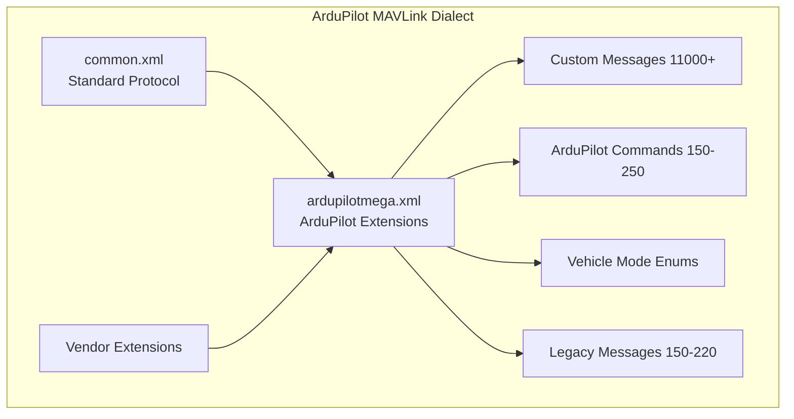

# ArduPilot Custom MAVLink Messages


## Table of Contents

- [Overview](#overview)
- [ArduPilot MAVLink Dialect Structure](#ardupilot-mavlink-dialect-structure)
- [Message ID Ranges](#message-id-ranges)
- [Custom Message Definitions](#custom-message-definitions)
  - [Device Operations (11000-11003)](#device-operations-11000-11003)
  - [Secure Commands (11004-11005)](#secure-commands-11004-11005)
  - [Adaptive Tuning (11010)](#adaptive-tuning-11010)
  - [Vision Position Delta (11011)](#vision-position-delta-11011)
  - [Angle of Attack and Sideslip (11020)](#angle-of-attack-and-sideslip-11020)
  - [ESC Telemetry (11030-11040)](#esc-telemetry-11030-11040)
  - [OSD Parameter Configuration (11033-11036)](#osd-parameter-configuration-11033-11036)
  - [Obstacle Distance 3D (11037)](#obstacle-distance-3d-11037)
  - [Water Depth (11038)](#water-depth-11038)
  - [MCU Status (11039)](#mcu-status-11039)
  - [Legacy Messages (150-220)](#legacy-messages-150-220)
- [ArduPilot-Specific Commands](#ardupilot-specific-commands)
- [Custom Enumerations](#custom-enumerations)
  - [Vehicle Mode Enums](#vehicle-mode-enums)
  - [EKF Status Flags](#ekf-status-flags)
  - [PID Tuning Axis](#pid-tuning-axis)
  - [Device Operations](#device-operations)
- [Vendor Extension Integration](#vendor-extension-integration)
- [Message Usage Examples](#message-usage-examples)
- [CRC and Protocol Considerations](#crc-and-protocol-considerations)
- [Implementation Notes](#implementation-notes)

---

## Overview

The ArduPilot MAVLink dialect (`ardupilotmega.xml`) extends the common MAVLink protocol with vehicle-specific messages, commands, and enumerations. This dialect is designed to support the unique requirements of ArduPilot's autopilot systems across multiple vehicle types (Copter, Plane, Rover, Sub, Tracker, Blimp).

**Source Definition**: `modules/mavlink/message_definitions/v1.0/ardupilotmega.xml`

**Key Design Principles**:
- Uses message ID range 11000+ for new protocol messages to avoid conflicts
- Uses command ID range 150-250 for ArduPilot-specific MAV_CMD_* commands
- Maintains backward compatibility with common.xml dialect
- Integrates vendor-specific extensions through XML includes

**Dialect Version**: 2

### Included Sub-Dialects

The ardupilotmega dialect includes the following dependencies:

```xml
<include>common.xml</include>        <!-- Standard MAVLink messages -->
<include>uAvionix.xml</include>      <!-- uAvionix ADSB transponders -->
<include>icarous.xml</include>       <!-- NASA icarous geofencing -->
<include>loweheiser.xml</include>    <!-- Loweheiser generator support -->
<include>cubepilot.xml</include>     <!-- CubePilot hardware extensions -->
<include>csAirLink.xml</include>     <!-- csAirLink radio systems -->
```

---

## ArduPilot MAVLink Dialect Structure

The ArduPilot dialect is organized into several functional categories:



### Message Category Organization

| Category | ID Range | Purpose |
|----------|----------|---------|
| **Legacy ArduPilot** | 150-220 | Original ArduPilot-specific messages (backward compatibility) |
| **Device Operations** | 11000-11003 | Low-level device register read/write |
| **Security** | 11004-11005 | Secure command protocol |
| **Control Tuning** | 11010 | Adaptive controller telemetry |
| **Vision Systems** | 11011 | Visual odometry deltas |
| **Aerodynamics** | 11020 | Angle of attack and sideslip |
| **ESC Telemetry** | 11030-11040 | Electronic speed controller data |
| **OSD Configuration** | 11033-11036 | On-screen display parameter setup |
| **Sensors** | 11037-11039 | Obstacle detection, water depth, MCU status |

---

## Message ID Ranges

ArduPilot uses distinct message ID ranges to organize protocol extensions:

### High-Range Messages (11000+)

Starting from MAVLink 2.0, ArduPilot allocates message IDs in the 11000+ range for new protocol features. This provides clear separation from the common.xml message space and allows for extensive future expansion.

```
11000-11003: Device operations (I2C/SPI register access)
11004-11005: Secure command protocol
11010-11019: Control system telemetry
11020-11029: Aerodynamic sensors
11030-11040: ESC and motor telemetry
11033-11036: OSD configuration
11037-11039: Environmental sensors
```

### Legacy Range (150-220)

Historical ArduPilot messages from pre-MAVLink 2.0 era. These are maintained for backward compatibility.

```
150-169: Sensor calibration and configuration
170-189: Camera and gimbal control
190-220: Telemetry and status
```

**Note**: New message development should use the 11000+ range. The 150-220 range is frozen for compatibility.

---

## Custom Message Definitions

### Device Operations (11000-11003)

These messages enable low-level access to sensor and peripheral device registers over I2C, SPI, and other buses. Primarily used for debugging, calibration, and advanced sensor configuration.

#### DEVICE_OP_READ (11000)

Request to read registers from a device on a specified bus.

**Message Structure**:
```cpp
message DEVICE_OP_READ {
    uint8_t  target_system;      // System ID
    uint8_t  target_component;   // Component ID
    uint32_t request_id;         // Request ID - copied to reply
    uint8_t  bustype;            // DEVICE_OP_BUSTYPE enum
    uint8_t  bus;                // Bus number
    uint8_t  address;            // Bus address
    char[40] busname;            // Device name (for SPI)
    uint8_t  regstart;           // First register to read
    uint8_t  count;              // Number of registers
    uint8_t  bank;               // Bank number (MAVLink 2 extension)
}
```

**Field Details**:
- `bustype`: Enumeration (0=I2C, 1=SPI) from `DEVICE_OP_BUSTYPE`
- `bus`: Hardware bus number (e.g., I2C1=0, I2C2=1)
- `address`: 7-bit I2C address or SPI chip select
- `busname`: Used for SPI devices to specify kernel device name
- `regstart`: Starting register address (0-255)
- `count`: Number of consecutive registers to read (1-128)
- `bank`: Register bank selection for devices with multiple banks

**Usage Example**:
```cpp
// Read 10 registers starting from 0x00 on I2C device at address 0x68
mavlink_message_t msg;
mavlink_device_op_read_t read_req;

read_req.target_system = 1;
read_req.target_component = MAV_COMP_ID_AUTOPILOT1;
read_req.request_id = 12345;
read_req.bustype = DEVICE_OP_BUSTYPE_I2C;
read_req.bus = 0;  // I2C bus 0
read_req.address = 0x68;  // MPU6000 default address
read_req.regstart = 0x00;
read_req.count = 10;
read_req.bank = 0;

mavlink_msg_device_op_read_encode(sys_id, comp_id, &msg, &read_req);
```

#### DEVICE_OP_READ_REPLY (11001)

Response containing requested register data.

**Message Structure**:
```cpp
message DEVICE_OP_READ_REPLY {
    uint32_t   request_id;      // Request ID from DEVICE_OP_READ
    uint8_t    result;          // 0=success, otherwise error code
    uint8_t    regstart;        // Starting register address
    uint8_t    count;           // Number of bytes read
    uint8_t[128] data;          // Register data
    uint8_t    bank;            // Bank number (MAVLink 2 extension)
}
```

**Field Details**:
- `result`: 0 indicates success, non-zero values are device-specific error codes
- `data`: Up to 128 bytes of register data
- `count`: Actual number of valid bytes in data array

#### DEVICE_OP_WRITE (11002)

Write registers to a device on a specified bus.

**Message Structure**:
```cpp
message DEVICE_OP_WRITE {
    uint8_t    target_system;
    uint8_t    target_component;
    uint32_t   request_id;
    uint8_t    bustype;
    uint8_t    bus;
    uint8_t    address;
    char[40]   busname;
    uint8_t    regstart;         // First register to write
    uint8_t    count;            // Number of registers to write
    uint8_t[128] data;           // Data to write
    uint8_t    bank;
}
```

**Safety Considerations**:
- Writing incorrect values can damage sensors or cause undefined behavior
- Always verify register addresses and valid value ranges from device datasheets
- Some registers are read-only; attempts to write will fail
- Use with caution in flight - improper writes can cause sensor failures

**Usage Example**:
```cpp
// Write configuration register to set gyro range
mavlink_device_op_write_t write_req;
write_req.target_system = 1;
write_req.target_component = MAV_COMP_ID_AUTOPILOT1;
write_req.request_id = 12346;
write_req.bustype = DEVICE_OP_BUSTYPE_I2C;
write_req.bus = 0;
write_req.address = 0x68;
write_req.regstart = 0x1B;  // GYRO_CONFIG register
write_req.count = 1;
write_req.data[0] = 0x18;   // ±2000°/s range
write_req.bank = 0;
```

#### DEVICE_OP_WRITE_REPLY (11003)

Confirmation of write operation.

**Message Structure**:
```cpp
message DEVICE_OP_WRITE_REPLY {
    uint32_t request_id;         // Request ID from DEVICE_OP_WRITE
    uint8_t  result;             // 0=success, otherwise error code
}
```

---

### Secure Commands (11004-11005)

Implements cryptographically signed command protocol for safety-critical operations.

#### SECURE_COMMAND (11004)

Send a command with cryptographic signature verification.

**Message Structure**:
```cpp
message SECURE_COMMAND {
    uint8_t    target_system;
    uint8_t    target_component;
    uint32_t   sequence;         // Sequence number for replay protection
    uint32_t   operation;        // SECURE_COMMAND_OP enum
    uint8_t    data_length;      // Length of command data
    uint8_t    sig_length;       // Length of signature
    uint8_t[220] data;           // Command data + signature
}
```

**Security Model**:
- Uses public-key cryptography (RSA or Ed25519)
- Signature covers: sequence number (LE) + operation (LE) + data + session key
- Prevents replay attacks via sequence numbering
- Session key establishment via SECURE_COMMAND_GET_SESSION_KEY

**Field Constraints**:
- `data_length + sig_length ≤ 220` (combined maximum)
- Signature typically 64 bytes (Ed25519) or 256 bytes (RSA-2048)

**Operations** (from `SECURE_COMMAND_OP` enum):
- `SECURE_COMMAND_GET_SESSION_KEY`: Establish encrypted session
- `SECURE_COMMAND_REQUEST_SECURE_SESSION`: Initialize secure channel
- Additional operations defined by implementation

**Implementation Reference**: `libraries/GCS_MAVLink/GCS_Common.cpp:handle_secure_command()`

#### SECURE_COMMAND_REPLY (11005)

Response to secure command with operation result.

**Message Structure**:
```cpp
message SECURE_COMMAND_REPLY {
    uint32_t   sequence;         // Sequence from SECURE_COMMAND
    uint32_t   operation;        // Operation that was requested
    uint8_t    result;           // MAV_RESULT enum
    uint8_t    data_length;      // Length of reply data
    uint8_t[220] data;           // Reply data
}
```

---

### Adaptive Tuning (11010)

Real-time telemetry for adaptive controller systems, typically used during autotune operations.

#### ADAP_TUNING (11010)

Adaptive controller state and tuning information.

**Message Structure**:
```cpp
message ADAP_TUNING {
    uint8_t axis;                // PID_TUNING_AXIS enum (instance tag)
    float   desired;             // Desired rate (deg/s)
    float   achieved;            // Achieved rate (deg/s)
    float   error;               // Model error
    float   theta;               // State predictor: theta
    float   omega;               // State predictor: omega
    float   sigma;               // State predictor: sigma
    float   theta_dot;           // Theta derivative
    float   omega_dot;           // Omega derivative
    float   sigma_dot;           // Sigma derivative
    float   f;                   // Projection operator value
    float   f_dot;               // Projection operator derivative
    float   u;                   // Adaptive control output
}
```

**Field Details**:
- `axis`: Specifies control axis (ROLL=1, PITCH=2, YAW=3, etc.)
- `desired`: Target rate commanded by pilot or mission
- `achieved`: Actual measured rate from gyroscope
- `error`: Difference between model prediction and actual response
- `theta`, `omega`, `sigma`: Adaptive controller state estimates
- `*_dot`: Time derivatives of state estimates
- `f`, `f_dot`: Projection operator prevents parameter drift
- `u`: Final control output after adaptive correction

**Streaming Rate**: Sent at loop rate during autotune (typically 10-50 Hz)

**Usage**: Ground control stations plot this data in real-time to visualize controller adaptation and convergence.

**Implementation Reference**: 
- Message generation: `libraries/AC_AttitudeControl/AC_AttitudeControl.cpp`
- Sent via: `GCS_MAVLINK::send_pid_tuning()`

---

### Vision Position Delta (11011)

Camera-based visual odometry providing incremental pose changes.

#### VISION_POSITION_DELTA (11011)

Incremental attitude and position changes from visual-inertial odometry systems.

**Message Structure**:
```cpp
message VISION_POSITION_DELTA {
    uint64_t  time_usec;         // Timestamp (µs, UNIX or boot time)
    uint64_t  time_delta_usec;   // Time since last frame (µs)
    float[3]  angle_delta;       // Rotation [roll, pitch, yaw] (rad)
    float[3]  position_delta;    // Translation [x, y, z] (m)
    float     confidence;        // Confidence 0-100 (%)
}
```

**Coordinate Frames**:
- `angle_delta`: Rotation vector in body frame (MAV_FRAME_BODY_FRD)
- `position_delta`: Translation in previous body frame, rotated to current body frame

**Field Details**:
- `time_usec`: Synchronized timestamp (GPS time or system boot time)
- `time_delta_usec`: Inter-frame time interval for velocity estimation
- `angle_delta`: Small-angle rotation vector [φ, θ, ψ] representing frame-to-frame rotation
- `position_delta`: 3D position change between frames
- `confidence`: Quality metric (100 = high confidence, 0 = invalid)

**Integration with EKF**:
- Consumed by AP_VisualOdom library
- Fused into AP_NavEKF3 as velocity measurements
- Confidence threshold for acceptance (typically >50%)

**Usage Example**:
```cpp
// Send vision delta from Intel RealSense T265
mavlink_vision_position_delta_t delta;
delta.time_usec = AP_HAL::micros64();
delta.time_delta_usec = 33333;  // 30 Hz camera
delta.angle_delta[0] = 0.001;   // 0.001 rad roll
delta.angle_delta[1] = -0.002;  // -0.002 rad pitch
delta.angle_delta[2] = 0.0;     // 0 rad yaw
delta.position_delta[0] = 0.05; // 5 cm forward
delta.position_delta[1] = 0.01; // 1 cm right
delta.position_delta[2] = -0.02;// 2 cm down
delta.confidence = 95.0;        // 95% confidence
```

**Implementation Reference**: `libraries/AP_VisualOdom/`

---

### Angle of Attack and Sideslip (11020)

Aerodynamic angle measurements for fixed-wing aircraft.

#### AOA_SSA (11020)

Angle of attack (α) and sideslip angle (β) measurements.

**Message Structure**:
```cpp
message AOA_SSA {
    uint64_t time_usec;          // Timestamp (µs)
    float    AOA;                // Angle of attack (deg)
    float    SSA;                // Sideslip angle (deg)
}
```

**Aerodynamic Definitions**:
- **Angle of Attack (AOA/α)**: Angle between oncoming airflow and longitudinal axis
- **Sideslip Angle (SSA/β)**: Angle between oncoming airflow and vertical plane of symmetry

**Sign Conventions**:
- AOA: Positive when nose points above relative wind
- SSA: Positive when nose points right of relative wind

**Applications**:
- Stall warning systems
- Airspeed correction factors
- Advanced flight control laws
- Aerodynamic model validation

**Sensor Integration**:
- Requires dedicated AOA/SSA vane or multi-hole probe
- Typically calibrated in wind tunnel or flight test
- Sensor mounting must account for propwash and airframe effects

**Implementation Reference**: 
- Message handling: `libraries/GCS_MAVLink/GCS_Common.cpp:handle_aoa_ssa()`
- Integration: `libraries/AP_AHRS/` (airspeed correction)

---

### ESC Telemetry (11030-11040)

Electronic Speed Controller telemetry data from BLHeli and other ESC firmware.

#### Message Structure (Common to ESC_TELEMETRY_*_TO_*)

All ESC telemetry messages share the same field structure for 4 ESCs:

```cpp
message ESC_TELEMETRY_X_TO_Y {
    uint8_t[4]  temperature;     // Temperature (°C)
    uint16_t[4] voltage;         // Voltage (centivolts, 0.01V)
    uint16_t[4] current;         // Current (centiamps, 0.01A)
    uint16_t[4] totalcurrent;    // Consumed current (mAh)
    uint16_t[4] rpm;             // RPM (electrical RPM)
    uint16_t[4] count;           // Telemetry packet counter
}
```

#### ESC_TELEMETRY_1_TO_4 (11030)

Telemetry for ESCs 1-4 (motor outputs 1-4).

#### ESC_TELEMETRY_5_TO_8 (11031)

Telemetry for ESCs 5-8 (motor outputs 5-8).

#### ESC_TELEMETRY_9_TO_12 (11032)

Telemetry for ESCs 9-12 (motor outputs 9-12).

#### ESC_TELEMETRY_13_TO_16 (11040)

Telemetry for ESCs 13-16 (motor outputs 13-16).

**Field Details**:
- `temperature`: ESC FET temperature in degrees Celsius (0-255)
- `voltage`: Input voltage in centivolts (e.g., 1234 = 12.34V)
- `current`: Motor current in centiamps (e.g., 2540 = 25.40A)
- `totalcurrent`: Integrated current consumption in mAh
- `rpm`: Electrical RPM (eRPM), divide by pole pairs for mechanical RPM
- `count`: Telemetry frame counter, wraps at 65535

**Protocol Support**:
- BLHeli_32 telemetry
- BLHeli_S telemetry via AP_BLHeli library
- DSHOT telemetry (eRPM only)
- KISS ESC telemetry

**Data Rate**: Typically sent at 10 Hz to conserve bandwidth

**Converting eRPM to Mechanical RPM**:
```
Mechanical RPM = eRPM / (Motor Pole Pairs)
```
For a 14-pole motor (7 pole pairs): `Mechanical RPM = eRPM / 7`

**Usage in Flight Control**:
- Motor failure detection (RPM dropout)
- Dynamic battery monitoring (current per motor)
- Thermal management (ESC temperature limits)
- Vibration analysis (RPM harmonics)

**Implementation Reference**:
- Telemetry collection: `libraries/AP_BLHeli/AP_BLHeli.cpp`
- Message generation: `GCS_MAVLINK::send_esc_telemetry()`

---

### OSD Parameter Configuration (11033-11036)

On-screen display parameter configuration for flight controller OSD systems.

#### OSD_PARAM_CONFIG (11033)

Configure an OSD parameter slot for display.

**Message Structure**:
```cpp
message OSD_PARAM_CONFIG {
    uint8_t   target_system;
    uint8_t   target_component;
    uint32_t  request_id;
    uint8_t   osd_screen;        // Screen index (0-3)
    uint8_t   osd_index;         // Parameter slot index
    char[16]  param_id;          // Parameter name
    uint8_t   config_type;       // OSD_PARAM_CONFIG_TYPE enum
    float     min_value;         // Minimum value for range
    float     max_value;         // Maximum value for range
    float     increment;         // Adjustment increment
}
```

**Field Details**:
- `osd_screen`: OSD screen number (0-3 for up to 4 screens)
- `osd_index`: Slot position on screen (0-N)
- `param_id`: ArduPilot parameter name (e.g., "WPNAV_SPEED")
- `config_type`: Configuration type from OSD_PARAM_CONFIG_TYPE enum
- `min_value`, `max_value`: Valid range for parameter adjustment
- `increment`: Step size for in-flight adjustment

**Configuration Types** (OSD_PARAM_CONFIG_TYPE):
- Display only
- Adjustable with limits
- Toggle boolean
- Selection from list

**Use Case**: Enables in-flight parameter tuning through OSD menu system using RC stick inputs.

#### OSD_PARAM_CONFIG_REPLY (11034)

Confirmation of OSD parameter configuration.

**Message Structure**:
```cpp
message OSD_PARAM_CONFIG_REPLY {
    uint32_t request_id;
    uint8_t  result;             // OSD_PARAM_CONFIG_ERROR enum
}
```

#### OSD_PARAM_SHOW_CONFIG (11035)

Request to read current OSD parameter configuration.

**Message Structure**:
```cpp
message OSD_PARAM_SHOW_CONFIG {
    uint8_t  target_system;
    uint8_t  target_component;
    uint32_t request_id;
    uint8_t  osd_screen;
    uint8_t  osd_index;
}
```

#### OSD_PARAM_SHOW_CONFIG_REPLY (11036)

Response with current OSD parameter configuration.

**Message Structure**:
```cpp
message OSD_PARAM_SHOW_CONFIG_REPLY {
    uint32_t  request_id;
    uint8_t   result;
    char[16]  param_id;
    uint8_t   config_type;
    float     min_value;
    float     max_value;
    float     increment;
}
```

**Implementation Reference**: `libraries/AP_OSD/AP_OSD_MSP.cpp`

---

### Obstacle Distance 3D (11037)

Three-dimensional obstacle position for collision avoidance.

#### OBSTACLE_DISTANCE_3D (11037)

**Message Structure**:
```cpp
message OBSTACLE_DISTANCE_3D {
    uint32_t time_boot_ms;       // System uptime (ms)
    uint8_t  sensor_type;        // MAV_DISTANCE_SENSOR enum
    uint8_t  frame;              // MAV_FRAME enum
    uint16_t obstacle_id;        // Obstacle tracking ID
    float    x;                  // X position (m)
    float    y;                  // Y position (m)
    float    z;                  // Z position (m)
    float    min_distance;       // Sensor minimum range (m)
    float    max_distance;       // Sensor maximum range (m)
}
```

**Coordinate Frame**:
- Specified by `frame` field (typically MAV_FRAME_BODY_FRD or MAV_FRAME_LOCAL_NED)
- Position relative to vehicle or local origin

**Obstacle Tracking**:
- `obstacle_id`: Persistent ID for tracking obstacle motion
- Set to UINT16_MAX (65535) if ID is unknown or cannot be determined

**Applications**:
- Object avoidance during autonomous flight
- Collision warning systems
- Path planning integration

**Sensor Types** (MAV_DISTANCE_SENSOR):
- Laser rangefinder
- Ultrasonic
- Infrared
- Radar
- LiDAR

**Implementation Reference**: `libraries/AP_Proximity/`

---

### Water Depth (11038)

Water depth measurement for surface and underwater vehicles.

#### WATER_DEPTH (11038)

**Message Structure**:
```cpp
message WATER_DEPTH {
    uint32_t time_boot_ms;       // System uptime (ms)
    uint8_t  id;                 // Sensor ID (instance tag)
    float    depth;              // Water depth (m)
    float    temperature;        // Water temperature (°C)
    float    lat;                // Latitude (degE7, 0 if unknown)
    int32_t  lon;                // Longitude (degE7, 0 if unknown)
    float    alt;                // Altitude/depth (m, 0 if unknown)
}
```

**Field Details**:
- `depth`: Positive value indicates depth below surface (meters)
- `temperature`: Water temperature at sensor depth
- `lat`, `lon`: GPS coordinates of measurement (degE7 = degrees × 10^7)
- `alt`: Altitude relative to MSL (negative for underwater)

**Applications**:
- Bathymetric mapping
- Bottom tracking for surface vehicles
- Depth hold for submersibles
- Obstacle detection (shallow water)

**Sensor Types**:
- Single-beam echo sounders
- Multi-beam sonar systems
- Pressure-based depth sensors

**Implementation Reference**: `libraries/AP_RangeFinder/AP_RangeFinder_Wasp.cpp`

---

### MCU Status (11039)

Microcontroller health and performance metrics.

#### MCU_STATUS (11039)

**Message Structure**:
```cpp
message MCU_STATUS {
    uint8_t  id;                 // MCU instance ID
    uint16_t MCU_temperature;    // MCU temperature (cdegC, 0.01°C)
    uint16_t MCU_voltage;        // MCU supply voltage (mV)
    uint16_t MCU_voltage_min;    // Minimum voltage since boot (mV)
    uint16_t MCU_voltage_max;    // Maximum voltage since boot (mV)
}
```

**Field Details**:
- `id`: MCU identifier for systems with multiple processors (0=main MCU, 1=IOMCU, etc.)
- `MCU_temperature`: Die temperature in centidegrees Celsius (e.g., 4520 = 45.20°C)
- `MCU_voltage`: Current supply voltage in millivolts
- `MCU_voltage_min`: Minimum recorded voltage (brown-out detection)
- `MCU_voltage_max`: Maximum recorded voltage (overvoltage detection)

**Health Monitoring**:
- Thermal throttling detection
- Power supply stability analysis
- Brown-out event logging
- Long-term reliability tracking

**Typical Values**:
- Temperature: 20-80°C (operation), >85°C (warning), >100°C (critical)
- Voltage (3.3V MCU): 3100-3500 mV (normal), <3000 mV (brown-out risk)
- Voltage (5V MCU): 4750-5250 mV (normal), <4500 mV (brown-out risk)

**Implementation Reference**: `libraries/AP_HAL_ChibiOS/hwdef/common/stm32_util.c`

---

### Legacy Messages (150-220)

Historical ArduPilot messages maintained for backward compatibility. These predate the 11000+ numbering scheme.

#### Key Legacy Messages

**SENSOR_OFFSETS (150)**: Raw sensor calibration offsets (gyro, accel, mag, barometer)

**MEMINFO (152)**: Free memory statistics

**AHRS (163)**: Attitude Heading Reference System status

**SIMSTATE (164)**: SITL (Software-In-The-Loop) simulation state

**HWSTATUS (165)**: Hardware status (Vcc, I2C errors)

**RADIO (166)**: Telemetry radio RSSI and error rates

**LIMITS_STATUS (167)**: Geofence and altitude limit status

**WIND (168)**: Estimated wind speed and direction

**DATA16/DATA32/DATA64 (169-171)**: Generic data containers for debugging

**MOUNT_STATUS (158)**: Camera gimbal position and status

**FENCE_POINT/FETCH_POINT (160-161)**: Geofence boundary points

**Note**: New protocol development should avoid using this range. Refer to specific message definitions in `ardupilotmega.xml` for detailed field specifications.

---

## ArduPilot-Specific Commands

ArduPilot defines custom MAV_CMD_* commands in the 150-250 and 42000+ ranges.

### Mission Commands

#### MAV_CMD_NAV_ALTITUDE_WAIT (83)

Wait for altitude or vertical speed condition (high-altitude balloon launches).

**Parameters**:
1. Altitude (m) - target altitude
2. Descent speed (m/s) - trigger on descent rate
3. Wiggle time (s) - servo wiggle interval to prevent seizure
4-7. Empty

#### MAV_CMD_DO_SET_RESUME_REPEAT_DIST (215)

Set mission resume repeat distance.

**Parameters**:
1. Distance (m) - distance to back up when resuming mission
2-7. Empty

**Use Case**: When mission is interrupted (e.g., RTL failsafe), resume this distance before the interruption point.

#### MAV_CMD_DO_SPRAYER (216)

Control liquid sprayer system.

**Parameters**:
1. Enable (0=disable, 1=enable)
2-7. Empty

**Implementation**: Controls via AC_Sprayer library

#### MAV_CMD_DO_SEND_SCRIPT_MESSAGE (217)

Pass command to Lua scripting environment.

**Parameters**:
1. Script ID (uint16, 0-65535)
2. Param 1 (float)
3. Param 2 (float)
4. Param 3 (float)
5-7. Empty

**Use Case**: Trigger custom Lua script behaviors from mission commands or GCS.

#### MAV_CMD_DO_AUX_FUNCTION (218)

Execute auxiliary function (equivalent to RC switch activation).

**Parameters**:
1. Auxiliary function ID
2. Switch position (0=low, 1=mid, 2=high)
3-7. Empty

**Available Functions**: Defined in `libraries/RC_Channel/RC_Channel.h` (e.g., arm/disarm, mode changes, camera trigger)

### Calibration Commands

#### MAV_CMD_DO_START_MAG_CAL (42424)

Initiate magnetometer calibration.

**Parameters**:
1. Magnetometer bitmask (0=all)
2. Retry on failure (0=no, 1=yes)
3. Autosave (0=manual, 1=auto)
4. Delay (seconds)
5. Autoreboot (0=manual, 1=auto)
6-7. Empty

#### MAV_CMD_DO_ACCEPT_MAG_CAL (42425)

Accept magnetometer calibration results.

**Parameters**:
1. Magnetometer bitmask (0=all)
2-7. Empty

#### MAV_CMD_DO_CANCEL_MAG_CAL (42426)

Cancel running magnetometer calibration.

**Parameters**:
1. Magnetometer bitmask (0=all)
2-7. Empty

#### MAV_CMD_FIXED_MAG_CAL (42004)

Magnetometer calibration using known field parameters.

**Parameters**:
1. Declination (degrees)
2. Inclination (degrees)
3. Intensity (milligauss)
4. Yaw (degrees)
5-7. Empty

#### MAV_CMD_FIXED_MAG_CAL_FIELD (42005)

Magnetometer calibration using known field vector.

**Parameters**:
1. Field X (milligauss)
2. Field Y (milligauss)
3. Field Z (milligauss)
4-7. Empty

#### MAV_CMD_ACCELCAL_VEHICLE_POS (42429)

Accelerometer calibration position indication.

**Parameters**:
1. Position (ACCELCAL_VEHICLE_POS enum)
2-7. Empty

**Positions**: LEVEL, LEFT, RIGHT, NOSEDOWN, NOSEUP, BACK

### System Commands

#### MAV_CMD_SET_EKF_SOURCE_SET (42007)

Switch between EKF sensor source sets.

**Parameters**:
1. Source Set ID (1-3)
2-7. Empty

**Use Case**: Switch between different GPS/compass combinations or vision/GPS sources.

#### MAV_CMD_DO_SEND_BANNER (42428)

Request autopilot version banner string.

**Parameters**:
1-7. Empty

**Response**: Sent via STATUSTEXT message

#### MAV_CMD_POWER_OFF_INITIATED (42000)

Notification of system power-off event.

**Parameters**:
1-7. Empty

**Use Case**: Autopilot broadcasts this before shutdown to allow graceful disconnection.

### 3DR Solo-Specific Commands (Deprecated)

**MAV_CMD_SOLO_BTN_FLY_CLICK (42001)**: FLY button clicked
**MAV_CMD_SOLO_BTN_FLY_HOLD (42002)**: FLY button held
**MAV_CMD_SOLO_BTN_PAUSE_CLICK (42003)**: PAUSE button clicked

**Note**: These commands are specific to 3DR Solo hardware and are deprecated.

---

## Custom Enumerations

### Vehicle Mode Enums

ArduPilot defines vehicle-specific flight mode enumerations for the `custom_mode` field in HEARTBEAT messages.

#### PLANE_MODE

Fixed-wing aircraft flight modes.

```cpp
enum PLANE_MODE {
    PLANE_MODE_MANUAL = 0,
    PLANE_MODE_CIRCLE = 1,
    PLANE_MODE_STABILIZE = 2,
    PLANE_MODE_TRAINING = 3,
    PLANE_MODE_ACRO = 4,
    PLANE_MODE_FLY_BY_WIRE_A = 5,
    PLANE_MODE_FLY_BY_WIRE_B = 6,
    PLANE_MODE_CRUISE = 7,
    PLANE_MODE_AUTOTUNE = 8,
    PLANE_MODE_AUTO = 10,
    PLANE_MODE_RTL = 11,
    PLANE_MODE_LOITER = 12,
    PLANE_MODE_TAKEOFF = 13,
    PLANE_MODE_AVOID_ADSB = 14,
    PLANE_MODE_GUIDED = 15,
    PLANE_MODE_INITIALIZING = 16,
    PLANE_MODE_QSTABILIZE = 17,      // QuadPlane modes
    PLANE_MODE_QHOVER = 18,
    PLANE_MODE_QLOITER = 19,
    PLANE_MODE_QLAND = 20,
    PLANE_MODE_QRTL = 21,
    PLANE_MODE_QAUTOTUNE = 22,
    PLANE_MODE_QACRO = 23,
    PLANE_MODE_THERMAL = 24,
    PLANE_MODE_LOITER_ALT_QLAND = 25,
    PLANE_MODE_AUTOLAND = 26
};
```

**QuadPlane Modes**: Modes prefixed with Q (17-23) are specific to VTOL QuadPlane configurations.

#### COPTER_MODE

Multirotor and helicopter flight modes.

```cpp
enum COPTER_MODE {
    COPTER_MODE_STABILIZE = 0,
    COPTER_MODE_ACRO = 1,
    COPTER_MODE_ALT_HOLD = 2,
    COPTER_MODE_AUTO = 3,
    COPTER_MODE_GUIDED = 4,
    COPTER_MODE_LOITER = 5,
    COPTER_MODE_RTL = 6,
    COPTER_MODE_CIRCLE = 7,
    COPTER_MODE_LAND = 9,
    COPTER_MODE_DRIFT = 11,
    COPTER_MODE_SPORT = 13,
    COPTER_MODE_FLIP = 14,
    COPTER_MODE_AUTOTUNE = 15,
    COPTER_MODE_POSHOLD = 16,
    COPTER_MODE_BRAKE = 17,
    COPTER_MODE_THROW = 18,
    COPTER_MODE_AVOID_ADSB = 19,
    COPTER_MODE_GUIDED_NOGPS = 20,
    COPTER_MODE_SMART_RTL = 21,
    COPTER_MODE_FLOWHOLD = 22,
    COPTER_MODE_FOLLOW = 23,
    COPTER_MODE_ZIGZAG = 24,
    COPTER_MODE_SYSTEMID = 25,
    COPTER_MODE_AUTOROTATE = 26,
    COPTER_MODE_AUTO_RTL = 27,
    COPTER_MODE_TURTLE = 28
};
```

#### ROVER_MODE

Ground vehicle flight modes.

```cpp
enum ROVER_MODE {
    ROVER_MODE_MANUAL = 0,
    ROVER_MODE_ACRO = 1,
    ROVER_MODE_STEERING = 3,
    ROVER_MODE_HOLD = 4,
    ROVER_MODE_LOITER = 5,
    ROVER_MODE_FOLLOW = 6,
    ROVER_MODE_SIMPLE = 7,
    ROVER_MODE_CIRCLE = 9,
    ROVER_MODE_AUTO = 10,
    ROVER_MODE_RTL = 11,
    ROVER_MODE_SMART_RTL = 12,
    ROVER_MODE_GUIDED = 15,
    ROVER_MODE_INITIALIZING = 16
};
```

#### SUB_MODE

Underwater vehicle (ROV/AUV) flight modes.

```cpp
enum SUB_MODE {
    SUB_MODE_STABILIZE = 0,
    SUB_MODE_ACRO = 1,
    SUB_MODE_ALT_HOLD = 2,
    SUB_MODE_AUTO = 3,
    SUB_MODE_GUIDED = 4,
    SUB_MODE_CIRCLE = 7,
    SUB_MODE_SURFACE = 9,
    SUB_MODE_POSHOLD = 16,
    SUB_MODE_MANUAL = 19,
    SUB_MODE_MOTOR_DETECT = 20
};
```

#### TRACKER_MODE

Antenna tracker modes.

```cpp
enum TRACKER_MODE {
    TRACKER_MODE_MANUAL = 0,
    TRACKER_MODE_STOP = 1,
    TRACKER_MODE_SCAN = 2,
    TRACKER_MODE_SERVO_TEST = 3,
    TRACKER_MODE_AUTO = 10,
    TRACKER_MODE_INITIALIZING = 16
};
```

**Usage in HEARTBEAT**:
```cpp
// Decode custom_mode for Copter
mavlink_heartbeat_t hb;
uint8_t base_mode = hb.base_mode;
uint32_t custom_mode = hb.custom_mode;

if (base_mode & MAV_MODE_FLAG_CUSTOM_MODE_ENABLED) {
    // custom_mode contains COPTER_MODE enum value
    if (custom_mode == COPTER_MODE_AUTO) {
        // Vehicle is in AUTO mode
    }
}
```

---

### EKF Status Flags

Bitmask indicating Extended Kalman Filter health status.

#### EKF_STATUS_FLAGS (bitmask)

```cpp
enum EKF_STATUS_FLAGS {
    EKF_ATTITUDE = 0x0001,           // Attitude estimate good
    EKF_VELOCITY_HORIZ = 0x0002,     // Horizontal velocity good
    EKF_VELOCITY_VERT = 0x0004,      // Vertical velocity good
    EKF_POS_HORIZ_REL = 0x0008,      // Horizontal position (relative) good
    EKF_POS_HORIZ_ABS = 0x0010,      // Horizontal position (absolute) good
    EKF_POS_VERT_ABS = 0x0020,       // Vertical position (absolute) good
    EKF_POS_VERT_AGL = 0x0040,       // Vertical position (AGL) good
    EKF_CONST_POS_MODE = 0x0080,     // Constant position mode (no GPS)
    EKF_PRED_POS_HORIZ_REL = 0x0100, // Predicted horizontal position (rel) good
    EKF_PRED_POS_HORIZ_ABS = 0x0200, // Predicted horizontal position (abs) good
    EKF_UNINITIALIZED = 0x0400,      // EKF never healthy
    EKF_GPS_GLITCHING = 0x8000       // GPS data quality issue detected
};
```

**Flag Interpretation**:
- **Set bit**: Corresponding estimate is healthy and available
- **Clear bit**: Estimate unavailable, unhealthy, or not computed

**Critical Flags**:
- `EKF_ATTITUDE`: Required for all flight modes
- `EKF_POS_HORIZ_ABS`: Required for AUTO, GUIDED, RTL modes
- `EKF_GPS_GLITCHING`: Warning flag, may trigger EKF failsafe

**Usage Example**:
```cpp
// Check if EKF position estimate is good for waypoint navigation
if ((ekf_flags & EKF_POS_HORIZ_ABS) && 
    (ekf_flags & EKF_POS_VERT_ABS) &&
    !(ekf_flags & EKF_GPS_GLITCHING)) {
    // Safe to navigate in AUTO mode
}
```

**Related Messages**: EKF_STATUS_REPORT (MAVLink common.xml)

---

### PID Tuning Axis

Identifies control axis for PID tuning messages.

#### PID_TUNING_AXIS

```cpp
enum PID_TUNING_AXIS {
    PID_TUNING_ROLL = 1,
    PID_TUNING_PITCH = 2,
    PID_TUNING_YAW = 3,
    PID_TUNING_ACCZ = 4,     // Vertical acceleration
    PID_TUNING_STEER = 5,    // Rover steering
    PID_TUNING_LANDING = 6   // Landing speed control
};
```

**Usage**: Instance tag in PID_TUNING and ADAP_TUNING messages to identify which controller is being reported.

---

### Device Operations

Bus types for low-level device access.

#### DEVICE_OP_BUSTYPE

```cpp
enum DEVICE_OP_BUSTYPE {
    DEVICE_OP_BUSTYPE_I2C = 0,
    DEVICE_OP_BUSTYPE_SPI = 1
};
```

**Usage**: Specifies communication bus in DEVICE_OP_READ and DEVICE_OP_WRITE messages.

---

## Vendor Extension Integration

ArduPilot integrates several vendor-specific MAVLink dialect extensions through XML includes.

### uAvionix (ADSB Transponders)

**Include**: `uAvionix.xml`

**Messages**:
- UAVIONIX_ADSB_OUT_CFG: Configure ADS-B OUT parameters
- UAVIONIX_ADSB_OUT_DYNAMIC: Dynamic aircraft state for ADS-B
- UAVIONIX_ADSB_TRANSCEIVER_HEALTH_REPORT: Transponder status

**Hardware**: uAvionix pingRX, ping1090, ping2020, tailBeacon

**Implementation**: `libraries/AP_ADSB/AP_ADSB_uAvionix_MAVLink.cpp`

### icarous (Geofencing and Traffic Management)

**Include**: `icarous.xml`

**Purpose**: NASA icarous (Independent Configurable Algorithms for Reliable Operations of Unmanned Systems)

**Messages**:
- ICAROUS_HEARTBEAT: icarous system status
- ICAROUS_KINEMATIC_BANDS: Conflict resolution guidance

**Use Case**: Detect-and-avoid (DAA) integration

### Loweheiser (Engine Generators)

**Include**: `loweheiser.xml`

**Messages**:
- LOWEHEISER_GOV_EFI: Electronic fuel injection status

**Hardware**: Loweheiser hybrid generator systems for long-endurance aircraft

**Implementation**: `libraries/AP_Generator/AP_Generator_Loweheiser.cpp`

### CubePilot (Autopilot Hardware)

**Include**: `cubepilot.xml`

**Messages**: CubePilot-specific hardware telemetry and configuration

**Hardware**: Cube Orange, Cube Black, Cube Purple autopilots

### csAirLink (Radio Systems)

**Include**: `csAirLink.xml`

**Messages**: csAirLink radio modem telemetry and control

**Hardware**: csAirLink long-range radio modems

---

## Message Usage Examples

### Streaming ESC Telemetry

```cpp
// From GCS_MAVLINK::send_esc_telemetry() implementation
void GCS_MAVLINK::send_esc_telemetry() {
    AP_BLHeli *blheli = AP_BLHeli::get_singleton();
    if (blheli == nullptr) {
        return;
    }

    uint8_t num_motors = AP::motors()->get_num_motors();
    
    // ESC telemetry for motors 1-4
    if (num_motors >= 1) {
        mavlink_esc_telemetry_1_to_4_t telem;
        for (uint8_t i = 0; i < 4 && i < num_motors; i++) {
            blheli->get_telem_data(i, 
                telem.temperature[i],
                telem.voltage[i],
                telem.current[i],
                telem.totalcurrent[i],
                telem.rpm[i],
                telem.count[i]);
        }
        mavlink_msg_esc_telemetry_1_to_4_send_struct(chan, &telem);
    }

    // Repeat for motors 5-8, 9-12, 13-16...
}
```

### Handling Vision Position Delta

```cpp
// From AP_VisualOdom::handle_vision_position_delta()
void AP_VisualOdom::handle_vision_position_delta(
    const mavlink_vision_position_delta_t &msg) {
    
    // Validate message
    if (msg.confidence < 50.0f) {
        // Low confidence, reject
        return;
    }

    // Store delta for EKF consumption
    _state.pos_delta = Vector3f(msg.position_delta);
    _state.ang_delta = Vector3f(msg.angle_delta);
    _state.time_delta_usec = msg.time_delta_usec;
    _state.last_update_us = AP_HAL::micros64();

    // Integrate into EKF
    AP::ahrs_navekf().writeBodyFrameOdom(
        _state.pos_delta,
        _state.ang_delta,
        msg.time_delta_usec * 1.0e-6f,  // Convert to seconds
        msg.time_usec,
        msg.confidence * 0.01f);  // Convert to 0-1 range
}
```

### Device Register Read

```cpp
// Example: Reading WHO_AM_I register from IMU
void read_imu_whoami(mavlink_channel_t chan) {
    mavlink_device_op_read_t read_msg = {};
    
    read_msg.target_system = 1;
    read_msg.target_component = MAV_COMP_ID_AUTOPILOT1;
    read_msg.request_id = get_next_request_id();
    read_msg.bustype = DEVICE_OP_BUSTYPE_I2C;
    read_msg.bus = 0;                  // I2C bus 0
    read_msg.address = 0x68;           // MPU6000 address
    read_msg.regstart = 0x75;          // WHO_AM_I register
    read_msg.count = 1;
    read_msg.bank = 0;
    
    mavlink_msg_device_op_read_encode_chan(
        system_id, component_id, chan, &msg, &read_msg);
        
    // Send and wait for DEVICE_OP_READ_REPLY
}
```

### Decoding Vehicle Mode from HEARTBEAT

```cpp
// GCS code to decode vehicle-specific mode
void handle_heartbeat(const mavlink_heartbeat_t &hb) {
    MAV_TYPE vehicle_type = hb.type;
    uint32_t custom_mode = hb.custom_mode;
    
    if (hb.base_mode & MAV_MODE_FLAG_CUSTOM_MODE_ENABLED) {
        switch (vehicle_type) {
            case MAV_TYPE_QUADROTOR:
            case MAV_TYPE_HELICOPTER:
                // Use COPTER_MODE enum
                if (custom_mode == COPTER_MODE_LOITER) {
                    printf("Copter in LOITER mode\n");
                }
                break;
                
            case MAV_TYPE_FIXED_WING:
                // Use PLANE_MODE enum
                if (custom_mode == PLANE_MODE_AUTO) {
                    printf("Plane in AUTO mode\n");
                }
                break;
                
            case MAV_TYPE_GROUND_ROVER:
                // Use ROVER_MODE enum
                if (custom_mode == ROVER_MODE_GUIDED) {
                    printf("Rover in GUIDED mode\n");
                }
                break;
        }
    }
}
```

---

## CRC and Protocol Considerations

### MAVLink CRC Extra

Each message definition generates a CRC_EXTRA byte used for protocol version checking. Changes to message structure (field order, types, array sizes) invalidate the CRC.

**Important**: When modifying ardupilotmega.xml message definitions:
- Field additions via `<extensions/>` maintain backward compatibility
- Changes before `<extensions/>` tag break compatibility
- CRC_EXTRA automatically recalculated by MAVLink generator
- Mismatched CRC causes message rejection

### MAVLink 1 vs MAVLink 2

**MAVLink 2 Advantages**:
- Larger message IDs (24-bit vs 8-bit)
- Extension fields for backward-compatible additions
- Packet signing for security
- Empty-byte truncation reduces bandwidth

**ArduPilot Default**: MAVLink 2 is standard on all links. MAVLink 1 available for legacy GCS compatibility.

**Protocol Negotiation**: ArduPilot auto-detects protocol version from received packets.

### Message Packing and Alignment

MAVLink uses packed structures with specific alignment rules:

```cpp
// Packing order in message struct (by field type size)
uint64_t fields;  // 8-byte types first
double fields;
int32_t fields;   // 4-byte types
uint32_t fields;
int16_t fields;   // 2-byte types
uint16_t fields;
uint8_t fields;   // 1-byte types last
char arrays[];    // Character arrays last
```

**Reason**: Minimizes padding bytes for efficient wire format.

**Extensions**: Fields after `<extensions/>` tag are ignored by receivers that don't support them, enabling backward-compatible protocol evolution.

### Bandwidth Considerations

High-rate telemetry links (e.g., 57600 baud) have limited capacity. Message streaming must be configured appropriately:

**Stream Rates** (configured via SR_* parameters):
- `RAW_SENS`: IMU/baro raw data (high rate)
- `EXT_STAT`: Extended status (low rate)
- `RC_CHAN`: RC input channels (medium rate)
- `POSITION`: Position estimates (medium rate)
- `EXTRA1`, `EXTRA2`, `EXTRA3`: Grouped telemetry

**Typical Bandwidth Usage**:
- HEARTBEAT (1 Hz): ~90 bytes/sec
- ATTITUDE (10 Hz): ~320 bytes/sec
- GPS_RAW_INT (5 Hz): ~320 bytes/sec
- ESC_TELEMETRY_1_TO_4 (10 Hz): ~300 bytes/sec

**Optimization Strategies**:
- Use EXTRA stream groups to balance bandwidth
- Enable message compression (MAVLink 2 truncation)
- Selectively disable high-bandwidth messages
- Use higher baud rates for HD telemetry (115200+)

---

## Implementation Notes

### Message Generation

ArduPilot generates MAVLink C headers from XML definitions using:
```bash
python3 modules/mavlink/pymavlink/tools/mavgen.py \
    --lang=C \
    --wire-protocol=2.0 \
    --output=generated/mavlink \
    modules/mavlink/message_definitions/v1.0/ardupilotmega.xml
```

**Generated Files**:
- `mavlink_msg_*.h`: Individual message headers
- `mavlink.h`: Master include
- `testsuite.h`: Protocol test suite

### Adding New Custom Messages

To add a new ArduPilot-specific message:

1. **Choose Message ID**: Use next available ID in 11000+ range
2. **Define in ardupilotmega.xml**:
   ```xml
   <message id="11999" name="MY_NEW_MESSAGE">
       <description>Brief description</description>
       <field type="uint64_t" name="timestamp_us" units="us">Timestamp</field>
       <field type="float" name="my_value" units="m">Description</field>
   </message>
   ```
3. **Regenerate Headers**: Run mavgen.py
4. **Implement Sender**: In appropriate `GCS_MAVLINK::send_*()` method
5. **Implement Handler**: Add `handle_*()` method if command requires response
6. **Add to Stream**: Include in appropriate SR_* stream group
7. **Document**: Update this file and add usage examples

### GCS Integration

Ground control stations must support ardupilotmega dialect:

**Mission Planner**: Native ArduPilot support
**QGroundControl**: Full dialect support via XML
**MAVProxy**: Python MAVLink library with dialect auto-detection

**Custom GCS Development**:
```python
# Python MAVLink library usage
from pymavlink import mavutil

# Connect with ardupilotmega dialect
mav = mavutil.mavlink_connection('udp:localhost:14550', 
                                  dialect='ardupilotmega')

# Receive custom message
msg = mav.recv_match(type='ESC_TELEMETRY_1_TO_4', blocking=True)
if msg:
    print(f"ESC1 RPM: {msg.rpm[0]}")
    print(f"ESC1 Temp: {msg.temperature[0]}°C")
```

### Compatibility and Versioning

**Semantic Versioning**: ArduPilot firmware versions (e.g., 4.3.0) indicate protocol compatibility:
- **Major**: Breaking protocol changes (rare)
- **Minor**: New messages/features (backward compatible)
- **Patch**: Bug fixes (no protocol changes)

**Dialect Compatibility**: GCS must support ardupilotmega dialect version ≥ 2

**Forward Compatibility**: New ArduPilot firmware remains compatible with older GCS via MAVLink 2 extension fields

---

## References

### Source Files

- **Dialect Definition**: `modules/mavlink/message_definitions/v1.0/ardupilotmega.xml`
- **Message Handler**: `libraries/GCS_MAVLink/GCS_Common.cpp`
- **Message Definitions**: `libraries/GCS_MAVLink/GCS_MAVLink.h`
- **AP Message Enum**: `libraries/GCS_MAVLink/ap_message.h`

### External Documentation

- **MAVLink Developer Guide**: https://mavlink.io/en/
- **ArduPilot MAVLink Commands**: https://ardupilot.org/copter/docs/common-mavlink-mission-command-messages.html
- **MAVLink Message Definitions**: https://mavlink.io/en/messages/
- **ArduPilot Developer Documentation**: https://ardupilot.org/dev/

### Related ArduPilot Libraries

- `libraries/GCS_MAVLink/`: MAVLink integration
- `libraries/AP_AHRS/`: Attitude estimation (EKF consumer)
- `libraries/AP_BLHeli/`: ESC telemetry support
- `libraries/AP_VisualOdom/`: Vision system integration
- `libraries/AP_OSD/`: On-screen display
- `libraries/AP_ADSB/`: ADS-B transponder support

---

**Document Version**: 1.0  
**Last Updated**: 2024  
**Maintainer**: ArduPilot Development Team  
**License**: GPL v3.0
