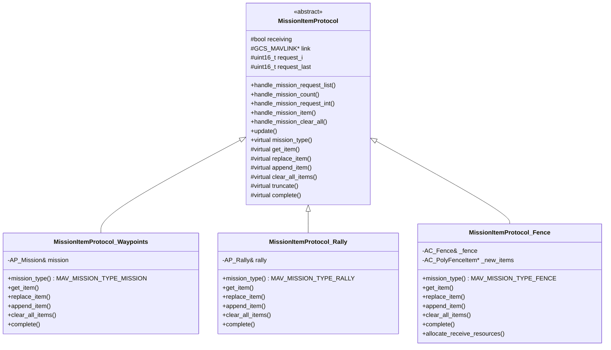
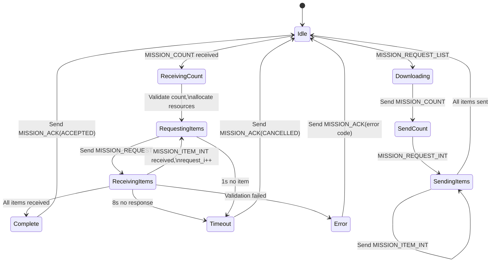
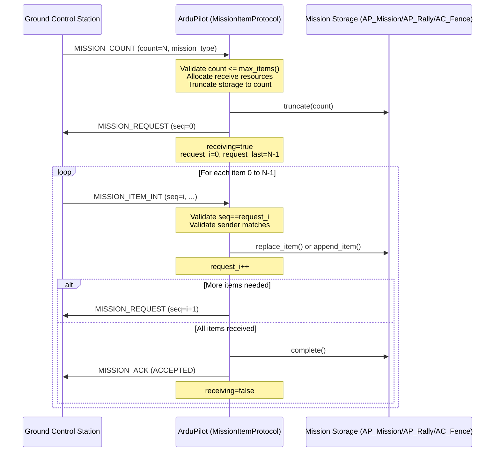
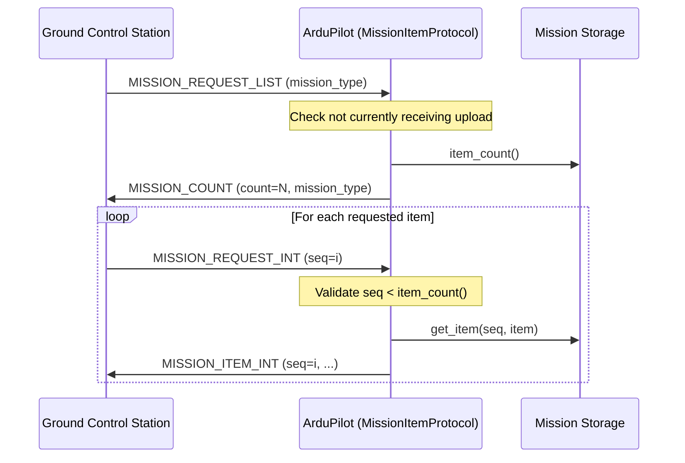
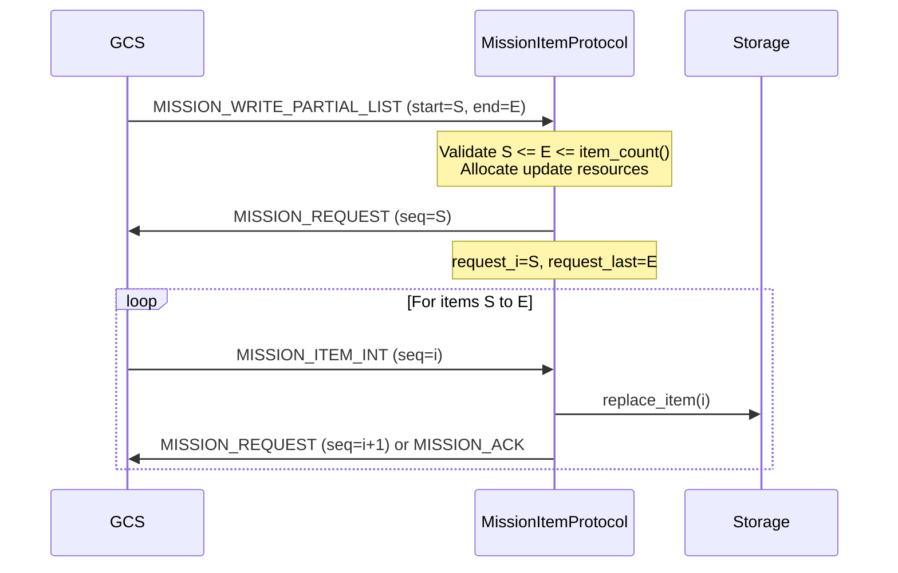
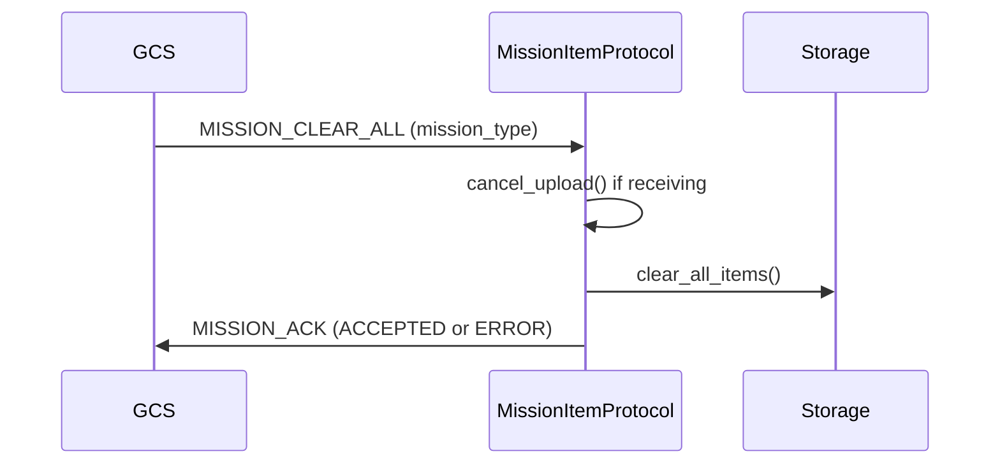

# MAVLink Mission Transfer Protocol

## Table of Contents
- [Overview](#overview)
- [Protocol Architecture](#protocol-architecture)
- [State Machine](#state-machine)
- [Message Flow](#message-flow)
- [Mission Types](#mission-types)
- [Transfer Sequences](#transfer-sequences)
- [Validation and Error Handling](#validation-and-error-handling)
- [Integration with Storage](#integration-with-storage)
- [Code Examples](#code-examples)
- [MAV_MISSION_RESULT Codes](#mav_mission_result-codes)

## Overview

The MAVLink Mission Transfer Protocol provides a robust, reliable mechanism for transferring mission data between a Ground Control Station (GCS) and ArduPilot autopilot systems. The protocol supports bidirectional transfer of multiple mission types including waypoints, rally points, and geofence definitions.

**Source Files**: 
- `/libraries/GCS_MAVLink/MissionItemProtocol.h` - Base protocol class
- `/libraries/GCS_MAVLink/MissionItemProtocol.cpp` - Core protocol implementation
- `/libraries/GCS_MAVLink/MissionItemProtocol_Waypoints.cpp` - Waypoint mission handler
- `/libraries/GCS_MAVLink/MissionItemProtocol_Rally.cpp` - Rally point handler
- `/libraries/GCS_MAVLink/MissionItemProtocol_Fence.cpp` - Geofence handler

### Key Features

- **Mission Type Support**: Waypoints (MAV_MISSION_TYPE_MISSION), rally points (MAV_MISSION_TYPE_RALLY), and geofences (MAV_MISSION_TYPE_FENCE)
- **Bidirectional Transfer**: Upload (GCS → autopilot) and download (autopilot → GCS)
- **Partial Updates**: Support for updating subsets of mission items via MISSION_WRITE_PARTIAL_LIST
- **Timeout Protection**: Automatic timeout handling with 8-second default timeout for uploads
- **Sequence Validation**: Strict validation of item sequence numbers and sender identity
- **Frame Conversion**: Automatic handling of MISSION_ITEM to MISSION_ITEM_INT conversion
- **Resource Management**: Dynamic memory allocation for large fence uploads

### Protocol Requirements

- **MAVLink 2.0**: Mission types other than MAV_MISSION_TYPE_MISSION require MAVLink 2.0
- **MISSION_ITEM_INT**: Protocol prefers MISSION_ITEM_INT messages over deprecated MISSION_ITEM
- **Thread Safety**: Protocol uses mutex-like "receiving" flag to prevent concurrent uploads
- **System/Component Validation**: Strict validation that all items come from the same sysid/compid

## Protocol Architecture

The MissionItemProtocol system uses an object-oriented architecture with a base class defining the protocol state machine and virtual methods for type-specific operations.

### Class Hierarchy



### Protocol Instances

Each mission type has a static instance in the GCS_MAVLINK class:
- **waypoint_protocol**: Handles MAV_MISSION_TYPE_MISSION
- **rally_point_protocol**: Handles MAV_MISSION_TYPE_RALLY  
- **fence_protocol**: Handles MAV_MISSION_TYPE_FENCE

These instances are shared across all MAVLink channels, with the `link` pointer indicating which channel is currently performing an upload.

## State Machine

The MissionItemProtocol implements a state machine for managing mission uploads from the GCS to the autopilot.

### State Variables

Source: `/libraries/GCS_MAVLink/MissionItemProtocol.h:62-96`

| Variable | Type | Purpose |
|----------|------|---------|
| `receiving` | bool | True when actively requesting items from GCS |
| `link` | GCS_MAVLINK* | Pointer to the MAVLink channel performing the upload |
| `request_i` | uint16_t | Current item index being requested |
| `request_last` | uint16_t | Last item index to request (count - 1) |
| `dest_sysid` | uint8_t | System ID of GCS uploading the mission |
| `dest_compid` | uint8_t | Component ID of GCS uploading the mission |
| `timelast_receive_ms` | uint32_t | Timestamp of last received mission item |
| `timelast_request_ms` | uint32_t | Timestamp of last item request sent |

### Upload State Machine



### State Transitions

**Idle → Receiving Upload**:
- Triggered by: `handle_mission_count()` - Source: `MissionItemProtocol.cpp:78`
- Conditions: Not already receiving, count <= max_items()
- Actions: Set `receiving=true`, allocate resources, initialize request indices

**Receiving Items**:
- Handled by: `handle_mission_item()` - Source: `MissionItemProtocol.cpp:264`
- Validates: Sequence number matches `request_i`, sender matches `dest_sysid/compid`
- Actions: Store item via `replace_item()` or `append_item()`, increment `request_i`

**Request Next Item**:
- Triggered by: Successful item receipt when `request_i <= request_last`
- Method: `queued_request_send()` - Source: `MissionItemProtocol.cpp:357`
- Sends: MISSION_REQUEST with current `request_i`

**Transfer Complete**:
- Triggered when: `request_i > request_last`
- Method: `transfer_is_complete()` - Source: `MissionItemProtocol.cpp:323`
- Actions: Call backend `complete()`, send MISSION_ACK, free resources, set `receiving=false`

**Timeout Handling**:
- Monitored by: `update()` - Source: `MissionItemProtocol.cpp:379`
- Upload timeout: 8000ms since last item received (`upload_timeout_ms`)
- Request retry: 1000ms since last request sent (+ link slowdown)
- Actions: Send MISSION_ACK(CANCELLED), call `timeout()`, free resources

## Message Flow

### Upload Sequence (GCS → Autopilot)

The upload sequence transfers mission items from the Ground Control Station to the autopilot.



**Key Implementation Details**:

1. **MISSION_COUNT Handling** - Source: `MissionItemProtocol.cpp:78-114`
   - Validates mission type requires MAVLink 2.0 (except MISSION type)
   - Cancels any existing upload from different sysid/compid
   - Checks `count <= max_items()` - returns MAV_MISSION_NO_SPACE if exceeded
   - Calls `allocate_receive_resources(count)` for memory allocation
   - Calls `truncate(packet)` to prepare storage
   - If count==0, completes immediately without requesting items
   - Initializes upload state via `init_send_requests()`

2. **MISSION_REQUEST Sending** - Source: `MissionItemProtocol.cpp:357-377`
   - Sent via `queued_request_send()` from deferred message handler
   - Contains target sysid/compid, sequence number, and mission_type
   - Timestamp recorded in `timelast_request_ms`
   - Automatically retried after 1 second if no item received

3. **MISSION_ITEM_INT Handling** - Source: `MissionItemProtocol.cpp:264-321`
   - Validates `cmd.seq == request_i` - returns MAV_MISSION_INVALID_SEQUENCE if mismatch
   - Validates sender: `msg.sysid == dest_sysid && msg.compid == dest_compid`
   - Determines operation:
     - If `seq < item_count()`: calls `replace_item()` to update existing
     - If `seq == item_count()`: calls `append_item()` to add new
     - If `seq > item_count()`: returns MAV_MISSION_ERROR
   - Updates `timelast_receive_ms` to reset timeout counter
   - Increments `request_i` for next item
   - Requests next item or completes transfer

4. **Transfer Completion** - Source: `MissionItemProtocol.cpp:323-330`
   - Called when `request_i > request_last`
   - Invokes backend-specific `complete()` method
   - Sends MISSION_ACK with result code
   - Frees upload resources via `free_upload_resources()`
   - Resets `receiving=false` and `link=nullptr`

### Download Sequence (Autopilot → GCS)

The download sequence transfers mission items from the autopilot to the Ground Control Station.



**Key Implementation Details**:

1. **MISSION_REQUEST_LIST Handling** - Source: `MissionItemProtocol.cpp:116-140`
   - Validates MAVLink 2.0 for non-MISSION types
   - Checks `receiving==false` - returns MAV_MISSION_DENIED if upload in progress
   - Retrieves current `item_count()` from storage backend
   - Sends MISSION_COUNT with count and mission_type

2. **MISSION_REQUEST_INT Handling** - Source: `MissionItemProtocol.cpp:142-180`
   - Checks `receiving==false` - returns MAV_MISSION_DENIED if upload active
   - Calls `get_item(packet.seq, ret_packet)` to retrieve item
   - Handles MAV_MISSION_INVALID_SEQUENCE by sending MISSION_COUNT to educate GCS
   - Sets `ret_packet.target_system` and `target_component` from request
   - Sends MISSION_ITEM_INT directly to requesting channel

3. **Legacy MISSION_REQUEST Support** - Source: `MissionItemProtocol.cpp:183-217`
   - Handles deprecated MISSION_REQUEST (non-INT version)
   - Retrieves item as MISSION_ITEM_INT internally
   - Converts to MISSION_ITEM via `AP_Mission::convert_MISSION_ITEM_INT_to_MISSION_ITEM()`
   - Issues warning once per transfer: "got MISSION_REQUEST; use MISSION_REQUEST_INT!"
   - May fail conversion for high-precision coordinates

### Partial Update Sequence

The partial update allows replacing a subset of mission items without a full upload.



**Implementation Details** - Source: `MissionItemProtocol.cpp:228-262`

- Validates not already receiving
- Checks `start_index <= item_count() && end_index <= item_count() && end_index >= start_index`
- Calls `allocate_update_resources()` for fence partial updates (to track which items updated)
- Uses `init_send_requests()` with start and end indices
- Follows same item reception flow as full upload

### Clear All Sequence



**Implementation** - Source: `MissionItemProtocol.cpp:32-39`

- Attempts to cancel any in-progress upload
- Calls backend `clear_all_items()` to erase storage
- Sends MISSION_ACK with combined success status

## Mission Types

### Waypoints (MAV_MISSION_TYPE_MISSION)

**Backend**: `MissionItemProtocol_Waypoints` - Source: `MissionItemProtocol_Waypoints.cpp`

**Storage**: AP_Mission library manages persistent mission storage in EEPROM/flash

**Supported Commands**: 
- Navigation commands (WAYPOINT, LOITER, RTL, LAND, TAKEOFF, etc.)
- Condition commands (DELAY, DISTANCE, YAW)
- DO commands (SET_SERVO, SET_RELAY, DIGICAM_CONTROL, etc.)
- Control flow (DO_JUMP, DO_RETURN)

**Key Methods**:

- `append_item()` - Source: `MissionItemProtocol_Waypoints.cpp:31-51`
  - Converts mavlink_mission_item_int_t to AP_Mission::Mission_Command
  - Special validation for DO_JUMP: target must be < item_count() and != 0
  - Calls `mission.add_cmd()` to append to storage
  
- `replace_item()` - Source: `MissionItemProtocol_Waypoints.cpp:102-121`
  - Converts mavlink message to Mission_Command
  - Validates DO_JUMP targets
  - Calls `mission.replace_cmd()` with command index

- `get_item()` - Source: `MissionItemProtocol_Waypoints.cpp:67-92`
  - Reads from storage via `mission.read_cmd_from_storage(seq)`
  - Converts Mission_Command to mavlink_mission_item_int_t
  - Sets `current` field to 1 if this is the active nav command
  - Always allows HOME (seq=0) to be read

- `complete()` - Source: `MissionItemProtocol_Waypoints.cpp:58-65`
  - Sends "Flight plan received" text message
  - Logs entire mission via `AP::logger().Write_EntireMission()`

- `truncate()` - Source: `MissionItemProtocol_Waypoints.cpp:128-132`
  - Calls `mission.truncate(packet.count)` to resize mission

**Validation**:
- Command ID and parameter validation via `AP_Mission::mavlink_int_to_mission_cmd()`
- Jump target validation to prevent infinite loops or invalid targets
- Storage capacity checked against `mission.num_commands_max()`

### Rally Points (MAV_MISSION_TYPE_RALLY)

**Backend**: `MissionItemProtocol_Rally` - Source: `MissionItemProtocol_Rally.cpp`

**Storage**: AP_Rally library manages rally point storage

**Supported Commands**:
- MAV_CMD_NAV_RALLY_POINT only

**Frame Support**:
- MAV_FRAME_GLOBAL / MAV_FRAME_GLOBAL_INT → ABSOLUTE altitude
- MAV_FRAME_GLOBAL_RELATIVE_ALT / MAV_FRAME_GLOBAL_RELATIVE_ALT_INT → ABOVE_HOME
- MAV_FRAME_GLOBAL_TERRAIN_ALT / MAV_FRAME_GLOBAL_TERRAIN_ALT_INT → ABOVE_TERRAIN

**Key Methods**:

- `convert_MISSION_ITEM_INT_to_RallyLocation()` - Source: `MissionItemProtocol_Rally.cpp:58-103`
  - Validates command is MAV_CMD_NAV_RALLY_POINT
  - Validates latitude and longitude ranges
  - Validates altitude fits in int16_t (INT16_MIN to INT16_MAX)
  - Converts frame to Location::AltFrame enum
  - Sets `alt_frame_valid=true` for new rally points

- `append_item()` - Source: `MissionItemProtocol_Rally.cpp:31-42`
  - Converts MISSION_ITEM_INT to RallyLocation
  - Calls `rally.append()` to add to storage

- `replace_item()` - Source: `MissionItemProtocol_Rally.cpp:173-184`
  - Converts message to RallyLocation
  - Calls `rally.set_rally_point_with_index()`

- `get_item()` - Source: `MissionItemProtocol_Rally.cpp:153-163`
  - Retrieves via `rally.get_rally_point_with_index()`
  - Converts RallyLocation to mavlink_mission_item_int_t
  - Translates alt_frame back to MAV_FRAME enum

- `complete()` - Source: `MissionItemProtocol_Rally.cpp:44-50`
  - Logs rally points via `AP::logger().Write_Rally()`

**Error Codes**:
- MAV_MISSION_UNSUPPORTED: Command is not MAV_CMD_NAV_RALLY_POINT
- MAV_MISSION_INVALID_PARAM5_X: Invalid latitude
- MAV_MISSION_INVALID_PARAM6_Y: Invalid longitude
- MAV_MISSION_INVALID_PARAM7: Altitude out of range
- MAV_MISSION_UNSUPPORTED_FRAME: Unsupported frame type

### Geofence (MAV_MISSION_TYPE_FENCE)

**Backend**: `MissionItemProtocol_Fence` - Source: `MissionItemProtocol_Fence.cpp`

**Storage**: AC_Fence polyfence storage system

**Supported Commands**:
- MAV_CMD_NAV_FENCE_POLYGON_VERTEX_INCLUSION: Inclusion polygon vertex
- MAV_CMD_NAV_FENCE_POLYGON_VERTEX_EXCLUSION: Exclusion polygon vertex
- MAV_CMD_NAV_FENCE_RETURN_POINT: Fence return point
- MAV_CMD_NAV_FENCE_CIRCLE_INCLUSION: Circular inclusion fence
- MAV_CMD_NAV_FENCE_CIRCLE_EXCLUSION: Circular exclusion fence

**Frame Support**:
- MAV_FRAME_GLOBAL, MAV_FRAME_GLOBAL_INT
- MAV_FRAME_GLOBAL_RELATIVE_ALT, MAV_FRAME_GLOBAL_RELATIVE_ALT_INT
- MAV_FRAME_GLOBAL_TERRAIN_ALT, MAV_FRAME_GLOBAL_TERRAIN_ALT_INT

**Resource Management**:

The fence protocol uses dynamic memory allocation to handle potentially large fence definitions.

- `allocate_receive_resources()` - Source: `MissionItemProtocol_Fence.cpp:220-239`
  - Allocates array of `AC_PolyFenceItem[count]`
  - Returns MAV_MISSION_ERROR if malloc fails
  - Stores allocation in `_new_items` pointer

- `allocate_update_resources()` - Source: `MissionItemProtocol_Fence.cpp:241-256`
  - Allocates bitmask array to track which items were updated
  - Allocates full item array matching current fence size
  - Allows partial list to only update specified items

- `free_upload_resources()` - Source: `MissionItemProtocol_Fence.cpp:170-176`
  - Frees `_new_items` allocation
  - Deletes `_updated_mask` array

**Key Methods**:

- `convert_MISSION_ITEM_INT_to_AC_PolyFenceItem()` - Source: `MissionItemProtocol_Fence.cpp:100-143`
  - Validates frame type
  - Maps MAV_CMD to AC_PolyFenceType enum
  - Extracts vertex_count or radius from param1
  - Validates vertex_count <= 255 for polygons
  - Stores lat/lon in `AC_PolyFenceItem.loc`

- `replace_item()` - Source: `MissionItemProtocol_Fence.cpp:145-163`
  - Stores item in `_new_items[seq]` temporary array
  - Sets bit in `_updated_mask` if partial update
  - Items not committed to storage until `complete()`

- `append_item()` - Source: `MissionItemProtocol_Fence.cpp:165-168`
  - Delegates to `replace_item()` (array pre-allocated)

- `complete()` - Source: `MissionItemProtocol_Fence.cpp:178-199`
  - For partial updates: fills non-updated items from current fence
  - Writes entire fence via `_fence.polyfence().write_fence()`
  - Returns MAV_MISSION_ERROR if write fails

- `get_item()` - Source: `MissionItemProtocol_Fence.cpp:79-90`
  - Retrieves via `_fence.polyfence().get_item()`
  - Converts AC_PolyFenceItem to mavlink_mission_item_int_t
  - Maps type to appropriate MAV_CMD
  - Sets param1 to vertex_count or radius

**Special Considerations**:
- Fence upload allocates significant memory - may fail on memory-constrained systems
- Partial updates require reading existing items for non-updated indices
- Fence is written atomically in `complete()` - no partial commits

## Transfer Sequences

### Full Upload Sequence

**Purpose**: Replace entire mission/rally/fence with new data from GCS

**Trigger**: GCS sends MISSION_COUNT with count of items to upload

**Process**:
1. Validate mission type and MAVLink version
2. Cancel any existing upload (unless from same sysid/compid)
3. Check count <= max_items()
4. Allocate resources via `allocate_receive_resources(count)`
5. Truncate storage to `count` items
6. If count == 0, complete immediately
7. Otherwise, request items sequentially from 0 to count-1
8. Store each item via replace/append operations
9. On completion, call backend `complete()` method
10. Send MISSION_ACK and free resources

**Use Cases**:
- Uploading new flight plan from mission planner
- Updating all rally points after relocating
- Setting new geofence boundary

### Partial Upload Sequence

**Purpose**: Update a subset of mission items without full re-upload

**Trigger**: GCS sends MISSION_WRITE_PARTIAL_LIST with start_index and end_index

**Process**:
1. Validate indices: `start_index <= end_index <= item_count()`
2. Allocate update resources (for fence: includes update mask)
3. Request items from start_index to end_index
4. Replace each item in the specified range
5. For fence partial update: backfill non-updated items from storage
6. Complete and commit changes

**Use Cases**:
- Modifying altitude of specific waypoints
- Adjusting coordinates of single rally point
- Updating subset of fence vertices

**Limitations**:
- Cannot extend mission length (end_index must be < item_count())
- For fence: requires reading existing fence to fill gaps
- Waypoint mission: direct replacement without backfill

### Append Operations

**Definition**: Adding items when `seq == item_count()`

**Behavior by Type**:

1. **Waypoints**: 
   - Calls `mission.add_cmd()` to append to persistent storage
   - Immediately committed to EEPROM/flash

2. **Rally Points**:
   - Calls `rally.append()` to add point
   - Immediately stored

3. **Fence**:
   - Stores in temporary `_new_items[]` array
   - Not committed until `complete()` is called
   - Entire fence written atomically

### Replace Operations

**Definition**: Updating items when `seq < item_count()`

**Behavior by Type**:

1. **Waypoints**:
   - Calls `mission.replace_cmd()` with updated command
   - Immediately committed to storage

2. **Rally Points**:
   - Calls `rally.set_rally_point_with_index()`
   - Immediately updated

3. **Fence**:
   - Updates temporary array `_new_items[seq]`
   - Sets update mask bit for partial updates
   - Committed atomically in `complete()`

### Truncate Operations

**Purpose**: Resize mission storage to accommodate new count

**Triggered**: During MISSION_COUNT processing before requesting items

**Implementation by Type**:

1. **Waypoints** - Source: `MissionItemProtocol_Waypoints.cpp:128-132`
   - `mission.truncate(packet.count)`
   - Removes items beyond count
   - Adjusts internal mission state

2. **Rally** - Source: `MissionItemProtocol_Rally.cpp:191-194`
   - `rally.truncate(packet.count)`
   - Erases excess rally points

3. **Fence** - Source: `MissionItemProtocol_Fence.cpp:210-213`
   - No immediate action (FIXME comment indicates validation needed)
   - Truncation implicit during `complete()` write

### Complete Operations

**Purpose**: Finalize upload and perform post-processing

**Triggered**: When all requested items have been received

**Implementation by Type**:

1. **Waypoints** - Source: `MissionItemProtocol_Waypoints.cpp:58-65`
   - Sends user notification: "Flight plan received"
   - Logs entire mission to dataflash
   - Returns MAV_MISSION_ACCEPTED

2. **Rally** - Source: `MissionItemProtocol_Rally.cpp:44-50`
   - Logs rally points to dataflash
   - Returns MAV_MISSION_ACCEPTED

3. **Fence** - Source: `MissionItemProtocol_Fence.cpp:178-199`
   - Backfills non-updated items for partial updates
   - Writes complete fence atomically
   - Returns MAV_MISSION_ERROR if write fails

## Validation and Error Handling

### Sequence Validation

**Item Sequence Number Checking** - Source: `MissionItemProtocol.cpp:272-274`

```cpp
if (cmd.seq != request_i) {
    send_mission_ack(msg, MAV_MISSION_INVALID_SEQUENCE);
    return;
}
```

- Ensures items arrive in expected order
- Prevents out-of-order or duplicate items
- GCS must send items matching the sequence requested

### Sender Validation

**System and Component ID Checking** - Source: `MissionItemProtocol.cpp:277-284`

```cpp
if (msg.sysid != dest_sysid) {
    send_mission_ack(msg, MAV_MISSION_DENIED);
    return;
}
if (msg.compid != dest_compid) {
    send_mission_ack(msg, MAV_MISSION_DENIED);
    return;
}
```

- Prevents mission hijacking from different GCS
- Ensures upload consistency from single source
- Mutex-like protection via sysid/compid matching

### Capacity Validation

**Item Count Checking** - Source: `MissionItemProtocol.cpp:91-96`

```cpp
if (packet.count > max_items()) {
    send_mission_ack(_link, msg, MAV_MISSION_NO_SPACE);
    GCS_SEND_TEXT(MAV_SEVERITY_WARNING, "Only %u items are supported", 
                  (unsigned)max_items());
    return;
}
```

- Prevents exceeding storage capacity
- Max items by type:
  - Waypoints: `mission.num_commands_max()` (typically ~700)
  - Rally: `rally.get_rally_max()` (typically 10-50)
  - Fence: `_fence.polyfence().max_items()` (board-dependent)

### MAVLink Version Validation

**MAVLink 2.0 Requirement** - Source: `MissionItemProtocol.cpp:41-53`

```cpp
bool MissionItemProtocol::mavlink2_requirement_met(const GCS_MAVLINK &_link, 
                                                    const mavlink_message_t &msg) const
{
    if (mission_type() == MAV_MISSION_TYPE_MISSION) {
        return true;  // Mission type works with MAVLink 1
    }
    if (!_link.sending_mavlink1()) {
        return true;  // MAVLink 2 active
    }
    GCS_SEND_TEXT(MAV_SEVERITY_WARNING, "Need mavlink2 for item transfer");
    send_mission_ack(_link, msg, MAV_MISSION_UNSUPPORTED);
    return false;
}
```

- Rally and Fence require MAVLink 2.0
- Mission (waypoints) supports MAVLink 1.0
- Returns MAV_MISSION_UNSUPPORTED if requirement not met

### Concurrent Upload Protection

**Receiving Flag Mutex** - Source: `MissionItemProtocol.cpp:57-76`

```cpp
bool MissionItemProtocol::cancel_upload(const GCS_MAVLINK &_link, 
                                        const mavlink_message_t &msg)
{
    if (receiving) {
        // Someone is already uploading
        if (msg.sysid != dest_sysid || msg.compid != dest_compid) {
            // Different GCS - reject
            send_mission_ack(_link, msg, MAV_MISSION_DENIED);
            return false;
        }
        // Same GCS - allow restart
        free_upload_resources();
        receiving = false;
        link = nullptr;
    }
    return true;
}
```

- Prevents simultaneous uploads from multiple GCS
- Same GCS can restart/cancel its own upload
- Different GCS receives MAV_MISSION_DENIED

### Download Protection

**Upload/Download Mutual Exclusion** - Source: `MissionItemProtocol.cpp:125-130`

```cpp
if (receiving) {
    // Someone is uploading a mission; reject fetching
    send_mission_ack(_link, msg, MAV_MISSION_DENIED);
    return;
}
```

- Cannot download while upload in progress
- Ensures storage consistency during transfers
- GCS must wait for upload completion

### Timeout Handling

**Upload Timeout Monitoring** - Source: `MissionItemProtocol.cpp:379-412`

```cpp
void MissionItemProtocol::update() {
    if (!receiving) {
        return;
    }
    const uint32_t tnow = AP_HAL::millis();
    
    // Hard timeout: 8 seconds since last item
    if (tnow - timelast_receive_ms > upload_timeout_ms) {
        receiving = false;
        timeout();  // Backend notification
        mavlink_msg_mission_ack_send(chan, dest_sysid, dest_compid,
                                     MAV_MISSION_OPERATION_CANCELLED,
                                     mission_type());
        link = nullptr;
        free_upload_resources();
        return;
    }
    
    // Request retry: 1 second + link slowdown
    const uint32_t wp_recv_timeout_ms = 1000U + link->get_stream_slowdown_ms();
    if (tnow - timelast_request_ms > wp_recv_timeout_ms) {
        timelast_request_ms = tnow;
        link->send_message(next_item_ap_message_id());
    }
}
```

**Timeout Behavior**:
- **Hard timeout**: 8000ms (`upload_timeout_ms`) since last item received
- **Soft timeout**: 1000ms + link slowdown since last request sent
- **Hard timeout action**: Cancel upload, send OPERATION_CANCELLED, free resources
- **Soft timeout action**: Resend MISSION_REQUEST for current item

**Backend Timeout Notifications**:
- **Waypoints**: Sends "Mission upload timeout" warning
- **Rally**: Sends "Rally upload timeout" warning  
- **Fence**: Sends "Fence upload timeout" warning

### Frame and Command Validation

**Waypoint Command Validation**:
- Performed by `AP_Mission::mavlink_int_to_mission_cmd()`
- Validates command ID exists
- Checks parameter ranges and validity
- Converts coordinate frames

**Rally Point Validation** - Source: `MissionItemProtocol_Rally.cpp:58-103`
- Command must be MAV_CMD_NAV_RALLY_POINT
- Latitude must be valid: `check_lat(cmd.x)`
- Longitude must be valid: `check_lng(cmd.y)`
- Altitude must fit in int16_t range
- Frame must be GLOBAL, GLOBAL_RELATIVE_ALT, or GLOBAL_TERRAIN_ALT

**Fence Validation** - Source: `MissionItemProtocol_Fence.cpp:100-143`
- Frame must be GLOBAL, GLOBAL_RELATIVE_ALT, or GLOBAL_TERRAIN_ALT variants
- Command must be one of the fence vertex/circle types
- Vertex count must be <= 255
- Radius must be specified for circle fences

### DO_JUMP Special Validation

**Waypoint DO_JUMP Validation** - Source: `MissionItemProtocol_Waypoints.cpp:41-45`

```cpp
if (cmd.id == MAV_CMD_DO_JUMP) {
    if ((cmd.content.jump.target >= item_count() && 
         cmd.content.jump.target > request_last) || 
        cmd.content.jump.target == 0) {
        return MAV_MISSION_ERROR;
    }
}
```

- Prevents jumps to invalid targets
- Target must be < current item_count() or <= items being uploaded
- Target cannot be 0 (HOME position)
- Prevents infinite loops and undefined behavior

## Integration with Storage

### AP_Mission Integration (Waypoints)

**Storage Backend**: AP_Mission manages waypoint missions in persistent storage

**Key Interfaces**:

1. **Mission Item Conversion**:
   ```cpp
   // MAVLink → Internal format
   MAV_MISSION_RESULT AP_Mission::mavlink_int_to_mission_cmd(
       const mavlink_mission_item_int_t &packet,
       Mission_Command &cmd);
   
   // Internal → MAVLink format  
   bool AP_Mission::mission_cmd_to_mavlink_int(
       const Mission_Command &cmd,
       mavlink_mission_item_int_t &packet);
   ```

2. **Storage Operations**:
   ```cpp
   bool add_cmd(const Mission_Command &cmd);              // Append item
   bool replace_cmd(uint16_t index, const Mission_Command &cmd); // Update item
   bool read_cmd_from_storage(uint16_t index, Mission_Command &cmd); // Read item
   bool clear();                                           // Erase all
   void truncate(uint16_t count);                          // Resize
   ```

3. **Mission State**:
   ```cpp
   uint16_t num_commands() const;      // Current mission length
   uint16_t num_commands_max() const;  // Maximum capacity
   Mission_Command get_current_nav_cmd(); // Currently executing command
   ```

**Storage Characteristics**:
- **Persistent**: Waypoints stored in EEPROM or flash memory
- **Immediate Commit**: Each add/replace operation writes to storage immediately
- **Mission State**: Maintains current execution index and command
- **Capacity**: Board-dependent, typically 500-750 waypoints

**Data Flow**:
```
GCS MISSION_ITEM_INT 
  → MissionItemProtocol_Waypoints::append_item/replace_item
    → AP_Mission::mavlink_int_to_mission_cmd (conversion)
      → AP_Mission::add_cmd / replace_cmd (storage write)
        → EEPROM/Flash persistence
```

### AP_Rally Integration (Rally Points)

**Storage Backend**: AP_Rally manages rally point storage

**Key Interfaces**:

1. **Rally Point Structure**:
   ```cpp
   struct RallyLocation {
       int32_t lat;           // Latitude in 1e7 degrees
       int32_t lng;           // Longitude in 1e7 degrees
       int16_t alt;           // Altitude in cm
       uint8_t alt_frame;     // Location::AltFrame enum
       uint8_t alt_frame_valid; // 1 if alt_frame is valid
   };
   ```

2. **Storage Operations**:
   ```cpp
   bool append(const RallyLocation &loc);              // Add rally point
   bool set_rally_point_with_index(uint16_t i, const RallyLocation &loc); // Update
   bool get_rally_point_with_index(uint16_t i, RallyLocation &loc);       // Read
   void truncate(uint16_t count);                      // Resize
   ```

3. **Rally State**:
   ```cpp
   uint8_t get_rally_total() const;  // Current number of rally points
   uint8_t get_rally_max() const;    // Maximum capacity
   ```

**Storage Characteristics**:
- **Persistent**: Rally points stored in dedicated storage area
- **Immediate Commit**: Operations write immediately
- **Alt Frame Support**: Stores altitude frame (ABSOLUTE, ABOVE_HOME, ABOVE_TERRAIN)
- **Capacity**: Typically 10-50 rally points depending on board

**Altitude Frame Handling**:
- Legacy rally points may have `alt_frame_valid=0`
- New uploads always set `alt_frame_valid=1`
- Frame conversion handles GLOBAL, RELATIVE, and TERRAIN altitude references

**Data Flow**:
```
GCS MISSION_ITEM_INT (MAV_CMD_NAV_RALLY_POINT)
  → MissionItemProtocol_Rally::append_item/replace_item
    → convert_MISSION_ITEM_INT_to_RallyLocation
      → Frame and altitude validation
        → AP_Rally::append / set_rally_point_with_index
          → Persistent storage write
```

### AC_Fence Integration (Geofence)

**Storage Backend**: AC_Fence polyfence system manages geofence definitions

**Key Interfaces**:

1. **Fence Item Structure**:
   ```cpp
   struct AC_PolyFenceItem {
       AC_PolyFenceType type;  // POLYGON_INCLUSION, POLYGON_EXCLUSION, etc.
       uint8_t vertex_count;   // For polygon vertices
       float radius;           // For circle fences
       Location_2D loc;        // Latitude/longitude (x=lat, y=lon)
   };
   
   enum class AC_PolyFenceType {
       POLYGON_INCLUSION,
       POLYGON_EXCLUSION,
       CIRCLE_INCLUSION,
       CIRCLE_EXCLUSION,
       RETURN_POINT,
       END_OF_STORAGE
   };
   ```

2. **Storage Operations**:
   ```cpp
   bool get_item(uint16_t seq, AC_PolyFenceItem &item);  // Read item
   bool write_fence(AC_PolyFenceItem *items, uint16_t count); // Write all
   uint16_t num_stored_items() const;     // Current fence size
   uint16_t max_items() const;            // Maximum capacity
   ```

**Storage Characteristics**:
- **Atomic Writes**: Entire fence written in single operation
- **Buffered Upload**: Items accumulated in RAM, written in `complete()`
- **Persistent**: Fence stored in dedicated storage area
- **Capacity**: Board-dependent, typically 20-84 vertices

**Atomic Write Pattern**:
```
Upload Process:
1. MISSION_COUNT → allocate _new_items array in RAM
2. MISSION_ITEM_INT (item 0) → store in _new_items[0]
3. MISSION_ITEM_INT (item 1) → store in _new_items[1]
   ...
N. MISSION_ITEM_INT (item N-1) → store in _new_items[N-1]
N+1. complete() → write_fence(_new_items, count) - atomic write to storage
```

**Partial Update Handling**:
- Allocates update mask to track which items modified
- Backfills non-updated items from current fence
- Ensures complete fence written even with partial update

**Data Flow**:
```
GCS MISSION_ITEM_INT (fence command)
  → MissionItemProtocol_Fence::replace_item/append_item
    → convert_MISSION_ITEM_INT_to_AC_PolyFenceItem
      → Store in _new_items[] temporary array
        → Set bit in _updated_mask (if partial)
          → complete() called when all items received
            → Backfill non-updated items (partial only)
              → AC_Fence::polyfence().write_fence() - atomic commit
                → Persistent storage write
```

### Storage Comparison

| Feature | Waypoints (AP_Mission) | Rally (AP_Rally) | Fence (AC_Fence) |
|---------|------------------------|------------------|------------------|
| **Write Model** | Immediate per-item | Immediate per-item | Atomic batch |
| **Capacity** | ~500-750 items | ~10-50 items | ~20-84 items |
| **Memory Allocation** | Static | Static | Dynamic during upload |
| **Partial Update** | Direct replacement | Direct replacement | Requires backfill |
| **Logging** | Full mission on complete | Rally points on complete | No logging |
| **Clear Operation** | mission.clear() | rally.truncate(0) | write_fence(nullptr, 0) |

### Resource Management

**Memory Allocation Strategies**:

1. **Waypoints**: No dynamic allocation
   - Uses pre-allocated AP_Mission internal structures
   - Direct EEPROM/flash access

2. **Rally**: No dynamic allocation
   - Uses pre-allocated AP_Rally storage
   - Fixed maximum capacity

3. **Fence**: Dynamic allocation during upload
   ```cpp
   // Allocate temporary array for upload
   _new_items = (AC_PolyFenceItem*)malloc(count * sizeof(AC_PolyFenceItem));
   if (_new_items == nullptr) {
       return MAV_MISSION_ERROR;  // Out of memory
   }
   ```
   - Allocation size: `count * sizeof(AC_PolyFenceItem)` (typically 16-20 bytes each)
   - Maximum: depends on available heap (usually 1-2KB on small boards)
   - Freed immediately after `complete()` or on timeout

**Resource Cleanup**:
- Automatic cleanup on timeout via `free_upload_resources()`
- Cleanup on error via `free_upload_resources()`
- Cleanup on successful completion in `transfer_is_complete()`

## Code Examples

### Example 1: Handling Waypoint Upload

```cpp
// Source: MissionItemProtocol_Waypoints.cpp
// This example shows the complete flow of uploading a waypoint mission

// Step 1: GCS sends MISSION_COUNT
// Handled by: MissionItemProtocol::handle_mission_count()
void handle_mission_count(GCS_MAVLINK &_link,
                          const mavlink_mission_count_t &packet,
                          const mavlink_message_t &msg)
{
    // Validate not exceeding capacity
    if (packet.count > mission.num_commands_max()) {
        send_mission_ack(_link, msg, MAV_MISSION_NO_SPACE);
        return;
    }
    
    // Truncate mission to new size
    mission.truncate(packet.count);
    
    // Start requesting items
    init_send_requests(_link, msg, 0, packet.count-1);
    // This sets: receiving=true, request_i=0, request_last=count-1
    // Sends: MISSION_REQUEST(seq=0)
}

// Step 2: GCS sends MISSION_ITEM_INT for each item
// Handled by: MissionItemProtocol::handle_mission_item()
void handle_mission_item(const mavlink_message_t &msg,
                         const mavlink_mission_item_int_t &cmd)
{
    // Validate sequence matches expected
    if (cmd.seq != request_i) {
        send_mission_ack(msg, MAV_MISSION_INVALID_SEQUENCE);
        return;
    }
    
    // Convert and store item
    MAV_MISSION_RESULT result;
    if (cmd.seq < mission.num_commands()) {
        // Update existing item
        result = replace_item(cmd);
    } else {
        // Append new item
        result = append_item(cmd);
    }
    
    if (result != MAV_MISSION_ACCEPTED) {
        send_mission_ack(msg, result);
        return;
    }
    
    // Move to next item
    request_i++;
    
    if (request_i > request_last) {
        // Upload complete
        transfer_is_complete(*link, msg);
    } else {
        // Request next item
        queued_request_send();
    }
}

// Step 3: Backend-specific item storage
// Source: MissionItemProtocol_Waypoints.cpp:31-51
MAV_MISSION_RESULT append_item(const mavlink_mission_item_int_t &mission_item_int)
{
    AP_Mission::Mission_Command cmd {};
    
    // Convert MAVLink message to internal format
    const MAV_MISSION_RESULT res = 
        AP_Mission::mavlink_int_to_mission_cmd(mission_item_int, cmd);
    if (res != MAV_MISSION_ACCEPTED) {
        return res;
    }
    
    // Special validation for DO_JUMP command
    if (cmd.id == MAV_CMD_DO_JUMP) {
        if ((cmd.content.jump.target >= item_count() && 
             cmd.content.jump.target > request_last) || 
            cmd.content.jump.target == 0) {
            return MAV_MISSION_ERROR;
        }
    }
    
    // Store in mission library
    if (!mission.add_cmd(cmd)) {
        return MAV_MISSION_ERROR;
    }
    
    return MAV_MISSION_ACCEPTED;
}

// Step 4: Completion notification
// Source: MissionItemProtocol_Waypoints.cpp:58-65
MAV_MISSION_RESULT complete(const GCS_MAVLINK &_link)
{
    _link.send_text(MAV_SEVERITY_INFO, "Flight plan received");
    #if HAL_LOGGING_ENABLED
    AP::logger().Write_EntireMission();
    #endif
    return MAV_MISSION_ACCEPTED;
}
```

### Example 2: Handling Rally Point Download

```cpp
// Source: MissionItemProtocol_Rally.cpp
// This example shows downloading rally points from autopilot to GCS

// Step 1: GCS sends MISSION_REQUEST_LIST
// Handled by: MissionItemProtocol::handle_mission_request_list()
void handle_mission_request_list(const GCS_MAVLINK &_link,
                                  const mavlink_mission_request_list_t &packet,
                                  const mavlink_message_t &msg)
{
    // Check not currently receiving upload
    if (receiving) {
        send_mission_ack(_link, msg, MAV_MISSION_DENIED);
        return;
    }
    
    // Send count of rally points
    mavlink_msg_mission_count_send(_link.get_chan(),
                                   msg.sysid,
                                   msg.compid,
                                   rally.get_rally_total(),
                                   MAV_MISSION_TYPE_RALLY);
}

// Step 2: GCS sends MISSION_REQUEST_INT for each item
// Handled by: MissionItemProtocol::handle_mission_request_int()
void handle_mission_request_int(GCS_MAVLINK &_link,
                                const mavlink_mission_request_int_t &packet,
                                const mavlink_message_t &msg)
{
    mavlink_mission_item_int_t ret_packet;
    
    // Get item from storage
    const MAV_MISSION_RESULT result_code = get_item(packet.seq, ret_packet);
    if (result_code != MAV_MISSION_ACCEPTED) {
        send_mission_ack(_link, msg, result_code);
        return;
    }
    
    // Set target system/component
    ret_packet.target_system = msg.sysid;
    ret_packet.target_component = msg.compid;
    
    // Send item
    _link.send_message(MAVLINK_MSG_ID_MISSION_ITEM_INT, (const char*)&ret_packet);
}

// Step 3: Backend-specific item retrieval
// Source: MissionItemProtocol_Rally.cpp:153-163
MAV_MISSION_RESULT get_item(uint16_t seq, mavlink_mission_item_int_t &ret_packet)
{
    // Validate sequence
    if (seq >= rally.get_rally_total()) {
        return MAV_MISSION_INVALID_SEQUENCE;
    }
    
    // Retrieve from storage and convert to MAVLink format
    if (!get_item_as_mission_item(seq, ret_packet)) {
        return MAV_MISSION_INVALID_SEQUENCE;
    }
    
    return MAV_MISSION_ACCEPTED;
}

// Helper: Convert RallyLocation to MAVLink format
// Source: MissionItemProtocol_Rally.cpp:108-151
bool get_item_as_mission_item(uint16_t seq,
                               mavlink_mission_item_int_t &ret_packet)
{
    RallyLocation rallypoint;
    
    // Read from storage
    if (!rally.get_rally_point_with_index(seq, rallypoint)) {
        return false;
    }
    
    // Build MAVLink message (default to relative altitude)
    ret_packet = {
        x: rallypoint.lat,
        y: rallypoint.lng,
        z: float(rallypoint.alt),
        seq: seq,
        command: MAV_CMD_NAV_RALLY_POINT,
        frame: MAV_FRAME_GLOBAL_RELATIVE_ALT,
        mission_type: MAV_MISSION_TYPE_RALLY,
    };
    
    // Convert altitude frame if valid
    if (rallypoint.alt_frame_valid == 1) {
        switch (Location::AltFrame(rallypoint.alt_frame)) {
            case Location::AltFrame::ABSOLUTE:
                ret_packet.frame = MAV_FRAME_GLOBAL;
                break;
            case Location::AltFrame::ABOVE_HOME:
                ret_packet.frame = MAV_FRAME_GLOBAL_RELATIVE_ALT;
                break;
            case Location::AltFrame::ABOVE_TERRAIN:
                ret_packet.frame = MAV_FRAME_GLOBAL_TERRAIN_ALT;
                break;
            default:
                return false;
        }
    }
    
    return true;
}
```

### Example 3: Fence Upload with Atomic Commit

```cpp
// Source: MissionItemProtocol_Fence.cpp
// This example demonstrates the fence upload process with dynamic allocation

// Step 1: Allocate resources for fence upload
// Triggered by: MISSION_COUNT message
// Source: MissionItemProtocol_Fence.cpp:220-239
MAV_MISSION_RESULT allocate_receive_resources(const uint16_t count)
{
    if (_new_items != nullptr) {
        // Error: resources already allocated
        INTERNAL_ERROR(AP_InternalError::error_t::flow_of_control);
        return MAV_MISSION_ERROR;
    }
    
    // Allocate temporary array for fence items
    const uint32_t allocation_size = count * sizeof(AC_PolyFenceItem);
    if (allocation_size != 0) {
        _new_items = (AC_PolyFenceItem*)malloc(allocation_size);
        if (_new_items == nullptr) {
            GCS_SEND_TEXT(MAV_SEVERITY_WARNING, "Out of memory for upload");
            return MAV_MISSION_ERROR;
        }
    }
    
    _new_items_count = count;
    return MAV_MISSION_ACCEPTED;
}

// Step 2: Store each item in temporary array
// Source: MissionItemProtocol_Fence.cpp:145-163
MAV_MISSION_RESULT replace_item(const mavlink_mission_item_int_t &mission_item_int)
{
    if (_new_items == nullptr) {
        INTERNAL_ERROR(AP_InternalError::error_t::flow_of_control);
        return MAV_MISSION_ERROR;
    }
    
    if (mission_item_int.seq >= _new_items_count) {
        return MAV_MISSION_INVALID_SEQUENCE;
    }
    
    // Convert and store in temporary array (not yet committed)
    const MAV_MISSION_RESULT ret = 
        convert_MISSION_ITEM_INT_to_AC_PolyFenceItem(
            mission_item_int, 
            _new_items[mission_item_int.seq]);
    
    if (ret != MAV_MISSION_ACCEPTED) {
        return ret;
    }
    
    // Track which items were updated (for partial updates)
    if (_updated_mask != nullptr) {
        _updated_mask[mission_item_int.seq/8] |= (1U<<(mission_item_int.seq%8));
    }
    
    return MAV_MISSION_ACCEPTED;
}

// Step 3: Convert MAVLink message to fence item
// Source: MissionItemProtocol_Fence.cpp:100-143
MAV_MISSION_RESULT convert_MISSION_ITEM_INT_to_AC_PolyFenceItem(
    const mavlink_mission_item_int_t &mission_item_int,
    AC_PolyFenceItem &ret)
{
    // Validate frame
    if (mission_item_int.frame != MAV_FRAME_GLOBAL &&
        mission_item_int.frame != MAV_FRAME_GLOBAL_INT &&
        mission_item_int.frame != MAV_FRAME_GLOBAL_RELATIVE_ALT &&
        mission_item_int.frame != MAV_FRAME_GLOBAL_RELATIVE_ALT_INT &&
        mission_item_int.frame != MAV_FRAME_GLOBAL_TERRAIN_ALT &&
        mission_item_int.frame != MAV_FRAME_GLOBAL_TERRAIN_ALT_INT) {
        return MAV_MISSION_UNSUPPORTED_FRAME;
    }
    
    // Convert command to fence type
    switch (mission_item_int.command) {
    case MAV_CMD_NAV_FENCE_POLYGON_VERTEX_INCLUSION:
        ret.type = AC_PolyFenceType::POLYGON_INCLUSION;
        if (mission_item_int.param1 > 255) {
            return MAV_MISSION_INVALID_PARAM1;
        }
        ret.vertex_count = mission_item_int.param1;
        break;
        
    case MAV_CMD_NAV_FENCE_POLYGON_VERTEX_EXCLUSION:
        ret.type = AC_PolyFenceType::POLYGON_EXCLUSION;
        if (mission_item_int.param1 > 255) {
            return MAV_MISSION_INVALID_PARAM1;
        }
        ret.vertex_count = mission_item_int.param1;
        break;
        
    case MAV_CMD_NAV_FENCE_CIRCLE_INCLUSION:
        ret.type = AC_PolyFenceType::CIRCLE_INCLUSION;
        ret.radius = mission_item_int.param1;
        break;
        
    case MAV_CMD_NAV_FENCE_CIRCLE_EXCLUSION:
        ret.type = AC_PolyFenceType::CIRCLE_EXCLUSION;
        ret.radius = mission_item_int.param1;
        break;
        
    case MAV_CMD_NAV_FENCE_RETURN_POINT:
        ret.type = AC_PolyFenceType::RETURN_POINT;
        break;
        
    default:
        return MAV_MISSION_UNSUPPORTED;
    }
    
    // Store coordinates
    ret.loc.x = mission_item_int.x;  // Latitude
    ret.loc.y = mission_item_int.y;  // Longitude
    
    return MAV_MISSION_ACCEPTED;
}

// Step 4: Atomic commit on completion
// Source: MissionItemProtocol_Fence.cpp:178-199
MAV_MISSION_RESULT complete(const GCS_MAVLINK &_link)
{
    // For partial updates: backfill items that weren't updated
    if (_updated_mask != nullptr) {
        for (uint16_t i=0; i<_new_items_count; i++) {
            if (!(_updated_mask[i/8] & (1U<<(i%8)))) {
                // This item wasn't updated, read from current fence
                if (!_fence.polyfence().get_item(i, _new_items[i])) {
                    _link.send_text(MAV_SEVERITY_INFO, 
                                   "Error replacing item (%u)", i);
                    return MAV_MISSION_ERROR;
                }
            }
        }
    }
    
    // Atomic write of entire fence
    bool success = _fence.polyfence().write_fence(_new_items, _new_items_count);
    if (!success) {
        return MAV_MISSION_ERROR;
    }
    
    return MAV_MISSION_ACCEPTED;
}

// Step 5: Resource cleanup (automatic on completion or timeout)
// Source: MissionItemProtocol_Fence.cpp:170-176
void free_upload_resources()
{
    free(_new_items);
    _new_items = nullptr;
    delete[] _updated_mask;
    _updated_mask = nullptr;
}
```

### Example 4: Timeout Handling and Recovery

```cpp
// Source: MissionItemProtocol.cpp:379-412
// This example shows how uploads are monitored and timed out

// Called periodically from GCS_MAVLINK::update()
void MissionItemProtocol::update()
{
    if (!receiving) {
        // Not currently receiving upload, nothing to do
        return;
    }
    
    if (link == nullptr) {
        INTERNAL_ERROR(AP_InternalError::error_t::gcs_bad_missionprotocol_link);
        return;
    }
    
    const uint32_t tnow = AP_HAL::millis();
    
    // Check for hard timeout: no item received in 8 seconds
    if (tnow - timelast_receive_ms > upload_timeout_ms) {
        // Upload has timed out
        receiving = false;
        
        // Notify backend (sends warning to GCS)
        timeout();
        
        // Send MISSION_ACK with cancellation code
        const mavlink_channel_t chan = link->get_chan();
        if (HAVE_PAYLOAD_SPACE(chan, MISSION_ACK)) {
            mavlink_msg_mission_ack_send(chan,
                                        dest_sysid,
                                        dest_compid,
                                        MAV_MISSION_OPERATION_CANCELLED,
                                        mission_type());
        }
        
        // Clean up resources
        link = nullptr;
        free_upload_resources();
        return;
    }
    
    // Check for soft timeout: no response to request in 1 second
    const uint32_t wp_recv_timeout_ms = 1000U + link->get_stream_slowdown_ms();
    if (tnow - timelast_request_ms > wp_recv_timeout_ms) {
        // Resend request for current item
        timelast_request_ms = tnow;
        link->send_message(next_item_ap_message_id());
    }
}

// Backend timeout notification examples:

// Waypoints timeout - Source: MissionItemProtocol_Waypoints.cpp:123-126
void timeout()
{
    link->send_text(MAV_SEVERITY_WARNING, "Mission upload timeout");
}

// Rally timeout - Source: MissionItemProtocol_Rally.cpp:186-189
void timeout()
{
    link->send_text(MAV_SEVERITY_WARNING, "Rally upload timeout");
}

// Fence timeout - Source: MissionItemProtocol_Fence.cpp:200-203
void timeout()
{
    link->send_text(MAV_SEVERITY_WARNING, "Fence upload timeout");
}
```

### Example 5: Partial Update with Backfill

```cpp
// This example demonstrates fence partial update with backfill

// Step 1: GCS sends MISSION_WRITE_PARTIAL_LIST to update items 5-7
void handle_mission_write_partial_list(GCS_MAVLINK &_link,
                                       const mavlink_message_t &msg,
                                       const mavlink_mission_write_partial_list_t &packet)
{
    // packet.start_index = 5
    // packet.end_index = 7
    // Current fence has 10 items (indices 0-9)
    
    // Validate indices
    if (packet.start_index > item_count() ||
        packet.end_index > item_count() ||
        packet.end_index < packet.start_index) {
        send_mission_ack(_link, msg, MAV_MISSION_ERROR);
        return;
    }
    
    // Allocate update resources
    MAV_MISSION_RESULT ret_alloc = allocate_update_resources();
    if (ret_alloc != MAV_MISSION_ACCEPTED) {
        send_mission_ack(_link, msg, ret_alloc);
        return;
    }
    
    // Start requesting items 5-7
    init_send_requests(_link, msg, packet.start_index, packet.end_index);
}

// Step 2: Allocate resources for partial update
// Source: MissionItemProtocol_Fence.cpp:241-256
MAV_MISSION_RESULT allocate_update_resources()
{
    const uint16_t _item_count = _fence.polyfence().num_stored_items();
    
    // Allocate bitmask to track which items are updated
    // Size: (count+7)/8 bytes for bit array
    _updated_mask = NEW_NOTHROW uint8_t[(_item_count+7)/8];
    if (_updated_mask == nullptr) {
        return MAV_MISSION_ERROR;
    }
    
    // Allocate array for ALL items (not just updated ones)
    MAV_MISSION_RESULT ret = allocate_receive_resources(_item_count);
    if (ret != MAV_MISSION_ACCEPTED) {
        delete[] _updated_mask;
        _updated_mask = nullptr;
        return ret;
    }
    
    _new_items_count = _item_count;
    return MAV_MISSION_ACCEPTED;
}

// Step 3: Receive items 5-7, mark as updated in bitmask
// As each item arrives, replace_item() is called:
// - _new_items[5] = new item 5, _updated_mask sets bit 5
// - _new_items[6] = new item 6, _updated_mask sets bit 6  
// - _new_items[7] = new item 7, _updated_mask sets bit 7

// Step 4: On completion, backfill items 0-4 and 8-9
// Source: MissionItemProtocol_Fence.cpp:180-190
MAV_MISSION_RESULT complete(const GCS_MAVLINK &_link)
{
    if (_updated_mask != nullptr) {
        // Partial update: backfill non-updated items
        for (uint16_t i=0; i<_new_items_count; i++) {
            // Check if bit i is NOT set in update mask
            if (!(_updated_mask[i/8] & (1U<<(i%8)))) {
                // This item wasn't updated, read from current fence
                if (!_fence.polyfence().get_item(i, _new_items[i])) {
                    _link.send_text(MAV_SEVERITY_INFO, 
                                   "Error replacing item (%u)", i);
                    return MAV_MISSION_ERROR;
                }
            }
        }
    }
    
    // Now _new_items contains:
    // [0-4]: backfilled from current fence
    // [5-7]: newly uploaded items
    // [8-9]: backfilled from current fence
    
    // Write complete fence atomically
    bool success = _fence.polyfence().write_fence(_new_items, _new_items_count);
    return success ? MAV_MISSION_ACCEPTED : MAV_MISSION_ERROR;
}
```

### Example 6: Clear All Mission Items

```cpp
// Source: MissionItemProtocol.cpp:32-39
// Simple example of clearing mission items

void handle_mission_clear_all(const GCS_MAVLINK &_link,
                              const mavlink_message_t &msg)
{
    bool success = true;
    
    // Cancel any in-progress upload
    success = success && cancel_upload(_link, msg);
    
    // Clear all items via backend
    success = success && clear_all_items();
    
    // Send result
    send_mission_ack(_link, msg, success ? MAV_MISSION_ACCEPTED : MAV_MISSION_ERROR);
}

// Backend implementations:

// Waypoints - Source: MissionItemProtocol_Waypoints.cpp:53-56
bool clear_all_items()
{
    return mission.clear();
}

// Rally - Source: MissionItemProtocol_Rally.cpp:52-56
bool clear_all_items()
{
    rally.truncate(0);
    return true;
}

// Fence - Source: MissionItemProtocol_Fence.cpp:215-218
bool clear_all_items()
{
    return _fence.polyfence().write_fence(nullptr, 0);
}
```

## MAV_MISSION_RESULT Codes

The protocol uses MAV_MISSION_RESULT enumeration for acknowledgment and error reporting.

### Success Codes

| Code | Value | Description | Usage |
|------|-------|-------------|-------|
| **MAV_MISSION_ACCEPTED** | 0 | Mission item(s) accepted | Successful upload, download, or operation |

### Error Codes

| Code | Value | Description | Usage |
|------|-------|-------------|-------|
| **MAV_MISSION_ERROR** | 1 | Generic error | Storage failure, validation failure, or unexpected error |
| **MAV_MISSION_UNSUPPORTED_FRAME** | 2 | Coordinate frame not supported | Invalid frame for mission type |
| **MAV_MISSION_UNSUPPORTED** | 3 | Command not supported | Invalid command ID for mission type |
| **MAV_MISSION_NO_SPACE** | 4 | Mission count exceeds capacity | `count > max_items()` |
| **MAV_MISSION_INVALID** | 5 | Mission items invalid | (Rarely used) |
| **MAV_MISSION_INVALID_PARAM1** | 6 | param1 has invalid value | e.g., vertex_count > 255 |
| **MAV_MISSION_INVALID_PARAM2** | 7 | param2 has invalid value | (Type-specific validation) |
| **MAV_MISSION_INVALID_PARAM3** | 8 | param3 has invalid value | (Type-specific validation) |
| **MAV_MISSION_INVALID_PARAM4** | 9 | param4 has invalid value | (Type-specific validation) |
| **MAV_MISSION_INVALID_PARAM5_X** | 10 | x/param5 invalid | Invalid latitude |
| **MAV_MISSION_INVALID_PARAM6_Y** | 11 | y/param6 invalid | Invalid longitude |
| **MAV_MISSION_INVALID_PARAM7** | 12 | z/param7 invalid | Invalid altitude (e.g., out of int16 range) |
| **MAV_MISSION_INVALID_SEQUENCE** | 13 | Sequence number mismatch or out of range | `seq != request_i` or `seq >= item_count()` |
| **MAV_MISSION_DENIED** | 14 | Operation denied | Upload in progress from different GCS, or download during upload |
| **MAV_MISSION_OPERATION_CANCELLED** | 15 | Operation cancelled | Upload timeout exceeded |

### Error Code Usage Examples

**MAV_MISSION_NO_SPACE**:
```cpp
if (packet.count > max_items()) {
    send_mission_ack(_link, msg, MAV_MISSION_NO_SPACE);
    GCS_SEND_TEXT(MAV_SEVERITY_WARNING, "Only %u items are supported", 
                  (unsigned)max_items());
    return;
}
```

**MAV_MISSION_INVALID_SEQUENCE**:
```cpp
// Out-of-order item
if (cmd.seq != request_i) {
    send_mission_ack(msg, MAV_MISSION_INVALID_SEQUENCE);
    return;
}

// Download request beyond range
if (seq >= item_count()) {
    return MAV_MISSION_INVALID_SEQUENCE;
}
```

**MAV_MISSION_DENIED**:
```cpp
// Upload already in progress from different GCS
if (msg.sysid != dest_sysid || msg.compid != dest_compid) {
    send_mission_ack(_link, msg, MAV_MISSION_DENIED);
    return false;
}

// Download requested during upload
if (receiving) {
    send_mission_ack(_link, msg, MAV_MISSION_DENIED);
    return;
}
```

**MAV_MISSION_OPERATION_CANCELLED**:
```cpp
// Timeout after 8 seconds
if (tnow - timelast_receive_ms > upload_timeout_ms) {
    receiving = false;
    timeout();
    mavlink_msg_mission_ack_send(chan, dest_sysid, dest_compid,
                                 MAV_MISSION_OPERATION_CANCELLED,
                                 mission_type());
    link = nullptr;
    free_upload_resources();
}
```

**MAV_MISSION_INVALID_PARAM5_X / INVALID_PARAM6_Y**:
```cpp
// Rally point validation - Source: MissionItemProtocol_Rally.cpp:63-68
if (!check_lat(cmd.x)) {
    return MAV_MISSION_INVALID_PARAM5_X;
}
if (!check_lng(cmd.y)) {
    return MAV_MISSION_INVALID_PARAM6_Y;
}
```

**MAV_MISSION_UNSUPPORTED**:
```cpp
// Fence command validation - Source: MissionItemProtocol_Fence.cpp:138
default:
    return MAV_MISSION_UNSUPPORTED;  // Unknown fence command
```

**MAV_MISSION_UNSUPPORTED_FRAME**:
```cpp
// Rally frame validation - Source: MissionItemProtocol_Rally.cpp:92-93
default:
    return MAV_MISSION_UNSUPPORTED_FRAME;
```

---

## Summary

The MAVLink Mission Transfer Protocol provides a robust, type-safe mechanism for transferring waypoint missions, rally points, and geofence definitions between Ground Control Stations and ArduPilot autopilots. Key features include:

- **Reliable State Machine**: Sequence validation, timeout handling, and sender authentication
- **Type-Specific Backends**: Specialized handling for waypoints, rally points, and fences
- **Atomic Fence Updates**: Fence items buffered in RAM and committed atomically
- **Partial Update Support**: Update subsets of items without full re-upload
- **Resource Management**: Dynamic allocation for large fences with automatic cleanup
- **Comprehensive Validation**: Command, frame, parameter, and capacity validation
- **Error Reporting**: Detailed MAV_MISSION_RESULT codes for debugging

The protocol is production-tested across thousands of ArduPilot installations and provides the foundation for mission planning in all ArduPilot vehicle types.

