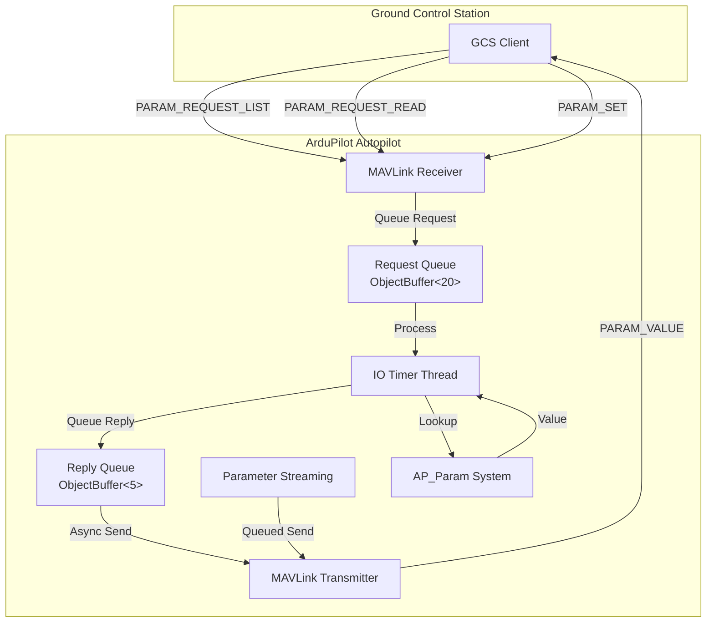
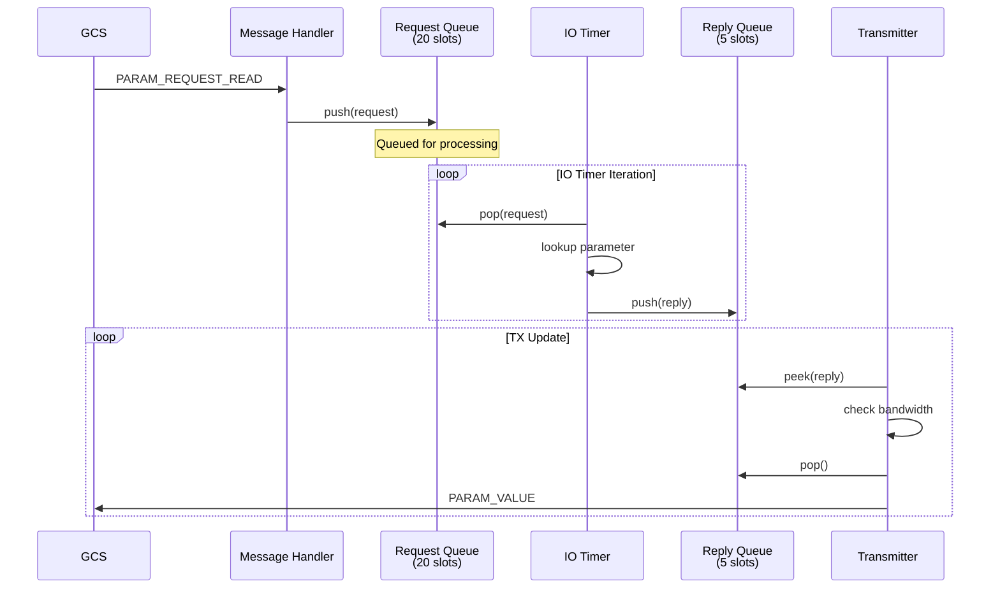

# MAVLink Parameter Synchronization Protocol


## Table of Contents
- [Overview](#overview)
- [Protocol Architecture](#protocol-architecture)
- [Message Types](#message-types)
- [Parameter Streaming](#parameter-streaming)
- [Request Handling](#request-handling)
- [Bandwidth Management](#bandwidth-management)
- [Parameter Operations](#parameter-operations)
- [Queue Management](#queue-management)
- [Integration with AP_Param](#integration-with-ap_param)
- [Error Handling](#error-handling)
- [Code Examples](#code-examples)
- [Configuration](#configuration)

## Overview

The MAVLink parameter synchronization protocol provides a robust mechanism for Ground Control Stations (GCS) to read and write parameters on ArduPilot autopilots. This protocol implements asynchronous streaming, bandwidth-aware throttling, and reliable parameter operations to ensure efficient communication over bandwidth-constrained telemetry links.

**Source Files**:
- `/libraries/GCS_MAVLink/GCS_Param.cpp` - Core parameter protocol implementation
- `/libraries/GCS_MAVLink/GCS_MAVLink_Parameters.cpp` - Stream configuration and parameter definitions
- `/libraries/GCS_MAVLink/GCS_Common.cpp` - Common GCS functionality

**Key Features**:
- Asynchronous parameter streaming with bandwidth throttling
- Queue-based request/reply management
- Automatic flow control for non-flow-controlled links
- Type-safe parameter conversion and validation
- Parameter persistence with change detection
- Integration with AP_Param system for var_info[] traversal

## Protocol Architecture

The parameter protocol uses an asynchronous, queue-based architecture that separates parameter requests from replies, allowing efficient use of available bandwidth while maintaining responsiveness.



**Architecture Components**:

1. **Request Queue**: ObjectBuffer with 20 slots for incoming parameter read requests
   - Source: `/libraries/GCS_MAVLink/GCS_Param.cpp:31`
   - Handles PARAM_REQUEST_READ messages asynchronously

2. **Reply Queue**: ObjectBuffer with 5 slots for prepared parameter responses
   - Source: `/libraries/GCS_MAVLink/GCS_Param.cpp:32`
   - Holds ready-to-send PARAM_VALUE messages

3. **IO Timer**: Background thread for parameter lookup operations
   - Source: `/libraries/GCS_MAVLink/GCS_Param.cpp:367`
   - Prevents blocking main thread during parameter enumeration (~30ms on some platforms)

4. **Streaming State Machine**: Maintains state for PARAM_REQUEST_LIST operations
   - Uses AP_Param iteration tokens to resume streaming
   - Implements bandwidth-aware throttling

## Message Types

### PARAM_REQUEST_LIST

Initiates streaming of all parameters from the autopilot to the GCS.

**Message Handler**: `GCS_MAVLINK::handle_param_request_list()`
- Source: `/libraries/GCS_MAVLink/GCS_Param.cpp:206-223`

**Processing Steps**:
1. Check if parameters are ready via `params_ready()`
2. Decode incoming PARAM_REQUEST_LIST message
3. Send banner information to GCS
4. Initialize streaming state:
   - Set `_queued_parameter` to first parameter via `AP_Param::first()`
   - Reset `_queued_parameter_index` to 0
   - Count total parameters via `AP_Param::count_parameters()`
   - Record `_queued_parameter_send_time_ms` to avoid initial flooding

**Implementation Details**:
```cpp
// Source: /libraries/GCS_MAVLink/GCS_Param.cpp:218-222
_queued_parameter = AP_Param::first(&_queued_parameter_token, &_queued_parameter_type);
_queued_parameter_index = 0;
_queued_parameter_count = AP_Param::count_parameters();
_queued_parameter_send_time_ms = AP_HAL::millis(); // avoid initial flooding
```

### PARAM_REQUEST_READ

Requests a single parameter by index or name.

**Message Handler**: `GCS_MAVLINK::handle_param_request_read()`
- Source: `/libraries/GCS_MAVLink/GCS_Param.cpp:225-261`

**Processing Steps**:
1. Check if request queue has space (capacity: 20 requests)
2. Decode PARAM_REQUEST_READ message
3. Reserve output bandwidth for eventual PARAM_VALUE reply
4. Create `pending_param_request` structure:
   - Store channel, parameter index, and parameter name
   - Name copied with safety bounds checking
5. Push request to queue for IO timer processing
6. Register IO timer if not already running

**Bandwidth Reservation**:
```cpp
// Source: /libraries/GCS_MAVLink/GCS_Param.cpp:239-245
uint32_t saved_reserve_param_space_start_ms = reserve_param_space_start_ms;
reserve_param_space_start_ms = 0; // bypass packet_overhead_chan reservation checking
if (!HAVE_PAYLOAD_SPACE(chan, PARAM_VALUE)) {
    reserve_param_space_start_ms = AP_HAL::millis();
} else {
    reserve_param_space_start_ms = saved_reserve_param_space_start_ms;
}
```

### PARAM_VALUE

Sends parameter name, value, type, and index to GCS.

**Message Sender**: `GCS_MAVLINK::send_parameter_value()`
- Source: `/libraries/GCS_MAVLink/GCS_Param.cpp:324-336`

**Message Fields**:
- `param_id`: Parameter name (up to AP_MAX_NAME_SIZE characters)
- `param_value`: Value cast to float representation
- `param_type`: MAVLink type enumeration via `mav_param_type()`
- `param_count`: Total number of parameters
- `param_index`: Index in parameter list (-1 for async replies)

**Type Conversion**:
- All parameter types converted to float for MAVLink transmission
- Original type preserved via `param_type` field
- Conversion handled by `AP_Param::cast_to_float()`

### PARAM_SET

Modifies a parameter value with validation and persistence.

**Message Handler**: `GCS_MAVLINK::handle_param_set()`
- Source: `/libraries/GCS_MAVLink/GCS_Param.cpp:263-322`

**Processing Steps**:
1. Decode PARAM_SET message
2. Lookup parameter via `AP_Param::find(key, &var_type, &parameter_flags)`
3. Validate parameter:
   - Check parameter exists (vp != nullptr)
   - Validate value is not NaN or Inf
   - Check write permissions via `allow_set_via_mavlink(parameter_flags)`
4. Store old value for change detection
5. Set new value via `vp->set_float(packet.param_value, var_type)`
6. Save to persistent storage if value changed
7. Invalidate parameter count cache if ENABLE flag set
8. Log parameter change to AP_Logger

**Write Protection**:
```cpp
// Source: /libraries/GCS_MAVLink/GCS_Param.cpp:284-294
if (!vp->allow_set_via_mavlink(parameter_flags)) {
    if (gcs().get_allow_param_set()) {
        GCS_SEND_TEXT(MAV_SEVERITY_WARNING, "Param write denied (%s)", key);
    }
    // send the readonly value
    send_parameter_value(key, var_type, old_value);
    return;
}
```

**Change Detection and Forced Save**:
```cpp
// Source: /libraries/GCS_MAVLink/GCS_Param.cpp:307-314
bool force_save = !is_equal(packet.param_value, old_value);
vp->save(force_save);

if (force_save && (parameter_flags & AP_PARAM_FLAG_ENABLE)) {
    AP_Param::invalidate_count();
}
```

## Parameter Streaming

Parameter streaming is the process of sending all parameters from autopilot to GCS in response to PARAM_REQUEST_LIST. This is implemented with sophisticated bandwidth management and flow control.

### Streaming Function

**Function**: `GCS_MAVLINK::queued_param_send()`
- Source: `/libraries/GCS_MAVLink/GCS_Param.cpp:40-100`
- Called from deferred message handling code in main update loop

### Streaming Algorithm

**Phase 1: Send Async Replies (Priority)**
```cpp
// Source: /libraries/GCS_MAVLink/GCS_Param.cpp:44
uint8_t async_replies_sent_count = send_parameter_async_replies();
```
- Async replies (from PARAM_REQUEST_READ) have priority
- Sent before streaming parameters to maintain responsiveness

**Phase 2: Check Streaming State**
```cpp
// Source: /libraries/GCS_MAVLink/GCS_Param.cpp:47-50
if (_queued_parameter == nullptr) {
    // .... or not....
    return;
}
```
- Exit if no active streaming session (PARAM_REQUEST_LIST not received)

**Phase 3: Bandwidth Calculation**
```cpp
// Source: /libraries/GCS_MAVLink/GCS_Param.cpp:52-66
const uint32_t tnow = AP_HAL::millis();
const uint32_t link_bw = _port->bw_in_bytes_per_second();

// use at most 30% of bandwidth on parameters
uint32_t bytes_allowed = link_bw * (tnow - _queued_parameter_send_time_ms) / 3333;

const uint16_t size_for_one_param_value_msg = 
    MAVLINK_MSG_ID_PARAM_VALUE_LEN + packet_overhead();

if (bytes_allowed < size_for_one_param_value_msg) {
    bytes_allowed = size_for_one_param_value_msg;
}
if (bytes_allowed > txspace()) {
    bytes_allowed = txspace();
}
uint32_t count = bytes_allowed / size_for_one_param_value_msg;
```

**Bandwidth Limit**: Uses at most 30% of link bandwidth for parameter streaming
- Calculation: `bytes_allowed = link_bw * elapsed_ms / 3333`
- The divisor 3333 = 1000ms / 0.30 (30%)
- Ensures parameter downloads don't saturate telemetry link
- Leaves bandwidth for telemetry, commands, and other messages

**Phase 4: Flow Control Throttling**
```cpp
// Source: /libraries/GCS_MAVLink/GCS_Param.cpp:69-76
// when we don't have flow control we really need to keep the
// param download very slow, or it tends to stall
if (!have_flow_control() && count > 5) {
    count = 5;
}
if (async_replies_sent_count >= count) {
    return;
}
count -= async_replies_sent_count;
```

**Flow Control Detection**:
- Source: `/libraries/GCS_MAVLink/GCS_Param.cpp:105-121`
- Returns true if UART has hardware flow control enabled
- Special case: USB connections (MAVLINK_COMM_0) assumed to have flow control
- Non-flow-controlled links limited to 5 parameters per iteration

**Phase 5: Send Parameters**
```cpp
// Source: /libraries/GCS_MAVLink/GCS_Param.cpp:78-98
while (count && _queued_parameter != nullptr && last_txbuf_is_greater(33)) {
    char param_name[AP_MAX_NAME_SIZE];
    _queued_parameter->copy_name_token(_queued_parameter_token, 
                                       param_name, sizeof(param_name), true);

    mavlink_msg_param_value_send(
        chan,
        param_name,
        _queued_parameter->cast_to_float(_queued_parameter_type),
        mav_param_type(_queued_parameter_type),
        _queued_parameter_count,
        _queued_parameter_index);

    _queued_parameter = AP_Param::next_scalar(&_queued_parameter_token, 
                                              &_queued_parameter_type);
    _queued_parameter_index++;

    if (AP_HAL::micros() - tstart > 1000) {
        // don't use more than 1ms sending blocks of parameters
        break;
    }
    count--;
}
```

**Time Limiting**: Maximum 1ms per iteration to avoid blocking main thread
- Prevents parameter streaming from impacting flight control loop timing
- Maintains real-time performance guarantees

### Parameter Iteration

**AP_Param Integration**:
- Uses `AP_Param::first()` to begin iteration
- Uses `AP_Param::next_scalar()` to advance through parameters
- `ParamToken` maintains iteration state across multiple calls
- Allows resumable streaming without re-scanning var_info[] arrays

## Request Handling

The parameter protocol uses asynchronous request handling to prevent blocking the main thread during parameter lookups and var_info[] traversal operations.

### IO Timer Thread

**Function**: `GCS_MAVLINK::param_io_timer()`
- Source: `/libraries/GCS_MAVLink/GCS_Param.cpp:367-411`
- Registered as IO process via `hal.scheduler->register_io_process()`
- Runs in background thread separate from main flight control loop

**Registration**:
```cpp
// Source: /libraries/GCS_MAVLink/GCS_Param.cpp:257-260
if (!param_timer_registered) {
    param_timer_registered = true;
    hal.scheduler->register_io_process(
        FUNCTOR_BIND_MEMBER(&GCS_MAVLINK::param_io_timer, void));
}
```

### Request Processing

**Step 1: Count Parameters (Cached)**
```cpp
// Source: /libraries/GCS_MAVLink/GCS_Param.cpp:372-373
// this is mostly a no-op, but doing this here means we won't
// block the main thread counting parameters (~30ms on PH)
AP_Param::count_parameters();
```
- Parameter counting can take ~30ms on some platforms (e.g., PixHawk)
- Count is cached after first call
- Running in IO timer prevents main thread blocking

**Step 2: Check Reply Queue Space**
```cpp
// Source: /libraries/GCS_MAVLink/GCS_Param.cpp:375-378
if (param_replies.space() == 0) {
    // no room
    return;
}
```
- Reply queue capacity: 5 pending replies
- Returns early if queue full, request will be processed on next iteration

**Step 3: Pop Request from Queue**
```cpp
// Source: /libraries/GCS_MAVLink/GCS_Param.cpp:380-383
if (!param_requests.pop(req)) {
    // nothing to do
    return;
}
```

**Step 4: Parameter Lookup**

**Lookup by Index**:
```cpp
// Source: /libraries/GCS_MAVLink/GCS_Param.cpp:388-394
if (req.param_index != -1) {
    AP_Param::ParamToken token {};
    vp = AP_Param::find_by_index(req.param_index, &reply.p_type, &token);
    if (vp == nullptr) {
        return;
    }
    vp->copy_name_token(token, reply.param_name, AP_MAX_NAME_SIZE, true);
}
```

**Lookup by Name**:
```cpp
// Source: /libraries/GCS_MAVLink/GCS_Param.cpp:395-401
else {
    strncpy(reply.param_name, req.param_name, AP_MAX_NAME_SIZE+1);
    vp = AP_Param::find(req.param_name, &reply.p_type);
    if (vp == nullptr) {
        return;
    }
}
```

**Step 5: Prepare Reply**
```cpp
// Source: /libraries/GCS_MAVLink/GCS_Param.cpp:403-410
reply.chan = req.chan;
reply.param_name[AP_MAX_NAME_SIZE] = 0;
reply.value = vp->cast_to_float(reply.p_type);
reply.param_index = req.param_index;
reply.count = AP_Param::count_parameters();

// queue for transmission
param_replies.push(reply);
```

### Async Reply Sending

**Function**: `GCS_MAVLINK::send_parameter_async_replies()`
- Source: `/libraries/GCS_MAVLink/GCS_Param.cpp:416-455`
- Called from `queued_param_send()` with priority over streaming

**Reply Transmission Loop**:
```cpp
// Source: /libraries/GCS_MAVLink/GCS_Param.cpp:420-453
while (async_replies_sent_count < 5) {
    struct pending_param_reply reply;
    if (!param_replies.peek(reply)) {
        return async_replies_sent_count;
    }

    // Reserve bandwidth for reply
    uint32_t saved_reserve_param_space_start_ms = reserve_param_space_start_ms;
    reserve_param_space_start_ms = 0;
    if (!HAVE_PAYLOAD_SPACE(reply.chan, PARAM_VALUE)) {
        reserve_param_space_start_ms = AP_HAL::millis();
        return async_replies_sent_count;
    }
    reserve_param_space_start_ms = saved_reserve_param_space_start_ms;

    mavlink_msg_param_value_send(
        reply.chan,
        reply.param_name,
        reply.value,
        mav_param_type(reply.p_type),
        reply.count,
        reply.param_index);

    _queued_parameter_send_time_ms = AP_HAL::millis();
    async_replies_sent_count++;

    if (!param_replies.pop()) {
        // internal error...
        return async_replies_sent_count;
    }
}
```

**Rate Limiting**: Maximum 5 async replies per call
- Prevents async replies from monopolizing bandwidth
- Balances responsiveness with streaming progress

## Bandwidth Management

The parameter protocol implements sophisticated bandwidth management to ensure parameter operations don't saturate telemetry links or interfere with critical flight data.

### 30% Bandwidth Limit

**Bandwidth Calculation**:
```cpp
// Source: /libraries/GCS_MAVLink/GCS_Param.cpp:56-58
const uint32_t link_bw = _port->bw_in_bytes_per_second();
uint32_t bytes_allowed = link_bw * (tnow - _queued_parameter_send_time_ms) / 3333;
```

**Formula Explanation**:
- `link_bw`: Total link bandwidth in bytes/second
- `elapsed_ms`: Time since last parameter transmission
- `bytes_allowed = (link_bw * elapsed_ms) / 3333`
- Divisor 3333 = 1000ms / 0.30, enforcing 30% bandwidth limit

**Example Calculation**:
- Link bandwidth: 10,000 bytes/second (typical for 57600 baud telemetry)
- Time since last send: 100ms
- Bytes allowed: `10000 * 100 / 3333 = 300 bytes`
- PARAM_VALUE message size: ~50 bytes (including overhead)
- Parameters to send: `300 / 50 = 6 parameters`

### Message Size Calculation

**Components**:
```cpp
// Source: /libraries/GCS_MAVLink/GCS_Param.cpp:59
const uint16_t size_for_one_param_value_msg = 
    MAVLINK_MSG_ID_PARAM_VALUE_LEN + packet_overhead();
```

**PARAM_VALUE Message Size**:
- MAVLink message payload: Variable by MAVLink version
- Packet overhead: MAVLink header, CRC, framing
- Total typical size: ~50 bytes for MAVLink 2

### Minimum Bandwidth Guarantee

```cpp
// Source: /libraries/GCS_MAVLink/GCS_Param.cpp:60-62
if (bytes_allowed < size_for_one_param_value_msg) {
    bytes_allowed = size_for_one_param_value_msg;
}
```
- Ensures at least one parameter can be sent per iteration
- Prevents stalling on very slow links

### TX Buffer Check

```cpp
// Source: /libraries/GCS_MAVLink/GCS_Param.cpp:63-65
if (bytes_allowed > txspace()) {
    bytes_allowed = txspace();
}
```
- Limits to available transmit buffer space
- Prevents overflow in UART transmit buffer

### Flow Control Adaptation

**Flow Control Detection**:
```cpp
// Source: /libraries/GCS_MAVLink/GCS_Param.cpp:105-121
bool GCS_MAVLINK::have_flow_control(void)
{
    if (_port == nullptr) {
        return false;
    }

    if (_port->flow_control_enabled()) {
        return true;
    }

    if (chan == MAVLINK_COMM_0) {
        // assume USB console has flow control
        return hal.gpio->usb_connected();
    }

    return false;
}
```

**Special Handling for Non-Flow-Controlled Links**:
```cpp
// Source: /libraries/GCS_MAVLink/GCS_Param.cpp:69-72
// when we don't have flow control we really need to keep the
// param download very slow, or it tends to stall
if (!have_flow_control() && count > 5) {
    count = 5;
}
```

**Why Throttling is Necessary**:
- Links without flow control (e.g., radio modems) can't signal buffer full
- Sending too fast causes packet loss and retransmissions
- Limit of 5 parameters per iteration prevents stalls
- Empirically determined value for reliable operation

### Bandwidth Reservation

**Reserve Mechanism**:
```cpp
// Source: /libraries/GCS_MAVLink/GCS_Param.cpp:239-245
uint32_t saved_reserve_param_space_start_ms = reserve_param_space_start_ms;
reserve_param_space_start_ms = 0; // bypass packet_overhead_chan reservation checking
if (!HAVE_PAYLOAD_SPACE(chan, PARAM_VALUE)) {
    reserve_param_space_start_ms = AP_HAL::millis();
} else {
    reserve_param_space_start_ms = saved_reserve_param_space_start_ms;
}
```

**Purpose**:
- Reserves buffer space for parameter replies
- Ensures GCS receives parameter responses even on saturated links
- Timestamp tracks how long space has been reserved
- Prevents parameter operations from being starved by other messages

## Parameter Operations

### Reading Parameters

**Single Parameter Read (PARAM_REQUEST_READ)**:

**By Index**:
```cpp
// GCS sends:
mavlink_msg_param_request_read_pack(
    system_id, component_id, &msg,
    target_system, target_component,
    nullptr,  // param_id (not used for index lookup)
    param_index  // index: 0 to param_count-1
);

// Autopilot responds with PARAM_VALUE message
```

**By Name**:
```cpp
// GCS sends:
mavlink_msg_param_request_read_pack(
    system_id, component_id, &msg,
    target_system, target_component,
    "PARAM_NAME",  // param_id
    -1  // param_index: -1 indicates lookup by name
);

// Autopilot responds with PARAM_VALUE message
```

**All Parameters (PARAM_REQUEST_LIST)**:
```cpp
// GCS sends:
mavlink_msg_param_request_list_pack(
    system_id, component_id, &msg,
    target_system, target_component
);

// Autopilot responds with stream of PARAM_VALUE messages
// Each message includes:
// - param_index: 0 to param_count-1
// - param_count: Total number of parameters
// GCS can detect missing parameters and re-request
```

### Writing Parameters

**PARAM_SET Operation**:

**Type-Safe Value Setting**:
```cpp
// Source: /libraries/GCS_MAVLink/GCS_Param.cpp:298-310
vp->set_float(packet.param_value, var_type);

// Force save if value changed
bool force_save = !is_equal(packet.param_value, old_value);
vp->save(force_save);
```

**Parameter Validation**:
1. Parameter must exist in var_info[] arrays
2. Value must not be NaN or Inf
3. Parameter must allow MAVLink writes (not read-only)
4. Write permission checked via `allow_set_via_mavlink()`

**Read-Only Parameter Handling**:
```cpp
// Source: /libraries/GCS_MAVLink/GCS_Param.cpp:284-295
if (!vp->allow_set_via_mavlink(parameter_flags)) {
    if (gcs().get_allow_param_set()) {
        GCS_SEND_TEXT(MAV_SEVERITY_WARNING, "Param write denied (%s)", key);
    }
    // send the readonly value back
    send_parameter_value(key, var_type, old_value);
    return;
}
```

### Parameter Persistence

**Save Mechanism**:
```cpp
// Source: /libraries/GCS_MAVLink/GCS_Param.cpp:307-314
bool force_save = !is_equal(packet.param_value, old_value);
vp->save(force_save);

if (force_save && (parameter_flags & AP_PARAM_FLAG_ENABLE)) {
    AP_Param::invalidate_count();
}
```

**Force Save Logic**:
- Always saves if value differs from old value
- Handles constructor override values (e.g., PID defaults)
- Ensures set-to-default operations are persisted
- ENABLE flag parameters invalidate cached parameter count

### Parameter Logging

**AP_Logger Integration**:
```cpp
// Source: /libraries/GCS_MAVLink/GCS_Param.cpp:316-321
#if HAL_LOGGING_ENABLED
AP_Logger *logger = AP_Logger::get_singleton();
if (logger != nullptr) {
    logger->Write_Parameter(key, vp->cast_to_float(var_type));
}
#endif
```

**Logging Behavior**:
- All PARAM_SET operations logged
- Logs parameter name and new value
- Enables post-flight parameter change analysis
- Critical for debugging and flight review

### Type Conversion

**MAVLink Type Mapping**:
```cpp
// Source: /libraries/GCS_MAVLink/GCS_Param.cpp:86
mav_param_type(_queued_parameter_type)
```

**AP_Param Types to MAVLink Types**:
- AP_PARAM_INT8 → MAV_PARAM_TYPE_INT8
- AP_PARAM_INT16 → MAV_PARAM_TYPE_INT16
- AP_PARAM_INT32 → MAV_PARAM_TYPE_INT32
- AP_PARAM_FLOAT → MAV_PARAM_TYPE_REAL32
- All types transmitted as float, type preserved for reconstruction

## Queue Management

The parameter protocol uses two ObjectBuffer queues for asynchronous operation.

### Request Queue

**Declaration**:
```cpp
// Source: /libraries/GCS_MAVLink/GCS_Param.cpp:31
ObjectBuffer<GCS_MAVLINK::pending_param_request> GCS_MAVLINK::param_requests(20);
```

**Structure**: `pending_param_request`
```cpp
struct pending_param_request {
    mavlink_channel_t chan;      // Response channel
    int16_t param_index;         // Index (-1 for name lookup)
    char param_name[AP_MAX_NAME_SIZE+1];  // Parameter name
};
```

**Capacity**: 20 pending requests
- Sized to handle burst requests from GCS
- Overflow results in dropped requests (GCS retry required)

**Queue Operations**:
- Push: `param_requests.push(req)` in `handle_param_request_read()`
- Pop: `param_requests.pop(req)` in `param_io_timer()`
- Space check: `param_requests.space()` before accepting new requests

### Reply Queue

**Declaration**:
```cpp
// Source: /libraries/GCS_MAVLink/GCS_Param.cpp:32
ObjectBuffer<GCS_MAVLINK::pending_param_reply> GCS_MAVLINK::param_replies(5);
```

**Structure**: `pending_param_reply`
```cpp
struct pending_param_reply {
    mavlink_channel_t chan;           // Response channel
    char param_name[AP_MAX_NAME_SIZE+1];  // Parameter name
    float value;                      // Parameter value (as float)
    ap_var_type p_type;              // Original parameter type
    int16_t param_index;             // Parameter index
    uint16_t count;                  // Total parameter count
};
```

**Capacity**: 5 pending replies
- Smaller than request queue (processing is slower)
- Sized for typical GCS request patterns

**Queue Operations**:
- Push: `param_replies.push(reply)` in `param_io_timer()`
- Peek: `param_replies.peek(reply)` in `send_parameter_async_replies()`
- Pop: `param_replies.pop()` after successful transmission

### Queue Flow



### Queue Overflow Handling

**Request Queue Full**:
```cpp
// Source: /libraries/GCS_MAVLink/GCS_Param.cpp:227-230
if (param_requests.space() == 0) {
    // we can't process this right now, drop it
    return;
}
```
- Silently drops new requests
- GCS responsible for retry with timeout
- Standard MAVLink pattern for unreliable links

**Reply Queue Full**:
```cpp
// Source: /libraries/GCS_MAVLink/GCS_Param.cpp:375-378
if (param_replies.space() == 0) {
    // no room
    return;
}
```
- Request remains in request queue
- Processed on next IO timer iteration
- No data loss, only processing delay

## Integration with AP_Param

The parameter protocol integrates deeply with ArduPilot's AP_Param system for parameter storage and traversal.

### Parameter Traversal

**Starting Iteration**:
```cpp
// Source: /libraries/GCS_MAVLink/GCS_Param.cpp:219
_queued_parameter = AP_Param::first(&_queued_parameter_token, &_queued_parameter_type);
```

**Continuing Iteration**:
```cpp
// Source: /libraries/GCS_MAVLink/GCS_Param.cpp:90
_queued_parameter = AP_Param::next_scalar(&_queued_parameter_token, &_queued_parameter_type);
```

**ParamToken State**:
- Opaque structure maintaining position in var_info[] arrays
- Allows resumable iteration across multiple function calls
- Efficient traversal without re-scanning from beginning

### Parameter Lookup

**By Index**:
```cpp
// Source: /libraries/GCS_MAVLink/GCS_Param.cpp:390
vp = AP_Param::find_by_index(req.param_index, &reply.p_type, &token);
```
- Direct index-based access
- Returns nullptr if index out of range
- Token populated for name extraction

**By Name**:
```cpp
// Source: /libraries/GCS_MAVLink/GCS_Param.cpp:397
vp = AP_Param::find(req.param_name, &reply.p_type);
```
- String-based lookup in var_info[] arrays
- Case-sensitive name matching
- Returns nullptr if parameter not found

### Parameter Counting

```cpp
// Source: /libraries/GCS_MAVLink/GCS_Param.cpp:221, 373
_queued_parameter_count = AP_Param::count_parameters();
```

**Counting Characteristics**:
- First call scans all var_info[] arrays (~30ms on some platforms)
- Result cached for subsequent calls
- Cache invalidated when ENABLE parameters change
- Run in IO timer to avoid blocking main thread

### var_info[] Integration

**Parameter Group Info**:
- Each library defines `var_info[]` array with parameter metadata
- AP_Param traverses all registered var_info[] arrays
- Handles nested parameter groups
- Supports dynamic parameter structures

**Example from Stream Configuration**:
```cpp
// Source: /libraries/GCS_MAVLink/GCS_MAVLink_Parameters.cpp:106-194
const AP_Param::GroupInfo GCS_MAVLINK::var_info[] = {
    // @Param: _RAW_SENS
    // @DisplayName: Raw sensor stream rate
    // @Description: MAVLink Stream rate of RAW_IMU, SCALED_IMU2, ...
    // @Units: Hz
    // @Range: 0 50
    AP_GROUPINFO("_RAW_SENS", 1, GCS_MAVLINK, 
                 streamRates[GCS_MAVLINK::STREAM_RAW_SENSORS], 
                 DRATE(GCS_MAVLINK::STREAM_RAW_SENSORS)),
    
    // Additional stream rate parameters...
    AP_GROUPEND
};
```

### Name Generation

**From Token**:
```cpp
// Source: /libraries/GCS_MAVLink/GCS_Param.cpp:80, 394
_queued_parameter->copy_name_token(_queued_parameter_token, 
                                   param_name, sizeof(param_name), true);
```

**Name Format**:
- Uses token to reconstruct full parameter name
- Handles nested groups (e.g., "MAV1_RAW_SENS")
- Null-terminated strings up to AP_MAX_NAME_SIZE

## Error Handling

### Invalid Parameter Detection

**Non-existent Parameters**:
```cpp
// Source: /libraries/GCS_MAVLink/GCS_Param.cpp:278-280
if (vp == nullptr || isnan(packet.param_value) || isinf(packet.param_value)) {
    return;
}
```
- Silently ignores requests for non-existent parameters
- Rejects NaN and Inf values
- No error message sent (MAVLink pattern for unreliable links)

### Write Permission Checks

**Read-Only Parameters**:
```cpp
// Source: /libraries/GCS_MAVLink/GCS_Param.cpp:284-295
if (!vp->allow_set_via_mavlink(parameter_flags)) {
    if (gcs().get_allow_param_set()) {
        GCS_SEND_TEXT(MAV_SEVERITY_WARNING, "Param write denied (%s)", key);
    }
    send_parameter_value(key, var_type, old_value);
    return;
}
```

**Write Denial Reasons**:
- Parameter flagged as read-only
- Special scripting-controlled parameters
- System parameters requiring reboot
- Parameters locked by advanced features

### Queue Overflow

**Request Dropped**:
```cpp
// Source: /libraries/GCS_MAVLink/GCS_Param.cpp:227-230
if (param_requests.space() == 0) {
    // we can't process this right now, drop it
    return;
}
```

**GCS Recovery**:
- GCS implements timeout and retry logic
- Standard MAVLink pattern for lossy links
- No acknowledgment of dropped requests

### Bandwidth Starvation

**Reserved Space Mechanism**:
```cpp
// Source: /libraries/GCS_MAVLink/GCS_Param.cpp:241-243
if (!HAVE_PAYLOAD_SPACE(chan, PARAM_VALUE)) {
    reserve_param_space_start_ms = AP_HAL::millis();
}
```

**Reservation Behavior**:
- Reserves buffer space when parameter reply can't be sent
- Timestamp tracks reservation duration
- Prevents indefinite blocking by other message types
- Ensures eventual parameter transmission

### Missing Parameters in Stream

**GCS Detection**:
- Each PARAM_VALUE includes param_index and param_count
- GCS detects gaps in parameter indices
- Missing parameters re-requested via PARAM_REQUEST_READ

**Typical Pattern**:
```
Received: param_index=0, param_count=500
Received: param_index=1, param_count=500
Received: param_index=3, param_count=500  // Gap detected!
GCS sends: PARAM_REQUEST_READ for index=2
```

## Code Examples

### Example 1: Parameter Download Sequence

**GCS Implementation (Pseudocode)**:
```cpp
// Step 1: Request all parameters
mavlink_msg_param_request_list_pack(
    my_system_id, my_component_id, &msg,
    target_system, target_component);
send_message(&msg);

// Step 2: Receive parameters
std::vector<bool> received(param_count, false);
while (!all_received()) {
    if (receive_message(&msg) && msg.msgid == MAVLINK_MSG_ID_PARAM_VALUE) {
        mavlink_param_value_t param;
        mavlink_msg_param_value_decode(&msg, &param);
        
        // Store parameter
        params[param.param_index] = param;
        received[param.param_index] = true;
        
        // Update total count
        if (param_count == 0) {
            param_count = param.param_count;
            received.resize(param_count, false);
        }
    }
    
    // Check for timeout and missing parameters
    if (timeout_expired()) {
        for (int i = 0; i < param_count; i++) {
            if (!received[i]) {
                // Re-request missing parameter
                mavlink_msg_param_request_read_pack(
                    my_system_id, my_component_id, &msg,
                    target_system, target_component,
                    nullptr, i);  // Request by index
                send_message(&msg);
            }
        }
        reset_timeout();
    }
}
```

### Example 2: Setting a Parameter

**GCS Implementation**:
```cpp
// Set parameter value
const char* param_name = "PARAM_NAME";
float param_value = 1.5f;

mavlink_msg_param_set_pack(
    my_system_id, my_component_id, &msg,
    target_system, target_component,
    param_name,
    param_value,
    MAV_PARAM_TYPE_REAL32);  // Specify original type
send_message(&msg);

// Wait for confirmation (PARAM_VALUE response)
while (true) {
    if (receive_message(&msg) && msg.msgid == MAVLINK_MSG_ID_PARAM_VALUE) {
        mavlink_param_value_t param;
        mavlink_msg_param_value_decode(&msg, &param);
        
        if (strncmp(param.param_id, param_name, sizeof(param.param_id)) == 0) {
            if (fabsf(param.param_value - param_value) < 0.001f) {
                // Success!
                break;
            } else {
                // Value different - may be clamped to range or write denied
                handle_value_mismatch(param.param_value);
                break;
            }
        }
    }
    
    if (timeout_expired()) {
        // Retry or report error
        retry_or_fail();
    }
}
```

### Example 3: Reading Single Parameter

**By Name**:
```cpp
const char* param_name = "PARAM_NAME";

mavlink_msg_param_request_read_pack(
    my_system_id, my_component_id, &msg,
    target_system, target_component,
    param_name,
    -1);  // -1 indicates lookup by name
send_message(&msg);

// Wait for PARAM_VALUE response
// (same pattern as parameter set confirmation)
```

**By Index**:
```cpp
int16_t param_index = 42;

mavlink_msg_param_request_read_pack(
    my_system_id, my_component_id, &msg,
    target_system, target_component,
    nullptr,  // Empty name for index lookup
    param_index);
send_message(&msg);
```

### Example 4: Detecting Parameter Changes

**Autopilot Side** (already implemented):
```cpp
// Source: /libraries/GCS_MAVLink/GCS_Param.cpp:341-361
void GCS::send_parameter_value(const char *param_name, 
                               ap_var_type param_type, 
                               float param_value)
{
    mavlink_param_value_t packet{};
    const uint8_t to_copy = MIN(ARRAY_SIZE(packet.param_id), strlen(param_name));
    memcpy(packet.param_id, param_name, to_copy);
    packet.param_value = param_value;
    packet.param_type = GCS_MAVLINK::mav_param_type(param_type);
    packet.param_count = AP_Param::count_parameters();
    packet.param_index = -1;  // -1 for async notifications

    gcs().send_to_active_channels(MAVLINK_MSG_ID_PARAM_VALUE,
                                  (const char *)&packet);
}
```

**Usage**: Called when parameters change outside of MAVLink (e.g., via scripting or switch)

## Configuration

### Stream Rate Parameters

**MAVLink Stream Configuration**:
- Source: `/libraries/GCS_MAVLink/GCS_MAVLink_Parameters.cpp:106-205`

**Parameter Stream Rate** (`MAVx_PARAMS`):
```cpp
// @Param: _PARAMS
// @DisplayName: Parameter stream rate
// @Description: MAVLink Stream rate of PARAM_VALUE
// @Units: Hz
// @Range: 0 50
// @Increment: 1
// @RebootRequired: True
// @User: Advanced
AP_GROUPINFO("_PARAMS", 9, GCS_MAVLINK, 
             streamRates[GCS_MAVLINK::STREAM_PARAMS], 
             DRATE(GCS_MAVLINK::STREAM_PARAMS))
```

**Default Rates by Vehicle Type**:
- Source: `/libraries/GCS_MAVLink/GCS_MAVLink_Parameters.cpp:25-84`

| Vehicle Type | Default PARAMS Rate (Hz) |
|--------------|-------------------------|
| ArduSub | 0 |
| AntennaTracker | 10 |
| Rover | 10 |
| ArduPlane | 10 |
| ArduCopter | 0 |
| Blimp | 0 |

**Zero Rate**: Parameters only sent on demand (PARAM_REQUEST_LIST/READ)
**Non-Zero Rate**: Enables automatic parameter streaming in STREAM_PARAMS

### Stream Messages

**STREAM_PARAMS Messages**:
```cpp
// Source: /libraries/GCS_MAVLink/GCS_MAVLink_Parameters.cpp:375-378
static const ap_message STREAM_PARAMS_msgs[] = {
    MSG_NEXT_PARAM,
    MSG_AVAILABLE_MODES
};
```

### MAVLink Options

**Options Bitmask** (`MAVx_OPTIONS`):
```cpp
// Source: /libraries/GCS_MAVLink/GCS_MAVLink_Parameters.cpp:210-216
// @Param: _OPTIONS
// @DisplayName: Bitmask for configuring this telemetry channel
// @Bitmask: 1:Don't forward mavlink to/from, 2:Ignore Streamrate
AP_GROUPINFO("_OPTIONS", 20, GCS_MAVLINK, options, 0)
```

**Relevant Options**:
- **Bit 1**: Don't forward MAVLink to/from this channel
- **Bit 2**: Ignore stream rate requests (REQUEST_DATA_STREAM)

### Bandwidth Configuration

**Configurable via Serial Port**:
- Baud rate determines `_port->bw_in_bytes_per_second()`
- Higher baud rates allow faster parameter downloads
- 30% limit is hardcoded in implementation

**Typical Baud Rates**:
- 57600: ~5.7 KB/s → ~1.7 KB/s for parameters → ~34 params/second
- 115200: ~11.5 KB/s → ~3.4 KB/s for parameters → ~68 params/second
- 921600: ~92 KB/s → ~27.6 KB/s for parameters → ~552 params/second

### Flow Control

**Hardware Flow Control**:
- Configured per serial port in `SERIALx_OPTIONS`
- Enables faster parameter downloads
- Removes 5-parameter-per-iteration limit

**USB Connections**:
- Source: `/libraries/GCS_MAVLink/GCS_Param.cpp:115-118`
- MAVLINK_COMM_0 (primary console) with USB connected assumed to have flow control
- Allows full-speed parameter streaming over USB

---

## Summary

The MAVLink parameter synchronization protocol in ArduPilot provides:

1. **Reliable Parameter Operations**: Queue-based asynchronous processing prevents data loss
2. **Bandwidth-Aware Streaming**: 30% bandwidth limit ensures telemetry link availability
3. **Flow Control Adaptation**: Automatic throttling for non-flow-controlled links
4. **Type Safety**: Preserves parameter types through transmission
5. **Persistence**: Automatic saving with change detection
6. **Integration**: Seamless AP_Param system traversal and lookup
7. **Error Handling**: Robust validation and graceful degradation
8. **Logging**: Complete parameter change audit trail

This implementation balances efficiency, reliability, and real-time requirements, making it suitable for safety-critical autopilot applications over bandwidth-constrained telemetry links.

---

**Document Version**: 1.0  
**Last Updated**: 2024  
**Maintained By**: ArduPilot Development Team  
**Source Code Version**: ArduPilot Master Branch

