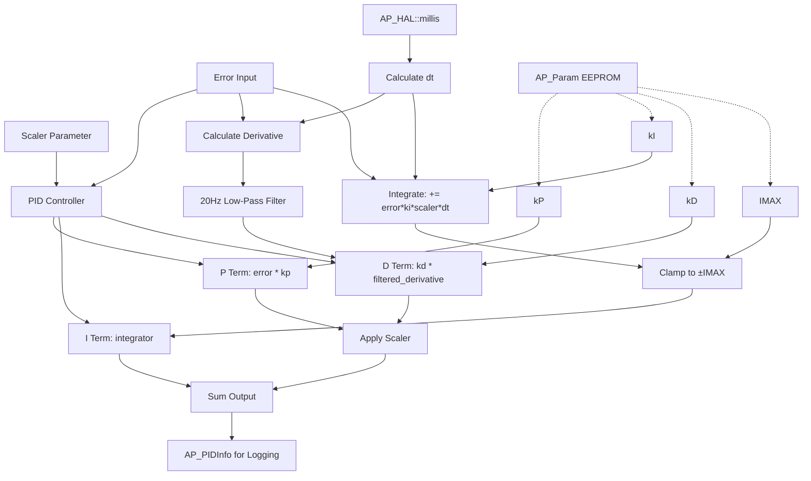

# PID

## Overview

The PID library provides a basic Proportional-Integral-Derivative controller implementation for ArduPilot with EEPROM-backed parameter storage via the AP_Param system. This general-purpose control loop implementation is simpler than the advanced AC_PID library and is suitable for non-flight-critical control applications where basic PID functionality is sufficient. Key features include P/I/D term calculation, integrator anti-windup clamping, derivative low-pass filtering at 20Hz, and persistent parameter storage for runtime tuning.

## Architecture



## Key Components

- **PID Class**: Main controller implementing the PID algorithm with EEPROM-backed gain storage via AP_Param integration
- **Proportional Term (P)**: Provides immediate response proportional to current error (P = error * kp), scaled by scaler parameter
- **Integral Term (I)**: Accumulates error over time to eliminate steady-state error, with anti-windup clamping to ±IMAX
- **Derivative Term (D)**: Responds to rate of change of error for damping and prediction, filtered at 20Hz to reduce noise sensitivity
- **Anti-Windup Mechanism**: Integrator clamped to ±IMAX prevents excessive buildup during actuator saturation or persistent errors
- **Derivative Filter**: Fixed 20Hz low-pass filter suppresses high-frequency noise that would otherwise cause control instability
- **Parameter System**: AP_Param integration enables ground station tuning, EEPROM persistence, and runtime parameter changes
- **Timing System**: Uses AP_HAL::millis() for platform-independent dt measurement with automatic reset on long pauses (dt > 1s)
- **Telemetry System**: AP_PIDInfo structure provides P, I, D term values and target output for logging and real-time monitoring

## PID Control Algorithm

### Mathematical Formulation

The PID control law implemented in this library follows the standard form:

**Control Output**: `output = scaler * (P_term + D_term) + I_term`

Where the individual terms are calculated as:

- **P_term** = kp * error
- **I_term** = integrator (accumulated over time, clamped to ±IMAX)
- **D_term** = kd * filtered_derivative

**Derivative Calculation**:

The derivative is computed from the rate of change of error and then low-pass filtered:

1. Raw derivative = (error - last_error) / dt
2. Filtered derivative uses first-order low-pass filter with RC time constant
   - Cutoff frequency: 20 Hz (fixed)
   - RC time constant: 1/(2*π*20) ≈ 7.96ms
3. Filter equation: `derivative = last_derivative + (dt/(RC+dt)) * (raw_derivative - last_derivative)`

**Integrator Update**:

The integrator accumulates error scaled by the integral gain and time step:

1. Update: `integrator += (error * ki) * scaler * dt`
2. Clamp to range: `integrator = constrain(integrator, -IMAX, +IMAX)`

This anti-windup mechanism prevents the integrator from growing unbounded during actuator saturation.

### Timing and dt Measurement

Source: libraries/PID/PID.cpp:37-55

The controller uses AP_HAL::millis() for platform-independent time measurement:

- **dt Calculation**: Current time (millis) - last update time
- **dt Conversion**: Converted from milliseconds to seconds: `delta_time = dt * 0.001f`
- **Automatic Reset**: If dt > 1000ms or first call (_last_t == 0), the integrator is reset to zero
  - Prevents large jumps from accumulated error during idle periods
  - Example: Switching from one control mode to another and back after delay
- **Regular Updates Required**: Accurate I and D terms require consistent, regular calls to get_pid()

The automatic reset on long pauses (>1 second) is a safety feature that prevents integrator buildup from a previous flight mode or control state from causing unexpected behavior when the PID controller is re-engaged.

### Derivative Filtering Details

Source: libraries/PID/PID.cpp:62-89

The derivative term uses a discrete first-order low-pass filter with fixed 20Hz cutoff frequency:

**Filter Characteristics**:
- **Cutoff Frequency**: 20 Hz (_fCut = 20)
- **Time Constant**: RC = 1/(2*π*20) ≈ 7.96 ms
- **Rolloff**: Approximately 20 dB/decade above cutoff
- **Purpose**: Suppress high-frequency sensor noise that would cause control oscillations

**First Sample Suppression**:

After reset_I() is called, _last_derivative is set to NAN (Not A Number). On the next get_pid() call:

1. The NAN value is detected with isnan()
2. The derivative calculation is skipped (derivative = 0)
3. _last_derivative is set to 0
4. Subsequent calls compute the derivative normally

This prevents a large derivative spike from the stale _last_error value that existed before the reset.

**Derivative Computation Conditions**:

The derivative term is only computed if:
- kd != 0 (derivative gain is non-zero)
- dt > 0 (time has elapsed since last update)

If these conditions are not met, the D term remains at its previous value.

### Anti-Windup Mechanism

Source: libraries/PID/PID.cpp:96-106

The integrator uses simple clamping anti-windup to prevent excessive buildup:

**Integrator Update and Clamping**:

```
integrator += (error * ki) * scaler * delta_time
if (integrator < -IMAX) {
    integrator = -IMAX
} else if (integrator > IMAX) {
    integrator = IMAX
}
```

**Anti-Windup Benefits**:
- Prevents integrator from growing unbounded during actuator saturation
- Limits overshoot when error sign changes
- Enables faster recovery from large disturbances
- Bounds the maximum contribution of the I term to the control output

**When Integrator Saturates**:

Saturation typically occurs when:
1. Persistent steady-state error exists (may need higher kp or ki)
2. Actuator has reached physical limits (expected behavior)
3. Integral gain too high relative to IMAX (reduce ki or increase IMAX)

**Automatic Reset on Long Pause**:

If dt > 1 second, the integrator is automatically reset to zero to prevent:
- Carryover of accumulated error from previous control mode
- Large transient when control is re-engaged
- Unwanted initial output spike

Manual reset via reset_I() is recommended during mode changes even if the pause is less than 1 second.

## Usage Patterns

### Basic Initialization and Usage

```cpp
#include <PID/PID.h>

// Create PID with initial gains: P=1.0, I=0.5, D=0.01, IMAX=100
PID my_pid(1.0f, 0.5f, 0.01f, 100);

// Initialize - load gains from EEPROM if previously saved
void setup() {
    my_pid.load_gains();
}

// Control loop (called regularly, e.g., 50Hz)
void loop() {
    float target = 100.0f;        // Desired value
    float actual = sensor.read(); // Measured value
    float error = target - actual; // Positive error for positive output
    
    float output = my_pid.get_pid(error);
    actuator.write(output);
}
```

**Key Points**:
- Error sign convention: Positive error (target > actual) produces positive output
- Regular calls required: Call get_pid() at consistent intervals for accurate I and D terms
- Load gains on startup: Use load_gains() to restore previously saved parameters from EEPROM

### Gain Tuning at Runtime

```cpp
// Adjust individual gains dynamically
my_pid.kP(1.5f);    // Set proportional gain
my_pid.kI(0.2f);    // Set integral gain
my_pid.kD(0.05f);   // Set derivative gain
my_pid.imax(150);   // Set integrator limit

// Or set all gains at once using function call operator
my_pid(1.5f, 0.2f, 0.05f, 150);

// Save to EEPROM for persistence across reboots
my_pid.save_gains();

// Read current gains
float kp = my_pid.kP();
float ki = my_pid.kI();
float kd = my_pid.kD();
int16_t imax = my_pid.imax();
```

**Important**:
- save_gains() writes to EEPROM which has limited write cycles (typically 100,000)
- Don't call save_gains() in fast loops - only after tuning changes
- Ground stations can also modify parameters in real-time via MAVLink

### Integrator Management

```cpp
// Reset only integrator (e.g., during mode change)
my_pid.reset_I();

// Full reset including derivative state and telemetry
my_pid.reset();

// Check integrator value for diagnostics
float integrator = my_pid.get_integrator();
if (fabsf(integrator) > 0.9f * my_pid.imax()) {
    // Integrator near saturation - may indicate:
    // 1. Persistent steady-state error (increase kp or ki)
    // 2. Actuator saturation (physical limit reached)
    // 3. Excessive integral gain (reduce ki or increase imax)
}

// Access detailed term information for logging
const AP_PIDInfo& info = my_pid.get_pid_info();
// info.P, info.I, info.D contain individual term contributions
// info.target contains the total output
```

**When to Reset**:
- **Mode Changes**: Reset integrator when switching control modes to prevent transients
- **Target Changes**: Consider resetting when target changes significantly
- **Error Detection**: Reset if control output exhibits unexpected behavior
- **Long Idle**: Automatic reset occurs if dt > 1 second

### Scaling for Different Operating Conditions

```cpp
// Scaler parameter adjusts P and D terms dynamically
// Useful for gain scheduling based on flight conditions
float scaler = 1.0f;

// Example: Reduce gains at high speed to prevent oscillations
if (airspeed > 20.0f) {
    scaler = 0.7f;  // 30% reduction
}

// Example: Increase gains at low speed for better tracking
if (airspeed < 5.0f) {
    scaler = 1.3f;  // 30% increase
}

float output = my_pid.get_pid(error, scaler);
```

**How Scaler Works**:
- **P term**: Multiplied by scaler: `P_output = scaler * kp * error`
- **D term**: Multiplied by scaler: `D_output = scaler * kd * derivative`
- **I term accumulation**: Scaled during integration: `integrator += error * ki * scaler * dt`
- **I term output**: Not scaled again (scaling already applied during accumulation)

**Use Cases for Scaling**:
- Gain scheduling based on operating conditions (speed, altitude, etc.)
- Adaptive control based on system state
- Temporary gain reduction during maneuvers
- Compensation for nonlinear system dynamics

## Configuration Parameters

The PID class integrates with ArduPilot's AP_Param system, making parameters accessible through ground control stations for real-time tuning. Parameters are stored in EEPROM for persistence across reboots.

Source: libraries/PID/PID.cpp:12-35

| Parameter | Description | Default | Typical Range | Units |
|-----------|-------------|---------|---------------|-------|
| P | Proportional gain | Constructor specified | 0.1 - 10.0 | dimensionless* |
| I | Integral gain | Constructor specified | 0.0 - 5.0 | 1/s |
| D | Derivative gain | Constructor specified | 0.0 - 1.0 | s |
| IMAX | Integrator maximum (absolute value) | Constructor specified | 0 - 10000 | output units* |

*Units depend on application: dimensionless for unitless control, or appropriate physical dimensions for angle control, velocity control, etc.

### Parameter Guidelines

**Proportional Gain (P)**:
- **Function**: Provides primary response proportional to current error
- **Higher P**: Faster response but more overshoot and potential oscillations
- **Lower P**: Sluggish response with larger steady-state error
- **Too High**: System oscillates or becomes unstable
- **Too Low**: Slow to reach target, large steady-state errors

**Typical Starting Values**: 0.5 - 2.0 for most applications

**Integral Gain (I)**:
- **Function**: Eliminates steady-state error by accumulating error over time
- **Higher I**: Faster elimination of steady error but increased overshoot
- **Lower I**: Slower steady-state error elimination but better stability
- **Too High**: Integrator windup, slow recovery from disturbances, oscillations
- **Too Low**: Persistent steady-state error

**Typical Starting Values**: 0.1 - 1.0 for most applications; set to 0 for PD-only control

**Derivative Gain (D)**:
- **Function**: Provides damping by responding to rate of change of error
- **Higher D**: More damping, reduced overshoot, better anticipation
- **Lower D**: Less noise sensitivity but potentially more overshoot
- **Too High**: Amplifies sensor noise, causes jittery output
- **Too Low**: Insufficient damping, excessive overshoot

**Typical Starting Values**: 0.01 - 0.1 for most applications; 20Hz filter helps with noise

**Integrator Maximum (IMAX)**:
- **Function**: Clamps integrator accumulator to ±IMAX to prevent windup
- **Purpose**: Limits I term contribution, prevents excessive buildup during saturation
- **Should Be**: Large enough to handle worst-case steady-state error
- **Typical Value**: 10-50% of maximum output range

**Setting IMAX**:
- Too low: Insufficient I action to eliminate steady-state error
- Too high: Excessive overshoot and slow recovery from transients
- Monitor integrator value during operation to ensure not constantly saturated

### Parameter Relationships

**P and I Interaction**:
- Higher P reduces steady-state error, allowing lower I
- Lower P requires higher I to eliminate steady-state error
- Rule of thumb: I ≈ 0.1 to 0.5 * P (starting point)

**P and D Interaction**:
- Higher D allows higher P without oscillations
- Lower D requires lower P to maintain stability
- Rule of thumb: D ≈ 0.01 to 0.05 * P (starting point)

**I and IMAX Relationship**:
- Higher I requires proportionally higher IMAX
- IMAX should allow integrator to accumulate enough to eliminate steady error
- IMAX should prevent excessive overshoot: typically 20-50% of max output

## PID Tuning Guidelines

### Manual Tuning Procedure (Recommended)

This step-by-step procedure provides systematic PID tuning suitable for most applications.

**Step 1: Start with P Only**

1. Set I = 0, D = 0, IMAX = 0 (disable integral and derivative terms)
2. Start with small P (e.g., 0.1)
3. Apply step input and observe response
4. Gradually increase P until system responds quickly to step inputs
5. Continue increasing P until oscillations appear
6. Reduce P by 30-50% from oscillation point
7. **Target**: Fast response without continuous oscillation

**Indicators of Good P Tuning**:
- System reaches ~90% of target within reasonable time
- Small overshoot (10-20%) is acceptable
- No sustained oscillations

**Step 2: Add I Term**

1. Start with I = 0.1 * P (conservative starting point)
2. Observe steady-state error elimination
3. If steady-state error persists: Gradually increase I
4. If excessive overshoot or slow recovery: Decrease I
5. Set IMAX = 50% of maximum output range initially
6. **Target**: Zero steady-state error without excessive overshoot

**Indicators of Good I Tuning**:
- Steady-state error eliminated within acceptable time
- No excessive overshoot when target changes
- Recovery from disturbances is smooth

**Step 3: Add D Term**

1. Start with D = 0.01 * P (conservative starting point)
2. Increase D to reduce overshoot and dampen oscillations
3. Watch for noise amplification or jittery output
4. If output is noisy: Decrease D
5. **Target**: Smooth response with good damping

**Indicators of Good D Tuning**:
- Reduced overshoot compared to PI-only control
- No visible noise or jitter in output
- Improved disturbance rejection

**Step 4: Fine-Tune All Parameters**

1. Test with various step sizes (small, medium, large)
2. Test with disturbances (external forces, load changes)
3. Adjust IMAX if integrator saturates frequently
4. Use scaler parameter for gain scheduling if needed
5. Test under different operating conditions
6. **Document final gains and operating conditions**

**Final Validation**:
- Measure rise time, overshoot, settling time
- Verify performance meets requirements
- Test worst-case scenarios
- Confirm stability margins

### Ziegler-Nichols Tuning Method

The Ziegler-Nichols method provides a systematic approach to finding initial PID gains based on system response characteristics.

**Ultimate Gain Method**:

1. **Find Ultimate Gain (Ku)**:
   - Set I = 0, D = 0 (P-only control)
   - Increase P gradually until system oscillates at constant amplitude
   - Record this value as Ku (ultimate gain)
   - Measure oscillation period Tu (time for one complete cycle)

2. **Calculate PID Gains**:
   - **P** = 0.6 * Ku
   - **I** = 1.2 * Ku / Tu
   - **D** = 0.075 * Ku * Tu

3. **Fine-Tune**: Use these values as starting points and adjust based on performance

**Important Notes**:
- Ziegler-Nichols often produces aggressive tuning
- May need to reduce all gains by 30-50% for practical systems
- Works best for systems with minimal dead time
- May cause excessive overshoot in some applications

**Alternative Ziegler-Nichols Formulas** (for less aggressive tuning):

For PI control (no D):
- **P** = 0.45 * Ku
- **I** = 0.54 * Ku / Tu

For PD control (no I):
- **P** = 0.8 * Ku
- **D** = Ku * Tu / 8

### Performance Metrics

**Step Response Analysis**:

Key metrics to evaluate PID performance:

- **Rise Time**: Time to reach 90% of target
  - Decrease with higher P
  - Typical: 0.1 - 2.0 seconds depending on system

- **Overshoot**: Peak error beyond target
  - Reduce with higher D or lower P/I
  - Acceptable: < 10-20% for most applications

- **Settling Time**: Time to stay within ±5% of target
  - Optimize with proper I and D tuning
  - Typical: 2-5× rise time

- **Steady-State Error**: Final error after settling
  - Eliminate with I term
  - Acceptable: < 1% of target range

**Frequency Response**:

For advanced tuning, consider frequency domain characteristics:

- **Phase Margin**: Should be > 45° for good stability
  - Higher phase margin = more stable but slower
  - Lower phase margin = faster but less stable

- **Gain Margin**: Should be > 6dB for robustness
  - Indicates how much gain increase system can tolerate

- **Bandwidth**: Control bandwidth limited by:
  - Derivative filter cutoff (20Hz in this implementation)
  - Loop rate (how often get_pid() is called)
  - System dynamics

**Time Domain Specifications**:

For specification-based tuning:
- **2% Settling Time**: Time to stay within ±2% of final value
- **5% Settling Time**: Time to stay within ±5% of final value
- **Peak Time**: Time to reach maximum overshoot
- **Delay Time**: Time to reach 50% of final value

### Common Tuning Problems and Solutions

**Problem**: Slow Response
- **Cause**: P gain too low
- **Solution**: Increase P gradually until response is acceptable

**Problem**: Oscillations
- **Cause**: P or I gain too high, or D gain too low
- **Solution**: Reduce P and/or I, or increase D

**Problem**: Noisy Output
- **Cause**: D gain too high
- **Solution**: Reduce D gain; 20Hz filter should help but may not be sufficient

**Problem**: Steady-State Error
- **Cause**: I gain too low or IMAX too restrictive
- **Solution**: Increase I gain or IMAX

**Problem**: Overshoot
- **Cause**: P or I too high, D too low
- **Solution**: Reduce P or I, increase D

**Problem**: Slow Recovery from Disturbance
- **Cause**: Integrator saturated (too much windup)
- **Solution**: Reduce I gain or increase IMAX

**Problem**: Integrator Windup
- **Cause**: I gain too high or IMAX too large
- **Solution**: Reduce I gain or IMAX, ensure reset on mode changes

## Reset Conditions and Integrator Management

### Automatic Reset Conditions

Source: libraries/PID/PID.cpp:44-52

The PID controller automatically resets the integrator under certain conditions to prevent issues from stale accumulated error.

**Long Idle Period (dt > 1000ms)**:

When more than 1 second has elapsed since the last call to get_pid():
- Integrator is automatically reset to zero
- _last_derivative is set to NAN
- dt is set to 0 for this update cycle

**Purpose**:
- Prevents integrator buildup from a previous control mode from carrying over
- Avoids large transient when control is re-engaged
- Example scenario: Switching from altitude hold to manual mode, waiting, then back to altitude hold

**Implementation Detail**:

```cpp
if (_last_t == 0 || dt > 1000) {
    dt = 0;
    reset_I();  // Zero integrator and set _last_derivative to NAN
}
```

**First Call Detection**:

On the very first call to get_pid(), _last_t will be 0, triggering the reset. This ensures clean initialization.

**First Derivative Sample Suppression**:

Source: libraries/PID/PID.cpp:65-73

After reset_I() sets _last_derivative to NAN (Not A Number):

1. Next get_pid() call detects NAN with isnan()
2. Derivative calculation is skipped (derivative = 0)
3. _last_derivative is set to 0
4. _last_error is updated
5. Subsequent calls compute derivative normally

**Purpose**:
- Prevents large D term spike from stale _last_error value
- Ensures smooth transition after reset
- First derivative sample would be meaningless since _last_error may be from previous mode

### Manual Reset Functions

**reset_I() - Integrator and Derivative Reset**:

Source: libraries/PID/PID.cpp:113-120

```cpp
void reset_I() {
    _integrator = 0;
    _last_derivative = NAN;
    _pid_info.I = 0;
}
```

**Effects**:
- Zeros the integrator accumulator
- Sets _last_derivative to NAN (next derivative calculation suppressed)
- Preserves _last_error (will be used for next derivative after suppression)
- Zeros the I term in telemetry (AP_PIDInfo)

**Use Cases**:
- Mode changes (switching between control modes)
- Target changes (switching to new setpoint)
- Error condition recovery
- Manual intervention override

**reset() - Full State Reset**:

Source: libraries/PID/PID.cpp:122-125

```cpp
void reset() {
    memset(&_pid_info, 0, sizeof(_pid_info));
    reset_I();
}
```

**Effects**:
- Calls reset_I() (zeros integrator and derivative state)
- Zeros all telemetry structure (AP_PIDInfo)
  - P, I, D terms set to 0
  - target, actual, error fields set to 0
- Complete fresh start

**Use Cases**:
- Major state transitions
- Fault recovery
- System initialization
- When you need complete clean slate

**Comparison of Reset Functions**:

| Function | Integrator | Derivative | Telemetry | _last_error |
|----------|-----------|-----------|-----------|-------------|
| reset_I() | Reset to 0 | Set to NAN | I term zeroed | Preserved |
| reset() | Reset to 0 | Set to NAN | All zeroed | Preserved |
| Auto (dt>1s) | Reset to 0 | Set to NAN | I term zeroed | Preserved |

### Integrator State Monitoring

**Checking Integrator Value**:

```cpp
float integrator = my_pid.get_integrator();

// Check for saturation
if (fabsf(integrator) >= my_pid.imax()) {
    // Integrator at limit - saturation detected
    GCS_SEND_TEXT(MAV_SEVERITY_WARNING, "PID integrator saturated");
}

// Check if near saturation (90% of limit)
if (fabsf(integrator) > 0.9f * my_pid.imax()) {
    // Integrator near limit - may need tuning adjustment
    // Options:
    // 1. Increase IMAX if physically reasonable
    // 2. Reduce I gain to slow accumulation
    // 3. Increase P gain to reduce steady-state error
    // 4. Accept that system is at steady-state control limit
}
```

**Interpreting Integrator Saturation**:

**Constant Saturation** (integrator always at limit):
- May indicate persistent steady-state error
- System may be at physical limits (actuator saturated)
- Consider increasing IMAX or P gain
- May need better system model or feedforward

**Frequent Saturation** (integrator hits limit often):
- I gain may be too high relative to IMAX
- Consider reducing I gain or increasing IMAX
- May indicate inadequate IMAX for operating conditions

**Oscillating Around Limit**:
- Possible integrator windup and release cycle
- Reduce I gain or increase IMAX
- May need better anti-windup strategy (consider AC_PID for advanced features)

### Monitoring Term Contributions

```cpp
const AP_PIDInfo& info = my_pid.get_pid_info();

// Log individual term contributions
logger.Write("PID", 
             "TimeUS,P,I,D,Target", 
             "Qffff",
             AP_HAL::micros64(),
             info.P,
             info.I,
             info.D,
             info.target);

// Real-time monitoring
if (fabsf(info.D) > fabsf(info.P)) {
    // D term larger than P term - may indicate noise issues
    GCS_SEND_TEXT(MAV_SEVERITY_INFO, "D term dominant: P=%.2f D=%.2f", info.P, info.D);
}

// Check for term balance
float total = fabsf(info.P) + fabsf(info.I) + fabsf(info.D);
if (total > 0.0f) {
    float p_percent = 100.0f * fabsf(info.P) / total;
    float i_percent = 100.0f * fabsf(info.I) / total;
    float d_percent = 100.0f * fabsf(info.D) / total;
    // Typical: P dominant (40-60%), I moderate (20-40%), D small (10-20%)
}
```

### Best Practices for Reset Management

**Always Reset on Mode Changes**:
```cpp
void switch_to_altitude_hold() {
    altitude_pid.reset_I();  // Clear old integrator state
    // ... mode change logic ...
}
```

**Consider Reset on Large Target Changes**:
```cpp
void set_target(float new_target) {
    float target_change = fabsf(new_target - current_target);
    if (target_change > threshold) {
        my_pid.reset_I();  // Clear integrator for large changes
    }
    current_target = new_target;
}
```

**Monitor and Reset on Saturation**:
```cpp
float output = my_pid.get_pid(error);
if (output_saturated && fabsf(my_pid.get_integrator()) > 0.8f * my_pid.imax()) {
    // Output saturated and integrator building up
    my_pid.reset_I();  // Prevent further windup
}
```

**Don't Reset Too Frequently**:
- Resetting every cycle defeats the purpose of the integrator
- Allow integrator to accumulate and eliminate steady-state error
- Only reset when control mode, target, or conditions change significantly

## Testing PID Performance

### Step Response Test

The step response test applies a sudden change in target value and observes how the system responds. This is the most common test for PID tuning validation.

```cpp
// Apply step input and record response for analysis
void test_step_response() {
    float target = 0.0f;
    my_pid.reset();  // Start with clean state
    
    uint32_t start_time = AP_HAL::millis();
    const uint32_t test_duration = 5000;  // 5 seconds
    const uint32_t step_time = 1000;      // Apply step at 1 second
    
    while (AP_HAL::millis() - start_time < test_duration) {
        // Apply step input at t=1000ms
        if (AP_HAL::millis() - start_time >= step_time && target == 0.0f) {
            target = 100.0f;  // Step from 0 to 100
        }
        
        float actual = sensor.read();
        float error = target - actual;
        float output = my_pid.get_pid(error);
        
        actuator.write(output);
        
        // Log data for analysis
        const AP_PIDInfo& info = my_pid.get_pid_info();
        datalogger.write_step_response(
            AP_HAL::millis(), 
            target, 
            actual, 
            info.P, 
            info.I, 
            info.D, 
            output
        );
        
        hal.scheduler->delay(10);  // 100Hz control rate
    }
}
```

**What to Look For**:
- **Rise Time**: How quickly system reaches 90% of target
- **Overshoot**: How much system exceeds target (if at all)
- **Settling Time**: How long to settle within ±5% of target
- **Steady-State Error**: Final error after settling
- **Oscillations**: Frequency and damping of any oscillations

**Ideal Step Response**:
- Fast rise time (determined by application requirements)
- Minimal overshoot (< 10-20%)
- Short settling time (2-5× rise time)
- Zero steady-state error (with proper I gain)
- No sustained oscillations

### Frequency Response Test (Sine Sweep)

Frequency response testing identifies system bandwidth and stability margins by sweeping through a range of input frequencies.

```cpp
// Measure system frequency response with logarithmic sine sweep
void test_frequency_response() {
    float amplitude = 10.0f;      // Amplitude of sine wave
    float freq_start = 0.1f;      // Starting frequency (Hz)
    float freq_end = 10.0f;       // Ending frequency (Hz)
    float sweep_duration = 30.0f; // Sweep duration (seconds)
    
    uint32_t start_time = AP_HAL::millis();
    
    while ((AP_HAL::millis() - start_time) / 1000.0f < sweep_duration) {
        float t = (AP_HAL::millis() - start_time) / 1000.0f;
        
        // Logarithmic frequency sweep
        float freq = freq_start * powf(freq_end / freq_start, t / sweep_duration);
        float target = amplitude * sinf(2.0f * M_PI * freq * t);
        
        float actual = sensor.read();
        float error = target - actual;
        float output = my_pid.get_pid(error);
        
        actuator.write(output);
        
        // Log for frequency response analysis
        datalogger.write_frequency_response(t, freq, target, actual, output);
        
        hal.scheduler->delay(10);  // 100Hz control rate
    }
}
```

**Analysis**:
- Plot magnitude ratio (actual/target) vs frequency
- Plot phase lag (actual behind target) vs frequency
- Identify bandwidth (frequency where magnitude drops to -3dB)
- Identify resonant peaks (indicates potential instability)
- Verify phase margin at crossover frequency

**Expected Results**:
- Good tracking at low frequencies (< 1 Hz)
- Rolloff at high frequencies (> 10 Hz due to 20Hz filter)
- No resonant peaks (would indicate oscillation tendency)
- Phase lag increases with frequency

### Disturbance Rejection Test

This test evaluates how well the PID controller rejects external disturbances and returns to the target.

```cpp
// Test response to disturbances
void test_disturbance_rejection() {
    float target = 50.0f;  // Constant target
    
    uint32_t start_time = AP_HAL::millis();
    const uint32_t test_duration = 10000;  // 10 seconds
    const uint32_t disturbance_start = 3000;  // Apply at 3 seconds
    const uint32_t disturbance_end = 3500;    // 500ms impulse
    
    while (AP_HAL::millis() - start_time < test_duration) {
        uint32_t elapsed = AP_HAL::millis() - start_time;
        
        // Apply disturbance impulse
        float disturbance = 0.0f;
        if (elapsed >= disturbance_start && elapsed < disturbance_end) {
            disturbance = 30.0f;  // Large disturbance (60% of target)
        }
        
        float actual = sensor.read() + disturbance;
        float error = target - actual;
        float output = my_pid.get_pid(error);
        
        actuator.write(output);
        
        // Monitor recovery time and overshoot
        datalogger.write_disturbance_test(
            AP_HAL::millis(), 
            target, 
            actual, 
            output,
            disturbance
        );
        
        hal.scheduler->delay(10);  // 100Hz control rate
    }
}
```

**What to Measure**:
- **Recovery Time**: How long to return within ±5% of target
- **Maximum Deviation**: Peak error during disturbance
- **Overshoot**: Does system overshoot target during recovery?
- **Settling Behavior**: Oscillations during recovery

**Good Disturbance Rejection**:
- Quick recovery (1-3 seconds typical)
- Minimal overshoot during recovery
- Smooth return to target
- I term effectively eliminates residual error

### Saturation Test

Test behavior when actuator reaches physical limits.

```cpp
// Test integrator anti-windup during saturation
void test_saturation_behavior() {
    float target = 150.0f;  // Target beyond actuator capability
    const float actuator_max = 100.0f;
    
    my_pid.reset();
    uint32_t start_time = AP_HAL::millis();
    
    while (AP_HAL::millis() - start_time < 5000) {
        float actual = sensor.read();
        float error = target - actual;
        float output = my_pid.get_pid(error);
        
        // Saturate actuator output
        float actuator_output = constrain_float(output, -actuator_max, actuator_max);
        actuator.write(actuator_output);
        
        // Monitor integrator during saturation
        float integrator = my_pid.get_integrator();
        bool saturated = (fabsf(output) > actuator_max);
        
        datalogger.write_saturation_test(
            AP_HAL::millis(),
            target,
            actual,
            output,
            actuator_output,
            integrator,
            saturated
        );
        
        hal.scheduler->delay(10);
    }
}
```

**What to Verify**:
- Integrator does not exceed IMAX (anti-windup working)
- Reasonable recovery time when target becomes achievable
- No excessive overshoot after saturation ends
- System stable during and after saturation

### Noise Sensitivity Test

Evaluate derivative term response to sensor noise.

```cpp
// Test D term sensitivity to sensor noise
void test_noise_sensitivity() {
    float target = 50.0f;
    
    uint32_t start_time = AP_HAL::millis();
    
    while (AP_HAL::millis() - start_time < 5000) {
        float actual = sensor.read();
        
        // Add artificial noise to test D term filtering
        float noise = random_float(-2.0f, 2.0f);  // ±2 units noise
        actual += noise;
        
        float error = target - actual;
        float output = my_pid.get_pid(error);
        
        actuator.write(output);
        
        const AP_PIDInfo& info = my_pid.get_pid_info();
        
        // Monitor D term magnitude
        datalogger.write_noise_test(
            AP_HAL::millis(),
            actual,
            noise,
            info.D,
            output
        );
        
        hal.scheduler->delay(10);
    }
}
```

**Evaluation**:
- D term should be smooth despite sensor noise (20Hz filter working)
- If D term is noisy: Reduce kD gain
- Output should not show excessive jitter
- P and I terms should dominate, D term should be smaller

### Analyzing Test Data

After collecting test data, analyze with Python or similar tools:

```python
import numpy as np
import matplotlib.pyplot as plt

# Load logged data from test
data = np.loadtxt('pid_step_response.csv', delimiter=',')
time = data[:, 0] / 1000.0  # Convert ms to seconds
target = data[:, 1]
actual = data[:, 2]
p_term = data[:, 3]
i_term = data[:, 4]
d_term = data[:, 5]
output = data[:, 6]

error = target - actual

# Find step application point
step_idx = np.where(target > 0)[0][0]
step_time = time[step_idx]

# Calculate rise time (10% to 90% of final value)
final_value = target[-1]
idx_10 = np.where(actual >= 0.1 * final_value)[0]
idx_90 = np.where(actual >= 0.9 * final_value)[0]

if len(idx_10) > 0 and len(idx_90) > 0:
    rise_time = time[idx_90[0]] - time[idx_10[0]]
    print(f"Rise Time: {rise_time:.3f} seconds")
else:
    print("Rise time: Unable to calculate (target not reached)")

# Calculate peak overshoot
peak_value = np.max(actual[step_idx:])
overshoot_percent = (peak_value - final_value) / final_value * 100.0
print(f"Peak Overshoot: {overshoot_percent:.1f}%")

# Calculate settling time (within ±5% of final value)
tolerance = 0.05 * final_value
settled_indices = np.where(np.abs(actual - final_value) < tolerance)[0]
if len(settled_indices) > 0:
    # Find first point where it stays settled
    for i in range(len(settled_indices) - 50):
        if np.all(np.abs(actual[settled_indices[i]:settled_indices[i]+50] - final_value) < tolerance):
            settling_time = time[settled_indices[i]] - step_time
            print(f"Settling Time (5%): {settling_time:.3f} seconds")
            break
else:
    print("Settling time: Not settled within test duration")

# Calculate steady-state error (average last 100 samples)
steady_state_error = np.mean(error[-100:])
print(f"Steady-State Error: {steady_state_error:.3f}")

# Plot results
fig, (ax1, ax2) = plt.subplots(2, 1, figsize=(10, 8))

# Plot response
ax1.plot(time, target, 'k--', label='Target', linewidth=2)
ax1.plot(time, actual, 'b-', label='Actual', linewidth=2)
ax1.set_xlabel('Time (s)')
ax1.set_ylabel('Value')
ax1.set_title('Step Response')
ax1.legend()
ax1.grid(True)

# Plot PID terms
ax2.plot(time, p_term, 'r-', label='P term', linewidth=1.5)
ax2.plot(time, i_term, 'g-', label='I term', linewidth=1.5)
ax2.plot(time, d_term, 'b-', label='D term', linewidth=1.5)
ax2.plot(time, output, 'k-', label='Total Output', linewidth=2)
ax2.set_xlabel('Time (s)')
ax2.set_ylabel('PID Terms')
ax2.set_title('PID Term Contributions')
ax2.legend()
ax2.grid(True)

plt.tight_layout()
plt.savefig('pid_step_response_analysis.png', dpi=150)
plt.show()
```

**Key Metrics Summary**:

| Metric | Formula | Acceptable Range |
|--------|---------|------------------|
| Rise Time | Time from 10% to 90% of final | Application dependent |
| Overshoot | (peak - final) / final × 100% | < 10-20% |
| Settling Time (5%) | Time to stay within ±5% | 2-5× rise time |
| Settling Time (2%) | Time to stay within ±2% | 3-7× rise time |
| Steady-State Error | Final average error | < 1% typical |

## Differences from AC_PID Library

ArduPilot provides two PID controller implementations with different feature sets and complexity levels. The basic PID library documented here is simpler, while AC_PID (libraries/AC_PID/) offers advanced features specifically designed for flight control applications.

### Feature Comparison

| Feature | PID (basic) | AC_PID (advanced) |
|---------|-------------|-------------------|
| **Target filtering** | None | Configurable low-pass (FLTT parameter) |
| **Error filtering** | None | Configurable low-pass (FLTE parameter) |
| **Derivative filtering** | Fixed 20Hz low-pass | Configurable (FLTD parameter) |
| **Derivative source** | Error derivative | Configurable: error or measurement derivative |
| **Slew rate limiting** | None | Configurable (SMAX, SRTAU parameters) |
| **Notch filters** | None | Optional (requires AP_FILTER_ENABLED) |
| **Feedforward** | None | FF term (proportional to target rate) |
| **Derivative feedforward** | None | D_FF term (proportional to target acceleration) |
| **PD sum limiting** | None | PDMX parameter limits combined P+D output |
| **Integrator limiting** | Simple clamp | Directional anti-windup |
| **Input shaping** | None | Advanced input conditioning |
| **2D vectorized version** | None | AC_PID_2D for multi-axis control |
| **Filtering backend** | Hard-coded | Uses Filter library |
| **Typical use case** | General control loops | Flight control (attitude, rate, position) |
| **Performance focus** | Simplicity | High performance with advanced features |
| **Code complexity** | Low | Medium-High |

### Detailed Feature Differences

**Target Filtering (FLTT)**:
- AC_PID can low-pass filter the target before computing error
- Reduces response to rapid target changes
- Useful for smoothing commanded inputs
- Basic PID: No target filtering

**Error Filtering (FLTE)**:
- AC_PID can filter the error signal
- Can help with noisy measurements
- May increase phase lag
- Basic PID: Error used directly

**Configurable Derivative Filter**:
- AC_PID: FLTD parameter allows tuning derivative cutoff frequency
- Basic PID: Fixed 20Hz cutoff

**Derivative on Measurement**:
- AC_PID: Can compute derivative of measurement instead of error
- Eliminates derivative kick when target changes suddenly
- Basic PID: Always uses error derivative

**Slew Rate Limiting**:
- AC_PID: SMAX limits rate of output change
- SRTAU provides time constant for slew limiting
- Prevents abrupt control changes
- Basic PID: No slew limiting

**Feedforward (FF) Term**:
- AC_PID: FF * target_rate added to output
- Improves tracking of time-varying targets
- Reduces reliance on P term
- Basic PID: No feedforward

**Derivative Feedforward (D_FF)**:
- AC_PID: D_FF * target_acceleration provides anticipation
- Improves high-performance tracking
- Basic PID: No derivative feedforward

**PD Limit (PDMX)**:
- AC_PID: Can limit combined P+D output
- Prevents excessive response from P+D
- Allows larger I term for eliminating steady-state error
- Basic PID: No combined PD limiting

**Advanced Anti-Windup**:
- AC_PID: Directional anti-windup stops integration only when unhelpful
- More sophisticated than simple clamping
- Basic PID: Simple ±IMAX clamping

**Notch Filters**:
- AC_PID: Can apply notch filters to suppress resonances
- Requires AP_FILTER_ENABLED
- Useful for filtering structural vibration modes
- Basic PID: No notch filtering capability

**2D Control (AC_PID_2D)**:
- AC_PID: Has vectorized 2D version for coordinated multi-axis control
- Used for coordinated XY position control
- Basic PID: Single-axis only

### When to Use Each Implementation

**Use PID (basic) for**:

- **Simple control loops** where basic PID is sufficient
  - Temperature control
  - Motor speed control
  - Servo position control
  - Flow rate control

- **Non-critical systems** where advanced features aren't needed
  - Payload control (gimbals handled separately)
  - Auxiliary systems
  - Ground support equipment

- **Legacy compatibility** when existing code uses basic PID

- **Learning and prototyping** PID control concepts
  - Simpler code to understand
  - Fewer parameters to tune
  - Good for initial algorithm development

- **Resource-constrained systems** where code simplicity matters
  - Minimal CPU overhead
  - Small memory footprint
  - Easy to port to other platforms

**Use AC_PID (advanced) for**:

- **Flight control loops** requiring high performance
  - Attitude rate control (roll/pitch/yaw rates)
  - Attitude angle control
  - Velocity control (X/Y/Z velocities)
  - Position control (altitude, lateral position)

- **High-performance applications** needing:
  - Fast response with minimal overshoot
  - Precise trajectory tracking
  - Disturbance rejection
  - Smooth control outputs

- **Systems requiring advanced filtering**
  - Noisy sensor data
  - Structural vibration modes
  - Input shaping for smooth response

- **Multi-axis coordinated control**
  - XY position control (AC_PID_2D)
  - Coordinated attitude control

- **Applications benefiting from feedforward**
  - Tracking time-varying references
  - Aggressive maneuvers
  - High-bandwidth control

### Migration from PID to AC_PID

If you need to upgrade from basic PID to AC_PID:

```cpp
// Old code with basic PID
PID my_pid(1.0f, 0.5f, 0.01f, 100);
float output = my_pid.get_pid(error);

// New code with AC_PID
AC_PID my_ac_pid(1.0f, 0.5f, 0.01f, 0.0f, 100.0f, 0.0f, 0.0f);
//                P     I     D     FF    IMAX   FLTD  FLTT
float output = my_ac_pid.update_all(target, measurement, dt);
```

**Key Differences**:
- AC_PID requires target and measurement separately (not just error)
- Must provide dt explicitly (not calculated internally)
- More parameters to configure (FF, FLTD, FLTT, SMAX, etc.)
- Different API: update_all() instead of get_pid()

**Parameter Mapping**:
- P gain: Direct copy
- I gain: Direct copy  
- D gain: Direct copy
- IMAX: Direct copy (convert to float)
- FLTD: Start with 20.0 (matches basic PID's 20Hz cutoff)
- FF, FLTT, FLTE, SMAX: Start with 0 (disabled)

### Performance Comparison

**Basic PID**:
- Update time: ~10-20 μs typical
- Memory: Minimal (< 100 bytes per instance)
- Suitable for: 10-400 Hz control loops

**AC_PID**:
- Update time: ~30-100 μs typical (depends on enabled features)
- Memory: Larger (includes filter objects)
- Suitable for: 50-1000 Hz control loops
- Higher performance but more CPU overhead

## Safety Considerations

The PID library is designed for general-purpose control and should be used with appropriate safety measures, especially when controlling physical systems.

### Integrator Windup

**Issue**: The integrator can accumulate large values during persistent errors or actuator saturation, leading to:
- Excessive overshoot when error changes sign
- Slow recovery from transients
- Unexpected behavior when control is re-engaged

**Mitigation**:
- Set IMAX appropriately for system dynamics (typically 10-50% of max output range)
- Monitor integrator value with get_integrator()
- Call reset_I() during mode changes or target changes
- Test system behavior under saturation conditions
- Verify integrator doesn't grow unbounded

**Warning Signs**:
- Large overshoot after error sign change
- Slow return to target after disturbance
- Output sluggish despite large error
- Integrator always at IMAX limit

### Derivative Noise Amplification

**Issue**: The D term amplifies high-frequency sensor noise, potentially causing:
- Jittery or noisy control output
- Actuator wear from rapid commands
- Reduced control precision
- Audible noise or vibration

**Mitigation**:
- The 20Hz low-pass filter provides good noise suppression for most applications
- Reduce D gain if output is still noisy despite filtering
- Use higher quality sensors with less noise
- Consider sensor filtering before PID input
- Monitor D term magnitude relative to P and I terms

**Warning Signs**:
- Visible jitter in actuator output
- D term magnitude approaching or exceeding P term
- High-frequency oscillations in control output
- Actuator heating or unusual noise

### Timing Requirements

**Issue**: Accurate I and D term calculation requires consistent, regular calls to get_pid():
- Timing jitter affects integration accuracy
- Variable dt affects derivative calculation
- Long pauses can cause integrator reset
- Irregular updates reduce control quality

**Requirements**:
- Call get_pid() at consistent intervals (e.g., 50Hz, 100Hz, 400Hz)
- Avoid blocking operations in control loop
- Use scheduler or timer for regular updates
- Monitor actual loop rate vs desired rate
- Automatic reset triggers if dt > 1 second

**Warning Signs**:
- Control performance varies with system load
- Integrator unexpectedly resets
- Derivative exhibits large spikes
- Oscillations appear and disappear unpredictably

### Parameter Limits and Stability

**Issue**: Excessive gains can cause instability, oscillations, or system damage:
- Too high P: Oscillations at natural frequency
- Too high I: Slow oscillations, overshoot
- Too high D: High-frequency noise amplification
- Incorrect IMAX: Windup or insufficient steady-state correction

**Safety Practices**:
- Start with conservative gains and increase gradually
- Test in safe conditions (simulation, bench testing, low-power mode)
- Monitor for oscillations, overshoots, or divergence
- Implement output limiting to prevent actuator damage
- Have emergency stop or mode switch capability
- Log PID terms for post-analysis

**Warning Signs**:
- Any oscillations in output or system response
- Increasing amplitude oscillations (unstable)
- Actuator hitting limits frequently
- System becomes uncontrollable

### EEPROM Wear Considerations

**Issue**: save_gains() writes to EEPROM, which has limited write cycles:
- Typical EEPROM: 100,000 write cycles
- Excessive writes can cause parameter loss
- Unpredictable failure when EEPROM wears out

**Best Practices**:
- Never call save_gains() in fast loops
- Only save after tuning or parameter changes
- Save once when user confirms new gains
- Ground stations handle save automatically
- Document when parameters were last saved

**Safe Usage**:
```cpp
// WRONG - will wear out EEPROM quickly
void fast_loop() {
    my_pid.kP(new_value);
    my_pid.save_gains();  // Don't do this in fast loop!
}

// CORRECT - save only when user requests
void user_parameter_update(float new_p) {
    my_pid.kP(new_p);
    my_pid.save_gains();  // OK - called rarely
}
```

### Output Saturation and Limiting

**Issue**: PID output may exceed actuator capabilities:
- Physical actuators have limited range
- Excessive commands can damage hardware
- Saturation affects integrator behavior

**Recommended Pattern**:
```cpp
float output = my_pid.get_pid(error);

// Limit output to safe range
const float OUTPUT_MIN = -100.0f;
const float OUTPUT_MAX = 100.0f;
output = constrain_float(output, OUTPUT_MIN, OUTPUT_MAX);

// Apply to actuator
actuator.write(output);

// Optional: Monitor saturation
if (output >= OUTPUT_MAX || output <= OUTPUT_MIN) {
    // Actuator saturated - integrator may be winding up
    // Consider resetting if saturation persists
}
```

### Fault Detection and Recovery

**Recommended Safety Features**:

```cpp
// Monitor for control anomalies
void check_pid_health() {
    const AP_PIDInfo& info = my_pid.get_pid_info();
    
    // Check for excessive D term (possible noise issue)
    if (fabsf(info.D) > 2.0f * fabsf(info.P)) {
        GCS_SEND_TEXT(MAV_SEVERITY_WARNING, "PID: Excessive D term");
        // Consider reducing D gain automatically
    }
    
    // Check for integrator saturation
    if (fabsf(my_pid.get_integrator()) >= my_pid.imax()) {
        GCS_SEND_TEXT(MAV_SEVERITY_INFO, "PID: Integrator saturated");
    }
    
    // Check for control output at limits
    float output = info.target;
    if (fabsf(output) > OUTPUT_LIMIT_THRESHOLD) {
        GCS_SEND_TEXT(MAV_SEVERITY_WARNING, "PID: Output near limits");
    }
}
```

### Testing Safety

**Safe Testing Procedures**:

1. **Simulation First**: Test in SITL before hardware
2. **Bench Testing**: Test with actuator disconnected or limited
3. **Low Gain Start**: Begin with conservative gains
4. **Gradual Increase**: Increase gains incrementally
5. **Emergency Stop**: Have immediate way to disable control
6. **Data Logging**: Log all PID terms for analysis
7. **Parameter Backup**: Save working parameters before changes

**Pre-Flight Checks** (if used in flight systems):
- Verify parameter values are reasonable
- Check integrator starts at zero
- Confirm control loop is running at expected rate
- Test control response on ground before flight
- Verify output limiting is working

### Error Handling

```cpp
// Robust PID usage with error handling
float safe_pid_update(PID& controller, float error) {
    // Check for valid error
    if (!isfinite(error)) {
        GCS_SEND_TEXT(MAV_SEVERITY_ERROR, "PID: Invalid error value");
        controller.reset_I();  // Reset to prevent bad state
        return 0.0f;
    }
    
    // Check for excessive error
    const float MAX_ERROR = 1000.0f;
    if (fabsf(error) > MAX_ERROR) {
        GCS_SEND_TEXT(MAV_SEVERITY_WARNING, "PID: Excessive error");
        error = constrain_float(error, -MAX_ERROR, MAX_ERROR);
    }
    
    // Get PID output
    float output = controller.get_pid(error);
    
    // Check output validity
    if (!isfinite(output)) {
        GCS_SEND_TEXT(MAV_SEVERITY_ERROR, "PID: Invalid output");
        controller.reset();  // Full reset
        return 0.0f;
    }
    
    // Limit output
    output = constrain_float(output, OUTPUT_MIN, OUTPUT_MAX);
    
    return output;
}
```

## Integration with ArduPilot

### AP_Param Parameter System

Source: libraries/PID/PID.cpp:12-35

The PID class integrates seamlessly with ArduPilot's parameter system via the var_info[] array:

```cpp
const AP_Param::GroupInfo PID::var_info[] = {
    // @Param: P
    // @DisplayName: PID Proportional Gain
    // @Description: P Gain which produces an output value that is proportional to the current error value
    AP_GROUPINFO_FLAGS_DEFAULT_POINTER("P",    0, PID, _kp, default_kp),

    // @Param: I
    // @DisplayName: PID Integral Gain
    // @Description: I Gain which produces an output that is proportional to both the magnitude and the duration of the error
    AP_GROUPINFO_FLAGS_DEFAULT_POINTER("I",    1, PID, _ki, default_ki),

    // @Param: D
    // @DisplayName: PID Derivative Gain
    // @Description: D Gain which produces an output that is proportional to the rate of change of the error
    AP_GROUPINFO_FLAGS_DEFAULT_POINTER("D",    2, PID, _kd, default_kd),

    // @Param: IMAX
    // @DisplayName: PID Integral Maximum
    // @Description: The maximum/minimum value that the I term can output
    AP_GROUPINFO_FLAGS_DEFAULT_POINTER("IMAX", 3, PID, _imax, default_kimax),

    AP_GROUPEND
};
```

**Benefits of AP_Param Integration**:

- **Ground Station Tuning**: Parameters accessible via MAVLink from Mission Planner, QGroundControl, etc.
- **EEPROM Persistence**: Parameters automatically saved and loaded from EEPROM
- **Runtime Changes**: Parameters can be changed without recompiling firmware
- **Documentation**: @Param tags provide parameter descriptions in ground stations
- **Default Values**: Constructor defaults used if EEPROM values not present
- **Type Safety**: AP_Float and AP_Int16 provide appropriate parameter types

**Parameter Naming Convention**:

When embedded in a larger parameter group, PID parameters follow naming pattern:
```
OBJECT_PID_P
OBJECT_PID_I
OBJECT_PID_D
OBJECT_PID_IMAX
```

Example: A temperature controller's PID might appear as:
```
TEMP_PID_P
TEMP_PID_I
TEMP_PID_D
TEMP_PID_IMAX
```

### Telemetry via AP_PIDInfo

Source: libraries/PID/PID.h:101, PID.cpp:58,87,104,108

The PID controller provides telemetry through the AP_PIDInfo structure:

```cpp
struct AP_PIDInfo {
    float target;    // Desired value (set to total output in basic PID)
    float actual;    // Not populated by basic PID (available for user)
    float error;     // Not populated by basic PID (available for user)
    float P;         // P term contribution
    float I;         // I term contribution (integrator value)
    float D;         // D term contribution
    float FF;        // Not used by basic PID (used in AC_PID)
    float DFF;       // Not used by basic PID (used in AC_PID)
    float Dmod;      // Not used by basic PID (used in AC_PID)
};
```

**Accessing Telemetry**:

```cpp
const AP_PIDInfo& info = my_pid.get_pid_info();

// Individual term values
float p_contribution = info.P;
float i_contribution = info.I;
float d_contribution = info.D;
float total_output = info.target;

// Can be logged or sent via telemetry
logger->Write_PID(info);
```

**Logging Example**:

```cpp
// Log PID performance data
void log_pid_data(AP_Logger& logger, PID& controller, 
                  float target, float measured) {
    const AP_PIDInfo& info = controller.get_pid_info();
    
    struct log_PID pkt = {
        LOG_PACKET_HEADER_INIT(LOG_PID_MSG),
        time_us     : AP_HAL::micros64(),
        target      : target,
        measured    : measured,
        error       : target - measured,
        P           : info.P,
        I           : info.I,
        D           : info.D,
        output      : info.target
    };
    
    logger.WriteBlock(&pkt, sizeof(pkt));
}
```

### HAL Integration for Timing

Source: libraries/PID/PID.cpp:39

The PID controller uses AP_HAL for platform-independent timing:

```cpp
extern const AP_HAL::HAL& hal;

float PID::get_pid(float error, float scaler) {
    uint32_t tnow = AP_HAL::millis();
    uint32_t dt = tnow - _last_t;
    // ... rest of implementation
}
```

**Platform Independence**:
- Works on all ArduPilot platforms (Linux, ChibiOS, ESP32, SITL)
- Millisecond precision sufficient for most control applications
- No platform-specific timing code required

**Scheduler Integration**:

The PID controller is typically called from scheduled tasks:

```cpp
void control_loop_task() {
    float error = calculate_error();
    float output = my_pid.get_pid(error);
    apply_output(output);
}

// In scheduler setup
scheduler->register_timer_process(FUNCTOR_BIND_MEMBER(&ClassName::control_loop_task, void),
                                  10000);  // 10ms = 100Hz
```

### Usage in Vehicle Code

Example of PID usage in ArduPilot vehicle code pattern:

```cpp
class VehicleController {
private:
    PID _altitude_pid{1.0f, 0.5f, 0.01f, 500};  // P, I, D, IMAX
    
public:
    // Declare parameters in vehicle's var_info
    static const AP_Param::GroupInfo var_info[];
    
    void init() {
        // Load parameters from EEPROM
        _altitude_pid.load_gains();
    }
    
    void update() {
        float target_altitude = get_target_altitude();
        float current_altitude = get_current_altitude();
        float error = target_altitude - current_altitude;
        
        float climb_rate_output = _altitude_pid.get_pid(error);
        
        set_climb_rate(climb_rate_output);
    }
    
    void reset_altitude_controller() {
        _altitude_pid.reset_I();
    }
};

// Parameter table integration
const AP_Param::GroupInfo VehicleController::var_info[] = {
    AP_SUBGROUPINFO(_altitude_pid, "ALT_", 1, VehicleController, PID),
    AP_GROUPEND
};
```

This makes parameters appear as:
- ALT_P
- ALT_I
- ALT_D
- ALT_IMAX

## Implementation Notes

### Time Measurement

Source: libraries/PID/PID.cpp:39-40

**Timing Resolution**:
- Uses AP_HAL::millis() which provides millisecond resolution
- Internally converted to seconds: `delta_time = dt * 0.001f`
- Millisecond resolution sufficient for typical control rates (10-1000 Hz)
- For very high rate control (>1kHz), millisecond quantization may be visible

**dt Calculation**:
```cpp
uint32_t tnow = AP_HAL::millis();
uint32_t dt = tnow - _last_t;
```

This simple subtraction works correctly even with 32-bit timer rollover (every 49.7 days) due to unsigned arithmetic properties.

### Numerical Stability

Source: libraries/PID/PID.cpp:65-73

**NAN Handling**:

The implementation uses NAN (Not A Number) as a sentinel value to detect first derivative sample:

```cpp
if (isnan(_last_derivative)) {
    // First derivative after reset - suppress it
    derivative = 0;
    _last_derivative = 0;
}
```

This prevents derivative spikes from stale _last_error values.

**Floating-Point Safety**:
- Uses fabsf() for floating-point absolute value (avoids ambiguous abs() overload)
- Checks for zero kd and dt before computing derivative
- Implicit checks prevent division by zero

**Potential Numerical Issues**:
- Very small dt (< 0.001s = 1ms) can cause large derivative values
- Very large dt (> 1000ms) triggers automatic reset
- Integrator can grow without bound if IMAX not set appropriately
- No explicit overflow protection for integrator accumulation

### Filter Implementation

Source: libraries/PID/PID.cpp:75-80

**Discrete Low-Pass Filter**:

The derivative filter is a first-order discrete low-pass filter:

```cpp
float RC = 1.0f / (2.0f * M_PI * _fCut);  // RC = 1/(2π*20) ≈ 7.96ms
derivative = _last_derivative + 
             ((delta_time / (RC + delta_time)) * 
              (derivative - _last_derivative));
```

**Transfer Function** (continuous time):
```
H(s) = 1 / (1 + s/ωc)
where ωc = 2π * 20 = 125.66 rad/s
```

**Frequency Response**:
- -3dB at 20 Hz (cutoff frequency)
- -20 dB/decade rolloff above cutoff
- Phase lag increases with frequency

**Filter Characteristics**:
- Single-pole filter (first order)
- Fixed cutoff cannot be changed without code modification
- Time constant: τ ≈ 7.96ms
- Step response: 63% in one time constant, 95% in 3τ ≈ 24ms

### AP_Param Integration Details

Source: libraries/PID/PID.h:24-26, PID.cpp:12-35

**Constructor Integration**:

```cpp
PID(const float &initial_p, const float &initial_i, 
    const float &initial_d, const int16_t &initial_imax) :
    default_kp(initial_p),
    default_ki(initial_i),
    default_kd(initial_d),
    default_kimax(initial_imax)
{
    AP_Param::setup_object_defaults(this, var_info);
    _last_derivative = NAN;
}
```

The AP_Param::setup_object_defaults() call initializes AP_Float and AP_Int16 members with constructor-provided defaults. If EEPROM contains saved values, load_gains() will restore them; otherwise, constructor defaults are used.

**Parameter Types**:
- _kp, _ki, _kd: AP_Float (32-bit float)
- _imax: AP_Int16 (16-bit signed integer)

**Memory Layout**:
Parameters stored in EEPROM with AP_Param's storage management, which handles:
- Wear leveling
- Validation
- Default value handling
- Efficient storage

## Common Use Cases

### Temperature Control

```cpp
#include <PID/PID.h>

// Heater PID control for temperature regulation
class TemperatureController {
private:
    PID temp_pid{2.0f, 0.1f, 0.5f, 100};  // P, I, D, IMAX
    
public:
    void init() {
        temp_pid.load_gains();  // Load from EEPROM
    }
    
    void update() {
        float target_temp = 25.0f;  // °C target
        float actual_temp = read_thermistor();  // Current temperature
        float error = target_temp - actual_temp;
        
        // Get PID output (heating power)
        float heater_pwm = temp_pid.get_pid(error);
        
        // Limit to valid PWM range [0, 255]
        heater_pwm = constrain_float(heater_pwm, 0.0f, 255.0f);
        
        // Apply to heater
        analogWrite(HEATER_PIN, (int)heater_pwm);
    }
    
    void reset() {
        temp_pid.reset_I();  // Clear integrator on mode change
    }
};
```

**Tuning Notes for Temperature Control**:
- Thermal systems are typically slow (seconds to minutes)
- Start with P = 1-5, I = 0.1-1.0, D = 0.5-2.0
- High I gain works well for eliminating steady-state error
- D helps prevent overshoot during warmup

### Motor Speed Control

```cpp
// RPM control with encoder feedback
class SpeedController {
private:
    PID speed_pid{0.5f, 0.05f, 0.01f, 50};  // Conservative gains
    
public:
    void update() {
        float target_rpm = 3000.0f;
        float actual_rpm = encoder.get_rpm();
        float error = target_rpm - actual_rpm;
        
        // Get throttle command
        float throttle = speed_pid.get_pid(error);
        
        // Limit to [0, 100]% throttle
        throttle = constrain_float(throttle, 0.0f, 100.0f);
        
        // Apply to motor
        motor.set_throttle(throttle);
        
        // Monitor performance
        const AP_PIDInfo& info = speed_pid.get_pid_info();
        if (fabsf(info.I) > 0.9f * speed_pid.imax()) {
            // Integrator saturated - may need tuning
            GCS_SEND_TEXT(MAV_SEVERITY_INFO, "Speed PID: I term saturated");
        }
    }
};
```

**Tuning Notes for Speed Control**:
- Medium-speed dynamics (10-100ms response)
- Watch for encoder noise affecting D term
- I term essential for eliminating load-dependent errors
- May need different gains for different speed ranges (use scaler)

### Servo Position Control

```cpp
// Servo angle tracking with feedback
class ServoController {
private:
    PID servo_pid{3.0f, 0.0f, 0.2f, 0};  // PD control (no I term)
    
public:
    void update(float target_angle) {
        float actual_angle = servo.read_angle();  // Potentiometer feedback
        float error = target_angle - actual_angle;
        
        // Get servo command
        float servo_output = servo_pid.get_pid(error);
        
        // Limit to servo range [-90, +90] degrees
        servo_output = constrain_float(servo_output, -90.0f, 90.0f);
        
        // Command servo
        servo.write_angle(servo_output);
    }
    
    void set_target_smoothly(float new_target) {
        // Reset integrator on large target changes
        // (Not applicable here since I=0, but good practice)
        servo_pid.reset_I();
    }
};
```

**Tuning Notes for Servo Control**:
- Fast dynamics (1-50ms)
- Often works well with PD only (I = 0)
- D term provides damping
- May need anti-backlash compensation separately

### Flow Rate Control

```cpp
// Valve control for flow rate regulation
class FlowController {
private:
    PID flow_pid{1.5f, 0.3f, 0.05f, 200};
    
public:
    void update() {
        float target_flow = get_target_flow();  // L/min
        float actual_flow = flow_sensor.read();
        float error = target_flow - actual_flow;
        
        // Get valve position command
        float valve_position = flow_pid.get_pid(error);
        
        // Limit to valve range [0, 100]%
        valve_position = constrain_float(valve_position, 0.0f, 100.0f);
        
        valve.set_position(valve_position);
    }
};
```

**Tuning Notes for Flow Control**:
- Dynamics depend on system (valves, pipes, fluids)
- May have significant dead time (delay)
- Watch for valve saturation (fully open/closed)
- I term handles pressure variations

### Generic Control Loop Template

```cpp
// General-purpose PID control template
template<typename SensorType, typename ActuatorType>
class GenericPIDController {
private:
    PID controller;
    SensorType& sensor;
    ActuatorType& actuator;
    float target;
    
public:
    GenericPIDController(SensorType& s, ActuatorType& a,
                        float p, float i, float d, int16_t imax) :
        controller(p, i, d, imax),
        sensor(s),
        actuator(a),
        target(0.0f)
    {
        controller.load_gains();
    }
    
    void set_target(float new_target) {
        float target_change = fabsf(new_target - target);
        if (target_change > large_change_threshold) {
            controller.reset_I();  // Reset on large changes
        }
        target = new_target;
    }
    
    void update() {
        float measured = sensor.read();
        float error = target - measured;
        float output = controller.get_pid(error);
        
        // Apply limits based on actuator type
        output = constrain_float(output, actuator.min(), actuator.max());
        
        actuator.write(output);
    }
    
    const AP_PIDInfo& get_info() const {
        return controller.get_pid_info();
    }
};
```

## Related Modules

- **AC_PID** (`libraries/AC_PID/`): Advanced PID controller with additional features for flight control applications
- **AC_AttitudeControl** (`libraries/AC_AttitudeControl/`): Uses AC_PID for multicopter attitude rate controllers
- **AC_PosControl** (`libraries/AC_PosControl/`): Uses AC_PID for position and velocity control loops
- **Filter** (`libraries/Filter/`): Digital filter library with various filter implementations (low-pass, notch, complementary)
- **AP_Param** (`libraries/AP_Param/`): Parameter storage and management system providing EEPROM persistence
- **AP_Math** (`libraries/AP_Math/`): Mathematical utilities including vector/matrix operations and helper functions
- **AP_HAL** (`libraries/AP_HAL/`): Hardware Abstraction Layer providing platform-independent interfaces

## References

### Control Theory Documentation

- [PID Controller (Wikipedia)](https://en.wikipedia.org/wiki/PID_controller) - Comprehensive overview of PID control theory
- [Ziegler-Nichols Method (Wikipedia)](https://en.wikipedia.org/wiki/Ziegler%E2%80%93Nichols_method) - Classic PID tuning technique
- [Control Systems (Wikibooks)](https://en.wikibooks.org/wiki/Control_Systems) - Free online textbook on control theory
- [Digital Control Systems](https://en.wikipedia.org/wiki/Digital_control) - Discrete-time control implementation

### ArduPilot Specific Resources

- **ArduPilot Developer Wiki**: https://ardupilot.org/dev/ - Developer documentation and guides
- **Parameter Documentation**: https://ardupilot.org/copter/docs/parameters.html - Complete parameter reference
- **Tuning Guide**: https://ardupilot.org/copter/docs/tuning.html - Vehicle tuning procedures
- **MAVLink Reference**: https://mavlink.io/ - Communication protocol documentation
- **AP_Param Documentation**: In-tree documentation for parameter system usage

### Academic References

- Åström, K. J., & Hägglund, T. (1995). *PID Controllers: Theory, Design, and Tuning* (2nd ed.). Instrument Society of America.
- Franklin, G. F., Powell, J. D., & Emami-Naeini, A. (2015). *Feedback Control of Dynamic Systems* (7th ed.). Pearson.
- Ogata, K. (2010). *Modern Control Engineering* (5th ed.). Prentice Hall.
- Dorf, R. C., & Bishop, R. H. (2016). *Modern Control Systems* (13th ed.). Pearson.

### Online Tools and Simulators

- [MATLAB/Simulink Control System Toolbox](https://www.mathworks.com/products/control.html) - Professional control system design
- [Python Control Systems Library](https://python-control.readthedocs.io/) - Open-source Python control tools
- [GNU Octave Control Package](https://octave.sourceforge.io/control/) - Free alternative to MATLAB

## Source Files

- **libraries/PID/PID.h**: Class declaration, public API, member variable definitions, AP_Param integration
- **libraries/PID/PID.cpp**: Implementation of PID algorithm, parameter table (var_info[]), get_pid(), reset functions

**Key Functions**:
- `get_pid(error, scaler)` (lines 37-110): Main PID calculation with P/I/D terms
- `reset_I()` (lines 113-120): Reset integrator and derivative state
- `reset()` (lines 122-125): Full controller reset
- `load_gains()` / `save_gains()` (lines 127-143): EEPROM parameter persistence

**Key Data Structures**:
- `var_info[]` (lines 12-35): AP_Param parameter table defining P, I, D, IMAX parameters
- `AP_PIDInfo _pid_info` (line 116): Telemetry structure for logging

Source: libraries/PID/PID.h:1-130, libraries/PID/PID.cpp:1-144
