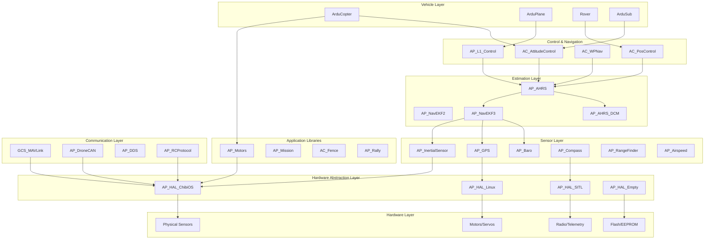
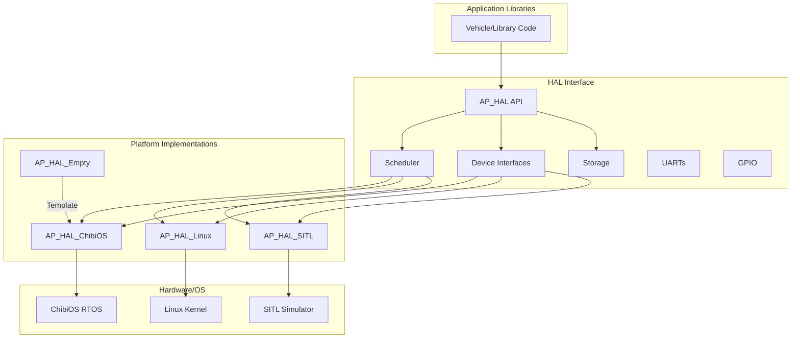
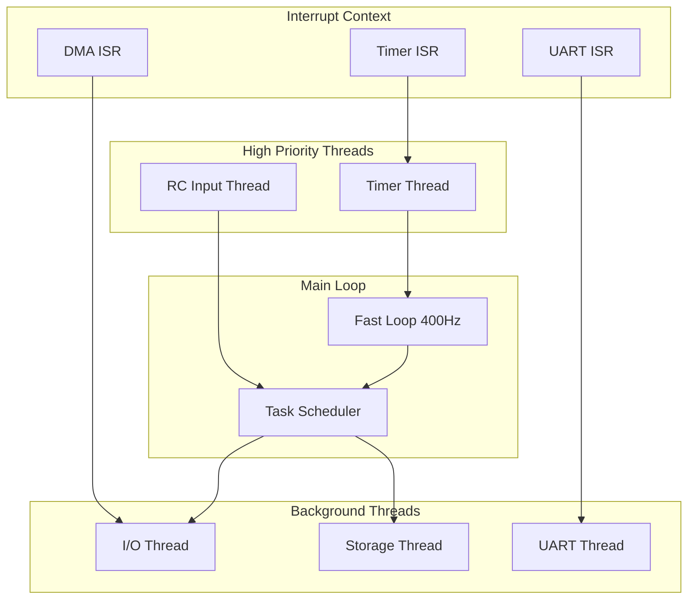
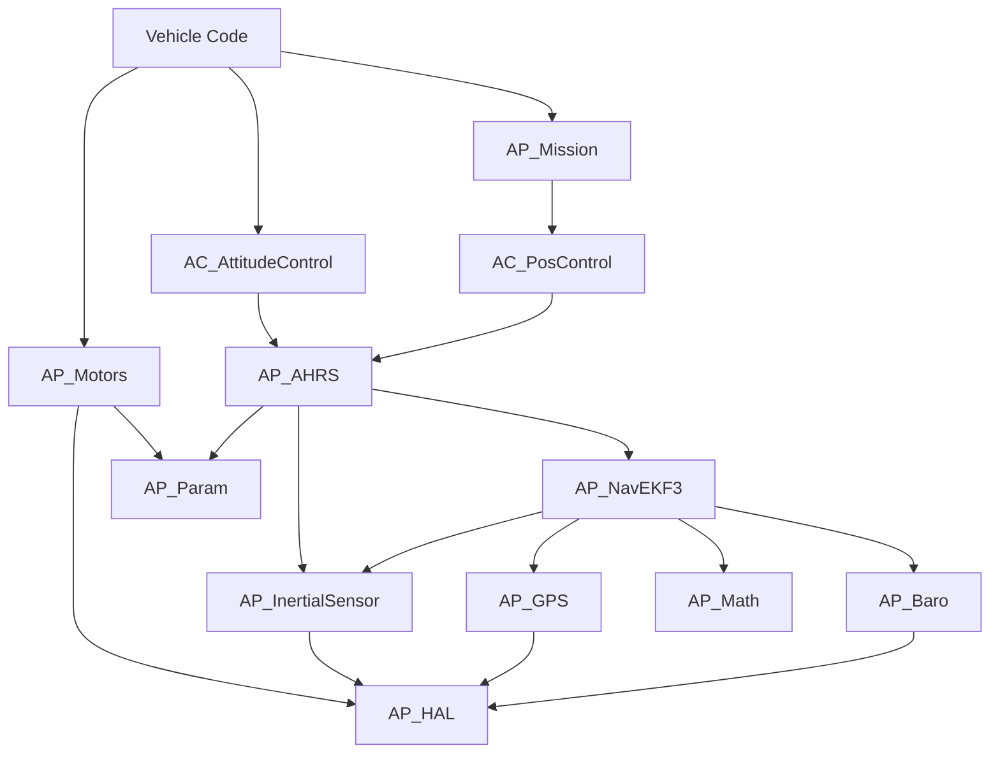

# ArduPilot Libraries


## Table of Contents

- [Overview](#overview)
- [Architecture and Design Philosophy](#architecture-and-design-philosophy)
- [Common Design Patterns](#common-design-patterns)
- [HAL Integration and Device Management](#hal-integration-and-device-management)
- [Library Categories and Organization](#library-categories-and-organization)
- [Parameter System Integration](#parameter-system-integration)
- [Logging System Integration](#logging-system-integration)
- [Threading and Concurrency Patterns](#threading-and-concurrency-patterns)
- [Memory Management Guidelines](#memory-management-guidelines)
- [Build System Integration](#build-system-integration)
- [Library Development Guidelines](#library-development-guidelines)
- [Testing Patterns and Examples](#testing-patterns-and-examples)
- [Navigation Guide to Key Libraries](#navigation-guide-to-key-libraries)
- [Cross-Library Dependencies](#cross-library-dependencies)
- [Contributing to Libraries](#contributing-to-libraries)

## Overview

The ArduPilot libraries form the modular foundation of the autopilot system, providing reusable components for hardware abstraction, sensor integration, navigation, control algorithms, and communication protocols. This collection of over 120 specialized libraries enables code reuse across multiple vehicle types (multicopter, fixed-wing, rover, submarine, antenna tracker, and blimp) while maintaining safety-critical reliability standards.

**Key Characteristics:**
- **Modular Architecture**: Each library encapsulates specific functionality with well-defined interfaces
- **Vehicle Independence**: Core libraries are vehicle-agnostic, enabling cross-platform reuse
- **Hardware Abstraction**: HAL (Hardware Abstraction Layer) decouples platform-specific code
- **Safety-Critical Design**: Comprehensive error handling, failsafe mechanisms, and validation
- **Real-Time Performance**: Optimized for deterministic execution in embedded environments
- **Extensibility**: Plugin architecture for sensors, backends, and communication protocols

**Source Locations:**
- Core libraries: `/libraries/AP_*/` and `/libraries/AC_*/` (autopilot and attitude control)
- Hardware abstraction: `/libraries/AP_HAL*/` (platform implementations)
- Vehicle-specific extensions: `/libraries/AR_*/` (rover-specific libraries)
- Supporting utilities: `/libraries/StorageManager/`, `/libraries/AP_Filesystem/`

## Architecture and Design Philosophy

### System Architecture

The ArduPilot library ecosystem follows a layered architecture that separates concerns and enables portability:



### Design Philosophy

**1. Separation of Concerns**
- Each library has a single, well-defined responsibility
- Clear interfaces minimize coupling between components
- Dependencies flow downward through abstraction layers

**2. Hardware Independence**
- Vehicle code operates on abstract interfaces, not hardware specifics
- HAL implementations handle platform differences
- Same vehicle code runs on ChibiOS, Linux, and SITL

**3. Fail-Safe First**
- All sensor libraries include health monitoring and fallback logic
- Communication protocols handle timeout and reconnection
- Control algorithms incorporate saturation limits and error detection

**4. Performance-Oriented**
- Static memory allocation avoids fragmentation
- Efficient algorithms suitable for real-time constraints
- Minimal dynamic allocation; DMA-safe buffer management

**5. Extensibility Through Inheritance**
- Backend pattern enables adding new hardware support
- Virtual interfaces allow algorithm replacement
- Plugin registration for automatic discovery

## Common Design Patterns

### Singleton Pattern

Most ArduPilot libraries use the singleton pattern for global system state management, accessed through the `AP::` namespace.

**Pattern Structure:**
```cpp
// Library class definition (e.g., AP_InertialSensor.h)
class AP_InertialSensor {
public:
    // Get singleton instance
    static AP_InertialSensor *get_singleton() { return _singleton; }
    
    // Regular methods
    void init(uint16_t sample_rate);
    void update();
    
private:
    static AP_InertialSensor *_singleton;
    AP_InertialSensor();  // Private constructor
};

// Access through AP namespace (defined in AP_Vehicle/AP_Vehicle.h)
namespace AP {
    AP_InertialSensor &ins();
    AP_GPS &gps();
    AP_Baro &baro();
}

// Usage in vehicle code
Vector3f accel = AP::ins().get_accel();
Location current_loc = AP::gps().location();
```

**Common Singleton Libraries:**
- `AP::ins()` - Inertial sensor management
- `AP::gps()` - GPS receiver management
- `AP::baro()` - Barometer management
- `AP::compass()` - Magnetometer management
- `AP::ahrs()` - Attitude and heading reference
- `AP::logger()` - Data logging system
- `AP::notify()` - LED and buzzer notifications

### Backend Pattern

The backend pattern enables supporting multiple hardware implementations through a common interface.

**Pattern Structure:**
```cpp
// Frontend class manages backends (e.g., AP_GPS.h)
class AP_GPS {
public:
    void init();
    void update();
    
    // Access data from primary GPS
    const Location &location() const;
    
private:
    // Array of backend instances
    AP_GPS_Backend *drivers[GPS_MAX_INSTANCES];
    
    // Backend detection and instantiation
    void detect_instance(uint8_t instance);
};

// Backend base class (e.g., AP_GPS_Backend.h)
class AP_GPS_Backend {
public:
    virtual void update() = 0;  // Pure virtual
    
protected:
    // Shared state structure
    AP_GPS::GPS_State &state;
};

// Concrete backend implementation (e.g., AP_GPS_UBLOX.h)
class AP_GPS_UBLOX : public AP_GPS_Backend {
public:
    void update() override;
    
private:
    void parse_ubx();
    uint8_t _msg_buffer[256];
};
```

**Libraries Using Backend Pattern:**
- `AP_InertialSensor` - IMU drivers (Invensense, BMI088, etc.)
- `AP_GPS` - GPS protocols (uBlox, NMEA, SBF, etc.)
- `AP_Baro` - Barometer drivers (MS5611, BMP280, etc.)
- `AP_Compass` - Magnetometer drivers (HMC5843, AK8963, etc.)
- `AP_RangeFinder` - Distance sensor drivers (LightWare, Benewake, etc.)
- `AP_Airspeed` - Airspeed sensor drivers (MS4525, DLVR, etc.)

### Parameter Management Pattern

All configurable libraries integrate with the AP_Param system for persistent parameter storage.

**Pattern Structure:**
```cpp
// Library class with parameters (e.g., AP_Motors.h)
class AP_Motors {
public:
    // Parameter group declaration
    static const struct AP_Param::GroupInfo var_info[];
    
    // Parameter variables
    AP_Int16 _spin_min;      // Minimum throttle
    AP_Int16 _spin_max;      // Maximum throttle
    AP_Float _thrust_expo;   // Thrust curve exponent
    AP_Int8  _pwm_type;      // Output type
    
private:
    // Use parameters in code
    uint16_t get_spin_min() const { return _spin_min.get(); }
};

// Parameter table definition (e.g., AP_Motors.cpp)
const AP_Param::GroupInfo AP_Motors::var_info[] = {
    // @Param: SPIN_MIN
    // @DisplayName: Motor Spin Minimum
    // @Description: Throttle output when armed (0-1000)
    // @Range: 0 1000
    // @Units: PWM
    // @User: Advanced
    AP_GROUPINFO("SPIN_MIN", 1, AP_Motors, _spin_min, 100),
    
    // @Param: SPIN_MAX
    // @DisplayName: Motor Spin Maximum
    // @Description: Throttle output at full throttle (1000-2000)
    // @Range: 1000 2000
    // @Units: PWM
    // @User: Advanced
    AP_GROUPINFO("SPIN_MAX", 2, AP_Motors, _spin_max, 1900),
    
    AP_GROUPEND
};
```

**Parameter Best Practices:**
- Use descriptive parameter names (PREFIX_FUNCTION_QUALIFIER)
- Include units, ranges, and user-level in metadata
- Document parameter dependencies and interactions
- Provide sensible default values
- Group related parameters with common prefix

### State Machine Pattern

Complex behaviors use explicit state machines for clarity and testability.

**Pattern Structure:**
```cpp
// State enumeration (e.g., AP_Landing.h)
enum class LandingState : uint8_t {
    IDLE,
    FLY_TO_LANDING,
    DESCENDING,
    FINAL_APPROACH,
    TOUCHDOWN,
    COMPLETE
};

// State machine class
class AP_Landing {
public:
    void update();
    
    // State query methods
    bool is_landed() const { return _state == LandingState::COMPLETE; }
    LandingState get_state() const { return _state; }
    
private:
    LandingState _state;
    uint32_t _state_enter_ms;  // Time of state entry
    
    // State transition handlers
    void transition_to(LandingState new_state);
    void handle_idle();
    void handle_descending();
    void handle_touchdown();
};

// State machine implementation
void AP_Landing::update() {
    switch (_state) {
    case LandingState::IDLE:
        handle_idle();
        break;
    case LandingState::DESCENDING:
        handle_descending();
        break;
    case LandingState::TOUCHDOWN:
        handle_touchdown();
        break;
    // ... other states
    }
}
```

**Libraries Using State Machines:**
- Flight mode implementations (`mode_*.cpp`)
- Landing controllers (`AP_Landing`)
- Takeoff sequences (`AP_Takeoff`)
- Arming checks (`AP_Arming`)
- Mission execution (`AP_Mission`)

### Observer Pattern

Libraries publish events and state changes that other components can subscribe to.

**Pattern Structure:**
```cpp
// Event notification (e.g., AP_Notify.h)
class AP_Notify {
public:
    // State flags that backends observe
    struct notify_flags_and_values_type {
        bool armed;
        bool pre_arm_check;
        bool failsafe_battery;
        bool gps_glitching;
        // ... more flags
    } flags;
    
    // Backends observe and react to flag changes
    void update();
};

// Backend observes state (e.g., NotifyDevice.h)
class NotifyDevice {
public:
    virtual void update() = 0;  // Called to check state changes
    
protected:
    const AP_Notify::notify_flags_and_values_type &_flags;
};

// Concrete backend (e.g., ToshibaLED_I2C.cpp)
void ToshibaLED_I2C::update() {
    if (_flags.armed) {
        set_rgb(0, 255, 0);  // Green when armed
    } else if (_flags.failsafe_battery) {
        set_rgb(255, 0, 0);  // Red on failsafe
    }
}
```

## HAL Integration and Device Management

### Hardware Abstraction Layer Overview

The HAL (Hardware Abstraction Layer) provides a uniform interface across different hardware platforms, enabling the same vehicle code to run on ARM Cortex-M microcontrollers, Linux systems, and simulation environments.

**HAL Architecture:**



### Device Interface Pattern

The HAL provides a unified device interface for I2C, SPI, and UART communication.

**Device Access Example:**
```cpp
// Getting a device handle (in sensor driver init)
AP_HAL::OwnPtr<AP_HAL::Device> dev = hal.spi->get_device("bmi088_g");

// Configuring the device
dev->set_speed(AP_HAL::Device::SPEED_HIGH);
dev->register_periodic_callback(1000, FUNCTOR_BIND_MEMBER(&AP_InertialSensor_BMI088::timer, void));

// Reading from device
bool AP_InertialSensor_BMI088::timer() {
    uint8_t buffer[7];
    if (!dev->read_registers(REG_GYRO_DATA, buffer, sizeof(buffer))) {
        return false;
    }
    
    // Process data
    int16_t gx = (buffer[1] << 8) | buffer[0];
    int16_t gy = (buffer[3] << 8) | buffer[2];
    int16_t gz = (buffer[5] << 8) | buffer[4];
    
    // Convert to physical units and publish
    Vector3f gyro(gx * GYRO_SCALE, gy * GYRO_SCALE, gz * GYRO_SCALE);
    _publish_gyro(gyro);
    
    return true;
}
```

**Device Interface Methods:**
- `get_device(name)` - Obtain device handle by name (from hwdef)
- `set_speed(speed)` - Configure bus speed
- `read_registers(reg, buffer, len)` - Read register block
- `write_register(reg, value)` - Write single register
- `transfer(send, send_len, recv, recv_len)` - Full duplex transfer
- `register_periodic_callback(period_us, callback)` - Schedule periodic reads

### HAL Scheduler and Threading

The HAL scheduler manages task execution with different priorities and timing requirements.

**Scheduler Priority Levels:**
```cpp
// Task priority classes (AP_HAL_ChibiOS)
enum class SchedulerPriority : uint8_t {
    TIMER,           // Highest priority, runs in timer thread
    RCIN,            // RC input processing
    MAIN,            // Main flight control loop
    IO,              // I/O operations
    STORAGE,         // Flash/EEPROM operations
    UART,            // Serial communication
    TIMER_SLOW,      // Low-priority periodic tasks
};

// Registering a task (in vehicle scheduler_tasks table)
{
    .function = FUNCTOR_BIND_MEMBER(&Copter::update_flight_mode, void),
    .rate_hz = 400,
    .max_time_micros = 400,
    .priority = SchedulerPriority::MAIN
}
```

**Thread Safety Primitives:**
```cpp
// Semaphore protection for shared resources
class AP_InertialSensor {
private:
    HAL_Semaphore _sem;  // Protects sensor data
    
public:
    bool get_accel(Vector3f &accel) {
        WITH_SEMAPHORE(_sem);  // Automatically acquires and releases
        accel = _accel[_primary_accel];
        return true;
    }
};

// Critical sections for interrupt protection
void disable_interrupts_example() {
    void *irq_state = hal.scheduler->disable_interrupts_save();
    // Critical section - interrupts disabled
    modify_shared_hardware_register();
    hal.scheduler->restore_interrupts(irq_state);
}
```

### Platform-Specific HAL Implementations

**AP_HAL_ChibiOS** (most common for flight controllers):
- Real-time OS with deterministic scheduling
- Direct hardware access for optimal performance
- DMA-based I/O for efficiency
- Source: `/libraries/AP_HAL_ChibiOS/`

**AP_HAL_Linux** (for Linux-based autopilots):
- Uses Linux kernel drivers
- Thread-based scheduling
- Supports Raspberry Pi, BeagleBone, etc.
- Source: `/libraries/AP_HAL_Linux/`

**AP_HAL_SITL** (Software In The Loop simulation):
- Physics simulation integration
- Sensor simulation with noise
- Runs on development workstation
- Source: `/libraries/AP_HAL_SITL/`

**AP_HAL_Empty** (template for new ports):
- Minimal implementation skeleton
- Reference for porting to new platforms
- Source: `/libraries/AP_HAL_Empty/`

### Hardware Definition Files

Board-specific configuration is defined in hwdef files for ChibiOS platforms.

**hwdef File Structure** (example: `/libraries/AP_HAL_ChibiOS/hwdef/Pixhawk4/hwdef.dat`):
```
# MCU configuration
MCU STM32F765xx STM32F7xx
FLASH_SIZE_KB 2048
RAM_SIZE_KB 512

# Clock configuration
OSCILLATOR_HZ 16000000
STM32_PLLM_VALUE 8
STM32_PLLN_VALUE 432

# Serial ports
SERIAL_ORDER OTG1 USART2 USART3 UART4 UART8 USART1

# SPI devices
SPIDEV icm20689  SPI1 DEVID1  MPU_CS   MODE3  2*MHZ  8*MHZ
SPIDEV icm20602  SPI1 DEVID2  GYRO_EXT_CS MODE3  2*MHZ  8*MHZ
SPIDEV ms5611    SPI4 DEVID3  BARO_CS  MODE3  20*MHZ 20*MHZ

# I2C buses
I2C_ORDER I2C1 I2C2 I2C3 I2C4
```

**hwdef Capabilities:**
- MCU and memory configuration
- Pin assignments and GPIO configuration
- SPI/I2C device declarations
- Serial port mapping
- DMA channel allocation
- Feature enable/disable flags

## Library Categories and Organization

### Sensor Libraries

**Inertial Sensors** (`AP_InertialSensor`):
- IMU management and sensor fusion
- Backend drivers: Invensense (MPU6000, MPU9250, ICM20xxx), Bosch (BMI088, BMI270)
- Accelerometer and gyroscope calibration
- Vibration detection and harmonic notch filtering
- Source: `/libraries/AP_InertialSensor/`

**GPS Receivers** (`AP_GPS`):
- Multi-GPS blending and fallback
- Protocol support: uBlox, NMEA, SBF, GSOF, MAV, NOVA, SBP, SIRF, ERB
- RTK (Real-Time Kinematic) integration
- GPS jamming detection
- Source: `/libraries/AP_GPS/`

**Barometers** (`AP_Baro`):
- Altitude estimation from pressure
- Backend drivers: MS5611, MS5607, BMP280, BMP388, LPS2XH, SPL06
- Temperature compensation
- Multi-baro averaging
- Source: `/libraries/AP_Baro/`

**Magnetometers** (`AP_Compass`):
- Heading determination
- Backend drivers: HMC5843, AK8963, AK09916, IST8310, LIS3MDL, MMC3416
- Calibration and declination handling
- Interference detection
- Source: `/libraries/AP_Compass/`

**Range Finders** (`AP_RangeFinder`):
- Distance measurement for terrain following
- Backend drivers: LightWare, Benewake, MaxBotix, HC-SR04, TeraRanger, LeddarOne
- Multiple sensor support
- Obstacle detection integration
- Source: `/libraries/AP_RangeFinder/`

**Airspeed Sensors** (`AP_Airspeed`):
- True airspeed measurement for fixed-wing
- Backend drivers: MS4525, DLVR, SDP3X, NMEA, ASP5033
- Synthetic airspeed estimation
- Calibration and offset handling
- Source: `/libraries/AP_Airspeed/`

**Optical Flow** (`AP_OpticalFlow`):
- Vision-based velocity estimation
- Backend drivers: PX4Flow, Cheerson CX-OF, CXOF, UPFLOW, MAVLink
- Integration with terrain database
- Source: `/libraries/AP_OpticalFlow/`

### Navigation and Estimation Libraries

**AHRS** (`AP_AHRS`):
- Attitude and Heading Reference System
- Integration with EKF2, EKF3, and DCM algorithms
- Primary interface for attitude queries
- Coordinate frame transformations
- Source: `/libraries/AP_AHRS/`

**Extended Kalman Filters** (`AP_NavEKF2`, `AP_NavEKF3`):
- Sensor fusion for position and velocity estimation
- EKF2: Mature, well-tested algorithm
- EKF3: Advanced features, improved GPS glitch handling
- State vector: position, velocity, attitude, gyro bias, accel bias, wind
- Source: `/libraries/AP_NavEKF2/`, `/libraries/AP_NavEKF3/`

**DCM Fallback** (`AP_AHRS_DCM`):
- Direction Cosine Matrix attitude estimation
- Fallback when EKF unavailable
- GPS-denied operation support
- Source: `/libraries/AP_AHRS/AP_AHRS_DCM.cpp`

**Beacon** (`AP_Beacon`):
- Non-GPS positioning using beacon systems
- Marvelmind, Pozyx, SITL beacon support
- Integration with EKF for position estimation
- Source: `/libraries/AP_Beacon/`

### Control Libraries

**Attitude Control** (`AC_AttitudeControl`):
- Attitude rate and angle controllers
- Vehicle-specific implementations (multicopter, helicopter, fixed-wing)
- PID control with feed-forward
- Input shaping and filtering
- Source: `/libraries/AC_AttitudeControl/`

**Position Control** (`AC_PosControl`):
- 3D position controller for multirotors
- Velocity and acceleration limiting
- Loiter, brake, and position hold modes
- Source: `/libraries/AC_PosControl/`

**Waypoint Navigation** (`AC_WPNav`):
- Waypoint-to-waypoint navigation for multirotors
- Spline path generation
- Speed and acceleration profiles
- Source: `/libraries/AC_WPNav/`

**L1 Controller** (`AP_L1_Control`):
- Lateral navigation for fixed-wing aircraft
- Nonlinear guidance law
- Wind compensation
- Source: `/libraries/AP_L1_Control/`

**TECS** (`AP_TECS`):
- Total Energy Control System for fixed-wing
- Altitude and airspeed control
- Energy management during maneuvers
- Source: `/libraries/AP_TECS/`

**PID Controllers** (`AC_PID`, `AP_PIDInfo`):
- Proportional-Integral-Derivative controllers
- Feed-forward, IMAX limiting
- Derivative filtering
- Source: `/libraries/AC_PID/`, `/libraries/AP_PIDInfo/`

### Motor and Actuator Libraries

**Motors** (`AP_Motors`):
- Motor mixing and output for multirotors
- Frame types: quad, hex, octa, Y6, tri, single, coax
- Motor test and ordering
- Thrust linearization
- Source: `/libraries/AP_Motors/`

**Servo Output** (`SRV_Channel`):
- Servo and motor output management
- Function assignment (throttle, aileron, elevator, etc.)
- Trim, min/max, reverse settings
- Output groups and masks
- Source: `/libraries/SRV_Channel/`

**BLHeli** (`AP_BLHeli`):
- BLHeli ESC configuration interface
- Pass-through protocol support
- Firmware update capability
- Source: `/libraries/AP_BLHeli/`

**DShot** (`AP_HAL_ChibiOS/RCOutput`):
- DShot digital ESC protocol
- Telemetry support
- Bidirectional communication
- Source: `/libraries/AP_HAL_ChibiOS/RCOutput.cpp`

### Communication Libraries

**MAVLink** (`GCS_MAVLink`):
- Primary ground station protocol
- Message handling and routing
- Telemetry streaming
- Mission, parameter, and fence protocols
- Source: `/libraries/GCS_MAVLink/`

**DroneCAN** (`AP_DroneCAN`):
- CAN bus communication protocol
- Node discovery and configuration
- ESC, GPS, compass, airspeed integration
- Firmware update over CAN
- Source: `/libraries/AP_DroneCAN/`

**DDS** (`AP_DDS`):
- Data Distribution Service integration
- ROS 2 compatibility
- Topic-based publish/subscribe
- Source: `/libraries/AP_DDS/`

**RC Input** (`AP_RCProtocol`):
- Radio control receiver protocols
- PPM, SBUS, DSM, SRXL, CRSF, GHST support
- Failsafe and signal quality monitoring
- Source: `/libraries/AP_RCProtocol/`

### Mission and Geofence Libraries

**Mission** (`AP_Mission`):
- Mission command storage and execution
- MAVLink mission protocol
- Jump, conditional, and looping commands
- Rally point integration
- Source: `/libraries/AP_Mission/`

**Fence** (`AC_Fence`):
- Geofence boundary enforcement
- Altitude, circular, and polygon fences
- Breach actions (RTL, Land, etc.)
- Floor fence for indoor operation
- Source: `/libraries/AC_Fence/`

**Rally** (`AP_Rally`):
- Rally point (alternate home) management
- Closest rally point selection
- Integration with RTL behavior
- Source: `/libraries/AP_Rally/`

### Data Management Libraries

**Parameters** (`AP_Param`):
- Persistent parameter storage
- Flash-based key-value store
- Parameter groups and inheritance
- MAVLink parameter protocol
- Source: `/libraries/AP_Param/`

**Logging** (`AP_Logger`):
- High-speed data logging
- Block-based logger (AP_Logger_Block)
- File-based logger (AP_Logger_File)
- MAVLink log download
- Source: `/libraries/AP_Logger/`

**File System** (`AP_Filesystem`):
- Unified file system interface
- FATFS integration for SD cards
- ROMFS for embedded resources
- Source: `/libraries/AP_Filesystem/`

**Storage Manager** (`StorageManager`):
- Non-volatile storage allocation
- FRAM, Flash, and EEPROM support
- Wear leveling
- Source: `/libraries/StorageManager/`

### Utility and Support Libraries

**Math** (`AP_Math`):
- Vector, matrix, quaternion operations
- Coordinate transformations
- Filtering (low-pass, notch, complementary)
- Polynomial and curve fitting
- Source: `/libraries/AP_Math/`

**Common** (`AP_Common`):
- Location class (latitude/longitude/altitude)
- Bitmask utilities
- Expansion and scaling functions
- Source: `/libraries/AP_Common/`

**BoardConfig** (`AP_BoardConfig`):
- Board-specific configuration
- Sensor orientation
- Safety button configuration
- Power management
- Source: `/libraries/AP_BoardConfig/`

**Notify** (`AP_Notify`):
- LED and buzzer notification system
- RGB LED, NeoPixel, ProfiLED support
- Tone generation for buzzers
- State indication (armed, failsafe, etc.)
- Source: `/libraries/AP_Notify/`

## Parameter System Integration

The AP_Param system provides persistent storage and access to configuration parameters across all libraries.

### Parameter Declaration

**Step 1: Declare parameter variables in class header:**
```cpp
// In library header (e.g., AP_Motors.h)
class AP_Motors {
public:
    // Parameter table declaration
    static const struct AP_Param::GroupInfo var_info[];
    
protected:
    // Parameter variables
    AP_Int16 _spin_min;          // MOT_SPIN_MIN
    AP_Int16 _spin_max;          // MOT_SPIN_MAX
    AP_Float _thrust_expo;       // MOT_THST_EXPO
    AP_Int8  _pwm_type;          // MOT_PWM_TYPE
    AP_Int16 _pwm_freq;          // MOT_PWM_FREQ
};
```

**Step 2: Define parameter table in implementation:**
```cpp
// In library implementation (e.g., AP_Motors.cpp)
const AP_Param::GroupInfo AP_Motors::var_info[] = {
    // @Param: SPIN_MIN
    // @DisplayName: Motor Spin Minimum
    // @Description: Point at which motors start to provide upward thrust
    // @Range: 0 0.3
    // @Units: %
    // @User: Advanced
    AP_GROUPINFO("SPIN_MIN", 1, AP_Motors, _spin_min, 0.15f),
    
    // @Param: SPIN_MAX
    // @DisplayName: Motor Spin Maximum
    // @Description: Point at which thrust saturates
    // @Range: 0.9 1.0
    // @Units: %
    // @User: Advanced
    AP_GROUPINFO("SPIN_MAX", 2, AP_Motors, _spin_max, 0.95f),
    
    // @Param: THST_EXPO
    // @DisplayName: Thrust Curve Exponent
    // @Description: Thrust curve exponent (0.0 for linear to 1.0 for second order curve)
    // @Range: -0.5 1.0
    // @User: Advanced
    AP_GROUPINFO("THST_EXPO", 3, AP_Motors, _thrust_expo, 0.65f),
    
    // Nested groups for complex structures
    // @Group: 1_
    // @Path: AP_MotorsMatrix.cpp
    AP_SUBGROUPINFO(_motors_matrix, "1", 4, AP_Motors, AP_MotorsMatrix),
    
    AP_GROUPEND
};
```

### Parameter Types

| Type | Description | Range | Use Case |
|------|-------------|-------|----------|
| `AP_Int8` | 8-bit signed integer | -128 to 127 | Enumerations, small counts |
| `AP_Int16` | 16-bit signed integer | -32768 to 32767 | Medium range values |
| `AP_Int32` | 32-bit signed integer | ±2.1 billion | Large counts, timestamps |
| `AP_Float` | 32-bit float | ±3.4e38 | Physical measurements, gains |
| `AP_Vector3f` | 3D float vector | - | Offsets, positions |

### Parameter Metadata Tags

Essential tags for ground station display and documentation:
- `@Param:` - Parameter suffix (prefix comes from library)
- `@DisplayName:` - Human-readable name
- `@Description:` - Detailed explanation
- `@Range:` - Minimum and maximum values
- `@Units:` - Physical units (m, m/s, deg, %, Hz, etc.)
- `@Values:` - Enumeration definitions (0:Option1,1:Option2)
- `@User:` - User level (Standard, Advanced, Developer)
- `@RebootRequired:` - True if parameter change requires reboot
- `@Bitmask:` - Bit field descriptions (0:Bit0,1:Bit1)

### Accessing Parameters

**In library code:**
```cpp
// Reading parameter value
float spin_min = _spin_min.get();

// Setting parameter value
_spin_min.set(0.20f);

// Checking if parameter was modified
if (_spin_min.configured()) {
    // User has set this parameter
}

// Saving to persistent storage (automatic via ground station)
// Manual save in rare cases:
_spin_min.save();
```

**From vehicle code:**
```cpp
// Access via library instance
float throttle_min = motors->get_throttle_min();

// Direct parameter lookup by name
AP_Param::get_param_by_index(idx, key, param, type);
```

### Parameter Groups and Inheritance

**Nested parameter groups:**
```cpp
// Parent library has parameter group
class AP_Motors {
    static const struct AP_Param::GroupInfo var_info[];
    AP_MotorsMatrix _matrix;  // Nested group
};

// Nested group definition
const AP_Param::GroupInfo AP_Motors::var_info[] = {
    // @Group: MATRIX_
    // @Path: ../libraries/AP_MotorsMatrix/AP_MotorsMatrix.cpp
    AP_SUBGROUPINFO(_matrix, "MATRIX", 5, AP_Motors, AP_MotorsMatrix),
    AP_GROUPEND
};

// Results in parameters like: MOT_MATRIX_ROLL_FAC, MOT_MATRIX_PITCH_FAC
```

### Parameter Best Practices

1. **Naming Conventions**:
   - Use descriptive prefixes matching library name
   - Keep parameter names under 16 characters
   - Use underscores to separate words
   - Example: `BATT_CAPACITY`, `EK3_ALT_SOURCE`

2. **Documentation Standards**:
   - Always include @DisplayName, @Description, @Units, @Range
   - Provide meaningful default values
   - Document parameter interactions in @Description
   - Specify @RebootRequired when necessary

3. **Validation**:
   ```cpp
   // Validate parameter ranges in init()
   void AP_Motors::init() {
       // Clamp to valid range
       _spin_min.set(constrain_float(_spin_min, 0.0f, 0.3f));
       
       // Check interdependencies
       if (_spin_max <= _spin_min) {
           _spin_max.set(_spin_min + 0.1f);
       }
   }
   ```

4. **Performance Considerations**:
   - Cache frequently accessed parameters in local variables
   - Don't call `get()` in tight loops
   - Use member variables for values needed every update cycle

## Logging System Integration

The AP_Logger system provides high-speed data logging for post-flight analysis and debugging.

### Log Message Definition

**Step 1: Define log message structure:**
```cpp
// In library header or implementation
struct PACKED log_MyLibrary {
    LOG_PACKET_HEADER;
    uint64_t time_us;
    float value1;
    float value2;
    int32_t value3;
    uint8_t flags;
};
```

**Step 2: Register message format:**
```cpp
// In library init or vehicle setup_log_structures()
void MyLibrary::init_logging() {
    AP::logger().Write_MessageF("MyLib initialized");
}

// Format definition (usually in vehicle code)
const struct LogStructure log_structures[] = {
    // Other messages...
    { LOG_MYLIB_MSG, sizeof(log_MyLibrary),
      "MYLIB", "QffffB", "TimeUS,Val1,Val2,Val3,Flags",
      "s####-", "F0000-" },
};

// Format string components:
// "QffffB" = data types (Q=uint64, f=float, B=uint8)
// "TimeUS,Val1,..." = field names
// "s####-" = units (s=seconds, #=unitless, -=none)
// "F0000-" = multipliers (F=timestamp, 0=linear)
```

**Step 3: Write log messages:**
```cpp
void MyLibrary::update() {
    // Process data...
    
    // Write to log
    struct log_MyLibrary pkt = {
        LOG_PACKET_HEADER_INIT(LOG_MYLIB_MSG),
        time_us        : AP_HAL::micros64(),
        value1         : measured_value1,
        value2         : measured_value2,
        value3         : counter,
        flags          : status_flags
    };
    AP::logger().WriteBlock(&pkt, sizeof(pkt));
}
```

### Log Message Types

**Format Specifiers:**
| Code | Type | Size | Description |
|------|------|------|-------------|
| `b` | int8_t | 1 | Signed byte |
| `B` | uint8_t | 1 | Unsigned byte |
| `h` | int16_t | 2 | Signed short |
| `H` | uint16_t | 2 | Unsigned short |
| `i` | int32_t | 4 | Signed integer |
| `I` | uint32_t | 4 | Unsigned integer |
| `f` | float | 4 | 32-bit float |
| `d` | double | 8 | 64-bit double |
| `n` | char[4] | 4 | 4-character string |
| `N` | char[16] | 16 | 16-character string |
| `Z` | char[64] | 64 | 64-character string |
| `q` | int64_t | 8 | Signed 64-bit |
| `Q` | uint64_t | 8 | Unsigned 64-bit (timestamp) |
| `L` | int32_t | 4 | Latitude/Longitude (deg * 1e7) |
| `M` | uint8_t | 1 | Flight mode |

**Unit Specifiers:**
| Code | Unit | Description |
|------|------|-------------|
| `s` | seconds | Time |
| `d` | degrees | Angle |
| `D` | degrees | Latitude/Longitude |
| `m` | meters | Distance |
| `M` | meters/second | Velocity |
| `%` | percent | Percentage |
| `A` | amperes | Current |
| `V` | volts | Voltage |
| `T` | degrees Celsius | Temperature |
| `h` | hours | Long duration |
| `#` | none | Dimensionless |
| `-` | none | Not applicable |

### Writing Text Messages

**For human-readable events:**
```cpp
// Simple text message
AP::logger().Write_Message("Landing gear extended");

// Formatted text message
AP::logger().Write_MessageF("GPS %d acquired: %d sats", instance, num_sats);

// Error message
AP::logger().Write_Error(LogErrorSubsystem::GPS, LogErrorCode::GPS_GLITCH);

// Event message
AP::logger().Write_Event(LogEvent::FENCE_BREACH);
```

### Conditional Logging

**Enable/disable logging by category:**
```cpp
// Check if logging is enabled for category
if (AP::logger().should_log(MASK_LOG_IMU)) {
    // Write IMU log message
    write_imu_log();
}

// Common log masks (from AP_Logger.h)
// MASK_LOG_ATTITUDE_FAST - Attitude at full rate
// MASK_LOG_ATTITUDE_MED  - Attitude at medium rate
// MASK_LOG_GPS           - GPS data
// MASK_LOG_IMU           - IMU data
// MASK_LOG_CTUN          - Controller tuning
// MASK_LOG_NTUN          - Navigation tuning
// MASK_LOG_RCIN          - RC input
// MASK_LOG_RCOUT         - Servo/motor output
```

### Replay Support

**For offline log analysis with Replay tool:**
```cpp
// Mark messages for replay
void MyLibrary::update() {
    // Normal logging
    write_log();
    
    #if AP_REPLAY_ENABLED
    // Additional data needed for replay
    write_replay_data();
    #endif
}

// Replay can reconstruct vehicle state by replaying sensor messages
// Useful for testing EKF changes against real flight data
```

### Logging Best Practices

1. **Performance**:
   - Log at appropriate rates (don't log 400Hz if 10Hz sufficient)
   - Use should_log() checks to avoid unnecessary computation
   - Keep log message size reasonable (<256 bytes)

2. **Consistency**:
   - Always include TimeUS as first field (uint64_t microseconds)
   - Use packed structures to match log format exactly
   - Maintain log format compatibility across versions

3. **Debugging**:
   ```cpp
   // Add temporary debug logging
   #if DEBUG_MYLIB
   AP::logger().Write_MessageF("Debug: value=%f", debug_value);
   #endif
   ```

4. **Analysis**:
   - Log both raw sensor data and processed results
   - Include state flags and error codes
   - Log configuration changes and mode transitions

## Threading and Concurrency Patterns

ArduPilot uses a priority-based scheduler with thread-safe primitives for managing concurrent access to shared resources.

### Scheduler Architecture



### Thread Safety with Semaphores

**HAL_Semaphore usage:**
```cpp
class AP_Sensor {
private:
    HAL_Semaphore _sem;  // Protects all member variables
    Vector3f _data;
    uint32_t _last_update_ms;
    
public:
    // Automatic semaphore with RAII
    bool get_data(Vector3f &data) {
        WITH_SEMAPHORE(_sem);  // Acquires lock, releases on scope exit
        
        // Check data freshness
        if (AP_HAL::millis() - _last_update_ms > 100) {
            return false;  // Stale data
        }
        
        data = _data;
        return true;
    }  // Semaphore automatically released here
    
    // Called from different thread/interrupt
    void update_from_isr(const Vector3f &new_data) {
        WITH_SEMAPHORE(_sem);
        _data = new_data;
        _last_update_ms = AP_HAL::millis();
    }
};
```

**Nested semaphore handling:**
```cpp
// NEVER nest semaphores - causes deadlock!
// WRONG:
void bad_example() {
    WITH_SEMAPHORE(sem1);
    WITH_SEMAPHORE(sem2);  // Risk of deadlock if another thread locks sem2 first
}

// CORRECT: Use single semaphore or careful ordering
void good_example() {
    WITH_SEMAPHORE(_sem);
    // All shared data access here
}
```

### Lock-Free Patterns

**Atomic operations for simple cases:**
```cpp
#include <AP_HAL/utility/atomic.h>

class FastCounter {
private:
    volatile uint32_t _count;  // Volatile for visibility
    
public:
    // Atomic increment (interrupt-safe)
    void increment() {
        ATOMIC_BLOCK(ATOMIC_RESTORESTATE) {
            _count++;
        }
    }
    
    // Atomic read
    uint32_t get_count() {
        uint32_t count;
        ATOMIC_BLOCK(ATOMIC_RESTORESTATE) {
            count = _count;
        }
        return count;
    }
};
```

**Ring buffer for producer-consumer:**
```cpp
// Thread-safe ring buffer (from AP_HAL)
class RingBuffer {
private:
    volatile uint16_t _head;
    volatile uint16_t _tail;
    uint8_t *_buf;
    uint16_t _size;
    
public:
    // Producer (e.g., UART ISR)
    bool write(const uint8_t *data, uint16_t len) {
        if (space() < len) return false;
        
        for (uint16_t i = 0; i < len; i++) {
            _buf[_head] = data[i];
            _head = (_head + 1) % _size;  // Atomic on 32-bit
        }
        return true;
    }
    
    // Consumer (e.g., main thread)
    uint16_t read(uint8_t *data, uint16_t len) {
        uint16_t available = available_bytes();
        len = MIN(len, available);
        
        for (uint16_t i = 0; i < len; i++) {
            data[i] = _buf[_tail];
            _tail = (_tail + 1) % _size;
        }
        return len;
    }
};
```

### Scheduler Task Registration

**Defining scheduled tasks:**
```cpp
// In vehicle scheduler_tasks table (e.g., ArduCopter/Copter.cpp)
const AP_Scheduler::Task Copter::scheduler_tasks[] = {
    // Function                              Rate(Hz)  MaxTime(us)  Priority
    SCHED_TASK(read_radio,                   400,      100,         MAIN),
    SCHED_TASK(update_flight_mode,           400,      400,         MAIN),
    SCHED_TASK(update_throttle_hover,        100,      90,          MAIN),
    SCHED_TASK_CLASS(AP_GPS, &copter.gps,    update,  50, 200,     IO),
    SCHED_TASK_CLASS(AP_Baro, &copter.baro,  update,  50, 150,     IO),
    SCHED_TASK(update_altitude,              10,       200,         MAIN),
    SCHED_TASK(update_terrain,               10,       100,         IO),
};

// Task execution rules:
// - Tasks run at specified rate (Hz)
// - If task exceeds MaxTime, warning logged
// - Priority determines thread affinity
// - Higher priority tasks preempt lower priority
```

### Interrupt Safety

**Critical sections:**
```cpp
// Disable interrupts for hardware register access
void configure_hardware() {
    void *irq_state = hal.scheduler->disable_interrupts_save();
    
    // Access hardware registers
    WRITE_REG(HARDWARE_REG, value);
    
    hal.scheduler->restore_interrupts(irq_state);
}

// Use sparingly - long critical sections affect real-time performance
```

**Interrupt-safe data structures:**
```cpp
// Data structure accessed from ISR and main thread
class ISRSafeData {
private:
    // Use volatile for ISR-visible variables
    volatile uint32_t _timestamp;
    volatile uint16_t _counter;
    
public:
    // ISR handler
    void IRAM_ATTR timer_isr() {
        _timestamp = micros();
        _counter++;
        // Keep ISR short - no heavy computation
    }
    
    // Main thread access
    void check_status() {
        // Read volatile variables (compiler won't optimize away)
        uint32_t ts = _timestamp;
        uint16_t count = _counter;
        
        // Process data...
    }
};
```

### Threading Best Practices

1. **Minimize Shared State**:
   - Keep thread-local data when possible
   - Use message passing instead of shared memory
   - Immutable data doesn't need locks

2. **Lock Hierarchy**:
   - Always acquire locks in the same order
   - Document lock ordering requirements
   - Use lock guards (WITH_SEMAPHORE) to prevent leaks

3. **Interrupt Handlers**:
   - Keep ISRs short and fast
   - Defer processing to thread context
   - Use lock-free structures for ISR communication

4. **Performance**:
   - Measure task execution time with `PERF_COUNT`
   - Monitor scheduler statistics
   - Profile with timing logs

## Memory Management Guidelines

ArduPilot uses primarily static allocation for deterministic real-time performance and memory safety.

### Static vs Dynamic Allocation

**Preferred: Static allocation**
```cpp
// Good: Compile-time allocation
class MySensor {
private:
    uint8_t _buffer[256];           // Fixed-size buffer
    AP_HAL::OwnPtr<AP_HAL::Device> _dev;  // Smart pointer (single allocation)
    
public:
    void init() {
        _dev = hal.spi->get_device("sensor");
        // No malloc/new needed
    }
};

// Arrays of fixed size
AP_GPS_Backend *backends[GPS_MAX_INSTANCES];  // Pointers, not objects
```

**Avoid: Dynamic allocation in flight code**
```cpp
// Bad: Heap allocation during flight
void bad_example() {
    uint8_t *buffer = new uint8_t[size];  // Avoid!
    // ...
    delete[] buffer;  // Fragmentation risk
}

// Exception: One-time initialization is acceptable
void init() {
    _large_structure = new LargeStruct();  // OK during init
    // Never deleted - lives for program lifetime
}
```

### DMA-Safe Memory

**Allocating DMA-safe buffers:**
```cpp
// ChibiOS platforms have DMA restrictions
class DMADevice {
private:
    // Allocate from DMA-safe CCM or main RAM
    uint8_t _buffer[512] __attribute__((section(".dma_buffer")));
    
    // Alternative: use HAL allocation
    AP_HAL::util->malloc_dma(size);
    
public:
    void start_dma_transfer() {
        // _buffer is DMA-safe
        dma_controller->transfer(_buffer, sizeof(_buffer));
    }
};
```

**DMA buffer requirements:**
- Must be in DMA-accessible memory region
- Some STM32 have DMA restrictions on CCM (Core-Coupled Memory)
- Check MCU documentation and hwdef configuration
- Use `malloc_dma()` or section attributes

### Memory Pool Pattern

**Pre-allocated object pools:**
```cpp
// Fixed-size pool for objects
template<typename T, uint8_t SIZE>
class ObjectPool {
private:
    T _pool[SIZE];
    uint8_t _free_list[SIZE];
    uint8_t _free_count;
    
public:
    T* allocate() {
        if (_free_count == 0) return nullptr;
        
        uint8_t idx = _free_list[--_free_count];
        return &_pool[idx];
    }
    
    void free(T *obj) {
        uint8_t idx = obj - _pool;
        if (idx < SIZE) {
            _free_list[_free_count++] = idx;
        }
    }
};

// Usage for mission items, waypoints, etc.
ObjectPool<MissionItem, MAX_MISSION_ITEMS> mission_pool;
```

### Memory Regions

**Understanding memory layout (ChibiOS/STM32):**
```
┌─────────────────────────┐ 0x00000000
│ Flash (Code/Const)      │
│ - Program code          │
│ - Constant data         │
│ - Parameter defaults    │
├─────────────────────────┤ 0x20000000
│ SRAM (Main RAM)         │
│ - Heap                  │
│ - Stack                 │
│ - DMA buffers           │
│ - Most data structures  │
├─────────────────────────┤ 0x10000000
│ CCM (Core-Coupled RAM)  │
│ - Fast access           │
│ - No DMA access         │
│ - Critical variables    │
└─────────────────────────┘
```

**Placing variables in specific regions:**
```cpp
// Fast access for critical data (F4/F7 only)
__attribute__((section(".ccm")))
static float critical_gains[16];

// Ensure DMA safety
__attribute__((section(".ram")))
static uint8_t dma_buffer[1024];

// Most variables use default placement
static Vector3f sensor_data;  // Automatically in SRAM
```

### Memory Usage Monitoring

**Compile-time checks:**
```bash
# Check memory usage after build
./waf copter --board Pixhawk4
# Output shows:
# Total Flash: 156KB / 2048KB (7.6%)
# Total RAM:   52KB / 512KB (10.2%)
```

**Runtime monitoring:**
```cpp
// Check available memory
void check_memory() {
    uint32_t free_ram = hal.util->available_memory();
    
    if (free_ram < 1024) {
        AP::logger().Write_Error(LogErrorSubsystem::MEMORY, 
                                LogErrorCode::OUT_OF_MEMORY);
    }
    
    // Log memory statistics
    AP::logger().Write_MessageF("Free RAM: %u bytes", free_ram);
}
```

### Memory Best Practices

1. **Allocation Strategy**:
   - Static allocation for all flight-critical code
   - Dynamic allocation only during initialization
   - Use object pools for variable-count resources
   - Never allocate/free in loops

2. **Buffer Sizing**:
   - Size buffers based on maximum expected load
   - Add margin for burst handling
   - Document buffer size calculations
   - Monitor buffer overruns in testing

3. **Memory Safety**:
   - Use array bounds checking
   - Validate pointer dereferences
   - Use smart pointers (AP_HAL::OwnPtr) for ownership
   - Clear buffers containing sensitive data

4. **Optimization**:
   ```cpp
   // Pack structures to save RAM
   struct PACKED SensorData {
       uint32_t timestamp;
       int16_t value1;  // Use smaller types when range allows
       int16_t value2;
       uint8_t status;
   };  // 9 bytes instead of 12
   ```

## Build System Integration

ArduPilot uses the Waf build system for cross-platform compilation with extensive customization for embedded targets.

### Basic Build Commands

```bash
# Configure for specific board
./waf configure --board Pixhawk4

# Build specific vehicle
./waf copter

# Build all vehicles
./waf

# Clean build
./waf clean

# Install to autopilot (if connected)
./waf --upload copter

# Build with debugging symbols
./waf copter --debug

# List all supported boards
./waf list_boards
```

### Library Integration in wscript

**Adding library to build (libraries/MyLibrary/wscript):**
```python
#!/usr/bin/env python
# encoding: utf-8

def build(bld):
    bld.ap_library(
        name = 'AP_MyLibrary',
        sources = [
            'AP_MyLibrary.cpp',
            'AP_MyLibrary_Backend.cpp',
            'AP_MyLibrary_Sensor1.cpp',
            'AP_MyLibrary_Sensor2.cpp',
        ],
        depends = [
            'AP_HAL',
            'AP_Math',
            'AP_Param',
        ],
    )
```

**Library dependencies:**
- Listed in `depends` parameter
- Build system resolves transitive dependencies
- Circular dependencies not allowed
- Header-only libraries don't need wscript

### Feature Flags

**Conditional compilation:**
```cpp
// In library code
#if AP_MYFEATURE_ENABLED
void MyLibrary::advanced_feature() {
    // Feature implementation
}
#endif

// Feature definition (in AP_MyLibrary_config.h)
#ifndef AP_MYFEATURE_ENABLED
#define AP_MYFEATURE_ENABLED 1
#endif

// Board-specific override (in hwdef.dat)
define AP_MYFEATURE_ENABLED 0  // Disable for this board
```

**Common feature flags:**
- `HAL_WITH_UAVCAN` - DroneCAN/UAVCAN support
- `AP_AHRS_NAVEKF_AVAILABLE` - EKF availability
- `HAL_LOGGING_ENABLED` - Data logging support
- `AP_TERRAIN_AVAILABLE` - Terrain database
- `HAL_MOUNT_ENABLED` - Camera gimbal support

### Board-Specific Configuration

**hwdef.dat directives:**
```
# Feature control
define HAL_LOGGING_ENABLED 1
define HAL_WITH_UAVCAN 1

# Memory allocation
define HAL_STORAGE_SIZE 16384

# Include common configuration
include ../fmuv5/hwdef.dat

# Override specific settings
SERIAL_ORDER OTG1 USART2 USART3

# Conditional compilation
ifdef AP_PERIPH_FW
    # Peripheral firmware specific
endif
```

### Compilation Targets

| Target | Description | Output |
|--------|-------------|--------|
| `copter` | ArduCopter multirotor | `arducopter.apj` |
| `plane` | ArduPlane fixed-wing | `arduplane.apj` |
| `rover` | Rover ground vehicle | `ardurover.apj` |
| `sub` | ArduSub underwater | `ardusub.apj` |
| `antennatracker` | Antenna tracker | `antennatracker.apj` |
| `blimp` | Blimp lighter-than-air | `blimp.apj` |
| `AP_Periph` | CAN peripheral node | `AP_Periph.bin` |

### Optimization Levels

```bash
# Size optimization (default for flight controllers)
./waf copter --optimize=size

# Speed optimization
./waf copter --optimize=speed

# Debug build (no optimization)
./waf copter --debug

# Specific compiler flags
./waf copter --extra-cxxflags="-DDEBUG_MODE=1"
```

## Library Development Guidelines

### Creating a New Library

**Step-by-step process:**

1. **Create library directory structure:**
```bash
mkdir libraries/AP_MyLibrary
cd libraries/AP_MyLibrary
```

2. **Create header file (AP_MyLibrary.h):**
```cpp
#pragma once

#include <AP_HAL/AP_HAL.h>
#include <AP_Param/AP_Param.h>
#include <AP_Math/AP_Math.h>

class AP_MyLibrary {
public:
    // Constructor
    AP_MyLibrary();
    
    // Prevent copying
    CLASS_NO_COPY(AP_MyLibrary);
    
    // Singleton access
    static AP_MyLibrary *get_singleton() { return _singleton; }
    
    // Public interface
    void init();
    void update();
    
    // Parameter table
    static const struct AP_Param::GroupInfo var_info[];
    
private:
    // Singleton instance
    static AP_MyLibrary *_singleton;
    
    // Parameters
    AP_Float _param1;
    AP_Int16 _param2;
    
    // Private state
    uint32_t _last_update_ms;
    
    // Helper methods
    void internal_calculation();
};

// Namespace access
namespace AP {
    AP_MyLibrary *mylibrary();
}
```

3. **Create implementation file (AP_MyLibrary.cpp):**
```cpp
#include "AP_MyLibrary.h"

// Define singleton
AP_MyLibrary *AP_MyLibrary::_singleton;

// Constructor
AP_MyLibrary::AP_MyLibrary() {
    _singleton = this;
}

// Parameter table
const AP_Param::GroupInfo AP_MyLibrary::var_info[] = {
    // @Param: PARAM1
    // @DisplayName: My Parameter 1
    // @Description: Description of parameter
    // @Range: 0 100
    // @User: Standard
    AP_GROUPINFO("PARAM1", 1, AP_MyLibrary, _param1, 50.0f),
    
    AP_GROUPEND
};

// Initialize library
void AP_MyLibrary::init() {
    // Initialization code
}

// Update function (called from scheduler)
void AP_MyLibrary::update() {
    uint32_t now = AP_HAL::millis();
    if (now - _last_update_ms < 20) {
        return;  // Rate limiting
    }
    _last_update_ms = now;
    
    // Update logic
    internal_calculation();
}

// Helper implementation
void AP_MyLibrary::internal_calculation() {
    // Private logic
}

// Namespace implementation
namespace AP {
    AP_MyLibrary *mylibrary() {
        return AP_MyLibrary::get_singleton();
    }
}
```

4. **Create wscript:**
```python
#!/usr/bin/env python
# encoding: utf-8

def build(bld):
    bld.ap_library(
        name = 'AP_MyLibrary',
        sources = [
            'AP_MyLibrary.cpp',
        ],
        depends = [
            'AP_HAL',
            'AP_Math',
            'AP_Param',
        ],
    )
```

5. **Integrate with vehicle:**
```cpp
// In vehicle header (e.g., Copter.h)
#include <AP_MyLibrary/AP_MyLibrary.h>

class Copter {
    AP_MyLibrary mylibrary;
    // ...
};

// In vehicle parameters (Parameters.cpp)
const AP_Param::GroupInfo ParametersG2::var_info[] = {
    // @Group: MYLIB_
    // @Path: ../libraries/AP_MyLibrary/AP_MyLibrary.cpp
    AP_SUBGROUPINFO(mylibrary, "MYLIB_", 20, ParametersG2, AP_MyLibrary),
    // ...
};

// In vehicle scheduler (Copter.cpp)
const AP_Scheduler::Task Copter::scheduler_tasks[] = {
    SCHED_TASK_CLASS(AP_MyLibrary, &copter.mylibrary, update, 50, 100, MAIN),
    // ...
};
```

### API Design Principles

1. **Clear Interfaces**:
```cpp
// Good: Descriptive, single responsibility
bool get_temperature(float &temp_c);
bool set_calibration_offset(float offset);

// Bad: Ambiguous, multiple responsibilities
int do_stuff(void *data);
```

2. **Error Handling**:
```cpp
// Return bool for success/failure
bool operation() {
    if (!precondition_met()) {
        return false;
    }
    
    // Operation
    return true;
}

// Use output parameters for data
bool get_data(Vector3f &data) {
    if (!data_valid()) {
        return false;
    }
    data = _internal_data;
    return true;
}
```

3. **Const Correctness**:
```cpp
class MySensor {
public:
    // Const methods don't modify state
    bool is_healthy() const { return _healthy; }
    Vector3f get_data() const { return _data; }
    
    // Non-const methods modify state
    void update();
    void calibrate();
    
private:
    bool _healthy;
    Vector3f _data;
};
```

4. **Documentation**:
```cpp
/**
 * @brief Update sensor readings
 * 
 * @details Reads latest data from hardware, applies calibration,
 *          and publishes to subscribers. Should be called at 100Hz.
 * 
 * @return true if new data available, false if no update
 * 
 * @note Thread-safe, uses internal semaphore
 */
bool update();
```

### Code Style

**Follow ArduPilot conventions:**
- Indent: 4 spaces, no tabs
- Braces: Opening brace on same line
- Naming: `snake_case` for functions, `PascalCase` for classes
- Private members: Prefix with underscore (`_member`)
- Constants: `UPPER_SNAKE_CASE`

**Example:**
```cpp
class AP_Sensor {
public:
    void init();
    bool get_data(Vector3f &data) const;
    
private:
    Vector3f _data;
    uint32_t _last_update_ms;
    
    static const float SCALE_FACTOR = 0.001f;
};
```

## Testing Patterns and Examples

### Unit Testing Framework

**Creating a test (libraries/AP_MyLibrary/tests/test_mylibrary.cpp):**
```cpp
#include <AP_gtest.h>
#include <AP_MyLibrary/AP_MyLibrary.h>

TEST(AP_MyLibrary, Basic) {
    AP_MyLibrary lib;
    lib.init();
    
    // Test initialization
    EXPECT_TRUE(lib.is_initialized());
}

TEST(AP_MyLibrary, Calculation) {
    AP_MyLibrary lib;
    lib.init();
    
    float result = lib.calculate(10.0f);
    EXPECT_FLOAT_EQ(result, 20.0f);
}

TEST(AP_MyLibrary, ErrorHandling) {
    AP_MyLibrary lib;
    
    // Test error condition
    EXPECT_FALSE(lib.calculate_without_init());
}

AP_GTEST_MAIN()
```

**Running unit tests:**
```bash
# Build and run all tests
./waf tests

# Run specific test
./waf tests --filter=AP_MyLibrary*

# Run with verbose output
./waf tests --verbose
```

### SITL Testing

**Testing in Software-In-The-Loop simulation:**
```bash
# Start SITL
sim_vehicle.py -v ArduCopter

# In MAVProxy console:
mode GUIDED
arm throttle
takeoff 10

# Test library behavior
param set MYLIB_PARAM1 75
# Observe behavior changes

# Run autotest
cd Tools/autotest
./autotest.py build.ArduCopter fly.ArduCopter
```

### Hardware-in-the-Loop Testing

**Test automation (Tools/autotest/arducopter.py):**
```python
def test_my_feature(self):
    """Test MyLibrary feature"""
    self.set_parameter("MYLIB_PARAM1", 50)
    self.reboot_sitl()
    
    self.takeoff(10)
    self.set_rc(3, 1500)  # Hover
    
    # Test specific behavior
    self.wait_mode('LOITER')
    self.wait_altitude(9, 11, relative=True)
    
    self.land_and_disarm()
```

### Benchmarking and Performance

**Using PERF_COUNT macros:**
```cpp
#include <AP_HAL/utility/perf_count.h>

class AP_MyLibrary {
private:
    perf_counter_t _perf_update;
    
public:
    void init() {
        _perf_update = perf_alloc(PC_ELAPSED, "MYLIB_update");
    }
    
    void update() {
        perf_begin(_perf_update);
        
        // Code to measure
        expensive_calculation();
        
        perf_end(_perf_update);
    }
};

// View performance stats in MAVProxy:
// perf
```

## Navigation Guide to Key Libraries

### Essential Libraries for All Vehicles

| Library | Purpose | Documentation |
|---------|---------|---------------|
| `AP_HAL` | Hardware abstraction | `/libraries/AP_HAL/README.md` |
| `AP_Param` | Parameter management | `/libraries/AP_Param/README.md` |
| `AP_Logger` | Data logging | `/libraries/AP_Logger/README.md` |
| `AP_Math` | Math utilities | `/libraries/AP_Math/` |
| `GCS_MAVLink` | Ground station comms | `/libraries/GCS_MAVLink/README.md` |

### Sensor and Estimation

| Library | Purpose | Documentation |
|---------|---------|---------------|
| `AP_InertialSensor` | IMU management | `/libraries/AP_InertialSensor/README.md` |
| `AP_GPS` | GPS receivers | `/libraries/AP_GPS/README.md` |
| `AP_Baro` | Barometers | `/libraries/AP_Baro/README.md` |
| `AP_Compass` | Magnetometers | `/libraries/AP_Compass/README.md` |
| `AP_AHRS` | Attitude estimation | `/libraries/AP_AHRS/README.md` |
| `AP_NavEKF3` | Extended Kalman Filter | `/libraries/AP_NavEKF3/README.md` |

### Control Systems

| Library | Purpose | Vehicle Types |
|---------|---------|---------------|
| `AC_AttitudeControl` | Attitude control | Copter, QuadPlane |
| `AC_PosControl` | Position control | Copter |
| `AC_WPNav` | Waypoint navigation | Copter |
| `AP_L1_Control` | Lateral navigation | Plane, Rover |
| `AP_TECS` | Energy management | Plane |

### Communication Protocols

| Library | Purpose | Use Case |
|---------|---------|----------|
| `GCS_MAVLink` | MAVLink protocol | Ground stations |
| `AP_DroneCAN` | CAN bus protocol | Peripheral devices |
| `AP_RCProtocol` | RC receiver protocols | Radio control |
| `AP_DDS` | DDS/ROS 2 | Robot integration |

### Mission and Safety

| Library | Purpose | Documentation |
|---------|---------|---------------|
| `AP_Mission` | Mission execution | `/libraries/AP_Mission/README.md` |
| `AC_Fence` | Geofence | `/libraries/AC_Fence/` |
| `AP_Rally` | Rally points | `/libraries/AP_Rally/` |
| `AP_Arming` | Pre-arm checks | `/libraries/AP_Arming/` |

## Cross-Library Dependencies

### Dependency Architecture



### Managing Dependencies

**Avoiding circular dependencies:**
```cpp
// Bad: A depends on B, B depends on A
class A {
    B *b_ptr;  // A uses B
};

class B {
    A *a_ptr;  // B uses A - circular!
};

// Good: Use callbacks/interfaces
class A {
    void register_callback(callback_fn fn);
};

class B {
    void init(A *a) {
        a->register_callback(FUNCTOR_BIND_MEMBER(&B::handle_event, void));
    }
    
    void handle_event() {
        // B responds to A without A knowing about B
    }
};
```

**Dependency injection pattern:**
```cpp
// Library doesn't depend on specific AHRS implementation
class AP_Control {
private:
    AP_AHRS &_ahrs;  // Reference, not ownership
    
public:
    AP_Control(AP_AHRS &ahrs) : _ahrs(ahrs) {}
    
    void update() {
        Quaternion attitude = _ahrs.get_quaternion();
        // Use attitude...
    }
};

// Vehicle provides dependencies
Copter::Copter() 
    : control(ahrs)  // Inject AHRS reference
{
}
```

### Singleton Access Pattern

**Centralized singleton access (AP_Vehicle/AP_Vehicle.h):**
```cpp
namespace AP {
    AP_AHRS &ahrs();
    AP_Baro &baro();
    AP_GPS &gps();
    AP_InertialSensor &ins();
    // ...
}

// Usage in any library
void MyLibrary::update() {
    Vector3f accel = AP::ins().get_accel();
    Location loc = AP::gps().location();
}
```

## Contributing to Libraries

### Contribution Process

1. **Identify Need**:
   - New hardware support
   - Bug fix
   - Feature enhancement
   - Performance optimization

2. **Design Review**:
   - Discuss on ArduPilot Discourse
   - Review existing patterns
   - Consider backward compatibility
   - Plan testing approach

3. **Implementation**:
   - Follow code style guide
   - Add comprehensive documentation
   - Include unit tests
   - Test in SITL and hardware

4. **Pull Request**:
   - Clear description of changes
   - Reference related issues
   - Include test results
   - Respond to review feedback

### Backend Driver Contribution

**Adding a new sensor backend:**

1. **Create backend class:**
```cpp
// AP_GPS_NewProtocol.h
#pragma once

#include "AP_GPS.h"
#include "GPS_Backend.h"

class AP_GPS_NewProtocol : public AP_GPS_Backend {
public:
    AP_GPS_NewProtocol(AP_GPS &_gps, AP_GPS::GPS_State &_state,
                       AP_HAL::UARTDriver *_port);
    
    bool read() override;
    
private:
    bool parse_message();
    uint8_t _buffer[256];
    uint8_t _buffer_len;
};
```

2. **Implement protocol:**
```cpp
// AP_GPS_NewProtocol.cpp
#include "AP_GPS_NewProtocol.h"

AP_GPS_NewProtocol::AP_GPS_NewProtocol(AP_GPS &_gps, 
                                       AP_GPS::GPS_State &_state,
                                       AP_HAL::UARTDriver *_port)
    : AP_GPS_Backend(_gps, _state, _port)
{
}

bool AP_GPS_NewProtocol::read() {
    int16_t byte;
    while ((byte = port->read()) >= 0) {
        // Parse incoming data
        if (parse_message()) {
            // Fill in state structure
            state.location.lat = /* parsed latitude */;
            state.location.lng = /* parsed longitude */;
            state.num_sats = /* satellite count */;
            
            return true;
        }
    }
    return false;
}
```

3. **Register backend:**
```cpp
// In AP_GPS.cpp detect_instance()
case GPS_TYPE_NEW_PROTOCOL:
    drivers[instance] = new AP_GPS_NewProtocol(*this, state[instance], uart);
    break;
```

4. **Add parameter option:**
```cpp
// In AP_GPS.cpp parameter definition
// @Param: TYPE
// @Values: 0:None, 1:AUTO, ..., 20:NewProtocol
```

### Documentation Requirements

**For new libraries:**
- Library-level README.md with architecture
- Doxygen comments on all public APIs
- Usage examples
- Parameter documentation
- Integration guide

**For new backends:**
- Hardware compatibility list
- Configuration instructions
- Known limitations
- Performance characteristics

### Testing Requirements

**Minimum testing:**
- Unit tests for core logic
- SITL integration test
- Hardware validation on representative board
- Long-duration stability test

**Regression testing:**
```bash
# Run full autotest suite
cd Tools/autotest
./autotest.py build.Copter fly.Copter build.Plane fly.Plane

# Verify no regressions in existing functionality
```

### Code Review Checklist

- [ ] Follows ArduPilot code style
- [ ] No compiler warnings
- [ ] Documentation complete
- [ ] Parameters follow naming convention
- [ ] Thread safety considered
- [ ] Memory allocation appropriate
- [ ] Error handling comprehensive
- [ ] Backward compatibility maintained
- [ ] Tests pass in SITL
- [ ] Tested on hardware

---

## Additional Resources

**Documentation:**
- ArduPilot Developer Wiki: https://ardupilot.org/dev/
- Doxygen API Reference: https://ardupilot.org/dev/docs/apmcopter-code-overview.html
- Build System Guide: `/BUILD_SYSTEM.md`

**Community:**
- ArduPilot Discourse: https://discuss.ardupilot.org/
- GitHub Repository: https://github.com/ArduPilot/ardupilot
- Discord Chat: https://ardupilot.org/discord

**Tools:**
- MAVProxy Ground Station: https://ardupilot.org/mavproxy/
- Mission Planner: https://ardupilot.org/planner/
- SITL Simulator: https://ardupilot.org/dev/docs/sitl-simulator-software-in-the-loop.html

---

**Document Version:** 1.0  
**Last Updated:** 2024  
**Maintained By:** ArduPilot Development Team
