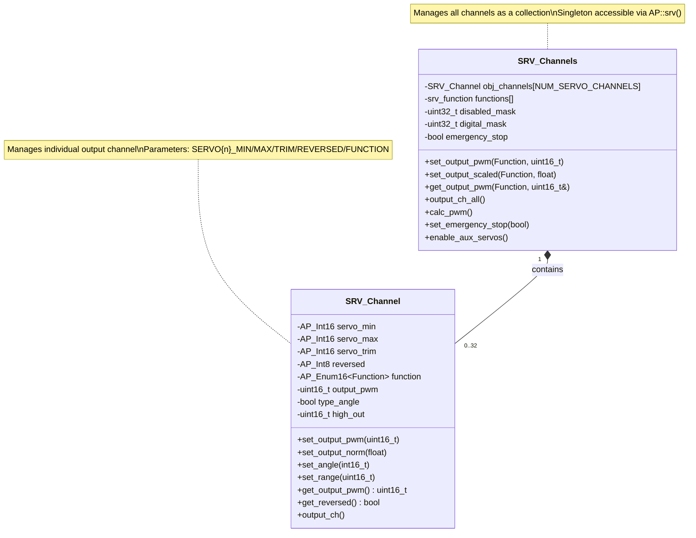
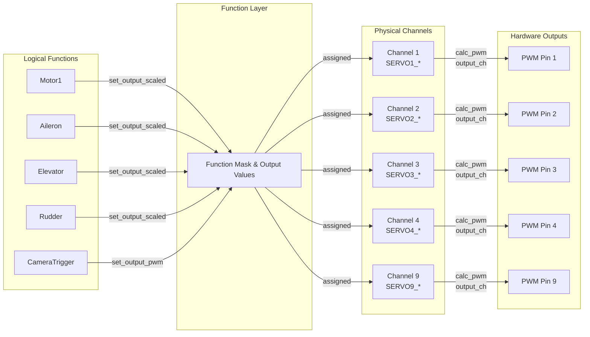
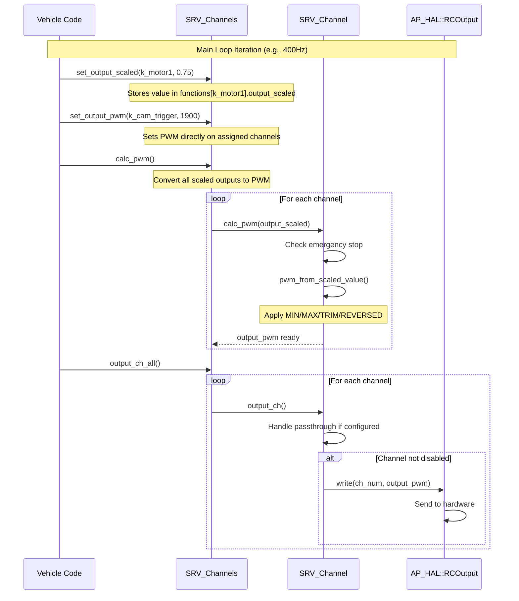
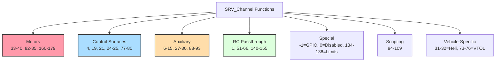

# SRV_Channel Library


## Table of Contents
- [Overview](#overview)
- [Architecture](#architecture)
  - [Class Structure](#class-structure)
  - [Function Mapping System](#function-mapping-system)
  - [Output Pipeline](#output-pipeline)
- [Output Protocols](#output-protocols)
  - [PWM Output](#pwm-output)
  - [DShot Protocol](#dshot-protocol)
  - [SBUS Output](#sbus-output)
  - [Specialized Protocols](#specialized-protocols)
- [Channel Configuration](#channel-configuration)
  - [Parameters](#parameters)
  - [Range and Angle Modes](#range-and-angle-modes)
  - [Trim and Scaling](#trim-and-scaling)
  - [Reversing Channels](#reversing-channels)
- [Function Assignment](#function-assignment)
  - [Available Functions](#available-functions)
  - [Motor Functions](#motor-functions)
  - [Control Surface Functions](#control-surface-functions)
  - [Auxiliary Functions](#auxiliary-functions)
  - [Passthrough Functions](#passthrough-functions)
- [Output Groups and Timing](#output-groups-and-timing)
- [Safety Features](#safety-features)
  - [Emergency Stop](#emergency-stop)
  - [Failsafe Handling](#failsafe-handling)
  - [Motor Safety](#motor-safety)
- [Configuration Examples](#configuration-examples)
- [API Reference](#api-reference)
- [Integration Guide](#integration-guide)
- [Testing](#testing)

## Overview

The SRV_Channel library provides comprehensive servo and motor output management for ArduPilot across all vehicle types. It implements a flexible function-to-channel mapping system that separates logical functions (motors, control surfaces, auxiliary devices) from physical output channels, enabling dynamic configuration and supporting multiple output protocols.

**Source Files**: `libraries/SRV_Channel/`
- `SRV_Channel.h` - Core class definitions and function enumeration
- `SRV_Channel.cpp` - Individual channel implementation
- `SRV_Channels.cpp` - Multi-channel management and initialization
- `SRV_Channel_aux.cpp` - Auxiliary function handling and passthrough
- `SRV_Channel_config.h` - Compile-time configuration

**Key Features**:
- Support for up to 32 output channels (configurable at compile-time)
- 190+ predefined output functions covering all vehicle types
- Multiple output protocols: PWM, DShot, SBUS, Volz, Robotis, BLHeli, FETtec
- Independent MIN/MAX/TRIM/REVERSED configuration per channel
- Emergency stop functionality for motor safety
- Slew rate limiting for smooth transitions
- RC input passthrough with failsafe support
- Digital output support with reversible thrust (DShot-3D)
- GPIO functionality for general-purpose I/O

## Architecture

### Class Structure

The library implements a two-class architecture optimized for ArduPilot's parameter system:



**Design Rationale**: The two-class split exists because AP_Param limits objects to 64 parameters. Each SRV_Channel has 5 parameters (MIN, MAX, TRIM, REVERSED, FUNCTION), so 32 channels require 160 parameters total, necessitating the separation.

**Source**: `SRV_Channel.h:37-378` (SRV_Channel class), `SRV_Channel.h:383-722` (SRV_Channels class)

### Function Mapping System

The library implements a flexible mapping between logical **functions** and physical **channels**:



**Mapping Process**:
1. **Function Assignment**: User sets `SERVOn_FUNCTION` parameter to assign a function to a channel
2. **Function Mask**: System tracks which channels are assigned to each function (`function_mask`)
3. **Output Setting**: Vehicle code sets output by function (e.g., `set_output_scaled(k_motor1, 0.75)`)
4. **Channel Mapping**: Library applies the output to all channels assigned to that function
5. **PWM Calculation**: Each channel converts scaled value to PWM based on its MIN/MAX/TRIM/REVERSED
6. **Hardware Output**: Final PWM values sent to HAL output pins

**Source**: `SRV_Channel.h:223` (Function enum), `SRV_Channels.cpp` (function_mask implementation)

### Output Pipeline

The complete output pipeline from vehicle control code to hardware:



**Critical Timing**: The pipeline executes at the vehicle's main loop rate (typically 50-400Hz depending on vehicle type). PWM calculation must complete within the loop period to ensure stable control.

**Source**: `SRV_Channel.cpp:224-245` (calc_pwm), `SRV_Channel_aux.cpp:32-102` (output_ch)

## Output Protocols

The SRV_Channel library supports multiple output protocols for different hardware requirements.

### PWM Output

**Standard PWM** (Pulse Width Modulation) is the default protocol, compatible with most servos and ESCs.

**Characteristics**:
- **Pulse Width Range**: Typically 1000-2000µs (configurable via SERVO*_MIN/MAX)
- **Update Rate**: Configurable via `SERVO_RATE` parameter (default 50Hz, range 25-400Hz)
- **Resolution**: 1µs on most hardware platforms
- **Compatibility**: Universal servo and ESC support

**PWM Calculation**:
```cpp
// Source: SRV_Channel.cpp:186-196
uint16_t SRV_Channel::pwm_from_range(float scaled_value) const
{
    // Constrain to 0..high_out range
    scaled_value = constrain_float(scaled_value, 0, high_out);
    
    // Apply reversal if configured
    if (reversed) {
        scaled_value = high_out - scaled_value;
    }
    
    // Linear interpolation from MIN to MAX
    return servo_min + (scaled_value * (servo_max - servo_min)) / high_out;
}
```

**Example PWM Configuration**:
```
SERVO1_FUNCTION = 33    # Motor 1
SERVO1_MIN = 1000       # Minimum throttle
SERVO1_MAX = 2000       # Maximum throttle
SERVO1_TRIM = 1500      # Mid-point (not used for motors)
SERVO1_REVERSED = 0     # Normal direction
SERVO_RATE = 50         # 50Hz output rate
```

### DShot Protocol

**DShot** is a digital ESC protocol offering higher update rates, telemetry, and bi-directional communication.

**Characteristics**:
- **Digital Protocol**: Command-based, not pulse-width based
- **Update Rates**: DShot150, DShot300, DShot600, DShot1200
- **Telemetry**: Optional telemetry feedback from ESC
- **Reversible**: DShot-3D supports reversible thrust
- **No Calibration**: Digital commands eliminate calibration requirements

**DShot Configuration**:
```cpp
// Source: SRV_Channel.h:548-550
static AP_HAL::RCOutput::DshotEscType get_dshot_esc_type();
static uint8_t get_dshot_rate();
```

**Configuration Parameters**:
```
SERVO_DSHOT_RATE = 2    # 0=Disabled, 1=150, 2=300, 3=600, 4=1200
SERVO_DSHOT_ESC = 0     # ESC type: 0=Normal, 1=BLHeli32, etc.
SERVO1_FUNCTION = 33    # Motor 1
SERVO2_FUNCTION = 34    # Motor 2
```

**Important Notes**:
- DShot requires hardware timer support (not available on all output pins)
- All channels on a timer group must use the same protocol
- MIN/MAX/TRIM parameters ignored for DShot (commands are 0-2000)
- Reversible mask set via `set_digital_outputs()` for DShot-3D ESCs

**Source**: `SRV_Channels.cpp` (DShot configuration), `AP_HAL::RCOutput` (protocol implementation)

### SBUS Output

**SBUS** is a serial protocol that transmits multiple channels over a single wire, useful for external devices.

**Characteristics**:
- **Protocol**: Futaba SBUS (inverted serial, 100kbaud)
- **Channels**: Up to 16 channels per SBUS port
- **Update Rate**: ~14ms (70Hz)
- **Use Cases**: Driving external servo controllers, redundant control paths

**Configuration**:
```
SERVO_SBUS_RATE = 50    # SBUS output rate
```

**Source**: `libraries/AP_SBusOut/` (SBUS protocol implementation)

### Specialized Protocols

The library integrates additional protocols for specific hardware:

| Protocol | Description | Use Case | Configuration |
|----------|-------------|----------|---------------|
| **Volz Protocol** | Serial protocol for Volz actuators | High-torque control surfaces | `SERVO_VOLZ_*` parameters |
| **Robotis Servo** | Dynamixel protocol for Robotis servos | Robotic manipulators | `SERVO_ROB_*` parameters |
| **BLHeli** | ESC configuration and passthrough | BLHeli ESC programming | `SERVO_BLH_*` parameters |
| **FETtec OneWire** | FETtec ESC protocol | FETtec motor controllers | `SERVO_FTW_*` parameters |

**Source**: `SRV_Channel.h:20-24` (protocol includes), `SRV_Channels.cpp:172-200` (parameter groups)

## Channel Configuration

### Parameters

Each servo channel has five configurable parameters:

#### SERVOn_FUNCTION
**Type**: Enum (190+ values)  
**Default**: 0 (Disabled)  
**Description**: Assigns a logical function to the physical channel

**Common Values**:
```
-1  = GPIO (general purpose I/O)
0   = Disabled (manual control via MAVLink/missions)
1   = RCPassThru (direct RC input passthrough)
33-40 = Motor1-Motor8 (multicopter motors)
4   = Aileron
19  = Elevator
21  = Rudder
70  = Throttle
```

**Source**: `SRV_Channel.cpp:64-172` (complete function enumeration)

#### SERVOn_MIN
**Type**: Int16  
**Units**: Microseconds (µs)  
**Range**: 800-2200  
**Default**: 1100  
**Description**: Minimum PWM pulse width output when function is at its lowest value

**Usage**:
- **Servos**: Physical minimum position (e.g., aileron full left)
- **Motors**: Minimum throttle / motor stopped
- **Affected by REVERSED**: If reversed=1, MIN becomes the maximum function output

#### SERVOn_MAX
**Type**: Int16  
**Units**: Microseconds (µs)  
**Range**: 800-2200  
**Default**: 1900  
**Description**: Maximum PWM pulse width output when function is at its highest value

**Usage**:
- **Servos**: Physical maximum position (e.g., aileron full right)
- **Motors**: Maximum throttle / full power
- **Affected by REVERSED**: If reversed=1, MAX becomes the minimum function output

#### SERVOn_TRIM
**Type**: Int16  
**Units**: Microseconds (µs)  
**Range**: 800-2200  
**Default**: 1500  
**Description**: Center/neutral position for angle-type outputs

**Usage**:
- **Control Surfaces**: Neutral position (zero deflection)
- **Motors**: Not used (motors use range mode, not angle mode)
- **Auto-trim**: Can be automatically adjusted in flight on Plane (if `SERVO_AUTO_TRIM=1`)

#### SERVOn_REVERSED
**Type**: Bool (0 or 1)  
**Values**: 0=Normal, 1=Reversed  
**Default**: 0  
**Description**: Reverses the output direction

**Behavior**:
- **Range Mode**: Swaps MIN and MAX in calculation
- **Angle Mode**: Negates the angle before conversion
- **Use Cases**: Correct servo installation reversed from standard, opposite motor rotation

**Source**: `SRV_Channel.cpp:29-174` (parameter definitions)

### Range and Angle Modes

Each channel operates in one of two output modes, automatically configured based on function type:

#### Range Mode

**Description**: Output scales from 0 to a maximum value, using MIN and MAX (TRIM ignored)

**Formula**:
```cpp
// Source: SRV_Channel.cpp:186-196
PWM = MIN + (scaled_value / high_out) * (MAX - MIN)
```

**Functions Using Range Mode**:
- Motors (k_motor1 through k_motor32)
- Throttle (k_throttle, k_throttleLeft, k_throttleRight)
- Flaps (k_flap, k_flap_auto)
- Landing gear (k_landing_gear_control)
- Camera controls (k_cam_trigger, k_cam_zoom)

**Example**: Motor at 75% throttle
```
SERVO1_MIN = 1000
SERVO1_MAX = 2000
SERVO1_FUNCTION = 33 (Motor1)
scaled_value = 0.75 * 1000 (assuming high_out=1000)
PWM = 1000 + (750/1000) * (2000-1000) = 1750µs
```

#### Angle Mode

**Description**: Output scales symmetrically around TRIM, from -angle to +angle

**Formula**:
```cpp
// Source: SRV_Channel.cpp:199-213
if (scaled_value > 0)
    PWM = TRIM + (scaled_value / high_out) * (MAX - TRIM)
else
    PWM = TRIM - (-scaled_value / high_out) * (TRIM - MIN)
```

**Functions Using Angle Mode**:
- Control surfaces (k_aileron, k_elevator, k_rudder)
- Elevons (k_elevon_left, k_elevon_right)
- Flaperons (k_flaperon_left, k_flaperon_right)
- Gimbal axes (k_mount_pan, k_mount_tilt, k_mount_roll)

**Example**: Aileron at 45° (half deflection)
```
SERVO2_MIN = 1000
SERVO2_MAX = 2000
SERVO2_TRIM = 1500
SERVO2_FUNCTION = 4 (Aileron)
scaled_value = 2250 (45° out of 4500 max = 90°)
PWM = 1500 + (2250/4500) * (2000-1500) = 1750µs
```

**Mode Selection**:
```cpp
// Source: SRV_Channel_aux.cpp:134-200
void SRV_Channel::aux_servo_function_setup(void)
{
    switch (function.get()) {
        case k_aileron:
        case k_elevator:
        case k_rudder:
            set_angle(4500);  // ±45° in centidegrees
            break;
        case k_motor1 ... k_motor32:
            set_range(1000);  // 0-1000 range
            break;
    }
}
```

**Source**: `SRV_Channel.cpp:263-276` (set_angle/set_range), `SRV_Channel_aux.cpp:134+` (auto-setup)

### Trim and Scaling

#### Trim Operations

The library provides multiple methods for setting and adjusting trim values:

**Manual Trim Setting**:
```cpp
// Set trim to current servo output (for control surfaces)
SRV_Channels::set_trim_to_servo_out_for(SRV_Channel::k_aileron);

// Set trim to minimum (useful for motors)
SRV_Channels::set_trim_to_min_for(SRV_Channel::k_motor1);

// Set trim to specific PWM value
SRV_Channels::set_trim_to_pwm_for(SRV_Channel::k_elevator, 1520);
```

**Auto-Trim** (ArduPlane only):
```cpp
// Parameter: SERVO_AUTO_TRIM = 1 (enabled)
// Source: SRV_Channels.cpp:156-162

// Automatically adjusts trim during stable flight
// - Active in stabilized modes when aircraft is near level
// - Changes saved every 10 seconds
// - Limited to ±20% of range from center
// - Applied via adjust_trim() in vehicle code
```

**Trim Adjustment**:
```cpp
// Source: SRV_Channels.cpp (adjust_trim implementation)
// Incrementally adjust trim by a small value
SRV_Channels::adjust_trim(SRV_Channel::k_elevator, 0.01);  // 1% adjustment
```

**Save Trim**:
```cpp
// Persist current trim values to storage
SRV_Channels::save_trim();
```

#### Scaling Operations

Outputs can be set using different scaling methods:

**Scaled Output** (-1000 to +1000 for angle, 0 to 1000 for range):
```cpp
// Set all channels assigned to function
SRV_Channels::set_output_scaled(SRV_Channel::k_elevator, 500);  // 50% deflection

// Calculation handled later by calc_pwm()
```

**Normalized Output** (-1.0 to +1.0):
```cpp
// Set output as normalized float
SRV_Channels::set_output_norm(SRV_Channel::k_rudder, 0.75f);  // 75% deflection
```

**Direct PWM**:
```cpp
// Bypass scaling, set PWM directly
SRV_Channels::set_output_pwm(SRV_Channel::k_cam_trigger, 1900);

// Or for specific channel
SRV_Channels::set_output_pwm_chan(8, 1500);
```

**Slew Rate Limiting**:
```cpp
// Limit rate of change (percent per second)
// Prevents abrupt movements that could damage hardware
SRV_Channels::set_slew_rate(SRV_Channel::k_flap, 25.0f, 100, 0.02f);
// Parameters: function, slew_rate (25% per second), range, dt (20ms)

// Get slew-limited output
float output = SRV_Channels::get_slew_limited_output_scaled(SRV_Channel::k_flap);
```

**Source**: `SRV_Channels.cpp` (trim and scaling methods)

### Reversing Channels

Channel reversal is accomplished through the `SERVOn_REVERSED` parameter:

**Behavior by Output Mode**:

**Range Mode Reversal**:
```cpp
// Source: SRV_Channel.cpp:186-196
// Normal (REVERSED=0): scaled_value=750 → PWM increases from MIN
// Reversed (REVERSED=1): scaled_value=750 → PWM decreases from MAX
if (reversed) {
    scaled_value = high_out - scaled_value;  // Invert the scale
}
PWM = MIN + (scaled_value / high_out) * (MAX - MIN);
```

**Angle Mode Reversal**:
```cpp
// Source: SRV_Channel.cpp:199-213
// Normal (REVERSED=0): positive angle → PWM above TRIM
// Reversed (REVERSED=1): positive angle → PWM below TRIM
if (reversed) {
    scaled_value = -scaled_value;  // Negate angle
}
```

**Common Reversal Scenarios**:

| Scenario | Reason | Solution |
|----------|--------|----------|
| Aileron opposite | Servo mounted inverted | Set `SERVO2_REVERSED=1` |
| Elevator opposite | Linkage reversed | Set `SERVO3_REVERSED=1` |
| Motor reverse | Prop or rotation direction | Set `SERVOn_REVERSED=1` or swap motor wires |
| Gimbal inverted | Camera mount upside-down | Set gimbal servo REVERSED=1 |

**Get Limit with Reversal**:
```cpp
// Source: SRV_Channel.cpp:301-314
// Returns appropriate limit respecting reversal
switch (limit) {
    case Limit::MIN:
        return reversed ? servo_max : servo_min;
    case Limit::MAX:
        return reversed ? servo_min : servo_max;
    case Limit::TRIM:
        return servo_trim;  // Trim unaffected by reversal
}
```

**Digital Output Reversal** (DShot-3D):
```cpp
// For reversible digital protocols (e.g., DShot-3D)
SRV_Channels::set_digital_outputs(digital_mask, reversible_mask);
// Enables bi-directional thrust on specified channels
```

**Source**: `SRV_Channel.cpp:186-213` (reversal implementation), `SRV_Channel.h:257-259` (get_reversed)

## Function Assignment

The function enumeration system provides 190+ predefined output functions across all vehicle types.

### Available Functions

**Function Categories**:



**Source**: `SRV_Channel.h:46-223` (complete function enumeration)

### Motor Functions

**Multicopter Motors** (k_motor1 through k_motor32):
```cpp
// Function values: 33-40 (Motor1-8), 82-85 (Motor9-12), 160-179 (Motor13-32)
// Source: SRV_Channel.h:82-89, 126-131, 192-211

// Check if function is a motor
bool SRV_Channel::is_motor(Function function) {
    return ((function >= k_motor1 && function <= k_motor8) ||
            (function >= k_motor9 && function <= k_motor12) ||
            (function >= k_motor13 && function <= k_motor32));
}
```

**Motor Configuration Example** (Quadcopter X-frame):
```
SERVO1_FUNCTION = 33    # Motor 1 (front-right)
SERVO2_FUNCTION = 34    # Motor 2 (rear-left)
SERVO3_FUNCTION = 35    # Motor 3 (front-left)
SERVO4_FUNCTION = 36    # Motor 4 (rear-right)

# All motors use range mode
SERVO1_MIN = 1000
SERVO1_MAX = 2000
```

**Vehicle-Specific Motor Functions**:
- **k_throttle (70)**: Fixed-wing throttle
- **k_throttleLeft (73)**, **k_throttleRight (74)**: Differential thrust
- **k_boost_throttle (81)**: Copter vertical boost
- **k_heli_rsc (31)**, **k_heli_tail_rsc (32)**: Helicopter rotor speed control

**Motor Number Retrieval**:
```cpp
// Source: SRV_Channels.h:566-574
SRV_Channel::Function get_motor_function(uint8_t channel) {
    if (channel < 8) {
        return Function(k_motor1 + channel);  // 0-7 → Motor1-8
    }
    if (channel < 12) {
        return Function(k_motor9 + (channel-8));  // 8-11 → Motor9-12
    }
    return Function(k_motor13 + (channel-12));  // 12+ → Motor13-32
}
```

### Control Surface Functions

**Primary Control Surfaces**:
- **k_aileron (4)**: Roll control
- **k_elevator (19)**: Pitch control
- **k_rudder (21)**: Yaw control

**Composite Control Surfaces**:
- **k_elevon_left (77)**, **k_elevon_right (78)**: Combined elevator+aileron (flying wings)
- **k_vtail_left (79)**, **k_vtail_right (80)**: Combined elevator+rudder (V-tail)
- **k_flaperon_left (24)**, **k_flaperon_right (25)**: Combined flap+aileron

**Secondary Control Surfaces**:
- **k_flap (2)**, **k_flap_auto (3)**: Flaps (manual/automatic)
- **k_dspoilerLeft1 (16)**, **k_dspoilerRight1 (17)**: Differential spoilers (left wing)
- **k_dspoilerLeft2 (86)**, **k_dspoilerRight2 (87)**: Differential spoilers (right wing)
- **k_airbrake (110)**: Air brakes

**Control Surface Check**:
```cpp
// Source: SRV_Channel.cpp (is_control_surface implementation)
bool SRV_Channel::is_control_surface(Function function) {
    // Returns true for aileron, elevator, rudder, elevons, flaperons, etc.
}
```

**Typical Fixed-Wing Configuration**:
```
SERVO1_FUNCTION = 4     # Aileron
SERVO1_MIN = 1000
SERVO1_MAX = 2000
SERVO1_TRIM = 1500
SERVO1_REVERSED = 0

SERVO2_FUNCTION = 19    # Elevator
SERVO2_MIN = 1000
SERVO2_MAX = 2000
SERVO2_TRIM = 1520      # Slightly offset trim
SERVO2_REVERSED = 1     # Inverted servo

SERVO4_FUNCTION = 21    # Rudder
SERVO4_MIN = 1000
SERVO4_MAX = 2000
SERVO4_TRIM = 1500
```

### Auxiliary Functions

**Camera and Gimbal**:
- **k_mount_pan (6)**, **k_mount_tilt (7)**, **k_mount_roll (8)**: Primary gimbal axes
- **k_mount_open (9)**: Gimbal deploy/retract
- **k_mount2_pan (12)** through **k_mount2_open (15)**: Secondary gimbal
- **k_cam_trigger (10)**: Camera shutter trigger
- **k_cam_iso (90)**, **k_cam_aperture (91)**, **k_cam_focus (92)**, **k_cam_shutter_speed (93)**: Camera controls
- **k_cam_zoom (180)**: Camera zoom control

**Payload and Cargo**:
- **k_gripper (28)**: Gripper open/close
- **k_parachute_release (27)**: Parachute deployment
- **k_egg_drop (11)**: Payload drop (deprecated, use k_lift_release)
- **k_lift_release (156)**: General payload release
- **k_winch (88)**, **k_winch_clutch (133)**: Winch control

**Vehicle Systems**:
- **k_landing_gear_control (29)**: Landing gear retract/extend
- **k_engine_run_enable (30)**: Engine kill switch
- **k_starter (69)**: Engine starter
- **k_ignition (67)**: Ignition system
- **k_generator_control (42)**: Generator control

**Sprayer Systems** (agriculture):
- **k_sprayer_pump (22)**: Sprayer pump control
- **k_sprayer_spinner (23)**: Sprayer spinner control

**Marine Systems** (Rover):
- **k_mainsail_sheet (89)**: Main sail control
- **k_wingsail_elevator (128)**: Wing sail elevator
- **k_mast_rotation (137)**: Sail mast rotation
- **k_steering (26)**: Ground/water steering

**VTOL-Specific**:
- **k_motor_tilt (41)**: Combined tilt motor control
- **k_tiltMotorLeft (75)**, **k_tiltMotorRight (76)**: Individual front tilt motors
- **k_tiltMotorRear (45)**: Rear tilt motor
- **k_tiltMotorRearLeft (46)**, **k_tiltMotorRearRight (47)**: Individual rear tilt motors

**Lighting and Indicators**:
- **k_LED_neopixel1-4 (120-123)**: NeoPixel LED strips
- **k_ProfiLED_1-3 (129-131)**, **k_ProfiLEDClock (132)**: ProfiLED protocol
- **k_lights1 (181)**, **k_lights2 (182)**: General lighting (Sub)
- **k_alarm (138)**, **k_alarm_inverted (139)**: Audible alarms

**Scripting Outputs** (k_scripting1 through k_scripting16):
```
Functions: 94-109 (16 channels)
Purpose: User-controlled outputs from Lua scripts
Usage: Enables custom functionality without modifying core code
```

### Passthrough Functions

**Direct RC Passthrough** (k_rcin1 through k_rcin16):
```
Functions: 51-66
Behavior: Directly passes RC input channel to servo output
Use Case: Simple passthrough without vehicle processing
```

**Mapped RC Passthrough** (k_rcin1_mapped through k_rcin16_mapped):
```
Functions: 140-155
Behavior: Passes RC input but applies SERVOn_MIN/MAX/TRIM/REVERSED scaling
Use Case: Passthrough with servo range adjustment
```

**Manual Passthrough**:
```
Function: 1 (k_manual)
Behavior: Passes the RC channel matching the servo number
Example: SERVO5_FUNCTION=1 passes RC channel 5 to servo output 5
```

**Passthrough with Failsafe**:
```cpp
// Source: SRV_Channel_aux.cpp:77-82
// Mapped passthrough respects RC failsafe mask
if (rc().in_rc_failsafe() && (channel_bit & rc_fs_mask)) {
    output_pwm = pwm_from_angle(0);  // Go to trim on failsafe
} else {
    output_pwm = previous_radio_in;  // Use last good value
}
```

**Disable Passthrough**:
```cpp
// Temporarily disable passthrough (e.g., during auto missions)
SRV_Channels::disable_passthrough(true);
```

**Source**: `SRV_Channel_aux.cpp:32-102` (passthrough implementation)

## Output Groups and Timing

### Timer Groups

Many autopilot boards have hardware timer constraints that require certain channels to share timing configurations.

**Timer Group Constraints**:
- All channels on a timer must use the same **output rate**
- All channels on a timer must use the same **output protocol** (PWM vs DShot)
- Typical groupings: {1-4}, {5-8}, {9-12}, {13-16} (board-dependent)

**Example Timer Conflict**:
```
# INVALID CONFIGURATION - Won't work if channels 1-4 share timer
SERVO1_FUNCTION = 33    # Motor (needs 400Hz)
SERVO2_FUNCTION = 4     # Aileron (needs 50Hz)
# Solution: Move aileron to different timer group (e.g., channel 5)
```

**Setting Output Rate by Function**:
```cpp
// Set update rate for all channels assigned to a function
SRV_Channels::set_rc_frequency(SRV_Channel::k_motor1, 400);  // 400Hz
SRV_Channels::set_rc_frequency(SRV_Channel::k_aileron, 50);   // 50Hz
```

### Channel Masks

The library uses bitmasks extensively for efficient multi-channel operations:

**Disabled Channels**:
```cpp
// Disable PWM output on specific channels (e.g., for BLHeli passthrough)
SRV_Channels::set_disabled_channel_mask(0x0F);  // Disable channels 0-3
uint32_t disabled = SRV_Channels::get_disabled_channel_mask();
```

**Digital Output Mask**:
```cpp
// Mark channels using digital protocols (DShot, etc.)
uint32_t digital_mask = 0xFF;  // Channels 0-7
uint32_t reversible_mask = 0xFF;  // All support DShot-3D
SRV_Channels::set_digital_outputs(digital_mask, reversible_mask);

// Check if all specified channels are digital
if (SRV_Channels::have_digital_outputs(0x0F)) {
    // Channels 0-3 are all digital
}
```

**Function Output Mask**:
```cpp
// Get bitmask of channels assigned to a function
uint32_t motor_mask = SRV_Channels::get_output_channel_mask(SRV_Channel::k_motor1);
// Returns bitmask with bits set for each channel assigned to Motor1
```

### Output Initialization

**Initialization Sequence**:
```cpp
// Source: Vehicle setup code
// 1. Initialize SRV_Channels singleton
SRV_Channels::init(motor_mask, AP_HAL::RCOutput::MODE_PWM_DSHOT300);

// 2. Set default functions (if not configured)
SRV_Channels::set_default_function(0, SRV_Channel::k_motor1);
SRV_Channels::set_default_function(1, SRV_Channel::k_motor2);

// 3. Enable auxiliary servos (apply function assignments)
AP::srv().enable_aux_servos();

// 4. Setup failsafe values
SRV_Channels::setup_failsafe_trim_all_non_motors();
```

**Source**: `SRV_Channels.cpp` (init and enable methods)

## Safety Features

### Emergency Stop

The library implements a safety-critical emergency stop (E-stop) system that immediately stops all dangerous outputs.

**E-stop Functionality**:
```cpp
// Source: SRV_Channel.cpp:325-352
bool SRV_Channel::should_e_stop(Function function) {
    switch (function) {
        case k_motor1 ... k_motor32:    // All motors
        case k_heli_rsc:                // Helicopter rotor
        case k_heli_tail_rsc:           // Helicopter tail rotor
        case k_throttle:                // Fixed-wing throttle
        case k_throttleLeft:
        case k_throttleRight:
        case k_boost_throttle:
        case k_starter:                 // Engine starter
        case k_engine_run_enable:       // Engine kill switch
            return true;                // Affected by E-stop
        default:
            return false;               // Not affected (servos continue)
    }
}
```

**Triggering E-stop**:
```cpp
// Activate emergency stop (typically called by crash detection or failsafe)
SRV_Channels::set_emergency_stop(true);

// Check E-stop state
if (SRV_Channels::get_emergency_stop()) {
    // E-stop is active
}

// Clear E-stop (after crash recovery, etc.)
SRV_Channels::set_emergency_stop(false);
```

**E-stop Behavior**:
```cpp
// Source: SRV_Channel.cpp:224-245
void SRV_Channel::calc_pwm(float output_scaled)
{
    // Check for E-stop on dangerous functions
    if (should_e_stop(get_function()) && SRV_Channels::emergency_stop) {
        output_scaled = 0.0;  // Force output to zero
        force = true;
    }
    
    output_pwm = pwm_from_scaled_value(output_scaled);
}
```

**Safety Note**: E-stop affects ONLY motor/throttle functions. Control surfaces (aileron, elevator, rudder) remain active to allow potential glide recovery.

### Failsafe Handling

**Failsafe Configuration by Function**:
```cpp
// Set failsafe to specific PWM value
SRV_Channels::set_failsafe_pwm(SRV_Channel::k_throttle, 900);

// Set failsafe to a limit (MIN, MAX, TRIM, ZERO_PWM)
SRV_Channels::set_failsafe_limit(SRV_Channel::k_flap, SRV_Channel::Limit::MIN);
SRV_Channels::set_failsafe_limit(SRV_Channel::k_landing_gear_control, 
                                  SRV_Channel::Limit::MAX);
```

**Failsafe for All Non-Motors**:
```cpp
// Set all non-motor outputs to their TRIM values (typical for servo surfaces)
SRV_Channels::setup_failsafe_trim_all_non_motors();
```

**RC Failsafe Mask**:
```
Parameter: SERVO_RC_FS_MSK (32-bit bitmask)
Purpose: Specify which RC passthrough channels go to trim on RC failsafe
Example: SERVO_RC_FS_MSK = 0x0F (channels 0-3 go to trim on RC loss)
```

**Passthrough Failsafe Behavior**:
```cpp
// Source: SRV_Channel_aux.cpp:77-82
// For mapped passthrough functions (k_rcin1_mapped, etc.)
if (rc().in_rc_failsafe() && (channel_mask & rc_fs_mask)) {
    output_pwm = pwm_from_angle(0);  // Go to trim/center
} else {
    output_pwm = previous_radio_in;  // Hold last good value
}
```

### Motor Safety

**Motor Arming Integration**:
- Motors only output when vehicle is armed
- Integration with `AP_Arming` library ensures pre-flight checks
- Zero output when disarmed (or SERVOn_TRIM for non-motor functions)

**Zero All Outputs**:
```cpp
// Force all outputs to zero (used during initialization, disarming)
SRV_Channels::zero_rc_outputs();
```

**Output Limiting**:
```cpp
// Set output to specific limit
SRV_Channels::set_output_limit(SRV_Channel::k_motor1, SRV_Channel::Limit::MIN);
SRV_Channels::set_output_limit(SRV_Channel::k_motor2, SRV_Channel::Limit::MAX);
SRV_Channels::set_output_limit(SRV_Channel::k_elevator, SRV_Channel::Limit::TRIM);
SRV_Channels::set_output_limit(SRV_Channel::k_throttle, SRV_Channel::Limit::ZERO_PWM);
```

**Constrain to Limits**:
```cpp
// Constrain output to configured MIN/MAX
SRV_Channels::constrain_pwm(SRV_Channel::k_motor1);
```

**Cork/Push for Atomic Updates**:
```cpp
// Source: SRV_Channels.cpp (cork/push methods)
// Buffer outputs to update hardware atomically (prevents glitches)
AP::srv().cork();
SRV_Channels::set_output_scaled(SRV_Channel::k_motor1, 500);
SRV_Channels::set_output_scaled(SRV_Channel::k_motor2, 500);
SRV_Channels::set_output_scaled(SRV_Channel::k_motor3, 500);
SRV_Channels::set_output_scaled(SRV_Channel::k_motor4, 500);
SRV_Channels::calc_pwm();
SRV_Channels::output_ch_all();
AP::srv().push();  // Atomic hardware update
```

**Source**: `SRV_Channel.cpp` (safety methods), `SRV_Channels.cpp` (system-wide safety)

## Configuration Examples

### Quadcopter X Configuration

**Standard quad-X motor layout**:
```
SERVO1_FUNCTION = 33    # Motor 1 - Front Right
SERVO1_MIN = 1000
SERVO1_MAX = 2000
SERVO1_REVERSED = 0

SERVO2_FUNCTION = 34    # Motor 2 - Rear Left
SERVO2_MIN = 1000
SERVO2_MAX = 2000
SERVO2_REVERSED = 0

SERVO3_FUNCTION = 35    # Motor 3 - Front Left
SERVO3_MIN = 1000
SERVO3_MAX = 2000
SERVO3_REVERSED = 0

SERVO4_FUNCTION = 36    # Motor 4 - Rear Right
SERVO4_MIN = 1000
SERVO4_MAX = 2000
SERVO4_REVERSED = 0

SERVO_RATE = 50         # Output rate (or use DShot)
SERVO_DSHOT_RATE = 0    # 0=Disabled (PWM), 2=DShot300, 3=DShot600
```

### Fixed-Wing Configuration

**Standard airplane with aileron, elevator, rudder, throttle**:
```
SERVO1_FUNCTION = 4     # Aileron
SERVO1_MIN = 1000
SERVO1_MAX = 2000
SERVO1_TRIM = 1500
SERVO1_REVERSED = 0

SERVO2_FUNCTION = 19    # Elevator
SERVO2_MIN = 1000
SERVO2_MAX = 2000
SERVO2_TRIM = 1505
SERVO2_REVERSED = 1     # Reversed servo

SERVO3_FUNCTION = 70    # Throttle
SERVO3_MIN = 1000
SERVO3_MAX = 2000
SERVO3_TRIM = 1000      # Throttle at minimum when centered
SERVO3_REVERSED = 0

SERVO4_FUNCTION = 21    # Rudder
SERVO4_MIN = 1000
SERVO4_MAX = 2000
SERVO4_TRIM = 1500
SERVO4_REVERSED = 0

SERVO_AUTO_TRIM = 1     # Enable auto-trim for plane
SERVO_RATE = 50         # 50Hz for servos
```

### Flying Wing (Elevon) Configuration

**Two-channel flying wing**:
```
SERVO1_FUNCTION = 77    # Elevon Left (elevator + aileron mixing)
SERVO1_MIN = 1000
SERVO1_MAX = 2000
SERVO1_TRIM = 1500
SERVO1_REVERSED = 0

SERVO2_FUNCTION = 78    # Elevon Right
SERVO2_MIN = 1000
SERVO2_MAX = 2000
SERVO2_TRIM = 1500
SERVO2_REVERSED = 1     # Typically reversed relative to left

SERVO3_FUNCTION = 70    # Throttle
SERVO3_MIN = 1000
SERVO3_MAX = 2000
```

### QuadPlane VTOL Configuration

**QuadPlane with 4 VTOL motors + fixed-wing surfaces**:
```
# VTOL Motors
SERVO1_FUNCTION = 33    # Motor 1
SERVO2_FUNCTION = 34    # Motor 2
SERVO3_FUNCTION = 35    # Motor 3
SERVO4_FUNCTION = 36    # Motor 4
SERVO_RATE = 50         # Or DShot for motors

# Fixed-wing controls
SERVO5_FUNCTION = 4     # Aileron (on different timer group)
SERVO6_FUNCTION = 19    # Elevator
SERVO7_FUNCTION = 70    # Forward throttle
SERVO8_FUNCTION = 21    # Rudder

# Tilt servos (if tilt-rotor)
SERVO9_FUNCTION = 41    # Tilt motors front
SERVO10_FUNCTION = 45   # Tilt motors rear
```

### Camera Gimbal Configuration

**3-axis gimbal with trigger**:
```
SERVO9_FUNCTION = 6     # Mount1 Yaw (pan)
SERVO9_MIN = 1000
SERVO9_MAX = 2000
SERVO9_TRIM = 1500
SERVO9_REVERSED = 0

SERVO10_FUNCTION = 7    # Mount1 Tilt (pitch)
SERVO10_MIN = 1000
SERVO10_MAX = 2000
SERVO10_TRIM = 1500
SERVO10_REVERSED = 0

SERVO11_FUNCTION = 8    # Mount1 Roll
SERVO11_MIN = 1000
SERVO11_MAX = 2000
SERVO11_TRIM = 1500

SERVO12_FUNCTION = 10   # Camera Trigger
SERVO12_MIN = 1000      # Trigger inactive
SERVO12_MAX = 2000      # Trigger active
```

### Rover/Boat Configuration

**Skid-steer rover**:
```
SERVO1_FUNCTION = 73    # Throttle Left
SERVO1_MIN = 1000
SERVO1_MAX = 2000

SERVO3_FUNCTION = 74    # Throttle Right
SERVO3_MIN = 1000
SERVO3_MAX = 2000

# Servo1 and Servo3 will output differential for steering
```

**Ackermann steering rover**:
```
SERVO1_FUNCTION = 26    # Ground Steering
SERVO1_MIN = 1000
SERVO1_MAX = 2000
SERVO1_TRIM = 1500
SERVO1_REVERSED = 0

SERVO3_FUNCTION = 70    # Throttle
SERVO3_MIN = 1000
SERVO3_MAX = 2000
```

### RC Passthrough Configuration

**Direct passthrough with scaling**:
```
SERVO5_FUNCTION = 140   # RCIN1 Mapped (applies servo scaling)
SERVO5_MIN = 800        # Custom servo range
SERVO5_MAX = 2200
SERVO5_TRIM = 1500

SERVO6_FUNCTION = 51    # RCIN1 (direct, no scaling)
# MIN/MAX/TRIM ignored

SERVO_RC_FS_MSK = 0x20  # Bit 5 set - SERVO5 goes to trim on RC failsafe
```

### Scripting Output Configuration

**Lua script-controlled outputs**:
```
SERVO13_FUNCTION = 94   # Scripting1
SERVO13_MIN = 1000
SERVO13_MAX = 2000

SERVO14_FUNCTION = 95   # Scripting2
SERVO14_MIN = 1000
SERVO14_MAX = 2000

# Controlled from Lua scripts via SRV_Channels:set_output_pwm()
```

## API Reference

### Core SRV_Channel Methods

```cpp
/**
 * @brief Set output as PWM value
 * @param pwm PWM pulse width in microseconds
 * @param force Override even if channel has active override
 * Source: SRV_Channel.cpp:247-253
 */
void set_output_pwm(uint16_t pwm, bool force = false);

/**
 * @brief Get current output PWM
 * @return PWM value in microseconds
 * Source: SRV_Channel.h:245
 */
uint16_t get_output_pwm(void) const;

/**
 * @brief Set normalized output from -1 to 1
 * @param value Normalized value (0 = trim/center)
 * Source: SRV_Channel.cpp:256-260
 */
void set_output_norm(float value);

/**
 * @brief Set angular range for angle-mode output
 * @param angle Maximum angle in centidegrees (e.g., 4500 = ±45°)
 * Source: SRV_Channel.cpp:263-268
 */
void set_angle(int16_t angle);

/**
 * @brief Set range for range-mode output
 * @param high Maximum range value (e.g., 1000 for 0-1000 scale)
 * Source: SRV_Channel.cpp:271-276
 */
void set_range(uint16_t high);

/**
 * @brief Check if channel is reversed
 * @return true if SERVOn_REVERSED=1
 * Source: SRV_Channel.h:257-259
 */
bool get_reversed(void) const;

/**
 * @brief Get the function assigned to this channel
 * @return Function enum value
 * Source: SRV_Channel.h:290-292
 */
SRV_Channel::Function get_function(void) const;
```

### Core SRV_Channels Methods

```cpp
/**
 * @brief Set output PWM for all channels assigned to a function
 * @param function Function enum (e.g., k_motor1)
 * @param value PWM value in microseconds
 * Source: SRV_Channels.cpp
 */
static void set_output_pwm(SRV_Channel::Function function, uint16_t value);

/**
 * @brief Set scaled output for a function (requires calc_pwm() call)
 * @param function Function enum
 * @param value Scaled value (angle or range depending on mode)
 * Source: SRV_Channels.cpp
 */
static void set_output_scaled(SRV_Channel::Function function, float value);

/**
 * @brief Get scaled output for a function
 * @param function Function enum
 * @return Current scaled output value
 * Source: SRV_Channels.cpp
 */
static float get_output_scaled(SRV_Channel::Function function);

/**
 * @brief Set normalized output (-1 to +1) for a function
 * @param function Function enum
 * @param value Normalized value
 * Source: SRV_Channels.cpp
 */
static void set_output_norm(SRV_Channel::Function function, float value);

/**
 * @brief Calculate PWM values for all channels from scaled outputs
 * @note Call after set_output_scaled() before output_ch_all()
 * Source: SRV_Channels.cpp
 */
static void calc_pwm(void);

/**
 * @brief Output all channels to hardware
 * @note Call after calc_pwm() to send outputs to HAL
 * Source: SRV_Channel_aux.cpp:107-118
 */
static void output_ch_all(void);

/**
 * @brief Get channel assigned to a function
 * @param function Function enum
 * @param[out] chan Channel number (0-based)
 * @return true if function is assigned to a channel
 * Source: SRV_Channels.cpp
 */
static bool find_channel(SRV_Channel::Function function, uint8_t &chan);

/**
 * @brief Get SRV_Channel object for a function
 * @param function Function enum
 * @return Pointer to SRV_Channel, or nullptr if not assigned
 * Source: SRV_Channels.cpp
 */
static SRV_Channel *get_channel_for(SRV_Channel::Function function);

/**
 * @brief Check if a function is assigned to any channel
 * @param function Function enum
 * @return true if function is assigned
 * Source: SRV_Channels.cpp
 */
static bool function_assigned(SRV_Channel::Function function);

/**
 * @brief Set emergency stop state
 * @param state true to activate E-stop, false to clear
 * Source: SRV_Channels.cpp
 * @safety CRITICAL - Immediately stops all motor outputs
 */
static void set_emergency_stop(bool state);

/**
 * @brief Get emergency stop state
 * @return true if E-stop is active
 * Source: SRV_Channel.h:596
 */
static bool get_emergency_stop();
```

### Singleton Access

```cpp
// Access the SRV_Channels singleton
SRV_Channels &srv = AP::srv();

// Example usage
AP::srv().enable_aux_servos();
```

**Source**: `SRV_Channel.h:724-726` (singleton declaration)

## Integration Guide

### Typical Main Loop Integration

**Vehicle Main Loop Pattern**:
```cpp
// Source: Typical vehicle scheduler loop (e.g., Copter.cpp, Plane.cpp)

void Vehicle::fast_loop()  // 400Hz for Copter, varies by vehicle
{
    // 1. Read sensors
    read_inertial_sensors();
    
    // 2. Update attitude estimation
    ahrs.update();
    
    // 3. Run attitude controller
    attitude_control.update();
    
    // 4. Set motor outputs by function
    SRV_Channels::set_output_scaled(SRV_Channel::k_motor1, motor_out[0]);
    SRV_Channels::set_output_scaled(SRV_Channel::k_motor2, motor_out[1]);
    SRV_Channels::set_output_scaled(SRV_Channel::k_motor3, motor_out[2]);
    SRV_Channels::set_output_scaled(SRV_Channel::k_motor4, motor_out[3]);
    
    // 5. Calculate PWM from scaled outputs
    SRV_Channels::calc_pwm();
    
    // 6. Output to hardware
    SRV_Channels::output_ch_all();
}

void Vehicle::update_servos()  // Slower rate for servos
{
    // Calculate servo positions
    calc_nav_roll();
    calc_nav_pitch();
    
    // Set servo outputs
    SRV_Channels::set_output_scaled(SRV_Channel::k_aileron, nav_roll);
    SRV_Channels::set_output_scaled(SRV_Channel::k_elevator, nav_pitch);
    SRV_Channels::set_output_scaled(SRV_Channel::k_rudder, nav_yaw);
}
```

### Initialization Sequence

**Vehicle Initialization** (typically in `setup()`):
```cpp
void Vehicle::init_ardupilot()
{
    // 1. Initialize HAL
    hal.init();
    
    // 2. Load parameters
    load_parameters();
    
    // 3. Initialize RC input
    rc().init();
    
    // 4. Initialize SRV_Channels
    // Parameters: motor mask, output mode
    uint32_t motor_mask = 0x0F;  // Motors on channels 0-3
    AP::srv().init(motor_mask, AP_HAL::RCOutput::MODE_PWM_DSHOT300);
    
    // 5. Set default functions (if parameters not configured)
    SRV_Channels::set_default_function(0, SRV_Channel::k_motor1);
    SRV_Channels::set_default_function(1, SRV_Channel::k_motor2);
    SRV_Channels::set_default_function(2, SRV_Channel::k_motor3);
    SRV_Channels::set_default_function(3, SRV_Channel::k_motor4);
    
    // 6. Apply function-to-channel mappings
    AP::srv().enable_aux_servos();
    
    // 7. Setup failsafe values
    SRV_Channels::setup_failsafe_trim_all_non_motors();
    
    // 8. Set output rates
    SRV_Channels::set_rc_frequency(SRV_Channel::k_motor1, 400);  // High rate
    SRV_Channels::set_rc_frequency(SRV_Channel::k_aileron, 50);  // Standard
}
```

### Adding a New Function Type

**Example: Adding a Custom Auxiliary Function**:

1. **Add to Function Enum** (`SRV_Channel.h`):
```cpp
typedef enum {
    // ... existing functions ...
    k_my_custom_function = 200,  // Add before k_nr_aux_servo_functions
    k_nr_aux_servo_functions     // Keep as last
} Function;
```

2. **Add Parameter Documentation** (`SRV_Channel.cpp`):
```cpp
// In FUNCTION parameter documentation
// @Values: 200:MyCustomFunction
```

3. **Configure Range/Angle** (`SRV_Channel_aux.cpp:aux_servo_function_setup`):
```cpp
switch (function.get()) {
    // ... existing cases ...
    case k_my_custom_function:
        set_range(100);  // or set_angle(4500) for angle mode
        break;
}
```

4. **Use in Vehicle Code**:
```cpp
// Set output
SRV_Channels::set_output_scaled(SRV_Channel::k_my_custom_function, value);

// Check if assigned
if (SRV_Channels::function_assigned(SRV_Channel::k_my_custom_function)) {
    // Function is configured
}
```

### Working with Multiple Channels per Function

Some functions may be assigned to multiple channels:

```cpp
// Set output for all channels assigned to a function
SRV_Channels::set_output_scaled(SRV_Channel::k_aileron, roll_output);
// If aileron is assigned to channels 2 and 5, both will receive the output

// Get bitmask of channels
uint32_t aileron_mask = SRV_Channels::get_output_channel_mask(SRV_Channel::k_aileron);
// Returns bitmask: e.g., 0x24 (bits 2 and 5 set)

// Iterate through assigned channels
for (uint8_t i = 0; i < NUM_SERVO_CHANNELS; i++) {
    if (aileron_mask & (1U << i)) {
        // Channel i is assigned to aileron
        SRV_Channel *ch = SRV_Channels::srv_channel(i);
        uint16_t pwm = ch->get_output_pwm();
    }
}
```

### Atomic Output Updates

For critical updates (e.g., motor outputs), use cork/push to prevent glitches:

```cpp
// Buffer all outputs
AP::srv().cork();

// Set multiple outputs
SRV_Channels::set_output_scaled(SRV_Channel::k_motor1, m1);
SRV_Channels::set_output_scaled(SRV_Channel::k_motor2, m2);
SRV_Channels::set_output_scaled(SRV_Channel::k_motor3, m3);
SRV_Channels::set_output_scaled(SRV_Channel::k_motor4, m4);

// Calculate PWM
SRV_Channels::calc_pwm();

// Output to hardware
SRV_Channels::output_ch_all();

// Flush to hardware atomically
AP::srv().push();
```

### Slew Rate Limiting

Prevent abrupt output changes that could damage hardware:

```cpp
// Set slew rate limit: 25% per second, range 0-100, update period 20ms
SRV_Channels::set_slew_rate(SRV_Channel::k_flap, 25.0f, 100, 0.02f);

// Set output (will be slew-limited)
SRV_Channels::set_output_scaled(SRV_Channel::k_flap, 100);  // Request full extension

// Get slew-limited value
float actual = SRV_Channels::get_slew_limited_output_scaled(SRV_Channel::k_flap);
// If flap was at 0, after 1 second actual will be 25 (25% of 100)
```

### GPIO Functionality

Using servo outputs as general-purpose I/O:

```cpp
// Configure as GPIO
SERVO13_FUNCTION = -1  // GPIO mode

// Check if channel is GPIO
if (SRV_Channels::is_GPIO(12)) {  // Channel 12 (SERVO13)
    // Channel is in GPIO mode
    // Control via HAL GPIO functions
    hal.gpio->pinMode(gpio_pin, HAL_GPIO_OUTPUT);
    hal.gpio->write(gpio_pin, 1);
}
```

### Safety-Critical Integration

**Emergency Stop Trigger**:
```cpp
// In crash detection code
if (crash_detected()) {
    SRV_Channels::set_emergency_stop(true);
    // Motors immediately stop, control surfaces remain active
}

// In recovery code
if (recovery_complete() && user_confirmed()) {
    SRV_Channels::set_emergency_stop(false);
}
```

**Failsafe Integration**:
```cpp
// In failsafe handler
void Vehicle::handle_failsafe()
{
    // Set throttle to failsafe value
    SRV_Channels::set_failsafe_pwm(SRV_Channel::k_throttle, 900);
    
    // Set control surfaces to trim
    SRV_Channels::set_output_to_trim(SRV_Channel::k_aileron);
    SRV_Channels::set_output_to_trim(SRV_Channel::k_elevator);
    SRV_Channels::set_output_to_trim(SRV_Channel::k_rudder);
    
    // Or use convenience function
    SRV_Channels::setup_failsafe_trim_all_non_motors();
}
```

## Testing

### Ground Testing

**Motor Test** (via MAVLink):
```python
# Using MAVProxy or mission planner
# Test individual motors before first flight

# Motor test command (MAVLink DO_MOTOR_TEST)
# motor_instance: 1-4 (Motor1-Motor4)
# throttle_type: 1=PWM, 2=Percent
# throttle: value
# timeout_s: test duration
# motor_count: number of motors to test
```

**Manual Servo Test**:
```cpp
// In vehicle code or via MAVLink DO_SET_SERVO
SRV_Channels::set_output_pwm(SRV_Channel::k_aileron, 1500);  // Center
delay(1000);
SRV_Channels::set_output_pwm(SRV_Channel::k_aileron, 1000);  // Full left
delay(1000);
SRV_Channels::set_output_pwm(SRV_Channel::k_aileron, 2000);  // Full right
```

### SITL Testing

**Software-In-The-Loop Configuration**:
```bash
# Start SITL with custom servo configuration
sim_vehicle.py -v ArduCopter --console --map

# In MAVProxy, test servo functions
param set SERVO1_FUNCTION 33
param set SERVO1_MIN 1000
param set SERVO1_MAX 2000
param write

# Monitor servo outputs
watch SRV_*
```

### Unit Testing

**Example Test Cases**:
```cpp
// Source: Create tests in libraries/SRV_Channel/tests/

// Test PWM calculation
void test_pwm_from_range() {
    SRV_Channel ch;
    ch.set_output_min(1000);
    ch.set_output_max(2000);
    ch.set_range(100);
    
    uint16_t pwm = ch.pwm_from_scaled_value(50);  // 50% of range
    assert(pwm == 1500);  // Should be midpoint
}

// Test reversal
void test_reversal() {
    SRV_Channel ch;
    ch.set_output_min(1000);
    ch.set_output_max(2000);
    ch.set_angle(4500);
    ch.reversed_set_and_save_ifchanged(true);
    
    uint16_t pwm = ch.pwm_from_scaled_value(2250);  // +45°
    assert(pwm < 1500);  // Should be below trim when reversed
}

// Test emergency stop
void test_emergency_stop() {
    SRV_Channels::set_emergency_stop(true);
    
    // Motor functions should be affected
    assert(SRV_Channel::should_e_stop(SRV_Channel::k_motor1) == true);
    
    // Control surfaces should NOT be affected
    assert(SRV_Channel::should_e_stop(SRV_Channel::k_aileron) == false);
    
    SRV_Channels::set_emergency_stop(false);
}
```

### Bench Testing Checklist

Before flight testing:

- [ ] Verify all motor directions are correct
- [ ] Confirm motor order matches frame type
- [ ] Test motor stop (throttle to minimum)
- [ ] Verify control surface directions
  - [ ] Aileron: Right stick → right roll
  - [ ] Elevator: Back stick → pitch up
  - [ ] Rudder: Right stick → nose right
- [ ] Test failsafe behavior (disconnect RC)
- [ ] Verify E-stop functionality
- [ ] Check output ranges (no binding, full travel)
- [ ] Test trim settings
- [ ] Verify reversed channels work correctly

### Hardware Validation

**Oscilloscope/Logic Analyzer Testing**:
```
Connect to servo output pins and verify:
- PWM pulse width range (should be within MIN-MAX)
- PWM frequency (should match SERVO_RATE)
- DShot timing (if using DShot protocol)
- Output glitches (should be none, especially with cork/push)
```

**Multimeter Testing**:
```
Measure output voltage levels:
- PWM high level: ~3.3V or 5V (depending on board)
- PWM low level: 0V
- Idle state: Typically low or high depending on protocol
```

### Common Issues and Debugging

**Issue: Servo moving in wrong direction**
```
Solution: Set SERVOn_REVERSED = 1
```

**Issue: Servo not moving**
```
Check:
1. SERVOn_FUNCTION is set to appropriate function
2. Vehicle code is calling set_output_scaled() for that function
3. Channel is not in disabled_mask
4. Servo physically connected to correct pin
```

**Issue: Motor not spinning**
```
Check:
1. Vehicle is armed
2. E-stop is not active (get_emergency_stop() returns false)
3. Throttle input is above minimum
4. SERVOn_FUNCTION set to motor function (33-40, etc.)
5. MIN/MAX calibrated correctly for ESC
```

**Issue: Glitchy servo output**
```
Solution: Use cork/push for atomic updates
Verify: No competing timer configurations on same group
```

**Issue: DShot not working**
```
Check:
1. Hardware timer available on selected pins
2. SERVO_DSHOT_RATE set correctly (2=DShot300, etc.)
3. All channels on timer group use same protocol
4. ESC supports DShot protocol
```

---

## Summary

The SRV_Channel library is the backbone of ArduPilot's output system, providing:

- **Flexible Mapping**: Decouple logical functions from physical channels
- **Protocol Support**: PWM, DShot, SBUS, and specialized protocols
- **Safety Features**: Emergency stop, failsafe handling, motor safety
- **Configuration**: Per-channel MIN/MAX/TRIM/REVERSED parameters
- **Vehicle Agnostic**: Supports all ArduPilot vehicle types with unified API

**Key Design Principles**:
1. **Separation of Concerns**: Vehicle code works with functions, not channels
2. **Safety First**: Emergency stop and failsafe built into core architecture
3. **Hardware Abstraction**: Protocol details hidden behind HAL layer
4. **User Configurability**: Full parameter control without code changes
5. **Performance**: Efficient bitmask operations for multi-channel updates

**Thread Safety**: Main loop execution is single-threaded, but override functionality uses semaphores for thread safety when accessed from telemetry threads.

**Memory Usage**: Static allocation only, DMA-safe buffers for hardware compatibility.

**Real-Time Constraints**: Output pipeline must complete within main loop period (typically 2.5ms at 400Hz for copters, longer for planes).

---

## Additional Resources

- **Parameter Documentation**: Complete parameter list in `SRV_Channel.cpp:29-174`
- **Function Enumeration**: Full function list in `SRV_Channel.h:46-223`
- **Hardware Abstraction**: See `libraries/AP_HAL/` for output protocol implementation
- **Vehicle Integration**: Examine vehicle-specific code in `/ArduCopter/`, `/ArduPlane/`, etc.
- **Protocol Libraries**: 
  - DShot: `AP_HAL::RCOutput`
  - SBUS: `libraries/AP_SBusOut/`
  - Volz: `libraries/AP_Volz_Protocol/`
  - BLHeli: `libraries/AP_BLHeli/`

**Version**: This documentation reflects the library state as of the source files provided.
**License**: GPL v3 or later (consistent with ArduPilot licensing)

---

*This documentation was generated as part of the ArduPilot comprehensive documentation enhancement initiative.*
