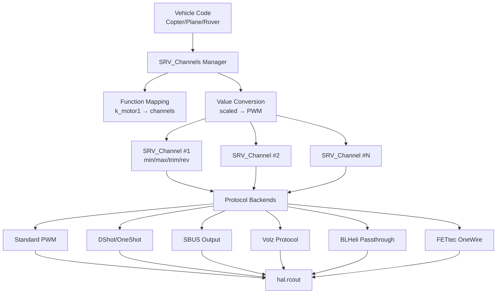
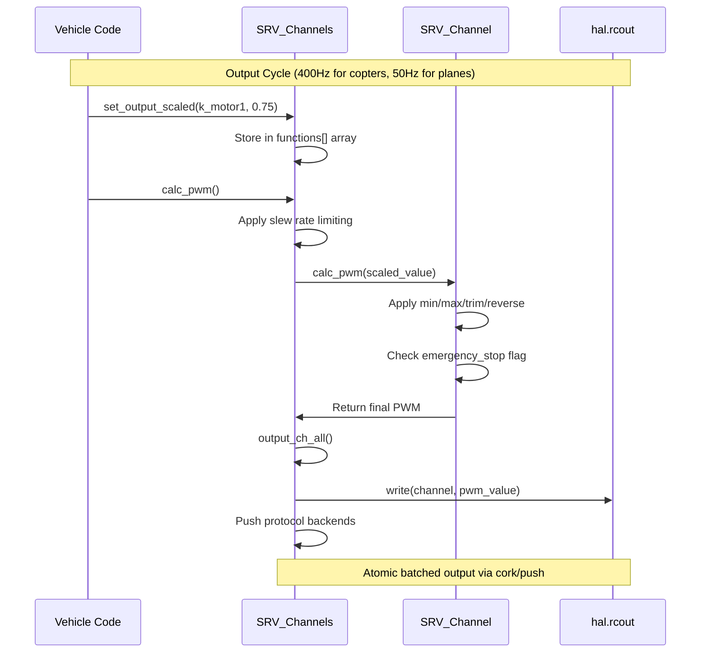

# SRV_Channel - Servo Channel Management

## Overview

The SRV_Channel library provides the servo/auxiliary output abstraction layer for ArduPilot, separating logical output functions (motors, control surfaces, camera triggers, etc.) from physical PWM channels. This enables flexible channel assignment, output scaling, and protocol support while maintaining vehicle-independent code.

**Key Responsibilities:**
- Map output functions to physical channels (k_motor1 → SERVO3, k_aileron → SERVO1)
- Convert scaled values (angles, ranges, normalized) to PWM microseconds
- Apply min/max/trim/reverse transformations per channel
- Manage protocol backends (PWM, OneShot, DShot, SBUS, Volz, BLHeli, FETtec OneWire)
- Coordinate safety mechanisms (emergency stop, failsafe values, disabled channels)
- Support servo testing without vehicle code

## Architecture

### Component Structure



### Data Flow Diagram



## Key Components

### SRV_Channel Class

**Purpose**: Represents an individual servo/PWM output channel with function assignment and scaling configuration.

**Lifecycle**: 
1. Initialization: Parameters loaded from EEPROM (SERVOn_FUNCTION, SERVOn_MIN, SERVOn_MAX, etc.)
2. Configuration: Vehicle code calls set_angle() or set_range() to define scaling mode
3. Runtime: Vehicle code writes scaled values, calc_pwm() converts to PWM, output_ch() writes to hardware
4. Shutdown: No special cleanup required

**Thread Safety**: Access coordinated through SRV_Channels manager semaphores. Individual channel methods are not thread-safe when called directly.

**Hardware Dependencies**: None directly - abstracts hardware through HAL RCOutput interface

**Key Members**:
- `servo_min/max/trim` (AP_Int16): PWM limits in microseconds (typically 1000-2000 μs)
- `reversed` (AP_Int8): Direction reversal flag (0=normal, 1=reversed)
- `function` (AP_Enum16<Function>): Assigned output function (motor, aileron, camera, etc.)
- `output_pwm` (uint16_t): Current output value in PWM microseconds
- `type_angle/type_setup` (bool): Scaling mode flags (angle vs range)
- `high_out` (uint16_t): Maximum value for scaled output

### SRV_Channels Manager Class

**Purpose**: Singleton manager coordinating all output channels, function-to-channel mapping, and protocol backends.

**Lifecycle**:
1. Construction: Initializes channel array and parameter groups
2. init(): Configures protocol drivers (Volz, SBUS, BLHeli, etc.) and DShot
3. Runtime: Provides function-based API, manages batched output, coordinates emergency stop
4. Shutdown: No explicit shutdown, managed by HAL

**Thread Safety**: Uses semaphores for override_counter access. Most methods are static and operate on singleton instance.

**Hardware Dependencies**: Depends on HAL RCOutput (hal.rcout) for hardware PWM generation

**Key Responsibilities**:
- Function-to-channel mapping via channel_mask bitmaps
- Multi-channel operations (set all motors, all flaps, etc.)
- Slew rate limiting for smooth servo motion
- Emergency stop coordination
- Protocol backend dispatch (DShot, BLHeli, Volz, SBUS, etc.)

## Output Function Types

The library supports ~190 output functions organized by category. Each function can be assigned to one or more physical channels via SERVOn_FUNCTION parameters.

### Motors (k_motor1 through k_motor32)

Multicopter and VTOL motor outputs for thrust control.

**Characteristics**:
- Range-based scaling (0 = off, max = full thrust)
- Auto-assigned based on frame type (quad: motors 1-4, hex: motors 1-6, etc.)
- Support throttle curves via AP_Motors library
- Emergency stop immediately cuts all motor outputs
- Integration with motor mixing and allocation

**Typical Usage**: Set by AP_Motors mixer, not directly by vehicle code
```cpp
// Motor outputs typically set through AP_Motors, not directly:
// AP_Motors handles mixing and calls:
SRV_Channels::set_output_scaled(SRV_Channel::k_motor1, 0.75);
```

### Control Surfaces

Fixed-wing and VTOL control surfaces for attitude control.

**Categories**:
- Primary surfaces: `k_aileron`, `k_elevator`, `k_rudder`
- Flaps: `k_flap`, `k_flap_auto`
- Mixed surfaces: `k_flaperon_left/right`, `k_elevon_left/right`, `k_vtail_left/right`
- Differential spoilers: `k_dspoilerLeft1/2`, `k_dspoilerRight1/2`
- Airbrake: `k_airbrake`

**Characteristics**:
- Angle-based scaling around trim point (e.g., ±45° for ailerons)
- Support differential mixing for elevons, flaperons, v-tail
- Trim adjustable in flight (auto-trim mode)

**Example**:
```cpp
// Set aileron to 30 degrees right
SRV_Channels::set_angle(SRV_Channel::k_aileron, 4500); // ±45° range
SRV_Channels::set_output_scaled(SRV_Channel::k_aileron, 3000); // 30° right
```

### Camera/Gimbal Control

Camera trigger and gimbal stabilization outputs.

**Functions**:
- Mount 1: `k_mount_pan`, `k_mount_tilt`, `k_mount_roll`, `k_mount_open`
- Mount 2: `k_mount2_pan`, `k_mount2_tilt`, `k_mount2_roll`, `k_mount2_open`
- Camera controls: `k_cam_trigger`, `k_cam_iso`, `k_cam_aperture`, `k_cam_focus`, `k_cam_shutter_speed`, `k_cam_zoom`

**Characteristics**:
- Angle-based for pan/tilt/roll (gimbal stabilization)
- Range-based or binary for trigger and camera settings
- Integration with AP_Mount for MAVLink gimbal control

### Actuators (k_actuator1 through k_actuator6)

General-purpose actuator outputs for peripherals.

**Common Uses**:
- Gripper: `k_gripper` (open/close cargo gripper)
- Parachute: `k_parachute_release` (deploy emergency parachute)
- Landing gear: `k_landing_gear_control` (retract/deploy gear)
- Winch: `k_winch`, `k_winch_clutch` (payload winch control)

**Characteristics**:
- Binary (two-position) or range-based control
- Often used with mission commands (DO_GRIPPER, DO_PARACHUTE)
- Default slew rate: 0.01 per loop cycle (ACTUATOR_DEFAULT_INCREMENT)

### RC Pass-through

Direct RC input to servo output mapping.

**Categories**:
- `k_manual` (deprecated): Traditional manual control
- `k_rcin1` through `k_rcin16`: Direct pass-through without scaling
- `k_rcin1_mapped` through `k_rcin16_mapped`: Pass-through with min/max/trim applied

**Use Cases**:
- Auxiliary switches and knobs (lights, camera pan)
- Trainer mode (instructor override)
- Manual override in autonomous modes

### Scripting Outputs (k_scripting1 through k_scripting16)

Lua script-controlled outputs for custom logic.

**Characteristics**:
- Full control from Lua scripts via servo binding
- Allow custom control algorithms without C++ code changes
- Range or angle scaling as configured

**Example Lua**:
```lua
-- Control scripting output 1
local SERVO_SCRIPTING1 = 94
SRV_Channels:set_output_pwm(SERVO_SCRIPTING1, 1500)
```

### Special Functions

**Testing and Calibration**:
- `k_min`: Always output SERVOn_MIN (full reverse or minimum)
- `k_max`: Always output SERVOn_MAX (full forward or maximum)
- `k_trim`: Always output SERVOn_TRIM (neutral position)

**GPIO**:
- `k_GPIO = -1`: Use pin as digital I/O (not PWM output)

**Alarms**:
- `k_alarm`: Audible alert output (active high)
- `k_alarm_inverted`: Audible alert (active low)

**Disabled**:
- `k_none = 0`: Disabled or generic PWM (target for DO_SET_SERVO mission commands)

## Configuration Parameters

### Per-Channel Parameters (SERVOn_*)

Each output channel (SERVO1 through SERVO16 or SERVO32 depending on board) has these parameters:

| Parameter | Description | Default | Range | Units |
|-----------|-------------|---------|-------|-------|
| SERVOn_FUNCTION | Output function assignment | 0 (Disabled) | -1 to 189 | enum |
| SERVOn_MIN | Minimum PWM output | 1100 | 800-2200 | μs |
| SERVOn_MAX | Maximum PWM output | 1900 | 800-2200 | μs |
| SERVOn_TRIM | Neutral/center PWM output | 1500 | 800-2200 | μs |
| SERVOn_REVERSED | Direction reversal flag | 0 (Normal) | 0-1 | boolean |

**Parameter Naming**: Parameters use "SERVO" prefix to distinguish from RC input channels (which use "RC" prefix). The underlying variable names in code use "servo_min", "servo_max", etc.

**Function Assignment Examples**:
```
SERVO1_FUNCTION = 4   # Aileron
SERVO2_FUNCTION = 19  # Elevator  
SERVO3_FUNCTION = 21  # Rudder
SERVO4_FUNCTION = 70  # Throttle

SERVO5_FUNCTION = 33  # Motor 1 (copter)
SERVO6_FUNCTION = 34  # Motor 2
SERVO7_FUNCTION = 35  # Motor 3
SERVO8_FUNCTION = 36  # Motor 4
```

### Global Servo Parameters (SERVO_*)

System-wide configuration affecting all channels:

| Parameter | Description | Default | Range | Units |
|-----------|-------------|---------|-------|-------|
| SERVO_RATE | Default servo update rate | 50 | 10-400 | Hz |
| SERVO_DSHOT_RATE | DShot update rate | 0 (disabled) | 0-4 | enum |
| SERVO_DSHOT_ESC | DShot ESC type | 0 (generic) | 0-3 | enum |
| SERVO_BLH_MASK | BLHeli passthrough enable mask | 0 | 0-65535 | bitmask |
| SERVO_BLH_PORT | BLHeli serial port | 0 | 0-7 | enum |
| SERVO_FTW_MASK | FETtec OneWire enable mask | 0 | 0-65535 | bitmask |
| SERVO_FTW_PORT | FETtec OneWire serial port | 0 | 0-7 | enum |
| SERVO_VOLZ_MASK | Volz protocol enable mask | 0 | 0-65535 | bitmask |
| SERVO_SBUS_RATE | SBUS output rate | 50 | 25-250 | Hz |
| SERVO_ROB_POSMIN | Robotis servo minimum position | 0 | 0-4095 | ticks |
| SERVO_ROB_POSMAX | Robotis servo maximum position | 4095 | 0-4095 | ticks |

**DShot Rate Values** (SERVO_DSHOT_RATE):
- 0: Disabled (standard PWM)
- 1: 150 Hz
- 2: 300 Hz
- 3: 600 Hz
- 4: 1200 Hz

**DShot ESC Types** (SERVO_DSHOT_ESC):
- 0: Generic/Unknown
- 1: BLHeli32
- 2: BLHeli_S
- 3: KISS

### Typical Servo Configurations

**Standard Servo** (e.g., control surface):
```
SERVO1_FUNCTION = 4      # Aileron
SERVO1_MIN = 1000        # Full left deflection
SERVO1_MAX = 2000        # Full right deflection
SERVO1_TRIM = 1500       # Neutral/center
SERVO1_REVERSED = 0      # Normal direction
```

**ESC/Motor** (electronic speed controller):
```
SERVO5_FUNCTION = 33     # Motor 1
SERVO5_MIN = 1000        # Motor stop/minimum
SERVO5_MAX = 2000        # Full throttle
SERVO5_TRIM = 1000       # Idle (not used for motors)
SERVO5_REVERSED = 0      # Normal direction
```

**Reversed Servo** (when mechanical installation requires reversal):
```
SERVO2_FUNCTION = 19     # Elevator
SERVO2_MIN = 1000        # Physical limit
SERVO2_MAX = 2000        # Physical limit
SERVO2_TRIM = 1500       # Neutral
SERVO2_REVERSED = 1      # REVERSED - swaps min/max in software
```

**Digital Servo** (high-speed update):
```
SERVO3_FUNCTION = 21     # Rudder
SERVO3_MIN = 1000
SERVO3_MAX = 2000
SERVO3_TRIM = 1500
SERVO_RATE = 200         # 200 Hz update (if supported by servo)
```

## Channel Assignment Patterns

### Auto-Assignment by Vehicle Type

ArduPilot automatically assigns functions to channels based on vehicle type and frame configuration:

**Copter (Quad X frame)**:
```
SERVO1: Motor 1 (front-right)
SERVO2: Motor 2 (rear-left)
SERVO3: Motor 3 (front-left)
SERVO4: Motor 4 (rear-right)
SERVO5-8: Auxiliary functions (camera, gripper, etc.)
```

**Plane (Standard)**:
```
SERVO1: Aileron
SERVO2: Elevator
SERVO3: Throttle
SERVO4: Rudder
SERVO5-8: Flaps, airbrakes, etc.
```

**Rover (Skid-Steering)**:
```
SERVO1: Steering (left motor)
SERVO3: Throttle (right motor)
SERVO4-8: Auxiliary
```

### Manual Override

Users can override auto-assignment by changing SERVOn_FUNCTION parameters:

**Example: Move Motor 1 from SERVO1 to SERVO5**:
```
SERVO1_FUNCTION = 0      # Disable SERVO1
SERVO5_FUNCTION = 33     # Motor 1 on SERVO5
```

**Multi-Channel Functions**: Some functions can be assigned to multiple channels:
```
SERVO1_FUNCTION = 4      # Aileron on SERVO1
SERVO2_FUNCTION = 4      # Aileron on SERVO2 (dual ailerons)
```
Both channels receive the same scaled output value, but each has independent min/max/trim/reverse configuration.

## PWM Output Generation and Timing

### Conversion Methods

The library provides multiple conversion methods for scaled values to PWM:

#### 1. Range-Based Conversion (0 to high)

Used for throttle and motor outputs where zero is a meaningful minimum.

**Algorithm** (pwm_from_range):
```cpp
// Maps [0, high_out] → [servo_min, servo_max]
// Honors reverse flag (swaps min/max if reversed)
float scale = (scaled_value - 0) / (high_out - 0);
uint16_t pwm = servo_min + scale * (servo_max - servo_min);
if (reversed) {
    pwm = servo_max + servo_min - pwm;  // Invert
}
pwm = constrain(pwm, 800, 2200);  // Safety limits
```

**Example**:
- Motor configured: set_range(1000), min=1000, max=2000
- Input: 750 (75% throttle)
- Output: 1750 μs PWM

#### 2. Angle-Based Conversion (-angle to +angle)

Used for control surfaces where symmetric deflection around center is required.

**Algorithm** (pwm_from_angle):
```cpp
// Maps [-high_out, +high_out] → [servo_min, servo_max] around servo_trim
if (scaled_value > 0) {
    // Positive: interpolate trim to max
    scale = scaled_value / high_out;
    pwm = servo_trim + scale * (servo_max - servo_trim);
} else {
    // Negative: interpolate min to trim
    scale = -scaled_value / high_out;
    pwm = servo_trim - scale * (servo_trim - servo_min);
}
if (reversed) {
    pwm = servo_max + servo_min - pwm;
}
pwm = constrain(pwm, 800, 2200);
```

**Example**:
- Aileron configured: set_angle(4500) // ±45°, min=1000, max=2000, trim=1500
- Input: 2250 (22.5° right, 50% of max)
- Output: 1750 μs PWM (halfway between trim and max)

#### 3. Normalized Conversion (-1 to +1)

Used for direct normalized control.

**Algorithm** (set_output_norm):
```cpp
// Maps [-1, +1] → [servo_min, servo_max] around servo_trim
if (value > 0) {
    pwm = servo_trim + value * (servo_max - servo_trim);
} else {
    pwm = servo_trim + value * (servo_trim - servo_min);
}
// Apply reverse if needed
```

### Update Rates

Output update rates vary by vehicle type and protocol:

| Vehicle/Protocol | Typical Rate | Configuration |
|------------------|--------------|---------------|
| Copter motors (standard PWM) | 400 Hz | AP_MOTORS_FREQ |
| Copter motors (DShot) | 150-1200 Hz | SERVO_DSHOT_RATE |
| Plane control surfaces | 50 Hz | SERVO_RATE |
| Plane motors | 50 Hz | SERVO_RATE |
| Rover servos | 50 Hz | SERVO_RATE |
| Digital servos | 200-400 Hz | SERVO_RATE (if supported) |
| BLHeli ESCs | Per protocol | BLHeli update rate |
| Volz servos | 50-200 Hz | Volz protocol spec |

**Rate Limiting**: Update rates are hardware-limited by:
- HAL RCOutput capabilities (timer resolution, DMA channels)
- Board design (shared timer channels limit independent rates)
- Protocol overhead (DShot, SBUS require specific timing)

### Batched Output (Cork/Push)

For atomic multi-channel updates:

```cpp
// Begin atomic output block
SRV_Channels::cork();

// Set multiple outputs
SRV_Channels::set_output_pwm(SRV_Channel::k_motor1, 1500);
SRV_Channels::set_output_pwm(SRV_Channel::k_motor2, 1500);
SRV_Channels::set_output_pwm(SRV_Channel::k_motor3, 1500);
SRV_Channels::set_output_pwm(SRV_Channel::k_motor4, 1500);

// Commit all outputs simultaneously
SRV_Channels::push();
```

This ensures all outputs update simultaneously, critical for motor synchronization.

## Servo Configuration and Limits

### Servo Calibration Procedure

**Method 1: Manual Calibration**

1. **Set function temporarily to k_manual or k_rcin1** (pass-through mode)
2. **Move RC stick to extremes** and observe servo travel
3. **Adjust SERVOn_MIN/MAX** to limit travel to mechanical limits
4. **Center stick and adjust SERVOn_TRIM** for neutral position
5. **Test SERVOn_REVERSED** if servo moves opposite to desired
6. **Restore original SERVOn_FUNCTION**

**Method 2: Automatic Range Detection** (used during motor calibration):

```cpp
// ESC calibration sequence
SRV_Channels::set_output_pwm(SRV_Channel::k_motor1, 2000);  // Max
delay(3000);
SRV_Channels::set_output_pwm(SRV_Channel::k_motor1, 1000);  // Min
delay(3000);
// ESC learns range, saves to SERVOn_MIN/MAX
```

### Typical PWM Values

| Servo/ESC Type | MIN (μs) | TRIM (μs) | MAX (μs) | Notes |
|----------------|----------|-----------|----------|-------|
| Standard analog servo | 1000 | 1500 | 2000 | Most common |
| Digital servo (narrow) | 1100 | 1500 | 1900 | Limited travel |
| Digital servo (wide) | 900 | 1500 | 2100 | Extended travel |
| ESC (standard) | 1000 | 1000 | 2000 | Trim = min (no neutral) |
| ESC (narrow) | 1100 | 1100 | 1900 | Safety margin |
| Futaba servo | 1000 | 1520 | 2000 | Offset center |
| Spektrum servo | 1100 | 1500 | 1900 | Reduced range |

**Safety Margins**: Many users configure 1100-1900 μs instead of 1000-2000 μs to avoid servo binding at extremes.

### Servo Reversal

**When to Reverse**:
- Servo mechanically installed opposite to expected direction
- Control surface moves opposite to commanded direction
- Motor spins opposite direction (for vehicles supporting reversible thrust)

**Configuration**:
```
SERVO1_REVERSED = 1      # Reverses servo direction in software
```

**Effect**: Swaps servo_min and servo_max in PWM calculations. A command for "maximum" outputs servo_min PWM, and vice versa.

**Testing Reversal**: Use ground station servo test or RC pass-through to verify correct direction after setting REVERSED flag.

## Testing Servo Outputs

### Method 1: MAVLink Servo Test Command

Ground control stations (Mission Planner, QGroundControl) provide servo test functions:

**Mission Planner**:
1. Connect to vehicle
2. Go to "Setup → Optional Hardware → Servo Output"
3. Select channel and move slider to test
4. Observe servo movement and verify min/max limits

**QGroundControl**:
1. Connect to vehicle
2. Go to "Vehicle Setup → Actuators"
3. Use sliders to test each channel
4. Identify and configure each output

**Command**: MAVLink `DO_SET_SERVO` command:
```
MAVLink command: DO_SET_SERVO
  param1: servo number (1-16)
  param2: PWM value (800-2200)
```

### Method 2: Scripting Servo Test

Lua script example for testing:

```lua
-- Sweep SERVO1 from min to max over 3 seconds
local servo_num = 1
local min_pwm = 1000
local max_pwm = 2000
local duration_ms = 3000

function update()
    local elapsed = millis() % duration_ms
    local pwm = min_pwm + (max_pwm - min_pwm) * (elapsed / duration_ms)
    SRV_Channels:set_output_pwm(servo_num, pwm)
    return update, 10  -- Call again in 10ms
end

return update()
```

### Method 3: RC Switch Servo Test Mode

Configure RC switch to enable servo test mode:

```
RC7_OPTION = 42  # Servo test/RC pass-through
```

When switch active:
- All servos enter pass-through mode
- RC channel 1-8 directly control SERVO1-8
- Allows manual testing without ground station

### Method 4: Mission Command Testing

Use DO_SET_SERVO mission commands in AUTO mode:

```
Mission waypoint:
  Command: DO_SET_SERVO
  Servo: 5
  PWM: 1800
  
Next waypoint:
  Command: DELAY
  Time: 3 seconds
  
Next waypoint:
  Command: DO_SET_SERVO
  Servo: 5
  PWM: 1200
```

This tests servo actuation during autonomous flight.

### Bench Test Sequence

**Safe Bench Testing** (without props/blades):

1. **Remove propellers/blades** - CRITICAL safety step
2. **Connect battery** with current limiting or low voltage
3. **Arm vehicle** in STABILIZE (copter) or MANUAL (plane) mode
4. **Move RC sticks** and observe servo responses
5. **Test failsafe**: Disconnect RC and verify failsafe outputs
6. **Test emergency stop**: Trigger e-stop and verify motor cutoff
7. **Disarm vehicle**
8. **Verify no movement when disarmed**

**SITL Testing** (simulation):

```bash
# Start SITL simulator
sim_vehicle.py -v Copter --console --map

# In MAVProxy console:
servo set 1 1500    # Test SERVO1
servo set 2 1700    # Test SERVO2

# Test with RC pass-through:
rc 1 1800           # Move RC channel 1
rc 3 1600           # Move RC channel 3 (throttle)
```

## Integration with Vehicle Mixers

### Copter Integration

**Motor Mixer** (AP_Motors library):

```cpp
// Copter main loop (400Hz):
void Copter::run_rate_controller() {
    // Attitude controller computes desired motor outputs
    attitude_control->rate_controller_run();
    
    // Motors mixer converts attitude commands to individual motor outputs
    motors->output();  // Internally calls SRV_Channels::set_output_scaled()
}

// Inside AP_MotorsMulticopter::output_armed_stabilizing():
void AP_MotorsMulticopter::output_armed_stabilizing() {
    // Compute motor mixing (converts roll/pitch/yaw/throttle to motor outputs)
    float out[AP_MOTORS_MAX_NUM_MOTORS];
    thrust_mix(out);
    
    // Write to SRV_Channels
    for (uint8_t i = 0; i < AP_MOTORS_MAX_NUM_MOTORS; i++) {
        SRV_Channels::set_output_scaled(
            SRV_Channel::get_motor_function(i),  // k_motor1, k_motor2, etc.
            out[i] * 1000.0f                      // Scale to 0-1000 range
        );
    }
    
    // Convert scaled values to PWM and output
    SRV_Channels::calc_pwm();
    SRV_Channels::output_ch_all();
}
```

**Aux Functions** (camera, gripper, etc.):

```cpp
// Copter aux output update (called at lower rate, typically 50Hz):
void Copter::update_aux() {
    // Camera trigger
    if (camera.is_triggering()) {
        SRV_Channels::set_output_pwm(SRV_Channel::k_cam_trigger, 2000);
    } else {
        SRV_Channels::set_output_pwm(SRV_Channel::k_cam_trigger, 1000);
    }
    
    // Gripper control
    SRV_Channels::set_output_scaled(SRV_Channel::k_gripper, gripper.get_position());
}
```

### Plane Integration

**Control Surface Mixer**:

```cpp
// Plane main loop (50Hz):
void Plane::set_servos() {
    // Compute control surface deflections
    float aileron = channel_roll->norm_input() * g.flap_slewrate;
    float elevator = channel_pitch->norm_input();
    float rudder = channel_rudder->norm_input();
    
    // Apply to SRV_Channels with configured angles
    SRV_Channels::set_output_scaled(SRV_Channel::k_aileron, aileron * 4500);  // ±45°
    SRV_Channels::set_output_scaled(SRV_Channel::k_elevator, elevator * 4500);
    SRV_Channels::set_output_scaled(SRV_Channel::k_rudder, rudder * 4500);
    
    // Flaps with automatic deployment
    float flap_percent = flap_input_control();
    SRV_Channels::set_output_scaled(SRV_Channel::k_flap, flap_percent * 100);
    
    // Throttle
    SRV_Channels::set_output_scaled(SRV_Channel::k_throttle, 
                                     SRV_Channels::get_output_scaled(SRV_Channel::k_throttle));
    
    // Convert and output
    SRV_Channels::calc_pwm();
    SRV_Channels::output_ch_all();
}
```

**Differential Mixing** (elevons):

```cpp
// Elevon mixing: combines aileron and elevator into left/right elevons
void Plane::set_servos_elevons() {
    float aileron = channel_roll->norm_input();
    float elevator = channel_pitch->norm_input();
    
    float elevon_left = (elevator + aileron) * 4500;   // Sum for left
    float elevon_right = (elevator - aileron) * 4500;  // Difference for right
    
    SRV_Channels::set_output_scaled(SRV_Channel::k_elevon_left, elevon_left);
    SRV_Channels::set_output_scaled(SRV_Channel::k_elevon_right, elevon_right);
}
```

### Rover Integration

**Steering and Throttle**:

```cpp
// Rover output update:
void Rover::set_servos() {
    // Steering control (-4500 to +4500 representing ±45° or similar)
    float steering = g2.attitude_control.get_steering_out();
    SRV_Channels::set_output_scaled(SRV_Channel::k_steering, steering);
    
    // Throttle control (0-100% for forward, -100-0% for reverse if supported)
    float throttle = g2.attitude_control.get_throttle_out();
    SRV_Channels::set_output_scaled(SRV_Channel::k_throttle, throttle);
    
    // For skid-steering (differential drive):
    // SRV_Channels::set_output_scaled(SRV_Channel::k_throttleLeft, left_throttle);
    // SRV_Channels::set_output_scaled(SRV_Channel::k_throttleRight, right_throttle);
    
    SRV_Channels::calc_pwm();
    SRV_Channels::output_ch_all();
}
```

## Protocol Backends

SRV_Channel supports multiple output protocols beyond standard PWM:

### Standard PWM

**Description**: Traditional RC servo protocol (50 Hz, 1-2 ms pulse width)

**Configuration**: Default, no special parameters needed

**Characteristics**:
- Update rate: 50-400 Hz (configurable via SERVO_RATE)
- Pulse width: 1000-2000 μs (extended range: 800-2200 μs)
- Compatible with all standard servos and ESCs

### DShot (Digital Shot)

**Description**: Digital ESC protocol with error checking and bidirectional communication

**Configuration**:
```
SERVO_DSHOT_RATE = 2    # 300 Hz (1=150Hz, 2=300Hz, 3=600Hz, 4=1200Hz)
SERVO_DSHOT_ESC = 1     # BLHeli32 (0=generic, 1=BLHeli32, 2=BLHeli_S)
```

**Advantages**:
- Digital protocol eliminates analog timing jitter
- Higher update rates (150-1200 Hz)
- Bidirectional telemetry (RPM, temperature, voltage)
- Supports 3D (reversible) mode
- Supports motor beeps and LED commands

**Limitations**:
- Requires DShot-compatible ESCs
- Not compatible with servos
- Board-dependent (requires DMA support)

**Usage**:
```cpp
// Motors automatically use DShot if configured
// No code changes required in vehicle
```

### SBUS Output

**Description**: Futaba SBUS protocol for serial servo communication

**Configuration**:
```
SERVO_SBUS_RATE = 50        # 50 Hz typical
SERIAL1_PROTOCOL = 15       # SBUS output on SERIAL1
```

**Use Case**: Control multiple servos over single serial connection (reduced wiring)

### Volz Protocol

**Description**: Serial protocol for Volz actuators (high-torque servos)

**Configuration**:
```
SERVO_VOLZ_MASK = 15        # Enable channels 1-4 (bitmask)
SERIAL2_PROTOCOL = 36       # Volz protocol on SERIAL2
```

**Characteristics**:
- High precision (0.1° resolution)
- High torque actuators
- Serial daisy-chain connection

### BLHeli Passthrough

**Description**: Allows BLHeliSuite configuration of ESCs through flight controller

**Configuration**:
```
SERVO_BLH_MASK = 15         # ESCs on channels 1-4
SERVO_BLH_PORT = 1          # Use SERIAL1 for passthrough
```

**Use Case**: Configure ESC parameters (timing, direction, braking) without direct ESC connection

**Warning**: Disables normal flight operations during passthrough - only use on bench

### FETtec OneWire

**Description**: FETtec ESC protocol over single-wire serial connection

**Configuration**:
```
SERVO_FTW_MASK = 255        # All 8 motors
SERVO_FTW_PORT = 7          # Serial port for OneWire
```

**Advantages**:
- Reduced wiring (one wire for multiple ESCs)
- Bidirectional telemetry
- Fast update rates

## Safety Considerations

### Emergency Stop

**Trigger Conditions**:
- Crash detected (hard impact, loss of control)
- Manual emergency stop (RC switch or GCS command)
- Critical failsafe (loss of all position estimate, fence breach with action=terminate)

**Behavior**:
```cpp
SRV_Channels::set_emergency_stop(true);
```

**Effects**:
- All motors (k_motor1 through k_motor32) immediately set to zero PWM
- Dangerous actuators stopped (winch, etc.)
- Control surfaces NOT affected (needed for glide recovery)
- Camera/gimbal NOT affected (not dangerous)
- Parachute NOT affected (needed for deployment)

**Recovery**:
```cpp
SRV_Channels::set_emergency_stop(false);  // Clears e-stop, motors can spin again
```

**Testing**: Trigger emergency stop with `MOTORS_EMERGENCY_STOPPED` MAVLink command or via crash detection in SITL

### Failsafe Values

**Configuration**: Set per-function failsafe outputs for RC loss:

```cpp
// Set motor failsafe to zero (stop)
SRV_Channels::set_failsafe_pwm(SRV_Channel::k_motor1, 1000);

// Set control surface failsafe to trim (neutral)
SRV_Channels::set_failsafe_limit(SRV_Channel::k_aileron, SRV_Channel::Limit::TRIM);
```

**Failsafe Behavior**:
- RC signal lost → Outputs switch to configured failsafe values
- RC signal restored → Outputs resume normal control
- Vehicle performs RTL (Return to Launch) or LAND during failsafe

### Disabled Channel Mask

**Purpose**: Temporarily disable outputs (used during ESC calibration, BLHeli passthrough)

```cpp
// Disable channels 1-4 (motors) during passthrough
SRV_Channels::set_disabled_channel_mask(0x0F);  // Bitmask: 0000 1111

// Re-enable all channels
SRV_Channels::set_disabled_channel_mask(0);
```

**Effect**: Disabled channels output zero PWM regardless of commanded values

**Safety**: Always disable motor channels before BLHeli passthrough to prevent accidental spin-up

### Output Constraints

**Hardware Limits**: All PWM outputs constrained to 800-2200 μs regardless of configuration to prevent:
- Servo binding (mechanical over-travel)
- ESC confusion (out-of-range signals)
- Hardware damage

**Slew Rate Limiting**: Prevents rapid servo movements that could cause mechanical stress or oscillation:

```cpp
// Limit flap movement to 10% per second
SRV_Channels::set_slew_rate(SRV_Channel::k_flap, 10.0, 100, 0.01);
//                           function    rate%/s  range  dt
```

## Common Issues and Troubleshooting

### Problem: Servo Moves Opposite Direction

**Symptoms**: Control surface or motor moves opposite to commanded direction

**Diagnosis**:
1. Check actual servo movement vs commanded direction in ground station
2. Verify function assignment (correct FUNCTION enum)

**Solutions**:
- **Solution 1**: Set `SERVOn_REVERSED = 1` to reverse in software
- **Solution 2**: Physically flip servo arm or reverse mechanical linkage (preferred for permanent install)

**Testing**: Use ground station servo test to verify correction

### Problem: Insufficient Servo Travel / Range

**Symptoms**: Servo doesn't reach full deflection, control authority limited

**Diagnosis**:
1. Check current PWM range: SERVOn_MIN and SERVOn_MAX
2. Test with wider range (e.g., 1000-2000 instead of 1100-1900)
3. Physically verify servo doesn't bind at extremes

**Solutions**:
- Increase SERVOn_MAX and decrease SERVOn_MIN (within safe mechanical limits)
- For digital servos: Check if servo supports extended range (800-2200 μs)
- For control surfaces: Increase angle configuration in vehicle code

**Warning**: Do not exceed mechanical limits - servo binding causes high current draw and damage

### Problem: ESC Not Arming

**Symptoms**: Motors don't spin when armed, ESC doesn't beep

**Diagnosis**:
1. Check ESC calibration: Does ESC recognize min/max PWM range?
2. Verify SERVOn_MIN matches ESC minimum (typically 1000 μs)
3. Check arming sequence: Does ESC receive signal before arming?

**Solutions**:
- **Calibrate ESC**: Set outputs to max (2000 μs), power on ESC, set to min (1000 μs)
- **Verify SERVOn_FUNCTION**: Must be set to k_motor* (33-40, 82-85, 160-179)
- **Check protocol**: Some ESCs require specific protocols (DShot, OneShot)
- **Verify ESC compatibility**: Standard PWM ESCs need 50 Hz, not 400 Hz

### Problem: Servo Jitter / Oscillation

**Symptoms**: Servo vibrates or oscillates rapidly around target position

**Diagnosis**:
1. Check update rate: Too fast for analog servo?
2. Verify signal quality: Electrical noise on signal wire?
3. Check deadband: Small jitter being amplified by servo response?

**Solutions**:
- **Reduce update rate**: `SERVO_RATE = 50` for analog servos
- **Add RC filter**: 100 Ω resistor + 100 nF capacitor on servo signal line (hardware)
- **Enable ignore_small_rcin_changes**: For pass-through channels
- **Check power supply**: Insufficient current causes voltage drops and signal corruption

### Problem: DShot Not Working

**Symptoms**: Motors don't spin with DShot configured, or revert to PWM

**Diagnosis**:
1. Check board compatibility: Does board support DShot on these channels?
2. Verify ESC compatibility: Does ESC support DShot protocol?
3. Check timer conflicts: Some boards share timers between channels

**Solutions**:
- **Verify SERVO_DSHOT_RATE is non-zero**: 0 = disabled, 1-4 = DShot enabled
- **Check channel grouping**: DShot channels must be on same timer group (board-specific)
- **Flash ESC firmware**: Ensure ESC has DShot-compatible firmware (BLHeli32, BLHeli_S)
- **Review board documentation**: Some boards have limited DShot channels

**Testing in SITL**: DShot not simulated in SITL - test on real hardware

## Implementation Notes

### Design Decisions

**Separation of Function and Channel**:
- **Rationale**: Allows flexible channel assignment without changing vehicle code
- **Trade-off**: Indirection adds slight performance cost, but enables configuration flexibility

**Min/Max/Trim/Reverse Parameters**:
- **Rationale**: Matches traditional RC parameter naming (RCn_MIN, RCn_MAX, etc.) for familiarity
- **Trade-off**: Separation of input (RC) and output (SERVO) parameters can be confusing for new users

**Static vs Instance Methods**:
- **Rationale**: Most methods are static for convenient access without passing singleton reference
- **Trade-off**: Harder to mock/test, but simplifies caller code

**Function Enum Stability**:
- **Rationale**: Enum values stored in parameters, must never change (backward compatibility)
- **Constraint**: New functions added only at end (before k_nr_aux_servo_functions)

### Known Limitations

**Maximum 32 Channels**:
- **Reason**: Bitmask operations use uint32_t (32 bits)
- **Impact**: Large aircraft with >32 outputs need custom builds or channel sharing
- **Workaround**: Use multiple outputs per function (e.g., dual ailerons share same function)

**Single Protocol Per Channel**:
- **Reason**: Hardware timers can't simultaneously generate multiple protocols
- **Impact**: Can't mix DShot and PWM on same timer group
- **Workaround**: Use separate timer groups for different protocols

**No True Multi-Threading**:
- **Reason**: Semaphores protect critical sections, but not full thread safety
- **Impact**: External threads must use SRV_Channels API carefully
- **Workaround**: Use override mechanism for external control, call from main thread

**Parameter Namespace Limits**:
- **Reason**: AP_Param limits parameters per group to 64
- **Impact**: SRV_Channel and SRV_Channels split into separate parameter groups
- **Workaround**: Accepted limitation, not user-visible

### Thread Safety

**Safe Operations** (from any thread):
- `set_output_pwm_chan_timeout()` - Uses semaphore for override_counter
- `get_output_pwm()` - Read-only operations

**Unsafe Operations** (must call from main thread):
- `set_output_scaled()` - Modifies functions[] array without lock
- `calc_pwm()` - Modifies channel state
- `output_ch_all()` - Hardware access

**Recommendation**: External threads should use timeout-based override mechanism rather than direct output methods

## References

### Source Files

- **libraries/SRV_Channel/SRV_Channel.h** - Class declarations, Function enum, API surface
- **libraries/SRV_Channel/SRV_Channel.cpp** - Per-channel methods, parameter setup, conversion math
- **libraries/SRV_Channel/SRV_Channel_aux.cpp** - Aux functions, output logic, passthrough
- **libraries/SRV_Channel/SRV_Channels.cpp** - Manager singleton, protocol backends, bulk operations
- **libraries/SRV_Channel/SRV_Channel_config.h** - Compile-time configuration (NUM_SERVO_CHANNELS, etc.)

### Related Modules

- **AP_Motors** (libraries/AP_Motors/) - Motor mixing for multirotors, helicopters
- **AP_MotorsMulticopter** - Multicopter thrust allocation
- **AP_MotorsHeli** - Helicopter swashplate mixing
- **SRV_Channel backends**:
  - **AP_Volz_Protocol** (libraries/AP_Volz_Protocol/) - Volz actuator protocol
  - **AP_BLHeli** (libraries/AP_BLHeli/) - BLHeli ESC passthrough
  - **AP_FETtecOneWire** (libraries/AP_FETtecOneWire/) - FETtec OneWire ESC protocol
  - **AP_SBusOut** (libraries/AP_SBusOut/) - SBUS output protocol
  - **AP_RobotisServo** (libraries/AP_RobotisServo/) - Robotis servo protocol
- **AP_Mount** (libraries/AP_Mount/) - Camera gimbal control (uses SRV_Channel for output)
- **AP_Gripper** (libraries/AP_Gripper/) - Gripper control
- **RC_Channel** (libraries/RC_Channel/) - RC input (separate from SRV_Channel output)
- **AP_HAL RCOutput** (libraries/AP_HAL/RCOutput.h) - Hardware abstraction for PWM generation

### External Documentation

- **ArduPilot Wiki**: https://ardupilot.org/plane/docs/servo-functions.html
- **DShot Protocol**: https://blck.mn/dshot-esc-protocol/
- **SBUS Protocol**: https://www.futabarc.com/sbus/
- **Volz Actuators**: https://www.volz-servos.com/en/

### Testing References

- **SITL Simulation**: sim_vehicle.py with --console for servo testing
- **MAVProxy Commands**: `servo set <channel> <pwm>`, `rc <channel> <pwm>`
- **Mission Planner**: Setup → Optional Hardware → Servo Output
- **QGroundControl**: Vehicle Setup → Actuators

---

**Last Updated**: 2025 (Documentation created per ArduPilot documentation initiative)

**Maintainers**: ArduPilot development team

**License**: GPLv3 (consistent with ArduPilot project)

