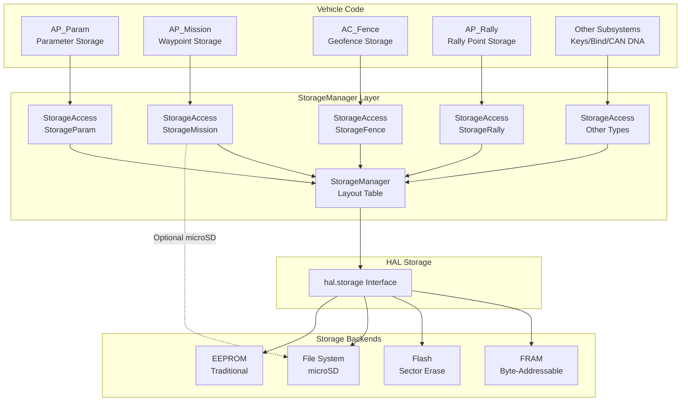

# StorageManager

## Overview

The StorageManager library provides a backwards-compatible storage abstraction layer for ArduPilot, managing non-volatile storage across diverse hardware platforms with varying storage capacities. It maps logical storage regions (parameters, missions, fences, rally points, etc.) to physical storage locations, allowing firmware to maintain compatibility with existing stored data while adapting to different board capabilities ranging from 1KB peripheral boards to 32KB+ flight controllers.

**Key Responsibilities**:
- Maintain backwards-compatible logical-to-physical storage address mapping
- Allocate storage regions for different data types (parameters, missions, fences, rally points, keys, binding info, CAN DNA, parameter backups)
- Provide unified read/write API across heterogeneous storage backends (FRAM, EEPROM, flash, file-based)
- Support optional microSD-based storage expansion with write buffering and dirty page tracking
- Monitor storage health and manage write failures gracefully

## Architecture



**Design Principles**:
- **Backwards Compatibility**: Storage layouts carefully designed to preserve existing data across firmware updates
- **Abstraction**: Vehicle code unaware of physical storage implementation details
- **Flexibility**: Adapts layout based on board storage capacity (HAL_STORAGE_SIZE)
- **Safety**: Provides storage health monitoring and failure reporting to prevent data corruption

## Key Components

### StorageManager Class

**Purpose**: Holds the static layout table mapping storage types to physical offsets and manages storage health state.

**Key Members**:
- `layout[]`: Static array of StorageArea structures defining the memory map
- `last_io_failed`: Global storage failure flag to prevent retry storms
- `StorageType` enum: Defines storage region types (StorageParam, StorageMission, StorageFence, StorageRally, StorageKeys, StorageBindInfo, StorageCANDNA, StorageParamBak)

**Key Methods**:
- `erase()`: Factory reset - erases entire storage (⚠️ **DESTROYS ALL CONFIGURATION**)
- `storage_failed()`: Query current storage health state

Source: `libraries/StorageManager/StorageManager.h:51-83`, `libraries/StorageManager/StorageManager.cpp:36-114`

### StorageAccess Class

**Purpose**: Provides API for accessing a specific storage type, handling logical-to-physical address translation and optional microSD file-backed storage.

**Lifecycle**:
1. **Construction**: `StorageAccess(StorageType)` - calculates total size by summing matching layout areas
2. **Usage**: Read/write operations via block or typed accessors
3. **Optional**: `attach_file()` to bind microSD file for expanded storage
4. **Background**: Automatic dirty page flushing for file-backed storage

**Key Methods**:
- `size()`: Returns total bytes allocated for this storage type
- `read_block()` / `write_block()`: Base block read/write operations
- `read_byte/uint16/uint32/float()`: Typed read accessors
- `write_byte/uint16/uint32/float()`: Typed write accessors
- `copy_area()`: Copy between storage regions (used for parameter backups)
- `attach_file()`: Bind microSD file to storage region (requires AP_SDCARD_STORAGE_ENABLED)

Source: `libraries/StorageManager/StorageManager.h:85-144`, `libraries/StorageManager/StorageManager.cpp:117-449`

### StorageArea Structure

**Purpose**: Defines a contiguous physical storage region assigned to a specific storage type.

**Fields**:
- `type`: StorageType enumeration value
- `offset`: Physical byte offset in HAL storage (uint16_t)
- `length`: Region size in bytes (uint16_t)

**Layout Principle**: Multiple StorageArea entries can map to the same StorageType, allowing fragmented logical regions to span multiple physical areas for backwards compatibility.

Source: `libraries/StorageManager/StorageManager.h:75-79`

## Storage Area Types and Allocation

### StorageType Enumeration

| Type | Value | Purpose | Primary User |
|------|-------|---------|--------------|
| StorageParam | 0 | Parameter storage | AP_Param |
| StorageFence | 1 | Geofence point storage | AC_Fence |
| StorageRally | 2 | Rally point storage | AP_Rally |
| StorageMission | 3 | Mission waypoint storage | AP_Mission |
| StorageKeys | 4 | Encryption key storage | Security subsystem |
| StorageBindInfo | 5 | RC receiver bind information | RC protocols |
| StorageCANDNA | 6 | CAN node addressing (DNA) | AP_DroneCAN |
| StorageParamBak | 7 | Parameter backup storage | AP_Param |

Source: `libraries/StorageManager/StorageManager.h:54-63`

### Storage Layout Examples

The layout array is configured at compile-time based on `HAL_STORAGE_SIZE` and vehicle type (`APM_BUILD_COPTER_OR_HELI`).

#### Peripheral Boards (1KB Storage - STORAGE_NUM_AREAS=1)

Minimal boards allocate all storage to parameters:

```cpp
{ StorageParam, 0, HAL_STORAGE_SIZE }
```

#### Small Boards (4KB Storage - STORAGE_NUM_AREAS=4)

**Fixed-Wing/Rover Layout** (PX4v1-class):
- 309 waypoints, 30 rally points, 52 fence points

```cpp
{ StorageParam,   0,    1280 }  // 0x500 parameter bytes
{ StorageMission, 1280, 2506 }
{ StorageRally,   3786, 150  }  // 10 rally points
{ StorageFence,   3936, 160  }  // 20 fence points
```

**Copter/Heli Layout** (optimized for parameters):
- 303 waypoints, 26 rally points, 38 fence points

```cpp
{ StorageParam,   0,    1536 }  // 0x600 parameter bytes (more than plane)
{ StorageMission, 1536, 2422 }
{ StorageRally,   3958, 90   }  // 6 rally points
{ StorageFence,   4048, 48   }  // 6 fence points
```

#### Medium Boards (8KB Storage - STORAGE_NUM_AREAS=10)

Adds second bank with keys and bind info:

```cpp
// First 4KB (same as above)
{ StorageParam,   0,    1280/1536 }
{ StorageMission, ... }
{ StorageRally,   ... }
{ StorageFence,   ... }
// Second 4KB
{ StorageParam,   4096,  1280 }
{ StorageRally,   5376,  300  }
{ StorageFence,   5676,  256  }
{ StorageMission, 5932,  2132 }
{ StorageKeys,    8064,  64   }
{ StorageBindInfo,8128,  56   }
```

#### Large Boards (15KB Storage - STORAGE_NUM_AREAS=11/12)

**Without CAN (15KB, 11 areas)**: Optimized for OSD parameters

```cpp
// First 8KB (as above)
{ StorageParam, 8192, 7168 }  // 7KB additional parameter space
```

**With CAN (15KB, 12 areas)**: Includes CAN DNA storage

```cpp
// First 8KB (as above)
{ StorageParam,  8192,  6144 }  // 6KB additional parameter space
{ StorageCANDNA, 14336, 1024 }  // 1KB for CAN node addressing
```

#### Extra-Large Boards (16KB Storage - STORAGE_NUM_AREAS=15)

Pixhawk-class boards with comprehensive storage:
- 724 waypoints (plane/rover) or 718 (copter)
- 50 rally points (plane/rover) or 46 (copter)
- 84 fence points (plane/rover) or 70 (copter)

```cpp
// First 16KB bank
{ StorageParam,    8192, 1280 }
{ StorageRally,    9472, 300  }
{ StorageFence,    9772, 256  }
{ StorageMission,  10028, 5204 }
{ StorageCANDNA,   15232, 1024 }
// 128-byte gap at end for expansion
```

#### Maximum Boards (32KB+ Storage - STORAGE_NUM_AREAS=18)

Professional flight controllers with parameter backup:

```cpp
// Second 16KB bank
{ StorageParam,    16384, 1280 }
{ StorageMission,  17664, 9842 }
{ StorageParamBak, 27506, 5262 }  // Parameter backup region
```

Source: `libraries/StorageManager/StorageManager.cpp:43-104`

**⚠️ CRITICAL: Backwards Compatibility**

Layout changes must preserve existing data. When adding new areas:
- Append to end of layout, never insert in middle
- Never reduce size of existing areas
- Never change offsets of existing areas
- Test parameter migration with real stored data

## Storage Backend Implementations

### HAL Storage Abstraction

StorageManager accesses physical storage through the `hal.storage` interface, which is implemented differently on each platform:

**HAL Storage Operations**:
- `read_block(dst, src, n)`: Read n bytes from physical offset src
- `write_block(dst, src, n)`: Write n bytes to physical offset dst
- `erase()`: Factory reset entire storage

### Platform-Specific Backends

#### ChibiOS (ARM) - Flash-Based Storage

**Implementation**: `AP_HAL_ChibiOS/Storage.cpp`

**Characteristics**:
- Flash memory with sector erase granularity (typically 16KB sectors)
- Wear leveling implemented at HAL level using dual-bank approach
- Write buffering to minimize flash wear from frequent small writes
- Page-based dirty tracking (128-byte or 256-byte pages)

**Wear Leveling Strategy**:
- Maintains two storage banks in flash
- Alternates writes between banks
- Copies unchanged data during bank switches
- Typical endurance: 10K-100K erase cycles per sector

**Performance Considerations**:
- Read: Fast (direct flash access)
- Write: Moderate (buffered, deferred to low-priority task)
- Erase: Slow (sector erase can take 100ms+)

#### Linux - File-Based Storage

**Implementation**: `AP_HAL_Linux/Storage.cpp`

**Characteristics**:
- File-backed storage in `/var/APM/` directory
- Filename pattern: `storage-<board>.dat`
- Full RAM buffer for fast access
- Periodic sync to filesystem

**File Operations**:
- Opens/creates storage file on initialization
- Memory-mapped or buffered I/O depending on platform
- Uses `fsync()` to ensure durability

**Advantages**:
- No write endurance limits (relies on filesystem/storage device)
- Easy inspection and backup (regular file)
- Large storage capacity available

#### SITL - Simulation Storage

**Implementation**: `AP_HAL_SITL/Storage.cpp`

**Characteristics**:
- Volatile (RAM-only) or persistent (file-backed) mode
- Persistent mode uses `eeprom.bin` in current directory
- Allows testing parameter persistence across simulated reboots

**Testing Features**:
- Can simulate storage failures
- Can test corruption scenarios
- Fast access for rapid test iteration

#### FRAM-Based Boards

**Characteristics**:
- Ferroelectric RAM - byte-addressable non-volatile memory
- No erase cycles required
- Virtually unlimited write endurance (10^14+ cycles)
- Fast read and write (similar to RAM speeds)

**Advantages**:
- No wear leveling needed
- Instant writes, no buffering required
- Ideal for high-frequency parameter updates

**Example Boards**: Some Pixhawk variants with FRAM chips

#### EEPROM-Based Boards

**Characteristics**:
- Traditional EEPROM with limited write endurance (100K-1M cycles)
- Byte-addressable writes
- Slower write speeds than FRAM or flash

**Wear Considerations**:
- Requires careful write pattern management
- AP_Param deferred write queue helps batch updates
- Avoid rapid parameter changes in flight

## Logical-to-Physical Address Translation

### Translation Algorithm

When accessing a logical address within a storage type, StorageManager iterates through the layout array:

```cpp
// Conceptual algorithm for read_block(addr, data, n)
for each StorageArea in layout:
    if area.type != requested_type:
        continue  // Skip areas not matching our type
    
    if addr >= area.length:
        addr -= area.length  // Skip this area, adjust logical address
        continue
    
    // Found the area containing our data
    physical_offset = area.offset + addr
    bytes_in_area = min(n, area.length - addr)
    
    hal.storage->read_block(data, physical_offset, bytes_in_area)
    
    if bytes_in_area == n:
        return  // Done
    
    // Data spans multiple areas, continue with next area
    data += bytes_in_area
    n -= bytes_in_area
    addr = 0  // Start at beginning of next matching area
```

Source: `libraries/StorageManager/StorageManager.cpp:139-186`

### Handling Region Boundaries

Operations may span multiple StorageArea entries:

**Example**: Reading 300 bytes from StorageParam at logical offset 1200 on a 4KB copter board:

1. **Layout traversal**:
   - Area 0: `{ StorageParam, 0, 1536 }` - matches type, addr=1200 < 1536
   - Physical read: offset=1200, length=300 (all fits in first area)

**Example**: Reading 200 bytes from StorageMission at logical offset 2400 on a 10-area board:

1. **Layout traversal**:
   - Area 1: `{ StorageMission, 1536, 2422 }` - matches, addr=2400 >= 2422, skip, addr=2400-2422=-22 (overflow)
   - Area 7: `{ StorageMission, 5932, 2132 }` - matches, addr=(-22+2422)=2400, read 200 bytes

**Performance**: O(STORAGE_NUM_AREAS), typically 1-18 iterations. Fast due to small array size and sequential access pattern.

## File-Backed Storage (microSD)

### Overview

File-backed storage (enabled by `AP_SDCARD_STORAGE_ENABLED`) allows expanding storage capacity using microSD card files, primarily for missions that exceed on-board storage limits.

### attach_file() Operation

```cpp
StorageAccess mission_storage(StorageManager::StorageMission);
if (mission_storage.attach_file("mission.stg", 10)) {  // 10KB file
    // Mission storage now backed by microSD
}
```

**Initialization Sequence**:
1. Open/create file on microSD with `O_RDWR | O_CREAT`
2. Allocate RAM buffer matching file size
3. Read existing file contents into buffer (or initialize from on-board storage if new file)
4. Register `flush_file()` callback with scheduler I/O thread
5. Redirect all read/write operations to RAM buffer

Source: `libraries/StorageManager/StorageManager.cpp:344-400`

### FileStorage Structure

```cpp
struct FileStorage {
    HAL_Semaphore sem;           // Protects buffer during concurrent access
    int fd;                      // File descriptor
    uint8_t *buffer;             // RAM buffer mirroring file contents
    uint32_t bufsize;            // Total buffer size (bytes)
    uint32_t last_clean_ms;      // Last successful flush timestamp
    uint32_t last_io_fail_ms;    // Last I/O failure timestamp
    uint64_t dirty_mask;         // Dirty page tracking (1 bit per 1KB)
};
```

**Dirty Mask**: Each bit represents a 1KB page. When any byte in a page is written, the corresponding bit is set. Maximum file size: 64KB (64 bits).

Source: `libraries/StorageManager/StorageManager.h:131-140`

### Write Buffering and Dirty Tracking

**Write Operation**:
1. Copy data to RAM buffer at specified offset
2. Mark affected 1KB pages as dirty: `dirty_mask |= (1ULL << page_index)`
3. Return immediately (write buffered, not yet persisted)

**Example**: Writing 2KB at offset 512 marks pages 0 and 1 as dirty:

```cpp
// Write 2KB starting at offset 512
write_block(512, data, 2048);

// Affects pages: 512/1024=0, (512+2048)/1024=2 (exclusive)
// dirty_mask bits set: bit 0, bit 1
dirty_mask |= 0b11;  // Pages 0 and 1
```

Source: `libraries/StorageManager/StorageManager.cpp:193-211`

### Asynchronous Flush Algorithm

**flush_file()** runs periodically in the scheduler I/O thread (low priority):

**Flush Strategy**:
- Rate-limited: Minimum 1 second between attempts
- Writes one 1KB page per invocation (not all dirty pages at once)
- Uses `__builtin_ffsll()` to find first dirty bit
- Performs `fsync()` when all pages clean

**Algorithm**:
```cpp
void flush_file() {
    if (dirty_mask == 0 || time_since_last_attempt < 1000ms):
        return  // Nothing to do or too soon
    
    // Find first dirty page (1-indexed from __builtin_ffsll)
    page_index = __builtin_ffsll(dirty_mask) - 1
    offset = page_index * 1024
    length = min(1024, bufsize - offset)
    
    if (lseek(fd, offset, SEEK_SET) == offset &&
        write(fd, &buffer[offset], length) == length):
        dirty_mask &= ~(1ULL << page_index)  // Clear dirty bit
    
    if (dirty_mask == 0):
        fsync(fd)  // All clean, ensure durability
}
```

**Rationale**: Spreads write load over time, avoids blocking main loops with large synchronous writes.

Source: `libraries/StorageManager/StorageManager.cpp:405-448`

### Error Handling for File-Backed Storage

**I/O Failure Detection**:
- `lseek()` or `write()` failure triggers error state
- Sets `StorageManager::last_io_failed = true`
- Records failure timestamp in `last_io_fail_ms`

**GCS Notification**:
```cpp
if (io_fail && !StorageManager::last_io_failed):
    GCS_SEND_TEXT(MAV_SEVERITY_ERROR, "Mission storage failed")
    
if (!io_fail && StorageManager::last_io_failed):
    GCS_SEND_TEXT(MAV_SEVERITY_ERROR, "Mission storage OK")
```

**Retry Throttling**:
- After failure, waits minimum 2 seconds before retrying
- Prevents excessive I/O attempts during persistent failures (e.g., SD card removed)
- Automatically recovers when storage becomes available

Source: `libraries/StorageManager/StorageManager.cpp:416-447`

## Storage Operations and Caching

### Read Operations

**Direct HAL Storage Reads** (on-board storage):
- No caching at StorageManager level
- Reads go directly to `hal.storage->read_block()`
- HAL backend may implement its own caching

**File-Backed Storage Reads**:
- All reads served from RAM buffer
- Zero latency (no filesystem I/O during reads)
- Always up-to-date (writes update buffer immediately)

```cpp
bool StorageAccess::read_block(void *data, uint16_t addr, size_t n) {
    if (file != nullptr) {
        // Fast path: copy from RAM buffer
        memcpy(data, &file->buffer[addr], n);
        return true;
    }
    // Slow path: translate logical address and read from HAL storage
}
```

Source: `libraries/StorageManager/StorageManager.cpp:139-186`

### Write Operations

**Direct HAL Storage Writes** (on-board storage):
- Writes go directly to `hal.storage->write_block()`
- HAL backend handles buffering and wear leveling
- No ordering guarantees across power loss

**File-Backed Storage Writes**:
- Writes go to RAM buffer immediately
- Dirty pages marked for asynchronous flush
- Full write buffering - no synchronous disk I/O

```cpp
bool StorageAccess::write_block(uint16_t addr, const void *data, size_t n) {
    if (file != nullptr) {
        WITH_SEMAPHORE(file->sem);  // Protect buffer
        memcpy(&file->buffer[addr], data, n);
        // Mark affected pages dirty
        for (page in affected_pages):
            dirty_mask |= (1ULL << page);
        return true;
    }
    // Slow path: translate logical address and write to HAL storage
}
```

Source: `libraries/StorageManager/StorageManager.cpp:193-244`

### Typed Accessors

Convenience functions for common data types:

```cpp
// Read operations
uint8_t  read_byte(uint16_t loc);      // Single byte
uint16_t read_uint16(uint16_t loc);    // 16-bit unsigned
uint32_t read_uint32(uint16_t loc);    // 32-bit unsigned
float    read_float(uint16_t loc);     // IEEE 754 float

// Write operations
void write_byte(uint16_t loc, uint8_t value);
void write_uint16(uint16_t loc, uint16_t value);
void write_uint32(uint16_t loc, uint32_t value);
void write_float(uint16_t loc, float value);
```

**Implementation**: All typed accessors delegate to `read_block()` / `write_block()` with appropriate sizes.

Source: `libraries/StorageManager/StorageManager.cpp:249-316`

### copy_area() - Region Copying

Copies data from one storage region to another, used for parameter backups:

```cpp
StorageAccess param_storage(StorageManager::StorageParam);
StorageAccess backup_storage(StorageManager::StorageParamBak);

// Backup current parameters
param_storage.copy_area(backup_storage);
```

**Algorithm**:
- Processes data in 32-byte chunks to limit stack usage
- Handles size mismatch (copies minimum of source and destination sizes)
- Allows partial backups (backup region can be smaller than source)

Source: `libraries/StorageManager/StorageManager.cpp:321-338`

### Thread Safety

**HAL Storage Operations**:
- Protected by HAL storage backend semaphores
- Safe for concurrent access from multiple threads
- Operations are atomic at the HAL level

**File-Backed Storage**:
- `WITH_SEMAPHORE(file->sem)` protects buffer access
- Write operations acquire semaphore before modifying buffer
- Flush operations acquire semaphore before writing to disk

⚠️ **Multi-block operations are NOT atomic**: Power loss during a write spanning multiple blocks may result in partial updates.

## Storage Health Monitoring and Wear Tracking

### Storage Failure Detection

**Global Failure State**:
```cpp
static bool last_io_failed;  // Module-level failure flag
```

**Purpose**: Prevents retry storms after persistent storage failures.

**When Set**:
- File-backed storage: `lseek()`, `write()`, or `fsync()` failure
- On-board storage: HAL backend reports failure (platform-dependent)

**Query Status**:
```cpp
if (StorageManager::storage_failed()) {
    // Storage is in failed state, avoid new writes
}
```

Source: `libraries/StorageManager/StorageManager.h:68-73`, `libraries/StorageManager/StorageManager.cpp:36`

### Retry Throttling

**File-Backed Storage Retry Logic**:
- After failure, records `last_io_fail_ms` timestamp
- Waits minimum 2 seconds before next flush attempt
- Prevents excessive CPU/I/O load during persistent failures

```cpp
if (StorageManager::last_io_failed &&
    now_ms - file->last_io_fail_ms < 2000U) {
    return;  // Too soon to retry
}
```

**Recovery**: Automatically retries when throttle period expires. If successful, clears failure flag and notifies GCS.

Source: `libraries/StorageManager/StorageManager.cpp:416-420`

### GCS Health Notifications

**MAVLink Status Messages**:
- **On Failure**: `"Mission storage failed"` (MAV_SEVERITY_ERROR)
- **On Recovery**: `"Mission storage OK"` (MAV_SEVERITY_ERROR)

**Notification Logic**:
- Only sends message on state transitions (not on every failure/success)
- Prevents message flooding during intermittent issues

```cpp
if (io_fail && !StorageManager::last_io_failed) {
    GCS_SEND_TEXT(MAV_SEVERITY_ERROR, "Mission storage failed");
} else if (!io_fail && StorageManager::last_io_failed) {
    GCS_SEND_TEXT(MAV_SEVERITY_ERROR, "Mission storage OK");
}
```

Source: `libraries/StorageManager/StorageManager.cpp:439-443`

### Wear Leveling Monitoring

**HAL Backend Responsibility**: StorageManager does not track write counts or wear levels directly. Wear leveling is implemented by the HAL storage backend:

**ChibiOS Flash Backend**:
- Tracks erase cycles per sector
- Implements wear leveling via dual-bank approach
- No API to query wear level from StorageManager

**FRAM/File Backends**:
- No wear tracking needed (FRAM has virtually unlimited endurance)
- File-based storage relies on filesystem/device wear leveling

**Best Practices**:
- Batch parameter updates to minimize write cycles
- Use AP_Param deferred write queue instead of immediate writes
- Avoid high-frequency parameter changes in flight
- Prefer defaults over stored values when possible

## StorageAccess API Usage Patterns

### Basic Parameter Storage Access

```cpp
#include <StorageManager/StorageManager.h>

// Create accessor for parameter storage
StorageAccess param_storage(StorageManager::StorageParam);

// Query total available space
uint16_t total_bytes = param_storage.size();

// Read parameter at offset 100 (32-bit value)
uint32_t param_value = param_storage.read_uint32(100);

// Write parameter at offset 100
param_storage.write_uint32(100, new_value);
```

### Mission Storage with Block Operations

```cpp
// Create accessor for mission storage
StorageAccess mission_storage(StorageManager::StorageMission);

// Read mission command (15 bytes) at offset 200
uint8_t cmd_buffer[15];
if (mission_storage.read_block(cmd_buffer, 200, 15)) {
    // Process mission command
}

// Write mission command
if (!mission_storage.write_block(200, cmd_buffer, 15)) {
    // Handle write failure
}
```

### Expanded Mission Storage on microSD

```cpp
StorageAccess mission_storage(StorageManager::StorageMission);

// Attach 10KB file for extended mission storage
if (mission_storage.attach_file("mission.stg", 10)) {
    // Now have 10KB for missions instead of on-board limit
    // All read/write operations now use RAM-buffered file
    
    // Check new capacity
    uint16_t size = mission_storage.size();  // Returns 10240 bytes
} else {
    // Fallback to on-board storage
    hal.console->printf("Failed to attach mission file\n");
}
```

**⚠️ Note**: `attach_file()` can only be called once per boot. Subsequent calls return false.

### Parameter Backup and Restore

```cpp
StorageAccess param_storage(StorageManager::StorageParam);
StorageAccess backup_storage(StorageManager::StorageParamBak);

// Backup parameters before potentially destructive operation
if (param_storage.copy_area(backup_storage)) {
    // Parameters backed up successfully
}

// Restore from backup after failure
if (backup_storage.copy_area(param_storage)) {
    // Parameters restored
}
```

**Use Case**: Backup parameters before firmware updates, restore if update fails.

### Storage Health Checking

```cpp
if (StorageManager::storage_failed()) {
    // Avoid new writes, notify user
    GCS_SEND_TEXT(MAV_SEVERITY_WARNING, "Storage failed, parameter changes may not persist");
    return;
}

// Proceed with write operation
param_storage.write_uint32(offset, value);
```

## Testing and Validation

### StorageTest Harness

**Location**: `libraries/StorageManager/examples/StorageTest/StorageTest.cpp`

**Purpose**: Deterministic stress-test for storage backend validation with reproducible pseudo-random operations.

**Test Strategy**:

1. **Predictable Patterns**: Uses linear congruential generator (LCG) for reproducible random sequences
   ```cpp
   static uint16_t get_random() {
       m_z = 36969 * (m_z & 65535) + (m_z >> 16);
       m_w = 18000 * (m_w & 65535) + (m_w >> 16);
       return ((m_z << 16) + m_w) & 0xFFFF;
   }
   ```

2. **Verification Function**: Each byte has predictable value based on offset
   ```cpp
   static uint8_t pvalue(uint16_t offset) {
       return ((offset * 7) + 13) % 65536;
   }
   ```

3. **Initialization** (DO_INITIALISATION=1): Populate all storage areas with predictable pattern
   ```cpp
   for (type in all_storage_types):
       for (i = 0; i < storage.size(); i++):
           storage.write_byte(i, pvalue(i));
   ```

4. **Continuous Testing**: Random read/write operations with automatic verification
   - Random storage type selection
   - Random offset and length (up to 31 bytes)
   - 50% reads, 50% writes
   - Read operations verify data matches expected pattern

Source: `libraries/StorageManager/examples/StorageTest/StorageTest.cpp:1-103`

### Running StorageTest

**Build and Execute**:
```bash
# Build for SITL
./waf configure --board sitl
./waf build --target examples/StorageTest

# Run test
./build/sitl/examples/StorageTest

# Expected output:
# StorageTest startup...
# Init type 0
# Init type 1
# Init type 2
# Init type 3
# 10000 ops
# 20000 ops
# ...
```

**Failure Detection**:
- Prints error messages for read/write failures
- Reports data mismatches with offset and length
- Operations counter shows progress

**Long-Duration Testing**:
- Leave running for hours/days to stress-test wear leveling
- Monitor for failures or data corruption
- Useful for validating new HAL storage backends

### SITL Storage Persistence Testing

**Test Persistence Across Reboots**:

1. Start SITL and set parameters:
   ```bash
   sim_vehicle.py -v Copter
   # In MAVProxy console:
   param set ARMING_CHECK 1
   param set BATT_CAPACITY 5000
   ```

2. Restart SITL and verify parameters persist:
   ```bash
   # Kill and restart SITL
   param show ARMING_CHECK  # Should be 1
   param show BATT_CAPACITY # Should be 5000
   ```

3. Test corruption detection:
   ```bash
   # Corrupt eeprom.bin while SITL stopped
   dd if=/dev/urandom of=eeprom.bin bs=100 count=1 seek=0 conv=notrunc
   
   # Restart SITL - should detect corruption and use defaults
   ```

### Hardware Endurance Testing

**Flash Write Cycle Testing**:

1. Implement cycle counter:
   ```cpp
   uint32_t write_cycles = 0;
   while (true) {
       for (offset = 0; offset < param_storage.size(); offset += 4) {
           param_storage.write_uint32(offset, write_cycles);
       }
       write_cycles++;
       if (write_cycles % 1000 == 0) {
           hal.console->printf("Write cycles: %u\n", write_cycles);
       }
   }
   ```

2. Monitor for failures:
   - Watch for `storage_failed()` transitions
   - Check for data verification failures
   - Measure cycles to failure for flash endurance characterization

**⚠️ Warning**: Endurance testing can permanently damage flash storage. Use dedicated test boards.

### Integration Testing

**Parameter System Integration**:
```bash
# Test parameter save/load
param set TEST_PARAM 123.45
param save
# Reboot vehicle
param show TEST_PARAM  # Should be 123.45
```

**Mission Storage Integration**:
```bash
# Upload mission with 100 waypoints
wp load mission_100wp.txt
# Reboot vehicle
wp list  # Should show 100 waypoints intact
```

**Storage Capacity Testing**:
```bash
# Fill parameter storage until exhausted
# Monitor for allocation failures in AP_Param
# Verify storage doesn't overwrite adjacent regions
```

## Configuration and Board-Specific Considerations

### HAL_STORAGE_SIZE

**Definition**: Total non-volatile storage capacity available to firmware (bytes).

**Board Examples**:
- **Peripheral boards**: 1024 bytes (minimal sensors, no vehicle code)
- **PX4v1 / Pixhawk1**: 4096 bytes (older generation)
- **Pixhawk2**: 16384 bytes (Cube family)
- **H7-based boards**: 32768 bytes or more (latest generation)

**Configuration**: Defined in board hwdef files (`libraries/AP_HAL_ChibiOS/hwdef/<board>/hwdef.dat`).

### STORAGE_NUM_AREAS

**Calculation**: Automatically determined from HAL_STORAGE_SIZE:

| HAL_STORAGE_SIZE | STORAGE_NUM_AREAS | Configuration |
|------------------|-------------------|---------------|
| 1KB              | 1                 | Peripheral boards |
| 4KB              | 4                 | Small flight controllers |
| 8KB              | 10                | Medium flight controllers |
| 15KB (no CAN)    | 11                | Large boards without CAN |
| 15KB (with CAN)  | 12                | Large boards with CAN |
| 16KB             | 15                | Pixhawk-class boards |
| 32KB+            | 18                | Professional controllers |

Source: `libraries/StorageManager/StorageManager.h:30-46`

### APM_BUILD_COPTER_OR_HELI

**Purpose**: Alters storage layout for copters/helis vs planes/rovers.

**Rationale**:
- Copters typically need more parameter storage (more tuning parameters)
- Planes/rovers typically need more mission/fence/rally storage (longer missions)

**Layout Differences** (4KB boards):
- **Copter**: 1536 bytes params, 2422 bytes mission, 90 bytes rally, 48 bytes fence
- **Plane/Rover**: 1280 bytes params, 2506 bytes mission, 150 bytes rally, 160 bytes fence

Source: `libraries/StorageManager/StorageManager.cpp:63-73`

### HAL_NUM_CAN_IFACES

**Purpose**: Adds StorageCANDNA region when CAN bus support enabled.

**CAN DNA Storage**: Stores DroneCAN/UAVCAN node allocation table for dynamic node ID assignment.

**Allocation**: 1024 bytes for CAN DNA on boards with 15KB+ storage.

Source: `libraries/StorageManager/StorageManager.cpp:86-89`

### AP_SDCARD_STORAGE_ENABLED

**Purpose**: Enables file-backed storage expansion feature.

**Configuration**: Defined in `AP_Filesystem_config.h`, enabled on boards with:
- microSD card support
- Sufficient RAM for storage buffers (typically 10KB+)
- FAT filesystem support

**Boards**: Pixhawk family, Linux boards, most full-size flight controllers.

### Board Constraints

**Peripheral Boards**:
- Limited to 1KB total storage (STORAGE_NUM_AREAS=1)
- All space allocated to parameters
- No mission/fence/rally storage on board
- Rely on GCS for mission management

**Small Flight Controllers**:
- 4KB storage limits missions to ~300 waypoints
- Careful parameter selection required
- May need microSD expansion for large missions

**Large Flight Controllers**:
- 16KB+ storage supports 700+ waypoints
- Ample parameter space for all features
- Parameter backup region available (32KB+ boards)

## Integration Points

### AP_Param - Parameter Persistence

**Primary User**: AP_Param system uses StorageParam for all parameter storage.

**Integration**:
```cpp
StorageAccess param_storage(StorageManager::StorageParam);

// AP_Param manages parameter table in StorageParam region
// Uses sentinel-based allocation with variable-length encoding
```

**Key Interactions**:
- Parameter load during initialization
- Deferred write queue to batch parameter updates
- Parameter backup/restore using StorageParamBak
- EEPROM format detection and migration

**Reference**: `libraries/AP_Param/AP_Param.cpp`

### AP_Mission - Waypoint Storage

**Mission Storage**: Uses StorageMission for waypoint and DO command persistence.

**Integration**:
```cpp
StorageAccess mission_storage(StorageManager::StorageMission);

// Optional: Expand with microSD
mission_storage.attach_file("mission.stg", 10);

// Store mission items sequentially
```

**Storage Format**:
- Fixed-size mission items (15 bytes each)
- Sequential storage with count header
- Direct offset calculation: `offset = 4 + (item_index * 15)`

**Reference**: `libraries/AP_Mission/AP_Mission.cpp`

### AC_Fence - Geofence Persistence

**Fence Storage**: Uses StorageFence for fence point data.

**Integration**:
```cpp
StorageAccess fence_storage(StorageManager::StorageFence);

// Store fence points (polygon vertices, cylinders)
```

**Storage Format**:
- Fence point structure: lat, lon, type, radius
- Variable number of points based on storage capacity

**Reference**: `libraries/AC_Fence/AC_Fence.cpp`

### AP_Rally - Rally Point Storage

**Rally Storage**: Uses StorageRally for rally point locations.

**Integration**:
```cpp
StorageAccess rally_storage(StorageManager::StorageRally);

// Store rally point locations for RTL alternatives
```

**Storage Format**:
- Rally point structure: lat, lon, alt, flags
- Fixed-size entries

**Reference**: `libraries/AP_Rally/AP_Rally.cpp`

### AP_DroneCAN - CAN Node Addressing

**CAN DNA Storage**: Uses StorageCANDNA for DroneCAN dynamic node allocation table.

**Purpose**: Persistent storage of CAN node ID assignments across reboots.

**Integration**:
```cpp
StorageAccess can_storage(StorageManager::StorageCANDNA);

// Store node unique ID → allocated node ID mappings
```

**Reference**: `libraries/AP_DroneCAN/AP_DroneCAN.cpp`

### RC Binding Information

**Bind Info Storage**: Uses StorageBindInfo for RC receiver binding data.

**Purpose**: Persist receiver bind tokens/keys for protocols like SBUS2, CRSF.

**Integration**:
```cpp
StorageAccess bind_storage(StorageManager::StorageBindInfo);

// Store protocol-specific bind information
```

**Reference**: `libraries/AP_RCProtocol/*`

### Security Keys

**Key Storage**: Uses StorageKeys for encryption keys and security tokens.

**Purpose**: Persistent storage of signing keys, encryption keys.

**Integration**:
```cpp
StorageAccess key_storage(StorageManager::StorageKeys);

// Store cryptographic material
```

**⚠️ Security Note**: Keys stored in plaintext in flash. Physical access = key compromise.

### AP_BoardConfig - Allocation Failure Reporting

**Error Reporting**: StorageManager uses `AP_BoardConfig::allocation_error()` when memory allocation fails during `attach_file()`.

```cpp
if (newfile == nullptr) {
    AP_BoardConfig::allocation_error("StorageFile");
}
```

**Result**: Generates panic/error message, may halt system depending on configuration.

### GCS_MAVLink - Storage Health Notifications

**Status Messages**: Sends MAVLink text messages for storage failures/recovery.

```cpp
GCS_SEND_TEXT(MAV_SEVERITY_ERROR, "Mission storage failed");
GCS_SEND_TEXT(MAV_SEVERITY_ERROR, "Mission storage OK");
```

**Integration**: Provides user-visible feedback when microSD storage fails/recovers.

### AP_Filesystem - File Operations

**File I/O**: Uses AP::FS() for file-backed storage operations.

**Operations**:
- `open()`: Create/open storage file
- `read()` / `write()`: File I/O
- `lseek()`: Random access positioning
- `fsync()`: Durability guarantee
- `close()`: File cleanup

**Reference**: `libraries/AP_Filesystem/AP_Filesystem.cpp`

## Common Issues and Troubleshooting

### Storage Exhaustion

**Symptom**: Parameter save fails, GCS shows "EEPROM full" or similar error.

**Cause**: Allocated storage regions full, no room for new parameters or mission items.

**Diagnosis**:
```cpp
StorageAccess param_storage(StorageManager::StorageParam);
uint16_t total = param_storage.size();
// Compare with AP_Param::count_parameters() to check utilization
```

**Solutions**:
- Remove unused parameters from firmware (recompile with features disabled)
- Upgrade to board with larger storage
- For missions: Use microSD expansion with `attach_file()`
- Reset to defaults and selectively restore needed parameters

### I/O Failures

**Symptom**: `"Mission storage failed"` message, `storage_failed()` returns true.

**Causes**:
- microSD card removed or corrupted
- Filesystem errors (FAT corruption)
- Hardware failure (flash wear-out)
- Write-protected storage

**Diagnosis**:
```bash
# Check microSD card
ls -l /var/APM/  # Linux
# Check for mission.stg file, permissions

# Check storage health
param show STAT_RUNTIME  # If parameters working, storage likely OK
```

**Recovery**:
- Re-insert microSD card
- Format microSD card (FAT32)
- Check file permissions on Linux boards
- Replace hardware if physical failure

### Layout Incompatibility

**Symptom**: Parameters reset to defaults after firmware update, missions lost.

**Cause**: Firmware with incompatible storage layout (rare, indicates firmware bug).

**Prevention**:
- ArduPilot maintains strict backwards compatibility
- Layout changes append, never modify existing areas
- Always test firmware updates on bench first

**Recovery**:
- Restore parameter backup if available
- Reload mission from ground station
- Report incompatibility to developers (likely bug)

### Performance Issues

**Symptom**: Slow mission upload, parameter save delays, excessive CPU load.

**Causes**:
- Synchronous writes to slow storage backend
- Excessive write frequency causing flash wear leveling churn
- File-backed storage with corrupted dirty mask

**Diagnosis**:
```cpp
// Monitor write patterns
// Check if parameters being saved too frequently
```

**Solutions**:
- Use AP_Param deferred write queue (batch updates)
- Reduce parameter save frequency
- Check for code paths calling `save()` in high-frequency loops
- Verify file-backed storage flush rate (should be ~1 page/second)

### Diagnostic Commands

**Parameter Inspection**:
```bash
param show STAT*          # Check statistics parameters
param fetch               # Force reload from storage
param save                # Force save to storage
```

**Mission Verification**:
```bash
wp list                   # List stored waypoints
wp clear                  # Clear mission storage
wp load <file>            # Reload mission
```

**Storage Health**:
```bash
# Check for GCS messages
# Monitor "Mission storage failed" / "Mission storage OK"
# Look for allocation errors in boot logs
```

## Safety Considerations

### ⚠️ Destructive Operations

**erase() Method**:
```cpp
StorageManager::erase();  // DESTROYS ALL CONFIGURATION
```

**Effect**: Performs factory reset of entire storage. All parameters, missions, fences, rally points, keys, and bind information PERMANENTLY DELETED.

**Use Cases**:
- Manufacturing: Initialize new boards
- Development: Clean slate for testing
- Recovery: Clear corrupted storage

**⚠️ WARNING**: Never call in flight code. Only use in ground-based utilities or with explicit user confirmation.

### ⚠️ Storage Layout Corruption

**Risk**: Modifying storage layout breaks parameter system.

**Symptoms**:
- Parameters reset to defaults
- Vehicle behavior changes unexpectedly
- Arming checks fail
- Sensor calibration lost

**Prevention**:
- Never manually edit storage layout unless developing firmware
- Test layout changes extensively before merging
- Verify backwards compatibility with existing stored data

### ⚠️ Write Failure Implications

**Risk**: Write failures can cause loss of user configuration mid-flight or critical settings.

**Scenarios**:
- Parameter save during flight (e.g., auto-tuning)
- Mission updates via MAVLink
- Fence modifications

**Mitigation**:
- Check `storage_failed()` before critical writes
- Provide user feedback for write failures
- Implement retry logic with backoff
- Use parameter backup regions when available

### ⚠️ Storage Capacity Exhaustion

**Risk**: Exceeding storage capacity prevents new parameter saves.

**Impact**:
- Parameter changes not persisted
- User modifications lost on reboot
- Auto-tune results discarded

**Prevention**:
- Monitor parameter count vs storage capacity
- Disable unused features to free parameter space
- Use microSD expansion for mission storage

### Thread Safety

**HAL Storage Operations**:
- Protected by HAL backend semaphores
- Safe for concurrent access from multiple threads
- Individual operations atomic

**File-Backed Storage**:
- Protected by `file->sem` semaphore
- Concurrent read/write operations safe
- Flush operations synchronized

**⚠️ Multi-Block Atomicity**:
- Operations spanning multiple blocks NOT atomic
- Power loss during multi-block write may cause partial updates
- Critical data should use single-block updates when possible

### Power Loss Recovery

**On-Board Storage**:
- HAL backends typically buffer writes
- Power loss during write may corrupt affected region
- Parameter system has some corruption detection

**File-Backed Storage**:
- Uses `fsync()` when dirty mask clears
- Unflushed dirty pages lost on power failure
- Maximum data loss: dirty pages not yet flushed (up to 64KB worst case)
- Filesystem journal may recover some data

**Best Practices**:
- Minimize writes during critical flight phases
- Prefer parameter writes on ground
- Use parameter backup for critical configurations

## References

### Source Files

- **Header**: `libraries/StorageManager/StorageManager.h` - Class definitions, storage types, API
- **Implementation**: `libraries/StorageManager/StorageManager.cpp` - Layout tables, address translation, file-backed storage
- **Test Harness**: `libraries/StorageManager/examples/StorageTest/StorageTest.cpp` - Validation framework

### Related Modules

- **AP_Param**: Parameter persistence system - `libraries/AP_Param/`
- **AP_Mission**: Mission storage - `libraries/AP_Mission/`
- **AC_Fence**: Geofence storage - `libraries/AC_Fence/`
- **AP_Rally**: Rally point storage - `libraries/AP_Rally/`
- **AP_HAL**: Hardware abstraction layer - `libraries/AP_HAL/`
- **AP_Filesystem**: Filesystem abstraction - `libraries/AP_Filesystem/`
- **GCS_MAVLink**: Ground control station communication - `libraries/GCS_MAVLink/`

### HAL Storage Implementations

- **ChibiOS**: `libraries/AP_HAL_ChibiOS/Storage.cpp` - Flash-based with wear leveling
- **Linux**: `libraries/AP_HAL_Linux/Storage.cpp` - File-backed in `/var/APM/`
- **SITL**: `libraries/AP_HAL_SITL/Storage.cpp` - Simulation storage
- **ESP32**: `libraries/AP_HAL_ESP32/Storage.cpp` - NVS or file-based

### External Documentation

- **ArduPilot Wiki**: https://ardupilot.org/dev/docs/learning-ardupilot-storage.html
- **Parameter Documentation**: https://ardupilot.org/copter/docs/parameters.html
- **Mission Planning**: https://ardupilot.org/planner/docs/mission-planning-and-analysis.html

---

**Document Version**: 1.0  
**Last Updated**: 2025  
**Maintainer**: ArduPilot Development Team

